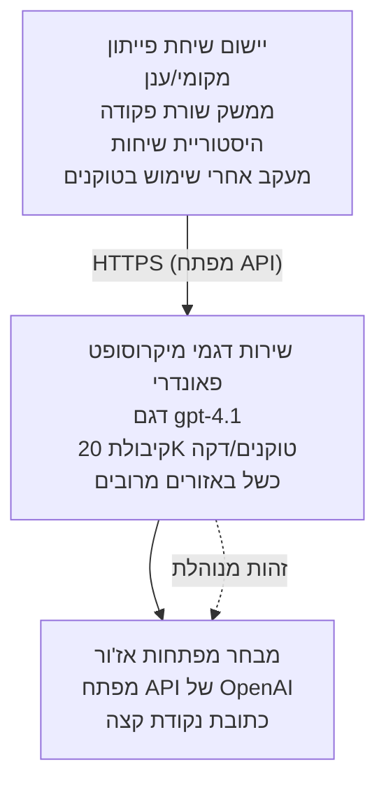

# יישום צ'אט עם Microsoft Foundry Models

**מסלול למידה:** בינוני ⭐⭐ | **זמן:** 35-45 דקות | **עלות:** 50-200 דולר לחודש

יישום צ'אט שלם של Microsoft Foundry Models המופעל בעזרת Azure Developer CLI (azd). דוגמה זו מדגימה פריסה של gpt-4.1, גישה מאובטחת ל-API, וממשק צ'אט פשוט.

## 🎯 מה תלמדו

- לפרוס שירות Microsoft Foundry Models עם דגם gpt-4.1
- לאבטח מפתחות API בעזרת Key Vault
- לבנות ממשק צ'אט פשוט עם Python
- לנטר שימוש בטוקנים ועלויות
- ליישם הגבלת קצב וטיפול בשגיאות

## 📦 מה כלול

✅ **שירות Microsoft Foundry Models** - פריסת דגם gpt-4.1  
✅ **יישום צ'אט בפייתון** - ממשק שורת פקודה פשוט  
✅ **אינטגרציה עם Key Vault** - אחסון מאובטח למפתחות API  
✅ **תבניות ARM** - תשתית כקוד מלאה  
✅ **מעקב עלויות** - מעקב אחרי שימוש בטוקנים  
✅ **הגבלת קצב** - מניעת חריגת מכסה  

## ארכיטקטורה



## דרישות מוקדמות

### דרוש

- **Azure Developer CLI (azd)** - [מדריך התקנה](https://learn.microsoft.com/azure/developer/azure-developer-cli/install-azd)
- **מנוי Azure** עם גישה ל-OpenAI - [בקש גישה](https://aka.ms/oai/access)
- **Python 3.9+** - [התקנת Python](https://www.python.org/downloads/)

### אמת דרישות מוקדמות

```bash
# בדוק גרסת azd (נדרש 1.5.0 או גבוה יותר)
azd version

# אמת כניסה ל-Azure
azd auth login

# בדוק גרסת פייתון
python --version  # או python3 --version

# אמת גישה ל-OpenAI (בדוק בפורטל Azure)
az cognitiveservices account list-skus \
  --kind OpenAI \
  --location eastus
```

> **⚠️ חשוב:** Microsoft Foundry Models דורש אישור יישום. אם לא הגשת בקשה, בקר ב-[aka.ms/oai/access](https://aka.ms/oai/access). האישור לוקח בדרך כלל 1-2 ימי עסקים.

## ⏱️ לוח זמנים לפריסה

| שלב | משך | מה קורה |
|-------|----------|--------------|
| בדיקת דרישות מוקדמות | 2-3 דקות | אימות זמינות מכסת OpenAI |
| פריסת תשתית | 8-12 דקות | יצירת OpenAI, Key Vault, פריסת דגם |
| הגדרת היישום | 2-3 דקות | הגדרת סביבה ותלויות |
| **סה"כ** | **12-18 דקות** | מוכן לצ'אט עם gpt-4.1 |

**הערה:** פריסה ראשונית של OpenAI עשויה לקחת יותר זמן בשל הנפקת דגם.

## התחלה מהירה

```bash
# נווט לדוגמה
cd examples/azure-openai-chat

# אתחל סביבה
azd env new myopenai

# פרוס הכל (תשתית + תצורה)
azd up
# יידרש ממך:
# 1. בחר מנוי Azure
# 2. בחר מיקום עם זמינות OpenAI (למשל, eastus, eastus2, westus)
# 3. המתן 12-18 דקות לפריסה

# התקן תלות בפייתון
pip install -r requirements.txt

# התחל לשוחח!
python chat.py
```

**פלט צפוי:**
```
🤖 Microsoft Foundry Models Chat Application
Connected to: gpt-4.1 (eastus)
Type your message (or 'quit' to exit)

You: Hello! Tell me about Microsoft Foundry Models.
Assistant: Microsoft Foundry Models Service provides REST API access to OpenAI's powerful language models including gpt-4.1, GPT-3.5-Turbo, and Embeddings...

[Tokens used: 145 | Estimated cost: $0.0044]
```

## ✅ אמת פריסה

### שלב 1: בדוק משאבי Azure

```bash
# הצג משאבים שהופעלו
azd show

# הפלט הצפוי מציג:
# - שירות OpenAI: (שם המשאב)
# - כספת מפתחות: (שם המשאב)
# - פריסה: gpt-4.1
# - מיקום: eastus (או האזור שבחרת)
```

### שלב 2: בדיקת API של OpenAI

```bash
# קבל נקודת גישה ומפתח של OpenAI
OPENAI_ENDPOINT=$(azd env get-value AZURE_OPENAI_ENDPOINT)
OPENAI_KEY=$(azd env get-value AZURE_OPENAI_API_KEY)

# בדיקת קריאת API
curl "$OPENAI_ENDPOINT/openai/deployments/gpt-4.1/chat/completions?api-version=2024-08-01-preview" \
  -H "Content-Type: application/json" \
  -H "api-key: $OPENAI_KEY" \
  -d '{
    "messages": [{"role": "user", "content": "Say hello!"}],
    "max_tokens": 50
  }'
```

**תגובה צפויה:**
```json
{
  "choices": [
    {
      "message": {
        "role": "assistant",
        "content": "Hello! How can I assist you today?"
      }
    }
  ],
  "usage": {
    "prompt_tokens": 8,
    "completion_tokens": 9,
    "total_tokens": 17
  }
}
```

### שלב 3: אמת גישה ל-Key Vault

```bash
# רשום סודות במאגר מפתחות
KV_NAME=$(azd env get-value AZURE_KEY_VAULT_NAME)

az keyvault secret list \
  --vault-name $KV_NAME \
  --query "[].name" \
  --output table
```

**סודות צפויים:**
- `openai-api-key`
- `openai-endpoint`

**קריטריוני הצלחה:**
- ✅ שירות OpenAI פרוס עם gpt-4.1
- ✅ קריאת API מחזירה השלמה תקינה
- ✅ סודות מאוחסנים ב-Key Vault
- ✅ מעקב שימוש בטוקנים עובד

## מבנה הפרויקט

```
azure-openai-chat/
├── README.md                   ✅ This guide
├── azure.yaml                  ✅ AZD configuration
├── infra/                      ✅ Infrastructure as Code
│   ├── main.bicep             ✅ Main Bicep template
│   ├── main.parameters.json   ✅ Parameters
│   └── openai.bicep           ✅ OpenAI resource definition
├── src/                        ✅ Application code
│   ├── chat.py                ✅ Chat interface
│   ├── config.py              ✅ Configuration loader
│   └── requirements.txt       ✅ Python dependencies
└── .gitignore                  ✅ Git ignore rules
```

## תכונות היישום

### ממשק צ'אט (`chat.py`)

אפליקציית הצ'אט כוללת:

- **היסטוריית שיחה** - שומרת על ההקשר בין ההודעות
- **מניית טוקנים** - עוקבת אחרי שימוש ומעריכה עלויות
- **טיפול בשגיאות** - טיפול עדין במגבלות קצב ושגיאות API
- **הערכת עלויות** - חישוב עלות בזמן אמת לכל הודעה
- **תמיכה בזרימה** - תגובות בזרימה אופציונליות

### פקודות

בעת הצ'אט ניתן להשתמש ב:
- `quit` או `exit` - סיום הסשן
- `clear` - ניקוי היסטוריית שיחה
- `tokens` - הצגת סך כל הטוקנים שהשתמשו
- `cost` - הצגת עלות משוערת כוללת

### קונפיגורציה (`config.py`)

טוען קונפיגורציה ממשתני סביבה:
```python
AZURE_OPENAI_ENDPOINT  # מ- Key Vault
AZURE_OPENAI_API_KEY   # מ- Key Vault
AZURE_OPENAI_MODEL     # ברירת מחדל: gpt-4.1
AZURE_OPENAI_MAX_TOKENS # ברירת מחדל: 800
```

## דוגמאות שימוש

### צ'אט בסיסי

```bash
python chat.py
```

### צ'אט עם דגם מותאם

```bash
export AZURE_OPENAI_MODEL=gpt-35-turbo
python chat.py
```

### צ'אט עם זרימה

```bash
python chat.py --stream
```

### שיחת דוגמה

```
You: Explain Microsoft Foundry Models Service in 3 sentences.
Assistant: Microsoft Foundry Models Service is Microsoft Azure's cloud platform offering 
that provides access to OpenAI's powerful language models. It enables developers 
to integrate capabilities like gpt-4.1 into their applications with enterprise-grade 
security and compliance. The service includes features for content filtering, 
abuse monitoring, and responsible AI practices.

[Tokens used: 89 | Estimated cost: $0.0027]

You: What models are available?
Assistant: Microsoft Foundry Models Service offers several model families including gpt-4.1 
(most capable), GPT-3.5-Turbo (faster and cost-effective), and Embeddings models 
for vector search. Each model has different capabilities, pricing, and token limits.

[Tokens used: 67 | Estimated cost: $0.0020]

Total session: 156 tokens | $0.0047
```

## ניהול עלויות

### תמחור טוקנים (gpt-4.1)

| דגם | קלט (לכל 1,000 טוקנים) | פלט (לכל 1,000 טוקנים) |
|-------|----------------------|------------------------|
| gpt-4.1 | $0.03 | $0.06 |
| GPT-3.5-Turbo | $0.0015 | $0.002 |

### עלויות חודשיות משוערות

בהתבסס על דפוסי שימוש:

| רמת שימוש | הודעות ליום | טוקנים ליום | עלות חודשית |
|-------------|--------------|------------|--------------|
| **קל** | 20 הודעות | 3,000 טוקנים | $3-5 |
| **בינוני** | 100 הודעות | 15,000 טוקנים | $15-25 |
| **כבד** | 500 הודעות | 75,000 טוקנים | $75-125 |

**עלות תשתית בסיסית:** $1-2 לחודש (Key Vault + מחשוב מינימלי)

### טיפים לאופטימיזציית עלויות

```bash
# 1. השתמש ב-GPT-3.5-Turbo למשימות פשוטות יותר (בחמישים מאה זול יותר)
export AZURE_OPENAI_MODEL=gpt-35-turbo

# 2. הפחת את מקסימום אסימונים לתגובות קצרות יותר
export AZURE_OPENAI_MAX_TOKENS=400

# 3. נטר את השימוש באסימונים
python chat.py --show-tokens

# 4. הגדר התראות תקציב
az consumption budget create \
  --budget-name "openai-budget" \
  --amount 50 \
  --time-grain Monthly
```

## ניטור

### צפייה בשימוש בטוקנים

```bash
# בפורטל Azure:
# משאבי OpenAI → מדדים → בחר "עסקאות טוקן"

# או דרך Azure CLI:
az monitor metrics list \
  --resource $(azd env get-value AZURE_OPENAI_RESOURCE_ID) \
  --metric "TokenTransaction" \
  --start-time $(date -u -d '1 hour ago' '+%Y-%m-%dT%H:%M:%S') \
  --interval PT1M
```

### צפייה ביומני API

```bash
# זרם יומני אבחון
az monitor diagnostic-settings create \
  --resource $(azd env get-value AZURE_OPENAI_RESOURCE_ID) \
  --name openai-logs \
  --logs '[{"category": "Audit", "enabled": true}]' \
  --workspace $(azd env get-value LOG_ANALYTICS_WORKSPACE_ID)

# שאילתת יומנים
az monitor log-analytics query \
  --workspace $(azd env get-value LOG_ANALYTICS_WORKSPACE_ID) \
  --analytics-query "AzureDiagnostics | where Category == 'Audit' | top 10 by TimeGenerated"
```

## פתרון בעיות

### בעיה: שגיאת "Access Denied"

**תסמינים:** 403 Forbidden עם קריאת API

**פתרונות:**
```bash
# 1. יש לאשר גישה ל-OpenAI
az cognitiveservices account show \
  --name $(azd env get-value AZURE_OPENAI_NAME) \
  --resource-group $(azd env get-value AZURE_RESOURCE_GROUP)

# 2. בדוק שמפתח ה-API נכון
azd env get-value AZURE_OPENAI_API_KEY

# 3. אשר את פורמט כתובת ה-URL של נקודת הקצה
azd env get-value AZURE_OPENAI_ENDPOINT
# צריך להיות: https://[name].openai.azure.com/
```

### בעיה: "חריגה ממגבלת קצב"

**תסמינים:** 429 Too Many Requests

**פתרונות:**
```bash
# 1. בדוק את המכסה הנוכחית
az cognitiveservices account deployment show \
  --name $(azd env get-value AZURE_OPENAI_NAME) \
  --resource-group $(azd env get-value AZURE_RESOURCE_GROUP) \
  --deployment-name gpt-4.1

# 2. בקש הגדלת מכסה (אם נדרש)
# עבור לפורטל Azure → משאב OpenAI → מכסות → בקש הגדלה

# 3. יישם לוגיקת ניסיון מחדש (כבר ב-chat.py)
# היישום מנסה אוטומטית שוב עם העצמה מעריכית של ההמתנה
```

### בעיה: "דגם לא נמצא"

**תסמינים:** שגיאה 404 בפריסה

**פתרונות:**
```bash
# 1. רשימת פריסות זמינות
az cognitiveservices account deployment list \
  --name $(azd env get-value AZURE_OPENAI_NAME) \
  --resource-group $(azd env get-value AZURE_RESOURCE_GROUP)

# 2. אימות שם המודל בסביבה
echo $AZURE_OPENAI_MODEL

# 3. עדכון לשם הפריסה הנכון
export AZURE_OPENAI_MODEL=gpt-4.1  # או gpt-35-turbo
```

### בעיה: השהייה גבוהה

**תסמינים:** זמני תגובה איטיים (>5 שניות)

**פתרונות:**
```bash
# 1. בדוק השהיית אזורית
# פרוס לאזור הקרוב ביותר למשתמשים

# 2. הפחת max_tokens לתגובות מהירות יותר
export AZURE_OPENAI_MAX_TOKENS=400

# 3. השתמש בזרימה לשליחת תוצרים חיה לחוויית משתמש טובה יותר
python chat.py --stream
```

## הנחיות אבטחה מומלצות

### 1. הגן על מפתחות API

```bash
# לעולם אל תעלה מפתחות לבקרת גרסאות
# השתמש ב-Key Vault (כבר מוגדר)

# סובב מפתחות בקביעות
az cognitiveservices account keys regenerate \
  --name $(azd env get-value AZURE_OPENAI_NAME) \
  --resource-group $(azd env get-value AZURE_RESOURCE_GROUP) \
  --key-name key1
```

### 2. יישום סינון תוכן

```python
# דגמי Microsoft Foundry כוללים סינון תוכן מובנה
# הגדר בפורטל Azure:
# משאב OpenAI → מסנני תוכן → יצירת מסנן מותאם אישית

# קטגוריות: שנאה, מיני, אלימות, פגיעה עצמית
# רמות: סינון נמוך, בינוני, גבוה
```

### 3. השתמש בזיהוי מנוהל (Production)

```bash
# לפריסות ייצור, השתמש בזהות מנוהלת
# במקום מפתחות API (דורש אירוח אפליקציה ב-Azure)

# עדכן את infra/openai.bicep לכלול:
# identity: { type: 'SystemAssigned' }
```

## פיתוח

### הפעל מקומית

```bash
# התקן תלותיות
pip install -r src/requirements.txt

# הגדר משתני סביבה
export AZURE_OPENAI_ENDPOINT="https://[name].openai.azure.com/"
export AZURE_OPENAI_API_KEY="your-api-key"
export AZURE_OPENAI_MODEL="gpt-4.1"

# הרץ את היישום
python src/chat.py
```

### הרץ בדיקות

```bash
# התקן תלותיות של בדיקות
pip install pytest pytest-cov

# הרץ בדיקות
pytest tests/ -v

# עם כיסוי
pytest tests/ --cov=src --cov-report=html
```

### עדכן פריסת דגם

```bash
# פרוס גרסה שונה של הדגם
az cognitiveservices account deployment create \
  --name $(azd env get-value AZURE_OPENAI_NAME) \
  --resource-group $(azd env get-value AZURE_RESOURCE_GROUP) \
  --deployment-name gpt-35-turbo \
  --model-name gpt-35-turbo \
  --model-version "0613" \
  --model-format OpenAI \
  --sku-capacity 20 \
  --sku-name "Standard"
```

## ניקוי

```bash
# מחק את כל המשאבים של Azure
azd down --force --purge

# זה מסיר:
# - שירות OpenAI
# - Key Vault (עם מחיקה רכה ל-90 יום)
# - קבוצת משאבים
# - כל הפריסות וההגדרות
```

## צעדים הבאים

### הרחב את הדוגמה הזו

1. **הוסף ממשק אינטרנט** - בנה ממשק React/Vue 
   ```bash
   # הוסף שירות פרונטאנד לקובץ azure.yaml
   # פרוס לאפליקציות ווב סטטיות של Azure
   ```

2. **יישם RAG** - הוסף חיפוש במסמכים עם Azure AI Search
   ```python
   # שלב את Azure AI Search
   # העלה מסמכים וצור אינדקס וקטורי
   ```

3. **הוסף קריאת פונקציות** - אפשר שימוש בכלים
   ```python
   # הגדר פונקציות ב-chat.py
   # אפשר ל-gpt-4.1 לקרוא ל-APIs חיצוניים
   ```

4. **תמיכה בריבוי דגמים** - פרוס דגמים מרובים
   ```bash
   # הוסף את gpt-35-turbo, מודלים של הטמעות
   # יש לממש לוגיקת ניתוב מודל
   ```

### דוגמאות קשורות

- **[Retail Multi-Agent](../retail-scenario.md)** - ארכיטקטורת ריבוי סוכנים מתקדמת  
- **[Database App](../../../../examples/database-app)** - הוסף אחסון מתמיד  
- **[Container Apps](../../../../examples/container-app)** - פרוס כשירות במכולות  

### משאבי למידה

- 📚 [קורס AZD למתחילים](../../README.md) - דף הבית של הקורס  
- 📚 [תיעוד Microsoft Foundry Models](https://learn.microsoft.com/azure/ai-services/openai/) - מסמכים רשמיים  
- 📚 [מדריך API של OpenAI](https://platform.openai.com/docs/api-reference) - פרטי API  
- 📚 [AI אחראי](https://www.microsoft.com/ai/responsible-ai) - שיטות עבודה מומלצות  

## משאבים נוספים

### תיעוד
- **[Microsoft Foundry Models Service](https://learn.microsoft.com/azure/ai-services/openai/)** - מדריך מלא  
- **[דגמי gpt-4.1](https://learn.microsoft.com/azure/ai-services/openai/concepts/models)** - יכולות דגם  
- **[סינון תוכן](https://learn.microsoft.com/azure/ai-services/openai/concepts/content-filter)** - מאפייני אבטחה  
- **[Azure Developer CLI](https://learn.microsoft.com/azure/developer/azure-developer-cli/)** - הפניות azd  

### מדריכים
- **[פתיחה מהירה OpenAI](https://learn.microsoft.com/azure/ai-services/openai/quickstart)** - פריסה ראשונית  
- **[השלמות בצ'אט](https://learn.microsoft.com/azure/ai-services/openai/how-to/chatgpt)** - בניית אפליקציות צ'אט  
- **[קריאת פונקציות](https://learn.microsoft.com/azure/ai-services/openai/how-to/function-calling)** - תכונות מתקדמות  

### כלים
- **[Microsoft Foundry Models Studio](https://oai.azure.com/)** - סביבת ניסוי מבוססת רשת  
- **[מדריך הנדסת הנחיות](https://platform.openai.com/docs/guides/prompt-engineering)** - כתיבת הנחיות טובות יותר  
- **[מחשבון טוקנים](https://platform.openai.com/tokenizer)** - הערכת שימוש בטוקנים  

### קהילה
- **[Azure AI Discord](https://discord.gg/azure)** - קבל עזרה מהקהילה  
- **[דיונים ב-GitHub](https://github.com/Azure-Samples/openai/discussions)** - פורום שאלות ותשובות  
- **[בלוג Azure](https://azure.microsoft.com/blog/tag/azure-openai-service/)** - עדכונים אחרונים  

---

**🎉 הצלחה!** פרסת Microsoft Foundry Models ובנית יישום צ'אט עובד. התחל לחקור את יכולות gpt-4.1 ונסו עם הנחיות ושימושים שונים.

**שאלות?** [פתח נושא](https://github.com/microsoft/AZD-for-beginners/issues) או עיין ב-[שאלות נפוצות](../../resources/faq.md)

**אזהרת עלויות:** זכור להריץ `azd down` בסיום הבדיקות כדי למנוע חיובים שוטפים (~50-100 דולר לחודש לשימוש פעיל).

---

<!-- CO-OP TRANSLATOR DISCLAIMER START -->
**כתב ויתור**:
מסמך זה תורגם באמצעות שירות תרגום אוטומטי [Co-op Translator](https://github.com/Azure/co-op-translator). למרות שאנו שואפים לדיוק, יש לקחת בחשבון שתרגומים אוטומטיים עלולים להכיל שגיאות או אי-דיוקים. יש להחשיב את המסמך המקורי בשפתו הטבעית כמקור הסמכות. למידע קריטי מומלץ להשתמש בתרגום מקצועי על ידי מתרגם אדם. אנו לא אחראים לכל אי-הבנה או פירוש שגוי הנובע מהשימוש בתרגום זה.
<!-- CO-OP TRANSLATOR DISCLAIMER END -->