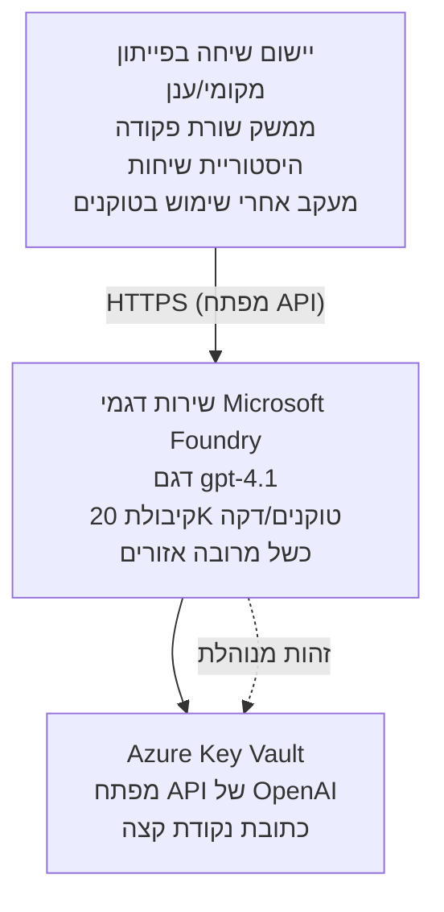

# יישום צ'אט של Microsoft Foundry Models

**מסלול למידה:** בינוני ⭐⭐ | **זמן:** 35-45 דקות | **עלות:** 50-200$ לחודש

יישום צ'אט מלא של Microsoft Foundry Models 배포 באמצעות Azure Developer CLI (azd). דוגמה זו מציגה 배포 של gpt-4.1, גישה מאובטחת ל-API וממשק צ'אט פשוט.

## 🎯 מה תלמדו

- 배포 שירות Microsoft Foundry Models עם מודל gpt-4.1  
- אבטחת מפתחות API באמצעות Key Vault  
- בניית ממשק צ'אט פשוט בפייתון  
- ניטור שימוש בטוקנים ועלויות  
- יישום הגבלת שיעורים וטיפול בשגיאות  

## 📦 מה כלול

✅ **שירות Microsoft Foundry Models** - 배포 מודל gpt-4.1  
✅ **אפליקציית צ'אט בפייתון** - ממשק צ'אט פשוט בשורת הפקודה  
✅ **אינטגרציה עם Key Vault** - אחסון מאובטח למפתחי API  
✅ **תבניות ARM** - תשתית מלאה כקוד  
✅ **ניטור עלויות** - מעקב על שימוש בטוקנים  
✅ **הגבלת שיעורים** - מניעת תשישות מכסת השימוש  

## אדריכלות


## דרישות מוקדמות

### נדרש

- **Azure Developer CLI (azd)** - [מדריך התקנה](https://learn.microsoft.com/azure/developer/azure-developer-cli/install-azd)  
- **חשבון Azure** עם גישה ל-OpenAI - [בקשת גישה](https://aka.ms/oai/access)  
- **Python 3.9+** - [התקנת Python](https://www.python.org/downloads/)  

### בדיקת דרישות מוקדמות

```bash
# בדוק את גרסת azd (נדרש 1.5.0 או גבוה יותר)
azd version

# אשר כניסה ל-Azure
azd auth login

# בדוק את גרסת Python
python --version  # או python3 --version

# אשר גישה ל-OpenAI (בדוק בפורטל Azure)
az cognitiveservices account list-skus \
  --kind OpenAI \
  --location eastus
```

> **⚠️ חשוב:** Microsoft Foundry Models דורש אישור שימוש. אם לא הגשת בקשה, בקר ב-[aka.ms/oai/access](https://aka.ms/oai/access). האישור אורך בדרך כלל 1-2 ימי עסקים.

## ⏱️ לוח זמנים לפריסה

| שלב | משך זמן | מה קורה |
|-------|----------|--------------|
| בדיקת דרישות מוקדמות | 2-3 דקות | אימות זמינות מכסת OpenAI |
| 배포 התשתית | 8-12 דקות | יצירת OpenAI, Key Vault, 배포 מודל |
| קביעת תצורה לאפליקציה | 2-3 דקות | הגדרת סביבה ותלויות |
| **סה"כ** | **12-18 דקות** | מוכנים לצ'אט עם gpt-4.1 |

**הערה:** 배포 OpenAI ראשון עלול לקחת זמן רב יותר עקב חלוקת משאבים למודל.

## התחלה מהירה

```bash
# נווט לדוגמה
cd examples/azure-openai-chat

# אתחל סביבה
azd env new myopenai

# פרוס הכל (תשתית + קונפיגורציה)
azd up
# תתבקש לעשות את הדברים הבאים:
# 1. בחר מנוי Azure
# 2. בחר מיקום עם זמינות OpenAI (כגון eastus, eastus2, westus)
# 3. המתן 12-18 דקות לפריסה

# התקן את התלויות של Python
pip install -r requirements.txt

# התחל לשוחח!
python chat.py
```

**פלט צפוי:**
```
🤖 Microsoft Foundry Models Chat Application
Connected to: gpt-4.1 (eastus)
Type your message (or 'quit' to exit)

You: Hello! Tell me about Microsoft Foundry Models.
Assistant: Microsoft Foundry Models Service provides REST API access to OpenAI's powerful language models including gpt-4.1, GPT-3.5-Turbo, and Embeddings...

[Tokens used: 145 | Estimated cost: $0.0044]
```

## ✅ אימות 배포

### שלב 1: בדיקת משאבים ב-Azure

```bash
# הצג משאבים שפורסמו
azd show

# הפלט הצפוי מציג:
# - שירות OpenAI: (שם המשאב)
# - Key Vault: (שם המשאב)
# - פריסה: gpt-4.1
# - מיקום: eastus (או האזור שבחרת)
```

### שלב 2: בדיקת API OpenAI

```bash
# לקבל נקודת קצה ומפתח של OpenAI
OPENAI_ENDPOINT=$(azd env get-value AZURE_OPENAI_ENDPOINT)
OPENAI_KEY=$(azd env get-value AZURE_OPENAI_API_KEY)

# לבדוק קריאה ל-API
curl "$OPENAI_ENDPOINT/openai/deployments/gpt-4.1/chat/completions?api-version=2024-08-01-preview" \
  -H "Content-Type: application/json" \
  -H "api-key: $OPENAI_KEY" \
  -d '{
    "messages": [{"role": "user", "content": "Say hello!"}],
    "max_tokens": 50
  }'
```

**תגובה צפויה:**
```json
{
  "choices": [
    {
      "message": {
        "role": "assistant",
        "content": "Hello! How can I assist you today?"
      }
    }
  ],
  "usage": {
    "prompt_tokens": 8,
    "completion_tokens": 9,
    "total_tokens": 17
  }
}
```

### שלב 3: אימות גישה ל-Key Vault

```bash
# רשום סודות במאגר מפתחות
KV_NAME=$(azd env get-value AZURE_KEY_VAULT_NAME)

az keyvault secret list \
  --vault-name $KV_NAME \
  --query "[].name" \
  --output table
```

**סודות צפויים:**
- `openai-api-key`  
- `openai-endpoint`  

**קריטריוני הצלחה:**
- ✅ שירות OpenAI 배포 עם gpt-4.1  
- ✅ קריאת API מחזירה השכלה תקינה  
- ✅ סודות מאוחסנים ב-Key Vault  
- ✅ ניטור שימוש בטוקנים תקין  

## מבנה הפרויקט

```
azure-openai-chat/
├── README.md                   ✅ This guide
├── azure.yaml                  ✅ AZD configuration
├── infra/                      ✅ Infrastructure as Code
│   ├── main.bicep             ✅ Main Bicep template
│   ├── main.parameters.json   ✅ Parameters
│   └── openai.bicep           ✅ OpenAI resource definition
├── src/                        ✅ Application code
│   ├── chat.py                ✅ Chat interface
│   ├── config.py              ✅ Configuration loader
│   └── requirements.txt       ✅ Python dependencies
└── .gitignore                  ✅ Git ignore rules
```

## תכונות האפליקציה

### ממשק צ'אט (`chat.py`)

אפליקציית הצ'אט כוללת:

- **היסטוריית שיחה** - שומרת על הקשר בין ההודעות  
- **ספירת טוקנים** - עוקבת אחרי השימוש ומעריכה עלויות  
- **ניהול שגיאות** - טיפול חלק במגבלות והודעות שגיאה של ה-API  
- **הערכות עלויות** - חישוב עלויות בזמן אמת לכל הודעה  
- **תמיכה בזרימה** - זרימת תגובות אופציונלית  

### פקודות

בעת הצ'אט אפשר להשתמש בפקודות:
- `quit` או `exit` - סיום המפגש  
- `clear` - ניקוי היסטוריית השיחה  
- `tokens` - הצגת סך השימוש בטוקנים  
- `cost` - הצגת הערכת עלות כוללת  

### קונפיגורציה (`config.py`)

טוען את התצורה ממשתני סביבה:
```python
AZURE_OPENAI_ENDPOINT  # מ-Key Vault
AZURE_OPENAI_API_KEY   # מ-Key Vault
AZURE_OPENAI_MODEL     # ברירת מחדל: gpt-4.1
AZURE_OPENAI_MAX_TOKENS # ברירת מחדל: 800
```

## דוגמאות שימוש

### צ'אט בסיסי

```bash
python chat.py
```

### צ'אט עם מודל מותאם

```bash
export AZURE_OPENAI_MODEL=gpt-35-turbo
python chat.py
```

### צ'אט עם זרימה

```bash
python chat.py --stream
```

### דוגמת שיחה

```
You: Explain Microsoft Foundry Models Service in 3 sentences.
Assistant: Microsoft Foundry Models Service is Microsoft Azure's cloud platform offering 
that provides access to OpenAI's powerful language models. It enables developers 
to integrate capabilities like gpt-4.1 into their applications with enterprise-grade 
security and compliance. The service includes features for content filtering, 
abuse monitoring, and responsible AI practices.

[Tokens used: 89 | Estimated cost: $0.0027]

You: What models are available?
Assistant: Microsoft Foundry Models Service offers several model families including gpt-4.1 
(most capable), GPT-3.5-Turbo (faster and cost-effective), and Embeddings models 
for vector search. Each model has different capabilities, pricing, and token limits.

[Tokens used: 67 | Estimated cost: $0.0020]

Total session: 156 tokens | $0.0047
```

## ניהול עלויות

### תמחור טוקנים (gpt-4.1)

| מודל | קלט (לכל 1K טוקנים) | פלט (לכל 1K טוקנים) |
|-------|----------------------|------------------------|
| gpt-4.1 | $0.03 | $0.06 |
| GPT-3.5-Turbo | $0.0015 | $0.002 |

### עלויות חודשיות מוערכות

בהתבסס על דפוסי שימוש:

| רמת שימוש | הודעות/יום | טוקנים/יום | עלות חודשית |
|-------------|--------------|------------|--------------|
| **קל** | 20 הודעות | 3,000 טוקנים | $3-5 |
| **בינוני** | 100 הודעות | 15,000 טוקנים | $15-25 |
| **כבד** | 500 הודעות | 75,000 טוקנים | $75-125 |

**עלות תשתית בסיסית:** $1-2 לחודש (Key Vault + חישוב מינימלי)

### טיפים לאופטימיזציה של עלויות

```bash
# 1. השתמש ב-GPT-3.5-Turbo למשימות פשוטות יותר (20 פעמים זול יותר)
export AZURE_OPENAI_MODEL=gpt-35-turbo

# 2. הקטן את כרטיסי הטוקנים למענה קצר יותר
export AZURE_OPENAI_MAX_TOKENS=400

# 3. נטר שימוש בטוקנים
python chat.py --show-tokens

# 4. הגדר התראות תקציב
az consumption budget create \
  --budget-name "openai-budget" \
  --amount 50 \
  --time-grain Monthly
```

## ניטור

### הצגת שימוש בטוקנים

```bash
# בפורטל Azure:
# משאבי OpenAI → מדדים → בחר "עסקאות טוקנים"

# או דרך Azure CLI:
az monitor metrics list \
  --resource $(azd env get-value AZURE_OPENAI_RESOURCE_ID) \
  --metric "TokenTransaction" \
  --start-time $(date -u -d '1 hour ago' '+%Y-%m-%dT%H:%M:%S') \
  --interval PT1M
```

### הצגת יומני API

```bash
# זרם יומני אבחון
az monitor diagnostic-settings create \
  --resource $(azd env get-value AZURE_OPENAI_RESOURCE_ID) \
  --name openai-logs \
  --logs '[{"category": "Audit", "enabled": true}]' \
  --workspace $(azd env get-value LOG_ANALYTICS_WORKSPACE_ID)

# שאילתת יומנים
az monitor log-analytics query \
  --workspace $(azd env get-value LOG_ANALYTICS_WORKSPACE_ID) \
  --analytics-query "AzureDiagnostics | where Category == 'Audit' | top 10 by TimeGenerated"
```

## פתרון תקלות

### תקלה: "Access Denied"

**תסמינים:** שגיאת 403 Forbidden בעת קריאה ל-API

**פתרונות:**
```bash
# 1. ודא כי הגישה ל-OpenAI אושרה
az cognitiveservices account show \
  --name $(azd env get-value AZURE_OPENAI_NAME) \
  --resource-group $(azd env get-value AZURE_RESOURCE_GROUP)

# 2. בדוק שמפתח ה-API נכון
azd env get-value AZURE_OPENAI_API_KEY

# 3. אמת את פורמט כתובת ה-URL של נקודת הסיום
azd env get-value AZURE_OPENAI_ENDPOINT
# צריך להיות: https://[name].openai.azure.com/
```

### תקלה: "Rate Limit Exceeded"

**תסמינים:** שגיאת 429 מספר בקשות רב מדי

**פתרונות:**
```bash
# 1. בדוק את המכסה הנוכחית
az cognitiveservices account deployment show \
  --name $(azd env get-value AZURE_OPENAI_NAME) \
  --resource-group $(azd env get-value AZURE_RESOURCE_GROUP) \
  --deployment-name gpt-4.1

# 2. בקש הגדלת מכסה (אם יש צורך)
# עבור אל פורטל Azure → משאבי OpenAI → מכסות → בקש הגדלה

# 3. יישם לוגיקת ניסיון חוזר (כבר בקובץ chat.py)
# היישום מנסה אוטומטית שוב עם השהייה מעריכית
```

### תקלה: "Model Not Found"

**תסמינים:** שגיאת 404 עבור 배포

**פתרונות:**
```bash
# 1. רשום את הפריסות הזמינות
az cognitiveservices account deployment list \
  --name $(azd env get-value AZURE_OPENAI_NAME) \
  --resource-group $(azd env get-value AZURE_RESOURCE_GROUP)

# 2. אמת את שם המודל בסביבה
echo $AZURE_OPENAI_MODEL

# 3. עדכן לשם הפריסה הנכון
export AZURE_OPENAI_MODEL=gpt-4.1  # או gpt-35-turbo
```

### תקלה: השהיה גבוהה

**תסמינים:** זמני תגובה איטיים (>5 שניות)

**פתרונות:**
```bash
# 1. בדוק את האיחור האזורי
# פרוס לאזור הקרוב ביותר למשתמשים

# 2. הפחת את max_tokens לתגובות מהירות יותר
export AZURE_OPENAI_MAX_TOKENS=400

# 3. השתמש בזרימה לשיפור חוויית המשתמש
python chat.py --stream
```

## שיטות אבטחה מיטביות

### 1. הגנת מפתחות API

```bash
# לעולם אל תתחייב למפתחות במערכת בקרת הגרסאות
# השתמש במאגר מפתחות (כבר מוגדר)

# החלף מפתחות באופן קבוע
az cognitiveservices account keys regenerate \
  --name $(azd env get-value AZURE_OPENAI_NAME) \
  --resource-group $(azd env get-value AZURE_RESOURCE_GROUP) \
  --key-name key1
```

### 2. יישום סינון תוכן

```python
# דגמי Microsoft Foundry כוללים סינון תוכן מובנה
# קבע תצורה בפורטל Azure:
# משאב OpenAI → מסנני תוכן → צור מסנן מותאם אישית

# קטגוריות: שנאה, מיני, אלימות, פגיעה עצמית
# רמות: סינון נמוך, בינוני, גבוה
```

### 3. שימוש בזהות מנוהלת (ייצור)

```bash
# לפריסות ייצור, השתמש בזהות מנוהלת
# במקום מפתחות API (דורש אירוח אפליקציה ב-Azure)

# עדכן את infra/openai.bicep לכלול:
# identity: { type: 'SystemAssigned' }
```

## פיתוח

### הפעלה מקומית

```bash
# התקנת תלותים
pip install -r src/requirements.txt

# הגדרת משתני סביבה
export AZURE_OPENAI_ENDPOINT="https://[name].openai.azure.com/"
export AZURE_OPENAI_API_KEY="your-api-key"
export AZURE_OPENAI_MODEL="gpt-4.1"

# הרצת היישום
python src/chat.py
```

### הרצת מבחנים

```bash
# התקן תלותיות לבדיקות
pip install pytest pytest-cov

# הפעל בדיקות
pytest tests/ -v

# עם כיסוי
pytest tests/ --cov=src --cov-report=html
```

### עדכון 배포 מודל

```bash
# פרוס גרסה שונה של המודל
az cognitiveservices account deployment create \
  --name $(azd env get-value AZURE_OPENAI_NAME) \
  --resource-group $(azd env get-value AZURE_RESOURCE_GROUP) \
  --deployment-name gpt-35-turbo \
  --model-name gpt-35-turbo \
  --model-version "0613" \
  --model-format OpenAI \
  --sku-capacity 20 \
  --sku-name "Standard"
```

## ניקוי

```bash
# למחוק את כל משאבי Azure
azd down --force --purge

# זה מסיר:
# - שירות OpenAI
# - Key Vault (עם מחיקה רכה של 90 יום)
# - קבוצת משאבים
# - כל פריסות והגדרות
```

## צעדים הבאים

### הרחבת הדוגמה הזו

1. **הוספת ממשק ווב** - בניית frontend ב-React/Vue  
   ```bash
   # הוסף שירות frontend ל-azure.yaml
   # פרוס לאפליקציות ווב סטטיות של Azure
   ```

2. **יישום RAG** - הוספת חיפוש במסמכים עם Azure AI Search  
   ```python
   # אינטגרציה עם Azure Cognitive Search
   # העלאת מסמכים ויצירת אינדקס וקטורי
   ```

3. **הוספת קריאת פונקציות** - הפעלת שימוש בכלים  
   ```python
   # הגדר פונקציות בקובץ chat.py
   # אפשר ל-gpt-4.1 לקרוא ל-APIs חיצוניים
   ```

4. **תמיכה במודלים מרובים** - 배포 של מספר מודלים  
   ```bash
   # הוסף את הדגמים gpt-35-turbo ו-embeddings
   # מימש את הלוגיקה להכוונת דגמים
   ```

### דוגמאות קשורות

- **[Retail Multi-Agent](../retail-scenario.md)** - אדריכלות מרובת סוכנים מתקדמת  
- **[Database App](../../../../examples/database-app)** - הוספת אחסון קבוע  
- **[Container Apps](../../../../examples/container-app)** - 배포 כשירות מכולה  

### משאבי למידה

- 📚 [קורס AZD למתחילים](../../README.md) - העמוד הראשי של הקורס  
- 📚 [תיעוד Microsoft Foundry Models](https://learn.microsoft.com/azure/ai-services/openai/) - מסמכים רשמיים  
- 📚 [הפניה ל-API של OpenAI](https://platform.openai.com/docs/api-reference) - פרטי API  
- 📚 [אינטליגנציה מלאכותית אחראית](https://www.microsoft.com/ai/responsible-ai) - שיטות מומלצות  

## משאבים נוספים

### תיעוד
- **[שירות Microsoft Foundry Models](https://learn.microsoft.com/azure/ai-services/openai/)** - מדריך מלא  
- **[מודלים gpt-4.1](https://learn.microsoft.com/azure/ai-services/openai/concepts/models)** - יכולות מודל  
- **[סינון תוכן](https://learn.microsoft.com/azure/ai-services/openai/concepts/content-filter)** - תכונות בטיחות  
- **[Azure Developer CLI](https://learn.microsoft.com/azure/developer/azure-developer-cli/)** - הפניה ל-azd  

### מדריכים
- **[OpenAI Quickstart](https://learn.microsoft.com/azure/ai-services/openai/quickstart)** - 배포 ראשוני  
- **[צ'אט קומפלישנס](https://learn.microsoft.com/azure/ai-services/openai/how-to/chatgpt)** - בניית אפליקציות צ'אט  
- **[קריאת פונקציות](https://learn.microsoft.com/azure/ai-services/openai/how-to/function-calling)** - תכונות מתקדמות  

### כלים
- **[Microsoft Foundry Models Studio](https://oai.azure.com/)** - סביבת עבודה מבוססת ווב  
- **[מדריך להנדסת פקודות](https://platform.openai.com/docs/guides/prompt-engineering)** - כתיבת פקודות טובות יותר  
- **[מחשבון טוקנים](https://platform.openai.com/tokenizer)** - הערכת שימוש בטוקנים  

### קהילה
- **[Azure AI Discord](https://discord.gg/azure)** - תמיכה מהקהילה  
- **[דיונים ב-GitHub](https://github.com/Azure-Samples/openai/discussions)** - פורום שאלות ותשובות  
- **[בלוג Azure](https://azure.microsoft.com/blog/tag/azure-openai-service/)** - עדכונים אחרונים  

---

**🎉 הצלחה!** פרסת את Microsoft Foundry Models ובנית אפליקציית צ'אט עובדת. התחל לחקור את יכולות gpt-4.1 והתנסה בפקודות ומקרי שימוש שונים.

**שאלות?** [פתח נושא](https://github.com/microsoft/AZD-for-beginners/issues) או עיין ב-[שאלות נפוצות](../../resources/faq.md)

**התראה עלויות:** זכור להפעיל `azd down` בסיום הבדיקה כדי למנוע חיובים מתמשכים (כ-50-100$ לחודש לשימוש פעיל).

---

<!-- CO-OP TRANSLATOR DISCLAIMER START -->
**כתב ויתור**:
מסמך זה תורגם באמצעות שירות תרגום מבוסס בינה מלאכותית [Co-op Translator](https://github.com/Azure/co-op-translator). למרות שאנו שואפים לדיוק, יש לקחת בחשבון כי תרגומים אוטומטיים עלולים להכיל שגיאות או אי-דיוקים. המסמך המקורי בשפת המקור שלו צריך להיחשב למקור הסמכותי. עבור מידע קריטי, מומלץ תרגום מקצועי על ידי בני אדם. איננו אחראים לכל אי הבנה או פרשנות שגויה הנובעים משימוש בתרגום זה.
<!-- CO-OP TRANSLATOR DISCLAIMER END -->