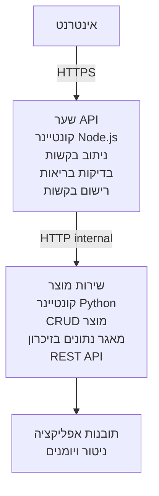

# ארכיטקטורת מיקרוסרוויסים - דוגמה ל-Container App

⏱️ **זמן משוער**: 25-35 דקות | 💰 **עלות משוערת**: ~50-100$ לחודש | ⭐ **מורכבות**: מתקדם

ארכיטקטורת מיקרוסרוויסים **מפושטת אך פונקציונלית** שמתפרסת ב-Azure Container Apps באמצעות AZD CLI. דוגמה זו מציגה תקשורת בין שירותים, תזמור קונטיינרים ומעקב עם הגדרה מעשית של שני שירותים.

> **📚 גישת הלמידה**: הדוגמה מתחילה בארכיטקטורה מינימלית של שני שירותים (API Gateway + Backend Service) שניתן לפרוס וללמוד ממנה בפועל. לאחר שתשלוט ביסודות, נספק הדרכה להרחבה למערכת מיקרוסרוויסים מלאה.

## מה תלמדו

בסיום דוגמה זו, תוכלו:
- לפרוס מספר קונטיינרים ל-Azure Container Apps
- לממש תקשורת בין שירותים עם רשת פנימית
- להגדיר קנה מידה מבוסס סביבה ובדיקות בריאות
- לנטר יישומים מבוזרים עם Application Insights
- להבין דפוסי פריסה והטבות בארכיטקטורת מיקרוסרוויסים
- ללמוד התרחבות הדרגתית מארכיטקטורה פשוטה למורכבת

## ארכיטקטורה

### שלב 1: מה אנו בונים (כלול בדוגמה זו)


**למה להתחיל בפשטות?**
- ✅ פריסה והבנה מהירה (25-35 דקות)
- ✅ ללמוד דפוסי מיקרוסרוויסים בסיסיים ללא מורכבות
- ✅ קוד עובד שניתן לשנות ולנסות
- ✅ עלות נמוכה ללמידה (~50-100$ מול 300-1400$ לחודש)
- ✅ לבנות ביטחון לפני הוספת מאגרי נתונים ותורים

**אנלוגיה**: חשבו על זה כמו ללמוד לנהוג. מתחילים בחניון ריק (שני שירותים), שולטים ביסודות, ומתקדמים לתנועה עירונית (5+ שירותים עם מאגרי נתונים).

### שלב 2: הרחבה בעתיד (ארכיטקטורה להיקף מלא)

לאחר שתשלוט בארכיטקטורה של שני השירותים, תוכל להרחיב ל:

```
Full Architecture (Not Included - For Reference)
├── API Gateway (✅ Included)
├── Product Service (✅ Included)
├── Order Service (🔜 Add next)
├── User Service (🔜 Add next)
├── Notification Service (🔜 Add last)
├── Azure Service Bus (🔜 For async communication)
├── Cosmos DB (🔜 For product persistence)
├── Azure SQL (🔜 For order management)
└── Azure Storage (🔜 For file storage)
```

עיין במדור "מדריך הרחבה" בסוף להוראות שלב-אחר-שלב.

## תכונות כלולות

✅ **גילוי שירות**: גילוי אוטומטי מבוסס DNS בין הקונטיינרים  
✅ **איזון עומסים**: איזון עומסים מובנה בין שכפולים  
✅ **קנה מידה אוטומטי**: קנה מידה עצמאי לכל שירות לפי בקשות HTTP  
✅ **מעקב בריאות**: בדיקות לייבנס ו-רדייינס לשני השירותים  
✅ **רישום מבוזר**: רישום מרכזי עם Application Insights  
✅ **רשת פנימית**: תקשורת מאובטחת בין שירותים  
✅ **תזמור קונטיינרים**: פריסה וקנה מידה אוטומטיים  
✅ **עדכונים ללא השבתה**: עדכונים מתגלגלים עם ניהול גרסאות  

## דרישות מוקדמות

### כלים נדרשים

לפני שמתחילים, ודא שהכלים הבאים מותקנים:

1. **[Azure Developer CLI (azd)](https://learn.microsoft.com/azure/developer/azure-developer-cli/install-azd)** (גרסה 1.0.0 ומעלה)
   ```bash
   azd version
   # פלט צפוי: גרסה 1.0.0 או יותר של azd
   ```

2. **[Azure CLI](https://learn.microsoft.com/cli/azure/install-azure-cli)** (גרסה 2.50.0 ומעלה)
   ```bash
   az --version
   # פלט צפוי: azure-cli 2.50.0 או גבוה יותר
   ```

3. **[Docker](https://www.docker.com/get-started)** (לפיתוח/בדיקה מקומית - אופציונלי)
   ```bash
   docker --version
   # הפלט הצפוי: Docker גרסה 20.10 או גבוהה יותר
   ```

### דרישות Azure

- מנוי **Azure פעיל** ([צור חשבון חינמי](https://azure.microsoft.com/free/))
- הרשאות ליצירת משאבים במנוי שלך
- תפקיד **Contributor** במנוי או בקבוצת משאבים

### דרישות ידע

זו דוגמה ברמת **מתקדמים**. עליך להכיר:
- השלמת [דוגמת Simple Flask API](../../../../../examples/container-app/simple-flask-api) 
- הבנה בסיסית של ארכיטקטורת מיקרוסרוויסים
- היכרות עם REST APIs ו-HTTP
- הבנה של מושגי קונטיינרים

**חדש ב-Container Apps?** התחל עם [דוגמת Simple Flask API](../../../../../examples/container-app/simple-flask-api) כדי ללמוד את הבסיס.

## התחלה מהירה (שלב אחר שלב)

### שלב 1: שיבוט וניווט

```bash
git clone https://github.com/microsoft/AZD-for-beginners.git
cd AZD-for-beginners/examples/container-app/microservices
```

**✓ בדיקת הצלחה**: ודא שאתה רואה `azure.yaml`:
```bash
ls
# צפוי: README.md, azure.yaml, infra/, src/
```

### שלב 2: אימות ב-Azure

```bash
azd auth login
```

דף זה פותח את הדפדפן שלך לאימות ב-Azure. היכנס עם אישורי ה-Azure שלך.

**✓ בדיקת הצלחה**: תראה:
```
Logged in to Azure.
```

### שלב 3: אתחול סביבה

```bash
azd init
```

**בקשות שתראה**:
- **שם סביבה**: הזן שם קצר (לדוגמה, `microservices-dev`)
- **מנוי Azure**: בחר את המנוי שלך
- **מיקום Azure**: בחר אזור (לדוגמה, `eastus`, `westeurope`)

**✓ בדיקת הצלחה**: תראה:
```
SUCCESS: New project initialized!
```

### שלב 4: פרוס תשתית ושירותים

```bash
azd up
```

**מה קורה** (לוקח 8-12 דקות):
1. יוצר סביבה ל-Container Apps
2. יוצר Application Insights למעקב
3. בונה את קונטיינר ה-API Gateway (Node.js)
4. בונה את קונטיינר שירות המוצר (Python)
5. מפרסם את שני הקונטיינרים ל-Azure
6. מגדיר רשת ובדיקות בריאות
7. מגדיר ניטור ורישום

**✓ בדיקת הצלחה**: תראה:
```
SUCCESS: Your application was deployed to Azure in X minutes Y seconds.
Endpoint: https://api-gateway-<unique-id>.azurecontainerapps.io
```

**⏱️ זמן**: 8-12 דקות

### שלב 5: בדוק את הפריסה

```bash
# קבל את נקודת הקצה של שער ה-API
GATEWAY_URL=$(azd env get-values | grep API_GATEWAY_URL | cut -d '=' -f2 | tr -d '"')

# בדוק את בריאות שער ה-API
curl $GATEWAY_URL/health

# פלט צפוי:
# {"status":"בריא","service":"שער-api","timestamp":"2025-11-19T10:30:00Z"}
```

**בדוק את שירות המוצר דרך ה-Gateway**:
```bash
# רשימת מוצרים
curl $GATEWAY_URL/api/products

# פלט צפוי:
# [
#   {"id":1,"name":"מחשב נייד","price":999.99,"stock":50},
#   {"id":2,"name":"עכבר","price":29.99,"stock":200},
#   {"id":3,"name":"מקלדת","price":79.99,"stock":150}
# ]
```

**✓ בדיקת הצלחה**: שתי הנקודות מחזירות נתוני JSON ללא שגיאות.

---

**🎉 מזל טוב!** פרסת ארכיטקטורת מיקרוסרוויסים ל-Azure!

## מבנה הפרויקט

כל קבצי המימוש כלולים—זו דוגמה שלמה ועובדת:

```
microservices/
│
├── README.md                         # This file
├── azure.yaml                        # AZD configuration
├── .gitignore                        # Git ignore patterns
│
├── infra/                           # Infrastructure as Code (Bicep)
│   ├── main.bicep                   # Main orchestration
│   ├── abbreviations.json           # Naming conventions
│   ├── core/                        # Shared infrastructure
│   │   ├── container-apps-environment.bicep  # Container environment + registry
│   │   └── monitor.bicep            # Application Insights + Log Analytics
│   └── app/                         # Service definitions
│       ├── api-gateway.bicep        # API Gateway container app
│       └── product-service.bicep    # Product Service container app
│
└── src/                             # Application source code
    ├── api-gateway/                 # Node.js API Gateway
    │   ├── app.js                   # Express server with routing
    │   ├── package.json             # Node dependencies
    │   └── Dockerfile               # Container definition
    └── product-service/             # Python Product Service
        ├── main.py                  # Flask API with product data
        ├── requirements.txt         # Python dependencies
        └── Dockerfile               # Container definition
```

**מה כל רכיב עושה:**

**תשתית (infra/)**:
- `main.bicep`: מארגן את כל משאבי Azure ותלותם
- `core/container-apps-environment.bicep`: יוצר את סביבה של Container Apps ו-Azure Container Registry
- `core/monitor.bicep`: מגדיר Application Insights לרישום מבוזר
- `app/*.bicep`: הגדרות קונטיינר אפ ייחודיות עם קנה מידה ובדיקות בריאות

**API Gateway (src/api-gateway/)**:
- שירות מול הציבור שמפנה בקשות לשירותי backend
- מיישם רישום, טיפול שגיאות והעברת בקשות
- מדגים תקשורת HTTP בין שירותים

**Product Service (src/product-service/)**:
- שירות פנימי עם קטלוג מוצרים (בזיכרון לפשטות)
- REST API עם בדיקות בריאות
- דוגמה לדפוס מיקרוסרוויס backend

## סקירת שירותים

### API Gateway (Node.js/Express)

**פורט**: 8080  
**גישה**: ציבורית (כניסה חיצונית)  
**מטרה**: מפנה בקשות נכנסות לשירותי backend מתאימים  

**נקודות קצה**:
- `GET /` - מידע על השירות
- `GET /health` - נקודת בדיקת בריאות
- `GET /api/products` - מפנה לשירות מוצר (רשימת כולם)
- `GET /api/products/:id` - מפנה לשירות מוצר (קבלת פריט לפי מזהה)

**תכונות מרכזיות**:
- ניתוב בקשות עם axios
- רישום מרכזי
- טיפול שגיאות וניהול timeout
- גילוי שירותים באמצעות משתני סביבה
- אינטגרציה עם Application Insights

**הדגשת קוד** (`src/api-gateway/app.js`):
```javascript
// תקשורת שירות פנימית
app.get('/api/products', async (req, res) => {
  const response = await axios.get(`${PRODUCT_SERVICE_URL}/products`);
  res.json(response.data);
});
```

### Product Service (Python/Flask)

**פורט**: 8000  
**גישה**: פנימית בלבד (ללא כניסה חיצונית)  
**מטרה**: מנהל קטלוג מוצרים בזיכרון  

**נקודות קצה**:
- `GET /` - מידע על השירות
- `GET /health` - נקודת בדיקת בריאות
- `GET /products` - רשום את כל המוצרים
- `GET /products/<id>` - קבל מוצר לפי מזהה

**תכונות מרכזיות**:
- RESTful API עם Flask
- מאגר מוצרים בזיכרון (פשוט, ללא צורך בבסיס נתונים)
- ניטור בריאות עם probes
- רישום מובנה
- אינטגרציה עם Application Insights

**תבנית נתונים**:
```python
{
  "id": 1,
  "name": "Laptop",
  "description": "High-performance laptop",
  "price": 999.99,
  "stock": 50
}
```

**למה פנימי בלבד?**
שירות המוצר אינו נגיש לציבור. כל הבקשות חייבות לעבור דרך API Gateway, שמספק:
- אבטחה: נקודת גישה מבוקרת
- גמישות: ניתן לשנות backend מבלי להשפיע על הלקוחות
- ניטור: רישום מרכזי לבקשות

## הבנת תקשורת השירות

### איך השירותים מתקשרים זה עם זה

בדוגמה זו, ה-API Gateway מתקשר עם שירות המוצר באמצעות **בקשות HTTP פנימיות**:

```javascript
// שער API (src/api-gateway/app.js)
const PRODUCT_SERVICE_URL = process.env.PRODUCT_SERVICE_URL;

// בצע בקשת HTTP פנימית
const response = await axios.get(`${PRODUCT_SERVICE_URL}/products`);
```

**נקודות מפתח**:

1. **גילוי מבוסס DNS**: Container Apps מספק אוטומטית DNS לשירותים פנימיים
   - FQDN של שירות מוצר: `product-service.internal.<environment>.azurecontainerapps.io`
   - מפושט ל: `http://product-service` (Container Apps פותר את זה)

2. **אין חשיפה ציבורית**: לשירות מוצר יש `external: false` בביספ
   - נגיש רק בתוך סביבת Container Apps
   - לא ניתן להגיע אליו מהאינטרנט

3. **משתני סביבה**: URL השירותים מוזרקים בזמן הפריסה
   - ביספ מעביר את ה-FQDN הפנימי ל-gateway
   - ללא כתובות קוד-קשות בקוד האפליקציה

**אנלוגיה**: תחשוב על זה כמו חדרי משרד. ה-API Gateway הוא דלפק הקבלה (פומבי), ושירות המוצר הוא חדר משרד (פנימי בלבד). מבקרים חייבים לעבור דרך הקבלה כדי להגיע לכל חדר.

## אפשרויות פריסה

### פריסה מלאה (מומלץ)

```bash
# פרוס תשתית ואת שני השירותים
azd up
```

זה מפרוס:
1. סביבה ל-Container Apps
2. Application Insights
3. רישום קונטיינרים
4. קונטיינר API Gateway
5. קונטיינר שירות מוצר

**זמן**: 8-12 דקות

### פרוס שירות בודד

```bash
# לפרוס רק שירות אחד (לאחר azd up הראשוני)
azd deploy api-gateway

# או לפרוס שירות מוצר
azd deploy product-service
```

**מקרה שימוש**: כשעדכנת קוד בשירות אחד ורוצה לפרוס רק אותו מחדש.

### עדכון הגדרה

```bash
# שנה את פרמטרי הקנה מידה
azd env set GATEWAY_MAX_REPLICAS 30

# פרוס מחדש עם תצורה חדשה
azd up
```

## הגדרות

### הגדרות קנה מידה

שני השירותים מוגדרים עם קנה מידה אוטומטי מבוסס HTTP בקבצי הביספ שלהם:

**API Gateway**:
- שכפולים מינימליים: 2 (תמיד לפחות 2 לזמינות)
- שכפולים מקסימליים: 20
- טריגר קנה מידה: 50 בקשות בו זמנית לכל שכפול

**Product Service**:
- שכפולים מינימליים: 1 (יכול להיות 0 אם צריך)
- שכפולים מקסימליים: 10
- טריגר קנה מידה: 100 בקשות בו זמנית לכל שכפול

**התאמת קנה מידה** (ב-`infra/app/*.bicep`):
```bicep
scale: {
  minReplicas: 1
  maxReplicas: 10
  rules: [
    {
      name: 'http-scale-rule'
      http: {
        metadata: {
          concurrentRequests: '100'  // Adjust this
        }
      }
    }
  ]
}
```

### הקצאת משאבים

**API Gateway**:
- CPU: 1.0 vCPU
- זיכרון: 2 גיגה בייט
- סיבה: מטפל בכל התעבורה החיצונית

**Product Service**:
- CPU: 0.5 vCPU
- זיכרון: 1 גיגה בייט
- סיבה: פעולות זיכרון קלות

### בדיקות בריאות

שני השירותים כוללים בדיקות לייבנס ו-רדייינס:

```bicep
probes: [
  {
    type: 'Liveness'
    httpGet: {
      path: '/health'
      port: 8080
    }
    initialDelaySeconds: 10
    periodSeconds: 30
  }
  {
    type: 'Readiness'
    httpGet: {
      path: '/health'
      port: 8080
    }
    initialDelaySeconds: 5
    periodSeconds: 10
  }
]
```

**מה זה אומר**:
- **לייבנס**: אם בדיקת בריאות נכשלת, Container Apps מפעיל מחדש את הקונטיינר
- **רדייינס**: אם לא מוכן, Container Apps מפסיק לנתב תנועה לשכפול זה


## ניטור ותצפית

### צפייה ביומני שירות

```bash
# הצג יומני רישום באמצעות azd monitor
azd monitor --logs

# או השתמש ב-Azure CLI עבור אפליקציות מכולה ספציפיות:
# זרם יומני רישום מ-API Gateway
az containerapp logs show --name api-gateway --resource-group $RG_NAME --follow

# הצג יומני רישום אחרונים של שירות המוצר
az containerapp logs show --name product-service --resource-group $RG_NAME --tail 100
```

**פלט צפוי**:
```
[api-gateway] API Gateway listening on port 8080
[api-gateway] Product Service URL: http://product-service
[api-gateway] GET /api/products 200 - 45ms
[product-service] Retrieved 5 products
```

### שאילתות Application Insights

גש ל-Application Insights בפורטל Azure ואז הרץ את השאילתות האלו:

**מציאת בקשות איטיות**:
```kusto
requests
| where timestamp > ago(1h)
| where duration > 1000  // Requests taking >1 second
| summarize count() by name, cloud_RoleName
| order by count_ desc
```

**מעקב שיחות בין שירותים**:
```kusto
dependencies
| where timestamp > ago(1h)
| where type == "Http"
| project timestamp, name, target, duration, success
| order by timestamp desc
```

**שיעור שגיאות לפי שירות**:
```kusto
exceptions
| where timestamp > ago(24h)
| summarize errorCount = count() by cloud_RoleName, type
| order by errorCount desc
```

**נפח בקשות לאורך זמן**:
```kusto
requests
| where timestamp > ago(1h)
| summarize requestCount = count() by bin(timestamp, 5m), cloud_RoleName
| render timechart
```

### גישת לוח בקרה לניטור

```bash
# קבל פרטי Application Insights
azd env get-values | grep APPLICATIONINSIGHTS

# פתח ניטור בפורטל Azure
az monitor app-insights component show \
  --app $(azd env get-values | grep APPLICATIONINSIGHTS_CONNECTION_STRING | cut -d '=' -f2) \
  --resource-group $(azd env get-values | grep AZURE_RESOURCE_GROUP | cut -d '=' -f2) \
  --query "appId" -o tsv
```

### מדדים חיים

1. עבור ל-Application Insights בפורטל Azure
2. לחץ על "Live Metrics"
3. ראה בקשות בזמן אמת, כישלונות וביצועים
4. בדוק בשליחת הפקודה: `curl $(azd env get-values | grep API_GATEWAY_URL | cut -d '=' -f2 | tr -d '"')/api/products`

## תרגילים מעשיים

[הערה: ראה את התרגילים המלאים למעלה במדור "תרגילים מעשיים" להוראות מפורטות שלב-אחר-שלב כולל אימות פריסה, שינוי נתונים, בדיקות קנה מידה אוטומטי, טיפול שגיאות והוספת שירות שלישי.]

## ניתוח עלויות

### עלויות חודשיות משוערות (לדוגמה של שני שירותים זו)

| משאב | תצורה | עלות משוערת |
|----------|--------------|----------------|
| API Gateway | 2-20 שכפולים, 1 vCPU, 2GB RAM | 30-150$ |
| Product Service | 1-10 שכפולים, 0.5 vCPU, 1GB RAM | 15-75$ |
| רישום קונטיינרים | שכבה בסיסית | 5$ |
| Application Insights | 1-2 GB/חודש | 5-10$ |
| Log Analytics | 1 GB/חודש | 3$ |
| **סה"כ** | | **58-243$ לחודש** |

**פירוט עלויות לפי שימוש**:
- **תעבורה קלה** (בדיקות/למידה): ~60$/חודש
- **תעבורה בינונית** (ייצור קטן): ~120$/חודש
- **תעבורה גבוהה** (תקופות עמוסות): ~240$/חודש

### טיפים לאופטימיזציה של עלויות

1. **קנה מידה לאפס לפיתוח**:
   ```bicep
   scale: {
     minReplicas: 0  // Save $30-40/month when not in use
     maxReplicas: 10
   }
   ```

2. **השתמש בתוכנית צריכה ל-Cosmos DB** (כשמוסיפים):
   - שלם רק על מה שמשתמשים בו
   - ללא חיוב מינימלי

3. **הגדר דגימה ב-Application Insights**:
   ```javascript
   appInsights.defaultClient.config.samplingPercentage = 50; // דגום 50% מהבקשות
   ```

4. **נקה משאבים כשלא צריכים**:
   ```bash
   azd down
   ```

### אפשרויות שכבה חינמית

ללמידה ובדיקה, שקול:
- השתמש בקרדיטים חינמיים של Azure (30 הימים הראשונים)  
- שמור על מינימום שכפולים  
- מחק לאחר הבדיקה (אין חיובים מתמשכים)  

---

## ניקוי

כדי להימנע מחיובים מתמשכים, מחק את כל המשאבים:

```bash
azd down --force --purge
```
  
**הנחיית אישור**:  
```
? Total resources to delete: 6, are you sure you want to continue? (y/N)
```
  
הקלד `y` כדי לאשר.  

**מה נמחק**:  
- סביבה של Container Apps  
- שני ה-Container Apps (שער & שירות המוצר)  
- רישום ה-Container  
- Application Insights  
- לוג אנליטיקס Workspace  
- קבוצת משאבים  

**✓ אמת את הניקוי**:  
```bash
az group list --query "[?starts_with(name,'rg-microservices')]" --output table
```
  
צריך להחזיר ריק.  

---

## מדריך להרחבה: מ-2 ל-5+ שירותים

לאחר שהבנת את ארכיטקטורת ה-2 שירותים, כך להרחיב:

### שלב 1: הוסף אחסון מסד נתונים (צעד הבא)

**הוסף Cosmos DB לשירות המוצר**:

1. צור `infra/core/cosmos.bicep`:  
   ```bicep
   resource cosmosAccount 'Microsoft.DocumentDB/databaseAccounts@2023-04-15' = {
     name: name
     location: location
     kind: 'GlobalDocumentDB'
     properties: {
       databaseAccountOfferType: 'Standard'
       locations: [{ locationName: location, failoverPriority: 0 }]
     }
   }
   ```
  
2. עדכן את שירות המוצר להשתמש ב-Cosmos DB במקום בזיכרון  

3. עלות משוערת נוספת: ~25$ לחודש (serverless)  

### שלב 2: הוסף שירות שלישי (ניהול הזמנות)

**צור שירות הזמנות**:

1. תיקייה חדשה: `src/order-service/` (Python/Node.js/C#)  
2. Bicep חדש: `infra/app/order-service.bicep`  
3. עדכן API Gateway לנתיב `/api/orders`  
4. הוסף מסד נתונים Azure SQL לאחסון ההזמנות  

**הארכיטקטורה הופכת ל**:  
```
API Gateway → Product Service (Cosmos DB)
           → Order Service (Azure SQL)
```
  
### שלב 3: הוסף תקשורת אסינכרונית (Service Bus)

**מימוש ארכיטקטורת אירועים**:

1. הוסף Azure Service Bus: `infra/core/servicebus.bicep`  
2. שירות המוצר מפרסם אירועים מסוג "ProductCreated"  
3. שירות ההזמנות מנוי לאירועים של המוצר  
4. הוסף שירות התראות לעיבוד האירועים  

**תבנית**: בקשה/תגובה (HTTP) + מבוסס אירועים (Service Bus)  

### שלב 4: הוסף אימות משתמש

**מימוש שירות משתמש**:

1. צור `src/user-service/` (Go/Node.js)  
2. הוסף Azure AD B2C או אימות JWT מותאם  
3. API Gateway מאמת טוקנים  
4. השירותים בודקים הרשאות משתמש  

### שלב 5: מוכנות לפרודקשן

**הוסף רכיבים אלו**:  
- Azure Front Door (איזון עומסים גלובלי)  
- Azure Key Vault (ניהול סודות)  
- Azure Monitor Workbooks (לוחות מחוונים מותאמים)  
- צינור CI/CD (GitHub Actions)  
- פריסות Blue-Green  
- זהות מנוהלת לכל השירותים  

**עלות הארכיטקטורה המלאה**: ~300-1,400$ לחודש  

---

## למידע נוסף

### תיעוד קשור  
- [תיעוד Azure Container Apps](https://learn.microsoft.com/azure/container-apps/)  
- [מדריך ארכיטקטורת מיקרו-שירותים](https://learn.microsoft.com/azure/architecture/guide/architecture-styles/microservices)  
- [Application Insights למעקב מבוזר](https://learn.microsoft.com/azure/azure-monitor/app/distributed-tracing)  
- [תיעוד Azure Developer CLI](https://learn.microsoft.com/azure/developer/azure-developer-cli/)  

### הצעדים הבאים בקורס זה  
- ← קודם: [Simple Flask API](../../../../../examples/container-app/simple-flask-api) - דוגמה פשוטה למיכל יחיד למתחילים  
- → הבא: [מדריך אינטגרציה ל-AI](../../../../../examples/docs/ai-foundry) - הוסף יכולות AI  
- 🏠 [דף הבית של הקורס](../../README.md)  

### השוואה: מתי להשתמש במה

**אפליקציית מיכל יחיד** (דוגמת Simple Flask API):  
- ✅ אפליקציות פשוטות  
- ✅ ארכיטקטורה מונוליטית  
- ✅ פריסה מהירה  
- ❌ קנה מידה מוגבל  
- **עלות**: ~15-50$ לחודש  

**מיקרו-שירותים** (בדוגמה הזו):  
- ✅ אפליקציות מורכבות  
- ✅ קנה מידה עצמאי לכל שירות  
- ✅ עצמאות צוותים (שירותים שונים, צוותים שונים)  
- ❌ ניהול מורכב יותר  
- **עלות**: ~60-250$ לחודש  

**Kubernetes (AKS)**:  
- ✅ שליטה וגמישות מקסימליים  
- ✅ ניידות בין עננים  
- ✅ רשת מתקדמת  
- ❌ דורש מומחיות Kubernetes  
- **עלות**: מינימום ~150-500$ לחודש  

**המלצה**: התחל עם Container Apps (בדוגמה הזו), עבור ל-AKS רק אם אתה זקוק לפיצ'רים ספציפיים של Kubernetes.  

---

## שאלות נפוצות

**ש: למה רק 2 שירותים ולא 5+?**  
ת: התקדמות חינוכית. שלוט ביסודות (תקשורת שירותים, ניטור, קנה מידה) עם דוגמה פשוטה לפני הוספת מורכבות. התבניות שלומדים כאן חלות על ארכיטקטורות עם מאות שירותים.  

**ש: האם אני יכול להוסיף עוד שירותים בעצמי?**  
ת: בהחלט! עקוב אחר מדריך ההרחבה למעלה. כל שירות חדש עוקב אחר אותה תבנית: צור תיקיית src, צור קובץ Bicep, עדכן azure.yaml, פרוס.  

**ש: האם זה מוכן לפרודקשן?**  
ת: זו תשתית יציבה. לפרודקשן, הוסף: זהות מנוהלת, Key Vault, מסדי נתונים מתמשכים, צינור CI/CD, התראות ניטור, ואסטרטגיית גיבוי.  

**ש: למה לא להשתמש ב-Dapr או רשת שירותים אחרת?**  
ת: שמור על פשטות ללמידה. כשאתה מבין את רשת Container Apps הטבעית, תוכל לשלב Dapr לתרחישים מתקדמים.  

**ש: איך אני מדבג מקומית?**  
ת: הפעל שירותים מקומית עם Docker:  
```bash
cd src/api-gateway
docker build -t local-gateway .
docker run -p 8080:8080 -e PRODUCT_SERVICE_URL=http://localhost:8000 local-gateway
```
  
**ש: האם אני יכול להשתמש בשפות תכנות שונות?**  
ת: כן! הדוגמה מציגה Node.js (שער) + Python (שירות מוצר). ניתן לשלב כל שפות שרצות במיכלים.  

**ש: מה אם אין לי קרדיטים של Azure?**  
ת: השתמש בשכבת Azure החינמית (30 הימים הראשונים עם חשבונות חדשים) או פרוס לתקופות בדיקה קצרות ומחק מיד.  

---

> **🎓 סיכום מסלול למידה**: למדת לפרוס ארכיטקטורת מיקרו-שירותים עם קנה מידה אוטומטי, רשת פנימית, ניטור מרכזי, ותבניות מוכנות לפרודקשן. בסיס זה מכין אותך למערכות מבוזרות מורכבות וארכיטקטורות מיקרו-שירותים ארגוניות.  

**📚 ניווט בקורס:**  
- ← קודם: [Simple Flask API](../../../../../examples/container-app/simple-flask-api)  
- → הבא: [דוגמת אינטגרציית מסד נתונים](../../../../../examples/database-app)  
- 🏠 [דף הבית של הקורס](../../../README.md)  
- 📖 [מדריך Best Practices ל-Container Apps](../../../docs/chapter-04-infrastructure/deployment-guide.md)

---

<!-- CO-OP TRANSLATOR DISCLAIMER START -->
**כתב ויתור**:
מסמך זה תורגם באמצעות שירות התרגום האוטומטי [Co-op Translator](https://github.com/Azure/co-op-translator). למרות שאנו שואפים לדיוק, יש לקחת בחשבון כי תרגומים אוטומטיים עלולים להכיל שגיאות או אי-דיוקים. המסמך המקורי בשפתו המקורית צריך להחשב כמקור הסמכותי. למידע קריטי מומלץ להיעזר בתרגום מקצועי על ידי אדם. אנו לא אחראים לכל אי-הבנה או פרשנות לא נכונה שנובעת מהשימוש בתרגום זה.
<!-- CO-OP TRANSLATOR DISCLAIMER END -->