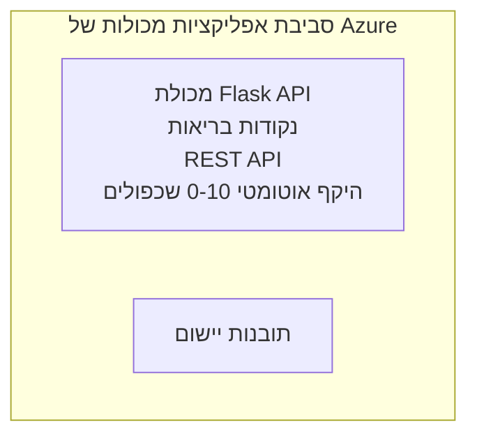

# דוגמת אפליקציית Flask פשוטה - אפליקציית קונטיינר

**מסלול לימודים:** מתחילים ⭐ | **זמן:** 25-35 דקות | **עלות:** 0-15 דולר לחודש

API REST מלא ועובד ב-Python Flask, המופעל ב-Azure Container Apps באמצעות Azure Developer CLI (azd). דוגמה זו מדגימה פריסת קונטיינר, סקיילינג אוטומטי, ועקרונות ניטור.

## 🎯 מה תלמדו

- לפרוס אפליקציית Python בקונטיינר ל-Azure  
- להגדיר סקיילינג אוטומטי עם סקייל-לתוך-אפס  
- ליישם בדיקות בריאות ומוכנות  
- לנטר לוגים ומדדים של האפליקציה  
- להשתמש ב-Azure Developer CLI לפריסה מהירה  

## 📦 מה כלול

✅ **אפליקציית Flask** - REST API מלא עם פעולות CRUD (`src/app.py`)  
✅ **Dockerfile** - קונפיגורציית קונטיינר מוכנה לפרודקשן  
✅ **תשתית Bicep** - סביבה ופריסת API לאפליקציות קונטיינרים  
✅ **קונפיגורציית AZD** - הגדרת פריסה בפקודה אחת  
✅ **בדיקות בריאות** - בדיקות ליבות ומוכנות מוגדרות  
✅ **סקיילינג אוטומטי** - 0-10 שכפולים על בסיס עומס HTTP  

## ארכיטקטורה


## דרישות מוקדמות

### דרוש
- **Azure Developer CLI (azd)** - [מדריך התקנה](https://learn.microsoft.com/azure/developer/azure-developer-cli/install-azd)  
- **מנוי Azure** - [חשבון חינם](https://azure.microsoft.com/free/)  
- **Docker Desktop** - [התקן Docker](https://www.docker.com/products/docker-desktop/) (לבדיקה מקומית)  

### אימות דרישות מוקדמות

```bash
# בדוק את גרסת azd (דורש 1.5.0 או גבוה יותר)
azd version

# אמת את ההתחברות ל-Azure
azd auth login

# בדוק את Docker (אופציונלי, לבדיקות מקומיות)
docker --version
```

## ⏱️ לוח זמנים לפריסה

| שלב            | משך          | מה קורה         |
|-----------------|--------------|-----------------|
| הקמת סביבה      | 30 שניות     | יצירת סביבה ב-azd |
| בניית קונטיינר  | 2-3 דקות     | בניית אפליקציית Flask בדוקר |
| פריסת תשתית    | 3-5 דקות     | יצירת Container Apps, רישום, ניטור |
| פריסת אפליקציה | 2-3 דקות     | דחיפת תמונה ופריסה ל-Container Apps |
| **סה"כ**        | **8-12 דקות** | אפליקציה מוכנה לפריסה |

## התחלה מהירה

```bash
# ניווט לדוגמה
cd examples/container-app/simple-flask-api

# אתחול הסביבה (בחר שם ייחודי)
azd env new myflaskapi

# פרוס הכל (תשתית + יישום)
azd up
# תתבקש לעשות את הדברים הבאים:
# 1. בחר מנוי Azure
# 2. בחר מיקום (לדוגמה, eastus2)
# 3. המתן 8-12 דקות לפריסה

# קבל את נקודת הקצה של ה-API שלך
azd env get-values

# בדוק את ה-API
curl $(azd env get-value API_ENDPOINT)/health
```
  
**תוצאה צפויה:**  
```json
{
  "status": "healthy",
  "timestamp": "2025-11-19T10:30:00Z",
  "service": "simple-flask-api",
  "version": "1.0.0"
}
```
  
## ✅ אימות הפריסה

### שלב 1: בדיקת סטטוס פריסה

```bash
# הצג שירותים שהופעלו
azd show

# הפלט המצופה מציג:
# - שירות: api
# - נקודת קצה: https://ca-api-[env].xxx.azurecontainerapps.io
# - מצב: רץ
```
  
### שלב 2: בדיקת נקודות ה-API

```bash
# קבל נקודת קצה של API
API_URL=$(azd env get-value API_ENDPOINT)

# בדוק מצב בריאות
curl $API_URL/health

# בדוק את נקודת הקצה הראשית
curl $API_URL/

# צור פריט
curl -X POST $API_URL/api/items \
  -H "Content-Type: application/json" \
  -d '{"name": "Test Item", "description": "My first item"}'

# קבל את כל הפריטים
curl $API_URL/api/items
```
  
**קריטריוני הצלחה:**  
- ✅ נקודת הבריאות מחזירה HTTP 200  
- ✅ נקודת השורש מציגה מידע על ה-API  
- ✅ POST יוצר פריט ומחזיר HTTP 201  
- ✅ GET מחזיר את הפריטים שנוצרו  

### שלב 3: צפייה בלוגים

```bash
# הצג יומני שידור חי באמצעות azd monitor
azd monitor --logs

# או השתמש ב-Azure CLI:
az containerapp logs show --name api --resource-group $RG_NAME --follow

# עליך לראות:
# - הודעות אתחול Gunicorn
# - יומני בקשות HTTP
# - יומני מידע של היישום
```
  
## מבנה הפרויקט

```
simple-flask-api/
├── azure.yaml              # AZD configuration
├── infra/
│   ├── main.bicep         # Main infrastructure
│   ├── main.parameters.json
│   └── app/
│       ├── container-env.bicep
│       └── api.bicep
└── src/
    ├── app.py             # Flask application
    ├── requirements.txt
    └── Dockerfile
```
  
## נקודות קצה של API

| נקודת קצה          | שיטה  | תיאור                     |
|--------------------|-------|---------------------------|
| `/health`          | GET   | בדיקת בריאות             |
| `/api/items`       | GET   | רשימת כל הפריטים         |
| `/api/items`       | POST  | יצירת פריט חדש           |
| `/api/items/{id}`  | GET   | קבלת פריט ספציפי         |
| `/api/items/{id}`  | PUT   | עדכון פריט               |
| `/api/items/{id}`  | DELETE| מחיקת פריט               |

## קונפיגורציה

### משתני סביבה

```bash
# הגדר תצורה מותאמת אישית
azd env set PORT 8000
azd env set LOG_LEVEL info
azd env set MAX_REPLICAS 20
```
  
### קונפיגורציית סקיילינג

ה-API מתאים את עצמו אוטומטית על בסיס תעבורת HTTP:  
- **מינימום שכפולים**: 0 (סקייל לאפס כשהוא לא בשימוש)  
- **מקסימום שכפולים**: 10  
- **בקשות מקביליות לכל שכפול**: 50  

## פיתוח

### הרצה מקומית

```bash
# התקן תלותים
cd src
pip install -r requirements.txt

# הרץ את האפליקציה
python app.py

# בדוק מקומית
curl http://localhost:8000/health
```
  
### בנייה ובדיקה של הקונטיינר

```bash
# לבנות תמונת Docker
docker build -t flask-api:local ./src

# להריץ מכולה מקומית
docker run -p 8000:8000 flask-api:local

# לבדוק מכולה
curl http://localhost:8000/health
```
  
## פריסה

### פריסה מלאה

```bash
# פריסת תשתית ויישום
azd up
```
  
### פריסה עם קוד בלבד

```bash
# פרוס רק את קוד היישום (התשתית ללא שינוי)
azd deploy api
```
  
### עדכון קונפיגורציה

```bash
# עדכן משתני סביבה
azd env set API_KEY "new-api-key"

# פרוס מחדש עם התצורה החדשה
azd deploy api
```
  
## ניטור

### צפייה בלוגים

```bash
# זרם יומנים חיים באמצעות azd monitor
azd monitor --logs

# או השתמש ב-Azure CLI עבור Container Apps:
az containerapp logs show --name api --resource-group $RG_NAME --follow

# הצג את 100 השורות האחרונות
az containerapp logs show --name api --resource-group $RG_NAME --tail 100
```
  
### ניטור מדדים

```bash
# פתח את לוח המחוונים של Azure Monitor
azd monitor --overview

# הצג מדדים ספציפיים
az monitor metrics list \
  --resource $(azd show --output json | jq -r '.services.api.resourceId') \
  --metric "Requests,ResponseTime"
```
  
## בדיקות

### בדיקת בריאות

```bash
curl $(azd show --output json | jq -r '.services.api.endpoint')/health
```
  
תגובה צפויה:  
```json
{
  "status": "healthy",
  "timestamp": "2025-11-19T10:30:00Z"
}
```
  
### יצירת פריט

```bash
curl -X POST $(azd show --output json | jq -r '.services.api.endpoint')/api/items \
  -H "Content-Type: application/json" \
  -d '{"name": "Test Item", "description": "A test item"}'
```
  
### קבלת כל הפריטים

```bash
curl $(azd show --output json | jq -r '.services.api.endpoint')/api/items
```
  
## אופטימיזציה של עלויות

פריסה זו משתמשת בסקייל-לתוך-אפס, כך שתשלמו רק כאשר ה-API מעבד בקשות:

- **עלות במצב לא פעיל**: כ-0$/חודש (סקייל לאפס)  
- **עלות במצב פעיל**: כ-0.000024$/שנייה לכל שכפול  
- **עלות חודשית משוערת** (שימוש קל): 5-15$

### הפחתת עלויות נוספת

```bash
# להפחית את מספר ההעתקים המרבי לפיתוח
azd env set MAX_REPLICAS 3

# להשתמש בזמן חיבור קצר יותר
azd env set SCALE_TO_ZERO_TIMEOUT 300  # 5 דקות
```
  
## פתרון בעיות

### הקונטיינר לא מתחיל

```bash
# בדוק יומני מכולות באמצעות Azure CLI
az containerapp logs show --name api --resource-group $RG_NAME --tail 100

# אמת בניית תמונת Docker מקומית
docker build -t test ./src
```
  
### ה-API לא זמין

```bash
# ודא שהגישה חיצונית
az containerapp show --name api --resource-group rg-simple-flask-api \
  --query properties.configuration.ingress.external
```
  
### זמני תגובה גבוהים

```bash
# בדוק שימוש במעבד/זיכרון
az monitor metrics list \
  --resource $(azd show --output json | jq -r '.services.api.resourceId') \
  --metric "CPUPercentage,MemoryPercentage"

# הגדל משאבים במידת הצורך
az containerapp update --name api --resource-group rg-simple-flask-api \
  --cpu 1.0 --memory 2Gi
```
  
## ניקוי

```bash
# מחק את כל המשאבים
azd down --force --purge
```
  
## צעדים הבאים

### הרחבת הדוגמה

1. **הוספת מסד נתונים** - שילוב Azure Cosmos DB או SQL Database  
   ```bash
   # הוסף מודול Cosmos DB ל-infra/main.bicep
   # עדכן את app.py עם חיבור למסד הנתונים
   ```
  
2. **הוספת אימות** - יישום Azure AD או מפתחות API  
   ```python
   # הוסף שכבת ביניים לאימות בקובץ app.py
   from functools import wraps
   ```
  
3. **הגדרת CI/CD** - זרימת עבודה ב-GitHub Actions  
   ```yaml
   # Create .github/workflows/deploy.yml
   name: Deploy to Azure
   on: [push]
   ```
  
4. **הוספת זהות מנוהלת** - אבטחה לגישה לשירותי Azure  
   ```bicep
   # Update infra/app/api.bicep
   identity: { type: 'SystemAssigned' }
   ```
  
### דוגמאות קשורות

- **[אפליקציית מסד נתונים](../../../../../examples/database-app)** - דוגמה מלאה עם SQL Database  
- **[מיקרוסרוויסים](../../../../../examples/container-app/microservices)** - ארכיטקטורת ריבוי שירותים  
- **[מדריך ראשי לאפליקציות קונטיינר](../README.md)** - כל תבניות הקונטיינר  

### משאבי לימוד

- 📚 [קורס AZD למתחילים](../../../README.md) - עמוד הקורס הראשי  
- 📚 [תבניות לאפליקציות קונטיינר](../README.md) - עוד תבניות פריסה  
- 📚 [גלריית תבניות AZD](https://azure.github.io/awesome-azd/) - תבניות קהילתיות  

## משאבים נוספים

### תיעוד
- **[תיעוד Flask](https://flask.palletsprojects.com/)** - מדריך לפריימוורק Flask  
- **[Azure Container Apps](https://learn.microsoft.com/azure/container-apps/)** - תיעוד רשמי של Azure  
- **[Azure Developer CLI](https://learn.microsoft.com/azure/developer/azure-developer-cli/)** - מדריך פקודות azd  

### מדריכים
- **[התחלה מהירה לאפליקציות קונטיינר](https://learn.microsoft.com/azure/container-apps/quickstart-portal)** - פריסת האפליקציה הראשונה שלך  
- **[פיתוח Python ב-Azure](https://learn.microsoft.com/azure/developer/python/)** - מדריך לפיתוח Python  
- **[שפת Bicep](https://learn.microsoft.com/azure/azure-resource-manager/bicep/)** - תשתית כקוד  

### כלים
- **[פורטל Azure](https://portal.azure.com)** - ניהול משאבים בצורה ויזואלית  
- **[סיומת VS Code ל-Azure Container Apps](https://marketplace.visualstudio.com/items?itemName=ms-azuretools.vscode-azurecontainerapps)** - אינטגרציה לסביבת הפיתוח  

---

**🎉 מזל טוב!** פרסת API Flask מוכן לפרודקשן לאפליקציות Container Apps עם סקיילינג אוטומטי וניטור.

**שאלות?** [פתח בעיה](https://github.com/microsoft/AZD-for-beginners/issues) או עיין ב-[שאלות נפוצות](../../../resources/faq.md)

---

<!-- CO-OP TRANSLATOR DISCLAIMER START -->
**כתב ויתור**:  
מסמך זה תורגם באמצעות שירות תרגום מבוסס בינה מלאכותית [Co-op Translator](https://github.com/Azure/co-op-translator). בעוד שאנו שואפים לדיוק, יש לקחת בחשבון שתרגומים אוטומטיים עשויים להכיל שגיאות או אי דיוקים. המסמך המקורי בשפתו הטבעית צריך להיחשב כמקור סמכותי. למידע קריטי מומלץ להשתמש בתרגום מקצועי ועיוני. אנו לא נושאים באחריות לכל אי הבנה או טעויות בפרשנות הנובעות משימוש בתרגום זה.
<!-- CO-OP TRANSLATOR DISCLAIMER END -->