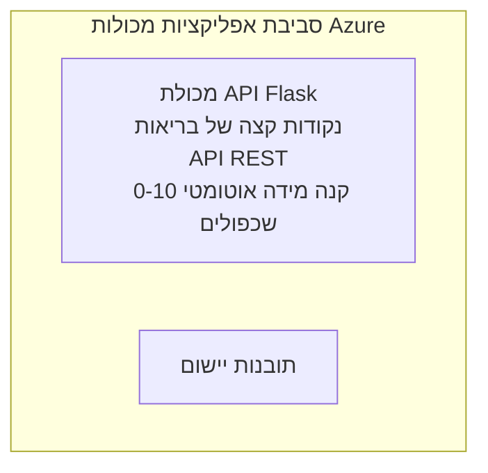

# דוגמה לפלסק API פשוט - אפליקציית מכולה

**מסלול למידה:** מתחילים ⭐ | **זמן:** 25-35 דקות | **עלות:** 0-15$/חודש

API ב-Python Flask מלא ועובד פרוס על Azure Container Apps באמצעות Azure Developer CLI (azd). דוגמה זו מראה פריסת מכולות, קנה מידה אוטומטי, ויסודות ניטור.

## 🎯 מה תלמדו

- לפרוס אפליקציית Python מכולתית ב-Azure  
- להגדיר קנה מידה אוטומטי עם scale-to-zero  
- לממש בדיקות בריאות ובדיקות מוכנות  
- לנטר יומני אפליקציה ומדדים  
- להשתמש ב-Azure Developer CLI לפריסה מהירה  

## 📦 כלול

✅ **אפליקציית Flask** - API REST מלא עם פעולות CRUD (`src/app.py`)  
✅ **Dockerfile** - תצורת מכולה מוכנה לפרודקשן  
✅ **תשתית Bicep** - סביבה של Container Apps ופריסת API  
✅ **תצורת AZD** - הגדרות פריסה בפקודה אחת  
✅ **בדיקות בריאות** - בדיקות לייבנס וקריאות מוגדרות  
✅ **קנה מידה אוטומטי** - 0-10 שכפולים על פי עומס HTTP  

## ארכיטקטורה



## דרישות מוקדמות

### דרוש
- **Azure Developer CLI (azd)** - [מדריך התקנה](https://learn.microsoft.com/azure/developer/azure-developer-cli/install-azd)
- **מנוי ל-Azure** - [חשבון חינם](https://azure.microsoft.com/free/)
- **Docker Desktop** - [התקנת Docker](https://www.docker.com/products/docker-desktop/) (לבדיקות מקומיות)

### אימות דרישות מוקדמות

```bash
# בדוק את גרסת azd (צריך 1.5.0 ומעלה)
azd version

# אמת את הכניסה ל-Azure
azd auth login

# בדוק את Docker (אופציונלי, לבדיקות מקומיות)
docker --version
```

## ⏱️ לוח זמנים לפריסה

| שלב | משך זמן | מה קורה |
|-------|----------|--------------||
| הגדרת סביבה | 30 שניות | יצירת סביבה באמצעות azd |
| בניית מכולה | 2-3 דקות | בניית אפליקציית Flask עם Docker |
| פריסת תשתית | 3-5 דקות | יצירת Container Apps, ריג׳יסטרי, ניטור |
| פריסת אפליקציה | 2-3 דקות | הדחת תמונה ופריסה ל-Container Apps |
| **סה"כ** | **8-12 דקות** | סיום הפריסה מוכנה לשימוש |

## התחלה מהירה

```bash
# נווט לדוגמה
cd examples/container-app/simple-flask-api

# אתחל סביבה (בחר שם ייחודי)
azd env new myflaskapi

# פרוס הכל (תשתית + יישום)
azd up
# תתבקש לעשות:
# 1. בחר מנוי Azure
# 2. בחר מיקום (למשל, eastus2)
# 3. המתן 8-12 דקות לפריסה

# קבל את נקודת הקצה של ה-API שלך
azd env get-values

# בדוק את ה-API
curl $(azd env get-value API_ENDPOINT)/health
```

**פלט צפוי:**
```json
{
  "status": "healthy",
  "timestamp": "2025-11-19T10:30:00Z",
  "service": "simple-flask-api",
  "version": "1.0.0"
}
```

## ✅ אימות פריסה

### שלב 1: בדיקת סטטוס הפריסה

```bash
# הצגת שירותים שהופעלו
azd show

# הפלט הצפוי מציג:
# - שירות: api
# - נקודת קצה: https://ca-api-[env].xxx.azurecontainerapps.io
# - מצב: פועל
```

### שלב 2: בדיקת נקודות קצה של ה-API

```bash
# קבל נקודת קצה של API
API_URL=$(azd env get-value API_ENDPOINT)

# בדוק את הבריאות
curl $API_URL/health

# בדוק את נקודת הקצה הראשית
curl $API_URL/

# צור פריט
curl -X POST $API_URL/api/items \
  -H "Content-Type: application/json" \
  -d '{"name": "Test Item", "description": "My first item"}'

# קבל את כל הפריטים
curl $API_URL/api/items
```

**קריטריוני הצלחה:**
- ✅ נקודת בריאות מחזירה HTTP 200  
- ✅ נקודת שורש מציגה מידע על ה-API  
- ✅ POST יוצר פריט ומחזיר HTTP 201  
- ✅ GET מחזיר את הפריטים שנוצרו  

### שלב 3: צפייה ביומנים

```bash
# שידור לוגים חיים באמצעות azd monitor
azd monitor --logs

# או השתמש ב-Azure CLI:
az containerapp logs show --name api --resource-group $RG_NAME --follow

# עליך לראות:
# - הודעות הפעלה של Gunicorn
# - לוגים של בקשות HTTP
# - לוגים של מידע על היישום
```

## מבנה הפרויקט

```
simple-flask-api/
├── azure.yaml              # AZD configuration
├── infra/
│   ├── main.bicep         # Main infrastructure
│   ├── main.parameters.json
│   └── app/
│       ├── container-env.bicep
│       └── api.bicep
└── src/
    ├── app.py             # Flask application
    ├── requirements.txt
    └── Dockerfile
```

## נקודות קצה של API

| נקודת קצה | שיטה | תיאור |
|----------|--------|-------------|
| `/health` | GET | בדיקת בריאות |
| `/api/items` | GET | רשימת כל הפריטים |
| `/api/items` | POST | יצירת פריט חדש |
| `/api/items/{id}` | GET | קבלת פריט מסוים |
| `/api/items/{id}` | PUT | עדכון פריט |
| `/api/items/{id}` | DELETE | מחיקת פריט |

## תצורה

### משתני סביבה

```bash
# הגדר הגדרה מותאמת אישית
azd env set PORT 8000
azd env set LOG_LEVEL info
azd env set MAX_REPLICAS 20
```

### תצורת קנה מידה

ה-API מתרחב אוטומטית על פי תעבורת HTTP:  
- **מינימום שכפולים**: 0 (מתרחב לאפס כשהוא לא בשימוש)  
- **מקסימום שכפולים**: 10  
- **בקשות מקבילות לכל שכפול**: 50  

## פיתוח

### הפעלה מקומית

```bash
# התקן תלותים
cd src
pip install -r requirements.txt

# הפעל את האפליקציה
python app.py

# בדוק מקומית
curl http://localhost:8000/health
```

### בנייה ובדיקה של המכולה

```bash
# לבנות תמונת Docker
docker build -t flask-api:local ./src

# להריץ מיכל מקומית
docker run -p 8000:8000 flask-api:local

# לבדוק מיכל
curl http://localhost:8000/health
```

## פריסה

### פריסה מלאה

```bash
# פריסת תשתיות ויישום
azd up
```

### פריסה של קוד בלבד

```bash
# לפרוס רק את קוד היישום (התשתית לא שונתה)
azd deploy api
```

### עדכון תצורה

```bash
# עדכון משתני סביבה
azd env set API_KEY "new-api-key"

# פריסה מחדש עם תצורה חדשה
azd deploy api
```

## ניטור

### צפייה ביומנים

```bash
# שידור יומנים חיים באמצעות azd monitor
azd monitor --logs

# או השתמש ב-Azure CLI עבור אפליקציות מכולה:
az containerapp logs show --name api --resource-group $RG_NAME --follow

# הצג את 100 השורות האחרונות
az containerapp logs show --name api --resource-group $RG_NAME --tail 100
```

### ניטור מדדים

```bash
# פתח את לוח המחוונים של Azure Monitor
azd monitor --overview

# הצג מדדים ספציפיים
az monitor metrics list \
  --resource $(azd show --output json | jq -r '.services.api.resourceId') \
  --metric "Requests,ResponseTime"
```

## בדיקות

### בדיקת בריאות

```bash
curl $(azd show --output json | jq -r '.services.api.endpoint')/health
```

תגובה צפויה:
```json
{
  "status": "healthy",
  "timestamp": "2025-11-19T10:30:00Z"
}
```

### יצירת פריט

```bash
curl -X POST $(azd show --output json | jq -r '.services.api.endpoint')/api/items \
  -H "Content-Type: application/json" \
  -d '{"name": "Test Item", "description": "A test item"}'
```

### קבלת כל הפריטים

```bash
curl $(azd show --output json | jq -r '.services.api.endpoint')/api/items
```

## אופטימיזציית עלויות

פריסה זו משתמשת ב-scale-to-zero, כך שאתה משלם רק כאשר ה-API מעבד בקשות:

- **עלות במצב לא פעיל**: ~0$/חודש (מתרחב לאפס)  
- **עלות פעילות**: ~0.000024$/שנייה לכל שכפול  
- **עלות חודשית צפויה** (שימוש קל): 5-15$

### הפחתת עלויות נוספות

```bash
# הקטן את מספר העותקים המרבי לסביבת פיתוח
azd env set MAX_REPLICAS 3

# השתמש בזמני המתנה קצרים יותר במצב לא פעיל
azd env set SCALE_TO_ZERO_TIMEOUT 300  # 5 דקות
```

## פתרון בעיות

### מכולה לא מתחילה לפעול

```bash
# בדוק יומני מכולות באמצעות Azure CLI
az containerapp logs show --name api --resource-group $RG_NAME --tail 100

# אמת בניית תמונות Docker מקומית
docker build -t test ./src
```

### ה-API לא נגיש

```bash
# אמת שהכניסה היא חיצונית
az containerapp show --name api --resource-group rg-simple-flask-api \
  --query properties.configuration.ingress.external
```

### זמני תגובה גבוהים

```bash
# בדוק שימוש במעבד/זיכרון
az monitor metrics list \
  --resource $(azd show --output json | jq -r '.services.api.resourceId') \
  --metric "CPUPercentage,MemoryPercentage"

# הגדל משאבים במידת הצורך
az containerapp update --name api --resource-group rg-simple-flask-api \
  --cpu 1.0 --memory 2Gi
```

## ניקוי

```bash
# למחוק את כל המשאבים
azd down --force --purge
```

## שלבים הבאים

### הרחבת דוגמה זו

1. **הוספת בסיס נתונים** - אינטגרציה עם Azure Cosmos DB או SQL Database  
   ```bash
   # הוסף מודול Cosmos DB ל infra/main.bicep
   # עדכן את app.py עם חיבור למסד הנתונים
   ```

2. **הוספת אימות** - מימוש Microsoft Entra ID או מפתחות API  
   ```python
   # הוסף שכבת ביניים לאימות ל-app.py
   from functools import wraps
   ```

3. **הקמת CI/CD** - זרימת עבודה ב-GitHub Actions  
   ```yaml
   # Create .github/workflows/deploy.yml
   name: Deploy to Azure
   on: [push]
   ```

4. **הוספת זהות מנוהלת** - אבטחת גישה לשירותי Azure  
   ```bicep
   # Update infra/app/api.bicep
   identity: { type: 'SystemAssigned' }
   ```

### דוגמאות קשורות

- **[אפליקציית בסיס נתונים](../../../../../examples/database-app)** - דוגמה מלאה עם SQL Database  
- **[מיקרוסרביסים](../../../../../examples/container-app/microservices)** - ארכיטקטורת רב-שירותים  
- **[מדריך Container Apps ראשי](../README.md)** - כל תבניות המכולות  

### משאבי למידה

- 📚 [קורס AZD למתחילים](../../../README.md) - דף הבית של הקורס  
- 📚 [תבניות Container Apps](../README.md) - דפוסי פריסה נוספים  
- 📚 [גלריית תבניות AZD](https://azure.github.io/awesome-azd/) - תבניות מהקהילה  

## משאבים נוספים

### תיעוד  
- **[תיעוד Flask](https://flask.palletsprojects.com/)** - מדריך למסגרת Flask  
- **[Azure Container Apps](https://learn.microsoft.com/azure/container-apps/)** - תיעוד רשמי של Azure  
- **[Azure Developer CLI](https://learn.microsoft.com/azure/developer/azure-developer-cli/)** - הפניות לפקודות azd  

### מדריכים  
- **[Quickstart ל-Container Apps](https://learn.microsoft.com/azure/container-apps/quickstart-portal)** - פריסת האפליקציה הראשונה שלך  
- **[Python על Azure](https://learn.microsoft.com/azure/developer/python/)** - מדריך פיתוח בפייתון  
- **[שפת Bicep](https://learn.microsoft.com/azure/azure-resource-manager/bicep/)** - תשתית כתשת תוכנה  

### כלים  
- **[פורטל Azure](https://portal.azure.com)** - ניהול משאבים באופן ויזואלי  
- **[תוסף VS Code ל-Azure](https://marketplace.visualstudio.com/items?itemName=ms-azuretools.vscode-azurecontainerapps)** - אינטגרציה בסביבת הפיתוח  

---

**🎉 כל הכבוד!** פרסתם API Flask מוכנים לפרודקשן ל-Azure Container Apps עם קנה מידה אוטומטי וניטור.

**שאלות?** [פתחו בעיה](https://github.com/microsoft/AZD-for-beginners/issues) או בדקו את ה-[שאלות נפוצות](../../../resources/faq.md)

---

<!-- CO-OP TRANSLATOR DISCLAIMER START -->
**כתב ויתור**:
מסמך זה תורגם באמצעות שירות תרגום אוטומטי [Co-op Translator](https://github.com/Azure/co-op-translator). למרות שאנו שואפים לדיוק, יש לקחת בחשבון שתרגומים אוטומטיים עלולים להכיל שגיאות או אי-דיוקים. יש להחשיב את המסמך המקורי בשפתו הטבעית כמקור הסמכות. למידע קריטי מומלץ להשתמש בתרגום מקצועי על ידי מתרגם אדם. אנו לא אחראים לכל אי-הבנה או פירוש שגוי הנובע מהשימוש בתרגום זה.
<!-- CO-OP TRANSLATOR DISCLAIMER END -->