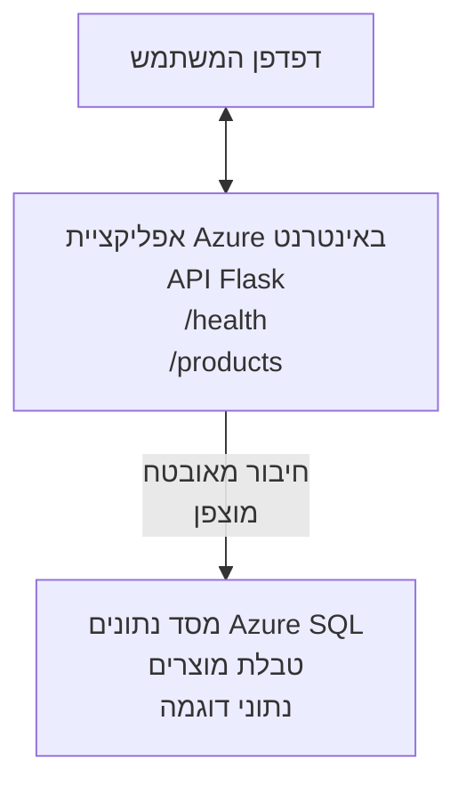

# פריסת מסד נתונים Microsoft SQL ואפליקציית ווב עם AZD

⏱️ **זמן משוער**: 20-30 דקות | 💰 **עלות משוערת**: ~15-25$ לחודש | ⭐ **מורכבות**: בינונית

דוגמה **שלמה ועובדת** זו מדגימה כיצד להשתמש ב-[Azure Developer CLI (azd)](https://learn.microsoft.com/azure/developer/azure-developer-cli/) כדי לפרוס אפליקציית ווב Python Flask עם מסד נתונים Microsoft SQL לאזור Azure. כל הקוד כלול ונבדק—אין צורך בתלותות חיצוניות.

## מה תלמדו

על ידי השלמת דוגמה זו, תלמדו:
- לפרוס אפליקציית רב-שכבות (אפליקציית ווב + מסד נתונים) באמצעות תשתית כקוד
- להגדיר חיבורי מסד נתונים מאובטחים ללא הצפנת סודות בקוד
- לנטר את בריאות האפליקציה עם Application Insights
- לנהל משאבי Azure ביעילות עם ממשק הפקודה AZD CLI
- לעקוב אחרי מיטב הפרקטיקות של Azure לאבטחה, אופטימיזציה של עלויות ותצפית

## סקירת התרחיש
- **אפליקציית ווב**: API REST בפייתון Flask עם חיבור למסד נתונים
- **מסד נתונים**: Azure SQL Database עם נתוני דוגמה
- **תשתית**: פרוס באמצעות Bicep (תבניות מודולריות וחוזרות)
- **פריסה**: אוטומטית לחלוטין עם פקודות `azd`
- **ניטור**: Application Insights ללוגים וטלמטריה

## דרישות מוקדמות

### כלים דרושים

לפני ההתחלה, ודא שהתקנת את הכלים הבאים:

1. **[Azure CLI](https://learn.microsoft.com/cli/azure/install-azure-cli)** (גרסה 2.50.0 ומעלה)
   ```sh
   az --version
   # פלט צפוי: azure-cli 2.50.0 או גרסה גבוהה יותר
   ```

2. **[Azure Developer CLI (azd)](https://learn.microsoft.com/azure/developer/azure-developer-cli/install-azd)** (גרסה 1.0.0 ומעלה)
   ```sh
   azd version
   # פלט צפוי: גרסת azd 1.0.0 או גבוהה יותר
   ```

3. **[Python 3.8+](https://www.python.org/downloads/)** (לפיתוח מקומי)
   ```sh
   python --version
   # פלט צפוי: פייתון 3.8 או גרסה בְּעֶלְיוֹן
   ```

4. **[Docker](https://www.docker.com/get-started)** (אופציונלי, לפיתוח מקומי במכולות)
   ```sh
   docker --version
   # פלט צפוי: גרסת Docker 20.10 או גבוהה יותר
   ```

### דרישות Azure

- מינוי **Azure פעיל** ([צור חשבון חינמי](https://azure.microsoft.com/free/))
- הרשאות ליצירת משאבים במינוי שלך
- תפקיד **בעלים** או **משתתף** במינוי או בקבוצת המשאבים

### דרישות ידע מוקדמות

זו דוגמה ברמת **ביניים**. מומלץ שתהיה הכרות עם:
- פעולה בסיסית בשורת הפקודה
- מושגי ענן בסיסיים (משאבים, קבוצות משאבים)
- הבנה בסיסית של אפליקציות ווב ומסדי נתונים

**חדש ב-AZD?** התחל במדריך [Getting Started](../../docs/chapter-01-foundation/azd-basics.md).

## ארכיטקטורה

בדוגמה זו נפרסת ארכיטקטורה דו-שכבתית עם אפליקציית ווב ומסד נתונים SQL:


**פריסת משאבים:**
- **קבוצת משאבים**: מכולה לכל המשאבים
- **App Service Plan**: אירוח מבוסס לינוקס (שכבת B1 לחיסכון בעלויות)
- **אפליקציית ווב**: סביבה Python 3.11 עם אפליקציית Flask
- **שרת SQL**: שרת מסד נתונים מנוהל עם TLS 1.2 לפחות
- **מסד נתונים SQL**: שכבה בסיסית (2GB, מתאים לפיתוח/בדיקות)
- **Application Insights**: ניטור ולוגים
- **מרחב עבודה לוג אנליטיקס**: אחסון לוג מרכזי

**אנלוגיה**: חשבו על זה כמו מסעדה (אפליקציית ווב) עם מקפיא גדול (מסד הנתונים). הלקוחות מזמינים מהתפריט (נקודות קצה של API), והמטבח (אפליקציית Flask) מוצא את המרכיבים (נתונים) מהמקרר. מנהל המסעדה (Application Insights) עוקב אחרי כל מה שקורה.

## מבנה התיקיות

כל הקבצים כלולים בדוגמה זו—אין תלותות חיצוניות:

```
examples/database-app/
│
├── README.md                    # This file
├── azure.yaml                   # AZD configuration file
├── .env.sample                  # Sample environment variables
├── .gitignore                   # Git ignore patterns
│
├── infra/                       # Infrastructure as Code (Bicep)
│   ├── main.bicep              # Main orchestration template
│   ├── abbreviations.json      # Azure naming conventions
│   └── resources/              # Modular resource templates
│       ├── sql-server.bicep    # SQL Server configuration
│       ├── sql-database.bicep  # Database configuration
│       ├── app-service-plan.bicep  # Hosting plan
│       ├── app-insights.bicep  # Monitoring setup
│       └── web-app.bicep       # Web application
│
└── src/
    └── web/                    # Application source code
        ├── app.py              # Flask REST API
        ├── requirements.txt    # Python dependencies
        └── Dockerfile          # Container definition
```

**תפקיד כל קובץ:**
- **azure.yaml**: מציין ל-AZD מה לפרוס והיכן
- **infra/main.bicep**: מנצח על כל משאבי Azure
- **infra/resources/*.bicep**: הגדרות משאבים פרטניות (מודולריות לשימוש חוזר)
- **src/web/app.py**: אפליקציית Flask עם לוגיקת מסד נתונים
- **requirements.txt**: תלותיות חבילות פייתון
- **Dockerfile**: הוראות קונטיינריזציה לפריסה

## התחלה מהירה (שלב אחר שלב)

### שלב 1: שיבוט וניווט

```sh
git clone https://github.com/microsoft/AZD-for-beginners.git
cd AZD-for-beginners/examples/database-app
```

**✓ בדיקת הצלחה**: ודא שאתה רואה את `azure.yaml` ותיקיית `infra/`:
```sh
ls
# צפוי: README.md, azure.yaml, infra/, src/
```

### שלב 2: התחברות לאזור Azure

```sh
azd auth login
```

זה יפתח את הדפדפן שלך לאימות Azure. היכנס עם האישורים שלך.

**✓ בדיקת הצלחה**: אתה צריך לראות:
```
Logged in to Azure.
```

### שלב 3: אתחול הסביבה

```sh
azd init
```

**מה קורה**: AZD יוצר הגדרה מקומית לפריסתך.

**הבקשות שתראה**:
- **שם סביבה**: הכנס שם קצר (למשל, `dev`, `myapp`)
- **מינוי Azure**: בחר את המינוי מהרשימה
- **מיקום Azure**: בחר אזור (למשל, `eastus`, `westeurope`)

**✓ בדיקת הצלחה**: אתה צריך לראות:
```
SUCCESS: New project initialized!
```

### שלב 4: פריסת משאבי Azure

```sh
azd provision
```

**מה קורה**: AZD מפרוס את כל התשתית (לוקח 5-8 דקות):
1. יוצר קבוצת משאבים
2. יוצר שרת SQL ומסד נתונים
3. יוצר App Service Plan
4. יוצר אפליקציית ווב
5. יוצר Application Insights
6. מגדיר רשת ואבטחה

**יבקשו ממך**:
- **שם משתמש מנהל SQL**: הכנס שם משתמש (למשל, `sqladmin`)
- **סיסמת מנהל SQL**: הכנס סיסמה חזקה (שמור אותה!)

**✓ בדיקת הצלחה**: אתה צריך לראות:
```
SUCCESS: Your application was provisioned in Azure in X minutes Y seconds.
You can view the resources created under the resource group rg-<env-name> in Azure Portal:
https://portal.azure.com/#@/resource/subscriptions/.../resourceGroups/rg-<env-name>
```

**⏱️ זמן**: 5-8 דקות

### שלב 5: פריסת האפליקציה

```sh
azd deploy
```

**מה קורה**: AZD בונה ומפרוס את אפליקציית Flask שלך:
1. מארז את אפליקציית הפייתון
2. בונה את קונטיינר הדוקר
3. דוחף ל-Azure Web App
4. מאתחל את מסד הנתונים עם נתוני דוגמה
5. מפעיל את האפליקציה

**✓ בדיקת הצלחה**: אתה צריך לראות:
```
SUCCESS: Your application was deployed to Azure in X minutes Y seconds.
You can view the resources created under the resource group rg-<env-name> in Azure Portal:
https://portal.azure.com/#@/resource/subscriptions/.../resourceGroups/rg-<env-name>
```

**⏱️ זמן**: 3-5 דקות

### שלב 6: גלישה באפליקציה

```sh
azd browse
```

פותח את אפליקציית הווב שפורסה בדפדפן בכתובת `https://app-<unique-id>.azurewebsites.net`

**✓ בדיקת הצלחה**: אתה צריך לראות פלט JSON:
```json
{
  "message": "Welcome to the Database App API",
  "endpoints": {
    "/": "This help message",
    "/health": "Health check endpoint",
    "/products": "List all products",
    "/products/<id>": "Get product by ID"
  }
}
```

### שלב 7: בדיקת נקודות הקצה של API

**בדיקת בריאות** (אימות חיבור למסד):
```sh
curl https://app-<your-id>.azurewebsites.net/health
```

**תגובה צפויה**:
```json
{
  "status": "healthy",
  "database": "connected"
}
```

**רשימת מוצרים** (נתוני דוגמה):
```sh
curl https://app-<your-id>.azurewebsites.net/products
```

**תגובה צפויה**:
```json
[
  {
    "id": 1,
    "name": "Laptop",
    "description": "High-performance laptop",
    "price": 1299.99,
    "created_at": "2025-11-19T10:30:00"
  },
  ...
]
```

**קבלת מוצר יחיד**:
```sh
curl https://app-<your-id>.azurewebsites.net/products/1
```

**✓ בדיקת הצלחה**: כל נקודות הקצה מחזירות נתוני JSON ללא שגיאות.

---

**🎉 מזל טוב!** הצלחת לפרוס אפליקציית ווב עם מסד נתונים ל-Azure באמצעות AZD.

## פרטים טכניים של ההגדרות

### משתני סביבה

סודות מנוהלים באופן מאובטח דרך תצורת Azure App Service—**אף פעם לא מוצפנים בקוד המקור**.

**מוגדר אוטומטית על ידי AZD**:
- `SQL_CONNECTION_STRING`: מחרוזת חיבור למסד הנתונים עם אישורים מוצפנים
- `APPLICATIONINSIGHTS_CONNECTION_STRING`: נקודת קצה לטרמטריה של ניטור
- `SCM_DO_BUILD_DURING_DEPLOYMENT`: מאפשר התקנת תלותות אוטומטית

**איפה הסודות מאוחסנים**:
1. במהלך `azd provision`, אתה מספק את אישורי ה-SQL דרך בקשות מאובטחות
2. AZD שומר אותם בקובץ המקומי `.azure/<env-name>/.env` (מנוטרל ב-Git)
3. AZD מזריק אותם לתצורת Azure App Service (מוצפן במנוחה)
4. האפליקציה קוראת אותם באמצעות `os.getenv()` בזמן ריצה

### פיתוח מקומי

לבדיקות מקומיות, צור קובץ `.env` מהדוגמה:

```sh
cp .env.sample .env
# ערוך את קובץ .env עם חיבור מסד הנתונים המקומי שלך
```

**זרימת עבודה לפיתוח מקומי**:
```sh
# התקן את התלויות
cd src/web
pip install -r requirements.txt

# הגדר משתני סביבה
export SQL_CONNECTION_STRING="your-local-connection-string"

# הפעל את היישום
python app.py
```

**בדיקה מקומית**:
```sh
curl http://localhost:8000/health
# צפוי: {"status": "healthy", "database": "connected"}
```

### תשתית כקוד

כל משאבי Azure מוגדרים בתבניות **Bicep** (`infra/` תיקייה):

- **עיצוב מודולרי**: לכל סוג משאב קובץ נפרד לשימוש חוזר
- **פרמטרים**: התאמת SKUs, אזורים, שמות
- **מיטב פרקטיקות**: עומד בסטנדרטים של שמות ואבטחה של Azure
- **ניהול גרסאות**: שינויים במבנה התשתית מנוהלים ב-Git

**דוגמת התאמה אישית**:
כדי לשנות את שכבת מסד הנתונים, ערוך את `infra/resources/sql-database.bicep`:
```bicep
sku: {
  name: 'Standard'  // Changed from 'Basic'
  tier: 'Standard'
  capacity: 10
}
```

## מיטב פרקטיקות אבטחה

דוגמה זו ממלאת את מיטב הפרקטיקות של אבטחת Azure:

### 1. **אין סודות בקוד המקור**
- ✅ אישורים נשמרים בתצורת Azure App Service (מוצפן)
- ✅ קבצי `.env` מנוטרלים ב-Git באמצעות `.gitignore`
- ✅ סודות מועברים בפרמטרים מאובטחים בשעת פריסת המשאבים

### 2. **חיבורים מוצפנים**
- ✅ TLS 1.2 לפחות לשרת SQL
- ✅ HTTPS בלבד לאפליקציית ווב
- ✅ חיבורי מסד נתונים באמצעות ערוצים מוצפנים

### 3. **אבטחת רשת**
- ✅ חומת אש של שרת SQL מוגדרת לקבלת שירותי Azure בלבד
- ✅ גישה ציבורית מוגבלת (ניתן לחסום יותר עם Private Endpoints)
- ✅ FTPS מבוטל באפליקציית ווב

### 4. **אימות והרשאות**
- ⚠️ **נוכחי**: אימות SQL (שם משתמש/סיסמה)
- ✅ **המלצה לייצור**: השתמש ב-Azure Managed Identity לאימות ללא סיסמה

**כדי לשדרג ל-Managed Identity** (לייצור):
1. הפעל זהות מנוהלת באפליקציית הווב
2. הענק הרשאות זהות ל-SQL
3. עדכן מחרוזת חיבור לשימוש בזהות המנוהלת
4. הסר אימות מבוסס סיסמה

### 5. **ביקורת וציות**
- ✅ Application Insights רושם את כל הבקשות והשגיאות
- ✅ ביקורת מסד SQL מופעלת (ניתן להגדיר לצרכי ציות)
- ✅ כל המשאבים מתויגים לממשל

**רשימת בדיקה לאבטחה לפני ייצור**:
- [ ] הפעל Azure Defender ל-SQL
- [ ] הגדר Private Endpoints למסד הנתונים SQL
- [ ] הפעל חומת אפליקציה ווב (WAF)
- [ ] הטמע Azure Key Vault לסיבוב סודות
- [ ] הגדר אימות Azure AD
- [ ] הפעל רישום אבחון לכל המשאבים

## אופטימיזציה של עלויות

**עלויות חודשיות משוערות** (נכון לנובמבר 2025):

| משאב | SKU/שכבה | עלות משוערת |
|----------|----------|----------------|
| App Service Plan | B1 (בסיסי) | ~13$ לחודש |
| SQL Database | בסיסי (2GB) | ~5$ לחודש |
| Application Insights | תשלום לפי שימוש | ~2$ לחודש (תעבורה נמוכה) |
| **סה"כ** | | **~20$ לחודש** |

**💡 טיפים לחיסכון בעלויות**:

1. **השתמש בשכבה חינמית ללמידה**:
   - App Service: שכבת F1 (חינמית, שעות מוגבלות)
   - SQL Database: השתמש בשרת SQL Database serverless
   - Application Insights: 5GB אינג'סטיה בחינם לחודש

2. **עצור משאבים כשאינם בשימוש**:
   ```sh
   # עצור את אפליקציית האינטרנט (המסד נתונים עדיין מחייב)
   az webapp stop --name <app-name> --resource-group <rg-name>
   
   # הפעל מחדש כשצריך
   az webapp start --name <app-name> --resource-group <rg-name>
   ```

3. **מחק הכל לאחר בדיקה**:
   ```sh
   azd down
   ```
   פעולה זו מסירה את כל המשאבים ועוצרת חיובים.

4. **שכבות לפיתוח מול ייצור**:
   - **פיתוח**: שכבה בסיסית (כמו בדוגמה זו)
   - **ייצור**: שכבה סטנדרטית/פרימיום עם רדונדנציה

**מעקב עלויות**:
- צפה בעלויות ב-[Azure Cost Management](https://portal.azure.com/#view/Microsoft_Azure_CostManagement)
- הגדר התראות עלות למניעת הפתעות
- תייג את כל המשאבים עם `azd-env-name` למעקב

**אלטרנטיבה לשכבה חינמית**:
לצרכי למידה, ניתן לשנות את `infra/resources/app-service-plan.bicep`:
```bicep
sku: {
  name: 'F1'  // Free tier
  tier: 'Free'
}
```
**הערה**: לשכבה החינמית יש מגבלות (60 דקות CPU ליום, ללא always-on).

## ניטור ותצפית

### אינטגרציה עם Application Insights

דוגמה זו כוללת **Application Insights** לניטור מקיף:

**מה מונטר**:
- ✅ בקשות HTTP (שהייה, סטטוסים, נקודות קצה)
- ✅ שגיאות וחריגות באפליקציה
- ✅ לוגים מותאמים של אפליקציית Flask
- ✅ בריאות חיבור למסד הנתונים
- ✅ מדדי ביצועים (CPU, זיכרון)

**גישה ל-Application Insights**:
1. פתח את [פורטל Azure](https://portal.azure.com)
2. נווט לקבוצת המשאבים שלך (`rg-<env-name>`)
3. לחץ על משאב Application Insights (`appi-<unique-id>`)

**שאילתות שימושיות** (Application Insights → Logs):

**צפייה בכל הבקשות**:
```kusto
requests
| where timestamp > ago(1h)
| order by timestamp desc
| project timestamp, name, url, resultCode, duration
```

**מציאת שגיאות**:
```kusto
exceptions
| where timestamp > ago(24h)
| order by timestamp desc
| project timestamp, type, outerMessage, operation_Name
```

**בדיקת נקודת בריאות**:
```kusto
requests
| where name contains "health"
| summarize count() by resultCode, bin(timestamp, 1h)
```

### ביקורת מסד נתונים SQL

**ביקורת מסד SQL מופעלת** למעקב אחר:
- דפוסי גישה למסד
- ניסיונות התחברות כושלים
- שינויים בסכימה
- גישת נתונים (לצורכי ציות)

**גישה ללוגי ביקורת**:
1. פורטל Azure → מסד נתונים SQL → ביקורת
2. הצג לוגים במרחב עבודה Log Analytics

### ניטור בזמן אמת

**צפייה במדדים חיים**:
1. Application Insights → Live Metrics
2. צפה בבקשות, כישלונות וביצועים בזמן אמת

**הגדרת התראות**:
צור התראות לאירועים קריטיים:
- שגיאות HTTP 500 מעל 5 פעמים ב-5 דקות
- כישלונות חיבור למסד הנתונים
- זמני תגובה גבוהים (>2 שניות)

**דוגמת יצירת התראה**:
```sh
az monitor metrics alert create \
  --name "High-Response-Time" \
  --resource-group <rg-name> \
  --scopes <app-insights-resource-id> \
  --condition "avg requests/duration > 2000" \
  --description "Alert when response time exceeds 2 seconds"
```

## פתרון בעיות
### בעיות נפוצות ופתרונות

#### 1. כשל ב-`azd provision` עם "Location not available"

**תסמין**:  
```
Error: The subscription is not registered for the resource type 'components' in the location 'centralus'.
```
  
**פתרון**:  
בחר אזור אחר ב-Azure או הרשום את ספק המשאבים:  
```sh
az provider register --namespace Microsoft.Insights
```
  
#### 2. כשל בחיבור SQL בזמן פריסה

**תסמין**:  
```
pyodbc.OperationalError: ('08001', '[08001] [Microsoft][ODBC Driver 18 for SQL Server]TCP Provider...')
```
  
**פתרון**:  
- ודא שחומת האש של SQL Server מאפשרת שירותי Azure (מוגדר אוטומטית)  
- בדוק שהסיסמה של מנהל ה-SQL הוזנה נכון במהלך `azd provision`  
- ודא שה-SQL Server מקבל פריסה מלאה (יכול לקחת 2-3 דקות)  

**אימות חיבור**:  
```sh
# ‏מפורט Azure, עבור אל מסד נתונים SQL → עורך שאילתות
# ‏נסה להתחבר עם האישורים שלך
```
  
#### 3. אפליקציית רשת מציגה "Application Error"

**תסמין**:  
הדפדפן מציג דף שגיאה כללי.  

**פתרון**:  
בדוק יומני האפליקציה:  
```sh
# הצג יומנים אחרונים
az webapp log tail --name <app-name> --resource-group <rg-name>
```
  
**גורמים נפוצים**:  
- חסרים משתני סביבה (בדוק ב-App Service → Configuration)  
- התקנת חבילות Python נכשלה (בדוק יומני פריסה)  
- שגיאה באתחול בסיס הנתונים (בדוק את חיבור ה-SQL)  

#### 4. כשל ב-`azd deploy` עם "Build Error"

**תסמין**:  
```
Error: Failed to build project
```
  
**פתרון**:  
- ודא שאין שגיאות תחביר ב-`requirements.txt`  
- בדוק כי Python 3.11 מוגדר ב-`infra/resources/web-app.bicep`  
- ודא ש-Dockerfile משתמש בתמונת בסיס נכונה  

**ניפוי שגיאות המקומי**:  
```sh
cd src/web
docker build -t test-app .
docker run -p 8000:8000 test-app
```
  
#### 5. "Unauthorized" בעת הרצת פקודות AZD

**תסמין**:  
```
ERROR: (Unauthorized) The client '<id>' with object id '<id>' does not have authorization
```
  
**פתרון**:  
התחבר מחדש ל-Azure:  
```sh
# נדרש עבור תזרימי עבודה של AZD
azd auth login

# אופציונלי אם אתה משתמש גם בפקודות Azure CLI ישירות
az login
```
  
ודא שיש לך הרשאות נכונות (תפקיד Contributor) במנוי.  

#### 6. עלויות גבוהות בבסיס הנתונים

**תסמין**:  
חיוב לא צפוי מ-Azure.  

**פתרון**:  
- בדוק אם שכחת להריץ `azd down` לאחר בדיקות  
- ודא ש-SQL Database משתמשת בשכבת Basic (ולא Premium)  
- בדוק עלויות בניהול העלויות של Azure  
- הגדר התראות על עלויות  

### לקבלת עזרה

**הצג את כל משתני הסביבה של AZD**:  
```sh
azd env get-values
```
  
**בדוק סטטוס פריסה**:  
```sh
az webapp show --name <app-name> --resource-group <rg-name> --query state
```
  
**גש ליומני האפליקציה**:  
```sh
az webapp log download --name <app-name> --resource-group <rg-name> --log-file app-logs.zip
```
  
**זקוק לעזרה נוספת?**  
- [מדריך פתרון בעיות AZD](../../docs/chapter-07-troubleshooting/common-issues.md)  
- [פתרון בעיות ב-Azure App Service](https://learn.microsoft.com/azure/app-service/troubleshoot-diagnostic-logs)  
- [פתרון בעיות ב-Azure SQL](https://learn.microsoft.com/azure/azure-sql/database/troubleshoot-common-errors-issues)  

## תרגילים מעשיים

### תרגיל 1: אמת את הפריסה שלך (מתחילים)

**מטרה**: לאשר שכל המשאבים פרוסים ושהאפליקציה פועלת.  

**שלבים**:  
1. רשום את כל המשאבים בקבוצת המשאבים שלך:  
   ```sh
   az resource list --resource-group rg-<env-name> --output table
   ```
   **צפוי**: 6-7 משאבים (Web App, SQL Server, SQL Database, App Service Plan, Application Insights, Log Analytics)  

2. בדוק את כל נקודות הקצה של ה-API:  
   ```sh
   curl https://app-<your-id>.azurewebsites.net/
   curl https://app-<your-id>.azurewebsites.net/health
   curl https://app-<your-id>.azurewebsites.net/products
   curl https://app-<your-id>.azurewebsites.net/products/1
   ```
   **צפוי**: כולם מחזירים JSON תקין ללא שגיאות  

3. בדוק את Application Insights:  
   - עבור ל-Application Insights בפורטל Azure  
   - עבור ל-"Live Metrics"  
   - רענן את הדפדפן באפליקציית הרשת  
   **צפוי**: תראה בקשות בזמן אמת  

**קריטריון הצלחה**: כל 6-7 המשאבים קיימים, כל נקודות הקצה מחזירות נתונים, Live Metrics מציג פעילות.  

---

### תרגיל 2: הוסף נקודת קצה חדשה ל-API (בינוני)

**מטרה**: להרחיב את אפליקציית Flask עם נקודת קצה חדשה.  

**קוד התחלתי**: נקודות הקצה הנוכחיות ב-`src/web/app.py`  

**שלבים**:  
1. ערוך את `src/web/app.py` והוסף נקודת קצה חדשה אחרי פונקציית `get_product()`:  
   ```python
   @app.route('/products/search/<keyword>')
   def search_products(keyword):
       """Search products by name or description."""
       try:
           conn = get_db_connection()
           cursor = conn.cursor()
           cursor.execute(
               "SELECT id, name, description, price, created_at FROM products WHERE name LIKE ? OR description LIKE ?",
               (f'%{keyword}%', f'%{keyword}%')
           )
           
           products = []
           for row in cursor.fetchall():
               products.append({
                   'id': row[0],
                   'name': row[1],
                   'description': row[2],
                   'price': float(row[3]) if row[3] else None,
                   'created_at': row[4].isoformat() if row[4] else None
               })
           
           cursor.close()
           conn.close()
           
           logger.info(f"Search for '{keyword}' returned {len(products)} results")
           return jsonify(products), 200
           
       except Exception as e:
           logger.error(f"Error searching products: {str(e)}")
           return jsonify({'error': str(e)}), 500
   ```
  
2. פרוס את האפליקציה המעודכנת:  
   ```sh
   azd deploy
   ```
  
3. בדוק את נקודת הקצה החדשה:  
   ```sh
   curl https://app-<your-id>.azurewebsites.net/products/search/laptop
   ```
   **צפוי**: מחזיר מוצרים התואמים ל-"laptop"  

**קריטריון הצלחה**: נקודת קצה חדשה פועלת, מחזירה תוצאות מסוננות, מופיעה ביומני Application Insights.  

---

### תרגיל 3: הוסף ניטור והתראות (מתקדם)

**מטרה**: להגדיר ניטור יזום עם התראות.  

**שלבים**:  
1. צור התראה לשגיאות HTTP 500:  
   ```sh
   # קבל מזהה משאב של Application Insights
   AI_ID=$(az monitor app-insights component show \
     --app appi-<your-id> \
     --resource-group rg-<env-name> \
     --query id -o tsv)
   
   # צור התראה
   az monitor metrics alert create \
     --name "High-Error-Rate" \
     --resource-group rg-<env-name> \
     --scopes $AI_ID \
     --condition "count requests/failed > 5" \
     --window-size 5m \
     --evaluation-frequency 1m \
     --description "Alert when >5 failed requests in 5 minutes"
   ```
  
2. הפעל את ההתראה על ידי יצירת שגיאות:  
   ```sh
   # בקשת מוצר שאינו קיים
   for i in {1..10}; do curl https://app-<your-id>.azurewebsites.net/products/999; done
   ```
  
3. בדוק אם ההתראה הופעלה:  
   - פורטל Azure → Alerts → Alert Rules  
   - בדוק את המייל שלך (אם מוגדר)  

**קריטריון הצלחה**: כלל ההתראות נוצר, מופעל בשגיאות, מתקבלות התראות.  

---

### תרגיל 4: שינויים בסכמת בסיס הנתונים (מתקדם)

**מטרה**: הוסף טבלה חדשה ושנה את האפליקציה להשתמש בה.  

**שלבים**:  
1. התחבר ל-SQL Database דרך עורך השאילתות בפורטל Azure  

2. צור טבלה חדשה `categories`:  
   ```sql
   CREATE TABLE categories (
       id INT PRIMARY KEY IDENTITY(1,1),
       name NVARCHAR(50) NOT NULL,
       description NVARCHAR(200)
   );
   
   INSERT INTO categories (name, description) VALUES
   ('Electronics', 'Electronic devices and accessories'),
   ('Office Supplies', 'Office equipment and supplies');
   
   -- Add category to products table
   ALTER TABLE products ADD category_id INT;
   UPDATE products SET category_id = 1; -- Set all to Electronics
   ```
  
3. עדכן את `src/web/app.py` לכלול מידע על קטגוריות בתגובות  

4. פרוס ובדוק  

**קריטריון הצלחה**: הטבלה החדשה קיימת, מוצרים מציגים מידע על קטגוריה, האפליקציה ממשיכה לפעול.  

---

### תרגיל 5: יישום caching (מומחה)

**מטרה**: הוסף Azure Redis Cache לשיפור ביצועים.  

**שלבים**:  
1. הוסף Redis Cache ל-`infra/main.bicep`  
2. עדכן את `src/web/app.py` לבצע caching של שאילתות מוצר  
3. מדוד שיפור ביצועים עם Application Insights  
4. השווה זמני תגובה לפני/אחרי ה-caching  

**קריטריון הצלחה**: Redis פרוס, caching עובד, זמני תגובה משתפרים ביותר מ-50%.  

**רמז**: התחל עם [תיעוד Azure Cache for Redis](https://learn.microsoft.com/azure/azure-cache-for-redis/).  

---

## ניקוי

כדי להימנע מחיובים מתמשכים, מחק את כל המשאבים בסיום:  

```sh
azd down
```
  
**בקשת אישור**:  
```
? Total resources to delete: 7, are you sure you want to continue? (y/N)
```
  
כתוב `y` כדי לאשר.  

**✓ בדיקת הצלחה**:  
- כל המשאבים נמחקו מפורטל Azure  
- אין חיובים שוטפים  
- ניתן למחוק את התיקייה המקומית `.azure/<env-name>`  

**חלופה** (השאר את התשתית, מחק נתונים):  
```sh
# מחק רק את קבוצת המשאבים (השאר את תצורת AZD)
az group delete --name rg-<env-name> --yes
```
## למידע נוסף

### תיעוד קשור
- [תיעוד Azure Developer CLI](https://learn.microsoft.com/azure/developer/azure-developer-cli/)  
- [תיעוד Azure SQL Database](https://learn.microsoft.com/azure/azure-sql/database/)  
- [תיעוד Azure App Service](https://learn.microsoft.com/azure/app-service/)  
- [תיעוד Application Insights](https://learn.microsoft.com/azure/azure-monitor/app/app-insights-overview)  
- [התייחסות לשפת Bicep](https://learn.microsoft.com/azure/azure-resource-manager/bicep/)  

### שלבים הבאים בקורס זה
- **[דוגמת Container Apps](../../../../examples/container-app)**: פריסת מיקרו-שירותים עם Azure Container Apps  
- **[מדריך שילוב AI](../../../../docs/ai-foundry)**: הוספת יכולות AI לאפליקציה  
- **[שיטות פריסה מומלצות](../../docs/chapter-04-infrastructure/deployment-guide.md)**: דפוסי פריסה בסביבת הפקה  

### נושאים מתקדמים
- **Managed Identity**: הסר סיסמאות והשתמש באימות Azure AD  
- **Private Endpoints**: אבטח חיבורי מסד נתונים בתוך רשת וירטואלית  
- **אינטגרציית CI/CD**: אוטומציה של פריסות עם GitHub Actions או Azure DevOps  
- **סביבות מרובות**: הגדר סביבה לפיתוח, בדיקה והפקה  
- **הגירת בסיסי נתונים**: השתמש ב-Alembic או Entity Framework לניהול גרסאות סכמת נתונים  

### השוואה לגישות אחרות

**AZD מול טמפלטי ARM**:  
- ✅ AZD: אבסטרקציה ברמת גבוהה, פקודות פשוטות  
- ⚠️ ARM: מפורט, שליטה דקדקנית  

**AZD מול Terraform**:  
- ✅ AZD: מובנה ב-Azure, משולב עם שירותי Azure  
- ⚠️ Terraform: תמיכה בריבוי עננים, אקו-סיסטם גדול  

**AZD מול פורטל Azure**:  
- ✅ AZD: חוזר על עצמו, מנוהל בגרסאות, ניתן לאוטומציה  
- ⚠️ פורטל: לחיצות ידניות, קשה לשחזור  

**תחשוב על AZD כעל**: Docker Compose עבור Azure — תצורה פשוטה לפריסות מורכבות.  

---

## שאלות נפוצות

**ש: האם אפשר להשתמש בשפה תכנותית אחרת?**  
ת: כן! החלף את `src/web/` ל-Node.js, C#, Go או כל שפה אחרת. עדכן את `azure.yaml` ואת הקבצים ב-Bicep בהתאם.  

**ש: איך מוסיפים עוד מסדי נתונים?**  
ת: הוסף מודול SQL Database נוסף ב-`infra/main.bicep` או השתמש בשירותי PostgreSQL/MySQL של Azure.  

**ש: האם אפשר להשתמש בזה בפרודקשן?**  
ת: זהו נקודת התחלה. לפרודקשן יש להוסיף: managed identity, private endpoints, רדונדנס, אסטרטגיית גיבוי, WAF וניטור מתקדם.  

**ש: מה אם אני רוצה להשתמש במכולות (containers) במקום פריסת קוד?**  
ת: עיין ב-[דוגמת Container Apps](../../../../examples/container-app), המשתמשת במכולות Docker לאורך כל הדרך.  

**ש: איך מתחברים למסד הנתונים מהמחשב המקומי?**  
ת: הוסף את כתובת ה-IP שלך לחומת האש של SQL Server:  
```sh
az sql server firewall-rule create \
  --resource-group rg-<env-name> \
  --server sql-<unique-id> \
  --name AllowMyIP \
  --start-ip-address <your-ip> \
  --end-ip-address <your-ip>
```
  
**ש: האם אפשר להשתמש במסד נתונים קיים במקום ליצור חדש?**  
ת: כן, שנה את `infra/main.bicep` להפנות ל-SQL Server קיים ועדכן את פרמטרי מחרוזת החיבור.  

---

> **הערה:** דוגמה זו מדגימה שיטות מומלצות לפריסת אפליקציית רשת עם בסיס נתונים בעזרת AZD. כוללת קוד עובד, תיעוד מקיף ותרגילים מעשיים לחיזוק הלמידה. לפריסות פרודקשן יש לבדוק אבטחה, קנה מידה, ציות ודרישות עלות לפי ארגונך.  

**📚 ניווט בקורס:**  
- ← קודם: [דוגמת Container Apps](../../../../examples/container-app)  
- → הבא: [מדריך שילוב AI](../../../../docs/ai-foundry)  
- 🏠 [בית הקורס](../../README.md)

---

<!-- CO-OP TRANSLATOR DISCLAIMER START -->
**כתב ויתור**:  
מסמך זה תורגם באמצעות שירות תרגום מבוסס בינה מלאכותית [Co-op Translator](https://github.com/Azure/co-op-translator). למרות שאנו שואפים לדיוק, יש לקחת בחשבון כי תרגומים אוטומטיים עלולים להכיל שגיאות או אי-דיוקים. המסמך המקורי בשפתו המקורית הוא המקור הסמכותי. למידע קריטי מומלץ להשתמש בתרגום מקצועי של אדם. איננו אחראים לכל אי הבנות או פרשנויות שגויות הנובעות משימוש בתרגום זה.
<!-- CO-OP TRANSLATOR DISCLAIMER END -->