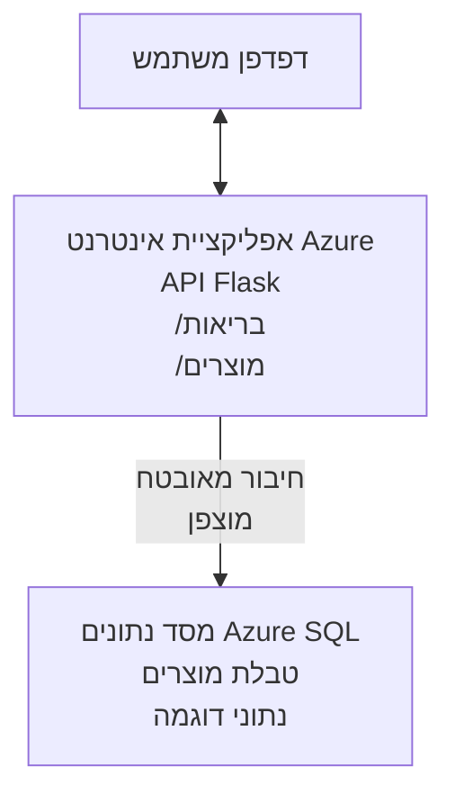

# פריסת מסד נתונים Microsoft SQL וכן אפליקציית רשת עם AZD

⏱️ **זמן משוער**: 20-30 דקות | 💰 **עלות משוערת**: ~15-25\$ לחודש | ⭐ **מורכבות**: בינוני

דוגמה **מלאה ומתפקדת** זו ממחישה כיצד להשתמש ב-[Azure Developer CLI (azd)](https://learn.microsoft.com/azure/developer/azure-developer-cli/) כדי לפרוס אפליקציית Flask בפייתון עם מסד נתונים Microsoft SQL ב-Azure. כל הקוד כלול ונבדק — ללא תלות חיצונית.

## מה תלמדו

בהשלמת דוגמה זו, תוכל:
- לפרוס אפליקציה מרובת שכבות (אפליקציית רשת + מסד נתונים) באמצעות תשתית כקוד
- להגדיר חיבורים מאובטחים למסד הנתונים ללא קידוד סודות בקוד
- לנטר את בריאות האפליקציה עם Application Insights
- לנהל משאבי Azure ביעילות עם AZD CLI
- לעקוב אחרי שיטות עבודה מומלצות של Azure לאבטחה, אופטימיזציה של עלויות ותצפית

## סקירת התרחיש
- **אפליקציית רשת**: REST API בפייתון Flask עם חיבור למסד נתונים
- **מסד נתונים**: מסד נתונים Azure SQL עם נתונים לדוגמה
- **תשתית**: אספקה באמצעות Bicep (תבניות מודולריות, לשימוש חוזר)
- **פריסה**: אוטומטית מלאה בעזרת פקודות `azd`
- **ניטור**: Application Insights ללוגים וטלמטריה

## דרישות מוקדמות

### כלים נדרשים

לפני ההתחלה, וודא שיש לך את הכלים הבאים מותקנים:

1. **[Azure CLI](https://learn.microsoft.com/cli/azure/install-azure-cli)** (גרסה 2.50.0 ומעלה)
   ```sh
   az --version
   # הפלט הצפוי: azure-cli גרסה 2.50.0 או גבוהה יותר
   ```

2. **[Azure Developer CLI (azd)](https://learn.microsoft.com/azure/developer/azure-developer-cli/install-azd)** (גרסה 1.0.0 ומעלה)
   ```sh
   azd version
   # פלט צפוי: גרסה 1.0.0 של azd או גרסה גבוהה יותר
   ```

3. **[Python 3.8+](https://www.python.org/downloads/)** (לפיתוח מקומי)
   ```sh
   python --version
   # פלט צפוי: פייתון 3.8 או גרסה גבוהה יותר
   ```

4. **[Docker](https://www.docker.com/get-started)** (אופציונלי, לפיתוח מקומי במכולות)
   ```sh
   docker --version
   # פלט צפוי: גרסת Docker 20.10 או גבוהה יותר
   ```

### דרישות Azure

- חשבון **מנוי Azure** פעיל ([פתח חשבון חינם](https://azure.microsoft.com/free/))
- הרשאות ליצירת משאבים במנוי שלך
- תפקיד **Owner** או **Contributor** במנוי או בקבוצת משאבים

### ידע מוקדם

זו דוגמה ברמת **בינוני**. כדאי שתהיה לך היכרות עם:
- פעולות בסיסיות בשורת הפקודה
- מושגי ענן בסיסיים (משאבים, קבוצות משאבים)
- הבנה בסיסית של אפליקציות רשת ומסדי נתונים

**חדש ב-AZD?** התחל עם המדריך [התחלה מהירה](../../docs/chapter-01-foundation/azd-basics.md).

## ארכיטקטורה

דוגמה זו מפריסה ארכיטקטורה דו-שכבתית הכוללת אפליקציית רשת ומסד נתונים SQL:


**פריסת משאבים:**
- **קבוצת משאבים**: מכולה לכל המשאבים
- **תוכנית App Service**: אירוח על לינוקס (רמת B1 לחיסכון בעלות)
- **אפליקציית רשת**: סביבת הריצה Python 3.11 עם אפליקציית Flask
- **שרת SQL**: שרת מסד נתונים מנוהל עם TLS 1.2 ומעלה
- **מסד נתונים SQL**: רמת בסיס (2GB, מתאימה לפיתוח / בדיקות)
- **Application Insights**: ניטור ולוגינג
- **Log Analytics Workspace**: אחסון מרכזי ללוגים

**אנלוגיה**: חשבו על זה כמו מסעדה (אפליקציית רשת) עם מקפיא (מסד הנתונים). הלקוחות מזמינים מהתפריט (נקודות קצה של ה-API), והמטבח (אפליקציית Flask) שולף מרכיבים (נתונים) מהמקרר. מנהל המסעדה (Application Insights) עוקב אחרי כל מה שקורה.

## מבנה התיקיות

כל הקבצים כלולים בדוגמה זו — ללא תלות חיצונית:

```
examples/database-app/
│
├── README.md                    # This file
├── azure.yaml                   # AZD configuration file
├── .env.sample                  # Sample environment variables
├── .gitignore                   # Git ignore patterns
│
├── infra/                       # Infrastructure as Code (Bicep)
│   ├── main.bicep              # Main orchestration template
│   ├── abbreviations.json      # Azure naming conventions
│   └── resources/              # Modular resource templates
│       ├── sql-server.bicep    # SQL Server configuration
│       ├── sql-database.bicep  # Database configuration
│       ├── app-service-plan.bicep  # Hosting plan
│       ├── app-insights.bicep  # Monitoring setup
│       └── web-app.bicep       # Web application
│
└── src/
    └── web/                    # Application source code
        ├── app.py              # Flask REST API
        ├── requirements.txt    # Python dependencies
        └── Dockerfile          # Container definition
```

**תפקיד כל קובץ:**
- **azure.yaml**: מגדיר ל-AZD מה ואיפה לפרוס
- **infra/main.bicep**: מסנכרן את כל משאבי Azure
- **infra/resources/*.bicep**: הגדרות משאבים בודדים (מודולריים לשימוש חוזר)
- **src/web/app.py**: אפליקציית Flask עם לוגיקת מסד נתונים
- **requirements.txt**: תלותיות חבילות פייתון
- **Dockerfile**: הוראות מכולה לפריסה

## התחלה מהירה (שלב אחר שלב)

### שלב 1: שיבוט וניווט

```sh
git clone https://github.com/microsoft/AZD-for-beginners.git
cd AZD-for-beginners/examples/database-app
```

**✓ בדיקת הצלחה**: ודא שאתה רואה את `azure.yaml` ואת תיקיית `infra/`:
```sh
ls
# מצופה: README.md, azure.yaml, infra/, src/
```

### שלב 2: התחברות ל-Azure

```sh
azd auth login
```

חלון הדפדפן ייפתח עבור אימות Azure. התחבר עם פרטי Azure שלך.

**✓ בדיקת הצלחה**: צפוי לראות:
```
Logged in to Azure.
```

### שלב 3: אתחול הסביבה

```sh
azd init
```

**מה נעשה**: AZD יוצר תצורה מקומית לפריסתך.

**שדות שתתבקש למלא**:
- **שם סביבה**: הזן שם קצר (למשל `dev`, `myapp`)
- **מנוי Azure**: בחר מנוי מהרשימה
- **אזור Azure**: בחר אזור (למשל `eastus`, `westeurope`)

**✓ בדיקת הצלחה**: צפוי לראות:
```
SUCCESS: New project initialized!
```

### שלב 4: אספקת משאבי Azure

```sh
azd provision
```

**מה נעשה**: AZD מפריס את כל התשתית (5-8 דקות):
1. יוצר קבוצת משאבים
2. יוצר שרת ומסד נתונים SQL
3. יוצר תוכנית App Service
4. יוצר אפליקציית רשת
5. יוצר Application Insights
6. מגדיר רשת ואבטחה

**תתבקש לספק**:
- **שם משתמש מנהל SQL**: הזן שם משתמש (למשל `sqladmin`)
- **סיסמת מנהל SQL**: הזן סיסמה חזקה (שמור זאת!)

**✓ בדיקת הצלחה**: צפוי לראות:
```
SUCCESS: Your application was provisioned in Azure in X minutes Y seconds.
You can view the resources created under the resource group rg-<env-name> in Azure Portal:
https://portal.azure.com/#@/resource/subscriptions/.../resourceGroups/rg-<env-name>
```

**⏱️ זמן**: 5-8 דקות

### שלב 5: פריסת האפליקציה

```sh
azd deploy
```

**מה נעשה**: AZD בונה ומפרוס את אפליקציית Flask שלך:
1. חבילה את אפליקציית הפייתון
2. בונה את מכולת Docker
3. מעלה ל-Azure Web App
4. מאתחל את מסד הנתונים עם נתוני דוגמה
5. מפעיל את האפליקציה

**✓ בדיקת הצלחה**: צפוי לראות:
```
SUCCESS: Your application was deployed to Azure in X minutes Y seconds.
You can view the resources created under the resource group rg-<env-name> in Azure Portal:
https://portal.azure.com/#@/resource/subscriptions/.../resourceGroups/rg-<env-name>
```

**⏱️ זמן**: 3-5 דקות

### שלב 6: גלישה באפליקציה

```sh
azd browse
```

זוהי פתיחת אפליקציית הרשת שלך בדפדפן בכתובת `https://app-<unique-id>.azurewebsites.net`

**✓ בדיקת הצלחה**: צפוי לראות פלט JSON:
```json
{
  "message": "Welcome to the Database App API",
  "endpoints": {
    "/": "This help message",
    "/health": "Health check endpoint",
    "/products": "List all products",
    "/products/<id>": "Get product by ID"
  }
}
```

### שלב 7: בדיקת נקודות קצה API

**בדיקת בריאות** (וודא חיבור למסד הנתונים):
```sh
curl https://app-<your-id>.azurewebsites.net/health
```

**תגובה צפויה**:
```json
{
  "status": "healthy",
  "database": "connected"
}
```

**רשימת מוצרים** (נתוני דוגמה):
```sh
curl https://app-<your-id>.azurewebsites.net/products
```

**תגובה צפויה**:
```json
[
  {
    "id": 1,
    "name": "Laptop",
    "description": "High-performance laptop",
    "price": 1299.99,
    "created_at": "2025-11-19T10:30:00"
  },
  ...
]
```

**קבלת מוצר אחד**:
```sh
curl https://app-<your-id>.azurewebsites.net/products/1
```

**✓ בדיקת הצלחה**: כל נקודות הקצה מחזירות נתוני JSON ללא שגיאות.

---

**🎉 כל הכבוד!** פרסת בהצלחה אפליקציית רשת עם מסד נתונים ל-Azure בעזרת AZD.

## ניתוח הגדרות מתקדמות

### משתני סביבה

סודות מנוהלים בצורה מאובטחת דרך תצורת Azure App Service — **אף פעם לא מקודדים בתוך הקוד**.

**מוגדר אוטומטית על ידי AZD**:
- `SQL_CONNECTION_STRING`: מחרוזת חיבור למסד הנתונים עם אישורים מוצפנים
- `APPLICATIONINSIGHTS_CONNECTION_STRING`: נקודת קצה לטלמטריה של ניטור
- `SCM_DO_BUILD_DURING_DEPLOYMENT`: מאפשר התקנת תלות אוטומטית בפריסה

**איפה הסודות נשמרים**:
1. בעת `azd provision`, אתה מספק אישורי SQL דרך פרמטרים מאובטחים
2. AZD שומר אותם בקובץ `.azure/<env-name>/.env` מקומי (מוזנח לגיט)
3. AZD מוסיף אותם לתצורת Azure App Service (מוצפן במנוחה)
4. האפליקציה קוראת אותם באמצעות `os.getenv()` בזמן ריצה

### פיתוח מקומי

לבדיקות מקומיות, צור קובץ `.env` מהדוגמה:

```sh
cp .env.sample .env
# ערוך את הקובץ .env עם חיבור מסד הנתונים המקומי שלך
```

**זרימת עבודה לפיתוח מקומי**:
```sh
# התקן את התלויות
cd src/web
pip install -r requirements.txt

# הגדר משתני סביבה
export SQL_CONNECTION_STRING="your-local-connection-string"

# הפעל את היישום
python app.py
```

**בדיקה מקומית**:
```sh
curl http://localhost:8000/health
# צפוי: {"status": "בריא", "database": "מחובר"}
```

### תשתית כקוד

כל משאבי Azure מוגדרים בתבניות **Bicep** בתיקיית `infra/`:

- **עיצוב מודולרי**: לכל סוג משאב יש קובץ נפרד לשימוש חוזר
- **פרמטרים**: התאמה אישית של SKU, אזורים, קונבנציות שמות
- **שיטות עבודה מומלצות**: עוקב אחרי סטנדרטים של Azure ובבטיחות
- **ניהול גרסאות**: שינויים בתשתית מתועדים ב-Git

**דוגמת התאמה אישית**:
כדי לשנות את רמת מסד הנתונים, ערוך את `infra/resources/sql-database.bicep`:
```bicep
sku: {
  name: 'Standard'  // Changed from 'Basic'
  tier: 'Standard'
  capacity: 10
}
```

## שיטות אבטחה מומלצות

בדוגמה זו נעשה שימוש בשיטות אבטחה מומלצות של Azure:

### 1. **אין סודות בקוד המקור**
- ✅ אישורים נשמרים בתצורת Azure App Service (מוצפנים)
- ✅ קבצי `.env` מוזנחים ב-Git דרך `.gitignore`
- ✅ סודות מועברים דרך פרמטרים מאובטחים בעת אספקה

### 2. **חיבורים מוצפנים**
- ✅ TLS 1.2 לפחות לשרת SQL
- ✅ https בלבד מוגדר עבור אפליקציית הרשת
- ✅ חיבורים למסד נתונים משתמשים בערוצים מוצפנים

### 3. **אבטחת רשת**
- ✅ חומת אש של SQL מוגדרת לאפשר רק שירותי Azure
- ✅ גישה ציבורית מוגבלת (ניתן להוסיף Private Endpoints)
- ✅ פרוטוקול FTPS כבוי באפליקציית הרשת

### 4. **אימות והרשאות**
- ⚠️ **נוכחי**: אימות SQL (שם משתמש/סיסמה)
- ✅ **המלצה לייצור**: השתמש ב-Managed Identity של Azure לאימות ללא סיסמה

**להעברה ל-Managed Identity** (לייצור):
1. הפעל Managed Identity באפליקציית הרשת
2. הענק הרשאות מסד נתונים למזהה
3. עדכן מחרוזת חיבור לשימוש עם Managed Identity
4. הסר אימות מבוסס סיסמה

### 5. **בקרה ועמידה בתקנות**
- ✅ Application Insights רושם כל בקשה ושגיאה
- ✅ בקרה במסד הנתונים SQL מופעלת (ניתן להגדיר לעמידה בתקנות)
- ✅ כל המשאבים מתויגים למטרות ממשל

**רשימת בדיקה לפני ייצור**:
- [ ] הפעל Azure Defender עבור SQL
- [ ] הגדר Private Endpoints למסד SQL
- [ ] הפעל Web Application Firewall (WAF)
- [ ] השתמש ב-Azure Key Vault לסיבוב סודות
- [ ] הגדר אימות Azure AD
- [ ] הפעל לוגינג דיאגנוסטי לכל המשאבים

## אופטימיזציה של עלויות

**עלויות חודשיות משוערות** (נובמבר 2025):

| משאב | SKU/רמה | עלות משוערת |
|-------|----------|--------------|
| App Service Plan | B1 (בסיסי) | ~13\$ לחודש |
| SQL Database | בסיסי (2GB) | ~5\$ לחודש |
| Application Insights | תשלום לפי שימוש | ~2\$ לחודש (תעבורה נמוכה) |
| **סה"כ** | | **~20\$ לחודש** |

**💡 טיפים לחיסכון בעלויות**:

1. **השתמש ברמת חינם ללמידה**:
   - App Service: רמת F1 (חינם, שעות מוגבלות)
   - SQL Database: השתמש ב-Azure SQL Database serverless
   - Application Insights: 5GB בחודש חינם להגשה

2. **עצור משאבים כשאינם בשימוש**:
   ```sh
   # עצור את יישום האינטרנט (המסד נתונים עדיין מחייב)
   az webapp stop --name <app-name> --resource-group <rg-name>
   
   # הפעל מחדש כשצריך
   az webapp start --name <app-name> --resource-group <rg-name>
   ```

3. **מחק הכל לאחר הבדיקה**:
   ```sh
   azd down
   ```
   פעולה זו תסיר את כל המשאבים ותפסיק חיובים.

4. **רמות פיתוח מול ייצור**:
   - **פיתוח**: רמה בסיסית (בדוגמה זו)
   - **ייצור**: רמה סטנדרטית/פרימיום עם רדונדנציה

**נטרת עלויות**:
- פנה ל-[Azure Cost Management](https://portal.azure.com/#view/Microsoft_Azure_CostManagement)
- הגדר התראות עלויות כדי למנוע הפתעות
- תייג את כל המשאבים עם `azd-env-name` למעקב

**חלופה ברמת חינם**:
לצורך למידה, ניתן לשנות את `infra/resources/app-service-plan.bicep`:
```bicep
sku: {
  name: 'F1'  // Free tier
  tier: 'Free'
}
```
**הערה**: רמת חינם מוגבלת (60 דקות CPU ליום, ללא Always-On).

## ניטור ותצפית

### אינטגרציה עם Application Insights

דוגמה זו כוללת **Application Insights** לניטור מקיף:

**מה מנוטר**:
- ✅ בקשות HTTP (עיכוב, קודי סטטוס, נקודות קצה)
- ✅ שגיאות באפליקציה וחריגות
- ✅ לוגים מותאמים מאפליקציית Flask
- ✅ בריאות חיבור למסד הנתונים
- ✅ מדדי ביצועים (CPU, זיכרון)

**גישה ל-Application Insights**:
1. פתח [פורטל Azure](https://portal.azure.com)
2. עבור לקבוצת המשאבים שלך (`rg-<env-name>`)
3. לחץ על משאב Application Insights (`appi-<unique-id>`)

**שאילתות שימושיות** (Application Insights → לוגים):

**הצג את כל הבקשות**:
```kusto
requests
| where timestamp > ago(1h)
| order by timestamp desc
| project timestamp, name, url, resultCode, duration
```

**מצא שגיאות**:
```kusto
exceptions
| where timestamp > ago(24h)
| order by timestamp desc
| project timestamp, type, outerMessage, operation_Name
```

**בדוק נקודת בריאות**:
```kusto
requests
| where name contains "health"
| summarize count() by resultCode, bin(timestamp, 1h)
```

### בקרה במסד הנתונים SQL

**בקרת מסד הנתונים SQL פעילה** למעקב אחר:
- דפוסי גישה למסד הנתונים
- ניסיונות כניסה שנכשלו
- שינויים בסכימה
- גישות לנתונים (למטרות עמידה בתקנות)

**גישה ללוגי בקרה**:
1. פורטל Azure → מסד נתונים SQL → בקרה
2. הצג לוגים ב-Log Analytics workspace

### ניטור בזמן אמת

**הצג מדדים חיים**:
1. Application Insights → מדדים חיים
2. צפה בבקשות, כשלונות וביצועים בזמן אמת

**הגדר התראות**:
צור התראות לאירועים קריטיים:
- שגיאות HTTP 500 > 5 בתוך 5 דקות
- כשלי חיבור למסד הנתונים
- זמני תגובה גבוהים (>2 שניות)

**דוגמת יצירת התראה**:
```sh
az monitor metrics alert create \
  --name "High-Response-Time" \
  --resource-group <rg-name> \
  --scopes <app-insights-resource-id> \
  --condition "avg requests/duration > 2000" \
  --description "Alert when response time exceeds 2 seconds"
```

## פתרון בעיות
### בעיות נפוצות ופתרונות

#### 1. `azd provision` נכשל עם "Location not available"

**תסמין**:  
```
Error: The subscription is not registered for the resource type 'components' in the location 'centralus'.
```
  
**פתרון**:  
בחר אזור Azure אחר או הירשם כספק משאבים:  
```sh
az provider register --namespace Microsoft.Insights
```
  
#### 2. חיבור SQL נכשל במהלך פריסה

**תסמין**:  
```
pyodbc.OperationalError: ('08001', '[08001] [Microsoft][ODBC Driver 18 for SQL Server]TCP Provider...')
```
  
**פתרון**:  
- אמת כי חומת האש של SQL Server מאפשרת שירותי Azure (מוגדרת אוטומטית)  
- בדוק שהסיסמה למנהל SQL הוזנה נכון במהלך `azd provision`  
- ודא ש-SQL Server הושלם במלואו (יכול לקחת 2-3 דקות)  

**אמת חיבור**:  
```sh
# מ-Azure Portal, עבור ל-SQL Database → עורך שאילתות
# נסה להתחבר עם האישורים שלך
```
  
#### 3. אפליקציית ווב מציגה "Application Error"

**תסמין**:  
הדפדפן מציג דף שגיאה כללי.

**פתרון**:  
בדוק יומני האפליקציה:  
```sh
# הצג יומני פעילות אחרונים
az webapp log tail --name <app-name> --resource-group <rg-name>
```
  
**גורמים נפוצים**:  
- משתני סביבה חסרים (בדוק ב-App Service → Configuration)  
- התקנת חבילת Python נכשלה (בדוק יומני הפריסה)  
- שגיאה באתחול בסיס הנתונים (בדוק חיבוריות ל-SQL)  

#### 4. `azd deploy` נכשל עם "Build Error"

**תסמין**:  
```
Error: Failed to build project
```
  
**פתרון**:  
- ודא שאין שגיאות תחביר ב-`requirements.txt`  
- בדוק ש-Python 3.11 מצוין ב-`infra/resources/web-app.bicep`  
- אמת ש-Dockerfile משתמש בתמונת בסיס נכונה  

**פתרון בעיות מקומי**:  
```sh
cd src/web
docker build -t test-app .
docker run -p 8000:8000 test-app
```
  
#### 5. "Unauthorized" בעת הפעלת פקודות AZD

**תסמין**:  
```
ERROR: (Unauthorized) The client '<id>' with object id '<id>' does not have authorization
```
  
**פתרון**:  
התחבר מחדש ל-Azure:  
```sh
azd auth login
az login
```
  
ודא שיש לך את ההרשאות הנכונות (תפקיד Contributor) במנוי.

#### 6. עלויות גבוהות בבסיס הנתונים

**תסמין**:  
חשבונית Azure בלתי צפויה.

**פתרון**:  
- בדוק אם שכחת להריץ `azd down` לאחר הבדיקה  
- אמת ש-SQL Database משתמש בשכבת Basic (לא Premium)  
- סקור עלויות ב-Azure Cost Management  
- הגדר התראות עלויות  

### קבלת עזרה

**הצג את כל משתני הסביבה של AZD**:  
```sh
azd env get-values
```
  
**בדוק מצב פריסה**:  
```sh
az webapp show --name <app-name> --resource-group <rg-name> --query state
```
  
**גש ליומני האפליקציה**:  
```sh
az webapp log download --name <app-name> --resource-group <rg-name> --log-file app-logs.zip
```
  
**צריך עזרה נוספת?**  
- [מדריך פתרון בעיות AZD](../../docs/chapter-07-troubleshooting/common-issues.md)  
- [פתרון בעיות Azure App Service](https://learn.microsoft.com/azure/app-service/troubleshoot-diagnostic-logs)  
- [פתרון בעיות Azure SQL](https://learn.microsoft.com/azure/azure-sql/database/troubleshoot-common-errors-issues)  

## תרגילים מעשיים

### תרגיל 1: אמת את הפריסה שלך (מתחילים)

**מטרה**: לאשר שכל המשאבים הושמו והאפליקציה פועלת.

**שלבים**:  
1. הצג את כל המשאבים בקבוצת המשאבים שלך:  
   ```sh
   az resource list --resource-group rg-<env-name> --output table
   ```
   **מצופה**: 6-7 משאבים (Web App, SQL Server, SQL Database, App Service Plan, Application Insights, Log Analytics)

2. בדוק את כל נקודות הקצה של ה-API:  
   ```sh
   curl https://app-<your-id>.azurewebsites.net/
   curl https://app-<your-id>.azurewebsites.net/health
   curl https://app-<your-id>.azurewebsites.net/products
   curl https://app-<your-id>.azurewebsites.net/products/1
   ```
   **מצופה**: כולם מחזירים JSON תקין ללא שגיאות

3. בדוק את Application Insights:  
   - עבור אל Application Insights בפורטל Azure  
   - עבור ל-"Live Metrics"  
   - ריענן את הדפדפן באפליקציה  
   **מצופה**: רואים בקשות בזמן אמת  

**קריטריון להצלחה**: כל 6-7 המשאבים קיימים, כל נקודות הקצה מחזירות נתונים, Live Metrics מציג פעילות.

---

### תרגיל 2: הוסף נקודת קצה API חדשה (ביניים)

**מטרה**: להרחיב את אפליקציית Flask עם נקודת קצה חדשה.

**קוד התחלתי**: נקודות הקצה הנוכחיות ב-`src/web/app.py`

**שלבים**:  
1. ערוך את `src/web/app.py` והוסף נקודת קצה חדשה אחרי פונקציית `get_product()`:  
   ```python
   @app.route('/products/search/<keyword>')
   def search_products(keyword):
       """Search products by name or description."""
       try:
           conn = get_db_connection()
           cursor = conn.cursor()
           cursor.execute(
               "SELECT id, name, description, price, created_at FROM products WHERE name LIKE ? OR description LIKE ?",
               (f'%{keyword}%', f'%{keyword}%')
           )
           
           products = []
           for row in cursor.fetchall():
               products.append({
                   'id': row[0],
                   'name': row[1],
                   'description': row[2],
                   'price': float(row[3]) if row[3] else None,
                   'created_at': row[4].isoformat() if row[4] else None
               })
           
           cursor.close()
           conn.close()
           
           logger.info(f"Search for '{keyword}' returned {len(products)} results")
           return jsonify(products), 200
           
       except Exception as e:
           logger.error(f"Error searching products: {str(e)}")
           return jsonify({'error': str(e)}), 500
   ```
  
2. פרוס את האפליקציה המעודכנת:  
   ```sh
   azd deploy
   ```
  
3. בדוק את נקודת הקצה החדשה:  
   ```sh
   curl https://app-<your-id>.azurewebsites.net/products/search/laptop
   ```
   **מצופה**: מחזירה מוצרים התואמים "laptop"

**קריטריון להצלחה**: נקודת הקצה החדשה פועלת, מחזירה תוצאות מסוננות, מופיעה ביומני Application Insights.

---

### תרגיל 3: הוסף ניטור והתראות (מתקדם)

**מטרה**: הגדר ניטור יזום עם התראות.

**שלבים**:  
1. צור התראה לשגיאות HTTP 500:  
   ```sh
   # קבל מזהה משאב של Application Insights
   AI_ID=$(az monitor app-insights component show \
     --app appi-<your-id> \
     --resource-group rg-<env-name> \
     --query id -o tsv)
   
   # צור התראה
   az monitor metrics alert create \
     --name "High-Error-Rate" \
     --resource-group rg-<env-name> \
     --scopes $AI_ID \
     --condition "count requests/failed > 5" \
     --window-size 5m \
     --evaluation-frequency 1m \
     --description "Alert when >5 failed requests in 5 minutes"
   ```
  
2. הפעל את ההתראה על ידי יצירת שגיאות:  
   ```sh
   # בקשה למוצר שלא קיים
   for i in {1..10}; do curl https://app-<your-id>.azurewebsites.net/products/999; done
   ```
  
3. בדוק אם ההתראה הופעלה:  
   - פורטל Azure → Alerts → Alert Rules  
   - בדוק את המייל שלך (אם מוגדר)  

**קריטריון להצלחה**: כלל ההתראה נוצר, מופעל על שגיאות, מתקבלות התראות.

---

### תרגיל 4: שינויים בסכמת בסיס הנתונים (מתקדם)

**מטרה**: הוסף טבלה חדשה ועדכן את האפליקציה להשתמש בה.

**שלבים**:  
1. התחבר ל-SQL Database דרך פורטל Azure Query Editor

2. צור טבלת `categories` חדשה:  
   ```sql
   CREATE TABLE categories (
       id INT PRIMARY KEY IDENTITY(1,1),
       name NVARCHAR(50) NOT NULL,
       description NVARCHAR(200)
   );
   
   INSERT INTO categories (name, description) VALUES
   ('Electronics', 'Electronic devices and accessories'),
   ('Office Supplies', 'Office equipment and supplies');
   
   -- Add category to products table
   ALTER TABLE products ADD category_id INT;
   UPDATE products SET category_id = 1; -- Set all to Electronics
   ```
  
3. עדכן את `src/web/app.py` לכלול מידע על קטגוריות בתגובות

4. פרוס ובדוק

**קריטריון להצלחה**: הטבלה החדשה קיימת, המוצרים מציגים מידע על קטגוריות, האפליקציה עדיין פועלת.

---

### תרגיל 5: מימוש מטמון (מומחה)

**מטרה**: הוסף Azure Redis Cache לשיפור ביצועים.

**שלבים**:  
1. הוסף Redis Cache ל-`infra/main.bicep`  
2. עדכן את `src/web/app.py` לאחסן במטמון את שאילתות המוצרים  
3. מדוד את שיפור הביצועים עם Application Insights  
4. השווה זמני תגובה לפני/אחרי המטמון  

**קריטריון להצלחה**: Redis פרוס, המטמון עובד, זמני התגובה משתפרים ביותר מ-50%.

**רמז**: התחל עם [תיעוד Azure Cache for Redis](https://learn.microsoft.com/azure/azure-cache-for-redis/).

---

## ניקוי

כדי למנוע חיובים מתמשכים, מחק את כל המשאבים בסיום:  

```sh
azd down
```
  
**הודעת אישור**:  
```
? Total resources to delete: 7, are you sure you want to continue? (y/N)
```
  
הקלד `y` לאישור.

**✓ בדיקת הצלחה**:  
- כל המשאבים נמחקו מפורטל Azure  
- לא קיימים חיובים מתמשכים  
- תיקיית `.azure/<env-name>` מקומית ניתנת למחיקה  

**חלופה** (שמור תשתית, מחק נתונים):  
```sh
# מחק רק את קבוצת המשאבים (שמור את תצורת AZD)
az group delete --name rg-<env-name> --yes
```
  
## למידע נוסף

### תיעוד קשור  
- [תיעוד Azure Developer CLI](https://learn.microsoft.com/azure/developer/azure-developer-cli/)  
- [תיעוד Azure SQL Database](https://learn.microsoft.com/azure/azure-sql/database/)  
- [תיעוד Azure App Service](https://learn.microsoft.com/azure/app-service/)  
- [תיעוד Application Insights](https://learn.microsoft.com/azure/azure-monitor/app/app-insights-overview)  
- [מדריך שפת Bicep](https://learn.microsoft.com/azure/azure-resource-manager/bicep/)  

### צעדים הבאים בקורס זה  
- **[דוגמת Container Apps](../../../../examples/container-app)**: פרוס מיקרו-שירותים עם Azure Container Apps  
- **[מדריך אינטגרציה ל-AI](../../../../docs/ai-foundry)**: הוסף יכולות בינה מלאכותית לאפליקציה שלך  
- **[שיטות פריסה מומלצות](../../docs/chapter-04-infrastructure/deployment-guide.md)**: דפוסי פריסה בסביבה מבצעית  

### נושאים מתקדמים  
- **זהות מנוהלת**: הסר סיסמאות והשתמש באימות Azure AD  
- **נקודות קצה פרטיות**: אבטח חיבורים לבסיס הנתונים בתוך רשת וירטואלית  
- **אינטגרציית CI/CD**: אוטומציה של פריסות עם GitHub Actions או Azure DevOps  
- **ריבוי סביבות**: הגדר סביבות פיתוח, בדיקה והפקה  
- **העברת מסדי נתונים**: השתמש ב-Alembic או Entity Framework לניהול גרסאות סכמות  

### השוואה לגישות אחרות

**AZD מול תבניות ARM**:  
- ✅ AZD: שכבת הפשטה גבוהה יותר, פקודות פשוטות  
- ⚠️ ARM: מפורטות יותר, בקרה גרנולרית  

**AZD מול Terraform**:  
- ✅ AZD: מקורית ל-Azure, משולבת עם שירותי Azure  
- ⚠️ Terraform: תומכת בריבוי עננים, אקוסיסטם רחב  

**AZD מול פורטל Azure**:  
- ✅ AZD: ניתן לחזור עליו, מנוהל בגרסאות, ניתן לאוטומציה  
- ⚠️ פורטל: לחיצות ידניות, קשה לשחזור  

**חשבו על AZD כ־**: Docker Compose ל-Azure — תצורה פשוטה לפריסות מורכבות.

---

## שאלות נפוצות

**ש: האם אפשר להשתמש בשפת תכנות אחרת?**  
ת: כן! החלף את `src/web/` ל-Node.js, C#, Go, או כל שפה אחרת. עדכן את `azure.yaml` ו-Bicep בהתאם.

**ש: איך מוסיפים עוד מסדי נתונים?**  
ת: הוסף מודול SQL Database נוסף ב-`infra/main.bicep` או השתמש ב-PostgreSQL/MySQL מתוך שירותי Azure Database.

**ש: האם אפשר להשתמש בזה בסביבה מבצעית?**  
ת: זהו נקודת התחלה. לסביבה מבצעית, הוסף: זהות מנוהלת, נקודות קצה פרטיות, יתירות, אסטרטגיית גיבוי, WAF, וניטור משופר.

**ש: מה אם אני רוצה להשתמש במכולות במקום פריסת קוד?**  
ת: עיין ב-[דוגמת Container Apps](../../../../examples/container-app) המשתמשת במכולות Docker לאורך כל הדרך.

**ש: איך מתחברים למסד הנתונים מהמחשב המקומי שלי?**  
ת: הוסף את כתובת ה-IP שלך לחומת האש של SQL Server:  
```sh
az sql server firewall-rule create \
  --resource-group rg-<env-name> \
  --server sql-<unique-id> \
  --name AllowMyIP \
  --start-ip-address <your-ip> \
  --end-ip-address <your-ip>
```
  
**ש: האם אפשר להשתמש במסד נתונים קיים במקום ליצור חדש?**  
ת: כן, עדכן את `infra/main.bicep` כדי להפנות ל-SQL Server קיים ועדכן את פרמטרי מחרוזת החיבור.

---

> **הערה:** דוגמה זו מציגה שיטות עבודה מומלצות לפריסת אפליקציית רשת עם מסד נתונים באמצעות AZD. היא כוללת קוד עובד, תיעוד מקיף ותרגילים מעשיים לחיזוק הלמידה. לפריסות בסביבה מבצעית, בדוק דרישות אבטחה, קנה מידה, תאימות ועלויות בהתאם לארגונך.

**📚 ניווט בקורס:**  
- ← הקודם: [דוגמת Container Apps](../../../../examples/container-app)  
- → הבא: [מדריך אינטגרציה ל-AI](../../../../docs/ai-foundry)  
- 🏠 [בית הקורס](../../README.md)

---

<!-- CO-OP TRANSLATOR DISCLAIMER START -->
**כתב ויתור**:  
מסמך זה תורגם באמצעות שירות תרגום אלגוריתמי [Co-op Translator](https://github.com/Azure/co-op-translator). למרות שאנו שואפים לדיוק, יש לזכור כי תרגומים אוטומטיים עלולים לכלול שגיאות או אי-דיוקים. המסמך המקורי בשפת המקור הוא המקור הסמכותי שיש לקחת בחשבון. במידע קריטי מומלץ להשתמש בתרגום מקצועי אנושי. אנו לא אחראים על כל אי-הבנות או פרשנויות שגויות הנובעות משימוש בתרגום זה.
<!-- CO-OP TRANSLATOR DISCLAIMER END -->