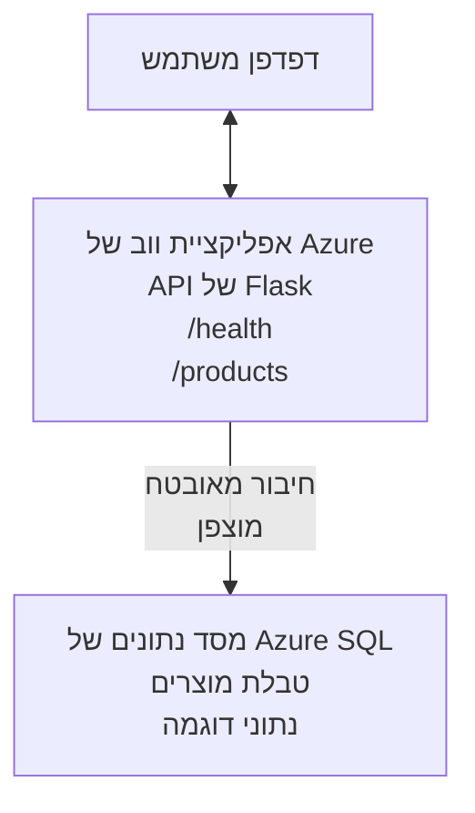

# פריסת מסד נתונים Microsoft SQL ואפליקציית ווב עם AZD

⏱️ **זמן משוער**: 20-30 דקות | 💰 **עלות משוערת**: ~15-25$ לחודש | ⭐ **מורכבות**: בינונית

דוגמה **מלאה ומתפקדת** זו מדגימה כיצד להשתמש ב-[ממשק שורת הפקודה של מפתחי Azure (azd)](https://learn.microsoft.com/azure/developer/azure-developer-cli/) לפריסת אפליקציית ווב בפייתון Flask עם מסד נתונים Microsoft SQL אל Azure. כל הקוד כלול ונבדק — אין צורך בתלויות חיצוניות.

## מה תלמדו

בסיום דוגמה זו, תלמדו:
- לפרוס יישום רב שכבות (אפליקציית ווב + מסד נתונים) באמצעות תשתית כקוד
- להגדיר חיבורי בסיס נתונים מאובטחים מבלי לקודד סודות באופן ישיר
- לנטר את בריאות היישום עם Application Insights
- לנהל משאבי Azure ביעילות עם ממשק ה־CLI של AZD
- לעקוב אחר שיטות עבודה מומלצות של Azure לאבטחה, אופטימיזציה של עלויות, ויכולת תצפית

## סקירת התרחיש
- **אפליקציית ווב**: API REST בפייתון Flask עם חיבורי מסד נתונים
- **מסד נתונים**: מסד Azure SQL עם נתוני דוגמה
- **תשתית**: מסופק באמצעות Bicep (תבניות מודולריות לשימוש חוזר)
- **פריסה**: אוטומטית לחלוטין באמצעות פקודות `azd`
- **ניטור**: Application Insights ליומנים וטלמטריה

## דרישות מקדימות

### כלים דרושים

לפני ההתחלה, וודאו שיש לכם את הכלים הבאים מותקנים:

1. **[Azure CLI](https://learn.microsoft.com/cli/azure/install-azure-cli)** (גרסה 2.50.0 או גבוהה יותר)
   ```sh
   az --version
   # תוצאה צפויה: azure-cli 2.50.0 או גרסה גבוהה יותר
   ```

2. **[Azure Developer CLI (azd)](https://learn.microsoft.com/azure/developer/azure-developer-cli/install-azd)** (גרסה 1.0.0 או גבוהה יותר)
   ```sh
   azd version
   # פלט צפוי: גרסת azd 1.0.0 או גבוהה יותר
   ```

3. **[Python 3.8+](https://www.python.org/downloads/)** (לפיתוח מקומי)
   ```sh
   python --version
   # פלט צפוי: Python 3.8 או גרסה גבוהה יותר
   ```

4. **[Docker](https://www.docker.com/get-started)** (אופציונלי, לפיתוח מקומי מבוסס מכולות)
   ```sh
   docker --version
   # פלט צפוי: גרסת Docker 20.10 או גבוהה יותר
   ```

### דרישות Azure

- מנוי **Azure פעיל** ([צור חשבון חינמי](https://azure.microsoft.com/free/))
- הרשאות ליצירת משאבים במנוי שלך
- תפקיד **בעלים** או **משתתף** על המנוי או קבוצת המשאבים

### דרישות ידע

זו דוגמה ברמת **בינונית**. מומלץ להכיר:
- פעולות בסיסיות בשורת הפקודה
- מושגי ענן בסיסיים (משאבים, קבוצות משאבים)
- הבנה בסיסית של אפליקציות ווב ומסדי נתונים

**חדש ב־AZD?** התחל עם [מדריך ההתחלה](../../docs/chapter-01-foundation/azd-basics.md).

## ארכיטקטורה

דוגמה זו מוציאה לפועל ארכיטקטורת שתי שכבות עם אפליקציית ווב ומסד נתונים SQL:



**פריסת משאבים:**
- **קבוצת משאבים**: מיכל לכל המשאבים
- **תוכנית שירות אפליקציות**: אירוח מבוסס Linux (רמת B1 לחיסכון בעלויות)
- **אפליקציית ווב**: סביבת הריצה Python 3.11 עם אפליקציית Flask
- **שרת SQL**: שרת מסד נתונים מנוהל עם TLS 1.2 מינימום
- **מסד SQL**: רמת Basic (2GB, מתאימה לפיתוח/בדיקה)
- **Application Insights**: ניטור ויומנים
- **מרחב עבודה Log Analytics**: אחסון מרכזי של יומנים

**אנלוגיה**: דמיינו מסעדה (אפליקציית ווב) עם מקרר תעשייתי (מסד נתונים). הלקוחות מזמינים מהתפריט (נקודות API), והמטבח (אפליקציית Flask) משיג מרכיבים (נתונים) מהמקרר. מנהל המסעדה (Application Insights) עוקב אחר כל האירועים.

## מבנה תיקיות

כל הקבצים כלולים בדוגמה — ללא תלות חיצונית:

```
examples/database-app/
│
├── README.md                    # This file
├── azure.yaml                   # AZD configuration file
├── .env.sample                  # Sample environment variables
├── .gitignore                   # Git ignore patterns
│
├── infra/                       # Infrastructure as Code (Bicep)
│   ├── main.bicep              # Main orchestration template
│   ├── abbreviations.json      # Azure naming conventions
│   └── resources/              # Modular resource templates
│       ├── sql-server.bicep    # SQL Server configuration
│       ├── sql-database.bicep  # Database configuration
│       ├── app-service-plan.bicep  # Hosting plan
│       ├── app-insights.bicep  # Monitoring setup
│       └── web-app.bicep       # Web application
│
└── src/
    └── web/                    # Application source code
        ├── app.py              # Flask REST API
        ├── requirements.txt    # Python dependencies
        └── Dockerfile          # Container definition
```

**מה שכל קובץ עושה:**
- **azure.yaml**: מורה ל-AZD מה לפרוס ולאן
- **infra/main.bicep**: מארגן את כל משאבי Azure
- **infra/resources/*.bicep**: הגדרות משאב פרטניות (מודולריות לשימוש חוזר)
- **src/web/app.py**: אפליקציית Flask עם לוגיקת מסד נתונים
- **requirements.txt**: תלותיות חבילות Python
- **Dockerfile**: הוראות מכולת לפריסה

## התחלה מהירה (שלב אחר שלב)

### שלב 1: שיבוט וניווט

```sh
git clone https://github.com/microsoft/AZD-for-beginners.git
cd AZD-for-beginners/examples/database-app
```

**✓ בדיקת הצלחה**: וודא שאתה רואה את `azure.yaml` ואת תיקיית `infra/`:
```sh
ls
# צפוי: README.md, azure.yaml, infra/, src/
```

### שלב 2: התחבר ל-Azure

```sh
azd auth login
```

פעולה זו תפתח את הדפדפן שלך להתחברות ל-Azure. התחבר עם פרטי Azure שלך.

**✓ בדיקת הצלחה**: עליך לראות:
```
Logged in to Azure.
```

### שלב 3: אתחול הסביבה

```sh
azd init
```

**מה קורה**: AZD יוצר הגדרה מקומית לפריסה שלך.

**הנחיות שתראה**:
- **שם הסביבה**: הזן שם קצר (למשל, `dev`, `myapp`)
- **מנוי Azure**: בחר מנוי מהרשימה
- **מיקום Azure**: בחר אזור (למשל, `eastus`, `westeurope`)

**✓ בדיקת הצלחה**: עליך לראות:
```
SUCCESS: New project initialized!
```

### שלב 4: הספק משאבי Azure

```sh
azd provision
```

**מה קורה**: AZD מוציא לפועל את כל התשתית (5-8 דקות):
1. יוצר קבוצת משאבים
2. יוצר שרת SQL ומסד נתונים
3. יוצר תוכנית שירות אפליקציות
4. יוצר אפליקציית ווב
5. יוצר Application Insights
6. מגדיר רשת ואבטחה

**יבקש ממך להכניס**:
- **שם משתמש מנהל SQL**: הזן שם משתמש (למשל, `sqladmin`)
- **סיסמת מנהל SQL**: הזן סיסמה חזקה (שמור אותה!)

**✓ בדיקת הצלחה**: עליך לראות:
```
SUCCESS: Your application was provisioned in Azure in X minutes Y seconds.
You can view the resources created under the resource group rg-<env-name> in Azure Portal:
https://portal.azure.com/#@/resource/subscriptions/.../resourceGroups/rg-<env-name>
```

**⏱️ זמן**: 5-8 דקות

### שלב 5: פרוס את האפליקציה

```sh
azd deploy
```

**מה קורה**: AZD בונה ומפרוס את אפליקציית Flask שלך:
1. מארז את אפליקציית הפייתון
2. בונה את מכולת Docker
3. דוחף ל-Azure Web App
4. מאתחל את בסיס הנתונים עם נתוני דוגמה
5. מפעיל את האפליקציה

**✓ בדיקת הצלחה**: עליך לראות:
```
SUCCESS: Your application was deployed to Azure in X minutes Y seconds.
You can view the resources created under the resource group rg-<env-name> in Azure Portal:
https://portal.azure.com/#@/resource/subscriptions/.../resourceGroups/rg-<env-name>
```

**⏱️ זמן**: 3-5 דקות

### שלב 6: גלוש לאפליקציה

```sh
azd browse
```

פעולה זו תפתח את אפליקציית הווב שהופעלה בדפדפן בכתובת `https://app-<unique-id>.azurewebsites.net`

**✓ בדיקת הצלחה**: עליך לראות פלט JSON:
```json
{
  "message": "Welcome to the Database App API",
  "endpoints": {
    "/": "This help message",
    "/health": "Health check endpoint",
    "/products": "List all products",
    "/products/<id>": "Get product by ID"
  }
}
```

### שלב 7: בדוק את נקודות הקצה של ה-API

**בדיקת בריאות** (וודא חיבור למסד הנתונים):
```sh
curl https://app-<your-id>.azurewebsites.net/health
```

**תגובה צפויה**:
```json
{
  "status": "healthy",
  "database": "connected"
}
```

**רשימת מוצרים** (נתוני דוגמה):
```sh
curl https://app-<your-id>.azurewebsites.net/products
```

**תגובה צפויה**:
```json
[
  {
    "id": 1,
    "name": "Laptop",
    "description": "High-performance laptop",
    "price": 1299.99,
    "created_at": "2025-11-19T10:30:00"
  },
  ...
]
```

**קבלת מוצר אחד**:
```sh
curl https://app-<your-id>.azurewebsites.net/products/1
```

**✓ בדיקת הצלחה**: כל נקודות הקצה מחזירות נתוני JSON ללא שגיאות.

---

**🎉 מזל טוב!** הצלחת לפרוס אפליקציית ווב עם מסד נתונים ל-Azure באמצעות AZD.

## פירוט הגדרות

### משתני סביבה

הסודות מנוהלים בצורה מאובטחת דרך הגדרות Azure App Service — **לעולם לא מקודדים ישירות בקוד המקור**.

**מאוגן אוטומטית על ידי AZD**:
- `SQL_CONNECTION_STRING`: מחרוזת חיבור למסד הנתונים עם אישורים מוצפנים
- `APPLICATIONINSIGHTS_CONNECTION_STRING`: נקודת גישה לנתוני ניטור
- `SCM_DO_BUILD_DURING_DEPLOYMENT`: מאפשר התקנת תלויות אוטומטית בפריסה

**היכן הסודות נשמרים**:
1. במהלך `azd provision`, תספק את אישורי ה-SQL דרך כניסות מאובטחות
2. AZD שומר אותם בקובץ מקומי `.azure/<env-name>/.env` (מוזנח ב־git)
3. AZD מוזן אותם להגדרות Azure App Service (מוצפן באחסון)
4. האפליקציה קוראת אותם דרך `os.getenv()` בזמן ריצה

### פיתוח מקומי

לניסויים מקומיים, צור קובץ `.env` מהדוגמה:

```sh
cp .env.sample .env
# ערוך את .env עם חיבור מסד הנתונים המקומי שלך
```

**זרימת עבודה לפיתוח מקומי**:
```sh
# התקן את התלויות
cd src/web
pip install -r requirements.txt

# הגדר משתני סביבה
export SQL_CONNECTION_STRING="your-local-connection-string"

# הפעל את היישום
python app.py
```

**בדוק מקומית**:
```sh
curl http://localhost:8000/health
# צפוי: {"status": "בריא", "database": "מחובר"}
```

### תשתית כקוד

כל משאבי Azure מוגדרים ב**תבניות Bicep** (בתיקיית `infra/`):

- **עיצוב מודולרי**: כל סוג משאב בקובץ נפרד לשימוש חוזר
- **פרמטרי**: התאמה אישית של SKU, אזורים, שמות
- **שיטות מומלצות**: עוקב אחרי סטנדרטים של Azure וברירות אבטחה
- **בקרה בגרסאות**: שינויים בתשתית מנוטרים ב-Git

**דוגמה להתאמה**:
לשינוי רמת מסד הנתונים, ערוך את `infra/resources/sql-database.bicep`:
```bicep
sku: {
  name: 'Standard'  // Changed from 'Basic'
  tier: 'Standard'
  capacity: 10
}
```

## שיטות עבודה מומלצות לאבטחה

דוגמה זו עוקבת אחר שיטות העבודה המומלצות של Azure לאבטחה:

### 1. **ללא סודות בקוד המקור**
- ✅ אישורים שמורים בהגדרות Azure App Service (מוצפנים)
- ✅ קבצי `.env` אינם כלולים ב-Git באמצעות `.gitignore`
- ✅ סודות מועברים דרך פרמטרים מאובטחים בפריסה

### 2. **חיבורים מוצפנים**
- ✅ TLS 1.2 מינימום לשרת SQL
- ✅ HTTPS בלבד לאפליקציית הווב
- ✅ חיבורי מסד נתונים משתמשים בערוצים מוצפנים

### 3. **אבטחת רשת**
- ✅ חומת אש של SQL Server מוגדרת לאפשר רק שירותי Azure
- ✅ גישה ציבורית מוגבלת (ניתן להקים Private Endpoints)
- ✅ FTPS מושבת על אפליקציית הווב

### 4. **אימות והרשאות**
- ⚠️ **כיום**: אימות SQL (שם משתמש/סיסמה)
- ✅ **בהמלצת ייצור**: השתמש ב-Managed Identity של Azure לאימות ללא סיסמה

**לשדרוג ל-Managed Identity** (לייצור):
1. הפעל Managed Identity באפליקציית הווב
2. תן הרשאות SQL ל-Identity
3. עדכן מחרוזות חיבור לשימוש ב-Managed Identity
4. הסר אימות מבוסס סיסמה

### 5. **ביקורת וציות**
- ✅ יומני Application Insights של כל הבקשות והשגיאות
- ✅ הפעלת ביקורת במסד SQL (ניתן להתאים לצרכי ציות)
- ✅ כל המשאבים מתויגים לממשל תקין

**רשימת בדיקה אבטחה לפני ייצור**:
- [ ] הפעל Azure Defender עבור SQL
- [ ] הגדר Private Endpoints למסד SQL
- [ ] הפעל חומת אפליקציה (WAF)
- [ ] הטמע Azure Key Vault לסיבוב סודות
- [ ] הגדר אימות Microsoft Entra ID
- [ ] אפשר רישום אבחון לכל המשאבים

## אופטימיזציה של עלויות

**עלויות חודשיות משוערות** (נכון לנובמבר 2025):

| משאב | SKU/רמה | עלות משוערת |
|----------|----------|----------------|
| תוכנית שירות אפליקציות | B1 (בסיס) | ~13$ לחודש |
| מסד SQL | בסיס (2GB) | ~5$ לחודש |
| Application Insights | תשלום לפי שימוש | ~2$ לחודש (תעבורה נמוכה) |
| **סך הכול** | | **~20$ לחודש** |

**💡 טיפים לחיסכון בעלויות**:

1. **השתמש ברמת חינם ללמידה**:
   - App Service: רמת F1 (חינמית, שעות מוגבלות)
   - SQL Database: השתמש בשרת SQL ללא שרת (serverless)
   - Application Insights: קליטת 5GB בחינם לחודש

2. **עצור משאבים כשאינם בשימוש**:
   ```sh
   # עצור את אפליקציית הווב (המסד נתונים עדיין מחייב)
   az webapp stop --name <app-name> --resource-group <rg-name>
   
   # הפעל מחדש כשצריך
   az webapp start --name <app-name> --resource-group <rg-name>
   ```

3. **מחק הכל לאחר בדיקות**:
   ```sh
   azd down
   ```
   פעולה זו מסירה את כל המשאבים ועוצרת חיובים.

4. **SKU לפיתוח לעומת ייצור**:
   - **פיתוח**: רמת Basic (כדוגמה זו)
   - **ייצור**: רמת Standard/Premium עם יתירות

**ניטור עלויות**:
- צפה בעלויות ב-[ניהול עלויות Azure](https://portal.azure.com/#view/Microsoft_Azure_CostManagement)
- הגדר התראות עלויות למניעת הפתעות
- תייג כל משאב עם `azd-env-name` למעקב

**חלופה ברמת חינם**:
למטרות למידה, ניתן לשנות את `infra/resources/app-service-plan.bicep`:
```bicep
sku: {
  name: 'F1'  // Free tier
  tier: 'Free'
}
```
**הערה**: לרמת חינם יש מגבלות (60 דקות CPU ליום, ללא Always On).

## ניטור ויכולת תצפית

### אינטגרציה עם Application Insights

דוגמה זו כוללת **Application Insights** לניטור מקיף:

**מה מנוטר**:
- ✅ בקשות HTTP (השיהוי, קודי סטטוס, נקודות קצה)
- ✅ שגיאות וחריגות באפליקציה
- ✅ רישום מותאם אישית מאפליקציית Flask
- ✅ בריאות חיבור למסד הנתונים
- ✅ ביצועי אפליקציה (מעבד, זיכרון)

**גישה ל-Application Insights**:
1. פתח את [פורטל Azure](https://portal.azure.com)
2. עבור לקבוצת המשאבים שלך (`rg-<env-name>`)
3. לחץ על משאב Application Insights (`appi-<unique-id>`)

**שאילתות שימושיות** (Application Insights → Logs):

**צפה בכל הבקשות**:
```kusto
requests
| where timestamp > ago(1h)
| order by timestamp desc
| project timestamp, name, url, resultCode, duration
```

**מצא שגיאות**:
```kusto
exceptions
| where timestamp > ago(24h)
| order by timestamp desc
| project timestamp, type, outerMessage, operation_Name
```

**בדוק נקודת בריאות**:
```kusto
requests
| where name contains "health"
| summarize count() by resultCode, bin(timestamp, 1h)
```

### ביקורת מסד SQL

**בוצעה הפעלת ביקורת במסד SQL** למעקב:
- דפוסי גישה למסד
- נסיונות התחברות שנכשלו
- שינויים בסכימה
- גישה לנתונים (לצורכי ציות)

**גישה ליומני ביקורת**:
1. פורטל Azure → מסד SQL → ביקורת
2. צפה ביומנים במרחב Log Analytics

### ניטור בזמן אמת

**צפייה במדדים חיים**:
1. Application Insights → Live Metrics
2. צפה בבקשות, כשלונות, ביצועים בזמן אמת

**הגדרת התראות**:
צור התראות לאירועים קריטיים:
- שגיאות HTTP 500 > 5 ב־5 דקות
- כשלי חיבור למסד נתונים
- זמני תגובה גבוהים (>2 שניות)

**דוגמה ליצירת התראה**:
```sh
az monitor metrics alert create \
  --name "High-Response-Time" \
  --resource-group <rg-name> \
  --scopes <app-insights-resource-id> \
  --condition "avg requests/duration > 2000" \
  --description "Alert when response time exceeds 2 seconds"
```

## פתרון תקלות
### בעיות נפוצות ופתרונות

#### 1. `azd provision` נכשל עם "Location not available"

**תסמין**:  
```
Error: The subscription is not registered for the resource type 'components' in the location 'centralus'.
```
  
**פתרון**:  
בחר אזור Azure אחר או הירשם כספק משאבים:  
```sh
az provider register --namespace Microsoft.Insights
```
  
#### 2. חיבור SQL נכשל במהלך פריסה

**תסמין**:  
```
pyodbc.OperationalError: ('08001', '[08001] [Microsoft][ODBC Driver 18 for SQL Server]TCP Provider...')
```
  
**פתרון**:  
- ודא שחומת האש של שרת SQL מאפשרת שירותי Azure (מוגדר אוטומטית)  
- בדוק כי סיסמת מנהל SQL הוזנה נכון במהלך `azd provision`  
- ודא ששרת SQL פרוס במלואו (יכול לקחת 2-3 דקות)  

**אימות החיבור**:  
```sh
# מיצע Azure, עבור ל-SQL Database → עורך שאילתות
# נסה להתחבר עם האישורים שלך
```
  
#### 3. אפליקציית ווב מציגה "Application Error"

**תסמין**:  
הדפדפן מציג דף שגיאה כללי.  

**פתרון**:  
בדוק יומני אפליקציה:  
```sh
# הצג יומנים אחרונים
az webapp log tail --name <app-name> --resource-group <rg-name>
```
  
**גורמים נפוצים**:  
- חסר משתני סביבה (בדוק App Service → Configuration)  
- התקנת חבילת פייתון נכשלה (בדוק יומני הפריסה)  
- שגיאה באתחול מסד הנתונים (בדוק חיבוריות ל-SQL)  

#### 4. `azd deploy` נכשל עם "Build Error"

**תסמין**:  
```
Error: Failed to build project
```
  
**פתרון**:  
- ודא שקובץ `requirements.txt` אינו מכיל שגיאות תחביר  
- בדוק שפייתון 3.11 מצוין בקובץ `infra/resources/web-app.bicep`  
- אמת שקובץ Dockerfile משתמש בתמונה בסיסית נכונה  

**ניפוי שגיאות באופן מקומי**:  
```sh
cd src/web
docker build -t test-app .
docker run -p 8000:8000 test-app
```
  
#### 5. "Unauthorized" בעת הרצת פקודות AZD

**תסמין**:  
```
ERROR: (Unauthorized) The client '<id>' with object id '<id>' does not have authorization
```
  
**פתרון**:  
התחבר מחדש ל-Azure:  
```sh
# נדרש עבור תהליכי עבודה של AZD
azd auth login

# אופציונלי אם אתם גם משתמשים בפקודות Azure CLI ישירות
az login
```
  
ודא שיש לך את ההרשאות הנכונות (תפקיד Contributor) במנוי.  

#### 6. עלויות גבוהות בבסיס הנתונים

**תסמין**:  
חיוב Azure בלתי צפוי.  

**פתרון**:  
- בדוק אם שכחת להריץ `azd down` לאחר הבדיקה  
- ודא ש-SQL Database משתמש בשכבת Basic (לא Premium)  
- סקור את העלויות בניהול העלויות של Azure  
- הפעל התראות עלויות  

### קבלת עזרה

**הצג את כל משתני הסביבה של AZD**:  
```sh
azd env get-values
```
  
**בדוק מצב פריסה**:  
```sh
az webapp show --name <app-name> --resource-group <rg-name> --query state
```
  
**גש ליומני אפליקציה**:  
```sh
az webapp log download --name <app-name> --resource-group <rg-name> --log-file app-logs.zip
```
  
**צריכים עוד עזרה?**  
- [מדריך פתרון בעיות AZD](../../docs/chapter-07-troubleshooting/common-issues.md)  
- [פתרון בעיות Azure App Service](https://learn.microsoft.com/azure/app-service/troubleshoot-diagnostic-logs)  
- [פתרון בעיות Azure SQL](https://learn.microsoft.com/azure/azure-sql/database/troubleshoot-common-errors-issues)  

## תרגילים מעשיים

### תרגיל 1: אימות הפריסה שלך (מתחילים)

**מטרה**: לאמת שכל המשאבים פרוסים והאפליקציה עובדת.  

**שלבים**:  
1. רשום את כל המשאבים בקבוצת המשאבים שלך:  
   ```sh
   az resource list --resource-group rg-<env-name> --output table
   ```
   **צפוי**: 6-7 משאבים (Web App, SQL Server, SQL Database, App Service Plan, Application Insights, Log Analytics)  

2. בדוק את כל נקודות הקצה של ה-API:  
   ```sh
   curl https://app-<your-id>.azurewebsites.net/
   curl https://app-<your-id>.azurewebsites.net/health
   curl https://app-<your-id>.azurewebsites.net/products
   curl https://app-<your-id>.azurewebsites.net/products/1
   ```
   **צפוי**: כל התגובות תקינות בפורמט JSON ללא שגיאות  

3. בדוק את Application Insights:  
   - נווט ל-Application Insights בפורטל Azure  
   - עבור ל-"Live Metrics"  
   - רענן את הדפדפן באפליקציית ווב  
   **צפוי**: לראות בקשות בזמן אמת  

**קריטריון להצלחה**: כל 6-7 המשאבים קיימים, כל נקודות הקצה מחזירות נתונים, Live Metrics מציג פעילות.  

---

### תרגיל 2: הוספת נקודת קצה API חדשה (בינוני)

**מטרה**: להרחיב את אפליקציית Flask בנקודת קצה חדשה.  

**קוד התחלה**: נקודות הקצה הנוכחיות ב-`src/web/app.py`  

**שלבים**:  
1. ערוך את `src/web/app.py` והוסף נקודת קצה חדשה אחרי הפונקציה `get_product()`:  
   ```python
   @app.route('/products/search/<keyword>')
   def search_products(keyword):
       """Search products by name or description."""
       try:
           conn = get_db_connection()
           cursor = conn.cursor()
           cursor.execute(
               "SELECT id, name, description, price, created_at FROM products WHERE name LIKE ? OR description LIKE ?",
               (f'%{keyword}%', f'%{keyword}%')
           )
           
           products = []
           for row in cursor.fetchall():
               products.append({
                   'id': row[0],
                   'name': row[1],
                   'description': row[2],
                   'price': float(row[3]) if row[3] else None,
                   'created_at': row[4].isoformat() if row[4] else None
               })
           
           cursor.close()
           conn.close()
           
           logger.info(f"Search for '{keyword}' returned {len(products)} results")
           return jsonify(products), 200
           
       except Exception as e:
           logger.error(f"Error searching products: {str(e)}")
           return jsonify({'error': str(e)}), 500
   ```
  
2. פרוס את האפליקציה המעודכנת:  
   ```sh
   azd deploy
   ```
  
3. בדוק את נקודת הקצה החדשה:  
   ```sh
   curl https://app-<your-id>.azurewebsites.net/products/search/laptop
   ```
   **צפוי**: מחזיר מוצרים התואמים ל-"laptop"  

**קריטריון להצלחה**: נקודת הקצה החדשה פועלת, מחזירה תוצאות מסוננות, מופיעה ביומני Application Insights.  

---

### תרגיל 3: הוספת ניטור והתראות (מתקדם)

**מטרה**: להגדיר ניטור אקטיבי עם התראות.  

**שלבים**:  
1. צור התראה על שגיאות HTTP 500:  
   ```sh
   # קבל מזהה משאבי Application Insights
   AI_ID=$(az monitor app-insights component show \
     --app appi-<your-id> \
     --resource-group rg-<env-name> \
     --query id -o tsv)
   
   # צור התראה
   az monitor metrics alert create \
     --name "High-Error-Rate" \
     --resource-group rg-<env-name> \
     --scopes $AI_ID \
     --condition "count requests/failed > 5" \
     --window-size 5m \
     --evaluation-frequency 1m \
     --description "Alert when >5 failed requests in 5 minutes"
   ```
  
2. הפעל את ההתראה על ידי יצירת שגיאות:  
   ```sh
   # בקשת מוצר שאינו קיים
   for i in {1..10}; do curl https://app-<your-id>.azurewebsites.net/products/999; done
   ```
  
3. בדוק אם ההתראה הופעלה:  
   - פורטל Azure → Alerts → Alert Rules  
   - בדוק דוא"ל (אם מוגדר)  

**קריטריון להצלחה**: חוק ההתראה נוצר, מופעל על שגיאות, מתקבלות הודעות.  

---

### תרגיל 4: שינויים בסכימת מסד הנתונים (מתקדם)

**מטרה**: להוסיף טבלה חדשה ולשנות את האפליקציה לשימוש בה.  

**שלבים**:  
1. התחבר אל SQL Database דרך עורך השאילתות בפורטל Azure  

2. צור טבלת `categories` חדשה:  
   ```sql
   CREATE TABLE categories (
       id INT PRIMARY KEY IDENTITY(1,1),
       name NVARCHAR(50) NOT NULL,
       description NVARCHAR(200)
   );
   
   INSERT INTO categories (name, description) VALUES
   ('Electronics', 'Electronic devices and accessories'),
   ('Office Supplies', 'Office equipment and supplies');
   
   -- Add category to products table
   ALTER TABLE products ADD category_id INT;
   UPDATE products SET category_id = 1; -- Set all to Electronics
   ```
  
3. עדכן את `src/web/app.py` לכלול מידע על קטגוריות בתגובות  

4. פרוס ובדוק  

**קריטריון להצלחה**: הטבלה החדשה קיימת, מוצרים מציגים מידע על קטגוריה, האפליקציה ממשיכה לפעול.  

---

### תרגיל 5: יישום שמירת מטמון (מומחה)

**מטרה**: להוסיף Azure Redis Cache לשיפור ביצועים.  

**שלבים**:  
1. הוסף Redis Cache ל-`infra/main.bicep`  
2. עדכן את `src/web/app.py` לשמור במטמון שאילתות מוצרים  
3. מדוד שיפור ביצועים עם Application Insights  
4. השווה זמני תגובה לפני/אחרי השימוש במטמון  

**קריטריון להצלחה**: Redis פרוס, מטמון עובד, זמני תגובה משתפרים ביותר מ-50%.  

**רמז**: התחל עם [תיעוד Azure Cache for Redis](https://learn.microsoft.com/azure/azure-cache-for-redis/).  

---

## ניקוי

כדי למנוע חיובים מתמשכים, מחק את כל המשאבים בסיום:  

```sh
azd down
```
  
**בקשת אישור**:  
```
? Total resources to delete: 7, are you sure you want to continue? (y/N)
```
  
הקלד `y` לאישור.  

**✓ בדיקת הצלחה**:  
- כל המשאבים נמחקו מפורטל Azure  
- אין חיובים פעילים  
- תיקיית `.azure/<env-name>` מקומית ניתנת למחיקה  

**אלטרנטיבה** (השאר תשתית, מחק נתונים):  
```sh
# למחוק רק את קבוצת המשאבים (לשמור על קונפיגורציית AZD)
az group delete --name rg-<env-name> --yes
```
  
## למידה נוספת

### תיעוד קשור  
- [תיעוד Azure Developer CLI](https://learn.microsoft.com/azure/developer/azure-developer-cli/)  
- [תיעוד Azure SQL Database](https://learn.microsoft.com/azure/azure-sql/database/)  
- [תיעוד Azure App Service](https://learn.microsoft.com/azure/app-service/)  
- [תיעוד Application Insights](https://learn.microsoft.com/azure/azure-monitor/app/app-insights-overview)  
- [מדריך שפת Bicep](https://learn.microsoft.com/azure/azure-resource-manager/bicep/)  

### הצעדים הבאים בקורס זה  
- **[דוגמת Container Apps](../../../../examples/container-app)**: פריסה של מיקרו-שירותים עם Azure Container Apps  
- **[מדריך אינטגרציית AI](../../../../docs/ai-foundry)**: הוספת יכולות בינה מלאכותית לאפליקציה שלך  
- **[שיטות עבודה מומלצות לפריסה](../../docs/chapter-04-infrastructure/deployment-guide.md)**: דפוסי עבודה לפריסה בסביבת ייצור  

### נושאים מתקדמים  
- **Managed Identity**: הסר סיסמאות והשתמש באימות Microsoft Entra ID  
- **Private Endpoints**: אבטח חיבורים למסד הנתונים בתוך רשת וירטואלית  
- **אינטגרציית CI/CD**: אוטומציה של פריסות עם GitHub Actions או Azure DevOps  
- **ריבוי סביבות**: הקם סביבות פיתוח, בדיקה וייצור  
- **מיגרציות למסד הנתונים**: השתמש ב-Alembic או Entity Framework לניהול גרסאות סכימת מסד  

### השוואה לגישות אחרות

**AZD לעומת ARM Templates**:  
- ✅ AZD: אבסטרקציה ברמה גבוהה, פקודות פשוטות  
- ⚠️ ARM: מפורט יותר, שליטה דקדקנית  

**AZD לעומת Terraform**:  
- ✅ AZD: טבעי ל-Azure, משולב עם שירותי Azure  
- ⚠️ Terraform: תומך רב-ענני, סביבת עבודה נרחבת  

**AZD לעומת פורטל Azure**:  
- ✅ AZD: ניתן לשכפול, מבוקר גרסאות, ניתן לאוטומציה  
- ⚠️ פורטל: קליקים ידניים, קשה לשכפול  

**חשוב להבין את AZD כ**: Docker Compose ל-Azure—קונפיגורציה פשוטה לפריסות מורכבות.  

---

## שאלות נפוצות

**ש: האם אפשר להשתמש בשפת תכנות שונה?**  
ת: כן! החלף את `src/web/` ב-Node.js, C#, Go או כל שפה אחרת. עדכן את `azure.yaml` ו-Bicep בהתאם.  

**ש: איך מוסיפים מסדי נתונים נוספים?**  
ת: הוסף מודול SQL Database נוסף ב-`infra/main.bicep` או השתמש ב-PostgreSQL/MySQL מתוך שירותי Azure Database.  

**ש: האם אפשר להשתמש בזה בייצור?**  
ת: זהו נקודת התחלה. לייצור הוסף: זהות מנוהלת, נקודות קצה פרטיות, רדונדן, אסטרטגיית גיבוי, WAF וניטור משופר.  

**ש: מה אם אני רוצה להשתמש במכולות במקום פריסת קוד?**  
ת: בדוק את [דוגמת Container Apps](../../../../examples/container-app) שמשתמשת במכולות Docker לאורך כל הדרך.  

**ש: איך מתחברים למסד הנתונים מהמחשב המקומי?**  
ת: הוסף את כתובת ה-IP שלך לחומת האש של שרת SQL:  
```sh
az sql server firewall-rule create \
  --resource-group rg-<env-name> \
  --server sql-<unique-id> \
  --name AllowMyIP \
  --start-ip-address <your-ip> \
  --end-ip-address <your-ip>
```
  
**ש: האם אפשר להשתמש במסד נתונים קיים במקום ליצור חדש?**  
ת: כן, עדכן את `infra/main.bicep` כדי להתייחס לשרת SQL קיים ועדכן את פרמטרי מחרוזת החיבור.  

---

> **הערה:** דוגמה זו מציגה שיטות עבודה מומלצות לפריסת אפליקציית ווב עם מסד נתונים באמצעות AZD. כוללת קוד מתפקד, תיעוד מקיף ותרגילים מעשיים להעמקת הלמידה. לפריסות ייצור, בדוק דרישות אבטחה, קנה מידה, תאימות ועלויות שמשתנות בהתאם לארגון שלך.  

**📚 ניווט בקורס:**  
- ← קודם: [דוגמת Container Apps](../../../../examples/container-app)  
- → הבא: [מדריך אינטגרציית AI](../../../../docs/ai-foundry)  
- 🏠 [בית הקורס](../../README.md)

---

<!-- CO-OP TRANSLATOR DISCLAIMER START -->
**כתב ויתור**:
מסמך זה תורגם באמצעות שירות תרגום אוטומטי [Co-op Translator](https://github.com/Azure/co-op-translator). למרות שאנו שואפים לדיוק, יש לקחת בחשבון שתרגומים אוטומטיים עלולים להכיל שגיאות או אי-דיוקים. יש להחשיב את המסמך המקורי בשפתו הטבעית כמקור הסמכות. למידע קריטי מומלץ להשתמש בתרגום מקצועי על ידי מתרגם אדם. אנו לא אחראים לכל אי-הבנה או פירוש שגוי הנובע מהשימוש בתרגום זה.
<!-- CO-OP TRANSLATOR DISCLAIMER END -->