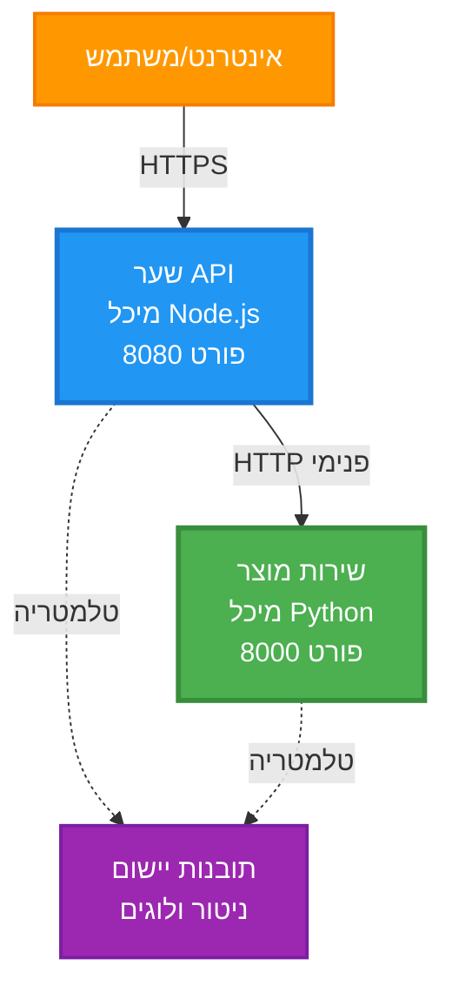
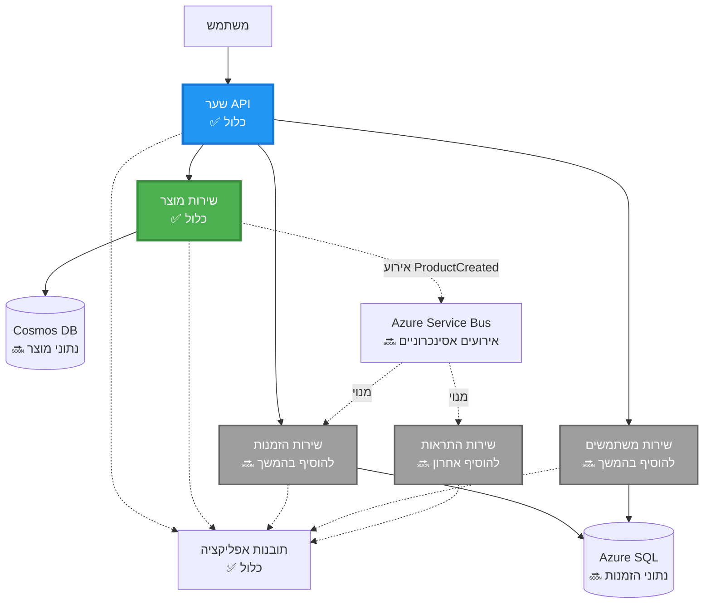
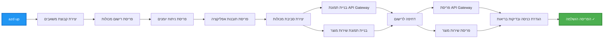
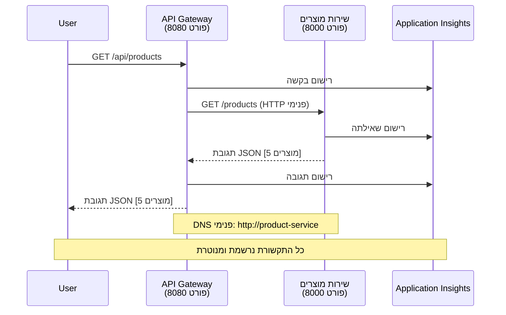

<!--
CO_OP_TRANSLATOR_METADATA:
{
  "original_hash": "eb3a4803a1e80a7f2e64f6bf63738c0f",
  "translation_date": "2025-11-21T18:33:53+00:00",
  "source_file": "examples/microservices/README.md",
  "language_code": "he"
}
-->
# ארכיטקטורת מיקרו-שירותים - דוגמת אפליקציית קונטיינר

⏱️ **זמן משוער**: 25-35 דקות | 💰 **עלות משוערת**: ~$50-100 לחודש | ⭐ **מורכבות**: מתקדם

**📚 מסלול למידה:**
- ← קודם: [API פשוט עם Flask](../../../../examples/container-app/simple-flask-api) - יסודות של קונטיינר יחיד
- 🎯 **אתם כאן**: ארכיטקטורת מיקרו-שירותים (בסיס של 2 שירותים)
- → הבא: [שילוב AI](../../../../docs/ai-foundry) - הוספת אינטליגנציה לשירותים שלכם
- 🏠 [דף הבית של הקורס](../../README.md)

---

ארכיטקטורת מיקרו-שירותים **פשוטה אך פונקציונלית** המופעלת ב-Azure Container Apps באמצעות AZD CLI. דוגמה זו מדגימה תקשורת בין שירותים, תזמור קונטיינרים וניטור עם תצורה מעשית של 2 שירותים.

> **📚 גישת למידה**: דוגמה זו מתחילה בארכיטקטורה מינימלית של 2 שירותים (API Gateway + שירות Backend) שתוכלו לפרוס וללמוד ממנה בפועל. לאחר שליטה בבסיס זה, אנו מספקים הנחיות להרחבה לאקוסיסטם מלא של מיקרו-שירותים.

## מה תלמדו

על ידי השלמת דוגמה זו, תלמדו:
- לפרוס מספר קונטיינרים ל-Azure Container Apps
- ליישם תקשורת בין שירותים עם רשת פנימית
- להגדיר סקיילינג מבוסס סביבה ובדיקות בריאות
- לנטר אפליקציות מבוזרות עם Application Insights
- להבין דפוסי פריסה של מיקרו-שירותים ופרקטיקות מומלצות
- ללמוד הרחבה פרוגרסיבית מארכיטקטורות פשוטות למורכבות

## ארכיטקטורה

### שלב 1: מה אנו בונים (כלול בדוגמה זו)


**פרטי רכיבים:**

| רכיב | מטרה | גישה | משאבים |
|------|------|------|---------|
| **API Gateway** | מנתב בקשות חיצוניות לשירותי backend | ציבורי (HTTPS) | 1 vCPU, 2GB RAM, 2-20 רפליקות |
| **שירות מוצרים** | מנהל קטלוג מוצרים עם נתונים בזיכרון | פנימי בלבד | 0.5 vCPU, 1GB RAM, 1-10 רפליקות |
| **Application Insights** | רישום מרכזי ומעקב מבוזר | פורטל Azure | 1-2 GB/חודש קליטת נתונים |

**למה להתחיל פשוט?**
- ✅ לפרוס ולהבין במהירות (25-35 דקות)
- ✅ ללמוד דפוסי מיקרו-שירותים בסיסיים ללא מורכבות
- ✅ קוד עובד שתוכלו לשנות ולנסות
- ✅ עלות נמוכה ללמידה (~$50-100 לחודש לעומת $300-1400 לחודש)
- ✅ לבנות ביטחון לפני הוספת מסדי נתונים ותורי הודעות

**אנלוגיה**: חשבו על זה כמו ללמוד לנהוג. מתחילים בחניון ריק (2 שירותים), שולטים ביסודות, ואז מתקדמים לתנועה עירונית (5+ שירותים עם מסדי נתונים).

### שלב 2: הרחבה עתידית (ארכיטקטורת ייחוס)

לאחר שתשלוט בארכיטקטורה של 2 שירותים, תוכל להרחיב ל:


ראו את סעיף "מדריך הרחבה" בסוף להוראות שלב-אחר-שלב.

## תכונות כלולות

✅ **גילוי שירותים**: גילוי אוטומטי מבוסס DNS בין קונטיינרים  
✅ **איזון עומסים**: איזון עומסים מובנה בין רפליקות  
✅ **סקיילינג אוטומטי**: סקיילינג עצמאי לכל שירות מבוסס על בקשות HTTP  
✅ **ניטור בריאות**: בדיקות חיות ומוכנות לשני השירותים  
✅ **רישום מבוזר**: רישום מרכזי עם Application Insights  
✅ **רשת פנימית**: תקשורת מאובטחת בין שירותים  
✅ **תזמור קונטיינרים**: פריסה וסקיילינג אוטומטיים  
✅ **עדכונים ללא השבתה**: עדכונים מתגלגלים עם ניהול גרסאות  

## דרישות מוקדמות

### כלים נדרשים

לפני שתתחילו, ודאו שיש לכם את הכלים הבאים מותקנים:

1. **[Azure Developer CLI (azd)](https://learn.microsoft.com/azure/developer/azure-developer-cli/install-azd)** (גרסה 1.0.0 או גבוהה יותר)  
   ```bash
   azd version
   # תוצאה צפויה: גרסת azd 1.0.0 או גבוהה יותר
   ```

2. **[Azure CLI](https://learn.microsoft.com/cli/azure/install-azure-cli)** (גרסה 2.50.0 או גבוהה יותר)  
   ```bash
   az --version
   # תוצאה צפויה: azure-cli 2.50.0 או גבוה יותר
   ```

3. **[Docker](https://www.docker.com/get-started)** (לפיתוח/בדיקות מקומיות - אופציונלי)  
   ```bash
   docker --version
   # פלט צפוי: גרסת Docker 20.10 או גבוהה יותר
   ```

### בדקו את ההתקנה שלכם

הריצו את הפקודות הבאות כדי לוודא שאתם מוכנים:

```bash
# בדוק את CLI של Azure Developer
azd version
# ✅ צפוי: גרסה azd 1.0.0 או גבוהה יותר

# בדוק את CLI של Azure
az --version
# ✅ צפוי: azure-cli גרסה 2.50.0 או גבוהה יותר

# בדוק את Docker (אופציונלי)
docker --version
# ✅ צפוי: גרסת Docker 20.10 או גבוהה יותר
```

**קריטריון הצלחה**: כל הפקודות מחזירות מספרי גרסה התואמים או עולים על המינימום.

### דרישות Azure

- מנוי **Azure** פעיל ([צרו חשבון חינמי](https://azure.microsoft.com/free/))
- הרשאות ליצירת משאבים במנוי שלכם
- תפקיד **Contributor** במנוי או בקבוצת המשאבים

### ידע מוקדם

זו דוגמה ברמת **מתקדמים**. עליכם:
- להשלים את [דוגמת ה-API הפשוט עם Flask](../../../../examples/container-app/simple-flask-api)  
- להבין את הבסיס של ארכיטקטורת מיקרו-שירותים  
- להכיר REST APIs ו-HTTP  
- להבין מושגים של קונטיינרים  

**חדשים ל-Container Apps?** התחילו עם [דוגמת ה-API הפשוט עם Flask](../../../../examples/container-app/simple-flask-api) כדי ללמוד את היסודות.

## התחלה מהירה (שלב-אחר-שלב)

### שלב 1: שיבטו ונווטו

```bash
git clone https://github.com/microsoft/AZD-for-beginners.git
cd AZD-for-beginners/examples/microservices
```

**✓ בדיקת הצלחה**: ודאו שאתם רואים `azure.yaml`:
```bash
ls
# צפוי: README.md, azure.yaml, infra/, src/
```

### שלב 2: אימות עם Azure

```bash
azd auth login
```

זה יפתח את הדפדפן שלכם לאימות Azure. התחברו עם האישורים שלכם.

**✓ בדיקת הצלחה**: אתם אמורים לראות:
```
Logged in to Azure.
```

### שלב 3: אתחול הסביבה

```bash
azd init
```

**הנחיות שתראו**:
- **שם הסביבה**: הזינו שם קצר (למשל, `microservices-dev`)
- **מנוי Azure**: בחרו את המנוי שלכם
- **מיקום Azure**: בחרו אזור (למשל, `eastus`, `westeurope`)

**✓ בדיקת הצלחה**: אתם אמורים לראות:
```
SUCCESS: New project initialized!
```

### שלב 4: פריסת תשתית ושירותים

```bash
azd up
```

**מה קורה** (לוקח 8-12 דקות):


**✓ בדיקת הצלחה**: אתם אמורים לראות:
```
SUCCESS: Your application was deployed to Azure in X minutes Y seconds.
Endpoint: https://api-gateway-<unique-id>.azurecontainerapps.io
```

**⏱️ זמן**: 8-12 דקות

### שלב 5: בדקו את הפריסה

```bash
# קבל את נקודת הקצה של השער
GATEWAY_URL=$(azd env get-values | grep API_GATEWAY_URL | cut -d '=' -f2 | tr -d '"')

# בדוק את בריאות שער ה-API
curl $GATEWAY_URL/health
```

**✅ פלט צפוי:**
```json
{
  "status": "healthy",
  "service": "api-gateway",
  "timestamp": "2025-11-19T10:30:00Z"
}
```

**בדקו את שירות המוצרים דרך ה-Gateway**:
```bash
# רשימת מוצרים
curl $GATEWAY_URL/api/products
```

**✅ פלט צפוי:**
```json
[
  {"id":1,"name":"Laptop","price":999.99,"stock":50},
  {"id":2,"name":"Mouse","price":29.99,"stock":200},
  {"id":3,"name":"Keyboard","price":79.99,"stock":150}
]
```

**✓ בדיקת הצלחה**: שני הקצוות מחזירים נתוני JSON ללא שגיאות.

---

**🎉 מזל טוב!** פרסתם ארכיטקטורת מיקרו-שירותים ל-Azure!

## מבנה הפרויקט

כל קבצי המימוש כלולים—זו דוגמה שלמה ועובדת:

```
microservices/
│
├── README.md                         # This file
├── azure.yaml                        # AZD configuration
├── .gitignore                        # Git ignore patterns
│
├── infra/                           # Infrastructure as Code (Bicep)
│   ├── main.bicep                   # Main orchestration
│   ├── abbreviations.json           # Naming conventions
│   ├── core/                        # Shared infrastructure
│   │   ├── container-apps-environment.bicep  # Container environment + registry
│   │   └── monitor.bicep            # Application Insights + Log Analytics
│   └── app/                         # Service definitions
│       ├── api-gateway.bicep        # API Gateway container app
│       └── product-service.bicep    # Product Service container app
│
└── src/                             # Application source code
    ├── api-gateway/                 # Node.js API Gateway
    │   ├── app.js                   # Express server with routing
    │   ├── package.json             # Node dependencies
    │   └── Dockerfile               # Container definition
    └── product-service/             # Python Product Service
        ├── main.py                  # Flask API with product data
        ├── requirements.txt         # Python dependencies
        └── Dockerfile               # Container definition
```

**מה כל רכיב עושה:**

**תשתית (infra/)**:
- `main.bicep`: מתזמר את כל משאבי Azure ותלותיהם
- `core/container-apps-environment.bicep`: יוצר את סביבת Container Apps ואת Azure Container Registry
- `core/monitor.bicep`: מגדיר את Application Insights לרישום מבוזר
- `app/*.bicep`: הגדרות אפליקציות קונטיינר בודדות עם סקיילינג ובדיקות בריאות

**API Gateway (src/api-gateway/)**:
- שירות ציבורי שמנתב בקשות לשירותי backend
- מיישם רישום, טיפול בשגיאות והעברת בקשות
- מדגים תקשורת HTTP בין שירותים

**שירות מוצרים (src/product-service/)**:
- שירות פנימי עם קטלוג מוצרים (בזיכרון לפשטות)
- REST API עם בדיקות בריאות
- דוגמה לדפוס שירות backend

## סקירה על השירותים

### API Gateway (Node.js/Express)

**פורט**: 8080  
**גישה**: ציבורי (ingress חיצוני)  
**מטרה**: מנתב בקשות נכנסות לשירותי backend המתאימים  

**קצוות**:
- `GET /` - מידע על השירות
- `GET /health` - קצה בדיקת בריאות
- `GET /api/products` - העברה לשירות המוצרים (רשימת הכל)
- `GET /api/products/:id` - העברה לשירות המוצרים (קבלת פריט לפי מזהה)

**תכונות עיקריות**:
- ניתוב בקשות עם axios
- רישום מרכזי
- טיפול בשגיאות וניהול זמן קצוב
- גילוי שירותים באמצעות משתני סביבה
- שילוב Application Insights

**הדגשת קוד** (`src/api-gateway/app.js`):
```javascript
// תקשורת שירות פנימית
app.get('/api/products', async (req, res) => {
  const response = await axios.get(`${PRODUCT_SERVICE_URL}/products`, {
    timeout: 5000
  });
  res.json(response.data);
});
```

### שירות מוצרים (Python/Flask)

**פורט**: 8000  
**גישה**: פנימי בלבד (ללא ingress חיצוני)  
**מטרה**: מנהל קטלוג מוצרים עם נתונים בזיכרון  

**קצוות**:
- `GET /` - מידע על השירות
- `GET /health` - קצה בדיקת בריאות
- `GET /products` - רשימת כל המוצרים
- `GET /products/<id>` - קבלת מוצר לפי מזהה

**תכונות עיקריות**:
- API RESTful עם Flask
- חנות מוצרים בזיכרון (פשוט, ללא צורך במסד נתונים)
- ניטור בריאות עם בדיקות
- רישום מובנה
- שילוב Application Insights

**מודל נתונים**:
```python
{
  "id": 1,
  "name": "Laptop",
  "description": "High-performance laptop",
  "price": 999.99,
  "stock": 50
}
```

**למה פנימי בלבד?**
שירות המוצרים אינו חשוף לציבור. כל הבקשות חייבות לעבור דרך ה-API Gateway, שמספק:
- אבטחה: נקודת גישה מבוקרת
- גמישות: ניתן לשנות backend מבלי להשפיע על הלקוחות
- ניטור: רישום בקשות מרכזי

## הבנת תקשורת בין שירותים

### איך שירותים מתקשרים זה עם זה


בדוגמה זו, ה-API Gateway מתקשר עם שירות המוצרים באמצעות **קריאות HTTP פנימיות**:

```javascript
// שער API (src/api-gateway/app.js)
const PRODUCT_SERVICE_URL = process.env.PRODUCT_SERVICE_URL;

// בצע בקשת HTTP פנימית
const response = await axios.get(`${PRODUCT_SERVICE_URL}/products`);
```

**נקודות מפתח**:

1. **גילוי מבוסס DNS**: Container Apps מספק DNS אוטומטי לשירותים פנימיים
   - FQDN של שירות המוצרים: `product-service.internal.<environment>.azurecontainerapps.io`
   - מפושט כ: `http://product-service` (Container Apps פותר זאת)

2. **ללא חשיפה ציבורית**: לשירות המוצרים יש `external: false` ב-Bicep
   - נגיש רק בתוך סביבת Container Apps
   - לא ניתן להגיע אליו מהאינטרנט

3. **משתני סביבה**: כתובות השירות מוזרקות בזמן הפריסה
   - Bicep מעביר את ה-FQDN הפנימי ל-Gateway
   - אין כתובות URL מקודדות בקוד האפליקציה

**אנלוגיה**: חשבו על זה כמו חדרי משרד. ה-API Gateway הוא דלפק הקבלה (פונה לציבור), ושירות המוצרים הוא חדר משרד (פנימי בלבד). מבקרים חייבים לעבור דרך הקבלה כדי להגיע לכל חדר.

## אפשרויות פריסה

### פריסה מלאה (מומלץ)

```bash
# פרוס תשתית ושני השירותים
azd up
```

זה פורש:
1. סביבת Container Apps
2. Application Insights
3. Container Registry
4. קונטיינר API Gateway
5. קונטיינר שירות מוצרים

**זמן**: 8-12 דקות

### פריסת שירות בודד

```bash
# פרוס רק שירות אחד (לאחר azd up ראשוני)
azd deploy api-gateway

# או פרוס שירות מוצר
azd deploy product-service
```

**שימוש**: כאשר עדכנתם קוד בשירות אחד ורוצים לפרוס מחדש רק אותו.

### עדכון תצורה

```bash
# שינוי פרמטרי קנה מידה
azd env set GATEWAY_MAX_REPLICAS 30

# פריסה מחדש עם תצורה חדשה
azd up
```

## תצורה

### תצורת סקיילינג

שני השירותים מוגדרים עם סקיילינג אוטומטי מבוסס HTTP בקבצי ה-Bicep שלהם:

**API Gateway**:
- מינימום רפליקות: 2 (תמיד לפחות 2 לזמינות)
- מקסימום רפליקות: 20
- טריגר סקיילינג: 50 בקשות בו-זמניות לכל רפליקה

**שירות מוצרים**:
- מינימום רפליקות: 1 (יכול לרדת לאפס אם צריך)
- מקסימום רפליקות: 10
- טריגר סקיילינג: 100 בקשות בו-זמניות לכל רפליקה

**התאמת סקיילינג** (ב-`infra/app/*.bicep`):
```bicep
scale: {
  minReplicas: 1
  maxReplicas: 10
  rules: [
    {
      name: 'http-scale-rule'
      http: {
        metadata: {
          concurrentRequests: '100'  // Adjust this
        }
      }
    }
  ]
}
```

### הקצאת משאבים

**API Gateway**:
- CPU: 1.0 vCPU
- זיכרון: 2 GiB
- סיבה: מטפל בכל התעבורה החיצונית

**שירות מוצרים**:
- CPU: 0.5 vCPU
- זיכרון: 1 GiB
- סיבה: פעולות קלות בזיכרון

### בדיקות בריאות

שני השירותים כוללים בדיקות חיות ומוכנות:

```bicep
probes: [
  {
    type: 'Liveness'
    httpGet: {
      path: '/health'
      port: 8080
    }
    initialDelaySeconds: 10
    periodSeconds: 30
  }
  {
    type: 'Readiness'
    httpGet: {
      path: '/health'
      port: 8080
    }
    initialDelaySeconds: 5
    periodSeconds: 10
  }
]
```

**מה זה אומר**:
- **חיות**: אם בדיקת הבריאות נכשלת, Container Apps מאתחל את הקונטיינר
- **מוכנות**: אם לא מוכן, Container Apps מפסיק לנתב תעבורה לרפליקה זו

## ניטור ותצפית

### צפייה ביומני שירות

```bash
# זרם יומנים מ-API Gateway
azd logs api-gateway --follow

# הצג יומני שירות מוצר אחרונים
azd logs product-service --tail 100

# הצג את כל היומנים משני השירותים
azd logs --follow
```

**פלט צפוי**:
```
[api-gateway] API Gateway listening on port 8080
[api-gateway] Product Service URL: http://product-service
[api-gateway] GET /api/products 200 - 45ms
[product-service] Retrieved 5 products
```

### שאילתות Application Insights

גשו ל-Application Insights בפורטל Azure, ואז הריצו את השאילתות הבאות:

**מצאו בקשות איטיות**:
```kusto
requests
| where timestamp > ago(1h)
| where duration > 1000  // Requests taking >1 second
| summarize count() by name, cloud_RoleName
| order by count_ desc
```

**עקבו אחרי קריאות בין שירותים**:
```kusto
dependencies
| where timestamp > ago(1h)
| where type == "Http"
| project timestamp, name, target, duration, success
| order by timestamp desc
```

**שיעור שגיאות לפי שירות**:
```kusto
exceptions
| where timestamp > ago(24h)
| summarize errorCount = count() by cloud_RoleName, type
| order by errorCount desc
```

**נפח בקשות לאורך זמן**:
```kusto
requests
| where timestamp > ago(1h)
| summarize requestCount = count() by bin(timestamp, 5m), cloud_RoleName
| render timechart
```

### גישה ללוח ניטור

```bash
# קבל פרטי Application Insights
azd env get-values | grep APPLICATIONINSIGHTS

# פתח את ניטור פורטל Azure
az monitor app-insights component show \
  --app $(azd env get-values | grep APPLICATIONINSIGHTS_CONNECTION_STRING | cut -d '=' -f2) \
  --resource-group $(azd env get-values | grep AZURE_RESOURCE_GROUP | cut -d '=' -f2) \
  --query "appId" -o tsv
```

### מדדים חיים

1. נווטו ל-Application Insights בפורטל Azure
2. לחצו על "מדדים חיים"
3. ראו בקשות בזמן אמת, כשלונות וביצועים
4. בדקו על ידי הרצה: `curl $(azd env get-values | grep API_GATEWAY_URL | cut -d '=' -f2 | tr -d '"')/api/products`

## תרגילים מעשיים

### תרגיל 1: הוספת קצה מוצר חדש ⭐ (קל)

**מטרה**: הוסיפו קצה POST ליצירת מוצרים חדשים

**נקודת התחלה**: `src/product-service/main.py`

**שלבים**:

1. הוסיפו את הקצה הזה אחרי הפונקציה `get_product` ב-`main.py`:

```python
@app.route('/products', methods=['POST'])
def create_product():
    """Create a new product"""
    data = request.get_json()
    
    # אימות שדות חובה
    if not data or 'name' not in data or 'price' not in data:
        return jsonify({'error': 'Missing required fields: name, price'}), 400
    
    new_id = max(p['id'] for p in products) + 1
    new_product = {
        'id': new_id,
        'name': data['name'],
        'description': data.get('description', ''),
        'price': float(data['price']),
        'stock': int(data.get('stock', 0))
    }
    products.append(new_product)
    logger.info(f"Created product {new_id}")
    return jsonify(new_product), 201
```

2. הוסיפו נתיב POST ל-API Gateway (`src/api-gateway/app.js`):

```javascript
// הוסף את זה אחרי מסלול GET /api/products
app.post('/api/products', async (req, res) => {
  try {
    console.log(`Forwarding POST request to ${PRODUCT_SERVICE_URL}/products`);
    const response = await axios.post(`${PRODUCT_SERVICE_URL}/products`, req.body, {
      timeout: 5000
    });
    res.status(201).json(response.data);
  } catch (error) {
    console.error('Error calling product service:', error.message);
    res.status(503).json({
      error: 'Product service unavailable',
      message: error.message
    });
  }
});
```

3. פרסו מחדש את שני השירותים:

```bash
azd deploy product-service
azd deploy api-gateway
```

4. בדקו את נקודת הקצה החדשה:

```bash
GATEWAY_URL=$(azd env get-values | grep API_GATEWAY_URL | cut -d '=' -f2 | tr -d '"')

# צור מוצר חדש
curl -X POST $GATEWAY_URL/api/products \
  -H "Content-Type: application/json" \
  -d '{"name":"USB Cable","price":9.99,"stock":500}'
```

**✅ פלט צפוי:**
```json
{"id":6,"name":"USB Cable","description":"","price":9.99,"stock":500}
```

5. ודאו שהוא מופיע ברשימה:

```bash
curl $GATEWAY_URL/api/products
# אמור להציג כעת 6 מוצרים כולל כבל ה-USB החדש
```

**קריטריונים להצלחה**:
- ✅ בקשת POST מחזירה HTTP 201
- ✅ המוצר החדש מופיע ברשימת GET /api/products
- ✅ למוצר יש מזהה שמספרו עולה אוטומטית

**זמן**: 10-15 דקות

---

### תרגיל 2: שינוי חוקי אוטוסקיילינג ⭐⭐ (בינוני)

**מטרה**: לשנות את שירות המוצרים כך שיתרחב בצורה אגרסיבית יותר

**נקודת התחלה**: `infra/app/product-service.bicep`

**שלבים**:

1. פתחו את `infra/app/product-service.bicep` ומצאו את בלוק ה-`scale` (בערך בשורה 95)

2. שנו מ:
```bicep
scale: {
  minReplicas: 1
  maxReplicas: 10
  rules: [
    {
      name: 'http-scale-rule'
      http: {
        metadata: {
          concurrentRequests: '100'  // OLD
        }
      }
    }
  ]
}
```

ל:
```bicep
scale: {
  minReplicas: 2  // Always have 2 running
  maxReplicas: 20  // Allow more scaling
  rules: [
    {
      name: 'http-scale-rule'
      http: {
        metadata: {
          concurrentRequests: '20'  // Scale at lower threshold
        }
      }
    }
  ]
}
```

3. פרסו מחדש את התשתית:

```bash
azd up
```

4. ודאו את תצורת ההתרחבות החדשה:

```bash
az containerapp show \
  --name $(azd env get-values | grep PRODUCT_SERVICE | head -1 | cut -d '/' -f5) \
  --resource-group $(azd env get-values | grep AZURE_RESOURCE_GROUP | cut -d '=' -f2 | tr -d '"') \
  --query "properties.template.scale" -o json
```

**✅ פלט צפוי:**
```json
{
  "minReplicas": 2,
  "maxReplicas": 20,
  "rules": [...]
}
```

5. בדקו את האוטוסקיילינג תחת עומס:

```bash
# צור בקשות מקבילות
for i in {1..500}; do curl $GATEWAY_URL/api/products & done

# צפה בתהליך ההרחבה
azd logs product-service --follow
# חפש: אירועי הרחבה של אפליקציות מכולה
```

**קריטריונים להצלחה**:
- ✅ שירות המוצרים תמיד פועל עם לפחות 2 רפליקות
- ✅ תחת עומס, מתרחב ליותר מ-2 רפליקות
- ✅ פורטל Azure מציג את חוקי ההתרחבות החדשים

**זמן**: 15-20 דקות

---

### תרגיל 3: הוספת שאילתת ניטור מותאמת אישית ⭐⭐ (בינוני)

**מטרה**: ליצור שאילתת Application Insights מותאמת אישית למעקב אחר ביצועי API המוצרים

**שלבים**:

1. נווטו ל-Application Insights בפורטל Azure:
   - היכנסו לפורטל Azure
   - מצאו את קבוצת המשאבים שלכם (rg-microservices-*)
   - לחצו על משאב Application Insights

2. לחצו על "Logs" בתפריט השמאלי

3. צרו את השאילתה הבאה:

```kusto
requests
| where timestamp > ago(1h)
| where name contains "products"
| summarize 
    RequestCount = count(),
    AvgDuration = avg(duration),
    P95Duration = percentile(duration, 95),
    SuccessRate = 100.0 * countif(success == true) / count()
  by bin(timestamp, 5m)
| render timechart
```

4. לחצו על "Run" כדי להריץ את השאילתה

5. שמרו את השאילתה:
   - לחצו על "Save"
   - שם: "Product API Performance"
   - קטגוריה: "Performance"

6. צרו תעבורת בדיקה:

```bash
for i in {1..100}; do curl $GATEWAY_URL/api/products; sleep 1; done
```

7. רעננו את השאילתה כדי לראות נתונים

**✅ פלט צפוי:**
- גרף המציג את מספר הבקשות לאורך זמן
- משך זמן ממוצע < 500ms
- שיעור הצלחה = 100%
- חלוקות זמן של 5 דקות

**קריטריונים להצלחה**:
- ✅ השאילתה מציגה 100+ בקשות
- ✅ שיעור הצלחה הוא 100%
- ✅ משך זמן ממוצע < 500ms
- ✅ הגרף מציג חלוקות זמן של 5 דקות

**תוצאה לימודית**: הבנת ניטור ביצועי שירותים עם שאילתות מותאמות אישית

**זמן**: 10-15 דקות

---

### תרגיל 4: יישום לוגיקת ניסיונות חוזרים ⭐⭐⭐ (מתקדם)

**מטרה**: להוסיף לוגיקת ניסיונות חוזרים ל-API Gateway כאשר שירות המוצרים אינו זמין זמנית

**נקודת התחלה**: `src/api-gateway/app.js`

**שלבים**:

1. התקינו ספריית ניסיונות חוזרים:

```bash
cd src/api-gateway
npm install axios-retry --save
cd ../..
```

2. עדכנו את `src/api-gateway/app.js` (הוסיפו אחרי ייבוא axios):

```javascript
const axiosRetry = require('axios-retry');

// הגדר לוגיקת ניסיון חוזר
axiosRetry(axios, {
  retries: 3,
  retryDelay: (retryCount) => {
    return retryCount * 1000; // 1ש', 2ש', 3ש'
  },
  retryCondition: (error) => {
    // נסה שוב על שגיאות רשת או תגובות 5xx
    return axiosRetry.isNetworkOrIdempotentRequestError(error) ||
           (error.response && error.response.status >= 500);
  }
});

console.log('Retry logic configured: 3 retries with exponential backoff');
```

3. פרסו מחדש את API Gateway:

```bash
azd deploy api-gateway
```

4. בדקו את התנהגות הניסיונות החוזרים על ידי סימולציה של כשל שירות:

```bash
# קנה מידה שירות מוצר ל-0 (לדמות כשל)
az containerapp update \
  --name $(azd env get-values | grep PRODUCT_SERVICE | head -1 | cut -d '/' -f5) \
  --resource-group $(azd env get-values | grep AZURE_RESOURCE_GROUP | cut -d '=' -f2 | tr -d '"') \
  --min-replicas 0 \
  --max-replicas 0

# נסה לגשת למוצרים (ינסה שוב 3 פעמים)
time curl -v $GATEWAY_URL/api/products
# שים לב: התגובה לוקחת ~6 שניות (1ש + 2ש + 3ש ניסיונות חוזרים)

# שחזר את שירות המוצר
az containerapp update \
  --name $(azd env get-values | grep PRODUCT_SERVICE | head -1 | cut -d '/' -f5) \
  --resource-group $(azd env get-values | grep AZURE_RESOURCE_GROUP | cut -d '=' -f2 | tr -d '"') \
  --min-replicas 1 \
  --max-replicas 10
```

5. צפו ביומני הניסיונות החוזרים:

```bash
azd logs api-gateway --tail 50
# חפש: הודעות ניסיון חוזר
```

**✅ התנהגות צפויה:**
- הבקשות מנסות 3 פעמים לפני כישלון
- כל ניסיון ממתין זמן ארוך יותר (1 שנייה, 2 שניות, 3 שניות)
- בקשות מצליחות לאחר שהשירות מתאושש
- היומנים מציגים ניסיונות חוזרים

**קריטריונים להצלחה**:
- ✅ הבקשות מנסות 3 פעמים לפני כישלון
- ✅ כל ניסיון ממתין זמן ארוך יותר (backoff אקספוננציאלי)
- ✅ בקשות מצליחות לאחר שהשירות מתאושש
- ✅ היומנים מציגים ניסיונות חוזרים

**תוצאה לימודית**: הבנת דפוסי עמידות במיקרו-שירותים (מעגלי הגנה, ניסיונות חוזרים, פסקי זמן)

**זמן**: 20-25 דקות

---

## נקודת בדיקה לידע

לאחר השלמת הדוגמה, בדקו את הבנתכם:

### 1. תקשורת בין שירותים ✓

בדקו את הידע שלכם:
- [ ] האם אתם יכולים להסביר כיצד API Gateway מזהה את שירות המוצרים? (גילוי שירות מבוסס DNS)
- [ ] מה קורה אם שירות המוצרים אינו זמין? (Gateway מחזיר שגיאת 503)
- [ ] כיצד הייתם מוסיפים שירות שלישי? (יצירת קובץ Bicep חדש, הוספה ל-main.bicep, יצירת תיקיית src)

**אימות מעשי**:
```bash
# לדמות כשל שירות
az containerapp update --name <product-service-name> --min-replicas 0 --max-replicas 0
curl $GATEWAY_URL/api/products
# ✅ צפוי: 503 שירות לא זמין

# לשחזר שירות
az containerapp update --name <product-service-name> --min-replicas 1 --max-replicas 10
```

### 2. ניטור ותצפית ✓

בדקו את הידע שלכם:
- [ ] היכן ניתן לראות יומנים מבוזרים? (Application Insights בפורטל Azure)
- [ ] כיצד עוקבים אחר בקשות איטיות? (שאילתת Kusto: `requests | where duration > 1000`)
- [ ] האם אתם יכולים לזהות איזה שירות גרם לשגיאה? (בדקו את השדה `cloud_RoleName` ביומנים)

**אימות מעשי**:
```bash
# צור סימולציה של בקשה איטית
curl "$GATEWAY_URL/api/products?delay=2000"

# שאילתא ל-Application Insights עבור בקשות איטיות
# נווט ל-Azure Portal → Application Insights → Logs
# הרץ: requests | where duration > 1000 | project timestamp, name, duration, cloud_RoleName
```

### 3. התרחבות וביצועים ✓

בדקו את הידע שלכם:
- [ ] מה מפעיל אוטוסקיילינג? (חוקי בקשות HTTP במקביל: 50 עבור Gateway, 100 עבור מוצר)
- [ ] כמה רפליקות פועלות כעת? (בדקו עם `az containerapp revision list`)
- [ ] כיצד הייתם מגדילים את שירות המוצרים ל-5 רפליקות? (עדכון minReplicas ב-Bicep)

**אימות מעשי**:
```bash
# צור עומס כדי לבדוק את האוטוסקיילינג
for i in {1..1000}; do curl $GATEWAY_URL/api/products & done

# צפה בהגדלת הרפליקות
azd logs api-gateway --follow
# ✅ צפוי: ראה אירועי סקיילינג ביומנים
```

**קריטריונים להצלחה**: אתם יכולים לענות על כל השאלות ולאמת עם פקודות מעשיות.

---

## ניתוח עלויות

### עלויות חודשיות משוערות (לדוגמה זו עם 2 שירותים)

| משאב | תצורה | עלות משוערת |
|----------|--------------|----------------|
| API Gateway | 2-20 רפליקות, 1 vCPU, 2GB RAM | $30-150 |
| שירות המוצרים | 1-10 רפליקות, 0.5 vCPU, 1GB RAM | $15-75 |
| רישום מכולות | שכבה בסיסית | $5 |
| Application Insights | 1-2 GB/חודש | $5-10 |
| Log Analytics | 1 GB/חודש | $3 |
| **סה"כ** | | **$58-243/חודש** |

### פירוט עלויות לפי שימוש

**תעבורה קלה** (בדיקות/למידה): ~$60/חודש
- API Gateway: 2 רפליקות × 24/7 = $30
- שירות המוצרים: 1 רפליקה × 24/7 = $15
- ניטור + רישום = $13

**תעבורה בינונית** (ייצור קטן): ~$120/חודש
- API Gateway: ממוצע 5 רפליקות = $75
- שירות המוצרים: ממוצע 3 רפליקות = $45
- ניטור + רישום = $13

**תעבורה גבוהה** (תקופות עמוסות): ~$240/חודש
- API Gateway: ממוצע 15 רפליקות = $225
- שירות המוצרים: ממוצע 8 רפליקות = $120
- ניטור + רישום = $13

### טיפים לאופטימיזציית עלויות

1. **הקטינו לאפס לפיתוח**:
   ```bicep
   scale: {
     minReplicas: 0  // Save $30-40/month when not in use
     maxReplicas: 10
   }
   ```

2. **השתמשו בתוכנית צריכה עבור Cosmos DB** (כאשר תוסיפו אותו):
   - תשלום רק על מה שמשתמשים
   - ללא עלות מינימלית

3. **הגדירו דגימה ב-Application Insights**:
   ```javascript
   appInsights.defaultClient.config.samplingPercentage = 50; // דגום 50% מהבקשות
   ```

4. **נקו כשלא נדרש**:
   ```bash
   azd down --force --purge
   ```

### אפשרויות שכבה חינמית

ללמידה/בדיקות, שקלו:
- ✅ השתמשו בקרדיטים חינמיים של Azure ($200 ל-30 הימים הראשונים עם חשבונות חדשים)
- ✅ שמרו על מינימום רפליקות (חוסך ~50% עלויות)
- ✅ מחקו לאחר בדיקות (ללא חיובים מתמשכים)
- ✅ הקטינו לאפס בין סשנים של למידה

**דוגמה**: הרצת דוגמה זו למשך 2 שעות/יום × 30 ימים = ~$5/חודש במקום $60/חודש

---

## מדריך פתרון בעיות

### בעיה: `azd up` נכשל עם "Subscription not found"

**פתרון**:
```bash
# התחבר שוב עם מנוי מפורש
az account set --subscription <your-subscription-id>
azd env set AZURE_SUBSCRIPTION_ID <your-subscription-id>
azd up
```

### בעיה: API Gateway מחזיר 503 "שירות המוצרים אינו זמין"

**אבחון**:
```bash
# בדוק את יומני שירות המוצר
azd logs product-service --tail 50

# בדוק את בריאות שירות המוצר
az containerapp show \
  --name $(azd env get-values | grep PRODUCT_SERVICE | head -1 | cut -d '/' -f5) \
  --resource-group $(azd env get-values | grep AZURE_RESOURCE_GROUP | cut -d '=' -f2 | tr -d '"') \
  --query "properties.runningStatus"
```

**גורמים נפוצים**:
1. שירות המוצרים לא התחיל (בדקו יומנים לשגיאות Python)
2. בדיקת בריאות נכשלת (ודאו ש-`/health` פועל)
3. בניית תמונת מכולה נכשלה (בדקו ברישום תמונה)

### בעיה: אוטוסקיילינג לא עובד

**אבחון**:
```bash
# בדוק את מספר הרפליקות הנוכחי
az containerapp revision list \
  --name $(azd env get-values | grep API_GATEWAY | head -1 | cut -d '/' -f5) \
  --resource-group $(azd env get-values | grep AZURE_RESOURCE_GROUP | cut -d '=' -f2 | tr -d '"') \
  --query "[].properties.replicas"

# צור עומס לבדיקה
for i in {1..1000}; do curl $GATEWAY_URL/api/products & done

# עקוב אחר אירועי סקיילינג
azd logs api-gateway --follow | grep -i scale
```

**גורמים נפוצים**:
1. העומס לא מספיק גבוה כדי להפעיל את חוק ההתרחבות (נדרש >50 בקשות במקביל)
2. מספר הרפליקות המקסימלי כבר הושג (בדקו תצורת Bicep)
3. חוק ההתרחבות הוגדר בצורה שגויה ב-Bicep (ודאו את ערך concurrentRequests)

### בעיה: Application Insights לא מציג יומנים

**אבחון**:
```bash
# ודא שמחרוזת החיבור מוגדרת
azd env get-values | grep APPLICATIONINSIGHTS

# בדוק אם השירותים שולחים טלמטריה
az monitor app-insights component show \
  --app $(azd env get-values | grep APPLICATIONINSIGHTS_NAME | cut -d '=' -f2 | tr -d '"') \
  --resource-group $(azd env get-values | grep AZURE_RESOURCE_GROUP | cut -d '=' -f2 | tr -d '"') \
  --query "properties.InstrumentationKey"
```

**גורמים נפוצים**:
1. מחרוזת החיבור לא הועברה למכולה (בדקו משתני סביבה)
2. SDK של Application Insights לא הוגדר (ודאו ייבוא בקוד)
3. חומת אש חוסמת טלמטריה (נדיר, בדקו חוקי רשת)

### בעיה: בניית Docker נכשלת מקומית

**אבחון**:
```bash
# בדיקת בניית API Gateway
cd src/api-gateway
docker build -t test-gateway .

# בדיקת בניית שירות מוצר
cd ../product-service
docker build -t test-product .
```

**גורמים נפוצים**:
1. תלות חסרה ב-package.json/requirements.txt
2. שגיאות תחביר ב-Dockerfile
3. בעיות רשת בהורדת תלות

**עדיין תקועים?** ראו [מדריך בעיות נפוצות](../../docs/troubleshooting/common-issues.md) או [פתרון בעיות Azure Container Apps](https://learn.microsoft.com/azure/container-apps/troubleshooting)

---

## ניקוי

כדי להימנע מחיובים מתמשכים, מחקו את כל המשאבים:

```bash
azd down --force --purge
```

**אישור בקשה**:
```
? Total resources to delete: 6, are you sure you want to continue? (y/N)
```

הקלידו `y` לאישור.

**מה נמחק**:
- סביבה של Container Apps
- שני Container Apps (Gateway ושירות המוצרים)
- רישום מכולות
- Application Insights
- Log Analytics Workspace
- קבוצת משאבים

**✓ אימות ניקוי**:
```bash
az group list --query "[?starts_with(name,'rg-microservices')]" --output table
```

אמור להחזיר ריק.

---

## מדריך הרחבה: משני שירותים ל-5+ שירותים

לאחר שליטה בארכיטקטורה זו עם 2 שירותים, כך ניתן להרחיב:

### שלב 1: הוספת מסד נתונים (השלב הבא)

**הוסיפו Cosmos DB לשירות המוצרים**:

1. צרו `infra/core/cosmos.bicep`:
   ```bicep
   resource cosmosAccount 'Microsoft.DocumentDB/databaseAccounts@2023-04-15' = {
     name: name
     location: location
     kind: 'GlobalDocumentDB'
     properties: {
       databaseAccountOfferType: 'Standard'
       consistencyPolicy: { defaultConsistencyLevel: 'Session' }
       locations: [{ locationName: location, failoverPriority: 0 }]
     }
   }
   ```

2. עדכנו את שירות המוצרים לשימוש ב-Azure Cosmos DB Python SDK במקום נתונים בזיכרון

3. עלות נוספת משוערת: ~$25/חודש (שרת ללא מצב)

### שלב 2: הוספת שירות שלישי (ניהול הזמנות)

**צרו שירות הזמנות**:

1. תיקיה חדשה: `src/order-service/` (Python/Node.js/C#)
2. Bicep חדש: `infra/app/order-service.bicep`
3. עדכנו את API Gateway לנתב `/api/orders`
4. הוסיפו מסד נתונים Azure SQL לניהול הזמנות

**הארכיטקטורה הופכת ל**:
```
API Gateway → Product Service (Cosmos DB)
           → Order Service (Azure SQL)
```

### שלב 3: הוספת תקשורת אסינכרונית (Service Bus)

**יישום ארכיטקטורה מונחית אירועים**:

1. הוסיפו Azure Service Bus: `infra/core/servicebus.bicep`
2. שירות המוצרים מפרסם אירועי "ProductCreated"
3. שירות ההזמנות נרשם לאירועי מוצרים
4. הוסיפו שירות התראות לעיבוד אירועים

**תבנית**: בקשה/תגובה (HTTP) + מונחה אירועים (Service Bus)

### שלב 4: הוספת אימות משתמשים

**יישום שירות משתמשים**:

1. צרו `src/user-service/` (Go/Node.js)
2. הוסיפו Azure AD B2C או אימות JWT מותאם אישית
3. API Gateway מאמת אסימונים לפני ניתוב
4. שירותים בודקים הרשאות משתמשים

### שלב 5: מוכנות לייצור

**הוסיפו רכיבים אלו**:
- ✅ Azure Front Door (איזון עומסים גלובלי)
- ✅ Azure Key Vault (ניהול סודות)
- ✅ Azure Monitor Workbooks (לוחות מחוונים מותאמים אישית)
- ✅ צנרת CI/CD (GitHub Actions)
- ✅ פריסות כחול-ירוק
- ✅ זהות מנוהלת לכל השירותים

**עלות ארכיטקטורת ייצור מלאה**: ~$300-1,400/חודש

---

## למידע נוסף

### תיעוד קשור
- [תיעוד Azure Container Apps](https://learn.microsoft.com/azure/container-apps/)
- [מדריך ארכיטקטורת מיקרו-שירותים](https://learn.microsoft.com/azure/architecture/guide/architecture-styles/microservices)
- [Application Insights למעקב מבוזר](https://learn.microsoft.com/azure/azure-monitor/app/distributed-tracing)
- [תיעוד Azure Developer CLI](https://learn.microsoft.com/azure/developer/azure-developer-cli/)

### השלבים הבאים בקורס זה
- ← קודם: [Simple Flask API](../../../../examples/container-app/simple-flask-api) - דוגמה למתחילים עם מכולה יחידה
- → הבא: [AI Integration Guide](../../../../docs/ai-foundry) - הוספת יכולות AI
- 🏠 [דף הבית של הקורס](../../README.md)

### השוואה: מתי להשתמש במה

| תכונה | מכולה יחידה | מיקרו-שירותים (זה) | Kubernetes (AKS) |
|---------|-----------------|---------------------|------------------|
| **שימוש** | אפליקציות פשוטות | אפליקציות מורכבות | אפליקציות ארגוניות |
| **יכולת התרחבות** | שירות יחיד | התרחבות לפי שירות | גמישות מקסימלית |
| **מורכבות** | נמוכה | בינונית | גבוהה |
| **גודל צוות** | 1-3 מפתחים | 3-10 מפתחים | 10+ מפתחים |
| **עלות** | ~$15-50/חודש | ~$60-250/חודש | ~$150-500/חודש |
| **זמן פריסה** | 5-10 דקות | 8-12 דקות | 15-30 דקות |
| **הכי מתאים ל** | MVPs, אבטיפוס | אפליקציות ייצור | ריבוי עננים, רשתות מתקדמות |

**המלצה**: התחילו עם Container Apps (בדוגמה זו), עברו ל-AKS רק אם אתם זקוקים לתכונות ספציפיות של Kubernetes.

---

## שאלות נפוצות

**ש: למה רק 2 שירותים במקום 5+?**  
ת: התקדמות חינוכית. שלטו ביסודות (תקשורת בין שירותים, ניטור, סקיילינג) עם דוגמה פשוטה לפני שמוסיפים מורכבות. הדפוסים שתלמדו כאן חלים גם על ארכיטקטורות עם 100 שירותים.

**ש: האם אני יכול להוסיף עוד שירותים בעצמי?**  
ת: בהחלט! עקבו אחרי מדריך ההרחבה למעלה. כל שירות חדש עוקב אחרי אותו דפוס: יצירת תיקיית src, יצירת קובץ Bicep, עדכון azure.yaml, פריסה.

**ש: האם זה מוכן לייצור?**  
ת: זו תשתית מוצקה. לייצור, הוסיפו: זהות מנוהלת, Key Vault, מסדי נתונים מתמשכים, צינור CI/CD, התראות ניטור ואסטרטגיית גיבוי.

**ש: למה לא להשתמש ב-Dapr או רשת שירותים אחרת?**  
ת: שמרו על פשטות ללמידה. ברגע שתבינו את הרשתות הטבעיות של Container Apps, תוכלו להוסיף Dapr לתרחישים מתקדמים (ניהול מצב, pub/sub, חיבורים).

**ש: איך אני מבצע ניפוי שגיאות מקומי?**  
ת: הריצו שירותים מקומית עם Docker:  
```bash
cd src/api-gateway
docker build -t local-gateway .
docker run -p 8080:8080 -e PRODUCT_SERVICE_URL=http://localhost:8000 local-gateway
```
  
**ש: האם אני יכול להשתמש בשפות תכנות שונות?**  
ת: כן! בדוגמה זו מוצגים Node.js (gateway) + Python (שירות מוצר). אתם יכולים לשלב כל שפה שרצה בקונטיינרים: C#, Go, Java, Ruby, PHP, ועוד.

**ש: מה אם אין לי קרדיטים ב-Azure?**  
ת: השתמשו בשכבת החינם של Azure (30 הימים הראשונים עם חשבונות חדשים מקבלים $200 קרדיטים) או פרסו לתקופות בדיקה קצרות ומחקו מיד. דוגמה זו עולה כ-$2 ליום.

**ש: איך זה שונה מ-Azure Kubernetes Service (AKS)?**  
ת: Container Apps פשוט יותר (אין צורך בידע על Kubernetes) אבל פחות גמיש. AKS נותן לכם שליטה מלאה על Kubernetes אבל דורש יותר מומחיות. התחילו עם Container Apps, עברו ל-AKS אם יש צורך.

**ש: האם אני יכול להשתמש בזה עם שירותי Azure קיימים?**  
ת: כן! אתם יכולים להתחבר למסדי נתונים קיימים, חשבונות אחסון, Service Bus, ועוד. עדכנו את קבצי ה-Bicep כדי להתייחס למשאבים קיימים במקום ליצור חדשים.

---

> **🎓 סיכום מסלול הלמידה**: למדתם לפרוס ארכיטקטורה מרובת שירותים עם סקיילינג אוטומטי, רשת פנימית, ניטור מרכזי ודפוסים מוכנים לייצור. תשתית זו מכינה אתכם למערכות מבוזרות מורכבות וארכיטקטורות מיקרו-שירותים ארגוניות.

**📚 ניווט בקורס:**
- ← קודם: [Simple Flask API](../../../../examples/container-app/simple-flask-api)
- → הבא: [Database Integration Example](../../../../database-app)
- 🏠 [דף הבית של הקורס](../../README.md)
- 📖 [Container Apps Best Practices](../../docs/deployment/deployment-guide.md)

---

**✨ מזל טוב!** השלמתם את דוגמת המיקרו-שירותים. עכשיו אתם מבינים איך לבנות, לפרוס ולנטר אפליקציות מבוזרות על Azure Container Apps. מוכנים להוסיף יכולות AI? בדקו את [מדריך שילוב ה-AI](../../../../docs/ai-foundry)!

---

<!-- CO-OP TRANSLATOR DISCLAIMER START -->
**כתב ויתור**:  
מסמך זה תורגם באמצעות שירות תרגום AI [Co-op Translator](https://github.com/Azure/co-op-translator). למרות שאנו שואפים לדיוק, יש לקחת בחשבון שתרגומים אוטומטיים עשויים להכיל שגיאות או אי דיוקים. המסמך המקורי בשפתו המקורית צריך להיחשב כמקור סמכותי. עבור מידע קריטי, מומלץ להשתמש בתרגום מקצועי אנושי. איננו אחראים לאי הבנות או לפרשנויות שגויות הנובעות משימוש בתרגום זה.
<!-- CO-OP TRANSLATOR DISCLAIMER END -->