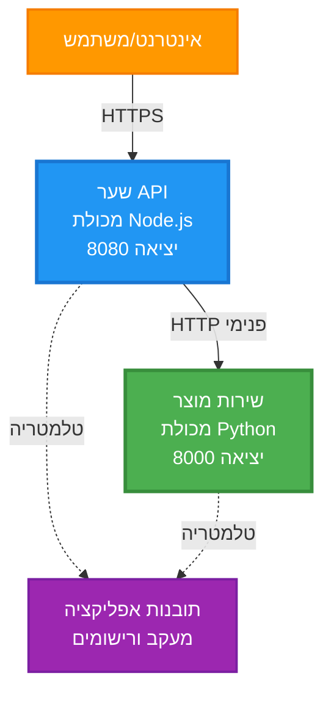
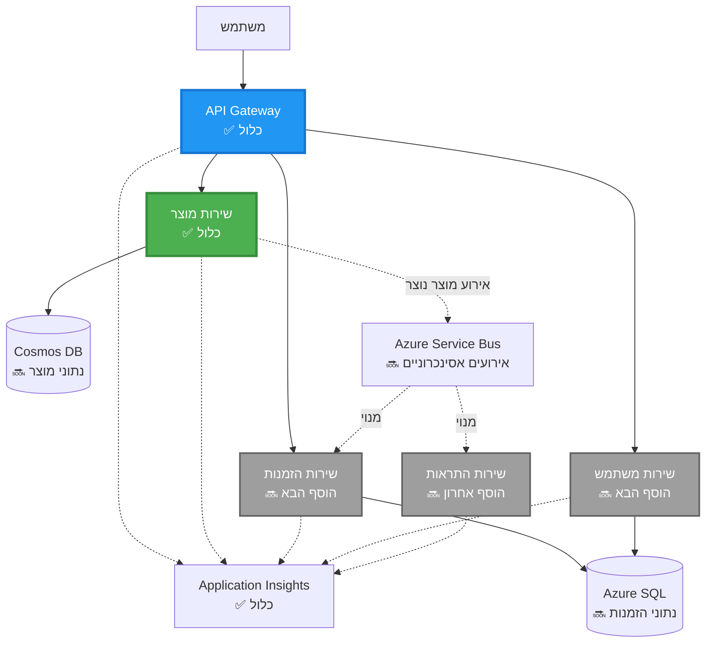
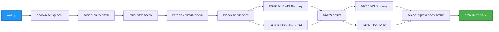
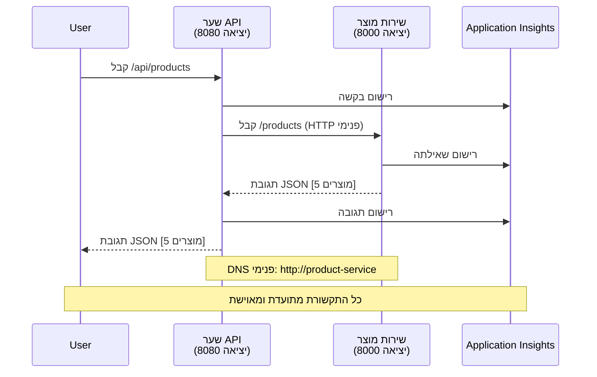

# ארכיטקטורת מיקרו-שירותים - דוגמת אפליקציית מכולות

⏱️ **זמן משוער**: 25-35 דקות | 💰 **עלות משוערת**: ~50-100$/חודש | ⭐ **מורכבות**: מתקדמת

**📚 מסלול למידה:**
- ← קודם: [Simple Flask API](../../../../examples/container-app/simple-flask-api) - יסודות מכולה בודדת
- 🎯 **אתה כאן**: ארכיטקטורת מיקרו-שירותים (בסיס 2 שירותים)
- → הבא: [AI Integration](../../../../docs/ai-foundry) - הוסף אינטליגנציה לשירותיך
- 🏠 [בית הקורס](../../README.md)

---

ארכיטקטורת מיקרו-שירותים **מפושטת אך פונקציונלית** המפורסת ב-Azure Container Apps באמצעות AZD CLI. דוגמה זו מדגימה תקשורת בין שירותים, תזמור מכולות ומעקב עם התקנה מעשית של 2 שירותים.

> **📚 גישת למידה**: דוגמה זו מתחילה בארכיטקטורת 2 שירותים מינימלית (API Gateway + שירות backend) שניתן לפרוס וללמוד ממנה בפועל. לאחר שליטה בבסיס זה, אנו מספקים הנחיות להרחבה לאקוסיסטם מיקרו-שירותים מלא.

## מה תלמד

בסיום דוגמה זו תלמד:
- לפרוס מכולות מרובות ל-Azure Container Apps
- ליישם תקשורת שירות-לשירות עם רשת פנימית
- להגדיר סקיילינג מבוסס סביבה ובדיקות בריאות
- לנטר אפליקציות מבוזרות עם Application Insights
- להבין תבניות פריסה ונהלים מומלצים במיקרו-שירותים
- ללמוד התקדמות הדרגתית מאדריכלות פשוטה למורכבת

## ארכיטקטורה

### שלב 1: מה אנחנו בונים (כלול בדוגמה זו)


```mermaid
graph TB
    Internet[אינטרנט/משתמש]
    Gateway[שער API<br/>מכולת Node.js<br/>יציאה 8080]
    Product[שירות מוצר<br/>מכולת Python<br/>יציאה 8000]
    AppInsights[תובנות אפליקציה<br/>מעקב ורישומים]
    
    Internet -->|HTTPS| Gateway
    Gateway -->|HTTP פנימי| Product
    Gateway -.->|טלמטריה| AppInsights
    Product -.->|טלמטריה| AppInsights
    
    style Gateway fill:#2196F3,stroke:#1976D2,stroke-width:3px,color:#fff
    style Product fill:#4CAF50,stroke:#388E3C,stroke-width:3px,color:#fff
    style Internet fill:#FF9800,stroke:#F57C00,stroke-width:2px,color:#fff
    style AppInsights fill:#9C27B0,stroke:#7B1FA2,stroke-width:2px,color:#fff
```
**פרטי רכיבים:**

| רכיב | מטרה | גישה | משאבים |
|------|-------|-------|---------|
| **API Gateway** | מנתב בקשות חיצוניות לשירותי backend | ציבורי (HTTPS) | 1 vCPU, 2GB RAM, 2-20 העתקות |
| **שירות מוצר** | מנהל קטלוג מוצרים בזיכרון הפנימי | פנימי בלבד | 0.5 vCPU, 1GB RAM, 1-10 העתקות |
| **Application Insights** | רישום מרכזי ומעקב מבוזר | פורטל Azure | קליטת נתונים של 1-2 GB/חודש |

**למה להתחיל בפשטות?**
- ✅ פרוס והבן מהר (25-35 דקות)
- ✅ למד דפוסי מיקרו-שירותים בסיסיים ללא מורכבות
- ✅ קוד עובד שניתן לשנות ולנסות
- ✅ עלות נמוכה ללמידה (~50-100$/חודש לעומת 300-1400$/חודש)
- ✅ בנה ביטחון לפני הוספת מסדי נתונים ותורי הודעות

**אנלוגיה**: חשבו על זה כמו לימוד נהיגה. מתחילים בחניון ריק (2 שירותים), שולטים ביסודות ואז מתקדמים לתנועה עירונית (5+ שירותים עם מסדי נתונים).

### שלב 2: הרחבה עתידית (ארכיטקטורת התייחסות)

כשתשלט בארכיטקטורת 2 השירותים, ניתן להרחיב ל:


```mermaid
graph TB
    User[משתמש]
    Gateway[API Gateway<br/>✅ כלול]
    Product[שירות מוצר<br/>✅ כלול]
    Order[שירות הזמנות<br/>🔜 הוסף הבא]
    UserSvc[שירות משתמש<br/>🔜 הוסף הבא]
    Notify[שירות התראות<br/>🔜 הוסף אחרון]
    
    CosmosDB[(Cosmos DB<br/>🔜 נתוני מוצר)]
    AzureSQL[(Azure SQL<br/>🔜 נתוני הזמנות)]
    ServiceBus[Azure Service Bus<br/>🔜 אירועים אסינכרוניים]
    AppInsights[Application Insights<br/>✅ כלול]
    
    User --> Gateway
    Gateway --> Product
    Gateway --> Order
    Gateway --> UserSvc
    
    Product --> CosmosDB
    Order --> AzureSQL
    UserSvc --> AzureSQL
    
    Product -.->|אירוע מוצר נוצר| ServiceBus
    ServiceBus -.->|מנוי| Notify
    ServiceBus -.->|מנוי| Order
    
    Gateway -.-> AppInsights
    Product -.-> AppInsights
    Order -.-> AppInsights
    UserSvc -.-> AppInsights
    Notify -.-> AppInsights
    
    style Product fill:#4CAF50,stroke:#388E3C,stroke-width:3px,color:#fff
    style Gateway fill:#2196F3,stroke:#1976D2,stroke-width:3px,color:#fff
    style Order fill:#9E9E9E,stroke:#616161,stroke-width:2px,color:#fff
    style UserSvc fill:#9E9E9E,stroke:#616161,stroke-width:2px,color:#fff
    style Notify fill:#9E9E9E,stroke:#616161,stroke-width:2px,color:#fff
```
עיין בקטע "מדריך הרחבה" בסוף להנחיות שלב אחר שלב.

## תכונות כלולות

✅ **גילוי שירותים**: גילוי אוטומטי מבוסס DNS בין מכולות  
✅ **איזון עומסים**: איזון עומסים מובנה בין העתקות  
✅ **סקיילינג אוטומטי**: סקיילינג עצמאי לכל שירות לפי בקשות HTTP  
✅ **בקרת בריאות**: בדיקות ליבתיות וקריאות לשני השירותים  
✅ **רישום מבוזר**: רישום מרכזי עם Application Insights  
✅ **רשת פנימית**: תקשורת מאובטחת שירות-לשירות  
✅ **תזמור מכולות**: פריסה וסקיילינג אוטומטיים  
✅ **עדכונים ללא השבתה**: עדכונים מתגלגלים עם ניהול גרסאות  

## דרישות מוקדמות

### כלים נדרשים

לפני התחלת העבודה, ודא שהכלים הבאים מותקנים:

1. **[Azure Developer CLI (azd)](https://learn.microsoft.com/azure/developer/azure-developer-cli/install-azd)** (גרסה 1.0.0 ומעלה)
   ```bash
   azd version
   # פלט צפוי: גרסה 1.0.0 או גבוהה יותר של azd
   ```

2. **[Azure CLI](https://learn.microsoft.com/cli/azure/install-azure-cli)** (גרסה 2.50.0 ומעלה)
   ```bash
   az --version
   # פלט צפוי: azure-cli בגירסה 2.50.0 או גבוהה יותר
   ```

3. **[Docker](https://www.docker.com/get-started)** (לפיתוח/בדיקות מקומיות - אופציונלי)
   ```bash
   docker --version
   # פלט צפוי: גרסת Docker 20.10 או גבוהה יותר
   ```

### אמת את ההתקנה שלך

הרץ פקודות אלו כדי לאמת שאת/ה מוכן/נה:

```bash
# בדוק את Azure Developer CLI
azd version
# ✅ צפוי: azd גרסה 1.0.0 או גבוהה יותר

# בדוק את Azure CLI
az --version
# ✅ צפוי: azure-cli גרסה 2.50.0 או גבוהה יותר

# בדוק את Docker (אופציונלי)
docker --version
# ✅ צפוי: גרסת Docker 20.10 או גבוהה יותר
```

**קריטריון הצלחה**: כל הפקודות מחזירות גרסאות התואמות או גבוהות מהמינימום הנדרש.

### דרישות Azure

- מנוי פעיל ל-**Azure** ([צור חשבון חינם](https://azure.microsoft.com/free/))
- הרשאות ליצירת משאבים במנוי שלך
- תפקיד **Contributor** על המנוי או קבוצת המשאבים

### ידע מוקדם

זוהי דוגמה ברמת **מתקדמים**. עליך לדעת:
- השלמת [Simple Flask API example](../../../../examples/container-app/simple-flask-api) 
- הבנה בסיסית בארכיטקטורת מיקרו-שירותים
- היכרות עם REST APIs ו-HTTP
- הבנה של מושגי מכולות

**חדש באפליקציות מכולות?** התחל עם [Simple Flask API example](../../../../examples/container-app/simple-flask-api) כדי ללמוד את היסודות.

## התחלה מהירה (שלב-אחר-שלב)

### שלב 1: שכפל ונווט

```bash
git clone https://github.com/microsoft/AZD-for-beginners.git
cd AZD-for-beginners/examples/microservices
```

**✓ בדיקת הצלחה**: אמת שקיים `azure.yaml`:
```bash
ls
# צפוי: README.md, azure.yaml, infra/, src/
```

### שלב 2: התחבר ל-Azure

```bash
azd auth login
```

זה יפתח דפדפן להתחברות ל-Azure. היכנס עם פרטי Azure שלך.

**✓ בדיקת הצלחה**: אמור להיראות כך:
```
Logged in to Azure.
```

### שלב 3: אתחל את הסביבה

```bash
azd init
```

**הנחיות שתראה**:
- **שם הסביבה**: הזן שם קצר (לדוגמה, `microservices-dev`)
- **מנוי Azure**: בחר את המנוי שלך
- **אזור Azure**: בחר אזור (לדוגמה, `eastus`, `westeurope`)

**✓ בדיקת הצלחה**: אמור להיראות כך:
```
SUCCESS: New project initialized!
```

### שלב 4: פרוס תשתית ושירותים

```bash
azd up
```

**מה קורה** (לוקח כ-8-12 דקות):


```mermaid
graph LR
    A[azd up] --> B[יצירת קבוצת משאבים]
    B --> C[פיתוח רישום מכולות]
    C --> D[פריסת ניתוח לוגים]
    D --> E[פריסת תובנות אפליקציה]
    E --> F[יצירת סביבת מכולות]
    F --> G[בניית תמונת API Gateway]
    F --> H[בניית תמונת שירות המוצר]
    G --> I[דחיפה לרישום]
    H --> I
    I --> J[פריסת API Gateway]
    I --> K[פריסת שירות מוצר]
    J --> L[הגדרת כניסה ובדיקות בריאות]
    K --> L
    L --> M[פריסה הושלמה ✓]
    
    style A fill:#2196F3,stroke:#1976D2,stroke-width:3px,color:#fff
    style M fill:#4CAF50,stroke:#388E3C,stroke-width:3px,color:#fff
```
**✓ בדיקת הצלחה**: אמור להיראות כך:
```
SUCCESS: Your application was deployed to Azure in X minutes Y seconds.
Endpoint: https://api-gateway-<unique-id>.azurecontainerapps.io
```

**⏱️ זמן**: 8-12 דקות

### שלב 5: בדוק את הפריסה

```bash
# קבל את נקודת הקצה של שער הגישה
GATEWAY_URL=$(azd env get-values | grep API_GATEWAY_URL | cut -d '=' -f2 | tr -d '"')

# בדוק את מצב הבריאות של שער ה-API
curl $GATEWAY_URL/health
```

**✅ פלט מצופה:**
```json
{
  "status": "healthy",
  "service": "api-gateway",
  "timestamp": "2025-11-19T10:30:00Z"
}
```

**בדוק את שירות המוצרים דרך השער**:
```bash
# רשימת מוצרים
curl $GATEWAY_URL/api/products
```

**✅ פלט מצופה:**
```json
[
  {"id":1,"name":"Laptop","price":999.99,"stock":50},
  {"id":2,"name":"Mouse","price":29.99,"stock":200},
  {"id":3,"name":"Keyboard","price":79.99,"stock":150}
]
```

**✓ בדיקת הצלחה**: שני נקודות הקצה מחזירות נתוני JSON ללא שגיאות.

---

**🎉 ברכות!** פרסת ארכיטקטורת מיקרו-שירותים ל-Azure!

## מבנה הפרויקט

כל קבצי היישום כלולים — זוהי דוגמה מלאה ועובדת:

```
microservices/
│
├── README.md                         # This file
├── azure.yaml                        # AZD configuration
├── .gitignore                        # Git ignore patterns
│
├── infra/                           # Infrastructure as Code (Bicep)
│   ├── main.bicep                   # Main orchestration
│   ├── abbreviations.json           # Naming conventions
│   ├── core/                        # Shared infrastructure
│   │   ├── container-apps-environment.bicep  # Container environment + registry
│   │   └── monitor.bicep            # Application Insights + Log Analytics
│   └── app/                         # Service definitions
│       ├── api-gateway.bicep        # API Gateway container app
│       └── product-service.bicep    # Product Service container app
│
└── src/                             # Application source code
    ├── api-gateway/                 # Node.js API Gateway
    │   ├── app.js                   # Express server with routing
    │   ├── package.json             # Node dependencies
    │   └── Dockerfile               # Container definition
    └── product-service/             # Python Product Service
        ├── main.py                  # Flask API with product data
        ├── requirements.txt         # Python dependencies
        └── Dockerfile               # Container definition
```

**מה כל רכיב עושה:**

**תשתית (infra/)**:
- `main.bicep`: מארגן את כל המשאבים והקשורים ב-Azure
- `core/container-apps-environment.bicep`: יוצר את סביבת Container Apps ורישום מכולות Azure
- `core/monitor.bicep`: מגדיר Application Insights לרישום מבוזר
- `app/*.bicep`: הגדרות אינדיבידואליות של אפליקציות מכולות עם סקיילינג ובדיקות בריאות

**API Gateway (src/api-gateway/):**
- שירות הפונה לציבור ומנתב בקשות לשירותי backend
- מבצע רישום, טיפול בשגיאות והעבר בקשות
- מדגים תקשורת HTTP שירות-לשירות

**שירות מוצר (src/product-service/):**
- שירות פנימי עם קטלוג מוצרים (בזיכרון הפנימי לפשטות)
- REST API עם בדיקות בריאות
- דוגמה לדפוס מיקרו-שירות backend

## סקירת שירותים

### API Gateway (Node.js/Express)

**פורט**: 8080  
**גישה**: ציבורי (כניסה חיצונית)  
**מטרה**: מנתב בקשות נכנסות לשירותי backend מתאימים  

**נקודות קצה**:
- `GET /` - מידע על השירות
- `GET /health` - נקודת בדיקת בריאות
- `GET /api/products` - מנתב לשירות מוצר (רשימת הכל)
- `GET /api/products/:id` - מנתב לשירות מוצר (קבלת פריט לפי מזהה)

**תכונות מרכזיות**:
- ניתוב בקשות עם axios
- רישום מרכזי
- טיפול בשגיאות וניהול זמנים
- גילוי שירותים דרך משתני סביבה
- אינטגרציה עם Application Insights

**הדגשת קוד** (`src/api-gateway/app.js`):
```javascript
// תקשורת שירות פנימית
app.get('/api/products', async (req, res) => {
  const response = await axios.get(`${PRODUCT_SERVICE_URL}/products`, {
    timeout: 5000
  });
  res.json(response.data);
});
```

### שירות מוצר (Python/Flask)

**פורט**: 8000  
**גישה**: פנימית בלבד (ללא כניסה חיצונית)  
**מטרה**: מנהל קטלוג מוצרים בזיכרון  

**נקודות קצה**:
- `GET /` - מידע על השירות
- `GET /health` - נקודת בדיקת בריאות
- `GET /products` - רשימת כל המוצרים
- `GET /products/<id>` - קבלת מוצר לפי מזהה

**תכונות מרכזיות**:
- RESTful API עם Flask
- חנות מוצרים בזיכרון (פשוט, ללא מסד נתונים)
- ניטור בריאות עם פרובינג
- רישום מובנה
- אינטגרציה עם Application Insights

**מודל נתונים**:
```python
{
  "id": 1,
  "name": "Laptop",
  "description": "High-performance laptop",
  "price": 999.99,
  "stock": 50
}
```

**למה פנימי בלבד?**
שירות המוצר אינו חשוף לציבור. כל הבקשות חייבות לעבור דרך ה-API Gateway, אשר מספק:
- אבטחה: נקודת גישה מבוקרת
- גמישות: אפשרות לשנות backend ללא השפעה על לקוחות
- ניטור: רישום מרכזי של בקשות

## הבנת תקשורת בין שירותים

### איך שירותים מתקשרים זה עם זה


```mermaid
sequenceDiagram
    participant User
    participant Gateway as שער API<br/>(יציאה 8080)
    participant Product as שירות מוצר<br/>(יציאה 8000)
    participant AI as Application Insights
    
    User->>Gateway: קבל /api/products
    Gateway->>AI: רישום בקשה
    Gateway->>Product: קבל /products (HTTP פנימי)
    Product->>AI: רישום שאילתה
    Product-->>Gateway: תגובת JSON [5 מוצרים]
    Gateway->>AI: רישום תגובה
    Gateway-->>User: תגובת JSON [5 מוצרים]
    
    Note over Gateway,Product: DNS פנימי: http://product-service
    Note over User,AI: כל התקשורת מתועדת ומאוישת
```
בדוגמה זו, ה-API Gateway מתקשר עם שירות המוצר באמצעות **קריאות HTTP פנימיות**:

```javascript
// שער API (src/api-gateway/app.js)
const PRODUCT_SERVICE_URL = process.env.PRODUCT_SERVICE_URL;

// ביצוע בקשת HTTP פנימית
const response = await axios.get(`${PRODUCT_SERVICE_URL}/products`);
```

**נקודות עיקריות**:

1. **גילוי מבוסס DNS**: Container Apps מספקים DNS אוטומטי לשירותים פנימיים
   - שם מלא (FQDN) של שירות מוצר: `product-service.internal.<environment>.azurecontainerapps.io`
   - מופשט ל-: `http://product-service` (Container Apps מפענח זאת)

2. **אין חשיפה ציבורית**: לשירות מוצר יש `external: false` בביספ
   - נגיש רק בסביבת Container Apps
   - לא ניתן לגשת אליו מהאינטרנט

3. **משתני סביבה**: כתובות השירות מוזרקות בזמן הפריסה
   - ביספ מעביר את ה-FQDN הפנימי לשער
   - ללא כתובות קשיחות בקוד האפליקציה

**אנלוגיה**: חשבו על זה כחדרי משרדים. ה-API Gateway הוא דלפק הקבלה (פונה לציבור), ושירות המוצר הוא חדר משרד (פנימי בלבד). מבקרים חייבים לעבור דרך הקבלה כדי להגיע לכל משרד.

## אפשרויות פריסה

### פריסה מלאה (מומלץ)

```bash
# לפרוס תשתית ואת שתי השירותים
azd up
```

זה מפרוס:
1. סביבת Container Apps
2. Application Insights
3. רישום מכולות
4. מכולת API Gateway
5. מכולת שירות מוצר

**זמן**: 8-12 דקות

### פרוס שירות בודד

```bash
# לפרוס רק שירות אחד (לאחר הפעלת azd ראשונית)
azd deploy api-gateway

# או לפרוס את שירות המוצר
azd deploy product-service
```

**מקרה שימוש**: כאשר עדכנת קוד בשירות אחד ורוצה לפרוס רק אותו.

### עדכון תצורה

```bash
# שנה את פרמטרי הקנה מידה
azd env set GATEWAY_MAX_REPLICAS 30

# פרוס מחדש עם תצורה חדשה
azd up
```

## תצורה

### תצורת סקיילינג

שני השירותים מוגדרים עם סקיילינג אוטומטי מבוסס HTTP בקובצי הביספ שלהם:

**API Gateway**:
- מינימום העתקות: 2 (תמיד לפחות 2 לזמינות)
- מקסימום העתקות: 20
- טריגר סקיילינג: 50 בקשות מקבילות להעתקה

**שירות מוצר**:
- מינימום העתקות: 1 (יכול לרדת לאפס במידת הצורך)
- מקסימום העתקות: 10
- טריגר סקיילינג: 100 בקשות מקבילות להעתקה

**התאמת סקיילינג** (בקבצי `infra/app/*.bicep`):
```bicep
scale: {
  minReplicas: 1
  maxReplicas: 10
  rules: [
    {
      name: 'http-scale-rule'
      http: {
        metadata: {
          concurrentRequests: '100'  // Adjust this
        }
      }
    }
  ]
}
```

### הקצאת משאבים

**API Gateway**:
- CPU: 1.0 vCPU
- זיכרון: 2 GiB
- סיבה: מטפל בכל תעבורת החוץ

**שירות מוצר**:
- CPU: 0.5 vCPU
- זיכרון: 1 GiB
- סיבה: פעולות קלות בזיכרון

### בדיקות בריאות

שני השירותים כוללים פרובי לייבנס ופרובי רדינס:

```bicep
probes: [
  {
    type: 'Liveness'
    httpGet: {
      path: '/health'
      port: 8080
    }
    initialDelaySeconds: 10
    periodSeconds: 30
  }
  {
    type: 'Readiness'
    httpGet: {
      path: '/health'
      port: 8080
    }
    initialDelaySeconds: 5
    periodSeconds: 10
  }
]
```

**מה זה אומר**:
- **לייבנס**: אם בדיקת הבריאות נכשלת, Container Apps מאתחל את המכולה
- **רדינס**: אם לא מוכן, Container Apps מפסיק לנתב תעבורה להעתקה

## ניטור ותצפית

### צפייה ביומני שירותים

```bash
# הצג יומני מערכת באמצעות azd monitor
azd monitor --logs

# או השתמש ב-Azure CLI עבור Container Apps ספציפיים:
# זרם יומנים מ-API Gateway
az containerapp logs show --name api-gateway --resource-group $RG_NAME --follow

# הצג יומני שירות מוצר אחרונים
az containerapp logs show --name product-service --resource-group $RG_NAME --tail 100
```

**פלט צפוי**:
```
[api-gateway] API Gateway listening on port 8080
[api-gateway] Product Service URL: http://product-service
[api-gateway] GET /api/products 200 - 45ms
[product-service] Retrieved 5 products
```

### שאילתות Application Insights

גש ל-Application Insights בפורטל Azure, ואז הרץ את השאילתות האלה:

**מצא בקשות איטיות**:
```kusto
requests
| where timestamp > ago(1h)
| where duration > 1000  // Requests taking >1 second
| summarize count() by name, cloud_RoleName
| order by count_ desc
```

**עקוב אחר קריאות שירות-לשירות**:
```kusto
dependencies
| where timestamp > ago(1h)
| where type == "Http"
| project timestamp, name, target, duration, success
| order by timestamp desc
```

**שיעור שגיאות לפי שירות**:
```kusto
exceptions
| where timestamp > ago(24h)
| summarize errorCount = count() by cloud_RoleName, type
| order by errorCount desc
```

**נפח בקשות לאורך זמן**:
```kusto
requests
| where timestamp > ago(1h)
| summarize requestCount = count() by bin(timestamp, 5m), cloud_RoleName
| render timechart
```

### גש ללוח ניטור

```bash
# קבל פרטי Application Insights
azd env get-values | grep APPLICATIONINSIGHTS

# פתח ניטור בפורטל Azure
az monitor app-insights component show \
  --app $(azd env get-values | grep APPLICATIONINSIGHTS_CONNECTION_STRING | cut -d '=' -f2) \
  --resource-group $(azd env get-values | grep AZURE_RESOURCE_GROUP | cut -d '=' -f2) \
  --query "appId" -o tsv
```

### מדדים בזמן אמת

1. עבור ל-Application Insights בפורטל Azure
2. לחץ על "Live Metrics"
3. הצג בקשות בזמן אמת, כשלונות וביצועים
4. בדוק באמצעות הפקודה: `curl $(azd env get-values | grep API_GATEWAY_URL | cut -d '=' -f2 | tr -d '"')/api/products`

## תרגילים מעשיים

### תרגיל 1: הוסף נקודת קצה חדשה למוצר ⭐ (קל)

**מטרה**: הוסף נקודת POST ליצירת מוצרים חדשים

**נקודת התחלה**: `src/product-service/main.py`

**שלבים**:

1. הוסף נקודת קצה זו אחרי הפונקציה `get_product` ב-main.py:

```python
@app.route('/products', methods=['POST'])
def create_product():
    """Create a new product"""
    data = request.get_json()
    
    # אמת שדות נדרשים
    if not data or 'name' not in data or 'price' not in data:
        return jsonify({'error': 'Missing required fields: name, price'}), 400
    
    new_id = max(p['id'] for p in products) + 1
    new_product = {
        'id': new_id,
        'name': data['name'],
        'description': data.get('description', ''),
        'price': float(data['price']),
        'stock': int(data.get('stock', 0))
    }
    products.append(new_product)
    logger.info(f"Created product {new_id}")
    return jsonify(new_product), 201
```

2. הוסף נתיב POST ל-API Gateway (`src/api-gateway/app.js`):

```javascript
// הוסף זאת לאחר הנתיב GET /api/products
app.post('/api/products', async (req, res) => {
  try {
    console.log(`Forwarding POST request to ${PRODUCT_SERVICE_URL}/products`);
    const response = await axios.post(`${PRODUCT_SERVICE_URL}/products`, req.body, {
      timeout: 5000
    });
    res.status(201).json(response.data);
  } catch (error) {
    console.error('Error calling product service:', error.message);
    res.status(503).json({
      error: 'Product service unavailable',
      message: error.message
    });
  }
});
```

3. פרוס מחדש את שני השירותים:

```bash
azd deploy product-service
azd deploy api-gateway
```

4. בדוק את נקודת הקצה החדשה:

```bash
GATEWAY_URL=$(azd env get-values | grep API_GATEWAY_URL | cut -d '=' -f2 | tr -d '"')

# צור מוצר חדש
curl -X POST $GATEWAY_URL/api/products \
  -H "Content-Type: application/json" \
  -d '{"name":"USB Cable","price":9.99,"stock":500}'
```

**✅ פלט צפוי:**
```json
{"id":6,"name":"USB Cable","description":"","price":9.99,"stock":500}
```

5. אמת שהיא מופיעה ברשימה:

```bash
curl $GATEWAY_URL/api/products
# אמור להראות עכשיו 6 מוצרים כולל כבל USB חדש
```

**קריטריוני הצלחה**:
- ✅ בקשת POST מחזירה HTTP 201
- ✅ מוצר חדש מופיע ברשימת GET /api/products
- ✅ למוצר יש מזהה שלהתעדכן אוטומטית

**זמן**: 10-15 דקות

---

### תרגיל 2: שינוי כללי התאמת קנה מידה ⭐⭐ (בינוני)

**מטרה**: לשנות את שירות המוצר כדי להתאים קנה מידה באופן אגרסיבי יותר

**נקודת התחלה**: `infra/app/product-service.bicep`

**שלבים**:

1. פתח את `infra/app/product-service.bicep` ומצא את בלוק ה-`scale` (בסביבות שורה 95)

2. שנה מ:
```bicep
scale: {
  minReplicas: 1
  maxReplicas: 10
  rules: [
    {
      name: 'http-scale-rule'
      http: {
        metadata: {
          concurrentRequests: '100'  // OLD
        }
      }
    }
  ]
}
```

ל:
```bicep
scale: {
  minReplicas: 2  // Always have 2 running
  maxReplicas: 20  // Allow more scaling
  rules: [
    {
      name: 'http-scale-rule'
      http: {
        metadata: {
          concurrentRequests: '20'  // Scale at lower threshold
        }
      }
    }
  ]
}
```

3. פרוס מחדש את התשתית:

```bash
azd up
```

4. אמת את תצורת ההתאמה החדשה:

```bash
az containerapp show \
  --name $(azd env get-values | grep PRODUCT_SERVICE | head -1 | cut -d '/' -f5) \
  --resource-group $(azd env get-values | grep AZURE_RESOURCE_GROUP | cut -d '=' -f2 | tr -d '"') \
  --query "properties.template.scale" -o json
```

**✅ פלט צפוי:**
```json
{
  "minReplicas": 2,
  "maxReplicas": 20,
  "rules": [...]
}
```

5. בדוק את התאמת הקנה מידה אוטומטית בעומס:

```bash
# יצירת בקשות מקבילות
for i in {1..500}; do curl $GATEWAY_URL/api/products & done

# צפה בהתרחשות קנה המידה באמצעות Azure CLI
az containerapp logs show --name product-service --resource-group $RG_NAME --follow
# חפש אירועי קנה מידה של אפליקציות מכולה
```

**קריטריוני הצלחה**:
- ✅ שירות המוצר תמיד פועל לפחות עם 2 שכפולים
- ✅ תחת עומס, מתאים קנה מידה ליותר מ-2 שכפולים
- ✅ פורטל Azure מציג את כללי ההתאמה החדשים

**זמן**: 15-20 דקות

---

### תרגיל 3: הוסף שאילתת ניטור מותאמת אישית ⭐⭐ (בינוני)

**מטרה**: ליצור שאילתה מותאמת אישית ב-Application Insights למעקב אחרי ביצועי API המוצר

**שלבים**:

1. נווט אל Application Insights בפורטל Azure:
   - עבור לפורטל Azure
   - מצא את קבוצת המשאבים שלך (rg-microservices-*)
   - לחץ על משאב Application Insights

2. לחץ על "יומנים" בתפריט השמאלי

3. צור את השאילתה הבאה:

```kusto
requests
| where timestamp > ago(1h)
| where name contains "products"
| summarize 
    RequestCount = count(),
    AvgDuration = avg(duration),
    P95Duration = percentile(duration, 95),
    SuccessRate = 100.0 * countif(success == true) / count()
  by bin(timestamp, 5m)
| render timechart
```

4. לחץ על "הפעל" כדי להריץ את השאילתה

5. שמור את השאילתה:
   - לחץ על "שמור"
   - שם: "ביצועי API מוצר"
   - קטגוריה: "ביצועים"

6. הפעל תעבורת מבחן:

```bash
for i in {1..100}; do curl $GATEWAY_URL/api/products; sleep 1; done
```

7. רענן את השאילתה כדי לראות נתונים

**✅ פלט צפוי:**
- גרף המציג ספירת בקשות לאורך זמן
- משך ממוצע < 500ms
- שיעור הצלחה = 100%
- פרקי זמן של 5 דקות

**קריטריוני הצלחה**:
- ✅ השאילתה מציגה 100+ בקשות
- ✅ שיעור הצלחה הוא 100%
- ✅ משך ממוצע < 500ms
- ✅ הגרף מציג פרקי זמן של 5 דקות

**תוצאה למידה**: להבין כיצד לנטר ביצועי שירות עם שאילתות מותאמות אישית

**זמן**: 10-15 דקות

---

### תרגיל 4: יישום לוגיקת ניסיון חוזר ⭐⭐⭐ (מתקדם)

**מטרה**: להוסיף לוגיקת ניסיון חוזר ב-API Gateway כאשר שירות המוצר אינו זמין זמנית

**נקודת התחלה**: `src/api-gateway/app.js`

**שלבים**:

1. התקן ספריית retry:

```bash
cd src/api-gateway
npm install axios-retry --save
cd ../..
```

2. עדכן את `src/api-gateway/app.js` (הוסף לאחר ייבוא axios):

```javascript
const axiosRetry = require('axios-retry');

// הגדר לוגיקת ניסיונות חוזרים
axiosRetry(axios, {
  retries: 3,
  retryDelay: (retryCount) => {
    return retryCount * 1000; // 1 שניה, 2 שניות, 3 שניות
  },
  retryCondition: (error) => {
    // נסה שוב במקרה של שגיאות רשת או תגובות בסדרת 5xx
    return axiosRetry.isNetworkOrIdempotentRequestError(error) ||
           (error.response && error.response.status >= 500);
  }
});

console.log('Retry logic configured: 3 retries with exponential backoff');
```

3. פרוס מחדש את API Gateway:

```bash
azd deploy api-gateway
```

4. בדוק את התנהגות הניסיון החוזר באמצעות סימולציה של כישלון בשירות:

```bash
# הסקייל השירות של המוצר ל-0 (לדמות כשל)
az containerapp update \
  --name $(azd env get-values | grep PRODUCT_SERVICE | head -1 | cut -d '/' -f5) \
  --resource-group $(azd env get-values | grep AZURE_RESOURCE_GROUP | cut -d '=' -f2 | tr -d '"') \
  --min-replicas 0 \
  --max-replicas 0

# נסה לגשת למוצרים (יכנס לניסיון 3 פעמים)
time curl -v $GATEWAY_URL/api/products
# שים לב: התגובה לוקחת כ-6 שניות (1 שניה + 2 שניות + 3 שניות לנסות מחדש)

# שחזר את שירות המוצר
az containerapp update \
  --name $(azd env get-values | grep PRODUCT_SERVICE | head -1 | cut -d '/' -f5) \
  --resource-group $(azd env get-values | grep AZURE_RESOURCE_GROUP | cut -d '=' -f2 | tr -d '"') \
  --min-replicas 1 \
  --max-replicas 10
```

5. הצג את יומני הניסיון החוזר:

```bash
az containerapp logs show --name api-gateway --resource-group $RG_NAME --tail 50
# חפש הודעות ניסיונות חוזרים
```

**✅ התנהגות צפויה:**
- הבקשות מנסות שוב 3 פעמים לפני כישלון
- כל ניסיון מחדש מחכה יותר (1 שנייה, 2 שניות, 3 שניות)
- בקשות מצליחות לאחר שהשירות מופעל מחדש
- היומנים מראים את ניסיונות הניסיון

**קריטריוני הצלחה**:
- ✅ הבקשות מנסות שוב 3 פעמים לפני כישלון
- ✅ כל ניסיון מחדש מחכה יותר (חוסם אקספוננציאלי)
- ✅ בקשות מצליחות לאחר הפעלת השירות מחדש
- ✅ היומנים מראים את ניסיונות הניסיון

**תוצאה למידה**: להבין דפוסי עמידות במיקרוסרביסים (נתקים, ניסיונות חוזרים, הגבלת זמן)

**זמן**: 20-25 דקות

---

## נקודת בדיקת ידע

לאחר שסיימת את הדוגמה הזו, אמת את הבנתך:

### 1. תקשורת שירותים ✓

בדוק את הידע שלך:
- [ ] האם אתה יכול להסביר כיצד API Gateway מגלה את שירות המוצר? (גילוי שירות מבוסס DNS)
- [ ] מה קורה אם שירות המוצר אינו זמין? (ה-gateway מחזיר שגיאה 503)
- [ ] כיצד היית מוסיף שירות שלישי? (מייצרים קובץ Bicep חדש, מוסיפים ל-main.bicep, מייצרים תיקיית src חדשה)

**אימות מעשי:**
```bash
# לדמות כשל שירות
az containerapp update --name <product-service-name> --min-replicas 0 --max-replicas 0
curl $GATEWAY_URL/api/products
# ✅ צפוי: 503 שירות לא זמין

# לשחזר את השירות
az containerapp update --name <product-service-name> --min-replicas 1 --max-replicas 10
```

### 2. ניטור ותצפית ✓

בדוק את הידע שלך:
- [ ] איפה אתה רואה יומנים מבוזרים? (Application Insights בפורטל Azure)
- [ ] איך אתה עוקב אחרי בקשות איטיות? (שאילתת Kusto: `requests | where duration > 1000`)
- [ ] האם אפשר לזהות איזה שירות גרם לשגיאה? (בדוק את השדה `cloud_RoleName` ביומנים)

**אימות מעשי:**
```bash
# ליצור סימולציה של בקשה איטית
curl "$GATEWAY_URL/api/products?delay=2000"

# לשאול את Application Insights לגבי בקשות איטיות
# לעבור לפורטל Azure → Application Insights → יומנים
# הרץ: requests | where duration > 1000 | project timestamp, name, duration, cloud_RoleName
```

### 3. התאמת קנה מידה וביצועים ✓

בדוק את הידע שלך:
- [ ] מה מדליק את התאמת הקנה מידה האוטומטית? (כללי בקשות HTTP מקבילות: 50 ל-gateway, 100 למוצר)
- [ ] כמה שכפולים פועלים עכשיו? (בדוק עם `az containerapp revision list`)
- [ ] כיצד היית מתאים את שירות המוצר ל-5 שכפולים? (עדכן minReplicas ב-Bicep)

**אימות מעשי:**
```bash
# צור עומס לבדוק שינוי קנה מידה אוטומטי
for i in {1..1000}; do curl $GATEWAY_URL/api/products & done

# צפה בהגדלת שכפולים באמצעות Azure CLI
az containerapp logs show --name api-gateway --resource-group $RG_NAME --follow
# ✅ צפוי: לראות אירועי שינוי קנה מידה ביומנים
```

**קריטריוני הצלחה**: אתה יכול לענות על כל השאלות ולאמת באמצעות פקודות מעשיות.

---

## ניתוח עלויות

### עלויות חודשיות משוערות (לדוגמה של 2 שירותים)

| משאב | תצורה | עלות משוערת |
|----------|--------------|----------------|
| API Gateway | 2-20 שכפולים, 1 vCPU, 2GB RAM | $30-150 |
| שירות מוצר | 1-10 שכפולים, 0.5 vCPU, 1GB RAM | $15-75 |
| Registry מיכלים | שכבת בסיס | $5 |
| Application Insights | 1-2 GB לחודש | $5-10 |
| Log Analytics | 1 GB לחודש | $3 |
| **סה"כ** | | **$58-243 לחודש** |

### פירוט עלויות לפי שימוש

**תעבורה קלה** (בדיקות/למידה): כ-$60 לחודש
- API Gateway: 2 שכפולים × 24/7 = $30
- שירות מוצר: שכפיל יחיד × 24/7 = $15
- ניטור + Registry = $13

**תעבורה בינונית** (ייצור קטן): כ-$120 לחודש
- API Gateway: 5 שכפולים ממוצעים = $75
- שירות מוצר: 3 שכפולים ממוצעים = $45
- ניטור + Registry = $13

**תעבורה גבוהה** (תקופות שיא): כ-$240 לחודש
- API Gateway: 15 שכפולים ממוצעים = $225
- שירות מוצר: 8 שכפולים ממוצעים = $120
- ניטור + Registry = $13

### טיפים לאופטימיזציה של עלויות

1. **התאם לסקייל אפס לפיתוח**:
   ```bicep
   scale: {
     minReplicas: 0  // Save $30-40/month when not in use
     maxReplicas: 10
   }
   ```

2. **השתמש בתכנית צריכה ל-Cosmos DB** (כשאתה מוסיף):
   - שלם רק על השימוש
   - ללא חיוב מינימלי

3. **הגדר דגימת Application Insights**:
   ```javascript
   appInsights.defaultClient.config.samplingPercentage = 50; // דגום 50% מהבקשות
   ```

4. **נקה משאבים כשאינם דרושים**:
   ```bash
   azd down --force --purge
   ```

### אפשרויות שכבת חינם

ללמידה/בדיקות, שקול:
- ✅ השתמש בקרדיטים חינמיים של Azure ($200 ל-30 ימים ראשונים עם חשבונות חדשים)
- ✅ שמור על מינימום שכפולים (חוסך כ-50% בעלויות)
- ✅ מחק לאחר בדיקות (ללא חיובים מתמשכים)
- ✅ התאם לסקייל אפס בין מפגשי למידה

**דוגמה**: להריץ את הדוגמה הזו 2 שעות ביום × 30 ימים = כ-$5 לחודש במקום $60 לחודש

---

## הפניות מהירות לפתרון תקלות

### בעיה: `azd up` נכשל עם "Subscription not found"

**פתרון**:
```bash
# היכנס שוב עם מנוי מפורש
az account set --subscription <your-subscription-id>
azd env set AZURE_SUBSCRIPTION_ID <your-subscription-id>
azd up
```

### בעיה: API Gateway מחזיר 503 "Product service unavailable"

**אבחן**:
```bash
# בדוק יומני שירות המוצר באמצעות Azure CLI
az containerapp logs show --name product-service --resource-group $RG_NAME --tail 50

# בדוק את מצב בריאות שירות המוצר
az containerapp show \
  --name $(azd env get-values | grep PRODUCT_SERVICE | head -1 | cut -d '/' -f5) \
  --resource-group $(azd env get-values | grep AZURE_RESOURCE_GROUP | cut -d '=' -f2 | tr -d '"') \
  --query "properties.runningStatus"
```

**גורמים נפוצים**:
1. שירות המוצר לא התחיל (בדוק יומנים לשגיאות פייתון)
2. בדיקת בריאות נכשלת (וודא שנקודת הקצה `/health` פועלת)
3. בניית תמונת קונטיינר נכשלה (בדוק ה-Registry לתמונה)

### בעיה: התאמת קנה המידה האוטומטית לא פועלת

**אבחן**:
```bash
# בדוק את מספר ההעתקים הנוכחי
az containerapp revision list \
  --name $(azd env get-values | grep API_GATEWAY | head -1 | cut -d '/' -f5) \
  --resource-group $(azd env get-values | grep AZURE_RESOURCE_GROUP | cut -d '=' -f2 | tr -d '"') \
  --query "[].properties.replicas"

# הפעל עומס לבדיקה
for i in {1..1000}; do curl $GATEWAY_URL/api/products & done

# צפה באירועי קנה מידה באמצעות Azure CLI
az containerapp logs show --name api-gateway --resource-group $RG_NAME --follow | grep -i scale
```

**גורמים נפוצים**:
1. העומס לא גבוה מספיק להפעיל כלל התאמה (דרוש >50 בקשות במקביל)
2. כמות המקסימום של שכפולים כבר הושגה (בדוק תצורת Bicep)
3. כלל התאמה מוגדר שגוי ב-Bicep (וודא ערך concurrentRequests)

### בעיה: Application Insights לא מציג יומנים

**אבחן**:
```bash
# אמת כי מחרוזת החיבור מוגדרת
azd env get-values | grep APPLICATIONINSIGHTS

# בדוק אם השירותים שולחים טלמטריה
az monitor app-insights component show \
  --app $(azd env get-values | grep APPLICATIONINSIGHTS_NAME | cut -d '=' -f2 | tr -d '"') \
  --resource-group $(azd env get-values | grep AZURE_RESOURCE_GROUP | cut -d '=' -f2 | tr -d '"') \
  --query "properties.InstrumentationKey"
```

**גורמים נפוצים**:
1. מחרוזת החיבור לא הועברה לקונטיינר (בדוק משתני סביבה)
2. SDK של Application Insights לא מוגדר (בדוק ייבוא בקוד)
3. חומת אש חוסמת טלמטריה (נדיר, בדוק חוקים ברשת)

### בעיה: בניית Docker נכשלת במחשב המקומי

**אבחן**:
```bash
# בדיקת בניית שער API
cd src/api-gateway
docker build -t test-gateway .

# בדיקת בניית שירות מוצר
cd ../product-service
docker build -t test-product .
```

**גורמים נפוצים**:
1. חסרים תלות בקבצי package.json/requirements.txt
2. שגיאות סינטקס בקובץ Dockerfile
3. בעיות רשת בהורדת תלות

**עדיין תקוע?** ראה [מדריך בעיות נפוצות](../../docs/chapter-07-troubleshooting/common-issues.md) או [פתרון בעיות ב-Azure Container Apps](https://learn.microsoft.com/azure/container-apps/troubleshooting)

---

## ניקוי

כדי למנוע חיובים מתמשכים, מחק את כל המשאבים:

```bash
azd down --force --purge
```

**תיבת אישור**:
```
? Total resources to delete: 6, are you sure you want to continue? (y/N)
```

הקלד `y` כדי לאשר.

**מה נמחק**:
- סביבת Container Apps
- שני אפליקציות מכולה (gateway & שירות מוצר)
- Container Registry
- Application Insights
- Log Analytics Workspace
- קבוצת המשאבים

**✓ אמת ניקוי**:
```bash
az group list --query "[?starts_with(name,'rg-microservices')]" --output table
```

צריך להחזיר ריק.

---

## מדריך הרחבה: מ-2 ל-5+ שירותים

לאחר שלמדת את ארכיטקטורת ה-2 שירותים, כך להרחיב:

### שלב 1: הוסף אחסון בטאבלות (Database Persistence)

**הוסף Cosmos DB לשירות מוצר**:

1. צור `infra/core/cosmos.bicep`:
   ```bicep
   resource cosmosAccount 'Microsoft.DocumentDB/databaseAccounts@2023-04-15' = {
     name: name
     location: location
     kind: 'GlobalDocumentDB'
     properties: {
       databaseAccountOfferType: 'Standard'
       consistencyPolicy: { defaultConsistencyLevel: 'Session' }
       locations: [{ locationName: location, failoverPriority: 0 }]
     }
   }
   ```

2. עדכן את שירות המוצר לשימוש SDK של Azure Cosmos DB בפייתון במקום אחסון בזיכרון

3. עלות מוערכת נוספת: כ-$25 לחודש (serverless)

### שלב 2: הוסף שירות שלישי (ניהול הזמנות)

**צור שירות הזמנות**:

1. תיקייה חדשה: `src/order-service/` (Python/Node.js/C#)
2. Bicep חדש: `infra/app/order-service.bicep`
3. עדכן את API Gateway לנתב `/api/orders`
4. הוסף מסד נתונים SQL של Azure לאחסון הזמנות

**הארכיטקטורה תהפוך ל**:
```
API Gateway → Product Service (Cosmos DB)
           → Order Service (Azure SQL)
```

### שלב 3: הוסף תקשורת אסינכרונית (Service Bus)

**יישם ארכיטקטורת מבוססת אירועים**:

1. הוסף Azure Service Bus: `infra/core/servicebus.bicep`
2. שירות המוצר מפרסם אירועים של "ProductCreated"
3. שירות ההזמנות מנוי לאירועים מהשירות מוצר
4. הוסף שירות התראות לעיבוד אירועים

**תבנית**: בקשה/תגובה (HTTP) + מבוסס אירועים (Service Bus)

### שלב 4: הוסף אימות משתמש

**יישם שירות משתמשים**:

1. צור `src/user-service/` (Go/Node.js)
2. הוסף Azure AD B2C או אימות JWT מותאם אישית
3. API Gateway מאמת טוקנים לפני ניתוב
4. השירותים בודקים הרשאות משתמש

### שלב 5: מוכנות לייצור

**הוסף את הרכיבים האלו**:
- ✅ Azure Front Door (איזון עומסים גלובלי)
- ✅ Azure Key Vault (ניהול סודות)
- ✅ Azure Monitor Workbooks (לוחות מחוונים מותאמים אישית)
- ✅ צינור CI/CD (GitHub Actions)
- ✅ פריסות Blue-Green
- ✅ זהות מנוהלת לכל השירותים

**עלות ארכיטקטורת ייצור מלאה**: כ-$300-1,400 לחודש

---

## למידה נוספת

### תיעוד קשור
- [תיעוד Azure Container Apps](https://learn.microsoft.com/azure/container-apps/)
- [מדריך ארכיטקטורת מיקרוסרביסים](https://learn.microsoft.com/azure/architecture/guide/architecture-styles/microservices)
- [Application Insights למעקב מבוזר](https://learn.microsoft.com/azure/azure-monitor/app/distributed-tracing)
- [תיעוד Azure Developer CLI](https://learn.microsoft.com/azure/developer/azure-developer-cli/)

### הצעדים הבאים בקורס זה
- ← קודם: [API Flask פשוט](../../../../examples/container-app/simple-flask-api) - דוגמת מיכל יחיד למתחילים
- → הבא: [מדריך אינטגרציית AI](../../../../docs/ai-foundry) - הוספת יכולות AI
- 🏠 [דף הבית של הקורס](../../README.md)

### השוואה: מתי להשתמש במה

| תכונה | מיכל יחיד | מיקרוסרביסים (זה) | Kubernetes (AKS) |
|---------|-----------------|---------------------|------------------|
| **מקרה שימוש** | אפליקציות פשוטות | אפליקציות מורכבות | אפליקציות ארגוניות |
| **יכולת התאמה** | שירות יחיד | התאמה לכל שירות | גמישות מרבית |
| **מורכבות** | נמוכה | בינונית | גבוהה |
| **גודל צוות** | 1-3 מפתחים | 3-10 מפתחים | 10+ מפתחים |
| **עלות** | כ-$15-50 לחודש | כ-$60-250 לחודש | כ-$150-500 לחודש |
| **זמן פריסה** | 5-10 דקות | 8-12 דקות | 15-30 דקות |
| **מתאים ל** | MVPים, אב-טיפוסים | אפליקציות ייצור | ריבוי עננים, רשתות מתקדמות |

**המלצה**: התחל עם Container Apps (הדוגמה הזו), עבור ל-AKS רק אם אתה צריך תכונות ייחודיות ל-Kubernetes.

---

## שאלות נפוצות

**ש: למה רק 2 שירותים במקום 5+?**  
ת: התקדמות חינוכית. שלוט ביסודות (תקשורת שירותים, ניטור, תזוזה) עם דוגמה פשוטה לפני הוספת מורכבות. הדפוסים שלומדים כאן חלים על ארכיטקטורות עם 100 שירותים.

**ש: האם אני יכול להוסיף שירותים נוספים בעצמי?**  
ת: בהחלט! עקוב אחרי מדריך ההרחבה למעלה. כל שירות חדש עוקב אחרי אותו דפוס: צור תיקיית src, צור קובץ Bicep, עדכן את azure.yaml, פרוס.

**ש: האם זה מוכן לייצור?**  
ת: זו תשתית חזקה. לייצור, הוסף: זהות מנוהלת, Key Vault, מסדי נתונים מתמידים, צינור CI/CD, התראות ניטור, ואסטרטגיית גיבוי.

**ש: למה לא להשתמש ב-Dapr או mesh שירות אחר?**  
ת: שמור על זה פשוט ללמידה. ברגע שתבין את רשת Container Apps הטבעית, תוכל להוסיף על Dapr לתרחישים מתקדמים (ניהול מצב, pub/sub, חיבורים).

**ש: איך אני עושה דיבוג מקומי?**  
ת: הפעל שירותים מקומית עם Docker:  
```bash
cd src/api-gateway
docker build -t local-gateway .
docker run -p 8080:8080 -e PRODUCT_SERVICE_URL=http://localhost:8000 local-gateway
```
  
**ש: האם אפשר להשתמש בשפות תכנות שונות?**  
ת: כן! הדוגמה הזו מציגה Node.js (שער) + Python (שירות מוצר). ניתן לשלב שפות כלשהן שפועלות במכולות: C#, Go, Java, Ruby, PHP, וכו'.

**ש: מה אם אין לי קרדיטים באzure?**  
ת: השתמש בשכבת החינם של Azure (30 הימים הראשונים בחשבונות חדשים מקבלים קרדיטים של $200) או פרוס לזמן בדיקה קצר ומחק מיד. הדוגמה הזו עולה כ-$2 ליום.

**ש: במה זה שונה מ-Azure Kubernetes Service (AKS)?**  
ת: Container Apps פשוט יותר (אין צורך בידע Kubernetes) אך גמישות פחותה. AKS נותן שליטה מלאה ב-Kubernetes אך דורש מומחיות. התחל עם Container Apps, עבר ל-AKS אם צריך.

**ש: האם אפשר להשתמש בזה עם שירותי Azure קיימים?**  
ת: כן! אפשר להתחבר למסדי נתונים קיימים, חשבונות אחסון, Service Bus, וכו'. עדכן קבצי Bicep כך שיפנו למשאבים קיימים במקום ליצור חדשים.

---

> **🎓 סיכום מסלול הלמידה**: למדת לפרוס ארכיטקטורת ריבוי שירותים עם תזוזה אוטומטית, רשת פנימית, ניטור מרכזי ודפוסים מוכנים לייצור. הבסיס הזה מכין אותך למערכות מבוזרות מורכבות וארכיטקטורות מיקרו-שירותים ארגוניות.

**📚 ניווט בקורס:**  
- ← הקודם: [Simple Flask API](../../../../examples/container-app/simple-flask-api)  
- → הבא: [דוגמה לאינטגרציית מסד נתונים](../../../../database-app)  
- 🏠 [בית הקורס](../../README.md)  
- 📖 [שיטות עבודה מומלצות ל-Container Apps](../../docs/chapter-04-infrastructure/deployment-guide.md)  

---

**✨ מזל טוב!** סיימת את הדוגמה למיקרו-שירותים. עכשיו אתה מבין איך לבנות, לפרוס, ולנטר אפליקציות מבוזרות על Azure Container Apps. מוכן להוסיף יכולות AI? עיין ב-[מדריך האינטגרציה ל-AI](../../../../docs/ai-foundry)!

---

<!-- CO-OP TRANSLATOR DISCLAIMER START -->
**כתב ויתור**:  
מסמך זה תורגם באמצעות שירות תרגום מבוסס בינה מלאכותית [Co-op Translator](https://github.com/Azure/co-op-translator). על אף שאנו שואפים לדיוק, יש לקחת בחשבון כי תרגומים אוטומטיים עלולים להכיל שגיאות או אי-דיוקים. יש לראות במסמך המקורי בשפת המקור כמקור הסמכותי. עבור מידע קריטי, מומלץ להיעזר בתרגום מקצועי אנושי. אנו אינם אחראים לכל הבנה שגויה או פרשנות מוטעה הנובעים משימוש בתרגום זה.
<!-- CO-OP TRANSLATOR DISCLAIMER END -->