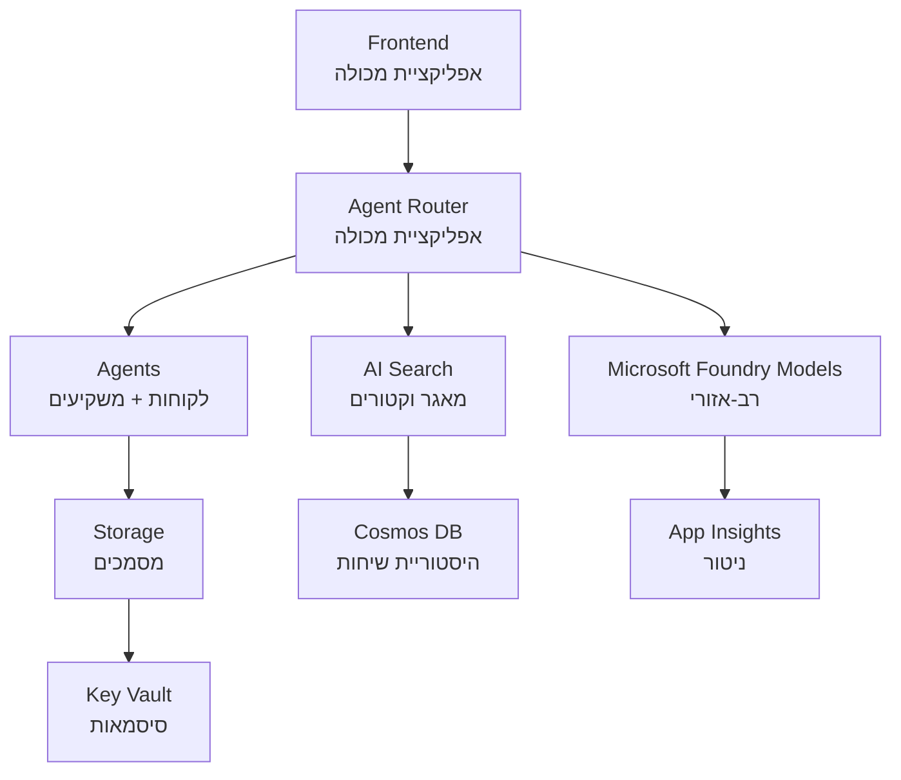

# פתרון רב-סוכנים לסקטור הקמעונאות - תבנית תשתית

**פרק 5: חבילת פריסה בסביבת ייצור**  
- **📚 דף הבית של הקורס**: [AZD למתחילים](../../README.md)  
- **📖 פרק קשור**: [פרק 5: פתרונות AI רב-סוכנים](../../README.md#-chapter-5-multi-agent-ai-solutions-advanced)  
- **📝 מדריך תרחיש**: [ארכיטקטורה מלאה](../retail-scenario.md)  
- **🎯 פריסה מהירה**: [פריסה בלחיצה אחת](#-quick-deployment)  

> **⚠️ תבנית תשתית בלבד**  
> תבנית ARM זו מפריסה **משאבי Azure** למערכת רב-סוכנים.  
>  
> **מה מתקין במהלך הפריסה (15-25 דקות):**  
> - ✅ שירותי Microsoft Foundry Models (gpt-4.1, gpt-4.1-mini, הטמעות באזורי שירות מגוונים)  
> - ✅ שירות Azure AI Search (ריק, מוכן ליצירת אינדקס)  
> - ✅ Container Apps (תמונות מייצגות, מוכנות לקוד שלך)  
> - ✅ אחסון, Cosmos DB, Key Vault, Application Insights  
>  
> **מה לא כלול (דורש פיתוח):**  
> - ❌ קוד יישום הסוכן (סוכן לקוח, סוכן מלאי)  
> - ❌ לוגיקת ניתוב ונקודות קצה של API  
> - ❌ ממשק שיחה בצד לקוח  
> - ❌ סכמות אינדקס חיפוש וצינורות נתונים  
> - ❌ **מאמץ פיתוח מוערך: 80-120 שעות**  
>  
> **השתמש בתבנית זו אם:**  
> - ✅ אתה רוצה להקים תשתית Azure לפרויקט רב-סוכנים  
> - ✅ מתכנן לפתח את קוד הסוכן בנפרד  
> - ✅ צריך בסיס תשתיתי מוכן לייצור  
>  
> **אל תשתמש אם:**  
> - ❌ מצפה לדמו רב-סוכנים עובד מיד  
> - ❌ מחפש דוגמאות קוד מלאה ליישום  

## סקירה כללית

תיקיה זו מכילה תבנית מקיפה של Azure Resource Manager (ARM) לפריסת **תשתית יסוד** של מערכת תמיכת לקוחות רב-סוכנים. התבנית מספקת את כל שירותי Azure הנדרשים, מוגדרים היטב ומחוברים, מוכנים לפיתוח האפליקציה שלך.

**לאחר הפריסה תקבל:** תשתית Azure מוכנה לייצור  
**להשלמת המערכת דרוש:** קוד סוכן, ממשק משתמש, ותצורת נתונים (ראה [מדריך ארכיטקטורה](../retail-scenario.md))

## 🎯 מה מותקן

### תשתית ליבה (מצב לאחר פריסה)

✅ **שירותי Microsoft Foundry Models** (מוכנים לקריאות API)  
- אזור ראשי: פריסת gpt-4.1 (קיבולת 20K TPM)  
- אזור משני: פריסת gpt-4.1-mini (קיבולת 10K TPM)  
- אזור שלישי: מודל הטמעות טקסט (קיבולת 30K TPM)  
- אזור הערכה: מודל gpt-4.1 grader (קיבולת 15K TPM)  
- **מצב:** פועל במלואו - ניתן לבצע קריאות API מיד  

✅ **Azure AI Search** (ריקה - מוכנה לתצורה)  
- הפעלת יכולות חיפוש וקטורי  
- שכבת בסיס עם מחיצת 1, שכפול 1  
- **מצב:** שירות פעיל, אך נדרש יצירת אינדקס  
- **פעולה נדרשת:** צור אינדקס חיפוש עם הסכמה שלך  

✅ **חשבון אחסון Azure** (ריק - מוכן להעלאות)  
- מיכלי Blob: `documents`, `uploads`  
- תצורה מאובטחת (HTTPS בלבד, ללא גישה ציבורית)  
- **מצב:** מוכן לקבל קבצים  
- **פעולה נדרשת:** העלה את נתוני המוצרים והמסמכים  

⚠️ **סביבת Container Apps** (תמונות מייצגות מותקנות)  
- אפליקציית ניתוב סוכנים (תמונה ברירת מחדל nginx)  
- אפליקציית frontend (תמונה ברירת מחדל nginx)  
- קביעת גודל אוטומטי (0-10 מופעים)  
- **מצב:** מפעיל מכולות מייצגות  
- **פעולה נדרשת:** בנה ופרוס את אפליקציות הסוכן שלך  

✅ **Azure Cosmos DB** (ריק - מוכן לנתונים)  
- בסיס נתונים ומיכל מוגדרים מראש  
- מותאם לפעולות עם זמן תגובה נמוך  
- TTL מופעל לניקוי אוטומטי  
- **מצב:** מוכן לאחסון היסטוריית שיחות  

✅ **Azure Key Vault** (אופציונלי - מוכן לסודות)  
- מחיקה רכה מופעלת  
- RBAC מוגדר לזהויות מנוהלות  
- **מצב:** מוכן לאחסון מפתחות API ומחרוזות חיבור  

✅ **Application Insights** (אופציונלי - ניטור פעיל)  
- מחובר למרחב עבודה Log Analytics  
- מדדים מותאמים והתראות מוגדרים  
- **מצב:** מוכן לקבל טלמטריה מהאפליקציות  

✅ **Document Intelligence** (מוכן לקריאות API)  
- שכבת S0 לעומסי עבודה בייצור  
- **מצב:** מוכן לעיבוד מסמכים שהועלו  

✅ **Bing Search API** (מוכן לקריאות API)  
- שכבת S1 לחיפושים בזמן אמת  
- **מצב:** מוכן לשאילתות חיפוש רשת  

### מצבי פריסה

| מצב  | קיבולת OpenAI | מופעי מכולות | שכבת חיפוש | שכפול אחסון    | מתאים ל:                     |
|-------|--------------|--------------|------------|----------------|------------------------------|
| **מינימלי** | 10K-20K TPM   | 0-2 שכפולים | בסיסי      | LRS (מקומי)    | פיתוח/בדיקה, למידה, הוכחת מושג |
| **סטנדרטי** | 30K-60K TPM   | 2-5 שכפולים | סטנדרטי   | ZRS (אזור)    | ייצור, תנועה בינונית (<10K משתמשים) |
| **פרימיום** | 80K-150K TPM  | 5-10 שכפולים, שכפול אזורי | פרימיום   | GRS (גאוגרפי) | ארגוני, תנועה גבוהה (>10K משתמשים), SLA 99.99% |

**השפעת עלות:**  
- **מינימלי → סטנדרטי:** ~4X עלות ($100-370/חודש → $420-1,450/חודש)  
- **סטנדרטי → פרימיום:** ~3X עלות ($420-1,450/חודש → $1,150-3,500/חודש)  
- **בחר לפי:** עומס צפוי, דרישות SLA, מגבלות תקציב  

**תכנון קיבולת:**  
- **TPM (טוקנים לדקה):** סך כל הפריסות של המודלים  
- **מופעי מכולות:** טווח קביעת גודל אוטומטי (מינימום-מקסימום שכפולים)  
- **שכבת חיפוש:** משפיעה על ביצועי שאילתות והגבלות גודל אינדקס  

## 📋 דרישות מוקדמות

### כלים נדרשים  
1. **Azure CLI** (גרסה 2.50.0 ומעלה)  
   ```bash
   az --version  # בדוק גרסה
   az login      # אימת את זהותך
   ```
  
2. **מנוי Azure פעיל** עם גישת בעלים או תורם  
   ```bash
   az account show  # אמת מנוי
   ```
  

### מכסי Azure נדרשים

לפני הפריסה, ודא שיש מכסים מספיקים באזורי היעד שלך:

```bash
# בדוק זמינות דגמי Microsoft Foundry באזור שלך
az cognitiveservices account list-skus \
  --kind OpenAI \
  --location eastus2

# אמת את הקצאת OpenAI (דוגמה ל-gpt-4.1)
az cognitiveservices usage list \
  --location eastus2 \
  --query "[?name.value=='OpenAI.Standard.gpt-4.1']"

# בדוק קצאת אפליקציות מכולה
az provider show \
  --namespace Microsoft.App \
  --query "resourceTypes[?resourceType=='managedEnvironments'].locations"
```
  
**מכסים מינימליים נדרשים:**  
- **Microsoft Foundry Models:** 3-4 פריסות מודלים באזורי שירות  
  - gpt-4.1: 20K TPM (טוקנים לדקה)  
  - gpt-4.1-mini: 10K TPM  
  - text-embedding-ada-002: 30K TPM  
  - **הערה:** ייתכן רשימת המתנה ל-gpt-4.1 באזורים מסוימים - בדוק [זמינות מודלים](https://learn.microsoft.com/azure/ai-services/openai/concepts/models)  
- **Container Apps:** סביבת ניהול + 2-10 מופעי מכולות  
- **AI Search:** שכבת סטנדרט (Basic אינה מספקת לחיפוש וקטורי)  
- **Cosmos DB:** throughput סטנדרטי ממונע  

**אם המכסה אינה מספקת:**  
1. עבור לפורטל Azure → Quotas → בקש הגדלה  
2. או השתמש ב-Azure CLI:  
   ```bash
   az support tickets create \
     --ticket-name "OpenAI-Quota-Increase" \
     --severity "minimal" \
     --description "Request quota increase for Microsoft Foundry Models gpt-4.1 in eastus2"
   ```
  
3. שקול אזורי שירות חלופיים  

## 🚀 פריסה מהירה

### אפשרות 1: באמצעות Azure CLI

```bash
# שיכפול או הורדת קבצי התבנית
git clone <repository-url>
cd examples/retail-multiagent-arm-template

# הפוך את סקריפט הפריסה לביצועי
chmod +x deploy.sh

# פרוס עם הגדרות ברירת מחדל
./deploy.sh -g myResourceGroup

# פרוס עבור ייצור עם תכונות פרימיום
./deploy.sh -g myProdRG -e prod -m premium -l eastus2
```
  
### אפשרות 2: באמצעות פורטל Azure

[](https://portal.azure.com/#create/Microsoft.Template/uri/https%3A%2F%2Fraw.githubusercontent.com%2Fmicrosoft%2Fazd-for-beginners%2Fmain%2Fexamples%2Fretail-multiagent-arm-template%2Fazuredeploy.json)

### אפשרות 3: באמצעות Azure CLI ישירות

```bash
# צור קבוצת משאבים
az group create --name myResourceGroup --location eastus2

# פרוס תבנית
az deployment group create \
  --resource-group myResourceGroup \
  --template-file azuredeploy.json \
  --parameters azuredeploy.parameters.json
```
  
## ⏱️ לוח זמנים לפריסה

### למה לצפות

| שלב               | משך           | מה קורה                     |
|--------------------|---------------|-----------------------------|
| **אימות תבנית**    | 30-60 שניות    | Azure מאמת תחביר ופרמטרים של ה-ARM |
| **הקמת קבוצת משאבים**|10-20 שניות  | יוצר קבוצת משאבים (אם נדרש)        |
| **הקצאת OpenAI**   | 5-8 דקות       | יוצר 3-4 חשבונות OpenAI ומפריס מודלים |
| **Container Apps**  | 3-5 דקות       | יוצר סביבה ומפריס מכולות מייצגות  |
| **Search & Storage**| 2-4 דקות       | מפריס שירות AI Search וחשבונות אחסון  |
| **Cosmos DB**       | 2-3 דקות       | יוצר בסיס נתונים ומגדיר מכולות       |
| **הגדרת ניטור**    | 2-3 דקות       | מגדיר Application Insights ו-Log Analytics |
| **קביעת RBAC**     | 1-2 דקות       | מגדיר זהויות מנוהלות והרשאות         |
| **סך הכל פריסה**  | **15-25 דקות** | תשתית מוכנה לשימוש                  |

**לאחר הפריסה:**  
- ✅ **תשתית מוכנה:** כל שירותי Azure מופעלים ופועלים  
- ⏱️ **פיתוח אפליקציה:** 80-120 שעות (אחריות שלך)  
- ⏱️ **קביעת אינדקס:** 15-30 דקות (דורש הסכמה משלך)  
- ⏱️ **העלאת נתונים:** משתנה לפי גודל מאגר הנתונים  
- ⏱️ **בדיקות ואימות:** 2-4 שעות  

---

## ✅ וודא הצלחת הפריסה

### שלב 1: בדוק מתן משאבים (2 דקות)

```bash
# אמת שכל המשאבים הושקו בהצלחה
az resource list \
  --resource-group myResourceGroup \
  --query "[?provisioningState!='Succeeded'].{Name:name, Status:provisioningState, Type:type}" \
  --output table
```
  
**מצופה:** טבלה ריקה (כל המשאבים במצב "Succeeded")

### שלב 2: אמת פריסות Microsoft Foundry Models (3 דקות)

```bash
# ראה את כל חשבונות OpenAI
az cognitiveservices account list \
  --resource-group myResourceGroup \
  --query "[?kind=='OpenAI'].{Name:name, Location:location, Status:properties.provisioningState}" \
  --output table

# בדוק פריסות דגמים לאזור הראשי
OPENAI_NAME=$(az cognitiveservices account list \
  --resource-group myResourceGroup \
  --query "[?kind=='OpenAI'] | [0].name" -o tsv)

az cognitiveservices account deployment list \
  --name $OPENAI_NAME \
  --resource-group myResourceGroup \
  --output table
```
  
**מצופה:**  
- 3-4 חשבונות OpenAI (אזור ראשי, משני, שלישי והערכה)  
- 1-2 פריסות מודל לכל חשבון (gpt-4.1, gpt-4.1-mini, text-embedding-ada-002)

### שלב 3: בדוק נקודות סוף של התשתית (5 דקות)

```bash
# לקבל כתובות URL של אפליקציית מכולה
az containerapp list \
  --resource-group myResourceGroup \
  --query "[].{Name:name, URL:properties.configuration.ingress.fqdn, Status:properties.runningStatus}" \
  --output table

# לבדוק נקודת קצה של נתב (תמונה ממלא תפקיד תענה)
ROUTER_URL=$(az containerapp show \
  --name retail-router \
  --resource-group myResourceGroup \
  --query "properties.configuration.ingress.fqdn" -o tsv)

echo "Testing: https://$ROUTER_URL"
curl -I https://$ROUTER_URL || echo "Container running (placeholder image - expected)"
```
  
**מצופה:**  
- Container Apps במצב "Running"  
- nginx החלופי מחזיר HTTP 200 או 404 (עדיין ללא קוד יישום)

### שלב 4: אמת גישה ל-API של Microsoft Foundry Models (3 דקות)

```bash
# קבל נקודת קצה ומפתח של OpenAI
OPENAI_ENDPOINT=$(az cognitiveservices account show \
  --name $OPENAI_NAME \
  --resource-group myResourceGroup \
  --query "properties.endpoint" -o tsv)

OPENAI_KEY=$(az cognitiveservices account keys list \
  --name $OPENAI_NAME \
  --resource-group myResourceGroup \
  --query "key1" -o tsv)

# בדוק פריסת gpt-4.1
curl "${OPENAI_ENDPOINT}openai/deployments/gpt-4.1/chat/completions?api-version=2024-08-01-preview" \
  -H "Content-Type: application/json" \
  -H "api-key: $OPENAI_KEY" \
  -d '{
    "messages": [{"role": "user", "content": "Say hello"}],
    "max_tokens": 10
  }'
```
  
**מצופה:** תגובת JSON עם השלמת שיחה (מאשר OpenAI פעיל)

### מה עובד ומה לא

**✅ עובד לאחר פריסה:**  
- מודלים של Microsoft Foundry Models בפריסה ומקבלים קריאות API  
- שירות AI Search פעיל (ריק, ללא אינדקסים)  
- Container Apps פעילים (תמונות nginx מייצגות)  
- חשבונות אחסון נגישים ומוכנים להעלאה  
- Cosmos DB מוכן לפעולות נתונים  
- Application Insights אוסף טלמטריה תשתיתית  
- Key Vault מוכן לאחסון סודות  

**❌ לא עובד עדיין (דורש פיתוח):**  
- נקודות קצה של סוכנים (אין קוד יישום פרוס)  
- פונקציונליות שיחה (דורשת מימוש frontend + backend)  
- שאילתות חיפוש (טרם נוצר אינדקס חיפוש)  
- צנרת עיבוד מסמכים (טרם הועלו נתונים)  
- טלמטריה מותאמת (דורשת הכללת תוכנה)  

**שלבים הבאים:** ראה [הגדרות לאחר פריסה](#-post-deployment-next-steps) לפיתוח ופריסת האפליקציה שלך  

---

## ⚙️ אפשרויות תצורה

### פרמטרי תבנית

| פרמטר              | סוג    | ברירת מחדל         | תיאור                             |
|--------------------|--------|--------------------|----------------------------------|
| `projectName`       | מחרוזת | "retail"           | תחילית לכל שמות המשאבים          |
| `location`          | מחרוזת | מיקום קבוצת משאבים | אזור פריסה ראשי                  |
| `secondaryLocation` | מחרוזת | "westus2"          | אזור משני לפריסה רב-אזורית       |
| `tertiaryLocation`  | מחרוזת | "francecentral"    | אזור לפריסת מודל הטמעות          |
| `environmentName`   | מחרוזת | "dev"              | סימון סביבה (פיתוח/בדיקה/ייצור) |
| `deploymentMode`    | מחרוזת | "standard"         | תצורת פריסה (minimal/standard/premium) |
| `enableMultiRegion` | בוליאני| true               | הפעלת פריסה רב-אזורית            |
| `enableMonitoring`  | בוליאני| true               | הפעלת Application Insights וניטור |
| `enableSecurity`    | בוליאני| true               | הפעלת Key Vault ואבטחה מוגברת     |

### התאמת פרמטרים

ערוך את `azuredeploy.parameters.json`:

```json
{
  "$schema": "https://schema.management.azure.com/schemas/2019-04-01/deploymentParameters.json#",
  "contentVersion": "1.0.0.0",
  "parameters": {
    "projectName": {
      "value": "mycompany"
    },
    "environmentName": {
      "value": "prod"
    },
    "deploymentMode": {
      "value": "premium"
    },
    "location": {
      "value": "eastus2"
    }
  }
}
```
  
## 🏗️ סקירת ארכיטקטורה


## 📖 שימוש בסקריפט פריסה

סקריפט `deploy.sh` מספק חווית פריסה אינטראקטיבית:

```bash
# הצג עזרה
./deploy.sh --help

# פריסה בסיסית
./deploy.sh -g myResourceGroup

# פריסה מתקדמת עם הגדרות מותאמות אישית
./deploy.sh \
  -g myProductionRG \
  -p companyname \
  -e prod \
  -m premium \
  -l eastus2

# פריסת פיתוח ללא מרובי אזורים
./deploy.sh \
  -g myDevRG \
  -e dev \
  -m minimal \
  --no-multi-region \
  --no-security
```
  
### תכונות הסקריפט

- ✅ **אימות דרישות מוקדמות** (Azure CLI, כניסה, קבצי תבנית)  
- ✅ **ניהול קבוצת משאבים** (יוצר במידת הצורך)  
- ✅ **אימות תבנית** לפני פריסה  
- ✅ **מעקב התקדמות** עם פלט בצבעים  
- ✅ **הצגת פלטי פריסה**  
- ✅ **הנחיות לאחר הפריסה**  

## 📊 מעקב פריסה

### בדוק מצב פריסה

```bash
# לרשום פריסות
az deployment group list --resource-group myResourceGroup --output table

# לקבל פרטים על הפריסה
az deployment group show \
  --resource-group myResourceGroup \
  --name retail-deployment-YYYYMMDD-HHMMSS

# לעקוב אחר התקדמות הפריסה
az deployment group create \
  --resource-group myResourceGroup \
  --template-file azuredeploy.json \
  --parameters azuredeploy.parameters.json \
  --verbose
```
  
### פלטי פריסה

לאחר פריסה מוצלחת, זמינים הפלטים הבאים:

- **כתובת frontend**: נקודת קצה ציבורית לממשק ווב  
- **כתובת Router**: נקודת קצה API לנתב הסוכן  
- **נקודות קצה OpenAI**: נקודות השירות הראשית והמשנית  
- **שירות חיפוש**: נקודת קצה לשירות Azure AI Search  
- **חשבון אחסון**: שם חשבון האחסון למסמכים  
- **Key Vault**: שם מחסן המפתחות (אם מופעל)  
- **Application Insights**: שם שירות המעקב (אם מופעל)  

## 🔧 לאחר פריסה: שלבים הבאים
> **📝 חשוב:** התשתית הוצבה, אך עליך לפתח ולפרוס את קוד היישום.

### שלב 1: פיתוח יישומי סוכן (אחריותך)

תבנית ARM יוצרת **יישומי מכולה ריקים** עם תמונות nginx זמניות. עליך:

**פיתוח נדרש:**
1. **מימוש סוכן** (30-40 שעות)
   - סוכן שירות לקוחות עם אינטגרציה ל-gpt-4.1
   - סוכן מלאי עם אינטגרציה ל-gpt-4.1-mini
   - לוגיקת ניתוב סוכנים

2. **פיתוח חזית (Frontend)** (20-30 שעות)
   - ממשק משתמש לשיחה (React/Vue/Angular)
   - פונקציית העלאת קבצים
   - הצגה ועיצוב תגובות

3. **שירותי Backend** (12-16 שעות)
   - נתב FastAPI או Express
   - תווך אימות
   - אינטגרציית טלמטריה

**ראה:** [מדריך ארכיטקטורה](../retail-scenario.md) לדוגמאות קוד ודפוסי מימוש מפורטים

### שלב 2: קביעת אינדקס חיפוש AI (15-30 דקות)

צור אינדקס חיפוש התואם למודל הנתונים שלך:

```bash
# קבל פרטי שירות החיפוש
SEARCH_NAME=$(az search service list \
  --resource-group myResourceGroup \
  --query "[0].name" -o tsv)

SEARCH_KEY=$(az search admin-key show \
  --service-name $SEARCH_NAME \
  --resource-group myResourceGroup \
  --query "primaryKey" -o tsv)

# צור אינדקס עם הסכמה שלך (דוגמה)
curl -X POST "https://${SEARCH_NAME}.search.windows.net/indexes?api-version=2023-11-01" \
  -H "Content-Type: application/json" \
  -H "api-key: ${SEARCH_KEY}" \
  -d '{
    "name": "products",
    "fields": [
      {"name": "id", "type": "Edm.String", "key": true},
      {"name": "title", "type": "Edm.String", "searchable": true},
      {"name": "content", "type": "Edm.String", "searchable": true},
      {"name": "category", "type": "Edm.String", "filterable": true},
      {"name": "content_vector", "type": "Collection(Edm.Single)", 
       "searchable": true, "dimensions": 1536, "vectorSearchProfile": "default"}
    ],
    "vectorSearch": {
      "algorithms": [{"name": "default", "kind": "hnsw"}],
      "profiles": [{"name": "default", "algorithm": "default"}]
    }
  }'
```

**משאבים:**
- [תכנון סכמת אינדקס חיפוש AI](https://learn.microsoft.com/azure/search/search-what-is-an-index)
- [קביעת תצורת חיפוש וקטורי](https://learn.microsoft.com/azure/search/vector-search-how-to-create-index)

### שלב 3: העלאת הנתונים שלך (משך משתנה)

כאשר יש לך נתוני מוצר ומסמכים:

```bash
# קבל פרטי חשבון האחסון
STORAGE_NAME=$(az storage account list \
  --resource-group myResourceGroup \
  --query "[0].name" -o tsv)

STORAGE_KEY=$(az storage account keys list \
  --account-name $STORAGE_NAME \
  --resource-group myResourceGroup \
  --query "[0].value" -o tsv)

# העלה את המסמכים שלך
az storage blob upload-batch \
  --destination documents \
  --source /path/to/your/product/docs \
  --account-name $STORAGE_NAME \
  --account-key $STORAGE_KEY

# דוגמה: העלאת קובץ יחיד
az storage blob upload \
  --container-name documents \
  --name "product-manual.pdf" \
  --file /path/to/product-manual.pdf \
  --account-name $STORAGE_NAME \
  --account-key $STORAGE_KEY
```

### שלב 4: בנייה ופריסת היישומים שלך (8-12 שעות)

כאשר פיתחת את קוד הסוכן שלך:

```bash
# 1. צור רישום מכולות של Azure (אם צריך)
az acr create \
  --name myregistry \
  --resource-group myResourceGroup \
  --sku Basic

# 2. בנה ודחוף תמונת נתב סוכן
docker build -t myregistry.azurecr.io/agent-router:v1 /path/to/your/router/code
az acr login --name myregistry
docker push myregistry.azurecr.io/agent-router:v1

# 3. בנה ודחוף תמונת הממשק הקדמי
docker build -t myregistry.azurecr.io/frontend:v1 /path/to/your/frontend/code
docker push myregistry.azurecr.io/frontend:v1

# 4. עדכן אפליקציות מכולה עם התמונות שלך
az containerapp update \
  --name retail-router \
  --resource-group myResourceGroup \
  --image myregistry.azurecr.io/agent-router:v1

az containerapp update \
  --name retail-frontend \
  --resource-group myResourceGroup \
  --image myregistry.azurecr.io/frontend:v1

# 5. הגדר משתני סביבה
az containerapp update \
  --name retail-router \
  --resource-group myResourceGroup \
  --set-env-vars \
    OPENAI_ENDPOINT=secretref:openai-endpoint \
    OPENAI_KEY=secretref:openai-key \
    SEARCH_ENDPOINT=secretref:search-endpoint \
    SEARCH_KEY=secretref:search-key
```

### שלב 5: בדיקת היישום שלך (2-4 שעות)

```bash
# קבל את כתובת האינטרנט של האפליקציה שלך
ROUTER_URL=$(az containerapp show \
  --name retail-router \
  --resource-group myResourceGroup \
  --query "properties.configuration.ingress.fqdn" -o tsv)

# נקודת הקצה של סוכן הבדיקה (ברגע שקודך מפורסם)
curl -X POST "https://${ROUTER_URL}/chat" \
  -H "Content-Type: application/json" \
  -d '{
    "message": "Hello, I need help with my order",
    "agent": "customer"
  }'

# בדוק יומני יישום
az containerapp logs show \
  --name retail-router \
  --resource-group myResourceGroup \
  --follow
```

### משאבי מימוש

**ארכיטקטורה ועיצוב:**
- 📖 [מדריך הארכיטקטורה המלא](../retail-scenario.md) - דפוסי מימוש מפורטים
- 📖 [דפוסי עיצוב רב-סוכנים](https://learn.microsoft.com/azure/architecture/ai-ml/guide/multi-agent-systems)

**דוגמאות קוד:**
- 🔗 [דוגמת שיחה עם דגמי Foundry של Microsoft](https://github.com/Azure-Samples/azure-search-openai-demo) - דפוס RAG
- 🔗 [Semantic Kernel](https://github.com/microsoft/semantic-kernel) - מסגרת סוכנים (C#)
- 🔗 [LangChain Azure](https://github.com/langchain-ai/langchain) - אורקסטרציה של סוכנים (Python)
- 🔗 [AutoGen](https://github.com/microsoft/autogen) - שיחות רב-סוכניות

**הערכת מאמץ כוללת:**
- פריסת תשתית: 15-25 דקות (✅ הושלם)
- פיתוח יישום: 80-120 שעות (🔨 עבודתך)
- בדיקות ואופטימיזציה: 15-25 שעות (🔨 עבודתך)

## 🛠️ פתרון בעיות

### בעיות נפוצות

#### 1. חריגת מכסת דגמי Microsoft Foundry

```bash
# בדוק את השימוש במכסת הנוכחי
az cognitiveservices usage list --location eastus2

# בקש הגדלת מכסה
az support tickets create \
  --ticket-name "OpenAI-Quota-Increase" \
  --severity "minimal" \
  --description "Request quota increase for Microsoft Foundry Models in region X"
```

#### 2. פריסת יישומי מכולות נכשלה

```bash
# בדוק יומני יישום הקונטיינר
az containerapp logs show \
  --name retail-router \
  --resource-group myResourceGroup \
  --follow

# הפעל מחדש את יישום הקונטיינר
az containerapp revision restart \
  --name retail-router \
  --resource-group myResourceGroup
```

#### 3. אתחול שירות החיפוש

```bash
# אמת את מצב שירות החיפוש
az search service show \
  --name <search-service-name> \
  --resource-group myResourceGroup

# בדוק את חיבוריות שירות החיפוש
curl -X GET "https://<search-service-name>.search.windows.net/indexes?api-version=2023-11-01" \
  -H "api-key: <search-admin-key>"
```

### אימות פריסה

```bash
# לאמת שכל המשאבים נוצרו
az resource list \
  --resource-group myResourceGroup \
  --output table

# לבדוק את מצב הבריאות של המשאב
az resource list \
  --resource-group myResourceGroup \
  --query "[?provisioningState!='Succeeded'].{Name:name, Status:provisioningState, Type:type}" \
  --output table
```

## 🔐 שיקולי אבטחה

### ניהול מפתחות
- כל הסודות מאוחסנים ב-Azure Key Vault (כשמאופשר)
- יישומי מכולות משתמשים בזהות מנוהלת לאימות
- חשבונות אחסון מוגדרים כברירת מחדל מאובטחת (רק HTTPS, ללא גישה ציבורית לבלובים)

### אבטחת רשת
- יישומי מכולות משתמשים ברשת פנימית ככל האפשר
- שירות החיפוש מוגדר עם אפשרות נקודות קצה פרטיות
- Cosmos DB מוגדר עם הרשאות מינימליות נדרשות

### קביעת תצורת RBAC
```bash
# הקצה תפקידים נחוצים לזהות מנוהלת
az role assignment create \
  --assignee <container-app-managed-identity> \
  --role "Cognitive Services OpenAI User" \
  --scope <openai-resource-id>
```

## 💰 אופטימיזציית עלויות

### הערכות עלות (חודשיות, USD)

| מצב | OpenAI | יישומי מכולות | חיפוש | אחסון | סה"כ משוער |
|------|--------|----------------|--------|---------|------------|
| מינימלי | $50-200 | $20-50 | $25-100 | $5-20 | $100-370 |
| סטנדרטי | $200-800 | $100-300 | $100-300 | $20-50 | $420-1450 |
| פרימיום | $500-2000 | $300-800 | $300-600 | $50-100 | $1150-3500 |

### ניטור עלויות

```bash
# הגדר התראות תקציב
az consumption budget create \
  --account-name <subscription-id> \
  --budget-name "retail-budget" \
  --amount 500 \
  --time-grain Monthly \
  --start-date 2024-01-01 \
  --end-date 2024-12-31
```

## 🔄 עדכונים ותחזוקה

### עדכוני תבנית
- ניהול גרסאות עבור קבצי תבנית ARM
- בדיקת שינויים בסביבת פיתוח תחילה
- שימוש במצב פריסה הדרגתי לעדכונים

### עדכוני משאבים
```bash
# עדכן עם פרמטרים חדשים
az deployment group create \
  --resource-group myResourceGroup \
  --template-file azuredeploy.json \
  --parameters azuredeploy.parameters.json \
  --mode Incremental
```

### גיבוי ושחזור
- גיבוי אוטומטי של Cosmos DB מופעל
- מחיקה רכה ב-Key Vault מופעלת
- שמירת סבבי יישום מכולות לצורך חזרה אחורה

## 📞 תמיכה

- **בעיות בתבנית:** [GitHub Issues](https://github.com/microsoft/azd-for-beginners/issues)
- **תמיכת Azure:** [פורטאל התמיכה של Azure](https://portal.azure.com/#blade/Microsoft_Azure_Support/HelpAndSupportBlade)
- **קהילה:** [Azure AI Discord](https://discord.gg/microsoft-azure)

---

**⚡ מוכן לפרוס את פתרון הרב-סוכנים שלך?**

התחל עם: `./deploy.sh -g myResourceGroup`

---

<!-- CO-OP TRANSLATOR DISCLAIMER START -->
**כתב ויתור**:  
מסמך זה תורגם תוך שימוש בשירות תרגום מבוסס בינה מלאכותית [Co-op Translator](https://github.com/Azure/co-op-translator). למרות שאנו שואפים לדיוק, יש להיות מודעים לכך שתרגומים אוטומטיים עשויים להכיל שגיאות או אי דיוקים. יש לראות במסמך המקורי בשפת המקור כמקור הסמכות. למידע קריטי, מומלץ להשתמש בתרגום מקצועי מבני אדם. איננו אחראים לכל אי הבנה או פרשנות שגויה הנובעת משימוש בתרגום זה.
<!-- CO-OP TRANSLATOR DISCLAIMER END -->