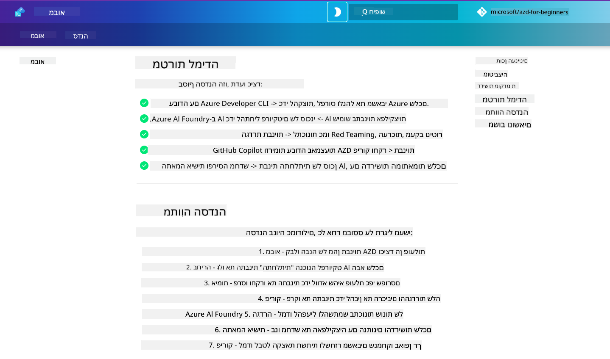

<!--
CO_OP_TRANSLATOR_METADATA:
{
  "original_hash": "9cc966416ab431c38b2ab863884b196c",
  "translation_date": "2025-09-24T22:42:01+00:00",
  "source_file": "workshop/README.md",
  "language_code": "he"
}
-->
# סדנת AZD למפתחי AI

ברוכים הבאים לסדנה המעשית ללימוד Azure Developer CLI (AZD) עם דגש על פריסת יישומי AI. סדנה זו תעזור לכם להבין את תבניות AZD בצורה יישומית בשלושה שלבים:

1. **גילוי** - מצאו את התבנית המתאימה לכם.
1. **פריסה** - פרסו ואמתו שהיא פועלת.
1. **התאמה אישית** - שנו והתאימו אותה לצרכים שלכם!

במהלך הסדנה תכירו גם כלים ותהליכי עבודה מרכזיים למפתחים, שיעזרו לכם לייעל את מסע הפיתוח מקצה לקצה.

<br/>

## מדריך מבוסס דפדפן

שיעורי הסדנה כתובים בפורמט Markdown. ניתן לנווט בהם ישירות ב-GitHub - או להפעיל תצוגה מקדימה מבוססת דפדפן כפי שמוצג בתמונה למטה.



כדי להשתמש באפשרות זו - בצעו Fork למאגר לפרופיל שלכם, והפעילו את GitHub Codespaces. לאחר שהטרמינל של VS Code פעיל, הקלידו את הפקודה הבאה:

```bash title="" linenums="0"
mkdocs serve > /dev/null 2>&1 &
```

תוך מספר שניות תופיע תיבת דו-שיח. בחרו באפשרות `Open in browser`. המדריך מבוסס הדפדפן ייפתח כעת בלשונית חדשה בדפדפן. כמה יתרונות של תצוגה זו:

1. **חיפוש מובנה** - מצאו מילות מפתח או שיעורים במהירות.
1. **אייקון העתקה** - רחפו מעל קטעי קוד כדי לראות אפשרות זו.
1. **מעבר בין נושאים** - החליפו בין ערכות נושא כהות ובהירות.
1. **קבלת עזרה** - לחצו על אייקון Discord בתחתית כדי להצטרף!

<br/>

## סקירת הסדנה

**משך:** 3-4 שעות  
**רמה:** מתחילים עד בינוניים  
**דרישות מקדימות:** היכרות עם Azure, מושגי AI, VS Code וכלי שורת פקודה.

זו סדנה מעשית שבה לומדים תוך כדי עשייה. לאחר שתסיימו את התרגילים, אנו ממליצים לעיין בתוכנית הלימודים של AZD למתחילים כדי להמשיך את מסע הלמידה שלכם לתוך שיטות עבודה מומלצות בתחום האבטחה והפרודוקטיביות.

| זמן | מודול  | מטרה |
|:---|:---|:---|
| 15 דקות | [מבוא](docs/instructions/0-Introduction.md) | הבנת המטרות והכנה |
| 30 דקות | [בחירת תבנית AI](docs/instructions/1-Select-AI-Template.md) | חקר אפשרויות ובחירת תבנית התחלה | 
| 30 דקות | [אימות תבנית AI](docs/instructions/2-Validate-AI-Template.md) | פריסת פתרון ברירת מחדל ל-Azure |
| 30 דקות | [פירוק תבנית AI](docs/instructions/3-Deconstruct-AI-Template.md) | חקר מבנה ותצורה |
| 30 דקות | [הגדרת תבנית AI](docs/instructions/4-Configure-AI-Template.md) | הפעלה וניסיון של תכונות זמינות |
| 30 דקות | [התאמת תבנית AI](docs/instructions/5-Customize-AI-Template.md) | התאמת התבנית לצרכים שלכם |
| 30 דקות | [פירוק תשתית](docs/instructions/6-Teardown-Infrastructure.md) | ניקוי ושחרור משאבים |
| 15 דקות | [סיכום והשלבים הבאים](docs/instructions/7-Wrap-up.md) | משאבי למידה ואתגר הסדנה |

<br/>

## מה תלמדו

חשבו על תבנית AZD כמעין ארגז חול ללמידה, שבו תוכלו לחקור יכולות וכלים שונים לפיתוח מקצה לקצה ב-Azure AI Foundry. בסיום הסדנה, תהיה לכם הבנה אינטואיטיבית של כלים ומושגים שונים בהקשר זה.

| מושג  | מטרה |
|:---|:---|
| **Azure Developer CLI** | הבנת פקודות ותהליכי עבודה של הכלי |
| **תבניות AZD**| הבנת מבנה הפרויקט והתצורה |
| **סוכן AI של Azure**| הקצאה ופריסת פרויקט Azure AI Foundry |
| **חיפוש AI של Azure**| הפעלת הנדסת הקשר עם סוכנים |
| **תצפיות**| חקר מעקב, ניטור והערכות |
| **Red Teaming**| חקר בדיקות אדברסריות ופתרונות |

<br/>

## מבנה הסדנה

הסדנה בנויה כך שתיקח אתכם למסע מגילוי תבניות, דרך פריסה, פירוק והתאמה אישית - תוך שימוש בתבנית ההתחלה הרשמית [Getting Started with AI Agents](https://github.com/Azure-Samples/get-started-with-ai-agents) כבסיס.

### [מודול 1: בחירת תבנית AI](docs/instructions/1-Select-AI-Template.md) (30 דקות)

- מהן תבניות AI?
- היכן ניתן למצוא תבניות AI?
- איך להתחיל לבנות סוכני AI?
- **מעבדה**: התחלה מהירה עם GitHub Codespaces

### [מודול 2: אימות תבנית AI](docs/instructions/2-Validate-AI-Template.md) (30 דקות)

- מהי ארכיטקטורת תבנית AI?
- מהו תהליך העבודה של AZD?
- איך לקבל עזרה בפיתוח עם AZD?
- **מעבדה**: פריסה ואימות תבנית סוכני AI

### [מודול 3: פירוק תבנית AI](docs/instructions/3-Deconstruct-AI-Template.md) (30 דקות)

- חקר הסביבה שלכם ב-`.azure/` 
- חקר הגדרת המשאבים שלכם ב-`infra/` 
- חקר תצורת AZD שלכם ב-`azure.yaml`s
- **מעבדה**: שינוי משתני סביבה ופריסה מחדש

### [מודול 4: הגדרת תבנית AI](docs/instructions/4-Configure-AI-Template.md) (30 דקות)
- חקר: יצירת מידע מוגבר (Retrieval Augmented Generation)
- חקר: הערכת סוכנים ו-Red Teaming
- חקר: מעקב וניטור
- **מעבדה**: חקר סוכן AI + תצפיות 

### [מודול 5: התאמת תבנית AI](docs/instructions/5-Customize-AI-Template.md) (30 דקות)
- הגדרה: PRD עם דרישות תרחיש
- הגדרה: משתני סביבה עבור AZD
- יישום: Lifecycle Hooks למשימות נוספות
- **מעבדה**: התאמת התבנית לתרחיש שלי

### [מודול 6: פירוק תשתית](docs/instructions/6-Teardown-Infrastructure.md) (30 דקות)
- סיכום: מהן תבניות AZD?
- סיכום: למה להשתמש ב-Azure Developer CLI?
- השלבים הבאים: נסו תבנית אחרת!
- **מעבדה**: ביטול הקצאת תשתית וניקוי

<br/>

## אתגר הסדנה

רוצים לאתגר את עצמכם לעשות יותר? הנה כמה הצעות לפרויקטים - או שתפו אותנו ברעיונות שלכם!!

| פרויקט | תיאור |
|:---|:---|
|1. **פירוק תבנית AI מורכבת** | השתמשו בתהליך העבודה ובכלים שהצגנו ונסו לפרוס, לאמת ולהתאים אישית תבנית פתרון AI אחרת. _מה למדתם?_|
|2. **התאמה אישית לתרחיש שלכם**  | נסו לכתוב PRD (מסמך דרישות מוצר) עבור תרחיש אחר. לאחר מכן השתמשו ב-GitHub Copilot במאגר התבנית שלכם במודל סוכן - ובקשו ממנו ליצור עבורכם תהליך התאמה אישית. _מה למדתם? איך אפשר לשפר את ההצעות הללו?_|
| | |

## יש לכם משוב?

1. פרסמו בעיה במאגר זה - תייגו אותה `Workshop` לנוחות.
1. הצטרפו ל-Discord של Azure AI Foundry - התחברו עם עמיתים שלכם!


| | | 
|:---|:---|
| **📚 דף הבית של הקורס**| [AZD למתחילים](../README.md)|
| **📖 תיעוד** | [התחילו עם תבניות AI](https://learn.microsoft.com/en-us/azure/ai-foundry/how-to/develop/ai-template-get-started)|
| **🛠️ תבניות AI** | [תבניות Azure AI Foundry](https://ai.azure.com/templates) |
|**🚀 השלבים הבאים** | [קחו את האתגר](../../../workshop) |
| | |

<br/>

---

**קודם:** [מדריך פתרון בעיות AI](../docs/troubleshooting/ai-troubleshooting.md) | **הבא:** התחילו עם [מעבדה 1: יסודות AZD](../../../workshop/lab-1-azd-basics)

**מוכנים להתחיל לבנות יישומי AI עם AZD?**

[התחילו מעבדה 1: יסודות AZD →](./lab-1-azd-basics/README.md)

---

