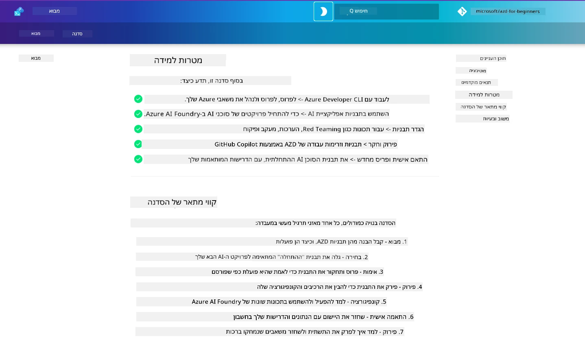

<div align="center">
  <div style="background: linear-gradient(135deg, #0078d4, #106ebe); border-radius: 10px; padding: 20px; margin: 20px 0; box-shadow: 0 4px 15px rgba(0, 120, 212, 0.3); border: 2px solid #005a9e;">
    <h2 style="color: white; margin: 0; font-size: 24px; text-shadow: 1px 1px 2px rgba(0,0,0,0.3);">
      🎯 סדנת AZD למפתחים של AI
    </h2>
    <p style="color: white; margin: 10px 0 0 0; font-size: 16px; text-shadow: 1px 1px 2px rgba(0,0,0,0.3);">
      <strong>סדנה מעשית לבניית יישומי AI באמצעות Azure Developer CLI.</strong><br>
      השלימו 7 מודולים כדי לשלוט בתבניות AZD וזרמי עבודה לפריסת AI.
    </p>
    <div style="margin-top: 15px;">
      <span style="background: rgba(255,255,255,0.2); padding: 5px 10px; border-radius: 15px; color: white; font-size: 14px;">
        📅 עודכן לאחרונה: מרץ 2026
      </span>
    </div>
  </div>
</div>

# סדנת AZD למפתחים של AI

ברוכים הבאים לסדנה מעשית ללימוד Azure Developer CLI (AZD) עם דגש על פריסת יישומי AI. סדנה זו עוזרת לכם לקבל הבנה מעשית של תבניות AZD ב-3 שלבים:

1. **גילוי** - למצוא את התבנית שמתאימה לכם.
1. **פריסה** - לפרוס ולאמת שהיא פועלת.
1. **התאמה אישית** - לשנות ולחזור על התהליך כדי להפוך אותה לשלכם!

במהלך הסדנה תכירו גם כלים וזרמי עבודה מרכזיים למפתחים, שיעזרו לכם לייעל את מסע הפיתוח מקצה לקצה.

<br/>

## מדריך מבוסס דפדפן

שיעורי הסדנה הם ב-Markdown. ניתן לנווט בהם ישירות ב-GitHub - או להפעיל תצוגה מקדימה בדפדפן כפי שמוצג בתמונה למטה.



כדי להשתמש באפשרות זו - בצעו fork של המאגר לפרופיל שלכם, והפעילו את GitHub Codespaces. ברגע שהטרמינל של VS Code פעיל, הקלידו את הפקודה הזו:

תצוגת הדפדפן הזו פועלת ב-GitHub Codespaces, מיכלי פיתוח, או עותק מקומי עם Python ו-MkDocs מותקנים.

```bash title="" linenums="0"
mkdocs serve > /dev/null 2>&1 &
```

כעבור מספר שניות, תופיע תיבת דו-שיח קופצת. בחרו באפשרות `Open in browser`. המדריך מבוסס האינטרנט ייפתח עכשיו בכרטיסיית דפדפן חדשה. כמה יתרונות של תצוגה מקדימה זו:

1. **חיפוש מובנה** - מצאו מילות מפתח או שיעורים במהירות.
1. **אייקון העתקה** - הצביעו מעל קטעי קוד כדי לראות אפשרות זו.
1. **החלפת ערכת נושא** - החליפו בין ערכות נושא כהות ובהירות.
1. **קבלו עזרה** - לחצו על אייקון Discord בכותרת התחתונה כדי להצטרף!

<br/>

## סקירת הסדנה

**משך:** 3-4 שעות  
**רמה:** מתחילים עד בינוני  
**דרישות מוקדמות:** היכרות עם Azure, מושגי AI, VS Code וכלי שורת הפקודה.

זו סדנה מעשית שבה אתם לומדים תוך כדי עשייה. לאחר שתסיימו את התרגילים, אנו ממליצים לעיין בתוכנית הלימודים AZD למתחילים כדי להמשיך את מסע הלמידה שלכם לנושאי אבטחה ופרקטיקות פרודוקטיביות.

| זמן| מודול  | מטרה |
|:---|:---|:---|
| 15 דקות | [מבוא](docs/instructions/0-Introduction.md) | לקבוע מסגרת, להבין את המטרות |
| 30 דקות | [בחירת תבנית AI](docs/instructions/1-Select-AI-Template.md) | לחקור אפשרויות ולבחור תבנית התחלתית | 
| 30 דקות | [אימות תבנית AI](docs/instructions/2-Validate-AI-Template.md) | לפרוס פתרון ברירת מחדל ב-Azure |
| 30 דקות | [פירוק תבנית AI](docs/instructions/3-Deconstruct-AI-Template.md) | לחקור את המבנה וההגדרות |
| 30 דקות | [הגדרת תבנית AI](docs/instructions/4-Configure-AI-Template.md) | להפעיל ולנסות תכונות זמינות |
| 30 דקות | [התאמת תבנית AI](docs/instructions/5-Customize-AI-Template.md) | להתאים את התבנית לצרכים שלך |
| 30 דקות | [פירוק התשתית](docs/instructions/6-Teardown-Infrastructure.md) | לנקות ולשחרר משאבים |
| 15 דקות | [סיכום ושלבים הבאים](docs/instructions/7-Wrap-up.md) | משאבי למידה, אתגר הסדנה |

<br/>

## מה תלמדו

חשבו על תבנית AZD כסביבת למידה לחקור יכולות וכלים שונים לפיתוח מקצה לקצה ב-Microsoft Foundry. בסיום הסדנה, תהיה לכם הבנה אינטואיטיבית של כלים ורעיונות שונים בהקשר זה.

| רעיון  | מטרה |
|:---|:---|
| **Azure Developer CLI** | להבין פקודות וכל זרמי עבודה של הכלי |
| **תבניות AZD**| להבין מבנה וקונפיגורציה של הפרויקט |
| **Azure AI Agent**| לבצע פריסה וניהול פרויקט Microsoft Foundry |
| **Azure AI Search**| לאפשר הנדסת הקשר עם סוכנים |
| **תצפית**| לחקור מעקב, ניטור והערכות |
| **Red Teaming**| לחקור בדיקות עוינות ומניעתן |

<br/>

## מבנה הסדנה

הסדנה בנויה לקחת אתכם למסע מגילוי תבניות, לפריסה, פירוק, והתאמה אישית - תוך שימוש בתבנית הפתיחה הרשמית [Getting Started with AI Agents](https://github.com/Azure-Samples/get-started-with-ai-agents) כבסיס.

### [מודול 1: בחירת תבנית AI](docs/instructions/1-Select-AI-Template.md) (30 דקות)

- מהן תבניות AI?
- איפה אפשר למצוא תבניות AI?
- איך ניתן להתחיל לבנות סוכני AI?
- **מעבדה**: התחלה מהירה ב-Codespaces או מיכל פיתוח

### [מודול 2: אימות תבנית AI](docs/instructions/2-Validate-AI-Template.md) (30 דקות)

- מהי אדריכלות תבנית ה-AI?
- מהו זרם העבודה של פיתוח AZD?
- איך ניתן לקבל עזרה בפיתוח AZD?
- **מעבדה**: לפרוס ולאמת תבנית סוכני AI

### [מודול 3: פירוק תבנית AI](docs/instructions/3-Deconstruct-AI-Template.md) (30 דקות)

- לחקור את הסביבה שלך בתיקייה `.azure/` 
- לחקור את הגדרת המשאבים בתיקייה `infra/` 
- לחקור את קונפיגורציית AZD ב-`azure.yaml`s
- **מעבדה**: לשנות משתני סביבה ולפרוס מחדש

### [מודול 4: הגדרת תבנית AI](docs/instructions/4-Configure-AI-Template.md) (30 דקות)
- לחקור: יצירת תוכן משולבת (Retrieval Augmented Generation)
- לחקור: הערכת סוכנים ו-Red Teaming
- לחקור: מעקב וניטור
- **מעבדה**: לחקור סוכן AI + תצפית

### [מודול 5: התאמת תבנית AI](docs/instructions/5-Customize-AI-Template.md) (30 דקות)
- להגדיר: PRD עם דרישות תרחיש
- להגדיר: משתני סביבה ל-AZD
- ליישם: לולאות חיבור למשימות נוספות
- **מעבדה**: להתאים את התבנית לתרחיש שלי

### [מודול 6: פירוק התשתית](docs/instructions/6-Teardown-Infrastructure.md) (30 דקות)
- סיכום: מהן תבניות AZD?
- סיכום: למה להשתמש ב-Azure Developer CLI?
- שלבים הבאים: לנסות תבנית אחרת!
- **מעבדה**: לפרק תשתיות ולנקות

<br/>

## אתגר הסדנה

רוצים לאתגר את עצמכם עם יותר? הנה כמה הצעות לפרויקטים - או שתשתפו אותנו ברעיונות שלכם!!

| פרויקט | תיאור |
|:---|:---|
|1. **פירוק תבנית AI מורכבת** | השתמשו בזרם העבודה והכלים שהצגנו ונסו לפרוס, לאמת ולהתאים תבנית פתרון AI שונה. _מה למדת?_ |
|2. **התאמה אישית לתרחיש שלך**  | נסו לכתוב PRD (מסמך דרישות מוצר) לתרחיש שונה. לאחר מכן השתמשו ב-GitHub Copilot במאגר התבנית במודל הסוכן ושאלו אותו לייצר עבורכם זרם עבודה להתאמה אישית. _מה למדת? איך אפשר לשפר את ההצעות האלה?_ |
| | |

## האם יש לכם משוב?

1. פרסמו באג במאגר זה - תייגו אותו כ-`Workshop` לנוחות.
1. הצטרפו ל-Discord של Microsoft Foundry - התחברו עם עמיתים!


| | | 
|:---|:---|
| **📚 דף הבית של הקורס**| [AZD למתחילים](../README.md)|
| **📖 תיעוד** | [התחילו עם תבניות AI](https://learn.microsoft.com/en-us/azure/ai-foundry/how-to/develop/ai-template-get-started)|
| **🛠️ תבניות AI** | [תבניות Microsoft Foundry](https://ai.azure.com/templates) |
|**🚀 שלבים הבאים** | [התחל סדנה](#סקירת-הסדנה) |
| | |

<br/>

---

**ניווט:** [הקורס הראשי](../README.md) | [מבוא](docs/instructions/0-Introduction.md) | [מודול 1: בחירת תבנית](docs/instructions/1-Select-AI-Template.md)

**מוכנים להתחיל לבנות יישומי AI עם AZD?**

[התחל סדנה: מבוא →](docs/instructions/0-Introduction.md)

---

<!-- CO-OP TRANSLATOR DISCLAIMER START -->
**כתב ויתור**:  
מסמך זה תורגם באמצעות שירות תרגום מבוסס בינה מלאכותית [Co-op Translator](https://github.com/Azure/co-op-translator). בעוד שאנו שואפים לדיוק, יש לקחת בחשבון כי תרגומים אוטומטיים עלולים להכיל שגיאות או אי-דיוקים. המסמך המקורי בשפת המקור שלו צריך להיחשב למקור הסמכותי. למידע קריטי, מומלץ להשתמש בתרגום מקצועי על ידי מתרגם אנושי. אנו לא אחראים לכל הבנה מוטעית או פרשנות שגויה הנובעות משימוש בתרגום זה.
<!-- CO-OP TRANSLATOR DISCLAIMER END -->