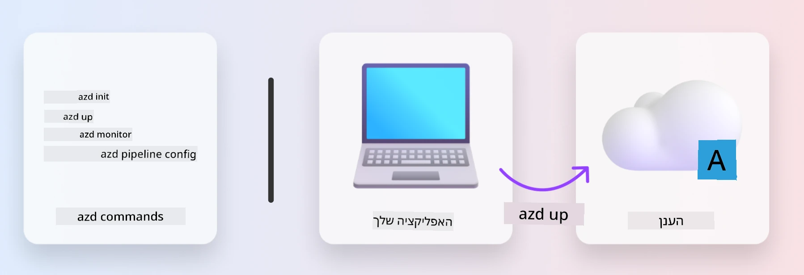
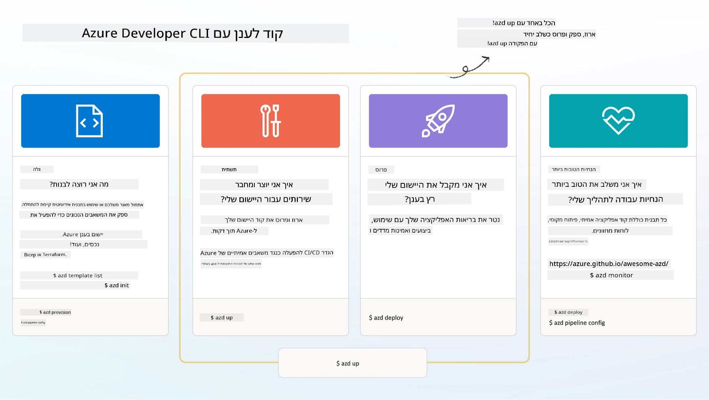

# 1. בחירת תבנית

!!! tip "בסיום המודול הזה תוכל"

    - [ ] לתאר מהן תבניות AZD
    - [ ] לגלות ולהשתמש בתבניות AZD עבור AI
    - [ ] להתחיל עם תבנית AI Agents
    - [ ] **מעבדה 1:** AZD Quickstart עם GitHub Codespaces

---

## 1. אנלוגיה של בנייה

בניית אפליקציה מודרנית מבוססת AI ברמה ארגונית _מאפס_ יכולה להיות משימה מרתיעה. זה קצת כמו לבנות את הבית החדש שלך לבד, לבנה אחר לבנה. כן, זה אפשרי! אבל זו לא הדרך היעילה ביותר להגיע לתוצאה הרצויה!

במקום זאת, אנחנו בדרך כלל מתחילים עם _תוכנית עיצוב קיימת_, ועובדים עם אדריכל כדי להתאים אותה לדרישות האישיות שלנו. וזה בדיוק הגישה שיש לנקוט כשבונים אפליקציות חכמות. קודם כל, מצא ארכיטקטורת עיצוב טובה שמתאימה לבעיה שלך. לאחר מכן, עבד עם אדריכל פתרונות כדי להתאים ולפתח את הפתרון לתרחיש הספציפי שלך.

אבל איפה אפשר למצוא את תוכניות העיצוב האלה? ואיך מוצאים אדריכל שמוכן ללמד אותנו איך להתאים ולפרוס את התוכניות האלה בעצמנו? בסדנה הזו, נענה על השאלות הללו על ידי היכרות עם שלוש טכנולוגיות:

1. [Azure Developer CLI](https://aka.ms/azd) - כלי קוד פתוח שמאיץ את הדרך של המפתח מהפיתוח המקומי (build) לפריסה בענן (ship).
1. [Azure AI Foundry Templates](https://ai.azure.com/templates) - מאגרי קוד פתוח סטנדרטיים המכילים קוד לדוגמה, תשתית וקבצי תצורה לפריסת ארכיטקטורת פתרון AI.
1. [GitHub Copilot Agent Mode](https://code.visualstudio.com/docs/copilot/chat/chat-agent-mode) - סוכן קוד המבוסס על ידע של Azure, שיכול להנחות אותנו בניווט בקוד וביצוע שינויים - באמצעות שפה טבעית.

עם הכלים האלה בידינו, נוכל עכשיו _לגלות_ את התבנית הנכונה, _לפרוס_ אותה כדי לוודא שהיא עובדת, ו_להתאים_ אותה לצרכים הספציפיים שלנו. בואו נצלול פנימה ונלמד איך זה עובד.

---

## 2. Azure Developer CLI

[Azure Developer CLI](https://learn.microsoft.com/en-us/azure/developer/azure-developer-cli/) (או `azd`) הוא כלי שורת פקודה בקוד פתוח שיכול להאיץ את המסע שלך מקוד לענן עם סט פקודות ידידותיות למפתח שעובדות באופן עקבי בסביבת ה-IDE (פיתוח) ובסביבת CI/CD (DevOps).

עם `azd`, מסע הפריסה שלך יכול להיות פשוט כמו:

- `azd init` - מאתחל פרויקט AI חדש מתבנית AZD קיימת.
- `azd up` - מקצה תשתית ומפרוס את האפליקציה שלך בצעד אחד.
- `azd monitor` - מספק ניטור בזמן אמת ואבחון לאפליקציה שפרסת.
- `azd pipeline config` - מגדיר צינורות CI/CD לאוטומציה של פריסה ל-Azure.

**🎯 | תרגיל**: <br/> חקור את כלי שורת הפקודה `azd` בסביבת GitHub Codespaces שלך עכשיו. התחל בהקלדת הפקודה הזו כדי לראות מה הכלי יכול לעשות:

```bash title="" linenums="0"
azd help
```



---

## 3. תבנית AZD

כדי ש-`azd` יוכל לבצע את הפעולות הללו, הוא צריך לדעת את התשתית שיש להקצות, את הגדרות התצורה שיש לאכוף, ואת האפליקציה שיש לפרוס. כאן נכנסות לתמונה [תבניות AZD](https://learn.microsoft.com/en-us/azure/developer/azure-developer-cli/azd-templates?tabs=csharp).

תבניות AZD הן מאגרי קוד פתוח שמשלבים קוד לדוגמה עם קבצי תשתית ותצורה הנדרשים לפריסת ארכיטקטורת הפתרון. 
באמצעות גישה של _תשתית כקוד_ (IaC), הן מאפשרות להגדיר את משאבי התבנית והגדרות התצורה בצורה שניתן לשלוט בגרסאות שלהן (בדיוק כמו קוד המקור של האפליקציה) - מה שיוצר תהליכי עבודה חוזרים ועקביים בין משתמשי הפרויקט.

כשאתה יוצר או משתמש בתבנית AZD עבור התרחיש שלך, שקול את השאלות הבאות:

1. מה אתה בונה? → האם יש תבנית שמכילה קוד התחלתי עבור התרחיש הזה?
1. איך הפתרון שלך בנוי? → האם יש תבנית שמכילה את המשאבים הנדרשים?
1. איך הפתרון שלך נפרס? → חשב על `azd deploy` עם hooks לעיבוד לפני/אחרי!
1. איך אפשר לשפר אותו עוד יותר? → חשב על ניטור מובנה וצינורות אוטומציה!

**🎯 | תרגיל**: <br/> 
בקר בגלריית [Awesome AZD](https://azure.github.io/awesome-azd/) והשתמש במסננים כדי לחקור את 250+ התבניות הזמינות כרגע. ראה אם תוכל למצוא אחת שמתאימה לדרישות התרחיש שלך.



---

## 4. תבניות אפליקציות AI

---

