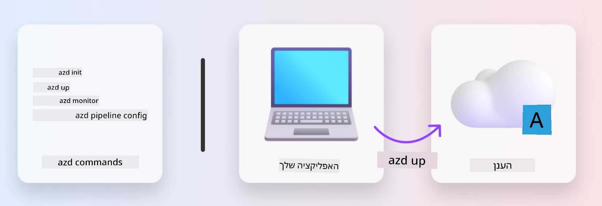
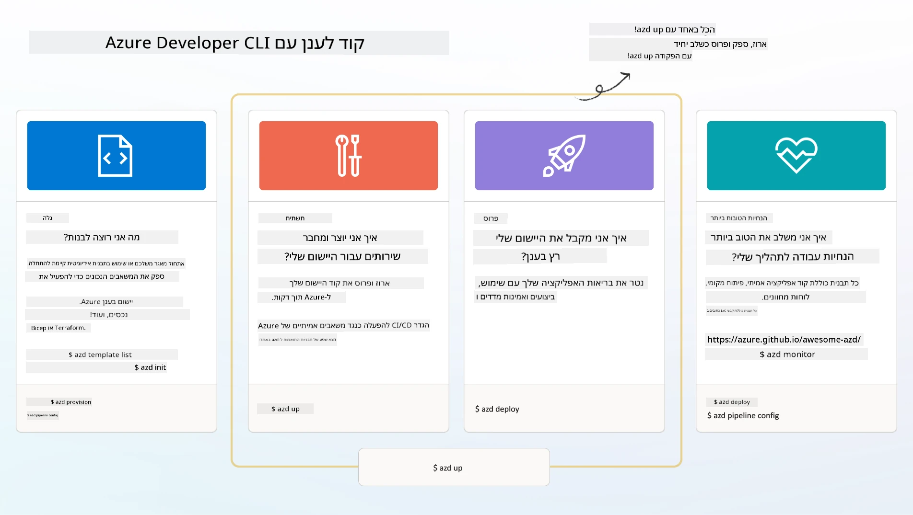

# 1. בחר תבנית

!!! tip "בסוף מודול זה תוכל ל"

    - [ ] לתאר מהן תבניות AZD
    - [ ] לגלות ולהשתמש בתבניות AZD ל-AI
    - [ ] להתחיל עם תבנית AI Agents
    - [ ] **מעבדת 1:** התחלה מהירה עם AZD ב-Codespaces או מכולת פיתוח

---

## 1. אנלוגיה לבונה

לבנות אפליקציית AI מודרנית ומוכנה לארגון _מהתחלה_ יכול להיות מאתגר. זה קצת כמו לבנות את הבית החדש שלך בעצמך, לבנה אחר לבנה. כן, זה אפשרי! אבל זו לא הדרך היעילה ביותר לקבל את התוצאה הרצויה!

במקום זאת, אנחנו בדרך כלל מתחילים מתוכנית עיצוב קיימת, ועובדים עם אדריכל כדי להתאים אותה לדרישות האישיות שלנו. וזה בדיוק הגישה שיש לנקוט בבניית אפליקציות אינטליגנטיות. קודם כל, מצאו ארכיטקטורת עיצוב טובה שמתאימה לתחום הבעיה שלכם. לאחר מכן עבודו עם אדריכל פתרונות כדי להתאים ולפתח את הפתרון לתרחיש הספציפי שלכם.

אבל איפה אפשר למצוא את תוכניות העיצוב האלה? ואיך למצוא אדריכל שמוכן ללמד אותנו כיצד להתאים ולהטמיע את התוכניות האלה בעצמנו? בסדנה זו, אנו עונים על שאלות אלו על ידי הצגת שלוש טכנולוגיות:

1. [Azure Developer CLI](https://aka.ms/azd) - כלי קוד פתוח שמאיץ את דרכו של המפתח ממפתח מקומי (build) לפריסה בענן (ship).
1. [Microsoft Foundry Templates](https://ai.azure.com/templates) - מאגרים סטנדרטיים בקוד פתוח המכילים קוד לדוגמה, תשתיות וקבצי הגדרה לפריסת ארכיטקטורת פתרון AI.
1. [GitHub Copilot Agent Mode](https://code.visualstudio.com/docs/copilot/chat/chat-agent-mode) - סוכן קידוד מבוסס ידע של Azure, שיכול להנחות אותנו בהתמצאות בקוד וביצוע שינויים - בשפה טבעית.

עם הכלים האלה ביד, יש לנו כעת את היכולת _לגלות_ את התבנית הנכונה, _לפרוס_ אותה כדי לוודא שהיא פועלת, ו-_לשנות_ אותה כך שתתאים לתרחישים הספציפיים שלנו. בואו נצלול ונלמד כיצד הם פועלים.


---

## 2. Azure Developer CLI

ה-[Azure Developer CLI](https://learn.microsoft.com/en-us/azure/developer/azure-developer-cli/) (או `azd`) הוא כלי שורת פקודה בקוד פתוח שיכול לזרז את המסע שלך מקוד לענן עם סט פקודות ידידותיות למפתח שעובדות באופן עקבי בין סביבת הפיתוח שלך (IDE) וסביבת ה-CI/CD (דוואופס).

עם `azd`, המסע שלך לפריסה יכול להיות פשוט כמו:

- `azd init` - מאתחל פרויקט AI חדש מתבנית AZD קיימת.
- `azd up` - מספק תשתית ומפרוס את האפליקציה שלך בצעד אחד.
- `azd monitor` - מקבל ניטור בזמן אמת ואבחון לאפליקציה שהופעלה.
- `azd pipeline config` - מגדיר צנרת CI/CD לאוטומציה של הפריסה לאשור.

**🎯 | תרגיל**: <br/> חקור את כלי שורת הפקודה `azd` בסביבת הסדנה הנוכחית שלך עכשיו. זה יכול להיות GitHub Codespaces, מכולת פיתוח, או שכפול מקומי עם כל הדרישות המוקדמות מותקנות. התחל בהקלדת הפקודה הזו כדי לראות מה הכלי יכול לעשות:

```bash title="" linenums="0"
azd help
```



---

## 3. תבנית AZD

כדי ש-`azd` ישיג זאת, הוא צריך לדעת את התשתית לפרוס, את הגדרות התצורה לאכוף, ואת האפליקציה לפרוס. כאן נכנסות לתמונה [תבניות AZD](https://learn.microsoft.com/en-us/azure/developer/azure-developer-cli/azd-templates?tabs=csharp).

תבניות AZD הן מאגרים בקוד פתוח שמכילים שילוב של קוד לדוגמה עם קבצי תשתית והגדרה הדרושים לפריסת ארכיטקטורת הפתרון.
באמצעות גישת _תשתית כקוד_ (IaC), הן מאפשרות שהגדרות המשאבים וקבצי התצורה יהיו תחת בקרת גרסאות (כמו קוד המקור של האפליקציה) - ויוצרות זרימות עבודה אחידות ונגישות למשתמשים בפרויקט.

כשאתה יוצר או משתמש מחדש בתבנית AZD עבור התרחיש _שלך_, שקול את השאלות הבאות:

1. מה אתה בונה? → האם יש תבנית שמכילה קוד התחלתי לתרחיש זה?
1. איך האדריכלות של הפתרון שלך? → האם יש תבנית עם המשאבים הדרושים?
1. איך הפתרון שלך מנוהל? → חשוב על `azd deploy` עם תהליכי עיבוד מוקדמים/מאוחרים!
1. איך אפשר לייעל אותו עוד יותר? → חשוב על ניטור מובנה וצינורות אוטומציה!

**🎯 | תרגיל**: <br/> 
בקרו בגלריה [Awesome AZD](https://azure.github.io/awesome-azd/) והשתמשו במסננים כדי לחקור את 250+ התבניות הזמינות כרגע. נסה למצוא תבנית שמתאימה לדרישות התרחיש _שלך_.



---

## 4. תבניות אפליקציות AI

לאפליקציות המופעלות במערכת AI, Microsoft מספקת תבניות מיוחדות הכוללות את **Microsoft Foundry** ו-**Foundry Agents**. תבניות אלו מאיצות את הדרך שלך לבניית אפליקציות אינטליגנטיות ומוכנות לייצור.

### תבניות Microsoft Foundry ו-Foundry Agents

בחר תבנית להלן לפריסה. כל תבנית זמינה ב-[Awesome AZD](https://azure.github.io/awesome-azd/) וניתן לאתחל אותה בפקודה אחת.

| תבנית | תיאור | פקודת פריסה |
|----------|-------------|----------------|
| **[AI Chat with RAG](https://azure.github.io/awesome-azd/?tags=ai&tags=rag)** | אפליקציית צ'אט עם יצירת מידע משופרת באמצעות Microsoft Foundry | `azd init -t azure-samples/azure-search-openai-demo` |
| **[Foundry Agent Service Starter](https://azure.github.io/awesome-azd/?tags=ai&tags=agents)** | בנה סוכני AI עם Foundry Agents לביצוע משימות אוטונומיות | `azd init -t azure-samples/foundry-agent-service-starter` |
| **[Multi-Agent Orchestration](https://azure.github.io/awesome-azd/?tags=ai&tags=agents)** | תיאום ריבוי סוכני Foundry לזרימות עבודה מורכבות | `azd init -t azure-samples/multi-agent-orchestration` |
| **[AI Document Intelligence](https://azure.github.io/awesome-azd/?tags=ai&tags=document)** | חילוץ וניתוח מסמכים עם מודלים של Microsoft Foundry | `azd init -t azure-samples/ai-document-processing` |
| **[Conversational AI Bot](https://azure.github.io/awesome-azd/?tags=ai&tags=bot)** | בנה רובוטי צ'אט אינטיליגנטיים עם אינטגרציה של Microsoft Foundry | `azd init -t azure-samples/ai-chat-protocol` |
| **[AI Image Generation](https://azure.github.io/awesome-azd/?tags=ai&tags=dalle)** | יצירת תמונות באמצעות DALL-E דרך Microsoft Foundry | `azd init -t azure-samples/ai-image-generation` |
| **[Semantic Kernel Agent](https://azure.github.io/awesome-azd/?tags=ai&tags=semantic-kernel)** | סוכני AI המשתמשים ב-Semantic Kernel עם Foundry Agents | `azd init -t azure-samples/semantic-kernel-agent` |
| **[AutoGen Multi-Agent](https://azure.github.io/awesome-azd/?tags=ai&tags=autogen)** | מערכות ריבוי סוכנים בעזרת מסגרת AutoGen | `azd init -t azure-samples/autogen-multi-agent` |

### התחלה מהירה

1. **עיין בתבניות**: בקר בכתובת [https://azure.github.io/awesome-azd/](https://azure.github.io/awesome-azd/) וסנן לפי `AI`, `Agents`, או `Microsoft Foundry`
2. **בחר את התבנית שלך**: בחר אחת שתתאים למקרה השימוש שלך
3. **אתחל**: הפעל את הפקודה `azd init` עבור התבנית שבחרת
4. **פרוס**: הפעל `azd up` לספק ולפרוס

**🎯 | תרגיל**: <br/>
בחר אחת מהתבניות למעלה על בסיס התרחיש שלך:

- **בונה רובוט צ'אט?** → התחל עם **AI Chat with RAG** או **Conversational AI Bot**
- **צריך סוכנים אוטונומיים?** → נסה את **Foundry Agent Service Starter** או **Multi-Agent Orchestration**
- **מעבד מסמכים?** → השתמש ב-**AI Document Intelligence**
- **רוצה סיוע בקידוד AI?** → חקור את **Semantic Kernel Agent** או **AutoGen Multi-Agent**

```bash title="Example: Deploy the AI Chat with RAG template" linenums="0"
azd init -t azure-samples/azure-search-openai-demo
azd up
```

!!! info "גלה תבניות נוספות"
    בגלריית [Awesome AZD](https://azure.github.io/awesome-azd/) יש מעל 250 תבניות. השתמש במסננים כדי למצוא תבניות התואמות לדרישות הספציפיות שלך לשפה, מסגרת עבודה, ושירותי Azure.

---

<!-- CO-OP TRANSLATOR DISCLAIMER START -->
**כתב ויתור**:  
מסמך זה תורגם באמצעות שירות תרגום מבוסס בינה מלאכותית [Co-op Translator](https://github.com/Azure/co-op-translator). למרות שאנו משתדלים לדייק, יש להביא בחשבון כי תרגומים אוטומטיים עלולים להכיל שגיאות או אי-דיוקים. יש לראות במסמך המקורי בשפת המקור כמקור הסמכותי. למידע קריטי מומלץ להיעזר בתרגום מקצועי אנושי. אנו לא אחראים לכל הבנה שגויה או פירוש שגוי הנובע משימוש בתרגום זה.
<!-- CO-OP TRANSLATOR DISCLAIMER END -->