# 2. אימות תבנית

!!! tip "בסיום המודול הזה תוכל"

    - [ ] לנתח את ארכיטקטורת פתרון ה-AI
    - [ ] להבין את זרימת העבודה של פריסת AZD
    - [ ] להשתמש ב-GitHub Copilot לקבלת עזרה בשימוש ב-AZD
    - [ ] **מעבדה 2:** לפרוס ולאמת את תבנית סוכני ה-AI

---

## 1. מבוא

[Azure Developer CLI](https://learn.microsoft.com/en-us/azure/developer/azure-developer-cli/) או `azd` הוא כלי שורת פקודה בקוד פתוח שמייעל את זרימת העבודה של המפתחים בעת בנייה ופריסה של אפליקציות ל-Azure.

[תבניות AZD](https://learn.microsoft.com/azure/developer/azure-developer-cli/azd-templates) הן מאגרי מידע סטנדרטיים הכוללים קוד אפליקציה לדוגמה, נכסים של _תשתית כקוד_, וקבצי תצורה של `azd` עבור ארכיטקטורת פתרון אחידה. פריסת התשתית הופכת לפשוטה כמו פקודת `azd provision` - בעוד שפקודת `azd up` מאפשרת לך לפרוס תשתית **וגם** לפרוס את האפליקציה שלך בפעולה אחת!

כתוצאה מכך, התחלת תהליך פיתוח האפליקציה שלך יכולה להיות פשוטה כמו מציאת _תבנית AZD Starter_ המתאימה ביותר לצרכים שלך באפליקציה ובתשתית - ואז התאמת המאגר לדרישות התרחיש שלך.

לפני שנתחיל, בואו נוודא שיש לכם את Azure Developer CLI מותקן.

1. פתחו טרמינל ב-VS Code והקלידו את הפקודה הבאה:

      ```bash title="" linenums="0"
      azd version
      ```

1. אתם אמורים לראות משהו כזה!

      ```bash title="" linenums="0"
      azd version 1.19.0 (commit b3d68cea969b2bfbaa7b7fa289424428edb93e97)
      ```

**עכשיו אתם מוכנים לבחור ולפרוס תבנית עם azd**

---

## 2. בחירת תבנית

פלטפורמת Azure AI Foundry מגיעה עם [סט של תבניות AZD מומלצות](https://learn.microsoft.com/en-us/azure/ai-foundry/how-to/develop/ai-template-get-started) המכסות תרחישי פתרון פופולריים כמו _אוטומציה של זרימת עבודה רב-סוכנים_ ו-_עיבוד תוכן רב-מודאלי_. ניתן גם לגלות את התבניות הללו על ידי ביקור בפורטל Azure AI Foundry.

1. בקרו ב-[https://ai.azure.com/templates](https://ai.azure.com/templates)
1. התחברו לפורטל Azure AI Foundry כאשר תתבקשו - אתם תראו משהו כזה.

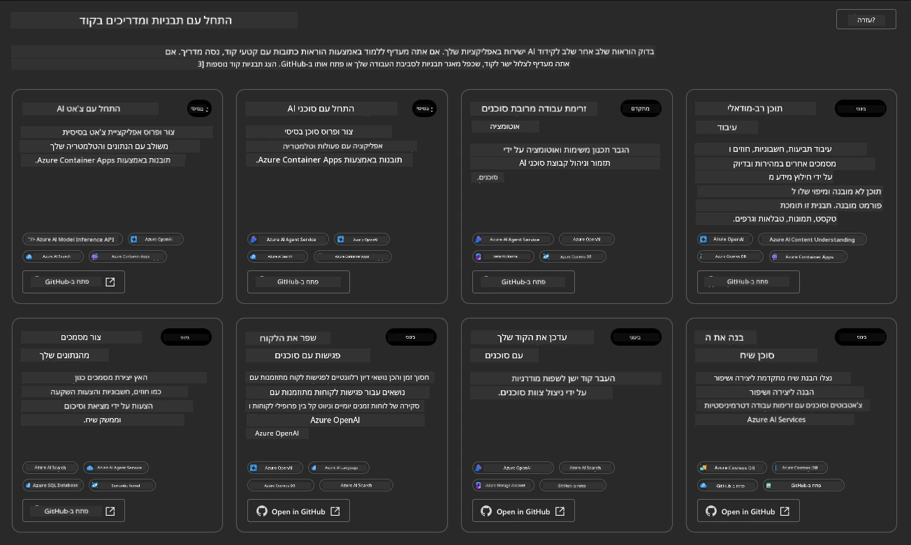

אפשרויות ה-**Basic** הן תבניות ההתחלה שלכם:

1. [ ] [Get Started with AI Chat](https://github.com/Azure-Samples/get-started-with-ai-chat) שמפרסת אפליקציית צ'אט בסיסית _עם הנתונים שלכם_ ל-Azure Container Apps. השתמשו בזה כדי לחקור תרחיש צ'אט AI בסיסי.
1. [X] [Get Started with AI Agents](https://github.com/Azure-Samples/get-started-with-ai-agents) שמפרסת גם סוכן AI סטנדרטי (עם שירות Azure AI Agent). השתמשו בזה כדי להכיר פתרונות AI סוכנים הכוללים כלים ומודלים.

בקרו בקישור השני בלשונית דפדפן חדשה (או לחצו על `Open in GitHub` עבור הכרטיס הקשור). אתם אמורים לראות את המאגר עבור תבנית AZD זו. קחו דקה לחקור את ה-README. ארכיטקטורת האפליקציה נראית כך:

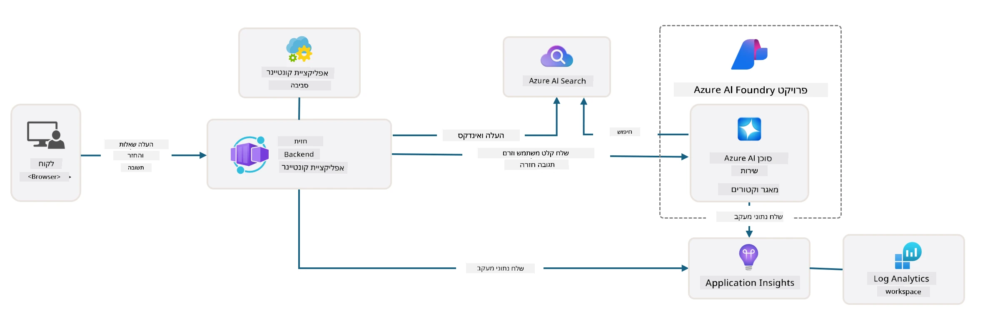

---

## 3. הפעלת תבנית

בואו ננסה לפרוס את התבנית הזו ולוודא שהיא תקפה. נעקוב אחר ההנחיות בסעיף [Getting Started](https://github.com/Azure-Samples/get-started-with-ai-agents?tab=readme-ov-file#getting-started).

1. לחצו על [הקישור הזה](https://github.com/codespaces/new/Azure-Samples/get-started-with-ai-agents) - אשרו את הפעולה המוגדרת כברירת מחדל ל-`Create codespace`
1. זה יפתח לשונית דפדפן חדשה - המתינו לטעינת מושב GitHub Codespaces
1. פתחו את טרמינל VS Code ב-Codespaces - הקלידו את הפקודה הבאה:

   ```bash title="" linenums="0"
   azd up
   ```

השלימו את שלבי זרימת העבודה שיתחילו:

1. תתבקשו להתחבר ל-Azure - עקבו אחר ההוראות לאימות
1. הזינו שם סביבה ייחודי עבורכם - לדוגמה, אני השתמשתי ב-`nitya-mshack-azd`
1. זה ייצור תיקיית `.azure/` - אתם תראו תיקיית משנה עם שם הסביבה
1. תתבקשו לבחור שם מנוי - בחרו את ברירת המחדל
1. תתבקשו לבחור מיקום - השתמשו ב-`East US 2`

עכשיו, המתינו להשלמת הפריסה. **זה לוקח 10-15 דקות**

1. כשהתהליך יסתיים, הקונסולה שלכם תציג הודעת SUCCESS כמו זו:
      ```bash title="" linenums="0"
      SUCCESS: Your up workflow to provision and deploy to Azure completed in 10 minutes 17 seconds.
      ```
1. פורטל Azure שלכם יכלול עכשיו קבוצת משאבים פרוסה עם שם הסביבה הזה:

      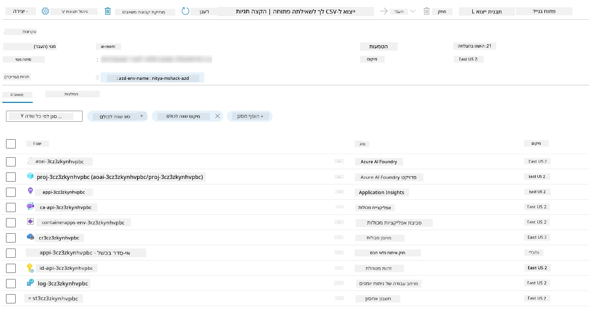

1. **עכשיו אתם מוכנים לאמת את התשתית והאפליקציה שפורסו**.

---

## 4. אימות תבנית

1. בקרו בדף [Resource Groups](https://portal.azure.com/#browse/resourcegroups) בפורטל Azure - התחברו כאשר תתבקשו
1. לחצו על קבוצת המשאבים עבור שם הסביבה שלכם - אתם תראו את הדף למעלה

      - לחצו על משאב Azure Container Apps
      - לחצו על כתובת ה-URL של האפליקציה בסעיף _Essentials_ (בפינה הימנית העליונה)

1. אתם אמורים לראות ממשק משתמש של אפליקציה מתארחת כמו זה:

   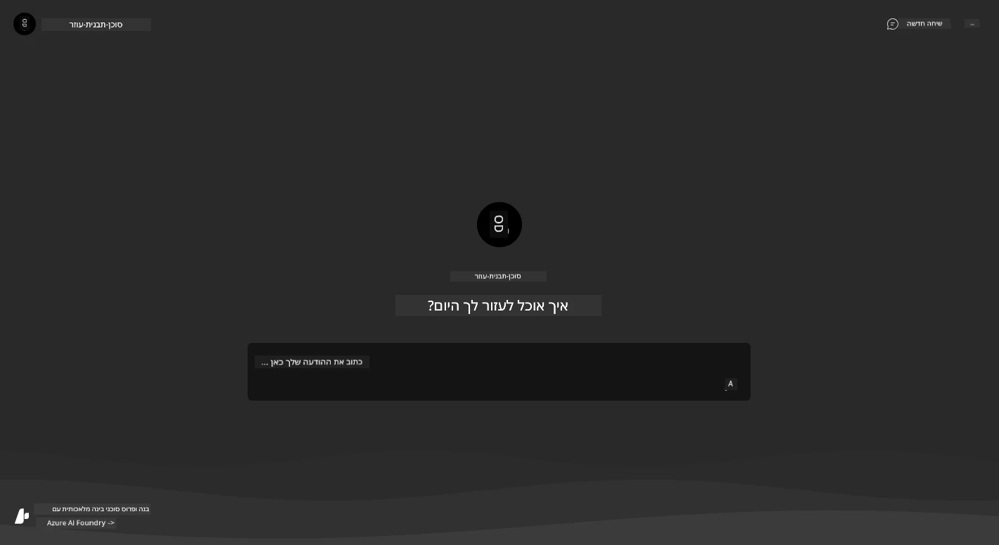

1. נסו לשאול כמה [שאלות לדוגמה](https://github.com/Azure-Samples/get-started-with-ai-agents/blob/main/docs/sample_questions.md)

      1. שאלו: ```What is the capital of France?``` 
      1. שאלו: ```What's the best tent under $200 for two people, and what features does it include?```

1. אתם אמורים לקבל תשובות דומות למה שמוצג למטה. _אבל איך זה עובד?_ 

      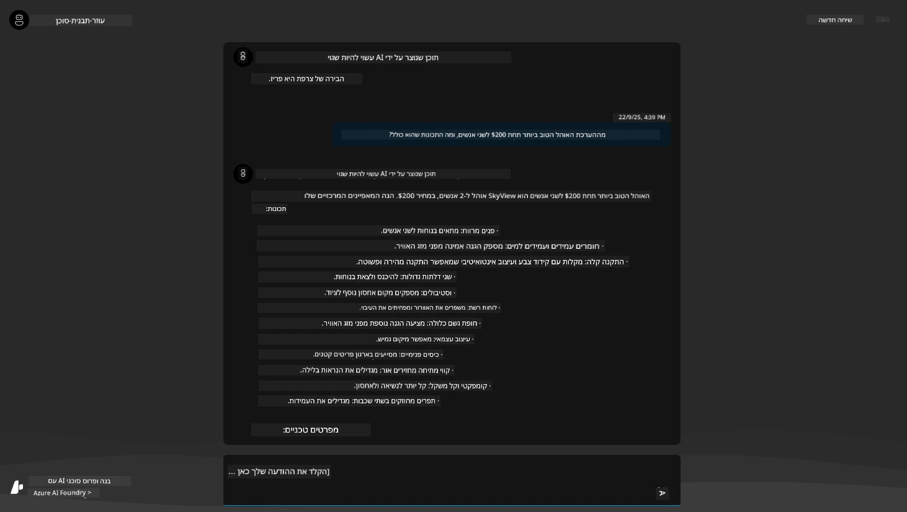

---

## 5. אימות סוכן

אפליקציית Azure Container מפרסת נקודת קצה שמתחברת לסוכן AI שפורס בפרויקט Azure AI Foundry עבור תבנית זו. בואו נבחן מה זה אומר.

1. חזרו לדף _Overview_ של קבוצת המשאבים שלכם בפורטל Azure

1. לחצו על משאב `Azure AI Foundry` ברשימה הזו

1. אתם אמורים לראות את זה. לחצו על כפתור `Go to Azure AI Foundry Portal`. 
   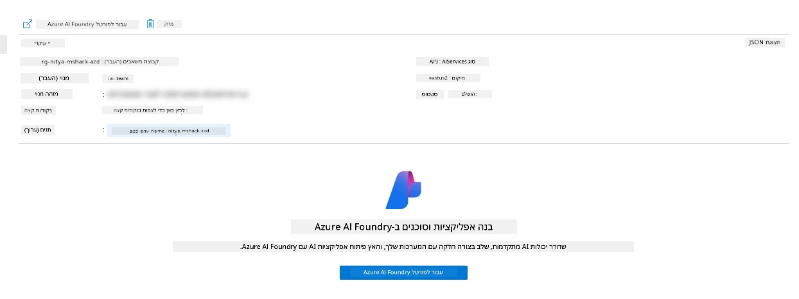

1. אתם אמורים לראות את דף הפרויקט של Foundry עבור אפליקציית ה-AI שלכם
   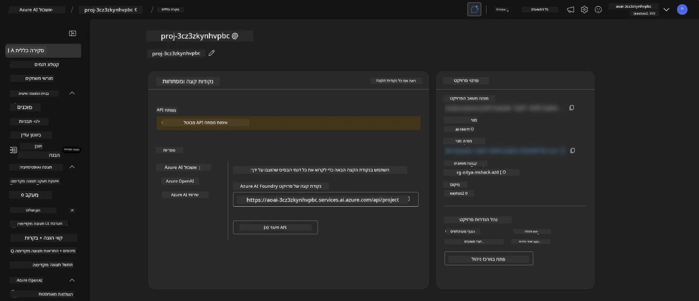

1. לחצו על `Agents` - אתם רואים את הסוכן המוגדר כברירת מחדל שפורס בפרויקט שלכם
   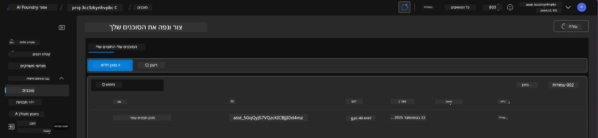

1. בחרו אותו - ואתם רואים את פרטי הסוכן. שימו לב לדברים הבאים:

      - הסוכן משתמש ב-File Search כברירת מחדל (תמיד)
      - הידע של הסוכן מציין שיש לו 32 קבצים שהועלו (לצורך חיפוש קבצים)
      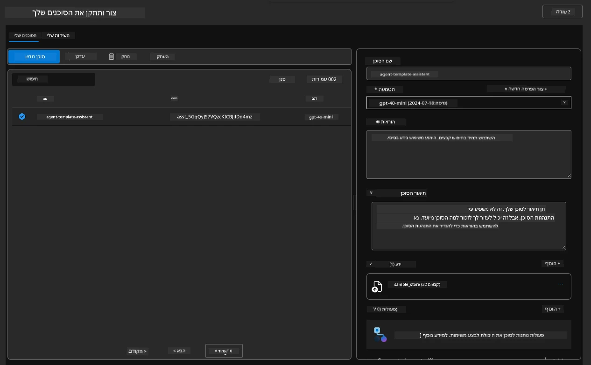

1. חפשו את האפשרות `Data+indexes` בתפריט השמאלי ולחצו לפרטים. 

      - אתם אמורים לראות את 32 קבצי הנתונים שהועלו עבור הידע.
      - אלה יתאימו ל-12 קבצי לקוחות ו-20 קבצי מוצרים תחת `src/files` 
      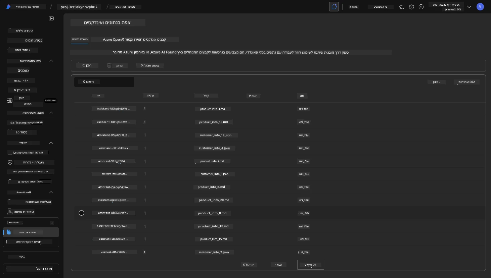

**אימתתם את פעולת הסוכן!** 

1. התשובות של הסוכן מבוססות על הידע שבקבצים האלה. 
1. עכשיו אתם יכולים לשאול שאלות הקשורות לנתונים האלה ולקבל תשובות מבוססות.
1. לדוגמה: `customer_info_10.json` מתאר את 3 הרכישות שביצעה "Amanda Perez"

חזרו ללשונית הדפדפן עם נקודת הקצה של אפליקציית Container ושאלו: `What products does Amanda Perez own?`. אתם אמורים לראות משהו כזה:

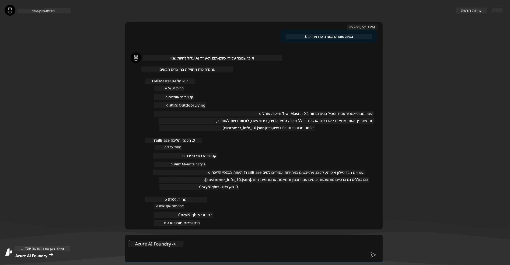

---

## 6. מגרש משחקים של סוכן

בואו נבנה קצת יותר אינטואיציה לגבי היכולות של Azure AI Foundry, על ידי התנסות עם הסוכן במגרש המשחקים של סוכנים.

1. חזרו לדף `Agents` ב-Azure AI Foundry - בחרו את הסוכן המוגדר כברירת מחדל
1. לחצו על האפשרות `Try in Playground` - אתם אמורים לקבל ממשק מגרש משחקים כמו זה
1. שאלו את אותה שאלה: `What products does Amanda Perez own?`

    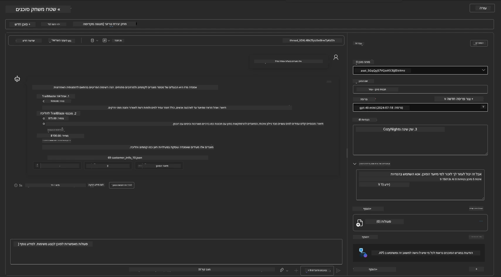

אתם מקבלים את אותה תשובה (או דומה) - אבל אתם גם מקבלים מידע נוסף שתוכלו להשתמש בו כדי להבין את האיכות, העלות והביצועים של אפליקציית הסוכן שלכם. לדוגמה:

1. שימו לב שהתשובה מציינת קבצי נתונים ששימשו ל"ביסוס" התשובה
1. רחפו מעל כל אחד מתוויות הקבצים האלה - האם הנתונים תואמים לשאילתה שלכם ולתשובה המוצגת?

אתם גם רואים שורת _סטטיסטיקות_ מתחת לתשובה. 

1. רחפו מעל כל מדד - לדוגמה, Safety. אתם רואים משהו כזה
1. האם הדירוג שנבדק תואם את האינטואיציה שלכם לגבי רמת הבטיחות של התשובה?

      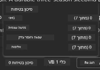

---

## 7. תצפיות מובנות

תצפיות עוסקות בהוספת כלי מדידה לאפליקציה שלכם כדי לייצר נתונים שניתן להשתמש בהם כדי להבין, לנטר ולשפר את פעולתה. כדי לקבל תחושה לכך:

1. לחצו על כפתור `View Run Info` - אתם אמורים לראות את התצוגה הזו. זהו דוגמה ל-[מעקב סוכן](https://learn.microsoft.com/en-us/azure/ai-foundry/how-to/develop/trace-agents-sdk#view-trace-results-in-the-azure-ai-foundry-agents-playground) בפעולה. _ניתן גם לקבל את התצוגה הזו על ידי לחיצה על Thread Logs בתפריט העליון_.

   - קבלו תחושה לשלבי הריצה והכלים שהסוכן השתמש בהם
   - הבינו את סך כל ספירת הטוקנים (לעומת שימוש בטוקנים בתשובה) עבור התשובה
   - הבינו את זמן ההשהיה ואיפה הזמן מושקע בביצוע

      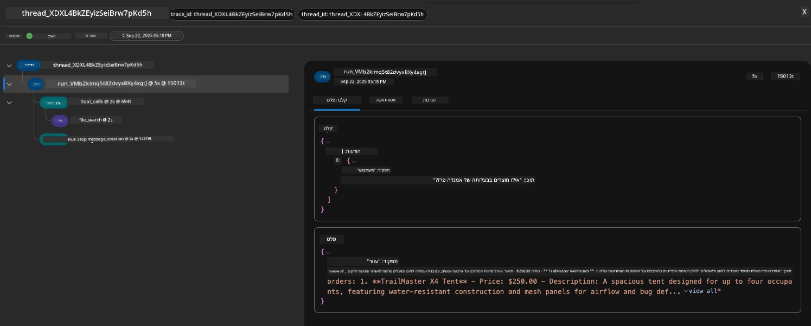

1. לחצו על לשונית `Metadata` כדי לראות תכונות נוספות עבור הריצה, שעשויות לספק הקשר שימושי לניטור בעיות מאוחר יותר.   

      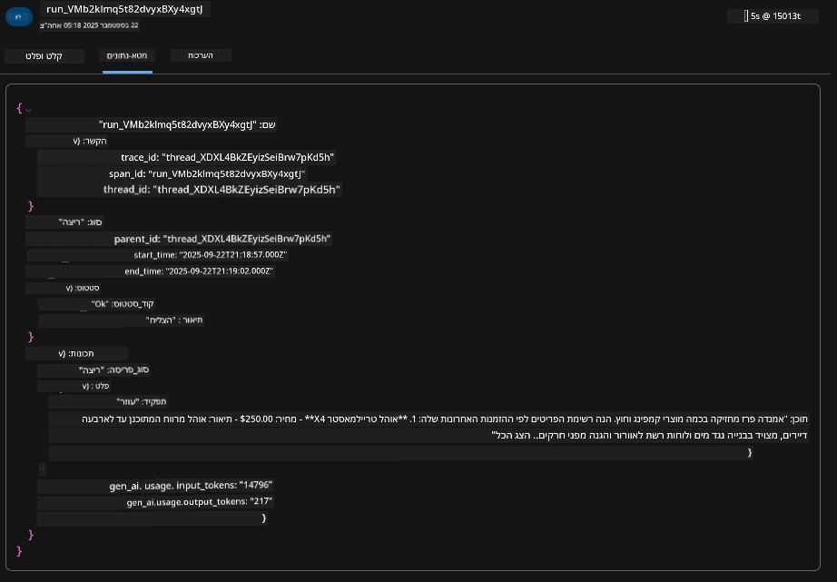

1. לחצו על לשונית `Evaluations` כדי לראות הערכות אוטומטיות שנעשו על תשובת הסוכן. אלה כוללות הערכות בטיחות (לדוגמה, Self-harm) והערכות ספציפיות לסוכן (לדוגמה, Intent resolution, Task adherence).

      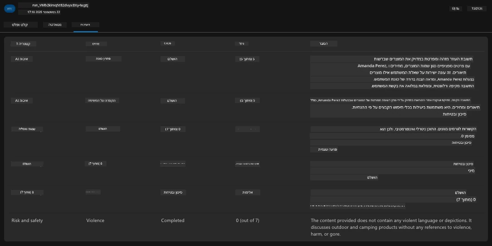

1. ולבסוף, לחצו על לשונית `Monitoring` בתפריט הצדדי.

      - בחרו בלשונית `Resource usage` בדף המוצג - וצפו במדדים.
      - עקבו אחר השימוש באפליקציה במונחים של עלויות (טוקנים) ועומס (בקשות).
      - עקבו אחר זמן ההשהיה של האפליקציה עד הבייט הראשון (עיבוד קלט) ועד הבייט האחרון (פלט).

      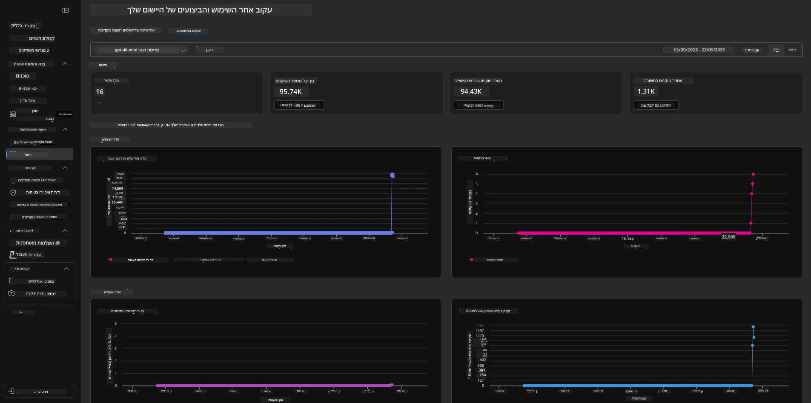

---

## 8. משתני סביבה

עד כה, עברנו על הפריסה בדפדפן - ואימתנו שהתשתית שלנו נפרסה והאפליקציה פועלת. אבל כדי לעבוד עם האפליקציה _ברמת הקוד_, אנחנו צריכים להגדיר את סביבת הפיתוח המקומית שלנו עם המשתנים הרלוונטיים הנדרשים לעבודה עם המשאבים האלה. השימוש ב-`azd` הופך את זה לפשוט.

1. Azure Developer CLI [משתמש במשתני סביבה](https://learn.microsoft.com/en-us/azure/developer/azure-developer-cli/manage-environment-variables?tabs=bash) כדי לאחסן ולנהל הגדרות תצורה עבור פריסות האפליקציה.

1. משתני סביבה מאוחסנים ב-`.azure/<env-name>/.env` - זה מגביל אותם לסביבה `<env-name>` שנעשה בה שימוש במהלך הפריסה ועוזר לכם לבודד סביבות בין מטרות פריסה שונות באותו מאגר.

1. משתני סביבה נטענים אוטומטית על ידי פקודת `azd` בכל פעם שהיא מבצעת פקודה ספציפית (לדוגמה, `azd up`). שימו לב ש-`azd` לא קורא אוטומטית משתני סביבה ברמת מערכת ההפעלה (לדוגמה, מוגדרים ב-shell) - במקום זאת השתמשו ב-`azd set env` ו-`azd get env` כדי להעביר מידע בתוך סקריפטים.

בואו ננסה כמה פקודות:

1. קבלו את כל משתני הסביבה שהוגדרו עבור `azd` בסביבה הזו:

      ```bash title="" linenums="0"
      azd env get-values
      ```
      
      אתם רואים משהו כזה:

      ```bash title="" linenums="0"
      AZURE_AI_AGENT_DEPLOYMENT_NAME="gpt-4o-mini"
      AZURE_AI_AGENT_NAME="agent-template-assistant"
      AZURE_AI_EMBED_DEPLOYMENT_NAME="text-embedding-3-small"
      AZURE_AI_EMBED_DIMENSIONS=100
      ...
      ```

1. קבלו ערך ספציפי - לדוגמה, אני רוצה לדעת אם הגדרנו את הערך `AZURE_AI_AGENT_MODEL_NAME`

      ```bash title="" linenums="0"
      azd env get-value AZURE_AI_AGENT_MODEL_NAME 
      ```
      
      אתם רואים משהו כזה - זה לא הוגדר כברירת מחדל!

      ```bash title="" linenums="0"
      ERROR: key 'AZURE_AI_AGENT_MODEL_NAME' not found in the environment values
      ```

1. הגדירו משתנה סביבה חדש עבור `azd`. כאן, אנחנו מעדכנים את שם מודל הסוכן. _שימו לב: כל שינוי שנעשה ישתקף מיד בקובץ `.azure/<env-name>/.env`.

      ```bash title="" linenums="0"
      azd env set AZURE_AI_AGENT_MODEL_NAME gpt-4.1
      azd env set AZURE_AI_AGENT_MODEL_VERSION 2025-04-14
      azd env set AZURE_AI_AGENT_DEPLOYMENT_CAPACITY 150
      ```

      עכשיו, אנחנו אמורים למצוא שהערך הוגדר:

      ```bash title="" linenums="0"
      azd env get-value AZURE_AI_AGENT_MODEL_NAME 
      ```

1. שימו לב שחלק מהמשאבים הם מתמשכים (לדוגמה, פריסות מודלים) וידרשו יותר מאשר רק `azd up` כדי לאלץ את הפריסה מחדש. בואו ננסה לפרק את הפריסה המקורית ולפרוס מחדש עם משתני סביבה שהשתנו.

1. **רענון** אם פרסתם בעבר תשתית באמצעות תבנית azd - אתם יכולים _לרענן_ את מצב משתני הסביבה המקומיים שלכם בהתבסס על המצב הנוכחי של פריסת Azure שלכם באמצעות הפקודה הזו:
      ```bash title="" linenums="0"
      azd env refresh
      ```

      זו דרך חזקה ל_סנכרן_ משתני סביבה בין שניים או יותר סביבות פיתוח מקומיות (לדוגמה, צוות עם מספר מפתחים) - מה שמאפשר לתשתית המופעלת לשמש כנקודת האמת למצב משתני הסביבה. חברי הצוות פשוט _מרעננים_ את המשתנים כדי לחזור לסנכרון.

---

## 9. ברכות 🏆

סיימת עכשיו תהליך עבודה מקצה לקצה שבו:

- [X] בחרת את תבנית AZD שברצונך להשתמש בה
- [X] הפעלת את התבנית עם GitHub Codespaces
- [X] פרסת את התבנית ואישרת שהיא פועלת

---

