# 2. אימות תבנית

> אומת נגד `azd 1.23.12` במרץ 2026.

!!! tip "בסיום המודול הזה תוכל/י"

    - [ ] לנתח את ארכיטקטורת הפתרון AI
    - [ ] להבין את זרימת העבודה של פריסת AZD
    - [ ] להשתמש ב-GitHub Copilot לקבלת עזרה בשימוש ב-AZD
    - [ ] **מעבדה 2:** פרוס ואמת את תבנית הסוכנים AI

---


## 1. מבוא

[Azure Developer CLI](https://learn.microsoft.com/en-us/azure/developer/azure-developer-cli/) או `azd` הוא כלי שורת פקודה בקוד פתוח שמפשט את זרימת העבודה של המפתח בעת בנייה ופריסת יישומים ל-Azure.

[תבניות AZD](https://learn.microsoft.com/azure/developer/azure-developer-cli/azd-templates) הן מאגרי קוד תקניים שכוללים קוד דוגמה של יישום, נכסי _תשתית כקוד_, וקבצי תצורת `azd` עבור ארכיטקטורת פתרון מגובשת. פריסת התשתית הופכת לפשוטה כמו פקודת `azd provision` - בעוד שהשימוש ב-`azd up` מאפשר לך לפרוס תשתית **וגם** לפרוס את היישום שלך בו זמנית!

כתוצאה מכך, התחלת תהליך פיתוח היישום שלך יכולה להיות פשוטה כמו חיפוש התבנית המתאימה ביותר _AZD Starter_ הקרובה ביותר לצרכי היישום והתשתית שלך – ואז התאמת המאגר לדרישות התרחיש שלך.

לפני שנתחיל, בואו נוודא שיש לך את Azure Developer CLI מותקן.

1. פתח טרמינל ב-VS Code והקלד את הפקודה הבאה:

      ```bash title="" linenums="0"
      azd version
      ```

1. עליך לראות משהו כזה!

      ```bash title="" linenums="0"
      azd version 1.23.12 (commit <current-build>)
      ```

**עכשיו אתה מוכן לבחור ולפרוס תבנית עם azd**

---

## 2. בחירת תבנית

פלטפורמת Microsoft Foundry מגיעה עם [סט של תבניות AZD מומלצות](https://learn.microsoft.com/en-us/azure/ai-foundry/how-to/develop/ai-template-get-started) שמכסים תרחישי פתרון פופולריים כמו _אוטומציה של זרימות עבודה מרובות סוכנים_ ו_עיבוד תוכן מולטי-מודאלי_. ניתן גם לגלות תבניות אלה בביקור בפורטל Microsoft Foundry.

1. בקר בכתובת [https://ai.azure.com/templates](https://ai.azure.com/templates)
1. היכנס לפורטל Microsoft Foundry כשמתבקש – תראה משהו כזה.

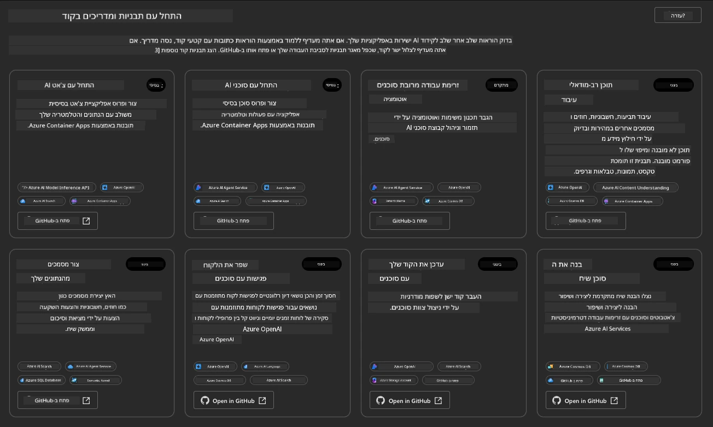


אפשרויות **Basic** הן תבניות ההתחלה שלך:

1. [ ] [התחל עם AI Chat](https://github.com/Azure-Samples/get-started-with-ai-chat) שמפרוס יישום צ'אט בסיסי _עם הנתונים שלך_ ל-Azure Container Apps. השתמש בזה כדי לחקור תרחיש צ'אט בוט בסיסי.
1. [X] [התחל עם AI Agents](https://github.com/Azure-Samples/get-started-with-ai-agents) שמפרוס גם סוכן AI סטנדרטי (עם סוכני Foundry). השתמש בזה כדי להכיר פתרונות AI סוכניים הכוללים כלים ודגמים.

בקר בקישור השני בכרטיסיה חדשה בדפדפן (או לחץ על `Open in GitHub` בכרטיסייה הרלוונטית). אתה אמור לראות את המאגר של תבנית AZD זו. קח רגע לחקור את ה-README. ארכיטקטורת היישום נראית כך:

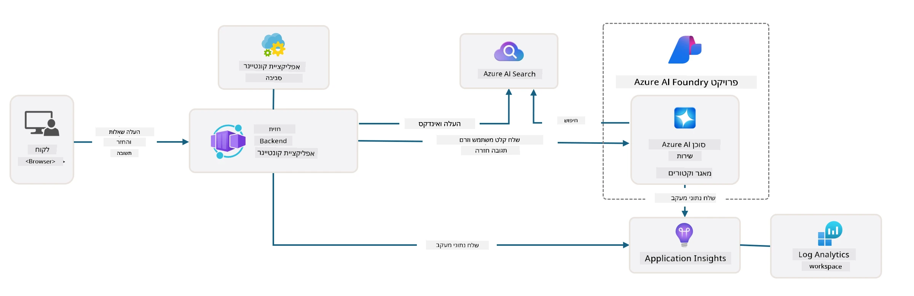

---

## 3. הפעלת תבנית

בוא ננסה לפרוס את התבנית הזו ולוודא שהיא תקינה. נעקוב אחר ההנחיות בקטע ה-[Getting Started](https://github.com/Azure-Samples/get-started-with-ai-agents?tab=readme-ov-file#getting-started).

1. בחר סביבת עבודה למאגר התבנית:

      - **GitHub Codespaces**: לחץ על [קישור זה](https://github.com/codespaces/new/Azure-Samples/get-started-with-ai-agents) ואשר `Create codespace`
      - **שכפול מקומי או מכולת פיתוח**: שכפל את `Azure-Samples/get-started-with-ai-agents` ופתח ב-VS Code

1. המתן עד שהטרמינל ב-VS Code מוכן, ואז הקלד את הפקודה הבאה:

   ```bash title="" linenums="0"
   azd up
   ```

השלם את שלבי זרימת העבודה שיפעלו בעקבות זאת:

1. תתבקש להיכנס ל-Azure - עקוב אחרי ההוראות לאימות
1. הזן שם סביבה ייחודי עבורך - לדוגמה, השתמשתי ב-`nitya-mshack-azd`
1. זה ייצור תיקייה `.azure/` - תראה תיקיית משנה עם שם הסביבה
1. תתבקש לבחור שם מנוי - בחר במחדל
1. תתבקש לבחור מיקום - השתמש ב-`East US 2`

עכשיו, המתן לסיום הפריסה. **זה לוקח 10-15 דקות**

1. כשתסיים, הקונסולה שלך תציג הודעת הצלחה כך:
      ```bash title="" linenums="0"
      SUCCESS: Your up workflow to provision and deploy to Azure completed in 10 minutes 17 seconds.
      ```
1. הפורטל שלך ב-Azure יציג עכשיו קבוצת משאבים שהופעלה עם שם הסביבה:

      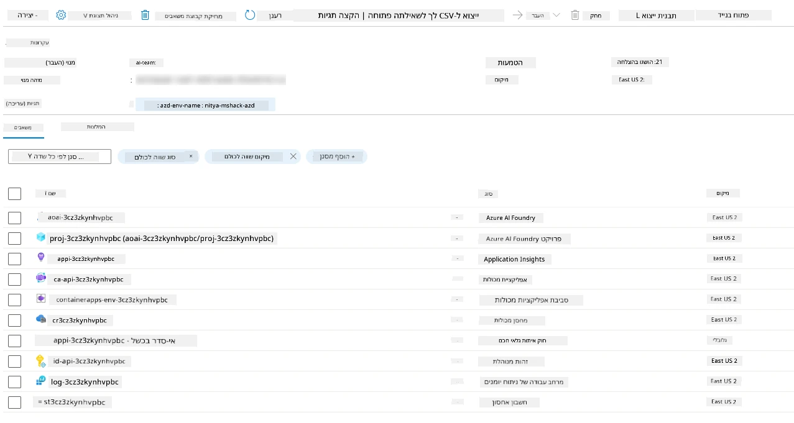

1. **עכשיו אתה מוכן לאמת את התשתית והיישום שפורסמו**.

---

## 4. אימות תבנית

1. בקר בדף [קבוצות משאבים ב-Azure Portal](https://portal.azure.com/#browse/resourcegroups) – היכנס כשהתבקש
1. לחץ על קבוצת המשאבים עם שם הסביבה שלך – תראה את הדף לעיל

      - לחץ על משאב Azure Container Apps
      - לחץ על קישור היישום בקטגוריית _Essentials_ (פלוס ימין למעלה)

1. אתה אמור לראות ממשק משתמש של יישום שמתארח כך:

   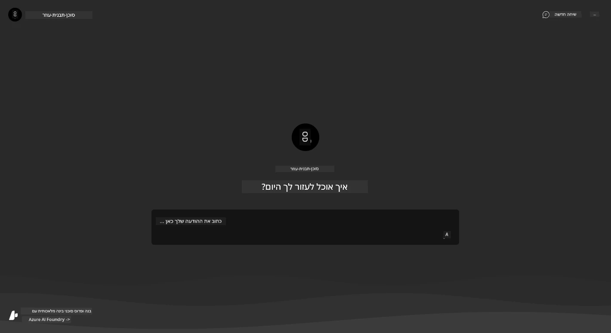

1. נסה לשאול כמה [שאלות לדוגמה](https://github.com/Azure-Samples/get-started-with-ai-agents/blob/main/docs/sample_questions.md)

      1. שאל: ```מהי בירת צרפת?``` 
      1. שאל: ```מה האוהל הטוב ביותר מתחת ל-200$ לשני אנשים, ואילו תכונות יש בו?```

1. תקבל תשובות דומות לאלו שמוצגות למטה. _אבל איך זה עובד?_

      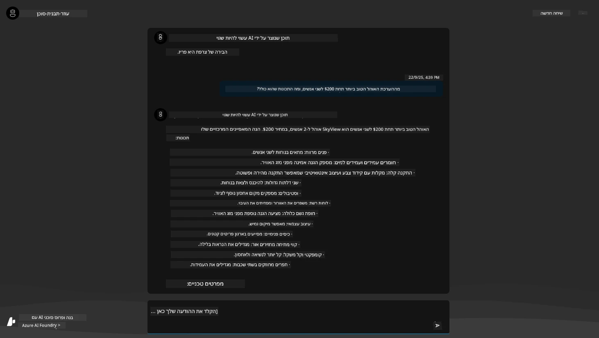

---

## 5. אימות סוכן

יישום Azure Container App מפעיל נקודת קצה שמתחברת לסוכן AI שהופעל בפרויקט Microsoft Foundry עבור תבנית זו. בוא נסתכל על מה שזה אומר.

1. חזור לעמוד _Overview_ של קבוצת המשאבים שלך ב-Azure Portal

1. לחץ על משאב `Microsoft Foundry` ברשימה הזו

1. תראה זאת. לחץ על הכפתור `Go to Microsoft Foundry Portal`. 
   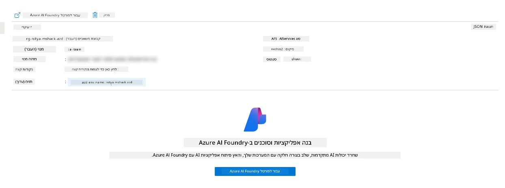

1. תראה את עמוד הפרויקט Foundry של היישום AI שלך
   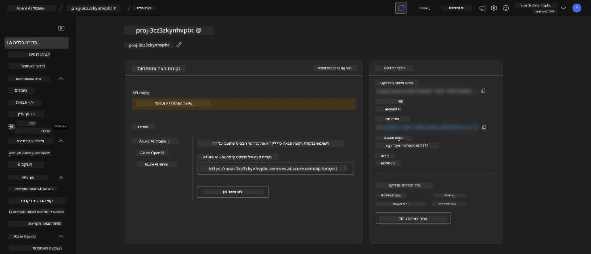

1. לחץ על `Agents` - תראה את סוכן ברירת המחדל שהופעל בפרויקט שלך
   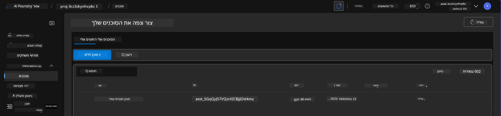

1. בחר אותו - ותראה את פרטי הסוכן. שים לב לפרטים הבאים:

      - הסוכן משתמש ב-File Search כברירת מחדל (תמיד)
      - ה-`Knowledge` של הסוכן מציין שהועלו 32 קבצים (לצורך חיפוש קבצים)
      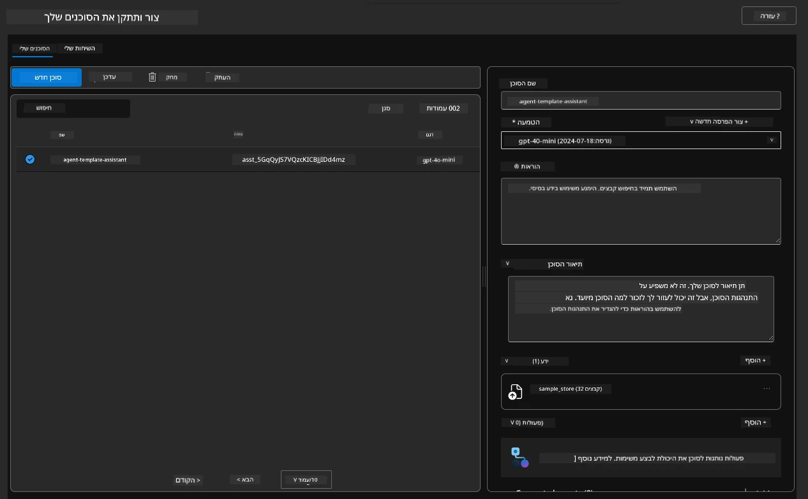

1. חפש את האפשרות `Data+indexes` בתפריט השמאלי ולחץ לפרטים.

      - תראה את 32 קבצי מידע שהועלו עבור הידע.
      - אלה יתאימו ל-12 קבצי לקוח ו-20 קבצי מוצר תחת `src/files`
      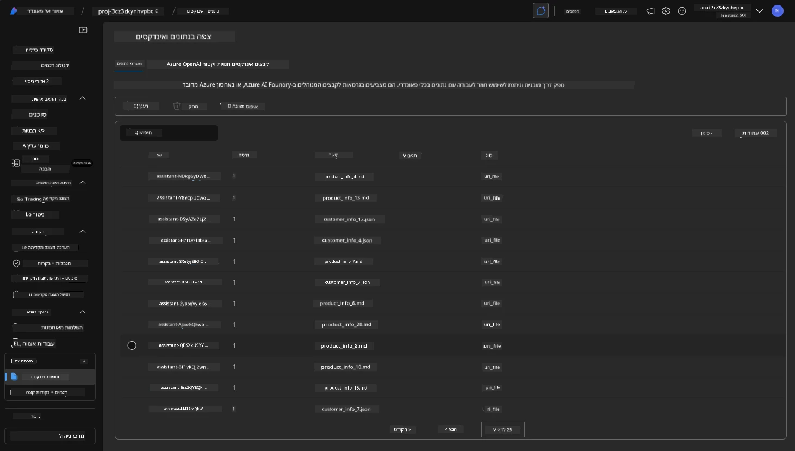

**אימת את פעולת הסוכן!**

1. התגובות של הסוכן מבוססות על הידע שבקבצים האלה.
1. עכשיו תוכל לשאול שאלות הקשורות לנתונים האלה, ולקבל תגובות מבוססות.
1. לדוגמה: `customer_info_10.json` מתאר את 3 הרכישות שביצעה "Amanda Perez"

חזור ללשונית הדפדפן עם נקודת הקצה של Container App ושאל: `אילו מוצרים בבעלותה של Amanda Perez?`. תראה משהו כזה:

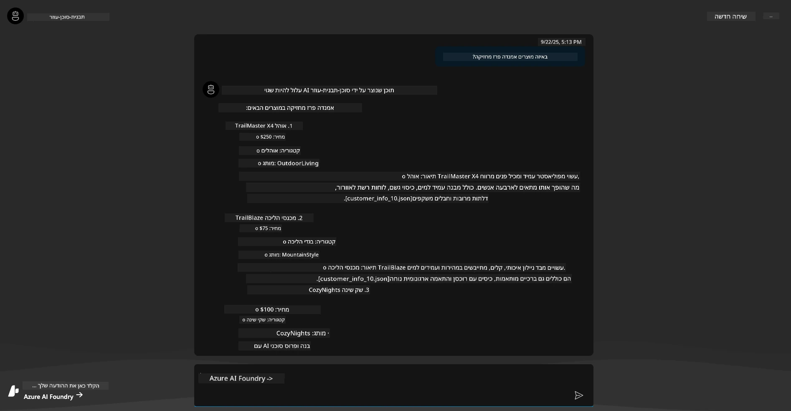

---

## 6. מגרש משחקים של סוכן

בוא נבנה הבנה קצת יותר מעמיקה לגבי היכולות של Microsoft Foundry, על ידי הפעלת הסוכן במגרש המשחקים של הסוכנים.

1. חזור לעמוד `Agents` ב-Microsoft Foundry - בחר את סוכן ברירת המחדל
1. לחץ על האפשרות `Try in Playground` - תקבל ממשק של מגרש משחקים כזה
1. שאל את אותה שאלה: `אילו מוצרים בבעלותה של Amanda Perez?`

    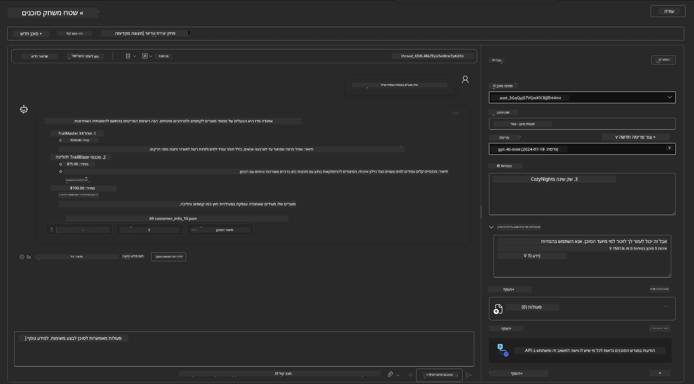

תקבל את אותה תגובה (או דומה) - אבל גם מידע נוסף שתוכל להשתמש בו כדי להבין את האיכות, העלות והביצועים של אפליקציית הסוכן שלך. לדוגמה:

1. שים לב שהתשובה מציינת קבצי מידע שהשתמשו בהם כדי "לבסס" את התגובה
1. בחר עם העכבר כל תווית של קובץ - האם הנתונים תואמים את השאלה והתשובה המוצגת?

גם תראה שורת _סטטיסטיקות_ מתחת לתגובה.

1. העבר את העכבר מעל לכל מדד - לדוגמה, בטיחות. תראה משהו כזה
1. האם דירוג הבטיחות המשוער תואם את התחושה שלך לגבי רמת הבטיחות של התגובה?

      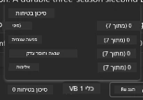

---

## 7. ניתוח מובנה

ניתוח נוגע לאינסטרומנטציה של היישום שלך כדי לייצר נתונים שניתן להשתמש בהם להבנה, איתור באגים, ואופטימיזציה של פעולות היישום. כדי לקבל מושג:

1. לחץ על כפתור `View Run Info` - תראה תצוגה זו. זהו דוגמה של [עקיבת סוכן](https://learn.microsoft.com/en-us/azure/ai-foundry/how-to/develop/trace-agents-sdk#view-trace-results-in-the-azure-ai-foundry-agents-playground) בפעולה. _אפשר גם לקבל תצוגה זו על ידי לחיצה על Thread Logs בתפריט הרמה העליונה_.

   - קבל מושג על שלבי ההרצה והכלים שבהם השתמש הסוכן
   - הבן את סך הטוקנים (בהשוואה לשימוש בטוקנים ביציאה) עבור התגובה
   - הבן את ההשהיה ואיפה מושקע הזמן בביצוע

      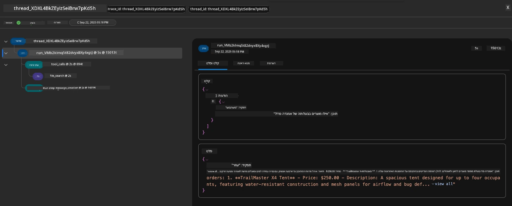

1. לחץ על לשונית `Metadata` כדי לראות תכונות נוספות של ההרצה, שעשויות לספק הקשר שימושי לאיתור תקלות בעתיד.

      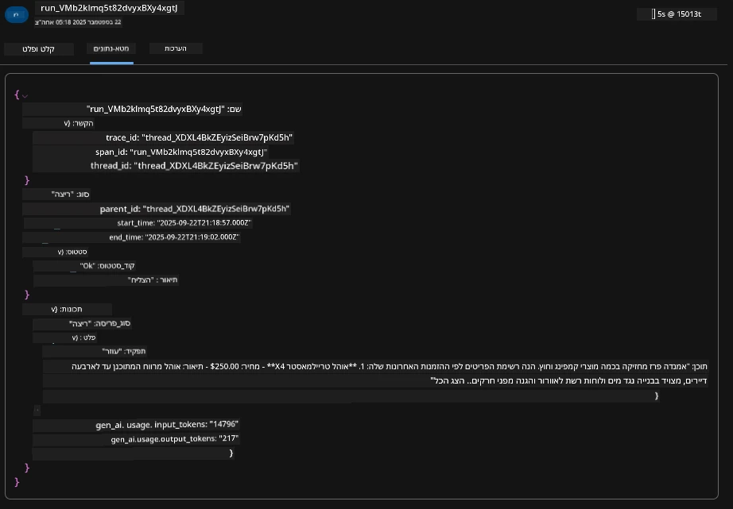


1. לחץ על לשונית `Evaluations` כדי לראות הערכות אוטומטיות שנעשו על תגובת הסוכן. כולל הערכות בטיחות (למשל, Self-harm) והערכות ספציפיות לסוכן (למשל, פתרון כוונה, עמידה במשימה).

      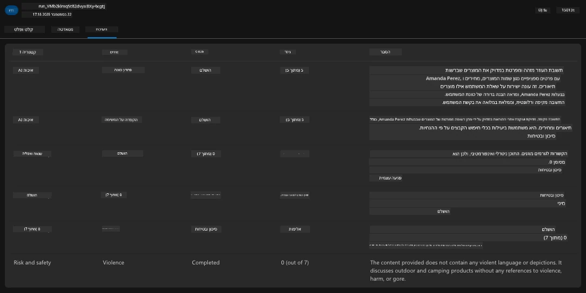

1. לבסוף, לחץ על לשונית `Monitoring` בתפריט הצדדי.

      - בחר ב-`Resource usage` בעמוד שמוצג - וצפה במדדים.
      - עקוב אחרי השימוש ביישום במונחים של עלויות (טוקנים) וטעינה (בקשות).
      - עקוב אחר השהיית היישום ל-byte הראשון (עיבוד קלט) וה-byte האחרון (פלט).

      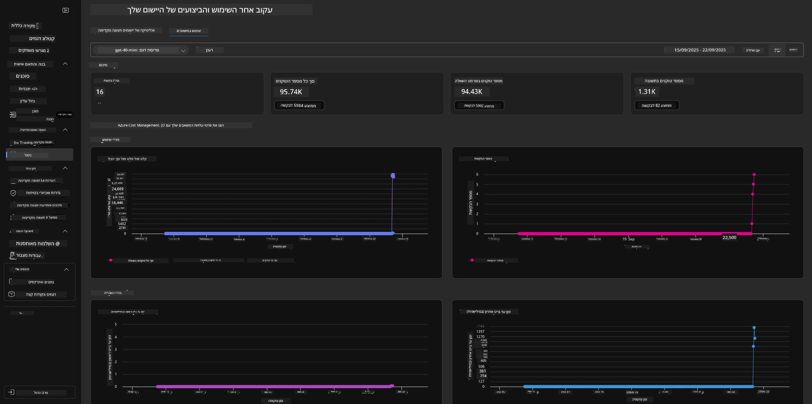

---

## 8. משתני סביבה

עד כה, עברנו בפריסה בדפדפן - ואימתנו שהתשתית שלנו הופעלה והיישום פעיל. אך כדי לעבוד עם היישום _בקוד תחילה_, עלינו להגדיר את סביבת הפיתוח המקומית שלנו עם המשתנים הרלוונטיים הדרושים לעבודה עם המשאבים האלה. שימוש ב-`azd` עושה את זה פשוט.

1. Azure Developer CLI [משתמש במשתני סביבה](https://learn.microsoft.com/en-us/azure/developer/azure-developer-cli/manage-environment-variables?tabs=bash) כדי לאחסן ולנהל הגדרות תצורה לפריסות היישום.

1. משתני הסביבה מאוחסנים ב-`.azure/<env-name>/.env` - מה שמגביל אותם לסביבה בשם `env-name` ששימשה בעת הפריסה ועוזר לך לבודד סביבות בין יעדי פריסה שונים באותו מאגר.

1. משתני הסביבה נטענים אוטומטית על ידי פקודת `azd` בכל פעם שהיא מריצה פקודה ספציפית (למשל, `azd up`). שים לב ש-`azd` אינו קורא אוטומטית משתני סביבה ברמת מערכת ההפעלה (למשל, שהוגדרו ב-shell) – במקום זאת יש להשתמש ב-`azd set env` ו-`azd get env` כדי להעביר מידע בתוך סקריפטים.

בוא ננסה כמה פקודות:

1. קבל את כל משתני הסביבה שהוגדרו עבור `azd` בסביבה הזו:

      ```bash title="" linenums="0"
      azd env get-values
      ```
      
      תראה משהו כזה:

      ```bash title="" linenums="0"
      AZURE_AI_AGENT_DEPLOYMENT_NAME="gpt-4.1-mini"
      AZURE_AI_AGENT_NAME="agent-template-assistant"
      AZURE_AI_EMBED_DEPLOYMENT_NAME="text-embedding-3-small"
      AZURE_AI_EMBED_DIMENSIONS=100
      ...
      ```

1. קבל ערך ספציפי - לדוגמה, אני רוצה לדעת אם הגדרנו את הערך `AZURE_AI_AGENT_MODEL_NAME`

      ```bash title="" linenums="0"
      azd env get-value AZURE_AI_AGENT_MODEL_NAME 
      ```
      
      תראה משהו כזה - הוא לא הוגדר כברירת מחדל!

      ```bash title="" linenums="0"
      ERROR: key 'AZURE_AI_AGENT_MODEL_NAME' not found in the environment values
      ```

1. הגדר משתנה סביבה חדש עבור `azd`. כאן, אנו מעדכנים את שם דגם הסוכן. _שים לב: כל שינוי שתעשה ישתקף מיד בקובץ `.azure/<env-name>/.env`.

      ```bash title="" linenums="0"
      azd env set AZURE_AI_AGENT_MODEL_NAME gpt-4.1
      azd env set AZURE_AI_AGENT_MODEL_VERSION 2025-04-14
      azd env set AZURE_AI_AGENT_DEPLOYMENT_CAPACITY 150
      ```

      עכשיו, עלינו למצוא שהערך הוגדר:

      ```bash title="" linenums="0"
      azd env get-value AZURE_AI_AGENT_MODEL_NAME 
      ```

1. שים לב שחלק מהמשאבים מתמשכים (למשל, פריסות דגם) וידרשו יותר מאשר פקודת `azd up` יחידה כדי לאלץ את הפריסה מחדש. בוא ננסה לפרק את הפריסה המקורית ולפרוס מחדש עם משתני סביבה ששונו.

1. **רענן** אם פרסת בעבר תשתית באמצעות תבנית azd - אתה יכול _לרענן_ את מצב משתני הסביבה המקומיים שלך בהתבסס על מצב הפריסה הנוכחי ב-Azure באמצעות הפקודה הזו:

      ```bash title="" linenums="0"
      azd env refresh
      ```

זוהי דרך עוצמתית ל _סנכרן_ משתני סביבה בין שני סביבות פיתוח מקומיות או יותר (למשל, צוות עם מספר מפתחים) - המאפשרת לתשתית המוטמעת לשמש כעובד האמת למצב משתני הסביבה. חברי הצוות פשוט _מרעננים_ את המשתנים כדי לחזור לסינכרון.

---

## 9. מזל טוב 🏆

רק סיימת תהליך עבודה מקצה לקצה שבו:

- [X] בחרת את תבנית AZD שברצונך להשתמש בה
- [X] פתחת את התבנית בסביבת פיתוח נתמכת
- [X] פרסת את התבנית ואישרת שהיא פועלת

---

<!-- CO-OP TRANSLATOR DISCLAIMER START -->
**כתב ויתור**:  
מסמך זה תורגם באמצעות שירות תרגום בינה מלאכותית [Co-op Translator](https://github.com/Azure/co-op-translator). אף שאנו שואפים לדיוק, יש לקחת בחשבון שתרגומים אוטומטיים עלולים להכיל שגיאות או אי דיוקים. המסמך המקורי בשפתו המקורית צריך להיחשב כמקור הסמכות. עבור מידע קריטי, מומלץ להיעזר בתרגום מקצועי על ידי אדם. אנו לא נושאים באחריות לכל אי הבנה או פרשנות שגויה הנובעת משימוש בתרגום זה.
<!-- CO-OP TRANSLATOR DISCLAIMER END -->