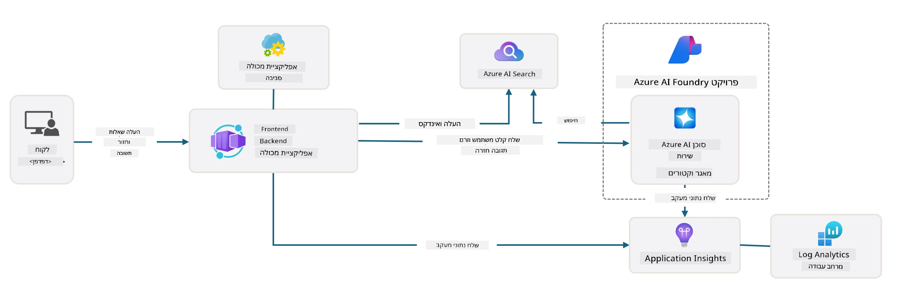

# 3. פירוק תבנית

!!! tip "בסיום המודול הזה תוכל"

    - [ ] פריט
    - [ ] פריט
    - [ ] פריט
    - [ ] **מעבדה 3:** 

---

עם תבניות AZD ו-Azure Developer CLI (`azd`) ניתן להתחיל במהירות את מסע הפיתוח שלנו בתחום הבינה המלאכותית באמצעות מאגרי מידע סטנדרטיים שמספקים קוד לדוגמה, תשתית וקבצי תצורה - בצורת פרויקט _התחלתי_ מוכן לפריסה.

**אבל עכשיו, אנחנו צריכים להבין את מבנה הפרויקט ואת בסיס הקוד - ולהיות מסוגלים להתאים את תבנית AZD - ללא ניסיון או הבנה מוקדמת של AZD!**

---

## 1. הפעלת GitHub Copilot

### 1.1 התקנת GitHub Copilot Chat

זה הזמן לחקור את [GitHub Copilot עם מצב סוכן](https://code.visualstudio.com/docs/copilot/chat/chat-agent-mode). עכשיו, ניתן להשתמש בשפה טבעית כדי לתאר את המשימה שלנו ברמה גבוהה ולקבל סיוע בביצוע. במעבדה זו, נשתמש ב-[תוכנית החינמית של Copilot](https://github.com/github-copilot/signup) שיש לה מגבלה חודשית להשלמות ואינטראקציות בצ'אט.

ניתן להתקין את ההרחבה מהמרקטפלייס, אך היא אמורה להיות זמינה כבר בסביבת Codespaces שלך. _לחץ על `Open Chat` מתפריט הסמל של Copilot - והקלד הנחיה כמו `What can you do?`_ - ייתכן שתתבקש להתחבר. **GitHub Copilot Chat מוכן לשימוש**.

### 1.2 התקנת שרתי MCP

כדי שמצב סוכן יהיה אפקטיבי, הוא זקוק לגישה לכלים הנכונים שיעזרו לו לאחזר מידע או לבצע פעולות. כאן נכנסים לתמונה שרתי MCP. נבצע הגדרה לשרתי MCP הבאים:

1. [Azure MCP Server](../../../../../workshop/docs/instructions)
1. [Microsoft Docs MCP Server](../../../../../workshop/docs/instructions)

כדי להפעיל אותם:

1. צור קובץ בשם `.vscode/mcp.json` אם הוא לא קיים
1. העתק את התוכן הבא לקובץ - והפעל את השרתים!
   ```json title=".vscode/mcp.json"
   {
      "servers": {
         "Azure MCP Server": {
            "command": "npx",
            "args": [
            "-y",
            "@azure/mcp@latest",
            "server",
            "start"
            ]
         },
         "microsoft.docs.mcp": {
            "type": "http",
            "url": "https://learn.microsoft.com/api/mcp"
         }
      }
   }
   ```

??? warning "ייתכן שתקבל שגיאה ש-`npx` לא מותקן (לחץ להרחבה לתיקון)"

      כדי לתקן זאת, פתח את הקובץ `.devcontainer/devcontainer.json` והוסף את השורה הזו לחלק של התכונות. לאחר מכן, בנה מחדש את הקונטיינר. כעת אמור להיות לך `npx` מותקן.

      ```title="" linenums="0"
         "features": {
            "ghcr.io/devcontainers/features/node:1": {},
            ...
         },
      ```

---

### 1.3 בדיקת GitHub Copilot Chat

**ראשית השתמש ב-`az login` כדי לאמת את עצמך מול Azure משורת הפקודה של VS Code.**

כעת תוכל לשאול על מצב המנוי שלך ב-Azure ולשאול שאלות על משאבים או תצורה שפרסת. נסה את ההנחיות הבאות:

1. `List my Azure resource groups`
1. `#foundry list my current deployments`

תוכל גם לשאול שאלות על תיעוד של Azure ולקבל תשובות המבוססות על שרת Microsoft Docs MCP. נסה את ההנחיות הבאות:

1. `#microsoft_docs_search What is Azure Developer CLI?`
1. `#microsoft_docs_search Show me a Python tutorial to chat with deployed model`

או תוכל לבקש קטעי קוד לביצוע משימה. נסה את ההנחיה הזו:

1. `Give me a Python code example that uses AAD for an interactive chat client`

במצב `Ask`, זה יספק קוד שתוכל להעתיק ולהדביק ולנסות. במצב `Agent`, זה עשוי ללכת צעד נוסף קדימה וליצור את המשאבים הרלוונטיים עבורך - כולל סקריפטים ותיעוד - כדי לעזור לך לבצע את המשימה.

**כעת אתה מוכן להתחיל לחקור את מאגר התבניות**

---

## 2. פירוק הארכיטקטורה

??? prompt "ASK: הסבר את ארכיטקטורת היישום בתמונה docs/images/architecture.png בפסקה אחת"

      יישום זה הוא יישום צ'אט מבוסס בינה מלאכותית שנבנה על Azure ומדגים ארכיטקטורה מודרנית מבוססת סוכן. הפתרון מתמקד ב-Azure Container App שמארח את קוד היישום הראשי, שמעבד קלט משתמש ומייצר תגובות חכמות באמצעות סוכן AI. 
      
      הארכיטקטורה מנצלת את פרויקט Azure AI Foundry כבסיס ליכולות AI, ומתחברת לשירותי Azure AI שמספקים את מודלי השפה הבסיסיים (כמו GPT-4o-mini) ואת פונקציונליות הסוכן. אינטראקציות משתמש זורמות דרך ממשק קדמי מבוסס React אל ממשק אחורי FastAPI שמתקשר עם שירות סוכן AI ליצירת תגובות בהקשר. 
      
      המערכת כוללת יכולות אחזור מידע דרך חיפוש קבצים או שירות Azure AI Search, שמאפשר לסוכן לגשת למידע ולהתייחס למסמכים שהועלו. לצורך מצוינות תפעולית, הארכיטקטורה כוללת ניטור מקיף באמצעות Application Insights ו-Log Analytics Workspace למעקב, רישום ואופטימיזציית ביצועים. 
      
      Azure Storage מספק אחסון Blob לנתוני יישום והעלאות קבצים, בעוד Managed Identity מבטיח גישה מאובטחת בין משאבי Azure ללא צורך באחסון אישורים. הפתרון כולו מעוצב לסקלביליות ותחזוקה, עם יישום מבוסס קונטיינרים שמתרחב אוטומטית בהתאם לדרישה תוך מתן אבטחה מובנית, ניטור ויכולות CI/CD דרך מערכת השירותים המנוהלים של Azure.



---

## 3. מבנה המאגר

!!! prompt "ASK: הסבר את מבנה תיקיית התבנית. התחל עם דיאגרמה היררכית חזותית."

??? info "ANSWER: דיאגרמה היררכית חזותית"

      ```bash title="" 
      get-started-with-ai-agents/
      ├── 📋 תצורה והגדרות
      │   ├── azure.yaml                    # תצורת Azure Developer CLI
      │   ├── docker-compose.yaml           # קונטיינרים לפיתוח מקומי
      │   ├── pyproject.toml                # תצורת פרויקט Python
      │   ├── requirements-dev.txt          # תלות לפיתוח
      │   └── .devcontainer/                # הגדרת קונטיינר פיתוח VS Code
      │
      ├── 🏗️ תשתית (infra/)
      │   ├── main.bicep                    # תבנית תשתית ראשית
      │   ├── api.bicep                     # משאבים ספציפיים ל-API
      │   ├── main.parameters.json          # פרמטרים לתשתית
      │   └── core/                         # רכיבי תשתית מודולריים
      │       ├── ai/                       # תצורות שירותי AI
      │       ├── host/                     # תשתית אירוח
      │       ├── monitor/                  # ניטור ורישום
      │       ├── search/                   # הגדרת Azure AI Search
      │       ├── security/                 # אבטחה וזהות
      │       └── storage/                  # תצורות חשבון אחסון
      │
      ├── 💻 מקור היישום (src/)
      │   ├── api/                          # API אחורי
      │   │   ├── main.py                   # נקודת כניסה ליישום FastAPI
      │   │   ├── routes.py                 # הגדרות נתיבי API
      │   │   ├── search_index_manager.py   # פונקציונליות חיפוש
      │   │   ├── data/                     # טיפול בנתוני API
      │   │   ├── static/                   # נכסי אינטרנט סטטיים
      │   │   └── templates/                # תבניות HTML
      │   ├── frontend/                     # ממשק קדמי React/TypeScript
      │   │   ├── package.json              # תלות Node.js
      │   │   ├── vite.config.ts            # תצורת בנייה Vite
      │   │   └── src/                      # קוד מקור קדמי
      │   ├── data/                         # קבצי נתונים לדוגמה
      │   │   └── embeddings.csv            # הטמעות מחושבות מראש
      │   ├── files/                        # קבצי בסיס ידע
      │   │   ├── customer_info_*.json      # דוגמאות נתוני לקוחות
      │   │   └── product_info_*.md         # תיעוד מוצרים
      │   ├── Dockerfile                    # תצורת קונטיינר
      │   └── requirements.txt              # תלות Python
      │
      ├── 🔧 אוטומציה וסקריפטים (scripts/)
      │   ├── postdeploy.sh/.ps1           # הגדרות לאחר פריסה
      │   ├── setup_credential.sh/.ps1     # הגדרת אישורים
      │   ├── validate_env_vars.sh/.ps1    # אימות משתני סביבה
      │   └── resolve_model_quota.sh/.ps1  # ניהול מכסת מודלים
      │
      ├── 🧪 בדיקות והערכה
      │   ├── tests/                        # בדיקות יחידה ואינטגרציה
      │   │   └── test_search_index_manager.py
      │   ├── evals/                        # מסגרת הערכת סוכן
      │   │   ├── evaluate.py               # מפעיל הערכה
      │   │   ├── eval-queries.json         # שאילתות בדיקה
      │   │   └── eval-action-data-path.json
      │   ├── sandbox/                      # סביבת פיתוח
      │   │   ├── 1-quickstart.py           # דוגמאות התחלה מהירה
      │   │   └── aad-interactive-chat.py   # דוגמאות אימות
      │   └── airedteaming/                 # הערכת בטיחות AI
      │       └── ai_redteaming.py          # בדיקות צוות אדום
      │
      ├── 📚 תיעוד (docs/)
      │   ├── deployment.md                 # מדריך פריסה
      │   ├── local_development.md          # הוראות הגדרה מקומית
      │   ├── troubleshooting.md            # בעיות נפוצות ותיקונים
      │   ├── azure_account_setup.md        # דרישות מקדימות ל-Azure
      │   └── images/                       # נכסי תיעוד
      │
      └── 📄 מטא-נתונים של הפרויקט
         ├── README.md                     # סקירת הפרויקט
         ├── CODE_OF_CONDUCT.md           # הנחיות קהילתיות
         ├── CONTRIBUTING.md              # מדריך תרומה
         ├── LICENSE                      # תנאי רישיון
         └── next-steps.md                # הנחיות לאחר פריסה
      ```

### 3.1 ארכיטקטורת אפליקציה מרכזית

תבנית זו עוקבת אחר דפוס **יישום אינטרנט מלא** עם:

- **אחורי**: FastAPI ב-Python עם אינטגרציה ל-Azure AI
- **קדמי**: TypeScript/React עם מערכת בנייה Vite
- **תשתית**: תבניות Azure Bicep למשאבי ענן
- **קונטיינריזציה**: Docker לפריסה עקבית

### 3.2 תשתית כקוד (bicep)

שכבת התשתית משתמשת בתבניות **Azure Bicep** המאורגנות באופן מודולרי:

   - **`main.bicep`**: מתזמר את כל משאבי Azure
   - **מודולי `core/`**: רכיבים לשימוש חוזר עבור שירותים שונים
      - שירותי AI (Azure OpenAI, AI Search)
      - אירוח קונטיינרים (Azure Container Apps)
      - ניטור (Application Insights, Log Analytics)
      - אבטחה (Key Vault, Managed Identity)

### 3.3 מקור היישום (`src/`)

**API אחורי (`src/api/`)**:

- API REST מבוסס FastAPI
- אינטגרציה עם שירות סוכן AI של Azure
- ניהול אינדקס חיפוש לאחזור ידע
- יכולות העלאה ועיבוד קבצים

**קדמי (`src/frontend/`)**:

- SPA מודרני מבוסס React/TypeScript
- Vite לפיתוח מהיר ובניות אופטימליות
- ממשק צ'אט לאינטראקציות עם סוכן

**בסיס ידע (`src/files/`)**:

- נתוני לקוחות ומוצרים לדוגמה
- מדגים אחזור ידע מבוסס קבצים
- דוגמאות בפורמט JSON ו-Markdown

### 3.4 DevOps ואוטומציה

**סקריפטים (`scripts/`)**:

- סקריפטים חוצי פלטפורמות ב-PowerShell וב-Bash
- אימות והגדרת סביבה
- תצורה לאחר פריסה
- ניהול מכסת מודלים

**אינטגרציה עם Azure Developer CLI**:

- תצורת `azure.yaml` לזרימות עבודה של `azd`
- פריסה והקצאה אוטומטית
- ניהול משתני סביבה

### 3.5 בדיקות ואבטחת איכות

**מסגרת הערכה (`evals/`)**:

- הערכת ביצועי סוכן
- בדיקות איכות שאילתות-תשובות
- צינור הערכה אוטומטי

**בטיחות AI (`airedteaming/`)**:

- בדיקות צוות אדום לבטיחות AI
- סריקות פגיעות אבטחה
- פרקטיקות AI אחראיות

---

## 4. ברכות 🏆

השתמשת בהצלחה ב-GitHub Copilot Chat עם שרתי MCP, כדי לחקור את המאגר.

- [X] הפעלת GitHub Copilot עבור Azure
- [X] הבנת את ארכיטקטורת היישום
- [X] חקרת את מבנה תבנית AZD

זה נותן לך תחושה של נכסי _תשתית כקוד_ עבור תבנית זו. בהמשך, נבחן את קובץ התצורה של AZD.

---

