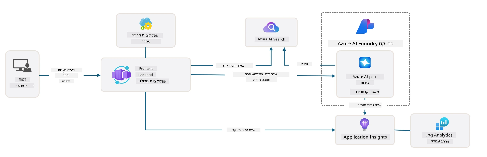

# 3. פירוק תבנית

!!! tip "בסוף מודול זה תוכל/י"

    - [ ] להפעיל את GitHub Copilot עם שרתי MCP לסיוע ב-Azure
    - [ ] להבין את מבנה התיקיות והרכיבים של תבנית AZD
    - [ ] לחקור דפוסי ארגון תשתית בתור קוד (Bicep)
    - [ ] **מעבדה 3:** להשתמש ב-GitHub Copilot כדי לחקור ולהבין את ארכיטקטורת המאגר

---


עם תבניות AZD ו-CLI של Azure Developer (`azd`) נוכל בקלות להתחיל את מסע הפיתוח של AI שלנו עם מאגרים סטנדרטיים שמספקים דוגמת קוד, תשתית וקבצי תצורה - בצורה של פרויקט _מוכן לפריסה_.

**אבל עכשיו, אנחנו צריכים להבין את מבנה הפרויקט ובסיס הקוד - ולהיות מסוגלים להתאים אישית את תבנית AZD - ללא כל ניסיון או הבנה מוקדמת של AZD!**

---

## 1. הפעלת GitHub Copilot

### 1.1 התקנת GitHub Copilot Chat

הגיע הזמן לחקור את [GitHub Copilot במצב Agent](https://code.visualstudio.com/docs/copilot/chat/chat-agent-mode). כעת, נוכל להשתמש בשפה טבעית לתאר את המשימה שלנו ברמה גבוהה, ולקבל עזרה בביצוע. עבור המעבדה הזאת, נשתמש ב[תכנית חינמית של Copilot](https://github.com/github-copilot/signup) שיש לה מגבלת ביצועים ושיחות חודשית.

ההרחבה יכולה להיות מותקנת מהמרקטפלייס, אך אמורה כבר להיות זמינה בסביבת Codespaces שלך. _לחץ על `Open Chat` מהתפריט הנפתח של אייקון Copilot - וכתוב בקשה כמו `What can you do?`_ - ייתכן שתתבקש להיכנס לחשבון. **GitHub Copilot Chat מוכן לשימוש**.

### 1.2. התקנת שרתי MCP

כדי שמצב ה-Agent יהיה יעיל, הוא צריך גישה לכלים הנכונים שיכולים לעזור לו לאחזר ידע או לבצע פעולות. כאן שרתי MCP יכולים לעזור. נגדיר את השרתים הבאים:

1. [שרת Azure MCP](../../../../../workshop/docs/instructions)
1. [שרת Microsoft Docs MCP](../../../../../workshop/docs/instructions)

להפעלת אלו:

1. צור קובץ בשם `.vscode/mcp.json` אם הוא לא קיים
1. העתק לתוך הקובץ את התוכן הבא - והפעל את השרתים!
   ```json title=".vscode/mcp.json"
   {
      "servers": {
         "Azure MCP Server": {
            "command": "npx",
            "args": [
            "-y",
            "@azure/mcp@latest",
            "server",
            "start"
            ]
         },
         "microsoft.docs.mcp": {
            "type": "http",
            "url": "https://learn.microsoft.com/api/mcp"
         }
      }
   }
   ```

??? warning "ייתכן שתקבל שגיאה ש`npx` לא מותקן (לחץ להרחבה עם הפתרון)"

      לתיקון, פתח את הקובץ `.devcontainer/devcontainer.json` והוסף שורה זו למדור התכונות. לאחר מכן בנה מחדש את הקונטיינר. כעת אמור להיות מותקן `npx`.

      ```title="" linenums="0"
         "features": {
            "ghcr.io/devcontainers/features/node:1": {},
            ...
         },
      ```

---

### 1.3. בדיקת GitHub Copilot Chat

**ראשית השתמש ב`az login` לאימות עם Azure משורת הפקודה ב-VS Code.**

כעת אמור להיות באפשרותך לבדוק את סטטוס מנוי ה-Azure שלך, ולשאול שאלות על משאבים או תצורות שהופעלו. נסה את הפקודות האלו:

1. `List my Azure resource groups`
1. `#foundry list my current deployments`

ניתן גם לשאול שאלות על תיעוד Azure ולקבל תשובות מבוססות על שרת Microsoft Docs MCP. נסה את הפקודות האלו:

1. `#microsoft_docs_search What is Azure Developer CLI?`
1. `#microsoft_docs_search Show me a Python tutorial to chat with deployed model`

או לבקש קטעי קוד להשלמת משימה. נסה את הפקודה הזו:

1. `Give me a Python code example that uses AAD for an interactive chat client`

במצב `Ask`, זה יספק קוד שאפשר להעתיק ולהריץ. במצב `Agent`, זה יכול אפילו ליצור עבורך את המשאבים הרלוונטיים - כולל סקריפטים ותיעוד - כדי לעזור בביצוע המשימה.

**כעת אתה מוכן להתחיל לחקור את מאגר התבניות**

---

## 2. פירוק ארכיטקטורה

??? prompt "שאל: הסבר את ארכיטקטורת היישום ב-docs/images/architecture.png בפסקה אחת"

      יישום זה הוא אפליקציית צ'אט מונעת בינה מלאכותית מבוססת Azure, המדגימה ארכיטקטורה מודרנית מבוססת סוכנים. הפתרון מתמקד ב-Azure Container App שמארח את קוד היישום הראשי, שמעבד את הקלט של המשתמש ומייצר תגובות אינטליגנטיות דרך סוכן AI.
      
      הארכיטקטורה משתמשת בפרויקט Microsoft Foundry כבסיס ליכולות הבינה המלאכותית, וקושרת לשירותי Azure AI המספקים את דגמי השפה התחתונים (כגון GPT-4o-mini) ופונקציונליות סוכן.
      
      אינטראקציות המשתמש זורמות דרך ממשק React אל backend מבוסס FastAPI שמתקשר עם שירות סוכן ה-AI ליצירת תגובות קונטקסטואליות.
      
      המערכת כוללת יכולות חיפוש ידע באמצעות חיפוש קבצים או שירות Azure AI Search, המאפשר לסוכן לגשת לצטט מידע ממסמכים שהועלו.
      
      לאיכות התפעולית, הארכיטקטורה כוללת ניטור מקיף דרך Application Insights ו-Log Analytics Workspace למעקב, רישום ואופטימיזציה של ביצועים.
      
      אחסון Azure מספק אחסון Blob לנתוני היישום והעלאת קבצים, בעוד זהות מנוהלת מבטיחה גישה מאובטחת בין משאבי Azure ללא אחסון סיסמאות.
      
      הפתרון כולו מותאם להרחבה ותחזוקה, כאשר היישום בקונטיינר מתרחב אוטומטית לפי ביקוש ומספק אבטחה מובנית, ניטור ויכולות CI/CD דרך אקוסיסטם שירותי Azure מנוהלים.



---

## 3. מבנה המאגר

!!! prompt "שאל: הסבר את מבנה תיקיית התבנית. התחל בדיאגרמה היררכית ויזואלית."

??? info "תשובה: דיאגרמה היררכית ויזואלית"

      ```bash title="" 
      get-started-with-ai-agents/
      ├── 📋 הגדרות והתקנה
      │   ├── azure.yaml                    # קונפיגורציית Azure Developer CLI
      │   ├── docker-compose.yaml           # קונטיינרים לפיתוח מקומי
      │   ├── pyproject.toml                # קונפיגורציית פרויקט Python
      │   ├── requirements-dev.txt          # תלות לפיתוח
      │   └── .devcontainer/                # הגדרת קונטיינר VS Code
      │
      ├── 🏗️ תשתית (infra/)
      │   ├── main.bicep                    # תבנית תשתית ראשית
      │   ├── api.bicep                     # משאבים ספציפיים ל-API
      │   ├── main.parameters.json          # פרמטרים לתשתית
      │   └── core/                         # רכיבי תשתית מודולריים
      │       ├── ai/                       # הגדרות שירות AI
      │       ├── host/                     # תשתית אירוח
      │       ├── monitor/                  # ניטור ורישום
      │       ├── search/                   # הגדרת Azure AI Search
      │       ├── security/                 # אבטחה וזהות
      │       └── storage/                  # הגדרות חשבון אחסון
      │
      ├── 💻 מקור היישום (src/)
      │   ├── api/                          # API צד שרת
      │   │   ├── main.py                   # נקודת כניסה לאפליקציית FastAPI
      │   │   ├── routes.py                 # הגדרות נתיבי API
      │   │   ├── search_index_manager.py  # פונקציות חיפוש
      │   │   ├── data/                     # טיפול בנתוני API
      │   │   ├── static/                   # נכסי רשת סטטיים
      │   │   └── templates/                # תבניות HTML
      │   ├── frontend/                     # ממשק React/TypeScript
      │   │   ├── package.json              # תלות Node.js
      │   │   ├── vite.config.ts            # קונפיגורציית בניית Vite
      │   │   └── src/                      # מקורות ממשק קדמי
      │   ├── data/                         # קבצי דוגמאות נתונים
      │   │   └── embeddings.csv            # אמבדינג מחושב מראש
      │   ├── files/                        # קבצי בסיס ידע
      │   │   ├── customer_info_*.json      # דוגמאות נתוני לקוחות
      │   │   └── product_info_*.md         # תיעוד מוצר
      │   ├── Dockerfile                    # קונפיגורציית קונטיינר
      │   └── requirements.txt              # תלות Python
      │
      ├── 🔧 אוטומציה וסקריפטים (scripts/)
      │   ├── postdeploy.sh/.ps1           # הגדרות לאחר פריסה
      │   ├── setup_credential.sh/.ps1     # הגדרת הרשאות
      │   ├── validate_env_vars.sh/.ps1    # אימות משתני סביבה
      │   └── resolve_model_quota.sh/.ps1  # ניהול מכסת מודלים
      │
      ├── 🧪 בדיקות והערכה
      │   ├── tests/                        # בדיקות יחידה ואינטגרציה
      │   │   └── test_search_index_manager.py
      │   ├── evals/                        # מסגרת הערכת סוכן
      │   │   ├── evaluate.py               # מפעיל הערכה
      │   │   ├── eval-queries.json         # שאילתות בדיקה
      │   │   └── eval-action-data-path.json
      │   ├── sandbox/                      # סביבת פיתוח חופשית
      │   │   ├── 1-quickstart.py           # דוגמאות התחלה מהירה
      │   │   └── aad-interactive-chat.py   # דוגמאות אימות זהות
      │   └── airedteaming/                 # הערכת בטיחות AI
      │       └── ai_redteaming.py          # בדיקות צוות אדום
      │
      ├── 📚 תיעוד (docs/)
      │   ├── deployment.md                 # מדריך פריסה
      │   ├── local_development.md          # הוראות התקנה מקומית
      │   ├── troubleshooting.md            # בעיות נפוצות ופתרונות
      │   ├── azure_account_setup.md        # דרישות מוקדמות ל-Azure
      │   └── images/                       # נכסים לתיעוד
      │
      └── 📄 מטא-נתוני פרויקט
         ├── README.md                     # סקירת פרויקט
         ├── CODE_OF_CONDUCT.md           # קודי התנהגות לקהילה
         ├── CONTRIBUTING.md              # מדריך לתרומה
         ├── LICENSE                      # תנאי רישיון
         └── next-steps.md                # הנחיות לאחר פריסה
      ```

### 3.1. ארכיטקטורת אפליקציה מרכזית

תבנית זו פועלת בדפוס של **אפליקציית ווב כוללנית** עם:

- **Backend**: Python FastAPI עם אינטגרציה ל-Azure AI
- **Frontend**: TypeScript/React עם מערכת בניית Vite
- **תשתית**: תבניות Azure Bicep למשאבי ענן
- **קונטיינריזציה**: Docker לפריסה עקבית

### 3.2 תשתית בתור קוד (bicep)

שכבת התשתית משתמשת בתבניות **Azure Bicep** המארגנות באופן מודולרי:

   - **`main.bicep`**: אורקסטרציה של כל משאבי Azure
   - **מודולים ב-`core/`**: רכיבים לשימוש חוזר לשירותים שונים
      - שירותי AI (Azure OpenAI, AI Search)
      - אירוח קונטיינרים (Azure Container Apps)
      - ניטור (Application Insights, Log Analytics)
      - אבטחה (Key Vault, Managed Identity)

### 3.3 מקור היישום (`src/`)

**Backend API (`src/api/`)**:

- REST API מבוסס FastAPI
- אינטגרציית Foundry Agents
- ניהול אינדקס חיפוש להוצאת ידע
- יכולות העלאת ועיבוד קבצים

**Frontend (`src/frontend/`)**:

- SPA מודרני ב-React/TypeScript
- Vite לפיתוח מהיר ובנייה אופטימלית
- ממשק צ'אט לאינטראקציות סוכן

**בסיס ידע (`src/files/`)**:

- דוגמאות נתוני לקוח ומוצר
- מדגים אחזור ידע מבוסס קבצים
- דוגמאות בפורמט JSON ו-Markdown


### 3.4 DevOps ואוטומציה

**סקריפטים (`scripts/`)**:

- סקריפטים ב-PowerShell ו-Bash חוצי פלטפורמות
- אימות והכנת סביבה
- קונפיגורציה לאחר פריסה
- ניהול מכסת מודלים

**אינטגרציה עם Azure Developer CLI**:

- קונפיגורציית `azure.yaml` לזרימות עבודה ב-`azd`
- אספקה ופריסה אוטומטיים
- ניהול משתני סביבה

### 3.5 בדיקות ואבטחת איכות

**מסגרת הערכה (`evals/`)**:

- הערכת ביצועי סוכן
- בדיקות איכות תגובה לשאילתות
- צנרת הערכה אוטומטית

**בטיחות AI (`airedteaming/`)**:

- בדיקות צוות אדום לבטיחות AI
- סריקות פגיעות אבטחה
- שיטות עבודה אחראיות באינטליגנציה מלאכותית

---

## 4. ברכות 🏆

הצלחת להשתמש ב-GitHub Copilot Chat עם שרתי MCP, לחקור את המאגר.

- [X] הפעלת GitHub Copilot ל-Azure
- [X] הבנת ארכיטקטורת היישום
- [X] חקירת מבנה תבנית AZD

זה נותן לך תחושה של הנכסים של _תשתית בתור קוד_ עבור תבנית זו. בהמשך נבחן את קובץ התצורה ל-AZD.

---

<!-- CO-OP TRANSLATOR DISCLAIMER START -->
**הצהרת אחריות**:  
מסמך זה תורגם באמצעות שירות תרגום מבוסס בינה מלאכותית [Co-op Translator](https://github.com/Azure/co-op-translator). למרות שאנו שואפים לדיוק, יש לשים לב כי תרגומים אוטומטיים עלולים להכיל שגיאות או אי־דיוקים. המסמך המקורי בשפת המקור שלו מהווה את המקור המוסמך. למידע קריטי מומלץ להשתמש בתרגום מקצועי שבוצע על ידי אדם. איננו אחראים לכל אי-הבנה או פרשנות שגויה הנובעת משימוש בתרגום זה.
<!-- CO-OP TRANSLATOR DISCLAIMER END -->