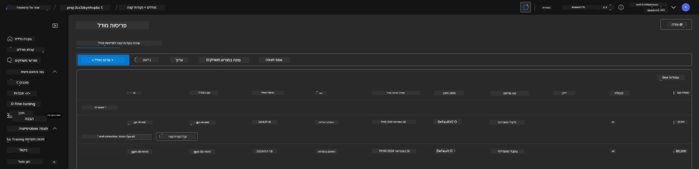
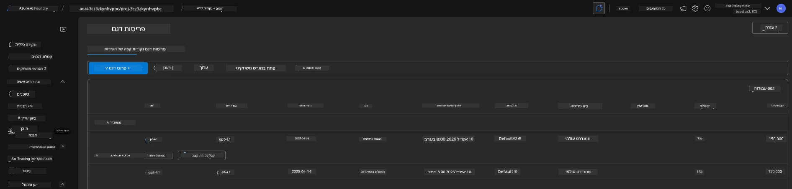

# 6. פירוק התשתית

!!! tip "בסוף מודול זה תוכל/י"

    - [ ] להבין את חשיבות ניקוי המשאבים וניהול עלויות
    - [ ] להשתמש ב-`azd down` כדי לפרק תשתית בצורה בטוחה
    - [ ] לשחזר שירותי קוגניטיב רכים שנמחקו במידת הצורך
    - [ ] **מעבדה 6:** לנקות משאבי Azure ולאמת את ההסרה

---

## תרגילים בונוס

לפני שנפרק את הפרויקט, הקדש כמה דקות לביצוע חקר פתוח.

!!! info "נסו את הנושאים האלו לחקירה"

    **נסו את GitHub Copilot:**
    
    1. שאל: `אילו תבניות AZD נוספות אוכל לנסות עבור תרחישי ריבוי סוכנים?`
    2. שאל: `כיצד אוכל להתאים אישית את ההוראות לסוכן עבור מקרה שימוש בריאותי?`
    3. שאל: `אילו משתני סביבה מווסתים אופטימיזציה של עלויות?`
    
    **חקור את פורטל Azure:**
    
    1. בדוק את מדדי Application Insights עבור העלאה שלך
    2. בדוק את ניתוח העלויות עבור המשאבים שסופקו
    3. חקור שוב את אזור המשחק של סוכן פורטל Microsoft Foundry

---

## פירוק התשתית

1. פירוק התשתית כל כך פשוט:
      
      ```bash title="" linenums="0"
      azd down --purge
      ```
1. הדגל `--purge` מוודא כי הוא גם מנקה משאבי Cognitive Service שנמחקו רכים, ובכך משחרר מכסת משאבים שהוחזקה על ידי משאבים אלו. בסיום תראה משהו דומה לזה:
      
      ```bash title="" linenums="0"
      ? Total resources to delete: 11, are you sure you want to continue? Yes
      Deleting your resources can take some time.
      (✓) Done: Deleted resource group rg-nitya-mshack-azd
      (✓) Done: Purging Cognitive Account: aoai-3cz3zkynhvpbc

      SUCCESS: Your application was removed from Azure in 11 minutes 4 seconds.
      ```

1. (אופציונלי) אם כעת תריץ שוב `azd up`, תבחין שמודול gpt-4.1 מותקן מכיוון שמשתנה הסביבה שונה (ונשמר) בתיקיית `.azure` המקומית. 

      הנה פריסות המודלים **לפני**:

      

      ופה זה **אחרי**:
      

---

<!-- CO-OP TRANSLATOR DISCLAIMER START -->
**כתב ויתור**:
מסמך זה תורגם באמצעות שירות התרגום המבוסס על בינה מלאכותית [Co-op Translator](https://github.com/Azure/co-op-translator). למרות שאנו שואפים לדייק, יש לקחת בחשבון כי תרגומים אוטומטיים עשויים להכיל שגיאות או אי דיוקים. המסמך המקורי בשפת המקור שלו הוא המקור הרשמי. למידע קריטי מומלץ לבצע תרגום מקצועי על ידי מתרגם אנושי. איננו אחראים לכל אי הבנות או פרשנויות שגויות הנובעות משימוש בתרגום זה.
<!-- CO-OP TRANSLATOR DISCLAIMER END -->