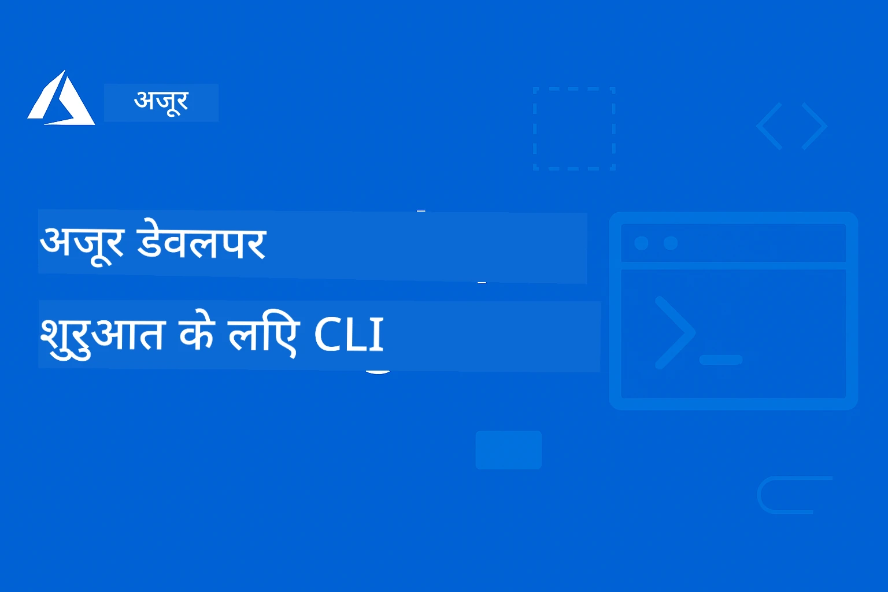

# AZD शुरुआती के लिए: एक संरचित सीखने की यात्रा

 

[](https://GitHub.com/microsoft/azd-for-beginners/watchers/)
[](https://GitHub.com/microsoft/azd-for-beginners/network/)
[](https://GitHub.com/microsoft/azd-for-beginners/stargazers/)

[](https://discord.gg/microsoft-azure)
[](https://discord.gg/nTYy5BXMWG)

## इस कोर्स के साथ शुरुआत करना

अपनी AZD सीखने की यात्रा शुरू करने के लिए इन चरणों का पालन करें:

1. **रिपॉजिटरी को फोर्क करें**: क्लिक करें [](https://GitHub.com/microsoft/azd-for-beginners/fork)
2. **रिपॉजिटरी क्लोन करें**: `git clone https://github.com/microsoft/azd-for-beginners.git`
3. **समुदाय में शामिल हों**: [Azure Discord Communities](https://discord.com/invite/ByRwuEEgH4) विशेषज्ञ सहायता के लिए
4. **अपना सीखने का मार्ग चुनें**: नीचे दिए गए अध्याय से चुनें जो आपके अनुभव स्तर से मेल खाता है

### बहुभाषी समर्थन

#### स्वत: अनुवाद (हमेशा अद्यतन)

<!-- CO-OP TRANSLATOR LANGUAGES TABLE START -->
[Arabic](../ar/README.md) | [Bengali](../bn/README.md) | [Bulgarian](../bg/README.md) | [Burmese (Myanmar)](../my/README.md) | [Chinese (Simplified)](../zh-CN/README.md) | [Chinese (Traditional, Hong Kong)](../zh-HK/README.md) | [Chinese (Traditional, Macau)](../zh-MO/README.md) | [Chinese (Traditional, Taiwan)](../zh-TW/README.md) | [Croatian](../hr/README.md) | [Czech](../cs/README.md) | [Danish](../da/README.md) | [Dutch](../nl/README.md) | [Estonian](../et/README.md) | [Finnish](../fi/README.md) | [French](../fr/README.md) | [German](../de/README.md) | [Greek](../el/README.md) | [Hebrew](../he/README.md) | [Hindi](./README.md) | [Hungarian](../hu/README.md) | [Indonesian](../id/README.md) | [Italian](../it/README.md) | [Japanese](../ja/README.md) | [Kannada](../kn/README.md) | [Korean](../ko/README.md) | [Lithuanian](../lt/README.md) | [Malay](../ms/README.md) | [Malayalam](../ml/README.md) | [Marathi](../mr/README.md) | [Nepali](../ne/README.md) | [Nigerian Pidgin](../pcm/README.md) | [Norwegian](../no/README.md) | [Persian (Farsi)](../fa/README.md) | [Polish](../pl/README.md) | [Portuguese (Brazil)](../pt-BR/README.md) | [Portuguese (Portugal)](../pt-PT/README.md) | [Punjabi (Gurmukhi)](../pa/README.md) | [Romanian](../ro/README.md) | [Russian](../ru/README.md) | [Serbian (Cyrillic)](../sr/README.md) | [Slovak](../sk/README.md) | [Slovenian](../sl/README.md) | [Spanish](../es/README.md) | [Swahili](../sw/README.md) | [Swedish](../sv/README.md) | [Tagalog (Filipino)](../tl/README.md) | [Tamil](../ta/README.md) | [Telugu](../te/README.md) | [Thai](../th/README.md) | [Turkish](../tr/README.md) | [Ukrainian](../uk/README.md) | [Urdu](../ur/README.md) | [Vietnamese](../vi/README.md)

> **स्थानीय रूप से क्लोन करना पसंद है?**

> इस रिपॉजिटरी में 50+ भाषाओं के अनुवाद शामिल हैं जो डाउनलोड आकार को काफी बढ़ाते हैं। बिना अनुवादों के क्लोन करने के लिए sparse checkout का उपयोग करें:
> ```bash
> git clone --filter=blob:none --sparse https://github.com/microsoft/AZD-for-beginners.git
> cd AZD-for-beginners
> git sparse-checkout set --no-cone '/*' '!translations' '!translated_images'
> ```
> यह आपको कोर्स पूरा करने के लिए आवश्यक सब कुछ बहुत तेजी से डाउनलोड करने का तरीका देता है।
<!-- CO-OP TRANSLATOR LANGUAGES TABLE END -->

## कोर्स का अवलोकन

संरचित अध्यायों के माध्यम से Azure Developer CLI (azd) में महारत हासिल करें जो प्रगतिशील सीखने के लिए डिज़ाइन किए गए हैं। **Microsoft Foundry इंटीग्रेशन के साथ AI एप्लिकेशन पर विशेष ध्यान।**

### आधुनिक डेवलपर्स के लिए यह कोर्स क्यों आवश्यक है

Microsoft Foundry Discord समुदाय की अंतर्दृष्टि के अनुसार, **45% डेवलपर्स AI वर्कलोड के लिए AZD का उपयोग करना चाहते हैं** लेकिन निम्नलिखित चुनौतियों का सामना करते हैं:
- जटिल मल्टी-सर्विस AI आर्किटेक्चर
- प्रोडक्शन AI डिप्लॉयमेंट के सर्वोत्तम अभ्यास  
- Azure AI सेवा इंटीग्रेशन और कॉन्फ़िगरेशन
- AI वर्कलोड के लिए लागत अनुकूलन
- AI-विशिष्ट डिप्लॉयमेंट समस्याओं का निवारण

### सीखने के उद्देश्य

इस संरचित कोर्स को पूरा करके, आप:
- **AZD मूल बातें सीखेंगे**: मूल अवधारणाएं, स्थापना, और कॉन्फ़िगरेशन
- **AI एप्लिकेशन डिप्लॉय करेंगे**: AZD का उपयोग Microsoft Foundry सेवाओं के साथ
- **इन्फ्रास्ट्रक्चर कोड के रूप में लागू करेंगे**: Bicep टेम्प्लेट के साथ Azure संसाधनों का प्रबंधन
- **डिप्लॉयमेंट की समस्याओं का समाधान करेंगे**: सामान्य मुद्दों को हल करना और डिबग करना
- **प्रोडक्शन के लिए अनुकूलित करेंगे**: सुरक्षा, स्केलिंग, निगरानी, और लागत प्रबंधन
- **मल्टी-एजेंट समाधानों का निर्माण करेंगे**: जटिल AI आर्किटेक्चर डिप्लॉय करना

## 📚 सीखने के अध्याय

*अपने अनुभव स्तर और लक्ष्यों के अनुसार अपना सीखने का मार्ग चुनें*

### 🚀 अध्याय 1: आधार और त्वरित शुरुआत
**पूर्वापेक्षाएं**: Azure सब्सक्रिप्शन, बुनियादी कमांड लाइन ज्ञान  
**अवधि**: 30-45 मिनट  
**जटिलता**: ⭐

#### आप क्या सीखेंगे
- Azure Developer CLI की मूल बातें समझना
- अपने प्लेटफ़ॉर्म पर AZD स्थापित करना
- आपकी पहली सफल डिप्लॉयमेंट

#### सीखने के संसाधन
- **🎯 शुरुआत यहां करें**: [Azure Developer CLI क्या है?](../..)
- **📖 सिद्धांत**: [AZD मूल बातें](docs/getting-started/azd-basics.md) - मुख्य अवधारणाएँ और शब्दावली
- **⚙️ सेटअप**: [स्थापना और सेटअप](docs/getting-started/installation.md) - प्लेटफ़ॉर्म-विशिष्ट मार्गदर्शिकाएँ
- **🛠️ व्यावहारिक अभ्यास**: [आपका पहला प्रोजेक्ट](docs/getting-started/first-project.md) - चरण-दर-चरण ट्यूटोरियल
- **📋 त्वरित संदर्भ**: [कमांड चीट शीट](resources/cheat-sheet.md)

#### व्यावहारिक अभ्यास
```bash
# त्वरित स्थापना जांच
azd version

# अपना पहला एप्लिकेशन तैनात करें
azd init --template todo-nodejs-mongo
azd up
```

**💡 अध्याय का परिणाम**: AZD का उपयोग करते हुए Azure पर एक सरल वेब एप्लिकेशन सफलतापूर्वक डिप्लॉय करें

**✅ सफलता की पुष्टि:**
```bash
# चैप्टर 1 पूरा करने के बाद, आप सक्षम होंगे:
azd version              # इंस्टॉल्ड संस्करण दिखाता है
azd init --template todo-nodejs-mongo  # परियोजना प्रारंभ करता है
azd up                  # Azure पर तैनात करता है
azd show                # चल रहे ऐप का URL दिखाता है
# एप्लिकेशन ब्राउज़र में खुलता है और काम करता है
azd down --force --purge  # संसाधनों को साफ करता है
```

**📊 समय निवेश:** 30-45 मिनट  
**📈 कौशल स्तर बाद में:** स्वायत्त रूप से बुनियादी एप्लिकेशन डिप्लॉय कर सकते हैं

**✅ सफलता की पुष्टि:**
```bash
# अध्याय 1 पूरा करने के बाद, आपको सक्षम होना चाहिए:
azd version              # स्थापित संस्करण दिखाता है
azd init --template todo-nodejs-mongo  # प्रोजेक्ट आरंभ करता है
azd up                  # Azure पर तैनात करता है
azd show                # चल रही ऐप URL दिखाता है
# एप्लिकेशन ब्राउज़र में खुलता है और काम करता है
azd down --force --purge  # संसाधनों की सफाई करता है
```

**📊 समय निवेश:** 30-45 मिनट  
**📈 कौशल स्तर बाद में:** स्वायत्त रूप से बुनियादी एप्लिकेशन डिप्लॉय कर सकते हैं

---

### 🤖 अध्याय 2: AI-प्रथम विकास (AI डेवलपर्स के लिए अनुशंसित)
**पूर्वापेक्षाएं**: अध्याय 1 पूरा किया हुआ  
**अवधि**: 1-2 घंटे  
**जटिलता**: ⭐⭐

#### आप क्या सीखेंगे
- AZD के साथ Microsoft Foundry इंटीग्रेशन
- AI-संचालित एप्लिकेशन डिप्लॉय करना
- AI सेवा कॉन्फ़िगरेशन समझना

#### सीखने के संसाधन
- **🎯 शुरुआत यहां करें**: [Microsoft Foundry इंटीग्रेशन](docs/microsoft-foundry/microsoft-foundry-integration.md)
- **📖 पैटर्न**: [AI मॉडल डिप्लॉयमेंट](docs/microsoft-foundry/ai-model-deployment.md) - AI मॉडल को डिप्लॉय और प्रबंधित करना
- **🛠️ कार्यशाला**: [AI कार्यशाला लैब](docs/microsoft-foundry/ai-workshop-lab.md) - अपने AI समाधान को AZD-रेडी बनाएं
- **🎥 इंटरैक्टिव गाइड**: [कार्यशाला सामग्री](workshop/README.md) - MkDocs * DevContainer Environment के साथ ब्राउज़र आधारित सीखना
- **📋 टेम्प्लेट्स**: [Microsoft Foundry टेम्प्लेट्स](../..)
- **📝 उदाहरण**: [AZD डिप्लॉयमेंट उदाहरण](examples/README.md)

#### व्यावहारिक अभ्यास
```bash
# अपनी पहली AI एप्लिकेशन तैनात करें
azd init --template azure-search-openai-demo
azd up

# अतिरिक्त AI टेम्पलेट्स आजमाएँ
azd init --template openai-chat-app-quickstart
azd init --template agent-openai-python-prompty
```

**💡 अध्याय का परिणाम**: RAG क्षमताओं के साथ एक AI-पावर चैट एप्लिकेशन डिप्लॉय और कॉन्फ़िगर करें

**✅ सफलता की पुष्टि:**
```bash
# अध्याय 2 के बाद, आपको सक्षम होना चाहिए:
azd init --template azure-search-openai-demo
azd up
# एआई चैट इंटरफ़ेस का परीक्षण करें
# प्रश्न पूछें और स्रोतों के साथ एआई-संचालित उत्तर प्राप्त करें
# खोज एकीकरण काम करता है यह सत्यापित करें
azd monitor  # देखें कि एप्लिकेशन इनसाइट्स टेलीमेट्री दिखाता है
azd down --force --purge
```

**📊 समय निवेश:** 1-2 घंटे  
**📈 कौशल स्तर बाद में:** प्रोडक्शन-तैयार AI एप्लिकेशन डिप्लॉय और कॉन्फ़िगर कर सकते हैं  
**💰 लागत जागरूकता:** $80-150/माह विकास लागत, $300-3500/माह प्रोडक्शन लागत को समझें

#### 💰 AI डिप्लॉयमेंट के लिए लागत विचार

**डेवलपमेंट एनवॉयरनमेंट (अनुमानित $80-150/माह):**
- Azure OpenAI (पे-एज़-यू-गो): $0-50/माह (टोकन उपयोग पर आधारित)
- AI Search (बेसिक टियर): $75/माह
- कंटेनर एप्स (कंजम्प्शन): $0-20/माह
- स्टोरेज (स्टैंडर्ड): $1-5/माह

**प्रोडक्शन एनवॉयरनमेंट (अनुमानित $300-3,500+/माह):**
- Azure OpenAI (सतत प्रदर्शन के लिए PTU): $3,000+/माह या उच्च वॉल्यूम के साथ पे-एज़-यू-गो
- AI Search (स्टैंडर्ड टियर): $250/माह
- कंटेनर एप्स (डेडिकेटेड): $50-100/माह
- एप्लिकेशन इन्साइट्स: $5-50/माह
- स्टोरेज (प्रीमियम): $10-50/माह

**💡 लागत अनुकूलन युक्तियाँ:**
- सीखने के लिए **फ्री टियर** Azure OpenAI का उपयोग करें (50,000 टोकन/माह शामिल)
- सक्रिय रूप से विकास न कर रहे हों तो संसाधनों को डीलोकेट करने के लिए `azd down` चलाएं
- कंजम्प्शन-आधारित बिलिंग से शुरू करें, प्रोडक्शन के लिए केवल PTU पर अपग्रेड करें
- डिप्लॉयमेंट से पहले लागत का अनुमान लगाने के लिए `azd provision --preview` का उपयोग करें
- ऑटो-स्केलिंग सक्षम करें: केवल असली उपयोग के लिए भुगतान करें

**लागत निगरानी:**
```bash
# अनुमानित मासिक लागत की जाँच करें
azd provision --preview

# Azure पोर्टल में वास्तविक लागत की निगरानी करें
az consumption budget list --resource-group <your-rg>
```

---

### ⚙️ अध्याय 3: कॉन्फ़िगरेशन और प्रमाणीकरण
**पूर्वापेक्षाएं**: अध्याय 1 पूरा किया हुआ  
**अवधि**: 45-60 मिनट  
**जटिलता**: ⭐⭐

#### आप क्या सीखेंगे
- एनवॉयरनमेंट कॉन्फ़िगरेशन और प्रबंधन
- प्रमाणीकरण और सुरक्षा सर्वोत्तम प्रथाएँ
- संसाधन नामकरण और संगठन

#### सीखने के संसाधन
- **📖 कॉन्फ़िगरेशन**: [कॉन्फिगरेशन गाइड](docs/getting-started/configuration.md) - एनवॉयरनमेंट सेटअप
- **🔐 सुरक्षा**: [प्रमाणीकरण पैटर्न और प्रबंधित पहचान](docs/getting-started/authsecurity.md) - प्रमाणीकरण पैटर्न
- **📝 उदाहरण**: [डेटाबेस एप्लिकेशन उदाहरण](examples/database-app/README.md) - AZD डेटाबेस उदाहरण

#### व्यावहारिक अभ्यास
- कई एनवॉयरनमेंट सेटअप करें (डेव, स्टेजिंग, प्रोड)
- प्रबंधित पहचान प्रमाणीकरण सेटअप करें
- एनवॉयरनमेंट-विशिष्ट कॉन्फ़िगरेशन लागू करें

**💡 अध्याय का परिणाम**: उचित प्रमाणीकरण और सुरक्षा के साथ कई एनवॉयरनमेंट प्रबंधित करें

---

### 🏗️ अध्याय 4: इन्फ्रास्ट्रक्चर ऐज कोड और डिप्लॉयमेंट
**पूर्वापेक्षाएं**: अध्याय 1-3 पूरा किया हुआ  
**अवधि**: 1-1.5 घंटे  
**जटिलता**: ⭐⭐⭐

#### आप क्या सीखेंगे
- उन्नत डिप्लॉयमेंट पैटर्न
- Bicep के साथ इन्फ्रास्ट्रक्चर ऐज कोड
- संसाधन प्रोविजनिंग रणनीतियाँ

#### सीखने के संसाधन
- **📖 डिप्लॉयमेंट**: [डिप्लॉयमेंट गाइड](docs/deployment/deployment-guide.md) - पूर्ण वर्कफ़्लो
- **🏗️ प्रोविजनिंग**: [प्रोविजनिंग संसाधन](docs/deployment/provisioning.md) - Azure संसाधन प्रबंधन
- **📝 उदाहरण**: [कंटेनर ऐप उदाहरण](../../examples/container-app) - कंटेनरयुक्त डिप्लॉयमेंट

#### व्यावहारिक अभ्यास
- कस्टम Bicep टेम्प्लेट बनाएं
- मल्टी-सर्विस एप्लिकेशन डिप्लॉय करें
- ब्लू-ग्रीन डिप्लॉयमेंट रणनीतियाँ लागू करें

**💡 अध्याय का परिणाम**: कस्टम इंफ्रास्ट्रक्चर टेम्प्लेट्स का उपयोग करके जटिल मल्टी-सर्विस एप्लिकेशन डिप्लॉय करें

---

### 🎯 अध्याय 5: मल्टी-एजेंट AI समाधान (उन्नत)
**पूर्वापेक्षाएं**: अध्याय 1-2 पूरा किया हुआ  
**अवधि**: 2-3 घंटे  
**जटिलता**: ⭐⭐⭐⭐
#### आप क्या सीखेंगे
- मल्टी-एजेंट आर्किटेक्चर पैटर्न
- एजेंट ऑर्केस्ट्रेशन और समन्वय
- प्रोडक्शन के लिए तैयार AI तैनाती

#### सीखने के संसाधन
- **🤖 प्रदर्शित परियोजना**: [रिटेल मल्टी-एजेंट समाधान](examples/retail-scenario.md) - पूर्ण कार्यान्वयन
- **🛠️ ARM टेम्पलेट्स**: [ARM टेम्पलेट पैकेज](../../examples/retail-multiagent-arm-template) - एक-क्लिक तैनाती
- **📖 आर्किटेक्चर**: [मल्टी-एजेंट समन्वय पैटर्न](/docs/pre-deployment/coordination-patterns.md) - पैटर्न

#### व्यावहारिक अभ्यास
```bash
# पूरी रिटेल मल्टी-एजेंट सॉल्यूशन को तैनात करें
cd examples/retail-multiagent-arm-template
./deploy.sh

# एजेंट कॉन्फ़िगरेशन का अन्वेषण करें
az deployment group show --resource-group <rg-name> --name <deployment-name>
```

**💡 अध्याय परिणाम**: ग्राहक और इन्वेंट्री एजेंट्स के साथ प्रोडक्शन-तैयार मल्टी-एजेंट AI समाधान को तैनात और प्रबंधित करें

---

### 🔍 अध्याय 6: पूर्व-तैनाती सत्यापन एवं योजना
**पूर्व आवश्यकताएँ**: अध्याय 4 पूर्ण  
**समय**: 1 घंटा  
**जटिलता**: ⭐⭐

#### आप क्या सीखेंगे
- क्षमता योजना और संसाधन सत्यापन
- SKU चयन रणनीतियाँ
- पूर्व-उड़ान जांच और स्वचालन

#### सीखने के संसाधन
- **📊 योजना**: [क्षमता योजना](docs/pre-deployment/capacity-planning.md) - संसाधन सत्यापन
- **💰 चयन**: [SKU चयन](docs/pre-deployment/sku-selection.md) - लागत-कुशल विकल्प
- **✅ सत्यापन**: [पूर्व-उड़ान जांच](docs/pre-deployment/preflight-checks.md) - स्वचालित स्क्रिप्ट्स

#### व्यावहारिक अभ्यास
- क्षमता सत्यापन स्क्रिप्ट्स चलाएँ
- लागत के लिए SKU चयन को अनुकूलित करें
- स्वचालित पूर्व-तैनाती जांच लागू करें

**💡 अध्याय परिणाम**: निष्पादन से पहले तैनाती को सत्यापित और अनुकूलित करें

---

### 🚨 अध्याय 7: समस्या निवारण और डिबगिंग
**पूर्व आवश्यकताएँ**: कोई भी तैनाती अध्याय पूर्ण  
**समय**: 1-1.5 घंटे  
**जटिलता**: ⭐⭐

#### आप क्या सीखेंगे
- व्यवस्थित डिबगिंग दृष्टिकोण
- आम समस्याएँ और समाधान
- AI-विशिष्ट समस्या निवारण

#### सीखने के संसाधन
- **🔧 सामान्य समस्याएँ**: [सामान्य समस्याएँ](docs/troubleshooting/common-issues.md) - FAQ और समाधान
- **🕵️ डिबगिंग**: [डिबगिंग गाइड](docs/troubleshooting/debugging.md) - चरण-दर-चरण रणनीतियाँ
- **🤖 AI समस्याएँ**: [AI-विशिष्ट समस्या निवारण](docs/troubleshooting/ai-troubleshooting.md) - AI सेवा समस्याएँ

#### व्यावहारिक अभ्यास
- तैनाती विफलताओं का निदान करें
- प्रमाणीकरण समस्याओं को सुलझाएँ
- AI सेवा कनेक्टिविटी डिबग करें

**💡 अध्याय परिणाम**: सामान्य तैनाती समस्याओं का स्वतंत्र रूप से निदान और समाधान करें

---

### 🏢 अध्याय 8: प्रोडक्शन और एंटरप्राइज पैटर्न
**पूर्व आवश्यकताएँ**: अध्याय 1-4 पूर्ण  
**समय**: 2-3 घंटे  
**जटिलता**: ⭐⭐⭐⭐

#### आप क्या सीखेंगे
- प्रोडक्शन तैनाती रणनीतियाँ
- एंटरप्राइज सुरक्षा पैटर्न
- निगरानी और लागत अनुकूलन

#### सीखने के संसाधन
- **🏭 प्रोडक्शन**: [प्रोडक्शन AI सर्वोत्तम प्रथाएँ](docs/microsoft-foundry/production-ai-practices.md) - एंटरप्राइज पैटर्न
- **📝 उदाहरण**: [माइक्रोसर्विसेज़ उदाहरण](../../examples/microservices) - जटिल आर्किटेक्चर
- **📊 निगरानी**: [एप्लिकेशन इनसाइट्स एकीकरण](docs/pre-deployment/application-insights.md) - निगरानी

#### व्यावहारिक अभ्यास
- एंटरप्राइज सुरक्षा पैटर्न लागू करें
- व्यापक निगरानी सेटअप करें
- उपयुक्त प्रशासन के साथ प्रोडक्शन में तैनात करें

**💡 अध्याय परिणाम**: पूर्ण प्रोडक्शन क्षमताओं के साथ एंटरप्राइज-तैयार अनुप्रयोग तैनात करें

---

## 🎓 कार्यशाला अवलोकन: व्यावहारिक सीखने का अनुभव

> **⚠️ कार्यशाला स्थिति: सक्रिय विकास**  
> कार्यशाला सामग्री वर्तमान में विकसित और परिष्कृत की जा रही है। मुख्य मॉड्यूल क्रियाशील हैं, लेकिन कुछ उन्नत अनुभाग अधूरे हैं। हम सभी सामग्री को पूरा करने पर सक्रिय रूप से काम कर रहे हैं। [प्रगति देखें →](workshop/README.md)

### इंटरैक्टिव कार्यशाला सामग्री
**ब्राउज़र-आधारित उपकरणों और मार्गदर्शित अभ्यासों के साथ व्यापक व्यावहारिक सीखने का अनुभव**

हमारी कार्यशाला सामग्री अध्याय-आधारित पाठ्यक्रम के पूरक के रूप में संरचित, इंटरैक्टिव सीखने का अनुभव प्रदान करती है। कार्यशाला स्व-गति सीखने और प्रशिक्षक-संचालित सत्र दोनों के लिए डिज़ाइन की गई है।

#### 🛠️ कार्यशाला सुविधाएँ
- **ब्राउज़र-आधारित इंटरफेस**: खोज, कॉपी, और थीम सुविधाओं के साथ पूर्ण MkDocs-समर्थित कार्यशाला
- **GitHub Codespaces एकीकरण**: एक-क्लिक विकास पर्यावरण सेटअप
- **संरचित सीखने का मार्ग**: 7-चरण मार्गदर्शित अभ्यास (कुल 3.5 घंटे)
- **खोज → तैनाती → अनुकूलन**: प्रगतिशील कार्यप्रणाली
- **इंटरैक्टिव DevContainer वातावरण**: पूर्व-कॉन्फ़िगर किए गए उपकरण और डिपेंडेंसियाँ

#### 📚 कार्यशाला संरचना
कार्यशाला एक **खोज → तैनाती → अनुकूलन** कार्यप्रणाली का पालन करती है:

1. **खोज चरण** (45 मिनट)
   - Microsoft Foundry टेम्पलेट्स और सेवाओं का अन्वेषण
   - मल्टी-एजेंट आर्किटेक्चर पैटर्न को समझना
   - तैनाती आवश्यकताओं और पूर्व आवश्यकताओं की समीक्षा

2. **तैनाती चरण** (2 घंटे)
   - AZD के साथ AI अनुप्रयोगों की व्यावहारिक तैनाती
   - Azure AI सेवाओं और एंडपॉइंट्स को कॉन्फ़िगर करना
   - सुरक्षा और प्रमाणीकरण पैटर्न लागू करना

3. **अनुकूलन चरण** (45 मिनट)
   - विशिष्ट उपयोग मामलों के लिए अनुप्रयोग संशोधित करना
   - प्रोडक्शन तैनाती के लिए अनुकूलित करना
   - निगरानी और लागत प्रबंधन लागू करना

#### 🚀 कार्यशाला शुरू करें
```bash
# विकल्प 1: GitHub Codespaces (अनुशंसित)
# रिपॉजिटरी में "Code" → "Create codespace on main" पर क्लिक करें

# विकल्प 2: स्थानीय विकास
git clone https://github.com/microsoft/azd-for-beginners.git
cd azd-for-beginners/workshop
# workshop/README.md में सेटअप निर्देशों का पालन करें
```

#### 🎯 कार्यशाला सीखने के परिणाम
कार्यशाला पूरा करने पर प्रतिभागी:
- **प्रोडक्शन AI अनुप्रयोग तैनात करें**: Microsoft Foundry सेवाओं के साथ AZD का उपयोग करें
- **मल्टी-एजेंट आर्किटेक्चर में महारत हासिल करें**: समन्वित AI एजेंट समाधान लागू करें
- **सुरक्षा सर्वोत्तम प्रथाएँ अपनाएं**: प्रमाणीकरण और पहुँच नियंत्रण कॉन्फ़िगर करें
- **स्केल के लिए अनुकूलित करें**: लागत-कुशल, प्रदर्शनकारी तैनाती डिज़ाइन करें
- **तैनाती समस्या निवारण करें**: सामान्य समस्याओं को स्वतंत्र रूप से हल करें

#### 📖 कार्यशाला संसाधन
- **🎥 इंटरैक्टिव गाइड**: [कार्यशाला सामग्री](workshop/README.md) - ब्राउज़र-आधारित सीखने का वातावरण
- **📋 चरण-दर-चरण निर्देश**: [मार्गदर्शित अभ्यास](../../workshop/docs/instructions) - विस्तृत वाक-थ्रू
- **🛠️ AI कार्यशाला लैब**: [AI कार्यशाला लैब](docs/microsoft-foundry/ai-workshop-lab.md) - AI-केंद्रित अभ्यास
- **💡 त्वरित प्रारंभ**: [कार्यशाला सेटअप गाइड](workshop/README.md#quick-start) - पर्यावरण कॉन्फ़िगरेशन

**उपयुक्त है**: कॉर्पोरेट प्रशिक्षण, विश्वविद्यालय पाठ्यक्रम, स्व-गति सीखना, और डेवलपर बूटकैम्प के लिए।

---

## 📖 Azure Developer CLI क्या है?

Azure Developer CLI (azd) एक डेवलपर-केंद्रित कमांड-लाइन इंटरफ़ेस है जो Azure पर अनुप्रयोगों के निर्माण और तैनाती की प्रक्रिया को तेज़ करता है। यह प्रदान करता है:

- **टेम्पलेट-आधारित तैनातियाँ** - सामान्य अनुप्रयोग पैटर्न के लिए पूर्व-निर्मित टेम्पलेट का उपयोग करें
- **कोड के रूप में इन्फ्रास्ट्रक्चर** - Bicep या Terraform का उपयोग करके Azure संसाधनों का प्रबंधन करें  
- **एकीकृत वर्कफ़्लोज़** - अनुप्रयोगों को सहजता से स्थापित, तैनात, और मॉनिटर करें
- **डेवलपर-अनुकूल** - डेवलपर उत्पादकता और अनुभव के लिए अनुकूलित

### **AZD + Microsoft Foundry: AI तैनाती के लिए आदर्श**

**AI समाधान के लिए AZD क्यों?** AZD AI डेवलपर्स के शीर्ष चुनौतियों को संबोधित करता है:

- **AI-तैयार टेम्पलेट्स** - Azure OpenAI, कॉग्निटिव सेवाएँ, और ML वर्कलोड के लिए पूर्व-कॉन्फ़िगर किए गए टेम्पलेट्स
- **सुरक्षित AI तैनातियाँ** - AI सेवाओं, API कीज, और मॉडल एंडपॉइंट्स के लिए अंतर्निहित सुरक्षा पैटर्न  
- **प्रोडक्शन AI पैटर्न** - स्केलेबल, लागत-कुशल AI अनुप्रयोग तैनातियों के लिए सर्वोत्तम प्रथाएँ
- **एंड-टू-एंड AI वर्कफ़्लोज़** - मॉडल विकास से लेकर प्रोडक्शन तैनाती तक उचित निगरानी के साथ
- **लागत अनुकूलन** - AI वर्कलोड के लिए स्मार्ट संसाधन आवंटन और स्केलिंग रणनीतियाँ
- **Microsoft Foundry एकीकरण** - Microsoft Foundry मॉडल कैटलॉग और एंडपॉइंट्स से सहज कनेक्शन

---

## 🎯 टेम्पलेट्स और उदाहरण पुस्तकालय

### प्रदर्शित: Microsoft Foundry टेम्पलेट्स
**यदि आप AI अनुप्रयोग तैनात कर रहे हैं तो यहां से शुरू करें!**

> **नोट:** ये टेम्पलेट विभिन्न AI पैटर्न दिखाते हैं। कुछ बाहरी Azure Samples हैं, अन्य स्थानीय कार्यान्वयन हैं।

| टेम्पलेट | अध्याय | जटिलता | सेवाएँ | प्रकार |
|----------|---------|------------|----------|------|
| [**AI चैट के साथ शुरू करें**](https://github.com/Azure-Samples/get-started-with-ai-chat) | अध्याय 2 | ⭐⭐ | AzureOpenAI + Azure AI मॉडल इन्फरेंस API + Azure AI सर्च + Azure कंटेनर ऐप्स + एप्लिकेशन इनसाइट्स | बाहरी |
| [**AI एजेंट्स के साथ शुरू करें**](https://github.com/Azure-Samples/get-started-with-ai-agents) | अध्याय 2 | ⭐⭐ | Azure AI एजेंट सेवा + AzureOpenAI + Azure AI सर्च + Azure कंटेनर ऐप्स + एप्लिकेशन इनसाइट्स| बाहरी |
| [**Azure सर्च + OpenAI डेमो**](https://github.com/Azure-Samples/azure-search-openai-demo) | अध्याय 2 | ⭐⭐ | AzureOpenAI + Azure AI सर्च + ऐप सेवा + स्टोरेज | बाहरी |
| [**OpenAI चैट ऐप त्वरित प्रारंभ**](https://github.com/Azure-Samples/openai-chat-app-quickstart) | अध्याय 2 | ⭐ | AzureOpenAI + कंटेनर ऐप्स + एप्लिकेशन इनसाइट्स | बाहरी |
| [**एजेंट OpenAI Python Prompty**](https://github.com/Azure-Samples/agent-openai-python-prompty) | अध्याय 5 | ⭐⭐⭐ | AzureOpenAI + Azure फ़ंक्शंस + Prompty | बाहरी |
| [**Contoso चैट RAG**](https://github.com/Azure-Samples/contoso-chat) | अध्याय 8 | ⭐⭐⭐⭐ | AzureOpenAI + AI सर्च + Cosmos DB + कंटेनर ऐप्स | बाहरी |
| [**रिटेल मल्टी-एजेंट समाधान**](examples/retail-scenario.md) | अध्याय 5 | ⭐⭐⭐⭐ | AzureOpenAI + AI सर्च + स्टोरेज + कंटेनर ऐप्स + Cosmos DB | **स्थानीय** |

### प्रदर्शित: पूर्ण सीखने के परिदृश्य
**सीखने वाले अध्यायों के लिए मानचित्रित प्रोडक्शन-तैयार अनुप्रयोग टेम्पलेट्स**

| टेम्पलेट | सीखने वाला अध्याय | जटिलता | मुख्य सीखने |
|----------|------------------|------------|--------------|
| [**openai-chat-app-quickstart**](https://github.com/Azure-Samples/openai-chat-app-quickstart) | अध्याय 2 | ⭐ | बुनियादी AI तैनाती पैटर्न |
| [**azure-search-openai-demo**](https://github.com/Azure-Samples/azure-search-openai-demo) | अध्याय 2 | ⭐⭐ | Azure AI सर्च के साथ RAG कार्यान्वयन |
| [**ai-document-processing**](https://github.com/Azure-Samples/ai-document-processing) | अध्याय 4 | ⭐⭐ | दस्तावेज़ बुद्धिमत्ता एकीकरण |
| [**agent-openai-python-prompty**](https://github.com/Azure-Samples/agent-openai-python-prompty) | अध्याय 5 | ⭐⭐⭐ | एजेंट फ्रेमवर्क और फंक्शन कॉलिंग |
| [**contoso-chat**](https://github.com/Azure-Samples/contoso-chat) | अध्याय 8 | ⭐⭐⭐ | एंटरप्राइज AI ऑर्केस्ट्रेशन |
| [**retail-multi-agent-solution**](examples/retail-scenario.md) | अध्याय 5 | ⭐⭐⭐⭐ | ग्राहक और इन्वेंट्री एजेंटों के साथ मल्टी-एजेंट आर्किटेक्चर |

### उदाहरण प्रकार के अनुसार सीखना

> **📌 स्थानीय बनाम बाहरी उदाहरण:**  
> **स्थानीय उदाहरण** (इस रेपो में) = तुरंत उपयोग के लिए तैयार  
> **बाहरी उदाहरण** (Azure Samples) = संबंधित रिपोजिटरी से क्लोन करें

#### स्थानीय उदाहरण (तुरंत उपयोग के लिए तैयार)
- [**रिटेल मल्टी-एजेंट समाधान**](examples/retail-scenario.md) - ARM टेम्पलेट्स के साथ पूर्ण प्रोडक्शन-तैयार कार्यान्वयन
  - मल्टी-एजेंट आर्किटेक्चर (ग्राहक + इन्वेंट्री एजेंट)
  - व्यापक निगरानी और मूल्यांकन
  - ARM टेम्पलेट के माध्यम से एक-क्लिक तैनाती

#### स्थानीय उदाहरण - कंटेनर अनुप्रयोग (अध्याय 2-5)
**इस रेपो में व्यापक कंटेनर तैनाती उदाहरण:**
- [**कंटेनर ऐप उदाहरण**](examples/container-app/README.md) - कंटेनरीकृत तैनातियों के लिए पूर्ण गाइड
  - [सरल Flask API](../../examples/container-app/simple-flask-api) - स्केल-टू-ज़ीरो के साथ बुनियादी REST API
  - [माइक्रोसर्विस आर्किटेक्चर](../../examples/container-app/microservices) - प्रोडक्शन-तैयार मल्टी-सर्विस तैनाती
  - त्वरित प्रारंभ, प्रोडक्शन, और उन्नत तैनाती पैटर्न
  - निगरानी, सुरक्षा, और लागत अनुकूलन मार्गदर्शन

#### बाहरी उदाहरण - सरल अनुप्रयोग (अध्याय 1-2)
**शुरुआत करने के लिए इन Azure Samples रिपोजिटरीज़ को क्लोन करें:**
- [सरल वेब ऐप - Node.js + MongoDB](https://github.com/Azure-Samples/todo-nodejs-mongo) - बुनियादी तैनाती पैटर्न
- [स्थिर वेबसाइट - React SPA](https://github.com/Azure-Samples/todo-csharp-sql-swa-func) - स्थिर सामग्री तैनाती
- [कंटेनर ऐप - Python Flask](https://github.com/Azure-Samples/container-apps-store-api-microservice) - REST API तैनाती

#### बाहरी उदाहरण - डेटाबेस एकीकरण (अध्याय 3-4)  
- [डेटाबेस ऐप - C# + SQL](https://github.com/Azure-Samples/todo-csharp-sql) - डेटाबेस कनेक्टिविटी पैटर्न
- [फंक्शंस + Cosmos DB](https://github.com/Azure-Samples/todo-python-mongo-swa-func) - सर्वरलेस डेटा वर्कफ़्लो

#### बाहरी उदाहरण - उन्नत पैटर्न (अध्याय 4-8)
- [Java माइक्रोसर्विसेज़](https://github.com/Azure-Samples/java-microservices-aca-lab) - मल्टी-सर्विस आर्किटेक्चर
- [कंटेनर ऐप्स जॉब्स](https://github.com/Azure-Samples/container-apps-jobs) - पृष्ठभूमि प्रक्रिया  
- [एंटरप्राइज ML पाइपलाइन](https://github.com/Azure-Samples/mlops-v2) - प्रोडक्शन-तैयार ML पैटर्न

### बाहरी टेम्पलेट संग्रह
- [**आधिकारिक AZD टेम्पलेट गैलरी**](https://azure.github.io/awesome-azd/) - आधिकारिक और समुदाय टेम्पलेट का क्यूरेटेड संग्रह
- [**Azure डेवलपर CLI टेम्प्लेट्स**](https://learn.microsoft.com/en-us/azure/developer/azure-developer-cli/azd-templates) - Microsoft Learn टेम्प्लेट डॉक्यूमेंटेशन
- [**उदाहरण निर्देशिका**](examples/README.md) - स्थानीय सीखने के उदाहरण विस्तृत व्याख्याओं के साथ

---

## 📚 सीखने के संसाधन और संदर्भ

### त्वरित संदर्भ
- [**कमांड चीट शीट**](resources/cheat-sheet.md) - अध्याय के अनुसार व्यवस्थित आवश्यक azd कमांड
- [**शब्दकोश**](resources/glossary.md) - Azure और azd शब्दावली  
- [**अक्सर पूछे जाने वाले प्रश्न**](resources/faq.md) - सीखने के अध्याय के अनुसार सामान्य प्रश्न
- [**अध्ययन गाइड**](resources/study-guide.md) - व्यापक अभ्यास अभ्यास

### व्यावहारिक कार्यशालाएँ
- [**एआई वर्कशॉप लैब**](docs/microsoft-foundry/ai-workshop-lab.md) - अपने AI समाधानों को AZD-डिप्लॉय करने योग्य बनाएं (2-3 घंटे)
- [**इंटरैक्टिव वर्कशॉप गाइड**](workshop/README.md) - MkDocs और DevContainer पर्यावरण के साथ ब्राउज़र आधारित कार्यशाला
- [**संरचित सीखने का पथ**](../../workshop/docs/instructions) - 7-चरण निर्देशित अभ्यास (डिस्कवरी → डिप्लॉयमेंट → कस्टमाइजेशन)
- [**शुरुआत के लिए AZD वर्कशॉप**](workshop/README.md) - GitHub Codespaces इंटीग्रेशन के साथ पूर्ण व्यावहारिक कार्यशाला सामग्री

### बाहरी सीखने के संसाधन
- [Azure Developer CLI डॉक्यूमेंटेशन](https://learn.microsoft.com/en-us/azure/developer/azure-developer-cli/)
- [Azure आर्किटेक्चर सेंटर](https://learn.microsoft.com/en-us/azure/architecture/)
- [Azure प्राइसिंग कैलकुलेटर](https://azure.microsoft.com/pricing/calculator/)
- [Azure स्टेटस](https://status.azure.com/)

---

## 🔧 त्वरित समस्या निवारण गाइड

**शुरुआती लोगों को आम समस्याएँ और त्वरित समाधान:**

### ❌ "azd: कमांड नहीं मिला"

```bash
# सबसे पहले AZD स्थापित करें
# विंडोज़ (पावरशेल):
winget install microsoft.azd

# मैकओएस:
brew tap azure/azd && brew install azd

# लिनक्स:
curl -fsSL https://aka.ms/install-azd.sh | bash

# स्थापना सत्यापित करें
azd version
```

### ❌ "कोई सदस्यता नहीं मिली" या "सदस्यता सेट नहीं है"

```bash
# उपलब्ध सदस्यताओं की सूची बनाएं
az account list --output table

# डिफ़ॉल्ट सदस्यता सेट करें
az account set --subscription "<subscription-id-or-name>"

# AZD पर्यावरण के लिए सेट करें
azd env set AZURE_SUBSCRIPTION_ID "<subscription-id>"

# सत्यापित करें
az account show
```

### ❌ "अपर्याप्त कोटा" या "कोटा पार हो गया"

```bash
# विभिन्न Azure क्षेत्र का प्रयास करें
azd env set AZURE_LOCATION "westus2"
azd up

# या विकास में छोटे SKU का उपयोग करें
# infra/main.parameters.json को संपादित करें:
{
  "sku": "B1"  // Instead of "P1V2"
}
```

### ❌ "azd up" आधे रास्ते में असफल हो गया

```bash
# विकल्प 1: साफ करें और पुनः प्रयास करें
azd down --force --purge
azd up

# विकल्प 2: केवल अवसंरचना सुधारें
azd provision

# विकल्प 3: विस्तृत लॉग जांचें
azd show
azd logs
```

### ❌ "प्रमाणीकरण विफल" या "टोकन की अवधि समाप्त"

```bash
# पुनः प्रमाणीकरण करें
az logout
az login

azd auth logout
azd auth login

# प्रमाणीकरण सत्यापित करें
az account show
```

### ❌ "संसाधन पहले से मौजूद है" या नामकरण संघर्ष

```bash
# AZD अद्वितीय नाम उत्पन्न करता है, लेकिन यदि संघर्ष होता है:
azd down --force --purge

# तो फिर नए पर्यावरण के साथ पुनः प्रयास करें
azd env new dev-v2
azd up
```

### ❌ टेम्प्लेट डिप्लॉयमेंट में अधिक समय लग रहा है

**सामान्य प्रतीक्षा समय:**
- सरल वेब ऐप: 5-10 मिनट
- डेटाबेस वाला ऐप: 10-15 मिनट
- एआई एप्लिकेशन: 15-25 मिनट (OpenAI प्रोविजनिंग धीमा है)

```bash
# प्रगति की जाँच करें
azd show

# यदि 30 मिनट से अधिक अटका है, तो Azure पोर्टल की जाँच करें:
azd monitor
# असफल तैनाती देखें
```

### ❌ "अनुमति अस्वीकृत" या "निषिद्ध"

```bash
# अपने Azure रोल की जाँच करें
az role assignment list --assignee $(az account show --query user.name -o tsv)

# आपको कम से कम "सहयोगी" भूमिका की आवश्यकता है
# अपने Azure व्यवस्थापक से अनुरोध करें कि वह प्रदान करे:
# - सहयोगी (संसाधनों के लिए)
# - उपयोगकर्ता अभिगम प्रशासक (भूमिका असाइनमेंट के लिए)
```

### ❌ डिप्लॉय किए गए एप्लिकेशन URL नहीं मिल रहा

```bash
# सभी सेवा एंडपॉइंट दिखाएं
azd show

# या Azure पोर्टल खोलें
azd monitor

# विशिष्ट सेवा जांचें
azd env get-values
# *_URL वेरिएबल्स खोजें
```

### 📚 पूर्ण समस्या निवारण संसाधन

- **सामान्य समस्याओं की गाइड:** [विस्तृत समाधान](docs/troubleshooting/common-issues.md)
- **एआई-विशिष्ट मुद्दे:** [एआई समस्या निवारण](docs/troubleshooting/ai-troubleshooting.md)
- **डिबगिंग गाइड:** [चरण-दर-चरण डिबगिंग](docs/troubleshooting/debugging.md)
- **मदद लें:** [Azure Discord](https://discord.gg/microsoft-azure) #azure-developer-cli

---

## 🔧 त्वरित समस्या निवारण गाइड

**शुरुआती लोगों को आम समस्याएँ और त्वरित समाधान:**

<details>
<summary><strong>❌ "azd: कमांड नहीं मिला"</strong></summary>

```bash
# सबसे पहले AZD इंस्टॉल करें
# विंडोज़ (पावरशेल):
winget install microsoft.azd

# मैकओएस:
brew tap azure/azd && brew install azd

# लिनक्स:
curl -fsSL https://aka.ms/install-azd.sh | bash

# स्थापना सत्यापित करें
azd version
```
</details>

<details>
<summary><strong>❌ "कोई सदस्यता नहीं मिली" या "सदस्यता सेट नहीं है"</strong></summary>

```bash
# उपलब्ध सदस्यताओं की सूची बनाएं
az account list --output table

# डिफ़ॉल्ट सदस्यता सेट करें
az account set --subscription "<subscription-id-or-name>"

# AZD पर्यावरण के लिए सेट करें
azd env set AZURE_SUBSCRIPTION_ID "<subscription-id>"

# सत्यापित करें
az account show
```
</details>

<details>
<summary><strong>❌ "अपर्याप्त कोटा" या "कोटा पार हो गया"</strong></summary>

```bash
# विभिन्न Azure क्षेत्र आज़माएँ
azd env set AZURE_LOCATION "westus2"
azd up

# या विकास में छोटे SKUs का उपयोग करें
# infra/main.parameters.json संपादित करें:
{
  "sku": "B1"  // Instead of "P1V2"
}
```
</details>

<details>
<summary><strong>❌ "azd up" आधे रास्ते में असफल हो गया</strong></summary>

```bash
# विकल्प 1: साफ़ करें और फिर प्रयास करें
azd down --force --purge
azd up

# विकल्प 2: केवल इन्फ्रास्ट्रक्चर ठीक करें
azd provision

# विकल्प 3: विस्तृत लॉग जांचें
azd show
azd logs
```
</details>

<details>
<summary><strong>❌ "प्रमाणीकरण विफल" या "टोकन की अवधि समाप्त"</strong></summary>

```bash
# पुनः प्रमाणीकरण करें
az logout
az login

azd auth logout
azd auth login

# प्रमाणीकरण सत्यापित करें
az account show
```
</details>

<details>
<summary><strong>❌ "संसाधन पहले से मौजूद है" या नामकरण संघर्ष</strong></summary>

```bash
# AZD अद्वितीय नाम बनाता है, लेकिन यदि संघर्ष हो:
azd down --force --purge

# फिर ताजा वातावरण के साथ पुनः प्रयास करें
azd env new dev-v2
azd up
```
</details>

<details>
<summary><strong>❌ टेम्प्लेट डिप्लॉयमेंट में अधिक समय लग रहा है</strong></summary>

**सामान्य प्रतीक्षा समय:**
- सरल वेब ऐप: 5-10 मिनट
- डेटाबेस वाला ऐप: 10-15 मिनट
- एआई एप्लिकेशन: 15-25 मिनट (OpenAI प्रोविजनिंग धीमा है)

```bash
# प्रगति जांचें
azd show

# यदि 30 मिनट से अधिक समय तक अटक जाएं, तो Azure पोर्टल जांचें:
azd monitor
# असफल डिप्लॉयमेंट देखें
```
</details>

<details>
<summary><strong>❌ "अनुमति अस्वीकृत" या "निषिद्ध"</strong></summary>

```bash
# अपनी Azure भूमिका जांचें
az role assignment list --assignee $(az account show --query user.name -o tsv)

# आपको कम से कम "Contributor" भूमिका चाहिए
# अपने Azure प्रशासक से अनुमति मांगें:
# - Contributor (संसाधनों के लिए)
# - User Access Administrator (भूमिका असाइनमेंट के लिए)
```
</details>

<details>
<summary><strong>❌ डिप्लॉय किए गए एप्लिकेशन URL नहीं मिल रहा</strong></summary>

```bash
# सभी सेवा एंडपॉइंट दिखाएं
azd show

# या Azure पोर्टल खोलें
azd monitor

# विशिष्ट सेवा जांचें
azd env get-values
# *_URL वेरिएबल्स देखें
```
</details>

### 📚 पूर्ण समस्या निवारण संसाधन

- **सामान्य समस्याओं की गाइड:** [विस्तृत समाधान](docs/troubleshooting/common-issues.md)
- **एआई-विशिष्ट मुद्दे:** [एआई समस्या निवारण](docs/troubleshooting/ai-troubleshooting.md)
- **डिबगिंग गाइड:** [चरण-दर-चरण डिबगिंग](docs/troubleshooting/debugging.md)
- **मदद लें:** [Azure Discord](https://discord.gg/microsoft-azure) #azure-developer-cli

---

## 🎓 कोर्स पूर्णता और प्रमाणन

### प्रगति ट्रैकिंग
प्रत्येक अध्याय के माध्यम से अपनी सीखने की प्रगति ट्रैक करें:

- [ ] **अध्याय 1**: मूल बातें और त्वरित शुरुआत ✅
- [ ] **अध्याय 2**: AI-प्रथम विकास ✅  
- [ ] **अध्याय 3**: कॉन्फ़िगरेशन एवं प्रमाणीकरण ✅
- [ ] **अध्याय 4**: इन्फ्रास्ट्रक्चर एज कोड और डिप्लॉयमेंट ✅
- [ ] **अध्याय 5**: मल्टी-एजेंट AI समाधान ✅
- [ ] **अध्याय 6**: पूर्व-डिप्लॉयमेंट सत्यापन और योजना ✅
- [ ] **अध्याय 7**: समस्या निवारण और डिबगिंग ✅
- [ ] **अध्याय 8**: प्रोडक्शन और एंटरप्राइज पैटर्न ✅

### सीखने का सत्यापन
प्रत्येक अध्याय पूरा करने के बाद, अपनी जानकारी सत्यापित करें:
1. **व्यावहारिक अभ्यास**: अध्याय की व्यावहारिक डिप्लॉयमेंट पूरी करें
2. **ज्ञान जांच**: अपने अध्याय के FAQ अनुभाग की समीक्षा करें
3. **समुदाय चर्चा**: Azure डिसकॉर्ड में अपना अनुभव साझा करें
4. **अगला अध्याय**: अगली जटिलता स्तर पर जाएं

### कोर्स पूर्णता के लाभ
सभी अध्याय पूरा करने पर, आपके पास होगा:
- **प्रोडक्शन अनुभव**: वास्तविक AI एप्लिकेशन Azure पर डिप्लॉय किए गए
- **पेशेवर कौशल**: एंटरप्राइज-तैयार डिप्लॉयमेंट क्षमताएं  
- **समुदाय मान्यता**: Azure डेवलपर समुदाय के सक्रिय सदस्य
- **करियर उन्नति**: मांग में AZD और AI डिप्लॉयमेंट विशेषज्ञता

---

## 🤝 समुदाय और समर्थन

### सहायता और समर्थन प्राप्त करें
- **तकनीकी समस्याएं**: [बग रिपोर्ट करें और फीचर्स का अनुरोध करें](https://github.com/microsoft/azd-for-beginners/issues)
- **सीखने के प्रश्न**: [Microsoft Azure Discord समुदाय](https://discord.gg/microsoft-azure) और [](https://discord.gg/nTYy5BXMWG)
- **एआई-विशिष्ट सहायता**: [](https://discord.gg/nTYy5BXMWG) में शामिल हों
- **डॉक्यूमेंटेशन**: [आधिकारिक Azure Developer CLI डॉक्यूमेंटेशन](https://learn.microsoft.com/en-us/azure/developer/azure-developer-cli/)

### Microsoft Foundry Discord से समुदाय की समझ

**#Azure चैनल से हाल की पोल के नतीजे:**
- **45%** डेवलपर AI कार्यभार के लिए AZD का उपयोग करना चाहते हैं
- **मुख्य चुनौतियां**: मल्टी-सर्विस डिप्लॉयमेंट, क्रेडेंशियल प्रबंधन, प्रोडक्शन रेडीनेस  
- **सबसे अधिक अनुरोधित**: AI-विशिष्ट टेम्प्लेट्स, समस्या निवारण गाइड, सर्वोत्तम प्रथाएं

**हमारे समुदाय में शामिल हों ताकि आप:**
- अपने AZD + AI अनुभव साझा कर सकें और सहायता प्राप्त कर सकें
- नए AI टेम्प्लेट्स के प्रारंभिक पूर्वावलोकन तक पहुंच सकें
- AI डिप्लॉयमेंट सर्वोत्तम प्रथाओं में योगदान दें
- भविष्य के AI + AZD फीचर विकास को प्रभावित करें

### कोर्स में योगदान
हम योगदान का स्वागत करते हैं! कृपया हमारे [योगदान गाइड](CONTRIBUTING.md) को पढ़ें जिसमें:
- **सामग्री सुधार**: मौजूदा अध्यायों और उदाहरणों को सुधारें
- **नए उदाहरण**: वास्तविक विश्व परिदृश्यों और टेम्प्लेट जोड़ें  
- **अनुवाद**: बहुभाषी समर्थन बनाए रखने में सहायता करें
- **बग रिपोर्ट्स**: सटीकता और स्पष्टता सुधारें
- **समुदाय मानक**: हमारे समावेशी समुदाय दिशानिर्देशों का पालन करें

---

## 📄 कोर्स जानकारी

### लाइसेंस
यह परियोजना MIT लाइसेंस के तहत लाइसेंस प्राप्त है - विवरण के लिए [LICENSE](../../LICENSE) फ़ाइल देखें।

### संबंधित Microsoft सीखने के संसाधन

हमारी टीम अन्य व्यापक सीखने के कोर्स बनाती है:

<!-- CO-OP TRANSLATOR OTHER COURSES START -->
### LangChain
[](https://aka.ms/langchain4j-for-beginners)
[](https://aka.ms/langchainjs-for-beginners?WT.mc_id=m365-94501-dwahlin)
[](https://github.com/microsoft/langchain-for-beginners?WT.mc_id=m365-94501-dwahlin)
---

### Azure / Edge / MCP / एजेंट्स
[](https://github.com/microsoft/AZD-for-beginners?WT.mc_id=academic-105485-koreyst)
[](https://github.com/microsoft/edgeai-for-beginners?WT.mc_id=academic-105485-koreyst)
[](https://github.com/microsoft/mcp-for-beginners?WT.mc_id=academic-105485-koreyst)
[](https://github.com/microsoft/ai-agents-for-beginners?WT.mc_id=academic-105485-koreyst)

---
 
### जनरेटिव AI श्रृंखला
[](https://github.com/microsoft/generative-ai-for-beginners?WT.mc_id=academic-105485-koreyst)
[-9333EA?style=for-the-badge&labelColor=E5E7EB&color=9333EA)](https://github.com/microsoft/Generative-AI-for-beginners-dotnet?WT.mc_id=academic-105485-koreyst)
[-C084FC?style=for-the-badge&labelColor=E5E7EB&color=C084FC)](https://github.com/microsoft/generative-ai-for-beginners-java?WT.mc_id=academic-105485-koreyst)
[-E879F9?style=for-the-badge&labelColor=E5E7EB&color=E879F9)](https://github.com/microsoft/generative-ai-with-javascript?WT.mc_id=academic-105485-koreyst)

---
 
### मूल सीखना
---
 
### कॉपिलट श्रृंखला

---

## 🗺️ कोर्स नेविगेशन

**🚀 सीखना शुरू करने के लिए तैयार?**

**शुरुआत करने वाले**: [अध्याय 1: आधार और जल्दी शुरूआत](../..)  
**एआई डेवलपर्स**: कूदें [अध्याय 2: एआई-प्रथम विकास](../..)  
**अनुभवी डेवलपर्स**: शुरुआत करें [अध्याय 3: कॉन्फ़िगरेशन और प्रमाणीकरण](../..)

**अगले कदम**: [अध्याय 1 शुरू करें - AZD मूल बातें](docs/getting-started/azd-basics.md) →

---

<!-- CO-OP TRANSLATOR DISCLAIMER START -->
**अस्वीकरण**:  
यह दस्तावेज़ AI अनुवाद सेवा [Co-op Translator](https://github.com/Azure/co-op-translator) का उपयोग करके अनुवादित किया गया है। जबकि हम सटीकता के लिए प्रयासरत हैं, कृपया ध्यान दें कि स्वचालित अनुवाद में त्रुटियाँ या अशुद्धियाँ हो सकती हैं। मूल दस्तावेज़ अपनी मूल भाषा में ही प्राधिकृत स्रोत माना जाना चाहिए। महत्वपूर्ण जानकारी के लिए, पेशेवर मानव अनुवाद की सलाह दी जाती है। इस अनुवाद के उपयोग से उत्पन्न किसी भी गलतफहमी या गलत व्याख्या के लिए हम जिम्मेदार नहीं हैं।
<!-- CO-OP TRANSLATOR DISCLAIMER END -->