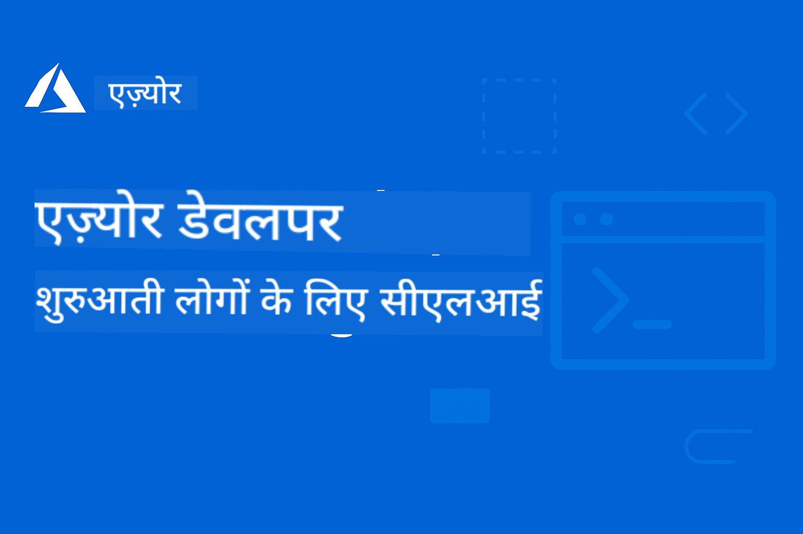

<!--
CO_OP_TRANSLATOR_METADATA:
{
  "original_hash": "7c5d2bb409800e22e74f34ee0ed12bed",
  "translation_date": "2025-12-17T12:51:24+00:00",
  "source_file": "README.md",
  "language_code": "hi"
}
-->
# AZD शुरुआती के लिए: एक संरचित सीखने की यात्रा

 

[](https://GitHub.com/microsoft/azd-for-beginners/watchers/)
[](https://GitHub.com/microsoft/azd-for-beginners/network/)
[](https://GitHub.com/microsoft/azd-for-beginners/stargazers/)

[](https://discord.gg/microsoft-azure)
[](https://discord.gg/nTYy5BXMWG)

## इस कोर्स के साथ शुरुआत करना

अपनी AZD सीखने की यात्रा शुरू करने के लिए इन चरणों का पालन करें:

1. **रिपॉजिटरी को फोर्क करें**: क्लिक करें [](https://GitHub.com/microsoft/azd-for-beginners/fork)
2. **रिपॉजिटरी क्लोन करें**: `git clone https://github.com/microsoft/azd-for-beginners.git`
3. **समुदाय में शामिल हों**: विशेषज्ञ सहायता के लिए [Azure Discord Communities](https://discord.com/invite/ByRwuEEgH4)
4. **अपना सीखने का मार्ग चुनें**: नीचे दिए गए अध्यायों में से अपने अनुभव स्तर के अनुसार चुनें

### बहुभाषी समर्थन

#### स्वचालित अनुवाद (हमेशा अद्यतन)

<!-- CO-OP TRANSLATOR LANGUAGES TABLE START -->
[Arabic](../ar/README.md) | [Bengali](../bn/README.md) | [Bulgarian](../bg/README.md) | [Burmese (Myanmar)](../my/README.md) | [Chinese (Simplified)](../zh/README.md) | [Chinese (Traditional, Hong Kong)](../hk/README.md) | [Chinese (Traditional, Macau)](../mo/README.md) | [Chinese (Traditional, Taiwan)](../tw/README.md) | [Croatian](../hr/README.md) | [Czech](../cs/README.md) | [Danish](../da/README.md) | [Dutch](../nl/README.md) | [Estonian](../et/README.md) | [Finnish](../fi/README.md) | [French](../fr/README.md) | [German](../de/README.md) | [Greek](../el/README.md) | [Hebrew](../he/README.md) | [Hindi](./README.md) | [Hungarian](../hu/README.md) | [Indonesian](../id/README.md) | [Italian](../it/README.md) | [Japanese](../ja/README.md) | [Kannada](../kn/README.md) | [Korean](../ko/README.md) | [Lithuanian](../lt/README.md) | [Malay](../ms/README.md) | [Malayalam](../ml/README.md) | [Marathi](../mr/README.md) | [Nepali](../ne/README.md) | [Nigerian Pidgin](../pcm/README.md) | [Norwegian](../no/README.md) | [Persian (Farsi)](../fa/README.md) | [Polish](../pl/README.md) | [Portuguese (Brazil)](../br/README.md) | [Portuguese (Portugal)](../pt/README.md) | [Punjabi (Gurmukhi)](../pa/README.md) | [Romanian](../ro/README.md) | [Russian](../ru/README.md) | [Serbian (Cyrillic)](../sr/README.md) | [Slovak](../sk/README.md) | [Slovenian](../sl/README.md) | [Spanish](../es/README.md) | [Swahili](../sw/README.md) | [Swedish](../sv/README.md) | [Tagalog (Filipino)](../tl/README.md) | [Tamil](../ta/README.md) | [Telugu](../te/README.md) | [Thai](../th/README.md) | [Turkish](../tr/README.md) | [Ukrainian](../uk/README.md) | [Urdu](../ur/README.md) | [Vietnamese](../vi/README.md)
<!-- CO-OP TRANSLATOR LANGUAGES TABLE END -->

## कोर्स अवलोकन

प्रगतिशील सीखने के लिए डिज़ाइन किए गए संरचित अध्यायों के माध्यम से Azure Developer CLI (azd) में महारत हासिल करें। **Microsoft Foundry एकीकरण के साथ AI एप्लिकेशन तैनाती पर विशेष ध्यान।**

### आधुनिक डेवलपर्स के लिए यह कोर्स क्यों आवश्यक है

Microsoft Foundry Discord समुदाय की अंतर्दृष्टि के आधार पर, **45% डेवलपर्स AI वर्कलोड के लिए AZD का उपयोग करना चाहते हैं** लेकिन निम्नलिखित चुनौतियों का सामना करते हैं:
- जटिल मल्टी-सर्विस AI आर्किटेक्चर
- प्रोडक्शन AI तैनाती के सर्वोत्तम अभ्यास  
- Azure AI सेवा एकीकरण और कॉन्फ़िगरेशन
- AI वर्कलोड के लिए लागत अनुकूलन
- AI-विशिष्ट तैनाती समस्याओं का निवारण

### सीखने के उद्देश्य

इस संरचित कोर्स को पूरा करके, आप:
- **AZD मूल बातें सीखेंगे**: मुख्य अवधारणाएं, स्थापना, और कॉन्फ़िगरेशन
- **AI एप्लिकेशन तैनात करेंगे**: Microsoft Foundry सेवाओं के साथ AZD का उपयोग
- **इन्फ्रास्ट्रक्चर ऐज़ कोड लागू करेंगे**: Bicep टेम्पलेट्स के साथ Azure संसाधनों का प्रबंधन
- **तैनाती समस्याओं का निवारण करेंगे**: सामान्य मुद्दों को हल करना और डिबग करना
- **प्रोडक्शन के लिए अनुकूलित करेंगे**: सुरक्षा, स्केलिंग, निगरानी, और लागत प्रबंधन
- **मल्टी-एजेंट समाधान बनाएंगे**: जटिल AI आर्किटेक्चर तैनात करना

## 📚 सीखने के अध्याय

*अपने अनुभव स्तर और लक्ष्यों के आधार पर अपना सीखने का मार्ग चुनें*

### 🚀 अध्याय 1: आधार और त्वरित शुरुआत
**पूर्वापेक्षाएँ**: Azure सदस्यता, बुनियादी कमांड लाइन ज्ञान  
**समय अवधि**: 30-45 मिनट  
**जटिलता**: ⭐

#### आप क्या सीखेंगे
- Azure Developer CLI की मूल बातें समझना
- अपने प्लेटफ़ॉर्म पर AZD स्थापित करना
- आपकी पहली सफल तैनाती

#### सीखने के संसाधन
- **🎯 यहाँ से शुरू करें**: [Azure Developer CLI क्या है?](../..)
- **📖 सिद्धांत**: [AZD मूल बातें](docs/getting-started/azd-basics.md) - मुख्य अवधारणाएं और शब्दावली
- **⚙️ सेटअप**: [स्थापना और सेटअप](docs/getting-started/installation.md) - प्लेटफ़ॉर्म-विशिष्ट गाइड
- **🛠️ व्यावहारिक**: [आपका पहला प्रोजेक्ट](docs/getting-started/first-project.md) - चरण-दर-चरण ट्यूटोरियल
- **📋 त्वरित संदर्भ**: [कमांड चीट शीट](resources/cheat-sheet.md)

#### व्यावहारिक अभ्यास
```bash
# त्वरित स्थापना जांच
azd version

# अपना पहला एप्लिकेशन तैनात करें
azd init --template todo-nodejs-mongo
azd up
```

**💡 अध्याय परिणाम**: AZD का उपयोग करके Azure पर एक सरल वेब एप्लिकेशन सफलतापूर्वक तैनात करें

**✅ सफलता सत्यापन:**
```bash
# अध्याय 1 पूरा करने के बाद, आप सक्षम होंगे:
azd version              # स्थापित संस्करण दिखाता है
azd init --template todo-nodejs-mongo  # परियोजना प्रारंभ करता है
azd up                  # Azure पर तैनात करता है
azd show                # चल रहे ऐप का URL दिखाता है
# एप्लिकेशन ब्राउज़र में खुलता है और काम करता है
azd down --force --purge  # संसाधनों को साफ करता है
```

**📊 समय निवेश:** 30-45 मिनट  
**📈 कौशल स्तर बाद में:** बुनियादी एप्लिकेशन स्वतंत्र रूप से तैनात कर सकते हैं

**✅ सफलता सत्यापन:**
```bash
# अध्याय 1 पूरा करने के बाद, आप सक्षम होंगे:
azd version              # स्थापित संस्करण दिखाता है
azd init --template todo-nodejs-mongo  # परियोजना प्रारंभ करता है
azd up                  # Azure पर तैनात करता है
azd show                # चल रहे ऐप का URL दिखाता है
# एप्लिकेशन ब्राउज़र में खुलता है और काम करता है
azd down --force --purge  # संसाधनों को साफ करता है
```

**📊 समय निवेश:** 30-45 मिनट  
**📈 कौशल स्तर बाद में:** बुनियादी एप्लिकेशन स्वतंत्र रूप से तैनात कर सकते हैं

---

### 🤖 अध्याय 2: AI-प्रथम विकास (AI डेवलपर्स के लिए अनुशंसित)
**पूर्वापेक्षाएँ**: अध्याय 1 पूरा किया हुआ  
**समय अवधि**: 1-2 घंटे  
**जटिलता**: ⭐⭐

#### आप क्या सीखेंगे
- AZD के साथ Microsoft Foundry एकीकरण
- AI-संचालित एप्लिकेशन तैनात करना
- AI सेवा कॉन्फ़िगरेशन समझना

#### सीखने के संसाधन
- **🎯 यहाँ से शुरू करें**: [Microsoft Foundry एकीकरण](docs/microsoft-foundry/microsoft-foundry-integration.md)
- **📖 पैटर्न**: [AI मॉडल तैनाती](docs/microsoft-foundry/ai-model-deployment.md) - AI मॉडल तैनात और प्रबंधित करें
- **🛠️ कार्यशाला**: [AI कार्यशाला लैब](docs/microsoft-foundry/ai-workshop-lab.md) - अपने AI समाधानों को AZD-तैयार बनाएं
- **🎥 इंटरैक्टिव गाइड**: [कार्यशाला सामग्री](workshop/README.md) - MkDocs * DevContainer वातावरण के साथ ब्राउज़र-आधारित सीखना
- **📋 टेम्पलेट्स**: [Microsoft Foundry टेम्पलेट्स](../..)
- **📝 उदाहरण**: [AZD तैनाती उदाहरण](examples/README.md)

#### व्यावहारिक अभ्यास
```bash
# अपना पहला एआई एप्लिकेशन तैनात करें
azd init --template azure-search-openai-demo
azd up

# अतिरिक्त एआई टेम्पलेट्स आज़माएं
azd init --template openai-chat-app-quickstart
azd init --template agent-openai-python-prompty
```

**💡 अध्याय परिणाम**: RAG क्षमताओं के साथ AI-संचालित चैट एप्लिकेशन तैनात और कॉन्फ़िगर करें

**✅ सफलता सत्यापन:**
```bash
# अध्याय 2 के बाद, आप सक्षम होंगे:
azd init --template azure-search-openai-demo
azd up
# एआई चैट इंटरफ़ेस का परीक्षण करें
# प्रश्न पूछें और स्रोतों के साथ एआई-संचालित उत्तर प्राप्त करें
# सत्यापित करें कि खोज एकीकरण काम करता है
azd monitor  # जांचें कि एप्लिकेशन इनसाइट्स टेलीमेट्री दिखाता है
azd down --force --purge
```

**📊 समय निवेश:** 1-2 घंटे  
**📈 कौशल स्तर बाद में:** प्रोडक्शन-तैयार AI एप्लिकेशन तैनात और कॉन्फ़िगर कर सकते हैं  
**💰 लागत जागरूकता:** $80-150/माह विकास लागत, $300-3500/माह प्रोडक्शन लागत समझें

#### 💰 AI तैनाती के लिए लागत विचार

**विकास पर्यावरण (अनुमानित $80-150/माह):**
- Azure OpenAI (पे-एज़-यू-गो): $0-50/माह (टोकन उपयोग के आधार पर)
- AI सर्च (बेसिक टियर): $75/माह
- कंटेनर ऐप्स (उपभोग): $0-20/माह
- स्टोरेज (स्टैंडर्ड): $1-5/माह

**प्रोडक्शन पर्यावरण (अनुमानित $300-3,500+/माह):**
- Azure OpenAI (सतत प्रदर्शन के लिए PTU): $3,000+/माह या उच्च मात्रा के साथ पे-एज़-यू-गो
- AI सर्च (स्टैंडर्ड टियर): $250/माह
- कंटेनर ऐप्स (समर्पित): $50-100/माह
- एप्लिकेशन इनसाइट्स: $5-50/माह
- स्टोरेज (प्रीमियम): $10-50/माह

**💡 लागत अनुकूलन सुझाव:**
- सीखने के लिए **फ्री टियर** Azure OpenAI का उपयोग करें (50,000 टोकन/माह शामिल)
- सक्रिय विकास न होने पर संसाधनों को मुक्त करने के लिए `azd down` चलाएं
- उपभोग-आधारित बिलिंग से शुरू करें, प्रोडक्शन के लिए केवल PTU पर अपग्रेड करें
- तैनाती से पहले लागत का अनुमान लगाने के लिए `azd provision --preview` का उपयोग करें
- ऑटो-स्केलिंग सक्षम करें: केवल वास्तविक उपयोग के लिए भुगतान करें

**लागत निगरानी:**
```bash
# अनुमानित मासिक लागत की जांच करें
azd provision --preview

# Azure पोर्टल में वास्तविक लागत की निगरानी करें
az consumption budget list --resource-group <your-rg>
```

---

### ⚙️ अध्याय 3: कॉन्फ़िगरेशन और प्रमाणीकरण
**पूर्वापेक्षाएँ**: अध्याय 1 पूरा किया हुआ  
**समय अवधि**: 45-60 मिनट  
**जटिलता**: ⭐⭐

#### आप क्या सीखेंगे
- पर्यावरण कॉन्फ़िगरेशन और प्रबंधन
- प्रमाणीकरण और सुरक्षा सर्वोत्तम अभ्यास
- संसाधन नामकरण और संगठन

#### सीखने के संसाधन
- **📖 कॉन्फ़िगरेशन**: [कॉन्फ़िगरेशन गाइड](docs/getting-started/configuration.md) - पर्यावरण सेटअप
- **🔐 सुरक्षा**: [प्रमाणीकरण पैटर्न और प्रबंधित पहचान](docs/getting-started/authsecurity.md) - प्रमाणीकरण पैटर्न
- **📝 उदाहरण**: [डेटाबेस ऐप उदाहरण](examples/database-app/README.md) - AZD डेटाबेस उदाहरण

#### व्यावहारिक अभ्यास
- कई पर्यावरण कॉन्फ़िगर करें (डेव, स्टेजिंग, प्रोड)
- प्रबंधित पहचान प्रमाणीकरण सेटअप करें
- पर्यावरण-विशिष्ट कॉन्फ़िगरेशन लागू करें

**💡 अध्याय परिणाम**: उचित प्रमाणीकरण और सुरक्षा के साथ कई पर्यावरणों का प्रबंधन करें

---

### 🏗️ अध्याय 4: इन्फ्रास्ट्रक्चर ऐज़ कोड और तैनाती
**पूर्वापेक्षाएँ**: अध्याय 1-3 पूरा किया हुआ  
**समय अवधि**: 1-1.5 घंटे  
**जटिलता**: ⭐⭐⭐

#### आप क्या सीखेंगे
- उन्नत तैनाती पैटर्न
- Bicep के साथ इन्फ्रास्ट्रक्चर ऐज़ कोड
- संसाधन प्रावधान रणनीतियाँ

#### सीखने के संसाधन
- **📖 तैनाती**: [तैनाती गाइड](docs/deployment/deployment-guide.md) - पूर्ण वर्कफ़्लो
- **🏗️ प्रावधान**: [संसाधन प्रावधान](docs/deployment/provisioning.md) - Azure संसाधन प्रबंधन
- **📝 उदाहरण**: [कंटेनर ऐप उदाहरण](../../examples/container-app) - कंटेनरयुक्त तैनाती

#### व्यावहारिक अभ्यास
- कस्टम Bicep टेम्पलेट बनाएं
- मल्टी-सर्विस एप्लिकेशन तैनात करें
- ब्लू-ग्रीन तैनाती रणनीतियाँ लागू करें

**💡 अध्याय परिणाम**: कस्टम इन्फ्रास्ट्रक्चर टेम्पलेट्स का उपयोग करके जटिल मल्टी-सर्विस एप्लिकेशन तैनात करें

---

### 🎯 अध्याय 5: मल्टी-एजेंट AI समाधान (उन्नत)
**पूर्वापेक्षाएँ**: अध्याय 1-2 पूरा किया हुआ  
**समय अवधि**: 2-3 घंटे  
**जटिलता**: ⭐⭐⭐⭐

#### आप क्या सीखेंगे
- मल्टी-एजेंट आर्किटेक्चर पैटर्न
- एजेंट ऑर्केस्ट्रेशन और समन्वय
- प्रोडक्शन-तैयार AI तैनाती

#### सीखने के संसाधन
- **🤖 विशेष प्रोजेक्ट**: [रिटेल मल्टी-एजेंट समाधान](examples/retail-scenario.md) - पूर्ण कार्यान्वयन
- **🛠️ ARM टेम्प्लेट्स**: [ARM टेम्प्लेट पैकेज](../../examples/retail-multiagent-arm-template) - एक-क्लिक तैनाती
- **📖 आर्किटेक्चर**: [मल्टी-एजेंट समन्वय पैटर्न](/docs/pre-deployment/coordination-patterns.md) - पैटर्न

#### व्यावहारिक अभ्यास
```bash
# पूर्ण रिटेल मल्टी-एजेंट समाधान तैनात करें
cd examples/retail-multiagent-arm-template
./deploy.sh

# एजेंट कॉन्फ़िगरेशन का अन्वेषण करें
az deployment group show --resource-group <rg-name> --name <deployment-name>
```

**💡 अध्याय परिणाम**: ग्राहक और इन्वेंटरी एजेंट के साथ उत्पादन-तैयार मल्टी-एजेंट AI समाधान तैनात और प्रबंधित करें

---

### 🔍 अध्याय 6: पूर्व-तैनाती सत्यापन और योजना
**पूर्वापेक्षाएँ**: अध्याय 4 पूरा हुआ  
**अवधि**: 1 घंटा  
**जटिलता**: ⭐⭐

#### आप क्या सीखेंगे
- क्षमता योजना और संसाधन सत्यापन
- SKU चयन रणनीतियाँ
- पूर्व-उड़ान जांच और स्वचालन

#### सीखने के संसाधन
- **📊 योजना**: [क्षमता योजना](docs/pre-deployment/capacity-planning.md) - संसाधन सत्यापन
- **💰 चयन**: [SKU चयन](docs/pre-deployment/sku-selection.md) - लागत-कुशल विकल्प
- **✅ सत्यापन**: [पूर्व-उड़ान जांच](docs/pre-deployment/preflight-checks.md) - स्वचालित स्क्रिप्ट्स

#### व्यावहारिक अभ्यास
- क्षमता सत्यापन स्क्रिप्ट्स चलाएँ
- लागत के लिए SKU चयन का अनुकूलन करें
- स्वचालित पूर्व-तैनाती जांच लागू करें

**💡 अध्याय परिणाम**: निष्पादन से पहले तैनाती को सत्यापित और अनुकूलित करें

---

### 🚨 अध्याय 7: समस्या निवारण और डिबगिंग
**पूर्वापेक्षाएँ**: कोई भी तैनाती अध्याय पूरा हुआ  
**अवधि**: 1-1.5 घंटे  
**जटिलता**: ⭐⭐

#### आप क्या सीखेंगे
- व्यवस्थित डिबगिंग दृष्टिकोण
- सामान्य समस्याएँ और समाधान
- AI-विशिष्ट समस्या निवारण

#### सीखने के संसाधन
- **🔧 सामान्य समस्याएँ**: [सामान्य समस्याएँ](docs/troubleshooting/common-issues.md) - FAQ और समाधान
- **🕵️ डिबगिंग**: [डिबगिंग गाइड](docs/troubleshooting/debugging.md) - चरण-दर-चरण रणनीतियाँ
- **🤖 AI समस्याएँ**: [AI-विशिष्ट समस्या निवारण](docs/troubleshooting/ai-troubleshooting.md) - AI सेवा समस्याएँ

#### व्यावहारिक अभ्यास
- तैनाती विफलताओं का निदान करें
- प्रमाणीकरण समस्याओं को हल करें
- AI सेवा कनेक्टिविटी डिबग करें

**💡 अध्याय परिणाम**: स्वतंत्र रूप से सामान्य तैनाती समस्याओं का निदान और समाधान करें

---

### 🏢 अध्याय 8: उत्पादन और एंटरप्राइज़ पैटर्न
**पूर्वापेक्षाएँ**: अध्याय 1-4 पूरा हुआ  
**अवधि**: 2-3 घंटे  
**जटिलता**: ⭐⭐⭐⭐

#### आप क्या सीखेंगे
- उत्पादन तैनाती रणनीतियाँ
- एंटरप्राइज़ सुरक्षा पैटर्न
- निगरानी और लागत अनुकूलन

#### सीखने के संसाधन
- **🏭 उत्पादन**: [उत्पादन AI सर्वोत्तम प्रथाएँ](docs/microsoft-foundry/production-ai-practices.md) - एंटरप्राइज़ पैटर्न
- **📝 उदाहरण**: [माइक्रोसर्विसेज़ उदाहरण](../../examples/microservices) - जटिल आर्किटेक्चर
- **📊 निगरानी**: [एप्लिकेशन इनसाइट्स एकीकरण](docs/pre-deployment/application-insights.md) - निगरानी

#### व्यावहारिक अभ्यास
- एंटरप्राइज़ सुरक्षा पैटर्न लागू करें
- व्यापक निगरानी सेटअप करें
- उचित शासन के साथ उत्पादन में तैनात करें

**💡 अध्याय परिणाम**: पूर्ण उत्पादन क्षमताओं के साथ एंटरप्राइज़-तैयार एप्लिकेशन तैनात करें

---

## 🎓 कार्यशाला अवलोकन: व्यावहारिक सीखने का अनुभव

> **⚠️ कार्यशाला स्थिति: सक्रिय विकास**  
> कार्यशाला सामग्री वर्तमान में विकसित और परिष्कृत की जा रही है। मुख्य मॉड्यूल कार्यशील हैं, लेकिन कुछ उन्नत अनुभाग अधूरे हैं। हम सभी सामग्री को पूरा करने के लिए सक्रिय रूप से काम कर रहे हैं। [प्रगति ट्रैक करें →](workshop/README.md)

### इंटरैक्टिव कार्यशाला सामग्री
**ब्राउज़र-आधारित उपकरणों और निर्देशित अभ्यासों के साथ व्यापक व्यावहारिक सीखना**

हमारी कार्यशाला सामग्री एक संरचित, इंटरैक्टिव सीखने का अनुभव प्रदान करती है जो ऊपर दिए गए अध्याय-आधारित पाठ्यक्रम को पूरक बनाती है। कार्यशाला स्व-गति सीखने और प्रशिक्षक-नेतृत्व वाले सत्रों दोनों के लिए डिज़ाइन की गई है।

#### 🛠️ कार्यशाला विशेषताएँ
- **ब्राउज़र-आधारित इंटरफ़ेस**: खोज, कॉपी, और थीम सुविधाओं के साथ पूर्ण MkDocs-संचालित कार्यशाला
- **GitHub Codespaces एकीकरण**: एक-क्लिक विकास पर्यावरण सेटअप
- **संरचित सीखने का मार्ग**: 7-चरण निर्देशित अभ्यास (कुल 3.5 घंटे)
- **खोज → तैनाती → अनुकूलन**: प्रगतिशील कार्यप्रणाली
- **इंटरैक्टिव DevContainer पर्यावरण**: पूर्व-कॉन्फ़िगर किए गए उपकरण और निर्भरताएँ

#### 📚 कार्यशाला संरचना
कार्यशाला एक **खोज → तैनाती → अनुकूलन** कार्यप्रणाली का पालन करती है:

1. **खोज चरण** (45 मिनट)
   - Microsoft Foundry टेम्प्लेट्स और सेवाओं का अन्वेषण करें
   - मल्टी-एजेंट आर्किटेक्चर पैटर्न समझें
   - तैनाती आवश्यकताओं और पूर्वापेक्षाओं की समीक्षा करें

2. **तैनाती चरण** (2 घंटे)
   - AZD के साथ AI एप्लिकेशन की व्यावहारिक तैनाती
   - Azure AI सेवाओं और एंडपॉइंट्स को कॉन्फ़िगर करें
   - सुरक्षा और प्रमाणीकरण पैटर्न लागू करें

3. **अनुकूलन चरण** (45 मिनट)
   - विशिष्ट उपयोग मामलों के लिए एप्लिकेशन संशोधित करें
   - उत्पादन तैनाती के लिए अनुकूलित करें
   - निगरानी और लागत प्रबंधन लागू करें

#### 🚀 कार्यशाला शुरू करना
```bash
# विकल्प 1: GitHub Codespaces (सिफारिश की गई)
# रिपॉजिटरी में "Code" → "Create codespace on main" पर क्लिक करें

# विकल्प 2: स्थानीय विकास
git clone https://github.com/microsoft/azd-for-beginners.git
cd azd-for-beginners/workshop
# workshop/README.md में सेटअप निर्देशों का पालन करें
```

#### 🎯 कार्यशाला सीखने के परिणाम
कार्यशाला पूरी करने पर, प्रतिभागी:
- **उत्पादन AI एप्लिकेशन तैनात करें**: Microsoft Foundry सेवाओं के साथ AZD का उपयोग करें
- **मल्टी-एजेंट आर्किटेक्चर में महारत हासिल करें**: समन्वित AI एजेंट समाधान लागू करें
- **सुरक्षा सर्वोत्तम प्रथाएँ लागू करें**: प्रमाणीकरण और पहुँच नियंत्रण कॉन्फ़िगर करें
- **स्केल के लिए अनुकूलित करें**: लागत-कुशल, प्रदर्शनकारी तैनाती डिज़ाइन करें
- **तैनाती समस्या निवारण करें**: सामान्य समस्याओं को स्वतंत्र रूप से हल करें

#### 📖 कार्यशाला संसाधन
- **🎥 इंटरैक्टिव गाइड**: [कार्यशाला सामग्री](workshop/README.md) - ब्राउज़र-आधारित सीखने का वातावरण
- **📋 चरण-दर-चरण निर्देश**: [निर्देशित अभ्यास](../../workshop/docs/instructions) - विस्तृत मार्गदर्शन
- **🛠️ AI कार्यशाला लैब**: [AI कार्यशाला लैब](docs/microsoft-foundry/ai-workshop-lab.md) - AI-केंद्रित अभ्यास
- **💡 त्वरित प्रारंभ**: [कार्यशाला सेटअप गाइड](workshop/README.md#quick-start) - पर्यावरण कॉन्फ़िगरेशन

**उपयुक्त है**: कॉर्पोरेट प्रशिक्षण, विश्वविद्यालय पाठ्यक्रम, स्व-गति सीखना, और डेवलपर बूटकैम्प।

---

## 📖 Azure Developer CLI क्या है?

Azure Developer CLI (azd) एक डेवलपर-केंद्रित कमांड-लाइन इंटरफ़ेस है जो Azure पर एप्लिकेशन बनाने और तैनात करने की प्रक्रिया को तेज करता है। यह प्रदान करता है:

- **टेम्प्लेट-आधारित तैनाती** - सामान्य एप्लिकेशन पैटर्न के लिए पूर्व-निर्मित टेम्प्लेट्स का उपयोग करें
- **इन्फ्रास्ट्रक्चर ऐज़ कोड** - Bicep या Terraform का उपयोग करके Azure संसाधनों का प्रबंधन करें  
- **एकीकृत वर्कफ़्लोज़** - एप्लिकेशन को सहजता से प्रोविजन, तैनात और मॉनिटर करें
- **डेवलपर-अनुकूल** - डेवलपर उत्पादकता और अनुभव के लिए अनुकूलित

### **AZD + Microsoft Foundry: AI तैनाती के लिए परफेक्ट**

**AI समाधानों के लिए AZD क्यों?** AZD AI डेवलपर्स के शीर्ष चुनौतियों को संबोधित करता है:

- **AI-तैयार टेम्प्लेट्स** - Azure OpenAI, Cognitive Services, और ML वर्कलोड के लिए पूर्व-कॉन्फ़िगर टेम्प्लेट्स
- **सुरक्षित AI तैनाती** - AI सेवाओं, API कुंजी, और मॉडल एंडपॉइंट्स के लिए अंतर्निहित सुरक्षा पैटर्न  
- **उत्पादन AI पैटर्न** - स्केलेबल, लागत-कुशल AI एप्लिकेशन तैनाती के लिए सर्वोत्तम प्रथाएँ
- **एंड-टू-एंड AI वर्कफ़्लोज़** - मॉडल विकास से लेकर उत्पादन तैनाती तक उचित निगरानी के साथ
- **लागत अनुकूलन** - AI वर्कलोड के लिए स्मार्ट संसाधन आवंटन और स्केलिंग रणनीतियाँ
- **Microsoft Foundry एकीकरण** - Microsoft Foundry मॉडल कैटलॉग और एंडपॉइंट्स से सहज कनेक्शन

---

## 🎯 टेम्प्लेट्स और उदाहरण पुस्तकालय

### विशेष: Microsoft Foundry टेम्प्लेट्स
**यदि आप AI एप्लिकेशन तैनात कर रहे हैं तो यहाँ से शुरू करें!**

> **नोट:** ये टेम्प्लेट विभिन्न AI पैटर्न दिखाते हैं। कुछ बाहरी Azure सैंपल हैं, कुछ स्थानीय कार्यान्वयन।

| टेम्प्लेट | अध्याय | जटिलता | सेवाएँ | प्रकार |
|----------|---------|------------|----------|------|
| [**AI चैट के साथ शुरू करें**](https://github.com/Azure-Samples/get-started-with-ai-chat) | अध्याय 2 | ⭐⭐ | AzureOpenAI + Azure AI मॉडल इन्फरेंस API + Azure AI सर्च + Azure कंटेनर ऐप्स + एप्लिकेशन इनसाइट्स | बाहरी |
| [**AI एजेंट्स के साथ शुरू करें**](https://github.com/Azure-Samples/get-started-with-ai-agents) | अध्याय 2 | ⭐⭐ | Azure AI एजेंट सेवा + AzureOpenAI + Azure AI सर्च + Azure कंटेनर ऐप्स + एप्लिकेशन इनसाइट्स| बाहरी |
| [**Azure सर्च + OpenAI डेमो**](https://github.com/Azure-Samples/azure-search-openai-demo) | अध्याय 2 | ⭐⭐ | AzureOpenAI + Azure AI सर्च + ऐप सेवा + स्टोरेज | बाहरी |
| [**OpenAI चैट ऐप क्विकस्टार्ट**](https://github.com/Azure-Samples/openai-chat-app-quickstart) | अध्याय 2 | ⭐ | AzureOpenAI + कंटेनर ऐप्स + एप्लिकेशन इनसाइट्स | बाहरी |
| [**एजेंट OpenAI पायथन Prompty**](https://github.com/Azure-Samples/agent-openai-python-prompty) | अध्याय 5 | ⭐⭐⭐ | AzureOpenAI + Azure फ़ंक्शंस + Prompty | बाहरी |
| [**Contoso चैट RAG**](https://github.com/Azure-Samples/contoso-chat) | अध्याय 8 | ⭐⭐⭐⭐ | AzureOpenAI + AI सर्च + Cosmos DB + कंटेनर ऐप्स | बाहरी |
| [**रिटेल मल्टी-एजेंट समाधान**](examples/retail-scenario.md) | अध्याय 5 | ⭐⭐⭐⭐ | AzureOpenAI + AI सर्च + स्टोरेज + कंटेनर ऐप्स + Cosmos DB | **स्थानीय** |

### विशेष: पूर्ण सीखने के परिदृश्य
**उत्पादन-तैयार एप्लिकेशन टेम्प्लेट्स जो सीखने के अध्यायों से जुड़े हैं**

| टेम्प्लेट | सीखने का अध्याय | जटिलता | मुख्य सीख |
|----------|------------------|------------|--------------|
| [**openai-chat-app-quickstart**](https://github.com/Azure-Samples/openai-chat-app-quickstart) | अध्याय 2 | ⭐ | बुनियादी AI तैनाती पैटर्न |
| [**azure-search-openai-demo**](https://github.com/Azure-Samples/azure-search-openai-demo) | अध्याय 2 | ⭐⭐ | Azure AI सर्च के साथ RAG कार्यान्वयन |
| [**ai-document-processing**](https://github.com/Azure-Samples/ai-document-processing) | अध्याय 4 | ⭐⭐ | दस्तावेज़ बुद्धिमत्ता एकीकरण |
| [**agent-openai-python-prompty**](https://github.com/Azure-Samples/agent-openai-python-prompty) | अध्याय 5 | ⭐⭐⭐ | एजेंट फ्रेमवर्क और फ़ंक्शन कॉलिंग |
| [**contoso-chat**](https://github.com/Azure-Samples/contoso-chat) | अध्याय 8 | ⭐⭐⭐ | एंटरप्राइज़ AI ऑर्केस्ट्रेशन |
| [**retail-multi-agent-solution**](examples/retail-scenario.md) | अध्याय 5 | ⭐⭐⭐⭐ | ग्राहक और इन्वेंटरी एजेंट के साथ मल्टी-एजेंट आर्किटेक्चर |

### उदाहरण प्रकार के अनुसार सीखना

> **📌 स्थानीय बनाम बाहरी उदाहरण:**  
> **स्थानीय उदाहरण** (इस रिपॉजिटरी में) = तुरंत उपयोग के लिए तैयार  
> **बाहरी उदाहरण** (Azure सैंपल) = लिंक्ड रिपॉजिटरी से क्लोन करें

#### स्थानीय उदाहरण (तुरंत उपयोग के लिए तैयार)
- [**रिटेल मल्टी-एजेंट समाधान**](examples/retail-scenario.md) - ARM टेम्प्लेट्स के साथ पूर्ण उत्पादन-तैयार कार्यान्वयन
  - मल्टी-एजेंट आर्किटेक्चर (ग्राहक + इन्वेंटरी एजेंट)
  - व्यापक निगरानी और मूल्यांकन
  - ARM टेम्प्लेट के माध्यम से एक-क्लिक तैनाती

#### स्थानीय उदाहरण - कंटेनर एप्लिकेशन (अध्याय 2-5)
**इस रिपॉजिटरी में व्यापक कंटेनर तैनाती उदाहरण:**
- [**कंटेनर ऐप उदाहरण**](examples/container-app/README.md) - कंटेनरयुक्त तैनाती के लिए पूर्ण मार्गदर्शिका
  - [सरल Flask API](../../examples/container-app/simple-flask-api) - स्केल-टू-जीरो के साथ बुनियादी REST API
  - [माइक्रोसर्विस आर्किटेक्चर](../../examples/container-app/microservices) - उत्पादन-तैयार मल्टी-सर्विस तैनाती
  - क्विक स्टार्ट, उत्पादन, और उन्नत तैनाती पैटर्न
  - निगरानी, सुरक्षा, और लागत अनुकूलन मार्गदर्शन

#### बाहरी उदाहरण - सरल एप्लिकेशन (अध्याय 1-2)
**शुरू करने के लिए इन Azure सैंपल रिपॉजिटरीज़ को क्लोन करें:**
- [सरल वेब ऐप - Node.js + MongoDB](https://github.com/Azure-Samples/todo-nodejs-mongo) - बुनियादी तैनाती पैटर्न
- [स्थैतिक वेबसाइट - React SPA](https://github.com/Azure-Samples/todo-csharp-sql-swa-func) - स्थैतिक सामग्री तैनाती
- [कंटेनर ऐप - Python Flask](https://github.com/Azure-Samples/container-apps-store-api-microservice) - REST API तैनाती

#### बाहरी उदाहरण - डेटाबेस एकीकरण (अध्याय 3-4)  
- [डेटाबेस ऐप - C# + SQL](https://github.com/Azure-Samples/todo-csharp-sql) - डेटाबेस कनेक्टिविटी पैटर्न
- [फ़ंक्शंस + Cosmos DB](https://github.com/Azure-Samples/todo-python-mongo-swa-func) - सर्वरलेस डेटा वर्कफ़्लो

#### बाहरी उदाहरण - उन्नत पैटर्न (अध्याय 4-8)
- [Java माइक्रोसर्विसेज़](https://github.com/Azure-Samples/java-microservices-aca-lab) - मल्टी-सर्विस आर्किटेक्चर
- [कंटेनर ऐप्स जॉब्स](https://github.com/Azure-Samples/container-apps-jobs) - बैकग्राउंड प्रोसेसिंग  
- [एंटरप्राइज़ ML पाइपलाइन](https://github.com/Azure-Samples/mlops-v2) - उत्पादन-तैयार ML पैटर्न

### बाहरी टेम्प्लेट संग्रह
- [**आधिकारिक AZD टेम्प्लेट गैलरी**](https://azure.github.io/awesome-azd/) - आधिकारिक और समुदाय टेम्प्लेट का क्यूरेटेड संग्रह
- [**Azure Developer CLI टेम्प्लेट्स**](https://learn.microsoft.com/en-us/azure/developer/azure-developer-cli/azd-templates) - Microsoft Learn टेम्प्लेट दस्तावेज़ीकरण
- [**उदाहरण निर्देशिका**](examples/README.md) - स्थानीय सीखने के उदाहरण विस्तृत व्याख्याओं के साथ

---

## 📚 सीखने के संसाधन और संदर्भ

### त्वरित संदर्भ
- [**कमांड चीट शीट**](resources/cheat-sheet.md) - अध्याय के अनुसार व्यवस्थित आवश्यक azd कमांड
- [**शब्दावली**](resources/glossary.md) - Azure और azd शब्दावली  
- [**अक्सर पूछे जाने वाले प्रश्न**](resources/faq.md) - सीखने के अध्याय के अनुसार सामान्य प्रश्न
- [**अध्ययन गाइड**](resources/study-guide.md) - व्यापक अभ्यास अभ्यास

### हैंड्स-ऑन कार्यशालाएँ
- [**AI कार्यशाला लैब**](docs/microsoft-foundry/ai-workshop-lab.md) - अपने AI समाधानों को AZD-डिप्लॉय करने योग्य बनाएं (2-3 घंटे)
- [**इंटरैक्टिव कार्यशाला गाइड**](workshop/README.md) - MkDocs और DevContainer पर्यावरण के साथ ब्राउज़र-आधारित कार्यशाला
- [**संरचित सीखने का मार्ग**](../../workshop/docs/instructions) - 7-चरण निर्देशित अभ्यास (डिस्कवरी → डिप्लॉयमेंट → कस्टमाइज़ेशन)
- [**शुरुआती के लिए AZD कार्यशाला**](workshop/README.md) - GitHub Codespaces एकीकरण के साथ पूर्ण हैंड्स-ऑन कार्यशाला सामग्री

### बाहरी सीखने के संसाधन
- [Azure Developer CLI दस्तावेज़ीकरण](https://learn.microsoft.com/en-us/azure/developer/azure-developer-cli/)
- [Azure आर्किटेक्चर केंद्र](https://learn.microsoft.com/en-us/azure/architecture/)
- [Azure मूल्य निर्धारण कैलकुलेटर](https://azure.microsoft.com/pricing/calculator/)
- [Azure स्थिति](https://status.azure.com/)

---

## 🔧 त्वरित समस्या निवारण गाइड

**शुरुआती जो सामान्य समस्याओं का सामना करते हैं और त्वरित समाधान:**

### ❌ "azd: कमांड नहीं मिला"

```bash
# पहले AZD इंस्टॉल करें
# विंडोज़ (पावरशेल):
winget install microsoft.azd

# मैकओएस:
brew tap azure/azd && brew install azd

# लिनक्स:
curl -fsSL https://aka.ms/install-azd.sh | bash

# स्थापना सत्यापित करें
azd version
```

### ❌ "कोई सदस्यता नहीं मिली" या "सदस्यता सेट नहीं है"

```bash
# उपलब्ध सदस्यताएँ सूचीबद्ध करें
az account list --output table

# डिफ़ॉल्ट सदस्यता सेट करें
az account set --subscription "<subscription-id-or-name>"

# AZD पर्यावरण के लिए सेट करें
azd env set AZURE_SUBSCRIPTION_ID "<subscription-id>"

# सत्यापित करें
az account show
```

### ❌ "अपर्याप्त कोटा" या "कोटा पार हो गया"

```bash
# विभिन्न Azure क्षेत्र आज़माएं
azd env set AZURE_LOCATION "westus2"
azd up

# या विकास में छोटे SKUs का उपयोग करें
# infra/main.parameters.json संपादित करें:
{
  "sku": "B1"  // Instead of "P1V2"
}
```

### ❌ "azd up" आधे रास्ते में विफल

```bash
# विकल्प 1: साफ़ करें और पुनः प्रयास करें
azd down --force --purge
azd up

# विकल्प 2: केवल इन्फ्रास्ट्रक्चर ठीक करें
azd provision

# विकल्प 3: विस्तृत लॉग जांचें
azd show
azd logs
```

### ❌ "प्रमाणीकरण विफल" या "टोकन समाप्त हो गया"

```bash
# पुनः प्रमाणीकरण करें
az logout
az login

azd auth logout
azd auth login

# प्रमाणीकरण सत्यापित करें
az account show
```

### ❌ "संसाधन पहले से मौजूद है" या नामकरण संघर्ष

```bash
# AZD अद्वितीय नाम उत्पन्न करता है, लेकिन यदि संघर्ष होता है:
azd down --force --purge

# फिर नए वातावरण के साथ पुनः प्रयास करें
azd env new dev-v2
azd up
```

### ❌ टेम्पलेट डिप्लॉयमेंट में बहुत समय लग रहा है

**सामान्य प्रतीक्षा समय:**
- सरल वेब ऐप: 5-10 मिनट
- डेटाबेस के साथ ऐप: 10-15 मिनट
- AI अनुप्रयोग: 15-25 मिनट (OpenAI प्रावधान धीमा है)

```bash
# प्रगति जांचें
azd show

# यदि 30 मिनट से अधिक समय तक अटके हैं, तो Azure पोर्टल जांचें:
azd monitor
# असफल डिप्लॉयमेंट देखें
```

### ❌ "अनुमति अस्वीकृत" या "प्रतिबंधित"

```bash
# अपने Azure भूमिका की जाँच करें
az role assignment list --assignee $(az account show --query user.name -o tsv)

# आपको कम से कम "Contributor" भूमिका की आवश्यकता है
# अपने Azure व्यवस्थापक से अनुमति मांगें:
# - Contributor (संसाधनों के लिए)
# - User Access Administrator (भूमिका असाइनमेंट के लिए)
```

### ❌ डिप्लॉय की गई एप्लिकेशन URL नहीं मिल रही

```bash
# सभी सेवा एंडपॉइंट दिखाएं
azd show

# या Azure पोर्टल खोलें
azd monitor

# विशिष्ट सेवा जांचें
azd env get-values
# *_URL वेरिएबल्स देखें
```

### 📚 पूर्ण समस्या निवारण संसाधन

- **सामान्य समस्याएँ गाइड:** [विस्तृत समाधान](docs/troubleshooting/common-issues.md)
- **AI-विशिष्ट समस्याएँ:** [AI समस्या निवारण](docs/troubleshooting/ai-troubleshooting.md)
- **डिबगिंग गाइड:** [चरण-दर-चरण डिबगिंग](docs/troubleshooting/debugging.md)
- **मदद प्राप्त करें:** [Azure Discord](https://discord.gg/microsoft-azure) #azure-developer-cli

---

## 🔧 त्वरित समस्या निवारण गाइड

**शुरुआती जो सामान्य समस्याओं का सामना करते हैं और त्वरित समाधान:**

<details>
<summary><strong>❌ "azd: कमांड नहीं मिला"</strong></summary>

```bash
# पहले AZD इंस्टॉल करें
# विंडोज़ (पावरशेल):
winget install microsoft.azd

# मैकओएस:
brew tap azure/azd && brew install azd

# लिनक्स:
curl -fsSL https://aka.ms/install-azd.sh | bash

# स्थापना सत्यापित करें
azd version
```
</details>

<details>
<summary><strong>❌ "कोई सदस्यता नहीं मिली" या "सदस्यता सेट नहीं है"</strong></summary>

```bash
# उपलब्ध सदस्यताएँ सूचीबद्ध करें
az account list --output table

# डिफ़ॉल्ट सदस्यता सेट करें
az account set --subscription "<subscription-id-or-name>"

# AZD पर्यावरण के लिए सेट करें
azd env set AZURE_SUBSCRIPTION_ID "<subscription-id>"

# सत्यापित करें
az account show
```
</details>

<details>
<summary><strong>❌ "अपर्याप्त कोटा" या "कोटा पार हो गया"</strong></summary>

```bash
# विभिन्न Azure क्षेत्र आज़माएं
azd env set AZURE_LOCATION "westus2"
azd up

# या विकास में छोटे SKUs का उपयोग करें
# infra/main.parameters.json संपादित करें:
{
  "sku": "B1"  // Instead of "P1V2"
}
```
</details>

<details>
<summary><strong>❌ "azd up" आधे रास्ते में विफल</strong></summary>

```bash
# विकल्प 1: साफ़ करें और पुनः प्रयास करें
azd down --force --purge
azd up

# विकल्प 2: केवल इन्फ्रास्ट्रक्चर ठीक करें
azd provision

# विकल्प 3: विस्तृत लॉग जांचें
azd show
azd logs
```
</details>

<details>
<summary><strong>❌ "प्रमाणीकरण विफल" या "टोकन समाप्त हो गया"</strong></summary>

```bash
# पुनः प्रमाणीकरण करें
az logout
az login

azd auth logout
azd auth login

# प्रमाणीकरण सत्यापित करें
az account show
```
</details>

<details>
<summary><strong>❌ "संसाधन पहले से मौजूद है" या नामकरण संघर्ष</strong></summary>

```bash
# AZD अद्वितीय नाम उत्पन्न करता है, लेकिन यदि संघर्ष होता है:
azd down --force --purge

# फिर नए वातावरण के साथ पुनः प्रयास करें
azd env new dev-v2
azd up
```
</details>

<details>
<summary><strong>❌ टेम्पलेट डिप्लॉयमेंट में बहुत समय लग रहा है</strong></summary>

**सामान्य प्रतीक्षा समय:**
- सरल वेब ऐप: 5-10 मिनट
- डेटाबेस के साथ ऐप: 10-15 मिनट
- AI अनुप्रयोग: 15-25 मिनट (OpenAI प्रावधान धीमा है)

```bash
# प्रगति जांचें
azd show

# यदि 30 मिनट से अधिक समय तक अटके हैं, तो Azure पोर्टल जांचें:
azd monitor
# असफल डिप्लॉयमेंट देखें
```
</details>

<details>
<summary><strong>❌ "अनुमति अस्वीकृत" या "प्रतिबंधित"</strong></summary>

```bash
# अपने Azure भूमिका की जाँच करें
az role assignment list --assignee $(az account show --query user.name -o tsv)

# आपको कम से कम "Contributor" भूमिका की आवश्यकता है
# अपने Azure व्यवस्थापक से अनुमति मांगें:
# - Contributor (संसाधनों के लिए)
# - User Access Administrator (भूमिका असाइनमेंट के लिए)
```
</details>

<details>
<summary><strong>❌ डिप्लॉय की गई एप्लिकेशन URL नहीं मिल रही</strong></summary>

```bash
# सभी सेवा एंडपॉइंट दिखाएं
azd show

# या Azure पोर्टल खोलें
azd monitor

# विशिष्ट सेवा जांचें
azd env get-values
# *_URL वेरिएबल्स देखें
```
</details>

### 📚 पूर्ण समस्या निवारण संसाधन

- **सामान्य समस्याएँ गाइड:** [विस्तृत समाधान](docs/troubleshooting/common-issues.md)
- **AI-विशिष्ट समस्याएँ:** [AI समस्या निवारण](docs/troubleshooting/ai-troubleshooting.md)
- **डिबगिंग गाइड:** [चरण-दर-चरण डिबगिंग](docs/troubleshooting/debugging.md)
- **मदद प्राप्त करें:** [Azure Discord](https://discord.gg/microsoft-azure) #azure-developer-cli

---

## 🎓 कोर्स पूर्णता और प्रमाणन

### प्रगति ट्रैकिंग
प्रत्येक अध्याय के माध्यम से अपनी सीखने की प्रगति ट्रैक करें:

- [ ] **अध्याय 1**: आधार और त्वरित शुरुआत ✅
- [ ] **अध्याय 2**: AI-प्रथम विकास ✅  
- [ ] **अध्याय 3**: कॉन्फ़िगरेशन और प्रमाणीकरण ✅
- [ ] **अध्याय 4**: इन्फ्रास्ट्रक्चर एज कोड और डिप्लॉयमेंट ✅
- [ ] **अध्याय 5**: मल्टी-एजेंट AI समाधान ✅
- [ ] **अध्याय 6**: पूर्व-डिप्लॉयमेंट सत्यापन और योजना ✅
- [ ] **अध्याय 7**: समस्या निवारण और डिबगिंग ✅
- [ ] **अध्याय 8**: उत्पादन और एंटरप्राइज़ पैटर्न ✅

### सीखने का सत्यापन
प्रत्येक अध्याय पूरा करने के बाद, अपने ज्ञान को सत्यापित करें:
1. **व्यावहारिक अभ्यास**: अध्याय के हैंड्स-ऑन डिप्लॉयमेंट को पूरा करें
2. **ज्ञान जांच**: अपने अध्याय के FAQ अनुभाग की समीक्षा करें
3. **समुदाय चर्चा**: Azure Discord में अपना अनुभव साझा करें
4. **अगला अध्याय**: अगली जटिलता स्तर पर जाएं

### कोर्स पूर्णता के लाभ
सभी अध्याय पूरा करने पर, आपके पास होगा:
- **उत्पादन अनुभव**: Azure पर वास्तविक AI अनुप्रयोग डिप्लॉय किए
- **पेशेवर कौशल**: एंटरप्राइज़-तैयार डिप्लॉयमेंट क्षमताएं  
- **समुदाय मान्यता**: Azure डेवलपर समुदाय के सक्रिय सदस्य
- **करियर उन्नति**: मांग में AZD और AI डिप्लॉयमेंट विशेषज्ञता

---

## 🤝 समुदाय और समर्थन

### सहायता और समर्थन प्राप्त करें
- **तकनीकी समस्याएँ**: [बग रिपोर्ट करें और फीचर अनुरोध करें](https://github.com/microsoft/azd-for-beginners/issues)
- **सीखने के प्रश्न**: [Microsoft Azure Discord समुदाय](https://discord.gg/microsoft-azure) और [](https://discord.gg/nTYy5BXMWG)
- **AI-विशिष्ट सहायता**: शामिल हों [](https://discord.gg/nTYy5BXMWG)
- **दस्तावेज़ीकरण**: [आधिकारिक Azure Developer CLI दस्तावेज़](https://learn.microsoft.com/en-us/azure/developer/azure-developer-cli/)

### Microsoft Foundry Discord से समुदाय अंतर्दृष्टि

**#Azure चैनल से हालिया मतदान परिणाम:**
- **45%** डेवलपर्स AI वर्कलोड के लिए AZD का उपयोग करना चाहते हैं
- **शीर्ष चुनौतियाँ**: मल्टी-सर्विस डिप्लॉयमेंट, क्रेडेंशियल प्रबंधन, उत्पादन तैयारी  
- **सबसे अधिक अनुरोधित**: AI-विशिष्ट टेम्पलेट, समस्या निवारण गाइड, सर्वोत्तम प्रथाएँ

**हमारे समुदाय में शामिल हों ताकि आप:**
- अपने AZD + AI अनुभव साझा करें और सहायता प्राप्त करें
- नए AI टेम्पलेट के प्रारंभिक पूर्वावलोकन तक पहुंचें
- AI डिप्लॉयमेंट सर्वोत्तम प्रथाओं में योगदान दें
- भविष्य के AI + AZD फीचर विकास को प्रभावित करें

### कोर्स में योगदान
हम योगदान का स्वागत करते हैं! कृपया हमारे [योगदान गाइड](CONTRIBUTING.md) को पढ़ें जिसमें विवरण हैं:
- **सामग्री सुधार**: मौजूदा अध्याय और उदाहरणों को बेहतर बनाएं
- **नए उदाहरण**: वास्तविक दुनिया के परिदृश्य और टेम्पलेट जोड़ें  
- **अनुवाद**: बहुभाषी समर्थन बनाए रखने में मदद करें
- **बग रिपोर्ट**: सटीकता और स्पष्टता में सुधार करें
- **समुदाय मानक**: हमारे समावेशी समुदाय दिशानिर्देशों का पालन करें

---

## 📄 कोर्स जानकारी

### लाइसेंस
यह परियोजना MIT लाइसेंस के तहत लाइसेंस प्राप्त है - विवरण के लिए [LICENSE](../../LICENSE) फ़ाइल देखें।

### संबंधित Microsoft सीखने के संसाधन

हमारी टीम अन्य व्यापक सीखने के कोर्स भी बनाती है:

<!-- CO-OP TRANSLATOR OTHER COURSES START -->
### LangChain
[](https://aka.ms/langchain4j-for-beginners)
[](https://aka.ms/langchainjs-for-beginners?WT.mc_id=m365-94501-dwahlin)

---

### Azure / Edge / MCP / एजेंट्स
[](https://github.com/microsoft/AZD-for-beginners?WT.mc_id=academic-105485-koreyst)
[](https://github.com/microsoft/edgeai-for-beginners?WT.mc_id=academic-105485-koreyst)
[](https://github.com/microsoft/mcp-for-beginners?WT.mc_id=academic-105485-koreyst)
[](https://github.com/microsoft/ai-agents-for-beginners?WT.mc_id=academic-105485-koreyst)

---
 
### जनरेटिव AI श्रृंखला
[](https://github.com/microsoft/generative-ai-for-beginners?WT.mc_id=academic-105485-koreyst)
[-9333EA?style=for-the-badge&labelColor=E5E7EB&color=9333EA)](https://github.com/microsoft/Generative-AI-for-beginners-dotnet?WT.mc_id=academic-105485-koreyst)
[-C084FC?style=for-the-badge&labelColor=E5E7EB&color=C084FC)](https://github.com/microsoft/generative-ai-for-beginners-java?WT.mc_id=academic-105485-koreyst)
[-E879F9?style=for-the-badge&labelColor=E5E7EB&color=E879F9)](https://github.com/microsoft/generative-ai-with-javascript?WT.mc_id=academic-105485-koreyst)

---
 
### कोर लर्निंग
[](https://aka.ms/ml-beginners?WT.mc_id=academic-105485-koreyst)
[](https://aka.ms/datascience-beginners?WT.mc_id=academic-105485-koreyst)
[](https://aka.ms/ai-beginners?WT.mc_id=academic-105485-koreyst)
[](https://github.com/microsoft/Security-101?WT.mc_id=academic-96948-sayoung)
[](https://aka.ms/webdev-beginners?WT.mc_id=academic-105485-koreyst)
[](https://aka.ms/iot-beginners?WT.mc_id=academic-105485-koreyst)
[](https://github.com/microsoft/xr-development-for-beginners?WT.mc_id=academic-105485-koreyst)

---
 
### कॉपिलट श्रृंखला
[](https://aka.ms/GitHubCopilotAI?WT.mc_id=academic-105485-koreyst)
[](https://github.com/microsoft/mastering-github-copilot-for-dotnet-csharp-developers?WT.mc_id=academic-105485-koreyst)
[](https://github.com/microsoft/CopilotAdventures?WT.mc_id=academic-105485-koreyst)
<!-- CO-OP TRANSLATOR OTHER COURSES END -->

---

## 🗺️ कोर्स नेविगेशन

**🚀 सीखना शुरू करने के लिए तैयार?**

**शुरुआती**: [अध्याय 1: आधार और त्वरित शुरुआत](../..) से शुरू करें  
**एआई डेवलपर्स**: [अध्याय 2: एआई-प्रथम विकास](../..) पर जाएं  
**अनुभवी डेवलपर्स**: [अध्याय 3: कॉन्फ़िगरेशन और प्रमाणीकरण](../..) से शुरू करें

**अगले कदम**: [अध्याय 1 - AZD बेसिक्स शुरू करें](docs/getting-started/azd-basics.md) →

---

<!-- CO-OP TRANSLATOR DISCLAIMER START -->
**अस्वीकरण**:  
यह दस्तावेज़ AI अनुवाद सेवा [Co-op Translator](https://github.com/Azure/co-op-translator) का उपयोग करके अनुवादित किया गया है। जबकि हम सटीकता के लिए प्रयासरत हैं, कृपया ध्यान दें कि स्वचालित अनुवादों में त्रुटियाँ या अशुद्धियाँ हो सकती हैं। मूल दस्तावेज़ अपनी मूल भाषा में ही अधिकारिक स्रोत माना जाना चाहिए। महत्वपूर्ण जानकारी के लिए, पेशेवर मानव अनुवाद की सलाह दी जाती है। इस अनुवाद के उपयोग से उत्पन्न किसी भी गलतफहमी या गलत व्याख्या के लिए हम जिम्मेदार नहीं हैं।
<!-- CO-OP TRANSLATOR DISCLAIMER END -->