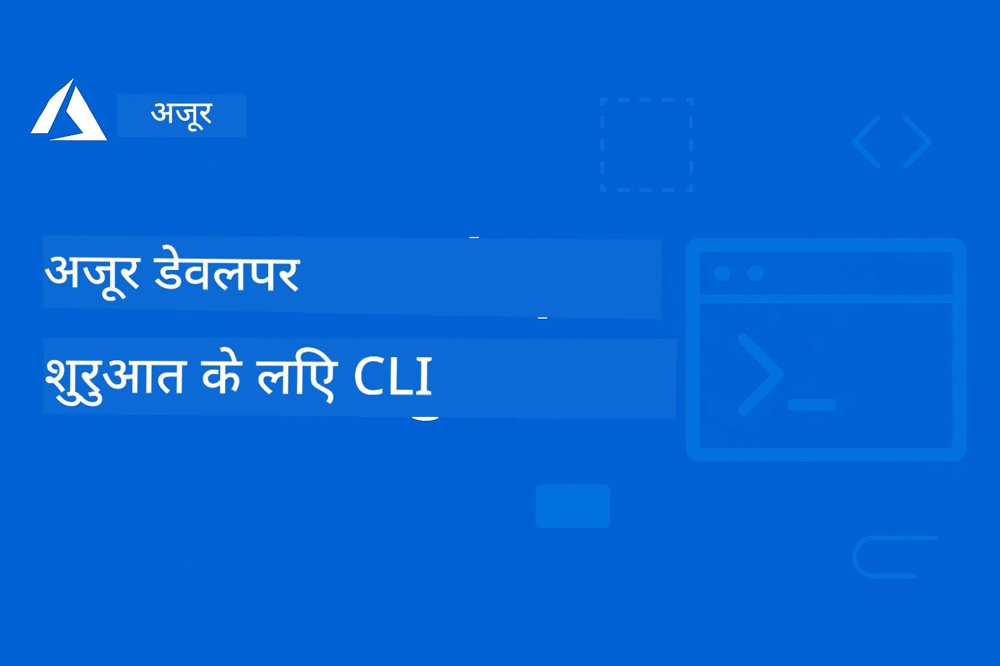

# AZD शुरुआती के लिए: एक संरचित सीखने की यात्रा

 

[](https://GitHub.com/microsoft/azd-for-beginners/watchers/)
[](https://GitHub.com/microsoft/azd-for-beginners/network/)
[](https://GitHub.com/microsoft/azd-for-beginners/stargazers/)

[](https://discord.com/invite/nkVh3dp)
[](https://discord.gg/nTYy5BXMWG)

---

### स्वचालित अनुवाद (हमेशा अद्यतित)

<!-- CO-OP TRANSLATOR LANGUAGES TABLE START -->
[Arabic](../ar/README.md) | [Bengali](../bn/README.md) | [Bulgarian](../bg/README.md) | [Burmese (Myanmar)](../my/README.md) | [Chinese (Simplified)](../zh-CN/README.md) | [Chinese (Traditional, Hong Kong)](../zh-HK/README.md) | [Chinese (Traditional, Macau)](../zh-MO/README.md) | [Chinese (Traditional, Taiwan)](../zh-TW/README.md) | [Croatian](../hr/README.md) | [Czech](../cs/README.md) | [Danish](../da/README.md) | [Dutch](../nl/README.md) | [Estonian](../et/README.md) | [Finnish](../fi/README.md) | [French](../fr/README.md) | [German](../de/README.md) | [Greek](../el/README.md) | [Hebrew](../he/README.md) | [Hindi](./README.md) | [Hungarian](../hu/README.md) | [Indonesian](../id/README.md) | [Italian](../it/README.md) | [Japanese](../ja/README.md) | [Kannada](../kn/README.md) | [Korean](../ko/README.md) | [Lithuanian](../lt/README.md) | [Malay](../ms/README.md) | [Malayalam](../ml/README.md) | [Marathi](../mr/README.md) | [Nepali](../ne/README.md) | [Nigerian Pidgin](../pcm/README.md) | [Norwegian](../no/README.md) | [Persian (Farsi)](../fa/README.md) | [Polish](../pl/README.md) | [Portuguese (Brazil)](../pt-BR/README.md) | [Portuguese (Portugal)](../pt-PT/README.md) | [Punjabi (Gurmukhi)](../pa/README.md) | [Romanian](../ro/README.md) | [Russian](../ru/README.md) | [Serbian (Cyrillic)](../sr/README.md) | [Slovak](../sk/README.md) | [Slovenian](../sl/README.md) | [Spanish](../es/README.md) | [Swahili](../sw/README.md) | [Swedish](../sv/README.md) | [Tagalog (Filipino)](../tl/README.md) | [Tamil](../ta/README.md) | [Telugu](../te/README.md) | [Thai](../th/README.md) | [Turkish](../tr/README.md) | [Ukrainian](../uk/README.md) | [Urdu](../ur/README.md) | [Vietnamese](../vi/README.md)

> **क्या आप स्थानीय रूप से क्लोन करना पसंद करेंगे?**
>
> यह रिपॉजिटरी 50+ भाषा अनुवाद शामिल करती है जिससे डाउनलोड आकार काफी बढ़ जाता है। बिना अनुवादों के क्लोन करने के लिए sparse checkout का उपयोग करें:
>
> **Bash / macOS / Linux:**
> ```bash
> git clone --filter=blob:none --sparse https://github.com/microsoft/AZD-for-beginners.git
> cd AZD-for-beginners
> git sparse-checkout set --no-cone '/*' '!translations' '!translated_images'
> ```
>
> **CMD (Windows):**
> ```cmd
> git clone --filter=blob:none --sparse https://github.com/microsoft/AZD-for-beginners.git
> cd AZD-for-beginners
> git sparse-checkout set --no-cone "/*" "!translations" "!translated_images"
> ```
>
> यह आपको कोर्स पूरा करने के लिए ज़रूरी सब कुछ देता है और डाउनलोड बहुत तेज़ होगा।
<!-- CO-OP TRANSLATOR LANGUAGES TABLE END -->

## 🆕 आज azd में क्या नया है

Azure Developer CLI पारंपरिक वेब ऐप्स और APIs से आगे बढ़ चुका है। आज, azd Azure पर किसी भी एप्लिकेशन को तैनात करने के लिए एकल उपकरण है — जिसमें AI-संचालित एप्लिकेशन और बुद्धिमान एजेंट भी शामिल हैं।

इसका आपके लिए क्या मतलब है:

- **AI एजेंट अब azd वर्कलोड्स के पहले दर्जे के हैं।** आप वही `azd init` → `azd up` वर्कफ़्लो इस्तेमाल करके AI एजेंट प्रोजेक्ट्स को इनिशियलाइज़, तैनात, और प्रबंधित कर सकते हैं जिसे आप पहले से जानते हैं।
- **Microsoft Foundry इंटीग्रेशन** मॉडल तैनाती, एजेंट होस्टिंग, और AI सेवा कॉन्फ़िगरेशन को सीधे azd टेम्पलेट इकोसिस्टम में लाता है।
- **कोर वर्कफ़्लो बदल नहीं हुआ है।** चाहे आप एक todo ऐप, एक माइक्रोसर्विस, या एक मल्टी-एजेंट AI समाधान तैनात कर रहे हों, कमांड्स एक ही हैं।

यदि आपने पहले azd का उपयोग किया है, तो AI समर्थन एक स्वाभाविक विस्तार है — न कि कोई अलग उपकरण या उन्नत ट्रैक। यदि आप नए हैं, तो आप एक ऐसा वर्कफ़्लो सीखेंगे जो सब कुछ के लिए काम करता है।

---

## 🚀 Azure Developer CLI (azd) क्या है?

**Azure Developer CLI (azd)** एक डेवलपर-हितैषी कमांड-लाइन टूल है जो Azure पर एप्लिकेशन तैनात करना सरल बनाता है। दर्जनों Azure संसाधनों को मैन्युअली बनाने और कनेक्ट करने के बजाय, आप एक ही कमांड से पूरे एप्लिकेशन तैनात कर सकते हैं।

### `azd up` का जादू

```bash
# यह एकल कमांड सब कुछ करता है:
# ✅ सभी Azure संसाधन बनाता है
# ✅ नेटवर्किंग और सुरक्षा कॉन्फ़िगर करता है
# ✅ आपके एप्लिकेशन कोड का निर्माण करता है
# ✅ Azure पर तैनात करता है
# ✅ आपको एक कार्यशील URL देता है
azd up
```

**बस इतना ही!** कोई Azure Portal पर क्लिकिंग नहीं, कोई जटिल ARM टेम्पलेट पहले सीखने के लिए नहीं, कोई मैनुअल कॉन्फ़िगरेशन नहीं - सिर्फ़ Azure पर काम करने वाले एप्लिकेशन।

---

## ❓ Azure Developer CLI बनाम Azure CLI: क्या अंतर है?

यह शुरुआती लोगों का सबसे सामान्य प्रश्न है। यहाँ सरल उत्तर है:

| विशेषता | **Azure CLI (`az`)** | **Azure Developer CLI (`azd`)** |
|---------|---------------------|--------------------------------|
| **उद्देश्य** | व्यक्तिगत Azure संसाधनों का प्रबंधन | पूरे एप्लिकेशन की तैनाती |
| **दृष्टिकोण** | इन्फ्रास्ट्रक्चर-केंद्रित | एप्लिकेशन-केंद्रित |
| **उदाहरण** | `az webapp create --name myapp...` | `azd up` |
| **सीखने की कठिनाई** | Azure सेवाओं का ज्ञान आवश्यक | केवल अपने ऐप को जानें |
| **किसके लिए बेहतर** | DevOps, इन्फ्रास्ट्रक्चर | डेवलपर्स, प्रोटोटाइपिंग |

### सरल उपमा

- **Azure CLI** ऐसे है जैसे आपके पास घर बनाने के सारे औज़ार हों - हथौड़े, आरी, कीलें। आप कुछ भी बना सकते हैं, लेकिन आपको निर्माण का ज्ञान होना चाहिए।
- **Azure Developer CLI** ऐसा है जैसे आपने एक ठेकेदार हायर किया हो - आप बताइए क्या चाहिए, और वे निर्माण संभाल लेंगे।

### कब किसे उपयोग करें

| परिदृश्य | उपयोग करें |
|----------|----------|
| "मैं अपना वेब ऐप जल्दी तैनात करना चाहता हूँ" | `azd up` |
| "मुझे सिर्फ़ एक स्टोरेज खाता बनाना है" | `az storage account create` |
| "मैं एक पूरा AI एप्लिकेशन बना रहा/रही हूँ" | `azd init --template azure-search-openai-demo` |
| "मुझे किसी विशिष्ट Azure संसाधन को डिबग करना है" | `az resource show` |
| "मुझे मिनटों में प्रोडक्शन-रेडी तैनाती चाहिए" | `azd up --environment production` |

### वे साथ में काम करते हैं!

AZD आंतरिक रूप से Azure CLI का उपयोग करता है। आप दोनों का उपयोग कर सकते हैं:
```bash
# अपने ऐप को AZD के साथ तैनात करें
azd up

# फिर Azure CLI के साथ विशिष्ट संसाधनों को ठीक से समायोजित करें
az webapp config set --name myapp --always-on true
```

---

## 🌟 Awesome AZD में टेम्प्लेट खोजें

शुरू से नहीं बनाइए! **Awesome AZD** समुदाय का संग्रह है तैयार-टु-डिप्लॉय टेम्प्लेट्स का:

| संसाधन | विवरण |
|----------|-------------|
| 🔗 [**Awesome AZD Gallery**](https://azure.github.io/awesome-azd/) | 200+ टेम्पलेट ब्राउज़ करें और एक-क्लिक से डिप्लॉय करें |
| 🔗 [**Submit a Template**](https://github.com/Azure/awesome-azd/issues) | अपना टेम्पलेट समुदाय को योगदान दें |
| 🔗 [**GitHub Repository**](https://github.com/Azure/awesome-azd) | स्टार करें और स्रोत एक्सप्लोर करें |

### Awesome AZD से लोकप्रिय AI टेम्प्लेट्स

```bash
# Microsoft Foundry मॉडल्स + AI सर्च के साथ RAG चैट
azd init --template azure-search-openai-demo

# त्वरित AI चैट एप्लिकेशन
azd init --template openai-chat-app-quickstart

# Foundry एजेंट्स के साथ AI एजेंट्स
azd init --template get-started-with-ai-agents
```

---

## 🎯 3 चरणों में शुरुआत

### चरण 1: AZD इंस्टॉल करें (2 मिनट)

**Windows:**
```powershell
winget install microsoft.azd
```

**macOS:**
```bash
brew tap azure/azd && brew install azd
```

**Linux:**
```bash
curl -fsSL https://aka.ms/install-azd.sh | bash
```

### चरण 2: Azure में लॉगिन करें

```bash
azd auth login
```

### चरण 3: अपना पहला ऐप तैनात करें

```bash
# एक टेम्पलेट से प्रारंभ करें
azd init --template todo-nodejs-mongo

# Azure पर तैनात करें (सब कुछ बनाता है!)
azd up
```

**🎉 बस इतना ही!** आपका ऐप अब Azure पर लाइव है।

### क्लीनअप (मत भूलें!)

```bash
# Remove all resources when done experimenting
azd down --force --purge
```

---

## 📚 इस पाठ्यक्रम का उपयोग कैसे करें

यह कोर्स **प्रगतिशील सीखने** के लिए डिज़ाइन किया गया है - जहां आप सहज हों वहां से शुरू करें और ऊपर की ओर काम करें:

| आपका अनुभव | यहाँ शुरू करें |
|-----------------|------------|
| **Azure में बिलकुल नए** | [अध्याय 1: फाउंडेशन](#-chapter-1-foundation--quick-start) |
| **Azure जानते हैं, AZD में नए** | [अध्याय 1: फाउंडेशन](#-chapter-1-foundation--quick-start) |
| **AI ऐप्स तैनात करना चाहते हैं** | [अध्याय 2: AI-प्रथम विकास](#-chapter-2-ai-first-development-recommended-for-ai-developers) |
| **व्यावहारिक अभ्यास चाहते हैं** | [🎓 Interactive Workshop](workshop/README.md) - 3-4 घंटे का मार्गदर्शित लैब |
| **प्रोडक्शन पैटर्न चाहिए** | [अध्याय 8: प्रोडक्शन एवं एंटरप्राइज](#-chapter-8-production--enterprise-patterns) |

### त्वरित सेटअप

1. **इस रिपॉज़िटरी को Fork करें**: [](https://GitHub.com/microsoft/azd-for-beginners/fork)
2. **क्लोन करें**: `git clone https://github.com/YOUR-USERNAME/azd-for-beginners.git`
3. **मदद प्राप्त करें**: [Azure Discord Community](https://discord.com/invite/ByRwuEEgH4)

> **क्या आप स्थानीय रूप से क्लोन करना पसंद करेंगे?**
>
> यह रिपॉजिटरी 50+ भाषा अनुवाद शामिल करती है जिससे डाउनलोड आकार काफी बढ़ जाता है। बिना अनुवादों के क्लोन करने के लिए sparse checkout का उपयोग करें:
> ```bash
> git clone --filter=blob:none --sparse https://github.com/microsoft/AZD-for-beginners.git
> cd AZD-for-beginners
> git sparse-checkout set --no-cone '/*' '!translations' '!translated_images'
> ```
> यह आपको कोर्स पूरा करने के लिए ज़रूरी सब कुछ देता है और डाउनलोड बहुत तेज़ होगा।


## पाठ्यक्रम का अवलोकन

संरचित अध्यायों के माध्यम से Azure Developer CLI (azd) में महारत हासिल करें जो प्रगतिशील सीखने के लिए डिज़ाइन किए गए हैं। **Microsoft Foundry इंटीग्रेशन के साथ AI एप्लिकेशन तैनाती पर विशेष ध्यान।**

### आधुनिक डेवलपर्स के लिए यह पाठ्यक्रम क्यों आवश्यक है

Microsoft Foundry Discord समुदाय के इनसाइट्स के आधार पर, **45% डेवलपर्स AZD को AI वर्कलोड्स के लिए इस्तेमाल करना चाहते हैं** पर उन्हें इन चुनौतियों का सामना करना पड़ता है:
- जटिल मल्टी-सर्विस AI आर्किटेक्चर
- प्रोडक्शन AI तैनाती के बेहतरीन अभ्यास  
- Azure AI सेवा एकीकरण और कॉन्फ़िगरेशन
- AI वर्कलोड्स के लिए लागत अनुकूलन
- AI-विशिष्ट तैनाती समस्याओं का ट्रबलशूटिंग

### सीखने के उद्देश्य

इस संरचित कोर्स को पूरा करके, आप:
- **AZD के मूल सिद्धांतों में महारत हासिल करेंगे**: कोर कॉन्सेप्ट्स, इंस्टालेशन, और कॉन्फ़िगरेशन
- **AI एप्लिकेशन तैनात करेंगे**: AZD का उपयोग Microsoft Foundry सेवाओं के साथ
- **इन्फ्रास्ट्रक्चर ऐज़ कोड लागू करेंगे**: Bicep टेम्पलेट्स के साथ Azure संसाधनों का प्रबंधन
- **तैनाती को ट्रबलशूट करेंगे**: सामान्य समस्याओं का निवारण और डिबग करना
- **प्रोडक्शन के लिए अनुकूलित करेंगे**: सुरक्षा, स्केलिंग, मॉनिटरिंग, और लागत प्रबंधन
- **मल्टी-एजेंट समाधान बनाएंगे**: जटिल AI आर्किटेक्चर तैनात करना

## 🗺️ पाठ्यक्रम मानचित्र: अध्याय द्वारा त्वरित नेविगेशन

प्रत्येक अध्याय का समर्पित README है जिसमें सीखने के उद्देश्य, त्वरित शुरुआत, और अभ्यास शामिल हैं:

| अध्याय | विषय | पाठ | अवधि | जटिलता |
|---------|-------|---------|----------|------------|
| **[Ch 1: Foundation](docs/chapter-01-foundation/README.md)** | शुरुआत | [AZD मूल बातें](docs/chapter-01-foundation/azd-basics.md) &#124; [स्थापना](docs/chapter-01-foundation/installation.md) &#124; [पहला प्रोजेक्ट](docs/chapter-01-foundation/first-project.md) | 30-45 मिनट | ⭐ |
| **[Ch 2: AI विकास](docs/chapter-02-ai-development/README.md)** | AI-केंद्रित ऐप्स | [Foundry Integration](docs/chapter-02-ai-development/microsoft-foundry-integration.md) &#124; [AI Agents](docs/chapter-02-ai-development/agents.md) &#124; [Model Deployment](docs/chapter-02-ai-development/ai-model-deployment.md) &#124; [Workshop](docs/chapter-02-ai-development/ai-workshop-lab.md) | 1-2 घंटे | ⭐⭐ |
| **[Ch 3: कॉन्फ़िगरेशन](docs/chapter-03-configuration/README.md)** | ऑथ और सुरक्षा | [Configuration](docs/chapter-03-configuration/configuration.md) &#124; [Auth & Security](docs/chapter-03-configuration/authsecurity.md) | 45-60 मिनट | ⭐⭐ |
| **[Ch 4: इन्फ्रास्ट्रक्चर](docs/chapter-04-infrastructure/README.md)** | IaC और तैनाती | [Deployment Guide](docs/chapter-04-infrastructure/deployment-guide.md) &#124; [Provisioning](docs/chapter-04-infrastructure/provisioning.md) | 1-1.5 घंटे | ⭐⭐⭐ |
| **[Ch 5: मल्टी-एजेंट](docs/chapter-05-multi-agent/README.md)** | AI एजेंट समाधान | [Retail Scenario](examples/retail-scenario.md) &#124; [Coordination Patterns](docs/chapter-06-pre-deployment/coordination-patterns.md) | 2-3 घंटे | ⭐⭐⭐⭐ |
| **[Ch 6: प्री-तैनाती](docs/chapter-06-pre-deployment/README.md)** | योजना और सत्यापन | [Preflight Checks](docs/chapter-06-pre-deployment/preflight-checks.md) &#124; [Capacity Planning](docs/chapter-06-pre-deployment/capacity-planning.md) &#124; [SKU Selection](docs/chapter-06-pre-deployment/sku-selection.md) &#124; [App Insights](docs/chapter-06-pre-deployment/application-insights.md) | 1 घंटा | ⭐⭐ |
| **[Ch 7: समस्या निवारण](docs/chapter-07-troubleshooting/README.md)** | डिबग और फिक्स | [Common Issues](docs/chapter-07-troubleshooting/common-issues.md) &#124; [Debugging](docs/chapter-07-troubleshooting/debugging.md) &#124; [AI Issues](docs/chapter-07-troubleshooting/ai-troubleshooting.md) | 1-1.5 घंटे | ⭐⭐ |
| **[Ch 8: प्रोडक्शन](docs/chapter-08-production/README.md)** | एंटरप्राइज़ पैटर्न | [Production Practices](docs/chapter-08-production/production-ai-practices.md) | 2-3 घंटे | ⭐⭐⭐⭐ |
| **[🎓 Workshop](workshop/README.md)** | हैंड्स-ऑन लैब | [Introduction](workshop/docs/instructions/0-Introduction.md) &#124; [Selection](workshop/docs/instructions/1-Select-AI-Template.md) &#124; [Validation](workshop/docs/instructions/2-Validate-AI-Template.md) &#124; [Deconstruction](workshop/docs/instructions/3-Deconstruct-AI-Template.md) &#124; [Configuration](workshop/docs/instructions/4-Configure-AI-Template.md) &#124; [Customization](workshop/docs/instructions/5-Customize-AI-Template.md) &#124; [Teardown](workshop/docs/instructions/6-Teardown-Infrastructure.md) &#124; [Wrap-up](workshop/docs/instructions/7-Wrap-up.md) | 3-4 घंटे | ⭐⭐ |

**कुल कोर्स अवधि:** ~10-14 घंटे | **कौशल प्रगति:** शुरुआती → प्रोडक्शन-रेडी

---

## 📚 सीखने के अध्याय

*अनुभव स्तर और लक्ष्यों के आधार पर अपना सीखने का मार्ग चुनें*

### 🚀 अध्याय 1: बुनियाद और क्विक स्टार्ट
**पूर्वापेक्षाएँ**: Azure सदस्यता, बुनियादी कमांड लाइन ज्ञान  
**अवधि**: 30-45 मिनट  
**जटिलता**: ⭐

#### आप क्या सीखेंगे
- Azure Developer CLI की मूल बातें समझना
- अपने प्लेटफ़ॉर्म पर AZD इंस्टॉल करना
- आपकी पहली सफल तैनाती

#### अध्ययन संसाधन
- **🎯 शुरू करें**: [What is Azure Developer CLI?](#what-is-azure-developer-cli)
- **📖 सिद्धांत**: [AZD Basics](docs/chapter-01-foundation/azd-basics.md) - मुख्य अवधारणाएँ और शब्दावली
- **⚙️ सेटअप**: [Installation & Setup](docs/chapter-01-foundation/installation.md) - प्लेटफ़ॉर्म-विशिष्ट गाइड
- **🛠️ व्यावहारिक**: [Your First Project](docs/chapter-01-foundation/first-project.md) - चरण-दर-चरण ट्यूटोरियल
- **📋 त्वरित संदर्भ**: [Command Cheat Sheet](resources/cheat-sheet.md)

#### व्यावहारिक अभ्यास
```bash
# त्वरित स्थापना जांच
azd version

# अपना पहला एप्लिकेशन तैनात करें
azd init --template todo-nodejs-mongo
azd up
```

**💡 अध्याय परिणाम**: AZD का उपयोग करके Azure पर एक सरल वेब एप्लिकेशन सफलतापूर्वक तैनात करना

**✅ सफलता सत्यापन:**
```bash
# अध्याय 1 पूरा करने के बाद, आप सक्षम होंगे:
azd version              # स्थापित संस्करण दिखाता है
azd init --template todo-nodejs-mongo  # परियोजना को आरंभ करता है
azd up                  # Azure पर तैनात करता है
azd show                # चल रहे ऐप का URL दिखाता है
# एप्लिकेशन ब्राउज़र में खुलता है और काम करता है
azd down --force --purge  # संसाधनों को साफ़ करता है
```

**📊 समय निवेश:** 30-45 मिनट  
**📈 सीखने के बाद कौशल स्तर:** बेसिक एप्लिकेशन स्वतंत्र रूप से तैनात कर सकता है  
**📈 सीखने के बाद कौशल स्तर:** बेसिक एप्लिकेशन स्वतंत्र रूप से तैनात कर सकता है

---

### 🤖 अध्याय 2: AI-प्रथम विकास (AI डेवलपर्स के लिए अनुशंसित)
**पूर्वापेक्षाएँ**: अध्याय 1 पूरा किया गया होना चाहिए  
**अवधि**: 1-2 घंटे  
**जटिलता**: ⭐⭐

#### आप क्या सीखेंगे
- AZD के साथ Microsoft Foundry एकीकरण
- AI-संचालित अनुप्रयोगों को तैनात करना
- AI सेवा कॉन्फ़िगरेशन को समझना

#### अध्ययन संसाधन
- **🎯 शुरू करें**: [Microsoft Foundry Integration](docs/chapter-02-ai-development/microsoft-foundry-integration.md)
- **🤖 AI एजेंट्स**: [AI Agents Guide](docs/chapter-02-ai-development/agents.md) - AZD के साथ बुद्धिमान एजेंट तैनात करें
- **📖 पैटर्न**: [AI Model Deployment](docs/chapter-02-ai-development/ai-model-deployment.md) - AI मॉडल तैनात और प्रबंधित करना
- **🛠️ वर्कशॉप**: [AI Workshop Lab](docs/chapter-02-ai-development/ai-workshop-lab.md) - अपने AI समाधानों को AZD-तैयार बनाएं
- **🎥 इंटरएक्टिव गाइड**: [Workshop Materials](workshop/README.md) - ब्राउज़र-आधारित सीखने के लिए MkDocs * DevContainer Environment
- **📋 टेम्पलेट्स**: [Microsoft Foundry Templates](#कार्यशाला-संसाधन)
- **📝 उदाहरण**: [AZD Deployment Examples](examples/README.md)

#### व्यावहारिक अभ्यास
```bash
# अपना पहला एआई अनुप्रयोग तैनात करें
azd init --template azure-search-openai-demo
azd up

# अतिरिक्त एआई टेम्पलेट आज़माएँ
azd init --template openai-chat-app-quickstart
azd init --template agent-openai-python-prompty
```

**💡 अध्याय परिणाम**: RAG क्षमताओं के साथ एक AI-संचालित चैट एप्लिकेशन तैनात और कॉन्फ़िगर करना

**✅ सफलता सत्यापन:**
```bash
# अध्याय 2 के बाद, आप सक्षम होंगे:
azd init --template azure-search-openai-demo
azd up
# एआई चैट इंटरफ़ेस का परीक्षण करें
# प्रश्न पूछें और स्रोतों के साथ एआई-समर्थित उत्तर प्राप्त करें
# सत्यापित करें कि खोज एकीकरण काम कर रहा है
azd monitor  # जाँच करें कि Application Insights टेलीमेट्री दिखा रहा है
azd down --force --purge
```

**📊 समय निवेश:** 1-2 घंटे  
**📈 सीखने के बाद कौशल स्तर:** प्रोडक्शन-रेडी AI अनुप्रयोग तैनात और कॉन्फ़िगर कर सकता है  
**💰 लागत की समझ:** डेव लागत $80-150/माह, प्रोडक्शन लागत $300-3500/माह तक समझें

#### 💰 AI तैनाती के लिए लागत विचार

**डेवलपमेंट परिवेश (अनुमानित $80-150/माह):**
- Microsoft Foundry Models (Pay-as-you-go): $0-50/माह (टोकन उपयोग के आधार पर)
- AI Search (बेसिक टियर): $75/माह
- Container Apps (Consumption): $0-20/माह
- Storage (Standard): $1-5/माह

**प्रोडक्शन परिवेश (अनुमानित $300-3,500+/माह):**
- Microsoft Foundry Models (सुसंगत प्रदर्शन के लिए PTU): $3,000+/माह OR उच्च वॉल्यूम के साथ Pay-as-go
- AI Search (स्टैण्डर्ड टियर): $250/माह
- Container Apps (Dedicated): $50-100/माह
- Application Insights: $5-50/माह
- Storage (Premium): $10-50/माह

**💡 लागत अनुकूलन सुझाव:**
- सीखने के लिए Microsoft Foundry Models के **Free Tier** का उपयोग करें (Azure OpenAI 50,000 tokens/माह शामिल)
- जब सक्रिय रूप से विकसित नहीं कर रहे हों तो संसाधनों को मुक्त करने के लिए `azd down` चलाएँ
- प्रोडक्शन के लिए केवल PTU पर अपग्रेड करें; शुरुआत consumption-आधारित बिलिंग से करें
- तैनाती से पहले लागत का अनुमान लगाने के लिए `azd provision --preview` का उपयोग करें
- ऑटो-स्केलिंग सक्षम करें: केवल वास्तविक उपयोग के लिए भुगतान करें

**लागत निगरानी:**
```bash
# अनुमानित मासिक लागतों की जाँच करें
azd provision --preview

# Azure पोर्टल में वास्तविक लागतों की निगरानी करें
az consumption budget list --resource-group <your-rg>
```

---

### ⚙️ अध्याय 3: कॉन्फ़िगरेशन और प्रमाणीकरण
**पूर्वापेक्षाएँ**: अध्याय 1 पूरा किया गया होना चाहिए  
**अवधि**: 45-60 मिनट  
**जटिलता**: ⭐⭐

#### आप क्या सीखेंगे
- पर्यावरण कॉन्फ़िगरेशन और प्रबंधन
- प्रमाणीकरण और सुरक्षा सर्वोत्तम प्रथाएँ
- संसाधन नामकरण और संगठन

#### अध्ययन संसाधन
- **📖 कॉन्फ़िगरेशन**: [Configuration Guide](docs/chapter-03-configuration/configuration.md) - पर्यावरण सेटअप
- **🔐 सुरक्षा**: [Authentication patterns and managed identity](docs/chapter-03-configuration/authsecurity.md) - प्रमाणीकरण पैटर्न
- **📝 उदाहरण**: [Database App Example](examples/database-app/README.md) - AZD डेटाबेस उदाहरण

#### व्यावहारिक अभ्यास
- कई पर्यावरण कॉन्फ़िगर करें (dev, staging, prod)
- प्रबंधित पहचान प्रमाणीकरण सेटअप करें
- पर्यावरण-विशिष्ट कॉन्फ़िगरेशन लागू करें

**💡 अध्याय परिणाम**: उचित प्रमाणीकरण और सुरक्षा के साथ कई पर्यावरणों का प्रबंधन करें

---

### 🏗️ अध्याय 4: इन्फ्रास्ट्रक्चर एज़ कोड और तैनाती
**पूर्वापेक्षाएँ**: अध्याय 1-3 पूरा किया गया होना चाहिए  
**अवधि**: 1-1.5 घंटे  
**जटिलता**: ⭐⭐⭐

#### आप क्या सीखेंगे
- उन्नत तैनाती पैटर्न
- Bicep के साथ Infrastructure as Code
- संसाधन provisioning रणनीतियाँ

#### अध्ययन संसाधन
- **📖 तैनाती**: [Deployment Guide](docs/chapter-04-infrastructure/deployment-guide.md) - पूर्ण वर्कफ़्लो
- **🏗️ प्रोविज़निंग**: [Provisioning Resources](docs/chapter-04-infrastructure/provisioning.md) - Azure संसाधन प्रबंधन
- **📝 उदाहरण**: [Container App Example](../../examples/container-app) - कंटेनरीकृत तैनातियाँ

#### व्यावहारिक अभ्यास
- कस्टम Bicep टेम्पलेट बनाएं
- मल्टी-सर्विस अनुप्रयोग तैनात करें
- ब्लू-ग्रीन तैनाती रणनीतियाँ लागू करें

**💡 अध्याय परिणाम**: कस्टम इन्फ्रास्ट्रक्चर टेम्पलेट्स का उपयोग करके जटिल मल्टी-सर्विस अनुप्रयोग तैनात करना

---

### 🎯 अध्याय 5: मल्टी-एजेंट AI समाधान (उन्नत)
**पूर्वापेक्षाएँ**: अध्याय 1-2 पूरा किया गया होना चाहिए  
**अवधि**: 2-3 घंटे  
**जटिलता**: ⭐⭐⭐⭐

#### आप क्या सीखेंगे
- मल्टी-एजेंट आर्किटेक्चर पैटर्न
- एजेंट ऑर्केस्ट्रेशन और समन्वय
- प्रोडक्शन-रेडी AI तैनातियाँ

#### अध्ययन संसाधन
- **🤖 फीचर्ड प्रोजेक्ट**: [Retail Multi-Agent Solution](examples/retail-scenario.md) - पूर्ण कार्यान्वयन
- **🛠️ ARM टेम्पलेट्स**: [ARM Template Package](../../examples/retail-multiagent-arm-template) - वन-क्लिक तैनाती
- **📖 आर्किटेक्चर**: [Multi-agent coordination patterns](docs/chapter-06-pre-deployment/coordination-patterns.md) - पैटर्न

#### व्यावहारिक अभ्यास
```bash
# पूरे रिटेल मल्टी-एजेंट समाधान को तैनात करें
cd examples/retail-multiagent-arm-template
./deploy.sh

# एजेंट विन्यासों का अन्वेषण करें
az deployment group show --resource-group <rg-name> --name <deployment-name>
```

**💡 अध्याय परिणाम**: Customer और Inventory एजेंट्स के साथ एक प्रोडक्शन-रेडी मल्टी-एजेंट AI समाधान तैनात और प्रबंधित करना

---

### 🔍 अध्याय 6: प्री-तैनाती सत्यापन और योजना
**पूर्वापेक्षाएँ**: अध्याय 4 पूरा किया गया होना चाहिए  
**अवधि**: 1 घंटा  
**जटिलता**: ⭐⭐

#### आप क्या सीखेंगे
- क्षमता योजना और संसाधन सत्यापन
- SKU चयन रणनीतियाँ
- प्री-फ्लाइट चेक और ऑटोमेशन

#### अध्ययन संसाधन
- **📊 योजना**: [Capacity Planning](docs/chapter-06-pre-deployment/capacity-planning.md) - संसाधन सत्यापन
- **💰 चयन**: [SKU Selection](docs/chapter-06-pre-deployment/sku-selection.md) - लागत-कुशल विकल्प
- **✅ सत्यापन**: [Pre-flight Checks](docs/chapter-06-pre-deployment/preflight-checks.md) - ऑटोमेटेड स्क्रिप्ट

#### व्यावहारिक अभ्यास
- क्षमता सत्यापन स्क्रिप्ट चलाएँ
- लागत के लिए SKU चयन अनुकूलित करें
- ऑटोमेटेड प्री-तैनाती चेक लागू करें

**💡 अध्याय परिणाम**: निष्पादन से पहले तैनातियों को मान्य और अनुकूलित करना

---

### 🚨 अध्याय 7: समस्या निवारण और डिबगिंग
**पूर्वापेक्षाएँ**: कोई भी तैनाती अध्याय पूरा किया हुआ होना चाहिए  
**अवधि**: 1-1.5 घंटे  
**जटिलता**: ⭐⭐

#### आप क्या सीखेंगे
- व्यवस्थित डिबगिंग दृष्टिकोण
- सामान्य समस्याएँ और समाधान
- AI-विशिष्ट समस्या निवारण

#### अध्ययन संसाधन
- **🔧 सामान्य समस्याएँ**: [Common Issues](docs/chapter-07-troubleshooting/common-issues.md) - FAQ और समाधान
- **🕵️ डिबगिंग**: [Debugging Guide](docs/chapter-07-troubleshooting/debugging.md) - चरण-दर-चरण रणनीतियाँ
- **🤖 AI समस्याएँ**: [AI-Specific Troubleshooting](docs/chapter-07-troubleshooting/ai-troubleshooting.md) - AI सेवा समस्याएँ

#### व्यावहारिक अभ्यास
- तैनाती विफलताओं का निदान करें
- प्रमाणीकरण मुद्दों का समाधान करें
- AI सेवा कनेक्टिविटी को डिबग करें

**💡 अध्याय परिणाम**: सामान्य तैनाती समस्याओं का स्वतंत्र रूप से निदान और समाधान करना

---

### 🏢 अध्याय 8: प्रोडक्शन और एंटरप्राइज़ पैटर्न
**पूर्वापेक्षाएँ**: अध्याय 1-4 पूरा किया गया होना चाहिए  
**अवधि**: 2-3 घंटे  
**जटिलता**: ⭐⭐⭐⭐

#### आप क्या सीखेंगे
- प्रोडक्शन तैनाती रणनीतियाँ
- एंटरप्राइज़ सुरक्षा पैटर्न
- मॉनिटरिंग और लागत अनुकूलन

#### अध्ययन संसाधन
- **🏭 Production**: [प्रोडक्शन AI बेस्ट प्रैक्टिसेस](docs/chapter-08-production/production-ai-practices.md) - एंटरप्राइज़ पैटर्न
- **📝 Examples**: [माइक्रोसर्विसेज़ उदाहरण](../../examples/microservices) - जटिल आर्किटेक्चर
- **📊 Monitoring**: [Application Insights integration](docs/chapter-06-pre-deployment/application-insights.md) - निगरानी

#### व्यावहारिक अभ्यास
- एंटरप्राइज़ सुरक्षा पैटर्न लागू करें
- व्यापक निगरानी सेट अप करें
- उचित शासन के साथ प्रोडक्शन में तैनात करें

**💡 चैप्टर परिणाम**: पूर्ण प्रोडक्शन क्षमताओं के साथ एंटरप्राइज़-तैयार एप्लिकेशन तैनात करें

---

## 🎓 कार्यशाला अवलोकन: व्यावहारिक शिक्षण अनुभव

> **⚠️ WORKSHOP STATUS: सक्रिय विकास**  
> कार्यशाला सामग्री वर्तमान में विकसित और परिष्कृत की जा रही है। कोर मॉड्यूल कार्यरत हैं, लेकिन कुछ उन्नत सेक्शन अधूरे हैं। हम सक्रिय रूप से सभी सामग्री को पूरा करने पर काम कर रहे हैं। [प्रगति ट्रैक करें →](workshop/README.md)

### इंटरैक्टिव कार्यशाला सामग्री
**ब्राउज़र-आधारित उपकरणों और मार्गदर्शित अभ्यासों के साथ व्यापक व्यावहारिक सीखना**

हमारी कार्यशाला सामग्री अध्याय-आधारित पाठ्यक्रम को पूरक करने वाला एक संरचित, इंटरएक्टिव शिक्षण अनुभव प्रदान करती है। कार्यशाला स्वयं-गतिशील सीखने और प्रशिक्षक-निर्देशित सत्र दोनों के लिए डिज़ाइन की गई है।

#### 🛠️ कार्यशाला सुविधाएँ
- **ब्राउज़र-आधारित इंटरफ़ेस**: खोज, कॉपी, और थीम सुविधाओं के साथ पूर्ण MkDocs-समर्थित कार्यशाला
- **GitHub Codespaces एकीकरण**: एक-क्लिक विकास वातावरण सेटअप
- **संरचित अध्ययन पथ**: 8-मॉड्यूल मार्गदर्शित अभ्यास (कुल 3-4 घंटे)
- **क्रमिक कार्यप्रणाली**: परिचय → चयन → सत्यापन → विखंडन → कॉन्फ़िगरेशन → अनुकूलन → संसाधन हटाना → समापन
- **इंटरेक्टिव DevContainer वातावरण**: पूर्व-कॉन्फ़िगर किए गए उपकरण और निर्भरताएँ

#### 📚 कार्यशाला मॉड्यूल संरचना
कार्यशाला एक **8-मॉड्यूल क्रमिक कार्यप्रणाली** का पालन करती है जो आपको खोज से लेकर तैनाती में महारत तक ले जाती है:

| मॉड्यूल | विषय | आप क्या करेंगे | अवधि |
|--------|-------|----------------|----------|
| **0. परिचय** | कार्यशाला अवलोकन | सीखने के उद्देश्य, आवश्यकताएँ, और कार्यशाला संरचना समझें | 15 मिनट |
| **1. चयन** | टेम्पलेट खोज | AZD टेम्पलेट्स का अन्वेषण करें और अपने परिदृश्य के लिए सही AI टेम्पलेट चुनें | 20 मिनट |
| **2. सत्यापन** | तैनात और सत्यापित करें | टेम्पलेट को `azd up` के साथ तैनात करें और पुष्टि करें कि इन्फ्रास्ट्रक्चर काम करता है | 30 मिनट |
| **3. विखंडन** | संरचना समझें | GitHub Copilot का उपयोग करके टेम्पलेट आर्किटेक्चर, Bicep फ़ाइलों, और कोड संगठन का अन्वेषण करें | 30 मिनट |
| **4. कॉन्फ़िगरेशन** | azure.yaml गहन अध्ययन | `azure.yaml` कॉन्फ़िगरेशन, लाइफसायकल हुक्स, और पर्यावरण चर में महारत हासिल करें | 30 मिनट |
| **5. अनुकूलन** | इसे अपनी तरह बनाएं | AI Search, ट्रेसिंग, मूल्यांकन सक्षम करें, और अपने परिदृश्य के लिए अनुकूलित करें | 45 मिनट |
| **6. संसाधन हटाना** | साफ़-सफ़ाई | `azd down --purge` के साथ सुरक्षित रूप से संसाधनों को हटाएँ | 15 मिनट |
| **7. समापन** | अगले कदम | उपलब्धियों, प्रमुख अवधारणाओं की समीक्षा करें, और अपनी सीखने की यात्रा जारी रखें | 15 मिनट |

**कार्यशाला प्रवाह:**
```
Introduction → Selection → Validation → Deconstruction → Configuration → Customization → Teardown → Wrap-up
     ↓            ↓           ↓              ↓               ↓              ↓            ↓           ↓
  Overview    Find the     Deploy &      Explore        Master         Customize     Clean up    Review &
             right        verify        code &        azure.yaml      for your      resources   next steps
             template                   structure                     scenario
```

#### 🚀 कार्यशाला के साथ प्रारंभ करें
```bash
# विकल्प 1: GitHub Codespaces (अनुशंसित)
# रिपॉज़िटरी में "Code" → "Create codespace on main" पर क्लिक करें

# विकल्प 2: स्थानीय विकास
git clone https://github.com/microsoft/azd-for-beginners.git
cd azd-for-beginners/workshop
# workshop/README.md में सेटअप निर्देशों का पालन करें
```

#### 🎯 कार्यशाला सीखने के परिणाम
कार्यशाला पूर्ण करने पर, प्रतिभागी:
- **प्रोडक्शन AI अनुप्रयोग तैनात करें**: AZD का उपयोग Microsoft Foundry सेवाओं के साथ करें
- **मल्टी-एजेंट आर्किटेक्चर में महारत हासिल करें**: समन्वित AI एजेंट समाधान लागू करें
- **सुरक्षा सर्वोत्तम प्रथाएँ लागू करें**: प्रमाणीकरण और एक्सेस नियंत्रण कॉन्फ़िगर करें
- **स्केल के लिए अनुकूलित करें**: लागत-प्रभावी, प्रदर्शनक्षम तैनाती डिज़ाइन करें
- **तैनाती में समस्याओं का निवारण करें**: सामान्य समस्याओं का स्वायत्त रूप से समाधान करें

#### 📖 कार्यशाला संसाधन
- **🎥 इंटरैक्टिव गाइड**: [कार्यशाला सामग्री](workshop/README.md) - ब्राउज़र-आधारित सीखने का वातावरण
- **📋 मॉड्यूल-दर-मॉड्यूल निर्देश**:
  - [0. परिचय](workshop/docs/instructions/0-Introduction.md) - कार्यशाला अवलोकन और उद्देश्य
  - [1. चयन](workshop/docs/instructions/1-Select-AI-Template.md) - AI टेम्पलेट खोजें और चुनें
  - [2. सत्यापन](workshop/docs/instructions/2-Validate-AI-Template.md) - टेम्पलेट तैनात और सत्यापित करें
  - [3. विखंडन](workshop/docs/instructions/3-Deconstruct-AI-Template.md) - टेम्पलेट आर्किटेक्चर का अन्वेषण करें
  - [4. कॉन्फ़िगरेशन](workshop/docs/instructions/4-Configure-AI-Template.md) - `azure.yaml` में महारत हासिल करें
  - [5. अनुकूलन](workshop/docs/instructions/5-Customize-AI-Template.md) - अपने परिदृश्य के लिए अनुकूलित करें
  - [6. संसाधन हटाना](workshop/docs/instructions/6-Teardown-Infrastructure.md) - संसाधनों की सफाई
  - [7. समापन](workshop/docs/instructions/7-Wrap-up.md) - समीक्षा और अगले कदम
- **🛠️ AI कार्यशाला लैब**: [AI Workshop Lab](docs/chapter-02-ai-development/ai-workshop-lab.md) - AI-केंद्रित अभ्यास
- **💡 वर्कशॉप सेटअप गाइड**: [Workshop Setup Guide](workshop/README.md#quick-start) - वातावरण कॉन्फ़िगरेशन

**उपयुक्त के लिए**: कॉर्पोरेट प्रशिक्षण, विश्वविद्यालय पाठ्यक्रम, स्वयं-निर्धारित सीखना, और डेवलपर बूटकैम्प्स।

---

## 📖 गहन अध्ययन: AZD क्षमताएँ

बुनियादी बातों से परे, AZD प्रोडक्शन तैनाती के लिए शक्तिशाली सुविधाएँ प्रदान करता है:

- **टेम्पलेट-आधारित तैनाती** - सामान्य एप्लिकेशन पैटर्न के लिए पूर्व-निर्मित टेम्पलेट्स का उपयोग करें
- **इन्फ्रास्ट्रक्चर ऐज़ कोड** - Bicep या Terraform का उपयोग करके Azure संसाधनों का प्रबंधन करें  
- **एकीकृत वर्कफ़्लोज़** - निर्बाध रूप से प्रावधान, तैनात, और एप्लिकेशन की निगरानी करें
- **डेवलपर-फ्रेंडली** - डेवलपर उत्पादकता और अनुभव के लिए अनुकूलित

### **AZD + Microsoft Foundry: AI तैनाती के लिए उपयुक्त**

**AI समाधानों के लिए AZD क्यों?** AZD उन प्रमुख चुनौतियों को संबोधित करता है जिनका सामना AI डेवलपर्स करते हैं:

- **AI-रेडी टेम्पलेट्स** - Microsoft Foundry Models, Cognitive Services, और ML वर्कलोड्स के लिए पूर्व-कॉन्फ़िगर किए गए टेम्पलेट्स
- **सुरक्षित AI तैनाती** - AI सेवाओं, API कुंजी, और मॉडल एंडपॉइंट्स के लिए अंतर्निर्मित सुरक्षा पैटर्न  
- **प्रोडक्शन AI पैटर्न** - स्केलेबल, लागत-कुशल AI एप्लिकेशन तैनाती के लिए सर्वोत्तम प्रथाएँ
- **एंड-टू-एंड AI वर्कफ़्लोज़** - मॉडल विकास से लेकर प्रोडक्शन तैनाती तक उचित निगरानी के साथ
- **लागत अनुकूलन** - AI वर्कलोड्स के लिए स्मार्ट संसाधन आवंटन और स्केलिंग रणनीतियाँ
- **Microsoft Foundry इंटीग्रेशन** - Microsoft Foundry मॉडल कैटलॉग और एंडपॉइंट्स से निर्बाध कनेक्शन

---

## 🎯 टेम्पलेट्स और उदाहरण पुस्तकालय

### विशेष: Microsoft Foundry टेम्पलेट्स
**यदि आप AI एप्लिकेशन तैनात कर रहे हैं तो यहाँ से शुरू करें!**

> **नोट:** ये टेम्पलेट्स विभिन्न AI पैटर्न दिखाते हैं। कुछ बाहरी Azure Samples हैं, कुछ स्थानीय कार्यान्वयन हैं।

| टेम्पलेट | अध्याय | जटिलता | सेवाएँ | प्रकार |
|----------|---------|------------|----------|------|
| [**AI चैट के साथ शुरुआत करें**](https://github.com/Azure-Samples/get-started-with-ai-chat) | अध्याय 2 | ⭐⭐ | AzureOpenAI + Azure AI Model Inference API + Azure AI Search + Azure Container Apps + Application Insights | बाहरी |
| [**AI एजेंट्स के साथ शुरुआत करें**](https://github.com/Azure-Samples/get-started-with-ai-agents) | अध्याय 2 | ⭐⭐ | Foundry Agents + AzureOpenAI + Azure AI Search + Azure Container Apps + Application Insights| बाहरी |
| [**Azure Search + OpenAI Demo**](https://github.com/Azure-Samples/azure-search-openai-demo) | अध्याय 2 | ⭐⭐ | AzureOpenAI + Azure AI Search + App Service + Storage | बाहरी |
| [**OpenAI Chat App Quickstart**](https://github.com/Azure-Samples/openai-chat-app-quickstart) | अध्याय 2 | ⭐ | AzureOpenAI + Container Apps + Application Insights | बाहरी |
| [**Agent OpenAI Python Prompty**](https://github.com/Azure-Samples/agent-openai-python-prompty) | अध्याय 5 | ⭐⭐⭐ | AzureOpenAI + Azure Functions + Prompty | बाहरी |
| [**Contoso Chat RAG**](https://github.com/Azure-Samples/contoso-chat) | अध्याय 8 | ⭐⭐⭐⭐ | AzureOpenAI + AI Search + Cosmos DB + Container Apps | बाहरी |
| [**Retail Multi-Agent Solution**](examples/retail-scenario.md) | अध्याय 5 | ⭐⭐⭐⭐ | AzureOpenAI + AI Search + Storage + Container Apps + Cosmos DB | **स्थानीय** |

### विशेष: पूर्ण शिक्षण परिदृश्य
**लर्निंग अध्यायों के अनुरूप प्रोडक्शन-तैयार एप्लिकेशन टेम्पलेट्स**

| टेम्पलेट | शिक्षण अध्याय | जटिलता | प्रमुख सीख |
|----------|------------------|------------|--------------|
| [**openai-chat-app-quickstart**](https://github.com/Azure-Samples/openai-chat-app-quickstart) | अध्याय 2 | ⭐ | बुनियादी AI तैनाती पैटर्न |
| [**azure-search-openai-demo**](https://github.com/Azure-Samples/azure-search-openai-demo) | अध्याय 2 | ⭐⭐ | Azure AI Search के साथ RAG कार्यान्वयन |
| [**ai-document-processing**](https://github.com/Azure-Samples/ai-document-processing) | अध्याय 4 | ⭐⭐ | Document Intelligence एकीकरण |
| [**agent-openai-python-prompty**](https://github.com/Azure-Samples/agent-openai-python-prompty) | अध्याय 5 | ⭐⭐⭐ | एजेंट फ़्रेमवर्क और फ़ंक्शन कॉलिंग |
| [**contoso-chat**](https://github.com/Azure-Samples/contoso-chat) | अध्याय 8 | ⭐⭐⭐ | एंटरप्राइज़ AI ऑर्केस्ट्रेशन |
| [**retail-multi-agent-solution**](examples/retail-scenario.md) | अध्याय 5 | ⭐⭐⭐⭐ | Customer और Inventory एजेंट्स के साथ मल्टी-एजेंट आर्किटेक्चर |

### उदाहरण प्रकार के आधार पर सीखना

> **📌 स्थानीय बनाम बाहरी उदाहरण:**  
> **स्थानीय उदाहरण** (इस रिपो में) = तुरंत उपयोग के लिए तैयार  
> **बाहरी उदाहरण** (Azure Samples) = लिंक किए गए रिपॉज़िटरी से क्लोन करें

#### स्थानीय उदाहरण (तुरंत उपयोग के लिए तैयार)
- [**Retail Multi-Agent Solution**](examples/retail-scenario.md) - ARM टेम्पलेट्स के साथ पूर्ण प्रोडक्शन-तैयार कार्यान्वयन
  - मल्टी-एजेंट आर्किटेक्चर (Customer + Inventory एजेंट)
  - व्यापक निगरानी और मूल्यांकन
  - ARM टेम्पलेट के माध्यम से एक-क्लिक तैनाती

#### स्थानीय उदाहरण - कंटेनर एप्लिकेशन (अध्याय 2-5)
**इस रिपोजिटरी में व्यापक कंटेनर तैनाती उदाहरण:**
- [**Container App Examples**](examples/container-app/README.md) - कंटेनरयुक्त तैनाती पर पूरा मार्गदर्शक
  - [Simple Flask API](../../examples/container-app/simple-flask-api) - स्केल-टू-जीरो के साथ बुनियादी REST API
  - [Microservices Architecture](../../examples/container-app/microservices) - प्रोडक्शन-तैयार मल्टी-सर्विस तैनाती
  - क्विक स्टार्ट, प्रोडक्शन, और उन्नत तैनाती पैटर्न
  - निगरानी, सुरक्षा, और लागत अनुकूलन निर्देश

#### बाहरी उदाहरण - सरल अनुप्रयोग (अध्याय 1-2)
**शुरू करने के लिए इन Azure Samples रिपॉज़िटरीज़ को क्लोन करें:**
- [Simple Web App - Node.js + MongoDB](https://github.com/Azure-Samples/todo-nodejs-mongo) - बुनियादी तैनाती पैटर्न
- [Static Website - React SPA](https://github.com/Azure-Samples/todo-csharp-sql-swa-func) - स्टैटिक कंटेंट तैनाती
- [Container App - Python Flask](https://github.com/Azure-Samples/container-apps-store-api-microservice) - REST API तैनाती

#### बाहरी उदाहरण - डेटाबेस इंटीग्रेशन (अध्याय 3-4)  
- [Database App - C# + SQL](https://github.com/Azure-Samples/todo-csharp-sql) - डेटाबेस कनेक्टिविटी पैटर्न
- [Functions + Cosmos DB](https://github.com/Azure-Samples/todo-python-mongo-swa-func) - सर्वरलेस डेटा वर्कफ़्लो

#### बाहरी उदाहरण - उन्नत पैटर्न (अध्याय 4-8)
- [Java Microservices](https://github.com/Azure-Samples/java-microservices-aca-lab) - मल्टी-सर्विस आर्किटेक्चर
- [Container Apps Jobs](https://github.com/Azure-Samples/container-apps-jobs) - बैकग्राउंड प्रोसेसिंग  
- [Enterprise ML Pipeline](https://github.com/Azure-Samples/mlops-v2) - प्रोडक्शन-तैयार ML पैटर्न

### बाहरी टेम्पलेट संग्रह
- [**Official AZD Template Gallery**](https://azure.github.io/awesome-azd/) - आधिकारिक और समुदाय टेम्पलेट्स का चयनित संग्रह
- [**Azure Developer CLI Templates**](https://learn.microsoft.com/en-us/azure/developer/azure-developer-cli/azd-templates) - Microsoft Learn टेम्पलेट दस्तावेज़ीकरण
- [**Examples Directory**](examples/README.md) - स्थानीय सीखने के उदाहरण विस्तृत व्याख्याओं के साथ

---

## 📚 सीखने के संसाधन और संदर्भ

### त्वरित संदर्भ
- [**Command Cheat Sheet**](resources/cheat-sheet.md) - अध्याय अनुसार व्यवस्थित आवश्यक azd कमांड
- [**Glossary**](resources/glossary.md) - Azure और azd शब्दावली  
- [**FAQ**](resources/faq.md) - अध्याय अनुसार व्यवस्थित सामान्य प्रश्न
- [**Study Guide**](resources/study-guide.md) - व्यापक अभ्यास अभ्यास

### हैंड्स-ऑन कार्यशालाएँ
- [**AI Workshop Lab**](docs/chapter-02-ai-development/ai-workshop-lab.md) - अपने AI समाधानों को AZD-तैनात योग्य बनाएं (2-3 घंटे)
- [**Interactive Workshop**](workshop/README.md) - MkDocs और GitHub Codespaces के साथ 8-मॉड्यूल मार्गदर्शित अभ्यास
  - अनुसरण करता है: परिचय → चयन → सत्यापन → विखंडन → कॉन्फ़िगरेशन → अनुकूलन → संसाधन हटाना → समापन

### बाहरी सीखने के संसाधन
- [Azure Developer CLI Documentation](https://learn.microsoft.com/en-us/azure/developer/azure-developer-cli/)
- [Azure Architecture Center](https://learn.microsoft.com/en-us/azure/architecture/)
- [Azure Pricing Calculator](https://azure.microsoft.com/pricing/calculator/)
- [Azure Status](https://status.azure.com/)

### आपके एडिटर के लिए AI एजेंट कौशल
- [**Microsoft Azure Skills on skills.sh**](https://skills.sh/microsoft/github-copilot-for-azure) - Azure AI, Foundry, डिप्लॉयमेंट, डायग्नोस्टिक्स, लागत अनुकूलन, और अधिक के लिए 37 खुले एजेंट कौशल। इन्हें GitHub Copilot, Cursor, Claude Code, या किसी भी समर्थित एजेंट में इंस्टॉल करें:
  ```bash
  npx skills add microsoft/github-copilot-for-azure
  ```

---

## 🔧 त्वरित समस्या निवारण गाइड

**आम समस्याएँ जो शुरुआत करने वालों को आती हैं और तुरंत समाधान:**

<details>
<summary><strong>❌ "azd: कमांड नहीं मिला"</strong></summary>

```bash
# पहले AZD स्थापित करें
# विंडोज़ (पावरशेल):
winget install microsoft.azd

# मैकओएस:
brew tap azure/azd && brew install azd

# लिनक्स:
curl -fsSL https://aka.ms/install-azd.sh | bash

# स्थापना सत्यापित करें
azd version
```
</details>

<details>
<summary><strong>❌ "कोई सदस्यता नहीं मिली" या "सदस्यता सेट नहीं है"</strong></summary>

```bash
# उपलब्ध सब्सक्रिप्शन सूचीबद्ध करें
az account list --output table

# डिफ़ॉल्ट सब्सक्रिप्शन सेट करें
az account set --subscription "<subscription-id-or-name>"

# AZD वातावरण के लिए सेट करें
azd env set AZURE_SUBSCRIPTION_ID "<subscription-id>"

# सत्यापित करें
az account show
```
</details>

<details>
<summary><strong>❌ "InsufficientQuota" या "कोटा पार हो गया"</strong></summary>

```bash
# अलग Azure क्षेत्र आज़माएँ
azd env set AZURE_LOCATION "westus2"
azd up

# या विकास में छोटे SKUs का उपयोग करें
# infra/main.parameters.json संपादित करें:
{
  "sku": "B1"  // Instead of "P1V2"
}
```
</details>

<details>
<summary><strong>❌ "azd up" आधे में विफल हो जाता है</strong></summary>

```bash
# विकल्प 1: साफ़ करें और पुनः प्रयास करें
azd down --force --purge
azd up

# विकल्प 2: केवल बुनियादी ढाँचा ठीक करें
azd provision

# विकल्प 3: विस्तृत स्थिति की जाँच करें
azd show

# विकल्प 4: Azure Monitor में लॉग्स की जाँच करें
azd monitor --logs
```
</details>

<details>
<summary><strong>❌ "प्रमाणीकरण विफल" या "टोकन की अवधि समाप्त"</strong></summary>

```bash
# पुनः प्रमाणीकरण करें
az logout
az login

azd auth logout
azd auth login

# प्रमाणीकरण सत्यापित करें
az account show
```
</details>

<details>
<summary><strong>❌ "संसाधन पहले से मौजूद है" या नामकरण संघर्ष</strong></summary>

```bash
# AZD अद्वितीय नाम बनाता है, पर यदि टकराव हो:
azd down --force --purge

# तो एक नए वातावरण के साथ पुनः प्रयास करें
azd env new dev-v2
azd up
```
</details>

<details>
<summary><strong>❌ टेम्प्लेट डिप्लॉयमेंट बहुत समय ले रहा है</strong></summary>

**सामान्य प्रतीक्षा समय:**
- सरल वेब ऐप: 5-10 मिनट
- डेटाबेस वाला ऐप: 10-15 मिनट
- AI एप्लिकेशन: 15-25 मिनट (OpenAI provisioning धीमा होता है)

```bash
# प्रगति जांचें
azd show

# यदि 30 मिनट से अधिक अटके रहें, तो Azure पोर्टल देखें:
azd monitor
# असफल तैनाती खोजें
```
</details>

<details>
<summary><strong>❌ "अनुमति अस्वीकृत" या "Forbidden"</strong></summary>

```bash
# अपनी Azure भूमिका जांचें
az role assignment list --assignee $(az account show --query user.name -o tsv)

# आपको कम से कम "Contributor" भूमिका चाहिए
# अपने Azure व्यवस्थापक से निम्न प्रदान करने के लिए कहें:
# - Contributor (संसाधनों के लिए)
# - User Access Administrator (भूमिका सौंपने के लिए)
```
</details>

<details>
<summary><strong>❌ तैनात किए गए एप्लिकेशन का URL नहीं मिल रहा</strong></summary>

```bash
# सभी सेवा एंडपॉइंट दिखाएँ
azd show

# या Azure पोर्टल खोलें
azd monitor

# विशिष्ट सेवा की जाँच करें
azd env get-values
# *_URL वेरिएबल्स खोजें
```
</details>

### 📚 पूर्ण समस्या निवारण संसाधन

- **आम समस्याएँ मार्गदर्शिका:** [Detailed Solutions](docs/chapter-07-troubleshooting/common-issues.md)
- **AI-विशिष्ट समस्याएँ:** [AI Troubleshooting](docs/chapter-07-troubleshooting/ai-troubleshooting.md)
- **डिबगिंग गाइड:** [Step-by-step Debugging](docs/chapter-07-troubleshooting/debugging.md)
- **मदद पाएं:** [Azure Discord](https://discord.gg/microsoft-azure) #azure-developer-cli

---

## 🎓 कोर्स पूरा करना और प्रमाणन

### प्रगति ट्रैकिंग
प्रत्येक अध्याय के माध्यम से अपनी सीखने की प्रगति ट्रैक करें:

- [ ] **अध्याय 1**: फ़ाउंडेशन और क्विक स्टार्ट ✅
- [ ] **अध्याय 2**: AI-प्रथम विकास ✅  
- [ ] **अध्याय 3**: कॉन्फ़िगरेशन और प्रमाणीकरण ✅
- [ ] **अध्याय 4**: इन्फ्रास्ट्रक्चर एज कोड और डिप्लॉयमेंट ✅
- [ ] **अध्याय 5**: मल्टी-एजेंट AI समाधान ✅
- [ ] **अध्याय 6**: प्री-डिप्लॉयमेंट वैलिडेशन और योजना ✅
- [ ] **अध्याय 7**: समस्या निवारण और डिबगिंग ✅
- [ ] **अध्याय 8**: प्रोडक्शन और एंटरप्राइज़ पैटर्न ✅

### सीखने की सत्यापन
हर अध्याय पूरा करने के बाद, अपने ज्ञान की पुष्टि करें:
1. **व्यावहारिक अभ्यास**: अध्याय का हैंड्स-ऑन डिप्लॉयमेंट पूरा करें
2. **नॉलेज चेक**: अपने अध्याय के FAQ सेक्शन की समीक्षा करें
3. **कम्युनिटी चर्चा**: अपने अनुभव को Azure Discord में साझा करें
4. **अगला अध्याय**: अगले जटिलता स्तर पर जाएँ

### कोर्स पूरा करने के फायदे
सभी अध्याय पूरा करने पर, आपके पास होगा:
- **प्रोडक्शन अनुभव**: वास्तविक AI एप्लिकेशन Azure पर डिप्लॉय किए हुए
- **पेशेवर कौशल**: एंटरप्राइज़-रेडी डिप्लॉयमेंट क्षमताएँ  
- **समुदाय में मान्यता**: Azure डेवलपर समुदाय के सक्रिय सदस्य
- **करियर उन्नति**: मांग में AZD और AI डिप्लॉयमेंट विशेषज्ञता

---

## 🤝 समुदाय और समर्थन

### मदद और समर्थन प्राप्त करें
- **टेक्निकल इश्यूज़**: [Report bugs and request features](https://github.com/microsoft/azd-for-beginners/issues)
- **लर्निंग प्रश्न**: [Microsoft Azure Discord Community](https://discord.gg/microsoft-azure) और [](https://discord.gg/nTYy5BXMWG)
- **AI-विशिष्ट मदद**: शामिल हों [](https://discord.gg/nTYy5BXMWG)
- **डॉक्यूमेंटेशन**: [Official Azure Developer CLI documentation](https://learn.microsoft.com/en-us/azure/developer/azure-developer-cli/)

### Microsoft Foundry Discord से समुदाय अंतर्दृष्टि

**#Azure चैनल के हाल के पोल परिणाम:**
- **45%** डेवलपर्स AI वर्कलोड के लिए AZD का उपयोग करना चाहते हैं
- **शीर्ष चुनौतियाँ**: मल्टी-सर्विस डिप्लॉयमेंट, क्रेडेंशियल प्रबंधन, प्रोडक्शन रेडिनेस  
- **सबसे अधिक अनुरोध किए गए**: AI-विशिष्ट टेम्प्लेट, समस्या निवारण गाइड, सर्वोत्तम अभ्यास

**हमारे समुदाय में शामिल होकर आप:**
- अपने AZD + AI अनुभव साझा कर सकते हैं और मदद पा सकते हैं
- नए AI टेम्प्लेट के शुरुआती प्रीव्यू तक पहुँच सकते हैं
- AI डिप्लॉयमेंट सर्वोत्तम प्रथाओं में योगदान कर सकते हैं
- भविष्य के AI + AZD फीचर विकास को प्रभावित कर सकते हैं

### कोर्स में योगदान
हम योगदान का स्वागत करते हैं! विस्तृत जानकारी के लिए कृपया हमारा [Contributing Guide](CONTRIBUTING.md) पढ़ें:
- **कंटेंट सुधार**: मौजूदा अध्यायों और उदाहरणों को बेहतर बनाएं
- **नए उदाहरण**: वास्तविक विश्व परिदृश्य और टेम्प्लेट जोड़ें  
- **अनुवाद**: बहुभाषी समर्थन बनाए रखने में मदद करें
- **बग रिपोर्ट्स**: सटीकता और स्पष्टता में सुधार करें
- **समुदाय मानक**: हमारे समावेशी समुदाय दिशा-निर्देशों का पालन करें

---

## 📄 कोर्स जानकारी

### लाइसेंस
यह प्रोजेक्ट MIT License के तहत लाइसेंस्ड है - विवरण के लिए [LICENSE](../../LICENSE) फ़ाइल देखें।

### संबंधित Microsoft लर्निंग संसाधन

हमारी टीम अन्य व्यापक लर्निंग कोर्स भी बनाती है:

<!-- CO-OP TRANSLATOR OTHER COURSES START -->
### LangChain
[](https://aka.ms/langchain4j-for-beginners)
[](https://aka.ms/langchainjs-for-beginners?WT.mc_id=m365-94501-dwahlin)
[](https://github.com/microsoft/langchain-for-beginners?WT.mc_id=m365-94501-dwahlin)
---

### Azure / Edge / MCP / एजेंट्स
[](https://github.com/microsoft/AZD-for-beginners?WT.mc_id=academic-105485-koreyst)
[](https://github.com/microsoft/edgeai-for-beginners?WT.mc_id=academic-105485-koreyst)
[](https://github.com/microsoft/mcp-for-beginners?WT.mc_id=academic-105485-koreyst)
[](https://github.com/microsoft/ai-agents-for-beginners?WT.mc_id=academic-105485-koreyst)

---
 
### Generative AI सीरीज़
[](https://github.com/microsoft/generative-ai-for-beginners?WT.mc_id=academic-105485-koreyst)
[-9333EA?style=for-the-badge&labelColor=E5E7EB&color=9333EA)](https://github.com/microsoft/Generative-AI-for-beginners-dotnet?WT.mc_id=academic-105485-koreyst)
[-C084FC?style=for-the-badge&labelColor=E5E7EB&color=C084FC)](https://github.com/microsoft/generative-ai-for-beginners-java?WT.mc_id=academic-105485-koreyst)
[-E879F9?style=for-the-badge&labelColor=E5E7EB&color=E879F9)](https://github.com/microsoft/generative-ai-with-javascript?WT.mc_id=academic-105485-koreyst)

---
 
### कोर लर्निंग
[](https://aka.ms/ml-beginners?WT.mc_id=academic-105485-koreyst)
[](https://aka.ms/datascience-beginners?WT.mc_id=academic-105485-koreyst)
[](https://aka.ms/ai-beginners?WT.mc_id=academic-105485-koreyst)
[](https://github.com/microsoft/Security-101?WT.mc_id=academic-96948-sayoung)
[](https://aka.ms/webdev-beginners?WT.mc_id=academic-105485-koreyst)
[](https://aka.ms/iot-beginners?WT.mc_id=academic-105485-koreyst)
[](https://github.com/microsoft/xr-development-for-beginners?WT.mc_id=academic-105485-koreyst)

---
 
### Copilot सीरीज़
[](https://aka.ms/GitHubCopilotAI?WT.mc_id=academic-105485-koreyst)
[](https://github.com/microsoft/mastering-github-copilot-for-dotnet-csharp-developers?WT.mc_id=academic-105485-koreyst)
[](https://github.com/microsoft/CopilotAdventures?WT.mc_id=academic-105485-koreyst)
<!-- CO-OP TRANSLATOR OTHER COURSES END -->

---

## 🗺️ पाठ्यक्रम नेविगेशन

**🚀 सीखना शुरू करने के लिए तैयार हैं?**

**शुरुआती**: [अध्याय 1: आधार और त्वरित आरंभ](#-chapter-1-foundation--quick-start) से शुरू करें  
**AI डेवलपर्स**: [अध्याय 2: AI-प्रथम विकास](#-chapter-2-ai-first-development-recommended-for-ai-developers) पर जाएँ  
**अनुभवी डेवलपर्स**: [अध्याय 3: विन्यास और प्रमाणीकरण](#️-chapter-3-configuration--authentication) से शुरू करें

**अगले कदम**: [अध्याय 1 - AZD मूल बातें शुरू करें](docs/chapter-01-foundation/azd-basics.md) →

---

<!-- CO-OP TRANSLATOR DISCLAIMER START -->
**अस्वीकरण**:
यह दस्तावेज़ AI अनुवाद सेवा [Co-op Translator](https://github.com/Azure/co-op-translator) का उपयोग करके अनुवादित किया गया है। हालाँकि हम सटीकता के लिए प्रयासरत हैं, कृपया ध्यान दें कि स्वचालित अनुवादों में त्रुटियाँ या असंगतियाँ हो सकती हैं। मूल दस्तावेज़ को उसकी मूल भाषा में ही अधिकारिक स्रोत माना जाना चाहिए। महत्वपूर्ण जानकारी के लिए, पेशेवर मानव अनुवाद की सिफारिश की जाती है। इस अनुवाद के उपयोग से उत्पन्न किसी भी गलतफहमी या ग़लत व्याख्या के लिए हम जिम्मेदार नहीं हैं।
<!-- CO-OP TRANSLATOR DISCLAIMER END -->