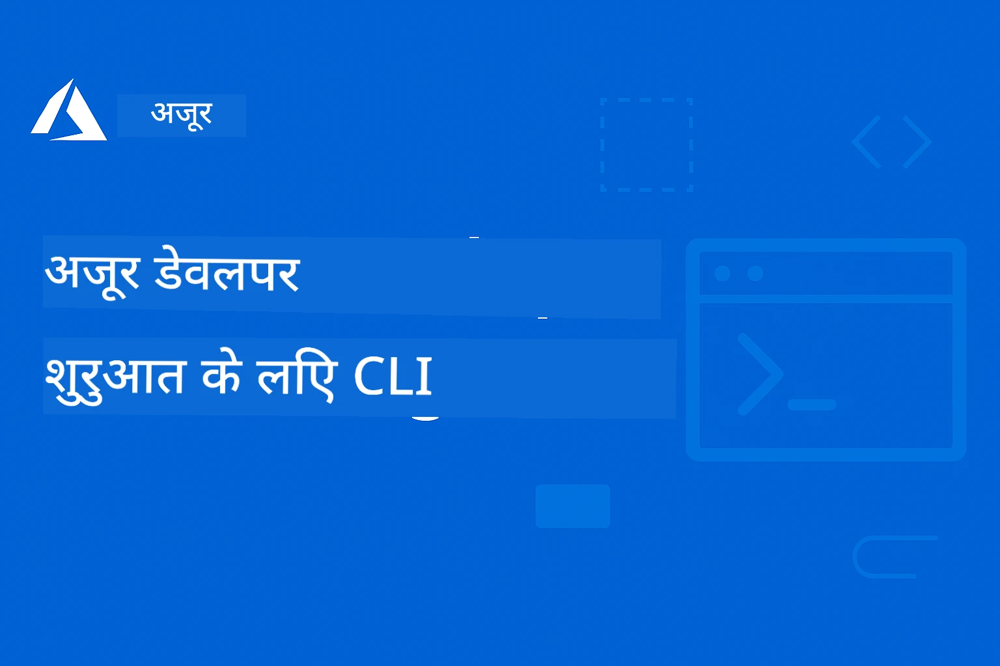

# AZD शुरुआती के लिए: एक संरचित सीखने की यात्रा

 

[](https://GitHub.com/microsoft/azd-for-beginners/watchers/)
[](https://GitHub.com/microsoft/azd-for-beginners/network/)
[](https://GitHub.com/microsoft/azd-for-beginners/stargazers/)

[](https://discord.com/invite/nkVh3dp)
[](https://discord.gg/nTYy5BXMWG)

---

### स्वचालित अनुवाद (हमेशा अद्यतित)

<!-- CO-OP TRANSLATOR LANGUAGES TABLE START -->
[Arabic](../ar/README.md) | [Bengali](../bn/README.md) | [Bulgarian](../bg/README.md) | [Burmese (Myanmar)](../my/README.md) | [Chinese (Simplified)](../zh-CN/README.md) | [Chinese (Traditional, Hong Kong)](../zh-HK/README.md) | [Chinese (Traditional, Macau)](../zh-MO/README.md) | [Chinese (Traditional, Taiwan)](../zh-TW/README.md) | [Croatian](../hr/README.md) | [Czech](../cs/README.md) | [Danish](../da/README.md) | [Dutch](../nl/README.md) | [Estonian](../et/README.md) | [Finnish](../fi/README.md) | [French](../fr/README.md) | [German](../de/README.md) | [Greek](../el/README.md) | [Hebrew](../he/README.md) | [Hindi](./README.md) | [Hungarian](../hu/README.md) | [Indonesian](../id/README.md) | [Italian](../it/README.md) | [Japanese](../ja/README.md) | [Kannada](../kn/README.md) | [Khmer](../km/README.md) | [Korean](../ko/README.md) | [Lithuanian](../lt/README.md) | [Malay](../ms/README.md) | [Malayalam](../ml/README.md) | [Marathi](../mr/README.md) | [Nepali](../ne/README.md) | [Nigerian Pidgin](../pcm/README.md) | [Norwegian](../no/README.md) | [Persian (Farsi)](../fa/README.md) | [Polish](../pl/README.md) | [Portuguese (Brazil)](../pt-BR/README.md) | [Portuguese (Portugal)](../pt-PT/README.md) | [Punjabi (Gurmukhi)](../pa/README.md) | [Romanian](../ro/README.md) | [Russian](../ru/README.md) | [Serbian (Cyrillic)](../sr/README.md) | [Slovak](../sk/README.md) | [Slovenian](../sl/README.md) | [Spanish](../es/README.md) | [Swahili](../sw/README.md) | [Swedish](../sv/README.md) | [Tagalog (Filipino)](../tl/README.md) | [Tamil](../ta/README.md) | [Telugu](../te/README.md) | [Thai](../th/README.md) | [Turkish](../tr/README.md) | [Ukrainian](../uk/README.md) | [Urdu](../ur/README.md) | [Vietnamese](../vi/README.md)

> **स्थानीय रूप से क्लोन करना पसंद करते हैं?**
>
> इस रिपोजिटरी में 50+ भाषा अनुवाद शामिल हैं जो डाउनलोड साइज़ को काफी बढ़ा देते हैं। बिना अनुवाद के क्लोन करने के लिए, sparse checkout का उपयोग करें:
>
> **Bash / macOS / Linux:**
> ```bash
> git clone --filter=blob:none --sparse https://github.com/microsoft/AZD-for-beginners.git
> cd AZD-for-beginners
> git sparse-checkout set --no-cone '/*' '!translations' '!translated_images'
> ```
>
> **CMD (Windows):**
> ```cmd
> git clone --filter=blob:none --sparse https://github.com/microsoft/AZD-for-beginners.git
> cd AZD-for-beginners
> git sparse-checkout set --no-cone "/*" "!translations" "!translated_images"
> ```
>
> इससे आपको वह सब कुछ मिलेगा जो कोर्स पूरा करने के लिए चाहिए, वह भी बहुत तेज डाउनलोड के साथ।
<!-- CO-OP TRANSLATOR LANGUAGES TABLE END -->

## 🆕 आज azd में क्या नया है

> 📌 यह कोर्स **`azd 1.27.1`** (जुलाई 2026) के अनुसार मान्य है। अपना संस्करण जांचने के लिए `azd version` चलाएं, और नवीनतम पाने के लिए `azd upgrade` करें।

Azure Developer CLI पारंपरिक वेब ऐप्स और API से आगे बढ़ गया है। आज, azd Azure पर **किसी भी** एप्लिकेशन को तैनात करने के लिए एक उपकरण है—जिसमें AI-संचालित एप्लिकेशन और बुद्धिमान एजेंट शामिल हैं।

इसका अर्थ आपके लिए है:

- **AI एजेंट अब प्रथम श्रेणी azd वर्कलोड हैं।** आप AI एजेंट प्रोजेक्ट्स को वही `azd init` → `azd up` कार्यप्रवाह का उपयोग करके प्रारंभ, तैनात, और प्रबंधित कर सकते हैं जिसे आप पहले से जानते हैं।
- **CLI से एजेंट जीवनचक्र पूरा।** `azure.ai.agents` एक्सटेंशन अब पूरी यात्रा को कवर करता है—`azd ai agent init` से स्कैफोल्डिंग, `azd ai agent invoke` से परीक्षण (साथ में प्रतिक्रिया-समय आउटपुट), `azd ai agent eval generate` और `azd ai agent optimize` से गुणवत्ता मापन और सुधार, और `azd ai agent delete` से सफाई।
- **अधिक AI निर्माण ब्लॉक्स।** नए पूर्वावलोकन एक्सटेंशन—`azure.ai.skills` और `azure.ai.connections`—आपको पुनः उपयोग योग्य एजेंट स्किल्स और Foundry कनेक्शन्स को सीधे azd के साथ प्रबंधित करने देते हैं।
- **Microsoft Foundry समाकलन** मॉडल तैनाती, एजेंट होस्टिंग, और AI सेवा कॉन्फ़िगरेशन को सीधे azd टेम्प्लेट पारिस्थितिकी तंत्र में लाता है।
- **रोजाना के बुनियादी कार्यों को और सरल बनाया गया।** हाल के संस्करणों ने `azd init` को पुनः चलाने के लिए सुरक्षित बनाया, `azd auth login` को पुराने टोकन ऑटोमैटिक साफ करने वाला बनाया, और एक उपयोगकर्ता-मित्रवत `azd tool` पहले-रन सेटअप संकेत जोड़ा।
- **मूल कार्यप्रवाह नहीं बदला।** चाहे आप एक टु-डू ऐप, माइक्रोसर्विस, या मल्टी-एजेंट AI समाधान तैनात कर रहे हों, कमांड समान हैं।

> **Aspire उपयोगकर्ताओं के लिए नोट:** Microsoft अब उत्पाद को केवल **Aspire** (पूर्व में ".NET Aspire") के रूप में संदर्भित करता है। azd की Aspire समर्थन अपरिवर्तित है—सिर्फ नाम अपडेट हुआ है।

यदि आपने पहले azd का उपयोग किया है, तो AI समर्थन एक प्राकृतिक विस्तार है—एक अलग उपकरण या उन्नत ट्रैक नहीं। यदि आप पूरी तरह से नए हैं, तो आप एक कार्यप्रवाह सीखेंगे जो सब कुछ के लिए काम करता है।

---

## 🚀 Azure Developer CLI (azd) क्या है?

**Azure Developer CLI (azd)** एक डेवलपर-मित्रवत कमांड-लाइन टूल है जो Azure पर एप्लिकेशन तैनात करना सरल बनाता है। कई Azure संसाधनों को मैन्युअली बनाने और जोड़ने की बजाय, आप एक कमांड से पूरे एप्लिकेशन को तैनात कर सकते हैं।

### `azd up` का जादू

```bash
# यह एकल कमांड सब कुछ करता है:
# ✅ सभी एज़्योर संसाधन बनाता है
# ✅ नेटवर्किंग और सुरक्षा कॉन्फ़िगर करता है
# ✅ आपके एप्लिकेशन कोड का निर्माण करता है
# ✅ एज़्योर पर तैनात करता है
# ✅ आपको एक काम करने वाला URL देता है
azd up
```

**बिल्कुल इतना ही!** कोई Azure पोर्टल क्लिकिंग नहीं, कोई जटिल ARM टेम्पलेट सीखना नहीं, कोई मैन्युअल कॉन्फ़िगरेशन नहीं—सिर्फ Azure पर काम करने वाले ऐप्लिकेशन।

---

## ❓ Azure Developer CLI और Azure CLI में अंतर क्या है?

यह शुरुआती लोगों का सबसे आम सवाल है। यहाँ सरल उत्तर है:

| फीचर | **Azure CLI (`az`)** | **Azure Developer CLI (`azd`)** |
|---------|---------------------|--------------------------------|
| **उद्देश्य** | व्यक्तिगत Azure संसाधनों का प्रबंधन | पूरे एप्लिकेशन को तैनात करना |
| **सोच-विचार** | इंफ्रास्ट्रक्चर-केंद्रित | एप्लिकेशन-केंद्रित |
| **उदाहरण** | `az webapp create --name myapp...` | `azd up` |
| **सीखने की कठिनाई** | Azure सेवाओं का ज्ञान अनिवार्य | केवल अपने ऐप का ज्ञान चाहिए |
| **सर्वोत्तम उपयोग** | DevOps, इंफ्रास्ट्रक्चर | डेवलपर्स, प्रोटोटाइपिंग |

### सरल उपमा

- **Azure CLI** ऐसा है जैसे आपके पास घर बनाने के सारे औजार हैं - हथौड़ा, आरी, कीलें। आप कुछ भी बना सकते हैं, लेकिन आपको निर्माण का ज्ञान होना चाहिए।
- **Azure Developer CLI** ऐसा है जैसे आप एक ठेकेदार रखते हैं - आप बताते हैं क्या चाहिए, वे निर्माण संभालते हैं।

### कब कौन सा उपयोग करें

| परिदृश्य | इसे उपयोग करें |
|----------|----------|
| "मैं जल्दी अपनी वेब ऐप तैनात करना चाहता हूँ" | `azd up` |
| "मुझे सिर्फ एक स्टोरेज अकाउंट बनाना है" | `az storage account create` |
| "मैं पूरा AI एप्लिकेशन बना रहा हूँ" | `azd init --template azure-search-openai-demo` |
| "मुझे किसी खास Azure संसाधन का डिबग करना है" | `az resource show` |
| "मैं मिनटों में प्रोडक्शन-तैयार तैनाती चाहता हूँ" | `azd up --environment production` |

### वे साथ में काम करते हैं!

AZD आंतरिक रूप से Azure CLI का उपयोग करता है। आप दोनों का उपयोग कर सकते हैं:
```bash
# अपने ऐप को AZD के साथ तैनात करें
azd up

# फिर Azure CLI के साथ विशिष्ट संसाधनों को ठीक करें
az webapp config set --name myapp --always-on true
```

---

## 🌟 Awesome AZD में टेम्प्लेट्स खोजें

शुरुआत से न बनाएं! **Awesome AZD** समुदाय का संग्रह है तैनाती के लिए तैयार टेम्प्लेट्स का:

| संसाधन | विवरण |
|----------|-------------|
| 🔗 [**Awesome AZD Gallery**](https://azure.github.io/awesome-azd/) | 200+ टेम्प्लेट्स ब्राउज़ करें और एक क्लिक में तैनात करें |
| 🔗 [**Submit a Template**](https://github.com/Azure/awesome-azd/issues) | अपनी खुद की टेम्प्लेट समुदाय को दें |
| 🔗 [**GitHub Repository**](https://github.com/Azure/awesome-azd) | स्त्री करें और स्रोत एक्सप्लोर करें |

### Awesome AZD के लोकप्रिय AI टेम्प्लेट्स

```bash
# माइक्रोसॉफ्ट फाउंड्री मॉडल्स + AI सर्च के साथ RAG चैट
azd init --template azure-search-openai-demo

# तेज़ AI चैट एप्लिकेशन
azd init --template openai-chat-app-quickstart

# फाउंड्री एजेंट्स के साथ AI एजेंट्स
azd init --template get-started-with-ai-agents
```

---

## 🎯 3 चरणों में शुरुआत करें

शुरुआत करने से पहले, सुनिश्चित करें कि आपका मशीन उस टेम्प्लेट के लिए तैयार है जिसे आप तैनात करना चाहते हैं:

**Windows:**
```powershell
.\validate-setup.ps1
```

**macOS / Linux:**
```bash
bash ./validate-setup.sh
```

यदि कोई आवश्यक जांच विफल होती है, तो उसे पहले ठीक करें और फिर त्वरित शुरुआत जारी रखें।

### चरण 1: AZD इंस्टॉल करें (2 मिनट)

**Windows:**
```powershell
winget install microsoft.azd
```

**macOS:**
```bash
brew tap azure/azd && brew install azd
```

**Linux:**
```bash
curl -fsSL https://aka.ms/install-azd.sh | bash
```

### चरण 2: AZD के लिए प्रमाणीकृत करें

```bash
# वैकल्पिक यदि आप इस पाठ्यक्रम में सीधे Azure CLI कमांड का उपयोग करने की योजना बनाते हैं
az login

# AZD वर्कफ़्लो के लिए आवश्यक
azd auth login
```

यदि आप निश्चित नहीं हैं कि आपको कौन सा चाहिए, तो [Installation & Setup](docs/chapter-01-foundation/installation.md#authentication-setup) में पूर्ण सेटअप प्रक्रिया का पालन करें।

### चरण 3: अपना पहला ऐप तैनात करें

```bash
# एक टेम्पलेट से प्रारंभ करें
azd init --template todo-nodejs-mongo

# Azure पर तैनात करें (सब कुछ बनाता है!)
azd up
```

**🎉 बस इतना ही!** आपका ऐप अब Azure पर लाइव है।

### सफाई (ना भूलें!)

```bash
# परीक्षण पूरा होने पर सभी संसाधनों को हटा दें
azd down --force --purge
```

---

## 📚 इस कोर्स का उपयोग कैसे करें

यह कोर्स **प्रगतिशील सीखने** के लिए डिज़ाइन किया गया है - जहाँ आपको आरामदायक लगे वहाँ से शुरू करें और ऊपर बढ़ें:

| आपका अनुभव | यहाँ से शुरू करें |
|-----------------|------------|
| **Azure में बिलकुल नया** | [अध्याय 1: आधार](#-chapter-1-foundation--quick-start) |
| **Azure जानते हैं, AZD नए हैं** | [अध्याय 1: आधार](#-chapter-1-foundation--quick-start) |
| **AI ऐप्स तैनात करना चाहता हूँ** | [अध्याय 2: AI-प्रथम विकास](#-chapter-2-ai-first-development-recommended-for-ai-developers) |
| **प्रायोगिक अभ्यास चाहता हूँ** | [🎓 इंटरैक्टिव कार्यशाला](workshop/README.md) - 3-4 घंटे निर्देशित लैब |
| **उत्पादन पैटर्न चाहिए** | [अध्याय 8: उत्पादन और उद्यम](#-chapter-8-production--enterprise-patterns) |

### त्वरित सेटअप

1. **इस रिपोजिटरी को फोर्क करें**: [](https://GitHub.com/microsoft/azd-for-beginners/fork)
2. **इसे क्लोन करें**: `git clone https://github.com/YOUR-USERNAME/azd-for-beginners.git`
3. **मदद प्राप्त करें**: [Azure Discord Community](https://discord.com/invite/ByRwuEEgH4)

> **स्थानीय रूप से क्लोन करना पसंद करते हैं?**

> इस रिपोजिटरी में 50+ भाषा अनुवाद शामिल हैं जो डाउनलोड आकार को काफी बढ़ाते हैं। बिना अनुवाद के क्लोन करने के लिए sparse checkout का उपयोग करें:
> ```bash
> git clone --filter=blob:none --sparse https://github.com/microsoft/AZD-for-beginners.git
> cd AZD-for-beginners
> git sparse-checkout set --no-cone '/*' '!translations' '!translated_images'
> ```
> इससे आपको वह सब कुछ मिलेगा जो कोर्स पूरा करने के लिए चाहिए, वह भी बहुत तेज डाउनलोड के साथ।


## कोर्स अवलोकन

संरचित अध्यायों के माध्यम से Azure Developer CLI (azd) में महारत हासिल करें, जो प्रगतिशील सीखने के लिए डिज़ाइन किए गए हैं। **Microsoft Foundry समाकलन के साथ AI एप्लिकेशन तैनाती पर विशेष ध्यान।**


### आधुनिक डेवलपर्स के लिए यह कोर्स क्यों आवश्यक है

Microsoft Foundry Discord समुदाय की अंतर्दृष्टि के आधार पर, **45% डेवलपर्स AI वर्कलोड के लिए AZD का उपयोग करना चाहते हैं** लेकिन इन चुनौतियों का सामना करते हैं:
- जटिल मल्टी-सर्विस AI आर्किटेक्चर
- प्रोडक्शन AI डिप्लॉयमेंट सर्वोत्तम अभ्यास  
- Azure AI सेवा एकीकरण और कॉन्फ़िगरेशन
- AI वर्कलोड के लिए लागत अनुकूलन
- AI-विशिष्ट डिप्लॉयमेंट मुद्दों का समाधान

### सीखने के उद्देश्य

इस संरचित कोर्स को पूरा करने पर, आप:
- **AZD मूल बातें मास्टर करें**: मूल अवधारणाएँ, इंस्टॉलेशन और कॉन्फ़िगरेशन
- **AI एप्लिकेशन तैनात करें**: Microsoft Foundry सेवाओं के साथ AZD का उपयोग करें
- **इन्फ्रास्ट्रक्चर कोड के रूप में लागू करें**: Bicep टेम्पलेट से Azure संसाधनों का प्रबंधन करें
- **डिप्लॉयमेंट त्रुटि निवारण करें**: सामान्य समस्याओं को हल करें और डिबग करें
- **प्रोडक्शन के लिए अनुकूलित करें**: सुरक्षा, स्केलिंग, निगरानी, और लागत प्रबंधन
- **मल्टी-एजेंट समाधान बनाएं**: जटिल AI आर्किटेक्चर तैनात करें

## शुरू करने से पहले: अकाउंट्स, एक्सेस और मान्यताएँ

अध्याय 1 शुरू करने से पहले, सुनिश्चित करें कि आपके पास निम्नलिखित हैं। इस गाइड में बाद के इंस्टॉलेशन चरण ये मूल बातें पहले से संभाली गई मानते हैं।

- **एक Azure सब्सक्रिप्शन**: आप कार्य से मौजूदा सब्सक्रिप्शन या अपना स्वयं का उपयोग कर सकते हैं, या शुरू करने के लिए [फ्री ट्रायल](https://aka.ms/azurefreetrial) बना सकते हैं।
- **Azure संसाधन बनाने की अनुमति**: अधिकांश अभ्यासों के लिए, आपके पास लक्ष्य सब्सक्रिप्शन या रिसोर्स ग्रुप पर कम से कम **Contributor** पहुंच होनी चाहिए। कुछ अध्याय मान सकते हैं कि आप संसाधन समूह, प्रबंधित पहचानें, और RBAC असाइनमेंट भी बना सकते हैं।
- [**GitHub अकाउंट**](https://github.com): रिपॉजिटरी फोर्क करने, अपनी खुद की परिवर्तनों को ट्रैक करने, और वर्कशॉप के लिए GitHub Codespaces का उपयोग करने के लिए यह उपयोगी है।
- **टेम्पलेट रनटाइम प्रीरेक्विजिट्स**: कुछ टेम्पलेट लोकल टूल जैसे Node.js, Python, Java, या Docker की आवश्यकता होती है। शुरू करने से पहले सेटअप वेलिडेटर चलाएं ताकि आप आवश्यक टूल जल्दी पकड़ सकें।
- **टर्मिनल की मूलभूत जानकारी**: आपको विशेषज्ञ होने की आवश्यकता नहीं है, लेकिन आपको ऐसे कमांड्स चलाने में सहज होना चाहिए जैसे `git clone`, `azd auth login`, और `azd up`।

> **एंटरप्राइज सब्सक्रिप्शन में काम कर रहे हैं?**
> अगर आपका Azure पर्यावरण किसी प्रशासक द्वारा प्रबंधित है, तो पहले पुष्टि करें कि आप जिस सब्सक्रिप्शन या रिसोर्स ग्रुप का उपयोग करने की योजना बना रहे हैं, उसमें संसाधन तैनात कर सकते हैं। यदि नहीं, तो शुरू करने से पहले सैंडबॉक्स सब्सक्रिप्शन या Contributor एक्सेस के लिए पूछें।

> **Azure में नए हैं?**
> अपनी खुद की Azure ट्रायल या पे-एज़-यू-गो सब्सक्रिप्शन https://aka.ms/azurefreetrial से शुरू करें ताकि आप एंड-टू-एंड अभ्यास बिना टेनेंट-स्तरीय अनुमोदन के पूरा कर सकें।

## 🗺️ कोर्स मैप: अध्याय के अनुसार त्वरित नेविगेशन

प्रत्येक अध्याय के लिए एक समर्पित README है जिसमें सीखने के उद्देश्य, त्वरित आरंभ और अभ्यास शामिल हैं:

| अध्याय | विषय | पाठ | अवधि | जटिलता |
|---------|-------|---------|----------|------------|
| **[अध्याय 1: फाउंडेशन](docs/chapter-01-foundation/README.md)** | आरंभ करना | [AZD मूल बातें](docs/chapter-01-foundation/azd-basics.md) &#124; [इंस्टॉलेशन](docs/chapter-01-foundation/installation.md) &#124; [पहला प्रोजेक्ट](docs/chapter-01-foundation/first-project.md) | 30-45 मिनट | ⭐ |
| **[अध्याय 2: AI विकास](docs/chapter-02-ai-development/README.md)** | AI-प्रथम एप | [Foundry एकीकरण](docs/chapter-02-ai-development/microsoft-foundry-integration.md) &#124; [AI एजेंट](docs/chapter-02-ai-development/agents.md) &#124; [मॉडल डिप्लॉयमेंट](docs/chapter-02-ai-development/ai-model-deployment.md) &#124; [वर्कशॉप](docs/chapter-02-ai-development/ai-workshop-lab.md) | 1-2 घंटे | ⭐⭐ |
| **[अध्याय 3: कॉन्फ़िगरेशन](docs/chapter-03-configuration/README.md)** | प्रमाणीकरण और सुरक्षा | [कॉन्फ़िगरेशन](docs/chapter-03-configuration/configuration.md) &#124; [प्रमाणीकरण और सुरक्षा](docs/chapter-03-configuration/authsecurity.md) | 45-60 मिनट | ⭐⭐ |
| **[अध्याय 4: इन्फ्रास्ट्रक्चर](docs/chapter-04-infrastructure/README.md)** | IaC और डिप्लॉयमेंट | [डिप्लॉयमेंट गाइड](docs/chapter-04-infrastructure/deployment-guide.md) &#124; [प्राविजनिंग](docs/chapter-04-infrastructure/provisioning.md) | 1-1.5 घंटे | ⭐⭐⭐ |
| **[अध्याय 5: मल्टी-एजेंट](docs/chapter-05-multi-agent/README.md)** | AI एजेंट समाधान | [रिटेल परिदृश्य](examples/retail-scenario.md) &#124; [समन्वय पैटर्न](docs/chapter-06-pre-deployment/coordination-patterns.md) | 2-3 घंटे | ⭐⭐⭐⭐ |
| **[अध्याय 6: प्री-डिप्लॉयमेंट](docs/chapter-06-pre-deployment/README.md)** | योजना और सत्यापन | [प्रीफ्लाइट चेक](docs/chapter-06-pre-deployment/preflight-checks.md) &#124; [क्षमता योजना](docs/chapter-06-pre-deployment/capacity-planning.md) &#124; [SKU चयन](docs/chapter-06-pre-deployment/sku-selection.md) &#124; [ऐप इनसाइट्स](docs/chapter-06-pre-deployment/application-insights.md) | 1 घंटे | ⭐⭐ |
| **[अध्याय 7: समस्या निवारण](docs/chapter-07-troubleshooting/README.md)** | डिबग और सुधार | [सामान्य समस्याएं](docs/chapter-07-troubleshooting/common-issues.md) &#124; [डिबगिंग](docs/chapter-07-troubleshooting/debugging.md) &#124; [AI समस्याएं](docs/chapter-07-troubleshooting/ai-troubleshooting.md) | 1-1.5 घंटे | ⭐⭐ |
| **[अध्याय 8: प्रोडक्शन](docs/chapter-08-production/README.md)** | एंटरप्राइज पैटर्न | [प्रोडक्शन प्रैक्टिसेस](docs/chapter-08-production/production-ai-practices.md) | 2-3 घंटे | ⭐⭐⭐⭐ |
| **[🎓 कार्यशाला](workshop/README.md)** | हैंड्स-ऑन लैब | [परिचय](workshop/docs/instructions/0-Introduction.md) &#124; [चयन](workshop/docs/instructions/1-Select-AI-Template.md) &#124; [सत्यापन](workshop/docs/instructions/2-Validate-AI-Template.md) &#124; [विघटन](workshop/docs/instructions/3-Deconstruct-AI-Template.md) &#124; [कॉन्फ़िगरेशन](workshop/docs/instructions/4-Configure-AI-Template.md) &#124; [कस्टमाइज़ेशन](workshop/docs/instructions/5-Customize-AI-Template.md) &#124; [टियरडाउन](workshop/docs/instructions/6-Teardown-Infrastructure.md) &#124; [समापन](workshop/docs/instructions/7-Wrap-up.md) | 3-4 घंटे | ⭐⭐ |

**कुल कोर्स अवधि:** ~10-14 घंटे | **कौशल प्रगति:** शुरुआती → प्रोडक्शन-तैयार

---

## 📚 सीखने के अध्याय

*अपने अनुभव स्तर और लक्ष्यों के आधार पर सीखने का मार्ग चुनें*

### 🚀 अध्याय 1: फाउंडेशन और त्वरित आरंभ
**पूर्वापेक्षाएँ**: Azure सब्सक्रिप्शन, मूल कमांड लाइन ज्ञान  
**अवधि**: 30-45 मिनट  
**जटिलता**: ⭐

#### आप क्या सीखेंगे
- Azure Developer CLI मूल सिद्धांतों को समझना
- अपने प्लेटफ़ॉर्म पर AZD स्थापित करना
- आपकी पहली सफल तैनाती

#### सीखने के स्रोत
- **🎯 यहां से शुरू करें**: [Azure Developer CLI क्या है?](#what-is-azure-developer-cli)
- **📖 सिद्धांत**: [AZD मूल बातें](docs/chapter-01-foundation/azd-basics.md) - कोर अवधारणाएं और शब्दावली
- **⚙️ सेटअप**: [इंस्टॉलेशन और सेटअप](docs/chapter-01-foundation/installation.md) - प्लेटफॉर्म-विशिष्ट गाइड
- **🛠️ हैंड्स-ऑन**: [आपका पहला प्रोजेक्ट](docs/chapter-01-foundation/first-project.md) - स्टेप-दर-स्टेप ट्यूटोरियल
- **📋 त्वरित संदर्भ**: [कमांड चीट शीट](resources/cheat-sheet.md)

#### व्यावहारिक अभ्यास
```bash
# त्वरित स्थापना जांच
azd version

# अपनी पहली एप्लिकेशन तैनात करें
azd init --template todo-nodejs-mongo
azd up
```

**💡 अध्याय परिणाम**: AZD का उपयोग करके Azure पर एक सरल वेब एप्लिकेशन सफलतापूर्वक तैनात करें

**✅ सफलता सत्यापन:**
```bash
# अध्याय 1 पूरा करने के बाद, आप सक्षम होंगे:
azd version              # इंस्टॉल की गई संस्करण दिखाता है
azd init --template todo-nodejs-mongo  # प्रोजेक्ट प्रारंभ करता है
azd up                  # Azure पर डिप्लॉय करता है
azd show                # चल रहे ऐप URL दिखाता है
# एप्लिकेशन ब्राउज़र में खुलता है और काम करता है
azd down --force --purge  # संसाधनों को साफ करता है
```

**📊 समय निवेश:** 30-45 मिनट  
**📈 कौशल स्तर बाद में:** स्वतंत्र रूप से बुनियादी एप्लिकेशन तैनात कर सकते हैं
**📈 कौशल स्तर बाद में:** स्वतंत्र रूप से बुनियादी एप्लिकेशन तैनात कर सकते हैं

---

### 🤖 अध्याय 2: AI-प्रथम विकास (AI डेवलपर्स के लिए अनुशंसित)
**पूर्वापेक्षाएँ**: अध्याय 1 पूर्ण  
**अवधि**: 1-2 घंटे  
**जटिलता**: ⭐⭐

#### आप क्या सीखेंगे
- Microsoft Foundry का AZD के साथ एकीकरण
- AI-संचालित एप्लिकेशन तैनात करना
- AI सेवा विन्यासों को समझना

#### सीखने के स्रोत
- **🎯 यहां से शुरू करें**: [Microsoft Foundry एकीकरण](docs/chapter-02-ai-development/microsoft-foundry-integration.md)
- **🤖 AI एजेंट**: [AI एजेंट गाइड](docs/chapter-02-ai-development/agents.md) - AZD के साथ बुद्धिमान एजेंट तैनात करें
- **📖 पैटर्न**: [AI मॉडल डिप्लॉयमेंट](docs/chapter-02-ai-development/ai-model-deployment.md) - AI मॉडलों को तैनात और प्रबंधित करें
- **🛠️ कार्यशाला**: [AI वर्कशॉप लैब](docs/chapter-02-ai-development/ai-workshop-lab.md) - अपने AI समाधानों को AZD-तैयार बनाएं
- **🎥 इंटरैक्टिव गाइड**: [वर्कशॉप सामग्री](workshop/README.md) - MkDocs * DevContainer पर्यावरण के साथ ब्राउज़र-आधारित सीखना
- **📋 टेम्पलेट्स**: [Microsoft Foundry टेम्पलेट्स](#कार्यशाला-संसाधन)
- **📝 उदाहरण**: [AZD डिप्लॉयमेंट उदाहरण](examples/README.md)

#### व्यावहारिक अभ्यास
```bash
# अपना पहला एआई एप्लिकेशन तैनात करें
azd init --template azure-search-openai-demo
azd up

# अतिरिक्त एआई टेम्प्लेट आज़माएं
azd init --template openai-chat-app-quickstart
azd init --template agent-openai-python-prompty
```

**💡 अध्याय परिणाम**: RAG क्षमताओं वाला AI-संचालित चैट एप्लिकेशन तैनात और कॉन्फ़िगर करें

**✅ सफलता सत्यापन:**
```bash
# अध्याय 2 के बाद, आपको सक्षम होना चाहिए:
azd init --template azure-search-openai-demo
azd up
# एआई चैट इंटरफ़ेस का परीक्षण करें
# प्रश्न पूछें और स्रोतों सहित एआई-संचालित उत्तर प्राप्त करें
# सत्यापित करें कि खोज एकीकरण काम करता है
azd monitor  # जांचें कि एप्लिकेशन इनसाइट्स टेलीमेट्री दिखाता है
azd down --force --purge
```

**📊 समय निवेश:** 1-2 घंटे  
**📈 कौशल स्तर बाद में:** प्रोडक्शन-तैयार AI एप्लिकेशन तैनात और कॉन्फ़िगर कर सकते हैं  
**💰 लागत जागरूकता:** $80-150/माह विकास लागत, $300-3500/माह प्रोडक्शन लागत समझें

#### 💰 AI डिप्लॉयमेंट के लिए लागत विचार

**विकास वातावरण (अनुमानित $80-150/माह):**
- Microsoft Foundry मॉडल (Pay-as-you-go): $0-50/माह (टोकन उपयोग के आधार पर)
- AI सर्च (बेसिक टियर): $75/माह
- कंटेनर एप्स (उपयोग के अनुसार): $0-20/माह
- स्टोरेज (स्टैंडर्ड): $1-5/माह

**प्रोडक्शन वातावरण (अनुमानित $300-3,500+/माह):**
- Microsoft Foundry मॉडल (सुसंगत प्रदर्शन के लिए PTU): $3,000+/माह या उच्च वॉल्यूम के साथ Pay-as-go
- AI सर्च (स्टैंडर्ड टियर): $250/माह
- कंटेनर एप्स (डेडिकेटेड): $50-100/माह
- एप्लिकेशन इनसाइट्स: $5-50/माह
- स्टोरेज (प्रीमियम): $10-50/माह

**💡 लागत अनुकूलन सुझाव:**
- सीखने के लिए **फ्री टियर** Microsoft Foundry मॉडल का उपयोग करें (Azure OpenAI 50,000 टोकन/माह शामिल)
- जब सक्रिय रूप से विकास नहीं कर रहे हों तो संसाधनों को मुक्त करने के लिए `azd down` चलाएं
- शुरू करें उपयोग-आधारित बिलिंग से, केवल प्रोडक्शन के लिए PTU पर अपग्रेड करें
- डिप्लॉयमेंट से पहले लागत का अनुमान लगाने के लिए `azd provision --preview` का उपयोग करें
- ऑटो-स्केलिंग सक्षम करें: केवल वास्तविक उपयोग के लिए भुगतान करें

**लागत मॉनिटरिंग:**
```bash
# अनुमानित मासिक लागत जांचें
azd provision --preview

# Azure पोर्टल में वास्तविक लागत की निगरानी करें
az consumption budget list --resource-group <your-rg>
```

---

### ⚙️ अध्याय 3: कॉन्फ़िगरेशन और प्रमाणीकरण
**पूर्वापेक्षाएँ**: अध्याय 1 पूर्ण  
**अवधि**: 45-60 मिनट  
**जटिलता**: ⭐⭐

#### आप क्या सीखेंगे
- पर्यावरण कॉन्फ़िगरेशन और प्रबंधन
- प्रमाणीकरण और सुरक्षा सर्वोत्तम प्रथाएँ
- संसाधन नामकरण और संगठन

#### सीखने के स्रोत
- **📖 कॉन्फ़िगरेशन**: [कॉन्फ़िगरेशन गाइड](docs/chapter-03-configuration/configuration.md) - पर्यावरण सेटअप
- **🔐 सुरक्षा**: [प्रमाणीकरण पैटर्न और प्रबंधित पहचान](docs/chapter-03-configuration/authsecurity.md) - प्रमाणीकरण पैटर्न
- **📝 उदाहरण**: [डेटाबेस ऐप उदाहरण](examples/database-app/README.md) - AZD डेटाबेस उदाहरण

#### व्यावहारिक अभ्यास
- कई पर्यावरण सेट करें (डेव, स्टेजिंग, प्रोड)
- प्रबंधित पहचान प्रमाणीकरण सेट करें
- पर्यावरण-विशिष्ट कॉन्फ़िगरेशन लागू करें

**💡 अध्याय परिणाम**: उचित प्रमाणीकरण और सुरक्षा के साथ कई पर्यावरण प्रबंधित करें

---

### 🏗️ अध्याय 4: इन्फ्रास्ट्रक्चर कोड के रूप में और डिप्लॉयमेंट
**पूर्वापेक्षाएँ**: अध्याय 1-3 पूर्ण  
**अवधि**: 1-1.5 घंटे  
**जटिलता**: ⭐⭐⭐

#### आप क्या सीखेंगे
- उन्नत तैनाती पैटर्न
- Bicep के साथ इन्फ्रास्ट्रक्चर कोड
- संसाधन प्राविजनिंग रणनीतियाँ

#### सीखने के स्रोत
- **📖 डिप्लॉयमेंट**: [डिप्लॉयमेंट गाइड](docs/chapter-04-infrastructure/deployment-guide.md) - पूर्ण वर्कफ़्लो
- **🏗️ प्राविजनिंग**: [प्राविजनिंग संसाधन](docs/chapter-04-infrastructure/provisioning.md) - Azure संसाधन प्रबंधन
- **📝 उदाहरण**: [कंटेनर ऐप उदाहरण](../../examples/container-app) - कंटेनरयुक्त तैनाती

#### व्यावहारिक अभ्यास
- कस्टम Bicep टेम्पलेट बनाएं
- मल्टी-सर्विस एप्लिकेशन तैनात करें
- ब्लू-ग्रीन तैनाती रणनीतियाँ लागू करें

**💡 अध्याय परिणाम**: कस्टम इन्फ्रास्ट्रक्चर टेम्पलेट का उपयोग करके जटिल मल्टी-सर्विस एप्लिकेशन तैनात करें

---


### 🎯 अध्याय ५: मल्टी-एजेंट AI समाधान (उन्नत)
**पूर्वापेक्षाएँ**: अध्याय 1-2 पूर्ण  
**अवधि**: 2-3 घंटे  
**जटिलता**: ⭐⭐⭐⭐

#### आप क्या सीखेंगे
- मल्टी-एजेंट आर्किटेक्चर पैटर्न
- एजेंट समन्वय और तालमेल
- उत्पादन-तैयार AI डिप्लॉयमेंट

#### सीखने के संसाधन
- **🤖 विशेष परियोजना**: [रिटेल मल्टी-एजेंट समाधान](examples/retail-scenario.md) - पूर्ण कार्यान्वयन
- **🛠️ ARM टेम्प्लेट्स**: [ARM टेम्प्लेट पैकेज](../../examples/retail-multiagent-arm-template) - एक-क्लिक डिप्लॉयमेंट
- **📖 आर्किटेक्चर**: [मल्टी-एजेंट समन्वय पैटर्न](docs/chapter-06-pre-deployment/coordination-patterns.md) - पैटर्न

#### व्यावहारिक अभ्यास
```bash
# पूर्ण रिटेल मल्टी-एजेंट समाधान तैनात करें
cd examples/retail-multiagent-arm-template
./deploy.sh

# एजेंट विन्यासों का अन्वेषण करें
az deployment group show --resource-group <rg-name> --name <deployment-name>
```

**💡 अध्याय परिणाम**: ग्राहक और इन्वेंट्री एजेंट्स के साथ एक उत्पादन-तैयार मल्टी-एजेंट AI समाधान को डिप्लॉय और प्रबंधित करें

---

### 🔍 अध्याय ६: पूर्व-डिप्लॉयमेंट सत्यापन और योजना
**पूर्वापेक्षाएँ**: अध्याय 4 पूर्ण  
**अवधि**: 1 घंटा  
**जटिलता**: ⭐⭐

#### आप क्या सीखेंगे
- क्षमता योजना और संसाधन सत्यापन
- SKU चयन रणनीतियाँ
- पूर्व-उड़ान जांच और स्वचालन

#### सीखने के संसाधन
- **📊 योजना**: [क्षमता योजना](docs/chapter-06-pre-deployment/capacity-planning.md) - संसाधन सत्यापन
- **💰 चयन**: [SKU चयन](docs/chapter-06-pre-deployment/sku-selection.md) - लागत-कुशल विकल्प
- **✅ सत्यापन**: [पूर्व-उड़ान जांच](docs/chapter-06-pre-deployment/preflight-checks.md) - स्वचालित स्क्रिप्ट्स

#### व्यावहारिक अभ्यास
- क्षमता सत्यापन स्क्रिप्ट्स चलाएं
- लागत के लिए SKU चयन अनुकूलित करें
- स्वचालित पूर्व-डिप्लॉयमेंट जांच लागू करें

**💡 अध्याय परिणाम**: निष्पादन से पहले डिप्लॉयमेंट को सत्यापित और अनुकूलित करें

---

### 🚨 अध्याय ७: समस्या निवारण और डिबगिंग
**पूर्वापेक्षाएँ**: कोई भी डिप्लॉयमेंट अध्याय पूर्ण  
**अवधि**: 1-1.5 घंटे  
**जटिलता**: ⭐⭐

#### आप क्या सीखेंगे
- प्रणालीगत डिबगिंग पद्धतियाँ
- आम समस्याएँ और समाधान
- AI-विशिष्ट समस्या निवारण

#### सीखने के संसाधन
- **🔧 सामान्य समस्याएँ**: [सामान्य समस्याएँ](docs/chapter-07-troubleshooting/common-issues.md) - अक्सर पूछे जाने वाले प्रश्न और समाधान
- **🕵️ डिबगिंग**: [डिबगिंग गाइड](docs/chapter-07-troubleshooting/debugging.md) - चरण-दर-चरण रणनीतियाँ
- **🤖 AI समस्याएँ**: [AI-विशिष्ट समस्या निवारण](docs/chapter-07-troubleshooting/ai-troubleshooting.md) - AI सेवा समस्याएँ

#### व्यावहारिक अभ्यास
- डिप्लॉयमेंट असफलताओं का निदान करें
- प्रमाणीकरण समस्याओं को हल करें
- AI सेवा कनेक्टिविटी डिबग करें

**💡 अध्याय परिणाम**: सामान्य डिप्लॉयमेंट समस्याओं का स्वतंत्र रूप से निदान और समाधान करें

---

### 🏢 अध्याय ८: उत्पादन और उद्यम पैटर्न
**पूर्वापेक्षाएँ**: अध्याय 1-4 पूर्ण  
**अवधि**: 2-3 घंटे  
**जटिलता**: ⭐⭐⭐⭐

#### आप क्या सीखेंगे
- उत्पादन डिप्लॉयमेंट रणनीतियाँ
- उद्यम सुरक्षा पैटर्न
- निगरानी और लागत अनुकूलन

#### सीखने के संसाधन
- **🏭 उत्पादन**: [उत्पादन AI सर्वोत्तम अभ्यास](docs/chapter-08-production/production-ai-practices.md) - उद्यम पैटर्न
- **📝 उदाहरण**: [माइक्रोसर्विसेज़ उदाहरण](../../examples/microservices) - जटिल आर्किटेक्चर
- **📊 निगरानी**: [एप्लिकेशन इनसाइट्स इंटीग्रेशन](docs/chapter-06-pre-deployment/application-insights.md) - निगरानी

#### व्यावहारिक अभ्यास
- उद्यम सुरक्षा पैटर्न लागू करें
- व्यापक निगरानी स्थापित करें
- उचित शासन के साथ उत्पादन में डिप्लॉय करें

**💡 अध्याय परिणाम**: पूरी उत्पादन क्षमताओं के साथ उद्यम-तैयार एप्लिकेशन डिप्लॉय करें

---

## 🎓 कार्यशाला अवलोकन: प्रत्यक्ष अनुभव सीखना

> **⚠️ कार्यशाला स्थिति: सक्रिय विकास**  
> कार्यशाला सामग्री वर्तमान में विकसित की जा रही है और परिष्कृत हो रही है। मुख्य मॉड्यूल कार्यात्मक हैं, लेकिन कुछ उन्नत अनुभाग अधूरे हैं। हम सभी सामग्री को पूरा करने पर सक्रिय रूप से कार्य कर रहे हैं। [प्रगति ट्रैक करें →](workshop/README.md)

### इंटरैक्टिव कार्यशाला सामग्री
**ब्राउज़र-आधारित उपकरणों और निर्देशित अभ्यासों के साथ व्यापक व्यावहारिक सीखना**

हमारी कार्यशाला सामग्री एक संरचित, इंटरैक्टिव सीखने का अनुभव प्रदान करती है जो ऊपर दिए गए अध्याय-आधारित पाठ्यक्रम के पूरक हैं। कार्यशाला स्वर-गत सीखने और प्रशिक्षक-नेतृत्व वाले सत्रों दोनों के लिए डिज़ाइन की गई है।

#### 🛠️ कार्यशाला विशेषताएँ
- **ब्राउज़र-आधारित इंटरफेस**: खोज, कॉपी, और थीम सुविधाओं के साथ पूर्ण MkDocs-संचालित कार्यशाला
- **GitHub Codespaces एकीकरण**: एक-क्लिक विकास वातावरण सेटअप
- **संरचित सीखने का पथ**: 8-मॉड्यूल निर्देशित अभ्यास (कुल 3-4 घंटे)
- **प्रगतिशील कार्यप्रणाली**: परिचय → चयन → सत्यापन → विघटन → विन्यास → अनुकूलन → विघटन → समापन
- **इंटरैक्टिव DevContainer वातावरण**: पूर्व-संरचित उपकरण और डिपेंडेंसिज़

#### 📚 कार्यशाला मॉड्यूल संरचना
कार्यशाला एक **8-मॉड्यूल प्रगतिशील कार्यप्रणाली** का पालन करती है जो आपको अन्वेषण से डिप्लॉयमेंट विशेषज्ञता तक ले जाती है:

| मॉड्यूल | विषय | आप क्या करेंगे | अवधि |
|--------|-------|----------------|----------|
| **0. परिचय** | कार्यशाला अवलोकन | सीखने के उद्देश्य, पूर्वापेक्षाएँ, और कार्यशाला संरचना को समझें | 15 मिनट |
| **1. चयन** | टेम्प्लेट खोज | AZD टेम्प्लेट्स का अन्वेषण करें और अपने परिदृश्य के लिए सही AI टेम्प्लेट चुनें | 20 मिनट |
| **2. सत्यापन** | डिप्लॉय और सत्यापित करें | `azd up` के साथ टेम्प्लेट डिप्लॉय करें और इंफ्रास्ट्रक्चर कार्यात्मकता सत्यापित करें | 30 मिनट |
| **3. विघटन** | संरचना समझें | GitHub Copilot का उपयोग करके टेम्प्लेट आर्किटेक्चर, Bicep फाइलें, और कोड संगठन का अन्वेषण करें | 30 मिनट |
| **4. विन्यास** | azure.yaml डीप डाइव | `azure.yaml` कॉन्फ़िगरेशन, लाइफसाइकिल हुक, और पर्यावरण चर मास्टर करें | 30 मिनट |
| **5. अनुकूलन** | इसे अपना बनाएं | AI Search, ट्रेसिंग, मूल्यांकन सक्षम करें और अपनी परिदृश्य के अनुसार अनुकूलित करें | 45 मिनट |
| **6. विघटन** | साफ़ करें | `azd down --purge` के साथ संसाधनों को सुरक्षित रूप से डिप्रोविजन करें | 15 मिनट |
| **7. समापन** | अगले कदम | उपलब्धियों, मुख्य अवधारणाओं की समीक्षा करें और अपनी सीख जारी रखें | 15 मिनट |

**कार्यशाला प्रवाह:**
```
Introduction → Selection → Validation → Deconstruction → Configuration → Customization → Teardown → Wrap-up
     ↓            ↓           ↓              ↓               ↓              ↓            ↓           ↓
  Overview    Find the     Deploy &      Explore        Master         Customize     Clean up    Review &
             right        verify        code &        azure.yaml      for your      resources   next steps
             template                   structure                     scenario
```

#### 🚀 कार्यशाला शुरू करना
```bash
# विकल्प 1: GitHub Codespaces (सिफारिश की गई)
# रिपॉजिटरी में "Code" → "Create codespace on main" पर क्लिक करें

# विकल्प 2: स्थानीय विकास
git clone https://github.com/microsoft/azd-for-beginners.git
cd azd-for-beginners/workshop
# workshop/README.md में सेटअप निर्देशों का पालन करें
```

#### 🎯 कार्यशाला सीखने के परिणाम
कार्यशाला पूरी करने पर, प्रतिभागी:
- **उत्पादन AI एप्लिकेशन डिप्लॉय करें**: Microsoft Foundry सेवाओं के साथ AZD का उपयोग करें
- **मल्टी-एजेंट आर्किटेक्चर में महारत हासिल करें**: समन्वित AI एजेंट समाधान लागू करें
- **सुरक्षा सर्वोत्तम प्रथाएँ लागू करें**: प्रमाणीकरण और पहुँच नियंत्रण कॉन्फ़िगर करें
- **स्केल के लिए अनुकूलित करें**: लागत-कुशल, उच्च प्रदर्शन वाले डिप्लॉयमेंट डिजाइन करें
- **डिप्लॉयमेंट समस्या-निवारण करें**: आम समस्याओं का स्वतंत्र रूप से समाधान करें

#### 📖 कार्यशाला संसाधन
- **🎥 इंटरैक्टिव गाइड**: [कार्यशाला सामग्री](workshop/README.md) - ब्राउज़र-आधारित सीखने का वातावरण
- **📋 मॉड्यूल-दर-मॉड्यूल निर्देश**:
  - [0. परिचय](workshop/docs/instructions/0-Introduction.md) - कार्यशाला अवलोकन और उद्देश्य
  - [1. चयन](workshop/docs/instructions/1-Select-AI-Template.md) - AI टेम्प्लेट खोजें और चुनें
  - [2. सत्यापन](workshop/docs/instructions/2-Validate-AI-Template.md) - टेम्प्लेट डिप्लॉय और सत्यापित करें
  - [3. विघटन](workshop/docs/instructions/3-Deconstruct-AI-Template.md) - टेम्प्लेट आर्किटेक्चर का अन्वेषण करें
  - [4. विन्यास](workshop/docs/instructions/4-Configure-AI-Template.md) - azure.yaml मास्टर करें
  - [5. अनुकूलन](workshop/docs/instructions/5-Customize-AI-Template.md) - अपनी परिदृश्य के लिए अनुकूलित करें
  - [6. विघटन](workshop/docs/instructions/6-Teardown-Infrastructure.md) - संसाधनों की सफाई करें
  - [7. समापन](workshop/docs/instructions/7-Wrap-up.md) - समीक्षा और अगले कदम
- **🛠️ AI कार्यशाला लैब**: [AI कार्यशाला लैब](docs/chapter-02-ai-development/ai-workshop-lab.md) - AI-केंद्रित अभ्यास
- **💡 त्वरित आरंभ**: [कार्यशाला सेटअप गाइड](workshop/README.md#quick-start) - वातावरण विन्यास

**उपयुक्त है**: कॉर्पोरेट प्रशिक्षण, विश्वविद्यालय पाठ्यक्रम, स्वर-गत सीखना, और डेवलपर बूटकैम्प।

---

## 📖 गहराई से अवलोकन: AZD क्षमताएँ

मूल बातें के अलावा, AZD उत्पादन डिप्लॉयमेंट के लिए शक्तिशाली सुविधाएँ प्रदान करता है:

- **टेम्प्लेट-आधारित डिप्लॉयमेंट** - सामान्य एप्लिकेशन पैटर्न के लिए पूर्व-निर्मित टेम्प्लेट का उपयोग करें
- **इंफ्रास्ट्रक्चर ऐज़ कोड** - Bicep या Terraform का उपयोग करके Azure संसाधनों का प्रबंधन करें  
- **एकीकृत वर्कफ़्लोज़** - एप्लिकेशन का सहजता से प्रावधान, डिप्लॉय और मॉनिटरिंग करें
- **डेवलपर-अनुकूल** - डेवलपर उत्पादकता और अनुभव के लिए अनुकूलित

### **AZD + Microsoft Foundry: AI डिप्लॉयमेंट के लिए उत्तम**

**AI समाधानों के लिए AZD क्यों?** AZD AI डेवलपर्स को सामने आने वाली प्रमुख चुनौतियों को संबोधित करता है:

- **AI-तैयार टेम्प्लेट** - Microsoft Foundry मॉडल, Azure AI सेवाएँ, और ML वर्कलोड के लिए पूर्व-सेट टेम्प्लेट
- **सुरक्षित AI डिप्लॉयमेंट** - AI सेवाओं, API कुंजियों, और मॉडल एंडपॉइंट के लिए अंतर्निर्मित सुरक्षा पैटर्न  
- **उत्पादन AI पैटर्न** - स्केलेबल, लागत-कुशल AI एप्लिकेशन डिप्लॉयमेंट के लिए सर्वोत्तम प्रथाएँ
- **एंड-टू-एंड AI वर्कफ़्लोज़** - मॉडल विकास से लेकर उचित निगरानी के साथ उत्पादन डिप्लॉयमेंट तक
- **लागत अनुकूलन** - AI वर्कलोड्स के लिए स्मार्ट संसाधन आवंटन और स्केलिंग रणनीतियाँ
- **Microsoft Foundry एकीकरण** - Microsoft Foundry मॉडल कैटलॉग और एंडपॉइंट से निर्बाध कनेक्शन

---

## 🎯 टेम्प्लेट्स और उदाहरण पुस्तकालय

### विशेष: Microsoft Foundry टेम्प्लेट्स
**यहाँ से शुरू करें यदि आप AI एप्लिकेशन डिप्लॉय कर रहे हैं!**

> **ध्यान दें:** ये टेम्प्लेट विभिन्न AI पैटर्न दिखाते हैं। कुछ बाहरी Azure नमूने हैं, अन्य स्थानीय कार्यान्वयन हैं।

| टेम्प्लेट | अध्याय | जटिलता | सेवाएँ | प्रकार |
|----------|---------|------------|----------|------|
| [**AI चैट के साथ शुरू करें**](https://github.com/Azure-Samples/get-started-with-ai-chat) | अध्याय 2 | ⭐⭐ | AzureOpenAI + Azure AI Model Inference API + Azure AI Search + Azure Container Apps + Application Insights | बाहरी |
| [**AI एजेंट्स के साथ शुरू करें**](https://github.com/Azure-Samples/get-started-with-ai-agents) | अध्याय 2 | ⭐⭐ | Foundry Agents + AzureOpenAI + Azure AI Search + Azure Container Apps + Application Insights| बाहरी |
| [**Azure Search + OpenAI डेमो**](https://github.com/Azure-Samples/azure-search-openai-demo) | अध्याय 2 | ⭐⭐ | AzureOpenAI + Azure AI Search + App Service + Storage | बाहरी |
| [**OpenAI चैट ऐप क्विकस्टार्ट**](https://github.com/Azure-Samples/openai-chat-app-quickstart) | अध्याय 2 | ⭐ | AzureOpenAI + Container Apps + Application Insights | बाहरी |
| [**एजेंट OpenAI पायथन Prompty**](https://github.com/Azure-Samples/agent-openai-python-prompty) | अध्याय 5 | ⭐⭐⭐ | AzureOpenAI + Azure Functions + Prompty | बाहरी |
| [**Contoso चैट RAG**](https://github.com/Azure-Samples/contoso-chat) | अध्याय 8 | ⭐⭐⭐⭐ | AzureOpenAI + AI Search + Cosmos DB + Container Apps | बाहरी |
| [**रिटेल मल्टी-एजेंट समाधान**](examples/retail-scenario.md) | अध्याय 5 | ⭐⭐⭐⭐ | AzureOpenAI + AI Search + Storage + Container Apps + Cosmos DB | **स्थानीय** |

### विशेष: पूर्ण शिक्षण परिदृश्य
**उत्पादन-तैयार एप्लिकेशन टेम्प्लेट्स जो शिक्षण अध्यायों से जुड़े हैं**

| टेम्प्लेट | शिक्षण अध्याय | जटिलता | मुख्य सीख |
|----------|------------------|------------|--------------|
| [**openai-chat-app-quickstart**](https://github.com/Azure-Samples/openai-chat-app-quickstart) | अध्याय 2 | ⭐ | बुनियादी AI डिप्लॉयमेंट पैटर्न |
| [**azure-search-openai-demo**](https://github.com/Azure-Samples/azure-search-openai-demo) | अध्याय 2 | ⭐⭐ | Azure AI Search के साथ RAG कार्यान्वयन |
| [**ai-document-processing**](https://github.com/Azure-Samples/ai-document-processing) | अध्याय 4 | ⭐⭐ | दस्तावेज़ इंटेलिजेंस एकीकरण |
| [**agent-openai-python-prompty**](https://github.com/Azure-Samples/agent-openai-python-prompty) | अध्याय 5 | ⭐⭐⭐ | एजेंट फ्रेमवर्क और फ़ंक्शन कॉलिंग |
| [**contoso-chat**](https://github.com/Azure-Samples/contoso-chat) | अध्याय 8 | ⭐⭐⭐ | उद्यम AI समन्वय |
| [**retail-multi-agent-solution**](examples/retail-scenario.md) | अध्याय 5 | ⭐⭐⭐⭐ | ग्राहक और इन्वेंट्री एजेंट्स के साथ मल्टी-एजेंट आर्किटेक्चर |

### उदाहरण प्रकार द्वारा सीखना

> **📌 स्थानीय बनाम बाहरी उदाहरण:**  
> **स्थानीय उदाहरण** (इस रिपॉजिटरी में) = तुरंत उपयोग के लिए तैयार  
> **बाहरी उदाहरण** (Azure सैंपल्स) = लिंक्ड रिपॉजिटरी से क्लोन करें

#### स्थानीय उदाहरण (तुरंत उपयोग के लिए तैयार)
- [**रिटेल मल्टी-एजेंट समाधान**](examples/retail-scenario.md) - ARM टेम्प्लेट्स के साथ पूर्ण उत्पादन-तैयार कार्यान्वयन
  - मल्टी-एजेंट आर्किटेक्चर (ग्राहक + इन्वेंट्री एजेंट्स)
  - व्यापक निगरानी और मूल्यांकन
  - ARM टेम्प्लेट के माध्यम से एक-क्लिक डिप्लॉयमेंट

#### स्थानीय उदाहरण - कंटेनर एप्लिकेशन (अध्याय 2-5)
**इस रिपॉजिटरी में व्यापक कंटेनर डिप्लॉयमेंट उदाहरण:**

- [**कंटेनर ऐप उदाहरण**](examples/container-app/README.md) - कंटेनरीकृत डिप्लॉयमेंट के लिए पूर्ण मार्गदर्शिका
  - [सरल फ्लास्क API](../../examples/container-app/simple-flask-api) - स्केल-टू-ज़ीरो के साथ बेसिक REST API
  - [माइक्रोसर्विस आर्किटेक्चर](../../examples/container-app/microservices) - प्रोडक्शन-तैयार मल्टी-सर्विस डिप्लॉयमेंट
  - क्विक स्टार्ट, प्रोडक्शन, और एडवांस्ड डिप्लॉयमेंट पैटर्न
  - निगरानी, सुरक्षा, और लागत अनुकूलन मार्गदर्शन

#### बाहरी उदाहरण - सरल एप्लिकेशन (अध्याय 1-2)
**शुरू करने के लिए इन Azure नमूना रिपोजिटरीज को क्लोन करें:**
- [सरल वेब ऐप - Node.js + MongoDB](https://github.com/Azure-Samples/todo-nodejs-mongo) - बेसिक डिप्लॉयमेंट पैटर्न
- [स्थैतिक वेबसाइट - React SPA](https://github.com/Azure-Samples/todo-csharp-sql-swa-func) - स्थैतिक सामग्री डिप्लॉयमेंट
- [कंटेनर ऐप - Python Flask](https://github.com/Azure-Samples/container-apps-store-api-microservice) - REST API डिप्लॉयमेंट

#### बाहरी उदाहरण - डेटाबेस इंटीग्रेशन (अध्याय 3-4)  
- [डेटाबेस ऐप - C# + SQL](https://github.com/Azure-Samples/todo-csharp-sql) - डेटाबेस कनेक्टिविटी पैटर्न
- [फंक्शन्स + कॉस्मॉस DB](https://github.com/Azure-Samples/todo-python-mongo-swa-func) - सर्वरलेस डाटा वर्कफ़्लो

#### बाहरी उदाहरण - उन्नत पैटर्न (अध्याय 4-8)
- [जावा माइक्रोसर्विसेज़](https://github.com/Azure-Samples/java-microservices-aca-lab) - मल्टी-सर्विस आर्किटेक्चर
- [कंटेनर ऐप्स जॉब्स](https://github.com/Azure-Samples/container-apps-jobs) - बैकग्राउंड प्रोसेसिंग  
- [एंटरप्राइज ML पाइपलाइन](https://github.com/Azure-Samples/mlops-v2) - प्रोडक्शन-तैयार ML पैटर्न

### बाहरी टेम्पलेट संग्रह
- [**आधिकारिक AZD टेम्पलेट गैलरी**](https://azure.github.io/awesome-azd/) - आधिकारिक और समुदाय टेम्पलेट का संचालित संग्रह
- [**Azure डेवलपर CLI टेम्प्लेट**](https://learn.microsoft.com/en-us/azure/developer/azure-developer-cli/azd-templates) - Microsoft Learn टेम्पलेट डाक्यूमेंटेशन
- [**उदाहरण निर्देशिका**](examples/README.md) - स्थानीय सीखने के उदाहरण विस्तार से

---

## 📚 सीखने के संसाधन और संदर्भ

### त्वरित संदर्भ
- [**कमांड चीट शीट**](resources/cheat-sheet.md) - अध्याय द्वारा व्यवस्थित आवश्यक azd कमांड
- [**शब्दावली**](resources/glossary.md) - Azure और azd शब्दावली  
- [**अक्सर पूछे जाने वाले प्रश्न**](resources/faq.md) - सामान्य प्रश्न अध्याय द्वारा व्यवस्थित
- [**अध्ययन गाइड**](resources/study-guide.md) - व्यापक अभ्यास प्रश्न

### हैंड्स-ऑन कार्यशाला
- [**AI कार्यशाला लैब**](docs/chapter-02-ai-development/ai-workshop-lab.md) - अपने AI समाधानों को AZD-डिप्लॉय करने योग्य बनाएं (2-3 घंटे)
- [**इंटरैक्टिव कार्यशाला**](workshop/README.md) - MkDocs और GitHub Codespaces के साथ 8-मॉड्यूल निर्देशित अभ्यास
  - अनुसरण करता है: परिचय → चयन → सत्यापन → विघटन → विन्यास → अनुकूलन → टियरडाउन → समापन

### बाहरी सीखने के संसाधन
- [Azure डेवलपर CLI प्रलेखन](https://learn.microsoft.com/en-us/azure/developer/azure-developer-cli/)
- [Azure आर्किटेक्चर केंद्र](https://learn.microsoft.com/en-us/azure/architecture/)
- [Azure मूल्य निर्धारण कैलकुलेटर](https://azure.microsoft.com/pricing/calculator/)
- [Azure स्थिति](https://status.azure.com/)

### आपके संपादक के लिए AI एजेंट कौशल
- [**Microsoft Azure कौशल skills.sh पर**](https://skills.sh/microsoft/github-copilot-for-azure) - Azure AI, Foundry, डिप्लॉयमेंट, डायग्नोस्टिक्स, लागत अनुकूलन, और अधिक के लिए 37 खुले एजेंट कौशल। इन्हें GitHub Copilot, Cursor, Claude Code, या किसी समर्थित एजेंट में स्थापित करें:
  ```bash
  npx skills add microsoft/github-copilot-for-azure
  ```

---

## 🔧 त्वरित समस्या निवारण गाइड

**शुरुआती आम समस्याएं और त्वरित समाधान:**

<details>
<summary><strong>❌ "azd: कमांड नहीं मिला"</strong></summary>

```bash
# पहले AZD स्थापित करें
# विंडोज़ (पावरशेल):
winget install microsoft.azd

# मैकओएस:
brew tap azure/azd && brew install azd

# लिनक्स:
curl -fsSL https://aka.ms/install-azd.sh | bash

# स्थापना सत्यापित करें
azd version
```
</details>

<details>
<summary><strong>❌ "कोई सदस्यता नहीं मिली" या "सदस्यता सेट नहीं है"</strong></summary>

```bash
# उपलब्ध सदस्यताएँ सूचीबद्ध करें
az account list --output table

# डिफ़ॉल्ट सदस्यता सेट करें
az account set --subscription "<subscription-id-or-name>"

# AZD पर्यावरण के लिए सेट करें
azd env set AZURE_SUBSCRIPTION_ID "<subscription-id>"

# सत्यापित करें
az account show
```
</details>

<details>
<summary><strong>❌ "अपर्याप्त कोटा" या "कोटा पार हो गया"</strong></summary>

```bash
# विभिन्न Azure क्षेत्र आज़माएँ
azd env set AZURE_LOCATION "westus2"
azd up

# या विकास में छोटे SKUs का उपयोग करें
# infra/main.parameters.json संपादित करें:
{
  "sku": "B1"  // Instead of "P1V2"
}
```
</details>

<details>
<summary><strong>❌ "azd up" बीच में विफल</strong></summary>

```bash
# विकल्प 1: साफ़ करें और पुनः प्रयास करें
azd down --force --purge
azd up

# विकल्प 2: केवल बुनियादी ढांचा ठीक करें
azd provision

# विकल्प 3: विस्तृत स्थिति जांचें
azd show

# विकल्प 4: Azure मॉनिटर में लॉग जांचें
azd monitor --logs
```
</details>

<details>
<summary><strong>❌ "प्रमाणीकरण विफल" या "टोकन समाप्त"</strong></summary>

```bash
# AZD के लिए पुनः प्रमाणीकरण करें
azd auth logout
azd auth login

# वैकल्पिक: यदि आप az कमांड चला रहे हैं तो Azure CLI को भी रीफ़्रेश करें
az logout
az login

# प्रमाणीकरण सत्यापित करें
az account show
```
</details>

<details>
<summary><strong>❌ "संसाधन पहले से मौजूद है" या नामकरण संघर्ष</strong></summary>

```bash
# AZD अद्वितीय नाम उत्पन्न करता है, लेकिन यदि संघर्ष हो:
azd down --force --purge

# तो फिर से नया पर्यावरण लेकर पुनः प्रयास करें
azd env new dev-v2
azd up
```
</details>

<details>
<summary><strong>❌ टेम्पलेट डिप्लॉयमेंट में बहुत समय लग रहा है</strong></summary>

**सामान्य प्रतीक्षा समय:**
- सरल वेब ऐप: 5-10 मिनट
- डेटाबेस के साथ ऐप: 10-15 मिनट
- AI एप्लिकेशन: 15-25 मिनट (OpenAI प्रोविजनिंग धीमा है)

```bash
# प्रगति जांचें
azd show

# यदि 30 मिनट से अधिक समय तक अटके हैं, तो Azure पोर्टल जांचें:
azd monitor --overview
# असफल तैनाती खोजें
```
</details>

<details>
<summary><strong>❌ "अनुमति अस्वीकृत" या "प्रतिबंधित"</strong></summary>

```bash
# अपने Azure भूमिका की जाँच करें
az role assignment list --assignee $(az account show --query user.name -o tsv)

# आपको कम से कम "Contributor" भूमिका चाहिए
# अपने Azure प्रशासक से निम्न प्रदान करने के लिए कहें:
# - Contributor (संसाधनों के लिए)
# - User Access Administrator (भूमिका नियुक्तियों के लिए)
```
</details>

<details>
<summary><strong>❌ डिप्लॉय की गई एप्लिकेशन URL नहीं मिल रहा</strong></summary>

```bash
# सभी सेवा एंडपॉइंट दिखाएं
azd show

# या Azure पोर्टल खोलें
azd monitor

# विशिष्ट सेवा जांचें
azd env get-values
# *_URL वेरिएबल्स देखें
```
</details>

### 📚 पूर्ण समस्या निवारण संसाधन

- **आम समस्याएं गाइड:** [विस्तृत समाधान](docs/chapter-07-troubleshooting/common-issues.md)
- **AI-विशिष्ट समस्याएं:** [AI समस्या निवारण](docs/chapter-07-troubleshooting/ai-troubleshooting.md)
- **डिबगिंग गाइड:** [कदम-दर-कदम डिबगिंग](docs/chapter-07-troubleshooting/debugging.md)
- **मदद प्राप्त करें:** [Azure डिस्कॉर्ड](https://discord.gg/microsoft-azure) #azure-developer-cli

---

## 🎓 कोर्स पूर्णता और प्रमाणपत्र

### प्रगति ट्रैकिंग
प्रत्येक अध्याय में अपनी सीखने की प्रगति ट्रैक करें:

- [ ] **अध्याय 1**: आधार और क्विक स्टार्ट ✅
- [ ] **अध्याय 2**: AI-फर्स्ट विकास ✅  
- [ ] **अध्याय 3**: कॉन्फ़िगरेशन और प्रमाणीकरण ✅
- [ ] **अध्याय 4**: इन्फ्रास्ट्रक्चर ऐज़ कोड और डिप्लॉयमेंट ✅
- [ ] **अध्याय 5**: मल्टी-एजेंट AI समाधान ✅
- [ ] **अध्याय 6**: पूर्व-डिप्लॉयमेंट सत्यापन और योजना ✅
- [ ] **अध्याय 7**: समस्या निवारण और डिबगिंग ✅
- [ ] **अध्याय 8**: प्रोडक्शन और एंटरप्राइज पैटर्न ✅

### सीखने का सत्यापन
प्रत्येक अध्याय पूरा करने के बाद, अपने ज्ञान को सत्यापित करें:
1. **व्यावहारिक अभ्यास**: अध्याय के हैंड्स-ऑन डिप्लॉयमेंट को पूरा करें
2. **ज्ञान जांच**: अपने अध्याय के FAQ अनुभाग की समीक्षा करें
3. **समुदाय चर्चा**: अपने अनुभव को Azure डिस्कॉर्ड में साझा करें
4. **अगला अध्याय**: अगली जटिलता स्तर पर जाएं

### कोर्स पूर्णता लाभ
सभी अध्याय पूरा करने के बाद, आपके पास होगा:
- **प्रोडक्शन अनुभव**: Azure पर वास्तविक AI एप्लिकेशन डिप्लॉय किए हुए
- **पेशेवर कौशल**: एंटरप्राइज-तैयार डिप्लॉयमेंट क्षमताएं  
- **समुदाय मान्यता**: Azure डेवलपर समुदाय के सक्रिय सदस्य
- **करियर उन्नति**: मांग में AZD और AI डिप्लॉयमेंट विशेषज्ञता

---

## 🤝 समुदाय और सहायता

### सहायता और समर्थन प्राप्त करें
- **तकनीकी समस्याएं**: [बग रिपोर्ट करें और फीचर अनुरोध करें](https://github.com/microsoft/azd-for-beginners/issues)
- **सीखने के प्रश्न**: [Microsoft Azure Discord समुदाय](https://discord.gg/microsoft-azure) और [](https://discord.gg/nTYy5BXMWG)
- **AI-विशिष्ट सहायता**: शामिल हों [](https://discord.gg/nTYy5BXMWG)
- **प्रलेखन**: [आधिकारिक Azure डेवलपर CLI प्रलेखन](https://learn.microsoft.com/en-us/azure/developer/azure-developer-cli/)

### Microsoft Foundry Discord से समुदाय अंतर्दृष्टि

**#Azure चैनल से हालिया पोल परिणाम:**
- **45%** डेवलपर AI वर्कलोड के लिए AZD उपयोग करना चाहते हैं
- **शीर्ष चुनौतियां**: मल्टी-सर्विस डिप्लॉयमेंट, क्रेडेंशियल प्रबंधन, प्रोडक्शन तैयारी  
- **सबसे अनुरोधित**: AI-विशिष्ट टेम्पलेट, समस्या निवारण गाइड, सर्वोत्तम प्रथाएं

**हमारे समुदाय में शामिल हों ताकि आप:**
- अपने AZD + AI अनुभव साझा कर सकें और सहायता प्राप्त कर सकें
- नए AI टेम्पलेट के शुरुआती पूर्वावलोकन प्राप्त करें
- AI डिप्लॉयमेंट सर्वोत्तम प्रथाओं में योगदान करें
- भविष्य के AI + AZD फीचर विकास को प्रभावित करें

### कोर्स में योगदान
हम योगदान का स्वागत करते हैं! कृपया हमारे [योगदान गाइड](CONTRIBUTING.md) पढ़ें जिसमें विवरण हैं:
- **सामग्री सुधार**: मौजूदा अध्याय और उदाहरण बेहतर बनाएं
- **नए उदाहरण**: वास्तविक दुनिया के परिदृश्य और टेम्पलेट जोड़ें  
- **अनुवाद**: बहुभाषी समर्थन बनाए रखने में सहायता करें
- **बग रिपोर्ट**: सटीकता और स्पष्टता सुधारें
- **समुदाय मानक**: हमारे समावेशी समुदाय दिशानिर्देशों का पालन करें

---

## 📄 कोर्स जानकारी

### लाइसेंस
यह प्रोजेक्ट MIT लाइसेंस के तहत लाइसेंस प्राप्त है - विवरण के लिए [LICENSE](../../LICENSE) फ़ाइल देखें।

### संबंधित Microsoft सीखने के संसाधन

हमारी टीम अन्य व्यापक सीखने के कोर्स बनाती है:

<!-- CO-OP TRANSLATOR OTHER COURSES START -->
### LangChain
[](https://aka.ms/langchain4j-for-beginners)
[](https://aka.ms/langchainjs-for-beginners?WT.mc_id=m365-94501-dwahlin)
[](https://github.com/microsoft/langchain-for-beginners?WT.mc_id=m365-94501-dwahlin)
---

### Azure / Edge / MCP / एजेंट
[](https://github.com/microsoft/AZD-for-beginners?WT.mc_id=academic-105485-koreyst)
[](https://github.com/microsoft/edgeai-for-beginners?WT.mc_id=academic-105485-koreyst)
[](https://github.com/microsoft/mcp-for-beginners?WT.mc_id=academic-105485-koreyst)
[](https://github.com/microsoft/ai-agents-for-beginners?WT.mc_id=academic-105485-koreyst)

---
 
### जनरेटिव AI श्रृंखला
[](https://github.com/microsoft/generative-ai-for-beginners?WT.mc_id=academic-105485-koreyst)
[-9333EA?style=for-the-badge&labelColor=E5E7EB&color=9333EA)](https://github.com/microsoft/Generative-AI-for-beginners-dotnet?WT.mc_id=academic-105485-koreyst)
[-C084FC?style=for-the-badge&labelColor=E5E7EB&color=C084FC)](https://github.com/microsoft/generative-ai-for-beginners-java?WT.mc_id=academic-105485-koreyst)

[-E879F9?style=for-the-badge&labelColor=E5E7EB&color=E879F9)](https://github.com/microsoft/generative-ai-with-javascript?WT.mc_id=academic-105485-koreyst)

---
 
### मुख्य सीखने
[](https://aka.ms/ml-beginners?WT.mc_id=academic-105485-koreyst)
[](https://aka.ms/datascience-beginners?WT.mc_id=academic-105485-koreyst)
[](https://aka.ms/ai-beginners?WT.mc_id=academic-105485-koreyst)
[](https://github.com/microsoft/Security-101?WT.mc_id=academic-96948-sayoung)
[](https://aka.ms/webdev-beginners?WT.mc_id=academic-105485-koreyst)
[](https://aka.ms/iot-beginners?WT.mc_id=academic-105485-koreyst)
[](https://github.com/microsoft/xr-development-for-beginners?WT.mc_id=academic-105485-koreyst)

---
 
### कोपिलट श्रृंखला
[](https://aka.ms/GitHubCopilotAI?WT.mc_id=academic-105485-koreyst)
[](https://github.com/microsoft/mastering-github-copilot-for-dotnet-csharp-developers?WT.mc_id=academic-105485-koreyst)
[](https://github.com/microsoft/CopilotAdventures?WT.mc_id=academic-105485-koreyst)
<!-- CO-OP TRANSLATOR OTHER COURSES END -->

---

## 🗺️ पाठ्यक्रम नेविगेशन

**🚀 सीखना शुरू करने के लिए तैयार?**

**शुरुआती**: [अध्याय 1: नींव और त्वरित शुरुआत](#-chapter-1-foundation--quick-start) से शुरू करें  
**एआई डेवलपर्स**: [अध्याय 2: एआई-प्रथम विकास](#-chapter-2-ai-first-development-recommended-for-ai-developers) पर जाएं  
**अनुभवी डेवलपर्स**: [अध्याय 3: विन्यास और प्रमाणीकरण](#️-chapter-3-configuration--authentication) से शुरुआत करें

**अगले कदम**: [अध्याय 1 - AZD मूल बातें शुरू करें](docs/chapter-01-foundation/azd-basics.md) →

---

<!-- CO-OP TRANSLATOR DISCLAIMER START -->
**अस्वीकरण**:
इस दस्तावेज़ का अनुवाद AI अनुवाद सेवा [Co-op Translator](https://github.com/Azure/co-op-translator) का उपयोग करके किया गया है। जबकि हम सटीकता के लिए प्रयास करते हैं, कृपया ध्यान दें कि स्वचालित अनुवादों में त्रुटियाँ या अशुद्धियाँ हो सकती हैं। मूल दस्तावेज़ अपनी मूल भाषा में ही प्रामाणिक स्रोत माना जाना चाहिए। महत्वपूर्ण जानकारी के लिए, पेशेवर मानव अनुवाद की सिफारिश की जाती है। इस अनुवाद के उपयोग से उत्पन्न किसी भी गलतफहमी या गलत व्याख्या के लिए हम उत्तरदायी नहीं हैं।
<!-- CO-OP TRANSLATOR DISCLAIMER END -->