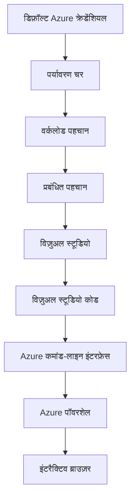

# AZD मूल बातें - Azure Developer CLI को समझना

# AZD मूल बातें - मुख्य अवधारणाएँ और बुनियादी बातें

**अध्याय नेविगेशन:**
- **📚 कोर्स होम**: [AZD For Beginners](../../README.md)
- **📖 वर्तमान अध्याय**: अध्याय 1 - आधार और त्वरित प्रारंभ
- **⬅️ पिछला**: [कोर्स अवलोकन](../../README.md#-chapter-1-foundation--quick-start)
- **➡️ अगला**: [स्थापना और सेटअप](installation.md)
- **🚀 अगला अध्याय**: [अध्याय 2: AI-प्रथम विकास](../chapter-02-ai-development/microsoft-foundry-integration.md)

## परिचय

यह पाठ आपको Azure Developer CLI (azd) से परिचित कराता है, एक शक्तिशाली कमांड-लाइन टूल जो स्थानीय विकास से Azure पर परिनियोजन तक आपकी यात्रा को तेज करता है। आप मूलभूत अवधारणाएँ, मुख्य विशेषताएँ सीखेंगे और समझेंगे कि azd क्लाउड-नेटिव एप्लिकेशन परिनियोजन को कैसे सरल बनाता है।

## सीखने के लक्ष्य

इस पाठ के अंत तक, आप:
- समझेंगे कि Azure Developer CLI क्या है और इसका मुख्य उद्देश्य क्या है
- टेम्पलेट्स, वातावरण, और सेवाओं की मूल अवधारणाएँ सीखेंगे
- टेम्पलेट-ड्राइवेन विकास और Infrastructure as Code सहित प्रमुख विशेषताओं का अन्वेषण करेंगे
- azd प्रोजेक्ट संरचना और वर्कफ़्लो को समझेंगे
- अपने विकास पर्यावरण के लिए azd को स्थापित और कॉन्फ़िगर करने के लिए तैयार होंगे

## सीखने के परिणाम

इस पाठ को पूरा करने के बाद, आप सक्षम होंगे:
- आधुनिक क्लाउड विकास वर्कफ़्लो में azd की भूमिका समझाने के लिए
- azd प्रोजेक्ट संरचना के घटकों की पहचान करने के लिए
- यह वर्णन करने के लिए कि टेम्पलेट, वातावरण, और सेवाएँ कैसे एक साथ काम करती हैं
- azd के साथ Infrastructure as Code के लाभों को समझने के लिए
- विभिन्न azd कमांड और उनके उद्देश्यों को पहचानने के लिए

## Azure Developer CLI (azd) क्या है?

Azure Developer CLI (azd) एक कमांड-लाइन टूल है जिसे स्थानीय विकास से Azure परिनियोजन तक आपकी यात्रा को तेज करने के लिए डिज़ाइन किया गया है। यह Azure पर क्लाउड-नेटिव एप्लिकेशन बनाने, परिनियोजित करने और प्रबंधित करने की प्रक्रिया को सरल बनाता है।

### आप azd के साथ क्या परिनियोजित कर सकते हैं?

azd कई प्रकार के वर्कलोड्स का समर्थन करता है—और सूची लगातार बढ़ती रहती है। आज, आप azd का उपयोग करके परिनियोजित कर सकते हैं:

| वर्कलोड प्रकार | उदाहरण | वही वर्कफ़्लो? |
|---------------|----------|----------------|
| **पारंपरिक एप्लिकेशन** | वेब ऐप्स, REST APIs, स्टैटिक साइट्स | ✅ `azd up` |
| **सेवाएँ और माइक्रोसर्विसेस** | Container Apps, Function Apps, मल्टी-सर्विस बैकएंड | ✅ `azd up` |
| **AI-सक्षम एप्लिकेशन** | Microsoft Foundry Models के साथ चैट ऐप्स, AI Search के साथ RAG समाधान | ✅ `azd up` |
| **इंटेलिजेंट एजेंट्स** | Foundry-होस्टेड एजेंट्स, मल्टी-एजेंट ऑर्केस्ट्रेशन | ✅ `azd up` |

मुख्य विचार यह है कि **azd का लाइफसाइकल वही रहता है चाहे आप कुछ भी परिनियोजित कर रहे हों**। आप एक प्रोजेक्ट इनिशियलाइज़ करते हैं, इन्फ्रास्ट्रक्चर प्रोविज़न करते हैं, अपना कोड परिनियोजित करते हैं, अपने ऐप की निगरानी करते हैं, और क्लीनअप करते हैं—चाहे वह एक साधारण वेबसाइट हो या एक परिष्कृत AI एजेंट।

यह निरंतरता डिज़ाइन के हिसाब से है। azd AI क्षमताओं को आपकी एप्लिकेशन द्वारा उपयोग की जाने वाली एक और सेवा के रूप में मानता है, न कि कुछ मौलिक रूप से अलग। Microsoft Foundry Models द्वारा बैक किए गए चैट एंडपॉइंट को azd के दृष्टिकोण से कॉन्फ़िगर और परिनियोजित करने के लिए बस एक और सेवा माना जाता है।

### 🎯 क्यों AZD का उपयोग करें? एक वास्तविक-दुनिया तुलना

आइए डेटाबेस के साथ एक साधारण वेब ऐप को परिनियोजित करने की तुलना करें:

#### ❌ AZD के बिना: मैन्युअल Azure परिनियोजन (30+ मिनट)

```bash
# चरण 1: संसाधन समूह बनाएं
az group create --name myapp-rg --location eastus

# चरण 2: ऐप सर्विस प्लान बनाएं
az appservice plan create --name myapp-plan \
  --resource-group myapp-rg \
  --sku B1 --is-linux

# चरण 3: वेब ऐप बनाएं
az webapp create --name myapp-web-unique123 \
  --resource-group myapp-rg \
  --plan myapp-plan \
  --runtime "NODE:18-lts"

# चरण 4: Cosmos DB खाता बनाएं (10-15 मिनट)
az cosmosdb create --name myapp-cosmos-unique123 \
  --resource-group myapp-rg \
  --kind MongoDB

# चरण 5: डेटाबेस बनाएं
az cosmosdb mongodb database create \
  --account-name myapp-cosmos-unique123 \
  --resource-group myapp-rg \
  --name tododb

# चरण 6: कलेक्शन बनाएं
az cosmosdb mongodb collection create \
  --account-name myapp-cosmos-unique123 \
  --resource-group myapp-rg \
  --database-name tododb \
  --name todos

# चरण 7: कनेक्शन स्ट्रिंग प्राप्त करें
CONN_STR=$(az cosmosdb keys list \
  --name myapp-cosmos-unique123 \
  --resource-group myapp-rg \
  --type connection-strings \
  --query "connectionStrings[0].connectionString" -o tsv)

# चरण 8: ऐप सेटिंग्स कॉन्फ़िगर करें
az webapp config appsettings set \
  --name myapp-web-unique123 \
  --resource-group myapp-rg \
  --settings MONGODB_URI="$CONN_STR"

# चरण 9: लॉगिंग सक्षम करें
az webapp log config --name myapp-web-unique123 \
  --resource-group myapp-rg \
  --application-logging filesystem \
  --detailed-error-messages true

# चरण 10: Application Insights सेट अप करें
az monitor app-insights component create \
  --app myapp-insights \
  --location eastus \
  --resource-group myapp-rg

# चरण 11: App Insights को वेब ऐप से लिंक करें
INSTRUMENTATION_KEY=$(az monitor app-insights component show \
  --app myapp-insights \
  --resource-group myapp-rg \
  --query "instrumentationKey" -o tsv)

az webapp config appsettings set \
  --name myapp-web-unique123 \
  --resource-group myapp-rg \
  --settings APPINSIGHTS_INSTRUMENTATIONKEY="$INSTRUMENTATION_KEY"

# चरण 12: स्थानीय रूप से एप्लिकेशन बिल्ड करें
npm install
npm run build

# चरण 13: डिप्लॉयमेंट पैकेज बनाएं
zip -r app.zip . -x "*.git*" "node_modules/*"

# चरण 14: एप्लिकेशन को डिप्लॉय करें
az webapp deployment source config-zip \
  --resource-group myapp-rg \
  --name myapp-web-unique123 \
  --src app.zip

# चरण 15: प्रतीक्षा करें और दुआ करें कि यह काम करे 🙏
# (कोई स्वचालित सत्यापन नहीं, मैन्युअल परीक्षण आवश्यक)
```

**समस्याएँ:**
- ❌ 15+ कमांड याद रखने और क्रम में निष्पादित करने के लिए
- ❌ 30-45 मिनट का मैन्युअल काम
- ❌ त्रुटियाँ करना आसान (टाइपो, गलत पैरामीटर)
- ❌ कनेक्शन स्ट्रिंग टर्मिनल इतिहास में उजागर हो सकती हैं
- ❌ अगर कुछ विफल होता है तो स्वचालित रोलबैक नहीं होता
- ❌ टीम सदस्य के लिए पुनरुत्पादित करना कठिन
- ❌ हर बार अलग (निरुपयोग्य)

#### ✅ AZD के साथ: स्वचालित परिनियोजन (5 कमांड, 10-15 मिनट)

```bash
# चरण 1: टेम्पलेट से आरम्भ करें
azd init --template todo-nodejs-mongo

# चरण 2: प्रमाणीकरण करें
azd auth login

# चरण 3: पर्यावरण बनाएँ
azd env new dev

# चरण 4: परिवर्तनों का पूर्वावलोकन (वैकल्पिक लेकिन अनुशंसित)
azd provision --preview

# चरण 5: सब कुछ तैनात करें
azd up

# ✨ हो गया! सब कुछ तैनात, कॉन्फ़िगर और मॉनिटर किया गया है
```

**लाभ:**
- ✅ **5 कमांड** बनाम 15+ मैन्युअल चरण
- ✅ **10-15 मिनट** कुल समय (अधिकतर Azure के इंतज़ार में)
- ✅ **जीरो त्रुटियाँ** - स्वचालित और परीक्षण किया हुआ
- ✅ **रहस्य सुरक्षित रूप से प्रबंधित** किए जाते हैं Key Vault के माध्यम से
- ✅ **विफलता पर स्वतः रोलबैक**
- ✅ **पूरी तरह से पुनरुत्पाद्य** - हर बार समान परिणाम
- ✅ **टीम-रेडी** - कोई भी एक ही कमांड्स के साथ परिनियोजित कर सकता है
- ✅ **Infrastructure as Code** - संस्करण नियंत्रित Bicep टेम्पलेट्स
- ✅ **बिल्ट-इन मॉनिटरिंग** - Application Insights स्वतः कॉन्फ़िगर

### 📊 समय और त्रुटि में कमी

| मैट्रिक | मैनुअल परिनियोजन | AZD परिनियोजन | सुधार |
|:-------|:------------------|:---------------|:------------|
| **कमांड्स** | 15+ | 5 | 67% कम |
| **समय** | 30-45 मिनट | 10-15 मिनट | 60% तेज़ |
| **त्रुटि दर** | ~40% | <5% | 88% कमी |
| **संगतता** | कम (मैन्युअल) | 100% (स्वचालित) | परफेक्ट |
| **टीम ऑनबोर्डिंग** | 2-4 घंटे | 30 मिनट | 75% तेज़ |
| **रोलबैक समय** | 30+ मिनट (मैन्युअल) | 2 मिनट (स्वचालित) | 93% तेज़ |

## मुख्य अवधारणाएँ

### टेम्पलेट्स
टेम्पलेट्स azd की नींव हैं। वे शामिल करते हैं:
- **एप्लिकेशन कोड** - आपका स्रोत कोड और निर्भरताएँ
- **इन्फ्रास्ट्रक्चर परिभाषाएँ** - Bicep या Terraform में परिभाषित Azure संसाधन
- **कॉन्फ़िगरेशन फ़ाइलें** - सेटिंग्स और परिवेश चर
- **डिप्लॉयमेंट स्क्रिप्ट्स** - स्वचालित परिनियोजन वर्कफ़्लो

### वातावरण
वातावरण अलग-अलग परिनियोजन लक्ष्यों का प्रतिनिधित्व करते हैं:
- **Development** - परीक्षण और विकास के लिए
- **Staging** - प्री-प्रोडक्शन वातावरण
- **Production** - लाइव प्रोडक्शन वातावरण

प्रत्येक वातावरण अपना अपना रखता है:
- Azure रिसोर्स ग्रुप
- कॉन्फ़िगरेशन सेटिंग्स
- परिनियोजन स्थिति

### सेवाएँ
सेवाएँ आपकी एप्लिकेशन के बिल्डिंग ब्लॉक्स हैं:
- **Frontend** - वेब एप्लिकेशन, SPAs
- **Backend** - APIs, माइक्रोसर्विसेस
- **Database** - डेटा स्टोरेज समाधान
- **Storage** - फ़ाइल और ब्लॉब स्टोरेज

## प्रमुख विशेषताएँ

### 1. टेम्पलेट-ड्राइवेन विकास
```bash
# उपलब्ध टेम्पलेट्स ब्राउज़ करें
azd template list

# एक टेम्पलेट से प्रारंभ करें
azd init --template <template-name>
```

### 2. Infrastructure as Code
- **Bicep** - Azure का डोमेन-विशेष भाषा
- **Terraform** - मल्टी-क्लाउड इन्फ्रास्ट्रक्चर टूल
- **ARM Templates** - Azure Resource Manager टेम्पलेट्स

### 3. एकीकृत वर्कफ़्लोज़
```bash
# पूर्ण तैनाती कार्यप्रवाह
azd up            # प्राविजन + तैनाती यह पहली बार सेटअप के लिए बिना हस्तक्षेप के है

# 🧪 नया: तैनाती से पहले बुनियादी ढांचे में होने वाले परिवर्तनों का पूर्वावलोकन (सुरक्षित)
azd provision --preview    # बिना किसी परिवर्तन के बुनियादी ढांचे की तैनाती का अनुकरण करें

azd provision     # यदि आप बुनियादी ढांचे को अपडेट कर रहे हैं तो Azure संसाधन बनाएँ, इसके लिए इसे इस्तेमाल करें
azd deploy        # एप्लिकेशन कोड तैनात करें या अपडेट के बाद कोड को पुनः तैनात करें
azd down          # संसाधनों की सफाई करें
```

#### 🛡️ प्रीव्यू के साथ सुरक्षित इन्फ्रास्ट्रक्चर प्लानिंग
`azd provision --preview` कमांड सुरक्षित परिनियोजन के लिए एक गेम-चेंजर है:
- **ड्राय-रन विश्लेषण** - दिखाता है कि क्या बनाया, संशोधित या हटाया जाएगा
- **जीरो जोखिम** - आपके Azure वातावरण में कोई वास्तविक परिवर्तन नहीं किए जाते
- **टीम सहयोग** - परिनियोजन से पहले प्रीव्यू परिणाम साझा करें
- **लागत का आकलन** - प्रतिबद्धता से पहले संसाधन लागत समझें

```bash
# उदाहरण पूर्वावलोकन कार्यप्रवाह
azd provision --preview           # देखें क्या बदलेगा
# आउटपुट की समीक्षा करें, टीम के साथ चर्चा करें
azd provision                     # आत्मविश्वास के साथ परिवर्तन लागू करें
```

### 📊 विज़ुअल: AZD विकास वर्कफ़्लो


**वर्कफ़्लो व्याख्या:**
1. **Init** - टेम्पलेट या नए प्रोजेक्ट के साथ शुरुआत करें
2. **Auth** - Azure के साथ प्रमाणीकरण करें
3. **Environment** - अलग-थलग परिनियोजन वातावरण बनाएं
4. **Preview** - 🆕 हमेशा पहले इन्फ्रास्ट्रक्चर परिवर्तनों का प्रीव्यू करें (सुरक्षित अभ्यास)
5. **Provision** - Azure संसाधन बनाएं/अपडेट करें
6. **Deploy** - अपना एप्लिकेशन कोड पुश करें
7. **Monitor** - एप्लिकेशन प्रदर्शन का निरीक्षण करें
8. **Iterate** - परिवर्तन करें और कोड पुनः परिनियोजित करें
9. **Cleanup** - जब पूरा हो जाए तो संसाधन हटा दें

### 4. Environment प्रबंधन
```bash
# पर्यावरण बनाएं और प्रबंधित करें
azd env new <environment-name>
azd env select <environment-name>
azd env list
```

### 5. एक्सटेंशन्स और AI कमांड्स

azd कोर CLI से परे क्षमताएँ जोड़ने के लिए एक एक्सटेंशन सिस्टम का उपयोग करता है। यह विशेष रूप से AI वर्कलोड्स के लिए उपयोगी है:

```bash
# उपलब्ध एक्सटेंशन सूचीबद्ध करें
azd extension list

# Foundry एजेंट्स एक्सटेंशन इंस्टॉल करें
azd extension install azure.ai.agents

# मैनिफेस्ट से एक एआई एजेंट परियोजना आरंभ करें
azd ai agent init -m agent-manifest.yaml

# एआई-सहायता प्राप्त विकास के लिए MCP सर्वर शुरू करें (अल्फा)
azd mcp start
```

> एक्सटेंशन्स का विस्तृत विवरण [अध्याय 2: AI-प्रथम विकास](../chapter-02-ai-development/agents.md) और [AZD AI CLI Commands](../chapter-08-production/production-ai-practices.md#azd-ai-cli-commands-and-extensions) संदर्भ में कवर किया गया है।

## 📁 प्रोजेक्ट संरचना

एक सामान्य azd प्रोजेक्ट संरचना:
```
my-app/
├── .azd/                    # azd configuration
│   └── config.json
├── .azure/                  # Azure deployment artifacts
├── .devcontainer/          # Development container config
├── .github/workflows/      # GitHub Actions
├── .vscode/               # VS Code settings
├── infra/                 # Infrastructure code
│   ├── main.bicep        # Main infrastructure template
│   ├── main.parameters.json
│   └── modules/          # Reusable modules
├── src/                  # Application source code
│   ├── api/             # Backend services
│   └── web/             # Frontend application
├── azure.yaml           # azd project configuration
└── README.md
```

## 🔧 कॉन्फ़िगरेशन फ़ाइलें

### azure.yaml
मुख्य प्रोजेक्ट कॉन्फ़िगरेशन फ़ाइल:
```yaml
name: my-awesome-app
metadata:
  template: my-template@1.0.0

services:
  web:
    project: ./src/web
    language: js
    host: appservice
  api:
    project: ./src/api
    language: js
    host: appservice

hooks:
  preprovision:
    shell: pwsh
    run: echo "Preparing to provision..."
```

### .azure/config.json
पर्यावरण-विशिष्ट कॉन्फ़िगरेशन:
```json
{
  "version": 1,
  "defaultEnvironment": "dev",
  "environments": {
    "dev": {
      "subscriptionId": "your-subscription-id",
      "location": "eastus"
    }
  }
}
```

## 🎪 सामान्य वर्कफ़्लोज़ के साथ हैंड्स-ऑन अभ्यास

> **💡 सीखने का सुझाव:** इन अभ्यासों का क्रमबद्ध पालन करें ताकि आप क्रमिक रूप से अपने AZD कौशल का निर्माण कर सकें।

### 🎯 अभ्यास 1: अपना पहला प्रोजेक्ट इनिशियलाइज़ करें

**लक्ष्य:** एक AZD प्रोजेक्ट बनाएं और उसकी संरचना का अन्वेषण करें

**चरण:**
```bash
# प्रमाणित टेम्पलेट का उपयोग करें
azd init --template todo-nodejs-mongo

# उत्पन्न फ़ाइलों का अन्वेषण करें
ls -la  # छिपी हुई फ़ाइलों सहित सभी फ़ाइलें देखें

# निर्मित प्रमुख फ़ाइलें:
# - azure.yaml (मुख्य कॉन्फ़िगरेशन)
# - infra/ (बुनियादी ढांचे का कोड)
# - src/ (अनुप्रयोग कोड)
```

**✅ सफलता:** आपके पास azure.yaml, infra/, और src/ निर्देशिकाएँ हैं

---

### 🎯 अभ्यास 2: Azure पर परिनियोजित करें

**लक्ष्य:** एंड-टू-एंड परिनियोजन पूरा करें

**चरण:**
```bash
# 1. प्रमाणीकरण करें
az login && azd auth login

# 2. पर्यावरण बनाएं
azd env new dev
azd env set AZURE_LOCATION eastus

# 3. परिवर्तनों का पूर्वावलोकन (अनुशंसित)
azd provision --preview

# 4. सब कुछ तैनात करें
azd up

# 5. तैनाती सत्यापित करें
azd show    # अपने ऐप का URL देखें
```

**अनुमानित समय:** 10-15 मिनट  
**✅ सफलता:** एप्लिकेशन URL ब्राउज़र में खुलता है

---

### 🎯 अभ्यास 3: कई वातावरण

**लक्ष्य:** dev और staging पर परिनियोजित करें

**चरण:**
```bash
# पहले से dev मौजूद है, staging बनाएं
azd env new staging
azd env set AZURE_LOCATION westus2
azd up

# इनके बीच स्विच करें
azd env list
azd env select dev
```

**✅ सफलता:** Azure पोर्टल में दो अलग रिसोर्स ग्रुप्स

---

### 🛡️ क्लीन स्लेट: `azd down --force --purge`

जब आपको पूरी तरह से रीसेट करने की ज़रूरत हो:

```bash
azd down --force --purge
```

**यह क्या करता है:**
- `--force`: कोई पुष्टिकरण प्रॉम्प्ट नहीं
- `--purge`: सभी स्थानीय स्थिति और Azure संसाधनों को हटाता है

**कब उपयोग करें:**
- परिनियोजन बीच में विफल हो गया
- प्रोजेक्ट बदल रहे हों
- ताज़ा शुरुआत चाहिए

---

## 🎪 मूल वर्कफ़्लो संदर्भ

### नया प्रोजेक्ट शुरू करना
```bash
# Method 1: मौजूदा टेम्पलेट का उपयोग करें
azd init --template todo-nodejs-mongo

# Method 2: बिलकुल नए सिरे से शुरू करें
azd init

# Method 3: वर्तमान निर्देशिका का उपयोग करें
azd init .
```

### विकास चक्र
```bash
# विकास वातावरण सेट करें
azd auth login
azd env new dev
azd env select dev

# सब कुछ तैनात करें
azd up

# बदलाव करें और पुनः तैनात करें
azd deploy

# समाप्त होने पर साफ़ करें
azd down --force --purge # Azure Developer CLI में कमांड आपके परिवेश के लिए एक **कठोर रीसेट** है—विशेष रूप से उपयोगी जब आप विफल तैनातियों का निवारण कर रहे हों, परित्यक्त संसाधनों को साफ़ कर रहे हों, या नई पुनःतैनाती की तैयारी कर रहे हों।
```

## `azd down --force --purge` को समझना
`azd down --force --purge` कमांड आपके azd वातावरण और सभी संबंधित संसाधनों को पूरी तरह से हटाने का एक शक्तिशाली तरीका है। यहां प्रत्येक फ़्लैग क्या करता है उसका ब्रेकडाउन है:
```
--force
```
- पुष्टि प्रॉम्प्ट को छोड़ देता है।
- स्वचालन या स्क्रिप्टिंग के लिए उपयोगी जहाँ मैन्युअल इनपुट संभव नहीं है।
- यह सुनिश्चित करता है कि अगर CLI असंगतियाँ पहचानता है तब भी teardown बिना रुकावट के जारी रहे।

```
--purge
```
सभी **सम्बन्धित मेटाडेटा** को हटाता है, जिनमें शामिल हैं:
Environment state
Local `.azure` folder
Cached deployment info
azd को पिछले परिनियोजनों को "याद" करने से रोकता है, जो mismatched रिसोर्स ग्रुप्स या stale रजिस्ट्री रेफ़रेंस जैसे मुद्दे पैदा कर सकते हैं।

### दोनों का उपयोग क्यों करें?
जब आपने lingering state या आंशिक परिनियोजनों के कारण `azd up` के साथ दिक्कत का सामना किया है, तो यह संयोजन एक **साफ़ शुरुआत** सुनिश्चित करता है।

यह विशेष रूप से उपयोगी होता है जब आपने Azure पोर्टल में मैन्युअल रूप से संसाधन हटा दिए हों या जब टेम्पलेट, वातावरण, या रिसोर्स ग्रुप नामकरण सम्मेलन बदल रहे हों।

### कई वातावरण का प्रबंधन
```bash
# स्टेजिंग वातावरण बनाएं
azd env new staging
azd env select staging
azd up

# देव पर वापस स्विच करें
azd env select dev

# पर्यावरणों की तुलना करें
azd env list
```

## 🔐 प्रमाणीकरण और क्रेडेंशियल्स

प्रमाणीकरण को समझना सफल azd परिनियोजनों के लिए महत्वपूर्ण है। Azure कई प्रमाणीकरण विधियों का उपयोग करता है, और azd अन्य Azure टूल्स द्वारा उपयोग किए जाने वाले वही क्रेडेंशियल चेन का उपयोग करता है।

### Azure CLI प्रमाणीकरण (`az login`)

azd का उपयोग करने से पहले, आपको Azure के साथ प्रमाणीकरण करने की आवश्यकता होती है। सबसे सामान्य विधि Azure CLI का उपयोग करना है:

```bash
# इंटरैक्टिव लॉगिन (ब्राउज़र खोलता है)
az login

# विशिष्ट टेनेंट के साथ लॉगिन
az login --tenant <tenant-id>

# सर्विस प्रिंसिपल के साथ लॉगिन
az login --service-principal -u <app-id> -p <password> --tenant <tenant-id>

# वर्तमान लॉगिन स्थिति जांचें
az account show

# उपलब्ध सब्सक्रिप्शन सूचीबद्ध करें
az account list --output table

# डिफ़ॉल्ट सब्सक्रिप्शन सेट करें
az account set --subscription <subscription-id>
```

### प्रमाणीकरण प्रवाह
1. **Interactive Login**: प्रमाणीकरण के लिए आपका डिफ़ॉल्ट ब्राउज़र खोलता है
2. **Device Code Flow**: उन वातावरणों के लिए जहाँ ब्राउज़र पहुँच नहीं है
3. **Service Principal**: स्वचालन और CI/CD परिदृश्यों के लिए
4. **Managed Identity**: Azure-होस्टेड एप्लिकेशन के लिए

### DefaultAzureCredential Chain

`DefaultAzureCredential` एक क्रेडेंशियल प्रकार है जो स्वतः ही एक विशिष्ट क्रम में कई क्रेडेंशियल स्रोतों को आज़माकर सरलीकृत प्रमाणीकरण अनुभव प्रदान करता है:

#### क्रेडेंशियल चेन क्रम

#### 1. Environment Variables
```bash
# सर्विस प्रिंसिपल के लिए पर्यावरण चर सेट करें
export AZURE_CLIENT_ID="<app-id>"
export AZURE_CLIENT_SECRET="<password>"
export AZURE_TENANT_ID="<tenant-id>"
```

#### 2. Workload Identity (Kubernetes/GitHub Actions)
स्वतः उपयोग किया जाता है:
- Azure Kubernetes Service (AKS) with Workload Identity
- GitHub Actions with OIDC federation
- अन्य फ़ेडरेटेड आईडेंटिटी परिदृश्य

#### 3. Managed Identity
Azure संसाधनों के लिए जैसे:
- Virtual Machines
- App Service
- Azure Functions
- Container Instances

```bash
# जांचें कि क्या यह मेनेज्ड आइडेंटिटी वाले Azure संसाधन पर चल रहा है
az account show --query "user.type" --output tsv
# लौटाता है: "servicePrincipal" यदि मेनेज्ड आइडेंटिटी का उपयोग कर रहा है
```

#### 4. डेवलपर टूल्स एकीकरण
- **Visual Studio**: स्वतः साइन-इन किए गए खाते का उपयोग करता है
- **VS Code**: Azure Account एक्सटेंशन क्रेडेंशियल्स का उपयोग करता है
- **Azure CLI**: `az login` क्रेडेंशियल्स का उपयोग करता है (स्थानीय विकास के लिए सबसे सामान्य)

### AZD प्रमाणीकरण सेटअप

```bash
# विधि 1: Azure CLI का उपयोग करें (विकास के लिए अनुशंसित)
az login
azd auth login  # मौजूदा Azure CLI प्रमाणपत्रों का उपयोग करता है

# विधि 2: प्रत्यक्ष azd प्रमाणीकरण
azd auth login --use-device-code  # हेडलैस वातावरणों के लिए

# विधि 3: प्रमाणीकरण की स्थिति जांचें
azd auth login --check-status

# विधि 4: लॉगआउट और पुनः प्रमाणीकरण करें
azd auth logout
azd auth login
```

### प्रमाणीकरण सर्वोत्तम अभ्यास

#### स्थानीय विकास के लिए
```bash
# 1. Azure CLI के साथ लॉगिन करें
az login

# 2. सही सब्सक्रिप्शन सत्यापित करें
az account show
az account set --subscription "Your Subscription Name"

# 3. मौजूदा प्रमाण-पत्रों के साथ azd का उपयोग करें
azd auth login
```

#### CI/CD पाइपलाइनों के लिए
```yaml
# GitHub Actions example
- name: Azure Login
  uses: azure/login@v1
  with:
    creds: ${{ secrets.AZURE_CREDENTIALS }}

- name: Deploy with azd
  run: |
    azd auth login --client-id ${{ secrets.AZURE_CLIENT_ID }} \
                    --client-secret ${{ secrets.AZURE_CLIENT_SECRET }} \
                    --tenant-id ${{ secrets.AZURE_TENANT_ID }}
    azd up --no-prompt
```

#### प्रोडक्शन वातावरण के लिए
- जब Azure संसाधनों पर चल रहा हो तो **Managed Identity** का उपयोग करें
- स्वचालन परिदृश्यों के लिए **Service Principal** का उपयोग करें
- क्रेडेंशियल्स को कोड या कॉन्फ़िगरेशन फ़ाइलों में स्टोर करने से बचें
- संवेदनशील कॉन्फ़िगरेशन के लिए **Azure Key Vault** का उपयोग करें

### सामान्य प्रमाणीकरण समस्याएँ और समाधान

#### समस्या: "No subscription found"
```bash
# समाधान: डिफ़ॉल्ट सदस्यता सेट करें
az account list --output table
az account set --subscription "<subscription-id>"
azd env set AZURE_SUBSCRIPTION_ID "<subscription-id>"
```

#### समस्या: "Insufficient permissions"
```bash
# समाधान: आवश्यक भूमिकाओं की जाँच करें और उन्हें असाइन करें
az role assignment list --assignee $(az account show --query user.name --output tsv)

# सामान्य आवश्यक भूमिकाएँ:
# - Contributor (संसाधन प्रबंधन के लिए)
# - User Access Administrator (भूमिका सौंपने के लिए)
```

#### समस्या: "Token expired"
```bash
# समाधान: पुनः प्रमाणीकरण करें
az logout
az login
azd auth logout
azd auth login
```

### विभिन्न परिदृश्यों में प्रमाणीकरण

#### स्थानीय विकास
```bash
# व्यक्तिगत विकास खाता
az login
azd auth login
```

#### टीम विकास
```bash
# संगठन के लिए विशिष्ट टेनेंट का उपयोग करें
az login --tenant contoso.onmicrosoft.com
azd auth login
```

#### मल्टी-टेनेट परिदृश्य
```bash
# टेनेंट्स के बीच स्विच करें
az login --tenant tenant1.onmicrosoft.com
# टेनेंट 1 पर तैनात करें
azd up

az login --tenant tenant2.onmicrosoft.com  
# टेनेंट 2 पर तैनात करें
azd up
```

### सुरक्षा विचार
1. **क्रेडेंशियल स्टोरेज**: कभी भी क्रेडेंशियल्स को स्रोत कोड में संग्रहीत न करें
2. **स्कोप सीमितीकरण**: सेवा प्रिंसिपल्स के लिए न्यूनतम-अधिकार सिद्धांत का प्रयोग करें
3. **टोकन रोटेशन**: नियमित रूप से सेवा प्रिंसिपल के सीक्रेट्स को रोटेट करें
4. **ऑडिट ट्रेल**: प्रमाणीकरण और परिनियोजन गतिविधियों की निगरानी करें
5. **नेटवर्क सुरक्षा**: जब संभव हो तो प्राइवेट एंडपॉइंट्स का उपयोग करें

### प्रमाणीकरण समस्या निवारण

```bash
# प्रमाणीकरण समस्याओं को डिबग करें
azd auth login --check-status
az account show
az account get-access-token

# सामान्य डायग्नोस्टिक कमांड
whoami                          # वर्तमान उपयोगकर्ता संदर्भ
az ad signed-in-user show      # Azure AD उपयोगकर्ता विवरण
az group list                  # संसाधन पहुँच का परीक्षण करें
```

## `azd down --force --purge` को समझना

### खोज
```bash
azd template list              # टेम्पलेट ब्राउज़ करें
azd template show <template>   # टेम्पलेट विवरण
azd init --help               # प्रारंभिक विकल्प
```

### परियोजना प्रबंधन
```bash
azd show                     # परियोजना का अवलोकन
azd env show                 # वर्तमान वातावरण
azd config list             # कॉन्फ़िगरेशन सेटिंग्स
```

### निगरानी
```bash
azd monitor                  # Azure पोर्टल की मॉनिटरिंग खोलें
azd monitor --logs           # एप्लिकेशन लॉग्स देखें
azd monitor --live           # लाइव मीट्रिक्स देखें
azd pipeline config          # CI/CD सेट करें
```

## सर्वोत्तम प्रथाएँ

### 1. अर्थपूर्ण नामों का उपयोग करें
```bash
# अच्छा
azd env new production-east
azd init --template web-app-secure

# टालें
azd env new env1
azd init --template template1
```

### 2. टेम्पलेट्स का उपयोग करें
- मौजूदा टेम्पलेट्स से शुरू करें
- अपनी आवश्यकताओं के अनुसार अनुकूलित करें
- अपने संगठन के लिए पुन: उपयोग योग्य टेम्पलेट बनाएं

### 3. पर्यावरण अलगाव
- dev/staging/prod के लिए अलग-अलग पर्यावरण का उपयोग करें
- स्थानीय मशीन से सीधे प्रोडक्शन में कभी डिप्लॉय न करें
- प्रोडक्शन डिप्लॉयमेंट्स के लिए CI/CD पाइपलाइन्स का उपयोग करें

### 4. कॉन्फ़िगरेशन प्रबंधन
- संवेदनशील डेटा के लिए एनवायरनमेंट वेरिएबल्स का उपयोग करें
- कॉन्फ़िगरेशन को वर्शन कंट्रोल में रखें
- पर्यावरण-विशिष्ट सेटिंग्स का दस्तावेज़ बनाएँ

## सीखने की प्रगति

### शुरुआती (सप्ताह 1-2)
1. azd इंस्टॉल करें और प्रमाणीकरण करें
2. एक सरल टेम्पलेट डिप्लॉय करें
3. प्रोजेक्ट संरचना को समझें
4. बुनियादी कमांड्स सीखें (up, down, deploy)

### मध्यवर्ती (सप्ताह 3-4)
1. टेम्पलेट अनुकूलित करें
2. कई एनवायरनमेंट्स का प्रबंधन करें
3. इन्फ्रास्ट्रक्चर कोड को समझें
4. CI/CD पाइपलाइन्स सेटअप करें

### उन्नत (सप्ताह 5+)
1. कस्टम टेम्पलेट बनाएं
2. उन्नत इन्फ्रास्ट्रक्चर पैटर्न
3. मल्टी-रीजन डिप्लॉयमेंट्स
4. एंटरप्राइज़-ग्रेड कॉन्फ़िगरेशन

## अगले कदम

**📖 अध्याय 1 सीखना जारी रखें:**
- [स्थापना और सेटअप](installation.md) - azd स्थापित और कॉन्फ़िगर करें
- [आपका पहला प्रोजेक्ट](first-project.md) - व्यावहारिक ट्यूटोरियल पूरा करें
- [कॉन्फ़िगरेशन गाइड](configuration.md) - उन्नत कॉन्फ़िगरेशन विकल्प

**🎯 अगले अध्याय के लिए तैयार?**
- [अध्याय 2: AI-प्रथम विकास](../chapter-02-ai-development/microsoft-foundry-integration.md) - AI अनुप्रयोग बनाना शुरू करें

## अतिरिक्त संसाधन

- [Azure Developer CLI अवलोकन](https://learn.microsoft.com/en-us/azure/developer/azure-developer-cli/)
- [टेम्पलेट गैलरी](https://azure.github.io/awesome-azd/)
- [समुदाय सैंपल्स](https://github.com/Azure-Samples)

---

## 🙋 अक्सर पूछे जाने वाले प्रश्न

### सामान्य प्रश्न

**प्रश्न: AZD और Azure CLI में क्या अंतर है?**

उत्तर: Azure CLI (`az`) व्यक्तिगत Azure संसाधनों का प्रबंधन करने के लिए है। AZD (`azd`) पूरे एप्लिकेशनों का प्रबंधन करने के लिए है:

```bash
# Azure CLI - निम्न-स्तरीय संसाधन प्रबंधन
az webapp create --name myapp --resource-group rg
az sql server create --name myserver --resource-group rg
# ...कई और कमांडों की आवश्यकता है

# AZD - एप्लिकेशन-स्तरीय प्रबंधन
azd up  # पूरे ऐप को सभी संसाधनों के साथ तैनात करता है
```

**इसे इस तरह सोचें:**
- `az` = व्यक्तिगत लेगो ईंटों पर काम करना
- `azd` = पूरे लेगो सेट के साथ काम करना

---

**प्रश्न: AZD उपयोग करने के लिए क्या मुझे Bicep या Terraform जानना आवश्यक है?**

उत्तर: नहीं! टेम्पलेट्स से शुरू करें:
```bash
# मौजूदा टेम्पलेट का उपयोग करें - IaC ज्ञान की आवश्यकता नहीं
azd init --template todo-nodejs-mongo
azd up
```

आप बाद में इन्फ्रास्ट्रक्चर को अनुकूलित करने के लिए Bicep सीख सकते हैं। टेम्पलेट्स सीखने के लिए कार्यशील उदाहरण प्रदान करते हैं।

---

**प्रश्न: AZD टेम्पलेट्स चलाने की लागत कितनी है?**

उत्तर: लागत टेम्पलेट के अनुसार भिन्न होती है। अधिकांश विकास टेम्पलेट्स की लागत $50-150/माह होती है:

```bash
# तैनात करने से पहले लागत का पूर्वावलोकन करें
azd provision --preview

# उपयोग में न होने पर हमेशा संसाधनों की सफाई करें
azd down --force --purge  # सभी संसाधनों को हटाता है
```

**प्रो टिप:** जहाँ उपलब्ध हो मुफ्त टियर्स का उपयोग करें:
- App Service: F1 (Free) tier
- Microsoft Foundry Models: Azure OpenAI 50,000 tokens/माह मुफ्त
- Cosmos DB: 1000 RU/s मुफ्त टियर

---

**प्रश्न: क्या मैं मौजूदा Azure संसाधनों के साथ AZD का उपयोग कर सकता हूँ?**

उत्तर: हाँ, लेकिन नया प्रोजेक्ट शुरू करना आसान होता है। AZD तब सबसे अच्छा काम करता है जब यह पूरे जीवनचक्र का प्रबंधन करता है। मौजूदा संसाधनों के लिए:
```bash
# विकल्प 1: मौजूदा संसाधनों को आयात करें (उन्नत)
azd init
# फिर infra/ को मौजूदा संसाधनों का संदर्भ देने के लिए संशोधित करें

# विकल्प 2: नया प्रारंभ करें (अनुशंसित)
azd init --template matching-your-stack
azd up  # नया वातावरण बनाता है
```

---

**प्रश्न: मैं अपनी परियोजना teammates के साथ कैसे साझा करूँ?**

उत्तर: AZD प्रोजेक्ट को Git में कमिट करें (परंतु .azure फ़ोल्डर को नहीं):
```bash
# डिफ़ॉल्ट रूप से पहले से ही .gitignore में है
.azure/        # गोपनीय जानकारी और पर्यावरण डेटा शामिल हैं
*.env          # पर्यावरण चर

# उस समय के टीम सदस्य:
git clone <your-repo>
azd auth login
azd env new <their-name>-dev
azd up
```

सभी को समान टेम्पलेट्स से एक समान इन्फ्रास्ट्रक्चर मिलता है।

---

### समस्या निवारण प्रश्न

**प्रश्न: "azd up" आधा फेल हो गया। मैं क्या करूँ?**

उत्तर: त्रुटि देखें, उसे ठीक करें, फिर पुन: प्रयास करें:
```bash
# विस्तृत लॉग देखें
azd show

# सामान्य सुधार:

# 1. यदि कोटा पार हो:
azd env set AZURE_LOCATION "westus2"  # अलग क्षेत्र आज़माएँ

# 2. यदि संसाधन नाम टकराव हो:
azd down --force --purge  # साफ़ शुरुआत करें
azd up  # पुनः प्रयास करें

# 3. यदि प्रमाणीकरण की अवधि समाप्त हो:
az login
azd auth login
azd up
```

**सबसे सामान्य समस्या:** गलत Azure सब्सक्रिप्शन चुना गया
```bash
az account list --output table
az account set --subscription "<correct-subscription>"
```

---

**प्रश्न: मैं केवल कोड परिवर्तन कैसे डिप्लॉय करूं बिना पुनः प्राविजन किए?**

उत्तर: `azd up` की बजाय `azd deploy` का उपयोग करें:
```bash
azd up          # पहली बार: संसाधन तैयार करना और तैनाती (धीमा)

# कोड में परिवर्तन करें...

azd deploy      # आगामी बार: केवल तैनाती (तेज़)
```

गति तुलना:
- `azd up`: 10-15 minutes (इन्फ्रास्ट्रक्चर प्रोविजन करता है)
- `azd deploy`: 2-5 minutes (केवल कोड)

---

**प्रश्न: क्या मैं इन्फ्रास्ट्रक्चर टेम्पलेट्स को अनुकूलित कर सकता हूँ?**

उत्तर: हाँ! `infra/` में Bicep फ़ाइलों को एडिट करें:
```bash
# azd init के बाद
cd infra/
code main.bicep  # VS Code में संपादित करें

# परिवर्तनों का पूर्वावलोकन करें
azd provision --preview

# परिवर्तनों को लागू करें
azd provision
```

**टिप:** छोटे से शुरू करें - पहले SKUs बदलें:
```bicep
// infra/main.bicep
sku: {
  name: 'B1'  // Change to 'P1V2' for production
}
```

---

**प्रश्न: मैं AZD द्वारा बनाई गई सभी चीज़ें कैसे डिलीट करूँ?**

उत्तर: एक कमांड सभी संसाधनों को हटा देती है:
```bash
azd down --force --purge

# यह हटाता है:
# - सभी Azure संसाधन
# - संसाधन समूह
# - स्थानीय पर्यावरण स्थिति
# - कैश किए गए परिनियोजन डेटा
```

**इसे हमेशा तब चलाएँ जब:**
- किसी टेम्पलेट का परीक्षण पूरा हो गया हो
- किसी अलग प्रोजेक्ट पर स्विच कर रहे हों
- नया आरम्भ करना चाहते हों

**लागत बचत:** अप्रयुक्त संसाधनों को हटाने से $0 शुल्क

---

**प्रश्न: अगर मैंने गलती से Azure Portal में संसाधन हटा दिए तो क्या करें?**

उत्तर: AZD की स्थिति असमंजस में आ सकती है। साफ़ शुरुआत का दृष्टिकोण:
```bash
# 1. स्थानीय स्थिति हटाएं
azd down --force --purge

# 2. नई शुरुआत करें
azd up

# विकल्प: AZD को पता लगाने और ठीक करने दें
azd provision  # लापता संसाधन बनाएगा
```

---

### उन्नत प्रश्न

**प्रश्न: क्या मैं CI/CD पाइपलाइन्स में AZD का उपयोग कर सकता हूँ?**

उत्तर: हाँ! GitHub Actions उदाहरण:
```yaml
# .github/workflows/deploy.yml
name: Deploy with AZD

on:
  push:
    branches: [main]

jobs:
  deploy:
    runs-on: ubuntu-latest
    steps:
      - uses: actions/checkout@v2
      
      - name: Install azd
        run: curl -fsSL https://aka.ms/install-azd.sh | bash
      
      - name: Azure Login
        run: |
          azd auth login \
            --client-id ${{ secrets.AZURE_CLIENT_ID }} \
            --client-secret ${{ secrets.AZURE_CLIENT_SECRET }} \
            --tenant-id ${{ secrets.AZURE_TENANT_ID }}
      
      - name: Deploy
        run: azd up --no-prompt
```

---

**प्रश्न: मैं सीक्रेट्स और संवेदनशील डेटा कैसे संभालूँ?**

उत्तर: AZD स्वचालित रूप से Azure Key Vault के साथ एकीकृत होता है:
```bash
# गुप्त जानकारी कोड में नहीं, बल्कि Key Vault में संग्रहीत होती है
azd env set DATABASE_PASSWORD "$(openssl rand -base64 32)"

# AZD स्वचालित रूप से:
# 1. Key Vault बनाता है
# 2. गुप्त जानकारी संग्रहीत करता है
# 3. Managed Identity के माध्यम से ऐप को पहुँच प्रदान करता है
# 4. रनटाइम पर इंजेक्ट करता है
```

**कभी कमिट न करें:**
- `.azure/` फ़ोल्डर (पर्यावरण डेटा शामिल है)
- `.env` फ़ाइलें (स्थानीय सीक्रेट्स)
- कनेक्शन स्ट्रिंग्स

---

**प्रश्न: क्या मैं कई रीजन पर डिप्लॉय कर सकता हूँ?**

उत्तर: हाँ, प्रत्येक रीजन के लिए एनवायरनमेंट बनाएं:
```bash
# पूर्वी यूएस पर्यावरण
azd env new prod-eastus
azd env set AZURE_LOCATION eastus
azd up

# पश्चिमी यूरोप पर्यावरण
azd env new prod-westeurope
azd env set AZURE_LOCATION westeurope
azd up

# प्रत्येक पर्यावरण स्वतंत्र है
azd env list
```

सच्चे मल्टी-रीजन ऐप्स के लिए, एक साथ कई रीजन में डिप्लॉय करने हेतु Bicep टेम्पलेट्स को अनुकूलित करें।

---

**प्रश्न: यदि मैं फंस जाऊँ तो मदद कहाँ ले सकता हूँ?**

1. **AZD दस्तावेज़:** https://learn.microsoft.com/azure/developer/azure-developer-cli/
2. **GitHub इश्यूज़:** https://github.com/Azure/azure-dev/issues
3. **Discord:** [Azure Discord](https://discord.gg/microsoft-azure) - #azure-developer-cli चैनल
4. **Stack Overflow:** टैग `azure-developer-cli`
5. **यह कोर्स:** [समस्या निवारण गाइड](../chapter-07-troubleshooting/common-issues.md)

**प्रो टिप:** पूछने से पहले, चलाएँ:
```bash
azd show       # वर्तमान स्थिति दिखाता है
azd version    # आपका संस्करण दिखाता है
```
तेज़ मदद के लिए अपने प्रश्न में इस जानकारी को शामिल करें।

---

## 🎓 आगे क्या है?

अब आप AZD के मूल सिद्धान्त समझते हैं। अपनी राह चुनें:

### 🎯 शुरुआती के लिए:
1. **अगला:** [स्थापना और सेटअप](installation.md) - अपने मशीन पर AZD इंस्टॉल करें
2. **फिर:** [आपका पहला प्रोजेक्ट](first-project.md) - अपना पहला ऐप तैनात करें
3. **प्रैक्टिस:** इस पाठ के सभी 3 अभ्यास पूरा करें

### 🚀 AI डेवलपर्स के लिए:
1. **सीधा जाएँ:** [अध्याय 2: AI-प्रथम विकास](../chapter-02-ai-development/microsoft-foundry-integration.md)
2. **डिप्लॉय:** `azd init --template get-started-with-ai-chat` से शुरू करें
3. **सीखें:** बनाते हुए सीखें

### 🏗️ अनुभवी डेवलपर्स के लिए:
1. **समीक्षा करें:** [कॉन्फ़िगरेशन गाइड](configuration.md) - उन्नत सेटिंग्स
2. **अन्वेषण करें:** [Infrastructure as Code](../chapter-04-infrastructure/provisioning.md) - Bicep गहराई से
3. **बनाएं:** अपनी स्टैक के लिए कस्टम टेम्पलेट बनाएं

---

**चैप्टर नेविगेशन:**
- **📚 कोर्स होम**: [AZD For Beginners](../../README.md)
- **📖 वर्तमान अध्याय**: अध्याय 1 - आधार और त्वरित आरम्भ  
- **⬅️ पिछला**: [कोर्स अवलोकन](../../README.md#-chapter-1-foundation--quick-start)
- **➡️ अगले**: [स्थापना और सेटअप](installation.md)
- **🚀 अगला अध्याय**: [अध्याय 2: AI-प्रथम विकास](../chapter-02-ai-development/microsoft-foundry-integration.md)

---

<!-- CO-OP TRANSLATOR DISCLAIMER START -->
**अस्वीकरण**:
यह दस्तावेज़ AI अनुवाद सेवा [Co-op Translator](https://github.com/Azure/co-op-translator) का उपयोग करके अनुवादित किया गया है। हम सटीकता के लिए प्रयास करते हैं, पर कृपया ध्यान दें कि स्वचालित अनुवादों में त्रुटियाँ या अशुद्धियाँ हो सकती हैं। मूल दस्तावेज़ अपनी मूल भाषा में आधिकारिक स्रोत माना जाना चाहिए। महत्वपूर्ण जानकारी के लिए, पेशेवर मानव अनुवाद की सिफारिश की जाती है। हम इस अनुवाद के उपयोग से उत्पन्न किसी भी गलतफहमी या गलत व्याख्या के लिए उत्तरदायी नहीं हैं।
<!-- CO-OP TRANSLATOR DISCLAIMER END -->