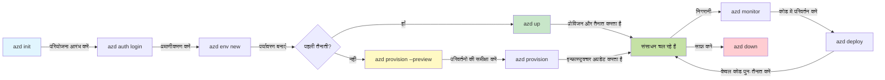
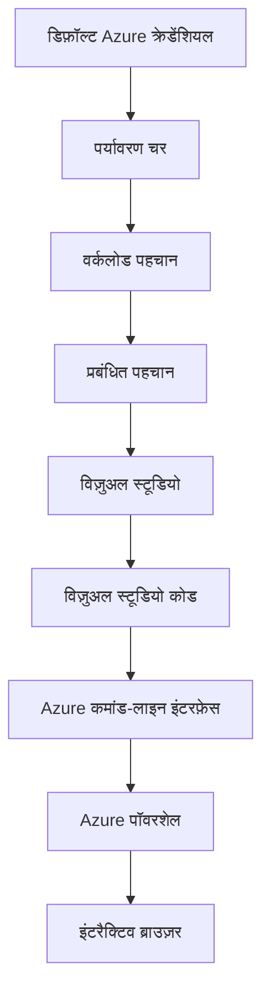

# AZD Basics - Understanding Azure Developer CLI

# AZD Basics - Core Concepts and Fundamentals

**Chapter Navigation:**
- **📚 Course Home**: [AZD For Beginners](../../README.md)
- **📖 Current Chapter**: Chapter 1 - Foundation & Quick Start
- **⬅️ Previous**: [Course Overview](../../README.md#-chapter-1-foundation--quick-start)
- **➡️ Next**: [Installation & Setup](installation.md)
- **🚀 Next Chapter**: [Chapter 2: AI-First Development](../chapter-02-ai-development/microsoft-foundry-integration.md)

## Introduction

यह पाठ आपको Azure Developer CLI (azd) से परिचित कराता है, एक शक्तिशाली कमांड-लाइन टूल जो आपकी स्थानीय विकास से Azure पर डिप्लॉयमेंट की यात्रा को तेज़ बनाता है। आप बुनियादी अवधारणाएँ, मुख्य विशेषताएँ सीखेंगे, और समझेंगे कि azd क्लाउड-नेटिव एप्लिकेशन डिप्लॉयमेंट को कैसे साधारण बनाता है।

## Learning Goals

इस पाठ के अंत तक, आप:
- समझेंगे कि Azure Developer CLI क्या है और इसका प्रमुख उद्देश्य क्या है
- टेम्पलेट्स, एन्वायरनमेंट्स, और सेवाओं की मूल अवधारणाएँ सीखेंगे
- टेम्पलेट-ड्रिवन विकास और Infrastructure as Code सहित प्रमुख विशेषताओं का अन्वेषण करेंगे
- azd प्रोजेक्ट संरचना और वर्कफ़्लो को समझेंगे
- अपने विकास पर्यावरण के लिए azd को इंस्टॉल और कॉन्फ़िगर करने के लिए तैयार होंगे

## Learning Outcomes

इस पाठ को पूरा करने के बाद, आप सक्षम होंगे:
- आधुनिक क्लाउड विकास वर्कफ़्लोज़ में azd की भूमिका समझाने के लिए
- azd प्रोजेक्ट संरचना के घटकों की पहचान करने के लिए
- समझाने के लिए कि टेम्पलेट्स, एन्वायरनमेंट्स, और सेवाएँ कैसे एक साथ काम करती हैं
- azd के साथ Infrastructure as Code के फायदों को समझने के लिए
- विभिन्न azd कमांड्स और उनके प्रयोजनों को पहचानने के लिए

## What is Azure Developer CLI (azd)?

Azure Developer CLI (azd) एक कमांड-लाइन टूल है जिसे आपकी स्थानीय विकास से Azure पर डिप्लॉयमेंट की यात्रा को तेज़ करने के लिए डिज़ाइन किया गया है। यह Azure पर क्लाउड-नेटिव एप्लिकेशन बनाने, डिप्लॉय करने, और प्रबंधित करने की प्रक्रिया को सरल बनाता है।

### What Can You Deploy with azd?

azd कई प्रकार के वर्कलोड्स का समर्थन करता है—और यह सूची लगातार बढ़ रही है। आज आप azd का उपयोग करके निम्न डिप्लॉय कर सकते हैं:

| Workload Type | Examples | Same Workflow? |
|---------------|----------|----------------|
| **Traditional applications** | Web apps, REST APIs, static sites | ✅ `azd up` |
| **Services and microservices** | Container Apps, Function Apps, multi-service backends | ✅ `azd up` |
| **AI-powered applications** | Chat apps with Microsoft Foundry Models, RAG solutions with AI Search | ✅ `azd up` |
| **Intelligent agents** | Foundry-hosted agents, multi-agent orchestrations | ✅ `azd up` |

मुख्य बात यह है कि **azd का लाइफसाइकल इस बात पर निर्भर नहीं करता कि आप क्या डिप्लॉय कर रहे हैं**। आप एक प्रोजेक्ट इनिशियलाइज़ करते हैं, इन्फ्रास्ट्रक्चर प्रोविजन करते हैं, अपना कोड डिप्लॉय करते हैं, अपने ऐप की निगरानी करते हैं, और क्लीनअप करते हैं—चाहे वह एक साधारण वेबसाइट हो या एक जटिल AI एजेंट।

यह निरंतरता जानबूझकर है। azd AI क्षमताओं को आपकी एप्लिकेशन द्वारा उपयोग की जाने वाली एक और सेवा के रूप में देखता है, किसी मौलिक रूप से अलग चीज़ के रूप में नहीं। Microsoft Foundry Models द्वारा समर्थित एक चैट एंडपॉइंट, azd की दृष्टि से, बस कॉन्फ़िगर और डिप्लॉय करने के लिए एक और सेवा है।

### 🎯 Why Use AZD? A Real-World Comparison

आइए एक साधारण वेब ऐप को डेटाबेस के साथ डिप्लॉय करने की तुलना करें:

#### ❌ WITHOUT AZD: Manual Azure Deployment (30+ minutes)

```bash
# चरण 1: संसाधन समूह बनाएँ
az group create --name myapp-rg --location eastus

# चरण 2: ऐप सर्विस प्लान बनाएँ
az appservice plan create --name myapp-plan \
  --resource-group myapp-rg \
  --sku B1 --is-linux

# चरण 3: वेब ऐप बनाएँ
az webapp create --name myapp-web-unique123 \
  --resource-group myapp-rg \
  --plan myapp-plan \
  --runtime "NODE:18-lts"

# चरण 4: Cosmos DB खाता बनाएँ (10-15 मिनट)
az cosmosdb create --name myapp-cosmos-unique123 \
  --resource-group myapp-rg \
  --kind MongoDB

# चरण 5: डेटाबेस बनाएँ
az cosmosdb mongodb database create \
  --account-name myapp-cosmos-unique123 \
  --resource-group myapp-rg \
  --name tododb

# चरण 6: कलेक्शन बनाएँ
az cosmosdb mongodb collection create \
  --account-name myapp-cosmos-unique123 \
  --resource-group myapp-rg \
  --database-name tododb \
  --name todos

# चरण 7: कनेक्शन स्ट्रिंग प्राप्त करें
CONN_STR=$(az cosmosdb keys list \
  --name myapp-cosmos-unique123 \
  --resource-group myapp-rg \
  --type connection-strings \
  --query "connectionStrings[0].connectionString" -o tsv)

# चरण 8: ऐप सेटिंग्स कॉन्फ़िगर करें
az webapp config appsettings set \
  --name myapp-web-unique123 \
  --resource-group myapp-rg \
  --settings MONGODB_URI="$CONN_STR"

# चरण 9: लॉगिंग सक्षम करें
az webapp log config --name myapp-web-unique123 \
  --resource-group myapp-rg \
  --application-logging filesystem \
  --detailed-error-messages true

# चरण 10: Application Insights सेटअप करें
az monitor app-insights component create \
  --app myapp-insights \
  --location eastus \
  --resource-group myapp-rg

# चरण 11: App Insights को वेब ऐप से लिंक करें
INSTRUMENTATION_KEY=$(az monitor app-insights component show \
  --app myapp-insights \
  --resource-group myapp-rg \
  --query "instrumentationKey" -o tsv)

az webapp config appsettings set \
  --name myapp-web-unique123 \
  --resource-group myapp-rg \
  --settings APPINSIGHTS_INSTRUMENTATIONKEY="$INSTRUMENTATION_KEY"

# चरण 12: स्थानीय रूप से एप्लिकेशन बिल्ड करें
npm install
npm run build

# चरण 13: डिप्लॉयमेंट पैकेज बनाएँ
zip -r app.zip . -x "*.git*" "node_modules/*"

# चरण 14: एप्लिकेशन तैनात करें
az webapp deployment source config-zip \
  --resource-group myapp-rg \
  --name myapp-web-unique123 \
  --src app.zip

# चरण 15: इंतज़ार करें और दुआ करें कि यह काम करे 🙏
# (कोई स्वचालित सत्यापन नहीं, मैनुअल परीक्षण आवश्यक)
```

**Problems:**
- ❌ 15+ कमांड याद रखने और क्रम में चलाने के लिए
- ❌ 30-45 मिनट का मैनुअल काम
- ❌ गलतियाँ करना आसान (टाइपो, गलत पैरामीटर)
- ❌ कनेक्शन स्ट्रिंग्स टर्मिनल इतिहास में दिखाई देती हैं
- ❌ यदि कुछ विफल होता है तो कोई स्वचालित रोलबैक नहीं
- ❌ टीम के सदस्यों के लिए दोहराना कठिन
- ❌ हर बार अलग (नॉन-रिप्रोड्यूसिबल)

#### ✅ WITH AZD: Automated Deployment (5 commands, 10-15 minutes)

```bash
# चरण 1: टेम्पलेट से आरंभ करें
azd init --template todo-nodejs-mongo

# चरण 2: प्रमाणित करें
azd auth login

# चरण 3: पर्यावरण बनाएं
azd env new dev

# चरण 4: परिवर्तनों का पूर्वावलोकन करें (वैकल्पिक लेकिन अनुशंसित)
azd provision --preview

# चरण 5: सब कुछ तैनात करें
azd up

# ✨ हो गया! सब कुछ तैनात, कॉन्फ़िगर और निगरानी में है
```

**Benefits:**
- ✅ **5 commands** बनाम 15+ मैनुअल स्टेप्स
- ✅ **10-15 मिनट** कुल समय (ज्यादातर Azure के इंतज़ार में)
- ✅ **कम मैनुअल गलतियाँ** - सुसंगत, टेम्पलेट-ड्रिवन वर्कफ़्लो
- ✅ **सुरक्षित सीक्रेट हैंडलिंग** - कई टेम्पलेट Azure-प्रबंधित सीक्रेट स्टोरेज का उपयोग करते हैं
- ✅ **दोहराने योग्य डिप्लॉयमेंट्स** - हर बार वही वर्कफ़्लो
- ✅ **पूरी तरह से पुनरुत्पादन योग्य** - हर बार समान परिणाम
- ✅ **टीम-रेडी** - कोई भी वही कमांड्स चलाकर डिप्लॉय कर सकता है
- ✅ **Infrastructure as Code** - संस्करण नियंत्रित Bicep टेम्पलेट्स
- ✅ **बिल्ट-इन मॉनिटरिंग** - Application Insights स्वचालित रूप से कॉन्फ़िगर

### 📊 Time & Error Reduction

| Metric | Manual Deployment | AZD Deployment | Improvement |
|:-------|:------------------|:---------------|:------------|
| **Commands** | 15+ | 5 | 67% fewer |
| **Time** | 30-45 min | 10-15 min | 60% faster |
| **Error Rate** | ~40% | <5% | 88% reduction |
| **Consistency** | Low (manual) | 100% (automated) | Perfect |
| **Team Onboarding** | 2-4 hours | 30 minutes | 75% faster |
| **Rollback Time** | 30+ min (manual) | 2 min (automated) | 93% faster |

## Core Concepts

### Templates
टेम्पलेट azd की नींव हैं। वे शामिल करते हैं:
- **Application code** - आपका स्रोत कोड और निर्भरताएँ
- **Infrastructure definitions** - Bicep या Terraform में परिभाषित Azure संसाधन
- **Configuration files** - सेटिंग्स और एन्वायरनमेंट वेरिएबल्स
- **Deployment scripts** - स्वचालित डिप्लॉयमेंट वर्कफ़्लोज़

### Environments
एन्वायरनमेंट विभिन्न डिप्लॉयमेंट लक्ष्यों का प्रतिनिधित्व करते हैं:
- **Development** - परीक्षण और विकास के लिए
- **Staging** - प्री-प्रोडक्शन एन्वायरनमेंट
- **Production** - लाइव प्रोडक्शन एन्वायरनमेंट

प्रत्येक एन्वायरनमेंट अपना रखता है:
- Azure resource group
- Configuration settings
- Deployment state

### Services
सर्विसेज़ आपकी एप्लिकेशन के बिल्डिंग ब्लॉक्स हैं:
- **Frontend** - वेब एप्लिकेशन, SPAs
- **Backend** - APIs, माइक्रोसर्विसेस
- **Database** - डेटा स्टोरेज समाधान
- **Storage** - फ़ाइल और ब्लॉब स्टोरेज

## Key Features

### 1. Template-Driven Development
```bash
# उपलब्ध टेम्पलेट ब्राउज़ करें
azd template list

# टेम्पलेट से आरंभ करें
azd init --template <template-name>
```

### 2. Infrastructure as Code
- **Bicep** - Azure का डोमेन-विशेष भाषा
- **Terraform** - मल्टी-क्लाउड इन्फ्रास्ट्रक्चर टूल
- **ARM Templates** - Azure Resource Manager टेम्पलेट्स

### 3. Integrated Workflows
```bash
# पूर्ण तैनाती कार्यप्रवाह
azd up            # Provision + Deploy यह पहली बार सेटअप के लिए बिना हस्तक्षेप वाला है

# 🧪 नया: तैनाती से पहले अवसंरचना परिवर्तनों का पूर्वावलोकन (सुरक्षित)
azd provision --preview    # बिना बदलाव किए अवसंरचना तैनाती का अनुकरण करें

azd provision     # यदि आप अवसंरचना अपडेट करते हैं तो Azure संसाधन बनाएँ — इसका उपयोग करें
azd deploy        # एप्लिकेशन कोड तैनात करें या अपडेट के बाद पुनः तैनात करें
azd down          # संसाधनों को साफ़ करें
```

#### 🛡️ Safe Infrastructure Planning with Preview
`azd provision --preview` कमांड सुरक्षित डिप्लॉयमेंट के लिए गेम-चेंजर है:
- **ड्राय-रन विश्लेषण** - दिखाता है कि क्या बनाया, संशोधित, या हटाया जाएगा
- **ज़ीरो रिस्क** - आपके Azure एन्वायरनमेंट में कोई वास्तविक परिवर्तन नहीं होते
- **टीम सहयोग** - डिप्लॉयमेंट से पहले प्रीव्यू परिणाम साझा करें
- **लागत अनुमान** - कमिटमेंट से पहले संसाधन लागत समझें

```bash
# उदाहरण पूर्वावलोकन कार्यप्रवाह
azd provision --preview           # देखें क्या बदलेगा
# आउटपुट की समीक्षा करें, टीम के साथ चर्चा करें
azd provision                     # आत्मविश्वास के साथ परिवर्तन लागू करें
```

### 📊 Visual: AZD Development Workflow



**Workflow Explanation:**
1. **Init** - टेम्पलेट या नया प्रोजेक्ट शुरू करें
2. **Auth** - Azure के साथ प्रमाणीकृत करें
3. **Environment** - अलग-थलग डिप्लॉयमेंट एन्वायरनमेंट बनाएं
4. **Preview** - 🆕 हमेशा पहले इन्फ्रास्ट्रक्चर परिवर्तन का प्रीव्यू करें (सुरक्षित अभ्यास)
5. **Provision** - Azure संसाधन बनाएं/अपडेट करें
6. **Deploy** - अपना एप्लिकेशन कोड पुश करें
7. **Monitor** - एप्लिकेशन प्रदर्शन का निरीक्षण करें
8. **Iterate** - बदलाव करें और कोड पुनः डिप्लॉय करें
9. **Cleanup** - कार्य पूर्ण होने पर संसाधनों को हटाएं

### 4. Environment Management
```bash
# पर्यावरण बनाएं और प्रबंधित करें
azd env new <environment-name>
azd env select <environment-name>
azd env list
```

### 5. Extensions and AI Commands

azd एक एक्सटेंशन सिस्टम का उपयोग करता है जो कोर CLI से परे क्षमताएँ जोड़ता है। यह विशेष रूप से AI वर्कलोड्स के लिए उपयोगी है:

```bash
# उपलब्ध एक्सटेंशनों को सूचीबद्ध करें
azd extension list

# Foundry agents एक्सटेंशन स्थापित करें
azd extension install azure.ai.agents

# एक मैनिफेस्ट से AI एजेंट परियोजना प्रारंभ करें
azd ai agent init -m agent-manifest.yaml

# एक परिनियोजित एजेंट का परीक्षण करें (लेटेंसी और पहली बाइट तक का समय दिखाता है)
azd ai agent invoke

# AI-सहायता प्राप्त विकास के लिए MCP सर्वर प्रारंभ करें (अल्फा)
azd mcp start
```

**The agent lifecycle, end to end.** एक बार जब आपने `azure.ai.agents` इंस्टॉल कर लिया, तो एक सिंगल वर्कफ़्लो आपको विचार से लेकर एक चल रहे, मॉनिटर किए गए एजेंट तक ले जाता है। आपको पहले दिन पर इन सबकी ज़रूरत नहीं होगी—बस जान लें कि ये मौजूद हैं:

| Stage | Command | What it does |
|-------|---------|--------------|
| **Scaffold** | `azd ai agent init -m <manifest>` | मैनिफेस्ट से एक एजेंट प्रोजेक्ट जनरेट करें |
| **Test** | `azd ai agent invoke` | एजेंट को कॉल करें और प्रतिक्रिया समय देखें |
| **Measure** | `azd ai agent eval generate` | एजेंट के लिए एक मूल्यांकन डेटासेट बनाएं |
| **Improve** | `azd ai agent optimize` | आपके डेटा के खिलाफ एजेंट निर्देशों को ऑप्टिमाइज़ करें |
| **Inspect** | `azd ai agent endpoint show` | लाइव एंडपॉइंट कॉन्फ़िगरेशन देखें |
| **Clean up** | `azd ai agent delete` | होस्ट किए गए एजेंट और उसकी सभी वर्ज़न्स को हटाएं |

> एक्सटेंशन्स का विस्तार से कवर [Chapter 2: AI-First Development](../chapter-02-ai-development/agents.md) और [AZD AI CLI Commands](../chapter-08-production/production-ai-practices.md#azd-ai-cli-commands-and-extensions) संदर्भ में है।

## 📁 Project Structure

एक सामान्य azd प्रोजेक्ट संरचना:
```
my-app/
├── .azd/                    # azd configuration
│   └── config.json
├── .azure/                  # Azure deployment artifacts
├── .devcontainer/          # Development container config
├── .github/workflows/      # GitHub Actions
├── .vscode/               # VS Code settings
├── infra/                 # Infrastructure code
│   ├── main.bicep        # Main infrastructure template
│   ├── main.parameters.json
│   └── modules/          # Reusable modules
├── src/                  # Application source code
│   ├── api/             # Backend services
│   └── web/             # Frontend application
├── azure.yaml           # azd project configuration
└── README.md
```

## 🔧 Configuration Files

### azure.yaml
मुख्य प्रोजेक्ट कॉन्फ़िगरेशन फ़ाइल:
```yaml
name: my-awesome-app
metadata:
  template: my-template@1.0.0

services:
  web:
    project: ./src/web
    language: js
    host: appservice
  api:
    project: ./src/api
    language: js
    host: appservice

hooks:
  preprovision:
    shell: pwsh
    run: echo "Preparing to provision..."
```

### .azure/config.json
एन्वायरनमेंट-विशिष्ट कॉन्फ़िगरेशन:
```json
{
  "version": 1,
  "defaultEnvironment": "dev",
  "environments": {
    "dev": {
      "subscriptionId": "your-subscription-id",
      "location": "eastus"
    }
  }
}
```

## 🎪 Common Workflows with Hands-On Exercises

> **💡 Learning Tip:** इन अभ्यासों का क्रमशः अनुसरण करें ताकि आप चरण-दर-चरण AZD कौशल विकसित कर सकें।

### 🎯 Exercise 1: Initialize Your First Project

**Goal:** एक AZD प्रोजेक्ट बनाएं और उसकी संरचना का अन्वेषण करें

**Steps:**
```bash
# एक सिद्ध टेम्पलेट का उपयोग करें
azd init --template todo-nodejs-mongo

# जनरेट की गई फ़ाइलों का अन्वेषण करें
ls -la  # छिपी हुई फ़ाइलों सहित सभी फ़ाइलें देखें

# बनाई गई प्रमुख फ़ाइलें:
# - azure.yaml (मुख्य विन्यास)
# - infra/ (बुनियादी ढांचे का कोड)
# - src/ (एप्लिकेशन कोड)
```

**✅ Success:** आपके पास azure.yaml, infra/, और src/ निर्देशिकाएँ हैं

---

### 🎯 Exercise 2: Deploy to Azure

**Goal:** एंड-टू-एंड डिप्लॉयमेंट पूरा करें

**Steps:**
```bash
# 1. प्रमाणीकरण करें
az login && azd auth login

# 2. पर्यावरण बनाएँ
azd env new dev
azd env set AZURE_LOCATION eastus

# 3. परिवर्तनों का पूर्वावलोकन करें (अनुशंसित)
azd provision --preview

# 4. सब कुछ तैनात करें
azd up

# 5. तैनाती सत्यापित करें
azd show    # अपने ऐप का URL देखें
```

**Expected Time:** 10-15 minutes  
**✅ Success:** एप्लिकेशन URL ब्राउज़र में खुलता है

---

### 🎯 Exercise 3: Multiple Environments

**Goal:** dev और staging पर डिप्लॉय करें

**Steps:**
```bash
# पहले से dev मौजूद है, staging बनाएं
azd env new staging
azd env set AZURE_LOCATION westus2
azd up

# इनके बीच स्विच करें
azd env list
azd env select dev
```

**✅ Success:** Azure पोर्टल में दो अलग संसाधन समूह हैं

---

### 🛡️ Clean Slate: `azd down --force --purge`

जब आपको पूरी तरह से रीसेट करने की आवश्यकता हो:

```bash
azd down --force --purge
```

**What it does:**
- `--force`: कोई पुष्टिकरण प्रॉम्प्ट नहीं
- `--purge`: सभी लोकल स्टेट और Azure संसाधनों को हटाता है

**Use when:**
- डिप्लॉयमेंट बीच में विफल हुआ
- प्रोजेक्ट बदल रहे हों
- ताजा शुरुआत की आवश्यकता हो

---

## 🎪 Original Workflow Reference

### Starting a New Project
```bash
# विधि 1: मौजूदा टेम्पलेट का उपयोग करें
azd init --template todo-nodejs-mongo

# विधि 2: बिलकुल शून्य से शुरू करें
azd init

# विधि 3: वर्तमान निर्देशिका का उपयोग करें
azd init .
```

### Development Cycle
```bash
# डेवलपमेंट वातावरण तैयार करें
azd auth login
azd env new dev
azd env select dev

# सब कुछ तैनात करें
azd up

# बदलाव करें और पुनः तैनात करें
azd deploy

# काम पूरा होने पर साफ़ करें
azd down --force --purge # Azure Developer CLI में यह कमांड आपके वातावरण के लिए एक **हार्ड रीसेट** है—विशेष रूप से उपयोगी जब आप विफल तैनाती की समस्याओं का निवारण कर रहे हों, अनाथ संसाधनों को साफ़ कर रहे हों, या एक ताज़ा पुनःतैनाती के लिए तैयारी कर रहे हों।
```

## Understanding `azd down --force --purge`
`azd down --force --purge` कमांड आपका azd एन्वायरनमेंट और सभी संबंधित संसाधनों को पूरी तरह से नष्ट करने का एक शक्तिशाली तरीका है। यहाँ प्रत्येक फ़्लैग क्या करता है उसका विभाजन है:
```
--force
```
- पुष्टिकरण प्रॉम्प्ट छोड़ देता है।
- उन परिस्थितियों के लिए उपयोगी जहाँ मैन्युअल इनपुट संभव नहीं है (ऑटोमेशन या स्क्रिप्टिंग)।
- सुनिश्चित करता है कि CLI किसी असंगतता का पता लगने पर भी बिना रुकावट के teardown को आगे बढ़ाए।

```
--purge
```
Deletes **all associated metadata**, including:
Environment state
Local `.azure` folder
Cached deployment info
Prevents azd from "remembering" previous deployments, which can cause issues like mismatched resource groups or stale registry references.


### Why use both?
जब `azd up` लिंगरिंग स्टेट या आंशिक डिप्लॉयमेंट के कारण अटका हुआ हो, तो यह कॉम्बो एक **साफ़ स्लेट** सुनिश्चित करता है।

यह विशेष रूप से उपयोगी है Azure पोर्टल में मैन्युअल संसाधन हटाने के बाद या जब आप टेम्पलेट्स, एन्वायरनमेंट्स, या रिसोर्स ग्रुप नामकरण कन्वेंशनों को बदल रहे हों।

### Managing Multiple Environments
```bash
# स्टेजिंग वातावरण बनाएं
azd env new staging
azd env select staging
azd up

# डेव पर वापस जाएं
azd env select dev

# वातावरणों की तुलना करें
azd env list
```

## 🔐 Authentication and Credentials

प्रमाणीकरण को समझना सफल azd डिप्लॉयमेंट्स के लिए महत्वपूर्ण है। Azure कई प्रमाणीकरण विधियों का उपयोग करता है, और azd वही क्रेडेंशियल चेन उपयोग करता है जो अन्य Azure टूल्स द्वारा उपयोग की जाती है।

### Azure CLI Authentication (`az login`)

azd का उपयोग करने से पहले, आपको Azure के साथ प्रमाणीकृत होना चाहिए। सबसे सामान्य तरीका Azure CLI का उपयोग करना है:

```bash
# इंटरैक्टिव लॉगिन (ब्राउज़र खोलता है)
az login

# विशिष्ट टेनेंट के साथ लॉगिन
az login --tenant <tenant-id>

# सर्विस प्रिंसिपल के साथ लॉगिन
az login --service-principal -u <app-id> -p <password> --tenant <tenant-id>

# वर्तमान लॉगिन स्थिति जांचें
az account show

# उपलब्ध सब्सक्रिप्शन सूचीबद्ध करें
az account list --output table

# डिफ़ॉल्ट सब्सक्रिप्शन सेट करें
az account set --subscription <subscription-id>
```

### Authentication Flow
1. **Interactive Login**: प्रमाणीकरण के लिए आपका डिफ़ॉल्ट ब्राउज़र खोलता है
2. **Device Code Flow**: उन परिवेशों के लिए जहाँ ब्राउज़र एक्सेस नहीं है
3. **Service Principal**: ऑटोमेशन और CI/CD परिदृश्यों के लिए
4. **Managed Identity**: Azure-होस्टेड एप्लिकेशन्स के लिए

### DefaultAzureCredential Chain

`DefaultAzureCredential` एक क्रेडेंशियल प्रकार है जो कई क्रेडेंशियल स्रोतों को स्वतः क्रम में आज़माकर प्रमाणीकरण अनुभव को सरल बनाता है:

#### Credential Chain Order


#### 1. Environment Variables
```bash
# सर्विस प्रिंसिपल के लिए पर्यावरण चर सेट करें
export AZURE_CLIENT_ID="<app-id>"
export AZURE_CLIENT_SECRET="<password>"
export AZURE_TENANT_ID="<tenant-id>"
```

#### 2. Workload Identity (Kubernetes/GitHub Actions)
स्वतः उपयोग किए जाते हैं:
- Azure Kubernetes Service (AKS) with Workload Identity
- GitHub Actions with OIDC federation
- अन्य फ़ेडरेटेड आइडेंटिटी परिदृश्य

#### 3. Managed Identity
इन Azure संसाधनों के लिए:
- Virtual Machines
- App Service
- Azure Functions
- Container Instances

```bash
# जाँचें कि क्या यह प्रबंधित पहचान वाले Azure संसाधन पर चल रहा है
az account show --query "user.type" --output tsv
# यदि प्रबंधित पहचान उपयोग हो रही है तो "servicePrincipal" लौटाएँ
```

#### 4. Developer Tools Integration
- **Visual Studio**: साइन-इन अकाउंट का स्वतः उपयोग करता है
- **VS Code**: Azure Account एक्सटेंशन क्रेडेंशियल्स का उपयोग करता है
- **Azure CLI**: `az login` क्रेडेंशियल्स का उपयोग करता है (स्थानीय विकास के लिए सबसे सामान्य)

### AZD Authentication Setup

```bash
# विधि 1: Azure CLI का उपयोग करें (विकास के लिए अनुशंसित)
az login
azd auth login  # मौजूदा Azure CLI क्रेडेंशियल्स का उपयोग करता है

# विधि 2: सीधे azd प्रमाणीकरण
azd auth login --use-device-code  # हेडलैस वातावरणों के लिए

# विधि 3: प्रमाणीकरण की स्थिति जांचें
azd auth login --check-status

# विधि 4: लॉगआउट करें और पुनः प्रमाणीकरण करें
azd auth logout
azd auth login
```

### Authentication Best Practices

#### For Local Development
```bash
# 1. Azure CLI के साथ लॉगिन करें
az login

# 2. सही सदस्यता सत्यापित करें
az account show
az account set --subscription "Your Subscription Name"

# 3. मौजूदा क्रेडेंशियल्स के साथ azd का उपयोग करें
azd auth login
```

#### CI/CD पाइपलाइनों के लिए
```yaml
# GitHub Actions example
- name: Azure Login
  uses: azure/login@v1
  with:
    creds: ${{ secrets.AZURE_CREDENTIALS }}

- name: Deploy with azd
  run: |
    azd auth login --client-id ${{ secrets.AZURE_CLIENT_ID }} \
                    --client-secret ${{ secrets.AZURE_CLIENT_SECRET }} \
                    --tenant-id ${{ secrets.AZURE_TENANT_ID }}
    azd up --no-prompt
```

#### प्रोडक्शन परिवेशों के लिए
- Azure संसाधनों पर चलाते समय **Managed Identity** का उपयोग करें
- ऑटोमेशन परिदृश्यों के लिए **Service Principal** का उपयोग करें
- क्रेडेंशियल्स को कोड या कॉन्फ़िगरेशन फ़ाइलों में संग्रहीत करने से बचें
- संवेदनशील कॉन्फ़िगरेशन के लिए **Azure Key Vault** का उपयोग करें

### सामान्य प्रमाणिकरण समस्याएँ और समाधान

#### समस्या: "No subscription found"
```bash
# समाधान: डिफ़ॉल्ट सदस्यता सेट करें
az account list --output table
az account set --subscription "<subscription-id>"
azd env set AZURE_SUBSCRIPTION_ID "<subscription-id>"
```

#### समस्या: "Insufficient permissions"
```bash
# समाधान: आवश्यक भूमिकाओं की जाँच करें और उन्हें सौंपें
az role assignment list --assignee $(az account show --query user.name --output tsv)

# सामान्य आवश्यक भूमिकाएँ:
# - योगदानकर्ता (संसाधन प्रबंधन के लिए)
# - उपयोगकर्ता पहुँच व्यवस्थापक (भूमिका सौंपने के लिए)
```

#### समस्या: "Token expired"
```bash
# समाधान: पुनः प्रमाणीकरण करें
az logout
az login
azd auth logout
azd auth login
```

### विभिन्न परिदृश्यों में प्रमाणिकरण

#### स्थानीय विकास
```bash
# व्यक्तिगत विकास खाता
az login
azd auth login
```

#### टीम विकास
```bash
# संगठन के लिए विशिष्ट टेनेंट का उपयोग करें
az login --tenant contoso.onmicrosoft.com
azd auth login
```

#### मल्टी-टेनेंट परिदृश्य
```bash
# किरायेदारों के बीच बदलें
az login --tenant tenant1.onmicrosoft.com
# किरायेदार 1 पर तैनात करें
azd up

az login --tenant tenant2.onmicrosoft.com  
# किरायेदार 2 पर तैनात करें
azd up
```

### सुरक्षा विचार

1. **क्रेडेंशियल भंडारण**: स्रोत कोड में कभी भी क्रेडेंशियल्स न रखें
2. **स्कोप सीमित करना**: Service Principal के लिए न्यूनतम-विशेषाधिकार सिद्धांत का उपयोग करें
3. **टोकन रोटेशन**: नियमित रूप से service principal के सीक्रेट रोटेट करें
4. **ऑडिट ट्रेल**: प्रमाणिकरण और परिनियोजन गतिविधियों की निगरानी करें
5. **नेटवर्क सुरक्षा**: जहां संभव हो, निजी endpoints का उपयोग करें

### प्रमाणिकरण समस्या निवारण

```bash
# प्रमाणीकरण समस्याओं को डिबग करें
azd auth login --check-status
az account show
az account get-access-token

# सामान्य निदान कमांड
whoami                          # वर्तमान उपयोगकर्ता संदर्भ
az ad signed-in-user show      # Microsoft Entra ID उपयोगकर्ता विवरण
az group list                  # संसाधन पहुँच का परीक्षण करें
```

## `azd down --force --purge` को समझना

### खोज
```bash
azd template list              # टेम्पलेट ब्राउज़ करें
azd template show <template>   # टेम्पलेट विवरण
azd init --help               # प्रारंभिक विकल्प
```

### परियोजना प्रबंधन
```bash
azd show                     # परियोजना का अवलोकन
azd env list                # उपलब्ध वातावरण और चयनित डिफ़ॉल्ट
azd config show            # कॉन्फ़िगरेशन सेटिंग्स
```

### निगरानी
```bash
azd monitor                  # Azure पोर्टल की मॉनिटरिंग खोलें
azd monitor --logs           # एप्लिकेशन लॉग देखें
azd monitor --live           # लाइव मेट्रिक्स देखें
azd pipeline config          # CI/CD सेटअप करें
```

## सर्वोत्तम अभ्यास

### 1. अर्थपूर्ण नामों का उपयोग करें
```bash
# अच्छा
azd env new production-east
azd init --template web-app-secure

# टालें
azd env new env1
azd init --template template1
```

### 2. टेम्पलेट्स का लाभ उठाएँ
- मौजूदा टेम्पलेट्स से शुरू करें
- अपनी आवश्यकताओं के अनुसार कस्टमाइज़ करें
- अपने संगठन के लिए पुन:उपयोग योग्य टेम्पलेट बनाएं

### 3. वातावरण अलगाव
- dev/staging/prod के लिए अलग-अलग वातावरण का उपयोग करें
- स्थानीय मशीन से सीधे प्रोडक्शन में कभी डिप्लॉय न करें
- प्रोडक्शन परिनियोजन के लिए CI/CD पाइपलाइनों का उपयोग करें

### 4. कॉन्फ़िगरेशन प्रबंधन
- संवेदनशील डेटा के लिए environment variables का उपयोग करें
- कॉन्फ़िगरेशन को version control में रखें
- environment-विशिष्ट सेटिंग्स का दस्तावेज़ बनाएं

## सीखने की प्रगति

### शुरुआती (सप्ताह 1-2)
1. azd इंस्टॉल करें और प्रमाणीकृत करें
2. एक साधारण टेम्पलेट डिप्लॉय करें
3. प्रोजेक्ट संरचना समझें
4. बुनियादी कमांड सीखें (up, down, deploy)

### मध्यवर्ती (सप्ताह 3-4)
1. टेम्पलेट कस्टमाइज़ करें
2. कई वातावरणों का प्रबंधन करें
3. इन्फ्रास्ट्रक्चर कोड समझें
4. CI/CD पाइपलाइन्स सेट अप करें

### उन्नत (सप्ताह 5+)
1. कस्टम टेम्पलेट बनाएं
2. उन्नत इन्फ्रास्ट्रक्चर पैटर्न
3. मल्टी-रीजन परिनियोजन
4. एंटरप्राइज़-ग्रेड कॉन्फ़िगरेशन

## अगले कदम

**📖 अध्याय 1 सीखना जारी रखें:**
- [स्थापना और सेटअप](installation.md) - azd इंस्टॉल और कॉन्फ़िगर करें
- [आपका पहला प्रोजेक्ट](first-project.md) - हैंड्स-ऑन ट्यूटोरियल पूरा करें
- [कॉन्फ़िगरेशन गाइड](configuration.md) - उन्नत कॉन्फ़िगरेशन विकल्प

**🎯 अगले अध्याय के लिए तैयार?**
- [अध्याय 2: AI-प्रथम विकास](../chapter-02-ai-development/microsoft-foundry-integration.md) - AI एप्लिकेशन बनाना शुरू करें

## अतिरिक्त संसाधन

- [Azure Developer CLI Overview](https://learn.microsoft.com/en-us/azure/developer/azure-developer-cli/)
- [Template Gallery](https://azure.github.io/awesome-azd/)
- [Community Samples](https://github.com/Azure-Samples)

---

## 🙋 अक्सर पूछे जाने वाले प्रश्न

### सामान्य प्रश्न

**Q: AZD और Azure CLI में क्या अंतर है?**

A: Azure CLI (`az`) व्यक्तिगत Azure संसाधनों का प्रबंधन करने के लिए है। AZD (`azd`) पूरे अनुप्रयोगों का प्रबंधन करने के लिए है:

```bash
# Azure CLI - निम्न-स्तरीय संसाधन प्रबंधन
az webapp create --name myapp --resource-group rg
az sql server create --name myserver --resource-group rg
# ...कई और कमांडों की आवश्यकता है

# AZD - एप्लिकेशन-स्तरीय प्रबंधन
azd up  # सभी संसाधनों के साथ पूरा ऐप तैनात करता है
```

**इसे इस तरह सोचें:**
- `az` = व्यक्तिगत लेगो ईंटों पर काम करना
- `azd` = पूरे लेगो सेट्स के साथ काम करना

---

**Q: AZD का उपयोग करने के लिए क्या मुझे Bicep या Terraform जानना आवश्यक है?**

A: नहीं! टेम्पलेट्स से शुरू करें:
```bash
# मौजूदा टेम्पलेट का उपयोग करें - IaC ज्ञान की आवश्यकता नहीं
azd init --template todo-nodejs-mongo
azd up
```

आप बाद में इन्फ्रास्ट्रक्चर को कस्टमाइज़ करने के लिए Bicep सीख सकते हैं। टेम्पलेट सीखने के लिए कार्यशील उदाहरण प्रदान करते हैं।

---

**Q: AZD टेम्पलेट चलाने की लागत कितनी है?**

A: लागत टेम्पलेट के अनुसार बदलती है। अधिकांश विकास टेम्पलेट्स की लागत $50-150/महीना होती है:
```bash
# डिप्लॉय करने से पहले लागत का पूर्वावलोकन करें
azd provision --preview

# उपयोग में न होने पर हमेशा साफ़-सफाई करें
azd down --force --purge  # सभी संसाधनों को हटाता है
```

**Pro tip:** जहां संभव हो, free tiers का उपयोग करें:
- App Service: F1 (Free) tier
- Microsoft Foundry Models: Azure OpenAI 50,000 tokens/month free
- Cosmos DB: 1000 RU/s free tier

---

**Q: क्या मैं मौजूदा Azure संसाधनों के साथ AZD का उपयोग कर सकता हूँ?**

A: हाँ, लेकिन नया प्रारम्भ करना आसान है। AZD तब सबसे अच्छा काम करता है जब यह पूरी लाइफसाइकल का प्रबंधन करता है। मौजूदा संसाधनों के लिए:
```bash
# विकल्प 1: मौजूदा संसाधनों को आयात करें (उन्नत)
azd init
# फिर infra/ को मौजूदा संसाधनों को संदर्भित करने के लिए संशोधित करें

# विकल्प 2: नए सिरे से शुरू करें (अनुशंसित)
azd init --template matching-your-stack
azd up  # नया वातावरण बनाता है
```

---

**Q: मैं अपना प्रोजेक्ट टीम के साथियों के साथ कैसे साझा करूँ?**

A: AZD प्रोजेक्ट को Git में commit करें (लेकिन .azure फ़ोल्डर को नहीं):
```bash
# पहले से ही डिफ़ॉल्ट रूप से .gitignore में है
.azure/        # गुप्त जानकारी और पर्यावरण डेटा शामिल हैं
*.env          # पर्यावरण वेरिएबल्स

# तब की टीम के सदस्य:
git clone <your-repo>
azd auth login
azd env new <their-name>-dev
azd up
```

हर किसी को एक ही टेम्पलेट्स से समान इन्फ्रास्ट्रक्चर मिलता है।

---

### समस्या निवारण प्रश्न

**Q: "azd up" बीच में फेल हो गया। मुझे क्या करना चाहिए?**

A: त्रुटि की जाँच करें, उसे ठीक करें, फिर पुनः प्रयास करें:
```bash
# विस्तृत लॉग देखें
azd show

# सामान्य समाधान:

# 1. यदि कोटा पार हो गया हो:
azd env set AZURE_LOCATION "westus2"  # किसी अन्य क्षेत्र को आज़माएँ

# 2. यदि संसाधन नाम में टकराव हो:
azd down --force --purge  # साफ़ शुरुआत करें
azd up  # पुनः प्रयास करें

# 3. यदि प्रमाणीकरण समाप्त हो गया हो:
az login
azd auth login
azd up
```

**सबसे सामान्य समस्या:** गलत Azure subscription चयनित है
```bash
az account list --output table
az account set --subscription "<correct-subscription>"
```

---

**Q: बिना पुनःप्रावधान के सिर्फ कोड बदलाव कैसे डिप्लॉय करूँ?**

A: `azd up` की बजाय `azd deploy` का उपयोग करें:
```bash
azd up          # पहली बार: प्रोविजन + डिप्लॉय (धीमा)

# कोड में परिवर्तन करें...

azd deploy      # आगामी बार: केवल डिप्लॉय (तेज़)
```

गति तुलना:
- `azd up`: 10-15 मिनट (इन्फ्रास्ट्रक्चर प्रोविजन करता है)
- `azd deploy`: 2-5 मिनट (सिर्फ कोड)

---

**Q: क्या मैं इन्फ्रास्ट्रक्चर टेम्पलेट्स को कस्टमाइज़ कर सकता हूँ?**

A: हाँ! `infra/` में Bicep फाइलों को एडिट करें:
```bash
# azd init के बाद
cd infra/
code main.bicep  # VS Code में संपादित करें

# परिवर्तनों का पूर्वावलोकन
azd provision --preview

# परिवर्तनों को लागू करें
azd provision
```

**सुझाव:** छोटे से शुरू करें - पहले SKUs बदलें:
```bicep
// infra/main.bicep
sku: {
  name: 'B1'  // Change to 'P1V2' for production
}
```

---

**Q: AZD द्वारा बनाई गई सभी चीज़ें कैसे हटाएँ?**

A: एक कमांड सभी संसाधनों को हटा देता है:
```bash
azd down --force --purge

# यह हटाता है:
# - सभी Azure संसाधन
# - संसाधन समूह
# - स्थानीय पर्यावरण की स्थिति
# - कैश किए गए तैनाती डेटा
```

**इसे हमेशा तब चलाएँ जब:**
- किसी टेम्पलेट का परीक्षण पूरा कर लिया हो
- किसी अलग प्रोजेक्ट पर स्विच कर रहे हों
- नया शुरू करना चाहते हों

**लागत बचत:** अप्रयुक्त संसाधन हटाने = $0 शुल्क

---

**Q: अगर मैंने गलती से Azure Portal में संसाधन हटा दिए तो क्या करें?**

A: AZD की स्थिति असंतुलित हो सकती है। साफ़-शुरुआत का तरीका:
```bash
# 1. स्थानीय स्थिति हटाएँ
azd down --force --purge

# 2. नई शुरुआत करें
azd up

# विकल्प: AZD को पता लगाने और ठीक करने दें
azd provision  # अनुपस्थित संसाधनों को बनाएगा
```

---

### उन्नत प्रश्न

**Q: क्या मैं CI/CD पाइपलाइनों में AZD का उपयोग कर सकता हूँ?**

A: हाँ! GitHub Actions उदाहरण:
```yaml
# .github/workflows/deploy.yml
name: Deploy with AZD

on:
  push:
    branches: [main]

jobs:
  deploy:
    runs-on: ubuntu-latest
    steps:
      - uses: actions/checkout@v2
      
      - name: Install azd
        run: curl -fsSL https://aka.ms/install-azd.sh | bash
      
      - name: Azure Login
        run: |
          azd auth login \
            --client-id ${{ secrets.AZURE_CLIENT_ID }} \
            --client-secret ${{ secrets.AZURE_CLIENT_SECRET }} \
            --tenant-id ${{ secrets.AZURE_TENANT_ID }}
      
      - name: Deploy
        run: azd up --no-prompt
```

---

**Q: मैं सीक्रेट्स और संवेदनशील डेटा कैसे संभालूँ?**

A: AZD स्वतः Azure Key Vault के साथ एकीकृत होता है:
```bash
# गोपनीय सूचनाएँ कोड में नहीं, Key Vault में संग्रहीत की जाती हैं
azd env set DATABASE_PASSWORD "$(openssl rand -base64 32)"

# AZD स्वचालित रूप से:
# 1. Key Vault बनाता है
# 2. गुप्त जानकारी संग्रहीत करता है
# 3. Managed Identity के माध्यम से ऐप को पहुँच प्रदान करता है
# 4. रनटाइम पर सम्मिलित करता है
```

**कभी commit न करें:**
- `.azure/` फ़ोल्डर (environment डेटा रखता है)
- `.env` फाइलें (लोकल सीक्रेट्स)
- कनेक्शन स्ट्रिंग्स

---

**Q: क्या मैं कई रीजन में डिप्लॉय कर सकता हूँ?**

A: हाँ, प्रति रीजन एक environment बनाएं:
```bash
# पूर्वी यूएस पर्यावरण
azd env new prod-eastus
azd env set AZURE_LOCATION eastus
azd up

# पश्चिमी यूरोप पर्यावरण
azd env new prod-westeurope
azd env set AZURE_LOCATION westeurope
azd up

# प्रत्येक पर्यावरण स्वतंत्र है
azd env list
```

सच्चे मल्टी-रीजन ऐप्स के लिए, एक साथ कई रीजन में डिप्लॉय करने हेतु Bicep टेम्पलेट कस्टमाइज़ करें।

---

**Q: फंस जाने पर मदद कहाँ मिल सकती है?**

1. **AZD दस्तावेज़:** https://learn.microsoft.com/azure/developer/azure-developer-cli/
2. **GitHub Issues:** https://github.com/Azure/azure-dev/issues
3. **Discord:** [Azure Discord](https://discord.gg/microsoft-azure) - #azure-developer-cli चैनल
4. **Stack Overflow:** टैग `azure-developer-cli`
5. **यह कोर्स:** [समस्या निवारण गाइड](../chapter-07-troubleshooting/common-issues.md)

**Pro tip:** पूछने से पहले, चलाएँ:
```bash
azd show       # वर्तमान स्थिति दिखाता है
azd version    # आपका संस्करण दिखाता है
```
 इस जानकारी को अपने प्रश्न में शामिल करें ताकि तेजी से मदद मिले।

---

## 🎓 आगे क्या है?

अब आप AZD के मूलभूत बातें समझ चुके हैं। अपना मार्ग चुनें:

### 🎯 शुरुआती के लिए:
1. **अगला:** [स्थापना और सेटअप](installation.md) - अपने मशीन पर AZD इंस्टॉल करें
2. **फिर:** [आपका पहला प्रोजेक्ट](first-project.md) - अपना पहला ऐप डिप्लॉय करें
3. **अभ्यास:** इस पाठ के सभी 3 अभ्यास पूर्ण करें

### 🚀 AI डेवलपर्स के लिए:
1. **इस पर जाएँ:** [अध्याय 2: AI-प्रथम विकास](../chapter-02-ai-development/microsoft-foundry-integration.md)
2. **डिप्लॉय:** `azd init --template get-started-with-ai-chat` के साथ शुरू करें
3. **सीखें:** डिप्लॉय करते हुए निर्माण करें

### 🏗️ अनुभवी डेवलपर्स के लिए:
1. **समीक्षा करें:** [कॉन्फ़िगरेशन गाइड](configuration.md) - उन्नत सेटिंग्स
2. **अन्वेषण करें:** [Infrastructure as Code](../chapter-04-infrastructure/provisioning.md) - Bicep गहन अध्ययन
3. **बनाएं:** अपने स्टैक के लिए कस्टम टेम्पलेट बनाएं

---

**अध्याय नेविगेशन:**
- **📚 कोर्स होम**: [AZD For Beginners](../../README.md)
- **📖 वर्तमान अध्याय**: Chapter 1 - Foundation & Quick Start  
- **⬅️ पिछला**: [कोर्स अवलोकन](../../README.md#-chapter-1-foundation--quick-start)
- **➡️ अगला**: [स्थापना और सेटअप](installation.md)
- **🚀 अगला अध्याय**: [अध्याय 2: AI-प्रथम विकास](../chapter-02-ai-development/microsoft-foundry-integration.md)

---

<!-- CO-OP TRANSLATOR DISCLAIMER START -->
**अस्वीकरण**:
इस दस्तावेज़ का अनुवाद AI अनुवाद सेवा [Co-op Translator](https://github.com/Azure/co-op-translator) का उपयोग करके किया गया है। जबकि हम सटीकता के लिए प्रयास करते हैं, कृपया ध्यान दें कि स्वचालित अनुवादों में त्रुटियाँ या अशुद्धियाँ हो सकती हैं। मूल दस्तावेज़ अपनी मूल भाषा में ही प्रामाणिक स्रोत माना जाना चाहिए। महत्वपूर्ण जानकारी के लिए, पेशेवर मानव अनुवाद की सिफारिश की जाती है। इस अनुवाद के उपयोग से उत्पन्न किसी भी गलतफहमी या गलत व्याख्या के लिए हम उत्तरदायी नहीं हैं।
<!-- CO-OP TRANSLATOR DISCLAIMER END -->