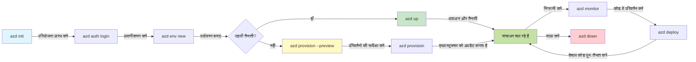

# AZD बेसिक्स - Azure Developer CLI को समझना

# AZD बेसिक्स - कोर कॉन्सेप्ट्स और मूल बातें

**Chapter Navigation:**
- **📚 Course Home**: [AZD शुरुआती के लिए](../../README.md)
- **📖 Current Chapter**: अध्याय 1 - फाउंडेशन और क्विक स्टार्ट
- **⬅️ Previous**: [पाठ्यक्रम अवलोकन](../../README.md#-chapter-1-foundation--quick-start)
- **➡️ Next**: [इंस्टॉलेशन और सेटअप](installation.md)
- **🚀 Next Chapter**: [अध्याय 2: एआई-प्रथम विकास](../chapter-02-ai-development/microsoft-foundry-integration.md)

## परिचय

यह पाठ आपको Azure Developer CLI (azd) से परिचित कराता है, एक शक्तिशाली कमांड-लाइन टूल जो स्थानीय विकास से Azure पर तैनाती तक आपकी यात्रा को तेज करता है। आप मूल सिद्धांतों, कोर फ़ीचर्स को सीखेंगे, और समझेंगे कि azd क्लाउड-नेटिव एप्लिकेशन तैनाती को कैसे सरल बनाता है।

## सीखने के उद्देश्य

इस पाठ के अंत तक, आप:
- समझेंगे कि Azure Developer CLI क्या है और इसका प्राथमिक उद्देश्य क्या है
- टेम्पलेट्स, वातावरण, और सेवाओं के कोर कॉन्सेप्ट्स सीखेंगे
- टेम्पलेट-चालित विकास और Infrastructure as Code सहित प्रमुख विशेषताओं का अन्वेषण करेंगे
- azd प्रोजेक्ट संरचना और वर्कफ़्लो को समझेंगे
- अपने विकास वातावरण के लिए azd स्थापित और कॉन्फ़िगर करने के लिए तैयार होंगे

## सीखने के परिणाम

इस पाठ को पूरा करने के बाद, आप सक्षम होंगे:
- आधुनिक क्लाउड विकास वर्कफ़्लोज़ में azd की भूमिका समझाना
- एक azd प्रोजेक्ट संरचना के घटकों की पहचान करना
- समझाना कि टेम्पलेट्स, वातावरण, और सेवाएं कैसे मिलकर काम करती हैं
- azd के साथ Infrastructure as Code के लाभ समझना
- विभिन्न azd कमांड्स और उनके उद्देश्यों को पहचानना

## Azure Developer CLI (azd) क्या है?

Azure Developer CLI (azd) एक कमांड-लाइन टूल है जिसे स्थानीय विकास से Azure पर तैनाती तक आपकी यात्रा तेज करने के लिए डिजाइन किया गया है। यह Azure पर क्लाउड-नेटिव एप्लिकेशन बनाने, तैनात करने, और प्रबंधित करने की प्रक्रिया को सरल बनाता है।

### 🎯 AZD क्यों उपयोग करें? एक वास्तविक दुनिया की तुलना

आइए एक साधारण वेब ऐप के डेटाबेस के साथ तैनाती की तुलना करें:

#### ❌ बिना AZD: मैन्युअल Azure तैनाती (30+ मिनट)

```bash
# चरण 1: रिसोर्स ग्रुप बनाएं
az group create --name myapp-rg --location eastus

# चरण 2: App Service Plan बनाएं
az appservice plan create --name myapp-plan \
  --resource-group myapp-rg \
  --sku B1 --is-linux

# चरण 3: वेब ऐप बनाएं
az webapp create --name myapp-web-unique123 \
  --resource-group myapp-rg \
  --plan myapp-plan \
  --runtime "NODE:18-lts"

# चरण 4: Cosmos DB खाता बनाएं (10-15 मिनट)
az cosmosdb create --name myapp-cosmos-unique123 \
  --resource-group myapp-rg \
  --kind MongoDB

# चरण 5: डेटाबेस बनाएं
az cosmosdb mongodb database create \
  --account-name myapp-cosmos-unique123 \
  --resource-group myapp-rg \
  --name tododb

# चरण 6: कलेक्शन बनाएं
az cosmosdb mongodb collection create \
  --account-name myapp-cosmos-unique123 \
  --resource-group myapp-rg \
  --database-name tododb \
  --name todos

# चरण 7: कनेक्शन स्ट्रिंग प्राप्त करें
CONN_STR=$(az cosmosdb keys list \
  --name myapp-cosmos-unique123 \
  --resource-group myapp-rg \
  --type connection-strings \
  --query "connectionStrings[0].connectionString" -o tsv)

# चरण 8: ऐप सेटिंग्स कॉन्फ़िगर करें
az webapp config appsettings set \
  --name myapp-web-unique123 \
  --resource-group myapp-rg \
  --settings MONGODB_URI="$CONN_STR"

# चरण 9: लॉगिंग सक्षम करें
az webapp log config --name myapp-web-unique123 \
  --resource-group myapp-rg \
  --application-logging filesystem \
  --detailed-error-messages true

# चरण 10: Application Insights सेटअप करें
az monitor app-insights component create \
  --app myapp-insights \
  --location eastus \
  --resource-group myapp-rg

# चरण 11: Application Insights को वेब ऐप से लिंक करें
INSTRUMENTATION_KEY=$(az monitor app-insights component show \
  --app myapp-insights \
  --resource-group myapp-rg \
  --query "instrumentationKey" -o tsv)

az webapp config appsettings set \
  --name myapp-web-unique123 \
  --resource-group myapp-rg \
  --settings APPINSIGHTS_INSTRUMENTATIONKEY="$INSTRUMENTATION_KEY"

# चरण 12: एप्लिकेशन को स्थानीय रूप से बिल्ड करें
npm install
npm run build

# चरण 13: डिप्लॉयमेंट पैकेज बनाएं
zip -r app.zip . -x "*.git*" "node_modules/*"

# चरण 14: एप्लिकेशन डिप्लॉय करें
az webapp deployment source config-zip \
  --resource-group myapp-rg \
  --name myapp-web-unique123 \
  --src app.zip

# चरण 15: प्रतीक्षा करें और प्रार्थना करें कि यह काम करे 🙏
# (कोई स्वचालित सत्यापन नहीं, मैन्युअल परीक्षण आवश्यक)
```

**समस्याएँ:**
- ❌ 15+ कमांड याद रखने और क्रम में निष्पादित करने के लिए
- ❌ 30-45 मिनट का मैन्युअल काम
- ❌ गलतियाँ करने में आसान (टाइपो, गलत पैरामीटर)
- ❌ कनेक्शन स्ट्रिंग्स टर्मिनल इतिहास में एक्सपोज़ हो सकती हैं
- ❌ कुछ गलत होने पर कोई स्वचालित रोलबैक नहीं
- ❌ टीम के सदस्यों के लिए दोहराना कठिन
- ❌ हर बार अलग (पुनरुत्पादन योग्य नहीं)

#### ✅ AZD के साथ: स्वचालित तैनाती (5 कमांड, 10-15 मिनिट)

```bash
# चरण 1: टेम्पलेट से प्रारंभ करें
azd init --template todo-nodejs-mongo

# चरण 2: प्रमाणीकरण करें
azd auth login

# चरण 3: पर्यावरण बनाएं
azd env new dev

# चरण 4: परिवर्तनों का पूर्वावलोकन (वैकल्पिक लेकिन अनुशंसित)
azd provision --preview

# चरण 5: सब कुछ परिनियोजित करें
azd up

# ✨ पूर्ण! सब कुछ परिनियोजित, कॉन्फ़िगर और मॉनिटर किया गया है
```

**लाभ:**
- ✅ **5 कमांड** बनाम 15+ मैन्युअल चरण
- ✅ **10-15 मिनट** कुल समय (अधिकतर Azure के लिए प्रतीक्षा)
- ✅ **शून्य त्रुटियाँ** - स्वचालित और परीक्षणित
- ✅ **गुप्तियाँ सुरक्षित रूप से प्रबंधित** की जाती हैं via Key Vault
- ✅ **विफलताओं पर स्वचालित रोलबैक**
- ✅ **पूर्णतया पुनरुत्पादन योग्य** - हर बार समान परिणाम
- ✅ **टीम-रेडी** - कोई भी समान कमांड्स से तैनाती कर सकता है
- ✅ **Infrastructure as Code** - संस्करण नियंत्रित Bicep टेम्पलेट्स
- ✅ **बिल्ट-इन मॉनिटरिंग** - Application Insights स्वतः कॉन्फ़िगर

### 📊 समय और त्रुटि में कमी

| Metric | Manual Deployment | AZD Deployment | Improvement |
|:-------|:------------------|:---------------|:------------|
| **Commands** | 15+ | 5 | 67% fewer |
| **Time** | 30-45 min | 10-15 min | 60% faster |
| **Error Rate** | ~40% | <5% | 88% reduction |
| **Consistency** | Low (manual) | 100% (automated) | Perfect |
| **Team Onboarding** | 2-4 hours | 30 minutes | 75% faster |
| **Rollback Time** | 30+ min (manual) | 2 min (automated) | 93% faster |

## कोर कॉन्सेप्ट्स

### टेम्पलेट्स
टेम्पलेट्स azd की आधारशिला हैं। वे शामिल करते हैं:
- **एप्लिकेशन कोड** - आपका स्रोत कोड और निर्भरताएँ
- **इन्फ्रास्ट्रक्चर परिभाषाएँ** - Bicep या Terraform में परिभाषित Azure संसाधन
- **कॉन्फ़िगरेशन फ़ाइलें** - सेटिंग्स और वातावरण चर
- **डिप्लॉयमेंट स्क्रिप्ट्स** - स्वचालित तैनाती वर्कफ़्लोज़

### वातावरण
वातावरण विभिन्न तैनाती लक्ष्यों का प्रतिनिधित्व करते हैं:
- **Development** - परीक्षण और विकास के लिए
- **Staging** - प्री-प्रोडक्शन वातावरण
- **Production** - लाइव प्रोडक्शन वातावरण

प्रत्येक वातावरण अपनी अलग चीजें रखता है:
- Azure resource group
- कॉन्फ़िगरेशन सेटिंग्स
- तैनाती स्थिति

### सेवाएँ
सेवाएँ आपके एप्लिकेशन के निर्माण खंड हैं:
- **Frontend** - वेब एप्लिकेशन, SPA
- **Backend** - APIs, माइक्रोसर्विसेज़
- **Database** - डेटा स्टोरेज समाधान
- **Storage** - फ़ाइल और ब्लॉब स्टोरेज

## प्रमुख विशेषताएँ

### 1. टेम्पलेट-चालित विकास
```bash
# उपलब्ध टेम्पलेट्स ब्राउज़ करें
azd template list

# किसी टेम्पलेट से प्रारंभ करें
azd init --template <template-name>
```

### 2. Infrastructure as Code
- **Bicep** - Azure की डोमेन-विशेष भाषा
- **Terraform** - मल्टी-क्लाउड इन्फ्रास्ट्रक्चर टूल
- **ARM Templates** - Azure Resource Manager टेम्पलेट्स

### 3. एकीकृत वर्कफ़्लोज़
```bash
# पूर्ण तैनाती कार्यप्रवाह
azd up            # प्राविजन + तैनाती यह पहली बार सेटअप के लिए बिना हस्तक्षेप के है

# 🧪 नया: परिनियोजन से पहले बुनियादी ढांचे में होने वाले बदलावों का पूर्वावलोकन (सुरक्षित)
azd provision --preview    # बिना बदलाव किए बुनियादी ढांचे की तैनाती का अनुकरण करें

azd provision     # बुनियादी ढांचे को अपडेट करने पर Azure संसाधन बनाएं — इसके लिए उपयोग करें
azd deploy        # एप्लिकेशन कोड को तैनात करें या अपडेट के बाद पुनः तैनात करें
azd down          # संसाधनों की सफाई करें
```

#### 🛡️ Preview के साथ सुरक्षित इन्फ्रास्ट्रक्चर प्लानिंग
`azd provision --preview` कमांड सुरक्षित तैनातियों के लिए गेम-चेंजर है:
- **ड्राय-रन विश्लेषण** - दिखाता है क्या बनाया, संशोधित, या हटाया जाएगा
- **शून्य जोखिम** - आपके Azure वातावरण में वास्तविक बदलाव नहीं किए जाते
- **टीम सहयोग** - तैनाती से पहले प्रीव्यू परिणाम साझा करें
- **लागत का अनुमान** - प्रतिबद्धता से पहले संसाधन लागत समझें

```bash
# उदाहरण पूर्वावलोकन कार्यप्रवाह
azd provision --preview           # देखें कि क्या बदलेगा
# आउटपुट की समीक्षा करें, टीम के साथ चर्चा करें
azd provision                     # परिवर्तनों को आत्मविश्वास के साथ लागू करें
```

### 📊 दृश्य: AZD विकास वर्कफ़्लो


**वर्कफ़्लो व्याख्या:**
1. **Init** - टेम्पलेट या नए प्रोजेक्ट से शुरू करें
2. **Auth** - Azure के साथ प्रमाणीकृत करें
3. **Environment** - अलग तैनाती वातावरण बनाएं
4. **Preview** - 🆕 हमेशा पहले इन्फ्रास्ट्रक्चर परिवर्तन का पूर्वावलोकन करें (सुरक्षित अभ्यास)
5. **Provision** - Azure संसाधन बनाएं/अपडेट करें
6. **Deploy** - अपना एप्लिकेशन कोड पुश करें
7. **Monitor** - एप्लिकेशन प्रदर्शन का निरीक्षण करें
8. **Iterate** - परिवर्तन करें और कोड पुनः तैनात करें
9. **Cleanup** - समाप्त होने पर संसाधनों को हटाएं

### 4. वातावरण प्रबंधन
```bash
# पर्यावरण बनाएं और प्रबंधित करें
azd env new <environment-name>
azd env select <environment-name>
azd env list
```

## 📁 प्रोजेक्ट संरचना

एक सामान्य azd प्रोजेक्ट संरचना:
```
my-app/
├── .azd/                    # azd configuration
│   └── config.json
├── .azure/                  # Azure deployment artifacts
├── .devcontainer/          # Development container config
├── .github/workflows/      # GitHub Actions
├── .vscode/               # VS Code settings
├── infra/                 # Infrastructure code
│   ├── main.bicep        # Main infrastructure template
│   ├── main.parameters.json
│   └── modules/          # Reusable modules
├── src/                  # Application source code
│   ├── api/             # Backend services
│   └── web/             # Frontend application
├── azure.yaml           # azd project configuration
└── README.md
```

## 🔧 कॉन्फ़िगरेशन फ़ाइलें

### azure.yaml
मुख्य प्रोजेक्ट कॉन्फ़िगरेशन फ़ाइल:
```yaml
name: my-awesome-app
metadata:
  template: my-template@1.0.0

services:
  web:
    project: ./src/web
    language: js
    host: appservice
  api:
    project: ./src/api
    language: js
    host: appservice

hooks:
  preprovision:
    shell: pwsh
    run: echo "Preparing to provision..."
```

### .azure/config.json
पर्यावरण-विशिष्ट कॉन्फ़िगरेशन:
```json
{
  "version": 1,
  "defaultEnvironment": "dev",
  "environments": {
    "dev": {
      "subscriptionId": "your-subscription-id",
      "location": "eastus"
    }
  }
}
```

## 🎪 सामान्य वर्कफ़्लोज़ और हैंड्स-ऑन अभ्यास

> **💡 सीखने की टिप:** इन अभ्यासों का क्रम में पालन करें ताकि आप क्रमिक रूप से AZD कौशल का निर्माण कर सकें।

### 🎯 व्यायाम 1: अपना पहला प्रोजेक्ट इनिशियलाइज़ करें

**लक्ष्य:** एक AZD प्रोजेक्ट बनाएं और इसकी संरचना का अन्वेषण करें

**कदम:**
```bash
# एक प्रमाणित टेम्पलेट का उपयोग करें
azd init --template todo-nodejs-mongo

# बनाई गई फ़ाइलों का अन्वेषण करें
ls -la  # छिपी हुई फ़ाइलों सहित सभी फ़ाइलें देखें

# मुख्य फ़ाइलें बनाई गईं:
# - azure.yaml (मुख्य विन्यास)
# - infra/ (बुनियादी ढाँचे का कोड)
# - src/ (एप्लिकेशन कोड)
```

**✅ सफलता:** आपके पास azure.yaml, infra/, और src/ डिरेक्टरीज़ हैं

---

### 🎯 व्यायाम 2: Azure पर तैनात करें

**लक्ष्य:** एंड-टू-एंड तैनाती पूरा करें

**कदम:**
```bash
# 1. प्रमाणीकरण करें
az login && azd auth login

# 2. पर्यावरण बनाएं
azd env new dev
azd env set AZURE_LOCATION eastus

# 3. परिवर्तनों का पूर्वावलोकन (अनुशंसित)
azd provision --preview

# 4. सब कुछ तैनात करें
azd up

# 5. तैनाती सत्यापित करें
azd show    # अपने ऐप का URL देखें
```

**अनुमानित समय:** 10-15 मिनट  
**✅ सफलता:** एप्लिकेशन URL ब्राउज़र में खुलता है

---

### 🎯 व्यायाम 3: एकाधिक वातावरण

**लक्ष्य:** dev और staging में तैनात करें

**कदम:**
```bash
# पहले से dev मौजूद है, staging बनाएं
azd env new staging
azd env set AZURE_LOCATION westus2
azd up

# इनके बीच स्विच करें
azd env list
azd env select dev
```

**✅ सफलता:** Azure Portal में दो अलग संसाधन समूह बन गए हैं

---

### 🛡️ क्लीन स्लेट: `azd down --force --purge`

जब आपको पूरी तरह रीसेट करने की आवश्यकता हो:

```bash
azd down --force --purge
```

**यह क्या करता है:**
- `--force`: कोई पुष्टिकरण संकेत नहीं
- `--purge`: सभी स्थानीय स्थिति और Azure संसाधनों को हटाता है

**कब उपयोग करें:**
- तैनाती बीच में फेल हो गई हो
- प्रोजेक्ट बदल रहे हों
- ताज़ा शुरुआत चाहिए

---

## 🎪 मूल वर्कफ़्लो संदर्भ

### नया प्रोजेक्ट शुरू करना
```bash
# विधि 1: मौजूदा टेम्पलेट का उपयोग करें
azd init --template todo-nodejs-mongo

# विधि 2: शून्य से शुरू करें
azd init

# विधि 3: वर्तमान निर्देशिका का उपयोग करें
azd init .
```

### विकास चक्र
```bash
# डेवलपमेंट वातावरण सेट करें
azd auth login
azd env new dev
azd env select dev

# सब कुछ तैनात करें
azd up

# बदलाव करें और पुनः तैनात करें
azd deploy

# काम पूरा होने पर साफ़ करें
azd down --force --purge # Azure Developer CLI में यह कमांड आपके पर्यावरण के लिए एक **हार्ड रिसेट** है—विशेष रूप से उपयोगी जब आप विफल तैनातियों का निवारण कर रहे हों, परित्यक्त संसाधनों को साफ़ कर रहे हों, या ताज़ा पुनःतैनाती की तैयारी कर रहे हों।
```

## `azd down --force --purge` को समझना
`azd down --force --purge` कमांड आपके azd वातावरण और सभी संबंधित संसाधनों को पूरी तरह से नष्ट करने का एक शक्तिशाली तरीका है। यहाँ प्रत्येक फ़्लैग क्या करता है, उसका विवरण है:
```
--force
```
- पुष्टि संकेतों को छोड़ देता है।
- ऑटोमेशन या स्क्रिप्टिंग के लिए उपयोगी जहाँ मैन्युअल इनपुट संभव नहीं है।
- यह सुनिश्चित करता है कि CLI किसी भी असंगतियों का पता चलने पर भी बिना बाधा के teardown जारी रखे।

```
--purge
```
Deletes **सभी संबंधित मेटाडेटा**, जिसमें शामिल हैं:
पर्यावरण स्थिति
स्थानीय `.azure` फ़ोल्डर
कैश्ड डिप्लॉयमेंट जानकारी
azd को पिछली तैनातियों को "याद रखने" से रोकता है, जो कि mismatched resource groups या stale registry references जैसे मुद्दे पैदा कर सकता है।

### दोनों का उपयोग क्यों करें?
जब आप `azd up` के साथ अटक जाते हैं क्योंकि लंबित स्थिति या आंशिक तैनाती बनी हुई है, तो यह संयोजन एक **साफ़ शुरुआत** सुनिश्चित करता है।

यह विशेष रूप से उपयोगी होता है जब आपने Azure पोर्टल में मैन्युअल रूप से संसाधन हटाए हों या जब आप टेम्पलेट्स, वातावरण, या resource group नामकरण विन्यास बदल रहे हों।

### कई वातावरणों का प्रबंधन
```bash
# स्टेजिंग पर्यावरण बनाएं
azd env new staging
azd env select staging
azd up

# dev पर वापस जाएँ
azd env select dev

# पर्यावरणों की तुलना करें
azd env list
```

## 🔐 प्रमाणीकरण और क्रेडेंशियल्स

प्रमाणीकरण को समझना सफल azd तैनाती के लिए महत्वपूर्ण है। Azure कई प्रमाणीकरण विधियों का उपयोग करता है, और azd अन्य Azure टूल्स द्वारा उपयोग किए जाने वाले समान क्रेडेंशियल चेन का लाभ उठाता है।

### Azure CLI प्रमाणीकरण (`az login`)

azd का उपयोग करने से पहले, आपको Azure के साथ प्रमाणीकृत होना होगा। सबसे सामान्य तरीका Azure CLI का उपयोग करना है:

```bash
# इंटरैक्टिव लॉगिन (ब्राउज़र खोलता है)
az login

# विशिष्ट टेनेंट के साथ लॉगिन
az login --tenant <tenant-id>

# सर्विस प्रिंसिपल के साथ लॉगिन
az login --service-principal -u <app-id> -p <password> --tenant <tenant-id>

# वर्तमान लॉगिन स्थिति जांचें
az account show

# उपलब्ध सब्सक्रिप्शन सूचीबद्ध करें
az account list --output table

# डिफ़ॉल्ट सब्सक्रिप्शन सेट करें
az account set --subscription <subscription-id>
```

### प्रमाणीकरण प्रवाह
1. **इंटरैक्टिव लॉगिन**: प्रमाणीकरण के लिए आपका डिफ़ॉल्ट ब्राउज़र खोलता है
2. **डिवाइस कोड फ्लो**: उन वातावरणों के लिए जहाँ ब्राउज़र एक्सेस नहीं है
3. **सर्विस प्रिंसिपल**: ऑटोमेशन और CI/CD परिदृश्यों के लिए
4. **Managed Identity**: Azure-होस्टेड एप्लिकेशन के लिए

### DefaultAzureCredential चेन

`DefaultAzureCredential` एक क्रेडेंशियल प्रकार है जो कई क्रेडेंशियल स्रोतों को एक विशिष्ट क्रम में स्वचालित रूप से आज़माकर सरलित प्रमाणीकरण अनुभव प्रदान करता है:

#### क्रेडेंशियल चेन क्रम

#### 1. पर्यावरण वेरिएबल्स
```bash
# सर्विस प्रिंसिपल के लिए पर्यावरण चर सेट करें
export AZURE_CLIENT_ID="<app-id>"
export AZURE_CLIENT_SECRET="<password>"
export AZURE_TENANT_ID="<tenant-id>"
```

#### 2. वर्कलोड आइडेंटिटी (Kubernetes/GitHub Actions)
स्वचालित रूप से उपयोग किया जाता है:
- Azure Kubernetes Service (AKS) में Workload Identity के साथ
- GitHub Actions में OIDC फेडरेशन के साथ
- अन्य फ़ेडरेटेड पहचान परिदृश्यों में

#### 3. Managed Identity
Azure संसाधनों के लिए जैसे:
- Virtual Machines
- App Service
- Azure Functions
- Container Instances

```bash
# जाँच करें कि क्या यह प्रबंधित पहचान के साथ Azure संसाधन पर चल रहा है
az account show --query "user.type" --output tsv
# वापस करता है: यदि प्रबंधित पहचान का उपयोग हो रहा है तो "servicePrincipal"
```

#### 4. डेवलपर टूल्स इंटीग्रेशन
- **Visual Studio**: स्वचालित रूप से साइन-इन किए गए खाते का उपयोग करता है
- **VS Code**: Azure Account एक्सटेंशन क्रेडेंशियल्स का उपयोग करता है
- **Azure CLI**: `az login` क्रेडेंशियल्स का उपयोग करता है (स्थानीय विकास के लिए सबसे सामान्य)

### AZD प्रमाणीकरण सेटअप

```bash
# विधि 1: Azure CLI का उपयोग करें (विकास के लिए अनुशंसित)
az login
azd auth login  # मौजूदा Azure CLI प्रमाण-पत्रों का उपयोग करता है

# विधि 2: प्रत्यक्ष azd प्रमाणीकरण
azd auth login --use-device-code  # हेडलैस वातावरणों के लिए

# विधि 3: प्रमाणीकरण स्थिति जांचें
azd auth login --check-status

# विधि 4: लॉग आउट करें और फिर से प्रमाणीकरण करें
azd auth logout
azd auth login
```

### प्रमाणीकरण सर्वोत्तम प्रथाएँ

#### स्थानीय विकास के लिए
```bash
# 1. Azure CLI के साथ लॉगिन करें
az login

# 2. सही सदस्यता सत्यापित करें
az account show
az account set --subscription "Your Subscription Name"

# 3. मौजूदा क्रेडेंशियल्स के साथ azd का उपयोग करें
azd auth login
```

#### CI/CD पाइपलाइनों के लिए
```yaml
# GitHub Actions example
- name: Azure Login
  uses: azure/login@v1
  with:
    creds: ${{ secrets.AZURE_CREDENTIALS }}

- name: Deploy with azd
  run: |
    azd auth login --client-id ${{ secrets.AZURE_CLIENT_ID }} \
                    --client-secret ${{ secrets.AZURE_CLIENT_SECRET }} \
                    --tenant-id ${{ secrets.AZURE_TENANT_ID }}
    azd up --no-prompt
```

#### प्रोडक्शन वातावरण के लिए
- जब Azure संसाधनों पर चल रहा हो तो **Managed Identity** का उपयोग करें
- ऑटोमेशन परिदृश्यों के लिए **Service Principal** का उपयोग करें
- कोड या कॉन्फ़िगरेशन फ़ाइलों में क्रेडेंशियल्स संग्रहीत करने से बचें
- संवेदनशील कॉन्फ़िगरेशन के लिए **Azure Key Vault** का उपयोग करें

### सामान्य प्रमाणीकरण समस्याएँ और समाधान

#### समस्या: "No subscription found"
```bash
# समाधान: डिफ़ॉल्ट सदस्यता सेट करें
az account list --output table
az account set --subscription "<subscription-id>"
azd env set AZURE_SUBSCRIPTION_ID "<subscription-id>"
```

#### समस्या: "Insufficient permissions"
```bash
# समाधान: आवश्यक भूमिकाओं की जाँच और आवंटन
az role assignment list --assignee $(az account show --query user.name --output tsv)

# सामान्य आवश्यक भूमिकाएँ:
# - योगदानकर्ता (संसाधन प्रबंधन के लिए)
# - उपयोगकर्ता एक्सेस प्रशासक (भूमिका आवंटन के लिए)
```

#### समस्या: "Token expired"
```bash
# समाधान: पुनः प्रमाणीकरण करें
az logout
az login
azd auth logout
azd auth login
```

### विभिन्न परिदृश्यों में प्रमाणीकरण

#### स्थानीय विकास
```bash
# व्यक्तिगत विकास खाता
az login
azd auth login
```

#### टीम विकास
```bash
# संगठन के लिए विशिष्ट टेनेंट का उपयोग करें
az login --tenant contoso.onmicrosoft.com
azd auth login
```

#### मल्टी-टेनेंट परिदृश्य
```bash
# टेनेंटों के बीच स्विच करें
az login --tenant tenant1.onmicrosoft.com
# टेनेंट 1 पर तैनात करें
azd up

az login --tenant tenant2.onmicrosoft.com  
# टेनेंट 2 पर तैनात करें
azd up
```

### सुरक्षा विचार

1. **क्रेडेंशियल संग्रहण**: क्रेडेंशियल्स को स्रोत कोड में कभी न रखें
2. **स्कोप सीमित करना**: सर्विस प्रिंसिपल्स के लिए न्यूनतम-प्रिविलेज सिद्धांत अपनाएँ
3. **टोकन रोटेशन**: नियमित अंतराल पर सर्विस प्रिंसिपल सीक्रेट्स को रोटेट करें
4. **ऑडिट ट्रेल**: प्रमाणीकरण और तैनाती गतिविधियों की निगरानी करें
5. **नेटवर्क सुरक्षा**: जब संभव हो तो प्राइवेट एंडपॉइंट्स का उपयोग करें

### प्रमाणीकरण त्रुटि निवारण

```bash
# प्रमाणीकऱण समस्याओं का डिबग करें
azd auth login --check-status
az account show
az account get-access-token

# सामान्य डायग्नोस्टिक कमांड
whoami                          # वर्तमान उपयोगकर्ता संदर्भ
az ad signed-in-user show      # Azure AD उपयोगकर्ता विवरण
az group list                  # संसाधन पहुँच का परीक्षण करें
```

## `azd down --force --purge` को समझना

### डिस्कवरी
```bash
azd template list              # टेम्पलेट ब्राउज़ करें
azd template show <template>   # टेम्पलेट विवरण
azd init --help               # प्रारंभिक विकल्प
```

### प्रोजेक्ट प्रबंधन
```bash
azd show                     # परियोजना का अवलोकन
azd env show                 # वर्तमान पर्यावरण
azd config list             # विन्यास विकल्प
```

### मॉनिटरिंग
```bash
azd monitor                  # Azure पोर्टल की निगरानी खोलें
azd monitor --logs           # एप्लिकेशन लॉग देखें
azd monitor --live           # लाइव मेट्रिक्स देखें
azd pipeline config          # CI/CD सेटअप करें
```

## सर्वश्रेष्ठ प्रथाएँ

### 1. अर्थपूर्ण नामों का उपयोग करें
```bash
# अच्छा
azd env new production-east
azd init --template web-app-secure

# बचें
azd env new env1
azd init --template template1
```

### 2. टेम्पलेट्स का लाभ उठाएँ
- मौजूदा टेम्पलेट्स से शुरू करें
- अपनी ज़रूरतों के लिए अनुकूलित करें
- अपने संगठन के लिए पुन: उपयोग योग्य टेम्पलेट्स बनाएं

### 3. वातावरण अलगाव
- dev/staging/prod के लिए अलग-अलग वातावरण का उपयोग करें
- स्थानीय मशीन से सीधे प्रोडक्शन में कभी तैनात न करें
- प्रोडक्शन तैनाती के लिए CI/CD पाइपलाइनों का उपयोग करें

### 4. कॉन्फ़िगरेशन प्रबंधन
- संवेदनशील डेटा के लिए पर्यावरण वेरिएबल्स का उपयोग करें
- कॉन्फ़िगरेशन को संस्करण नियंत्रण में रखें
- वातावरण-विशिष्ट सेटिंग्स का दस्तावेज़ीकरण करें

## सीखने की प्रगति

### Beginner (Week 1-2)
1. azd स्थापित करें और प्रमाणीकृत करें
2. एक सरल टेम्पलेट तैनात करें
3. प्रोजेक्ट संरचना समझें
4. मूल कमांड्स सीखें (up, down, deploy)

### Intermediate (Week 3-4)
1. टेम्पलेट्स को अनुकूलित करें
2. एकाधिक वातावरण प्रबंधित करें
3. इन्फ्रास्ट्रक्चर कोड समझें
4. CI/CD पाइपलाइन्स सेटअप करें

### Advanced (Week 5+)
1. कस्टम टेम्पलेट बनाएं
2. उन्नत इन्फ्रास्ट्रक्चर पैटर्न
3. मल्टी-रिजन तैनातियाँ
4. एंटरप्राइज़-ग्रेड कॉन्फ़िगरेशन्स

## अगले कदम

**📖 जारी रखें अध्याय 1 की पढ़ाई:**
- [इंस्टॉलेशन और सेटअप](installation.md) - azd इंस्टॉल और कॉन्फ़िगर करें
- [आपका पहला प्रोजेक्ट](first-project.md) - एक संपूर्ण व्यावहारिक ट्यूटोरियल
- [कॉन्फ़िगरेशन गाइड](configuration.md) - उन्नत कॉन्फ़िगरेशन विकल्प

**🎯 अगले अध्याय के लिए तैयार हैं?**
- [अध्याय 2: एआई-प्रथम विकास](../chapter-02-ai-development/microsoft-foundry-integration.md) - एआई एप्लिकेशन बनाना शुरू करें

## अतिरिक्त संसाधन

- [Azure Developer CLI अवलोकन](https://learn.microsoft.com/en-us/azure/developer/azure-developer-cli/)
- [टेम्पलेट गैलरी](https://azure.github.io/awesome-azd/)
- [समुदाय नमूने](https://github.com/Azure-Samples)

---

## 🙋 अक्सर पूछे जाने वाले प्रश्न

### सामान्य प्रश्न

**Q: AZD और Azure CLI में क्या अंतर है?**

A: Azure CLI (`az`) व्यक्तिगत Azure संसाधनों का प्रबंधन करने के लिए है। AZD (`azd`) पूरे एप्लिकेशन का प्रबंधन करने के लिए है:

```bash
# Azure CLI - निम्न-स्तरीय संसाधन प्रबंधन
az webapp create --name myapp --resource-group rg
az sql server create --name myserver --resource-group rg
# ...कई और कमांड्स की आवश्यकता है

# AZD - एप्लिकेशन-स्तरीय प्रबंधन
azd up  # पूरे एप्लिकेशन को सभी संसाधनों सहित तैनात करता है
```

**इसे इस तरह सोचें:**
- `az` = व्यक्तिगत लेगो ईंटों पर काम करना
- `azd` = पूरी लेगो सेट्स के साथ काम करना

---

**Q: AZD उपयोग करने के लिए क्या मुझे Bicep या Terraform जानना आवश्यक है?**

A: नहीं! टेम्पलेट्स से शुरू करें:
```bash
# मौजूदा टेम्पलेट का उपयोग करें - IaC का ज्ञान आवश्यक नहीं है
azd init --template todo-nodejs-mongo
azd up
```

आप बाद में Bicep सीखकर इन्फ्रास्ट्रक्चर को अनुकूलित कर सकते हैं। टेम्पलेट काम करने वाले उदाहरण प्रदान करते हैं जिनसे आप सीख सकते हैं।

---

**Q: AZD टेम्पलेट चलाने की लागत कितनी है?**

A: लागत टेम्पलेट पर निर्भर करती है। अधिकांश विकास टेम्पलेट की लागत $50-150/महीना होती है:

```bash
# तैनात करने से पहले लागत का पूर्वावलोकन करें
azd provision --preview

# उपयोग में न होने पर हमेशा साफ़ करें
azd down --force --purge  # सभी संसाधनों को हटाता है
```

**प्रो टिप:** जहाँ उपलब्ध हो मुफ्त टियर्स का उपयोग करें:
- App Service: F1 (Free) टियर
- Azure OpenAI: 50,000 टोकन/माह मुफ्त
- Cosmos DB: 1000 RU/s मुफ्त टियर

---

**Q: क्या मैं मौजूदा Azure संसाधनों के साथ AZD का उपयोग कर सकता/सकती हूँ?**

A: हाँ, लेकिन नए सिरे से शुरू करना आसान होता है। AZD तब सबसे अच्छा काम करता है जब यह पूरा लाइफसाइकिल संभालता है। मौजूदा संसाधनों के लिए:
```bash
# विकल्प 1: मौजूदा संसाधन आयात करें (उन्नत)
azd init
# फिर infra/ को मौजूदा संसाधनों को संदर्भित करने के लिए संशोधित करें

# विकल्प 2: नई शुरुआत करें (अनुशंसित)
azd init --template matching-your-stack
azd up  # नया वातावरण बनाता है
```

---

**Q: मैं अपनी परियोजना अपनी टीम के साथ कैसे साझा करूँ?**

A: AZD प्रोजेक्ट को Git में कमिट करें (लेकिन .azure फ़ोल्डर को नहीं):
```bash
# डिफ़ॉल्ट रूप से पहले से ही .gitignore में है
.azure/        # इसमें गुप्त जानकारी और पर्यावरण डेटा होता है
*.env          # पर्यावरण चर

# तब की टीम सदस्य:
git clone <your-repo>
azd auth login
azd env new <their-name>-dev
azd up
```

हर कोई समान टेम्पलेट्स से एक समान इन्फ्रास्ट्रक्चर प्राप्त करता है।

---

### समस्या निवारण प्रश्न

**Q: "azd up" आधा असफल हो गया। मुझे क्या करना चाहिए?**

A: त्रुटि देखें, उसे ठीक करें, फिर पुन: प्रयास करें:
```bash
# विस्तृत लॉग देखें
azd show

# सामान्य समाधान:

# 1. यदि कोटा पार हो गया:
azd env set AZURE_LOCATION "westus2"  # किसी अन्य क्षेत्र को आज़माएँ

# 2. यदि संसाधन नाम में टकराव हो:
azd down --force --purge  # नई शुरुआत करें
azd up  # पुनः प्रयास करें

# 3. यदि प्रमाणीकरण की अवधि समाप्त हो गई हो:
az login
azd auth login
azd up
```

**सर्वाधिक सामान्य समस्या:** गलत Azure सब्सक्रिप्शन चुना गया है
```bash
az account list --output table
az account set --subscription "<correct-subscription>"
```

---

**Q: मैं फिर से प्राविजन किए बिना केवल कोड परिवर्तनों को कैसे डिप्लॉय करूँ?**

A: `azd up` के बजाय `azd deploy` का उपयोग करें:
```bash
azd up          # पहली बार: संसाधन तैयार करना + तैनाती (धीमा)

# कोड में बदलाव करें...

azd deploy      # आगामी बार: केवल तैनाती (तेज़)
```

गति तुलना:
- `azd up`: 10-15 मिनट (इन्फ्रास्ट्रक्चर प्रोविजन करता है)
- `azd deploy`: 2-5 मिनट (केवल कोड)

---

**Q: क्या मैं इन्फ्रास्ट्रक्चर टेम्पलेट्स को अनुकूलित कर सकता/सकती हूँ?**

A: हाँ! `infra/` में Bicep फाइलों को संपादित करें:
```bash
# azd init के बाद
cd infra/
code main.bicep  # VS Code में संपादित करें

# परिवर्तनों का पूर्वावलोकन
azd provision --preview

# परिवर्तनों को लागू करें
azd provision
```

**टिप:** छोटे से शुरू करें - पहले SKUs बदलें:
```bicep
// infra/main.bicep
sku: {
  name: 'B1'  // Change to 'P1V2' for production
}
```

---

**Q: AZD द्वारा बनाए गए सभी संसाधन कैसे हटाएँ?**

A: एक कमांड सभी संसाधनों को हटा देता है:
```bash
azd down --force --purge

# यह हटाता है:
# - सभी Azure संसाधन
# - संसाधन समूह
# - स्थानीय पर्यावरण स्थिति
# - कैश किए गए तैनाती डेटा
```

**हमेशा इसे तब चलाएँ जब:**
- किसी टेम्पलेट का परीक्षण पूरा हो गया हो
- किसी अलग प्रोजेक्ट पर स्विच कर रहे हों
- नया सिरे से शुरू करना चाहते हों

**लागत बचत:** अप्रयुक्त संसाधनों को हटाने पर $0 चार्ज

---

**Q: अगर मैंने गलती से Azure Portal में संसाधन हटा दिए तो क्या होगा?**

A: AZD की स्थिति असंतुलित हो सकती है। साफ़ शुरुआत का तरीका:
```bash
# 1. स्थानीय स्थिति हटाएँ
azd down --force --purge

# 2. नई शुरुआत करें
azd up

# विकल्प: AZD को पता लगाने और ठीक करने दें
azd provision  # लापता संसाधनों को बनाएगा
```

---

### उन्नत प्रश्न

**Q: क्या मैं CI/CD पाइपलाइनों में AZD का उपयोग कर सकता/सकती हूँ?**

A: हाँ! GitHub Actions उदाहरण:
```yaml
# .github/workflows/deploy.yml
name: Deploy with AZD

on:
  push:
    branches: [main]

jobs:
  deploy:
    runs-on: ubuntu-latest
    steps:
      - uses: actions/checkout@v2
      
      - name: Install azd
        run: curl -fsSL https://aka.ms/install-azd.sh | bash
      
      - name: Azure Login
        run: |
          azd auth login \
            --client-id ${{ secrets.AZURE_CLIENT_ID }} \
            --client-secret ${{ secrets.AZURE_CLIENT_SECRET }} \
            --tenant-id ${{ secrets.AZURE_TENANT_ID }}
      
      - name: Deploy
        run: azd up --no-prompt
```

---

**Q: मैं सीक्रेट्स और संवेदनशील डेटा को कैसे संभालूं?**

A: AZD स्वचालित रूप से Azure Key Vault के साथ इंटीग्रेट होता है:
```bash
# गोपनीय जानकारियाँ Key Vault में संग्रहीत होती हैं, कोड में नहीं
azd env set DATABASE_PASSWORD "$(openssl rand -base64 32)"

# AZD स्वचालित रूप से:
# 1. Key Vault बनाता है
# 2. गोपनीय जानकारी संग्रहीत करता है
# 3. Managed Identity के माध्यम से ऐप को पहुँच प्रदान करता है
# 4. रनटाइम पर इंजेक्ट करता है
```

**कभी कमिट न करें:**
- `.azure/` फ़ोल्डर (पर्यावरण डेटा शामिल है)
- `.env` फाइलें (स्थानीय सीक्रेट्स)
- कनेक्शन स्ट्रिंग्स

---

**Q: क्या मैं कई क्षेत्रों में डिप्लॉय कर सकता/सकती हूँ?**

A: हाँ, प्रत्येक क्षेत्र के लिए एक वातावरण बनाएं:
```bash
# पूर्वी यूएस पर्यावरण
azd env new prod-eastus
azd env set AZURE_LOCATION eastus
azd up

# पश्चिमी यूरोप पर्यावरण
azd env new prod-westeurope
azd env set AZURE_LOCATION westeurope
azd up

# प्रत्येक पर्यावरण स्वतंत्र है
azd env list
```

सच्चे मल्टी-रीजन ऐप्स के लिए, एक साथ कई क्षेत्रों में डिप्लॉय करने के लिए Bicep टेम्पलेट्स को अनुकूलित करें।

---

**Q: अगर मैं अटक जाऊँ तो मुझे मदद कहाँ मिल सकती है?**

1. **AZD डॉ큐मेंटेशन:** https://learn.microsoft.com/azure/developer/azure-developer-cli/
2. **GitHub Issues:** https://github.com/Azure/azure-dev/issues
3. **Discord:** [Azure Discord](https://discord.gg/microsoft-azure) - #azure-developer-cli चैनल
4. **Stack Overflow:** टैग `azure-developer-cli`
5. **यह कोर्स:** [समस्या निवारण मार्गदर्शिका](../chapter-07-troubleshooting/common-issues.md)

**प्रो टिप:** पूछने से पहले, चलाएँ:
```bash
azd show       # वर्तमान स्थिति दिखाता है
azd version    # आपका संस्करण दिखाता है
```
त्वरित सहायता के लिए अपने प्रश्न में यह जानकारी शामिल करें।

---

## 🎓 आगे क्या है?

अब आप AZD के मूलभूत सिद्धांत समझ गए हैं। अपना रास्ता चुनें:

### 🎯 शुरुआती के लिए:
1. **अगला:** [इंस्टॉलेशन और सेटअप](installation.md) - अपने मशीन पर AZD इंस्टॉल करें
2. **फिर:** [आपका पहला प्रोजेक्ट](first-project.md) - अपना पहला ऐप डिप्लॉय करें
3. **अभ्यास:** इस पाठ में सभी 3 अभ्यास पूरे करें

### 🚀 एआई डेवलपर्स के लिए:
1. **सीधे जाएं:** [अध्याय 2: एआई-प्रथम विकास](../chapter-02-ai-development/microsoft-foundry-integration.md)
2. **डिप्लॉय करें:** `azd init --template get-started-with-ai-chat` से शुरू करें
3. **सीखें:** डिप्लॉय करते हुए बनाएं

### 🏗️ अनुभवी डेवलपर्स के लिए:
1. **समीक्षा करें:** [कॉन्फ़िगरेशन गाइड](configuration.md) - उन्नत सेटिंग्स
2. **एक्सप्लोर करें:** [Infrastructure as Code](../chapter-04-infrastructure/provisioning.md) - Bicep गहन अध्ययन
3. **बिल्ड करें:** अपने स्टैक के लिए कस्टम टेम्पलेट बनाएं

---

**अध्याय नेविगेशन:**
- **📚 कोर्स होम**: [AZD For Beginners](../../README.md)
- **📖 वर्तमान अध्याय**: अध्याय 1 - फाउंडेशन और क्विक स्टार्ट  
- **⬅️ पिछला**: [Course Overview](../../README.md#-chapter-1-foundation--quick-start)
- **➡️ अगला**: [इंस्टॉलेशन और सेटअप](installation.md)
- **🚀 अगला अध्याय**: [अध्याय 2: एआई-प्रथम विकास](../chapter-02-ai-development/microsoft-foundry-integration.md)

---

<!-- CO-OP TRANSLATOR DISCLAIMER START -->
अस्वीकरण:
यह दस्तावेज़ AI अनुवाद सेवा [Co-op Translator](https://github.com/Azure/co-op-translator) का उपयोग करके अनुवादित किया गया है। हालाँकि हम सटीकता के लिए प्रयासरत हैं, कृपया ध्यान दें कि स्वचालित अनुवादों में त्रुटियाँ या असंगतियाँ हो सकती हैं। मूल भाषा में उपलब्ध मूल दस्तावेज़ को प्रामाणिक स्रोत माना जाना चाहिए। महत्वपूर्ण जानकारी के लिए पेशेवर मानव अनुवाद की सलाह दी जाती है। हम इस अनुवाद के उपयोग से उत्पन्न किसी भी गलतफहमी या त्रुटिपूर्ण व्याख्या के लिए उत्तरदायी नहीं हैं।
<!-- CO-OP TRANSLATOR DISCLAIMER END -->