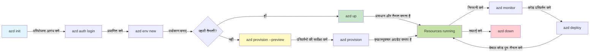
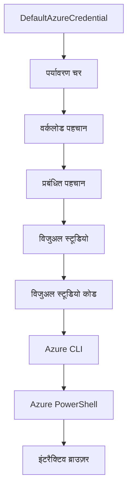

# AZD मूल बातें - Azure Developer CLI को समझना

# AZD मूल बातें - मुख्य अवधारणाएँ और मूल सिद्धांत

**अध्याय नेविगेशन:**
- **📚 कोर्स होम**: [शुरुआती लोगों के लिए AZD](../../README.md)
- **📖 वर्तमान अध्याय**: अध्याय 1 - नींव और त्वरित शुरुआत
- **⬅️ पिछला**: [कोर्स अवलोकन](../../README.md#-chapter-1-foundation--quick-start)
- **➡️ अगला**: [इंस्टॉलेशन और सेटअप](installation.md)
- **🚀 अगला अध्याय**: [अध्याय 2: AI-फर्स्ट डेवलपमेंट](../chapter-02-ai-development/microsoft-foundry-integration.md)

## परिचय

यह पाठ आपको Azure Developer CLI (azd) से परिचित कराता है, एक शक्तिशाली कमांड-लाइन टूल जो आपकी स्थानीय विकास से Azure पर तैनाती तक की यात्रा को तेज़ करता है। आप बुनियादी अवधारणाओं, मुख्य विशेषताओं को सीखेंगे, और समझेंगे कि कैसे azd क्लाउड-नेटिव एप्लिकेशन तैनाती को सरल बनाता है।

## सीखने के लक्ष्य

इस पाठ के अंत तक, आप:
- समझेंगे कि Azure Developer CLI क्या है और इसका मुख्य उद्देश्य क्या है
- टेम्प्लेट, पर्यावरण, और सेवाओं की मुख्य अवधारणाओं को सीखेंगे
- टेम्प्लेट-ड्रिवन विकास और Infrastructure as Code सहित प्रमुख विशेषताओं का अन्वेषण करेंगे
- azd प्रोजेक्ट संरचना और वर्कफ़्लो को समझेंगे
- अपने विकास पर्यावरण के लिए azd को इंस्टॉल और कॉन्फ़िगर करने के लिए तैयार होंगे

## सीखने के परिणाम

इस पाठ को पूरा करने के बाद, आप सक्षम होंगे:
- आधुनिक क्लाउड विकास वर्कफ़्लो में azd की भूमिका समझाने के लिए
- azd प्रोजेक्ट संरचना के घटकों की पहचान करने के लिए
- यह वर्णन करने के लिए कि टेम्प्लेट, पर्यावरण, और सेवाएं कैसे एक साथ काम करती हैं
- azd के साथ Infrastructure as Code के लाभों को समझने के लिए
- विभिन्न azd कमांड्स और उनके उद्देश्यों को पहचानने के लिए

## Azure Developer CLI (azd) क्या है?

Azure Developer CLI (azd) एक कमांड-लाइन टूल है जिसे आपकी स्थानीय विकास से Azure पर तैनाती की यात्रा को तेज़ करने के लिए डिज़ाइन किया गया है। यह Azure पर क्लाउड-नेटिव एप्लिकेशन बनाने, डिप्लॉय करने, और प्रबंधित करने की प्रक्रिया को सरल बनाता है।

### azd से आप क्या तैनात कर सकते हैं?

azd विभिन्न प्रकार के वर्कलोड का समर्थन करता है—और सूची लगातार बढ़ रही है। आज, आप azd का उपयोग करके तैनात कर सकते हैं:

| वर्कलोड प्रकार | उदाहरण | समान वर्कफ़्लो? |
|---------------|----------|----------------|
| **परंपरागत एप्लिकेशन** | वेब ऐप, REST API, स्थैतिक साइटें | ✅ `azd up` |
| **सेवाएं और माइक्रोसर्विसेज** | कंटेनर ऐप्स, फ़ंक्शन ऐप्स, मल्टी-सर्विस बैकएंड | ✅ `azd up` |
| **एआई-संचालित एप्लिकेशन** | Microsoft Foundry मॉडल के साथ चैट ऐप्स, AI Search के साथ RAG समाधान | ✅ `azd up` |
| **बुद्धिमान एजेंट** | Foundry-होस्टेड एजेंट, मल्टी-एजेंट ऑर्केस्ट्रेशन | ✅ `azd up` |

मुख्य बात यह है कि **जो कुछ भी आप तैनात कर रहे हैं, उसके बावजूद azd का जीवनचक्र समान रहता है**। आप एक प्रोजेक्ट इनिशिएट करते हैं, अवसंरचना का प्रावधान करते हैं, अपना कोड तैनात करते हैं, अपनी ऐप की निगरानी करते हैं, और जब जरुरत हो तो साफ-सफाई करते हैं—चाहे वह एक साधारण वेबसाइट हो या एक परिष्कृत AI एजेंट।

यह निरंतरता डिज़ाइन की गई है। azd AI क्षमताओं को आपके एप्लिकेशन द्वारा उपयोग की जाने वाली किसी अन्य सेवा के रूप में देखता है, न कि कुछ मौलिक रूप से अलग। Microsoft Foundry Models द्वारा समर्थित एक चैट एंडपॉइंट, azd के दृष्टिकोण से, केवल एक अन्य सेवा है जिसे कॉन्फ़िगर और तैनात किया जाना है।

### 🎯 AZD क्यों उपयोग करें? एक वास्तविक दुनिया तुलना

आइए एक साधारण वेब ऐप के डेटाबेस के साथ तैनाती की तुलना करें:

#### ❌ बिना AZD: मैनुअल Azure तैनाती (30+ मिनट)

```bash
# चरण 1: संसाधन समूह बनाएं
az group create --name myapp-rg --location eastus

# चरण 2: ऐप सेवा योजना बनाएं
az appservice plan create --name myapp-plan \
  --resource-group myapp-rg \
  --sku B1 --is-linux

# चरण 3: वेब ऐप बनाएं
az webapp create --name myapp-web-unique123 \
  --resource-group myapp-rg \
  --plan myapp-plan \
  --runtime "NODE:18-lts"

# चरण 4: कॉस्मॉस डीबी खाता बनाएं (10-15 मिनट)
az cosmosdb create --name myapp-cosmos-unique123 \
  --resource-group myapp-rg \
  --kind MongoDB

# चरण 5: डेटाबेस बनाएं
az cosmosdb mongodb database create \
  --account-name myapp-cosmos-unique123 \
  --resource-group myapp-rg \
  --name tododb

# चरण 6: संग्रह बनाएं
az cosmosdb mongodb collection create \
  --account-name myapp-cosmos-unique123 \
  --resource-group myapp-rg \
  --database-name tododb \
  --name todos

# चरण 7: कनेक्शन स्ट्रिंग प्राप्त करें
CONN_STR=$(az cosmosdb keys list \
  --name myapp-cosmos-unique123 \
  --resource-group myapp-rg \
  --type connection-strings \
  --query "connectionStrings[0].connectionString" -o tsv)

# चरण 8: ऐप सेटिंग्स कॉन्फ़िगर करें
az webapp config appsettings set \
  --name myapp-web-unique123 \
  --resource-group myapp-rg \
  --settings MONGODB_URI="$CONN_STR"

# चरण 9: लॉगिंग सक्षम करें
az webapp log config --name myapp-web-unique123 \
  --resource-group myapp-rg \
  --application-logging filesystem \
  --detailed-error-messages true

# चरण 10: एप्लिकेशन इनसाइट्स सेट करें
az monitor app-insights component create \
  --app myapp-insights \
  --location eastus \
  --resource-group myapp-rg

# चरण 11: ऐप इनसाइट्स को वेब ऐप से लिंक करें
INSTRUMENTATION_KEY=$(az monitor app-insights component show \
  --app myapp-insights \
  --resource-group myapp-rg \
  --query "instrumentationKey" -o tsv)

az webapp config appsettings set \
  --name myapp-web-unique123 \
  --resource-group myapp-rg \
  --settings APPINSIGHTS_INSTRUMENTATIONKEY="$INSTRUMENTATION_KEY"

# चरण 12: स्थानीय रूप से एप्लिकेशन बनाएँ
npm install
npm run build

# चरण 13: डिप्लॉयमेंट पैकेज बनाएं
zip -r app.zip . -x "*.git*" "node_modules/*"

# चरण 14: एप्लिकेशन तैनात करें
az webapp deployment source config-zip \
  --resource-group myapp-rg \
  --name myapp-web-unique123 \
  --src app.zip

# चरण 15: प्रतीक्षा करें और प्रार्थना करें कि यह काम करे 🙏
# (कोई स्वचालित सत्यापन नहीं, मैनुअल परीक्षण आवश्यक)
```

**समस्याएं:**
- ❌ क्रम में याद रखने और निष्पादित करने के लिए 15+ कमांड
- ❌ 30-45 मिनट का मैनुअल काम
- ❌ गलतियाँ करने में आसानी (टाइपो, गलत पैरामीटर)
- ❌ कनेक्शन स्ट्रिंग्स टर्मिनल इतिहास में खुलासे में
- ❌ असफलता पर कोई स्वचालित रोलबैक नहीं
- ❌ टीम सदस्यों के लिए दोहराना मुश्किल
- ❌ हर बार अलग (पुनरुत्पादित नहीं)

#### ✅ AZD के साथ: स्वचालित तैनाती (5 कमांड, 10-15 मिनट)

```bash
# चरण 1: टेम्पलेट से प्रारंभ करें
azd init --template todo-nodejs-mongo

# चरण 2: प्रमाणीकरण करें
azd auth login

# चरण 3: पर्यावरण बनाएं
azd env new dev

# चरण 4: परिवर्तनों का पूर्वावलोकन करें (वैकल्पिक लेकिन अनुशंसित)
azd provision --preview

# चरण 5: सब कुछ तैनात करें
azd up

# ✨ हो गया! सब कुछ तैनात, कॉन्फ़िगर और मॉनिटर किया गया है
```

**लाभ:**
- ✅ **5 कमांड** बनाम 15+ मैनुअल स्टेप्स
- ✅ कुल **10-15 मिनट** (अधिकतर Azure का इंतजार)
- ✅ **कम मैनुअल गलतियाँ** - सुसंगत, टेम्प्लेट-ड्रिवन वर्कफ़्लो
- ✅ **सुरक्षित गुप्त हैंडलिंग** - कई टेम्प्लेट Azure-प्रबंधित रहस्य संग्रहण का उपयोग करते हैं
- ✅ **दोहराने योग्य तैनाती** - हर बार समान वर्कफ़्लो
- ✅ **पूर्ण रूप से पुनरुत्पादित** - हर बार समान परिणाम
- ✅ **टीम के लिए तैयार** - कोई भी समान कमांड से तैनात कर सकता है
- ✅ **Infrastructure as Code** - संस्करण नियंत्रित Bicep टेम्प्लेट
- ✅ **इन-बिल्ट मॉनिटरिंग** - ऑटोमैटिक रूप से कॉन्फ़िगर किया गया Application Insights

### 📊 समय और त्रुटि कमी

| मेट्रिक | मैनुअल तैनाती | AZD तैनाती | सुधार |
|:-------|:------------------|:---------------|:------------|
| **कमांड्स** | 15+ | 5 | 67% कम |
| **समय** | 30-45 मिनट | 10-15 मिनट | 60% तेज़ |
| **त्रुटि दर** | ~40% | <5% | 88% कमी |
| **संगति** | कम (मैनुअल) | 100% (स्वचालित) | आदर्श |
| **टीम ऑनबोर्डिंग** | 2-4 घंटे | 30 मिनट | 75% तेज़ |
| **रोलबैक समय** | 30+ मिनट (मैनुअल) | 2 मिनट (स्वचालित) | 93% तेज़ |

## मुख्य अवधारणाएँ

### टेम्प्लेट्स
टेम्प्लेट azd की नींव हैं। वे शामिल करते हैं:
- **एप्लिकेशन कोड** - आपका स्रोत कोड और निर्भरताएँ
- **अवसंरचना परिभाषाएँ** - Bicep या Terraform में परिभाषित Azure संसाधन
- **कॉन्फ़िगरेशन फ़ाइलें** - सेटिंग्स और पर्यावरण चर
- **तैनाती स्क्रिप्ट** - स्वचालित तैनाती वर्कफ़्लो

### पर्यावरण
पर्यावरण विभिन्न तैनाती लक्ष्य दर्शाते हैं:
- **विकास** - परीक्षण और विकास के लिए
- **स्टेजिंग** - प्री-प्रोडक्शन पर्यावरण
- **प्रोडक्शन** - लाइव उत्पादन पर्यावरण

प्रत्येक पर्यावरण अपने स्वयं के रखता है:
- Azure संसाधन समूह
- कॉन्फ़िगरेशन सेटिंग्स
- तैनाती स्थिति

### सेवाएं
सेवाएं आपके एप्लिकेशन के निर्माण खंड हैं:
- **फ्रंटेंड** - वेब एप्लिकेशन, SPA
- **बैकेंड** - API, माइक्रोसर्विसेज़
- **डेटाबेस** - डेटा संग्रहण समाधान
- **स्टोरेज** - फ़ाइल और ब्लॉब स्टोरेज

## प्रमुख विशेषताएं

### 1. टेम्प्लेट-ड्रिवन डेवलपमेंट
```bash
# उपलब्ध टेम्प्लेट ब्राउज़ करें
azd template list

# एक टेम्प्लेट से प्रारंभ करें
azd init --template <template-name>
```

### 2. Infrastructure as Code
- **Bicep** - Azure का विशेष भाषा
- **Terraform** - मल्टी-क्लाउड अवसंरचना उपकरण
- **ARM टेम्प्लेट्स** - Azure रिसोर्स मैनेजर टेम्प्लेट्स

### 3. एकीकृत वर्कफ़्लो
```bash
# पूर्ण परिनियोजन कार्यप्रवाह
azd up            # प्रावधान + परिनियोजन, यह पहली बार सेटअप के लिए बिना हस्तक्षेप के है

# 🧪 नया: परिनियोजन से पहले अवसंरचना परिवर्तनों का पूर्वावलोकन करें (सुरक्षित)
azd provision --preview    # परिवर्तनों के बिना अवसंरचना परिनियोजन का अनुकरण करें

azd provision     # यदि आप अवसंरचना अपडेट करते हैं तो Azure संसाधन बनाएँ, इसका उपयोग करें
azd deploy        # आवेदन कोड परिनियोजित करें या अपडेट के बाद पुनः परिनियोजित करें
azd down          # संसाधनों को साफ करें
```

#### 🛡️ पूर्वावलोकन के साथ सुरक्षित अवसंरचना योजना
`azd provision --preview` कमांड सुरक्षित तैनाती के लिए क्रांतिकारी है:
- **ड्राई-रन विश्लेषण** - दिखाता है कि क्या बनाया, संशोधित, या हटाया जाएगा
- **शून्य जोखिम** - आपके Azure पर्यावरण में कोई वास्तविक परिवर्तन नहीं होते
- **टीम सहयोग** - तैनाती से पहले पूर्वावलोकन परिणाम साझा करें
- **लागत अनुमान** - प्रतिबद्धता से पहले संसाधन लागत समझें

```bash
# उदाहरण पूर्वावलोकन कार्यप्रवाह
azd provision --preview           # देखें क्या बदलेगा
# आउटपुट की समीक्षा करें, टीम के साथ चर्चा करें
azd provision                     # भरोसे के साथ परिवर्तन लागू करें
```

### 📊 दृश्य: AZD विकास वर्कफ़्लो


**वर्कफ़्लो व्याख्या:**
1. **Init** - टेम्प्लेट या नए प्रोजेक्ट से शुरू करें
2. **Auth** - Azure के साथ प्रमाणीकरण करें
3. **Environment** - अलग तैनाती पर्यावरण बनाएँ
4. **Preview** - 🆕 हमेशा पहले अवसंरचना परिवर्तन पूर्वावलोकन करें (सुरक्षित अभ्यास)
5. **Provision** - Azure संसाधन बनाएँ/अपडेट करें
6. **Deploy** - अपना एप्लिकेशन कोड पुश करें
7. **Monitor** - एप्लिकेशन प्रदर्शन देखें
8. **Iterate** - बदलाव करें और कोड पुनः तैनात करें
9. **Cleanup** - काम हो जाने पर संसाधन हटाएं

### 4. पर्यावरण प्रबंधन
```bash
# पर्यावरण बनाएँ और प्रबंधित करें
azd env new <environment-name>
azd env select <environment-name>
azd env list
```

### 5. एक्सटेंशन और AI कमांड्स

azd एक एक्सटेंशन सिस्टम का उपयोग करता है जो कोर CLI से आगे क्षमताएँ जोड़ता है। यह खासकर AI वर्कलोड के लिए उपयोगी है:

```bash
# उपलब्ध एक्सटेंशन की सूची बनाएं
azd extension list

# Foundry एजेंट्स एक्सटेंशन इंस्टॉल करें
azd extension install azure.ai.agents

# मैनिफेस्ट से एक AI एजेंट प्रोजेक्ट को प्रारंभ करें
azd ai agent init -m agent-manifest.yaml

# AI-सहायता प्राप्त विकास के लिए MCP सर्वर चालू करें (अल्फा)
azd mcp start
```

> एक्सटेंशन का विस्तार से वर्णन [अध्याय 2: AI-फर्स्ट डेवलपमेंट](../chapter-02-ai-development/agents.md) और [AZD AI CLI कमांड्स](../chapter-08-production/production-ai-practices.md#azd-ai-cli-commands-and-extensions) संदर्भ में है।

## 📁 प्रोजेक्ट संरचना

एक सामान्य azd प्रोजेक्ट संरचना:
```
my-app/
├── .azd/                    # azd configuration
│   └── config.json
├── .azure/                  # Azure deployment artifacts
├── .devcontainer/          # Development container config
├── .github/workflows/      # GitHub Actions
├── .vscode/               # VS Code settings
├── infra/                 # Infrastructure code
│   ├── main.bicep        # Main infrastructure template
│   ├── main.parameters.json
│   └── modules/          # Reusable modules
├── src/                  # Application source code
│   ├── api/             # Backend services
│   └── web/             # Frontend application
├── azure.yaml           # azd project configuration
└── README.md
```

## 🔧 कॉन्फ़िगरेशन फ़ाइलें

### azure.yaml
मुख्य प्रोजेक्ट कॉन्फ़िगरेशन फ़ाइल:
```yaml
name: my-awesome-app
metadata:
  template: my-template@1.0.0

services:
  web:
    project: ./src/web
    language: js
    host: appservice
  api:
    project: ./src/api
    language: js
    host: appservice

hooks:
  preprovision:
    shell: pwsh
    run: echo "Preparing to provision..."
```

### .azure/config.json
पर्यावरण-विशिष्ट कॉन्फ़िगरेशन:
```json
{
  "version": 1,
  "defaultEnvironment": "dev",
  "environments": {
    "dev": {
      "subscriptionId": "your-subscription-id",
      "location": "eastus"
    }
  }
}
```

## 🎪 सामान्य वर्कफ़्लो के साथ प्रायोगिक अभ्यास

> **💡 सीखने के सुझाव:** अपने AZD कौशल को क्रमबद्ध रूप से विकसित करने के लिए इन अभ्यासों का पालन करें।

### 🎯 अभ्यास 1: अपना पहला प्रोजेक्ट इनिशिएट करें

**लक्ष्य:** एक AZD प्रोजेक्ट बनाएं और इसकी संरचना का अन्वेषण करें

**कदम:**
```bash
# एक प्रमाणित टेम्प्लेट का उपयोग करें
azd init --template todo-nodejs-mongo

# उत्पन्न फाइलों का अन्वेषण करें
ls -la  # सभी फाइलें देखें, छुपी हुई फाइलें भी शामिल हैं

# बनाए गए मुख्य फाइलें:
# - azure.yaml (मुख्य कॉन्फ़िग)
# - infra/ (इन्फ्रास्ट्रक्चर कोड)
# - src/ (एप्लिकेशन कोड)
```

**✅ सफलता:** आपके पास azure.yaml, infra/, और src/ निर्देशिकाएँ हैं

---

### 🎯 अभ्यास 2: Azure पर तैनात करें

**लक्ष्य:** एंड-टू-एंड तैनाती पूरी करें

**कदम:**
```bash
# 1. प्रमाणीकरण करें
az login && azd auth login

# 2. वातावरण बनाएं
azd env new dev
azd env set AZURE_LOCATION eastus

# 3. परिवर्तन पूर्वावलोकन करें (अनुशंसित)
azd provision --preview

# 4. सब कुछ परिनियोजित करें
azd up

# 5. परिनियोजन सत्यापित करें
azd show    # अपनी ऐप URL देखें
```

**अपेक्षित समय:** 10-15 मिनट  
**✅ सफलता:** एप्लिकेशन URL ब्राउज़र में खुलता है

---

### 🎯 अभ्यास 3: कई पर्यावरण

**लक्ष्य:** dev और staging पर तैनाती करें

**कदम:**
```bash
# पहले से ही dev है, staging बनाएं
azd env new staging
azd env set AZURE_LOCATION westus2
azd up

# उनके बीच स्विच करें
azd env list
azd env select dev
```

**✅ सफलता:** Azure पोर्टल में दो स्वतंत्र संसाधन समूह हैं

---

### 🛡️ साफ सलेट: `azd down --force --purge`

जब आपको पूरी तरह से रीसेट करने की ज़रूरत हो:

```bash
azd down --force --purge
```

**यह क्या करता है:**
- `--force`: कोई पुष्टि संकेत नहीं
- `--purge`: सभी स्थानीय स्थिति और Azure संसाधनों को हटाता है

**इस्तेमाल करें जब:**
- तैनाती बीच में असफल हो
- प्रोजेक्ट स्विच कर रहे हों
- नया शुरुआत चाहिए

---

## 🎪 मूल वर्कफ़्लो संदर्भ

### नया प्रोजेक्ट शुरू करना
```bash
# तरीका 1: मौजूदा टेम्पलेट का उपयोग करें
azd init --template todo-nodejs-mongo

# तरीका 2: शुरुआत से शुरू करें
azd init

# तरीका 3: वर्तमान निर्देशिका का उपयोग करें
azd init .
```

### विकास चक्र
```bash
# विकास पर्यावरण सेट करें
azd auth login
azd env new dev
azd env select dev

# सब कुछ तैनात करें
azd up

# बदलाव करें और फिर से तैनात करें
azd deploy

# पूरा होने पर साफ़ करें
azd down --force --purge # Azure Developer CLI में कमांड आपके पर्यावरण के लिए एक **हार्ड रीसैट** है—यह विशेष रूप से तब उपयोगी होता है जब आप असफल तैनातियों की समस्याओं का निवारण कर रहे होते हैं, छोड़ दिए गए संसाधनों को साफ़ कर रहे होते हैं, या ताजा पुनः तैनाती की तैयारी कर रहे होते हैं।
```

## `azd down --force --purge` को समझना
`azd down --force --purge` कमांड आपकी azd पर्यावरण और सभी संबंधित संसाधनों को पूरी तरह से हटाने का एक शक्तिशाली तरीका है। यहाँ प्रत्येक फ्लैग का अर्थ है:
```
--force
```
- पुष्टि संकेतों को छोड़ देता है।
- स्वचालन या स्क्रिप्टिंग के लिए उपयोगी जहां मैनुअल इनपुट संभव नहीं होता।
- सुनिश्चित करता है कि रोक-टोक के बिना टियरडाउन होगा, भले ही CLI विसंगतियाँ पाए।

```
--purge
```
**सभी संबंधित मेटाडेटा** हटाता है, जिसमें शामिल हैं:
पर्यावरण स्थिति  
स्थानीय `.azure` फ़ोल्डर  
कॅश्ड तैनाती जानकारी  
azd को पिछली तैनातियों को "याद" करने से रोकता है, जिससे संसाधन समूहों में असंगतियां या पुरानी रजिस्ट्री संदर्भ जैसे मुद्दे आ सकते हैं।

### दोनों का उपयोग क्यों करें?
जब आप `azd up` के साथ कोई अटकाव या आंशिक तैनाती का सामना करते हैं, तो यह संयोजन एक **साफ स्लेट** सुनिश्चित करता है।

यह खासकर तब सहायक होता है जब आपने Azure पोर्टल में मैनुअल संसाधन حذف किए हों या टेम्प्लेट, पर्यावरण, या संसाधन समूह नामकरण कन्वेंशंस बदल रहे हों।

### कई पर्यावरणों का प्रबंधन
```bash
# स्टेजिंग पर्यावरण बनाएं
azd env new staging
azd env select staging
azd up

# फिर से डेव में स्विच करें
azd env select dev

# पर्यावरणों की तुलना करें
azd env list
```

## 🔐 प्रमाणीकरण और प्रमाणपत्र

सफल azd तैनाती के लिए प्रमाणीकरण को समझना आवश्यक है। Azure कई प्रमाणीकरण विधियां उपयोग करता है, और azd वही क्रेडेंशियल चैन का उपयोग करता है जो अन्य Azure टूल उपयोग करते हैं।

### Azure CLI प्रमाणीकरण (`az login`)

azd उपयोग करने से पहले, आपको Azure के साथ प्रमाणीकरण करना होगा। सबसे सामान्य तरीका Azure CLI का उपयोग है:

```bash
# इंटरैक्टिव लॉगिन (ब्राउज़र खोलता है)
az login

# विशिष्ट टेनेंट के साथ लॉगिन करें
az login --tenant <tenant-id>

# सेवा प्रिंसिपल के साथ लॉगिन करें
az login --service-principal -u <app-id> -p <password> --tenant <tenant-id>

# वर्तमान लॉगिन स्थिति जांचें
az account show

# उपलब्ध सदस्यताएं सूचीबद्ध करें
az account list --output table

# डिफ़ॉल्ट सदस्यता सेट करें
az account set --subscription <subscription-id>
```

### प्रमाणीकरण प्रवाह
1. **इंटरैक्टिव लॉगिन**: प्रमाणीकरण के लिए आपके डिफ़ॉल्ट ब्राउज़र को खोलता है
2. **डिवाइस कोड फ्लो**: बिना ब्राउज़र पहुँच वाले वातावरण के लिए
3. **सर्विस प्रिंसिपल**: स्वचालन और CI/CD परिदृश्यों के लिए
4. **मैनेज्ड आइडेंटिटी**: Azure-होस्टेड एप्लिकेशन के लिए

### DefaultAzureCredential चैन

`DefaultAzureCredential` एक क्रेडेंशियल प्रकार है जो कई क्रेडेंशियल स्रोतों को एक विशिष्ट क्रम में स्वतः आजमाकर प्रमाणीकरण अनुभव को सरल बनाता है:

#### क्रेडेंशियल चैन क्रम

#### 1. पर्यावरण चर
```bash
# सेवा प्रांतीय के लिए पर्यावरण चर सेट करें
export AZURE_CLIENT_ID="<app-id>"
export AZURE_CLIENT_SECRET="<password>"
export AZURE_TENANT_ID="<tenant-id>"
```

#### 2. वर्कलोड आइडेंटिटी (Kubernetes/GitHub Actions)
स्वतः उपयोग किया जाता है:
- Azure Kubernetes Service (AKS) में वर्कलोड आइडेंटिटी के साथ
- GitHub Actions में OIDC फेडरेशन के साथ
- अन्य संघीय पहचान परिदृश्यों में

#### 3. मैनेज्ड आइडेंटिटी
Azure संसाधनों के लिए जैसे:
- वर्चुअल मशीन
- ऐप सेवा
- Azure फ़ंक्शन
- कंटेनर इंस्टेंस

```bash
# जांचें कि क्या Azure संसाधन पर प्रबंधित पहचान के साथ चल रहा है
az account show --query "user.type" --output tsv
# लौटाता है: "servicePrincipal" यदि प्रबंधित पहचान का उपयोग कर रहे हैं
```

#### 4. डेवलपर टूल्स इंटीग्रेशन
- **Visual Studio**: स्वचालित रूप से साइन-इन किए गए खाते का उपयोग करता है
- **VS Code**: Azure Account एक्सटेंशन क्रेडेंशियल का उपयोग करता है
- **Azure CLI**: `az login` क्रेडेंशियल का उपयोग करता है (स्थानीय विकास के लिए सबसे सामान्य)

### AZD प्रमाणीकरण सेटअप

```bash
# विधि 1: Azure CLI का उपयोग करें (विकास के लिए अनुशंसित)
az login
azd auth login  # मौजूदा Azure CLI प्रमाण-पत्रों का उपयोग करता है

# विधि 2: सीधे azd प्रमाणीकरण
azd auth login --use-device-code  # हेडलेस वातावरण के लिए

# विधि 3: प्रमाणीकरण स्थिति जांचें
azd auth login --check-status

# विधि 4: लॉगआउट करें और पुनः प्रमाणीकरण करें
azd auth logout
azd auth login
```

### प्रमाणीकरण के सर्वोत्तम अभ्यास

#### स्थानीय विकास के लिए
```bash
# 1. Azure CLI के साथ लॉगिन करें
az login

# 2. सही सब्सक्रिप्शन सत्यापित करें
az account show
az account set --subscription "Your Subscription Name"

# 3. मौजूदा क्रेडेंशियल्स के साथ azd का उपयोग करें
azd auth login
```

#### CI/CD पाइपलाइनों के लिए
```yaml
# GitHub Actions example
- name: Azure Login
  uses: azure/login@v1
  with:
    creds: ${{ secrets.AZURE_CREDENTIALS }}

- name: Deploy with azd
  run: |
    azd auth login --client-id ${{ secrets.AZURE_CLIENT_ID }} \
                    --client-secret ${{ secrets.AZURE_CLIENT_SECRET }} \
                    --tenant-id ${{ secrets.AZURE_TENANT_ID }}
    azd up --no-prompt
```

#### उत्पादन पर्यावरण के लिए
- Azure संसाधनों पर चलाते समय **मैनेज्ड आइडेंटिटी** का उपयोग करें
- स्वचालन परिदृश्यों के लिए **सर्विस प्रिंसिपल** का उपयोग करें
- कोड या कॉन्फ़िगरेशन फ़ाइलों में क्रेडेंशियल संग्रहीत करने से बचें
- संवेदनशील कॉन्फ़िगरेशन के लिए **Azure Key Vault** का उपयोग करें

### सामान्य प्रमाणीकरण समस्याएं और समाधान

#### समस्या: "कोई सदस्यता नहीं मिली"
```bash
# समाधान: डिफ़ॉल्ट सदस्यता सेट करें
az account list --output table
az account set --subscription "<subscription-id>"
azd env set AZURE_SUBSCRIPTION_ID "<subscription-id>"
```

#### समस्या: "अपर्याप्त अनुमतियाँ"
```bash
# समाधान: आवश्यक भूमिकाओं की जांच करें और असाइन करें
az role assignment list --assignee $(az account show --query user.name --output tsv)

# सामान्य आवश्यक भूमिकाएं:
# - योगदानकर्ता (स्रोत प्रबंधन के लिए)
# - उपयोगकर्ता एक्सेस व्यवस्थापक (भूमिका असाइनमेंट के लिए)
```

#### समस्या: "टोकन समाप्त हो गया"
```bash
# समाधान: पुनः प्रमाणीकरण करें
az logout
az login
azd auth logout
azd auth login
```

### विभिन्न परिदृश्यों में प्रमाणीकरण

#### स्थानीय विकास
```bash
# व्यक्तिगत विकास खाता
az login
azd auth login
```

#### टीम विकास
```bash
# संगठन के लिए विशिष्ट किरायेदार का उपयोग करें
az login --tenant contoso.onmicrosoft.com
azd auth login
```

#### मल्टी-टेनेंट परिदृश्य
```bash
# किरायेदारों के बीच स्विच करें
az login --tenant tenant1.onmicrosoft.com
# किरायेदार 1 पर परिनियोजित करें
azd up

az login --tenant tenant2.onmicrosoft.com  
# किरायेदार 2 पर परिनियोजित करें
azd up
```

### सुरक्षा पर विचार


1. **प्रमाणीकरण संग्रहण**: कभी भी स्रोत कोड में प्रमाण-पत्र संग्रहित न करें  
2. **स्कोप सीमितकरण**: सेवा प्रिंसिपल के लिए न्यूनतम-अधिकार सिद्धांत का उपयोग करें  
3. **टोकन घुमाव**: सेवा प्रिंसिपल के गुप्त को नियमित रूप से घुमाएं  
4. **ऑडिट ट्रेल**: प्रमाणीकरण और डिप्लॉयमेंट गतिविधियों की निगरानी करें  
5. **नेटवर्क सुरक्षा**: जब संभव हो तो निजी एंडपॉइंट का उपयोग करें  

### प्रमाणीकरण समस्या-निवारण

```bash
# प्रमाणीकरण समस्याओं का डिबग करें
azd auth login --check-status
az account show
az account get-access-token

# सामान्य डायग्नोस्टिक आदेश
whoami                          # वर्तमान उपयोगकर्ता संदर्भ
az ad signed-in-user show      # Azure AD उपयोगकर्ता विवरण
az group list                  # संसाधन पहुंच का परीक्षण करें
```

## `azd down --force --purge` को समझना

### खोज  
```bash
azd template list              # टेम्प्लेट ब्राउज़ करें
azd template show <template>   # टेम्प्लेट विवरण
azd init --help               # प्रारंभिक विकल्प
```

### परियोजना प्रबंधन  
```bash
azd show                     # परियोजना अवलोकन
azd env list                # उपलब्ध पर्यावरण और चयनित डिफ़ॉल्ट
azd config show            # विन्यास सेटिंग्स
```

### निगरानी  
```bash
azd monitor                  # Azure पोर्टल मॉनिटरिंग खोलें
azd monitor --logs           # एप्लिकेशन लॉग देखें
azd monitor --live           # लाइव मेट्रिक्स देखें
azd pipeline config          # CI/CD सेट अप करें
```

## सर्वोत्तम अभ्यास

### 1. सार्थक नामों का उपयोग करें  
```bash
# अच्छा
azd env new production-east
azd init --template web-app-secure

# बचें
azd env new env1
azd init --template template1
```

### 2. टेम्पलेट का लाभ उठाएं  
- मौजूदा टेम्प्लेट से शुरू करें  
- अपनी आवश्यकताओं के अनुसार कस्टमाइज़ करें  
- अपने संगठन के लिए पुन: प्रयोज्य टेम्प्लेट बनाएं  

### 3. वातावरण पृथक्करण  
- dev/staging/prod के लिए अलग-अलग वातावरण का उपयोग करें  
- स्थानीय मशीन से सीधे प्रोडक्शन में डिप्लॉय न करें  
- प्रोडक्शन डिप्लॉयमेंट के लिए CI/CD पाइपलाइनों का उपयोग करें  

### 4. कॉन्फ़िगरेशन प्रबंधन  
- संवेदनशील डेटा के लिए पर्यावरण मानों का उपयोग करें  
- संस्करण नियंत्रण में कॉन्फ़िगरेशन रखें  
- वातावरण-विशिष्ट सेटिंग्स का दस्तावेजीकरण करें  

## सीखने की प्रगति

### शुरुआती (सप्ताह 1-2)  
1. azd स्थापित करें और प्रमाणीकरण करें  
2. एक सरल टेम्प्लेट तैनात करें  
3. परियोजना संरचना समझें  
4. बुनियादी कमांड जानें (up, down, deploy)  

### मध्यवर्ती (सप्ताह 3-4)  
1. टेम्प्लेट को कस्टमाइज़ करें  
2. कई वातावरणों का प्रबंधन करें  
3. इन्फ्रास्ट्रक्चर कोड को समझें  
4. CI/CD पाइपलाइनों को सेट अप करें  

### उन्नत (सप्ताह 5+)  
1. कस्टम टेम्प्लेट बनाएं  
2. उन्नत इन्फ्रास्ट्रक्चर पैटर्न  
3. मल्टी-रीजन डिप्लॉयमेंट  
4. एंटरप्राइज-ग्रेड कॉन्फ़िगरेशन  

## अगले कदम

**📖 अध्याय 1 सीखना जारी रखें:**  
- [स्थापना और सेटअप](installation.md) - azd स्थापित और कॉन्फ़िगर करें  
- [आपकी पहली परियोजना](first-project.md) - व्यावहारिक ट्यूटोरियल पूरा करें  
- [कॉन्फ़िगरेशन गाइड](configuration.md) - उन्नत कॉन्फ़िगरेशन विकल्प  

**🎯 अगले अध्याय के लिए तैयार हैं?**  
- [अध्याय 2: AI-फर्स्ट विकास](../chapter-02-ai-development/microsoft-foundry-integration.md) - AI एप्लिकेशन बनाना शुरू करें  

## अतिरिक्त संसाधन

- [Azure Developer CLI अवलोकन](https://learn.microsoft.com/en-us/azure/developer/azure-developer-cli/)  
- [टेम्प्लेट गैलरी](https://azure.github.io/awesome-azd/)  
- [समुदाय उदाहरण](https://github.com/Azure-Samples)  

---

## 🙋 अक्सर पूछे जाने वाले प्रश्न

### सामान्य प्रश्न

**प्र: AZD और Azure CLI में क्या अंतर है?**

उत्तर: Azure CLI (`az`) व्यक्तिगत Azure संसाधनों के प्रबंधन के लिए है। AZD (`azd`) पूरे अनुप्रयोगों के प्रबंधन के लिए है:

```bash
# Azure CLI - निम्न स्तर संसाधन प्रबंधन
az webapp create --name myapp --resource-group rg
az sql server create --name myserver --resource-group rg
# ...और बहुत सारे कमांड्स की आवश्यकता है

# AZD - आवेदन स्तर प्रबंधन
azd up  # सभी संसाधनों के साथ पूरा ऐप तैनात करता है
```

**इसे इस तरह सोचें:**  
- `az` = व्यक्तिगत लेगो ईंटों पर काम करना  
- `azd` = पूर्ण लेगो सेट के साथ काम करना  

---

**प्र: AZD उपयोग करने के लिए क्या मुझे Bicep या Terraform जानना आवश्यक है?**

उत्तर: नहीं! टेम्प्लेट से शुरू करें:  
```bash
# मौजूदा टेम्पलेट का उपयोग करें - IaC ज्ञान की आवश्यकता नहीं है
azd init --template todo-nodejs-mongo
azd up
```
  
आप बाद में बाइसेप सीख सकते हैं ताकि इन्फ्रास्ट्रक्चर कस्टमाइज़ कर सकें। टेम्प्लेट कार्यशील उदाहरण प्रदान करते हैं।

---

**प्र: AZD टेम्प्लेट चलाने की लागत कितनी होती है?**

उत्तर: लागत टेम्प्लेट के अनुसार भिन्न होती है। अधिकांश विकास टेम्प्लेट की लागत $50-150/महीना होती है:

```bash
# तैनाती से पहले लागत पूर्वावलोकन करें
azd provision --preview

# उपयोग न करने पर हमेशा साफ-सफाई करें
azd down --force --purge  # सभी संसाधनों को हटा देता है
```
  
**प्रो टिप:** जहां उपलब्ध हो नि:शुल्क टीयर का उपयोग करें:  
- App Service: F1 (नि:शुल्क) टीयर  
- Microsoft Foundry Models: Azure OpenAI 50,000 टोकन/महीना मुफ्त  
- Cosmos DB: 1000 RU/s मुफ्त टीयर  

---

**प्र: क्या मैं मौजूदा Azure संसाधनों के साथ AZD का उपयोग कर सकता हूँ?**

उत्तर: हाँ, लेकिन नया शुरू करना आसान होता है। AZD बेहतर तब काम करता है जब यह पूरे जीवनचक्र का प्रबंधन करता है। मौजूदा संसाधनों के लिए:

```bash
# विकल्प 1: मौजूदा संसाधन आयात करें (उन्नत)
azd init
# फिर infra/ को संशोधित करें ताकि मौजूदा संसाधनों का संदर्भ दिया जा सके

# विकल्प 2: नया प्रारंभ करें (सिफारिश की गई)
azd init --template matching-your-stack
azd up  # नया पर्यावरण बनाता है
```
  
---

**प्र: मैं अपनी परियोजना टीम के सदस्यों के साथ कैसे साझा करूं?**

उत्तर: AZD परियोजना को Git में कमिट करें (लेकिन .azure फ़ोल्डर को नहीं):

```bash
# डिफ़ॉल्ट रूप से पहले से ही .gitignore में
.azure/        # इसमें रहस्य और पर्यावरण डेटा होता है
*.env          # पर्यावरण चर

# टीम के सदस्य फिर:
git clone <your-repo>
azd auth login
azd env new <their-name>-dev
azd up
```
  
सभी पिछले टेम्प्लेट से समान इन्फ्रास्ट्रक्चर प्राप्त करते हैं।  

---

### समस्या निवारण प्रश्न

**प्र: "azd up" आधे में असफल हो गया। मुझे क्या करना चाहिए?**

उत्तर: त्रुटि जांचें, सुधारें, फिर पुनः प्रयास करें:

```bash
# विस्तृत लॉग देखें
azd show

# सामान्य सुधार:

# 1. यदि कोटा समाप्त हो गया हो:
azd env set AZURE_LOCATION "westus2"  # विभिन्न क्षेत्र आज़माएँ

# 2. यदि संसाधन नाम टकराव हो:
azd down --force --purge  # साफ़ सलीट
azd up  # पुनः प्रयास करें

# 3. यदि प्रमाणीकरण समाप्त हो गया हो:
az login
azd auth login
azd up
```
  
**सबसे सामान्य समस्या:** गलत Azure सब्सक्रिप्शन चुना गया  
```bash
az account list --output table
az account set --subscription "<correct-subscription>"
```
  
---

**प्र: मैं कोड परिवर्तन कैसे तैनात करूं बिना फिर से प्रावधान किए?**

उत्तर: `azd up` के बजाय `azd deploy` का उपयोग करें:

```bash
azd up          # पहली बार: प्रावधान + तैनात (धीमा)

# कोड में बदलाव करें...

azd deploy      # बाद के समय: केवल तैनात करें (तेज़)
```
  
गति तुलना:  
- `azd up`: 10-15 मिनट (इन्फ्रास्ट्रक्चर प्रावधान)  
- `azd deploy`: 2-5 मिनट (केवल कोड)  

---

**प्र: क्या मैं इन्फ्रास्ट्रक्चर टेम्प्लेट्स कस्टमाइज़ कर सकता हूँ?**

उत्तर: हाँ! `infra/` में Bicep फ़ाइलों का संपादन करें:

```bash
# अजद इनिट के बाद
cd infra/
code main.bicep  # वीएस कोड में संपादित करें

# बदलावों का पूर्वावलोकन करें
azd provision --preview

# बदलाव लागू करें
azd provision
```
  
**सुझाव:** छोटे स्तर से शुरू करें - पहले SKUs बदलें:  
```bicep
// infra/main.bicep
sku: {
  name: 'B1'  // Change to 'P1V2' for production
}
```
  
---

**प्र: मैं AZD द्वारा बनाए गए सभी संसाधनों को कैसे हटाऊं?**

उत्तर: एक कमांड से सभी संसाधन हटा दिए जाते हैं:

```bash
azd down --force --purge

# यह निम्नलिखित को हटाता है:
# - सभी Azure संसाधन
# - संसाधन समूह
# - स्थानीय पर्यावरण स्थिति
# - कैश्ड तैनाती डेटा
```
  
**हमेशा इसे इस समय चलाएं:**  
- किसी टेम्प्लेट का परीक्षण समाप्त हो गया हो  
- किसी अन्य परियोजना में स्विच कर रहे हों  
- नया सिरे से शुरू करना हो  

**लागत बचत:** अप्रयुक्त संसाधनों को हटाने से कोई शुल्क नहीं लगेगा  

---

**प्र: यदि मैंने गलती से Azure पोर्टल में संसाधन हटा दिए तो क्या होगा?**

उत्तर: AZD की स्थिति असमंजस में आ सकती है। साफ शुरुआत करने का उपाय:

```bash
# 1. स्थानीय स्थिति हटाएं
azd down --force --purge

# 2. नया शुरू करें
azd up

# वैकल्पिक: AZD को पहचानने और सुधारने दें
azd provision  # गुम संसाधन बनाएंगे
```
  
---

### उन्नत प्रश्न

**प्र: क्या मैं AZD को CI/CD पाइपलाइनों में उपयोग कर सकता हूँ?**

उत्तर: हाँ! GitHub Actions का उदाहरण देखें:

```yaml
# .github/workflows/deploy.yml
name: Deploy with AZD

on:
  push:
    branches: [main]

jobs:
  deploy:
    runs-on: ubuntu-latest
    steps:
      - uses: actions/checkout@v2
      
      - name: Install azd
        run: curl -fsSL https://aka.ms/install-azd.sh | bash
      
      - name: Azure Login
        run: |
          azd auth login \
            --client-id ${{ secrets.AZURE_CLIENT_ID }} \
            --client-secret ${{ secrets.AZURE_CLIENT_SECRET }} \
            --tenant-id ${{ secrets.AZURE_TENANT_ID }}
      
      - name: Deploy
        run: azd up --no-prompt
```
  
---

**प्र: मैं गुप्त और संवेदनशील डेटा को कैसे प्रबंधित करूं?**

उत्तर: AZD Azure Key Vault के साथ स्वतः एकीकृत होता है:

```bash
# रहस्य कोड में नहीं, Key Vault में संग्रहीत किए जाते हैं
azd env set DATABASE_PASSWORD "$(openssl rand -base64 32)"

# AZD स्वचालित रूप से:
# 1. Key Vault बनाता है
# 2. रहस्य संग्रहीत करता है
# 3. प्रबंधित पहचान के माध्यम से ऐप को पहुंच प्रदान करता है
# 4. रनटाइम पर इंजेक्ट करता है
```
  
**कभी कमिट न करें:**  
- `.azure/` फ़ोल्डर (पर्यावरण डेटा होता है)  
- `.env` फाइलें (स्थानीय गुप्त)  
- कनेक्शन स्ट्रिंग्स  

---

**प्र: क्या मैं मल्टीपल क्षेत्रों में तैनाती कर सकता हूँ?**

उत्तर: हाँ, प्रत्येक क्षेत्र के लिए अलग वातावरण बनाएं:

```bash
# ईस्ट यूएस पर्यावरण
azd env new prod-eastus
azd env set AZURE_LOCATION eastus
azd up

# वेस्ट यूरोप पर्यावरण
azd env new prod-westeurope
azd env set AZURE_LOCATION westeurope
azd up

# प्रत्येक पर्यावरण स्वतंत्र है
azd env list
```
  
सच्चे मल्टी-रीजन ऐप्स के लिए, Bicep टेम्प्लेट्स को कस्टमाइज़ करें ताकि एक साथ कई क्षेत्रों में डिप्लॉय किया जा सके।  

---

**प्र: मुझे सहायता कहां मिल सकती है अगर मैं फंसा हूँ?**

1. **AZD दस्तावेज़ीकरण:** https://learn.microsoft.com/azure/developer/azure-developer-cli/  
2. **GitHub Issues:** https://github.com/Azure/azure-dev/issues  
3. **Discord:** [Azure Discord](https://discord.gg/microsoft-azure) - #azure-developer-cli चैनल  
4. **Stack Overflow:** टैग `azure-developer-cli`  
5. **यह कोर्स:** [समस्या निवारण गाइड](../chapter-07-troubleshooting/common-issues.md)  

**प्रो टिप:** पूछने से पहले यह चलाएं:  
```bash
azd show       # वर्तमान स्थिति दिखाता है
azd version    # आपका संस्करण दिखाता है
```
  
अपने सवाल में यह जानकारी शामिल करें ताकि जल्दी मदद मिल सके।  

---

## 🎓 आगे क्या?

अब आप AZD के मूल सिद्धांत समझ चुके हैं। अपना मार्ग चुनें:

### 🎯 शुरुआती के लिए:  
1. **अगला कदम:** [स्थापना और सेटअप](installation.md) - अपने मशीन पर AZD स्थापित करें  
2. **फिर:** [आपकी पहली परियोजना](first-project.md) - अपनी पहली ऐप तैनात करें  
3. **अभ्यास करें:** इस पाठ में सभी 3 अभ्यास पूरा करें  

### 🚀 AI डेवलपर्स के लिए:  
1. **कूदें:** [अध्याय 2: AI-फर्स्ट विकास](../chapter-02-ai-development/microsoft-foundry-integration.md)  
2. **तैनात करें:** `azd init --template get-started-with-ai-chat` से शुरू करें  
3. **सीखें:** तैनाती करते हुए बनाएं  

### 🏗️ अनुभवी डेवलपर्स के लिए:  
1. **समीक्षा करें:** [कॉन्फ़िगरेशन गाइड](configuration.md) - उन्नत सेटिंग्स  
2. **खोजें:** [Infrastructure as Code](../chapter-04-infrastructure/provisioning.md) - Bicep गहन अध्ययन  
3. **निर्माण करें:** अपनी स्टैक के लिए कस्टम टेम्प्लेट बनाएं  

---

**अध्याय नेविगेशन:**  
- **📚 कोर्स होम**: [AZD शुरुआती के लिए](../../README.md)  
- **📖 वर्तमान अध्याय:** अध्याय 1 - आधार और त्वरित शुरुआत  
- **⬅️ पिछला:** [कोर्स अवलोकन](../../README.md#-chapter-1-foundation--quick-start)  
- **➡️ अगला:** [स्थापना और सेटअप](installation.md)  
- **🚀 अगला अध्याय:** [अध्याय 2: AI-फर्स्ट विकास](../chapter-02-ai-development/microsoft-foundry-integration.md)

---

<!-- CO-OP TRANSLATOR DISCLAIMER START -->
**अस्वीकरण**:  
यह दस्तावेज़ AI अनुवाद सेवा [Co-op Translator](https://github.com/Azure/co-op-translator) का उपयोग करके अनूदित किया गया है। जबकि हम सटीकता के लिए प्रयास करते हैं, कृपया ध्यान रखें कि स्वचालित अनुवादों में त्रुटियां या असंगतियां हो सकती हैं। मूल दस्तावेज़ अपनी मूल भाषा में प्रामाणिक स्रोत माना जाना चाहिए। महत्वपूर्ण जानकारी के लिए, पेशेवर मानव अनुवाद की सिफारिश की जाती है। इस अनुवाद के उपयोग से उत्पन्न किसी भी गलतफहमी या गलत व्याख्या के लिए हम उत्तरदायी नहीं हैं।
<!-- CO-OP TRANSLATOR DISCLAIMER END -->