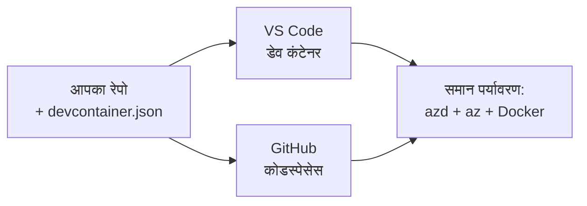

# Dev Containers & GitHub Codespaces for azd

**Chapter Navigation:**
- **📚 पाठ्यक्रम होम**: [AZD शुरुआती के लिए](../../README.md)
- **📖 वर्तमान अध्याय**: अध्याय 1 - आधार और त्वरित प्रारंभ
- **⬅️ पिछला**: [अपना ऐप लाएँ](bring-your-own-app.md)
- **🚀 अगला अध्याय**: [अध्याय 2: AI-प्रथम विकास](../chapter-02-ai-development/README.md)

> जून 2026 में `azd 1.25.6` के साथ सत्यापित।

## Introduction

हर मशीन पर azd, सही भाषा रनटाइम, Docker, और Azure CLI स्थापित करना एक बोझ है—और यही सबसे बड़ी वजह है कि एक ट्यूटोरियल जो "मेरी मशीन पर चलता है" किसी और के लिए विफल हो जाता है। एक देव कंटेनर (dev container) इस समस्या को हल करता है क्योंकि यह आपकी पूरी टूलचेन को एक फ़ाइल में वर्णित कर देता है। कोई भी जो प्रोजेक्ट को VS Code या GitHub Codespaces में खोलता है, वही समान वातावरण पाता है, जिसमें azd पहले से इंस्टॉल होता है। यह पाठ आपको दिखाता है कि इसे कैसे जोड़ें।

## Learning Goals

पाठ के अंत तक, आप:
- समझ पाएँगे कि dev container क्या है और azd के साथ यह कैसे मदद करता है
- किसी प्रोजेक्ट में न्यूनतम `.devcontainer/devcontainer.json` जोड़ना सीखेंगे
- Dev Container *features* के माध्यम से azd, Azure CLI, और Docker शामिल करें
- प्रोजेक्ट को GitHub Codespaces या VS Code में खोलना सीखेंगे

## Learning Outcomes

इस पाठ को पूरा करने के बाद, आप सक्षम होंगे:
- azd प्रोजेक्ट के लिए `devcontainer.json` लिखना
- मैन्युअल इंस्टॉल के बिना azd और Azure टूलिंग जोड़ना
- कंटेनर या Codespace के अंदर से `azd up` चलाना

---

## What Is a Dev Container?

एक dev container आपके रिपॉज़िटरी में `.devcontainer/devcontainer.json` फ़ाइल द्वारा परिभाषित Docker-आधारित विकास वातावरण है। जब आप प्रोजेक्ट खोलते हैं:

- **VS Code** (Dev Containers एक्सटेंशन के साथ) कंटेनर बनाता है और उससे जुड़ता है।
- **GitHub Codespaces** क्लाउड में वही कंटेनर बनाता है और आपको ब्राउज़र-आधारित एडिटर देता है।

किसी भी तरह, हर योगदानकर्ता को एक समान टूल्स मिलते हैं—कोई "क्या आपने azd इंस्टॉल किया?" जैसी परेशानियाँ नहीं रहतीं।



---

## Step 1: Create the devcontainer File

Create `.devcontainer/devcontainer.json` in the root of your project:

```json
{
  "name": "azd-project",
  "image": "mcr.microsoft.com/devcontainers/base:bookworm",
  "features": {
    "ghcr.io/devcontainers/features/azure-cli:1": {},
    "ghcr.io/azure/azure-dev/azd:latest": {},
    "ghcr.io/devcontainers/features/docker-in-docker:2": {},
    "ghcr.io/devcontainers/features/node:1": {}
  },
  "customizations": {
    "vscode": {
      "extensions": [
        "ms-azuretools.azure-dev",
        "ms-azuretools.vscode-bicep"
      ]
    }
  },
  "forwardPorts": [3000],
  "postCreateCommand": "azd version"
}
```

What each part does:

| Key | Purpose |
|-----|---------|
| `image` | कंटेनर के लिए बेस ऑपरेटिंग सिस्टम |
| `features` | पूर्वनिर्मित इंस्टॉलर्स—यहाँ: Azure CLI, **azd**, Docker, और Node.js |
| `customizations.vscode.extensions` | azd और Bicep VS Code एक्सटेंशनों को स्वचालित रूप से इंस्टॉल करता है |
| `forwardPorts` | आपके ऐप का पोर्ट आपके ब्राउज़र के लिए एक्सपोज़ करता है |
| `postCreateCommand` | कंटेनर बनने के बाद एक बार चलता है (यहाँ, एक सैनिटी चेक) |

> `ghcr.io/azure/azure-dev/azd:latest` फीचर कंटेनर में azd पाने का आधिकारिक तरीका है। यदि आपको पुनरुत्पादनशीलता चाहिए तो किसी विशिष्ट संस्करण को पिन करें (उदा. `azd:1.25.6`)।

---

## Step 2: Match the Feature to Your App's Language

Swap the `node` feature for whatever your app uses:

```jsonc
// Python project
"ghcr.io/devcontainers/features/python:1": {},

// .NET project
"ghcr.io/devcontainers/features/dotnet:2": {},

// Java project
"ghcr.io/devcontainers/features/java:1": {},

// Go project
"ghcr.io/devcontainers/features/go:1": {}
```

Keep `docker-in-docker` if your `host` is `containerapp`, `aks`, or anything that builds a container image—azd needs Docker to build and push images.

---

## Step 3: Open It

**VS Code में:**
1. **Dev Containers** एक्सटेंशन इंस्टॉल करें।
2. प्रोजेक्ट फ़ोल्डर खोलें।
3. प्रॉम्प्ट होने पर **Reopen in Container** पर क्लिक करें (या *Dev Containers: Reopen in Container* चलाएँ)।

**GitHub Codespaces में:**
1. रेपो को GitHub पर पुश करें।
2. **Code → Codespaces → Create codespace on main** पर क्लिक करें।
3. कंटेनर के बिल्ड होने तक प्रतीक्षा करें—azd टर्मिनल में तैयार है।

---

## Step 4: Deploy From Inside the Container

कंटेनर में azd पहले से इंस्टॉल होता है, इसलिए सामान्य वर्कफ़्लो वैसे ही काम करता है:

```bash
azd auth login --use-device-code   # डिवाइस कोड Codespaces के अंदर उपयोगी है
azd up
```

> **क्यों `--use-device-code`?** एक रिमोट कंटेनर या Codespace में रीडायरेक्ट करने के लिए स्थानीय ब्राउज़र नहीं होता, इसलिए device-code लॉगिन विश्वसनीय तरीका है। आप साइन-इन पूरा करने के लिए ब्राउज़र टैब में एक कोड पेस्ट करेंगे।

---

## Common Pitfalls

| Pitfall | Fix |
|---------|-----|
| `azd up` इमेज नहीं बना पा रहा है | `docker-in-docker` फीचर जोड़ें |
| Codespaces में ब्राउज़र लॉगिन अटक जाता है | `azd auth login --use-device-code` का उपयोग करें |
| टीम के सदस्यों के बीच टूल अलग होते हैं | फीचर वर्शन पिन करें (उदा. `azd:1.25.6`) |
| ऐप ब्राउज़र में पहुँच योग्य नहीं | पोर्ट को `forwardPorts` में जोड़ें |

---

## Summary

- एक dev container आपके azd टूलचेन को सभी के लिए पुनरुत्पादन योग्य बनाता है।
- Dev Container *features* के माध्यम से azd, Azure CLI, और Docker जोड़ें।
- भाषा फीचर को अपने ऐप से मिलाएँ और कंटेनर होस्ट्स के लिए `docker-in-docker` रखें।
- Codespaces के अंदर चलाते समय device-code लॉगिन का उपयोग करें।

---

## 🔗 नेविगेशन

| Direction | Resource |
|-----------|----------|
| **पिछला** | [अपना ऐप लाएँ](bring-your-own-app.md) |
| **अध्याय गृह** | [अध्याय 1: आधार और त्वरित प्रारंभ](README.md) |
| **अगला अध्याय** | [अध्याय 2: AI-प्रथम विकास](../chapter-02-ai-development/README.md) |

## 📖 संबंधित संसाधन

- [स्थापना और सेटअप](installation.md)
- [कमांड चीट शीट](../../resources/cheat-sheet.md)
- [आधिकारिक Dev Containers विनिर्देश](https://containers.dev/)
- [azd Dev Container फीचर](https://github.com/Azure/azure-dev/tree/main/ext/devcontainer)

---

<!-- CO-OP TRANSLATOR DISCLAIMER START -->
**अस्वीकरण**:
इस दस्तावेज़ का अनुवाद AI अनुवाद सेवा [Co-op Translator](https://github.com/Azure/co-op-translator) का उपयोग करके किया गया है। जबकि हम सटीकता के लिए प्रयास करते हैं, कृपया ध्यान दें कि स्वचालित अनुवादों में त्रुटियाँ या अशुद्धियाँ हो सकती हैं। मूल दस्तावेज़ अपनी मूल भाषा में ही प्रामाणिक स्रोत माना जाना चाहिए। महत्वपूर्ण जानकारी के लिए, पेशेवर मानव अनुवाद की सिफारिश की जाती है। इस अनुवाद के उपयोग से उत्पन्न किसी भी गलतफहमी या गलत व्याख्या के लिए हम उत्तरदायी नहीं हैं।
<!-- CO-OP TRANSLATOR DISCLAIMER END -->