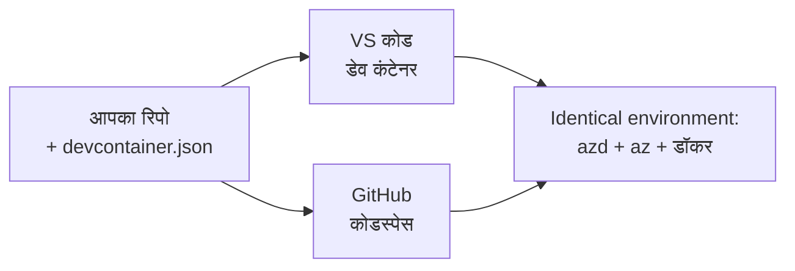

# azd के लिए Dev कंटेनर और GitHub Codespaces

**अध्याय नेविगेशन:**
- **📚 कोर्स होम**: [AZD प्रारंभिक के लिए](../../README.md)
- **📖 वर्तमान अध्याय**: अध्याय 1 - आधार और त्वरित प्रारंभ
- **⬅️ पिछला**: [अपना स्वयं का ऐप लाएं](bring-your-own-app.md)
- **🚀 अगला अध्याय**: [अध्याय 2: AI-प्रथम विकास](../chapter-02-ai-development/README.md)

> जुलाई 2026 में `azd 1.27.1` के खिलाफ सत्यापित।

## परिचय

हर मशीन पर azd, सही भाषा रनटाइम, Docker, और Azure CLI इंस्टॉल करना एक काम है—और यह सबसे बड़ा कारण है कि एक ट्यूटोरियल जो "मेरी मशीन पर काम करता है" किसी और के लिए असफल क्यों होता है। एक **Dev कंटेनर** इस समस्या को तब हल करता है जब आपकी पूरी टूलचेन को एक फ़ाइल में परिभाषित किया जाता है। कोई भी जो VS Code या GitHub Codespaces में प्रोजेक्ट खोलता है उसे बिल्कुल वही वातावरण मिलता है, जिसमें पहले से azd इंस्टॉल होता है। यह पाठ आपको इसे जोड़ना सिखाएगा।

## सीखने के लक्ष्य

इस पाठ के अंत तक, आप:
- समझेंगे कि Dev कंटेनर क्या है और यह azd के साथ कैसे मदद करता है
- एक न्यूनतम `.devcontainer/devcontainer.json` एक प्रोजेक्ट में जोड़ेंगे
- Dev Container *features* के माध्यम से azd, Azure CLI, और Docker शामिल करेंगे
- प्रोजेक्ट को GitHub Codespaces या VS Code में खोलेंगे

## सीखने के परिणाम

इस पाठ को पूरा करने के बाद, आप सक्षम होंगे:
- एक azd प्रोजेक्ट के लिए `devcontainer.json` लिखना
- बिना मैनुअल इंस्टॉल के azd और Azure टूलिंग जोड़ना
- कंटेनर या Codespace के अंदर से `azd up` चलाना

---

## Dev कंटेनर क्या है?

एक Dev कंटेनर एक Docker-आधारित विकास पर्यावरण है जो आपके रिपॉजिटरी में `.devcontainer/devcontainer.json` फ़ाइल द्वारा परिभाषित होता है। जब आप प्रोजेक्ट खोलते हैं:

- **VS Code** (Dev Containers एक्सटेंशन के साथ) कंटेनर बनाता है और उससे जुड़ता है।
- **GitHub Codespaces** क्लाउड में वही कंटेनर बनाता है और आपको एक ब्राउज़र-आधारित संपादक देता है।

दोनों ही मामलों में, हर योगदानकर्ता को समान उपकरण मिलते हैं—"क्या आपने azd इंस्टॉल किया?" जैसी समस्या नहीं होती।



---

## चरण 1: devcontainer फ़ाइल बनाएँ

अपने प्रोजेक्ट की रूट में `.devcontainer/devcontainer.json` बनाएँ:

```json
{
  "name": "azd-project",
  "image": "mcr.microsoft.com/devcontainers/base:bookworm",
  "features": {
    "ghcr.io/devcontainers/features/azure-cli:1": {},
    "ghcr.io/azure/azure-dev/azd:latest": {},
    "ghcr.io/devcontainers/features/docker-in-docker:2": {},
    "ghcr.io/devcontainers/features/node:1": {}
  },
  "customizations": {
    "vscode": {
      "extensions": [
        "ms-azuretools.azure-dev",
        "ms-azuretools.vscode-bicep"
      ]
    }
  },
  "forwardPorts": [3000],
  "postCreateCommand": "azd version"
}
```

हर हिस्से का कार्य:

| कुंजी | उद्देश्य |
|-----|---------|
| `image` | कंटेनर के लिए बेस OS |
| `features` | पूर्वनिर्मित इंस्टॉलर—यहाँ: Azure CLI, **azd**, Docker, और Node.js |
| `customizations.vscode.extensions` | azd और Bicep VS Code एक्सटेंशंस को स्वतः स्थापित करता है |
| `forwardPorts` | आपके ऐप के पोर्ट को आपके ब्राउज़र के लिए खोलता है |
| `postCreateCommand` | कंटेनर बिल्ड होने के बाद एक बार चलता है (यहाँ, संजीदगी जांच) |

> `ghcr.io/azure/azure-dev/azd:latest` फ़ीचर कंटेनर में azd पाने का आधिकारिक तरीका है। यदि आपको पुनरुत्पादकता की आवश्यकता है तो एक निश्चित संस्करण पिन करें (उदाहरण के लिए `azd:1.27.1`)।

---

## चरण 2: अपने ऐप की भाषा से फीचर मेल करें

`node` फीचर को उस भाषा से बदलें जो आपका ऐप उपयोग करता है:

```jsonc
// Python project
"ghcr.io/devcontainers/features/python:1": {},

// .NET project
"ghcr.io/devcontainers/features/dotnet:2": {},

// Java project
"ghcr.io/devcontainers/features/java:1": {},

// Go project
"ghcr.io/devcontainers/features/go:1": {}
```

यदि आपका `host` `containerapp`, `aks`, या ऐसा कुछ है जो कंटेनर इमेज बनाता है तो `docker-in-docker` रखें—azd को इमेज बनाने और पुश करने के लिए Docker की जरूरत होती है।

---

## चरण 3: इसे खोलें

**VS Code में:**
1. **Dev Containers** एक्सटेंशन इंस्टॉल करें।
2. प्रोजेक्ट फोल्डर खोलें।
3. जब पूछा जाए तो **Reopen in Container** पर क्लिक करें (या *Dev Containers: Reopen in Container* चलाएँ)।

**GitHub Codespaces में:**
1. रिपॉज़िटरी को GitHub पर पुश करें।
2. **Code → Codespaces → Create codespace on main** पर क्लिक करें।
3. कंटेनर के बनने का इंतजार करें—टर्मिनल में azd तैयार है।

---

## चरण 4: कंटेनर के अंदर से डिप्लॉय करें

कंटेनर में azd पहले से इंस्टॉल होता है, इसलिए सामान्य कार्यप्रवाह वैसे ही काम करता है:

```bash
azd auth login --use-device-code   # डिवाइस कोड Codespaces के अंदर उपयोगी है
azd up
```

> **`--use-device-code` क्यों?** रिमोट कंटेनर या Codespace में कोई लोकल ब्राउज़र नहीं होता जहाँ रीडायरेक्ट किया जा सके, इसलिए डिवाइस-कोड लॉगिन विश्वसनीय तरीका है। आप साइन-इन पूरा करने के लिए कोड को एक ब्राउज़र टैब में पेस्ट करेंगे।

---

## सामान्य समस्याएँ

| समस्या | समाधान |
|---------|-----|
| `azd up` इमेज नहीं बना पाता | `docker-in-docker` फ़ीचर जोड़ें |
| Codespaces में ब्राउज़र लॉगिन अटक जाता है | `azd auth login --use-device-code` का उपयोग करें |
| टीम में उपकरण अलग-अलग होते हैं | फीचर संस्करण पिन करें (जैसे `azd:1.27.1`) |
| ब्राउज़र में ऐप पहुंच योग्य नहीं | पोर्ट को `forwardPorts` में जोड़ें |

---

## सारांश

- एक Dev कंटेनर आपकी azd टूलचेन को सभी के लिए पुनरुत्पादक बनाता है।
- Dev Container *features* के ज़रिए azd, Azure CLI और Docker जोड़ें।
- अपनी ऐप की भाषा के अनुसार फीचर मिलाएँ और कंटेनर होस्ट के लिए `docker-in-docker` रखें।
- Codespaces के अंदर चलाते समय डिवाइस-कोड लॉगिन का उपयोग करें।

---

## 🔗 नेविगेशन

| दिशा | संसाधन |
|-----------|----------|
| **पिछला** | [अपना स्वयं का ऐप लाएं](bring-your-own-app.md) |
| **अध्याय होम** | [अध्याय 1: आधार और त्वरित प्रारंभ](README.md) |
| **अगला अध्याय** | [अध्याय 2: AI-प्रथम विकास](../chapter-02-ai-development/README.md) |

## 📖 संबंधित संसाधन

- [इंस्टॉलेशन और सेटअप](installation.md)
- [कमांड चीट शीट](../../resources/cheat-sheet.md)
- [आधिकारिक Dev Containers विनिर्देशन](https://containers.dev/)
- [azd Dev Container फीचर](https://github.com/Azure/azure-dev/tree/main/ext/devcontainer)

---

<!-- CO-OP TRANSLATOR DISCLAIMER START -->
**अस्वीकरण**:
इस दस्तावेज़ का अनुवाद AI अनुवाद सेवा [Co-op Translator](https://github.com/Azure/co-op-translator) का उपयोग करके किया गया है। जबकि हम सटीकता के लिए प्रयास करते हैं, कृपया ध्यान दें कि स्वचालित अनुवादों में त्रुटियाँ या अशुद्धियाँ हो सकती हैं। मूल दस्तावेज़ अपनी मूल भाषा में ही प्रामाणिक स्रोत माना जाना चाहिए। महत्वपूर्ण जानकारी के लिए, पेशेवर मानव अनुवाद की सिफारिश की जाती है। इस अनुवाद के उपयोग से उत्पन्न किसी भी गलतफहमी या गलत व्याख्या के लिए हम उत्तरदायी नहीं हैं।
<!-- CO-OP TRANSLATOR DISCLAIMER END -->