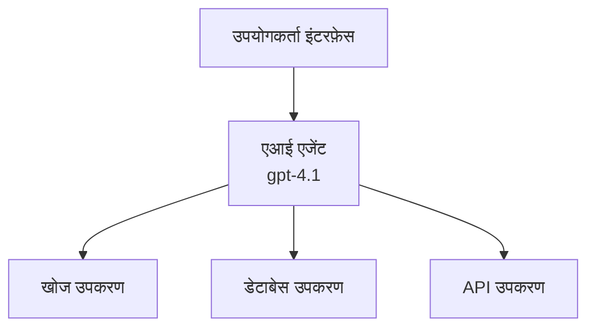
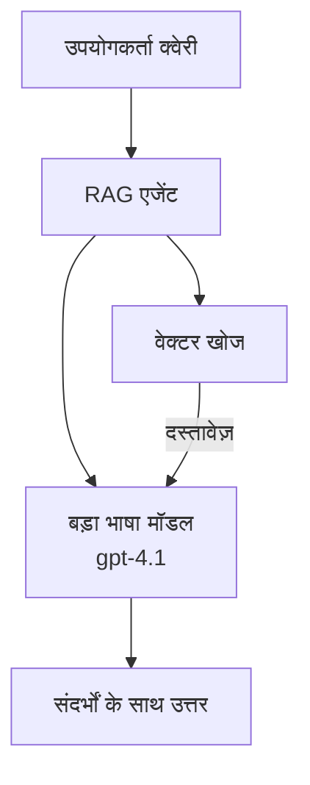
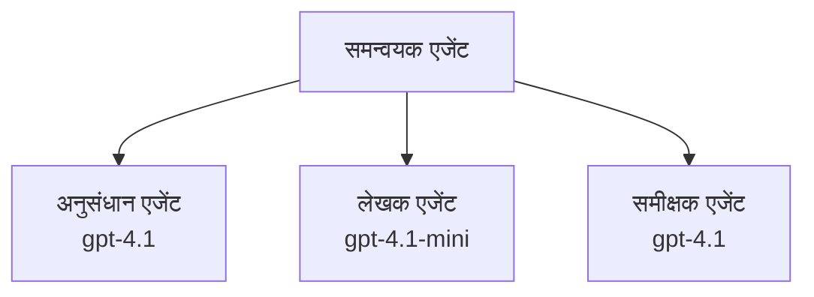

# Azure Developer CLI के साथ AI एजेंट्स

**अध्याय नेविगेशन:**
- **📚 Course Home**: [AZD शुरुआती के लिए](../../README.md)
- **📖 Current Chapter**: अध्याय 2 - AI-प्रथम विकास
- **⬅️ Previous**: [Microsoft Foundry एकीकरण](microsoft-foundry-integration.md)
- **➡️ Next**: [AI मॉडल परिनियोजन](ai-model-deployment.md)
- **🚀 Advanced**: [मल्टी-एजेंट समाधान](../../examples/retail-scenario.md)

---

## परिचय

AI एजेंट स्वायत्त प्रोग्राम होते हैं जो अपने पर्यावरण को समझ सकते हैं, निर्णय ले सकते हैं, और विशिष्ट लक्ष्यों को प्राप्त करने के लिए क्रियाएँ कर सकते हैं। सरल चैटबॉट्स जो प्रॉम्प्ट का उत्तर देते हैं, उनसे अलग एजेंट ये कर सकते हैं:

- **उपकरणों का उपयोग करें** - APIs कॉल करना, डेटाबेस खोजना, कोड निष्पादित करना
- **योजना बनाना और तर्क करना** - जटिल कार्यों को चरणों में विभाजित करना
- **संदर्भ से सीखना** - स्मृति बनाए रखना और व्यवहार अनुकूलित करना
- **सहयोग करना** - अन्य एजेंटों के साथ काम करना (मल्टी-एजेंट सिस्टम्स)

यह मार्गदर्शिका आपको दिखाती है कि Azure Developer CLI (azd) का उपयोग करके Azure पर AI एजेंट कैसे परिनियोजित करें।

> **सत्यापन नोट (2026-03-25):** इस मार्गदर्शिका की समीक्षा `azd` `1.23.12` और `azure.ai.agents` `0.1.18-preview` के विरुद्ध की गई थी। `azd ai` अनुभव अभी भी प्रीव्यू-आधारित है, इसलिए यदि आपके इंस्टॉल किए गए फ़्लैग भिन्न हैं तो अपने इंस्टॉल किए गए एक्सटेंशन के लिए सहायता जाँचें।

## सीखने के लक्ष्य

By completing this guide, you will:
- समझें कि AI एजेंट क्या हैं और वे चैटबॉट्स से कैसे भिन्न हैं
- AZD का उपयोग करके प्री-बिल्ट AI एजेंट टेम्पलेट परिनियोजित करें
- कस्टम एजेंट्स के लिए Foundry Agents कॉन्फ़िगर करें
- बुनियादी एजेंट पैटर्न लागू करें (टूल उपयोग, RAG, मल्टी-एजेंट)
- परिनियोजित एजेंटों की निगरानी और डिबग करें

## सीखने के परिणाम

समाप्त करने पर, आप सक्षम होंगे:
- एक ही कमांड से Azure पर AI एजेंट एप्लिकेशन परिनियोजित कर पाएंगे
- एजेंट टूल और क्षमताओं को कॉन्फ़िगर कर पाएंगे
- एजेंट्स के साथ रिट्रीवल-ऑगमेंटेड जेनेरेशन (RAG) लागू कर पाएंगे
- जटिल वर्कफ़्लो के लिए मल्टी-एजेंट आर्किटेक्चर डिज़ाइन कर पाएंगे
- सामान्य एजेंट परिनियोजन समस्याओं को ट्रबलशूट कर पाएंगे

---

## 🤖 एजेंट को चैटबॉट से अलग क्या बनाता है?

| विशेषता | चैटबॉट | AI एजेंट |
|---------|---------|----------|
| **व्यवहार** | प्रॉम्प्ट का उत्तर देता है | स्वायत्त कार्रवाइयाँ करता है |
| **उपकरण** | नहीं | API कॉल कर सकता है, खोज कर सकता है, कोड निष्पादित कर सकता है |
| **स्मृति** | केवल सत्र-आधारित | सत्रों के पार स्थायी स्मृति |
| **योजना** | एकल उत्तर | बहु-चरण तर्क |
| **सहयोग** | एकल इकाई | अन्य एजेंटों के साथ काम कर सकता है |

### सरल उपमा

- **चैटबॉट** = एक सहायक व्यक्ति जो सूचना डेस्क पर प्रश्नों का उत्तर देता है
- **AI एजेंट** = एक व्यक्तिगत सहायक जो कॉल कर सकता है, नियुक्तियाँ बुक कर सकता है, और आपके लिए कार्य पूरे कर सकता है

---

## 🚀 त्वरित आरंभ: अपना पहला एजेंट परिनियोजित करें

### विकल्प 1: Foundry Agents टेम्पलेट (अनुशंसित)

```bash
# एआई एजेंटों के टेम्पलेट को आरंभ करें
azd init --template get-started-with-ai-agents

# Azure पर तैनात करें
azd up
```

**क्या परिनियोजित होता है:**
- ✅ Foundry Agents
- ✅ Microsoft Foundry Models (gpt-4.1)
- ✅ Azure AI Search (RAG के लिए)
- ✅ Azure Container Apps (वेब इंटरफ़ेस)
- ✅ Application Insights (निगरानी)

**समय:** ~15-20 मिनट
**लागत:** ~$100-150/माह (डेवलपमेंट)

### विकल्प 2: Prompty के साथ OpenAI एजेंट

```bash
# Prompty-आधारित एजेंट टेम्पलेट को प्रारंभ करें
azd init --template agent-openai-python-prompty

# Azure पर तैनात करें
azd up
```

**क्या परिनियोजित होता है:**
- ✅ Azure Functions (सर्वरलेस एजेंट निष्पादन)
- ✅ Microsoft Foundry Models
- ✅ Prompty कॉन्फ़िगरेशन फ़ाइलें
- ✅ नमूना एजेंट कार्यान्वयन

**समय:** ~10-15 मिनट
**लागत:** ~$50-100/माह (डेवलपमेंट)

### विकल्प 3: RAG चैट एजेंट

```bash
# RAG चैट टेम्पलेट आरंभ करें
azd init --template azure-search-openai-demo

# Azure पर तैनात करें
azd up
```

**क्या परिनियोजित होता है:**
- ✅ Microsoft Foundry Models
- ✅ Azure AI Search नमूना डेटा के साथ
- ✅ दस्तावेज़ प्रसंस्करण पाइपलाइन
- ✅ उद्धरणों के साथ चैट इंटरफ़ेस

**समय:** ~15-25 मिनट
**लागत:** ~$80-150/माह (डेवलपमेंट)

### विकल्प 4: AZD AI Agent Init (मैनीफेस्ट- या टेम्पलेट-आधारित प्रीव्यू)

यदि आपके पास एजेंट मैनीफेस्ट फ़ाइल है, तो आप सीधे Foundry Agent Service प्रोजेक्ट स्कैफ़ोल्ड करने के लिए `azd ai` कमांड का उपयोग कर सकते हैं। हालिया प्रीव्यू रिलीज़ में टेम्पलेट-आधारित इनीशियलाइज़ेशन समर्थन भी जोड़ा गया है, इसलिए सटीक प्रॉम्प्ट फ्लो आपके इंस्टॉल किए गए एक्सटेंशन संस्करण के अनुसार थोड़ा भिन्न हो सकता है।

```bash
# AI एजेंट्स एक्सटेंशन इंस्टॉल करें
azd extension install azure.ai.agents

# वैकल्पिक: स्थापित प्रीव्यू संस्करण सत्यापित करें
azd extension show azure.ai.agents

# एजेंट मैनिफेस्ट से आरंभ करें
azd ai agent init -m agent-manifest.yaml

# Azure पर तैनात करें
azd up

# तैनात किए गए एजेंट का परीक्षण करें (लेटेंसी + पहली बाइट तक का समय दिखाता है)
azd ai agent invoke
```

**When to use `azd ai agent init` vs `azd init --template`:**

| पद्धति | सबसे अच्छा किसके लिए | यह कैसे काम करता है |
|----------|----------|------|
| `azd init --template` | एक काम करने वाले नमूना ऐप से शुरू करना | कोड + इन्फ्रा के साथ एक पूर्ण टेम्पलेट रिपो क्लोन करता है |
| `azd ai agent init -m` | अपने स्वयं के एजेंट मैनीफेस्ट से निर्माण करना | आपकी एजेंट परिभाषा से प्रोजेक्ट संरचना स्कैफ़ोल्ड करता है |

> **सुझाव:** सीखते समय `azd init --template` का उपयोग करें (उपर्युक्त विकल्प 1-3)। अपने मैनीफेस्ट के साथ प्रोडक्शन एजेंट बनाते समय `azd ai agent init` का उपयोग करें।

`azd up` के बाद, वही एक्सटेंशन आपको एजेंट लाइफसाइकल के शेष हिस्से में मार्गदर्शन करता है: परीक्षण के लिए `azd ai agent invoke`, गुणवत्ता मापने और सुधारने के लिए `azd ai agent eval generate` और `azd ai agent optimize`, और साफ़-सुथरा करने के लिए `azd ai agent delete`। पूर्ण संदर्भ के लिए [AZD AI CLI कमांड्स](../chapter-08-production/production-ai-practices.md#azd-ai-cli-commands-and-extensions) देखें।

---

## 🏗️ एजेंट आर्किटेक्चर पैटर्न

### पैटर्न 1: टूल्स के साथ एकल एजेंट

The simplest agent pattern - one agent that can use multiple tools.



**उपयुक्त:**
- कस्टमर सपोर्ट बॉट्स
- अनुसंधान सहायक
- डेटा विश्लेषण एजेंट्स

**AZD टेम्पलेट:** `azure-search-openai-demo`

### पैटर्न 2: RAG एजेंट (रिट्रीवल-ऑगमेंटेड जनरेशन)

एक एजेंट जो उत्तर उत्पन्न करने से पहले प्रासंगिक दस्तावेज़ प्राप्त करता है।



**उपयुक्त:**
- एंटरप्राइज़ नॉलेज बेस
- दस्तावेज़ प्रश्नोत्तर सिस्टम
- अनुपालन और कानूनी अनुसंधान

**AZD टेम्पलेट:** `azure-search-openai-demo`

### पैटर्न 3: मल्टी-एजेंट सिस्टम

एक साथ जटिल कार्यों पर काम करने वाले कई विशेषीकृत एजेंट।



**उपयुक्त:**
- जटिल सामग्री निर्माण
- बहु-चरण वर्कफ़्लो
- ऐसे कार्य जिन्हें विभिन्न विशेषज्ञता की आवश्यकता हो

**अधिक जानें:** [मल्टी-एजेंट समन्वय पैटर्न](../chapter-06-pre-deployment/coordination-patterns.md)

---

## ⚙️ एजेंट टूल्स को कॉन्फ़िगर करना

एजेंट शक्तिशाली बनते हैं जब वे टूल्स का उपयोग कर सकते हैं। सामान्य टूल्स को कॉन्फ़िगर करने का तरीका यहाँ है:

### Foundry Agents में टूल कॉन्फ़िगरेशन

```python
# agent_config.py
from azure.ai.projects import AIProjectClient
from azure.ai.projects.models import FunctionTool, CodeInterpreterTool

# कस्टम टूल्स परिभाषित करें
search_tool = FunctionTool(
    name="search_knowledge_base",
    description="Search the company knowledge base for relevant documents",
    parameters={
        "type": "object",
        "properties": {
            "query": {
                "type": "string",
                "description": "The search query"
            }
        },
        "required": ["query"]
    }
)

# टूल्स के साथ एजेंट बनाएं
agent = project_client.agents.create_agent(
    model="gpt-4.1",
    name="Support Agent",
    instructions="You are a helpful support agent. Use the search tool to find relevant information.",
    tools=[search_tool, CodeInterpreterTool()]
)
```

### पर्यावरण कॉन्फ़िगरेशन

```bash
# एजेंट-विशिष्ट पर्यावरण चर सेट करें
azd env set AZURE_OPENAI_MODEL "gpt-4.1"
azd env set AGENT_INSTRUCTIONS "You are a helpful assistant..."
azd env set ENABLE_CODE_INTERPRETER "true"
azd env set ENABLE_FILE_SEARCH "true"

# अद्यतन विन्यास के साथ तैनात करें
azd deploy
```

---

## 📊 एजेंट्स की निगरानी

### Application Insights एकीकरण

सभी AZD एजेंट टेम्पलेट्स निगरानी के लिए Application Insights शामिल करते हैं:

```bash
# मॉनिटरिंग डैशबोर्ड खोलें
azd monitor --overview

# लाइव लॉग्स देखें
azd monitor --logs

# लाइव मेट्रिक्स देखें
azd monitor --live
```

### ट्रैक करने के लिए प्रमुख मीट्रिक

| मीट्रिक | वर्णन | लक्ष्य |
|--------|-------------|--------|
| प्रतिक्रिया विलंबता | उत्तर उत्पन्न करने का समय | < 5 सेकंड |
| टोकन उपयोग | प्रति अनुरोध टोकन | लागत के लिए निगरानी |
| टूल कॉल सफलता दर | सफल टूल निष्पादन का % | > 95% |
| त्रुटि दर | विफल एजेंट अनुरोध | < 1% |
| उपयोगकर्ता संतुष्टि | फीडबैक स्कोर | > 4.0/5.0 |

### एजेंट्स के लिए कस्टम लॉगिंग

```python
import os
from azure.monitor.opentelemetry import configure_azure_monitor
from opentelemetry import trace

# OpenTelemetry के साथ Azure Monitor कॉन्फ़िगर करें
configure_azure_monitor(
    connection_string=os.environ["APPLICATIONINSIGHTS_CONNECTION_STRING"]
)

tracer = trace.get_tracer(__name__)

def log_agent_interaction(user_query, agent_response, tools_used, latency_ms):
    with tracer.start_as_current_span("agent_interaction") as span:
        span.set_attributes({
            "user_query": user_query,
            "response_length": len(agent_response),
            "tools_used": tools_used,
            "latency_ms": latency_ms
        })
```

> **नोट:** आवश्यक पैकेज इंस्टॉल करें: `pip install azure-monitor-opentelemetry opentelemetry`

---

## 💰 लागत विचार

### पैटर्न के अनुसार अनुमानित मासिक लागत

| पैटर्न | डेव वातावरण | प्रोडक्शन |
|---------|-----------------|------------|
| एकल एजेंट | $50-100 | $200-500 |
| RAG एजेंट | $80-150 | $300-800 |
| मल्टी-एजेंट (2-3 एजेंट) | $150-300 | $500-1,500 |
| एंटरप्राइज़ मल्टी-एजेंट | $300-500 | $1,500-5,000+ |

### लागत अनुकूलन सुझाव

1. **साधारण कार्यों के लिए gpt-4.1-mini का उपयोग करें**
   ```bash
   azd env set AZURE_OPENAI_MODEL "gpt-4.1-mini"
   ```

2. **बार-बार पूछताछ के लिए कैशिंग लागू करें**
   ```python
   from functools import lru_cache
   
   @lru_cache(maxsize=1000)
   def get_cached_response(query_hash):
       return agent.run(query_hash)
   ```

3. **प्रति रन टोकन सीमाएँ सेट करें**
   ```python
   # एजेंट चलाते समय max_completion_tokens सेट करें, निर्माण के दौरान नहीं
   run = project_client.agents.create_run(
       thread_id=thread.id,
       agent_id=agent.id,
       max_completion_tokens=1000  # प्रतिक्रिया की लंबाई सीमित करें
   )
   ```

4. **जब उपयोग में न हो तो शून्य तक स्केल करें**
   ```bash
   # Container Apps स्वचालित रूप से शून्य तक स्केल हो जाते हैं
   azd env set MIN_REPLICAS "0"
   ```

---

## 🔧 एजेंट्स की समस्या निवारण

### सामान्य समस्याएँ और समाधान

<details>
<summary><strong>❌ टूल कॉल्स का उत्तर नहीं दे रहा एजेंट</strong></summary>

```bash
# जांचें कि उपकरण सही ढंग से पंजीकृत हैं
azd show

# OpenAI की तैनाती सत्यापित करें
az cognitiveservices account deployment list \
  --name $AZURE_OPENAI_NAME \
  --resource-group $RG_NAME

# एजेंट लॉग्स की जाँच करें
azd monitor --logs
```

**सामान्य कारण:**
- टूल फ़ंक्शन सिग्नेचर असंगतता
- आवश्यक अनुमतियाँ गायब
- API एंडपॉइंट उपलब्ध नहीं है
</details>

<details>
<summary><strong>❌ एजेंट प्रतिक्रियाओं में उच्च विलंबता</strong></summary>

```bash
# बॉटलनेक्स के लिए Application Insights की जाँच करें
azd monitor --live

# एक तेज़ मॉडल का उपयोग करने पर विचार करें
azd env set AZURE_OPENAI_MODEL "gpt-4.1-mini"
azd deploy
```

**ऑप्टिमाइज़ेशन सुझाव:**
- स्ट्रीमिंग प्रतिक्रियाओं का उपयोग करें
- प्रतिक्रिया कैशिंग लागू करें
- कॉन्टेक्स्ट विंडो साइज घटाएँ
</details>

<details>
<summary><strong>❌ एजेंट गलत या कल्पित जानकारी लौटाना</strong></summary>

```python
# बेहतर सिस्टम प्रॉम्प्ट के साथ सुधार करें
instructions = """
You are a helpful assistant. IMPORTANT:
- Only answer based on provided context
- If you don't know, say "I don't know"
- Always cite your sources
- Never make up information
"""

# ग्राउंडिंग के लिए पुनर्प्राप्ति जोड़ें
agent = project_client.agents.create_agent(
    model="gpt-4.1",
    instructions=instructions,
    tools=[FileSearchTool()]  # प्रतिक्रियाओं को दस्तावेज़ों में आधारित करें
)
```
</details>

<details>
<summary><strong>❌ टोकन सीमा पार हुई त्रुटियाँ</strong></summary>

```python
# संदर्भ विंडो प्रबंधन लागू करें
def truncate_context(messages, max_tokens=8000, model="gpt-4.1"):
    """Keep only recent messages within token limit."""
    import tiktoken
    encoding = tiktoken.encoding_for_model(model)
    total_tokens = 0
    truncated = []
    
    for msg in reversed(messages):
        msg_tokens = len(encoding.encode(msg.content))
        if total_tokens + msg_tokens > max_tokens:
            break
        truncated.insert(0, msg)
        total_tokens += msg_tokens
    
    return truncated
```
</details>

---

## 🎓 व्यावहारिक अभ्यास

### अभ्यास 1: एक बेसिक एजेंट परिनियोजित करें (20 मिनट)

**लक्ष्य:** AZD का उपयोग करके अपना पहला AI एजेंट परिनियोजित करें

```bash
# चरण 1: टेम्पलेट आरंभ करें
azd init --template get-started-with-ai-agents

# चरण 2: Azure में लॉगिन करें
azd auth login
# यदि आप कई टेनेंट्स पर काम कर रहे हैं, तो --tenant-id <tenant-id> जोड़ें

# चरण 3: तैनात करें
azd up

# चरण 4: एजेंट का परीक्षण करें
# तैनाती के बाद अपेक्षित आउटपुट:
#   तैनाती पूर्ण!
#   एंडपॉइंट: https://<app-name>.<region>.azurecontainerapps.io
# आउटपुट में दिखाया गया URL खोलें और कोई प्रश्न पूछकर देखें

# चरण 5: मॉनिटरिंग देखें
azd monitor --overview

# चरण 6: संसाधनों की सफाई करें
azd down --force --purge
```

**सफलता मानदंड:**
- [ ] एजेंट सवालों का उत्तर देता है
- [ ] `azd monitor` के माध्यम से मॉनिटरिंग डैशबोर्ड तक पहुँच सकता है
- [ ] संसाधन सफलतापूर्वक क्लीनअप किए गए

### अभ्यास 2: एक कस्टम टूल जोड़ें (30 मिनट)

**लक्ष्य:** एक कस्टम टूल के साथ एजेंट का विस्तार करें

1. एजेंट टेम्पलेट परिनियोजित करें:
   ```bash
   azd init --template get-started-with-ai-agents
   azd up
   ```
2. अपने एजेंट कोड में एक नया टूल फ़ंक्शन बनाएं:
   ```python
   def get_weather(location: str) -> str:
       """Get current weather for a location."""
       # मौसम सेवा के लिए API कॉल
       return f"Weather in {location}: Sunny, 72°F"
   ```
3. उस टूल को एजेंट के साथ रजिस्टर करें:
   ```python
   from azure.ai.projects.models import FunctionTool

   weather_tool = FunctionTool(
       name="get_weather",
       description="Get current weather for a location",
       parameters={
           "type": "object",
           "properties": {
               "location": {"type": "string", "description": "City name"}
           },
           "required": ["location"]
       }
   )

   agent = project_client.agents.create_agent(
       model="gpt-4.1",
       name="Weather Agent",
       tools=[weather_tool]
   )
   ```
4. पुनः परिनियोजित करें और परीक्षण करें:
   ```bash
   azd deploy
   # पूछें: "सिएटल में मौसम कैसा है?"
   # अपेक्षित: एजेंट get_weather("Seattle") को कॉल करता है और मौसम की जानकारी लौटाता है
   ```

**सफलता मानदंड:**
- [ ] एजेंट मौसम-संबंधी प्रश्नों को पहचानता है
- [ ] टूल सही तरीके से कॉल होता है
- [ ] प्रतिक्रिया में मौसम की जानकारी शामिल है

### अभ्यास 3: एक RAG एजेंट बनाएं (45 मिनट)

**लक्ष्य:** ऐसा एजेंट बनाएं जो आपके दस्तावेज़ों से प्रश्नों का उत्तर दे

```bash
# चरण 1: RAG टेम्पलेट तैनात करें
azd init --template azure-search-openai-demo
azd up

# चरण 2: अपने दस्तावेज़ अपलोड करें
# PDF/TXT फ़ाइलों को data/ निर्देशिका में रखें, फिर चलाएँ:
python scripts/prepdocs.py

# चरण 3: डोमेन-विशिष्ट प्रश्नों के साथ परीक्षण करें
# azd up आउटपुट से वेब ऐप URL खोलें
# अपने अपलोड किए गए दस्तावेज़ों के बारे में प्रश्न पूछें
# प्रतिक्रियाओं में [doc.pdf] जैसे उद्धरण संदर्भ शामिल होने चाहिए
```

**सफलता मानदंड:**
- [ ] एजेंट अपलोड किए गए दस्तावेज़ों से उत्तर देता है
- [ ] प्रतिक्रियाओं में उद्धरण शामिल हों
- [ ] आउट-ऑफ-स्कोप प्रश्नों पर कोई कल्पना नहीं हो

---

## 📚 अगले चरण

अब जब आप AI एजेंट्स को समझ चुके हैं, इन उन्नत विषयों का अन्वेषण करें:

| विषय | विवरण | लिंक |
|-------|-------------|------|
| **मल्टी-एजेंट सिस्टम्स** | कई सहयोगी एजेंट्स के साथ सिस्टम बनाएं | [रिटेल मल्टी-एजेंट उदाहरण](../../examples/retail-scenario.md) |
| **समन्वय पैटर्न** | ऑर्केस्ट्रेशन और संचार पैटर्न सीखें | [समन्वय पैटर्न](../chapter-06-pre-deployment/coordination-patterns.md) |
| **प्रोडक्शन परिनियोजन** | एंटरप्राइज़-तैयार एजेंट परिनियोजन | [प्रोडक्शन AI अभ्यास](../chapter-08-production/production-ai-practices.md) |
| **एजेंट मूल्यांकन** | एजेंट प्रदर्शन का परीक्षण और मूल्यांकन | [AI समस्या निवारण](../chapter-07-troubleshooting/ai-troubleshooting.md) |
| **AI वर्कशॉप लैब** | व्यावहारिक: अपने AI समाधान को AZD-तैयार बनाएं | [AI वर्कशॉप लैब](ai-workshop-lab.md) |

---

## 📖 अतिरिक्त संसाधन

### आधिकारिक दस्तावेज़ीकरण
- [Microsoft Foundry Agent सेवा](https://learn.microsoft.com/azure/ai-services/agents/)
- [Microsoft Foundry Agent सेवा क्विकस्टार्ट](https://learn.microsoft.com/azure/ai-services/agents/quickstart)
- [Semantic Kernel Agent फ्रेमवर्क](https://learn.microsoft.com/semantic-kernel/)

### एजेंट्स के लिए AZD टेम्पलेट्स
- [AI एजेंट्स के साथ शुरुआत करें](https://github.com/Azure-Samples/get-started-with-ai-agents)
- [एजेंट OpenAI Python Prompty](https://github.com/Azure-Samples/agent-openai-python-prompty)
- [Azure Search OpenAI डेमो](https://github.com/Azure-Samples/azure-search-openai-demo)

### सामुदायिक संसाधन
- [Awesome AZD - एजेंट टेम्पलेट्स](https://azure.github.io/awesome-azd/?tags=ai-agents)
- [Azure AI Discord](https://discord.gg/microsoft-azure)
- [Microsoft Foundry Discord](https://discord.gg/nTYy5BXMWG)

### आपके संपादक के लिए एजेंट स्किल्स
- [**Microsoft Azure Agent Skills**](https://skills.sh/microsoft/github-copilot-for-azure) - GitHub Copilot, Cursor, या किसी भी समर्थित एजेंट में Azure विकास के लिए पुन: प्रयोज्य AI एजेंट स्किल्स इंस्टॉल करें। इसमें [Azure AI](https://skills.sh/microsoft/github-copilot-for-azure/azure-ai), [Microsoft Foundry](https://skills.sh/microsoft/github-copilot-for-azure/microsoft-foundry), [डिप्लॉयमेंट](https://skills.sh/microsoft/github-copilot-for-azure/azure-deploy), और [डायग्नोस्टिक्स](https://skills.sh/microsoft/github-copilot-for-azure/azure-diagnostics) के लिए स्किल्स शामिल हैं:
  ```bash
  npx skills add microsoft/github-copilot-for-azure
  ```

---

**नेविगेशन**
- **पिछला पाठ**: [Microsoft Foundry एकीकरण](microsoft-foundry-integration.md)
- **अगला पाठ**: [AI मॉडल परिनियोजन](ai-model-deployment.md)

---

<!-- CO-OP TRANSLATOR DISCLAIMER START -->
**अस्वीकरण**:
इस दस्तावेज़ का अनुवाद AI अनुवाद सेवा [Co-op Translator](https://github.com/Azure/co-op-translator) का उपयोग करके किया गया है। जबकि हम सटीकता के लिए प्रयास करते हैं, कृपया ध्यान दें कि स्वचालित अनुवादों में त्रुटियाँ या अशुद्धियाँ हो सकती हैं। मूल दस्तावेज़ अपनी मूल भाषा में ही प्रामाणिक स्रोत माना जाना चाहिए। महत्वपूर्ण जानकारी के लिए, पेशेवर मानव अनुवाद की सिफारिश की जाती है। इस अनुवाद के उपयोग से उत्पन्न किसी भी गलतफहमी या गलत व्याख्या के लिए हम उत्तरदायी नहीं हैं।
<!-- CO-OP TRANSLATOR DISCLAIMER END -->