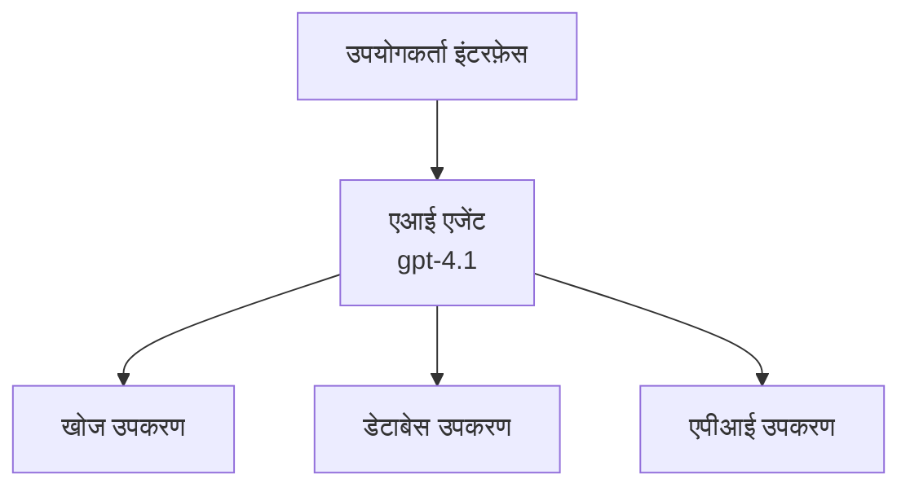
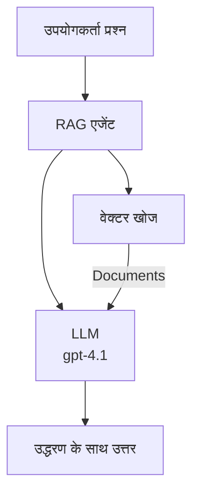
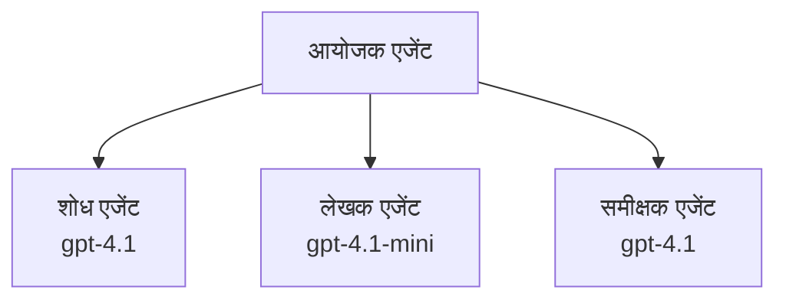

# Azure डेवलपर CLI के साथ AI एजेंट्स

**अध्याय नेविगेशन:**
- **📚 कोर्स होम**: [शुरुआती के लिए AZD](../../README.md)
- **📖 वर्तमान अध्याय**: अध्याय 2 - AI-प्रथम विकास
- **⬅️ पिछला**: [Microsoft Foundry इंटीग्रेशन](microsoft-foundry-integration.md)
- **➡️ अगला**: [AI मॉडल डिप्लॉयमेंट](ai-model-deployment.md)
- **🚀 उन्नत**: [मल्टी-एजेंट समाधान](../../examples/retail-scenario.md)

---

## परिचय

AI एजेंट्स स्वायत्त प्रोग्राम होते हैं जो अपने पर्यावरण को समझ सकते हैं, निर्णय ले सकते हैं, और विशिष्ट लक्ष्यों को प्राप्त करने के लिए क्रियाएँ कर सकते हैं। सरल चैटबॉट्स जो संकेतों का जवाब देते हैं, उनके विपरीत, एजेंट्स:

- **उपकरणों का उपयोग करें** - API कॉल करें, डेटाबेस खोजें, कोड निष्पादित करें
- **योजना बनाएं और तर्क करें** - जटिल कार्यों को चरणों में विभाजित करें
- **संदर्भ से सीखें** - स्मृति बनाए रखें और व्यवहार अनुकूलित करें
- **सहयोग करें** - अन्य एजेंट्स (मल्टी-एजेंट सिस्टम) के साथ काम करें

यह गाइड आपको Azure Developer CLI (azd) का उपयोग करके Azure पर AI एजेंट्स तैनात करना दिखाता है।

> **प्रमाणीकरण नोट (2026-07-13):** इस गाइड की समीक्षा `azd` `1.27.1` और `azure.ai.agents` `1.0.0-beta.5` के विरुद्ध की गई थी। `azd ai` अनुभव अभी भी प्रीव्यू-आधारित है, इसलिए यदि आपके इंस्टॉल किए गए फ्लैग्स अलग हैं तो एक्सटेंशन सहायता देखें।

## सीखने के लक्ष्य

इस गाइड को पूरा करके, आप:
- समझेंगे कि AI एजेंट्स क्या हैं और वे चैटबॉट्स से कैसे भिन्न हैं
- AZD का उपयोग करके पूर्व-निर्मित AI एजेंट टेम्प्लेट्स तैनात करेंगे
- कस्टम एजेंट्स के लिए Foundry एजेंट्स कॉन्फ़िगर करेंगे
- बुनियादी एजेंट पैटर्न (टूल उपयोग, RAG, मल्टी-एजेंट) को लागू करेंगे
- तैनात किए गए एजेंट्स की निगरानी और डीबगिंग करेंगे

## सीखने के परिणाम

पूर्ण होने पर, आप सक्षम होंगे:
- एक कमांड से Azure पर AI एजेंट ऐप्लिकेशन तैनात करना
- एजेंट टूल्स और क्षमताओं का कॉन्फिगरेशन करना
- एजेंट्स के साथ रिट्रीवल-ऑगमेंटेड जनरेशन (RAG) लागू करना
- जटिल वर्कफ़्लोज़ के लिए मल्टी-एजेंट आर्किटेक्चर डिज़ाइन करना
- सामान्य एजेंट तैनाती मुद्दों का समाधान करना

---

## 🤖 क्या चीज़ एजेंट को चैटबॉट से अलग बनाती है?

| विशेषता | चैटबॉट | AI एजेंट |
|---------|---------|----------|
| **व्यवहार** | संकेतों का जवाब देता है | स्वायत्त क्रियाएँ करता है |
| **उपकरण** | कोई नहीं | API कॉल कर सकता है, खोज सकता है, कोड निष्पादित कर सकता है |
| **स्मृति** | केवल सत्र-आधारित | सत्रों के बीच स्थायी स्मृति |
| **योजना बनाना** | एकल प्रतिक्रिया | बहु-चरण तर्क |
| **सहयोग** | एकल इकाई | अन्य एजेंट्स के साथ काम कर सकता है |

### सरल उपमा

- **चैटबॉट** = एक सहायक व्यक्ति जो सूचना डेस्क पर प्रश्नों का उत्तर देता है
- **AI एजेंट** = एक निजी सहायक जो कॉल कर सकता है, अपॉइंटमेंट बुक कर सकता है, और आपके लिए कार्य पूरा कर सकता है

---

## 🚀 त्वरित आरंभ: अपना पहला एजेंट तैनात करें

### विकल्प 1: Foundry एजेंट्स टेम्प्लेट (अनुशंसित)

```bash
# एआई एजेंट टेम्पलेट को प्रारंभ करें
azd init --template get-started-with-ai-agents

# Azure पर तैनात करें
azd up
```

**क्या तैनात होता है:**
- ✅ Foundry एजेंट्स
- ✅ Microsoft Foundry मॉडल्स (gpt-4.1)
- ✅ Azure AI Search (RAG के लिए)
- ✅ Azure Container Apps (वेब इंटरफेस)
- ✅ एप्लिकेशन इंसाइट्स (निरीक्षण)

**समय:** ~15-20 मिनट
**लागत:** ~$100-150/महीना (विकास)

### विकल्प 2: OpenAI एजेंट Prompty के साथ

```bash
# Prompty-आधारित एजेंट टेम्पलेट को प्रारंभ करें
azd init --template agent-openai-python-prompty

# Azure पर तैनात करें
azd up
```

**क्या तैनात होता है:**
- ✅ Azure Functions (सर्वरलेस एजेंट निष्पादन)
- ✅ Microsoft Foundry मॉडल्स
- ✅ Prompty कॉन्फ़िगरेशन फाइल्स
- ✅ नमूना एजेंट कार्यान्वयन

**समय:** ~10-15 मिनट
**लागत:** ~$50-100/महीना (विकास)

### विकल्प 3: RAG चैट एजेंट

```bash
# RAG चैट टेम्पलेट प्रारंभ करें
azd init --template azure-search-openai-demo

# Azure पर तैनात करें
azd up
```

**क्या तैनात होता है:**
- ✅ Microsoft Foundry मॉडल्स
- ✅ Azure AI Search नमूना डेटा के साथ
- ✅ दस्तावेज़ प्रसंस्करण पाइपलाइन
- ✅ संदर्भों के साथ चैट इंटरफेस

**समय:** ~15-25 मिनट
**लागत:** ~$80-150/महीना (विकास)

### विकल्प 4: AZD AI एजेंट इनिट (मैनिफेस्ट- या टेम्प्लेट-आधारित प्रीव्यू)

यदि आपके पास एजेंट मैनिफेस्ट फाइल है, तो आप सीधे Foundry एजेंट सेवा परियोजना स्कैफोल्ड करने के लिए `azd ai` कमांड का उपयोग कर सकते हैं। हाल की प्रीव्यू रिलीज़ ने टेम्प्लेट-आधारित इनिशियलाइजेशन सपोर्ट भी जोड़ा है, इसलिए आपके इंस्टॉल किए गए एक्सटेंशन संस्करण के आधार पर सटीक प्रश्न प्रवाह में थोड़ा अंतर हो सकता है।

```bash
# AI एजेंट एक्सटेंशन इंस्टॉल करें
azd extension install azure.ai.agents

# वैकल्पिक: इंस्टॉल किए गए प्रीव्यू संस्करण को सत्यापित करें
azd extension show azure.ai.agents

# एजेंट मैनिफेस्ट से प्रारंभ करें
azd ai agent init -m agent-manifest.yaml

# Azure पर तैनात करें
azd up

# तैनात किए गए एजेंट का परीक्षण करें (लेटेंसी + पहला बाइट आने का समय दिखाता है)
azd ai agent invoke
```

**`azd ai agent init` बनाम `azd init --template` कब उपयोग करें:**

| दृष्टिकोण | सर्वश्रेष्ठ उपयोग | यह कैसे काम करता है |
|----------|----------|------|
| `azd init --template` | काम करने वाले नमूना ऐप से शुरू करना | कोड + इन्फ्रा के साथ पूर्ण टेम्प्लेट रिपो क्लोन करता है |
| `azd ai agent init -m` | अपने स्वयं के एजेंट मैनिफेस्ट से निर्माण | आपके एजेंट परिभाषा से परियोजना संरचना स्कैफोल्ड करता है |

> **टिप:** सीखते समय `azd init --template` (ऊपर विकल्प 1-3) का उपयोग करें। अपने मैनिफेस्ट के साथ उत्पादन एजेंट बनाने के लिए `azd ai agent init` का उपयोग करें।

`azd up` के बाद, वही एक्सटेंशन एजेंट का बाकी जीवनचक्र संभालता है: परीक्षण के लिए `azd ai agent invoke`, गुणवत्ता मापने और सुधारने के लिए `azd ai agent eval generate` और `azd ai agent optimize`, और सफाई के लिए `azd ai agent delete`। पूर्ण संदर्भ के लिए [AZD AI CLI Commands](../chapter-08-production/production-ai-practices.md#azd-ai-cli-commands-and-extensions) देखें।

---

## 🏗️ एजेंट आर्किटेक्चर पैटर्न

### पैटर्न 1: टूल्स के साथ एकल एजेंट

सबसे सरल एजेंट पैटर्न - एक एजेंट जो कई उपकरणों का उपयोग कर सकता है।



**सर्वश्रेष्ठ उपयोग के लिए:**
- ग्राहक समर्थन बॉट्स
- शोध सहायकों
- डेटा विश्लेषण एजेंट्स

**AZD टेम्प्लेट:** `azure-search-openai-demo`

### पैटर्न 2: RAG एजेंट (रिट्रीवल-ऑगमेंटेड जनरेशन)

एक एजेंट जो प्रतिक्रियाएं उत्पन्न करने से पहले प्रासंगिक दस्तावेज़ खोजता है।



**सर्वश्रेष्ठ उपयोग के लिए:**
- उद्यम ज्ञान आधार
- दस्तावेज़ प्रश्नोत्तर प्रणाली
- अनुपालन और कानूनी शोध

**AZD टेम्प्लेट:** `azure-search-openai-demo`

### पैटर्न 3: मल्टी-एजेंट सिस्टम

जटिल कार्यों पर काम करने वाले कई विशेषज्ञ एजेंट्स।



**सर्वश्रेष्ठ उपयोग के लिए:**
- जटिल सामग्री निर्माण
- बहु-चरण कार्यप्रवाह
- विभिन्न विशेषज्ञता आवश्यक कार्य

**अधिक जानें:** [मल्टी-एजेंट समन्वय पैटर्न](../chapter-06-pre-deployment/coordination-patterns.md)

---

## ⚙️ एजेंट टूल्स का कॉन्फ़िगरेशन

एजेंट्स तब शक्तिशाली बनते हैं जब वे उपकरणों का उपयोग कर सकते हैं। यहाँ सामान्य उपकरणों को कॉन्फ़िगर करने का तरीका है:

### Foundry एजेंट्स में टूल कॉन्फ़िगरेशन

```python
# agent_config.py
from azure.ai.projects import AIProjectClient
from azure.ai.projects.models import FunctionTool, CodeInterpreterTool

# कस्टम टूल्स परिभाषित करें
search_tool = FunctionTool(
    name="search_knowledge_base",
    description="Search the company knowledge base for relevant documents",
    parameters={
        "type": "object",
        "properties": {
            "query": {
                "type": "string",
                "description": "The search query"
            }
        },
        "required": ["query"]
    }
)

# टूल्स के साथ एजेंट बनाएं
agent = project_client.agents.create_agent(
    model="gpt-4.1",
    name="Support Agent",
    instructions="You are a helpful support agent. Use the search tool to find relevant information.",
    tools=[search_tool, CodeInterpreterTool()]
)
```

### पर्यावरण कॉन्फ़िगरेशन

```bash
# एजेंट-विशिष्ट पर्यावरण चर सेट करें
azd env set AZURE_OPENAI_MODEL "gpt-4.1"
azd env set AGENT_INSTRUCTIONS "You are a helpful assistant..."
azd env set ENABLE_CODE_INTERPRETER "true"
azd env set ENABLE_FILE_SEARCH "true"

# अपडेट की गई कॉन्फ़िगरेशन के साथ परिनियोजित करें
azd deploy
```

---

## 📊 एजेंट्स की निगरानी

### एप्लिकेशन इंसाइट्स इंटीग्रेशन

सभी AZD एजेंट टेम्प्लेट्स में निगरानी के लिए एप्लिकेशन इंसाइट्स शामिल है:

```bash
# खुला निगरानी डैशबोर्ड
azd monitor --overview

# लाइव लॉग देखें
azd monitor --logs

# लाइव मेट्रिक्स देखें
azd monitor --live
```

### प्रमुख मीट्रिक्स जिन्हें ट्रैक करें

| मीट्रिक | विवरण | लक्ष्य |
|--------|-------------|--------|
| प्रतिक्रिया विलंब | प्रतिक्रिया उत्पन्न करने का समय | < 5 सेकंड |
| टोकन उपयोग | प्रति अनुरोध टोकन | लागत के लिए निगरानी |
| टूल कॉल सफलता दर | सफल टूल निष्पादनों का % | > 95% |
| त्रुटि दर | विकल एजेंट अनुरोध | < 1% |
| उपयोगकर्ता संतुष्टि | प्रतिक्रिया स्कोर | > 4.0/5.0 |

### एजेंट्स के लिए कस्टम लॉगिंग

```python
import os
from azure.monitor.opentelemetry import configure_azure_monitor
from opentelemetry import trace

# OpenTelemetry के साथ Azure Monitor को कॉन्फ़िगर करें
configure_azure_monitor(
    connection_string=os.environ["APPLICATIONINSIGHTS_CONNECTION_STRING"]
)

tracer = trace.get_tracer(__name__)

def log_agent_interaction(user_query, agent_response, tools_used, latency_ms):
    with tracer.start_as_current_span("agent_interaction") as span:
        span.set_attributes({
            "user_query": user_query,
            "response_length": len(agent_response),
            "tools_used": tools_used,
            "latency_ms": latency_ms
        })
```

> **नोट:** आवश्यक पैकेज इंस्टॉल करें: `pip install azure-monitor-opentelemetry opentelemetry`

---

## 💰 लागत संबंधी विचार

### पैटर्न के अनुसार अनुमानित मासिक लागतें

| पैटर्न | विकास पर्यावरण | उत्पादन |
|---------|-----------------|------------|
| एकल एजेंट | $50-100 | $200-500 |
| RAG एजेंट | $80-150 | $300-800 |
| मल्टी-एजेंट (2-3 एजेंट्स) | $150-300 | $500-1,500 |
| एंटरप्राइज मल्टी-एजेंट | $300-500 | $1,500-5,000+ |

### लागत अनुकूलन सुझाव

1. **सरल कार्यों के लिए gpt-4.1-mini का उपयोग करें**
   ```bash
   azd env set AZURE_OPENAI_MODEL "gpt-4.1-mini"
   ```

2. **दोहराए गए प्रश्नों के लिए कैशिंग लागू करें**
   ```python
   from functools import lru_cache
   
   @lru_cache(maxsize=1000)
   def get_cached_response(query_hash):
       return agent.run(query_hash)
   ```

3. **प्रति रन टोकन सीमाएं निर्धारित करें**
   ```python
   # एजेंट चलाते समय max_completion_tokens सेट करें, निर्माण के दौरान नहीं
   run = project_client.agents.create_run(
       thread_id=thread.id,
       agent_id=agent.id,
       max_completion_tokens=1000  # प्रतिक्रिया की लंबाई सीमित करें
   )
   ```

4. **जब उपयोग में न हों तो शून्य तक स्केल करें**
   ```bash
   # कंटेनर ऐप्स स्वचालित रूप से शून्य तक स्केल करते हैं
   azd env set MIN_REPLICAS "0"
   ```

---

## 🔧 एजेंट्स की समस्या समाधान

### सामान्य समस्याएं और समाधान

<details>
<summary><strong>❌ एजेंट टूल कॉल्स का जवाब नहीं दे रहा</strong></summary>

```bash
# जांचें कि उपकरण सही ढंग से पंजीकृत हैं
azd show

# OpenAI तैनाती सत्यापित करें
az cognitiveservices account deployment list \
  --name $AZURE_OPENAI_NAME \
  --resource-group $RG_NAME

# एजेंट लॉग जांचें
azd monitor --logs
```

**सामान्य कारण:**
- टूल फ़ंक्शन सिग्नेचर मेल नहीं खाता
- आवश्यक अनुमतियाँ गायब हैं
- API एンドपॉइंट सुलभ नहीं है
</details>

<details>
<summary><strong>❌ एजेंट प्रतिक्रियाओं में उच्च विलंब</strong></summary>

```bash
# बाधाओं के लिए एप्लिकेशन इनसाइट्स की जांच करें
azd monitor --live

# तेज़ मॉडल का उपयोग करने पर विचार करें
azd env set AZURE_OPENAI_MODEL "gpt-4.1-mini"
azd deploy
```

**अनुकूलन सुझाव:**
- स्ट्रीमिंग प्रतिक्रियाओं का उपयोग करें
- प्रतिक्रिया कैशिंग लागू करें
- संदर्भ विंडो आकार कम करें
</details>

<details>
<summary><strong>❌ एजेंट गलत या भ्रामक जानकारी दे रहा है</strong></summary>

```python
# बेहतर सिस्टम प्रॉम्प्ट के साथ सुधार करें
instructions = """
You are a helpful assistant. IMPORTANT:
- Only answer based on provided context
- If you don't know, say "I don't know"
- Always cite your sources
- Never make up information
"""

# ग्राउंडिंग के लिए पुनर्प्राप्ति जोड़ें
agent = project_client.agents.create_agent(
    model="gpt-4.1",
    instructions=instructions,
    tools=[FileSearchTool()]  # दस्तावेज़ों में प्रतिक्रियाओं को ग्राउंड करें
)
```
</details>

<details>
<summary><strong>❌ टोकन सीमा उल्लंघन त्रुटियाँ</strong></summary>

```python
# संदर्भ विंडो प्रबंधन लागू करें
def truncate_context(messages, max_tokens=8000, model="gpt-4.1"):
    """Keep only recent messages within token limit."""
    import tiktoken
    encoding = tiktoken.encoding_for_model(model)
    total_tokens = 0
    truncated = []
    
    for msg in reversed(messages):
        msg_tokens = len(encoding.encode(msg.content))
        if total_tokens + msg_tokens > max_tokens:
            break
        truncated.insert(0, msg)
        total_tokens += msg_tokens
    
    return truncated
```
</details>

---

## 🎓 व्यावहारिक अभ्यास

### अभ्यास 1: एक बुनियादी एजेंट तैनात करें (20 मिनट)

**लक्ष्य:** AZD का उपयोग करके अपना पहला AI एजेंट तैनात करें

```bash
# चरण 1: टेम्पलेट प्रारंभ करें
azd init --template get-started-with-ai-agents

# चरण 2: Azure में लॉगिन करें
azd auth login
# यदि आप कई टेनेन्ट्स पर काम करते हैं, तो --tenant-id <tenant-id> जोड़ें

# चरण 3: तैनात करें
azd up

# चरण 4: एजेंट का परीक्षण करें
# तैनाती के बाद अपेक्षित आउटपुट:
#   तैनाती पूर्ण!
#   एंडपॉइंट: https://<app-name>.<region>.azurecontainerapps.io
# आउटपुट में दिखाए गए URL को खोलें और एक प्रश्न पूछने का प्रयास करें

# चरण 5: निगरानी देखें
azd monitor --overview

# चरण 6: साफ-सफाई करें
azd down --force --purge
```

**सफलता मानदंड:**
- [ ] एजेंट प्रश्नों का जवाब देता है
- [ ] `azd monitor` के माध्यम से निगरानी डैशबोर्ड तक पहुंच सकता है
- [ ] संसाधनों की सफाई सफलतापूर्वक हुई

### अभ्यास 2: एक कस्टम टूल जोड़ें (30 मिनट)

**लक्ष्य:** एक एजेंट को कस्टम टूल के साथ विस्तारित करें

1. एजेंट टेम्प्लेट तैनात करें:
   ```bash
   azd init --template get-started-with-ai-agents
   azd up
   ```
2. अपने एजेंट कोड में एक नया टूल फ़ंक्शन बनाएँ:
   ```python
   def get_weather(location: str) -> str:
       """Get current weather for a location."""
       # मौसम सेवा के लिए API कॉल
       return f"Weather in {location}: Sunny, 72°F"
   ```
3. एजेंट के साथ टूल पंजीकृत करें:
   ```python
   from azure.ai.projects.models import FunctionTool

   weather_tool = FunctionTool(
       name="get_weather",
       description="Get current weather for a location",
       parameters={
           "type": "object",
           "properties": {
               "location": {"type": "string", "description": "City name"}
           },
           "required": ["location"]
       }
   )

   agent = project_client.agents.create_agent(
       model="gpt-4.1",
       name="Weather Agent",
       tools=[weather_tool]
   )
   ```
4. पुनः तैनात करें और परीक्षण करें:
   ```bash
   azd deploy
   # पूछें: "सिएटल में मौसम कैसा है?"
   # अपेक्षित: एजेंट get_weather("Seattle") कॉल करता है और मौसम की जानकारी लौटाता है
   ```

**सफलता मानदंड:**
- [ ] एजेंट मौसम से संबंधित प्रश्नों को पहचानता है
- [ ] टूल सही तरीके से कॉल किया जाता है
- [ ] प्रतिक्रिया में मौसम की जानकारी शामिल है

### अभ्यास 3: एक RAG एजेंट बनाएं (45 मिनट)

**लक्ष्य:** एक ऐसा एजेंट बनाएँ जो आपके दस्तावेजों से प्रश्नों का उत्तर दे

```bash
# चरण 1: RAG टेम्पलेट तैनात करें
azd init --template azure-search-openai-demo
azd up

# चरण 2: अपने दस्तावेज़ अपलोड करें
# PDF/TXT फाइलों को data/ निर्देशिका में रखें, फिर चलाएं:
python scripts/prepdocs.py

# चरण 3: डोमेन-विशिष्ट प्रश्नों के साथ परीक्षण करें
# azd up आउटपुट से वेब ऐप URL खोलें
# अपने अपलोड किए गए दस्तावेज़ों के बारे में प्रश्न पूछें
# प्रतिक्रियाओं में [doc.pdf] जैसे उद्धरण संदर्भ शामिल होने चाहिए
```

**सफलता मानदंड:**
- [ ] एजेंट अपलोड किए गए दस्तावेजों से जवाब देता है
- [ ] जवाबों में संदर्भ शामिल हैं
- [ ] बाहर के प्रश्नों पर भ्रम नहीं होता

---

## 📚 अगले कदम

अब जब आप AI एजेंट्स को समझ गए हैं, तो इन उन्नत विषयों का अन्वेषण करें:

| विषय | विवरण | लिंक |
|-------|-------------|------|
| **मल्टी-एजेंट सिस्टम** | कई सहयोगी एजेंट्स के साथ सिस्टम बनाएँ | [रिटेल मल्टी-एजेंट उदाहरण](../../examples/retail-scenario.md) |
| **समन्वय पैटर्न** | ऑर्केस्ट्रेशन और संचार पैटर्न सीखें | [समन्वय पैटर्न](../chapter-06-pre-deployment/coordination-patterns.md) |
| **उत्पादन तैनाती** | एंटरप्राइज-तैयार एजेंट तैनाती | [उत्पादन AI अभ्यास](../chapter-08-production/production-ai-practices.md) |
| **एजेंट मूल्यांकन** | एजेंट प्रदर्शन का परीक्षण और मूल्यांकन करें | [AI समस्या समाधान](../chapter-07-troubleshooting/ai-troubleshooting.md) |
| **AI कार्यशाला लैब** | व्यावहारिक: अपना AI समाधान AZD-तैयार बनाएं | [AI कार्यशाला लैब](ai-workshop-lab.md) |

---

## 📖 अतिरिक्त संसाधन

### आधिकारिक प्रलेखन
- [Microsoft Foundry Agent Service](https://learn.microsoft.com/azure/ai-services/agents/)
- [Microsoft Foundry Agent Service Quickstart](https://learn.microsoft.com/azure/ai-services/agents/quickstart)
- [Semantic Kernel Agent Framework](https://learn.microsoft.com/semantic-kernel/)

### एजेंट्स के लिए AZD टेम्प्लेट्स
- [AI एजेंट्स के साथ शुरुआत करें](https://github.com/Azure-Samples/get-started-with-ai-agents)
- [Agent OpenAI Python Prompty](https://github.com/Azure-Samples/agent-openai-python-prompty)
- [Azure Search OpenAI Demo](https://github.com/Azure-Samples/azure-search-openai-demo)

### समुदाय संसाधन
- [Awesome AZD - एजेंट टेम्प्लेट्स](https://azure.github.io/awesome-azd/?tags=ai-agents)
- [Azure AI Discord](https://discord.gg/microsoft-azure)
- [Microsoft Foundry Discord](https://discord.gg/nTYy5BXMWG)

### आपके संपादक के लिए एजेंट कौशल
- [**Microsoft Azure Agent Skills**](https://skills.sh/microsoft/github-copilot-for-azure) - GitHub Copilot, Cursor, या किसी समर्थित एजेंट में Azure विकास के लिए पुन: प्रयोग योग्य AI एजेंट कौशल स्थापित करें। इसमें [Azure AI](https://skills.sh/microsoft/github-copilot-for-azure/azure-ai), [Microsoft Foundry](https://skills.sh/microsoft/github-copilot-for-azure/microsoft-foundry), [तैनाती](https://skills.sh/microsoft/github-copilot-for-azure/azure-deploy), और [डायग्नोस्टिक्स](https://skills.sh/microsoft/github-copilot-for-azure/azure-diagnostics) के लिए कौशल शामिल हैं:
  ```bash
  npx skills add microsoft/github-copilot-for-azure
  ```

---

**नेविगेशन**
- **पिछला पाठ:** [Microsoft Foundry इंटीग्रेशन](microsoft-foundry-integration.md)
- **अगला पाठ:** [AI मॉडल डिप्लॉयमेंट](ai-model-deployment.md)

---

<!-- CO-OP TRANSLATOR DISCLAIMER START -->
**अस्वीकरण**:
इस दस्तावेज़ का अनुवाद AI अनुवाद सेवा [Co-op Translator](https://github.com/Azure/co-op-translator) का उपयोग करके किया गया है। जबकि हम सटीकता के लिए प्रयास करते हैं, कृपया ध्यान दें कि स्वचालित अनुवादों में त्रुटियाँ या अशुद्धियाँ हो सकती हैं। मूल दस्तावेज़ अपनी मूल भाषा में ही प्रामाणिक स्रोत माना जाना चाहिए। महत्वपूर्ण जानकारी के लिए, पेशेवर मानव अनुवाद की सिफारिश की जाती है। इस अनुवाद के उपयोग से उत्पन्न किसी भी गलतफहमी या गलत व्याख्या के लिए हम उत्तरदायी नहीं हैं।
<!-- CO-OP TRANSLATOR DISCLAIMER END -->