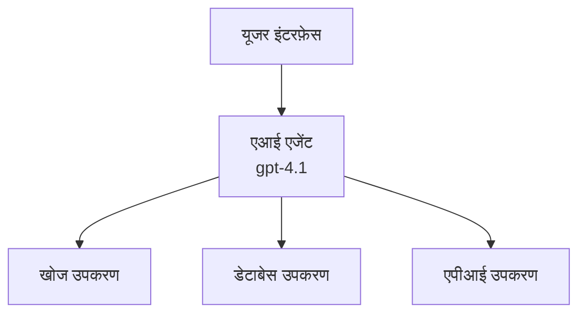
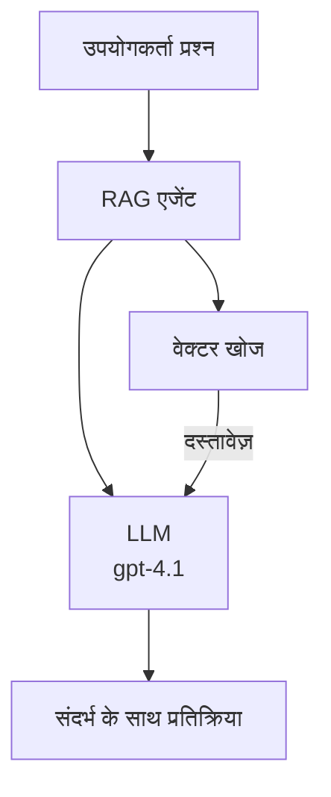
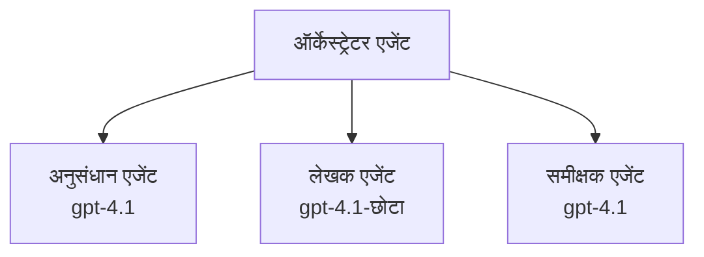

# Azure Developer CLI के साथ AI एजेंट

**अध्याय नेविगेशन:**
- **📚 कोर्स होम**: [AZD For Beginners](../../README.md)
- **📖 वर्तमान अध्याय**: अध्याय 2 - AI-प्रथम विकास
- **⬅️ पिछला**: [Microsoft Foundry Integration](microsoft-foundry-integration.md)
- **➡️ अगला**: [AI Model Deployment](ai-model-deployment.md)
- **🚀 उन्नत**: [Multi-Agent Solutions](../../examples/retail-scenario.md)

---

## परिचय

AI एजेंट स्वायत्त प्रोग्राम होते हैं जो अपने परिवेश को समझ सकते हैं, निर्णय ले सकते हैं, और विशिष्ट लक्ष्यों को प्राप्त करने के लिए क्रियाएं कर सकते हैं। सरल चैटबॉट्स जो संकेतों का जवाब देते हैं, उसके विपरीत, एजेंट निम्न कर सकते हैं:

- **उपकरणों का उपयोग करें** - API कॉल करें, डेटाबेस खोजें, कोड निष्पादित करें
- **योजना बनाएं और तर्क करें** - जटिल कार्यों को चरणों में विभाजित करें
- **संदर्भ से सीखें** - मेमोरी बनाए रखें और व्यवहार समायोजित करें
- **सहयोग करें** - अन्य एजेंटों के साथ काम करें (मल्टी-एजेंट सिस्टम)

यह गाइड आपको दिखाता है कि Azure Developer CLI (azd) का उपयोग करके Azure पर AI एजेंट कैसे तैनात करें।

> **सत्यापन नोट (2026-03-25):** इस गाइड की समीक्षा `azd` `1.23.12` और `azure.ai.agents` `0.1.18-preview` के खिलाफ की गई है। `azd ai` अनुभव अभी भी पूर्वावलोकन आधारित है, इसलिए यदि आपके इंस्टॉल किए गए फ्लैग अलग हैं तो एक्सटेंशन सहायता जांचें।

## सीखने के लक्ष्य

इस गाइड को पूरा करके, आप:
- समझेंगे कि AI एजेंट क्या हैं और वे चैटबॉट्स से कैसे अलग हैं
- AZD का उपयोग करके पूर्व-निर्मित AI एजेंट टेम्पलेट तैनात करेंगे
- Foundry एजेंट्स को कस्टम एजेंट्स के लिए कॉन्फ़िगर करेंगे
- बुनियादी एजेंट पैटर्न (उपकरण उपयोग, RAG, मल्टी-एजेंट) लागू करेंगे
- तैनात एजेंटों की निगरानी और डिबग करेंगे

## सीखने के परिणाम

पूरा करने पर, आप सक्षम होंगे:
- AI एजेंट एप्लिकेशन को Azure पर एक कमांड से तैनात करना
- एजेंट उपकरणों और क्षमताओं को कॉन्फ़िगर करना
- एजेंट के साथ रिट्रीवल-ऑगमेंटेड जनरेशन (RAG) लागू करना
- जटिल वर्कफ़्लोज़ के लिए मल्टी-एजेंट आर्किटेक्चर डिजाइन करना
- सामान्य एजेंट तैनाती समस्याओं का निवारण करना

---

## 🤖 एजेंट को चैटबॉट से अलग क्या बनाता है?

| फीचर | चैटबॉट | AI एजेंट |
|---------|---------|----------|
| **व्यवहार** | संकेतों का जवाब देता है | स्वायत्त क्रियाएं करता है |
| **उपकरण** | कोई नहीं | API कॉल कर सकता है, खोज कर सकता है, कोड निष्पादित कर सकता है |
| **मेमोरी** | केवल सत्र आधारित | सत्रों के बीच स्थायी मेमोरी |
| **योजना** | एकल प्रतिक्रिया | बहु-चरण तर्क |
| **सहयोग** | एकल इकाई | अन्य एजेंटों के साथ काम कर सकता है |

### सरल रूपक

- **चैटबॉट** = एक सहायक व्यक्ति जो सूचना डेस्क पर प्रश्नों के जवाब देता है
- **AI एजेंट** = एक व्यक्तिगत सहायक जो कॉल कर सकता है, नियुक्तियां बुक कर सकता है, और आपके लिए कार्य पूरे कर सकता है

---

## 🚀 क्विक स्टार्ट: अपना पहला एजेंट तैनात करें

### विकल्प 1: Foundry एजेंट टेम्पलेट (अनुशंसित)

```bash
# एआई एजेंट टेम्पलेट को आरंभ करें
azd init --template get-started-with-ai-agents

# Azure पर परिनियोजित करें
azd up
```

**क्या तैनात होता है:**
- ✅ Foundry एजेंट्स
- ✅ Microsoft Foundry मॉडल्स (gpt-4.1)
- ✅ Azure AI सर्च (RAG के लिए)
- ✅ Azure कंटेनर ऐप्स (वेब इंटरफ़ेस)
- ✅ एप्लिकेशन इंसाइट्स (निगरानी)

**समय:** ~15-20 मिनट
**लागत:** ~$100-150/माह (विकास)

### विकल्प 2: Prompty के साथ OpenAI एजेंट

```bash
# Prompty-आधारित एजेंट टेम्पलेट को प्रारंभ करें
azd init --template agent-openai-python-prompty

# Azure पर तैनात करें
azd up
```

**क्या तैनात होता है:**
- ✅ Azure Functions (सर्वरलेस एजेंट निष्पादन)
- ✅ Microsoft Foundry मॉडल्स
- ✅ Prompty कॉन्फ़िगरेशन फाइलें
- ✅ नमूना एजेंट कार्यान्वयन

**समय:** ~10-15 मिनट
**लागत:** ~$50-100/माह (विकास)

### विकल्प 3: RAG चैट एजेंट

```bash
# RAG चैट टेम्पलेट प्रारंभ करें
azd init --template azure-search-openai-demo

# Azure पर तैनात करें
azd up
```

**क्या तैनात होता है:**
- ✅ Microsoft Foundry मॉडल्स
- ✅ नमूना डेटा के साथ Azure AI सर्च
- ✅ दस्तावेज़ प्रसंस्करण पाइपलाइन
- ✅ हवाला सहित चैट इंटरफ़ेस

**समय:** ~15-25 मिनट
**लागत:** ~$80-150/माह (विकास)

### विकल्प 4: AZD AI एजेंट Init (मैनिफेस्ट- या टेम्प्लेट-आधारित पूर्वावलोकन)

यदि आपके पास एजेंट मैनिफेस्ट फ़ाइल है, तो आप सीधे Foundry एजेंट सेवा प्रोजेक्ट बनाने के लिए `azd ai` कमांड का उपयोग कर सकते हैं। हाल के पूर्वावलोकन संस्करणों में टेम्प्लेट-आधारित इनिशियलाइजेशन सपोर्ट भी जोड़ा गया है, इसलिए सटीक संकेत प्रवाह आपके इंस्टॉल किए गए एक्सटेंशन संस्करण के अनुसार थोड़ा भिन्न हो सकता है।

```bash
# एआई एजेंट एक्सटेंशन स्थापित करें
azd extension install azure.ai.agents

# वैकल्पिक: स्थापित पूर्वावलोकन संस्करण सत्यापित करें
azd extension show azure.ai.agents

# एक एजेंट मेनिफेस्ट से प्रारंभ करें
azd ai agent init -m agent-manifest.yaml

# एज्योर पर तैनात करें
azd up
```

**`azd ai agent init` और `azd init --template` के बीच उपयोग के समय:**

| तरीका | सर्वोत्तम उपयोग | यह कैसे काम करता है |
|----------|----------|------|
| `azd init --template` | काम कर रहे नमूना ऐप से शुरू करना | कोड + इन्फ्रास्ट्रक्चर के साथ पूरा टेम्प्लेट रिपॉ क्लोन करता है |
| `azd ai agent init -m` | अपने स्वयं के एजेंट मैनिफेस्ट से निर्माण | आपके एजेंट परिभाषा से प्रोजेक्ट संरचना बनाता है |

> **टिप:** सीखने के लिए `azd init --template` का उपयोग करें (ऊपर विकल्प 1-3)। अपने स्वयं के मैनिफेस्ट के साथ उत्पादन एजेंट बनाने के लिए `azd ai agent init` का उपयोग करें। पूर्ण संदर्भ के लिए देखें [AZD AI CLI Commands](../chapter-08-production/production-ai-practices.md#azd-ai-cli-commands-and-extensions)।

---

## 🏗️ एजेंट आर्किटेक्चर पैटर्न

### पैटर्न 1: टूल्स के साथ सिंगल एजेंट

सबसे सरल एजेंट पैटर्न - एक एजेंट जो कई टूल्स का उपयोग कर सकता है।


**सर्वोत्तम उपयोग:**
- ग्राहक सहायता बॉट्स
- अनुसंधान सहायक
- डेटा विश्लेषण एजेंट्स

**AZD टेम्प्लेट:** `azure-search-openai-demo`

### पैटर्न 2: RAG एजेंट (रिट्रीवल-ऑगमेंटेड जनरेशन)

एक एजेंट जो प्रतिक्रिया उत्पन्न करने से पहले प्रासंगिक दस्तावेज़ प्राप्त करता है।


**सर्वोत्तम उपयोग:**
- उद्यम ज्ञान आधार
- दस्तावेज़ प्रश्नोत्तरी सिस्टम
- अनुपालन और कानूनी अनुसंधान

**AZD टेम्प्लेट:** `azure-search-openai-demo`

### पैटर्न 3: मल्टी-एजेंट सिस्टम

कई विशेषज्ञ एजेंट मिलकर जटिल कार्यों पर काम करते हैं।


**सर्वोत्तम उपयोग:**
- जटिल सामग्री निर्माण
- बहु-चरण वर्कफ़्लोज़
- विभिन्न विशेषज्ञता वाले कार्य

**अधिक जानें:** [मल्टी-एजेंट समन्वय पैटर्न](../chapter-06-pre-deployment/coordination-patterns.md)

---

## ⚙️ एजेंट टूल्स कॉन्फ़िगर करना

टूल्स का उपयोग करने में एजेंट शक्तिशाली बनते हैं। सामान्य टूल्स कैसे कॉन्फ़िगर करें:

### Foundry एजेंट्स में टूल कॉन्फ़िगरेशन

```python
# agent_config.py
from azure.ai.projects import AIProjectClient
from azure.ai.projects.models import FunctionTool, CodeInterpreterTool

# कस्टम टूल्स परिभाषित करें
search_tool = FunctionTool(
    name="search_knowledge_base",
    description="Search the company knowledge base for relevant documents",
    parameters={
        "type": "object",
        "properties": {
            "query": {
                "type": "string",
                "description": "The search query"
            }
        },
        "required": ["query"]
    }
)

# टूल्स के साथ एजेंट बनाएं
agent = project_client.agents.create_agent(
    model="gpt-4.1",
    name="Support Agent",
    instructions="You are a helpful support agent. Use the search tool to find relevant information.",
    tools=[search_tool, CodeInterpreterTool()]
)
```

### एन्वायरनमेंट कॉन्फ़िगरेशन

```bash
# एजेंट-विशिष्ट पर्यावरण चर सेट करें
azd env set AZURE_OPENAI_MODEL "gpt-4.1"
azd env set AGENT_INSTRUCTIONS "You are a helpful assistant..."
azd env set ENABLE_CODE_INTERPRETER "true"
azd env set ENABLE_FILE_SEARCH "true"

# अद्यतन कॉन्फ़िगरेशन के साथ तैनात करें
azd deploy
```

---

## 📊 एजेंटों की निगरानी

### एप्लिकेशन इंसाइट्स इंटीग्रेशन

सभी AZD एजेंट टेम्प्लेट निगरानी के लिए Application Insights शामिल करते हैं:

```bash
# मॉनिटरिंग डैशबोर्ड खोलें
azd monitor --overview

# लाइव लॉग देखें
azd monitor --logs

# लाइव मेट्रिक्स देखें
azd monitor --live
```

### ट्रैक करने के लिए मुख्य मेट्रिक्स

| मेट्रिक | विवरण | लक्ष्य |
|--------|-------------|--------|
| प्रतिक्रिया विलंबता | प्रतिक्रिया उत्पन्न करने का समय | < 5 सेकंड |
| टोकन उपयोग | प्रति अनुरोध टोकन | लागत के लिए निगरानी करें |
| टूल कॉल सफलता दर | सफल टूल निष्पादनों का % | > 95% |
| त्रुटि दर | असफल एजेंट अनुरोध | < 1% |
| उपयोगकर्ता संतुष्टि | प्रतिक्रिया स्कोर | > 4.0/5.0 |

### एजेंटों के लिए कस्टम लॉगिंग

```python
import os
from azure.monitor.opentelemetry import configure_azure_monitor
from opentelemetry import trace

# OpenTelemetry के साथ Azure Monitor कॉन्फ़िगर करें
configure_azure_monitor(
    connection_string=os.environ["APPLICATIONINSIGHTS_CONNECTION_STRING"]
)

tracer = trace.get_tracer(__name__)

def log_agent_interaction(user_query, agent_response, tools_used, latency_ms):
    with tracer.start_as_current_span("agent_interaction") as span:
        span.set_attributes({
            "user_query": user_query,
            "response_length": len(agent_response),
            "tools_used": tools_used,
            "latency_ms": latency_ms
        })
```

> **नोट:** आवश्यक पैकेज इंस्टॉल करें: `pip install azure-monitor-opentelemetry opentelemetry`

---

## 💰 लागत विचार

### पैटर्न द्वारा अनुमानित मासिक लागत

| पैटर्न | विकास वातावरण | उत्पादन |
|---------|-----------------|------------|
| सिंगल एजेंट | $50-100 | $200-500 |
| RAG एजेंट | $80-150 | $300-800 |
| मल्टी-एजेंट (2-3 एजेंट) | $150-300 | $500-1,500 |
| उद्यम मल्टी-एजेंट | $300-500 | $1,500-5,000+ |

### लागत अनुकूलन सुझाव

1. **सरल कार्यों के लिए gpt-4.1-mini का उपयोग करें**
   ```bash
   azd env set AZURE_OPENAI_MODEL "gpt-4.1-mini"
   ```

2. **बार-बार पूछताछ के लिए कैशिंग लागू करें**
   ```python
   from functools import lru_cache
   
   @lru_cache(maxsize=1000)
   def get_cached_response(query_hash):
       return agent.run(query_hash)
   ```

3. **प्रति रन टोकन सीमाएं सेट करें**
   ```python
   # एजेंट चलाते समय अधिकतम पूर्णता टोकन सेट करें, निर्माण के दौरान नहीं
   run = project_client.agents.create_run(
       thread_id=thread.id,
       agent_id=agent.id,
       max_completion_tokens=1000  # प्रतिक्रिया की लंबाई सीमित करें
   )
   ```

4. **अप्रयुक्त होने पर शून्य तक स्केल करें**
   ```bash
   # कंटेनर ऐप्स स्वचालित रूप से शून्य तक स्केल हो जाते हैं
   azd env set MIN_REPLICAS "0"
   ```

---

## 🔧 एजेंट समस्या निवारण

### सामान्य समस्याएं और समाधान

<details>
<summary><strong>❌ एजेंट टूल कॉल का जवाब नहीं दे रहा</strong></summary>

```bash
# जांचें कि उपकरण सही ढंग से पंजीकृत हैं
azd show

# OpenAI डिप्लॉयमेंट सत्यापित करें
az cognitiveservices account deployment list \
  --name $AZURE_OPENAI_NAME \
  --resource-group $RG_NAME

# एजेंट लॉग जांचें
azd monitor --logs
```

**सामान्य कारण:**
- टूल फ़ंक्शन सिग्नेचर मेल नहीं खाता
- आवश्यक अनुमतियाँ गायब हैं
- API एंडपॉइंट एक्सेस नहीं हो रहा
</details>

<details>
<summary><strong>❌ एजेंट प्रतिक्रियाओं में उच्च विलंबता</strong></summary>

```bash
# बोतल-neck की जांच के लिए एप्लिकेशन इनसाइट्स देखें
azd monitor --live

# तेज़ मॉडल का उपयोग करने पर विचार करें
azd env set AZURE_OPENAI_MODEL "gpt-4.1-mini"
azd deploy
```

**सुधार सुझाव:**
- स्ट्रीमिंग प्रतिक्रियाओं का उपयोग करें
- प्रतिक्रिया कैशिंग लागू करें
- संदर्भ विंडो का आकार घटाएं
</details>

<details>
<summary><strong>❌ एजेंट गलत या भ्रमित जानकारी दे रहा है</strong></summary>

```python
# बेहतर सिस्टम प्रॉम्प्ट के साथ सुधार करें
instructions = """
You are a helpful assistant. IMPORTANT:
- Only answer based on provided context
- If you don't know, say "I don't know"
- Always cite your sources
- Never make up information
"""

# ग्राउंडिंग के लिए पुनः प्राप्ति जोड़ें
agent = project_client.agents.create_agent(
    model="gpt-4.1",
    instructions=instructions,
    tools=[FileSearchTool()]  # दस्तावेज़ों में प्रतिक्रियाओं को ग्राउंड करें
)
```
</details>

<details>
<summary><strong>❌ टोकन लिमिट से अधिक त्रुटियाँ</strong></summary>

```python
# संदर्भ विंडो प्रबंधन लागू करें
def truncate_context(messages, max_tokens=8000, model="gpt-4.1"):
    """Keep only recent messages within token limit."""
    import tiktoken
    encoding = tiktoken.encoding_for_model(model)
    total_tokens = 0
    truncated = []
    
    for msg in reversed(messages):
        msg_tokens = len(encoding.encode(msg.content))
        if total_tokens + msg_tokens > max_tokens:
            break
        truncated.insert(0, msg)
        total_tokens += msg_tokens
    
    return truncated
```
</details>

---

## 🎓 हैंड्स-ऑन व्यायाम

### व्यायाम 1: एक बेसिक एजेंट तैनात करें (20 मिनट)

**लक्ष्य:** AZD का उपयोग करके अपना पहला AI एजेंट तैनात करें

```bash
# चरण 1: टेम्पलेट प्रारंभ करें
azd init --template get-started-with-ai-agents

# चरण 2: Azure में लॉगिन करें
azd auth login
# यदि आप कई टेनेंट्स में काम करते हैं, तो --tenant-id <tenant-id> जोड़ें

# चरण 3: तैनात करें
azd up

# चरण 4: एजेंट का परीक्षण करें
# तैनाती के बाद अपेक्षित आउटपुट:
#   तैनाती पूर्ण!
#   एन्डपॉइंट: https://<app-name>.<region>.azurecontainerapps.io
# आउटपुट में दिखाए गए URL को खोलें और कोई प्रश्न पूछने का प्रयास करें

# चरण 5: निगरानी देखें
azd monitor --overview

# चरण 6: सफाई करें
azd down --force --purge
```

**सफलता मानदंड:**
- [ ] एजेंट प्रश्नों का जवाब दे
- [ ] `azd monitor` के माध्यम से निगरानी डैशबोर्ड तक पहुँच हो
- [ ] संसाधन सफलतापूर्वक साफ़ किए गए

### व्यायाम 2: एक कस्टम टूल जोड़ें (30 मिनट)

**लक्ष्य:** एक एजेंट में कस्टम टूल जोड़ें

1. एजेंट टेम्प्लेट तैनात करें:
   ```bash
   azd init --template get-started-with-ai-agents
   azd up
   ```
2. अपने एजेंट कोड में नया टूल फ़ंक्शन बनाएं:
   ```python
   def get_weather(location: str) -> str:
       """Get current weather for a location."""
       # मौसम सेवा के लिए API कॉल
       return f"Weather in {location}: Sunny, 72°F"
   ```
3. टूल को एजेंट के साथ रजिस्टर करें:
   ```python
   from azure.ai.projects.models import FunctionTool

   weather_tool = FunctionTool(
       name="get_weather",
       description="Get current weather for a location",
       parameters={
           "type": "object",
           "properties": {
               "location": {"type": "string", "description": "City name"}
           },
           "required": ["location"]
       }
   )

   agent = project_client.agents.create_agent(
       model="gpt-4.1",
       name="Weather Agent",
       tools=[weather_tool]
   )
   ```
4. पुनः तैनात करें और परीक्षण करें:
   ```bash
   azd deploy
   # पूछें: "सीएटल में मौसम कैसा है?"
   # अपेक्षित: एजेंट get_weather("Seattle") को कॉल करता है और मौसम की जानकारी लौटाता है
   ```

**सफलता मानदंड:**
- [ ] एजेंट मौसम संबंधित प्रश्नों को पहचाने
- [ ] टूल को सही ढंग से कॉल किया जाए
- [ ] प्रतिक्रिया में मौसम की जानकारी शामिल हो

### व्यायाम 3: एक RAG एजेंट बनाएं (45 मिनट)

**लक्ष्य:** एक ऐसा एजेंट बनाएं जो आपके दस्तावेज़ों से प्रश्नों का उत्तर दे

```bash
# चरण 1: RAG टेम्पलेट सेटअप करें
azd init --template azure-search-openai-demo
azd up

# चरण 2: अपने दस्तावेज़ अपलोड करें
# PDF/TXT फाइलें data/ निर्देशिका में रखें, फिर चलाएं:
python scripts/prepdocs.py

# चरण 3: डोमेन-विशिष्ट प्रश्नों के साथ परीक्षण करें
# azd up आउटपुट से वेब ऐप URL खोलें
# अपने अपलोड किए गए दस्तावेज़ों के बारे में प्रश्न पूछें
# प्रतिक्रियाओं में [doc.pdf] जैसे संदर्भ शामिल होने चाहिए
```

**सफलता मानदंड:**
- [ ] एजेंट अपलोड किए गए दस्तावेज़ों से उत्तर दे
- [ ] प्रतिक्रियाओं में हवाला शामिल हो
- [ ] सीमा से बाहर प्रश्नों पर भ्रम न हो

---

## 📚 अगला कदम

अब जब आप AI एजेंट समझ चुके हैं, तो इन उन्नत विषयों का अन्वेषण करें:

| विषय | विवरण | लिंक |
|-------|-------------|------|
| **मल्टी-एजेंट सिस्टम** | कई सहयोगी एजेंटों के साथ सिस्टम बनाएं | [रिटेल मल्टी-एजेंट उदाहरण](../../examples/retail-scenario.md) |
| **समन्वय पैटर्न** | ऑर्केस्ट्रेशन और संचार पैटर्न सीखें | [समन्वय पैटर्न](../chapter-06-pre-deployment/coordination-patterns.md) |
| **उत्पादन तैनाती** | उद्यम-तैयार एजेंट तैनाती | [उत्पादन AI प्रथाएँ](../chapter-08-production/production-ai-practices.md) |
| **एजेंट मूल्यांकन** | एजेंट प्रदर्शन का परीक्षण और मूल्यांकन | [AI समस्या निवारण](../chapter-07-troubleshooting/ai-troubleshooting.md) |
| **AI कार्यशाला लैब** | हाथों-हाथ: अपनी AI समाधान AZD-तैयार बनाएं | [AI कार्यशाला लैब](ai-workshop-lab.md) |

---

## 📖 अतिरिक्त संसाधन

### आधिकारिक दस्तावेज़
- [Azure AI Agent सेवा](https://learn.microsoft.com/azure/ai-services/agents/)
- [Azure AI Foundry Agent सेवा क्विकस्टार्ट](https://learn.microsoft.com/azure/ai-services/agents/quickstart)
- [सेमांटिक कर्नेल एजेंट फ्रेमवर्क](https://learn.microsoft.com/semantic-kernel/)

### एजेंट्स के लिए AZD टेम्प्लेट
- [AI एजेंट्स के साथ शुरुआत करें](https://github.com/Azure-Samples/get-started-with-ai-agents)
- [Agent OpenAI Python Prompty](https://github.com/Azure-Samples/agent-openai-python-prompty)
- [Azure Search OpenAI डेमो](https://github.com/Azure-Samples/azure-search-openai-demo)

### सामुदायिक संसाधन
- [Awesome AZD - एजेंट टेम्प्लेट्स](https://azure.github.io/awesome-azd/?tags=ai-agents)
- [Azure AI Discord](https://discord.gg/microsoft-azure)
- [Microsoft Foundry Discord](https://discord.gg/nTYy5BXMWG)

### आपके संपादक के लिए एजेंट कौशल
- [**Microsoft Azure Agent Skills**](https://skills.sh/microsoft/github-copilot-for-azure) - GitHub Copilot, Cursor, या किसी समर्थित एजेंट में Azure विकास के लिए पुन: प्रयोज्य AI एजेंट कौशल इंस्टॉल करें। इसमें [Azure AI](https://skills.sh/microsoft/github-copilot-for-azure/azure-ai), [Microsoft Foundry](https://skills.sh/microsoft/github-copilot-for-azure/microsoft-foundry), [तैनाती](https://skills.sh/microsoft/github-copilot-for-azure/azure-deploy), और [निदान](https://skills.sh/microsoft/github-copilot-for-azure/azure-diagnostics) के कौशल शामिल हैं:
  ```bash
  npx skills add microsoft/github-copilot-for-azure
  ```

---

**नेविगेशन**
- **पिछला पाठ:** [Microsoft Foundry Integration](microsoft-foundry-integration.md)
- **अगला पाठ:** [AI Model Deployment](ai-model-deployment.md)

---

<!-- CO-OP TRANSLATOR DISCLAIMER START -->
**अस्वीकरण**:
यह दस्तावेज़ AI अनुवाद सेवा [Co-op Translator](https://github.com/Azure/co-op-translator) का उपयोग करके अनुवादित किया गया है। यद्यपि हम सटीकता के लिए प्रयासरत हैं, कृपया ध्यान रखें कि स्वचालित अनुवाद में त्रुटियाँ या असत्यताएँ हो सकती हैं। मूल दस्तावेज़ अपनी देशी भाषा में प्रामाणिक स्रोत माना जाना चाहिए। महत्वपूर्ण जानकारी के लिए, पेशेवर मानव अनुवाद की सलाह दी जाती है। इस अनुवाद के उपयोग से उत्पन्न किसी भी गलतफहमी या गलत व्याख्या के लिए हम जिम्मेदार नहीं हैं।
<!-- CO-OP TRANSLATOR DISCLAIMER END -->