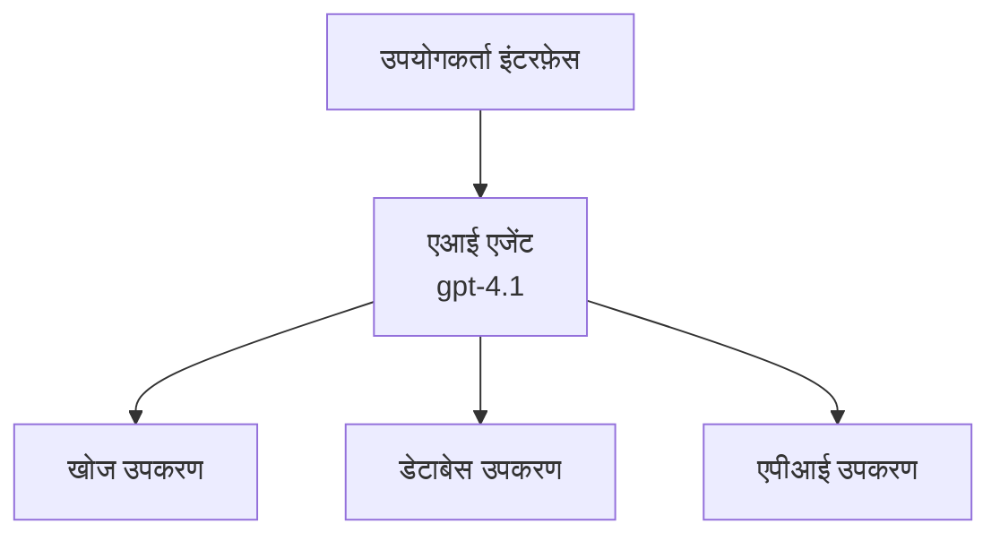
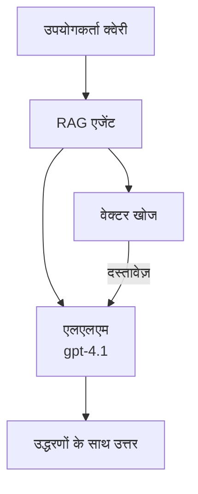
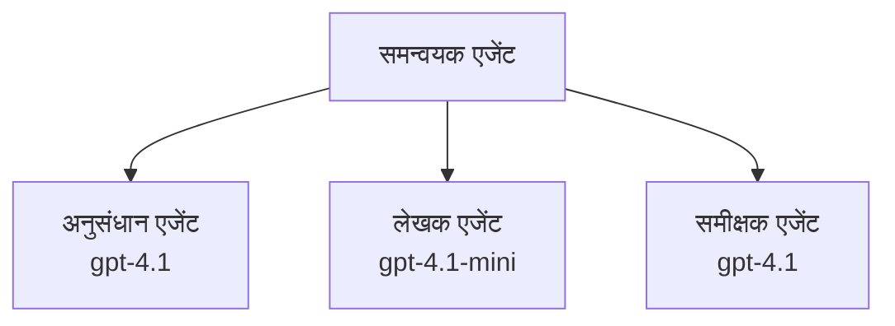

# AI एजेंट्स with Azure Developer CLI

**अध्याय नेविगेशन:**
- **📚 Course Home**: [AZD शुरुआती के लिए](../../README.md)
- **📖 Current Chapter**: अध्याय 2 - AI-प्रथम विकास
- **⬅️ पिछला**: [Microsoft Foundry एकीकरण](microsoft-foundry-integration.md)
- **➡️ अगला**: [AI मॉडल तैनाती](ai-model-deployment.md)
- **🚀 उन्नत**: [मल्टी-एजेंट समाधान](../../examples/retail-scenario.md)

---

## परिचय

AI एजेंट्स स्वायत्त प्रोग्राम होते हैं जो अपने परिवेश को समझ सकते हैं, निर्णय ले सकते हैं, और विशिष्ट लक्ष्यों को प्राप्त करने के लिए कार्रवाई कर सकते हैं। साधारण चैटबॉट्स जो प्रॉम्प्ट्स का जवाब देते हैं, उनसे अलग एजेंट्स कर सकते हैं:

- **उपकरणों का उपयोग करें** - APIs कॉल करना, डेटाबेस खोजना, कोड निष्पादित करना
- **योजना और तर्क** - जटिल कार्यों को कदमों में विभाजित करना
- **संदर्भ से सीखना** - मेमोरी बनाए रखना और व्यवहार को अनुकूलित करना
- **सहयोग करना** - अन्य एजेंट्स के साथ काम करना (मल्टी-एजेंट सिस्टम)

यह गाइड आपको दिखाता है कि Azure Developer CLI (azd) का उपयोग करके Azure पर AI एजेंट्स को कैसे तैनात किया जाए।

## सीखने के लक्ष्य

इस गाइड को पूरा करने पर, आप:
- समझेंगे कि AI एजेंट्स क्या हैं और वे चैटबॉट्स से कैसे अलग हैं
- AZD का उपयोग करके पूर्व-निर्मित AI एजेंट टेम्पलेट्स को तैनात करेंगे
- कस्टम एजेंट्स के लिए Foundry Agents को कॉन्फ़िगर करेंगे
- बुनियादी एजेंट पैटर्न्स (टूल उपयोग, RAG, मल्टी-एजेंट) लागू करेंगे
- तैनात एजेंट्स की निगरानी और डिबग करना सीखेंगे

## सीखने के परिणाम

पूर्ण करने पर, आप सक्षम होंगे:
- एक ही कमांड से Azure पर AI एजेंट एप्लिकेशन तैनात करना
- एजेंट टूल्स और क्षमताओं को कॉन्फ़िगर करना
- एजेंट्स के साथ retrieval-augmented generation (RAG) लागू करना
- जटिल वर्कफ़्लो के लिए मल्टी-एजेंट आर्किटेक्चर डिजाइन करना
- सामान्य एजेंट तैनाती समस्याओं का निवारण करना

---

## 🤖 एक एजेंट को चैटबॉट से अलग क्या बनाता है?

| विशेषता | चैटबॉट | AI एजेंट |
|---------|---------|----------|
| **व्यवहार** | प्रॉम्प्ट्स का उत्तर देता है | स्वायत्त क्रियाएँ करता है |
| **उपकरण** | कोई नहीं | APIs कॉल कर सकता है, खोज कर सकता है, कोड निष्पादित कर सकता है |
| **मेमोरी** | केवल सेशन-आधारित | सत्रों में स्थायी मेमोरी |
| **योजना** | एकल उत्तर | बहु-स्टेप तर्क |
| **सहयोग** | एकल इकाई | अन्य एजेंटों के साथ काम कर सकता है |

### सरल उपमा

- **चैटबॉट** = सूचना डेस्क पर सवालों का जवाब देने वाला सहायक व्यक्ति
- **AI एजेंट** = एक व्यक्तिगत सहायक जो कॉल कर सकता है, नियुक्तियाँ बुक कर सकता है, और आपके लिए कार्य पूरे कर सकता है

---

## 🚀 त्वरित शुरुआत: अपना पहला एजेंट तैनात करें

### विकल्प 1: Foundry Agents टेम्पलेट (सिफारिश की गई)

```bash
# AI एजेंटों के टेम्पलेट को प्रारंभ करें
azd init --template get-started-with-ai-agents

# Azure पर तैनात करें
azd up
```

**क्या तैनात होता है:**
- ✅ Foundry Agents
- ✅ Microsoft Foundry Models (gpt-4.1)
- ✅ Azure AI Search (RAG के लिए)
- ✅ Azure Container Apps (वेब इंटरफ़ेस)
- ✅ Application Insights (निगरानी)

**समय:** ~15-20 मिनट
**लागत:** ~$100-150/माह (डेवलपमेंट)

### विकल्प 2: OpenAI एजेंट Prompty के साथ

```bash
# Prompty-आधारित एजेंट टेम्पलेट को प्रारंभ करें
azd init --template agent-openai-python-prompty

# Azure पर तैनात करें
azd up
```

**क्या तैनात होता है:**
- ✅ Azure Functions (सर्वरलेस एजेंट निष्पादन)
- ✅ Microsoft Foundry Models
- ✅ Prompty कॉन्फ़िगरेशन फ़ाइलें
- ✅ नमूना एजेंट कार्यान्वयन

**समय:** ~10-15 मिनट
**लागत:** ~$50-100/माह (डेवलपमेंट)

### विकल्प 3: RAG चैट एजेंट

```bash
# RAG चैट टेम्पलेट प्रारंभ करें
azd init --template azure-search-openai-demo

# Azure पर तैनात करें
azd up
```

**क्या तैनात होता है:**
- ✅ Microsoft Foundry Models
- ✅ Azure AI Search सैंपल डेटा के साथ
- ✅ डॉक्यूमेंट प्रोसेसिंग पाइपलाइन
- ✅ उद्धरणों के साथ चैट इंटरफ़ेस

**समय:** ~15-25 मिनट
**लागत:** ~$80-150/माह (डेवलपमेंट)

### विकल्प 4: AZD AI Agent Init (मैनिफेस्ट-आधारित)

यदि आपके पास एजेंट मैनिफेस्ट फ़ाइल है, तो आप सीधे Foundry Agent Service प्रोजेक्ट स्कैफोल्ड करने के लिए `azd ai` कमांड का उपयोग कर सकते हैं:

```bash
# AI एजेंट्स एक्सटेंशन स्थापित करें
azd extension install azure.ai.agents

# एजेंट मैनिफेस्ट से प्रारंभ करें
azd ai agent init -m agent-manifest.yaml

# Azure पर तैनात करें
azd up
```

**कब उपयोग करें `azd ai agent init` बनाम `azd init --template`:**

| पद्धति | सर्वश्रेष्ठ हेतु | यह कैसे काम करता है |
|----------|----------|------|
| `azd init --template` | एक काम करने वाले सैंपल ऐप से शुरुआत | कोड + इन्फ्रा के साथ पूर्ण टेम्पलेट रिपो को क्लोन करता है |
| `azd ai agent init -m` | अपने एजेंट मैनिफेस्ट से निर्माण | आपके एजेंट परिभाषा से प्रोजेक्ट संरचना स्कैफोल्ड करता है |

> **टिप:** सीखते समय `azd init --template` का उपयोग करें (ऊपर विकल्प 1-3)। अपनी मैनिफेस्ट के साथ प्रोडक्शन एजेंट बनाते समय `azd ai agent init` का उपयोग करें। पूर्ण संदर्भ के लिए देखें [AZD AI CLI Commands](../chapter-08-production/production-ai-practices.md#azd-ai-cli-commands-and-extensions)।

---

## 🏗️ एजेंट आर्किटेक्चर पैटर्न

### पैटर्न 1: टूल्स के साथ एकल एजेंट

सबसे सरल एजेंट पैटर्न - एक एजेंट जो कई उपकरणों का उपयोग कर सकता है।


**इसके लिए सर्वश्रेष्ठ:**
- ग्राहक सहायता बॉट्स
- रिसर्च असिस्टेंट्स
- डेटा विश्लेषण एजेंट्स

**AZD टेम्पलेट:** `azure-search-openai-demo`

### पैटर्न 2: RAG एजेंट (Retrieval-Augmented Generation)

एक एजेंट जो उत्तर उत्पन्न करने से पहले संबंधित दस्तावेज़ पुनःप्राप्त करता है।


**इसके लिए सर्वश्रेष्ठ:**
- एंटरप्राइज़ नॉलेज बेस
- डॉक्यूमेंट Q&A सिस्टम
- अनुपालन और कानूनी शोध

**AZD टेम्पलेट:** `azure-search-openai-demo`

### पैटर्न 3: मल्टी-एजेंट सिस्टम

कई विशिष्ट एजेंट जटिल कार्यों पर मिलकर काम करते हैं।


**इसके लिए सर्वश्रेष्ठ:**
- जटिल सामग्री जनरेशन
- बहु-स्टेप वर्कफ़्लोज़
- विभिन्न विशेषज्ञताओं के आवश्यकता वाले कार्य

**और जानें:** [मल्टी-एजेंट समन्वय पैटर्न](../chapter-06-pre-deployment/coordination-patterns.md)

---

## ⚙️ एजेंट उपकरण कॉन्फ़िगर करना

एजेंट्स तब शक्तिशाली बनते हैं जब वे टूल्स का उपयोग कर सकते हैं। यहां सामान्य टूल्स को कॉन्फ़िगर करने का तरीका है:

### Foundry Agents में टूल कॉन्फ़िगरेशन

```python
# agent_config.py
from azure.ai.projects import AIProjectClient
from azure.ai.projects.models import FunctionTool, CodeInterpreterTool

# कस्टम टूल्स परिभाषित करें
search_tool = FunctionTool(
    name="search_knowledge_base",
    description="Search the company knowledge base for relevant documents",
    parameters={
        "type": "object",
        "properties": {
            "query": {
                "type": "string",
                "description": "The search query"
            }
        },
        "required": ["query"]
    }
)

# टूल्स के साथ एजेंट बनाएं
agent = project_client.agents.create_agent(
    model="gpt-4.1",
    name="Support Agent",
    instructions="You are a helpful support agent. Use the search tool to find relevant information.",
    tools=[search_tool, CodeInterpreterTool()]
)
```

### एनवायरनमेंट कॉन्फ़िगरेशन

```bash
# एजेंट-विशिष्ट पर्यावरण चर सेट करें
azd env set AZURE_OPENAI_MODEL "gpt-4.1"
azd env set AGENT_INSTRUCTIONS "You are a helpful assistant..."
azd env set ENABLE_CODE_INTERPRETER "true"
azd env set ENABLE_FILE_SEARCH "true"

# अपडेट की गई कॉन्फ़िगरेशन के साथ तैनात करें
azd deploy
```

---

## 📊 एजेंट्स की निगरानी

### Application Insights एकीकरण

सभी AZD एजेंट टेम्पलेट्स निगरानी के लिए Application Insights शामिल करते हैं:

```bash
# मॉनिटरिंग डैशबोर्ड खोलें
azd monitor --overview

# लाइव लॉग्स देखें
azd monitor --logs

# लाइव मेट्रिक्स देखें
azd monitor --live
```

### ट्रैक करने के लिए प्रमुख मेट्रिक्स

| मेट्रिक | विवरण | लक्ष्य |
|--------|-------------|--------|
| प्रतिक्रिया विलंब | उत्तर उत्पन्न करने का समय | < 5 सेकंड |
| टोकन उपयोग | प्रत्येक अनुरोध पर टोकन | लागत के लिए मॉनिटर करें |
| टूल कॉल सफलता दर | सफल टूल निष्पादनों का % | > 95% |
| त्रुटि दर | असफल एजेंट अनुरोध | < 1% |
| उपयोगकर्ता संतुष्टि | फ़ीडबैक स्कोर | > 4.0/5.0 |

### एजेंट्स के लिए कस्टम लॉगिंग

```python
import os
from azure.monitor.opentelemetry import configure_azure_monitor
from opentelemetry import trace

# Azure Monitor को OpenTelemetry के साथ कॉन्फ़िगर करें
configure_azure_monitor(
    connection_string=os.environ["APPLICATIONINSIGHTS_CONNECTION_STRING"]
)

tracer = trace.get_tracer(__name__)

def log_agent_interaction(user_query, agent_response, tools_used, latency_ms):
    with tracer.start_as_current_span("agent_interaction") as span:
        span.set_attributes({
            "user_query": user_query,
            "response_length": len(agent_response),
            "tools_used": tools_used,
            "latency_ms": latency_ms
        })
```

> **नोट:** आवश्यक पैकेज इंस्टॉल करें: `pip install azure-monitor-opentelemetry opentelemetry`

---

## 💰 लागत संबंधी विचार

### पैटर्न अनुसार अनुमानित मासिक लागत

| पैटर्न | डेव एनवायरनमेंट | प्रोडक्शन |
|---------|-----------------|------------|
| Single Agent | $50-100 | $200-500 |
| RAG Agent | $80-150 | $300-800 |
| Multi-Agent (2-3 agents) | $150-300 | $500-1,500 |
| Enterprise Multi-Agent | $300-500 | $1,500-5,000+ |

### लागत अनुकूलन सुझाव

1. **सरल कार्यों के लिए gpt-4.1-mini का उपयोग करें**
   ```bash
   azd env set AZURE_OPENAI_MODEL "gpt-4.1-mini"
   ```

2. **दोहराए गए प्रश्नों के लिए कैशिंग लागू करें**
   ```python
   from functools import lru_cache
   
   @lru_cache(maxsize=1000)
   def get_cached_response(query_hash):
       return agent.run(query_hash)
   ```

3. **प्रत्येक रन के लिए टोकन सीमाएँ निर्धारित करें**
   ```python
   # एजेंट चलाते समय max_completion_tokens सेट करें, निर्माण के दौरान नहीं
   run = project_client.agents.create_run(
       thread_id=thread.id,
       agent_id=agent.id,
       max_completion_tokens=1000  # प्रतिक्रिया की लंबाई सीमित करें
   )
   ```

4. **न उपयोग में होने पर शून्य तक स्केल करें**
   ```bash
   # कंटेनर ऐप्स स्वतः शून्य तक स्केल हो जाते हैं
   azd env set MIN_REPLICAS "0"
   ```

---

## 🔧 एजेंट्स का समस्या निवारण

### सामान्य समस्याएँ और समाधान

<details>
<summary><strong>❌ एजेंट टूल कॉल्स का उत्तर नहीं दे रहा है</strong></summary>

```bash
# जांचें कि उपकरण ठीक से पंजीकृत हैं
azd show

# OpenAI तैनाती सत्यापित करें
az cognitiveservices account deployment list \
  --name $AZURE_OPENAI_NAME \
  --resource-group $RG_NAME

# एजेंट लॉग्स जांचें
azd monitor --logs
```

**सामान्य कारण:**
- टूल फ़ंक्शन सिग्नेचर असंगतता
- आवश्यक अनुमतियों की कमी
- API endpoint तक पहुँच नहीं
</details>

<details>
<summary><strong>❌ एजेंट उत्तरों में उच्च विलंब</strong></summary>

```bash
# बॉटलनेक्स के लिए Application Insights की जाँच करें
azd monitor --live

# तेज़ मॉडल का उपयोग करने पर विचार करें
azd env set AZURE_OPENAI_MODEL "gpt-4.1-mini"
azd deploy
```

**अनुकूलन सुझाव:**
- स्ट्रीमिंग उत्तरों का उपयोग करें
- उत्तर कैशिंग लागू करें
- संदर्भ विंडो आकार कम करें
</details>

<details>
<summary><strong>❌ एजेंट गलत या हल्लुसिनेटेड जानकारी दे रहा है</strong></summary>

```python
# बेहतर सिस्टम प्रॉम्प्ट्स के साथ सुधार करें
instructions = """
You are a helpful assistant. IMPORTANT:
- Only answer based on provided context
- If you don't know, say "I don't know"
- Always cite your sources
- Never make up information
"""

# ग्राउंडिंग के लिए पुनःप्राप्ति जोड़ें
agent = project_client.agents.create_agent(
    model="gpt-4.1",
    instructions=instructions,
    tools=[FileSearchTool()]  # दस्तावेज़ों के आधार पर उत्तर दें
)
```
</details>

<details>
<summary><strong>❌ टोकन सीमा अतिव्यापी त्रुटियाँ</strong></summary>

```python
# संदर्भ विंडो प्रबंधन लागू करें
def truncate_context(messages, max_tokens=8000, model="gpt-4.1"):
    """Keep only recent messages within token limit."""
    import tiktoken
    encoding = tiktoken.encoding_for_model(model)
    total_tokens = 0
    truncated = []
    
    for msg in reversed(messages):
        msg_tokens = len(encoding.encode(msg.content))
        if total_tokens + msg_tokens > max_tokens:
            break
        truncated.insert(0, msg)
        total_tokens += msg_tokens
    
    return truncated
```
</details>

---

## 🎓 व्यावहारिक अभ्यास

### अभ्यास 1: एक बेसिक एजेंट तैनात करें (20 मिनट)

**उद्देश्य:** AZD का उपयोग करके अपना पहला AI एजेंट तैनात करें

```bash
# चरण 1: टेम्पलेट आरंभ करें
azd init --template get-started-with-ai-agents

# चरण 2: Azure में साइन इन करें
azd auth login

# चरण 3: तैनात करें
azd up

# चरण 4: एजेंट का परीक्षण करें
# परिनियोजन के बाद अपेक्षित आउटपुट:
#   परिनियोजन पूरा हुआ!
#   एंडपॉइंट: https://<app-name>.<region>.azurecontainerapps.io
# आउटपुट में दिखाए गए URL को खोलें और कोई प्रश्न पूछकर देखें

# चरण 5: निगरानी देखें
azd monitor --overview

# चरण 6: साफ़ करें
azd down --force --purge
```

**सफलता मानदंड:**
- [ ] एजेंट प्रश्नों का उत्तर देता है
- [ ] `azd monitor` के माध्यम से मॉनिटरिंग डैशबोर्ड तक पहुँच सकता है
- [ ] संसाधन सफलतापूर्वक साफ़ किए गए

### अभ्यास 2: एक कस्टम टूल जोड़ें (30 मिनट)

**उद्देश्य:** एक कस्टम टूल के साथ एजेंट का विस्तार करें

1. एजेंट टेम्पलेट तैनात करें:
   ```bash
   azd init --template get-started-with-ai-agents
   azd up
   ```
2. अपने एजेंट कोड में एक नया टूल फ़ंक्शन बनाएँ:
   ```python
   def get_weather(location: str) -> str:
       """Get current weather for a location."""
       # मौसम सेवा के लिए API कॉल
       return f"Weather in {location}: Sunny, 72°F"
   ```
3. एजेंट के साथ टूल को रजिस्टर करें:
   ```python
   from azure.ai.projects.models import FunctionTool

   weather_tool = FunctionTool(
       name="get_weather",
       description="Get current weather for a location",
       parameters={
           "type": "object",
           "properties": {
               "location": {"type": "string", "description": "City name"}
           },
           "required": ["location"]
       }
   )

   agent = project_client.agents.create_agent(
       model="gpt-4.1",
       name="Weather Agent",
       tools=[weather_tool]
   )
   ```
4. पुनः तैनात करें और परीक्षण करें:
   ```bash
   azd deploy
   # पूछें: "सिएटल में मौसम कैसा है?"
   # अपेक्षित: एजेंट get_weather("Seattle") को कॉल करता है और मौसम की जानकारी लौटाता है
   ```

**सफलता मानदंड:**
- [ ] एजेंट मौसम संबंधी प्रश्नों को पहचानता है
- [ ] टूल सही तरीके से कॉल होता है
- [ ] उत्तर में मौसम की जानकारी शामिल है

### अभ्यास 3: एक RAG एजेंट बनाएं (45 मिनट)

**उद्देश्य:** ऐसे एजेंट बनाएं जो आपके दस्तावेज़ों से प्रश्नों के उत्तर दे

```bash
# चरण 1: RAG टेम्पलेट तैनात करें
azd init --template azure-search-openai-demo
azd up

# चरण 2: अपने दस्तावेज़ अपलोड करें
# PDF/TXT फ़ाइलें data/ निर्देशिका में रखें, फिर चलाएँ:
python scripts/prepdocs.py

# चरण 3: डोमेन-विशिष्ट प्रश्नों के साथ परीक्षण करें
# azd up आउटपुट से वेब ऐप का URL खोलें
# अपलोड किए गए दस्तावेज़ों के बारे में प्रश्न पूछें
# प्रतिक्रियाओं में [doc.pdf] जैसे उद्धरण संदर्भ शामिल होने चाहिए
```

**सफलता मानदंड:**
- [ ] एजेंट अपलोड किए गए दस्तावेज़ों से उत्तर देता है
- [ ] उत्तरों में उद्धरण शामिल हैं
- [ ] आउट-ऑफ-स्कोप प्रश्नों पर हल्लुसिनेशन नहीं होता

---

## 📚 अगला कदम

अब जब आप AI एजेंट्स को समझते हैं, तो इन उन्नत विषयों का अन्वेषण करें:

| विषय | विवरण | लिंक |
|-------|-------------|------|
| **मल्टी-एजेंट सिस्टम्स** | एकाधिक सहयोगी एजेंटों के साथ सिस्टम बनाएं | [Retail Multi-Agent Example](../../examples/retail-scenario.md) |
| **समन्वय पैटर्न** | ऑर्केस्ट्रेशन और संचार पैटर्न सीखें | [समन्वय पैटर्न](../chapter-06-pre-deployment/coordination-patterns.md) |
| **प्रोडक्शन तैनाती** | एंटरप्राइज़-तैयार एजेंट तैनाती | [प्रोडक्शन AI अभ्यास](../chapter-08-production/production-ai-practices.md) |
| **एजेंट मूल्यांकन** | एजेंट प्रदर्शन का परीक्षण और मूल्यांकन करें | [AI समस्या निवारण](../chapter-07-troubleshooting/ai-troubleshooting.md) |
| **AI वर्कशॉप लैब** | व्यावहारिक: अपनी AI समाधान को AZD-रेडी बनाएं | [AI वर्कशॉप लैब](ai-workshop-lab.md) |

---

## 📖 अतिरिक्त संसाधन

### आधिकारिक दस्तावेज़
- [Azure AI Agent Service](https://learn.microsoft.com/azure/ai-services/agents/)
- [Azure AI Foundry Agent Service Quickstart](https://learn.microsoft.com/azure/ai-services/agents/quickstart)
- [Semantic Kernel Agent Framework](https://learn.microsoft.com/semantic-kernel/)

### एजेंट्स के लिए AZD टेम्पलेट्स
- [Get Started with AI Agents](https://github.com/Azure-Samples/get-started-with-ai-agents)
- [Agent OpenAI Python Prompty](https://github.com/Azure-Samples/agent-openai-python-prompty)
- [Azure Search OpenAI Demo](https://github.com/Azure-Samples/azure-search-openai-demo)

### समुदाय संसाधन
- [Awesome AZD - Agent Templates](https://azure.github.io/awesome-azd/?tags=ai-agents)
- [Azure AI Discord](https://discord.gg/microsoft-azure)
- [Microsoft Foundry Discord](https://discord.gg/nTYy5BXMWG)

### आपके संपादक के लिए एजेंट स्किल्स
- [**Microsoft Azure Agent Skills**](https://skills.sh/microsoft/github-copilot-for-azure) - GitHub Copilot, Cursor, या किसी समर्थित एजेंट में Azure विकास के लिए पुन: उपयोग योग्य AI एजेंट स्किल्स इंस्टॉल करें। इसमें [Azure AI](https://skills.sh/microsoft/github-copilot-for-azure/azure-ai), [Microsoft Foundry](https://skills.sh/microsoft/github-copilot-for-azure/microsoft-foundry), [deployment](https://skills.sh/microsoft/github-copilot-for-azure/azure-deploy), और [diagnostics](https://skills.sh/microsoft/github-copilot-for-azure/azure-diagnostics) के लिए स्किल्स शामिल हैं:
  ```bash
  npx skills add microsoft/github-copilot-for-azure
  ```

---

**नेविगेशन**
- **पिछला पाठ**: [Microsoft Foundry एकीकरण](microsoft-foundry-integration.md)
- **अगला पाठ**: [AI मॉडल तैनाती](ai-model-deployment.md)

---

<!-- CO-OP TRANSLATOR DISCLAIMER START -->
**Disclaimer**:
इस दस्तावेज़ का अनुवाद AI अनुवाद सेवा [Co-op Translator](https://github.com/Azure/co-op-translator) का उपयोग करके किया गया है। जबकि हम सटीकता के लिए प्रयास करते हैं, कृपया ध्यान दें कि स्वचालित अनुवादों में त्रुटियाँ या अशुद्धियाँ हो सकती हैं। मूल दस्तावेज़ को उसकी मूल भाषा में आधिकारिक स्रोत माना जाना चाहिए। महत्वपूर्ण जानकारी के लिए, पेशेवर मानव अनुवाद की सिफारिश की जाती है। इस अनुवाद के उपयोग से उत्पन्न किसी भी गलतफहमी या गलत व्याख्या के लिए हम उत्तरदायी नहीं हैं।
<!-- CO-OP TRANSLATOR DISCLAIMER END -->