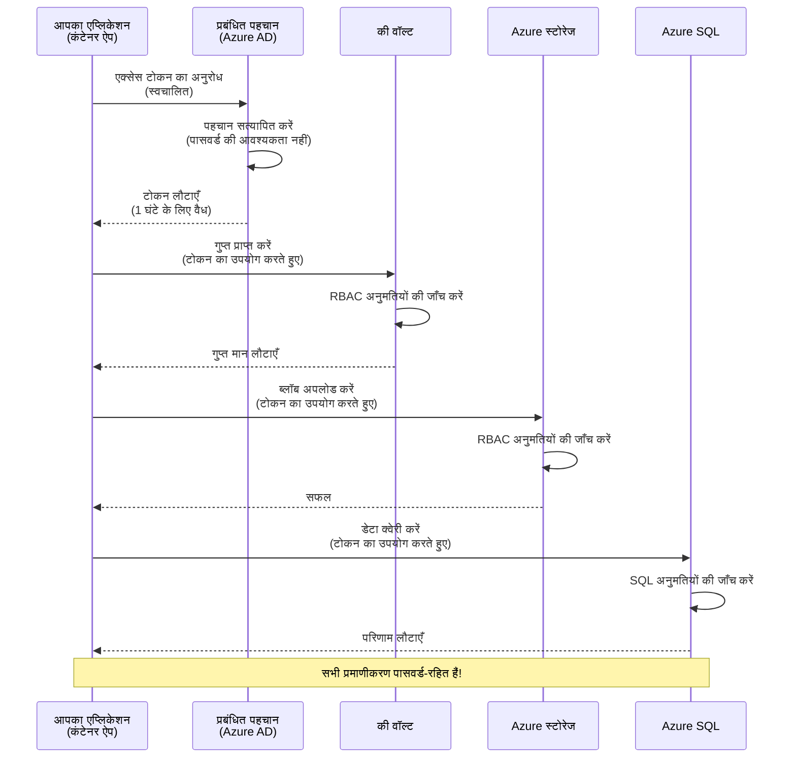
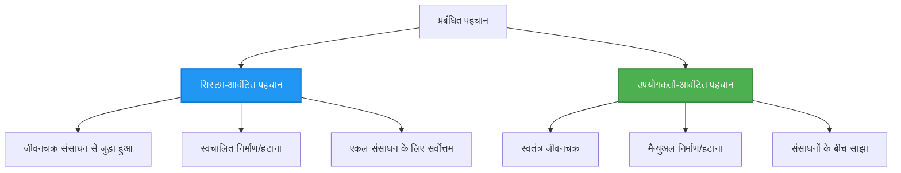

# Authentication Patterns and Managed Identity

⏱️ **Estimated Time**: 45-60 minutes | 💰 **Cost Impact**: Free (no additional charges) | ⭐ **Complexity**: Intermediate

**📚 Learning Path:**
- ← Previous: [कॉन्फ़िगरेशन प्रबंधन](configuration.md) - पर्यावरण परिवर्तनशील और सीक्रेट्स का प्रबंधन
- 🎯 **You Are Here**: Authentication & Security (Managed Identity, Key Vault, secure patterns)
- → Next: [First Project](first-project.md) - अपनी पहली AZD एप्लिकेशन बनाएं
- 🏠 [Course Home](../../README.md)

---

## What You'll Learn

इस पाठ को पूरा करने पर, आप:
- Azure प्रमाणीकरण पैटर्न (keys, connection strings, managed identity) को समझेंगे
- पासवर्ड-रहित प्रमाणीकरण के लिए Managed Identity को लागू करेंगे
- Azure Key Vault एकीकरण के साथ सीक्रेट्स को सुरक्षित करेंगे
- AZD डिप्लॉयमेंट्स के लिए role-based access control (RBAC) कॉन्फ़िगर करेंगे
- Container Apps और Azure सेवाओं में सुरक्षा सर्वोत्तम प्रथाओं को लागू करेंगे
- key-based से identity-based प्रमाणीकरण में माइग्रेट करेंगे

## Why Managed Identity Matters

### The Problem: Traditional Authentication

**Before Managed Identity:**
```javascript
// ❌ सुरक्षा जोखिम: कोड में हार्डकोड की गई गुप्त जानकारी
const connectionString = "Server=mydb.database.windows.net;User=admin;Password=P@ssw0rd123";
const storageKey = "xK7mN9pQ2wR5tY8uI0oP3aS6dF1gH4jK...";
const cosmosKey = "C2x7B9n4M1p8Q5w3E6r0T2y5U8i1O4p7...";
```

**Problems:**
- 🔴 **कोड, कॉन्फ़िग फ़ाइलों, पर्यावरण चर में उजागर सीक्रेट्स**
- 🔴 **क्रेडेंशियल रोटेशन** के लिए कोड परिवर्तन और पुनःडिप्लॉयमेंट की आवश्यकता
- 🔴 **ऑडिट समस्याएँ** - किसने क्या, कब एक्सेस किया?
- 🔴 **फैलाव** - सीक्रेट्स कई सिस्टम में बिखरे हुए
- 🔴 **अनुपालन जोखिम** - सुरक्षा ऑडिट से फेल होना

### The Solution: Managed Identity

**After Managed Identity:**
```javascript
// ✅ सुरक्षित: कोड में कोई गोपनीय जानकारी नहीं
const credential = new DefaultAzureCredential();
const client = new BlobServiceClient(
  "https://mystorageaccount.blob.core.windows.net",
  credential  // Azure स्वचालित रूप से प्रमाणीकरण संभालता है
);
```

**Benefits:**
- ✅ **कोड या कॉन्फ़िग में शून्य सीक्रेट्स**
- ✅ **स्वचालित रोटेशन** - Azure इसे संभालता है
- ✅ **Azure AD लॉग्स में पूर्ण ऑडिट ट्रेल**
- ✅ **केन्द्रीयकृत सुरक्षा** - Azure Portal से प्रबंधित करें
- ✅ **अनुपालन-तैयार** - सुरक्षा मानकों को पूरा करता है

**Analogy**: पारंपरिक प्रमाणीकरण कई दरवाजों के लिए कई भौतिक चाबियों जैसा है। Managed Identity ऐसे है जैसे आपके पास एक सुरक्षा बैज हो जो स्वचालित रूप से इस बात के आधार पर एक्सेस देता है कि आप कौन हैं—कोई चाबी खोने, कॉपी करने या घुमाने की ज़रूरत नहीं।

---

## Architecture Overview

### Authentication Flow with Managed Identity


### Types of Managed Identities


| Feature | System-Assigned | User-Assigned |
|---------|----------------|---------------|
| **Lifecycle** | Tied to resource | Independent |
| **Creation** | Automatic with resource | Manual creation |
| **Deletion** | Deleted with resource | Persists after resource deletion |
| **Sharing** | One resource only | Multiple resources |
| **Use Case** | Simple scenarios | Complex multi-resource scenarios |
| **AZD Default** | ✅ Recommended | Optional |

---

## Prerequisites

### Required Tools

आपके पास पिछली लेसन्स से ये पहले से इंस्टॉल होने चाहिए:

```bash
# Azure Developer CLI सत्यापित करें
azd version
# ✅ अपेक्षित: azd संस्करण 1.0.0 या उससे ऊपर

# Azure CLI सत्यापित करें
az --version
# ✅ अपेक्षित: azure-cli 2.50.0 या उससे ऊपर
```

### Azure Requirements

- सक्रिय Azure सब्सक्रिप्शन
- अनुमतियाँ ताकि आप:
  - Managed identities बनाएँ
  - RBAC रोल असाइन करें
  - Key Vault संसाधन बनाएं
  - Container Apps डिप्लॉय करें

### Knowledge Prerequisites

आपने ये पूरे किए होने चाहिए:
- [Installation Guide](installation.md) - AZD सेटअप
- [AZD Basics](azd-basics.md) - मुख्य अवधारणाएँ
- [Configuration Management](configuration.md) - पर्यावरण चर

---

## Lesson 1: Understanding Authentication Patterns

### Pattern 1: Connection Strings (Legacy - Avoid)

**How it works:**
```bash
# कनेक्शन स्ट्रिंग में प्रमाण-पत्र शामिल हैं
STORAGE_CONNECTION_STRING="DefaultEndpointsProtocol=https;AccountName=myaccount;AccountKey=xK7mN9pQ2wR5..."
COSMOS_CONNECTION_STRING="AccountEndpoint=https://myaccount.documents.azure.com:443/;AccountKey=C2x7..."
SQL_CONNECTION_STRING="Server=myserver.database.windows.net;User=admin;Password=P@ssw0rd..."
```

**Problems:**
- ❌ पर्यावरण चर में सीक्रेट्स दिखाई देते हैं
- ❌ डिप्लॉयमेंट सिस्टम में लॉग होते हैं
- ❌ रोटेट करना कठिन
- ❌ एक्सेस का कोई ऑडिट ट्रेल नहीं

**When to use:** केवल लोकल डेवलपमेंट के लिए, प्रोडक्शन में कभी नहीं।

---

### Pattern 2: Key Vault References (Better)

**How it works:**
```bicep
// Store secret in Key Vault
resource keyVault 'Microsoft.KeyVault/vaults@2023-02-01' = {
  name: 'mykv'
  properties: {
    enableRbacAuthorization: true
  }
}

// Reference in Container App
env: [
  {
    name: 'STORAGE_KEY'
    secretRef: 'storage-key'  // References Key Vault
  }
]
```

**Benefits:**
- ✅ सीक्रेट्स सुरक्षित रूप से Key Vault में स्टोर होते हैं
- ✅ केन्द्रीयकृत सीक्रेट प्रबंधन
- ✅ बिना कोड परिवर्तन के रोटेशन

**Limitations:**
- ⚠️ अभी भी keys/passwords का उपयोग
- ⚠️ Key Vault एक्सेस को प्रबंधित करने की आवश्यकता

**When to use:** connection strings से managed identity की ओर संक्रमण का चरण।

---

### Pattern 3: Managed Identity (Best Practice)

**How it works:**
```bicep
// Enable managed identity
resource containerApp 'Microsoft.App/containerApps@2023-05-01' = {
  name: 'myapp'
  identity: {
    type: 'SystemAssigned'  // Automatically creates identity
  }
}

// Grant permissions
resource roleAssignment 'Microsoft.Authorization/roleAssignments@2022-04-01' = {
  scope: storageAccount
  properties: {
    roleDefinitionId: storageBlobDataContributorRole
    principalId: containerApp.identity.principalId
  }
}
```

**Application code:**
```javascript
// किसी भी गोपनीय जानकारी की आवश्यकता नहीं!
const { DefaultAzureCredential } = require('@azure/identity');
const { BlobServiceClient } = require('@azure/storage-blob');

const credential = new DefaultAzureCredential();
const blobServiceClient = new BlobServiceClient(
  'https://mystorageaccount.blob.core.windows.net',
  credential
);
```

**Benefits:**
- ✅ कोड/कॉन्फ़िग में शून्य सीक्रेट्स
- ✅ स्वचालित क्रेडेंशियल रोटेशन
- ✅ पूर्ण ऑडिट ट्रेल
- ✅ RBAC-आधारित अनुमतियाँ
- ✅ अनुपालन के लिए तैयार

**When to use:** हमेशा, प्रोडक्शन एप्लिकेशन के लिए।

---

## Lesson 2: Implementing Managed Identity with AZD

### Step-by-Step Implementation

आइए एक सुरक्षित Container App बनाते हैं जो Azure Storage और Key Vault तक पहुँचने के लिए managed identity का उपयोग करता है।

### Project Structure

```
secure-app/
├── azure.yaml                 # AZD configuration
├── infra/
│   ├── main.bicep            # Main infrastructure
│   ├── core/
│   │   ├── identity.bicep    # Managed identity setup
│   │   ├── keyvault.bicep    # Key Vault configuration
│   │   └── storage.bicep     # Storage with RBAC
│   └── app/
│       └── container-app.bicep
└── src/
    ├── app.js                # Application code
    ├── package.json
    └── Dockerfile
```

### 1. Configure AZD (azure.yaml)

```yaml
name: secure-app
metadata:
  template: secure-app@1.0.0

services:
  api:
    project: ./src
    language: js
    host: containerapp

# Enable managed identity (AZD handles this automatically)
```

### 2. Infrastructure: Enable Managed Identity

**File: `infra/main.bicep`**

```bicep
targetScope = 'subscription'

param environmentName string
param location string = 'eastus'

var tags = { 'azd-env-name': environmentName }

// Resource group
resource rg 'Microsoft.Resources/resourceGroups@2021-04-01' = {
  name: 'rg-${environmentName}'
  location: location
  tags: tags
}

// Storage Account
module storage './core/storage.bicep' = {
  name: 'storage'
  scope: rg
  params: {
    name: 'st${uniqueString(rg.id)}'
    location: location
    tags: tags
  }
}

// Key Vault
module keyVault './core/keyvault.bicep' = {
  name: 'keyvault'
  scope: rg
  params: {
    name: 'kv-${uniqueString(rg.id)}'
    location: location
    tags: tags
  }
}

// Container App with Managed Identity
module containerApp './app/container-app.bicep' = {
  name: 'container-app'
  scope: rg
  params: {
    name: 'ca-${environmentName}'
    location: location
    tags: tags
    storageAccountName: storage.outputs.name
    keyVaultName: keyVault.outputs.name
  }
}

// Grant Container App access to Storage
module storageRoleAssignment './core/role-assignment.bicep' = {
  name: 'storage-role'
  scope: rg
  params: {
    principalId: containerApp.outputs.identityPrincipalId
    roleDefinitionId: 'ba92f5b4-2d11-453d-a403-e96b0029c9fe'  // Storage Blob Data Contributor
    targetResourceId: storage.outputs.id
  }
}

// Grant Container App access to Key Vault
module kvRoleAssignment './core/role-assignment.bicep' = {
  name: 'kv-role'
  scope: rg
  params: {
    principalId: containerApp.outputs.identityPrincipalId
    roleDefinitionId: '4633458b-17de-408a-b874-0445c86b69e6'  // Key Vault Secrets User
    targetResourceId: keyVault.outputs.id
  }
}

// Outputs
output AZURE_STORAGE_ACCOUNT_NAME string = storage.outputs.name
output AZURE_KEY_VAULT_NAME string = keyVault.outputs.name
output APP_URL string = containerApp.outputs.url
```

### 3. Container App with System-Assigned Identity

**File: `infra/app/container-app.bicep`**

```bicep
param name string
param location string
param tags object = {}
param storageAccountName string
param keyVaultName string

resource containerApp 'Microsoft.App/containerApps@2023-05-01' = {
  name: name
  location: location
  tags: tags
  identity: {
    type: 'SystemAssigned'  // 🔑 Enable managed identity
  }
  properties: {
    configuration: {
      ingress: {
        external: true
        targetPort: 3000
      }
    }
    template: {
      containers: [
        {
          name: 'api'
          image: 'myregistry.azurecr.io/api:latest'
          resources: {
            cpu: json('0.5')
            memory: '1Gi'
          }
          env: [
            {
              name: 'AZURE_STORAGE_ACCOUNT_NAME'
              value: storageAccountName
            }
            {
              name: 'AZURE_KEY_VAULT_NAME'
              value: keyVaultName
            }
            // 🔑 No secrets - managed identity handles authentication!
          ]
        }
      ]
    }
  }
}

// Output the identity for RBAC assignments
output identityPrincipalId string = containerApp.identity.principalId
output id string = containerApp.id
output url string = 'https://${containerApp.properties.configuration.ingress.fqdn}'
```

### 4. RBAC Role Assignment Module

**File: `infra/core/role-assignment.bicep`**

```bicep
param principalId string
param roleDefinitionId string  // Azure built-in role ID
param targetResourceId string

resource roleAssignment 'Microsoft.Authorization/roleAssignments@2022-04-01' = {
  name: guid(principalId, roleDefinitionId, targetResourceId)
  scope: resourceId('Microsoft.Resources/resourceGroups', resourceGroup().name)
  properties: {
    roleDefinitionId: subscriptionResourceId('Microsoft.Authorization/roleDefinitions', roleDefinitionId)
    principalId: principalId
    principalType: 'ServicePrincipal'
  }
}

output id string = roleAssignment.id
```

### 5. Application Code with Managed Identity

**File: `src/app.js`**

```javascript
const express = require('express');
const { DefaultAzureCredential } = require('@azure/identity');
const { BlobServiceClient } = require('@azure/storage-blob');
const { SecretClient } = require('@azure/keyvault-secrets');

const app = express();
const PORT = process.env.PORT || 3000;

// 🔑 क्रेडेंशियल आरंभ करें (मैनेज्ड आइडेंटिटी के साथ स्वचालित रूप से काम करता है)
const credential = new DefaultAzureCredential();

// Azure स्टोरेज सेटअप
const storageAccountName = process.env.AZURE_STORAGE_ACCOUNT_NAME;
const blobServiceClient = new BlobServiceClient(
  `https://${storageAccountName}.blob.core.windows.net`,
  credential  // कोई कुंजी आवश्यक नहीं!
);

// Key Vault सेटअप
const keyVaultName = process.env.AZURE_KEY_VAULT_NAME;
const secretClient = new SecretClient(
  `https://${keyVaultName}.vault.azure.net`,
  credential  // कोई कुंजी आवश्यक नहीं!
);

// स्वास्थ्य जांच
app.get('/health', (req, res) => {
  res.json({ status: 'healthy', authentication: 'managed-identity' });
});

// ब्लॉब स्टोरेज में फ़ाइल अपलोड करें
app.post('/upload', async (req, res) => {
  try {
    const containerClient = blobServiceClient.getContainerClient('uploads');
    await containerClient.createIfNotExists();
    
    const blobName = `file-${Date.now()}.txt`;
    const blockBlobClient = containerClient.getBlockBlobClient(blobName);
    
    await blockBlobClient.upload('Hello from managed identity!', 30);
    
    res.json({
      success: true,
      blobName: blobName,
      message: 'File uploaded using managed identity!'
    });
  } catch (error) {
    console.error('Upload error:', error);
    res.status(500).json({ error: error.message });
  }
});

// Key Vault से सीक्रेट प्राप्त करें
app.get('/secret/:name', async (req, res) => {
  try {
    const secretName = req.params.name;
    const secret = await secretClient.getSecret(secretName);
    
    res.json({
      name: secretName,
      value: secret.value,
      message: 'Secret retrieved using managed identity!'
    });
  } catch (error) {
    console.error('Secret error:', error);
    res.status(500).json({ error: error.message });
  }
});

// ब्लॉब कंटेनरों की सूची (पढ़ने की पहुँच दिखाती है)
app.get('/containers', async (req, res) => {
  try {
    const containers = [];
    for await (const container of blobServiceClient.listContainers()) {
      containers.push(container.name);
    }
    
    res.json({
      containers: containers,
      count: containers.length,
      message: 'Containers listed using managed identity!'
    });
  } catch (error) {
    console.error('List error:', error);
    res.status(500).json({ error: error.message });
  }
});

app.listen(PORT, () => {
  console.log(`Secure API listening on port ${PORT}`);
  console.log('Authentication: Managed Identity (passwordless)');
});
```

**File: `src/package.json`**

```json
{
  "name": "secure-app",
  "version": "1.0.0",
  "dependencies": {
    "express": "^4.18.2",
    "@azure/identity": "^4.0.0",
    "@azure/storage-blob": "^12.17.0",
    "@azure/keyvault-secrets": "^4.7.0"
  },
  "scripts": {
    "start": "node app.js"
  }
}
```

### 6. Deploy and Test

```bash
# AZD पर्यावरण प्रारंभ करें
azd init

# बुनियादी ढाँचा और एप्लिकेशन तैनात करें
azd up

# ऐप का URL प्राप्त करें
APP_URL=$(azd env get-values | grep APP_URL | cut -d '=' -f2 | tr -d '"')

# हेल्थ चेक का परीक्षण करें
curl $APP_URL/health
```

**✅ Expected output:**
```json
{
  "status": "healthy",
  "authentication": "managed-identity"
}
```

**Test blob upload:**
```bash
curl -X POST $APP_URL/upload
```

**✅ Expected output:**
```json
{
  "success": true,
  "blobName": "file-1700404800000.txt",
  "message": "File uploaded using managed identity!"
}
```

**Test container listing:**
```bash
curl $APP_URL/containers
```

**✅ Expected output:**
```json
{
  "containers": ["uploads"],
  "count": 1,
  "message": "Containers listed using managed identity!"
}
```

---

## Common Azure RBAC Roles

### Built-in Role IDs for Managed Identity

| Service | Role Name | Role ID | Permissions |
|---------|-----------|---------|-------------|
| **Storage** | Storage Blob Data Reader | `2a2b9908-6b94-4a3d-8e5a-a7d8f8cc8a12` | ब्लॉब्स और कंटेनरों को पढ़ना |
| **Storage** | Storage Blob Data Contributor | `ba92f5b4-2d11-453d-a403-e96b0029c9fe` | ब्लॉब्स पढ़ना, लिखना, हटाना |
| **Storage** | Storage Queue Data Contributor | `974c5e8b-45b9-4653-ba55-5f855dd0fb88` | कतार संदेश पढ़ना, लिखना, हटाना |
| **Key Vault** | Key Vault Secrets User | `4633458b-17de-408a-b874-0445c86b69e6` | सीक्रेट्स पढ़ना |
| **Key Vault** | Key Vault Secrets Officer | `b86a8fe4-44ce-4948-aee5-eccb2c155cd7` | सीक्रेट्स पढ़ना, लिखना, हटाना |
| **Cosmos DB** | Cosmos DB Built-in Data Reader | `00000000-0000-0000-0000-000000000001` | Cosmos DB डेटा पढ़ना |
| **Cosmos DB** | Cosmos DB Built-in Data Contributor | `00000000-0000-0000-0000-000000000002` | Cosmos DB डेटा पढ़ना, लिखना |
| **SQL Database** | SQL DB Contributor | `9b7fa17d-e63e-47b0-bb0a-15c516ac86ec` | SQL डेटाबेस प्रबंधित करना |
| **Service Bus** | Azure Service Bus Data Owner | `090c5cfd-751d-490a-894a-3ce6f1109419` | संदेश भेजना, प्राप्त करना, प्रबंधित करना |

### How to Find Role IDs

```bash
# सभी निर्मित भूमिकाएँ सूचीबद्ध करें
az role definition list --query "[].{Name:roleName, ID:name}" --output table

# विशिष्ट भूमिका खोजें
az role definition list --query "[?contains(roleName, 'Storage Blob')].{Name:roleName, ID:name}" --output table

# भूमिका का विवरण प्राप्त करें
az role definition list --name "Storage Blob Data Contributor"
```

---

## Practical Exercises

### Exercise 1: Enable Managed Identity for Existing App ⭐⭐ (Medium)

**Goal**: मौजूदा Container App डिप्लॉयमेंट के लिए managed identity जोड़ें

**Scenario**: आपके पास एक Container App है जो connection strings का उपयोग कर रहा है। इसे managed identity में बदलें।

**Starting Point**: इस कॉन्फ़िगरेशन वाला Container App:

```bicep
// ❌ Current: Using connection string
env: [
  {
    name: 'STORAGE_CONNECTION_STRING'
    secretRef: 'storage-connection'
  }
]
```

**Steps**:

1. **Bicep में managed identity सक्षम करें:**

```bicep
resource containerApp 'Microsoft.App/containerApps@2023-05-01' = {
  name: 'myapp'
  identity: {
    type: 'SystemAssigned'  // Add this
  }
  // ... rest of configuration
}
```

2. **Storage एक्सेस प्रदान करें:**

```bicep
// Get storage account reference
resource storageAccount 'Microsoft.Storage/storageAccounts@2023-01-01' existing = {
  name: storageAccountName
}

// Assign role
resource roleAssignment 'Microsoft.Authorization/roleAssignments@2022-04-01' = {
  name: guid(containerApp.id, 'ba92f5b4-2d11-453d-a403-e96b0029c9fe', storageAccount.id)
  scope: storageAccount
  properties: {
    roleDefinitionId: subscriptionResourceId('Microsoft.Authorization/roleDefinitions', 'ba92f5b4-2d11-453d-a403-e96b0029c9fe')
    principalId: containerApp.identity.principalId
    principalType: 'ServicePrincipal'
  }
}
```

3. **एप्लिकेशन कोड अपडेट करें:**

**Before (connection string):**
```javascript
const { BlobServiceClient } = require('@azure/storage-blob');

const blobServiceClient = BlobServiceClient.fromConnectionString(
  process.env.STORAGE_CONNECTION_STRING
);
```

**After (managed identity):**
```javascript
const { DefaultAzureCredential } = require('@azure/identity');
const { BlobServiceClient } = require('@azure/storage-blob');

const credential = new DefaultAzureCredential();
const blobServiceClient = new BlobServiceClient(
  `https://${process.env.STORAGE_ACCOUNT_NAME}.blob.core.windows.net`,
  credential
);
```

4. **पर्यावरण चरों को अपडेट करें:**

```bicep
env: [
  {
    name: 'STORAGE_ACCOUNT_NAME'
    value: storageAccountName  // Just the name, no secrets!
  }
  // Remove STORAGE_CONNECTION_STRING
]
```

5. **डिप्लॉय और परीक्षण करें:**

```bash
# पुनः तैनात करें
azd up

# जाँचें कि यह अभी भी काम कर रहा है
curl https://myapp.azurecontainerapps.io/upload
```

**✅ Success Criteria:**
- ✅ एप्लिकेशन बिना त्रुटि के डिप्लॉय होता है
- ✅ Storage ऑपरेशंस काम करते हैं (अपलोड, सूचीबद्ध, डाउनलोड)
- ✅ पर्यावरण चरों में कोई connection strings नहीं हैं
- ✅ Azure Portal में "Identity" ब्लेड के तहत पहचान दिखाई देती है

**Verification:**

```bash
# जाँचें कि प्रबंधित पहचान सक्षम है
az containerapp show \
  --name myapp \
  --resource-group rg-myapp \
  --query "identity.type"
# ✅ अपेक्षित: "SystemAssigned"

# भूमिका आवंटन की जाँच करें
az role assignment list \
  --assignee $(az containerapp show --name myapp --resource-group rg-myapp --query "identity.principalId" -o tsv) \
  --scope /subscriptions/{sub-id}/resourceGroups/rg-myapp/providers/Microsoft.Storage/storageAccounts/mystorageaccount
# ✅ अपेक्षित: "Storage Blob Data Contributor" भूमिका दिखनी चाहिए
```

**Time**: 20-30 minutes

---

### Exercise 2: Multi-Service Access with User-Assigned Identity ⭐⭐⭐ (Advanced)

**Goal**: कई Container Apps में साझा करने के लिए user-assigned identity बनाएं

**Scenario**: आपके पास 3 माइक्रोसर्विस हैं जिन्हें एक ही Storage अकाउंट और Key Vault तक पहुँच चाहिए।

**Steps**:

1. **user-assigned identity बनाएं:**

**File: `infra/core/identity.bicep`**

```bicep
param name string
param location string
param tags object = {}

resource userAssignedIdentity 'Microsoft.ManagedIdentity/userAssignedIdentities@2023-01-31' = {
  name: name
  location: location
  tags: tags
}

output id string = userAssignedIdentity.id
output principalId string = userAssignedIdentity.properties.principalId
output clientId string = userAssignedIdentity.properties.clientId
```

2. **user-assigned identity को रोल दें:**

```bicep
// In main.bicep
module userIdentity './core/identity.bicep' = {
  name: 'user-identity'
  scope: rg
  params: {
    name: 'id-${environmentName}'
    location: location
    tags: tags
  }
}

// Grant Storage access
resource storageRoleAssignment 'Microsoft.Authorization/roleAssignments@2022-04-01' = {
  name: guid(userIdentity.outputs.principalId, 'storage-contributor')
  scope: storageAccount
  properties: {
    roleDefinitionId: subscriptionResourceId('Microsoft.Authorization/roleDefinitions', 'ba92f5b4-2d11-453d-a403-e96b0029c9fe')
    principalId: userIdentity.outputs.principalId
    principalType: 'ServicePrincipal'
  }
}

// Grant Key Vault access
resource kvRoleAssignment 'Microsoft.Authorization/roleAssignments@2022-04-01' = {
  name: guid(userIdentity.outputs.principalId, 'kv-secrets-user')
  scope: keyVault
  properties: {
    roleDefinitionId: subscriptionResourceId('Microsoft.Authorization/roleDefinitions', '4633458b-17de-408a-b874-0445c86b69e6')
    principalId: userIdentity.outputs.principalId
    principalType: 'ServicePrincipal'
  }
}
```

3. **कई Container Apps को identity असाइन करें:**

```bicep
resource apiGateway 'Microsoft.App/containerApps@2023-05-01' = {
  name: 'api-gateway'
  identity: {
    type: 'UserAssigned'
    userAssignedIdentities: {
      '${userIdentity.outputs.id}': {}
    }
  }
  // ... rest of config
}

resource productService 'Microsoft.App/containerApps@2023-05-01' = {
  name: 'product-service'
  identity: {
    type: 'UserAssigned'
    userAssignedIdentities: {
      '${userIdentity.outputs.id}': {}
    }
  }
  // ... rest of config
}

resource orderService 'Microsoft.App/containerApps@2023-05-01' = {
  name: 'order-service'
  identity: {
    type: 'UserAssigned'
    userAssignedIdentities: {
      '${userIdentity.outputs.id}': {}
    }
  }
  // ... rest of config
}
```

4. **एप्लिकेशन कोड (सभी सेवाएँ समान पैटर्न का उपयोग करती हैं):**

```javascript
const { DefaultAzureCredential, ManagedIdentityCredential } = require('@azure/identity');

// उपयोगकर्ता-आवंटित पहचान के लिए क्लाइंट आईडी निर्दिष्ट करें
const credential = new ManagedIdentityCredential(
  process.env.AZURE_CLIENT_ID  // उपयोगकर्ता-आवंटित पहचान का क्लाइंट आईडी
);

// या DefaultAzureCredential का उपयोग करें (स्वचालित रूप से पता लगा लेता है)
const credential = new DefaultAzureCredential();

const blobServiceClient = new BlobServiceClient(
  `https://${process.env.STORAGE_ACCOUNT_NAME}.blob.core.windows.net`,
  credential
);
```

5. **डिप्लॉय और सत्यापित करें:**

```bash
azd up

# परीक्षण करें कि सभी सेवाएँ स्टोरेज तक पहुँच सकती हैं
curl https://api-gateway.azurecontainerapps.io/upload
curl https://product-service.azurecontainerapps.io/upload
curl https://order-service.azurecontainerapps.io/upload
```

**✅ Success Criteria:**
- ✅ एक पहचान तीन सेवाओं में साझा होती है
- ✅ सभी सेवाएँ Storage और Key Vault तक पहुँच सकती हैं
- ✅ यदि आप एक सेवा को हटाते हैं तो पहचान बनी रहती है
- ✅ केंद्रीकृत अनुमति प्रबंधन

**Benefits of User-Assigned Identity:**
- प्रबंधित करने के लिए एकल पहचान
- सेवाओं में समान अनुमतियाँ
- सेवा हटाने पर भी बनी रहती है
- जटिल आर्किटेक्चर के लिए बेहतर

**Time**: 30-40 minutes

---

### Exercise 3: Implement Key Vault Secret Rotation ⭐⭐⭐ (Advanced)

**Goal**: तृतीय-पक्ष API कुंजियों को Key Vault में स्टोर करें और managed identity का उपयोग करके उन्हें एक्सेस करें

**Scenario**: आपकी ऐप को एक बाहरी API (OpenAI, Stripe, SendGrid) को कॉल करने के लिए API कुंजियों की आवश्यकता है।

**Steps**:

1. **RBAC के साथ Key Vault बनाएं:**

**File: `infra/core/keyvault.bicep`**

```bicep
param name string
param location string
param tags object = {}

resource keyVault 'Microsoft.KeyVault/vaults@2023-02-01' = {
  name: name
  location: location
  tags: tags
  properties: {
    enableRbacAuthorization: true  // Use RBAC instead of access policies
    sku: {
      family: 'A'
      name: 'standard'
    }
    tenantId: subscription().tenantId
    enableSoftDelete: true
    softDeleteRetentionInDays: 90
  }
}

// Allow Container App to read secrets
output id string = keyVault.id
output name string = keyVault.name
output uri string = keyVault.properties.vaultUri
```

2. **Key Vault में सीक्रेट्स स्टोर करें:**

```bash
# Key Vault का नाम प्राप्त करें
KV_NAME=$(azd env get-values | grep AZURE_KEY_VAULT_NAME | cut -d '=' -f2 | tr -d '"')

# तृतीय-पक्ष API कुंजियाँ संग्रहीत करें
az keyvault secret set \
  --vault-name $KV_NAME \
  --name "OpenAI-ApiKey" \
  --value "sk-proj-xxxxxxxxxxxxx"

az keyvault secret set \
  --vault-name $KV_NAME \
  --name "Stripe-ApiKey" \
  --value "sk_live_xxxxxxxxxxxxx"

az keyvault secret set \
  --vault-name $KV_NAME \
  --name "SendGrid-ApiKey" \
  --value "SG.xxxxxxxxxxxxx"
```

3. **सीक्रेट्स प्राप्त करने के लिए एप्लिकेशन कोड:**

**File: `src/config.js`**

```javascript
const { DefaultAzureCredential } = require('@azure/identity');
const { SecretClient } = require('@azure/keyvault-secrets');

class Config {
  constructor() {
    this.credential = new DefaultAzureCredential();
    this.secretClient = new SecretClient(
      `https://${process.env.AZURE_KEY_VAULT_NAME}.vault.azure.net`,
      this.credential
    );
    this.cache = {};
  }

  async getSecret(secretName) {
    // पहले कैश की जाँच करें
    if (this.cache[secretName]) {
      return this.cache[secretName];
    }

    try {
      const secret = await this.secretClient.getSecret(secretName);
      this.cache[secretName] = secret.value;
      console.log(`✅ Retrieved secret: ${secretName}`);
      return secret.value;
    } catch (error) {
      console.error(`❌ Failed to get secret ${secretName}:`, error.message);
      throw error;
    }
  }

  async getOpenAIKey() {
    return this.getSecret('OpenAI-ApiKey');
  }

  async getStripeKey() {
    return this.getSecret('Stripe-ApiKey');
  }

  async getSendGridKey() {
    return this.getSecret('SendGrid-ApiKey');
  }
}

module.exports = new Config();
```

4. **एप्लिकेशन में सीक्रेट्स का उपयोग करें:**

**File: `src/app.js`**

```javascript
const express = require('express');
const config = require('./config');
const { OpenAI } = require('openai');

const app = express();

// Key Vault से कुंजी के साथ OpenAI को प्रारंभ करें
let openaiClient;

async function initializeServices() {
  const openaiKey = await config.getOpenAIKey();
  openaiClient = new OpenAI({ apiKey: openaiKey });
  console.log('✅ Services initialized with secrets from Key Vault');
}

// स्टार्टअप पर कॉल करें
initializeServices().catch(console.error);

app.post('/chat', async (req, res) => {
  try {
    const completion = await openaiClient.chat.completions.create({
      model: 'gpt-4.1',
      messages: [{ role: 'user', content: 'Hello!' }]
    });
    
    res.json({
      response: completion.choices[0].message.content,
      authentication: 'Key from Key Vault via Managed Identity'
    });
  } catch (error) {
    res.status(500).json({ error: error.message });
  }
});

app.listen(3000, () => {
  console.log('Secure API with Key Vault integration running');
});
```

5. **डिप्लॉय और परीक्षण करें:**

```bash
azd up

# जाँच करें कि API कुंजियाँ काम करती हैं
curl -X POST https://myapp.azurecontainerapps.io/chat \
  -H "Content-Type: application/json" \
  -d '{"message":"Hello AI"}'
```

**✅ Success Criteria:**
- ✅ कोड या पर्यावरण चरों में कोई API कुंजियाँ नहीं हैं
- ✅ एप्लिकेशन Key Vault से कुंजियाँ प्राप्त करता है
- ✅ तृतीय-पक्ष APIs सही तरीके से काम करते हैं
- ✅ बिना कोड परिवर्तन के कुंजियाँ रोटेट की जा सकती हैं

**Rotate a secret:**

```bash
# Key Vault में सीक्रेट अपडेट करें
az keyvault secret set \
  --vault-name $KV_NAME \
  --name "OpenAI-ApiKey" \
  --value "sk-proj-NEW_KEY_HERE"

# नई कुंजी लेने के लिए ऐप को पुनरारंभ करें
az containerapp revision restart \
  --name myapp \
  --resource-group rg-myapp
```

**Time**: 25-35 minutes

---

## Knowledge Checkpoint

### 1. Authentication Patterns ✓

अपनी समझ का परीक्षण करें:

- [ ] **Q1**: तीन मुख्य प्रमाणीकरण पैटर्न कौन से हैं? 
  - **A**: Connection strings (legacy), Key Vault references (transition), Managed Identity (best)

- [ ] **Q2**: Managed identity कनेक्शन स्ट्रिंग्स से बेहतर क्यों है?
  - **A**: कोड में कोई सीक्रेट नहीं रहता, स्वचालित रोटेशन, पूर्ण ऑडिट ट्रेल, RBAC अनुमतियाँ

- [ ] **Q3**: कब आप system-assigned की बजाय user-assigned identity का उपयोग करेंगे?
  - **A**: जब पहचान को कई संसाधनों में साझा करना हो या पहचान का लाइफसाइकल संसाधन के लाइफसाइकल से स्वतंत्र हो

**Hands-On Verification:**
```bash
# जांचें कि आपका ऐप किस प्रकार की पहचान का उपयोग करता है
az containerapp show \
  --name myapp \
  --resource-group rg-myapp \
  --query "identity.type"

# पहचान के लिए सभी भूमिका नियुक्तियाँ सूचीबद्ध करें
az role assignment list \
  --assignee $(az containerapp show --name myapp --resource-group rg-myapp --query "identity.principalId" -o tsv)
```

---

### 2. RBAC and Permissions ✓

अपनी समझ का परीक्षण करें:

- [ ] **Q1**: "Storage Blob Data Contributor" का रोल ID क्या है?
  - **A**: `ba92f5b4-2d11-453d-a403-e96b0029c9fe`

- [ ] **Q2**: "Key Vault Secrets User" कौन से अनुमतियाँ देता है?
  - **A**: सीक्रेट्स के लिए केवल-पठनीय पहुँच (बनाना, अपडेट या हटाना नहीं कर सकता)

- [ ] **Q3**: आप Container App को Azure SQL तक पहुँच कैसे देते हैं?
  - **A**: "SQL DB Contributor" रोल असाइन करें या SQL के लिए Azure AD प्रमाणीकरण कॉन्फ़िगर करें

**Hands-On Verification:**
```bash
# विशिष्ट भूमिका खोजें
az role definition list --name "Storage Blob Data Contributor"

# जाँचें कि आपकी पहचान को कौन-कौन सी भूमिकाएँ आवंटित की गई हैं
PRINCIPAL_ID=$(az containerapp show --name myapp --resource-group rg-myapp --query "identity.principalId" -o tsv)
az role assignment list --assignee $PRINCIPAL_ID --output table
```

---

### 3. Key Vault Integration ✓
- [ ] **Q1**: Key Vault के लिए access policies के बजाय RBAC कैसे सक्षम करें?
  - **A**: Bicep में `enableRbacAuthorization: true` सेट करें

- [ ] **Q2**: Managed identity प्रमाणीकरण को कौन सी Azure SDK लाइब्रेरी संभालती है?
  - **A**: `@azure/identity` with `DefaultAzureCredential` class

- [ ] **Q3**: Key Vault सीक्रेट्स कैश में कितने समय तक रहते हैं?
  - **A**: एप्लिकेशन-निर्भर; अपनी खुद की कैशिंग रणनीति लागू करें

**हैंड्स-ऑन सत्यापन:**
```bash
# Key Vault पहुँच का परीक्षण
az keyvault secret show \
  --vault-name $KV_NAME \
  --name "OpenAI-ApiKey" \
  --query "value"

# जाँचें कि RBAC सक्षम है
az keyvault show \
  --name $KV_NAME \
  --query "properties.enableRbacAuthorization"
# ✅ अपेक्षित: true
```

---

## सुरक्षा सर्वोत्तम प्रथाएँ

### ✅ करें:

1. **प्रोडक्शन में हमेशा मैनेज्ड आइडेंटिटी का उपयोग करें**
   ```bicep
   identity: {
     type: 'SystemAssigned'
   }
   ```

2. **न्यूनतम-विशेषाधिकार RBAC भूमिकाओं का उपयोग करें**
   - जहां संभव हो "Reader" भूमिकाओं का उपयोग करें
   - आवश्यकता न हो तो "Owner" या "Contributor" से बचें

3. **थर्ड-पार्टी कुंजियों को Key Vault में संग्रहीत करें**
   ```javascript
   const apiKey = await secretClient.getSecret('ThirdPartyApiKey');
   ```

4. **ऑडिट लॉगिंग सक्षम करें**
   ```bicep
   diagnosticSettings: {
     logs: [{ category: 'AuditEvent', enabled: true }]
   }
   ```

5. **डिव/स्टेजिंग/प्रोड के लिए अलग पहचानियाँ उपयोग करें**
   ```bash
   azd env new dev
   azd env new staging
   azd env new prod
   ```

6. **सीक्रेट्स को नियमित रूप से रोटेट करें**
   - Key Vault सीक्रेट्स पर एक्सपायरी तिथियाँ सेट करें
   - Azure Functions के साथ रोटेशन को स्वचालित करें

### ❌ न करें:

1. **कभी भी सीक्रेट्स को हार्डकोड न करें**
   ```javascript
   // ❌ खराब
   const apiKey = "sk-proj-xxxxxxxxxxxxx";
   ```

2. **प्रोडक्शन में कनेक्शन स्ट्रिंग्स का उपयोग न करें**
   ```javascript
   // ❌ खराब
   BlobServiceClient.fromConnectionString(process.env.STORAGE_CONNECTION_STRING)
   ```

3. **अत्यधिक अनुमति न दें**
   ```bicep
   // ❌ BAD - too much access
   roleDefinitionId: 'Owner'
   
   // ✅ GOOD - least privilege
   roleDefinitionId: 'Storage Blob Data Reader'
   ```

4. **सीक्रेट्स को लॉग न करें**
   ```javascript
   // ❌ खराब
   console.log('API Key:', apiKey);
   
   // ✅ अच्छा
   console.log('API Key retrieved successfully');
   ```

5. **पर्यावरणों के बीच प्रोडक्शन पहचानियाँ साझा न करें**
   ```bicep
   // ❌ BAD - same identity for dev and prod
   // ✅ GOOD - separate identities per environment
   ```

---

## समस्या निवारण मार्गदर्शिका

### समस्या: Azure Storage तक पहुँचते समय "Unauthorized"

**लक्षण:**
```
Error: Unauthorized (403)
AuthorizationPermissionMismatch: This request is not authorized to perform this operation
```

**निदान:**

```bash
# जाँचें कि प्रबंधित पहचान सक्षम है या नहीं
az containerapp show \
  --name myapp \
  --resource-group rg-myapp \
  --query "identity.type"
# ✅ अपेक्षित: "SystemAssigned" या "UserAssigned"

# रोल असाइनमेंट्स की जाँच करें
PRINCIPAL_ID=$(az containerapp show --name myapp --resource-group rg-myapp --query "identity.principalId" -o tsv)
az role assignment list --assignee $PRINCIPAL_ID

# अपेक्षित: आपको "Storage Blob Data Contributor" या इसी तरह की भूमिका दिखनी चाहिए
```

**समाधान:**

1. **सही RBAC भूमिका दें:**
```bash
STORAGE_ID=$(az storage account show --name mystorageaccount --resource-group rg-myapp --query "id" -o tsv)
az role assignment create \
  --assignee $PRINCIPAL_ID \
  --role "Storage Blob Data Contributor" \
  --scope $STORAGE_ID
```

2. **प्रसारण के लिए प्रतीक्षा करें (5-10 मिनट लग सकते हैं):**
```bash
# भूमिका सौंपे जाने की स्थिति जांचें
az role assignment list --assignee $PRINCIPAL_ID --scope $STORAGE_ID
```

3. **सुनिश्चित करें कि एप्लिकेशन कोड सही क्रेडेंशियल का उपयोग कर रहा है:**
```javascript
// सुनिश्चित करें कि आप DefaultAzureCredential का उपयोग कर रहे हैं
const credential = new DefaultAzureCredential();
```

---

### समस्या: Key Vault एक्सेस अस्वीकृत

**लक्षण:**
```
Error: Forbidden (403)
The user, group or application does not have secrets get permission
```

**निदान:**

```bash
# जाँचें कि Key Vault RBAC सक्षम है
az keyvault show \
  --name $KV_NAME \
  --query "properties.enableRbacAuthorization"
# ✅ अपेक्षित: true

# रोल असाइनमेंट्स की जाँच करें
az role assignment list \
  --assignee $PRINCIPAL_ID \
  --scope /subscriptions/{sub-id}/resourceGroups/rg-myapp/providers/Microsoft.KeyVault/vaults/$KV_NAME
```

**समाधान:**

1. **Key Vault पर RBAC सक्षम करें:**
```bash
az keyvault update \
  --name $KV_NAME \
  --enable-rbac-authorization true
```

2. **Key Vault Secrets User भूमिका प्रदान करें:**
```bash
KV_ID=$(az keyvault show --name $KV_NAME --query "id" -o tsv)
az role assignment create \
  --assignee $PRINCIPAL_ID \
  --role "Key Vault Secrets User" \
  --scope $KV_ID
```

---

### समस्या: DefaultAzureCredential स्थानीय रूप से विफल होता है

**लक्षण:**
```
Error: DefaultAzureCredential failed to retrieve a token
CredentialUnavailableError: No credential available
```

**निदान:**

```bash
# जाँचें कि आप लॉग इन हैं या नहीं
az account show

# Azure CLI प्रमाणीकरण की जाँच करें
az ad signed-in-user show
```

**समाधान:**

1. **Azure CLI में लॉगिन करें:**
```bash
az login
```

2. **Azure subscription सेट करें:**
```bash
az account set --subscription "Your Subscription Name"
```

3. **लोकल डेवलपमेंट के लिए, पर्यावरण चर (environment variables) का उपयोग करें:**
```bash
export AZURE_TENANT_ID="your-tenant-id"
export AZURE_CLIENT_ID="your-client-id"
export AZURE_CLIENT_SECRET="your-client-secret"
```

4. **या स्थानीय रूप से अलग क्रेडेंशियल का उपयोग करें:**
```javascript
const { DefaultAzureCredential, AzureCliCredential } = require('@azure/identity');

// स्थानीय डेवलपमेंट के लिए AzureCliCredential का उपयोग करें
const credential = process.env.NODE_ENV === 'production' 
  ? new DefaultAzureCredential()
  : new AzureCliCredential();
```

---

### समस्या: भूमिका असाइनमेंट का प्रसार होने में बहुत समय लगता है

**लक्षण:**
- भूमिका सफलतापूर्वक असाइन की गई
- फिर भी 403 त्रुटियाँ प्राप्त हो रही हैं
- समय-समय पर एक्सेस (कभी काम करता है, कभी नहीं)

**व्याख्या:**
Azure RBAC परिवर्तनों को वैश्विक स्तर पर प्रसारित होने में 5-10 मिनट लग सकते हैं।

**समाधान:**

```bash
# इंतजार करें और पुनः प्रयास करें
echo "Waiting for RBAC propagation..."
sleep 300  # 5 मिनट प्रतीक्षा करें

# पहुँच का परीक्षण करें
curl https://myapp.azurecontainerapps.io/upload

# यदि फिर भी विफल हो रहा है, तो ऐप पुनः आरंभ करें
az containerapp revision restart \
  --name myapp \
  --resource-group rg-myapp
```

---

## लागत विचार

### Managed Identity लागत

| Resource | Cost |
|----------|------|
| **Managed Identity** | 🆓 **मुफ्त** - कोई शुल्क नहीं |
| **RBAC Role Assignments** | 🆓 **मुफ्त** - कोई शुल्क नहीं |
| **Azure AD Token Requests** | 🆓 **मुफ्त** - शामिल |
| **Key Vault Operations** | $0.03 per 10,000 operations |
| **Key Vault Storage** | $0.024 per secret per month |

**मैनेज्ड आइडेंटिटी पैसे बचाती है:**
- ✅ सेवा-से-सेवा प्रमाणीकरण के लिए Key Vault ऑपरेशन्स को समाप्त करके
- ✅ सुरक्षा घटनाओं को कम करके (कोई लीक हुए क्रेडेंशियल नहीं)
- ✅ संचालनात्मक ओवरहेड को घटाकर (मैन्युअल रोटेशन नहीं)

**उदाहरण लागत तुलना (मासिक):**

| Scenario | Connection Strings | Managed Identity | Savings |
|----------|-------------------|-----------------|---------|
| Small app (1M requests) | ~$50 (Key Vault + ops) | ~$0 | $50/month |
| Medium app (10M requests) | ~$200 | ~$0 | $200/month |
| Large app (100M requests) | ~$1,500 | ~$0 | $1,500/month |

---

## और जानें

### आधिकारिक दस्तावेज़
- [Azure Managed Identity](https://learn.microsoft.com/entra/identity/managed-identities-azure-resources/overview)
- [Azure RBAC](https://learn.microsoft.com/azure/role-based-access-control/overview)
- [Azure Key Vault](https://learn.microsoft.com/azure/key-vault/general/overview)
- [DefaultAzureCredential](https://learn.microsoft.com/dotnet/api/azure.identity.defaultazurecredential)

### SDK दस्तावेज़
- [@azure/identity (Node.js)](https://www.npmjs.com/package/@azure/identity)
- [Azure.Identity (C#)](https://www.nuget.org/packages/Azure.Identity/)
- [azure-identity (Python)](https://pypi.org/project/azure-identity/)

### इस पाठ्यक्रम में अगले कदम
- ← पिछला: [Configuration Management](configuration.md)
- → अगला: [First Project](first-project.md)
- 🏠 [Course Home](../../README.md)

### संबंधित उदाहरण
- [Microsoft Foundry Models Chat Example](../../../../examples/azure-openai-chat) - Microsoft Foundry Models के लिए मैनेज्ड आइडेंटिटी का उपयोग करता है
- [Microservices Example](../../../../examples/microservices) - मल्टी-सर्विस ऑथेंटिकेशन पैटर्न्स

---

## सारांश

**आपने सीखा:**
- ✅ तीन प्रमाणीकरण पैटर्न (connection strings, Key Vault, managed identity)
- ✅ AZD में मैनेज्ड आइडेंटिटी को सक्षम और कॉन्फ़िगर करना
- ✅ Azure सेवाओं के लिए RBAC भूमिका असाइनमेंट
- ✅ थर्ड-पार्टी सीक्रेट्स के लिए Key Vault एकीकरण
- ✅ User-assigned बनाम system-assigned पहचानियाँ
- ✅ सुरक्षा सर्वोत्तम प्रथाएँ और समस्या निवारण

**मुख्य निष्कर्ष:**
1. **प्रोडक्शन में हमेशा मैनेज्ड आइडेंटिटी का उपयोग करें** - ज़ीरो सीक्रेट्स, स्वचालित रोटेशन
2. **न्यूनतम-विशेषाधिकार RBAC भूमिकाओं का उपयोग करें** - केवल आवश्यक अनुमतियाँ दें
3. **थर्ड-पार्टी कुंजियों को Key Vault में स्टोर करें** - केंद्रीकृत सीक्रेट प्रबंधन
4. **पर्यावरण के अनुसार अलग पहचानियाँ रखें** - Dev, staging, prod अलगाव
5. **ऑडिट लॉगिंग सक्षम करें** - यह ट्रैक करें कि किसने क्या एक्सेस किया

**अगले कदम:**
1. ऊपर दिए गए प्रायोगिक अभ्यासों को पूरा करें
2. किसी मौजूदा ऐप को connection strings से मैनेज्ड आइडेंटिटी में माइग्रेट करें
3. सुरक्षा के साथ दिन-एक से अपना पहला AZD प्रोजेक्ट बनाएं: [First Project](first-project.md)

---

<!-- CO-OP TRANSLATOR DISCLAIMER START -->
**Disclaimer**:
यह दस्तावेज़ AI अनुवाद सेवा [Co-op Translator](https://github.com/Azure/co-op-translator) का उपयोग करके अनूदित किया गया है। जबकि हम सटीकता के लिए प्रयास करते हैं, कृपया ध्यान दें कि स्वचालित अनुवादों में त्रुटियाँ या असंगतियाँ हो सकती हैं। मूल दस्तावेज़ अपनी मूल भाषा में प्रामाणिक स्रोत माना जाना चाहिए। महत्वपूर्ण जानकारी के लिए, पेशेवर मानव अनुवाद की सिफारिश की जाती है। इस अनुवाद के उपयोग से उत्पन्न किसी भी गलतफहमी या गलत व्याख्या के लिए हम उत्तरदायी नहीं हैं।
<!-- CO-OP TRANSLATOR DISCLAIMER END -->