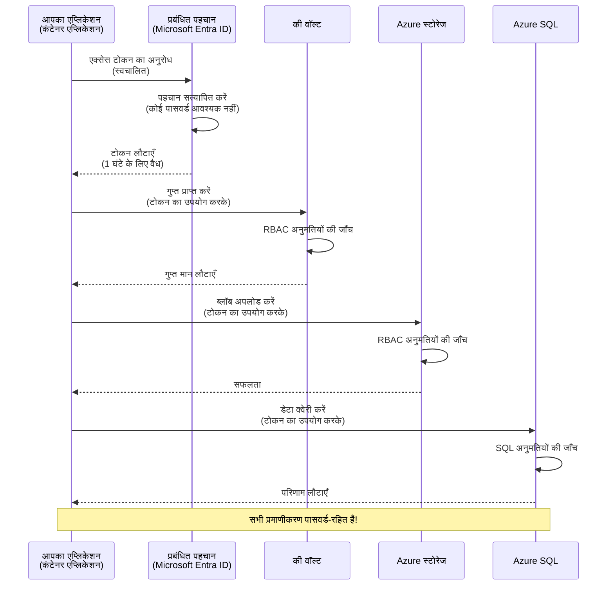
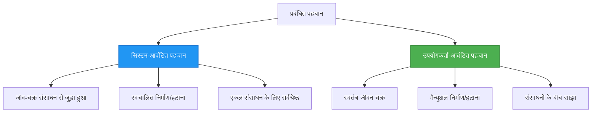

# प्रमाणीकरण पैटर्न और प्रबंधित आईडेंटिटी

⏱️ **अनुमानित समय**: 45-60 मिनट | 💰 **लागत प्रभाव**: मुफ्त (कोई अतिरिक्त शुल्क नहीं) | ⭐ **जटिलता**: मध्यम

**📚 सीखने का मार्ग:**
- ← पिछला: [Configuration Management](configuration.md) - पर्यावरण वेरिएबल और सीक्रेट्स का प्रबंधन
- 🎯 **आप यहाँ हैं**: प्रमाणीकरण और सुरक्षा (Managed Identity, Key Vault, सुरक्षित पैटर्न)
- → अगला: [First Project](first-project.md) - अपना पहला AZD एप्लिकेशन बनाएं
- 🏠 [Course Home](../../README.md)

---

## आप क्या सीखेंगे

इस पाठ को पूरा करने पर, आप:
- Azure प्रमाणीकरण पैटर्न समझेंगे (कीज़, कनेक्शन स्ट्रिंग्स, Managed Identity)
- पासवर्ड-रहित प्रमाणीकरण के लिए **Managed Identity** लागू करेंगे
- **Azure Key Vault** एकीकरण के साथ सीक्रेट्स को सुरक्षित करेंगे
- AZD डिप्लॉयमेंट्स के लिए **रोल-आधारित एक्सेस कंट्रोल (RBAC)** कॉन्फ़िगर करेंगे
- Container Apps और Azure सेवाओं में सुरक्षा सर्वोत्तम प्रथाएँ लागू करेंगे
- की-आधारित से पहचान-आधारित प्रमाणीकरण में माइग्रेट करेंगे

## Managed Identity क्यों महत्वपूर्ण है

### समस्या: पारंपरिक प्रमाणीकरण

**Managed Identity से पहले:**
```javascript
// ❌ सुरक्षा जोखिम: कोड में हार्डकोड की गई गुप्त जानकारी
const connectionString = "Server=mydb.database.windows.net;User=admin;Password=P@ssw0rd123";
const storageKey = "xK7mN9pQ2wR5tY8uI0oP3aS6dF1gH4jK...";
const cosmosKey = "C2x7B9n4M1p8Q5w3E6r0T2y5U8i1O4p7...";
```

**समस्याएँ:**
- 🔴 **कोड में उजागर सीक्रेट्स**, कॉन्फ़िग फाइलों में, पर्यावरण वेरिएबल्स में
- 🔴 **क्रेडेंशियल रोटेशन** के लिए कोड परिवर्तन और पुनःडिप्लॉयमेंट की आवश्यकता
- 🔴 **ऑडिट कॉन्फ़्यूज़न** - किसने क्या, कब एक्सेस किया?
- 🔴 **स्प्रॉल** - सीक्रेट्स कई सिस्टम में बिखरे हुए
- 🔴 **अनुपालन जोखिम** - सुरक्षा ऑडिट में असफल होना

### समाधान: Managed Identity

**Managed Identity के बाद:**
```javascript
// ✅ सुरक्षित: कोड में कोई गोपनीय जानकारी नहीं
const credential = new DefaultAzureCredential();
const client = new BlobServiceClient(
  "https://mystorageaccount.blob.core.windows.net",
  credential  // Azure स्वचालित रूप से प्रमाणीकरण को संभालता है
);
```

**लाभ:**
- ✅ **कोड या कॉन्फ़िग में शून्य सीक्रेट्स**
- ✅ **स्वचालित रोटेशन** - Azure इसे संभालता है
- ✅ **Microsoft Entra ID लॉग्स में पूर्ण ऑडिट ट्रेल**
- ✅ **केंद्रित सुरक्षा** - Azure पोर्टल में प्रबंधन
- ✅ **अनुपालन के लिए तैयार** - सुरक्षा मानकों को पूरा करता है

**उपमा**: पारंपरिक प्रमाणीकरण कई अलग-अलग दरवाज़ों के लिए कई भौतिक चाबियों को लेकर चलने जैसा है। Managed Identity उस सुरक्षा बैज जैसा है जो स्वचालित रूप से पहचान के आधार पर पहुंच प्रदान करता है—कोई चाबियाँ खोने, कॉपी करने, या रोटेट करने की आवश्यकता नहीं।

---

## आर्किटेक्चर ओवरव्यू

### Managed Identity के साथ प्रमाणीकरण फ्लो



### Managed Identities के प्रकार



| फ़ीचर | सिस्टम-आसाइन की गई | यूज़र-आसाइन की गई |
|---------|----------------|---------------|
| **लाइफ़साइकल** | रिसोर्स से जुड़ा हुआ | स्वतंत्र |
| **बनाना** | रिसोर्स के साथ ऑटोमैटिक | मैन्युअल निर्माण |
| **हटाना** | रिसोर्स के साथ हटाया जाता है | रिसोर्स हटाने के बाद भी बना रहता है |
| **शेयरिंग** | केवल एक रिसोर्स | कई रिसोर्सेज |
| **उपयोग के मामले** | सरल परिदृश्य | जटिल मल्टी-रिसोर्स परिदृश्य |
| **AZD डिफ़ॉल्ट** | ✅ अनुशंसित | वैकल्पिक |

---

## पूर्वापेक्षाएँ

### आवश्यक टूल

आपके पास पिछले पाठों से ये पहले से इंस्टॉल होने चाहिए:

```bash
# Azure Developer CLI सत्यापित करें
azd version
# ✅ अपेक्षित: azd संस्करण 1.0.0 या उससे ऊपर

# Azure CLI सत्यापित करें
az --version
# ✅ अपेक्षित: azure-cli 2.50.0 या उससे ऊपर
```

### Azure आवश्यकताएँ

- सक्रिय Azure सब्सक्रिप्शन
- अनुमतिें:
  - Managed identities बनाना
  - RBAC भूमिकाएँ असाइन करना
  - Key Vault रिसोर्सेस बनाना
  - Container Apps डिप्लॉय करना

### ज्ञान पूर्वापेक्षाएँ

आपने पूरा किया हुआ होना चाहिए:
- [Installation Guide](installation.md) - AZD सेटअप
- [AZD Basics](azd-basics.md) - मूल अवधारणाएँ
- [Configuration Management](configuration.md) - पर्यावरण वेरिएबल्स

---

## पाठ 1: प्रमाणीकरण पैटर्न समझना

### पैटर्न 1: कनेक्शन स्ट्रिंग्स (लेगेसी - टालें)

**यह कैसे काम करता है:**
```bash
# कनेक्शन स्ट्रिंग में प्रमाण-पत्र शामिल हैं
STORAGE_CONNECTION_STRING="DefaultEndpointsProtocol=https;AccountName=myaccount;AccountKey=xK7mN9pQ2wR5..."
COSMOS_CONNECTION_STRING="AccountEndpoint=https://myaccount.documents.azure.com:443/;AccountKey=C2x7..."
SQL_CONNECTION_STRING="Server=myserver.database.windows.net;User=admin;Password=P@ssw0rd..."
```

**समस्याएँ:**
- ❌ पर्यावरण वेरिएबल्स में सीक्रेट्स स्पष्ट दिखते हैं
- ❌ डिप्लॉयमेंट सिस्टम्स में लॉग होते हैं
- ❌ रोटेट करना मुश्किल
- ❌ पहुंच का कोई ऑडिट ट्रेल नहीं

**कब उपयोग करें:** केवल लोकल डेवलपमेंट के लिए, प्रोडक्शन में कभी नहीं।

---

### पैटर्न 2: Key Vault संदर्भ (बेहतर)

**यह कैसे काम करता है:**
```bicep
// Store secret in Key Vault
resource keyVault 'Microsoft.KeyVault/vaults@2023-02-01' = {
  name: 'mykv'
  properties: {
    enableRbacAuthorization: true
  }
}

// Reference in Container App
env: [
  {
    name: 'STORAGE_KEY'
    secretRef: 'storage-key'  // References Key Vault
  }
]
```

**लाभ:**
- ✅ सीक्रेट्स सुरक्षित रूप से Key Vault में संग्रहीत होते हैं
- ✅ केंद्रीकृत सीक्रेट प्रबंधन
- ✅ कोड परिवर्तन के बिना रोटेशन

**सीमाएँ:**
- ⚠️ अभी भी कीज़/पासवर्ड का उपयोग कर रहा है
- ⚠️ Key Vault एक्सेस मैनेज करना आवश्यक है

**कब उपयोग करें:** कनेक्शन स्ट्रिंग्स से Managed Identity में संक्रमण के लिए एक चरण।

---

### पैटर्न 3: Managed Identity (सर्वोत्तम प्रथा)

**यह कैसे काम करता है:**
```bicep
// Enable managed identity
resource containerApp 'Microsoft.App/containerApps@2023-05-01' = {
  name: 'myapp'
  identity: {
    type: 'SystemAssigned'  // Automatically creates identity
  }
}

// Grant permissions
resource roleAssignment 'Microsoft.Authorization/roleAssignments@2022-04-01' = {
  scope: storageAccount
  properties: {
    roleDefinitionId: storageBlobDataContributorRole
    principalId: containerApp.identity.principalId
  }
}
```

**एप्लिकेशन कोड:**
```javascript
// कोई रहस्य आवश्यक नहीं!
const { DefaultAzureCredential } = require('@azure/identity');
const { BlobServiceClient } = require('@azure/storage-blob');

const credential = new DefaultAzureCredential();
const blobServiceClient = new BlobServiceClient(
  'https://mystorageaccount.blob.core.windows.net',
  credential
);
```

**लाभ:**
- ✅ कोड/कॉन्फ़िग में शून्य सीक्रेट्स
- ✅ स्वचालित क्रेडेंशियल रोटेशन
- ✅ पूर्ण ऑडिट ट्रेल
- ✅ RBAC-आधारित अनुमतियाँ
- ✅ अनुपालन के लिए तैयार

**कब उपयोग करें:** हमेशा, प्रोडक्शन एप्लिकेशन्स के लिए।

---

### पैटर्न 4: सर्विस प्रिंसिपल्स (CI/CD और ऑटोमेशन)

Managed identity Azure के भीतर चलने वाले रिसोर्सेज के लिए गोल्ड स्टैंडर्ड है। लेकिन Azure के बाहर चलने वाली चीज़ों—जैसे build agent पर CI/CD पाइपलाइन, या आपके लैपटॉप पर एक स्क्रिप्ट जो इंटरैक्टिव लॉगिन उपयोग नहीं कर सकती—के बारे में क्या? वहां एक **service principal** उपयोग आता है: एक गैर-मानव पहचान जिसके अपने क्रेडेंशियल्स होते हैं जिसे एक ऑटोमेटेड प्रक्रिया के रूप में साइन इन किया जा सकता है।

**यह कैसे काम करता है:**

सबसे कम विशेषाधिकार के सिद्धांत के साथ एक रिसोर्स ग्रुप तक स्कोप किया गया सर्विस प्रिंसिपल बनाएं:

```bash
az ad sp create-for-rbac \
  --name "myapp-cicd" \
  --role contributor \
  --scopes /subscriptions/<sub-id>/resourceGroups/<rg-name>
```

यह एक क्लाइंट ID, क्लाइंट सीक्रेट, और टेनेंट ID प्रिंट करेगा। azd इनके साथ नॉन-इंटरैक्टिव रूप से साइन इन कर सकता है:

```bash
azd auth login \
  --client-id "<appId>" \
  --client-secret "<password>" \
  --tenant-id "<tenant>"
```

**सीक्रेट्स के बजाय फेडरेटेड क्रेडेंशियल्स (OIDC) को प्राथमिकता दें।** लंबे समय तक चलने वाले क्लाइंट सीक्रेट की बजाय, एक फेडरेटेड क्रेडेंशियल कॉन्फ़िगर करें ताकि पाइपलाइन एक शॉर्ट-लाइव्ड टोकन एक्सचेंज करे—कोई सीक्रेट लीक या रोटेट करने की आवश्यकता नहीं:

```bash
azd auth login \
  --client-id "<appId>" \
  --federated-credential-provider "github" \
  --tenant-id "<tenant>"
```

> `azd pipeline config` यह आपके लिए स्वचालित रूप से सेटअप करता है। [Chapter 8](../chapter-08-production/production-ai-practices.md) में CI/CD वॉकथ्रू देखें।

**लाभ:**
- ✅ Azure के बाहर काम करता है (build agents, ऑन-प्रेम, अन्य क्लाउड)
- ✅ एक रोल के साथ एक रिसोर्स ग्रुप तक स्कोप किया जा सकता है
- ✅ फेडरेटेड (OIDC) वेरिएंट में कोई संग्रहीत सीक्रेट नहीं होता

**ट्रेड-ऑफ़्स:**
- ⚠️ सीक्रेट-आधारित वेरिएंट को सावधानीपूर्वक स्टोरेज और रोटेशन की आवश्यकता है
- ⚠️ एक लीक हुई सीक्रेट SP जितना कर सकता है उतनी शक्तियाँ दे देती है—स्कोप को तंग रखें

**कब उपयोग करें:** CI/CD पाइपलाइन्स और ऐसे ऑटोमेशन के लिए जो Managed Identity का उपयोग नहीं कर सकते। हमेशा क्लाइंट सीक्रेट की बजाय **federated/OIDC** वेरिएंट को प्राथमिकता दें, और जब भी वर्कलोड Azure के अंदर चलता हो तो Managed Identity को प्राथमिकता दें।

**क्रेडेंशियल्स को सुरक्षित रूप से स्टोर करना:**
- कभी भी सीक्रेट्स को कमिट न करें—अपने पाइपलाइन के सीक्रेट स्टोर का उपयोग करें (GitHub Actions secrets, Azure DevOps variable groups / Key Vault)।
- SP को सबसे छोटे रोल और रिसोर्स ग्रुप तक सीमित करें जिसकी उसे आवश्यकता है।
- समाप्ति सेट करें और रोटेट करें, या OIDC के साथ सीक्रेट को पूरी तरह समाप्त कर दें।

---

## पाठ 2: AZD के साथ Managed Identity लागू करना

### चरण-दर-चरण कार्यान्वयन

आइए एक सुरक्षित Container App बनाते हैं जो Azure Storage और Key Vault तक पहुँचने के लिए Managed Identity का उपयोग करता है।

### प्रोजेक्ट संरचना

```
secure-app/
├── azure.yaml                 # AZD configuration
├── infra/
│   ├── main.bicep            # Main infrastructure
│   ├── core/
│   │   ├── identity.bicep    # Managed identity setup
│   │   ├── keyvault.bicep    # Key Vault configuration
│   │   └── storage.bicep     # Storage with RBAC
│   └── app/
│       └── container-app.bicep
└── src/
    ├── app.js                # Application code
    ├── package.json
    └── Dockerfile
```

### 1. AZD कॉन्फ़िगर करें (azure.yaml)

```yaml
name: secure-app
metadata:
  template: secure-app@1.0.0

services:
  api:
    project: ./src
    language: js
    host: containerapp

# Enable managed identity (AZD handles this automatically)
```

### 2. इंफ्रास्ट्रक्चर: Managed Identity सक्षम करें

**File: `infra/main.bicep`**

```bicep
targetScope = 'subscription'

param environmentName string
param location string = 'eastus'

var tags = { 'azd-env-name': environmentName }

// Resource group
resource rg 'Microsoft.Resources/resourceGroups@2021-04-01' = {
  name: 'rg-${environmentName}'
  location: location
  tags: tags
}

// Storage Account
module storage './core/storage.bicep' = {
  name: 'storage'
  scope: rg
  params: {
    name: 'st${uniqueString(rg.id)}'
    location: location
    tags: tags
  }
}

// Key Vault
module keyVault './core/keyvault.bicep' = {
  name: 'keyvault'
  scope: rg
  params: {
    name: 'kv-${uniqueString(rg.id)}'
    location: location
    tags: tags
  }
}

// Container App with Managed Identity
module containerApp './app/container-app.bicep' = {
  name: 'container-app'
  scope: rg
  params: {
    name: 'ca-${environmentName}'
    location: location
    tags: tags
    storageAccountName: storage.outputs.name
    keyVaultName: keyVault.outputs.name
  }
}

// Grant Container App access to Storage
module storageRoleAssignment './core/role-assignment.bicep' = {
  name: 'storage-role'
  scope: rg
  params: {
    principalId: containerApp.outputs.identityPrincipalId
    roleDefinitionId: 'ba92f5b4-2d11-453d-a403-e96b0029c9fe'  // Storage Blob Data Contributor
    targetResourceId: storage.outputs.id
  }
}

// Grant Container App access to Key Vault
module kvRoleAssignment './core/role-assignment.bicep' = {
  name: 'kv-role'
  scope: rg
  params: {
    principalId: containerApp.outputs.identityPrincipalId
    roleDefinitionId: '4633458b-17de-408a-b874-0445c86b69e6'  // Key Vault Secrets User
    targetResourceId: keyVault.outputs.id
  }
}

// Outputs
output AZURE_STORAGE_ACCOUNT_NAME string = storage.outputs.name
output AZURE_KEY_VAULT_NAME string = keyVault.outputs.name
output APP_URL string = containerApp.outputs.url
```

### 3. System-Assigned Identity के साथ Container App

**File: `infra/app/container-app.bicep`**

```bicep
param name string
param location string
param tags object = {}
param storageAccountName string
param keyVaultName string

resource containerApp 'Microsoft.App/containerApps@2023-05-01' = {
  name: name
  location: location
  tags: tags
  identity: {
    type: 'SystemAssigned'  // 🔑 Enable managed identity
  }
  properties: {
    configuration: {
      ingress: {
        external: true
        targetPort: 3000
      }
    }
    template: {
      containers: [
        {
          name: 'api'
          image: 'myregistry.azurecr.io/api:latest'
          resources: {
            cpu: json('0.5')
            memory: '1Gi'
          }
          env: [
            {
              name: 'AZURE_STORAGE_ACCOUNT_NAME'
              value: storageAccountName
            }
            {
              name: 'AZURE_KEY_VAULT_NAME'
              value: keyVaultName
            }
            // 🔑 No secrets - managed identity handles authentication!
          ]
        }
      ]
    }
  }
}

// Output the identity for RBAC assignments
output identityPrincipalId string = containerApp.identity.principalId
output id string = containerApp.id
output url string = 'https://${containerApp.properties.configuration.ingress.fqdn}'
```

### 4. RBAC रोल असाइनमेंट मॉड्यूल

**File: `infra/core/role-assignment.bicep`**

```bicep
param principalId string
param roleDefinitionId string  // Azure built-in role ID
param targetResourceId string

resource roleAssignment 'Microsoft.Authorization/roleAssignments@2022-04-01' = {
  name: guid(principalId, roleDefinitionId, targetResourceId)
  scope: resourceId('Microsoft.Resources/resourceGroups', resourceGroup().name)
  properties: {
    roleDefinitionId: subscriptionResourceId('Microsoft.Authorization/roleDefinitions', roleDefinitionId)
    principalId: principalId
    principalType: 'ServicePrincipal'
  }
}

output id string = roleAssignment.id
```

### 5. Managed Identity के साथ एप्लिकेशन कोड

**File: `src/app.js`**

```javascript
const express = require('express');
const { DefaultAzureCredential } = require('@azure/identity');
const { BlobServiceClient } = require('@azure/storage-blob');
const { SecretClient } = require('@azure/keyvault-secrets');

const app = express();
const PORT = process.env.PORT || 3000;

// 🔑 क्रेडेंशियल प्रारंभ करें (मैनेज्ड आइडेंटिटी के साथ स्वचालित रूप से काम करता है)
const credential = new DefaultAzureCredential();

// Azure Storage सेटअप
const storageAccountName = process.env.AZURE_STORAGE_ACCOUNT_NAME;
const blobServiceClient = new BlobServiceClient(
  `https://${storageAccountName}.blob.core.windows.net`,
  credential  // कोई कुंजी आवश्यक नहीं!
);

// Key Vault सेटअप
const keyVaultName = process.env.AZURE_KEY_VAULT_NAME;
const secretClient = new SecretClient(
  `https://${keyVaultName}.vault.azure.net`,
  credential  // कोई कुंजी आवश्यक नहीं!
);

// स्वास्थ्य जांच
app.get('/health', (req, res) => {
  res.json({ status: 'healthy', authentication: 'managed-identity' });
});

// ब्लॉब स्टोरेज में फ़ाइल अपलोड करें
app.post('/upload', async (req, res) => {
  try {
    const containerClient = blobServiceClient.getContainerClient('uploads');
    await containerClient.createIfNotExists();
    
    const blobName = `file-${Date.now()}.txt`;
    const blockBlobClient = containerClient.getBlockBlobClient(blobName);
    
    await blockBlobClient.upload('Hello from managed identity!', 30);
    
    res.json({
      success: true,
      blobName: blobName,
      message: 'File uploaded using managed identity!'
    });
  } catch (error) {
    console.error('Upload error:', error);
    res.status(500).json({ error: error.message });
  }
});

// Key Vault से गोपनीय जानकारी प्राप्त करें
app.get('/secret/:name', async (req, res) => {
  try {
    const secretName = req.params.name;
    const secret = await secretClient.getSecret(secretName);
    
    res.json({
      name: secretName,
      value: secret.value,
      message: 'Secret retrieved using managed identity!'
    });
  } catch (error) {
    console.error('Secret error:', error);
    res.status(500).json({ error: error.message });
  }
});

// ब्लॉब कंटेनरों की सूची (पढ़ने की पहुँच दिखाती है)
app.get('/containers', async (req, res) => {
  try {
    const containers = [];
    for await (const container of blobServiceClient.listContainers()) {
      containers.push(container.name);
    }
    
    res.json({
      containers: containers,
      count: containers.length,
      message: 'Containers listed using managed identity!'
    });
  } catch (error) {
    console.error('List error:', error);
    res.status(500).json({ error: error.message });
  }
});

app.listen(PORT, () => {
  console.log(`Secure API listening on port ${PORT}`);
  console.log('Authentication: Managed Identity (passwordless)');
});
```

**File: `src/package.json`**

```json
{
  "name": "secure-app",
  "version": "1.0.0",
  "dependencies": {
    "express": "^4.18.2",
    "@azure/identity": "^4.0.0",
    "@azure/storage-blob": "^12.17.0",
    "@azure/keyvault-secrets": "^4.7.0"
  },
  "scripts": {
    "start": "node app.js"
  }
}
```

### 6. डिप्लॉय और टेस्ट करें

```bash
# AZD पर्यावरण आरंभ करें
azd init

# बुनियादी ढांचा और एप्लिकेशन तैनात करें
azd up

# एप्लिकेशन का URL प्राप्त करें
APP_URL=$(azd env get-values | grep APP_URL | cut -d '=' -f2 | tr -d '"')

# हेल्थ चेक का परीक्षण करें
curl $APP_URL/health
```

**✅ अपेक्षित आउटपुट:**
```json
{
  "status": "healthy",
  "authentication": "managed-identity"
}
```

**ब्लॉब अपलोड टेस्ट:**
```bash
curl -X POST $APP_URL/upload
```

**✅ अपेक्षित आउटपुट:**
```json
{
  "success": true,
  "blobName": "file-1700404800000.txt",
  "message": "File uploaded using managed identity!"
}
```

**कंटेनर लिस्टिंग टेस्ट:**
```bash
curl $APP_URL/containers
```

**✅ अपेक्षित आउटपुट:**
```json
{
  "containers": ["uploads"],
  "count": 1,
  "message": "Containers listed using managed identity!"
}
```

---

## सामान्य Azure RBAC भूमिकाएँ

### Managed Identity के लिए बिल्ट-इन रोल IDs

| सेवा | भूमिका का नाम | भूमिका ID | अनुमतियाँ |
|---------|-----------|---------|-------------|
| **Storage** | Storage Blob Data Reader | `2a2b9908-6b94-4a3d-8e5a-a7d8f8cc8a12` | ब्लॉब्स और कंटेनरों को पढ़ें |
| **Storage** | Storage Blob Data Contributor | `ba92f5b4-2d11-453d-a403-e96b0029c9fe` | ब्लॉब्स को पढ़ें, लिखें, और हटाएँ |
| **Storage** | Storage Queue Data Contributor | `974c5e8b-45b9-4653-ba55-5f855dd0fb88` | क्यू संदेशों को पढ़ें, लिखें, और हटाएँ |
| **Key Vault** | Key Vault Secrets User | `4633458b-17de-408a-b874-0445c86b69e6` | सीक्रेट्स पढ़ें |
| **Key Vault** | Key Vault Secrets Officer | `b86a8fe4-44ce-4948-aee5-eccb2c155cd7` | सीक्रेट्स पढ़ें, लिखें, हटाएँ |
| **Cosmos DB** | Cosmos DB Built-in Data Reader | `00000000-0000-0000-0000-000000000001` | Cosmos DB डेटा पढ़ें |
| **Cosmos DB** | Cosmos DB Built-in Data Contributor | `00000000-0000-0000-0000-000000000002` | Cosmos DB डेटा पढ़ें और लिखें |
| **SQL Database** | SQL DB Contributor | `9b7fa17d-e63e-47b0-bb0a-15c516ac86ec` | SQL डेटाबेस प्रबंधित करें |
| **Service Bus** | Azure Service Bus Data Owner | `090c5cfd-751d-490a-894a-3ce6f1109419` | संदेश भेजें, प्राप्त करें, और प्रबंधित करें |

### Rolle IDs कैसे खोजें

```bash
# सभी बिल्ट-इन भूमिकाएँ सूचीबद्ध करें
az role definition list --query "[].{Name:roleName, ID:name}" --output table

# विशिष्ट भूमिका खोजें
az role definition list --query "[?contains(roleName, 'Storage Blob')].{Name:roleName, ID:name}" --output table

# भूमिका विवरण प्राप्त करें
az role definition list --name "Storage Blob Data Contributor"
```

---

## व्यावहारिक अभ्यास

### अभ्यास 1: मौजूदा ऐप के लिए Managed Identity सक्षम करें ⭐⭐ (मध्यम)

**लक्ष्य**: मौजूदा Container App डिप्लॉयमेंट में Managed Identity जोड़ें

**परिदृश्य**: आपके पास एक Container App है जो कनेक्शन स्ट्रिंग्स का उपयोग कर रहा है। इसे Managed Identity में कनवर्ट करें।

**शुरुआती बिंदु**: इस कॉन्फ़िगरेशन वाला Container App:

```bicep
// ❌ Current: Using connection string
env: [
  {
    name: 'STORAGE_CONNECTION_STRING'
    secretRef: 'storage-connection'
  }
]
```

**कदम**:

1. **Bicep में Managed Identity सक्षम करें:**

```bicep
resource containerApp 'Microsoft.App/containerApps@2023-05-01' = {
  name: 'myapp'
  identity: {
    type: 'SystemAssigned'  // Add this
  }
  // ... rest of configuration
}
```

2. **Storage एक्सेस दें:**

```bicep
// Get storage account reference
resource storageAccount 'Microsoft.Storage/storageAccounts@2023-01-01' existing = {
  name: storageAccountName
}

// Assign role
resource roleAssignment 'Microsoft.Authorization/roleAssignments@2022-04-01' = {
  name: guid(containerApp.id, 'ba92f5b4-2d11-453d-a403-e96b0029c9fe', storageAccount.id)
  scope: storageAccount
  properties: {
    roleDefinitionId: subscriptionResourceId('Microsoft.Authorization/roleDefinitions', 'ba92f5b4-2d11-453d-a403-e96b0029c9fe')
    principalId: containerApp.identity.principalId
    principalType: 'ServicePrincipal'
  }
}
```

3. **एप्लिकेशन कोड अपडेट करें:**

**पहले (कनेक्शन स्ट्रिंग):**
```javascript
const { BlobServiceClient } = require('@azure/storage-blob');

const blobServiceClient = BlobServiceClient.fromConnectionString(
  process.env.STORAGE_CONNECTION_STRING
);
```

**बाद में (Managed Identity):**
```javascript
const { DefaultAzureCredential } = require('@azure/identity');
const { BlobServiceClient } = require('@azure/storage-blob');

const credential = new DefaultAzureCredential();
const blobServiceClient = new BlobServiceClient(
  `https://${process.env.STORAGE_ACCOUNT_NAME}.blob.core.windows.net`,
  credential
);
```

4. **पर्यावरण वेरिएबल्स अपडेट करें:**

```bicep
env: [
  {
    name: 'STORAGE_ACCOUNT_NAME'
    value: storageAccountName  // Just the name, no secrets!
  }
  // Remove STORAGE_CONNECTION_STRING
]
```

5. **डिप्लॉय और टेस्ट करें:**

```bash
# फिर से तैनात करें
azd up

# जांचें कि यह अभी भी काम करता है
curl https://myapp.azurecontainerapps.io/upload
```

**✅ सफलता मानदंड:**
- ✅ एप्लिकेशन बिना त्रुटियों के डिप्लॉय होता है
- ✅ Storage ऑपरेशन्स काम करते हैं (अपलोड, लिस्ट, डाउनलोड)
- ✅ पर्यावरण वेरिएबल्स में कोई कनेक्शन स्ट्रिंग्स नहीं हैं
- ✅ Azure पोर्टल में "Identity" ब्लेड के तहत पहचान दिखाई देती है

**सत्यापन:**

```bash
# सुनिश्चित करें कि प्रबंधित पहचान सक्षम है
az containerapp show \
  --name myapp \
  --resource-group rg-myapp \
  --query "identity.type"
# ✅ अपेक्षित: "SystemAssigned"

# भूमिका असाइनमेंट की जाँच करें
az role assignment list \
  --assignee $(az containerapp show --name myapp --resource-group rg-myapp --query "identity.principalId" -o tsv) \
  --scope /subscriptions/{sub-id}/resourceGroups/rg-myapp/providers/Microsoft.Storage/storageAccounts/mystorageaccount
# ✅ अपेक्षित: "Storage Blob Data Contributor" भूमिका दिखती है
```

**समय**: 20-30 मिनट

---

### अभ्यास 2: यूज़र-आसाइन की गई पहचान के साथ मल्टी-सर्विस एक्सेस ⭐⭐⭐ (उन्नत)

**लक्ष्य**: एक यूज़र-आसाइन की गई पहचान बनाएं जिसे कई Container Apps के बीच साझा किया जा सके

**परिदृश्य**: आपके पास 3 माइक्रोसर्विसेज हैं जिन्हें समान Storage अकाउंट और Key Vault तक पहुँच की आवश्यकता है।

**कदम**:

1. **यूज़र-आसाइन की गई पहचान बनाएं:**

**File: `infra/core/identity.bicep`**

```bicep
param name string
param location string
param tags object = {}

resource userAssignedIdentity 'Microsoft.ManagedIdentity/userAssignedIdentities@2023-01-31' = {
  name: name
  location: location
  tags: tags
}

output id string = userAssignedIdentity.id
output principalId string = userAssignedIdentity.properties.principalId
output clientId string = userAssignedIdentity.properties.clientId
```

2. **यूज़र-आसाइन की गई पहचान को रोल असाइन करें:**

```bicep
// In main.bicep
module userIdentity './core/identity.bicep' = {
  name: 'user-identity'
  scope: rg
  params: {
    name: 'id-${environmentName}'
    location: location
    tags: tags
  }
}

// Grant Storage access
resource storageRoleAssignment 'Microsoft.Authorization/roleAssignments@2022-04-01' = {
  name: guid(userIdentity.outputs.principalId, 'storage-contributor')
  scope: storageAccount
  properties: {
    roleDefinitionId: subscriptionResourceId('Microsoft.Authorization/roleDefinitions', 'ba92f5b4-2d11-453d-a403-e96b0029c9fe')
    principalId: userIdentity.outputs.principalId
    principalType: 'ServicePrincipal'
  }
}

// Grant Key Vault access
resource kvRoleAssignment 'Microsoft.Authorization/roleAssignments@2022-04-01' = {
  name: guid(userIdentity.outputs.principalId, 'kv-secrets-user')
  scope: keyVault
  properties: {
    roleDefinitionId: subscriptionResourceId('Microsoft.Authorization/roleDefinitions', '4633458b-17de-408a-b874-0445c86b69e6')
    principalId: userIdentity.outputs.principalId
    principalType: 'ServicePrincipal'
  }
}
```

3. **पहचान को कई Container Apps पर असाइन करें:**

```bicep
resource apiGateway 'Microsoft.App/containerApps@2023-05-01' = {
  name: 'api-gateway'
  identity: {
    type: 'UserAssigned'
    userAssignedIdentities: {
      '${userIdentity.outputs.id}': {}
    }
  }
  // ... rest of config
}

resource productService 'Microsoft.App/containerApps@2023-05-01' = {
  name: 'product-service'
  identity: {
    type: 'UserAssigned'
    userAssignedIdentities: {
      '${userIdentity.outputs.id}': {}
    }
  }
  // ... rest of config
}

resource orderService 'Microsoft.App/containerApps@2023-05-01' = {
  name: 'order-service'
  identity: {
    type: 'UserAssigned'
    userAssignedIdentities: {
      '${userIdentity.outputs.id}': {}
    }
  }
  // ... rest of config
}
```

4. **एप्लिकेशन कोड (सभी सेवाएँ समान पैटर्न उपयोग करती हैं):**

```javascript
const { DefaultAzureCredential, ManagedIdentityCredential } = require('@azure/identity');

// उपयोगकर्ता-आवंटित पहचान के लिए क्लाइंट आईडी निर्दिष्ट करें
const credential = new ManagedIdentityCredential(
  process.env.AZURE_CLIENT_ID  // उपयोगकर्ता-आवंटित पहचान क्लाइंट आईडी
);

// या DefaultAzureCredential (स्वतः पता लगाता है) का उपयोग करें
const credential = new DefaultAzureCredential();

const blobServiceClient = new BlobServiceClient(
  `https://${process.env.STORAGE_ACCOUNT_NAME}.blob.core.windows.net`,
  credential
);
```

5. **डिप्लॉय और सत्यापित करें:**

```bash
azd up

# जांचें कि सभी सेवाएँ भंडारण तक पहुंच सकती हैं
curl https://api-gateway.azurecontainerapps.io/upload
curl https://product-service.azurecontainerapps.io/upload
curl https://order-service.azurecontainerapps.io/upload
```

**✅ सफलता मानदंड:**
- ✅ एक पहचान 3 सेवाओं में साझा की गई
- ✅ सभी सेवाएँ Storage और Key Vault तक पहुँच सकती हैं
- ✅ यदि आप एक सेवा हटाते हैं तो पहचान बनी रहती है
- ✅ केंद्रीकृत अनुमति प्रबंधन

**यूज़र-आसाइन की गई पहचान के लाभ:**
- प्रबंधित करने के लिए एकल पहचान
- सेवाओं में सुसंगत अनुमतियाँ
- सेवा हटाने पर पहचान बनी रहती है
- जटिल आर्किटेक्चर के लिए बेहतर

**समय**: 30-40 मिनट

---

### अभ्यास 3: Key Vault सीक्रेट रोटेशन लागू करें ⭐⭐⭐ (उन्नत)

**लक्ष्य**: तृतीय-पक्ष API कीज़ को Key Vault में स्टोर करें और Managed Identity का उपयोग करके उन्हें एक्सेस करें

**परिदृश्य**: आपकी ऐप को एक बाहरी API (OpenAI, Stripe, SendGrid) को कॉल करने के लिए API कीज़ की आवश्यकता है।

**कदम**:

1. **RBAC के साथ Key Vault बनाएं:**

**File: `infra/core/keyvault.bicep`**

```bicep
param name string
param location string
param tags object = {}

resource keyVault 'Microsoft.KeyVault/vaults@2023-02-01' = {
  name: name
  location: location
  tags: tags
  properties: {
    enableRbacAuthorization: true  // Use RBAC instead of access policies
    sku: {
      family: 'A'
      name: 'standard'
    }
    tenantId: subscription().tenantId
    enableSoftDelete: true
    softDeleteRetentionInDays: 90
  }
}

// Allow Container App to read secrets
output id string = keyVault.id
output name string = keyVault.name
output uri string = keyVault.properties.vaultUri
```

2. **Key Vault में सीक्रेट्स स्टोर करें:**

```bash
# Key Vault का नाम प्राप्त करें
KV_NAME=$(azd env get-values | grep AZURE_KEY_VAULT_NAME | cut -d '=' -f2 | tr -d '"')

# तृतीय-पक्ष API कुंजियाँ संग्रहीत करें
az keyvault secret set \
  --vault-name $KV_NAME \
  --name "OpenAI-ApiKey" \
  --value "sk-proj-xxxxxxxxxxxxx"

az keyvault secret set \
  --vault-name $KV_NAME \
  --name "Stripe-ApiKey" \
  --value "sk_live_xxxxxxxxxxxxx"

az keyvault secret set \
  --vault-name $KV_NAME \
  --name "SendGrid-ApiKey" \
  --value "SG.xxxxxxxxxxxxx"
```

3. **सीक्रेट्स प्राप्त करने के लिए एप्लिकेशन कोड:**

**File: `src/config.js`**

```javascript
const { DefaultAzureCredential } = require('@azure/identity');
const { SecretClient } = require('@azure/keyvault-secrets');

class Config {
  constructor() {
    this.credential = new DefaultAzureCredential();
    this.secretClient = new SecretClient(
      `https://${process.env.AZURE_KEY_VAULT_NAME}.vault.azure.net`,
      this.credential
    );
    this.cache = {};
  }

  async getSecret(secretName) {
    // पहले कैश की जाँच करें
    if (this.cache[secretName]) {
      return this.cache[secretName];
    }

    try {
      const secret = await this.secretClient.getSecret(secretName);
      this.cache[secretName] = secret.value;
      console.log(`✅ Retrieved secret: ${secretName}`);
      return secret.value;
    } catch (error) {
      console.error(`❌ Failed to get secret ${secretName}:`, error.message);
      throw error;
    }
  }

  async getOpenAIKey() {
    return this.getSecret('OpenAI-ApiKey');
  }

  async getStripeKey() {
    return this.getSecret('Stripe-ApiKey');
  }

  async getSendGridKey() {
    return this.getSecret('SendGrid-ApiKey');
  }
}

module.exports = new Config();
```

4. **एप्लिकेशन में सीक्रेट्स का उपयोग करें:**

**File: `src/app.js`**

```javascript
const express = require('express');
const config = require('./config');
const { OpenAI } = require('openai');

const app = express();

// Key Vault से कुंजी का उपयोग करके OpenAI को आरंभ करें
let openaiClient;

async function initializeServices() {
  const openaiKey = await config.getOpenAIKey();
  openaiClient = new OpenAI({ apiKey: openaiKey });
  console.log('✅ Services initialized with secrets from Key Vault');
}

// स्टार्टअप पर कॉल करें
initializeServices().catch(console.error);

app.post('/chat', async (req, res) => {
  try {
    const completion = await openaiClient.chat.completions.create({
      model: 'gpt-4.1',
      messages: [{ role: 'user', content: 'Hello!' }]
    });
    
    res.json({
      response: completion.choices[0].message.content,
      authentication: 'Key from Key Vault via Managed Identity'
    });
  } catch (error) {
    res.status(500).json({ error: error.message });
  }
});

app.listen(3000, () => {
  console.log('Secure API with Key Vault integration running');
});
```

5. **डिप्लॉय और टेस्ट करें:**

```bash
azd up

# परीक्षण करें कि API कुंजियाँ काम करती हैं
curl -X POST https://myapp.azurecontainerapps.io/chat \
  -H "Content-Type: application/json" \
  -d '{"message":"Hello AI"}'
```

**✅ सफलता मानदंड:**

- ✅ कोई API कुंजी कोड या पर्यावरण चर में नहीं
- ✅ एप्लिकेशन Key Vault से कुंजियाँ प्राप्त करता है
- ✅ तृतीय-पक्ष APIs सही तरीके से काम करते हैं
- ✅ बिना कोड परिवर्तन के कुंजियाँ रोटेट की जा सकती हैं

**Rotate a secret:**

```bash
# Key Vault में सीक्रेट को अपडेट करें
az keyvault secret set \
  --vault-name $KV_NAME \
  --name "OpenAI-ApiKey" \
  --value "sk-proj-NEW_KEY_HERE"

# नई कुंजी लागू करने के लिए ऐप को पुनरारंभ करें
az containerapp revision restart \
  --name myapp \
  --resource-group rg-myapp
```

**समय**: 25-35 मिनट

---

## ज्ञान जाँच बिंदु

### 1. Authentication Patterns ✓

अपनी समझ का परीक्षण करें:

- [ ] **Q1**: तीन मुख्य ऑथेंटिकेशन पैटर्न कौन से हैं? 
  - **A**: कनेक्शन स्ट्रिंग्स (legacy), Key Vault संदर्भ (transition), Managed Identity (best)

- [ ] **Q2**: Managed identity कनेक्शन स्ट्रिंग्स से बेहतर क्यों है?
  - **A**: कोड में कोई सीक्रेट नहीं, स्वचालित रोटेशन, पूर्ण ऑडिट ट्रेल, RBAC अनुमतियाँ

- [ ] **Q3**: कब आप user-assigned identity का उपयोग system-assigned के बजाय करेंगे?
  - **A**: जब आप कई संसाधनों में पहचान साझा कर रहे हों या पहचान का लाइफसाइकल संसाधन के लाइफसाइकल से स्वतंत्र हो

**हैंड्स-ऑन सत्यापन:**
```bash
# जांचें कि आपका ऐप किस प्रकार की पहचान का उपयोग करता है
az containerapp show \
  --name myapp \
  --resource-group rg-myapp \
  --query "identity.type"

# पहचान के लिए सभी भूमिका आवंटन सूचीबद्ध करें
az role assignment list \
  --assignee $(az containerapp show --name myapp --resource-group rg-myapp --query "identity.principalId" -o tsv)
```

---

### 2. RBAC और अनुमतियाँ ✓

अपनी समझ का परीक्षण करें:

- [ ] **Q1**: "Storage Blob Data Contributor" के लिए रोल ID क्या है?
  - **A**: `ba92f5b4-2d11-453d-a403-e96b0029c9fe`

- [ ] **Q2**: "Key Vault Secrets User" कौन-कौन सी अनुमतियाँ देता है?
  - **A**: सीक्रेट्स के लिए केवल-पढ़ने की पहुँच (नहीं बना सकता, अपडेट या डिलीट नहीं कर सकता)

- [ ] **Q3**: आप Container App को Azure SQL तक पहुंच कैसे देंगे?
  - **A**: "SQL DB Contributor" रोल असाइन करें या SQL के लिए Microsoft Entra ID ऑथेंटिकेशन कॉन्फ़िगर करें

**हैंड्स-ऑन सत्यापन:**
```bash
# विशिष्ट भूमिका खोजें
az role definition list --name "Storage Blob Data Contributor"

# जांचें कि आपकी पहचान को कौन-कौन सी भूमिकाएँ आवंटित की गई हैं
PRINCIPAL_ID=$(az containerapp show --name myapp --resource-group rg-myapp --query "identity.principalId" -o tsv)
az role assignment list --assignee $PRINCIPAL_ID --output table
```

---

### 3. Key Vault एकीकरण ✓

अपनी समझ का परीक्षण करें:

- [ ] **Q1**: आप Key Vault के लिए access policies की बजाय RBAC कैसे सक्षम करते हैं?
  - **A**: Bicep में `enableRbacAuthorization: true` सेट करें

- [ ] **Q2**: किस Azure SDK लाइब्रेरी में managed identity ऑथेंटिकेशन हैंडल होता है?
  - **A**: `@azure/identity` में `DefaultAzureCredential` क्लास

- [ ] **Q3**: Key Vault के सीक्रेट्स कैश में कितने समय तक रहते हैं?
  - **A**: एप्लिकेशन-निर्भर; अपनी खुद की कैशिंग रणनीति लागू करें

**हैंड्स-ऑन सत्यापन:**
```bash
# Key Vault तक पहुँच का परीक्षण
az keyvault secret show \
  --vault-name $KV_NAME \
  --name "OpenAI-ApiKey" \
  --query "value"

# जाँचें कि RBAC सक्षम है
az keyvault show \
  --name $KV_NAME \
  --query "properties.enableRbacAuthorization"
# ✅ अपेक्षित: true
```

---

## सुरक्षा सर्वोत्तम प्रथाएँ

### ✅ करें:

1. **प्रोडक्शन में हमेशा managed identity का उपयोग करें**
   ```bicep
   identity: {
     type: 'SystemAssigned'
   }
   ```

2. **न्यूनतम-विशेषाधिकार RBAC भूमिकाओं का उपयोग करें**
   - संभव हो तो "Reader" भूमिकाओं का उपयोग करें
   - जहाँ तक संभव हो "Owner" या "Contributor" से बचें

3. **तृतीय-पक्ष कुंजियों को Key Vault में स्टोर करें**
   ```javascript
   const apiKey = await secretClient.getSecret('ThirdPartyApiKey');
   ```

4. **ऑडिट लॉगिंग सक्षम करें**
   ```bicep
   diagnosticSettings: {
     logs: [{ category: 'AuditEvent', enabled: true }]
   }
   ```

5. **dev/staging/prod के लिए अलग-अलग पहचानें उपयोग करें**
   ```bash
   azd env new dev
   azd env new staging
   azd env new prod
   ```

6. **सीक्रेट्स को नियमित रूप से रोटेट करें**
   - Key Vault सीक्रेट्स पर समाप्ति तिथियाँ सेट करें
   - Azure Functions के साथ रोटेशन को ऑटोमेट करें

### ❌ न करें:

1. **कभी भी सीक्रेट्स को हार्डकोड न करें**
   ```javascript
   // ❌ खराब
   const apiKey = "sk-proj-xxxxxxxxxxxxx";
   ```

2. **प्रोडक्शन में कनेक्शन स्ट्रिंग्स का उपयोग न करें**
   ```javascript
   // ❌ खराब
   BlobServiceClient.fromConnectionString(process.env.STORAGE_CONNECTION_STRING)
   ```

3. **अत्यधिक अनुमतियाँ न दें**
   ```bicep
   // ❌ BAD - too much access
   roleDefinitionId: 'Owner'
   
   // ✅ GOOD - least privilege
   roleDefinitionId: 'Storage Blob Data Reader'
   ```

4. **सीक्रेट्स को लॉग न करें**
   ```javascript
   // ❌ खराब
   console.log('API Key:', apiKey);
   
   // ✅ अच्छा
   console.log('API Key retrieved successfully');
   ```

5. **प्रोडक्शन पहचानें पर्यावरणों में साझा न करें**
   ```bicep
   // ❌ BAD - same identity for dev and prod
   // ✅ GOOD - separate identities per environment
   ```

---

## समस्या निवारण मार्गदर्शिका

### समस्या: Azure Storage को एक्सेस करते समय "Unauthorized"

**लक्षण:**
```
Error: Unauthorized (403)
AuthorizationPermissionMismatch: This request is not authorized to perform this operation
```

**निदान:**

```bash
# जांचें कि प्रबंधित पहचान सक्षम है
az containerapp show \
  --name myapp \
  --resource-group rg-myapp \
  --query "identity.type"
# ✅ अपेक्षित: "SystemAssigned" या "UserAssigned"

# भूमिका नियुक्तियाँ जांचें
PRINCIPAL_ID=$(az containerapp show --name myapp --resource-group rg-myapp --query "identity.principalId" -o tsv)
az role assignment list --assignee $PRINCIPAL_ID

# अपेक्षित: "Storage Blob Data Contributor" या समान भूमिका दिखनी चाहिए
```

**समाधान:**

1. **सही RBAC रोल दें:**
```bash
STORAGE_ID=$(az storage account show --name mystorageaccount --resource-group rg-myapp --query "id" -o tsv)
az role assignment create \
  --assignee $PRINCIPAL_ID \
  --role "Storage Blob Data Contributor" \
  --scope $STORAGE_ID
```

2. **प्रसार के लिए प्रतीक्षा करें (5-10 मिनट लग सकते हैं):**
```bash
# भूमिका असाइनमेंट की स्थिति जांचें
az role assignment list --assignee $PRINCIPAL_ID --scope $STORAGE_ID
```

3. **सत्यापित करें कि एप्लिकेशन कोड सही क्रेडेंशियल का उपयोग कर रहा है:**
```javascript
// सुनिश्चित करें कि आप DefaultAzureCredential का उपयोग कर रहे हैं
const credential = new DefaultAzureCredential();
```

---

### समस्या: Key Vault एक्सेस अस्वीकृत

**लक्षण:**
```
Error: Forbidden (403)
The user, group or application does not have secrets get permission
```

**निदान:**

```bash
# जांचें कि Key Vault RBAC सक्षम है
az keyvault show \
  --name $KV_NAME \
  --query "properties.enableRbacAuthorization"
# ✅ अपेक्षित: true

# रोल असाइनमेंट्स की जांच करें
az role assignment list \
  --assignee $PRINCIPAL_ID \
  --scope /subscriptions/{sub-id}/resourceGroups/rg-myapp/providers/Microsoft.KeyVault/vaults/$KV_NAME
```

**समाधान:**

1. **Key Vault पर RBAC सक्षम करें:**
```bash
az keyvault update \
  --name $KV_NAME \
  --enable-rbac-authorization true
```

2. **Key Vault Secrets User रोल दें:**
```bash
KV_ID=$(az keyvault show --name $KV_NAME --query "id" -o tsv)
az role assignment create \
  --assignee $PRINCIPAL_ID \
  --role "Key Vault Secrets User" \
  --scope $KV_ID
```

---

### समस्या: DefaultAzureCredential लोकली फेल होता है

**लक्षण:**
```
Error: DefaultAzureCredential failed to retrieve a token
CredentialUnavailableError: No credential available
```

**निदान:**

```bash
# जांचें कि आप लॉग इन हैं
az account show

# Azure CLI प्रमाणीकरण जाँचें
az ad signed-in-user show
```

**समाधान:**

1. **Azure CLI में लॉगिन करें:**
```bash
az login
```

2. **Azure subscription सेट करें:**
```bash
az account set --subscription "Your Subscription Name"
```

3. **लोकल विकास के लिए environment variables का उपयोग करें:**
```bash
export AZURE_TENANT_ID="your-tenant-id"
export AZURE_CLIENT_ID="your-client-id"
export AZURE_CLIENT_SECRET="your-client-secret"
```

4. **या लोकल रूप से किसी अलग क्रेडेंशियल का उपयोग करें:**
```javascript
const { DefaultAzureCredential, AzureCliCredential } = require('@azure/identity');

// स्थानीय विकास के लिए AzureCliCredential का उपयोग करें
const credential = process.env.NODE_ENV === 'production' 
  ? new DefaultAzureCredential()
  : new AzureCliCredential();
```

---

### समस्या: रोल असाइनमेंट को प्रचारित होने में बहुत समय लगना

**लक्षण:**
- रोल सफलतापूर्वक असाइन किया गया
- फिर भी 403 त्रुटियाँ आ रही हैं
- बीच-बीच में पहुँच (कभी काम करता है, कभी नहीं)

**व्याख्या:**
Azure RBAC परिवर्तनों को वैश्विक रूप से प्रचारित होने में 5-10 मिनट लग सकते हैं।

**समाधान:**

```bash
# प्रतीक्षा करें और पुनः प्रयास करें
echo "Waiting for RBAC propagation..."
sleep 300  # 5 मिनट प्रतीक्षा करें

# पहुँच का परीक्षण करें
curl https://myapp.azurecontainerapps.io/upload

# यदि फिर भी विफल हो रहा है, तो ऐप को पुनः आरंभ करें
az containerapp revision restart \
  --name myapp \
  --resource-group rg-myapp
```

---

## लागत विचार

### Managed Identity लागत

| Resource | Cost |
|----------|------|
| **Managed Identity** | 🆓 **FREE** - No charge |
| **RBAC Role Assignments** | 🆓 **FREE** - No charge |
| **Microsoft Entra ID Token Requests** | 🆓 **FREE** - Included |
| **Key Vault Operations** | $0.03 per 10,000 operations |
| **Key Vault Storage** | $0.024 per secret per month |

**Managed identity पैसे बचाता है द्वारा:**
- ✅ सेवा-से-सेवा ऑथ के लिए Key Vault ऑपरेशन्स समाप्त करना
- ✅ सुरक्षा घटनाओं में कमी (कोई लीक हुए क्रेडेंशियल नहीं)
- ✅ परिचालन ओवरहेड में कमी (कोई मैनुअल रोटेशन नहीं)

**उदाहरण लागत तुलना (मासिक):**

| Scenario | Connection Strings | Managed Identity | Savings |
|----------|-------------------|-----------------|---------|
| Small app (1M requests) | ~$50 (Key Vault + ops) | ~$0 | $50/month |
| Medium app (10M requests) | ~$200 | ~$0 | $200/month |
| Large app (100M requests) | ~$1,500 | ~$0 | $1,500/month |

---

## और जानें

### आधिकारिक दस्तावेज़
- [Azure Managed Identity](https://learn.microsoft.com/entra/identity/managed-identities-azure-resources/overview)
- [Azure RBAC](https://learn.microsoft.com/azure/role-based-access-control/overview)
- [Azure Key Vault](https://learn.microsoft.com/azure/key-vault/general/overview)
- [DefaultAzureCredential](https://learn.microsoft.com/dotnet/api/azure.identity.defaultazurecredential)

### SDK दस्तावेज़
- [@azure/identity (Node.js)](https://www.npmjs.com/package/@azure/identity)
- [Azure.Identity (C#)](https://www.nuget.org/packages/Azure.Identity/)
- [azure-identity (Python)](https://pypi.org/project/azure-identity/)

### इस कोर्स में अगले कदम
- ← पिछला: [Configuration Management](configuration.md)
- → अगला: [First Project](first-project.md)
- 🏠 [Course Home](../../README.md)

### संबंधित उदाहरण
- [Microsoft Foundry Models Chat Example](../../../../examples/azure-openai-chat) - Microsoft Foundry Models के लिए managed identity का उपयोग करता है
- [Microservices Example](../../../../examples/microservices) - मल्टी-सर्विस ऑथेंटिकेशन पैटर्न

---

## सारांश

**आपने सीखा:**
- ✅ तीन ऑथेंटिकेशन पैटर्न (connection strings, Key Vault, managed identity)
- ✅ AZD में managed identity को कैसे सक्षम और कॉन्फ़िगर करें
- ✅ Azure सेवाओं के लिए RBAC रोल असाइनमेंट
- ✅ तृतीय-पक्ष सीक्रेट्स के लिए Key Vault एकीकरण
- ✅ User-assigned बनाम system-assigned identities
- ✅ सुरक्षा सर्वोत्तम प्रथाएँ और समस्या निवारण

**मुख्य निष्कर्ष:**
1. **प्रोडक्शन में हमेशा managed identity का उपयोग करें** - ज़ीरो सीक्रेट्स, स्वचालित रोटेशन
2. **न्यूनतम-विशेषाधिकार RBAC रोल का उपयोग करें** - केवल आवश्यक अनुमतियाँ दें
3. **तृतीय-पक्ष कुंजियों को Key Vault में स्टोर करें** - केंद्रीकृत सीक्रेट प्रबंधन
4. **पर्यावरण के अनुसार पहचान अलग रखें** - Dev, staging, prod पृथक्करण
5. **ऑडिट लॉगिंग सक्षम करें** - ट्रैक करें कि किसने क्या एक्सेस किया

**अगले कदम:**
1. ऊपर दिए गए व्यावहारिक अभ्यास पूरे करें
2. एक मौजूदा ऐप को connection strings से managed identity में माइग्रेट करें
3. पहले दिन से सुरक्षा के साथ अपना पहला AZD प्रोजेक्ट बनाएं: [First Project](first-project.md)

---

<!-- CO-OP TRANSLATOR DISCLAIMER START -->
**अस्वीकरण**:
इस दस्तावेज़ का अनुवाद AI अनुवाद सेवा [Co-op Translator](https://github.com/Azure/co-op-translator) का उपयोग करके किया गया है। जबकि हम सटीकता के लिए प्रयास करते हैं, कृपया ध्यान दें कि स्वचालित अनुवादों में त्रुटियाँ या अशुद्धियाँ हो सकती हैं। मूल दस्तावेज़ अपनी मूल भाषा में ही प्रामाणिक स्रोत माना जाना चाहिए। महत्वपूर्ण जानकारी के लिए, पेशेवर मानव अनुवाद की सिफारिश की जाती है। इस अनुवाद के उपयोग से उत्पन्न किसी भी गलतफहमी या गलत व्याख्या के लिए हम उत्तरदायी नहीं हैं।
<!-- CO-OP TRANSLATOR DISCLAIMER END -->