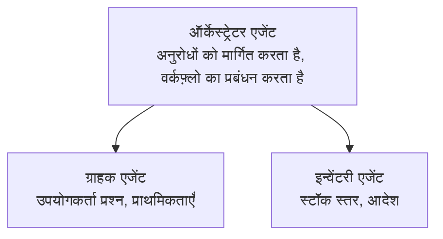

# अध्याय 5: मल्टी-एजेंट एआई समाधान

**📚 कोर्स**: [AZD शुरुआती के लिए](../../README.md) | **⏱️ अवधि**: 2-3 घंटे | **⭐ जटिलता**: उन्नत

---

## अवलोकन

यह अध्याय उन्नत मल्टी-एजेंट आर्किटेक्चर पैटर्न, एजेंट ऑर्केस्ट्रेशन, और जटिल परिदृश्यों के लिए प्रोडक्शन-तैयार AI डिप्लॉयमेंट्स को कवर करता है।

## सीखने के उद्देश्य

इस अध्याय को पूरा करने पर, आप:
- मल्टी-एजेंट आर्किटेक्चर पैटर्न को समझेंगे
- समन्वित AI एजेंट सिस्टम्स को तैनात करेंगे
- एजेंट-से-एजेंट संचार लागू करेंगे
- प्रोडक्शन-तैयार मल्टी-एजेंट समाधान तैयार करेंगे

---

## 📚 पाठ

| # | पाठ | विवरण | अवधि |
|---|--------|-------------|------|
| 1 | [रिटेल मल्टी-एजेंट समाधान](../../examples/retail-scenario.md) | पूर्ण कार्यान्वयन वॉकथ्रू | 90 मिनट |
| 2 | [समन्वयन पैटर्न](../chapter-06-pre-deployment/coordination-patterns.md) | एजेंट ऑर्केस्ट्रेशन रणनीतियाँ | 30 मिनट |
| 3 | [ARM टेम्पलेट तैनाती](../../examples/retail-multiagent-arm-template/README.md) | एक-क्लिक तैनाती | 30 मिनट |

---

## 🚀 त्वरित शुरुआत

```bash
# विकल्प 1: टेम्पलेट से तैनात करें
azd init --template agent-openai-python-prompty
azd up

# विकल्प 2: एजेंट मैनिफेस्ट से तैनात करें (azure.ai.agents एक्सटेंशन की आवश्यकता है)
azd extension install azure.ai.agents
azd ai agent init -m agent-manifest.yaml
azd up
```

> **कौन सा दृष्टिकोण?** एक कार्यशील नमूने से शुरू करने के लिए `azd init --template` का उपयोग करें. जब आपके पास अपना एजेंट मैनिफेस्ट हो तो `azd ai agent init` का उपयोग करें. पूर्ण विवरण के लिए [AZD AI CLI संदर्भ](../chapter-08-production/production-ai-practices.md#azd-ai-cli-commands-and-extensions) देखें.

---

## 🤖 मल्टी-एजेंट आर्किटेक्चर


---

## 🎯 विशेष समाधान: रिटेल मल्टी-एजेंट

यह [रिटेल मल्टी-एजेंट समाधान](../../examples/retail-scenario.md) दिखाता है:

- **ग्राहक एजेंट**: उपयोगकर्ता इंटरैक्शन और प्राथमिकताओं को संभालता है
- **इन्वेंटरी एजेंट**: स्टॉक और ऑर्डर प्रोसेसिंग का प्रबंधन करता है
- **ऑर्केस्ट्रेटर**: एजेंटों के बीच समन्वय करता है
- **साझा मेमोरी**: एजेंटों के बीच संदर्भ का प्रबंधन

### प्रयुक्त सेवाएँ

| सेवा | उद्देश्य |
|---------|---------|
| Microsoft Foundry Models | भाषा समझ |
| Azure AI Search | उत्पाद कैटलॉग |
| Cosmos DB | एजेंट स्थिति और मेमोरी |
| Container Apps | एजेंट होस्टिंग |
| Application Insights | निगरानी |

---

## 🔗 नेविगेशन

| दिशा | अध्याय |
|-----------|---------|
| **पिछला** | [अध्याय 4: बुनियादी ढांचा](../chapter-04-infrastructure/README.md) |
| **अगला** | [अध्याय 6: पूर्व-तैनाती](../chapter-06-pre-deployment/README.md) |

---

## 📖 संबंधित संसाधन

- [AI एजेंट मार्गदर्शिका](../chapter-02-ai-development/agents.md)
- [उत्पादन AI प्रथाएँ](../chapter-08-production/production-ai-practices.md)
- [AI समस्या निवारण](../chapter-07-troubleshooting/ai-troubleshooting.md)

---

<!-- CO-OP TRANSLATOR DISCLAIMER START -->
**Disclaimer**:
यह दस्तावेज़ AI अनुवाद सेवा [Co-op Translator](https://github.com/Azure/co-op-translator) का उपयोग करके अनुवादित किया गया है। हालांकि हम सटीकता के लिए प्रयत्नशील हैं, कृपया ध्यान दें कि स्वचालित अनुवादों में त्रुटियाँ या अशुद्धियाँ हो सकती हैं। मूल दस्तावेज़ को उसकी मूल भाषा में अधिकृत स्रोत माना जाना चाहिए। महत्वपूर्ण जानकारी के लिए, पेशेवर मानव अनुवाद की सिफारिश की जाती है। हम इस अनुवाद के उपयोग से उत्पन्न किसी भी गलतफहमी या गलत व्याख्या के लिए उत्तरदायी नहीं हैं।
<!-- CO-OP TRANSLATOR DISCLAIMER END -->