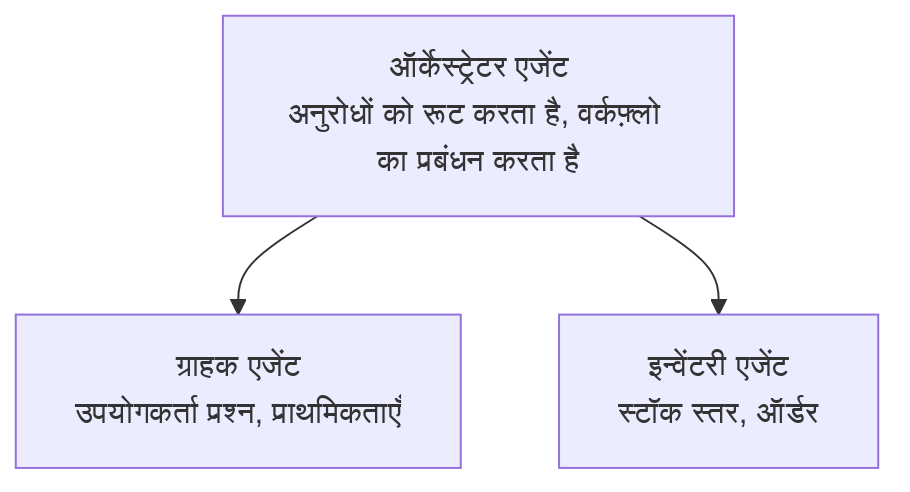

# अध्याय 5: मल्टी-एजेंट AI समाधान

**📚 पाठ्यक्रम**: [AZD शुरुआती के लिए](../../README.md) | **⏱️ अवधि**: 2-3 घंटे | **⭐ जटिलता**: उन्नत

---

## अवलोकन

यह अध्याय उन्नत मल्टी-एजेंट आर्किटेक्चर पैटर्न, एजेंट ऑर्केस्ट्रेशन, और जटिल परिदृश्यों के लिए प्रोडक्शन-रेडी AI परिनियोजन को कवर करता है।

> जून 2026 में `azd 1.25.6` के साथ सत्यापित।

## सीखने के उद्देश्य

इस अध्याय को पूरा करके, आप:
- मल्टी-एजेंट आर्किटेक्चर पैटर्न को समझेंगे
- समन्वित AI एजेंट सिस्टम तैनात करेंगे
- एजेंट-से-एजेंट संचार लागू करेंगे
- प्रोडक्शन-रेडी मल्टी-एजेंट समाधान बनाएंगे

---

## 📚 पाठ

| # | पाठ | विवरण | समय |
|---|--------|-------------|------|
| 1 | [मल्टी-एजेंट मूल बातें](multi-agent-basics.md) | हैंड्स-ऑन: `azd up` के साथ एक कार्यशील मल्टी-एजेंट ऐप तैनात करें | 45 मिनट |
| 2 | [समन्वय पैटर्न](../chapter-06-pre-deployment/coordination-patterns.md) | एजेंट ऑर्केस्ट्रेशन रणनीतियाँ (अध्याय 6 में जारी) | 30 मिनट |
| 3 | [ARM टेम्पलेट तैनाती](../../examples/retail-multiagent-arm-template/README.md) | एक-क्लिक तैनाती उदाहरण | 30 मिनट |

> **पहला पाठ से शुरू करें।** यह इस अध्याय में अकेला पूरा हैंड्स-ऑन, तैनात करने योग्य पाठ है। पाठ 2 अध्याय 6 में है (यह प्री-डिप्लॉयमेंट योजना के साथ साझा है), और [रिटेल मल्टी-एजेंट समाधान](../../examples/retail-scenario.md) एक आर्किटेक्चर ब्लूप्रिंट है—एक डिजाइन संदर्भ, एक-कमान्ड टेम्पलेट नहीं।

---

## 🚀 त्वरित प्रारंभ

```bash
# विकल्प 1: टेम्पलेट से तैनात करें
azd init --template agent-openai-python-prompty
azd up

# विकल्प 2: एजेंट मैनिफेस्ट से तैनात करें (azure.ai.agents एक्सटेंशन की आवश्यकता है)
azd extension install azure.ai.agents
azd ai agent init -m agent-manifest.yaml
azd up
```

> **कौन सा तरीका?** `azd init --template` का उपयोग कार्यशील सैंपल से शुरू करने के लिए करें। जब आपके पास अपना एजेंट मैनिफेस्ट हो तो `azd ai agent init` का उपयोग करें। पूर्ण विवरण के लिए [AZD AI CLI संदर्भ](../chapter-08-production/production-ai-practices.md#azd-ai-cli-commands-and-extensions) देखें।

---

## 🤖 मल्टी-एजेंट वास्तुकला



---

## 🎯 प्रमुख समाधान: रिटेल मल्टी-एजेंट

The [रिटेल मल्टी-एजेंट समाधान](../../examples/retail-scenario.md) दिखाता है:

- **ग्राहक एजेंट**: उपयोगकर्ता बातचीत और प्राथमिकताओं को संभालता है
- **इन्वेंटरी एजेंट**: स्टॉक और ऑर्डर प्रोसेसिंग का प्रबंधन करता है
- **ऑर्केस्ट्रेटर**: एजेंटों के बीच समन्वय करता है
- **साझा मेमोरी**: क्रॉस-एजेंट संदर्भ प्रबंधन

### उपयोग की गई सेवाएँ

| सेवा | उद्देश्य |
|---------|---------|
| Microsoft Foundry Models | भाषा समझ |
| Azure AI Search | उत्पाद सूची |
| Cosmos DB | एजेंट स्थिति और मेमोरी |
| Container Apps | एजेंट होस्टिंग |
| Application Insights | निगरानी |

---

## 🔗 नेविगेशन

| दिशा | अध्याय |
|-----------|---------|
| **पिछला** | [अध्याय 4: अवसंरचना](../chapter-04-infrastructure/README.md) |
| **अगला** | [अध्याय 6: पूर्व-तैनाती](../chapter-06-pre-deployment/README.md) |

---

## 📖 संबंधित संसाधन

- [AI एजेंट्स मार्गदर्शिका](../chapter-02-ai-development/agents.md)
- [उत्पादन AI प्रथाएँ](../chapter-08-production/production-ai-practices.md)
- [AI समस्या निवारण](../chapter-07-troubleshooting/ai-troubleshooting.md)

---

<!-- CO-OP TRANSLATOR DISCLAIMER START -->
**अस्वीकरण**:
इस दस्तावेज़ का अनुवाद AI अनुवाद सेवा [Co-op Translator](https://github.com/Azure/co-op-translator) का उपयोग करके किया गया है। जबकि हम सटीकता के लिए प्रयास करते हैं, कृपया ध्यान दें कि स्वचालित अनुवादों में त्रुटियाँ या अशुद्धियाँ हो सकती हैं। मूल दस्तावेज़ अपनी मूल भाषा में ही प्रामाणिक स्रोत माना जाना चाहिए। महत्वपूर्ण जानकारी के लिए, पेशेवर मानव अनुवाद की सिफारिश की जाती है। इस अनुवाद के उपयोग से उत्पन्न किसी भी गलतफहमी या गलत व्याख्या के लिए हम उत्तरदायी नहीं हैं।
<!-- CO-OP TRANSLATOR DISCLAIMER END -->