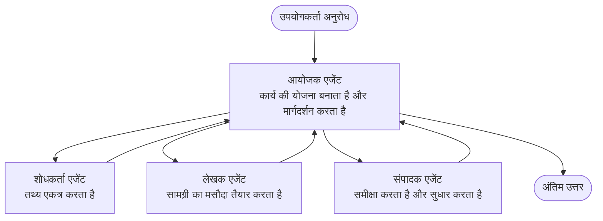

# मल्टी-एजेंट बेसिक्स - अपनी पहली समन्वित एआई प्रणाली तैनात करें

**अध्याय नेविगेशन:**
- **📚 कोर्स होम**: [AZD For Beginners](../../README.md)
- **📖 वर्तमान अध्याय**: अध्याय 5 - मल्टी-एजेंट AI समाधान
- **⬅️ पिछला**: [अध्याय 4: इन्फ्रास्ट्रक्चर](../chapter-04-infrastructure/README.md)
- **➡️ अगला**: [समन्वय पैटर्न](../chapter-06-pre-deployment/coordination-patterns.md)

> जुलाई 2026 में `azd 1.27.1` के खिलाफ मान्य किया गया।

## परिचय

पिछले अध्यायों में आपने एकल एप्लिकेशन तैनात किया—और अध्याय 2 में आपने एकल AI एजेंट तैनात किया। यह पाठ अगले कदम को लेता है: एक **मल्टी-एजेंट प्रणाली** तैनात करना, जहाँ कई विशेषज्ञ एजेंट एक साथ काम करते हैं ताकि एकल एजेंट अच्छे से संभाल न सके ऐसा समस्या हल किया जा सके।

शुरुआती लोगों के लिए अच्छी खबर: **आपको नए कमांड की ज़रूरत नहीं है।** एक मल्टी-एजेंट समाधान अभी भी एक azd प्रोजेक्ट है। आप `azd init`, `azd up`, परीक्षण, और `azd down` करेंगे—बिल्कुल वही कार्यप्रवाह जो आप पहले से जानते हैं। जो बदलता है वह ऐप के अंदर का *आकार* है।

## सीखने के लक्ष्य

इस पाठ के अंत तक, आप:
- समझेंगे कि "मल्टी-एजेंट" का क्या अर्थ है और यह अतिरिक्त जटिलता कब लाभकारी होती है
- एक मल्टी-एजेंट प्रणाली में सामान्य भूमिकाओं (संयोजक + विशेषज्ञ) को पहचानेंगे
- `azd up` के साथ एक वास्तविक, कार्यशील मल्टी-एजेंट टेम्पलेट तैनात करेंगे
- उन Azure संसाधनों को समझेंगे जो एक मल्टी-एजेंट ऐप का समर्थन करते हैं
- समाधान की सुरक्षित जांच, अनुकूलन, और समापन करना जानेंगे

## सीखने के परिणाम

इस पाठ को पूरा करने के बाद, आप सक्षम होंगे:
- एकल एजेंट और मल्टी-एजेंट प्रणाली के बीच अंतर समझाना
- एकल एजेंट विद टूल्स और वास्तविक मल्टी-एजेंट डिज़ाइन के बीच चयन करना
- azd के साथ मल्टी-एजेंट टेम्पलेट को एंड-टू-एंड तैनात और परीक्षण करना
- यह पहचानना कि प्रत्येक एजेंट कहाँ चलता है और वे कैसे संवाद करते हैं
- निरंतर शुल्क से बचने के लिए सभी संसाधनों को साफ़ करना

---

## मल्टी-एजेंट सिस्टम क्या है?

एकल AI एजेंट एक मॉडल होता है जिसके पास निर्देशों का सेट और (यदि आवश्यक हो) कुछ टूल होते हैं। यह केंद्रित कार्यों के लिए अच्छा काम करता है। लेकिन जैसे-जैसे कार्य बढ़ता है—अनुसंधान, फिर लेखन, फिर संपादन, फिर तथ्य-जांच—सब कुछ एक ही संकेत में भरना एजेंट को धीमा, कम विश्वसनीय, और डिबग के लिए कठिन बना देता है।

एक **मल्टी-एजेंट सिस्टम** कार्य को विशेषज्ञों में विभाजित करता है जो प्रत्येक एक काम ठीक से करते हैं, और एक संयोजक द्वारा समन्वित होते हैं:



### दो भूमिकाएँ जो आप हमेशा देखेंगे

| भूमिका | कार्य | उदाहरण |
|------|-----|---------|
| **संयोजक (Orchestrator)** | *अगला क्या होगा* तय करता है और एजेंटों के बीच कार्य वितरित करता है | "पहले अनुसंधान, फिर लेखन, फिर संपादन" |
| **विशेषज्ञ (Specialist)** | एक विशिष्ट नौकरी करता है और परिणाम लौटाता है | एक "अनुसंधानकर्ता" जो केवल तथ्य इकट्ठा करता है |

### क्या आपको वास्तव में कई एजेंटों की आवश्यकता है?

सरल से शुरू करें। मल्टी-एजेंट **तब ही** चुनें जब इनमें से कोई सच हो:

- ✅ कार्य में **अलग-अलग चरण** हों जो विभिन्न निर्देशों से लाभान्वित होते हैं (अनुसंधान बनाम लेखन बनाम समीक्षा)
- ✅ आप समय बचाने के लिए विशेषज्ञों को **समानांतर** चलाना चाहते हैं
- ✅ विभिन्न चरणों को **विभिन्न टूल्स या डेटा स्रोतों** की जरूरत हो
- ✅ आपको हर चरण को **स्वतंत्र रूप से परीक्षण योग्य और डिबग योग्य** होना चाहिए

यदि आपका कार्य एक सरल प्रश्नोत्तर या साधारण टूल कॉल है, तो एक **टूल्स के साथ एकल एजेंट** (अध्याय 2) सरल, सस्ता, और संचालन में आसान होता है।

> **शुरुआत के लिए सुझाव:** "अधिक एजेंट" का मतलब "अच्छा" नहीं है। हर एजेंट लेटेंसी, लागत, और निगरानी के लिए नई चीज़ जोड़ता है। केवल तभी एजेंट जोड़ें जब समस्या स्पष्ट रूप से हिस्सों में बंटी हो।

---

## Azure पर मल्टी-एजेंट बनाने के दो तरीके

| तरीका | क्या है | सर्वश्रेष्ठ के लिए |
|----------|-----------|----------|
| **एकल एजेंट + टूल्स** | एक Foundry एजेंट जो फ़ंक्शन/टूल्स कॉल करता है | सरल कार्यप्रवाह, शुरुआत के लिए |
| **कई समन्वित एजेंट** | कई एजेंट एक संयोजक के साथ | अलग चरण, समानांतर कार्य, विशेषज्ञता |

यह पाठ दूसरे तरीके पर ध्यान केंद्रित करता है जिसमें एक **तैयार टेम्पलेट** का उपयोग होता है, ताकि आप खुद बनाने से पहले एक वास्तविक मल्टी-एजेंट प्रणाली चलती देख सकें।

---

## हाथों-हाथ: एक कार्यशील मल्टी-एजेंट ऐप तैनात करें

हम **Contoso Creative Writer** तैनात करेंगे, एक आधिकारिक Azure नमूना जो कई एजेंट (अनुसंधानकर्ता, लेखक, संपादक) का उपयोग करता है जो एक लेख बनाने के लिए समन्वित होते हैं। यह पहला मल्टी-एजेंट ऐप है क्योंकि इसकी भूमिकाएँ समझने में आसान हैं।

### चरण 1: टेम्पलेट इनिशियलाइज़ करें

```bash
# एक कार्यशील फ़ोल्डर बनाएँ
mkdir creative-writer && cd creative-writer

# आधिकारिक मल्टी-एजेंट टेम्पलेट से प्रारंभ करें
azd init --template contoso-creative-writer
```

> आप कभी भी [Awesome AZD AI गैलरी](https://azure.github.io/awesome-azd/?tags=ai) में और मल्टी-एजेंट टेम्पलेट ब्राउज़ कर सकते हैं। अन्य शुरुआती के अनुकूल विकल्पों में `get-started-with-ai-agents` और `azure-ai-travel-agents` शामिल हैं।

### चरण 2: प्रमाणीकृत करें

```bash
# azd वर्कफ़्लोज़ के लिए आवश्यक
azd auth login
```

### चरण 3: एक पर्यावरण बनाएं

```bash
azd env new dev
```

### चरण 4: पूर्वावलोकन करें, फिर तैनात करें

```bash
# कुछ भी खर्च करने से पहले देखें कि क्या बनाया जाएगा (अनुशंसित)
azd provision --preview

# एक ही चरण में इंफ्रास्ट्रक्चर प्रदान करें और सभी एजेंट तैनात करें
azd up
```

`azd up` एक सदस्यता और क्षेत्र के लिए आग्रह करता है, फिर Azure संसाधन प्रदान करता है और एप्लिकेशन तैनात करता है। AI तैनातियाँ एक साधारण वेब ऐप की तुलना में अधिक समय ले सकती हैं—यदि आप बड़े मॉडल तैनात कर रहे हैं, तो आप तैनाती का समय बढ़ा सकते हैं:

```bash
azd deploy --timeout 1800
```

> **लागत और क्षमता पर ध्यान दें:** मल्टी-एजेंट ऐप AI मॉडल तैनात करते हैं जो कोटा का उपभोग करते हैं और लागत लगाते हैं। यदि `azd up` मॉडल कोटा पर विफल होता है, तो [AI समस्या निवारण](../chapter-07-troubleshooting/ai-troubleshooting.md) देखें क्षेत्र और कोटा सुधार के लिए, और अध्याय 6 [क्षमता योजना](../chapter-06-pre-deployment/capacity-planning.md)।

---

## आपने जो तैनात किया उसे समझना

इस तरह का एक सामान्य मल्टी-एजेंट ऐप Azure संसाधनों का एक सेट तैनात करता है जो ऊपर के आरेख में जिम्मेदारियों के सीधे मानचित्र होते हैं:

| संसाधन | क्यों है |
|----------|----------------|
| **Microsoft Foundry / मॉडल** | प्रत्येक एजेंट द्वारा उपयोग किए जाने वाले भाषा मॉडल्स की मेजबानी करता है |
| **Azure AI Search** | शोधकर्ता एजेंट को खोजने के लिए आधारभूत डेटा देता है |
| **कंटेनर ऐप्स** (या ऐप सेवा) | संयोजक और एजेंट कोड की मेजबानी करता है |
| **Cosmos DB** (कुछ नमूनों में) | एजेंटों के बीच साझा की गई स्थिति/मेमोरी संग्रहीत करता है |
| **एप्लिकेशन इनसाइट्स** | एजेंटों के *पार* अनुरोधों का पता लगाता है ताकि आप प्रवाह को डिबग कर सकें |

### एजेंट एक-दूसरे से कैसे बात करते हैं

अधिकांश azd मल्टी-एजेंट नमूनों में, **संयोजक आपके एप्लिकेशन कोड में चलता है** (उदाहरण के लिए, Semantic Kernel या Microsoft Agent Framework जैसे फ्रेमवर्क का उपयोग करते हुए)। संयोजक प्रत्येक विशेषज्ञ एजेंट को क्रम में कॉल करता है, परिणाम भेजता है, और अंतिम उत्तर एकत्र करता है। एजेंट संदर्भ साझा करते हैं:

- **फ़ंक्शन/टूल कॉल्स** — संयोजक एक विशेषज्ञ को कॉल करता है और परिणाम प्राप्त करता है
- **साझा मेमोरी** — एक डेटाबेस (अक्सर Cosmos DB) ऐसी स्थिति रखता है जिसे दोनों एजेंट पढ़ सकते हैं
- **संदेश/इवेंट्स** — ढीले जुड़ाव के लिए, एजेंट कतार या सेवा बस के जरिए संवाद करते हैं

> **डिबग के लिए यह क्यों महत्वपूर्ण है:** क्योंकि हर चरण अलग है, एप्लिकेशन इनसाइट्स आपको दिखाता है कि *कौन सा* एजेंट धीमा था या असफल रहा। यही मल्टी-एजेंट काम को एजेंटों में विभाजित करने का एक मुख्य कारण है।

---

## तैनाती सत्यापित करें

आगे बढ़ने से पहले सिस्टम की वास्तविक कामकाज की पुष्टि करें:

```bash
# तैनात किए गए एंडपॉइंट दिखाएं
azd show

# ऐप के निगरानी डैशबोर्ड को खोलें
azd monitor

# यदि कुछ गलत लग रहा हो तो लॉग देखें
azd monitor --logs
```

फिर `azd show` से ऐप का URL खोलें और एक ऐसा अनुरोध करें जो सभी एजेंटों को व्यस्त करे (Creative Writer के लिए, इसे किसी विषय पर एक छोटा लेख लिखने के लिए कहें)। एप्लिकेशन इनसाइट्स के **ट्रांजैक्शन सर्च** में, आपको अनुरोध शोधकर्ता, लेखक, और संपादक चरणों में फैला हुआ दिखेगा।

**सफलता के मापदंड:**
- ✅ `azd show` एक पहुँच योग्य एंडपॉइंट सूचीबद्ध करता है
- ✅ एक अनुरोध ऐसा परिणाम उत्पन्न करता है जो स्पष्ट रूप से कई चरणों से गुजरा है
- ✅ एप्लिकेशन इनसाइट्स कई एजेंट चरणों के ट्रेस दिखाता है

---

## अनुकूलित करें: एक एजेंट जोड़ें या समायोजित करें

क्योंकि प्रत्येक एजेंट केवल निर्देशों और उपकरणों का संयोजन होता है, अनुकूलन आसान है:

1. **टेम्पलेट में एजेंट परिभाषाएं खोजें** (अक्सर `prompts/`, `agents/`, या `*.prompty` फ़ाइल सेट में)।
2. **एजेंट के निर्देशों को समायोजित करें** — उदाहरण के लिए, संपादक एजेंट को एक विशेष टोन या शब्द संख्या लागू करने के लिए कहें।
3. **केवल कोड को फिर से तैनात करें** (इन्फ्रास्ट्रक्चर अपरिवर्तित रहता है):

   ```bash
   azd deploy
   ```

आगे बढ़ने के लिए और अपने *अपने* मैनिफेस्ट से एजेंट बनाने के लिए, एजेंट एक्सटेंशन और इसका पूरा जीवनचक्र उपयोग करें:

```bash
azd extension install azure.ai.agents
azd ai agent init -m agent-manifest.yaml
azd up
azd ai agent invoke      # परीक्षण, प्रतिक्रिया समय के साथ
```

पूरा एजेंट जीवनचक्र (`invoke`, `eval generate`, `optimize`, `delete`) के लिए देखें [अध्याय 2: एजेंट्स](../chapter-02-ai-development/agents.md) और [AZD AI CLI संदर्भ](../chapter-08-production/production-ai-practices.md#azd-ai-cli-commands-and-extensions)।

---

## सिस्टम साफ़ करें

मल्टी-एजेंट ऐप कई बिल योग्य सेवाएं चलाते हैं। काम खत्म होने पर सब कुछ हटाएं:

```bash
azd down --force --purge
```

`--purge` फ्लैग सॉफ्ट-डिलीटेड AI संसाधनों (जैसे Foundry/Azure AI सर्विसेज खाते) को भी हटा देता है ताकि वे भविष्य में पुनः तैनाती रोकने या लागत लगाते न रहें।

---

## प्रोडक्शन मल्टी-एजेंट सिस्टम के बारे में एक नोट

इस रिपोज़िटरी में [रिटेल मल्टी-एजेंट समाधान](../../examples/retail-scenario.md) एक **आर्किटेक्चर ब्लूप्रिंट** है, एक एक-कमान्ड टेम्पलेट नहीं—यह बताता है कि एक प्रोडक्शन रिटेल सिस्टम *कैसे* बनाया जाएगा (और स्पष्ट करता है कि पूरा निर्माण एक बड़ा प्रयास है)। इसे एक डिजाइन संदर्भ के रूप में उपयोग करें *जब* आपने यहाँ एक कार्यशील नमूना तैनात कर लिया हो। प्रोडक्शन संबंधी चिंताओं (लचीलापन, लागत, निगरानी, शासन) के लिए, जारी रखें [अध्याय 8: प्रोडक्शन AI अभ्यास](../chapter-08-production/production-ai-practices.md)।

---

## सारांश

- एक मल्टी-एजेंट सिस्टम कार्य को विशेषज्ञों में विभाजित करता है, जिन्हें एक संयोजक समन्वित करता है।
- इसका उपयोग केवल तभी करें जब कार्य में स्पष्ट चरण हों, समानांतरता हो, या प्रत्येक चरण के लिए अलग टूल्स हों—अन्यथा एकल एजेंट पसंद करें।
- azd कार्यप्रवाह अपरिवर्तित रहता है: `azd init` → `azd up` → परीक्षण → `azd down`।
- `contoso-creative-writer` जैसे एक वास्तविक टेम्पलेट से आप आज एक कार्यशील मल्टी-एजेंट ऐप देख और अनुकूलित कर सकते हैं।
- एजेंटों के पार एप्लिकेशन इनसाइट्स ट्रेसिंग मल्टी-एजेंट डिज़ाइन के सबसे बड़े व्यावहारिक लाभों में से एक है।

---

## 🔗 नेविगेशन

| दिशा | पाठ |
|-----------|--------|
| **पिछला** | [अध्याय 4: इन्फ्रास्ट्रक्चर](../chapter-04-infrastructure/README.md) |
| **अगला** | [समन्वय पैटर्न](../chapter-06-pre-deployment/coordination-patterns.md) |

## 📖 संबंधित संसाधन

- [AI एजेंट्स गाइड](../chapter-02-ai-development/agents.md)
- [समन्वय पैटर्न](../chapter-06-pre-deployment/coordination-patterns.md)
- [प्रोडक्शन AI अभ्यास](../chapter-08-production/production-ai-practices.md)
- [AI समस्या निवारण](../chapter-07-troubleshooting/ai-troubleshooting.md)

---

<!-- CO-OP TRANSLATOR DISCLAIMER START -->
**अस्वीकरण**:
इस दस्तावेज़ का अनुवाद AI अनुवाद सेवा [Co-op Translator](https://github.com/Azure/co-op-translator) का उपयोग करके किया गया है। जबकि हम सटीकता के लिए प्रयास करते हैं, कृपया ध्यान दें कि स्वचालित अनुवादों में त्रुटियाँ या अशुद्धियाँ हो सकती हैं। मूल दस्तावेज़ अपनी मूल भाषा में ही प्रामाणिक स्रोत माना जाना चाहिए। महत्वपूर्ण जानकारी के लिए, पेशेवर मानव अनुवाद की सिफारिश की जाती है। इस अनुवाद के उपयोग से उत्पन्न किसी भी गलतफहमी या गलत व्याख्या के लिए हम उत्तरदायी नहीं हैं।
<!-- CO-OP TRANSLATOR DISCLAIMER END -->