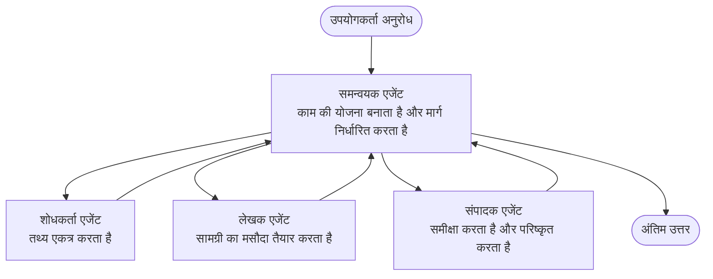

# मल्टी-एजेंट बेसिक्स - अपना पहला समन्वित AI सिस्टम डिप्लॉय करें

**अध्याय नेविगेशन:**
- **📚 कोर्स होम**: [AZD For Beginners](../../README.md)
- **📖 वर्तमान अध्याय**: अध्याय 5 - मल्टी-एजेंट AI सॉल्यूशंस
- **⬅️ पिछला**: [Chapter 4: Infrastructure](../chapter-04-infrastructure/README.md)
- **➡️ अगला**: [Coordination Patterns](../chapter-06-pre-deployment/coordination-patterns.md)

> `azd 1.25.6` के खिलाफ जून 2026 में सत्यापित।

## परिचय

पहले अध्यायों में आपने एक एकल एप्लिकेशन को डिप्लॉय किया—और अध्याय 2 में आपने एक एकल AI एजेंट को डिप्लॉय किया। यह पाठ अगला कदम उठाता है: एक **मल्टी-एजेंट सिस्टम** डिप्लॉय करना, जहां कई विशेषज्ञ एजेंट मिलकर उस समस्या को हल करते हैं जिसे कोई एक एजेंट अकेले अच्छे से संभाल नहीं सकता।

शुरुआत करने वालों के लिए अच्छी खबर: **आपको नए कमांड की ज़रूरत नहीं है।** एक मल्टी-एजेंट सॉल्यूशन अभी भी एक azd प्रोजेक्ट है। आप `azd init`, `azd up`, टेस्ट, और `azd down` करेंगे—बिलकुल वही वर्कफ़्लो जिसे आप पहले से जानते हैं। जो बदलता है वह ऐप के अंदर की बनावट है।

## सीखने के लक्ष्य

इस पाठ के अंत तक, आप:
- समझेंगे कि "मल्टी-एजेंट" क्या होता है और कब अतिरिक्त जटिलता इसके लायक होती है
- एक मल्टी-एजेंट सिस्टम में सामान्य भूमिकाओं (orchestrator + specialists) को पहचान पाएंगे
- `azd up` के साथ एक वास्तविक, काम करने वाला मल्टी-एजेंट टेम्पलेट डिप्लॉय कर पाएंगे
- उन Azure संसाधनों को समझेंगे जो एक मल्टी-एजेंट ऐप का बैकअप करते हैं
- समाधान को सुरक्षित रूप से सत्यापित, अनुकूलित, और teardown करना जानेंगे

## सीखने के परिणाम

इस पाठ को पूरा करने के बाद, आप सक्षम होंगे:
- एक एकल एजेंट और एक मल्टी-एजेंट सिस्टम के बीच का अंतर समझाना
- एकल एजेंट विथ टूल्स और वास्तविक मल्टी-एजेंट डिज़ाइन के बीच चयन करना
- azd के साथ एक मल्टी-एजेंट टेम्पलेट को end to end डिप्लॉय और टेस्ट करना
- पहचानना कि प्रत्येक एजेंट कहां चलता है और वे कैसे संवाद करते हैं
- चल रहे शुल्क से बचने के लिए सभी संसाधनों को साफ़ करना

---

## मल्टी-एजेंट सिस्टम क्या है?

एक एकल AI एजेंट एक मॉडल होता है जिसमें निर्देशों का एक सेट और (वैकल्पिक रूप से) कुछ टूल होते हैं। यह केंद्रित कार्यों के लिए अच्छा काम करता है। लेकिन जैसे-जैसे एक कार्य बढ़ता है—अनुसंधान, फिर लेखन, फिर संपादन, फिर तथ्य-जांच—सब कुछ एक ही प्रॉम्प्ट में भरने से एजेंट धीमा, कम विश्वसनीय, और डिबग करने में कठिन हो सकता है।

एक **मल्टी-एजेंट सिस्टम** काम को विशेषज्ञों में तोड़ देता है जो प्रत्येक एक काम को अच्छी तरह से करते हैं, जिसे एक orchestrator समन्वयित करता है:



### वे दो भूमिकाएँ जो आप हमेशा देखेंगे

| Role | Job | Example |
|------|-----|---------|
| **Orchestrator** | Decides *what happens next* and routes work between agents | "First research, then write, then edit" |
| **Specialist** | Does one focused job and returns a result | A "researcher" that only gathers facts |

### क्या आपको वास्तव में कई एजेंटों की ज़रूरत है?

सरल से शुरू करें। केवल तब मल्टी-एजेंट की ओर जाएँ जब इनमें से कोई एक बात सत्य हो:

- ✅ कार्य में **स्पष्ट चरण** हों जो अलग निर्देशों से लाभान्वित हों (research vs. write vs. review)
- ✅ आप समय बचाने के लिए विशेषज्ञों को **पैरेलल में** चलाना चाहते हैं
- ✅ विभिन्न चरणों को **विभिन्न टूल्स या डेटा स्रोतों** की आवश्यकता हो
- ✅ आप चाहते हैं कि प्रत्येक चरण **स्वतंत्र रूप से टेस्टेबल और डिबग करने योग्य** हो

अगर आपका कार्य एक साधारण प्रश्न-उत्तर या एक साधारण टूल कॉल है, तो **टूल्स के साथ एकल एजेंट** (अध्याय 2) सरल, सस्ता, और संचालित करने में आसान है।

> **शुरुआती टिप:** "ज़्यादा एजेंट" का मतलब "बेहतर" नहीं होता। हर एजेंट विलंब, लागत, और मॉनिटर करने के लिए एक नई चीज जोड़ता है। केवल तब एजेंट जोड़ें जब समस्या स्पष्ट रूप से हिस्सों में बंटती हो।

---

## Azure पर मल्टी-एजेंट बनाने के दो तरीके

| Approach | What it is | Best for |
|----------|-----------|----------|
| **Single agent + tools** | One Foundry agent that calls functions/tools | Simple workflows, getting started |
| **Multiple coordinated agents** | Several agents with an orchestrator | Distinct stages, parallel work, specialization |

यह पाठ दूसरे दृष्टिकोण पर केंद्रित है, एक **तैयार-निर्मित टेम्पलेट** का उपयोग करते हुए, ताकि आप अपना स्वयं का निर्माण करने से पहले एक वास्तविक मल्टी-एजेंट सिस्टम चलाते हुए देख सकें।

---

## हैंड्स-ऑन: एक काम करने वाला मल्टी-एजेंट ऐप डिप्लॉय करें

हम **Contoso Creative Writer** डिप्लॉय करेंगे, एक आधिकारिक Azure सैंपल जो कई एजेंटों (researcher, writer, editor) का उपयोग करता है जिन्हें एक साथ समन्वित किया जाता है ताकि एक लेख तैयार किया जा सके। यह एक बेहतरीन पहला मल्टी-एजेंट ऐप है क्योंकि भूमिकाएँ समझने में आसान हैं।

### स्टेप 1: टेम्पलेट इनिशियलाइज़ करें

```bash
# एक कार्य फ़ोल्डर बनाएं
mkdir creative-writer && cd creative-writer

# आधिकारिक मल्टी-एजेंट टेम्पलेट से प्रारंभ करें
azd init --template contoso-creative-writer
```

> किसी भी समय और अधिक मल्टी-एजेंट टेम्पलेट्स ब्राउज़ करने के लिए [Awesome AZD AI gallery](https://azure.github.io/awesome-azd/?tags=ai) देखें। अन्य शुरुआती-अनुकूल विकल्पों में `get-started-with-ai-agents` और `azure-ai-travel-agents` शामिल हैं।

### स्टेप 2: ऑथेंटिकेट करें

```bash
# azd वर्कफ़्लोज़ के लिए आवश्यक
azd auth login
```

### स्टेप 3: एक एनवायरनमेंट बनाएं

```bash
azd env new dev
```

### स्टेप 4: प्रीव्यू करें, फिर डिप्लॉय करें

```bash
# कुछ भी खर्च करने से पहले देखें कि क्या बनाया जाएगा (अनुशंसित)
azd provision --preview

# बुनियादी ढांचे की व्यवस्था करें और सभी एजेंट एक ही चरण में तैनात करें
azd up
```

`azd up` एक सब्सक्रिप्शन और रीजन के लिए संकेत देगा, फिर Azure संसाधनों को प्रोविजन करेगा और एप्लिकेशन को डिप्लॉय करेगा। AI डिप्लॉयमेंट्स एक साधारण वेब ऐप की तुलना में अधिक समय ले सकते हैं—यदि आप बड़े मॉडलों को डिप्लॉय कर रहे हैं, तो आप डिप्लॉय टाइमआउट बढ़ा सकते हैं:

```bash
azd deploy --timeout 1800
```

> **लागत और क्षमता पर सिरदर्द:** मल्टी-एजेंट ऐप ऐसे AI मॉडल डिप्लॉय करते हैं जो कोटा का उपभोग करते हैं और लागत लगाते हैं। यदि `azd up` मॉडल कोटा पर फेल हो जाता है, तो क्षेत्र और कोटा फ़िक्स के लिए [AI Troubleshooting](../chapter-07-troubleshooting/ai-troubleshooting.md) देखें, और अध्याय 6 [Capacity Planning](../chapter-06-pre-deployment/capacity-planning.md)।

---

## आपने जो डिप्लॉय किया उसे समझना

एक सामान्य मल्टी-एजेंट ऐप इस तरह के Azure संसाधनों को प्रोविजन करता है जो ऊपर दी गई ज़िम्मेदारियों वाले डायग्राम से सीधे मेल खाते हैं:

| Resource | Why it's there |
|----------|----------------|
| **Microsoft Foundry / Models** | Hosts the language models each agent uses |
| **Azure AI Search** | Gives the researcher agent grounded data to search |
| **Container Apps** (or App Service) | Hosts the orchestrator and agent code |
| **Cosmos DB** (in some samples) | Stores shared state/memory passed between agents |
| **Application Insights** | Traces requests *across* agents so you can debug the flow |

### एजेंट एक-दूसरे से कैसे बात करते हैं

अधिकांश azd मल्टी-एजेंट सैंपल्स में, **orchestrator आपके एप्लिकेशन कोड में चलता है** (उदाहरण के लिए, Semantic Kernel या Microsoft Agent Framework जैसे फ्रेमवर्क का उपयोग करते हुए)। orchestrator प्रत्येक विशेषज्ञ एजेंट को क्रम में कॉल करता है, परिणाम पास करता है, और अंतिम उत्तर एकत्र करता है। एजेंट निम्न के माध्यम से संदर्भ साझा करते हैं:

- **Function/tool calls** — orchestrator एक specialist को कॉल करता है और परिणाम पाता है
- **Shared memory** — एक डेटाबेस (अक्सर Cosmos DB) राज्य रखता है जिसे दोनों एजेंट पढ़ सकते हैं
- **Messages/events** — ढीले coupling के लिए, एजेंट कतार या Service Bus के जरिए संवाद करते हैं

> **डिबगिंग के लिए यह क्यों महत्वपूर्ण है:** क्योंकि प्रत्येक चरण अलग होता है, Application Insights आपको दिखाता है कि *कौन सा* एजेंट धीमा था या असफल हुआ। यही एक मुख्य कारण है कि काम को एजेंटों में विभाजित किया जाता है।

---

## डिप्लॉयमेंट को सत्यापित करें

आगे बढ़ने से पहले पुष्टि करें कि सिस्टम वास्तव में काम कर रहा है:

```bash
# तैनात किए गए एंडपॉइंट दिखाएँ
azd show

# ऐप का मॉनिटरिंग डैशबोर्ड खोलें
azd monitor

# अगर कुछ ठीक नहीं लग रहा हो तो लॉग्स की आखिरी प्रविष्टियाँ देखें
azd monitor --logs
```

फिर `azd show` से ऐप URL खोलें और एक ऐसा अनुरोध आज़माएँ जो सभी एजेंटों का उपयोग करे (Creative Writer के लिए, इसे किसी विषय पर एक छोटा लेख लिखने के लिए कहें)। Application Insights की **transaction search** में, आपको अनुरोध के researcher, writer, और editor चरणों में फैलते हुए दिखना चाहिए।

**सफलता मानदंड:**
- ✅ `azd show` एक पहुंचने योग्य endpoint सूचीबद्ध करता है
- ✅ एक अनुरोध ऐसा परिणाम देता है जो स्पष्ट रूप से कई चरणों से गुज़रा हो
- ✅ Application Insights एक से अधिक एजेंट चरणों के लिए traces दिखाता है

---

## अनुकूलित करें: एक एजेंट जोड़ें या समायोजित करें

क्योंकि प्रत्येक एजेंट केवल निर्देशों और टूल्स का सेट होता है, अनुकूलन सुलभ है:

1. टेम्पलेट में **एजेंट परिभाषाएँ ढूँढें** (अक्सर `prompts/`, `agents/`, या `*.prompty` फ़ाइलों का सेट होता है)।
2. **एक एजेंट के निर्देशों को ट्यून करें** — उदाहरण के लिए, editor एजेंट को एक विशेष टोन या शब्द गणना लागू करने के लिए कहें।
3. **केवल कोड को पुनःडिप्लॉय करें** (इन्फ्रास्ट्रक्चर अपरिवर्तित रहता है):

   ```bash
   azd deploy
   ```

आगे जाकर अपने *खुद के* मैनिफेस्ट से एजेंट बनाने के लिए, एजेंट एक्सटेंशन और उसके पूर्ण लाइफसाइकल का उपयोग करें:

```bash
azd extension install azure.ai.agents
azd ai agent init -m agent-manifest.yaml
azd up
azd ai agent invoke      # परीक्षण, प्रतिक्रिया समय के साथ
```

पूर्ण एजेंट लाइफसाइकल (`invoke`, `eval generate`, `optimize`, `delete`) के लिए [Chapter 2: Agents](../chapter-02-ai-development/agents.md) और [AZD AI CLI reference](../chapter-08-production/production-ai-practices.md#azd-ai-cli-commands-and-extensions) देखें।

---

## क्लीन अप

मल्टी-एजेंट ऐप कई बिल करने योग्य सेवाएँ चलाते हैं। जब आप कर चुके हों तो सब कुछ हटाएं:

```bash
azd down --force --purge
```

`--purge` फ़्लैग सॉफ्ट-डिलीट किए गए AI संसाधनों (जैसे Foundry/Azure AI Services अकाउंट) को भी हटा देता है ताकि वे भविष्य के पुन:डिप्लॉय को अवरुद्ध न करें या लागत बनाये न रखें।

---

## प्रोडक्शन मल्टी-एजेंट सिस्टम्स पर एक नोट

इस रिपो में [Retail Multi-Agent Solution](../../examples/retail-scenario.md) एक **आर्किटेक्चर ब्लूप्रिंट** है, न कि एक एक-कमान्ड टेम्पलेट—यह दस्तावेज़ करता है कि एक प्रोडक्शन रिटेल सिस्टम *कैसे* बनाया जाएगा (और स्पष्ट रूप से बताता है कि एक पूर्ण बिल्ड एक महत्वपूर्ण प्रयास है)। इसे एक डिजाइन संदर्भ के रूप में उपयोग करें *उसके बाद* जब आपने यहाँ एक काम करने वाला सैंपल डिप्लॉय कर लिया हो। प्रोडक्शन चिंताओं (resilience, cost, monitoring, governance) के लिए, [Chapter 8: Production AI Practices](../chapter-08-production/production-ai-practices.md) जारी रखें।

---

## सारांश

- एक मल्टी-एजेंट सिस्टम कार्य को विशेषज्ञों में विभाजित करता है जिन्हें एक orchestrator समन्वयित करता है।
- इसे केवल तब उपयोग करें जब कार्य में स्पष्ट चरण, पैरेललिज़्म, या प्रत्येक चरण के लिए अलग टूल्स हों—अन्यथा एकल एजेंट को प्राथमिकता दें।
- azd वर्कफ़्लो अपरिवर्तित है: `azd init` → `azd up` → परीक्षण → `azd down`।
- `contoso-creative-writer` जैसा वास्तविक टेम्पलेट आपको आज एक काम करने वाले मल्टी-एजेंट ऐप को देखने और अनुकूलित करने देता है।
- एजेंटों के पार Application Insights ट्रेसिंग मल्टी-एजेंट डिज़ाइन का एक प्रमुख व्यावहारिक लाभ है।

---

## 🔗 नेविगेशन

| Direction | Lesson |
|-----------|--------|
| **Previous** | [Chapter 4: Infrastructure](../chapter-04-infrastructure/README.md) |
| **Next** | [Coordination Patterns](../chapter-06-pre-deployment/coordination-patterns.md) |

## 📖 संबंधित संसाधन

- [AI Agents Guide](../chapter-02-ai-development/agents.md)
- [Coordination Patterns](../chapter-06-pre-deployment/coordination-patterns.md)
- [Production AI Practices](../chapter-08-production/production-ai-practices.md)
- [AI Troubleshooting](../chapter-07-troubleshooting/ai-troubleshooting.md)

---

<!-- CO-OP TRANSLATOR DISCLAIMER START -->
**अस्वीकरण**:
इस दस्तावेज़ का अनुवाद AI अनुवाद सेवा [Co-op Translator](https://github.com/Azure/co-op-translator) का उपयोग करके किया गया है। जबकि हम सटीकता के लिए प्रयास करते हैं, कृपया ध्यान दें कि स्वचालित अनुवादों में त्रुटियाँ या अशुद्धियाँ हो सकती हैं। मूल दस्तावेज़ अपनी मूल भाषा में ही प्रामाणिक स्रोत माना जाना चाहिए। महत्वपूर्ण जानकारी के लिए, पेशेवर मानव अनुवाद की सिफारिश की जाती है। इस अनुवाद के उपयोग से उत्पन्न किसी भी गलतफहमी या गलत व्याख्या के लिए हम उत्तरदायी नहीं हैं।
<!-- CO-OP TRANSLATOR DISCLAIMER END -->