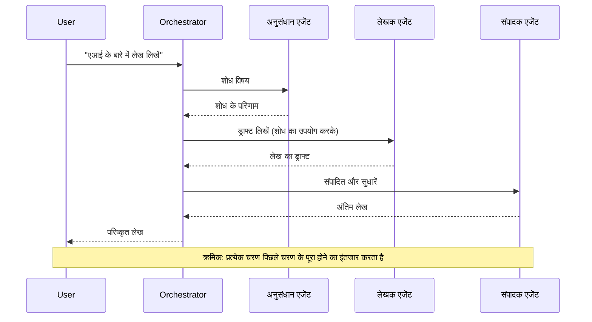
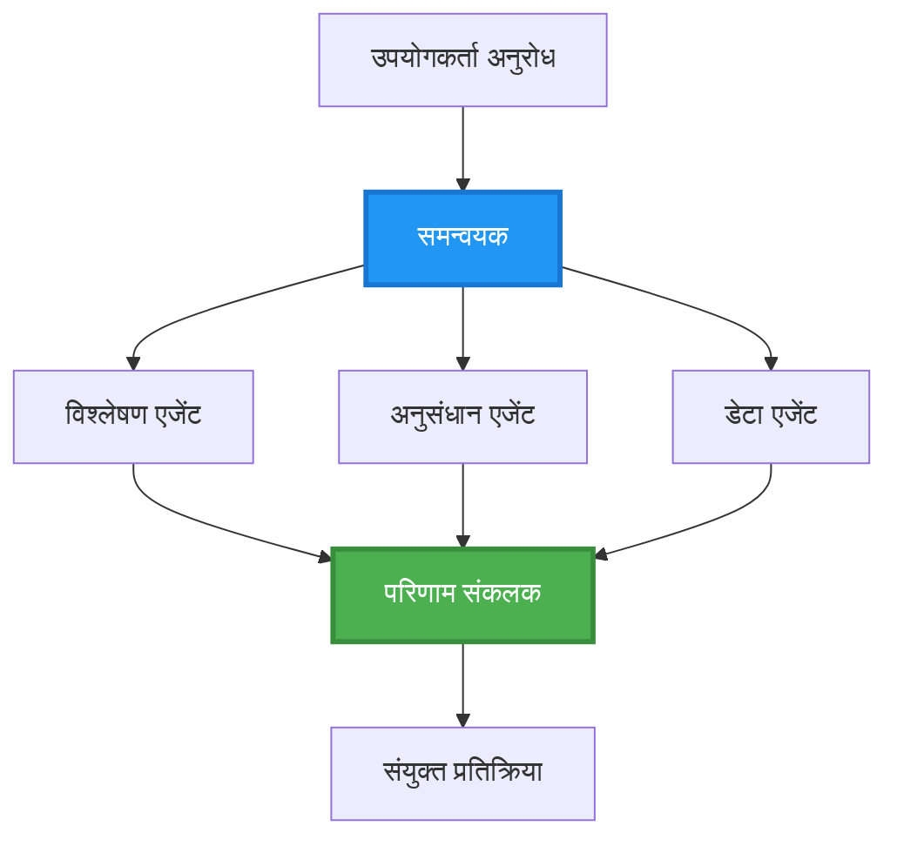
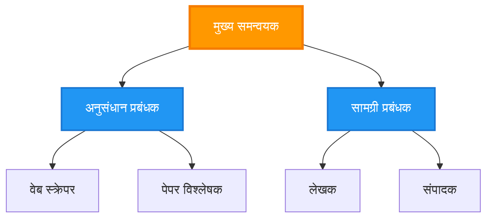
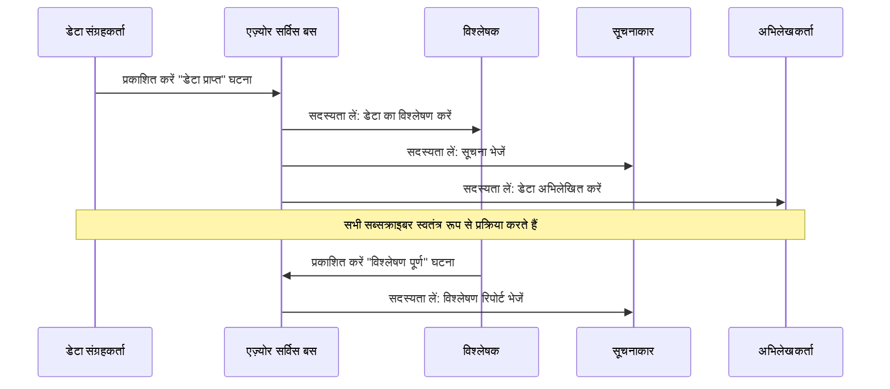
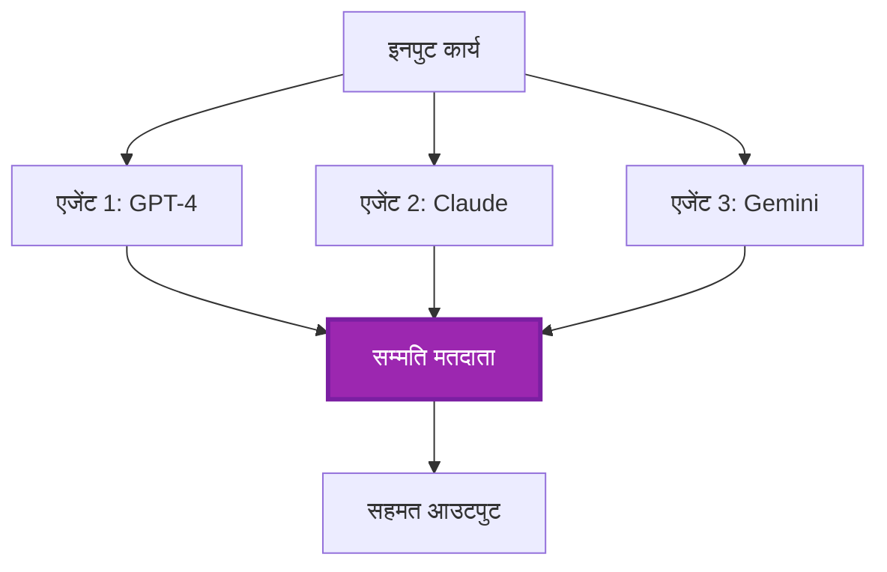
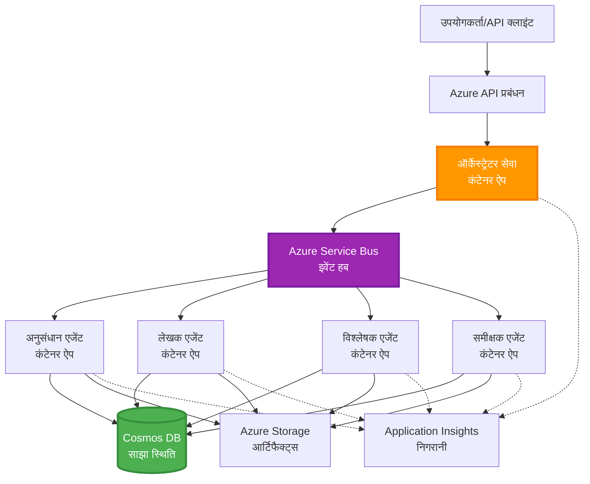

# मल्टी-एजेंट समन्वय पैटर्न

⏱️ **अनुमानित समय**: 60-75 minutes | 💰 **अनुमानित लागत**: ~$100-300/month | ⭐ **जटिलता**: उन्नत

**📚 सीखने का मार्ग:**
- ← Previous: [क्षमता योजना](capacity-planning.md) - संसाधन आकार और स्केलिंग रणनीतियाँ
- 🎯 **आप यहाँ हैं**: मल्टी-एजेंट समन्वय पैटर्न (ऑर्केस्ट्रेशन, संचार, स्टेट प्रबंधन)
- → Next: [SKU चयन](sku-selection.md) - सही Azure सेवाओं का चयन
- 🏠 [कोर्स होम](../../README.md)

---

## आप क्या सीखेंगे

इस लेसन को पूरा करने पर, आप:
- समझें **मल्टी-एजेंट आर्किटेक्चर** पैटर्न और उन्हें कब उपयोग करना है
- लागू करें **ऑर्केस्ट्रेशन पैटर्न** (केंद्रीकृत, विकेन्द्रीकृत, पदानुक्रमित)
- डिजाइन करें **एजेंट संचार** रणनीतियाँ (समकालिक, असमकालिक, इवेंट-चालित)
- प्रबंधित करें **साझा स्थिति** वितरित एजेंटों में
- डिप्लॉय करें **मल्टी-एजेंट सिस्टम** Azure पर AZD के साथ
- लागू करें **समन्वय पैटर्न** वास्तविक दुनिया के AI परिदृश्यों के लिए
- निगरानी और डिबग करें वितरित एजेंट सिस्टम

## मल्टी-एजेंट समन्वय क्यों महत्वपूर्ण है

### विकास: सिंगल एजेंट से मल्टी-एजेंट तक

**सिंगल एजेंट (सरल):**
```
User → Agent → Response
```
- ✅ समझने और लागू करने में आसान
- ✅ सरल कार्यों के लिए तेज़
- ❌ एकल मॉडल की क्षमताओं द्वारा सीमित
- ❌ जटिल कार्यों को समानांतर नहीं कर सकता
- ❌ कोई विशेषीकरण नहीं

**मल्टी-एजेंट सिस्टम (उन्नत):**
```
           ┌─────────────┐
           │ Orchestrator│
           └──────┬──────┘
        ┌─────────┼─────────┐
        │         │         │
    ┌───▼──┐  ┌──▼───┐  ┌──▼────┐
    │Agent1│  │Agent2│  │Agent3 │
    │(Plan)│  │(Code)│  │(Review)│
    └──────┘  └──────┘  └───────┘
```
- ✅ विशिष्ट कार्यों के लिए विशेषीकृत एजेंट
- ✅ गति के लिए समानांतर निष्पादन
- ✅ मॉड्यूलर और रखरखाव योग्य
- ✅ जटिल वर्कफ़्लोज़ में बेहतर
- ⚠️ समन्वय लॉजिक आवश्यक है

**उपमा**: एकल एजेंट ऐसा है जैसे एक व्यक्ति सभी कार्य कर रहा हो। मल्टी-एजेंट ऐसा है जैसे एक टीम जहाँ प्रत्येक सदस्य के पास विशेष कौशल होते हैं (रिसर्चर, कोडर, समीक्षक, लेखक) जो मिलकर काम करते हैं।

---

## मुख्य समन्वय पैटर्न

### पैटर्न 1: क्रमिक समन्वय (चेन ऑफ रिस्पॉन्सिबिलिटी)

**कब उपयोग करें**: कार्यों को विशिष्ट क्रम में पूरा होना चाहिए, प्रत्येक एजेंट पिछले आउटपुट पर निर्मित होता है।


**लाभ:**
- ✅ स्पष्ट डेटा प्रवाह
- ✅ डिबग करने में आसान
- ✅ अनुमानित निष्पादन क्रम

**सीमाएँ:**
- ❌ धीमा (कोई समानांतरता नहीं)
- ❌ एक विफलता पूरी चेन को ब्लॉक कर देती है
- ❌ आपसी निर्भर कार्यों को संभाल नहीं सकता

**उदाहरण उपयोग के मामलों:**
- सामग्री निर्माण पाइपलाइन (रिसर्च → लिखना → संपादित → प्रकाशित)
- कोड जनरेशन (योजना → कार्यान्वयन → परीक्षण → तैनाती)
- रिपोर्ट जनरेशन (डेटा संग्रह → विश्लेषण → विजुअलाइज़ेशन → सारांश)

---

### पैटर्न 2: समानांतर समन्वय (फैन-आउट/फैन-इन)

**कब उपयोग करें**: स्वतंत्र कार्य एक साथ चल सकते हैं, परिणाम अंत में संयोजित किए जाते हैं।


**लाभ:**
- ✅ तेज़ (समानांतर निष्पादन)
- ✅ दोष सहिष्णु (आंशिक परिणाम स्वीकार्य)
- ✅ क्षैतिज रूप से स्केल होता है

**सीमाएँ:**
- ⚠️ परिणाम क्रमभंग में आ सकते हैं
- ⚠️ समेकन लॉजिक की आवश्यकता
- ⚠️ जटिल स्थिति प्रबंधन

**उदाहरण उपयोग के मामलों:**
- कई स्रोतों से डेटा एकत्रीकरण (APIs + databases + वेब स्क्रैपिंग)
- प्रतिस्पर्धी विश्लेषण (कई मॉडल समाधान उत्पन्न करते हैं, सर्वश्रेष्ठ का चयन)
- अनुवाद सेवाएँ (एक साथ कई भाषाओं में अनुवाद)

---

### पैटर्न 3: पदानुक्रमिक समन्वय (प्रबंधक-कर्मचारी)

**कब उपयोग करें**: उप-कार्य वाले जटिल वर्कफ़्लोज़, delegation की आवश्यकता हो।


**लाभ:**
- ✅ जटिल वर्कफ़्लोज़ को संभालता है
- ✅ मॉड्यूलर और रखरखाव योग्य
- ✅ स्पष्ट जिम्मेदारी सीमाएँ

**सीमाएँ:**
- ⚠️ अधिक जटिल आर्किटेक्चर
- ⚠️ उच्च लेटेंसी (कई समन्वय परतें)
- ⚠️ परिष्कृत ऑर्केस्ट्रेशन की आवश्यकता

**उदाहरण उपयोग के मामले:**
- एंटरप्राइज़ दस्तावेज़ प्रोसेसिंग (क्लासिफाई → रूट → प्रोसेस → आर्काइव)
- मल्टी-स्टेज डेटा पाइपलाइंस (इंगेस्ट → क्लीन → ट्रांसफॉर्म → एनालाइज → रिपोर्ट)
- जटिल ऑटोमेशन वर्कफ़्लोज़ (योजना → संसाधन आवंटन → निष्पादन → मॉनिटरिंग)

---

### पैटर्न 4: इवेंट-ड्रिवन समन्वय (पब्लिश-सब्सक्राइब)

**कब उपयोग करें**: एजेंटों को इवेंट्स पर प्रतिक्रिया देने की आवश्यकता हो, ढीला कपलिंग वांछनीय हो।


**लाभ:**
- ✅ एजेंटों के बीच ढीला कपलिंग
- ✅ नए एजेंट जोड़ना आसान (बस सब्सक्राइब करें)
- ✅ असिंक्रोनस प्रोसेसिंग
- ✅ रेज़िलिएंट (मैसेज पर्सिस्टेंस)

**सीमाएँ:**
- ⚠️ आख़िरकार सुसंगतता (eventual consistency)
- ⚠️ जटिल डिबगिंग
- ⚠️ संदेश क्रम संबंधी चुनौतियाँ

**उदाहरण उपयोग के मामले:**
- रीयल-टाइम मॉनिटरिंग सिस्टम (अलर्ट्स, डैशबोर्ड, लॉग्स)
- मल्टी-चैनल नोटिफिकेशन्स (ईमेल, SMS, पुश, Slack)
- डेटा प्रोसेसिंग पाइपलाइंस (एक ही डेटा के कई कंज्यूमर)

---

### पैटर्न 5: कंसेंसस-आधारित समन्वय (वोटिंग/क्वोरम)

**कब उपयोग करें**: आगे बढ़ने से पहले कई एजेंटों से सहमति की आवश्यकता हो।


**लाभ:**
- ✅ अधिक सटीकता (कई राय)
- ✅ दोष सहिष्णु (अल्पसंख्यक विफलताएँ स्वीकार्य)
- ✅ गुणवत्ता आश्वासन अंतर्निर्मित

**सीमाएँ:**
- ❌ महंगा (कई मॉडल कॉल)
- ❌ धीमा (सभी एजेंटों की प्रतीक्षा)
- ⚠️ संघर्ष समाधान आवश्यक

**उदाहरण उपयोग के मामले:**
- कंटेंट मॉडरेशन (कई मॉडल सामग्री की समीक्षा)
- कोड समीक्षा (कई linters/analyzers)
- मेडिकल डायग्नोसिस (कई AI मॉडल, विशेषज्ञ सत्यापन)

---

## आर्किटेक्चर अवलोकन

### Azure पर पूर्ण मल्टी-एजेंट सिस्टम


**प्रमुख घटक:**

| घटक | उद्देश्य | Azure सेवा |
|-----------|---------|---------------|
| **API Gateway** | प्रवेश बिंदु, रेट लिमिटिंग, प्रमाणीकरण | API Management |
| **ऑर्केस्ट्रेटर** | एजेंट वर्कफ़्लो का समन्वय करता है | Container Apps |
| **मैसेज क्यू** | असिंक्रोनस संचार | Service Bus / Event Hubs |
| **एजेंट** | विशेषीकृत AI वर्कर्स | Container Apps / Functions |
| **स्टेट स्टोर** | साझा स्थिति, टास्क ट्रैकिंग | Cosmos DB |
| **आर्टिफैक्ट स्टोरेज** | दस्तावेज़, परिणाम, लॉग | Blob Storage |
| **मॉनिटरिंग** | वितरित ट्रेसिंग, लॉग | Application Insights |

---

## पूर्वापेक्षाएँ

### आवश्यक उपकरण

```bash
# Azure Developer CLI सत्यापित करें
azd version
# ✅ अपेक्षित: azd संस्करण 1.0.0 या उससे अधिक

# Azure CLI सत्यापित करें
az --version
# ✅ अपेक्षित: azure-cli 2.50.0 या उससे अधिक

# Docker सत्यापित करें (स्थानीय परीक्षण के लिए)
docker --version
# ✅ अपेक्षित: Docker संस्करण 20.10 या उससे अधिक
```

### Azure आवश्यकताएँ

- सक्रिय Azure सदस्यता
- बनाने की अनुमतियाँ:
  - Container Apps
  - Service Bus namespaces
  - Cosmos DB accounts
  - Storage accounts
  - Application Insights

### ज्ञान की आवश्यकताएँ

आपको पूरा कर लिया होना चाहिए:
- [कॉन्फ़िगरेशन प्रबंधन](../chapter-03-configuration/configuration.md)
- [प्रमाणीकरण और सुरक्षा](../chapter-03-configuration/authsecurity.md)
- [माइक्रोसर्विसेज उदाहरण](../../../../examples/microservices)

---

## कार्यान्वयन मार्गदर्शिका

### प्रोजेक्ट संरचना

```
multi-agent-system/
├── azure.yaml                    # AZD configuration
├── infra/
│   ├── main.bicep               # Main infrastructure
│   ├── core/
│   │   ├── servicebus.bicep     # Message queue
│   │   ├── cosmos.bicep         # State store
│   │   ├── storage.bicep        # Artifact storage
│   │   └── monitoring.bicep     # Application Insights
│   └── app/
│       ├── orchestrator.bicep   # Orchestrator service
│       └── agent.bicep          # Agent template
└── src/
    ├── orchestrator/            # Orchestration logic
    │   ├── app.py
    │   ├── workflows.py
    │   └── Dockerfile
    ├── agents/
    │   ├── research/            # Research agent
    │   ├── writer/              # Writer agent
    │   ├── analyst/             # Analyst agent
    │   └── reviewer/            # Reviewer agent
    └── shared/
        ├── state_manager.py     # Shared state logic
        └── message_handler.py   # Message handling
```

---

## पाठ 1: क्रमिक समन्वय पैटर्न

### कार्यान्वयन: सामग्री निर्माण पाइपलाइन

आइए एक क्रमिक पाइपलाइन बनाते हैं: रिसर्च → लिखना → संपादित → प्रकाशित

### 1. AZD कॉन्फ़िगरेशन

**फ़ाइल: `azure.yaml`**

```yaml
name: content-pipeline
metadata:
  template: multi-agent-sequential@1.0.0

services:
  orchestrator:
    project: ./src/orchestrator
    language: python
    host: containerapp
  
  research-agent:
    project: ./src/agents/research
    language: python
    host: containerapp
  
  writer-agent:
    project: ./src/agents/writer
    language: python
    host: containerapp
  
  editor-agent:
    project: ./src/agents/editor
    language: python
    host: containerapp
```

### 2. इन्फ्रास्ट्रक्चर: समन्वय के लिए Service Bus

**फ़ाइल: `infra/core/servicebus.bicep`**

```bicep
param name string
param location string
param tags object = {}

resource serviceBusNamespace 'Microsoft.ServiceBus/namespaces@2022-10-01-preview' = {
  name: name
  location: location
  tags: tags
  sku: {
    name: 'Standard'
    tier: 'Standard'
  }
  properties: {
    minimumTlsVersion: '1.2'
  }
}

// Queue for orchestrator → research agent
resource researchQueue 'Microsoft.ServiceBus/namespaces/queues@2022-10-01-preview' = {
  parent: serviceBusNamespace
  name: 'research-tasks'
  properties: {
    maxDeliveryCount: 3
    lockDuration: 'PT5M'
    deadLetteringOnMessageExpiration: true
  }
}

// Queue for research agent → writer agent
resource writerQueue 'Microsoft.ServiceBus/namespaces/queues@2022-10-01-preview' = {
  parent: serviceBusNamespace
  name: 'writer-tasks'
  properties: {
    maxDeliveryCount: 3
    lockDuration: 'PT5M'
  }
}

// Queue for writer agent → editor agent
resource editorQueue 'Microsoft.ServiceBus/namespaces/queues@2022-10-01-preview' = {
  parent: serviceBusNamespace
  name: 'editor-tasks'
  properties: {
    maxDeliveryCount: 3
    lockDuration: 'PT5M'
  }
}

output namespace string = serviceBusNamespace.name
output connectionString string = listKeys('${serviceBusNamespace.id}/AuthorizationRules/RootManageSharedAccessKey', serviceBusNamespace.apiVersion).primaryConnectionString
```

### 3. साझा स्टेट मैनेजर

**फ़ाइल: `src/shared/state_manager.py`**

```python
from azure.cosmos import CosmosClient, PartitionKey
from datetime import datetime
import os

class StateManager:
    """Manages shared state across agents using Cosmos DB"""
    
    def __init__(self):
        endpoint = os.environ['COSMOS_ENDPOINT']
        key = os.environ['COSMOS_KEY']
        
        self.client = CosmosClient(endpoint, key)
        self.database = self.client.get_database_client('agent-state')
        self.container = self.database.get_container_client('tasks')
    
    def create_task(self, task_id: str, task_type: str, input_data: dict):
        """Create a new task"""
        task = {
            'id': task_id,
            'type': task_type,
            'status': 'pending',
            'input': input_data,
            'created_at': datetime.utcnow().isoformat(),
            'steps': []
        }
        self.container.create_item(task)
        return task
    
    def update_task_step(self, task_id: str, step_name: str, result: dict):
        """Update task with completed step"""
        task = self.container.read_item(task_id, partition_key=task_id)
        
        task['steps'].append({
            'name': step_name,
            'completed_at': datetime.utcnow().isoformat(),
            'result': result
        })
        
        self.container.replace_item(task_id, task)
        return task
    
    def complete_task(self, task_id: str, final_result: dict):
        """Mark task as complete"""
        task = self.container.read_item(task_id, partition_key=task_id)
        task['status'] = 'completed'
        task['result'] = final_result
        task['completed_at'] = datetime.utcnow().isoformat()
        self.container.replace_item(task_id, task)
        return task
    
    def get_task(self, task_id: str):
        """Retrieve task state"""
        return self.container.read_item(task_id, partition_key=task_id)
```

### 4. ऑर्केस्ट्रेटर सेवा

**फ़ाइल: `src/orchestrator/app.py`**

```python
from flask import Flask, request, jsonify
from azure.servicebus import ServiceBusClient, ServiceBusMessage
import json
import uuid
import os
from shared.state_manager import StateManager

app = Flask(__name__)
state_manager = StateManager()

# Service Bus कनेक्शन
servicebus_connection_str = os.environ['SERVICEBUS_CONNECTION_STRING']
servicebus_client = ServiceBusClient.from_connection_string(servicebus_connection_str)

@app.route('/health', methods=['GET'])
def health():
    return jsonify({'status': 'healthy', 'service': 'orchestrator'})

@app.route('/create-content', methods=['POST'])
def create_content():
    """
    Sequential workflow: Research → Write → Edit → Publish
    """
    data = request.json
    topic = data.get('topic')
    
    if not topic:
        return jsonify({'error': 'Topic required'}), 400
    
    # स्टेट स्टोर में कार्य बनाएं
    task_id = str(uuid.uuid4())
    task = state_manager.create_task(
        task_id=task_id,
        task_type='content_creation',
        input_data={'topic': topic}
    )
    
    # अनुसंधान एजेंट (पहला कदम) को संदेश भेजें
    sender = servicebus_client.get_queue_sender('research-tasks')
    message = ServiceBusMessage(
        body=json.dumps({
            'task_id': task_id,
            'topic': topic,
            'next_queue': 'writer-tasks'  # परिणाम कहाँ भेजने हैं
        }),
        content_type='application/json'
    )
    
    with sender:
        sender.send_messages(message)
    
    return jsonify({
        'task_id': task_id,
        'status': 'started',
        'workflow': 'sequential',
        'steps': ['research', 'write', 'edit', 'publish'],
        'message': 'Content creation pipeline initiated'
    }), 202

@app.route('/task/<task_id>', methods=['GET'])
def get_task_status(task_id):
    """Check task status"""
    try:
        task = state_manager.get_task(task_id)
        return jsonify(task)
    except Exception as e:
        return jsonify({'error': str(e)}), 404

if __name__ == '__main__':
    app.run(host='0.0.0.0', port=8080)
```

### 5. रिसर्च एजेंट

**फ़ाइल: `src/agents/research/app.py`**

```python
from azure.servicebus import ServiceBusClient, ServiceBusMessage
from openai import AzureOpenAI
import json
import os
import time
from shared.state_manager import StateManager

# क्लाइंट्स को प्रारंभ करें
state_manager = StateManager()
servicebus_client = ServiceBusClient.from_connection_string(
    os.environ['SERVICEBUS_CONNECTION_STRING']
)

openai_client = AzureOpenAI(
    api_key=os.environ['AZURE_OPENAI_API_KEY'],
    api_version="2024-02-01",
    azure_endpoint=os.environ['AZURE_OPENAI_ENDPOINT']
)

def process_research_task(message_data):
    """Process research request and pass to writer"""
    task_id = message_data['task_id']
    topic = message_data['topic']
    next_queue = message_data['next_queue']
    
    print(f"🔬 Researching: {topic}")
    
    # शोध के लिए Azure OpenAI को कॉल करें
    response = openai_client.chat.completions.create(
        model="gpt-4",
        messages=[
            {"role": "system", "content": "You are a research assistant. Provide comprehensive research on the given topic."},
            {"role": "user", "content": f"Research this topic thoroughly: {topic}"}
        ],
        max_tokens=1500
    )
    
    research_results = response.choices[0].message.content
    
    # स्थिति अपडेट करें
    state_manager.update_task_step(
        task_id=task_id,
        step_name='research',
        result={'research': research_results}
    )
    
    # अगले एजेंट (लेखक) को भेजें
    sender = servicebus_client.get_queue_sender(next_queue)
    message = ServiceBusMessage(
        body=json.dumps({
            'task_id': task_id,
            'topic': topic,
            'research': research_results,
            'next_queue': 'editor-tasks'
        }),
        content_type='application/json'
    )
    
    with sender:
        sender.send_messages(message)
    
    print(f"✅ Research complete for task {task_id}")

def main():
    """Listen to research queue"""
    receiver = servicebus_client.get_queue_receiver('research-tasks')
    
    print("🔬 Research Agent started, listening for tasks...")
    
    with receiver:
        while True:
            messages = receiver.receive_messages(max_wait_time=5)
            for message in messages:
                try:
                    message_data = json.loads(str(message))
                    process_research_task(message_data)
                    receiver.complete_message(message)
                except Exception as e:
                    print(f"❌ Error processing message: {e}")
                    receiver.abandon_message(message)

if __name__ == '__main__':
    main()
```

### 6. लेखक एजेंट

**फ़ाइल: `src/agents/writer/app.py`**

```python
from azure.servicebus import ServiceBusClient, ServiceBusMessage
from openai import AzureOpenAI
import json
import os
from shared.state_manager import StateManager

state_manager = StateManager()
servicebus_client = ServiceBusClient.from_connection_string(
    os.environ['SERVICEBUS_CONNECTION_STRING']
)

openai_client = AzureOpenAI(
    api_key=os.environ['AZURE_OPENAI_API_KEY'],
    api_version="2024-02-01",
    azure_endpoint=os.environ['AZURE_OPENAI_ENDPOINT']
)

def process_writing_task(message_data):
    """Write article based on research"""
    task_id = message_data['task_id']
    topic = message_data['topic']
    research = message_data['research']
    next_queue = message_data['next_queue']
    
    print(f"✍️ Writing article: {topic}")
    
    # Azure OpenAI को कॉल करके लेख लिखें
    response = openai_client.chat.completions.create(
        model="gpt-4",
        messages=[
            {"role": "system", "content": "You are a professional writer. Write engaging, well-structured articles."},
            {"role": "user", "content": f"Based on this research:\n\n{research}\n\nWrite a comprehensive article about: {topic}"}
        ],
        max_tokens=2000
    )
    
    article_draft = response.choices[0].message.content
    
    # स्थिति अपडेट करें
    state_manager.update_task_step(
        task_id=task_id,
        step_name='writing',
        result={'draft': article_draft}
    )
    
    # संपादक को भेजें
    sender = servicebus_client.get_queue_sender(next_queue)
    message = ServiceBusMessage(
        body=json.dumps({
            'task_id': task_id,
            'topic': topic,
            'draft': article_draft
        }),
        content_type='application/json'
    )
    
    with sender:
        sender.send_messages(message)
    
    print(f"✅ Article draft complete for task {task_id}")

def main():
    """Listen to writer queue"""
    receiver = servicebus_client.get_queue_receiver('writer-tasks')
    
    print("✍️ Writer Agent started, listening for tasks...")
    
    with receiver:
        while True:
            messages = receiver.receive_messages(max_wait_time=5)
            for message in messages:
                try:
                    message_data = json.loads(str(message))
                    process_writing_task(message_data)
                    receiver.complete_message(message)
                except Exception as e:
                    print(f"❌ Error: {e}")
                    receiver.abandon_message(message)

if __name__ == '__main__':
    main()
```

### 7. संपादक एजेंट

**फ़ाइल: `src/agents/editor/app.py`**

```python
from azure.servicebus import ServiceBusClient
from openai import AzureOpenAI
import json
import os
from shared.state_manager import StateManager

state_manager = StateManager()
servicebus_client = ServiceBusClient.from_connection_string(
    os.environ['SERVICEBUS_CONNECTION_STRING']
)

openai_client = AzureOpenAI(
    api_key=os.environ['AZURE_OPENAI_API_KEY'],
    api_version="2024-02-01",
    azure_endpoint=os.environ['AZURE_OPENAI_ENDPOINT']
)

def process_editing_task(message_data):
    """Edit and finalize article"""
    task_id = message_data['task_id']
    topic = message_data['topic']
    draft = message_data['draft']
    
    print(f"📝 Editing article: {topic}")
    
    # संशोधित करने के लिए Azure OpenAI को कॉल करें
    response = openai_client.chat.completions.create(
        model="gpt-4",
        messages=[
            {"role": "system", "content": "You are an expert editor. Improve grammar, clarity, and structure."},
            {"role": "user", "content": f"Edit and improve this article:\n\n{draft}"}
        ],
        max_tokens=2000
    )
    
    final_article = response.choices[0].message.content
    
    # कार्य को पूरा के रूप में चिह्नित करें
    state_manager.complete_task(
        task_id=task_id,
        final_result={
            'topic': topic,
            'final_article': final_article,
            'word_count': len(final_article.split())
        }
    )
    
    print(f"✅ Article finalized for task {task_id}")

def main():
    """Listen to editor queue"""
    receiver = servicebus_client.get_queue_receiver('editor-tasks')
    
    print("📝 Editor Agent started, listening for tasks...")
    
    with receiver:
        while True:
            messages = receiver.receive_messages(max_wait_time=5)
            for message in messages:
                try:
                    message_data = json.loads(str(message))
                    process_editing_task(message_data)
                    receiver.complete_message(message)
                except Exception as e:
                    print(f"❌ Error: {e}")
                    receiver.abandon_message(message)

if __name__ == '__main__':
    main()
```

### 8. डिप्लॉय और परीक्षण

```bash
# प्रारंभ करें और तैनात करें
azd init
azd up

# ऑर्केस्ट्रेटर का URL प्राप्त करें
ORCHESTRATOR_URL=$(azd env get-values | grep ORCHESTRATOR_URL | cut -d '=' -f2 | tr -d '"')

# सामग्री बनाएं
curl -X POST $ORCHESTRATOR_URL/create-content \
  -H "Content-Type: application/json" \
  -d '{"topic": "The Future of AI in Healthcare"}'
```

**✅ अपेक्षित आउटपुट:**
```json
{
  "task_id": "a1b2c3d4-e5f6-7890-abcd-ef1234567890",
  "status": "started",
  "workflow": "sequential",
  "steps": ["research", "write", "edit", "publish"],
  "message": "Content creation pipeline initiated"
}
```

**टास्क प्रगति जांचें:**
```bash
TASK_ID="a1b2c3d4-e5f6-7890-abcd-ef1234567890"
curl $ORCHESTRATOR_URL/task/$TASK_ID
```

**✅ अपेक्षित आउटपुट (पूर्ण):**
```json
{
  "id": "a1b2c3d4-e5f6-7890-abcd-ef1234567890",
  "type": "content_creation",
  "status": "completed",
  "steps": [
    {
      "name": "research",
      "completed_at": "2025-11-19T10:30:00Z",
      "result": {"research": "..."}
    },
    {
      "name": "writing",
      "completed_at": "2025-11-19T10:32:00Z",
      "result": {"draft": "..."}
    }
  ],
  "result": {
    "topic": "The Future of AI in Healthcare",
    "final_article": "...",
    "word_count": 1500
  }
}
```

---

## पाठ 2: समानांतर समन्वय पैटर्न

### कार्यान्वयन: मल्टी-सोर्स रिसर्च एग्रीगेटर

आइए एक समानांतर सिस्टम बनाते हैं जो एक साथ कई स्रोतों से जानकारी एकत्र करता है।

### समानांतर ऑर्केस्ट्रेटर

**फ़ाइल: `src/orchestrator/parallel_workflow.py`**

```python
from flask import Flask, request, jsonify
from azure.servicebus import ServiceBusClient, ServiceBusMessage
import json
import uuid
import os
from shared.state_manager import StateManager

app = Flask(__name__)
state_manager = StateManager()

servicebus_client = ServiceBusClient.from_connection_string(
    os.environ['SERVICEBUS_CONNECTION_STRING']
)

@app.route('/research-parallel', methods=['POST'])
def research_parallel():
    """
    Parallel workflow: Multiple agents work simultaneously
    """
    data = request.json
    query = data.get('query')
    
    task_id = str(uuid.uuid4())
    task = state_manager.create_task(
        task_id=task_id,
        task_type='parallel_research',
        input_data={
            'query': query,
            'agents': ['web', 'academic', 'news', 'social']
        }
    )
    
    # फैन-आउट: सभी एजेंटों को एक साथ भेजें
    agents = [
        ('web-research-queue', 'web'),
        ('academic-research-queue', 'academic'),
        ('news-research-queue', 'news'),
        ('social-research-queue', 'social')
    ]
    
    for queue_name, agent_type in agents:
        sender = servicebus_client.get_queue_sender(queue_name)
        message = ServiceBusMessage(
            body=json.dumps({
                'task_id': task_id,
                'query': query,
                'agent_type': agent_type,
                'result_queue': 'aggregation-queue'
            }),
            content_type='application/json'
        )
        
        with sender:
            sender.send_messages(message)
    
    return jsonify({
        'task_id': task_id,
        'status': 'started',
        'workflow': 'parallel',
        'agents_dispatched': 4,
        'message': 'Parallel research initiated'
    }), 202

if __name__ == '__main__':
    app.run(host='0.0.0.0', port=8080)
```

### समेकन लॉजिक

**फ़ाइल: `src/agents/aggregator/app.py`**

```python
from azure.servicebus import ServiceBusClient
import json
import os
from collections import defaultdict
from shared.state_manager import StateManager

state_manager = StateManager()
servicebus_client = ServiceBusClient.from_connection_string(
    os.environ['SERVICEBUS_CONNECTION_STRING']
)

# प्रत्येक कार्य के लिए परिणाम ट्रैक करें
task_results = defaultdict(list)
expected_agents = 4  # वेब, अकादमिक, समाचार, सोशल

def process_result(message_data):
    """Aggregate results from parallel agents"""
    task_id = message_data['task_id']
    agent_type = message_data['agent_type']
    result = message_data['result']
    
    # परिणाम सहेजें
    task_results[task_id].append({
        'agent': agent_type,
        'data': result
    })
    
    print(f"📊 Received result from {agent_type} agent ({len(task_results[task_id])}/{expected_agents})")
    
    # जांचें कि क्या सभी एजेंट्स पूरा कर चुके हैं (फैन-इन)
    if len(task_results[task_id]) == expected_agents:
        print(f"✅ All agents completed for task {task_id}. Aggregating...")
        
        # परिणाम मिलाएँ
        aggregated = {
            'query': message_data['query'],
            'sources': task_results[task_id],
            'summary': generate_summary(task_results[task_id])
        }
        
        # पूर्ण के रूप में चिह्नित करें
        state_manager.complete_task(task_id, aggregated)
        
        # साफ़ करें
        del task_results[task_id]
        
        print(f"✅ Aggregation complete for task {task_id}")

def generate_summary(results):
    """Generate summary from all sources"""
    summaries = [r['data'].get('summary', '') for r in results]
    return '\n\n'.join(summaries)

def main():
    """Listen to aggregation queue"""
    receiver = servicebus_client.get_queue_receiver('aggregation-queue')
    
    print("📊 Aggregator started, listening for results...")
    
    with receiver:
        while True:
            messages = receiver.receive_messages(max_wait_time=5)
            for message in messages:
                try:
                    message_data = json.loads(str(message))
                    process_result(message_data)
                    receiver.complete_message(message)
                except Exception as e:
                    print(f"❌ Error: {e}")
                    receiver.abandon_message(message)

if __name__ == '__main__':
    main()
```

**समानांतर पैटर्न के लाभ:**
- ⚡ **4x तेज़** (एजेंट एक साथ चलते हैं)
- 🔄 **दोष सहिष्णु** (आंशिक परिणाम स्वीकार्य)
- 📈 **स्केलेबल** (अधिक एजेंट आसानी से जोड़ें)

---

## व्यावहारिक अभ्यास

### अभ्यास 1: टाइमआउट हैंडलिंग जोड़ें ⭐⭐ (मध्यम)

**लक्ष्य**: टाइमआउट लॉजिक लागू करें ताकि एग्रीगेटर धीमे एजेंटों के लिए हमेशा प्रतीक्षा न करे।

**कदम**:

1. **एग्रीगेटर में टाइमआउट ट्रैकिंग जोड़ें:**

```python
from datetime import datetime, timedelta

task_timeouts = {}  # task_id -> expiration_time

def process_result(message_data):
    task_id = message_data['task_id']
    
    # पहले परिणाम पर टाइमआउट सेट करें
    if task_id not in task_timeouts:
        task_timeouts[task_id] = datetime.utcnow() + timedelta(seconds=30)
    
    task_results[task_id].append({
        'agent': message_data['agent_type'],
        'data': message_data['result']
    })
    
    # जांचें कि पूरा हुआ है या समय-सीमा समाप्त हो गई है
    if len(task_results[task_id]) == expected_agents or \
       datetime.utcnow() > task_timeouts[task_id]:
        
        print(f"📊 Aggregating with {len(task_results[task_id])}/{expected_agents} results")
        
        aggregated = {
            'query': message_data['query'],
            'sources': task_results[task_id],
            'completed_agents': len(task_results[task_id]),
            'timed_out': len(task_results[task_id]) < expected_agents
        }
        
        state_manager.complete_task(task_id, aggregated)
        
        # सफाई
        del task_results[task_id]
        del task_timeouts[task_id]
```

2. **कृत्रिम विलंब के साथ परीक्षण करें:**

```python
# एक एजेंट में धीमी प्रोसेसिंग का अनुकरण करने के लिए देरी जोड़ें
import time
time.sleep(35)  # 30 सेकंड की समय-सीमा से अधिक
```

3. **डिप्लॉय और सत्यापित करें:**

```bash
azd deploy aggregator

# कार्य जमा करें
curl -X POST $ORCHESTRATOR_URL/research-parallel \
  -H "Content-Type: application/json" \
  -d '{"query": "AI safety research"}'

# 30 सेकंड के बाद परिणाम जांचें
curl $ORCHESTRATOR_URL/task/$TASK_ID
```

**✅ सफलता मानदंड:**
- ✅ टास्क 30 सेकंड के बाद पूरा हो जाता है भले ही एजेंट अधूरे हों
- ✅ प्रतिक्रिया आंशिक परिणाम दर्शाती है (`"timed_out": true`)
- ✅ उपलब्ध परिणाम लौटाए जाते हैं (4 में से 3 एजेंट)

**समय**: 20-25 मिनट

---

### अभ्यास 2: रीट्राय लॉजिक लागू करें ⭐⭐⭐ (उन्नत)

**लक्ष्य**: असफल एजेंट टास्क को स्वचालित रूप से फिर से प्रयास करें उससे पहले कि छोड़ दिया जाए।

**कदम**:

1. **ऑर्केस्ट्रेटर में रीट्राय ट्रैकिंग जोड़ें:**

```python
from dataclasses import dataclass
from typing import Dict

@dataclass
class RetryConfig:
    max_retries: int = 3
    backoff_seconds: int = 5

retry_counts: Dict[str, int] = {}  # संदेश_आईडी -> पुनःप्रयास_गणना

def send_with_retry(queue_name: str, message_data: dict, retry_config: RetryConfig):
    """Send message with retry metadata"""
    message_id = message_data.get('message_id', str(uuid.uuid4()))
    message_data['message_id'] = message_id
    message_data['retry_count'] = retry_counts.get(message_id, 0)
    message_data['max_retries'] = retry_config.max_retries
    
    sender = servicebus_client.get_queue_sender(queue_name)
    message = ServiceBusMessage(
        body=json.dumps(message_data),
        content_type='application/json',
        message_id=message_id
    )
    
    with sender:
        sender.send_messages(message)
```

2. **एजेंट्स में रीट्राय हैंडलर जोड़ें:**

```python
def process_with_retry(message, receiver, process_func):
    """Process message with automatic retry on failure"""
    try:
        message_data = json.loads(str(message))
        
        # संदेश को संसाधित करें
        process_func(message_data)
        
        # सफलता - पूर्ण
        receiver.complete_message(message)
        
    except Exception as e:
        message_id = message.message_id
        retry_count = message_data.get('retry_count', 0)
        max_retries = message_data.get('max_retries', 3)
        
        if retry_count < max_retries:
            # पुनः प्रयास: परित्याग करें और बढ़ी हुई गिनती के साथ पुनः कतार में डालें
            print(f"⚠️ Retry {retry_count + 1}/{max_retries} for message {message_id}")
            
            message_data['retry_count'] = retry_count + 1
            
            # उसी कतार में देरी के साथ वापस भेजें
            time.sleep(5 * (retry_count + 1))  # घातीय बैकऑफ
            send_with_retry(queue_name, message_data, RetryConfig())
            
            receiver.complete_message(message)  # मूल हटाएँ
        else:
            # अधिकतम पुनःप्रयास पार हो गया - डेड लेटर कतार में स्थानांतरित करें
            print(f"❌ Max retries exceeded for message {message_id}")
            receiver.dead_letter_message(
                message,
                reason="MaxRetriesExceeded",
                error_description=str(e)
            )
```

3. **डेड लेटर क्यू की निगरानी करें:**

```python
def monitor_dead_letters():
    """Check dead letter queue for failed messages"""
    receiver = servicebus_client.get_queue_receiver(
        'research-queue',
        sub_queue='deadletter'
    )
    
    with receiver:
        messages = receiver.receive_messages(max_wait_time=5)
        for message in messages:
            print(f"☠️ Dead letter: {message.message_id}")
            print(f"Reason: {message.dead_letter_reason}")
            print(f"Description: {message.dead_letter_error_description}")
```

**✅ सफलता मानदंड:**
- ✅ असफल टास्क स्वचालित रूप से फिर से प्रयास होते हैं (अधिकतम 3 बार)
- ✅ रीट्राय के बीच एक्सपोनेंशियल बैकऑफ (5s, 10s, 15s)
- ✅ अधिकतम रीट्राय के बाद संदेश डेड लेटर क्यू में जाते हैं
- ✅ डेड लेटर क्यू की निगरानी और रिप्ले संभव हो

**समय**: 30-40 मिनट

---

### अभ्यास 3: सर्किट ब्रेकर लागू करें ⭐⭐⭐ (उन्नत)

**लक्ष्य**: फैलते हुए विफलताओं को रोकने के लिए विफल एजेंट्स के अनुरोध रोकें।

**कदम**:

1. **सर्किट ब्रेकर क्लास बनाएं:**

```python
from enum import Enum
from datetime import datetime, timedelta

class CircuitState(Enum):
    CLOSED = "closed"      # सामान्य संचालन
    OPEN = "open"          # विफल, अनुरोध अस्वीकार करें
    HALF_OPEN = "half_open"  # पुनर्प्राप्ति की जांच कर रहा है

class CircuitBreaker:
    def __init__(self, failure_threshold=5, timeout_seconds=60):
        self.failure_threshold = failure_threshold
        self.timeout_seconds = timeout_seconds
        self.failure_count = 0
        self.last_failure_time = None
        self.state = CircuitState.CLOSED
    
    def call(self, func):
        """Execute function with circuit breaker protection"""
        if self.state == CircuitState.OPEN:
            # जांचें कि टाइमआउट समाप्त हुआ है या नहीं
            if datetime.utcnow() - self.last_failure_time > timedelta(seconds=self.timeout_seconds):
                self.state = CircuitState.HALF_OPEN
                print("🔄 Circuit breaker: HALF_OPEN (testing)")
            else:
                raise Exception(f"Circuit breaker OPEN for agent. Try again in {self.timeout_seconds}s")
        
        try:
            result = func()
            
            # सफलता
            if self.state == CircuitState.HALF_OPEN:
                self.state = CircuitState.CLOSED
                self.failure_count = 0
                print("✅ Circuit breaker: CLOSED (recovered)")
            
            return result
            
        except Exception as e:
            self.failure_count += 1
            self.last_failure_time = datetime.utcnow()
            
            if self.failure_count >= self.failure_threshold:
                self.state = CircuitState.OPEN
                print(f"🔴 Circuit breaker: OPEN (too many failures)")
            
            raise e
```

2. **एजेंट कॉल्स पर लागू करें:**

```python
# ऑर्केस्ट्रेटर में
agent_circuits = {
    'web': CircuitBreaker(failure_threshold=5, timeout_seconds=60),
    'academic': CircuitBreaker(failure_threshold=5, timeout_seconds=60),
    'news': CircuitBreaker(failure_threshold=5, timeout_seconds=60),
    'social': CircuitBreaker(failure_threshold=5, timeout_seconds=60)
}

def send_to_agent(agent_type, message_data):
    """Send with circuit breaker protection"""
    circuit = agent_circuits[agent_type]
    
    try:
        circuit.call(lambda: send_message(agent_type, message_data))
    except Exception as e:
        print(f"⚠️ Skipping {agent_type} agent: {e}")
        # अन्य एजेंटों के साथ जारी रखें
```

3. **सर्किट ब्रेकर का परीक्षण करें:**

```bash
# बार-बार की विफलताओं का अनुकरण करें (एक एजेंट को बंद करें)
az containerapp stop --name web-research-agent --resource-group rg-agents

# कई अनुरोध भेजें
for i in {1..10}; do
  curl -X POST $ORCHESTRATOR_URL/research-parallel \
    -H "Content-Type: application/json" \
    -d '{"query": "test query '$i'"}'
  sleep 2
done

# लॉग जांचें - 5 विफलताओं के बाद सर्किट खुला दिखना चाहिए
# कंटेनर ऐप लॉग्स के लिए Azure CLI का उपयोग करें:
az containerapp logs show --name orchestrator --resource-group $RG_NAME --tail 50
```

**✅ सफलता मानदंड:**
- ✅ 5 विफलताओं के बाद सर्किट ओपन हो जाता है (अनुरोध अस्वीकार करता है)
- ✅ 60 सेकंड के बाद सर्किट हाफ-ओपन होता है (रिकवरी का परीक्षण)
- ✅ अन्य एजेंट सामान्य रूप से काम करना जारी रखते हैं
- ✅ एजेंट के रिकवर होने पर सर्किट ऑटोमैटिक रूप से बंद हो जाता है

**समय**: 40-50 मिनट

---

## निगरानी और डिबगिंग

### Application Insights के साथ वितरित ट्रेसिंग

**फ़ाइल: `src/shared/tracing.py`**

```python
from opencensus.ext.azure.log_exporter import AzureLogHandler
from opencensus.ext.azure.trace_exporter import AzureExporter
from opencensus.trace import config_integration
from opencensus.trace.tracer import Tracer
from opencensus.trace.samplers import AlwaysOnSampler
import logging
import os

# ट्रेसिंग कॉन्फ़िगर करें
config_integration.trace_integrations(['requests', 'logging'])

connection_string = os.environ.get('APPLICATIONINSIGHTS_CONNECTION_STRING')

# ट्रेसर बनाएं
tracer = Tracer(
    exporter=AzureExporter(connection_string=connection_string),
    sampler=AlwaysOnSampler()
)

# लॉगिंग कॉन्फ़िगर करें
logger = logging.getLogger(__name__)
logger.addHandler(AzureLogHandler(connection_string=connection_string))
logger.setLevel(logging.INFO)

def trace_agent_call(agent_name, task_id, operation):
    """Trace agent operations"""
    with tracer.span(name=f'{agent_name}.{operation}') as span:
        span.add_attribute('agent', agent_name)
        span.add_attribute('task_id', task_id)
        span.add_attribute('operation', operation)
        
        try:
            result = operation()
            span.add_attribute('status', 'success')
            return result
        except Exception as e:
            span.add_attribute('status', 'error')
            span.add_attribute('error', str(e))
            raise
```

### Application Insights क्वेरीज़

मल्टी-एजेंट वर्कफ़्लो को ट्रैक करें:

```kusto
// Trace complete workflow for a task
traces
| where customDimensions.task_id == "a1b2c3d4-..."
| project timestamp, message, customDimensions.agent, customDimensions.operation
| order by timestamp asc
```

**एजेंट प्रदर्शन तुलना:**

```kusto
// Compare agent execution times
dependencies
| where name contains "agent"
| summarize 
    avg_duration = avg(duration),
    p95_duration = percentile(duration, 95),
    count = count()
  by agent = tostring(customDimensions.agent)
| order by avg_duration desc
```

**विफलता विश्लेषण:**

```kusto
// Find which agents fail most
exceptions
| where customDimensions.agent != ""
| summarize 
    failure_count = count(),
    unique_errors = dcount(outerMessage)
  by agent = tostring(customDimensions.agent)
| order by failure_count desc
```

---

## लागत विश्लेषण

### मल्टी-एजेंट सिस्टम लागत (मासिक अनुमान)

| घटक | कॉन्फ़िगरेशन | लागत |
|-----------|--------------|------|
| **ऑर्केस्ट्रेटर** | 1 Container App (1 vCPU, 2GB) | $30-50 |
| **4 एजेंट** | 4 Container Apps (0.5 vCPU, 1GB each) | $60-120 |
| **Service Bus** | मानक स्तर, 10M संदेश | $10-20 |
| **Cosmos DB** | सर्वरलेस, 5GB स्टोरेज, 1M RUs | $25-50 |
| **Blob Storage** | 10GB स्टोरेज, 100K ऑपरेशंस | $5-10 |
| **Application Insights** | 5GB ingest | $10-15 |
| **Azure OpenAI** | GPT-4, 10M tokens | $100-300 |
| **कुल** | | **$240-565/month** |

### लागत अनुकूलन रणनीतियाँ

1. **जहाँ संभव हो सर्वरलेस का उपयोग करें:**
   ```bicep
   // Cosmos DB serverless (no minimum cost)
   properties: {
     databaseAccountOfferType: 'Standard'
     capabilities: [{ name: 'EnableServerless' }]
   }
   ```

2. **एजेंट्स को जब आइडल हों तब शून्य तक स्केल करें:**
   ```bicep
   scale: {
     minReplicas: 0  // Scale to zero when no messages
     maxReplicas: 10
   }
   ```

3. **Service Bus के लिए बैचिंग का उपयोग करें:**
   ```python
   # संदेशों को बैचों में भेजें (सस्ता)
   sender.send_messages([message1, message2, message3])
   ```

4. **अक्सर उपयोग किए जाने वाले परिणामों को कैश करें:**
   ```python
   # Azure Cache for Redis का उपयोग करें
   if cache.exists(query_hash):
       return cache.get(query_hash)
   ```

---

## सर्वोत्तम अभ्यास

### ✅ करें:

1. **इडेम्पोटेंट ऑपरेशन्स का उपयोग करें**
   ```python
   # एजेंट एक ही संदेश को कई बार सुरक्षित रूप से संसाधित कर सकता है
   def process_task(task_id):
       if state_manager.task_exists(task_id):
           print(f"Task {task_id} already processed, skipping")
           return
       # कार्य संसाधित किया जा रहा है...
   ```

2. **विस्तृत लॉगिंग लागू करें**
   ```python
   logger.info(f"Agent: {agent_name}, Task: {task_id}, Action: {action}")
   ```

3. **कोरिलेशन IDs का उपयोग करें**
   ```python
   # task_id को पूरे वर्कफ़्लो में पास करें
   message_data = {
       'task_id': task_id,  # सह-संबंध आईडी
       'timestamp': datetime.utcnow().isoformat()
   }
   ```

4. **मैसेज TTL (time-to-live) सेट करें**
   ```bicep
   properties: {
     defaultMessageTimeToLive: 'PT1H'  // 1 hour max
   }
   ```

5. **डेड लेटर क्यू की निगरानी करें**
   ```python
   # असफल संदेशों की नियमित निगरानी
   monitor_dead_letters()
   ```

### ❌ न करें:

1. **परिपत्र निर्भरताएँ न बनाएं**
   ```python
   # ❌ खराब: Agent A → Agent B → Agent A (अनंत लूप)
   # ✅ अच्छा: स्पष्ट निर्देशित चक्रहीन ग्राफ (DAG) परिभाषित करें
   ```

2. **एजेंट थ्रेड्स को ब्लॉक न करें**
   ```python
   # ❌ खराब: समकालिक प्रतीक्षा
   while not task_complete:
       time.sleep(1)
   
   # ✅ अच्छा: संदेश कतार कॉलबैक का उपयोग करें
   ```

3. **आंशिक असफलताओं की अनदेखी न करें**
   ```python
   # ❌ खराब: यदि किसी एक एजेंट के विफल होने पर पूरे वर्कफ़्लो को विफल कर दें
   # ✅ अच्छा: त्रुटि संकेतकों के साथ आंशिक परिणाम लौटाएँ
   ```

4. **अनंत पुनःप्रयास का उपयोग न करें**
   ```python
   # ❌ खराब: हमेशा पुनः प्रयास करें
   # ✅ अच्छा: max_retries = 3, फिर डेड-लेटर
   ```

---

## समस्या निवारण गाइड

### समस्या: संदेश कतार में अटके हुए हैं

**लक्षण:**
- संदेश कतार में जमा होते हैं
- एजेंट प्रोसेस नहीं कर रहे हैं
- टास्क स्थिति "pending" पर अटकी हुई

**निदान:**
```bash
# क्यू की गहराई जांचें
az servicebus queue show \
  --namespace-name mybus \
  --name research-tasks \
  --query "countDetails"

# Azure CLI का उपयोग करके एजेंट लॉग्स जांचें
az containerapp logs show --name research-agent --resource-group $RG_NAME --tail 50
```

**समाधान:**

1. **एजेंट रेप्लिकास बढ़ाएँ:**
   ```bash
   az containerapp update \
     --name research-agent \
     --min-replicas 3 \
     --max-replicas 10
   ```

2. **डेड लेटर कतार की जाँच करें:**
   ```bash
   az servicebus queue show \
     --namespace-name mybus \
     --name research-tasks \
     --query "countDetails.deadLetterMessageCount"
   ```

---

### समस्या: टास्क टाइमआउट/कभी पूरा नहीं होता

**लक्षण:**
- टास्क स्थिति "in_progress" पर बनी रहती है
- कुछ एजेंट पूरा करते हैं, अन्य नहीं
- कोई त्रुटि संदेश नहीं

**निदान:**
```bash
# टास्क की स्थिति जांचें
curl $ORCHESTRATOR_URL/task/$TASK_ID

# Application Insights की जांच करें
# क्वेरी चलाएं: traces | where customDimensions.task_id == "..."
```

**समाधान:**

1. **एग्रीगेटर में टाइमआउट लागू करें (अभ्यास 1)**

2. **Azure Monitor का उपयोग करके एजेंट विफलताओं की जाँच करें:**
   ```bash
   # azd monitor के माध्यम से लॉग देखें
   azd monitor --logs
   
   # या Azure CLI का उपयोग करके विशिष्ट कंटेनर ऐप के लॉग देखें
   az containerapp logs show --name <agent-name> --resource-group $RG_NAME --follow | grep "ERROR\|FAIL"
   ```

3. **सुनिश्चित करें कि सभी एजेंट चल रहे हैं:**
   ```bash
   az containerapp list \
     --resource-group rg-agents \
     --query "[].{name:name, status:properties.runningStatus}"
   ```

---

## और जानें

### आधिकारिक दस्तावेज़ीकरण
- [Azure Service Bus](https://learn.microsoft.com/azure/service-bus-messaging/service-bus-messaging-overview)
- [Cosmos DB](https://learn.microsoft.com/azure/cosmos-db/introduction)
- [Container Apps DAPR](https://learn.microsoft.com/azure/container-apps/dapr-overview)
- [Multi-Agent Design Patterns](https://learn.microsoft.com/azure/architecture/guide/ai/multi-agent-systems)

### इस पाठ्यक्रम में अगले कदम
- ← पिछला: [क्षमता नियोजन](capacity-planning.md)
- → अगला: [SKU चयन](sku-selection.md)
- 🏠 [कोर्स होम](../../README.md)

### संबंधित उदाहरण
- [Microservices Example](../../../../examples/microservices) - सेवा संचार पैटर्न
- [Azure OpenAI Example](../../../../examples/azure-openai-chat) - AI एकीकरण

---

## सारांश

**आपने सीखा:**
- ✅ पाँच समन्वय पैटर्न (क्रमिक, समानांतर, पदानुक्रमिक, घटना-चालित, सर्वसम्मति)
- ✅ Azure पर मल्टी-एजेंट आर्किटेक्चर (Service Bus, Cosmos DB, Container Apps)
- ✅ वितरित एजेंटों में स्थिति प्रबंधन
- ✅ टाइमआउट हैंडलिंग, पुनः प्रयास, और सर्किट ब्रेकर
- ✅ वितरित प्रणालियों की निगरानी और डीबगिंग
- ✅ लागत अनुकूलन रणनीतियाँ

**मुख्य निष्कर्ष:**
1. **सही पैटर्न चुनें** - ऑर्डर किए गए वर्कफ़्लोज़ के लिए क्रमिक, गति के लिए समानांतर, लचीलापन के लिए घटना-चालित
2. **स्थिति को सावधानी से प्रबंधित करें** - साझा स्थिति के लिए Cosmos DB या समान का उपयोग करें
3. **विफलताओं को सुशीलता से संभालें** - टाइमआउट, पुनः प्रयास, सर्किट ब्रेकर, डेड लेटर कतारें
4. **सब कुछ मॉनिटर करें** - डीबगिंग के लिए वितरित ट्रेसिंग आवश्यक है
5. **लागत अनुकूलित करें** - शून्य तक स्केल करें, सर्वरलेस का उपयोग करें, कैशिंग लागू करें

**अगले कदम:**
1. व्यावहारिक अभ्यास पूर्ण करें
2. अपने उपयोग के मामले के लिए एक मल्टी-एजेंट सिस्टम बनाएँ
3. प्रदर्शन और लागत को अनुकूलित करने के लिए [SKU चयन](sku-selection.md) का अध्ययन करें

---

<!-- CO-OP TRANSLATOR DISCLAIMER START -->
अस्वीकरण:
यह दस्तावेज़ AI अनुवाद सेवा [Co-op Translator](https://github.com/Azure/co-op-translator) का उपयोग करके अनुवादित किया गया है। हम सटीकता के लिए प्रयासरत हैं, लेकिन कृपया ध्यान रखें कि स्वचालित अनुवादों में त्रुटियाँ या अशुद्धियाँ हो सकती हैं। मूल दस्तावेज़ अपनी मूल भाषा में अधिकारिक स्रोत माना जाना चाहिए। महत्वपूर्ण जानकारी के लिए, पेशेवर मानव अनुवाद की सलाह दी जाती है। हम इस अनुवाद के उपयोग से उत्पन्न किसी भी गलतफहमी या गलत व्याख्या के लिए उत्तरदायी नहीं हैं।
<!-- CO-OP TRANSLATOR DISCLAIMER END -->