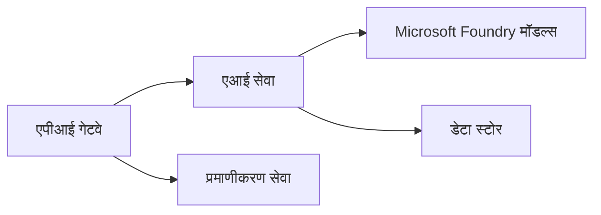

# अध्याय 8: उत्पादन और एंटरप्राइज़ पैटर्न

**📚 कोर्स**: [AZD शुरुआती के लिए](../../README.md) | **⏱️ अवधि**: 2-3 घंटे | **⭐ जटिलता**: उन्नत

---

## अवलोकन

यह अध्याय एंटरप्राइज़-तैयार तैनाती पैटर्न, सुरक्षा हार्डनिंग, निगरानी, और प्रोडक्शन AI वर्कलोड्स के लिए लागत अनुकूलन को कवर करता है।

> जून 2026 में `azd 1.25.6` के खिलाफ सत्यापित।

## सीखने के उद्देश्य

इस अध्याय को पूरा करके, आप:
- बहु-क्षेत्रीय प्रतिरोधी एप्लिकेशन तैनात करें
- एंटरप्राइज़ सुरक्षा पैटर्न लागू करें
- व्यापक निगरानी कॉन्फ़िगर करें
- पैमाने पर लागत अनुकूलित करें
- AZD के साथ CI/CD पाइपलाइनों को सेट करें

---

## 📚 पाठ

| # | पाठ | विवरण | समय |
|---|--------|-------------|------|
| 1 | [उत्पादन AI प्रथाएँ](production-ai-practices.md) | एंटरप्राइज़ तैनाती पैटर्न | 90 मिनट |

---

## 🚀 उत्पादन चेकलिस्ट

- [ ] लचीलापन के लिए बहु-क्षेत्रीय तैनाती
- [ ] प्रमाणीकरण के लिए प्रबंधित पहचान (कोई कुंजियाँ नहीं)
- [ ] निगरानी के लिए Application Insights
- [ ] लागत बजट और अलर्ट कॉन्फ़िगर करें
- [ ] सुरक्षा स्कैनिंग सक्षम करें
- [ ] CI/CD पाइपलाइन एकीकरण
- [ ] आपदा रिकवरी योजना

---

## 🏗️ आर्किटेक्चर पैटर्न

### पैटर्न 1: माइक्रोसर्विसेज AI



### पैटर्न 2: इवेंट-ड्रिवन AI


---

## 🔐 सुरक्षा सर्वोत्तम प्रथाएँ

```bicep
// Use managed identity
identity: {
  type: 'SystemAssigned'
}

// Private endpoints for AI services
properties: {
  publicNetworkAccess: 'Disabled'
  networkAcls: {
    defaultAction: 'Deny'
  }
}
```

---

## 💰 लागत अनुकूलन

| रणनीति | बचत |
|----------|---------|
| शून्य तक स्केल (Container Apps) | 60-80% |
| विकास के लिए उपयोग-आधारित टियर का उपयोग करें | 50-70% |
| अनुसूचित स्केलिंग | 30-50% |
| आरक्षित क्षमता | 20-40% |

```bash
# बजट अलर्ट सेट करें
az consumption budget create \
  --budget-name "AI-Budget" \
  --amount 500 \
  --category Cost \
  --time-grain Monthly
```

---

## 📊 निगरानी सेटअप

```bash
# लॉग स्ट्रीम करें
azd monitor --logs

# Application Insights की जाँच करें
azd monitor --overview

# मेट्रिक्स देखें
az monitor metrics list --resource <resource-id>
```

---

## 🔗 नेविगेशन

| दिशा | अध्याय |
|-----------|---------|
| **पिछला** | [अध्याय 7: समस्या निवारण](../chapter-07-troubleshooting/README.md) |
| **कोर्स पूरा** | [कोर्स मुख्य पृष्ठ](../../README.md) |

---

## 📖 संबंधित संसाधन

- [AI एजेंट्स गाइड](../chapter-02-ai-development/agents.md)
- [Application Insights](../chapter-06-pre-deployment/application-insights.md)
- [मल्टी-एजेंट समाधान](../chapter-05-multi-agent/README.md)
- [माइक्रोसर्विसेज उदाहरण](../../examples/microservices/README.md)

---

<!-- CO-OP TRANSLATOR DISCLAIMER START -->
**अस्वीकरण**:
इस दस्तावेज़ का अनुवाद AI अनुवाद सेवा [Co-op Translator](https://github.com/Azure/co-op-translator) का उपयोग करके किया गया है। जबकि हम सटीकता के लिए प्रयास करते हैं, कृपया ध्यान दें कि स्वचालित अनुवादों में त्रुटियाँ या अशुद्धियाँ हो सकती हैं। मूल दस्तावेज़ अपनी मूल भाषा में ही प्रामाणिक स्रोत माना जाना चाहिए। महत्वपूर्ण जानकारी के लिए, पेशेवर मानव अनुवाद की सिफारिश की जाती है। इस अनुवाद के उपयोग से उत्पन्न किसी भी गलतफहमी या गलत व्याख्या के लिए हम उत्तरदायी नहीं हैं।
<!-- CO-OP TRANSLATOR DISCLAIMER END -->