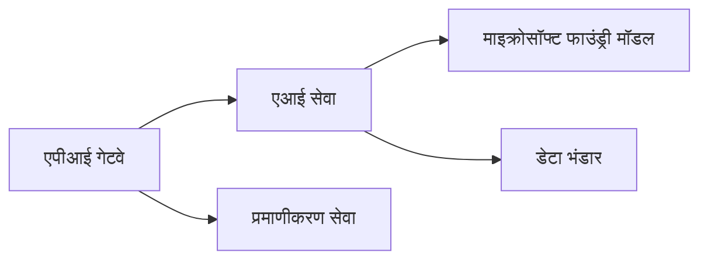

# अध्याय 8: प्रोडक्शन और एंटरप्राइज पैटर्न

**📚 कोर्स**: [AZD For Beginners](../../README.md) | **⏱️ अवधि**: 2-3 घंटे | **⭐ जटिलता**: उन्नत

---

## अवलोकन

इस अध्याय में एंटरप्राइज-तैयार डिप्लॉयमेंट पैटर्न, सुरक्षा मजबूत करना, निगरानी, और प्रोडक्शन AI वर्कलोड के लिए लागत अनुकूलन शामिल हैं।

> मार्च 2026 में `azd 1.23.12` के खिलाफ सत्यापित।

## सीखने के उद्देश्य

इस अध्याय को पूरा करके, आप:
- मल्टी-रीजन रेज़िलिएंट एप्लिकेशन तैनात करेंगे
- एंटरप्राइज सुरक्षा पैटर्न लागू करेंगे
- व्यापक निगरानी कॉन्फ़िगर करेंगे
- पैमाने पर लागत को अनुकूलित करेंगे
- AZD के साथ CI/CD पाइपलाइन सेटअप करेंगे

---

## 📚 पाठ

| # | पाठ | विवरण | समय |
|---|--------|-------------|------|
| 1 | [प्रोडक्शन AI प्रथाएँ](production-ai-practices.md) | एंटरप्राइज डिप्लॉयमेंट पैटर्न | 90 मिनट |

---

## 🚀 प्रोडक्शन चेकलिस्ट

- [ ] रेज़िलिएंस के लिए मल्टी-रीजन तैनाती
- [ ] प्रमाणीकरण के लिए प्रबंधित पहचान (कोई कुंजी नहीं)
- [ ] निगरानी के लिए एप्लिकेशन इनसाइट्स
- [ ] लागत बजट और अलर्ट कॉन्फ़िगर किए गए
- [ ] सुरक्षा स्कैनिंग सक्षम
- [ ] CI/CD पाइपलाइन एकीकरण
- [ ] आपदा पुनर्प्राप्ति योजना

---

## 🏗️ आर्किटेक्चर पैटर्न

### पैटर्न 1: माइक्रोसर्विसेज AI


### पैटर्न 2: इवेंट-ड्रिवेन AI


---

## 🔐 सुरक्षा सर्वोत्तम प्रथाएं

```bicep
// Use managed identity
identity: {
  type: 'SystemAssigned'
}

// Private endpoints for AI services
properties: {
  publicNetworkAccess: 'Disabled'
  networkAcls: {
    defaultAction: 'Deny'
  }
}
```

---

## 💰 लागत अनुकूलन

| रणनीति | बचत |
|----------|---------|
| शून्य तक स्केल करना (कंटेनर ऐप्स) | 60-80% |
| विकास के लिए खपत टियर का उपयोग | 50-70% |
| निर्धारित स्केलिंग | 30-50% |
| आरक्षित क्षमता | 20-40% |

```bash
# बजट अलर्ट सेट करें
az consumption budget create \
  --budget-name "AI-Budget" \
  --amount 500 \
  --category Cost \
  --time-grain Monthly
```

---

## 📊 निगरानी सेटअप

```bash
# स्ट्रीम लॉग्स
azd monitor --logs

# एप्लिकेशन इंसाइट्स जांचें
azd monitor --overview

# मैट्रिक्स देखें
az monitor metrics list --resource <resource-id>
```

---

## 🔗 नेविगेशन

| दिशा | अध्याय |
|-----------|---------|
| **पिछला** | [अध्याय 7: समस्या निवारण](../chapter-07-troubleshooting/README.md) |
| **कोर्स पूरा** | [कोर्स होम](../../README.md) |

---

## 📖 संबंधित संसाधन

- [AI एजेंट गाइड](../chapter-02-ai-development/agents.md)
- [एप्लिकेशन इनसाइट्स](../chapter-06-pre-deployment/application-insights.md)
- [मल्टी-एजेंट समाधान](../chapter-05-multi-agent/README.md)
- [माइक्रोसर्विसेज उदाहरण](../../examples/microservices/README.md)

---

<!-- CO-OP TRANSLATOR DISCLAIMER START -->
**अस्वीकरण**:  
यह दस्तावेज़ AI अनुवाद सेवा [Co-op Translator](https://github.com/Azure/co-op-translator) का उपयोग करके अनुवादित किया गया है। जबकि हम शुद्धता के लिए प्रयासरत हैं, कृपया ध्यान दें कि स्वचालित अनुवादों में त्रुटियाँ या असत्यताएँ हो सकती हैं। मूल दस्तावेज़ अपनी मूल भाषा में अधिकृत स्रोत माना जाना चाहिए। महत्वपूर्ण जानकारी के लिए, पेशेवर मानव अनुवाद की सिफारिश की जाती है। इस अनुवाद के उपयोग से उत्पन्न किसी भी गलतफहमी या गलत व्याख्या के लिए हम उत्तरदायी नहीं हैं।
<!-- CO-OP TRANSLATOR DISCLAIMER END -->