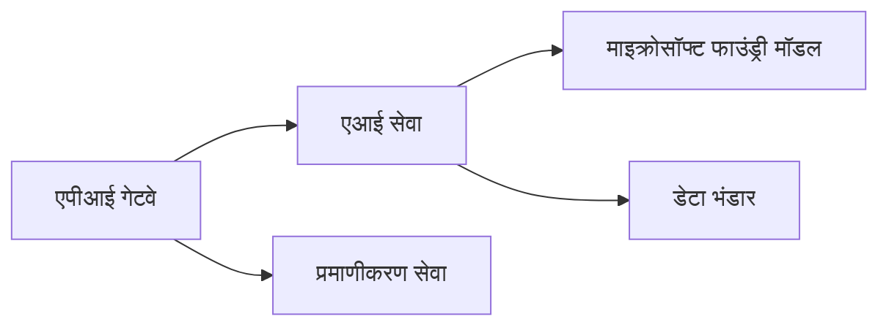
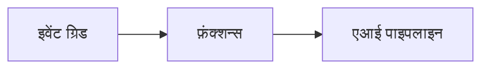

# अध्याय 8: उत्पादन और एंटरप्राइज़ पैटर्न

**📚 पाठ्यक्रम**: [AZD For Beginners](../../README.md) | **⏱️ अवधि**: 2-3 घंटे | **⭐ जटिलता**: उन्नत

---

## अवलोकन

यह अध्याय उत्पादन AI वर्कलोड के लिए एंटरप्राइज़-रेडी तैनाती पैटर्न, सुरक्षा हार्डनिंग, मॉनिटरिंग, और लागत अनुकूलन को कवर करता है।

## सीखने के उद्देश्य

इस अध्याय को पूरा करने के बाद, आप:
- बहु-रीजन लचीले अनुप्रयोग तैनात करेंगे
- एंटरप्राइज़ सुरक्षा पैटर्न लागू करेंगे
- व्यापक मॉनिटरिंग कॉन्फ़िगर करेंगे
- पैमाने पर लागतों का अनुकूलन करेंगे
- AZD के साथ CI/CD पाइपलाइनों को सेट अप करेंगे

---

## 📚 पाठ

| # | पाठ | विवरण | समय |
|---|--------|-------------|------|
| 1 | [उत्पादन AI अभ्यास](production-ai-practices.md) | एंटरप्राइज़ तैनाती पैटर्न | 90 मिनट |

---

## 🚀 प्रोडक्शन चेकलिस्ट

- [ ] लचीलापन के लिए मल्टी-रीजन तैनाती
- [ ] प्रमाणीकरण के लिए प्रबंधित पहचान (कोई कुंजी नहीं)
- [ ] निगरानी के लिए Application Insights
- [ ] लागत बजट और अलर्ट कॉन्फ़िगर किए गए
- [ ] सुरक्षा स्कैनिंग सक्षम
- [ ] CI/CD पाइपलाइन एकीकरण
- [ ] आपदा वसूली योजना

---

## 🏗️ आर्किटेक्चर पैटर्न

### पैटर्न 1: माइक्रोसर्विसेज AI


### पैटर्न 2: ईवेंट-ड्रिवन AI


---

## 🔐 सुरक्षा सर्वोत्तम प्रथाएँ

```bicep
// Use managed identity
identity: {
  type: 'SystemAssigned'
}

// Private endpoints for AI services
properties: {
  publicNetworkAccess: 'Disabled'
  networkAcls: {
    defaultAction: 'Deny'
  }
}
```

---

## 💰 लागत अनुकूलन

| रणनीति | बचत |
|----------|---------|
| शून्य तक स्केल करें (Container Apps) | 60-80% |
| विकास के लिए खपत-आधारित टियर्स का उपयोग करें | 50-70% |
| अनुसूचित स्केलिंग | 30-50% |
| आरक्षित क्षमता | 20-40% |

```bash
# बजट अलर्ट सेट करें
az consumption budget create \
  --budget-name "AI-Budget" \
  --amount 500 \
  --category Cost \
  --time-grain Monthly
```

---

## 📊 मॉनिटरिंग सेटअप

```bash
# लॉग स्ट्रीम करें
azd monitor --logs

# Application Insights की जाँच करें
azd monitor

# मेट्रिक्स देखें
az monitor metrics list --resource <resource-id>
```

---

## 🔗 नेविगेशन

| Direction | Chapter |
|-----------|---------|
| **Previous** | [अध्याय 7: समस्या निवारण](../chapter-07-troubleshooting/README.md) |
| **Course Complete** | [कोर्स होम](../../README.md) |

---

## 📖 संबंधित संसाधन

- [AI एजेंट्स मार्गदर्शिका](../chapter-02-ai-development/agents.md)
- [Application Insights](../chapter-06-pre-deployment/application-insights.md)
- [मल्टी-एजेंट समाधान](../chapter-05-multi-agent/README.md)
- [माइक्रोसर्विसेज उदाहरण](../../examples/microservices/README.md)

---

<!-- CO-OP TRANSLATOR DISCLAIMER START -->
**अस्वीकरण**:
यह दस्तावेज़ AI अनुवाद सेवा [Co-op Translator](https://github.com/Azure/co-op-translator) का उपयोग करके अनुवादित किया गया है। जबकि हम सटीकता के लिए प्रयास करते हैं, कृपया ध्यान रखें कि स्वचालित अनुवादों में त्रुटियाँ या असंगतियाँ हो सकती हैं। मूल दस्तावेज़ अपनी मूल भाषा में अधिकृत स्रोत माना जाना चाहिए। महत्वपूर्ण जानकारी के लिए, पेशेवर मानवीय अनुवाद की सिफारिश की जाती है। इस अनुवाद के उपयोग से उत्पन्न किसी भी गलत समझ या गलत व्याख्या के लिए हम उत्तरदायी नहीं हैं।
<!-- CO-OP TRANSLATOR DISCLAIMER END -->