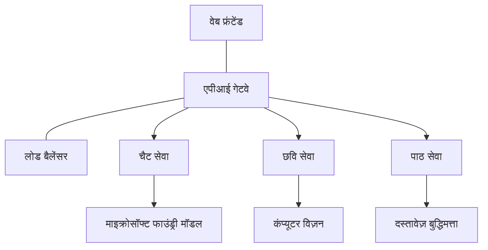

# AZD के साथ प्रोडक्शन AI वर्कलोड सर्वोत्तम प्रथाएँ

**अध्याय नेविगेशन:**
- **📚 कोर्स होम**: [AZD For Beginners](../../README.md)
- **📖 वर्तमान अध्याय**: अध्याय 8 - प्रोडक्शन और एंटरप्राइज पैटर्न
- **⬅️ पिछला अध्याय**: [अध्याय 7: ट्रबलशूटिंग](../chapter-07-troubleshooting/debugging.md)
- **⬅️ संबंधित**: [AI कार्यशाला लैब](ai-workshop-lab.md)
- **🎯 कोर्स पूरा**: [AZD For Beginners](../../README.md)

## अवलोकन

यह गाइड Azure Developer CLI (AZD) का उपयोग करके प्रोडक्शन-तैयार AI वर्कलोड तैनात करने के लिए व्यापक सर्वोत्तम प्रथाएं प्रदान करता है। Microsoft Foundry Discord समुदाय और वास्तविक ग्राहक तैनाती से प्राप्त प्रतिक्रिया के आधार पर, ये प्रथाएं प्रोडक्शन AI सिस्टम में सबसे आम चुनौतियों को संबोधित करती हैं।

## संबोधित मुख्य चुनौतियाँ

हमारे समुदाय के पोल परिणामों के अनुसार, ये शीर्ष चुनौतियाँ हैं जिनका सामना डेवलपर्स करते हैं:

- **45%** बहु-सेवा AI तैनाती में संघर्ष करते हैं  
- **38%** क्रेडेंशियल और सीक्रेट प्रबंधन में समस्याएँ हैं  
- **35%** प्रोडक्शन रेडीनेस और स्केलिंग कठिन पाते हैं  
- **32%** बेहतर लागत अनुकूलन रणनीतियों की आवश्यकता है  
- **29%** बेहतर निगरानी और ट्रबलशूटिंग चाहिए  

## प्रोडक्शन AI के लिए वास्तुकला पैटर्न

### पैटर्न 1: माइक्रोसर्विसेज AI आर्किटेक्चर

**कब उपयोग करें**: कई क्षमताओं वाले जटिल AI एप्लिकेशन


**AZD कार्यान्वयन**:

```yaml
# azure.yaml
name: enterprise-ai-platform
services:
  web:
    project: ./web
    host: staticwebapp
  api-gateway:
    project: ./api-gateway
    host: containerapp
  chat-service:
    project: ./services/chat
    host: containerapp
  vision-service:
    project: ./services/vision
    host: containerapp
  text-service:
    project: ./services/text
    host: containerapp
```

### पैटर्न 2: इवेंट-ड्रिवेन AI प्रोसेसिंग

**कब उपयोग करें**: बैच प्रोसेसिंग, दस्तावेज़ विश्लेषण, असिंक्रोनस वर्कफ्लो

```bicep
// Event Hub for AI processing pipeline
resource eventHub 'Microsoft.EventHub/namespaces@2023-01-01-preview' = {
  name: eventHubNamespaceName
  location: location
  sku: {
    name: 'Standard'
    tier: 'Standard'
    capacity: 1
  }
}

// Service Bus for reliable message processing
resource serviceBus 'Microsoft.ServiceBus/namespaces@2022-10-01-preview' = {
  name: serviceBusNamespaceName
  location: location
  sku: {
    name: 'Premium'
    tier: 'Premium'
    capacity: 1
  }
}

// Function App for processing
resource functionApp 'Microsoft.Web/sites@2023-01-01' = {
  name: functionAppName
  location: location
  kind: 'functionapp,linux'
  properties: {
    siteConfig: {
      appSettings: [
        {
          name: 'FUNCTIONS_EXTENSION_VERSION'
          value: '~4'
        }
        {
          name: 'AZURE_OPENAI_ENDPOINT'
          value: '@Microsoft.KeyVault(VaultName=${keyVault.name};SecretName=openai-endpoint)'
        }
      ]
    }
  }
}
```

## AI एजेंट स्वास्थ्य के बारे में सोचना

जब कोई पारंपरिक वेब ऐप टूटता है, लक्षण परिचित होते हैं: कोई पेज लोड नहीं होता, API त्रुटि देता है, या डिप्लॉयमेंट विफल हो जाता है। AI-संचालित एप्लिकेशन इन सभी तरीकों में टूट सकते हैं—लेकिन वे उन सूक्ष्म तरीकों से भी गलत व्यवहार कर सकते हैं जो स्पष्ट त्रुटि संदेश नहीं देते।

यह अनुभाग आपको AI वर्कलोड की निगरानी के लिए एक मानसिक मॉडल बनाने में मदद करता है ताकि आप जान सकें कि चीजें सही न लगने पर कहां देखना है।

### एजेंट स्वास्थ्य पारंपरिक ऐप स्वास्थ्य से कैसे भिन्न है

एक पारंपरिक ऐप या तो काम करता है या नहीं। एक AI एजेंट काम करता हुआ प्रकट हो सकता है लेकिन खराब परिणाम दे सकता है। एजेंट स्वास्थ्य को दो परतों में सोचें:

| परत | क्या देखें | कहां देखें |
|-------|--------------|---------------|
| **इन्फ्रास्ट्रक्चर स्वास्थ्य** | क्या सेवा चल रही है? क्या संसाधन उपलब्ध हैं? क्या एंडपॉइंट पहुँच योग्य हैं? | `azd monitor`, Azure पोर्टल संसाधन स्वास्थ्य, कंटेनर/एप्लिकेशन लॉग्स |
| **व्यवहार स्वास्थ्य** | क्या एजेंट सही प्रतिक्रिया दे रहा है? क्या प्रतिक्रियाएँ समय पर हैं? क्या मॉडल सही तरीके से कॉल हो रहा है? | एप्लिकेशन इनसाइट्स ट्रेसेस, मॉडल कॉल विलंब मेट्रिक्स, प्रतिक्रिया गुणवत्ता लॉग्स |

इन्फ्रास्ट्रक्चर स्वास्थ्य परिचित है—यह किसी भी azd ऐप के लिए समान है। व्यवहार स्वास्थ्य वह नई परत है जो AI वर्कलोड लाता है।

### जब AI ऐप अपेक्षित रूप से व्यवहार न करें तो कहां देखें

यदि आपका AI एप्लिकेशन अपेक्षित परिणाम नहीं दे रहा है, तो यहां एक अवधारणात्मक चेकलिस्ट है:

1. **बुनियादी बातों से शुरू करें।** क्या ऐप चल रहा है? क्या यह अपनी निर्भरताओं तक पहुँच सकता है? `azd monitor` और संसाधन स्वास्थ्य की जांच करें जैसे आप किसी भी ऐप के लिए करते हैं।  
2. **मॉडल कनेक्शन जांचें।** क्या आपका एप्लिकेशन सफलतापूर्वक AI मॉडल को कॉल कर रहा है? विफल या समय समाप्त मॉडल कॉल AI ऐप मुद्दों का सबसे आम कारण हैं और ये आपके एप्लिकेशन लॉग में दिखेंगे।  
3. **देखें कि मॉडल को क्या मिला।** AI प्रतिक्रियाएँ इनपुट (प्रॉम्प्ट और कोई भी प्राप्त संदर्भ) पर निर्भर करती हैं। यदि आउटपुट गलत है, तो इनपुट आमतौर पर गलत होता है। जांचें कि क्या आपका एप्लिकेशन मॉडल को सही डेटा भेज रहा है।  
4. **प्रतिक्रिया विलंबता की समीक्षा करें।** AI मॉडल कॉल सामान्य API कॉल की तुलना में धीमे होते हैं। यदि आपका ऐप धीमा लगता है, तो जांचें कि मॉडल प्रतिक्रिया समय बढ़ा है या नहीं—यह थ्रॉटलिंग, क्षमता सीमाओं, या क्षेत्र-स्तरीय भीड़ को सूचित कर सकता है।  
5. **लागत संकेतों पर नजर रखें।** टोकन उपयोग या API कॉल में अप्रत्याशित वृद्धि किसी लूप, गलत कॉन्फ़िगर किए गए प्रॉम्प्ट, या अत्यधिक पुन: प्रयास का संकेत दे सकती है।  

आपको तुरंत ऑब्ज़र्वेबिलिटी टूल में महारत हासिल करने की जरूरत नहीं है। मुख्य बात यह है कि AI अनुप्रयोगों में निगरानी के लिए एक अतिरिक्त व्यवहार परत होती है, और azd का बिल्ट-इन मॉनिटरिंग (`azd monitor`) दोनों परतों की जांच के लिए एक शुरुआत देता है।

---

## सुरक्षा सर्वोत्तम प्रथाएँ

### 1. ज़ीरो-ट्रस्ट सुरक्षा मॉडल

**कार्यान्वयन रणनीति**:
- बिना प्रमाणीकरण के कोई सेवा-से-सेवा संचार नहीं  
- सभी API कॉल मैनेज्ड आइडेंटिटीज़ का उपयोग करते हैं  
- प्राइवेट एंडपॉइंट के साथ नेटवर्क पृथक्करण  
- न्यूनतम विशेषाधिकार एक्सेस नियंत्रण  

```bicep
// Managed Identity for each service
resource chatServiceIdentity 'Microsoft.ManagedIdentity/userAssignedIdentities@2023-01-31' = {
  name: 'chat-service-identity'
  location: location
}

// Role assignments with minimal permissions
resource openAIUserRole 'Microsoft.Authorization/roleAssignments@2022-04-01' = {
  scope: openAIAccount
  name: guid(openAIAccount.id, chatServiceIdentity.id, openAIUserRoleDefinitionId)
  properties: {
    roleDefinitionId: subscriptionResourceId('Microsoft.Authorization/roleDefinitions', '5e0bd9bd-7b93-4f28-af87-19fc36ad61bd')
    principalId: chatServiceIdentity.properties.principalId
    principalType: 'ServicePrincipal'
  }
}
```

### 2. सुरक्षित सीक्रेट प्रबंधन

**की वॉल्ट एकीकरण पैटर्न**:

```bicep
// Key Vault with proper access policies
resource keyVault 'Microsoft.KeyVault/vaults@2023-02-01' = {
  name: keyVaultName
  location: location
  properties: {
    tenantId: tenant().tenantId
    sku: {
      family: 'A'
      name: 'premium'  // Use premium for production
    }
    enableRbacAuthorization: true  // Use RBAC instead of access policies
    enablePurgeProtection: true    // Prevent accidental deletion
    enableSoftDelete: true
    softDeleteRetentionInDays: 90
  }
}

// Store all AI service credentials
resource openAIKeySecret 'Microsoft.KeyVault/vaults/secrets@2023-02-01' = {
  parent: keyVault
  name: 'openai-api-key'
  properties: {
    value: openAIAccount.listKeys().key1
    attributes: {
      enabled: true
    }
  }
}
```

### 3. नेटवर्क सुरक्षा

**प्राइवेट एंडपॉइंट कॉन्फ़िगरेशन**:

```bicep
// Virtual Network for AI services
resource virtualNetwork 'Microsoft.Network/virtualNetworks@2023-04-01' = {
  name: vnetName
  location: location
  properties: {
    addressSpace: {
      addressPrefixes: ['10.0.0.0/16']
    }
    subnets: [
      {
        name: 'ai-services-subnet'
        properties: {
          addressPrefix: '10.0.1.0/24'
          privateEndpointNetworkPolicies: 'Disabled'
        }
      }
      {
        name: 'app-services-subnet'
        properties: {
          addressPrefix: '10.0.2.0/24'
          delegations: [
            {
              name: 'Microsoft.Web/serverFarms'
              properties: {
                serviceName: 'Microsoft.Web/serverFarms'
              }
            }
          ]
        }
      }
    ]
  }
}

// Private endpoints for all AI services
resource openAIPrivateEndpoint 'Microsoft.Network/privateEndpoints@2023-04-01' = {
  name: '${openAIAccountName}-pe'
  location: location
  properties: {
    subnet: {
      id: virtualNetwork.properties.subnets[0].id
    }
    privateLinkServiceConnections: [
      {
        name: 'openai-connection'
        properties: {
          privateLinkServiceId: openAIAccount.id
          groupIds: ['account']
        }
      }
    ]
  }
}
```

## प्रदर्शन और स्केलिंग

### 1. ऑटो-स्केलिंग रणनीतियाँ

**कंटेनर ऐप्स ऑटो-स्केलिंग**:

```bicep
resource containerApp 'Microsoft.App/containerApps@2023-05-01' = {
  name: containerAppName
  location: location
  properties: {
    configuration: {
      ingress: {
        external: true
        targetPort: 8000
        transport: 'http'
      }
    }
    template: {
      scale: {
        minReplicas: 2  // Always have 2 instances minimum
        maxReplicas: 50 // Scale up to 50 for high load
        rules: [
          {
            name: 'http-scaling'
            http: {
              metadata: {
                concurrentRequests: '20'  // Scale when >20 concurrent requests
              }
            }
          }
          {
            name: 'cpu-scaling'
            custom: {
              type: 'cpu'
              metadata: {
                type: 'Utilization'
                value: '70'  // Scale when CPU >70%
              }
            }
          }
        ]
      }
    }
  }
}
```

### 2. कैशिंग रणनीतियाँ

**AI प्रतिक्रियाओं के लिए रेडिस कैश**:

```bicep
// Redis Premium for production workloads
resource redisCache 'Microsoft.Cache/redis@2023-04-01' = {
  name: redisCacheName
  location: location
  properties: {
    sku: {
      name: 'Premium'
      family: 'P'
      capacity: 1
    }
    enableNonSslPort: false
    minimumTlsVersion: '1.2'
    redisConfiguration: {
      'maxmemory-policy': 'allkeys-lru'
    }
    // Enable clustering for high availability
    redisVersion: '6.0'
    shardCount: 2
  }
}

// Cache configuration in application
var cacheConnectionString = '${redisCache.properties.hostName}:6380,password=${redisCache.listKeys().primaryKey},ssl=True,abortConnect=False'
```

### 3. लोड बैलेंसिंग और ट्रैफ़िक प्रबंधन

**WAF के साथ एप्लिकेशन गेटवे**:

```bicep
// Application Gateway with Web Application Firewall
resource applicationGateway 'Microsoft.Network/applicationGateways@2023-04-01' = {
  name: appGatewayName
  location: location
  properties: {
    sku: {
      name: 'WAF_v2'
      tier: 'WAF_v2'
      capacity: 2
    }
    webApplicationFirewallConfiguration: {
      enabled: true
      firewallMode: 'Prevention'
      ruleSetType: 'OWASP'
      ruleSetVersion: '3.2'
    }
    // Backend pools for AI services
    backendAddressPools: [
      {
        name: 'ai-services-pool'
        properties: {
          backendAddresses: [
            {
              fqdn: '${containerApp.properties.configuration.ingress.fqdn}'
            }
          ]
        }
      }
    ]
  }
}
```

## 💰 लागत अनुकूलन

### 1. संसाधन का सही आकार निर्धारण

**पर्यावरण-विशिष्ट कॉन्फ़िगरेशन**:

```bash
# विकास पर्यावरण
azd env new development
azd env set AZURE_OPENAI_SKU "S0"
azd env set AZURE_OPENAI_CAPACITY 10
azd env set AZURE_SEARCH_SKU "basic"
azd env set CONTAINER_CPU 0.5
azd env set CONTAINER_MEMORY 1.0

# उत्पादन पर्यावरण
azd env new production
azd env set AZURE_OPENAI_SKU "S0"
azd env set AZURE_OPENAI_CAPACITY 100
azd env set AZURE_SEARCH_SKU "standard"
azd env set CONTAINER_CPU 2.0
azd env set CONTAINER_MEMORY 4.0
```

### 2. लागत निगरानी और बजट

```bicep
// Cost management and budgets
resource budget 'Microsoft.Consumption/budgets@2023-05-01' = {
  name: 'ai-workload-budget'
  properties: {
    timePeriod: {
      startDate: '2024-01-01'
      endDate: '2024-12-31'
    }
    timeGrain: 'Monthly'
    amount: 2000  // $2000 monthly budget
    category: 'Cost'
    notifications: {
      warning: {
        enabled: true
        operator: 'GreaterThan'
        threshold: 80
        contactEmails: [
          'finance@company.com'
          'engineering@company.com'
        ]
        contactRoles: [
          'Owner'
          'Contributor'
        ]
      }
      critical: {
        enabled: true
        operator: 'GreaterThan'
        threshold: 95
        contactEmails: [
          'cto@company.com'
        ]
      }
    }
  }
}
```

### 3. टोकन उपयोग अनुकूलन

**OpenAI लागत प्रबंधन**:

```typescript
// एप्लिकेशन-स्तर टोकन अनुकूलन
class TokenOptimizer {
  private readonly maxTokens = 4000;
  private readonly reserveTokens = 500;
  
  optimizePrompt(userInput: string, context: string): string {
    const availableTokens = this.maxTokens - this.reserveTokens;
    const estimatedTokens = this.estimateTokens(userInput + context);
    
    if (estimatedTokens > availableTokens) {
      // संदर्भ को संक्षिप्त करें, उपयोगकर्ता इनपुट को नहीं
      context = this.truncateContext(context, availableTokens - this.estimateTokens(userInput));
    }
    
    return `${context}\n\nUser: ${userInput}`;
  }
  
  private estimateTokens(text: string): number {
    // मोटा अनुमान: 1 टोकन ≈ 4 अक्षर
    return Math.ceil(text.length / 4);
  }
}
```

## मॉनिटरिंग और ऑब्ज़र्वेबिलिटी

### 1. व्यापक एप्लिकेशन इनसाइट्स

```bicep
// Application Insights with advanced features
resource applicationInsights 'Microsoft.Insights/components@2020-02-02' = {
  name: applicationInsightsName
  location: location
  kind: 'web'
  properties: {
    Application_Type: 'web'
    WorkspaceResourceId: logAnalyticsWorkspace.id
    SamplingPercentage: 100  // Full sampling for AI apps
    DisableIpMasking: false  // Enable for security
  }
}

// Custom metrics for AI operations
resource aiMetricAlerts 'Microsoft.Insights/metricAlerts@2018-03-01' = {
  name: 'ai-high-error-rate'
  location: 'global'
  properties: {
    description: 'Alert when AI service error rate is high'
    severity: 2
    enabled: true
    scopes: [
      applicationInsights.id
    ]
    evaluationFrequency: 'PT1M'
    windowSize: 'PT5M'
    criteria: {
      'odata.type': 'Microsoft.Azure.Monitor.SingleResourceMultipleMetricCriteria'
      allOf: [
        {
          name: 'high-error-rate'
          metricName: 'requests/failed'
          operator: 'GreaterThan'
          threshold: 10
          timeAggregation: 'Count'
        }
      ]
    }
  }
}
```

### 2. AI-विशिष्ट निगरानी

**AI मेट्रिक्स के लिए कस्टम डैशबोर्ड्स**:

```json
// Dashboard configuration for AI workloads
{
  "dashboard": {
    "name": "AI Application Monitoring",
    "tiles": [
      {
        "name": "OpenAI Request Volume",
        "query": "requests | where name contains 'openai' | summarize count() by bin(timestamp, 5m)"
      },
      {
        "name": "AI Response Latency",
        "query": "requests | where name contains 'openai' | summarize avg(duration) by bin(timestamp, 5m)"
      },
      {
        "name": "Token Usage",
        "query": "customMetrics | where name == 'openai_tokens_used' | summarize sum(value) by bin(timestamp, 1h)"
      },
      {
        "name": "Cost per Hour",
        "query": "customMetrics | where name == 'openai_cost' | summarize sum(value) by bin(timestamp, 1h)"
      }
    ]
  }
}
```

### 3. स्वास्थ्य जांच और अपटाइम मॉनिटरिंग

```bicep
// Application Insights availability tests
resource availabilityTest 'Microsoft.Insights/webtests@2022-06-15' = {
  name: 'ai-app-availability-test'
  location: location
  tags: {
    'hidden-link:${applicationInsights.id}': 'Resource'
  }
  properties: {
    SyntheticMonitorId: 'ai-app-availability-test'
    Name: 'AI Application Availability Test'
    Description: 'Tests AI application endpoints'
    Enabled: true
    Frequency: 300  // 5 minutes
    Timeout: 120    // 2 minutes
    Kind: 'ping'
    Locations: [
      {
        Id: 'us-east-2-azr'
      }
      {
        Id: 'us-west-2-azr'
      }
    ]
    Configuration: {
      WebTest: '''
        <WebTest Name="AI Health Check" 
                 Id="8d2de8d2-a2b0-4c2e-9a0d-8f9c9a0b8c8d" 
                 Enabled="True" 
                 CssProjectStructure="" 
                 CssIteration="" 
                 Timeout="120" 
                 WorkItemIds="" 
                 xmlns="http://microsoft.com/schemas/VisualStudio/TeamTest/2010" 
                 Description="" 
                 CredentialUserName="" 
                 CredentialPassword="" 
                 PreAuthenticate="True" 
                 Proxy="default" 
                 StopOnError="False" 
                 RecordedResultFile="" 
                 ResultsLocale="">
          <Items>
            <Request Method="GET" 
                     Guid="a5f10126-e4cd-570d-961c-cea43999a200" 
                     Version="1.1" 
                     Url="${webApp.properties.defaultHostName}/health" 
                     ThinkTime="0" 
                     Timeout="120" 
                     ParseDependentRequests="True" 
                     FollowRedirects="True" 
                     RecordResult="True" 
                     Cache="False" 
                     ResponseTimeGoal="0" 
                     Encoding="utf-8" 
                     ExpectedHttpStatusCode="200" 
                     ExpectedResponseUrl="" 
                     ReportingName="" 
                     IgnoreHttpStatusCode="False" />
          </Items>
        </WebTest>
      '''
    }
  }
}
```

## डिजास्टर रिकवरी और उच्च उपलब्धता

### 1. बहु-क्षेत्र तैनाती

```yaml
# azure.yaml - Multi-region configuration
name: ai-app-multiregion
services:
  api-primary:
    project: ./api
    host: containerapp
    env:
      - AZURE_REGION=eastus
  api-secondary:
    project: ./api
    host: containerapp
    env:
      - AZURE_REGION=westus2
```

```bicep
// Traffic Manager for global load balancing
resource trafficManager 'Microsoft.Network/trafficManagerProfiles@2022-04-01' = {
  name: trafficManagerProfileName
  location: 'global'
  properties: {
    profileStatus: 'Enabled'
    trafficRoutingMethod: 'Priority'
    dnsConfig: {
      relativeName: trafficManagerProfileName
      ttl: 30
    }
    monitorConfig: {
      protocol: 'HTTPS'
      port: 443
      path: '/health'
      intervalInSeconds: 30
      toleratedNumberOfFailures: 3
      timeoutInSeconds: 10
    }
    endpoints: [
      {
        name: 'primary-endpoint'
        type: 'Microsoft.Network/trafficManagerProfiles/azureEndpoints'
        properties: {
          targetResourceId: primaryAppService.id
          endpointStatus: 'Enabled'
          priority: 1
        }
      }
      {
        name: 'secondary-endpoint'
        type: 'Microsoft.Network/trafficManagerProfiles/azureEndpoints'
        properties: {
          targetResourceId: secondaryAppService.id
          endpointStatus: 'Enabled'
          priority: 2
        }
      }
    ]
  }
}
```

### 2. डेटा बैकअप और रिकवरी

```bicep
// Backup configuration for critical data
resource backupVault 'Microsoft.DataProtection/backupVaults@2023-05-01' = {
  name: backupVaultName
  location: location
  identity: {
    type: 'SystemAssigned'
  }
  properties: {
    storageSettings: [
      {
        datastoreType: 'VaultStore'
        type: 'LocallyRedundant'
      }
    ]
  }
}

// Backup policy for AI models and data
resource backupPolicy 'Microsoft.DataProtection/backupVaults/backupPolicies@2023-05-01' = {
  parent: backupVault
  name: 'ai-data-backup-policy'
  properties: {
    policyRules: [
      {
        backupParameters: {
          backupType: 'Full'
          objectType: 'AzureBackupParams'
        }
        trigger: {
          schedule: {
            repeatingTimeIntervals: [
              'R/2024-01-01T02:00:00+00:00/P1D'  // Daily at 2 AM
            ]
          }
          objectType: 'ScheduleBasedTriggerContext'
        }
        dataStore: {
          datastoreType: 'VaultStore'
          objectType: 'DataStoreInfoBase'
        }
        name: 'BackupDaily'
        objectType: 'AzureBackupRule'
      }
    ]
  }
}
```

## DevOps और CI/CD एकीकरण

### 1. GitHub Actions वर्कफ़्लो

```yaml
# .github/workflows/deploy-ai-app.yml
name: Deploy AI Application

on:
  push:
    branches: [main]
  pull_request:
    branches: [main]

jobs:
  test:
    runs-on: ubuntu-latest
    steps:
      - uses: actions/checkout@v4
      
      - name: Setup Python
        uses: actions/setup-python@v4
        with:
          python-version: '3.11'
          
      - name: Install dependencies
        run: |
          pip install -r requirements.txt
          pip install pytest
          
      - name: Run tests
        run: pytest tests/
        
      - name: AI Safety Tests
        run: |
          python scripts/test_ai_safety.py
          python scripts/validate_prompts.py

  deploy-staging:
    needs: test
    if: github.event_name == 'pull_request'
    runs-on: ubuntu-latest
    steps:
      - uses: actions/checkout@v4
      
      - name: Setup AZD
        uses: Azure/setup-azd@v2
        
      - name: Login to Azure
        uses: azure/login@v1
        with:
          creds: ${{ secrets.AZURE_CREDENTIALS }}
          
      - name: Deploy to Staging
        run: |
          azd env select staging
          azd deploy

  deploy-production:
    needs: test
    if: github.ref == 'refs/heads/main'
    runs-on: ubuntu-latest
    steps:
      - uses: actions/checkout@v4
      
      - name: Setup AZD
        uses: Azure/setup-azd@v2
        
      - name: Login to Azure
        uses: azure/login@v1
        with:
          creds: ${{ secrets.AZURE_CREDENTIALS }}
          
      - name: Deploy to Production
        run: |
          azd env select production
          azd deploy
          
      - name: Run Production Health Checks
        run: |
          python scripts/health_check.py --env production
```

### 2. इन्फ्रास्ट्रक्चर वैलिडेशन

```bash
# scripts/validate_infrastructure.sh
#!/bin/bash

echo "Validating AI infrastructure deployment..."

# जांचें कि सभी आवश्यक सेवाएं चल रही हैं
services=("openai" "search" "storage" "keyvault")
for service in "${services[@]}"; do
    echo "Checking $service..."
    if ! az resource list --resource-type "Microsoft.CognitiveServices/accounts" --query "[?contains(name, '$service')]" -o tsv; then
        echo "ERROR: $service not found"
        exit 1
    fi
done

# OpenAI मॉडल तैनातियों को मान्य करें
echo "Validating OpenAI model deployments..."
models=$(az cognitiveservices account deployment list --name $AZURE_OPENAI_NAME --resource-group $AZURE_RESOURCE_GROUP --query "[].name" -o tsv)
if [[ ! $models == *"gpt-4.1-mini"* ]]; then
  echo "ERROR: Required model gpt-4.1-mini not deployed"
    exit 1
fi

# AI सेवा कनेक्टिविटी का परीक्षण करें
echo "Testing AI service connectivity..."
python scripts/test_connectivity.py

echo "Infrastructure validation completed successfully!"
```

## प्रोडक्शन रेडीनेस चेकलिस्ट

### सुरक्षा ✅
- [ ] सभी सेवाएं मैनेज्ड आइडेंटिटीज़ का उपयोग करती हैं  
- [ ] सीक्रेट्स की वॉल्ट में संग्रहित  
- [ ] प्राइवेट एंडपॉइंट्स कॉन्फ़िगर किए गए  
- [ ] नेटवर्क सुरक्षा समूह लागू  
- [ ] न्यूनतम विशेषाधिकार के साथ RBAC  
- [ ] सार्वजनिक एंडपॉइंट्स पर WAF सक्षम  

### प्रदर्शन ✅
- [ ] ऑटो-स्केलिंग कॉन्फ़िगर  
- [ ] कैशिंग लागू  
- [ ] लोड बैलेंसिंग सेटअप  
- [ ] स्थैतिक कंटेंट के लिए CDN  
- [ ] डेटाबेस कनेक्शन पूलिंग  
- [ ] टोकन उपयोग अनुकूलन  

### मॉनिटरिंग ✅
- [ ] एप्लिकेशन इनसाइट्स कॉन्फ़िगर  
- [ ] कस्टम मेट्रिक्स परिभाषित  
- [ ] अलर्टिंग नियम सेटअप  
- [ ] डैशबोर्ड बनाया  
- [ ] स्वास्थ्य जांच लागू  
- [ ] लॉग प्रतिधारण नीतियां  

### विश्वसनीयता ✅
- [ ] बहु-क्षेत्र तैनाती  
- [ ] बैकअप और रिकवरी योजना  
- [ ] सर्किट ब्रेकर लागू  
- [ ] पुन: प्रयास नीति कॉन्फ़िगर  
- [ ] ग्रेसफुल डिग्रेडेशन  
- [ ] स्वास्थ्य जांच एंडपॉइंट्स  

### लागत प्रबंधन ✅
- [ ] बजट अलर्ट कॉन्फ़िगर  
- [ ] संसाधन का सही आकार निर्धारण  
- [ ] डेवलपमेंट/टेस्ट डिस्काउंट लागू  
- [ ] आरक्षित इंस्टेंस खरीदे  
- [ ] लागत मॉनिटरिंग डैशबोर्ड  
- [ ] नियमित लागत समीक्षा  

### अनुपालन ✅
- [ ] डेटा निवास आवश्यकताएँ पूरी  
- [ ] ऑडिट लॉगिंग सक्षम  
- [ ] अनुपालन नीतियां लागू  
- [ ] सुरक्षा बेसलाइन लागू  
- [ ] नियमित सुरक्षा मूल्यांकन  
- [ ] घटना प्रतिक्रिया योजना  

## प्रदर्शन बेंचमार्क

### सामान्य प्रोडक्शन मेट्रिक्स

| मेट्रिक | लक्ष्य | निगरानी |
|--------|--------|------------|
| **प्रतिक्रिया समय** | < 2 सेकंड | एप्लिकेशन इनसाइट्स |
| **उपलब्धता** | 99.9% | अपटाइम मॉनिटरिंग |
| **त्रुटि दर** | < 0.1% | एप्लिकेशन लॉग्स |
| **टोकन उपयोग** | < $500/महीना | लागत प्रबंधन |
| **समानांतर उपयोगकर्ता** | 1000+ | लोड टेस्टिंग |
| **रिकवरी समय** | < 1 घंटा | डिजास्टर रिकवरी परीक्षण |

### लोड टेस्टिंग

```bash
# एआई अनुप्रयोगों के लिए लोड परीक्षण स्क्रिप्ट
python scripts/load_test.py \
  --endpoint https://your-ai-app.azurewebsites.net \
  --concurrent-users 100 \
  --duration 300 \
  --ramp-up 60
```

## 🤝 समुदाय की सर्वोत्तम प्रथाएँ

Microsoft Foundry Discord समुदाय की प्रतिक्रिया के आधार पर:

### समुदाय से शीर्ष सिफारिशें:

1. **छोटे से शुरू करें, धीरे-धीरे स्केल करें**: मूल SKU से शुरू करें और वास्तविक उपयोग के आधार पर स्केल करें  
2. **सब कुछ मॉनिटर करें**: पहले दिन से व्यापक निगरानी सेटअप करें  
3. **सुरक्षा को स्वचालित करें**: निरंतर सुरक्षा के लिए इन्फ्रास्ट्रक्चर कोड के रूप में उपयोग करें  
4. **पूरी तरह परीक्षण करें**: अपनी पाइपलाइन में AI-विशिष्ट परीक्षण शामिल करें  
5. **लागत के लिए योजना बनाएं**: टोकन उपयोग की निगरानी करें और जल्दी बजट अलर्ट सेट करें  

### आम गलतियाँ जिनसे बचें:

- ❌ कोड में API कीज़ हार्डकोड करना  
- ❌ उचित मॉनिटरिंग न सेट करना  
- ❌ लागत अनुकूलन की अनदेखी  
- ❌ विफलता परिदृश्यों का परीक्षण न करना  
- ❌ स्वास्थ्य जांच के बिना तैनाती  

## AZD AI CLI कमांड और एक्सटेंशन्स

AZD में AI-विशिष्ट कमांड और एक्सटेंशन्स का एक बढ़ता हुआ सेट शामिल है जो प्रोडक्शन AI वर्कफ़्लोज़ को सहज बनाता है। ये उपकरण स्थानीय विकास और AI वर्कलोड के प्रोडक्शन तैनाती के बीच पुल का काम करते हैं।

### AI के लिए AZD विस्तार

AZD एक एक्सटेंशन सिस्टम का उपयोग करता है जो AI-विशिष्ट क्षमताएं जोड़ता है। एक्सटेंशन्स स्थापित और प्रबंधित करें:

```bash
# सभी उपलब्ध एक्सटेंशन्स की सूची बनाएं (AI सहित)
azd extension list

# स्थापित एक्सटेंशन्स के विवरण की जाँच करें
azd extension show azure.ai.agents

# Foundry एजेंट्स एक्सटेंशन इंस्टॉल करें
azd extension install azure.ai.agents

# फाइन-ट्यूनिंग एक्सटेंशन इंस्टॉल करें
azd extension install azure.ai.finetune

# कस्टम मॉडल्स एक्सटेंशन इंस्टॉल करें
azd extension install azure.ai.models

# सभी स्थापित एक्सटेंशन्स को अपग्रेड करें
azd extension upgrade --all
```

**उपलब्ध AI एक्सटेंशन्स:**

| एक्सटेंशन | उद्देश्य | स्थिति |
|-----------|---------|--------|
| `azure.ai.agents` | Foundry एजेंट सेवा प्रबंधन | प्रीव्यू |
| `azure.ai.finetune` | Foundry मॉडल फाइन-ट्यूनिंग | प्रीव्यू |
| `azure.ai.models` | Foundry कस्टम मॉडल | प्रीव्यू |
| `azure.coding-agent` | कोडिंग एजेंट कॉन्फ़िगरेशन | उपलब्ध |

### `azd ai agent init` के साथ एजेंट प्रोजेक्ट्स का आरंभ

`azd ai agent init` कमांड Microsoft Foundry Agent सेवा के साथ एकीकरण के साथ प्रोडक्शन-तैयार AI एजेंट प्रोजेक्ट स्कैफॉल्ड करता है:

```bash
# एक एजेंट मैनिफेस्ट से नया एजेंट प्रोजेक्ट प्रारंभ करें
azd ai agent init -m <manifest-path-or-uri>

# एक विशिष्ट Foundry प्रोजेक्ट को आरंभ और लक्षित करें
azd ai agent init -m agent-manifest.yaml --project-id <foundry-project-id>

# एक कस्टम स्रोत निर्देशिका के साथ प्रारंभ करें
azd ai agent init -m agent-manifest.yaml --src ./agents/my-agent

# Container Apps को होस्ट के रूप में लक्षित करें
azd ai agent init -m agent-manifest.yaml --host containerapp
```

**मुख्य फ्लैग्स:**

| फ्लैग | विवरण |
|------|-------------|
| `-m, --manifest` | एजेंट मैनिफेस्ट का पाथ या URI जिसे प्रोजेक्ट में जोड़ना है |
| `-p, --project-id` | आपके azd पर्यावरण के लिए मौजूदा Microsoft Foundry प्रोजेक्ट ID |
| `-s, --src` | एजेंट परिभाषा डाउनलोड करने के लिए निर्देशिका (डिफ़ॉल्ट `src/<agent-id>`) |
| `--host` | डिफ़ॉल्ट होस्ट को ओवरराइड करें (जैसे, `containerapp`) |
| `-e, --environment` | उपयोग करने के लिए azd पर्यावरण |

**प्रोडक्शन टिप**: `--project-id` का उपयोग सीधे किसी मौजूदा Foundry प्रोजेक्ट से कनेक्ट करने के लिए करें, जिससे आपका एजेंट कोड और क्लाउड संसाधन लिंक्ड रहें।

### `azd mcp` के साथ मॉडल कॉन्टेक्स्ट प्रोटोकॉल (MCP)

AZD में बिल्ट-इन MCP सर्वर सपोर्ट (अल्फा) शामिल है, जो AI एजेंट्स और टूल्स को आपकी Azure संसाधनों के साथ एक मानकीकृत प्रोटोकॉल के माध्यम से इंटरैक्ट करने की अनुमति देता है:

```bash
# अपने प्रोजेक्ट के लिए MCP सर्वर शुरू करें
azd mcp start

# टूल निष्पादन के लिए वर्तमान Copilot सहमति नियमों की समीक्षा करें
azd copilot consent list
```

MCP सर्वर आपका azd प्रोजेक्ट संदर्भ—पर्यावरण, सेवाएँ, और Azure संसाधन—AI-संचालित विकास टूल्स के लिए उपलब्ध कराता है। यह सक्षम करता है:

- **AI-सहायता प्राप्त तैनाती**: कोडिंग एजेंट्स आपके प्रोजेक्ट स्थिति को पूछ-ताछ कर सकते हैं और तैनातियाँ ट्रिगर कर सकते हैं  
- **संसाधन खोज**: AI उपकरण पता लगा सकते हैं कि आपके प्रोजेक्ट में कौन से Azure संसाधन उपयोग होते हैं  
- **पर्यावरण प्रबंधन**: एजेंट विकास/स्टेजिंग/प्रोडक्शन पर्यावरण के बीच स्विच कर सकते हैं  

### `azd infra generate` के साथ इन्फ्रास्ट्रक्चर जनरेशन

प्रोडक्शन AI वर्कलोड्स के लिए, आप स्वचालित प्रोविजनिंग पर निर्भर रहने के बजाय Infrastructure as Code जेनरेट और कस्टमाइज़ कर सकते हैं:

```bash
# अपनी परियोजना की परिभाषा से Bicep/Terraform फ़ाइलें उत्पन्न करें
azd infra generate
```

यह IaC को डिस्क पर लिखता है ताकि आप:
- तैनाती से पहले इन्फ्रास्ट्रक्चर की समीक्षा और ऑडिट कर सकें  
- कस्टम सुरक्षा नीतियाँ जोड़ सकें (नेटवर्क नियम, प्राइवेट एंडपॉइंट्स)  
- मौजूदा IaC समीक्षा प्रक्रियाओं के साथ एकीकृत कर सकें  
- आवेदन कोड से अलग इन्फ्रास्ट्रक्चर परिवर्तनों को संस्करण नियंत्रित कर सकें  

### प्रोडक्शन लाइफसाइकल हुक्स

AZD हुक्स आपको तैनाती लाइफसाइकल के हर चरण में कस्टम लॉजिक इंजेक्ट करने देते हैं—जो प्रोडक्शन AI वर्कफ़्लोज़ के लिए महत्वपूर्ण है:

```yaml
# azure.yaml - Production hooks example
name: ai-production-app
hooks:
  preprovision:
    shell: sh
    run: scripts/validate-quotas.sh    # Check AI model quota before provisioning
  postprovision:
    shell: sh
    run: scripts/configure-networking.sh  # Set up private endpoints
  predeploy:
    shell: sh
    run: scripts/run-ai-safety-tests.sh  # Run prompt safety checks
  postdeploy:
    shell: sh
    run: scripts/smoke-test.sh           # Verify agent responses post-deploy
services:
  agent-api:
    project: ./src/agent
    host: containerapp
    hooks:
      predeploy:
        shell: sh
        run: scripts/validate-model-access.sh  # Per-service hook
```

```bash
# विकास के दौरान किसी विशिष्ट हुक को मैनुअली चलाएँ
azd hooks run predeploy
```

**AI वर्कलोड के लिए अनुशंसित प्रोडक्शन हुक्स:**

| हुक | उपयोग का मामला |
|------|----------|
| `preprovision` | AI मॉडल क्षमता के लिए सब्सक्रिप्शन कोटा मान्य करें |
| `postprovision` | प्राइवेट एंडपॉइंट कॉन्फ़िगर करें, मॉडल वेट्स तैनात करें |
| `predeploy` | AI सुरक्षा परीक्षण चलाएं, प्रॉम्प्ट टेम्पलेट्स मान्य करें |
| `postdeploy` | एजेंट प्रतिक्रियाओं का स्मोक टेस्ट करें, मॉडल कनेक्टिविटी सत्यापित करें |

### CI/CD पाइपलाइन कॉन्फ़िगरेशन

अपने प्रोजेक्ट को GitHub Actions या Azure Pipelines से सुरक्षित Azure प्रमाणीकरण के साथ कनेक्ट करने के लिए `azd pipeline config` का उपयोग करें:

```bash
# CI/CD पाइपलाइन कॉन्फ़िगर करें (इंटरैक्टिव)
azd pipeline config

# एक विशिष्ट प्रदाता के साथ कॉन्फ़िगर करें
azd pipeline config --provider github
```

यह कमांड:
- न्यूनतम विशेषाधिकार पहुँच के साथ एक सेवा प्रिंसिपल बनाता है  
- फेडरेटेड क्रेडेंशियल्स कॉन्फ़िगर करता है (कोई स्टोर किए गए सीक्रेट नहीं)  
- आपका पाइपलाइन परिभाषा फ़ाइल जनरेट या अपडेट करता है  
- आपकी CI/CD प्रणाली में आवश्यक पर्यावरण चर सेट करता है  

**पाइपलाइन कॉन्फ़िग के साथ प्रोडक्शन वर्कफ़्लो:**

```bash
# 1. उत्पादन वातावरण सेट करें
azd env new production
azd env set AZURE_OPENAI_CAPACITY 100

# 2. पाइपलाइन कॉन्फ़िगर करें
azd pipeline config --provider github

# 3. पाइपलाइन मुख्य शाखा पर हर पुश पर azd deploy चलाती है
```

### `azd add` के साथ कंपोनेंट जोड़ना

मौजूदा प्रोजेक्ट में क्रमिक रूप से Azure सेवाएं जोड़ें:

```bash
# एक नई सेवा घटक इंटरैक्टिव तरीके से जोड़ें
azd add
```

यह विशेष रूप से प्रोडक्शन AI एप्लिकेशन के विस्तार के लिए उपयोगी है—जैसे वेक्टर सर्च सेवा जोड़ना, नया एजेंट एंडपॉइंट, या मौजूदा तैनाती में मॉनिटरिंग कंपोनेंट जोड़ना।

## अतिरिक्त संसाधन
- **एज़्योर वेल-आर्किटेक्चर्ड फ्रेमवर्क**: [एआई वर्कलोड गाइडेंस](https://learn.microsoft.com/azure/well-architected/ai/)
- **माइक्रोसॉफ्ट फाउंड्री डाक्यूमेंटेशन**: [आधिकारिक दस्तावेज़](https://learn.microsoft.com/azure/ai-studio/)
- **कम्युनिटी टेम्पलेट्स**: [एज़्योर सैम्पल्स](https://github.com/Azure-Samples)
- **डिस्कॉर्ड कम्युनिटी**: [#एज़्योर चैनल](https://discord.gg/microsoft-azure)
- **एजेंट स्किल्स फॉर एज़्योर**: [microsoft/github-copilot-for-azure ऑन skills.sh](https://skills.sh/microsoft/github-copilot-for-azure) - एज़्योर एआई, फाउंड्री, डिप्लॉयमेंट, लागत अनुकूलन, और डायग्नोस्टिक्स के लिए 37 खुले एजेंट स्किल्स। अपने एडिटर में इंस्टॉल करें:
  ```bash
  npx skills add microsoft/github-copilot-for-azure
  ```

---

**अध्याय नेविगेशन:**
- **📚 कोर्स होम**: [AZD फॉर बिगिनर्स](../../README.md)
- **📖 वर्तमान अध्याय**: अध्याय 8 - प्रोडक्शन और एंटरप्राइज पैटर्न
- **⬅️ पिछला अध्याय**: [अध्याय 7: ट्रबलशूटिंग](../chapter-07-troubleshooting/debugging.md)
- **⬅️ संबंधित**: [एआई वर्कशॉप लैब](ai-workshop-lab.md)
- **� कोर्स पूरा हुआ**: [AZD फॉर बिगिनर्स](../../README.md)

**याद रखें**: प्रोडक्शन एआई वर्कलोड्स के लिए सावधानीपूर्वक योजना बनाना, निगरानी करना, और निरंतर अनुकूलन आवश्यक है। इन पैटर्न्स से शुरू करें और इन्हें अपनी विशिष्ट आवश्यकताओं के अनुसार अनुकूलित करें।

---

<!-- CO-OP TRANSLATOR DISCLAIMER START -->
**अस्वीकरण**:  
इस दस्तावेज़ का अनुवाद AI अनुवाद सेवा [Co-op Translator](https://github.com/Azure/co-op-translator) का उपयोग करके किया गया है। जबकि हम सटीकता के लिए प्रयासरत हैं, कृपया ध्यान दें कि स्वचालित अनुवादों में त्रुटियाँ या असंगतियाँ हो सकती हैं। मूल दस्तावेज़, जो उसकी मूल भाषा में है, को अधिकारिक स्रोत माना जाना चाहिए। महत्वपूर्ण जानकारी के लिए, पेशेवर मानव अनुवाद की सलाह दी जाती है। इस अनुवाद के उपयोग से उत्पन्न किसी भी गलतफहमी या गलत व्याख्या के लिए हम उत्तरदायी नहीं हैं।
<!-- CO-OP TRANSLATOR DISCLAIMER END -->