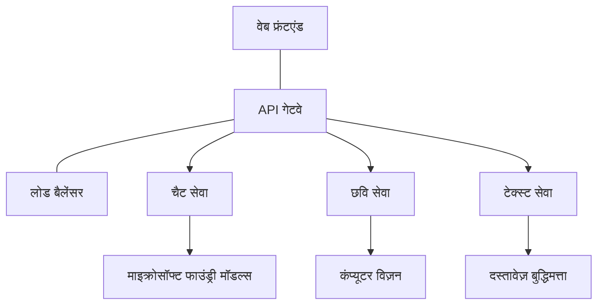

# AZD के साथ प्रोडक्शन AI वर्कलोड बेस्ट प्रैक्टिसेज

**अध्याय नेविगेशन:**
- **📚 Course Home**: [AZD For Beginners](../../README.md)
- **📖 Current Chapter**: अध्याय 8 - प्रोडक्शन और एंटरप्राइज़ पैटर्न
- **⬅️ Previous Chapter**: [Chapter 7: Troubleshooting](../chapter-07-troubleshooting/debugging.md)
- **⬅️ Also Related**: [AI Workshop Lab](ai-workshop-lab.md)
- **🎯 Course Complete**: [AZD For Beginners](../../README.md)

## अवलोकन

यह गाइड Azure Developer CLI (AZD) का उपयोग करके प्रोडक्शन-रेडी AI वर्कलोड को डिप्लॉय करने के लिए व्यापक सर्वश्रेष्ठ प्रथाएँ प्रदान करता है। Microsoft Foundry Discord समुदाय और वास्तविक-world ग्राहक डिप्लॉयमेंट से मिली फीडबैक के आधार पर, ये प्रथाएँ प्रोडक्शन AI सिस्टम में सबसे सामान्य चुनौतियों को संबोधित करती हैं।

## संबोधित प्रमुख चुनौतियाँ

हमारे समुदाय के पोल परिणामों के आधार पर, ये वे शीर्ष चुनौतियाँ हैं जिनका डेवलपर्स सामना करते हैं:

- **45%** मल्टी-सर्विस AI डिप्लॉयमेंट में कठिनाई का सामना करते हैं
- **38%** क्रेडेंशियल और सीक्रेट मैनेजमेंट में समस्याएँ है  
- **35%** प्रोडक्शन-रेडीनेस और स्केलिंग कठिन लगती है
- **32%** बेहतर कॉस्ट ऑप्टिमाइजेशन रणनीतियों की ज़रूरत है
- **29%** मॉनिटरिंग और ट्रबलशूटिंग में सुधार की आवश्यकता है

## प्रोडक्शन AI के लिए आर्किटेक्चर पैटर्न

### पैटर्न 1: माइक्रोसर्विसेज AI आर्किटेक्चर

**कब उपयोग करें**: बहु-कैपेबिलिटी वाले जटिल AI अनुप्रयोगों के लिए



**AZD इम्प्लीमेंटेशन**:

```yaml
# azure.yaml
name: enterprise-ai-platform
services:
  web:
    project: ./web
    host: staticwebapp
  api-gateway:
    project: ./api-gateway
    host: containerapp
  chat-service:
    project: ./services/chat
    host: containerapp
  vision-service:
    project: ./services/vision
    host: containerapp
  text-service:
    project: ./services/text
    host: containerapp
```

### पैटर्न 2: इवेंट-ड्रिवन AI प्रोसेसिंग

**कब उपयोग करें**: बैच प्रोसेसिंग, दस्तावेज़ विश्लेषण, असिंक वर्कफ़्लो

```bicep
// Event Hub for AI processing pipeline
resource eventHub 'Microsoft.EventHub/namespaces@2023-01-01-preview' = {
  name: eventHubNamespaceName
  location: location
  sku: {
    name: 'Standard'
    tier: 'Standard'
    capacity: 1
  }
}

// Service Bus for reliable message processing
resource serviceBus 'Microsoft.ServiceBus/namespaces@2022-10-01-preview' = {
  name: serviceBusNamespaceName
  location: location
  sku: {
    name: 'Premium'
    tier: 'Premium'
    capacity: 1
  }
}

// Function App for processing
resource functionApp 'Microsoft.Web/sites@2023-01-01' = {
  name: functionAppName
  location: location
  kind: 'functionapp,linux'
  properties: {
    siteConfig: {
      appSettings: [
        {
          name: 'FUNCTIONS_EXTENSION_VERSION'
          value: '~4'
        }
        {
          name: 'AZURE_OPENAI_ENDPOINT'
          value: '@Microsoft.KeyVault(VaultName=${keyVault.name};SecretName=openai-endpoint)'
        }
      ]
    }
  }
}
```

## AI एजेंट हेल्थ के बारे में सोचना

जब पारंपरिक वेब ऐप टूटता है, तो लक्षण परिचित होते हैं: एक पेज लोड नहीं होता, एक API त्रुटि लौटाता है, या एक डिप्लॉयमेंट विफल हो जाता है। AI-समर्थित एप्लिकेशन भी उन सभी तरीकों से टूट सकते हैं—लेकिन वे अधिक सूक्ष्म तरीकों से भी खराब व्यवहार कर सकते हैं जो स्पष्ट त्रुटि संदेश उत्पन्न नहीं करते।

यह अनुभाग आपको AI वर्कलोड की निगरानी के लिए एक मानसिक मॉडल बनाने में मदद करता है ताकि जब चीजें सही न लगे तो आप जानें कि कहाँ देखना है।

### एजेंट हेल्थ पारंपरिक ऐप हेल्थ से कैसे अलग है

एक पारंपरिक ऐप या तो काम करता है या नहीं करता। एक AI एजेंट काम करता प्रतीत हो सकता है पर खराब परिणाम दे सकता है। एजेंट हेल्थ को दो परतों में सोचें:

| Layer | What to Watch | Where to Look |
|-------|--------------|---------------|
| **Infrastructure health** | क्या सेवा चल रही है? क्या संसाधन प्रोविजन किए गए हैं? क्या एंडपॉइंट पहुंच योग्य हैं? | `azd monitor`, Azure Portal resource health, container/app logs |
| **Behavior health** | क्या एजेंट सही तरीके से उत्तर दे रहा है? क्या प्रतिक्रियाएँ समय पर हैं? क्या मॉडल को सही तरीके से कॉल किया जा रहा है? | Application Insights traces, model call latency metrics, response quality logs |

Infrastructure health परिचित है—यह किसी भी azd ऐप के लिए एक समान है। Behavior health वह नई परत है जिसे AI वर्कलोड पेश करते हैं।

### जब AI ऐप अपेक्षित व्यवहार नहीं करते तो कहाँ देखें

यदि आपका AI एप्लिकेशन अपेक्षित परिणाम नहीं दे रहा है, तो यहाँ एक वैचारिक चेकलिस्ट है:

1. **बुनियादी बातों से शुरू करें।** क्या ऐप चल रहा है? क्या यह अपनी dependencies तक पहुँच पा रहा है? किसी भी ऐप के लिए जैसे आप करते हैं, `azd monitor` और resource health चेक करें।
2. **मॉडल कनेक्शन चेक करें।** क्या आपका एप्लिकेशन सफलतापूर्वक AI मॉडल को कॉल कर रहा है? फेल या टाइमआउट हुए मॉडल कॉल AI ऐप समस्याओं का सबसे सामान्य कारण हैं और ये आपके एप्लिकेशन लॉग में दिखेंगे।
3. **देखें कि मॉडल ने क्या प्राप्त किया।** AI प्रतिक्रियाएँ इनपुट (प्रॉम्प्ट और कोई भी प्राप्त संदर्भ) पर निर्भर करती हैं। यदि आउटपुट गलत है, तो इनपुट सामान्यतः गलत होता है। जाँच करें कि क्या आपका एप्लिकेशन मॉडल को सही डेटा भेज रहा है।
4. **प्रतिक्रिया विलंबता की समीक्षा करें।** AI मॉडल कॉल सामान्य API कॉल की तुलना में धीमे होते हैं। यदि आपका ऐप सुस्त महसूस हो रहा है, तो जाँच करें कि क्या मॉडल प्रतिक्रिया समय बढ़ गया है—यह थ्रॉटलिंग, क्षमता सीमाएँ, या क्षेत्र-स्तरीय भीड़ को संकेत दे सकता है।
5. **कॉस्ट संकेतों पर नज़र रखें।** टोकन उपयोग या API कॉल्स में अप्रत्याशित वृद्धि यह संकेत दे सकती है कि कहीं लूप चल रहा है, प्रॉम्प्ट गलत कॉन्फ़िगर है, या अत्यधिक retries हो रहे हैं।

आपको तुरंत ऑब्ज़रवेबिलिटी टूलिंग में महारत हासिल करने की ज़रूरत नहीं है। प्रमुख बात यह है कि AI अनुप्रयोगों में मॉनिटर करने के लिए एक अतिरिक्त व्यवहार परत होती है, और azd का बिल्ट-इन मॉनिटरिंग (`azd monitor`) आपको दोनों परतों की जाँच शुरू करने के लिए एक प्रारम्भिक बिंदु देता है।

---

## सुरक्षा बेस्ट प्रैक्टिसेज

### 1. ज़ीरो-ट्रस्ट सुरक्षा मॉडल

**कार्यान्वयन रणनीति**:
- ऑथेंटिकेशन के बिना कोई सर्विस-टू-सर्विस कम्युनिकेशन नहीं
- सभी API कॉल्स में managed identities का उपयोग
- प्राइवेट एंडपॉइंट के साथ नेटवर्क आइसोलेशन
- न्यूनतम अधिकार (least privilege) एक्सेस कंट्रोल

```bicep
// Managed Identity for each service
resource chatServiceIdentity 'Microsoft.ManagedIdentity/userAssignedIdentities@2023-01-31' = {
  name: 'chat-service-identity'
  location: location
}

// Role assignments with minimal permissions
resource openAIUserRole 'Microsoft.Authorization/roleAssignments@2022-04-01' = {
  scope: openAIAccount
  name: guid(openAIAccount.id, chatServiceIdentity.id, openAIUserRoleDefinitionId)
  properties: {
    roleDefinitionId: subscriptionResourceId('Microsoft.Authorization/roleDefinitions', '5e0bd9bd-7b93-4f28-af87-19fc36ad61bd')
    principalId: chatServiceIdentity.properties.principalId
    principalType: 'ServicePrincipal'
  }
}
```

### 2. सुरक्षित सीक्रेट मैनेजमेंट

**Key Vault इंटीग्रेशन पैटर्न**:

```bicep
// Key Vault with proper access policies
resource keyVault 'Microsoft.KeyVault/vaults@2023-02-01' = {
  name: keyVaultName
  location: location
  properties: {
    tenantId: tenant().tenantId
    sku: {
      family: 'A'
      name: 'premium'  // Use premium for production
    }
    enableRbacAuthorization: true  // Use RBAC instead of access policies
    enablePurgeProtection: true    // Prevent accidental deletion
    enableSoftDelete: true
    softDeleteRetentionInDays: 90
  }
}

// Store all AI service credentials
resource openAIKeySecret 'Microsoft.KeyVault/vaults/secrets@2023-02-01' = {
  parent: keyVault
  name: 'openai-api-key'
  properties: {
    value: openAIAccount.listKeys().key1
    attributes: {
      enabled: true
    }
  }
}
```

### 3. नेटवर्क सुरक्षा

**प्राइवेट एंडपॉइंट कॉन्फ़िगरेशन**:

```bicep
// Virtual Network for AI services
resource virtualNetwork 'Microsoft.Network/virtualNetworks@2023-04-01' = {
  name: vnetName
  location: location
  properties: {
    addressSpace: {
      addressPrefixes: ['10.0.0.0/16']
    }
    subnets: [
      {
        name: 'ai-services-subnet'
        properties: {
          addressPrefix: '10.0.1.0/24'
          privateEndpointNetworkPolicies: 'Disabled'
        }
      }
      {
        name: 'app-services-subnet'
        properties: {
          addressPrefix: '10.0.2.0/24'
          delegations: [
            {
              name: 'Microsoft.Web/serverFarms'
              properties: {
                serviceName: 'Microsoft.Web/serverFarms'
              }
            }
          ]
        }
      }
    ]
  }
}

// Private endpoints for all AI services
resource openAIPrivateEndpoint 'Microsoft.Network/privateEndpoints@2023-04-01' = {
  name: '${openAIAccountName}-pe'
  location: location
  properties: {
    subnet: {
      id: virtualNetwork.properties.subnets[0].id
    }
    privateLinkServiceConnections: [
      {
        name: 'openai-connection'
        properties: {
          privateLinkServiceId: openAIAccount.id
          groupIds: ['account']
        }
      }
    ]
  }
}
```

## प्रदर्शन और स्केलिंग

### 1. ऑटो-स्केलिंग रणनीतियाँ

**Container Apps ऑटो-स्केलिंग**:

```bicep
resource containerApp 'Microsoft.App/containerApps@2023-05-01' = {
  name: containerAppName
  location: location
  properties: {
    configuration: {
      ingress: {
        external: true
        targetPort: 8000
        transport: 'http'
      }
    }
    template: {
      scale: {
        minReplicas: 2  // Always have 2 instances minimum
        maxReplicas: 50 // Scale up to 50 for high load
        rules: [
          {
            name: 'http-scaling'
            http: {
              metadata: {
                concurrentRequests: '20'  // Scale when >20 concurrent requests
              }
            }
          }
          {
            name: 'cpu-scaling'
            custom: {
              type: 'cpu'
              metadata: {
                type: 'Utilization'
                value: '70'  // Scale when CPU >70%
              }
            }
          }
        ]
      }
    }
  }
}
```

### 2. कैशिंग रणनीतियाँ

**AI प्रतिक्रियाओं के लिए Redis Cache**:

```bicep
// Redis Premium for production workloads
resource redisCache 'Microsoft.Cache/redis@2023-04-01' = {
  name: redisCacheName
  location: location
  properties: {
    sku: {
      name: 'Premium'
      family: 'P'
      capacity: 1
    }
    enableNonSslPort: false
    minimumTlsVersion: '1.2'
    redisConfiguration: {
      'maxmemory-policy': 'allkeys-lru'
    }
    // Enable clustering for high availability
    redisVersion: '6.0'
    shardCount: 2
  }
}

// Cache configuration in application
var cacheConnectionString = '${redisCache.properties.hostName}:6380,password=${redisCache.listKeys().primaryKey},ssl=True,abortConnect=False'
```

### 3. लोड बैलेंसिंग और ट्रैफ़िक मैनेजमेंट

**WAF के साथ Application Gateway**:

```bicep
// Application Gateway with Web Application Firewall
resource applicationGateway 'Microsoft.Network/applicationGateways@2023-04-01' = {
  name: appGatewayName
  location: location
  properties: {
    sku: {
      name: 'WAF_v2'
      tier: 'WAF_v2'
      capacity: 2
    }
    webApplicationFirewallConfiguration: {
      enabled: true
      firewallMode: 'Prevention'
      ruleSetType: 'OWASP'
      ruleSetVersion: '3.2'
    }
    // Backend pools for AI services
    backendAddressPools: [
      {
        name: 'ai-services-pool'
        properties: {
          backendAddresses: [
            {
              fqdn: '${containerApp.properties.configuration.ingress.fqdn}'
            }
          ]
        }
      }
    ]
  }
}
```

## 💰 लागत अनुकूलन

### 1. संसाधन का सही आकार निर्धारण

**पर्यावरण-विशिष्ट कॉन्फ़िगरेशन**:

```bash
# विकास वातावरण
azd env new development
azd env set AZURE_OPENAI_SKU "S0"
azd env set AZURE_OPENAI_CAPACITY 10
azd env set AZURE_SEARCH_SKU "basic"
azd env set CONTAINER_CPU 0.5
azd env set CONTAINER_MEMORY 1.0

# उत्पादन वातावरण
azd env new production
azd env set AZURE_OPENAI_SKU "S0"
azd env set AZURE_OPENAI_CAPACITY 100
azd env set AZURE_SEARCH_SKU "standard"
azd env set CONTAINER_CPU 2.0
azd env set CONTAINER_MEMORY 4.0
```

### 2. लागत मॉनिटरिंग और बजट

```bicep
// Cost management and budgets
resource budget 'Microsoft.Consumption/budgets@2023-05-01' = {
  name: 'ai-workload-budget'
  properties: {
    timePeriod: {
      startDate: '2024-01-01'
      endDate: '2024-12-31'
    }
    timeGrain: 'Monthly'
    amount: 2000  // $2000 monthly budget
    category: 'Cost'
    notifications: {
      warning: {
        enabled: true
        operator: 'GreaterThan'
        threshold: 80
        contactEmails: [
          'finance@company.com'
          'engineering@company.com'
        ]
        contactRoles: [
          'Owner'
          'Contributor'
        ]
      }
      critical: {
        enabled: true
        operator: 'GreaterThan'
        threshold: 95
        contactEmails: [
          'cto@company.com'
        ]
      }
    }
  }
}
```

### 3. टोकन उपयोग अनुकूलन

**OpenAI लागत प्रबंधन**:

```typescript
// एप्लिकेशन-स्तर टोकन अनुकूलन
class TokenOptimizer {
  private readonly maxTokens = 4000;
  private readonly reserveTokens = 500;
  
  optimizePrompt(userInput: string, context: string): string {
    const availableTokens = this.maxTokens - this.reserveTokens;
    const estimatedTokens = this.estimateTokens(userInput + context);
    
    if (estimatedTokens > availableTokens) {
      // संदर्भ को संक्षेप करें, उपयोगकर्ता इनपुट को नहीं
      context = this.truncateContext(context, availableTokens - this.estimateTokens(userInput));
    }
    
    return `${context}\n\nUser: ${userInput}`;
  }
  
  private estimateTokens(text: string): number {
    // मोटा अनुमान: 1 टोकन ≈ 4 वर्ण
    return Math.ceil(text.length / 4);
  }
}
```

## मॉनिटरिंग और ऑब्ज़रवेबिलिटी

### 1. व्यापक Application Insights

```bicep
// Application Insights with advanced features
resource applicationInsights 'Microsoft.Insights/components@2020-02-02' = {
  name: applicationInsightsName
  location: location
  kind: 'web'
  properties: {
    Application_Type: 'web'
    WorkspaceResourceId: logAnalyticsWorkspace.id
    SamplingPercentage: 100  // Full sampling for AI apps
    DisableIpMasking: false  // Enable for security
  }
}

// Custom metrics for AI operations
resource aiMetricAlerts 'Microsoft.Insights/metricAlerts@2018-03-01' = {
  name: 'ai-high-error-rate'
  location: 'global'
  properties: {
    description: 'Alert when AI service error rate is high'
    severity: 2
    enabled: true
    scopes: [
      applicationInsights.id
    ]
    evaluationFrequency: 'PT1M'
    windowSize: 'PT5M'
    criteria: {
      'odata.type': 'Microsoft.Azure.Monitor.SingleResourceMultipleMetricCriteria'
      allOf: [
        {
          name: 'high-error-rate'
          metricName: 'requests/failed'
          operator: 'GreaterThan'
          threshold: 10
          timeAggregation: 'Count'
        }
      ]
    }
  }
}
```

### 2. AI-विशिष्ट मॉनिटरिंग

**AI मेट्रिक्स के लिए कस्टम डैशबोर्ड**:

```json
// Dashboard configuration for AI workloads
{
  "dashboard": {
    "name": "AI Application Monitoring",
    "tiles": [
      {
        "name": "OpenAI Request Volume",
        "query": "requests | where name contains 'openai' | summarize count() by bin(timestamp, 5m)"
      },
      {
        "name": "AI Response Latency",
        "query": "requests | where name contains 'openai' | summarize avg(duration) by bin(timestamp, 5m)"
      },
      {
        "name": "Token Usage",
        "query": "customMetrics | where name == 'openai_tokens_used' | summarize sum(value) by bin(timestamp, 1h)"
      },
      {
        "name": "Cost per Hour",
        "query": "customMetrics | where name == 'openai_cost' | summarize sum(value) by bin(timestamp, 1h)"
      }
    ]
  }
}
```

### 3. हेल्थ चेक्स और अपटाइम मॉनिटरिंग

```bicep
// Application Insights availability tests
resource availabilityTest 'Microsoft.Insights/webtests@2022-06-15' = {
  name: 'ai-app-availability-test'
  location: location
  tags: {
    'hidden-link:${applicationInsights.id}': 'Resource'
  }
  properties: {
    SyntheticMonitorId: 'ai-app-availability-test'
    Name: 'AI Application Availability Test'
    Description: 'Tests AI application endpoints'
    Enabled: true
    Frequency: 300  // 5 minutes
    Timeout: 120    // 2 minutes
    Kind: 'ping'
    Locations: [
      {
        Id: 'us-east-2-azr'
      }
      {
        Id: 'us-west-2-azr'
      }
    ]
    Configuration: {
      WebTest: '''
        <WebTest Name="AI Health Check" 
                 Id="8d2de8d2-a2b0-4c2e-9a0d-8f9c9a0b8c8d" 
                 Enabled="True" 
                 CssProjectStructure="" 
                 CssIteration="" 
                 Timeout="120" 
                 WorkItemIds="" 
                 xmlns="http://microsoft.com/schemas/VisualStudio/TeamTest/2010" 
                 Description="" 
                 CredentialUserName="" 
                 CredentialPassword="" 
                 PreAuthenticate="True" 
                 Proxy="default" 
                 StopOnError="False" 
                 RecordedResultFile="" 
                 ResultsLocale="">
          <Items>
            <Request Method="GET" 
                     Guid="a5f10126-e4cd-570d-961c-cea43999a200" 
                     Version="1.1" 
                     Url="${webApp.properties.defaultHostName}/health" 
                     ThinkTime="0" 
                     Timeout="120" 
                     ParseDependentRequests="True" 
                     FollowRedirects="True" 
                     RecordResult="True" 
                     Cache="False" 
                     ResponseTimeGoal="0" 
                     Encoding="utf-8" 
                     ExpectedHttpStatusCode="200" 
                     ExpectedResponseUrl="" 
                     ReportingName="" 
                     IgnoreHttpStatusCode="False" />
          </Items>
        </WebTest>
      '''
    }
  }
}
```

## डिजास्टर रिकवरी और हाई अवेलेबिलिटी

### 1. मल्टी-रीजन डिप्लॉयमेंट

```yaml
# azure.yaml - Multi-region configuration
name: ai-app-multiregion
services:
  api-primary:
    project: ./api
    host: containerapp
    env:
      - AZURE_REGION=eastus
  api-secondary:
    project: ./api
    host: containerapp
    env:
      - AZURE_REGION=westus2
```

```bicep
// Traffic Manager for global load balancing
resource trafficManager 'Microsoft.Network/trafficManagerProfiles@2022-04-01' = {
  name: trafficManagerProfileName
  location: 'global'
  properties: {
    profileStatus: 'Enabled'
    trafficRoutingMethod: 'Priority'
    dnsConfig: {
      relativeName: trafficManagerProfileName
      ttl: 30
    }
    monitorConfig: {
      protocol: 'HTTPS'
      port: 443
      path: '/health'
      intervalInSeconds: 30
      toleratedNumberOfFailures: 3
      timeoutInSeconds: 10
    }
    endpoints: [
      {
        name: 'primary-endpoint'
        type: 'Microsoft.Network/trafficManagerProfiles/azureEndpoints'
        properties: {
          targetResourceId: primaryAppService.id
          endpointStatus: 'Enabled'
          priority: 1
        }
      }
      {
        name: 'secondary-endpoint'
        type: 'Microsoft.Network/trafficManagerProfiles/azureEndpoints'
        properties: {
          targetResourceId: secondaryAppService.id
          endpointStatus: 'Enabled'
          priority: 2
        }
      }
    ]
  }
}
```

### 2. डेटा बैकअप और रिकवरी

```bicep
// Backup configuration for critical data
resource backupVault 'Microsoft.DataProtection/backupVaults@2023-05-01' = {
  name: backupVaultName
  location: location
  identity: {
    type: 'SystemAssigned'
  }
  properties: {
    storageSettings: [
      {
        datastoreType: 'VaultStore'
        type: 'LocallyRedundant'
      }
    ]
  }
}

// Backup policy for AI models and data
resource backupPolicy 'Microsoft.DataProtection/backupVaults/backupPolicies@2023-05-01' = {
  parent: backupVault
  name: 'ai-data-backup-policy'
  properties: {
    policyRules: [
      {
        backupParameters: {
          backupType: 'Full'
          objectType: 'AzureBackupParams'
        }
        trigger: {
          schedule: {
            repeatingTimeIntervals: [
              'R/2024-01-01T02:00:00+00:00/P1D'  // Daily at 2 AM
            ]
          }
          objectType: 'ScheduleBasedTriggerContext'
        }
        dataStore: {
          datastoreType: 'VaultStore'
          objectType: 'DataStoreInfoBase'
        }
        name: 'BackupDaily'
        objectType: 'AzureBackupRule'
      }
    ]
  }
}
```

## DevOps और CI/CD इंटीग्रेशन

### 1. GitHub Actions वर्कफ़्लो

```yaml
# .github/workflows/deploy-ai-app.yml
name: Deploy AI Application

on:
  push:
    branches: [main]
  pull_request:
    branches: [main]

jobs:
  test:
    runs-on: ubuntu-latest
    steps:
      - uses: actions/checkout@v4
      
      - name: Setup Python
        uses: actions/setup-python@v4
        with:
          python-version: '3.11'
          
      - name: Install dependencies
        run: |
          pip install -r requirements.txt
          pip install pytest
          
      - name: Run tests
        run: pytest tests/
        
      - name: AI Safety Tests
        run: |
          python scripts/test_ai_safety.py
          python scripts/validate_prompts.py

  deploy-staging:
    needs: test
    if: github.event_name == 'pull_request'
    runs-on: ubuntu-latest
    steps:
      - uses: actions/checkout@v4
      
      - name: Setup AZD
        uses: Azure/setup-azd@v2
        
      - name: Login to Azure
        uses: azure/login@v1
        with:
          creds: ${{ secrets.AZURE_CREDENTIALS }}
          
      - name: Deploy to Staging
        run: |
          azd env select staging
          azd deploy

  deploy-production:
    needs: test
    if: github.ref == 'refs/heads/main'
    runs-on: ubuntu-latest
    steps:
      - uses: actions/checkout@v4
      
      - name: Setup AZD
        uses: Azure/setup-azd@v2
        
      - name: Login to Azure
        uses: azure/login@v1
        with:
          creds: ${{ secrets.AZURE_CREDENTIALS }}
          
      - name: Deploy to Production
        run: |
          azd env select production
          azd deploy
          
      - name: Run Production Health Checks
        run: |
          python scripts/health_check.py --env production
```

### 2. इन्फ्रास्ट्रक्चर वेलिडेशन

```bash
# scripts/validate_infrastructure.sh
#!/bin/bash

echo "Validating AI infrastructure deployment..."

# जाँचें कि सभी आवश्यक सेवाएँ चल रही हैं
services=("openai" "search" "storage" "keyvault")
for service in "${services[@]}"; do
    echo "Checking $service..."
    if ! az resource list --resource-type "Microsoft.CognitiveServices/accounts" --query "[?contains(name, '$service')]" -o tsv; then
        echo "ERROR: $service not found"
        exit 1
    fi
done

# OpenAI मॉडल तैनातियों को सत्यापित करें
echo "Validating OpenAI model deployments..."
models=$(az cognitiveservices account deployment list --name $AZURE_OPENAI_NAME --resource-group $AZURE_RESOURCE_GROUP --query "[].name" -o tsv)
if [[ ! $models == *"gpt-4.1-mini"* ]]; then
  echo "ERROR: Required model gpt-4.1-mini not deployed"
    exit 1
fi

# AI सेवा की कनेक्टिविटी का परीक्षण करें
echo "Testing AI service connectivity..."
python scripts/test_connectivity.py

echo "Infrastructure validation completed successfully!"
```

## प्रोडक्शन रेडिनेस चेकलिस्ट

### सुरक्षा ✅
- [ ] सभी सेवाएँ managed identities का उपयोग करती हैं
- [ ] सीक्रेट्स Key Vault में स्टोर किए गए हैं
- [ ] प्राइवेट एंडपॉइंट कॉन्फ़िगर किए गए हैं
- [ ] नेटवर्क सुरक्षा समूह लागू किए गए हैं
- [ ] न्यूनतम अधिकार के साथ RBAC
- [ ] सार्वजनिक एंडपॉइंट्स पर WAF सक्षम

### प्रदर्शन ✅
- [ ] ऑटो-स्केलिंग कॉन्फ़िगर किया गया
- [ ] कैशिंग लागू किया गया
- [ ] लोड बैलेंसिंग सेटअप
- [ ] स्थैतिक कंटेंट के लिए CDN
- [ ] डेटाबेस कनेक्शन पूलिंग
- [ ] टोकन उपयोग अनुकूलन

### मॉनिटरिंग ✅
- [ ] Application Insights कॉन्फ़िगर किया गया
- [ ] कस्टम मेट्रिक्स परिभाषित
- [ ] अलर्टिंग नियम सेटअप
- [ ] डैशबोर्ड बनाया गया
- [ ] हेल्थ चेक्स लागू किए गए
- [ ] लॉग रिटेंशन नीतियाँ

### विश्वसनीयता ✅
- [ ] मल्टी-रीजन डिप्लॉयमेंट
- [ ] बैकअप और रिकवरी योजना
- [ ] सर्किट ब्रेकर्स लागू
- [ ] रीट्राई नीतियाँ कॉन्फ़िगर
- [ ] ग्रेसफुल डीग्रेडेशन
- [ ] हेल्थ चेक एंडपॉइंट्स

### लागत प्रबंधन ✅
- [ ] बजट अलर्ट कॉन्फ़िगर
- [ ] संसाधन का सही आकार निर्धारण
- [ ] Dev/test छूट लागू
- [ ] Reserved instances खरीदे गए
- [ ] लागत मॉनिटरिंग डैशबोर्ड
- [ ] नियमित लागत समीक्षा

### अनुपालन ✅
- [ ] डेटा निवासी आवश्यकता पूरी
- [ ] ऑडिट लॉगिंग सक्षम
- [ ] अनुपालन नीतियाँ लागू
- [ ] सुरक्षा बेसलाइन्स लागू
- [ ] नियमित सुरक्षा आकलन
- [ ] घटना प्रतिक्रिया योजना

## प्रदर्शन बेंचमार्क

### सामान्य प्रोडक्शन मेट्रिक्स

| Metric | Target | Monitoring |
|--------|--------|------------|
| **Response Time** | < 2 seconds | Application Insights |
| **Availability** | 99.9% | Uptime monitoring |
| **Error Rate** | < 0.1% | Application logs |
| **Token Usage** | < $500/month | Cost management |
| **Concurrent Users** | 1000+ | Load testing |
| **Recovery Time** | < 1 hour | Disaster recovery tests |

### लोड टेस्टिंग

```bash
# एआई अनुप्रयोगों के लिए लोड परीक्षण स्क्रिप्ट
python scripts/load_test.py \
  --endpoint https://your-ai-app.azurewebsites.net \
  --concurrent-users 100 \
  --duration 300 \
  --ramp-up 60
```

## 🤝 समुदाय की बेस्ट प्रैक्टिसेज

Microsoft Foundry Discord समुदाय के फीडबैक के आधार पर:

### समुदाय से शीर्ष सिफारिशें:

1. **छोटे से शुरू करें, धीरे-धीरे स्केल करें**: बुनियादी SKUs के साथ शुरू करें और वास्तविक उपयोग के आधार पर स्केल करें
2. **सब कुछ मॉनिटर करें**: पहले दिन से व्यापक मॉनिटरिंग सेट करें
3. **सुरक्षा को ऑटोमेट करें**: सुसंगत सुरक्षा के लिए infrastructure as code का उपयोग करें
4. **ठीक से टेस्ट करें**: अपने पाइपलाइन में AI-विशिष्ट टेस्टिंग शामिल करें
5. **लागत की योजना बनाएं**: टोकन उपयोग मॉनिटर करें और जल्दी से बजट अलर्ट सेट करें

### सामान्य गलतियाँ जो बचनी चाहिए:

- ❌ कोड में API कीज हार्डकोड करना
- ❌ उचित मॉनिटरिंग न सेट करना
- ❌ लागत अनुकूलन की अनदेखी करना
- ❌ फेलियर परिदृश्यों का परीक्षण न करना
- ❌ हेल्थ चेक्स के बिना डिप्लॉय करना

## AZD AI CLI कमांड और एक्सटेंशन

AZD में AI-विशिष्ट कमांड और एक्सटेंशन्स का एक बढ़ता सेट शामिल है जो प्रोडक्शन AI वर्कफ़्लो को सुगम बनाता है। ये टूल लोकल डेवलपमेंट और प्रोडक्शन डिप्लॉयमेंट के बीच के अंतर को पाटते हैं।

### AI के लिए AZD एक्सटेंशन्स

AZD AI-विशिष्ट क्षमताएँ जोड़ने के लिए एक एक्सटेंशन सिस्टम का उपयोग करता है। इंस्टॉल और प्रबंधित करने के लिए:

```bash
# सभी उपलब्ध एक्सटेंशन सूचीबद्ध करें (AI सहित)
azd extension list

# इंस्टॉल किए गए एक्सटेंशन के विवरण जाँचें
azd extension show azure.ai.agents

# Foundry agents एक्सटेंशन इंस्टॉल करें
azd extension install azure.ai.agents

# फाइन-ट्यूनिंग एक्सटेंशन इंस्टॉल करें
azd extension install azure.ai.finetune

# कस्टम मॉडल्स एक्सटेंशन इंस्टॉल करें
azd extension install azure.ai.models

# सभी इंस्टॉल किए गए एक्सटेंशनों को अपग्रेड करें
azd extension upgrade --all
```

**उपलब्ध AI एक्सटेंशन्स:**

| Extension | Purpose | Status |
|-----------|---------|--------|
| `azure.ai.agents` | Foundry Agent Service प्रबंधन | Preview |
| `azure.ai.skills` | पुन: उपयोग करने योग्य एजेंट स्किल्स | Preview |
| `azure.ai.connections` | Foundry connections (डेटा स्रोत, टूल्स) | Preview |
| `azure.ai.finetune` | Foundry मॉडल फाइन-ट्यूनिंग | Preview |
| `azure.ai.models` | Foundry कस्टम मॉडल्स | Preview |
| `azure.coding-agent` | Coding agent कॉन्फ़िगरेशन | Available |

> `azure.ai.agents` एक्सटेंशन तेज़ी से विकसित हो रहा है। यह कोर्स `0.1.40-preview` के खिलाफ मान्य है। नवीनतम कमांड सेट लेने के लिए `azd extension upgrade --all` चलाएँ, और अपने इंस्टॉल किए गए संस्करण की पुष्टि करने के लिए `azd extension show azure.ai.agents` चलाएँ।

**नए `skills` और `connections` एक्सटेंशन्स क्या हैं?**

एजेंट टूलिंग के साथ दो प्रीव्यू एक्सटेंशन्स दिखाई दिए और शुरुआती के रूप में भी इन्हें समझना उपयोगी है:

- **`azure.ai.skills`** — एक **skill** एक पुन: उपयोग योग्य क्षमता है (एक पैकेज्ड टूल या व्यवहार) जिसे आप हर बार फिर से लागू करने के बजाय एक या अधिक एजेंट्स से जोड़ सकते हैं। इसे एक साझा बिल्डिंग ब्लॉक के रूप में सोचें: एक "डॉक्स में खोज" या "ऑर्डर देखें" स्किल को एक बार परिभाषित करें, फिर एजेंट्स में पुनः उपयोग करें। यह मल्टी-एजेंट सिस्टम (अध्याय 5) को सुसंगत रखता है और कॉपी-पेस्ट से बचता है।
- **`azure.ai.connections`** — एक **connection** आपके Foundry प्रोजेक्ट से उस बाहरी संसाधन तक एक प्रबंधित लिंक है जिसकी आपकी एजेंट्स को ज़रूरत है—एक डेटा स्रोत (जैसे Azure AI Search), एक टूल एंडपॉइंट, या कोई अन्य सेवा। Connections यह केंद्रीकृत करते हैं कि एजेंट्स डेटा तक *कहाँ* और *कैसे* पहुँचते हैं, ताकि क्रेडेंशियल्स और एंडपॉइंट्स कोड में बिखरे होने के बजाय एक नियंत्रित स्थान में रहे।

पहले एजेंट्स को डिप्लॉय करने के लिए ये ज़रूरी नहीं हैं— सीखते समय `azure.ai.agents` पर बने रहें। जब आप पाते हैं कि आप एक ही टूल को कई एजेंट्स में डुप्लिकेट कर रहे हैं तो `skills` का उपयोग करें, और जब कई एजेंट्स एक ही डेटा स्रोत साझा करते हों तो `connections` का उपयोग करें।

### `azd ai agent init` से एजेंट प्रोजेक्ट्स इनिशियलाइज़ करना

`azd ai agent init` कमांड Microsoft Foundry Agent Service के साथ इंटीग्रेटेड प्रोडक्शन-रेडी AI एजेंट प्रोजेक्ट का स्कैफ़ोल्ड करता है:

```bash
# एजेंट मैनिफेस्ट से नया एजेंट प्रोजेक्ट आरंभ करें
azd ai agent init -m <manifest-path-or-uri>

# एक विशिष्ट Foundry प्रोजेक्ट आरंभ करें और उसे लक्षित करें
azd ai agent init -m agent-manifest.yaml --project-id <foundry-project-id>

# कस्टम स्रोत निर्देशिका के साथ आरंभ करें
azd ai agent init -m agent-manifest.yaml --src ./agents/my-agent

# होस्ट के रूप में Container Apps को लक्षित करें
azd ai agent init -m agent-manifest.yaml --host containerapp
```

**मुख्य फ्लैग्स:**

| Flag | Description |
|------|-------------|
| `-m, --manifest` | अपने प्रोजेक्ट में जोड़ने के लिए एजेंट मैनिफेस्ट का पाथ या URI |
| `-p, --project-id` | आपके azd वातावरण के लिए मौजूदा Microsoft Foundry Project ID |
| `-s, --src` | एजेंट परिभाषा डाउनलोड करने के लिए डायरेक्टरी (डिफ़ॉल्ट `src/<agent-id>`) |
| `--host` | डिफ़ॉल्ट होस्ट ओवरराइड करें (उदा., `containerapp`) |
| `-e, --environment` | उपयोग करने के लिए azd वातावरण |

**प्रोडक्शन टिप**: `--project-id` का उपयोग करके सीधे किसी मौजूदा Foundry प्रोजेक्ट से कनेक्ट करें, जिससे आपकी एजेंट कोड और क्लाउड संसाधन शुरू से ही जुड़े रहें।

### एजेंट लाइफ़साइकल का प्रबंधन

`init` के अलावा, `azure.ai.agents` एक्सटेंशन होस्टेड एजेंट के पूरे लाइफ़साइकल—टेस्टिंग, मूल्यांकन, अनुकूलन, और रिटायर करने—के लिए कमांड प्रदान करता है:

```bash
# तैनात एजेंट को कॉल करें और सर्वर प्रतिक्रिया का समय देखें
# (कुल विलंबता और पहले बाइट तक का समय)
azd ai agent invoke

# बदलने से पहले लाइव एंडपॉइंट कॉन्फ़िगरेशन दिखाएँ
azd ai agent endpoint show

# एजेंट के लिए मूल्यांकन डेटासेट जनरेट करें
azd ai agent eval generate --dataset ./eval/dataset.jsonl

# अपने मूल्यांकन डेटा के खिलाफ एजेंट निर्देशों को अनुकूलित करें
# (एजेंट प्रोजेक्ट में एक optimization_model आवश्यक है)
azd ai agent optimize

# कोड-आधारित होस्टेड एजेंट का तैनात स्रोत डाउनलोड करें
# (SHA-256 सत्यापन के साथ)
azd ai agent code download

# एक होस्टेड एजेंट और इसके सभी संस्करण हटाएँ
# (--force सक्रिय सत्रों को समाप्त कर देता है)
azd ai agent delete --force
```

**लाइफ़साइकल एक नजर में:**

| Stage | Command | Production use |
|-------|---------|----------------|
| Test | `azd ai agent invoke` | रिलीज़ से पहले प्रतिक्रियाओं को मान्य करें और लेटेंसी मापें |
| Inspect | `azd ai agent endpoint show` | एंडपॉइंट ऑथ/कॉन्फ़िग की समीक्षा; ब्रेकिंग बदलाव जल्दी देखें |
| Measure | `azd ai agent eval generate` | वास्तविक ट्रेसेस से एक दोहराने योग्य मूल्यांकन सेट बनाएं |
| Improve | `azd ai agent optimize` | मापी गई गुणवत्ता के खिलाफ निर्देशों को ट्यून करें |
| Recover | `azd ai agent code download` | ऑडिट/रोलबैक के लिए सटीक तैनात स्रोत पुनः प्राप्त करें |
| Retire | `azd ai agent delete --force` | एक एजेंट और उसकी वर्ज़न्स को साफ़ तौर पर teardown करें |

> ये प्रीव्यू कमांड्स हैं और एक्सटेंशन रिलीज़ के बीच बदल सकती हैं। अपने इंस्टॉल किए गए संस्करण में उपलब्ध सटीक सबकमांड देखने के लिए `azd ai agent --help` चलाएँ।

### Model Context Protocol (MCP) और `azd mcp`
AZD में बिल्ट-इन MCP सर्वर समर्थन (Alpha) शामिल है, जो AI एजेंट्स और टूल्स को एक मानकीकृत प्रोटोकॉल के माध्यम से आपके Azure संसाधनों के साथ इंटरैक्ट करने में सक्षम बनाता है:

```bash
# अपने प्रोजेक्ट के लिए MCP सर्वर शुरू करें
azd mcp start

# टूल निष्पादन के लिए वर्तमान Copilot सहमति नियमों की समीक्षा करें
azd copilot consent list
```

MCP सर्वर आपके azd प्रोजेक्ट संदर्भ—environments, services, और Azure resources—को AI-संचालित डेवलपमेंट टूल्स के लिए एक्सपोज़ करता है। इससे सक्षम होता है:

- **AI-assisted deployment**: कोडिंग एजेंट्स को आपके प्रोजेक्ट की स्थिति क्वेरी करने और deployments ट्रिगर करने दें
- **Resource discovery**: AI टूल्स यह खोज सकते हैं कि आपका प्रोजेक्ट कौन से Azure संसाधनों का उपयोग करता है
- **Environment management**: एजेंट्स dev/staging/production environments के बीच स्विच कर सकते हैं

### Infrastructure Generation with `azd infra generate`

Production AI workloads के लिए, आप स्वचालित provisioning पर निर्भर रहने के बजाय Infrastructure as Code जनरेट और कस्टमाइज़ कर सकते हैं:

```bash
# अपनी परियोजना की परिभाषा के आधार पर Bicep/Terraform फ़ाइलें बनाएँ
azd infra generate
```

यह IaC को डिस्क पर लिखता है ताकि आप:
- डिप्लॉय करने से पहले infrastructure की समीक्षा और ऑडिट कर सकें
- कस्टम सुरक्षा नीतियाँ जोड़ सकें (network rules, private endpoints)
- मौजूदा IaC रिव्यू प्रक्रियाओं के साथ इंटीग्रेट कर सकें
- application code से अलग infrastructure बदलावों को version control कर सकें

### Production Lifecycle Hooks

AZD hooks आपको deployment lifecycle के हर चरण में कस्टम लॉजिक इंजेक्ट करने देते हैं—जो production AI वर्कफ़्लो के लिए महत्वपूर्ण है:

```yaml
# azure.yaml - Production hooks example
name: ai-production-app
hooks:
  preprovision:
    shell: sh
    run: scripts/validate-quotas.sh    # Check AI model quota before provisioning
  postprovision:
    shell: sh
    run: scripts/configure-networking.sh  # Set up private endpoints
  predeploy:
    shell: sh
    run: scripts/run-ai-safety-tests.sh  # Run prompt safety checks
  postdeploy:
    shell: sh
    run: scripts/smoke-test.sh           # Verify agent responses post-deploy
services:
  agent-api:
    project: ./src/agent
    host: containerapp
    hooks:
      predeploy:
        shell: sh
        run: scripts/validate-model-access.sh  # Per-service hook
```

```bash
# डेवलपमेंट के दौरान किसी विशिष्ट हुक को मैन्युअल रूप से चलाएँ
azd hooks run predeploy
```

**AI workloads के लिए सुझाए गए production hooks:**

| Hook | Use Case |
|------|----------|
| `preprovision` | AI मॉडल क्षमता के लिए subscription quotas को सत्यापित करना |
| `postprovision` | private endpoints कॉन्फ़िगर करना, मॉडल वेट्स डिप्लॉय करना |
| `predeploy` | AI सुरक्षा परीक्षण चलाना, prompt टेम्पलेट्स को मान्य करना |
| `postdeploy` | एजेंट प्रतिक्रियाओं का smoke test करना, मॉडल कनेक्टिविटी सत्यापित करना |

### CI/CD Pipeline Configuration

Use `azd pipeline config` अपने प्रोजेक्ट को GitHub Actions या Azure Pipelines से सुरक्षित Azure authentication के साथ कनेक्ट करने के लिए उपयोग करें:

```bash
# CI/CD पाइपलाइन कॉन्फ़िगर करें (इंटरएक्टिव)
azd pipeline config

# किसी विशिष्ट प्रदाता के साथ कॉन्फ़िगर करें
azd pipeline config --provider github
```

यह कमांड:
- सबसे कम-विशेषाधिकार एक्सेस के साथ एक service principal बनाता है
- federated credentials (कोई संग्रहीत secrets नहीं) कॉन्फ़िगर करता है
- आपके pipeline definition फ़ाइल को जनरेट या अपडेट करता है
- आपके CI/CD सिस्टम में आवश्यक environment variables सेट करता है

#### Step-by-step: your first GitHub Actions pipeline

यहां एक काम करने वाले azd प्रोजेक्ट से हर push पर automated deployments तक पूरा वॉकथ्रू दिया गया है।

**1. Make sure your project is on GitHub**

```bash
git init
git add .
git commit -m "Initial azd project"
gh repo create my-ai-app --private --source=. --push
```

**2. Run pipeline config**

```bash
azd pipeline config --provider github
```

azd, इंटरैक्टिव रूप से:
- किस Azure subscription और environment को target करना है, यह पूछेगा
- pipeline के लिए Entra **app registration + service principal** बनाएगा
- **federated credentials (OIDC)** सेट अप करेगा—ताकि GitHub शॉर्ट-लाइव्ड टोकन्स के साथ Azure को ऑथेंटिकेट करे और **कोई secrets संग्रहीत न हों**
- आवश्यक **variables** को आपके GitHub repo में पुश करेगा (`AZURE_CLIENT_ID`, `AZURE_TENANT_ID`, `AZURE_SUBSCRIPTION_ID`, `AZURE_ENV_NAME`, `AZURE_LOCATION`)

**3. Understand the generated workflow**

azd `.github/workflows/azure-dev.yml` जोड़ता है। मुख्य हिस्से इस प्रकार दिखते हैं:

```yaml
# .github/workflows/azure-dev.yml
on:
  push:
    branches: [ main ]
  workflow_dispatch:        # lets you run it manually too

permissions:
  id-token: write           # required for OIDC federated login
  contents: read

jobs:
  build:
    runs-on: ubuntu-latest
    env:
      AZURE_CLIENT_ID: ${{ vars.AZURE_CLIENT_ID }}
      AZURE_TENANT_ID: ${{ vars.AZURE_TENANT_ID }}
      AZURE_SUBSCRIPTION_ID: ${{ vars.AZURE_SUBSCRIPTION_ID }}
      AZURE_ENV_NAME: ${{ vars.AZURE_ENV_NAME }}
      AZURE_LOCATION: ${{ vars.AZURE_LOCATION }}
    steps:
      - uses: actions/checkout@v4
      - name: Install azd
        uses: Azure/setup-azd@v2
      - name: Log in with OIDC
        run: azd auth login --client-id "$AZURE_CLIENT_ID" --federated-credential-provider "github" --tenant-id "$AZURE_TENANT_ID"
      - name: Provision infrastructure
        run: azd provision --no-prompt
      - name: Deploy application
        run: azd deploy --no-prompt
```

**4. Verify it works**

```bash
# पाइपलाइन को ट्रिगर करने के लिए बदलाव पुश करें
git commit -am "Trigger pipeline" --allow-empty
git push
```

अपने GitHub repo में **Actions** टैब खोलें और वॉच करें कि workflow अपने आप `azd provision` और `azd deploy` रन करता है।

> **Why federated credentials matter:** पुराने pipelines GitHub में एक client secret स्टोर करते थे। OIDC federated credentials उस secret को पूरी तरह हटा देते हैं—GitHub रनटाइम पर एक short-lived टोकन रिक्वेस्ट करता है, जो अधिक सुरक्षित है और घुमाने या लीक होने की चिंता नहीं रहती। यह वही डिफ़ॉल्ट सेटअप है जो `azd pipeline config` बनाता है।

> **Secrets vs. variables:** non-sensitive पहचानकर्ता (`AZURE_CLIENT_ID`, आदि) repo **variables** में जाते हैं। अगर आपकी app को build समय पर वास्तव में किसी secret की आवश्यकता है, तो उसे GitHub **secret** के रूप में जोड़ें और `${{ secrets.NAME }}` के साथ रेफरेंस करें—पर runtime में Key Vault + managed identity को प्राथमिकता दें (देखें [अध्याय 3](../chapter-03-configuration/authsecurity.md))।

**Pipeline config के साथ production workflow:**

```bash
# 1. उत्पादन वातावरण सेट करें
azd env new production
azd env set AZURE_OPENAI_CAPACITY 100

# 2. पाइपलाइन कॉन्फ़िगर करें
azd pipeline config --provider github

# 3. पाइपलाइन main में हर पुश पर azd deploy चलाती है
```

#### Step-by-step: Azure DevOps Pipelines

GitHub Actions की जगह Azure DevOps पसंद करते हैं? azd ने इसे `azdo` provider के साथ नेटिवली सपोर्ट किया है। फ्लो लगभग एक जैसा है—azd pipeline फ़ाइल जनरेट करता है, एक service connection बनाता है, और authentication को वायर करता है।

**1. Make sure you have an Azure DevOps project**

आपको `https://dev.azure.com/<your-org>` पर एक organization और एक project चाहिए। Personal Access Token (PAT) जनरेट करें जिसमें **Build (Read & execute)**, **Code (Read & write)**, और **Service Connections (Read, query & manage)** स्कोप हों—azd इसके लिए आपसे प्रॉम्प्ट करेगा।

**2. Configure the pipeline**

```bash
azd pipeline config --provider azdo
```

azd:
- आपके Azure DevOps संगठन और प्रोजेक्ट के लिए पूछेगा
- Azure के लिए एक **service connection** बनाएगा (या reuse करेगा) जो service principal का उपयोग करता है
- कोई client secret स्टोर न हो इसके लिए **workload identity federation (OIDC)** कॉन्फ़िगर करेगा
- आपके repo में `azure-dev.yml` pipeline definition commit करेगा

**3. Review the generated `azure-dev.yml`**

azd एक pipeline लिखता है जो हर push पर `main` पर provision और deploy करता है:

```yaml
# azure-dev.yml
trigger:
  - main

pool:
  vmImage: ubuntu-latest

steps:
  - task: setup-azd@1
    displayName: Install azd

  - script: azd provision --no-prompt
    displayName: Provision Infrastructure
    env:
      AZURE_SUBSCRIPTION_ID: $(AZURE_SUBSCRIPTION_ID)
      AZURE_ENV_NAME: $(AZURE_ENV_NAME)
      AZURE_LOCATION: $(AZURE_LOCATION)

  - script: azd deploy --no-prompt
    displayName: Deploy Application
    env:
      AZURE_SUBSCRIPTION_ID: $(AZURE_SUBSCRIPTION_ID)
      AZURE_ENV_NAME: $(AZURE_ENV_NAME)
      AZURE_LOCATION: $(AZURE_LOCATION)
```

**4. Where the variables come from**

azd environment मान (`AZURE_ENV_NAME`, `AZURE_LOCATION`, `AZURE_SUBSCRIPTION_ID`) को Azure DevOps में एक **variable group** के रूप में स्टोर करता है ताकि pipeline उन्हें पढ़ सके। आप इन्हें **Pipelines → Library** के अंतर्गत देख और संपादित कर सकते हैं।

> **Same OIDC benefit as GitHub:** `azdo` provider भी डिफ़ॉल्ट रूप से workload identity federation कॉन्फ़िगर करता है, इसलिए service connection में कोई client secret नहीं स्टोर होता—Azure DevOps रनटाइम पर एक short-lived टोकन एक्सचेंज करता है। केवल तब `--auth-type client-credentials` पास करें जब आपका संगठन अभी OIDC का उपयोग नहीं कर सकता।

**5. Run it**

```bash
git commit -am "Add Azure DevOps pipeline" --allow-empty
git push
```

Azure DevOps में **Pipelines** खोलें और देखें कि `azd provision` और `azd deploy` कैसे रन होते हैं।

### Adding Components with `azd add`

एक मौजूदा प्रोजेक्ट में क्रमिक रूप से Azure सेवाएँ जोड़ें:

```bash
# इंटरैक्टिव रूप से एक नया सेवा घटक जोड़ें
azd add
```

यह production AI एप्लिकेशन को विस्तार देने के लिए विशेष रूप से उपयोगी है—उदाहरण के लिए, एक vector search service जोड़ना, एक नया agent endpoint, या मौजूदा डिप्लॉयमेंट में एक monitoring component जोड़ना।

## Additional Resources

- **Azure Well-Architected Framework**: [AI workload guidance](https://learn.microsoft.com/azure/well-architected/ai/)
- **Microsoft Foundry Documentation**: [Official docs](https://learn.microsoft.com/azure/ai-studio/)
- **Community Templates**: [Azure Samples](https://github.com/Azure-Samples)
- **Discord Community**: [#Azure channel](https://discord.gg/microsoft-azure)
- **Agent Skills for Azure**: [microsoft/github-copilot-for-azure on skills.sh](https://skills.sh/microsoft/github-copilot-for-azure) - Azure AI, Foundry, deployment, cost optimization, और diagnostics के लिए 37 ओपन agent skills। अपने एडिटर में इंस्टॉल करें:
  ```bash
  npx skills add microsoft/github-copilot-for-azure
  ```

---

**Chapter Navigation:**
- **📚 Course Home**: [AZD For Beginners](../../README.md)
- **📖 Current Chapter**: Chapter 8 - Production & Enterprise Patterns
- **⬅️ Previous Chapter**: [Chapter 7: Troubleshooting](../chapter-07-troubleshooting/debugging.md)
- **⬅️ Also Related**: [AI Workshop Lab](ai-workshop-lab.md)
- **� Course Complete**: [AZD For Beginners](../../README.md)

**याद रखें**: Production AI workloads के लिए सावधानीपूर्वक योजना, मॉनिटरिंग, और निरंतर अनुकूलन आवश्यक है। इन पैटर्न्स के साथ शुरुआत करें और इन्हें अपनी विशिष्ट आवश्यकताओं के अनुसार अनुकूलित करें।

---

<!-- CO-OP TRANSLATOR DISCLAIMER START -->
**अस्वीकरण**:
इस दस्तावेज़ का अनुवाद AI अनुवाद सेवा [Co-op Translator](https://github.com/Azure/co-op-translator) का उपयोग करके किया गया है। जबकि हम सटीकता के लिए प्रयास करते हैं, कृपया ध्यान दें कि स्वचालित अनुवादों में त्रुटियाँ या अशुद्धियाँ हो सकती हैं। मूल दस्तावेज़ अपनी मूल भाषा में ही प्रामाणिक स्रोत माना जाना चाहिए। महत्वपूर्ण जानकारी के लिए, पेशेवर मानव अनुवाद की सिफारिश की जाती है। इस अनुवाद के उपयोग से उत्पन्न किसी भी गलतफहमी या गलत व्याख्या के लिए हम उत्तरदायी नहीं हैं।
<!-- CO-OP TRANSLATOR DISCLAIMER END -->