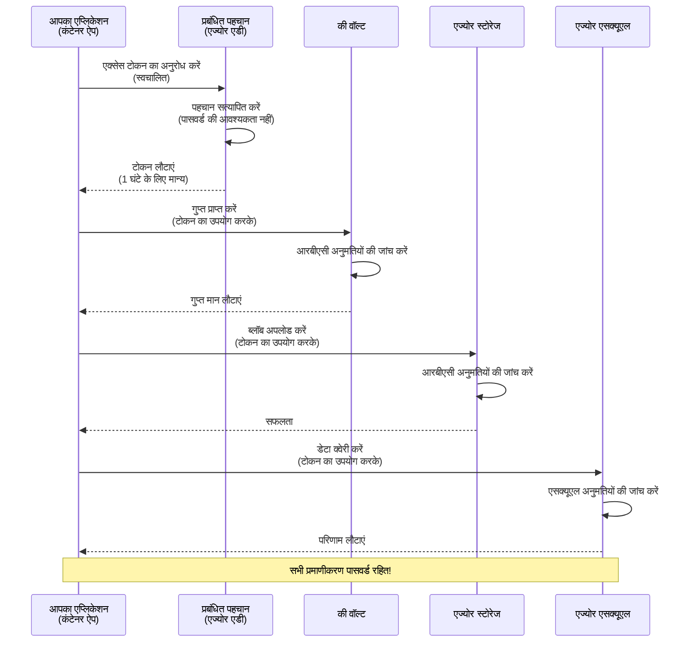
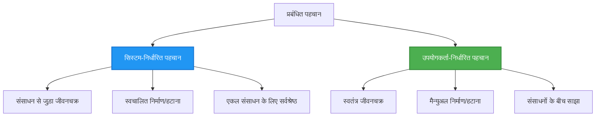

<!--
CO_OP_TRANSLATOR_METADATA:
{
  "original_hash": "e13ff6e1197e0a7462ed0aede7df9f23",
  "translation_date": "2025-11-20T03:04:56+00:00",
  "source_file": "docs/getting-started/authsecurity.md",
  "language_code": "hi"
}
-->
# प्रमाणीकरण पैटर्न और प्रबंधित पहचान

⏱️ **अनुमानित समय**: 45-60 मिनट | 💰 **लागत प्रभाव**: मुफ्त (कोई अतिरिक्त शुल्क नहीं) | ⭐ **जटिलता**: मध्यम

**📚 सीखने का मार्ग:**
- ← पिछला: [कॉन्फ़िगरेशन प्रबंधन](configuration.md) - पर्यावरण चर और रहस्यों का प्रबंधन
- 🎯 **आप यहाँ हैं**: प्रमाणीकरण और सुरक्षा (प्रबंधित पहचान, की वॉल्ट, सुरक्षित पैटर्न)
- → अगला: [पहला प्रोजेक्ट](first-project.md) - अपना पहला AZD एप्लिकेशन बनाएं
- 🏠 [कोर्स होम](../../README.md)

---

## आप क्या सीखेंगे

इस पाठ को पूरा करके, आप:
- Azure प्रमाणीकरण पैटर्न (कुंजी, कनेक्शन स्ट्रिंग्स, प्रबंधित पहचान) को समझेंगे
- **प्रबंधित पहचान** को पासवर्ड रहित प्रमाणीकरण के लिए लागू करेंगे
- **Azure Key Vault** एकीकरण के साथ रहस्यों को सुरक्षित करेंगे
- AZD परिनियोजन के लिए **भूमिका-आधारित पहुंच नियंत्रण (RBAC)** कॉन्फ़िगर करेंगे
- कंटेनर ऐप्स और Azure सेवाओं में सुरक्षा सर्वोत्तम प्रथाओं को लागू करेंगे
- कुंजी-आधारित से पहचान-आधारित प्रमाणीकरण में माइग्रेट करेंगे

## प्रबंधित पहचान क्यों महत्वपूर्ण है

### समस्या: पारंपरिक प्रमाणीकरण

**प्रबंधित पहचान से पहले:**
```javascript
// ❌ सुरक्षा जोखिम: कोड में हार्डकोडेड सीक्रेट्स
const connectionString = "Server=mydb.database.windows.net;User=admin;Password=P@ssw0rd123";
const storageKey = "xK7mN9pQ2wR5tY8uI0oP3aS6dF1gH4jK...";
const cosmosKey = "C2x7B9n4M1p8Q5w3E6r0T2y5U8i1O4p7...";
```

**समस्याएँ:**
- 🔴 **कोड, कॉन्फ़िगरेशन फ़ाइलों, पर्यावरण चर में उजागर रहस्य**
- 🔴 **क्रेडेंशियल रोटेशन** के लिए कोड परिवर्तन और पुनः परिनियोजन की आवश्यकता होती है
- 🔴 **ऑडिट की समस्याएँ** - किसने क्या, कब एक्सेस किया?
- 🔴 **बिखराव** - कई सिस्टम में फैले रहस्य
- 🔴 **अनुपालन जोखिम** - सुरक्षा ऑडिट में विफल

### समाधान: प्रबंधित पहचान

**प्रबंधित पहचान के बाद:**
```javascript
// ✅ सुरक्षित: कोड में कोई रहस्य नहीं
const credential = new DefaultAzureCredential();
const client = new BlobServiceClient(
  "https://mystorageaccount.blob.core.windows.net",
  credential  // Azure स्वचालित रूप से प्रमाणीकरण संभालता है
);
```

**लाभ:**
- ✅ **कोड या कॉन्फ़िगरेशन में कोई रहस्य नहीं**
- ✅ **स्वचालित रोटेशन** - Azure इसे संभालता है
- ✅ **पूर्ण ऑडिट ट्रेल** Azure AD लॉग्स में
- ✅ **केंद्रीकृत सुरक्षा** - Azure पोर्टल में प्रबंधन
- ✅ **अनुपालन तैयार** - सुरक्षा मानकों को पूरा करता है

**उपमा**: पारंपरिक प्रमाणीकरण कई दरवाजों के लिए भौतिक कुंजियों को ले जाने जैसा है। प्रबंधित पहचान एक सुरक्षा बैज की तरह है जो स्वचालित रूप से आपकी पहचान के आधार पर पहुंच प्रदान करता है—कोई कुंजी खोने, कॉपी करने या घुमाने की आवश्यकता नहीं।

---

## आर्किटेक्चर अवलोकन

### प्रबंधित पहचान के साथ प्रमाणीकरण प्रवाह


### प्रबंधित पहचान के प्रकार


| विशेषता | सिस्टम-असाइन की गई | उपयोगकर्ता-असाइन की गई |
|---------|----------------|---------------|
| **जीवनचक्र** | संसाधन से जुड़ा हुआ | स्वतंत्र |
| **निर्माण** | संसाधन के साथ स्वचालित | मैनुअल निर्माण |
| **हटाना** | संसाधन के साथ हटाया गया | संसाधन हटाने के बाद भी बना रहता है |
| **साझा करना** | केवल एक संसाधन | कई संसाधन |
| **उपयोग का मामला** | सरल परिदृश्य | जटिल बहु-संसाधन परिदृश्य |
| **AZD डिफ़ॉल्ट** | ✅ अनुशंसित | वैकल्पिक |

---

## आवश्यकताएँ

### आवश्यक उपकरण

आपके पास पिछले पाठों से ये पहले से स्थापित होने चाहिए:

```bash
# Azure Developer CLI को सत्यापित करें
azd version
# ✅ अपेक्षित: azd संस्करण 1.0.0 या उच्चतर

# Azure CLI को सत्यापित करें
az --version
# ✅ अपेक्षित: azure-cli 2.50.0 या उच्चतर
```

### Azure आवश्यकताएँ

- सक्रिय Azure सदस्यता
- अनुमतियाँ:
  - प्रबंधित पहचान बनाना
  - RBAC भूमिकाएँ असाइन करना
  - Key Vault संसाधन बनाना
  - कंटेनर ऐप्स परिनियोजित करना

### ज्ञान आवश्यकताएँ

आपने पूरा कर लिया होना चाहिए:
- [इंस्टॉलेशन गाइड](installation.md) - AZD सेटअप
- [AZD बेसिक्स](azd-basics.md) - मुख्य अवधारणाएँ
- [कॉन्फ़िगरेशन प्रबंधन](configuration.md) - पर्यावरण चर

---

## पाठ 1: प्रमाणीकरण पैटर्न को समझना

### पैटर्न 1: कनेक्शन स्ट्रिंग्स (पुराना - बचें)

**यह कैसे काम करता है:**
```bash
# कनेक्शन स्ट्रिंग में प्रमाणपत्र शामिल हैं
STORAGE_CONNECTION_STRING="DefaultEndpointsProtocol=https;AccountName=myaccount;AccountKey=xK7mN9pQ2wR5..."
COSMOS_CONNECTION_STRING="AccountEndpoint=https://myaccount.documents.azure.com:443/;AccountKey=C2x7..."
SQL_CONNECTION_STRING="Server=myserver.database.windows.net;User=admin;Password=P@ssw0rd..."
```

**समस्याएँ:**
- ❌ पर्यावरण चर में रहस्य दिखाई देते हैं
- ❌ परिनियोजन सिस्टम में लॉग किया गया
- ❌ घुमाना मुश्किल
- ❌ पहुंच का कोई ऑडिट ट्रेल नहीं

**कब उपयोग करें:** केवल स्थानीय विकास के लिए, उत्पादन में कभी नहीं।

---

### पैटर्न 2: Key Vault संदर्भ (बेहतर)

**यह कैसे काम करता है:**
```bicep
// Store secret in Key Vault
resource keyVault 'Microsoft.KeyVault/vaults@2023-02-01' = {
  name: 'mykv'
  properties: {
    enableRbacAuthorization: true
  }
}

// Reference in Container App
env: [
  {
    name: 'STORAGE_KEY'
    secretRef: 'storage-key'  // References Key Vault
  }
]
```

**लाभ:**
- ✅ Key Vault में सुरक्षित रूप से संग्रहीत रहस्य
- ✅ केंद्रीकृत रहस्य प्रबंधन
- ✅ कोड परिवर्तनों के बिना रोटेशन

**सीमाएँ:**
- ⚠️ अभी भी कुंजी/पासवर्ड का उपयोग कर रहा है
- ⚠️ Key Vault पहुंच का प्रबंधन करना होगा

**कब उपयोग करें:** कनेक्शन स्ट्रिंग्स से प्रबंधित पहचान में संक्रमण चरण।

---

### पैटर्न 3: प्रबंधित पहचान (सर्वोत्तम अभ्यास)

**यह कैसे काम करता है:**
```bicep
// Enable managed identity
resource containerApp 'Microsoft.App/containerApps@2023-05-01' = {
  name: 'myapp'
  identity: {
    type: 'SystemAssigned'  // Automatically creates identity
  }
}

// Grant permissions
resource roleAssignment 'Microsoft.Authorization/roleAssignments@2022-04-01' = {
  scope: storageAccount
  properties: {
    roleDefinitionId: storageBlobDataContributorRole
    principalId: containerApp.identity.principalId
  }
}
```

**एप्लिकेशन कोड:**
```javascript
// कोई रहस्य की आवश्यकता नहीं!
const { DefaultAzureCredential } = require('@azure/identity');
const { BlobServiceClient } = require('@azure/storage-blob');

const credential = new DefaultAzureCredential();
const blobServiceClient = new BlobServiceClient(
  'https://mystorageaccount.blob.core.windows.net',
  credential
);
```

**लाभ:**
- ✅ कोड/कॉन्फ़िगरेशन में कोई रहस्य नहीं
- ✅ स्वचालित क्रेडेंशियल रोटेशन
- ✅ पूर्ण ऑडिट ट्रेल
- ✅ RBAC-आधारित अनुमतियाँ
- ✅ अनुपालन तैयार

**कब उपयोग करें:** हमेशा, उत्पादन एप्लिकेशन के लिए।

---

## पाठ 2: AZD के साथ प्रबंधित पहचान लागू करना

### चरण-दर-चरण कार्यान्वयन

आइए एक सुरक्षित कंटेनर ऐप बनाएं जो प्रबंधित पहचान का उपयोग करके Azure Storage और Key Vault तक पहुंचता है।

### प्रोजेक्ट संरचना

```
secure-app/
├── azure.yaml                 # AZD configuration
├── infra/
│   ├── main.bicep            # Main infrastructure
│   ├── core/
│   │   ├── identity.bicep    # Managed identity setup
│   │   ├── keyvault.bicep    # Key Vault configuration
│   │   └── storage.bicep     # Storage with RBAC
│   └── app/
│       └── container-app.bicep
└── src/
    ├── app.js                # Application code
    ├── package.json
    └── Dockerfile
```

### 1. AZD कॉन्फ़िगर करें (azure.yaml)

```yaml
name: secure-app
metadata:
  template: secure-app@1.0.0

services:
  api:
    project: ./src
    language: js
    host: containerapp

# Enable managed identity (AZD handles this automatically)
```

### 2. इन्फ्रास्ट्रक्चर: प्रबंधित पहचान सक्षम करें

**फ़ाइल: `infra/main.bicep`**

```bicep
targetScope = 'subscription'

param environmentName string
param location string = 'eastus'

var tags = { 'azd-env-name': environmentName }

// Resource group
resource rg 'Microsoft.Resources/resourceGroups@2021-04-01' = {
  name: 'rg-${environmentName}'
  location: location
  tags: tags
}

// Storage Account
module storage './core/storage.bicep' = {
  name: 'storage'
  scope: rg
  params: {
    name: 'st${uniqueString(rg.id)}'
    location: location
    tags: tags
  }
}

// Key Vault
module keyVault './core/keyvault.bicep' = {
  name: 'keyvault'
  scope: rg
  params: {
    name: 'kv-${uniqueString(rg.id)}'
    location: location
    tags: tags
  }
}

// Container App with Managed Identity
module containerApp './app/container-app.bicep' = {
  name: 'container-app'
  scope: rg
  params: {
    name: 'ca-${environmentName}'
    location: location
    tags: tags
    storageAccountName: storage.outputs.name
    keyVaultName: keyVault.outputs.name
  }
}

// Grant Container App access to Storage
module storageRoleAssignment './core/role-assignment.bicep' = {
  name: 'storage-role'
  scope: rg
  params: {
    principalId: containerApp.outputs.identityPrincipalId
    roleDefinitionId: 'ba92f5b4-2d11-453d-a403-e96b0029c9fe'  // Storage Blob Data Contributor
    targetResourceId: storage.outputs.id
  }
}

// Grant Container App access to Key Vault
module kvRoleAssignment './core/role-assignment.bicep' = {
  name: 'kv-role'
  scope: rg
  params: {
    principalId: containerApp.outputs.identityPrincipalId
    roleDefinitionId: '4633458b-17de-408a-b874-0445c86b69e6'  // Key Vault Secrets User
    targetResourceId: keyVault.outputs.id
  }
}

// Outputs
output AZURE_STORAGE_ACCOUNT_NAME string = storage.outputs.name
output AZURE_KEY_VAULT_NAME string = keyVault.outputs.name
output APP_URL string = containerApp.outputs.url
```

### 3. सिस्टम-असाइन की गई पहचान के साथ कंटेनर ऐप

**फ़ाइल: `infra/app/container-app.bicep`**

```bicep
param name string
param location string
param tags object = {}
param storageAccountName string
param keyVaultName string

resource containerApp 'Microsoft.App/containerApps@2023-05-01' = {
  name: name
  location: location
  tags: tags
  identity: {
    type: 'SystemAssigned'  // 🔑 Enable managed identity
  }
  properties: {
    configuration: {
      ingress: {
        external: true
        targetPort: 3000
      }
    }
    template: {
      containers: [
        {
          name: 'api'
          image: 'myregistry.azurecr.io/api:latest'
          resources: {
            cpu: json('0.5')
            memory: '1Gi'
          }
          env: [
            {
              name: 'AZURE_STORAGE_ACCOUNT_NAME'
              value: storageAccountName
            }
            {
              name: 'AZURE_KEY_VAULT_NAME'
              value: keyVaultName
            }
            // 🔑 No secrets - managed identity handles authentication!
          ]
        }
      ]
    }
  }
}

// Output the identity for RBAC assignments
output identityPrincipalId string = containerApp.identity.principalId
output id string = containerApp.id
output url string = 'https://${containerApp.properties.configuration.ingress.fqdn}'
```

### 4. RBAC भूमिका असाइनमेंट मॉड्यूल

**फ़ाइल: `infra/core/role-assignment.bicep`**

```bicep
param principalId string
param roleDefinitionId string  // Azure built-in role ID
param targetResourceId string

resource roleAssignment 'Microsoft.Authorization/roleAssignments@2022-04-01' = {
  name: guid(principalId, roleDefinitionId, targetResourceId)
  scope: resourceId('Microsoft.Resources/resourceGroups', resourceGroup().name)
  properties: {
    roleDefinitionId: subscriptionResourceId('Microsoft.Authorization/roleDefinitions', roleDefinitionId)
    principalId: principalId
    principalType: 'ServicePrincipal'
  }
}

output id string = roleAssignment.id
```

### 5. प्रबंधित पहचान के साथ एप्लिकेशन कोड

**फ़ाइल: `src/app.js`**

```javascript
const express = require('express');
const { DefaultAzureCredential } = require('@azure/identity');
const { BlobServiceClient } = require('@azure/storage-blob');
const { SecretClient } = require('@azure/keyvault-secrets');

const app = express();
const PORT = process.env.PORT || 3000;

// 🔑 क्रेडेंशियल प्रारंभ करें (प्रबंधित पहचान के साथ स्वचालित रूप से काम करता है)
const credential = new DefaultAzureCredential();

// Azure स्टोरेज सेटअप
const storageAccountName = process.env.AZURE_STORAGE_ACCOUNT_NAME;
const blobServiceClient = new BlobServiceClient(
  `https://${storageAccountName}.blob.core.windows.net`,
  credential  // कोई कुंजी की आवश्यकता नहीं!
);

// Key Vault सेटअप
const keyVaultName = process.env.AZURE_KEY_VAULT_NAME;
const secretClient = new SecretClient(
  `https://${keyVaultName}.vault.azure.net`,
  credential  // कोई कुंजी की आवश्यकता नहीं!
);

// स्वास्थ्य जांच
app.get('/health', (req, res) => {
  res.json({ status: 'healthy', authentication: 'managed-identity' });
});

// ब्लॉब स्टोरेज में फ़ाइल अपलोड करें
app.post('/upload', async (req, res) => {
  try {
    const containerClient = blobServiceClient.getContainerClient('uploads');
    await containerClient.createIfNotExists();
    
    const blobName = `file-${Date.now()}.txt`;
    const blockBlobClient = containerClient.getBlockBlobClient(blobName);
    
    await blockBlobClient.upload('Hello from managed identity!', 30);
    
    res.json({
      success: true,
      blobName: blobName,
      message: 'File uploaded using managed identity!'
    });
  } catch (error) {
    console.error('Upload error:', error);
    res.status(500).json({ error: error.message });
  }
});

// Key Vault से गुप्त प्राप्त करें
app.get('/secret/:name', async (req, res) => {
  try {
    const secretName = req.params.name;
    const secret = await secretClient.getSecret(secretName);
    
    res.json({
      name: secretName,
      value: secret.value,
      message: 'Secret retrieved using managed identity!'
    });
  } catch (error) {
    console.error('Secret error:', error);
    res.status(500).json({ error: error.message });
  }
});

// ब्लॉब कंटेनर सूचीबद्ध करें (पढ़ने की पहुंच का प्रदर्शन करता है)
app.get('/containers', async (req, res) => {
  try {
    const containers = [];
    for await (const container of blobServiceClient.listContainers()) {
      containers.push(container.name);
    }
    
    res.json({
      containers: containers,
      count: containers.length,
      message: 'Containers listed using managed identity!'
    });
  } catch (error) {
    console.error('List error:', error);
    res.status(500).json({ error: error.message });
  }
});

app.listen(PORT, () => {
  console.log(`Secure API listening on port ${PORT}`);
  console.log('Authentication: Managed Identity (passwordless)');
});
```

**फ़ाइल: `src/package.json`**

```json
{
  "name": "secure-app",
  "version": "1.0.0",
  "dependencies": {
    "express": "^4.18.2",
    "@azure/identity": "^4.0.0",
    "@azure/storage-blob": "^12.17.0",
    "@azure/keyvault-secrets": "^4.7.0"
  },
  "scripts": {
    "start": "node app.js"
  }
}
```

### 6. परिनियोजित करें और परीक्षण करें

```bash
# AZD वातावरण प्रारंभ करें
azd init

# बुनियादी ढांचे और एप्लिकेशन को तैनात करें
azd up

# ऐप URL प्राप्त करें
APP_URL=$(azd env get-values | grep APP_URL | cut -d '=' -f2 | tr -d '"')

# स्वास्थ्य जांच का परीक्षण करें
curl $APP_URL/health
```

**✅ अपेक्षित आउटपुट:**
```json
{
  "status": "healthy",
  "authentication": "managed-identity"
}
```

**ब्लॉब अपलोड का परीक्षण करें:**
```bash
curl -X POST $APP_URL/upload
```

**✅ अपेक्षित आउटपुट:**
```json
{
  "success": true,
  "blobName": "file-1700404800000.txt",
  "message": "File uploaded using managed identity!"
}
```

**कंटेनर लिस्टिंग का परीक्षण करें:**
```bash
curl $APP_URL/containers
```

**✅ अपेक्षित आउटपुट:**
```json
{
  "containers": ["uploads"],
  "count": 1,
  "message": "Containers listed using managed identity!"
}
```

---

## सामान्य Azure RBAC भूमिकाएँ

### प्रबंधित पहचान के लिए बिल्ट-इन भूमिका आईडी

| सेवा | भूमिका नाम | भूमिका आईडी | अनुमतियाँ |
|---------|-----------|---------|-------------|
| **स्टोरेज** | स्टोरेज ब्लॉब डेटा रीडर | `2a2b9908-6b94-4a3d-8e5a-a7d8f8cc8a12` | ब्लॉब और कंटेनर पढ़ें |
| **स्टोरेज** | स्टोरेज ब्लॉब डेटा योगदानकर्ता | `ba92f5b4-2d11-453d-a403-e96b0029c9fe` | ब्लॉब पढ़ें, लिखें, हटाएं |
| **स्टोरेज** | स्टोरेज क्व्यू डेटा योगदानकर्ता | `974c5e8b-45b9-4653-ba55-5f855dd0fb88` | क्व्यू संदेश पढ़ें, लिखें, हटाएं |
| **Key Vault** | Key Vault Secrets उपयोगकर्ता | `4633458b-17de-408a-b874-0445c86b69e6` | रहस्य पढ़ें |
| **Key Vault** | Key Vault Secrets अधिकारी | `b86a8fe4-44ce-4948-aee5-eccb2c155cd7` | रहस्य पढ़ें, लिखें, हटाएं |
| **Cosmos DB** | Cosmos DB बिल्ट-इन डेटा रीडर | `00000000-0000-0000-0000-000000000001` | Cosmos DB डेटा पढ़ें |
| **Cosmos DB** | Cosmos DB बिल्ट-इन डेटा योगदानकर्ता | `00000000-0000-0000-0000-000000000002` | Cosmos DB डेटा पढ़ें, लिखें |
| **SQL डेटाबेस** | SQL DB योगदानकर्ता | `9b7fa17d-e63e-47b0-bb0a-15c516ac86ec` | SQL डेटाबेस प्रबंधित करें |
| **सर्विस बस** | Azure Service Bus डेटा मालिक | `090c5cfd-751d-490a-894a-3ce6f1109419` | संदेश भेजें, प्राप्त करें, प्रबंधित करें |

### भूमिका आईडी कैसे खोजें

```bash
# सभी अंतर्निहित भूमिकाओं को सूचीबद्ध करें
az role definition list --query "[].{Name:roleName, ID:name}" --output table

# विशिष्ट भूमिका खोजें
az role definition list --query "[?contains(roleName, 'Storage Blob')].{Name:roleName, ID:name}" --output table

# भूमिका विवरण प्राप्त करें
az role definition list --name "Storage Blob Data Contributor"
```

---

## व्यावहारिक अभ्यास

### अभ्यास 1: मौजूदा ऐप के लिए प्रबंधित पहचान सक्षम करें ⭐⭐ (मध्यम)

**लक्ष्य**: मौजूदा कंटेनर ऐप परिनियोजन में प्रबंधित पहचान जोड़ें

**परिदृश्य**: आपके पास कनेक्शन स्ट्रिंग्स का उपयोग करने वाला एक कंटेनर ऐप है। इसे प्रबंधित पहचान में बदलें।

**प्रारंभिक बिंदु**: इस कॉन्फ़िगरेशन के साथ कंटेनर ऐप:

```bicep
// ❌ Current: Using connection string
env: [
  {
    name: 'STORAGE_CONNECTION_STRING'
    secretRef: 'storage-connection'
  }
]
```

**चरण:**

1. **Bicep में प्रबंधित पहचान सक्षम करें:**

```bicep
resource containerApp 'Microsoft.App/containerApps@2023-05-01' = {
  name: 'myapp'
  identity: {
    type: 'SystemAssigned'  // Add this
  }
  // ... rest of configuration
}
```

2. **स्टोरेज एक्सेस प्रदान करें:**

```bicep
// Get storage account reference
resource storageAccount 'Microsoft.Storage/storageAccounts@2023-01-01' existing = {
  name: storageAccountName
}

// Assign role
resource roleAssignment 'Microsoft.Authorization/roleAssignments@2022-04-01' = {
  name: guid(containerApp.id, 'ba92f5b4-2d11-453d-a403-e96b0029c9fe', storageAccount.id)
  scope: storageAccount
  properties: {
    roleDefinitionId: subscriptionResourceId('Microsoft.Authorization/roleDefinitions', 'ba92f5b4-2d11-453d-a403-e96b0029c9fe')
    principalId: containerApp.identity.principalId
    principalType: 'ServicePrincipal'
  }
}
```

3. **एप्लिकेशन कोड अपडेट करें:**

**पहले (कनेक्शन स्ट्रिंग):**
```javascript
const { BlobServiceClient } = require('@azure/storage-blob');

const blobServiceClient = BlobServiceClient.fromConnectionString(
  process.env.STORAGE_CONNECTION_STRING
);
```

**बाद में (प्रबंधित पहचान):**
```javascript
const { DefaultAzureCredential } = require('@azure/identity');
const { BlobServiceClient } = require('@azure/storage-blob');

const credential = new DefaultAzureCredential();
const blobServiceClient = new BlobServiceClient(
  `https://${process.env.STORAGE_ACCOUNT_NAME}.blob.core.windows.net`,
  credential
);
```

4. **पर्यावरण चर अपडेट करें:**

```bicep
env: [
  {
    name: 'STORAGE_ACCOUNT_NAME'
    value: storageAccountName  // Just the name, no secrets!
  }
  // Remove STORAGE_CONNECTION_STRING
]
```

5. **परिनियोजित करें और परीक्षण करें:**

```bash
# पुनः तैनात करें
azd up

# परीक्षण करें कि यह अभी भी काम करता है
curl https://myapp.azurecontainerapps.io/upload
```

**✅ सफलता मानदंड:**
- ✅ एप्लिकेशन त्रुटियों के बिना परिनियोजित होता है
- ✅ स्टोरेज संचालन काम करता है (अपलोड, सूची, डाउनलोड)
- ✅ पर्यावरण चर में कोई कनेक्शन स्ट्रिंग नहीं
- ✅ Azure पोर्टल में "Identity" ब्लेड के तहत पहचान दिखाई देती है

**सत्यापन:**

```bash
# जांचें कि प्रबंधित पहचान सक्षम है
az containerapp show \
  --name myapp \
  --resource-group rg-myapp \
  --query "identity.type"
# ✅ अपेक्षित: "SystemAssigned"

# भूमिका असाइनमेंट जांचें
az role assignment list \
  --assignee $(az containerapp show --name myapp --resource-group rg-myapp --query "identity.principalId" -o tsv) \
  --scope /subscriptions/{sub-id}/resourceGroups/rg-myapp/providers/Microsoft.Storage/storageAccounts/mystorageaccount
# ✅ अपेक्षित: "Storage Blob Data Contributor" भूमिका दिखाता है
```

**समय**: 20-30 मिनट

---

### अभ्यास 2: उपयोगकर्ता-असाइन की गई पहचान के साथ बहु-सेवा एक्सेस ⭐⭐⭐ (उन्नत)

**लक्ष्य**: एक उपयोगकर्ता-असाइन की गई पहचान बनाएं जो कई कंटेनर ऐप्स में साझा हो

**परिदृश्य**: आपके पास 3 माइक्रोसर्विस हैं जिन्हें एक ही स्टोरेज अकाउंट और Key Vault तक पहुंच की आवश्यकता है।

**चरण:**

1. **उपयोगकर्ता-असाइन की गई पहचान बनाएं:**

**फ़ाइल: `infra/core/identity.bicep`**

```bicep
param name string
param location string
param tags object = {}

resource userAssignedIdentity 'Microsoft.ManagedIdentity/userAssignedIdentities@2023-01-31' = {
  name: name
  location: location
  tags: tags
}

output id string = userAssignedIdentity.id
output principalId string = userAssignedIdentity.properties.principalId
output clientId string = userAssignedIdentity.properties.clientId
```

2. **उपयोगकर्ता-असाइन की गई पहचान को भूमिकाएँ असाइन करें:**

```bicep
// In main.bicep
module userIdentity './core/identity.bicep' = {
  name: 'user-identity'
  scope: rg
  params: {
    name: 'id-${environmentName}'
    location: location
    tags: tags
  }
}

// Grant Storage access
resource storageRoleAssignment 'Microsoft.Authorization/roleAssignments@2022-04-01' = {
  name: guid(userIdentity.outputs.principalId, 'storage-contributor')
  scope: storageAccount
  properties: {
    roleDefinitionId: subscriptionResourceId('Microsoft.Authorization/roleDefinitions', 'ba92f5b4-2d11-453d-a403-e96b0029c9fe')
    principalId: userIdentity.outputs.principalId
    principalType: 'ServicePrincipal'
  }
}

// Grant Key Vault access
resource kvRoleAssignment 'Microsoft.Authorization/roleAssignments@2022-04-01' = {
  name: guid(userIdentity.outputs.principalId, 'kv-secrets-user')
  scope: keyVault
  properties: {
    roleDefinitionId: subscriptionResourceId('Microsoft.Authorization/roleDefinitions', '4633458b-17de-408a-b874-0445c86b69e6')
    principalId: userIdentity.outputs.principalId
    principalType: 'ServicePrincipal'
  }
}
```

3. **कई कंटेनर ऐप्स को पहचान असाइन करें:**

```bicep
resource apiGateway 'Microsoft.App/containerApps@2023-05-01' = {
  name: 'api-gateway'
  identity: {
    type: 'UserAssigned'
    userAssignedIdentities: {
      '${userIdentity.outputs.id}': {}
    }
  }
  // ... rest of config
}

resource productService 'Microsoft.App/containerApps@2023-05-01' = {
  name: 'product-service'
  identity: {
    type: 'UserAssigned'
    userAssignedIdentities: {
      '${userIdentity.outputs.id}': {}
    }
  }
  // ... rest of config
}

resource orderService 'Microsoft.App/containerApps@2023-05-01' = {
  name: 'order-service'
  identity: {
    type: 'UserAssigned'
    userAssignedIdentities: {
      '${userIdentity.outputs.id}': {}
    }
  }
  // ... rest of config
}
```

4. **एप्लिकेशन कोड (सभी सेवाएँ एक ही पैटर्न का उपयोग करती हैं):**

```javascript
const { DefaultAzureCredential, ManagedIdentityCredential } = require('@azure/identity');

// उपयोगकर्ता-निर्धारित पहचान के लिए, क्लाइंट आईडी निर्दिष्ट करें
const credential = new ManagedIdentityCredential(
  process.env.AZURE_CLIENT_ID  // उपयोगकर्ता-निर्धारित पहचान क्लाइंट आईडी
);

// या DefaultAzureCredential का उपयोग करें (स्वतः-पहचान करता है)
const credential = new DefaultAzureCredential();

const blobServiceClient = new BlobServiceClient(
  `https://${process.env.STORAGE_ACCOUNT_NAME}.blob.core.windows.net`,
  credential
);
```

5. **परिनियोजित करें और सत्यापित करें:**

```bash
azd up

# सभी सेवाओं का परीक्षण करें कि वे संग्रहण तक पहुंच सकते हैं
curl https://api-gateway.azurecontainerapps.io/upload
curl https://product-service.azurecontainerapps.io/upload
curl https://order-service.azurecontainerapps.io/upload
```

**✅ सफलता मानदंड:**
- ✅ 3 सेवाओं में एक पहचान साझा की गई
- ✅ सभी सेवाएँ स्टोरेज और Key Vault तक पहुंच सकती हैं
- ✅ यदि आप एक सेवा हटाते हैं तो पहचान बनी रहती है
- ✅ केंद्रीकृत अनुमति प्रबंधन

**उपयोगकर्ता-असाइन की गई पहचान के लाभ:**
- प्रबंधित करने के लिए एकल पहचान
- सेवाओं में सुसंगत अनुमतियाँ
- सेवा हटाने पर भी बनी रहती है
- जटिल आर्किटेक्चर के लिए बेहतर

**समय**: 30-40 मिनट

---

### अभ्यास 3: Key Vault रहस्य रोटेशन लागू करें ⭐⭐⭐ (उन्नत)

**लक्ष्य**: Key Vault में तृतीय-पक्ष API कुंजियाँ संग्रहीत करें और उन्हें प्रबंधित पहचान का उपयोग करके एक्सेस करें

**परिदृश्य**: आपके ऐप को एक बाहरी API (OpenAI, Stripe, SendGrid) को कॉल करने की आवश्यकता है जो API कुंजियों की आवश्यकता होती है।

**चरण:**

1. **RBAC के साथ Key Vault बनाएं:**

**फ़ाइल: `infra/core/keyvault.bicep`**

```bicep
param name string
param location string
param tags object = {}

resource keyVault 'Microsoft.KeyVault/vaults@2023-02-01' = {
  name: name
  location: location
  tags: tags
  properties: {
    enableRbacAuthorization: true  // Use RBAC instead of access policies
    sku: {
      family: 'A'
      name: 'standard'
    }
    tenantId: subscription().tenantId
    enableSoftDelete: true
    softDeleteRetentionInDays: 90
  }
}

// Allow Container App to read secrets
output id string = keyVault.id
output name string = keyVault.name
output uri string = keyVault.properties.vaultUri
```

2. **Key Vault में रहस्य संग्रहीत करें:**

```bash
# कुंजी वॉल्ट नाम प्राप्त करें
KV_NAME=$(azd env get-values | grep AZURE_KEY_VAULT_NAME | cut -d '=' -f2 | tr -d '"')

# तृतीय-पक्ष API कुंजियों को संग्रहीत करें
az keyvault secret set \
  --vault-name $KV_NAME \
  --name "OpenAI-ApiKey" \
  --value "sk-proj-xxxxxxxxxxxxx"

az keyvault secret set \
  --vault-name $KV_NAME \
  --name "Stripe-ApiKey" \
  --value "sk_live_xxxxxxxxxxxxx"

az keyvault secret set \
  --vault-name $KV_NAME \
  --name "SendGrid-ApiKey" \
  --value "SG.xxxxxxxxxxxxx"
```

3. **रहस्य प्राप्त करने के लिए एप्लिकेशन कोड:**

**फ़ाइल: `src/config.js`**

```javascript
const { DefaultAzureCredential } = require('@azure/identity');
const { SecretClient } = require('@azure/keyvault-secrets');

class Config {
  constructor() {
    this.credential = new DefaultAzureCredential();
    this.secretClient = new SecretClient(
      `https://${process.env.AZURE_KEY_VAULT_NAME}.vault.azure.net`,
      this.credential
    );
    this.cache = {};
  }

  async getSecret(secretName) {
    // पहले कैश जांचें
    if (this.cache[secretName]) {
      return this.cache[secretName];
    }

    try {
      const secret = await this.secretClient.getSecret(secretName);
      this.cache[secretName] = secret.value;
      console.log(`✅ Retrieved secret: ${secretName}`);
      return secret.value;
    } catch (error) {
      console.error(`❌ Failed to get secret ${secretName}:`, error.message);
      throw error;
    }
  }

  async getOpenAIKey() {
    return this.getSecret('OpenAI-ApiKey');
  }

  async getStripeKey() {
    return this.getSecret('Stripe-ApiKey');
  }

  async getSendGridKey() {
    return this.getSecret('SendGrid-ApiKey');
  }
}

module.exports = new Config();
```

4. **एप्लिकेशन में रहस्यों का उपयोग करें:**

**फ़ाइल: `src/app.js`**

```javascript
const express = require('express');
const config = require('./config');
const { OpenAI } = require('openai');

const app = express();

// कुंजी वॉल्ट से कुंजी के साथ OpenAI प्रारंभ करें
let openaiClient;

async function initializeServices() {
  const openaiKey = await config.getOpenAIKey();
  openaiClient = new OpenAI({ apiKey: openaiKey });
  console.log('✅ Services initialized with secrets from Key Vault');
}

// स्टार्टअप पर कॉल करें
initializeServices().catch(console.error);

app.post('/chat', async (req, res) => {
  try {
    const completion = await openaiClient.chat.completions.create({
      model: 'gpt-4',
      messages: [{ role: 'user', content: 'Hello!' }]
    });
    
    res.json({
      response: completion.choices[0].message.content,
      authentication: 'Key from Key Vault via Managed Identity'
    });
  } catch (error) {
    res.status(500).json({ error: error.message });
  }
});

app.listen(3000, () => {
  console.log('Secure API with Key Vault integration running');
});
```

5. **परिनियोजित करें और परीक्षण करें:**

```bash
azd up

# परीक्षण करें कि API कुंजियाँ काम करती हैं
curl -X POST https://myapp.azurecontainerapps.io/chat \
  -H "Content-Type: application/json" \
  -d '{"message":"Hello AI"}'
```

**✅ सफलता मानदंड:**
- ✅ कोड या पर्यावरण चर में कोई API कुंजियाँ नहीं
- ✅ एप्लिकेशन Key Vault से कुंजियाँ प्राप्त करता है
- ✅ तृतीय-पक्ष API सही ढंग से काम करते हैं
- ✅ कोड परिवर्तनों के बिना कुंजियाँ घुमा सकते हैं

**एक रहस्य घुमाएँ:**

```bash
# कुंजी वॉल्ट में गुप्त को अपडेट करें
az keyvault secret set \
  --vault-name $KV_NAME \
  --name "OpenAI-ApiKey" \
  --value "sk-proj-NEW_KEY_HERE"

# नई कुंजी को लेने के लिए ऐप को पुनः प्रारंभ करें
az containerapp revision restart \
  --name myapp \
  --resource-group rg-myapp
```

**समय**: 25-35 मिनट

---

## ज्ञान चेकपॉइंट

### 1. प्रमाणीकरण पैटर्न ✓

अपनी समझ का परीक्षण करें:

- [ ] **Q1**: तीन मुख्य प्रमाणीकरण पैटर्न क्या हैं? 
  - **A**: कनेक्शन स्ट्रिंग्स (पुराना), Key Vault संदReferences (संक्रमण), प्रबंधित पहचान (सर्वोत्तम)

- [ ] **Q2**: कनेक्शन स्ट्रिंग्स की तुलना में प्रबंधित पहचान क्यों बेहतर है?
  - **A**: कोड में कोई रहस्य नहीं, स्वचालित रोटेशन, पूर्ण ऑडिट ट्रेल, RBAC अनुमतियाँ

- [ ] **Q3**: आप सिस्टम-असाइन की गई पहचान के बजाय उपयोगकर्ता-असाइन की गई पहचान कब उपयोग करेंगे?
  - **A**: जब कई संसाधनों में पहचान साझा कर रहे हों या जब पहचान जीवनचक्र संसाधन जीवनचक्र से स्वतंत्र हो

**हैंड्स-ऑन सत्यापन:**
```bash
# जांचें कि आपका ऐप किस प्रकार की पहचान का उपयोग करता है
az containerapp show \
  --name myapp \
  --resource-group rg-myapp \
  --query "identity.type"

# पहचान के लिए सभी भूमिका असाइनमेंट सूचीबद्ध करें
az role assignment list \
  --assignee $(az containerapp show --name myapp --resource-group rg-myapp --query "identity.principalId" -o tsv)
```

---

### 2. RBAC और अनुमतियाँ ✓

अपनी समझ का परीक्षण करें:

- [ ] **Q1**: "Storage Blob Data Contributor" के लिए भूमिका आईडी क्या है?
  - **A**: `ba92f5b4-2d11-453d-a403-e96b0029c9fe`

- [ ] **Q2**: "Key Vault Secrets User" क्या अनुमतियाँ प्रदान करता है?
  - **A**: रहस्यों तक केवल-पढ़ने की पहुंच (बनाने, अपडेट करने, या हटाने की अनुमति नहीं)

- [ ] **Q3**: आप Azure SQL तक पहुंच प्रदान करने के लिए कंटेनर ऐप को कैसे असाइन करेंगे?
  - **A**: "SQL DB Contributor" भूमिका असाइन करें या SQL के लिए Azure AD प्रमाणीकरण कॉन्फ़िगर करें

**हैंड्स-ऑन सत्यापन:**
```bash
# विशिष्ट भूमिका खोजें
az role definition list --name "Storage Blob Data Contributor"

# जांचें कि आपकी पहचान को कौन सी भूमिकाएँ सौंपी गई हैं
PRINCIPAL_ID=$(az containerapp show --name myapp --resource-group rg-myapp --query "identity.principalId" -o tsv)
az role assignment list --assignee $PRINCIPAL_ID --output table
```

---

### 3. Key Vault एकीकरण ✓

अपनी समझ का परीक्षण करें:
- [ ] **Q1**: Key Vault में RBAC को access policies के बजाय कैसे सक्षम करें?
  - **A**: Bicep में `enableRbacAuthorization: true` सेट करें

- [ ] **Q2**: कौन सा Azure SDK लाइब्रेरी managed identity authentication को संभालता है?
  - **A**: `@azure/identity` और `DefaultAzureCredential` क्लास

- [ ] **Q3**: Key Vault के सीक्रेट्स कितने समय तक कैश में रहते हैं?
  - **A**: एप्लिकेशन पर निर्भर; अपनी खुद की caching रणनीति लागू करें

**प्रैक्टिकल सत्यापन:**
```bash
# कुंजी वॉल्ट पहुंच का परीक्षण करें
az keyvault secret show \
  --vault-name $KV_NAME \
  --name "OpenAI-ApiKey" \
  --query "value"

# जांचें कि RBAC सक्षम है
az keyvault show \
  --name $KV_NAME \
  --query "properties.enableRbacAuthorization"
# ✅ अपेक्षित: सही
```

---

## सुरक्षा के सर्वोत्तम उपाय

### ✅ करें:

1. **प्रोडक्शन में हमेशा managed identity का उपयोग करें**
   ```bicep
   identity: {
     type: 'SystemAssigned'
   }
   ```

2. **कम से कम-विशेषाधिकार RBAC roles का उपयोग करें**
   - "Reader" roles का उपयोग करें जब संभव हो
   - "Owner" या "Contributor" roles से बचें जब तक आवश्यक न हो

3. **तीसरे पक्ष के keys को Key Vault में स्टोर करें**
   ```javascript
   const apiKey = await secretClient.getSecret('ThirdPartyApiKey');
   ```

4. **ऑडिट लॉगिंग सक्षम करें**
   ```bicep
   diagnosticSettings: {
     logs: [{ category: 'AuditEvent', enabled: true }]
   }
   ```

5. **डेवलपमेंट/स्टेजिंग/प्रोडक्शन के लिए अलग identities का उपयोग करें**
   ```bash
   azd env new dev
   azd env new staging
   azd env new prod
   ```

6. **सीक्रेट्स को नियमित रूप से रोटेट करें**
   - Key Vault सीक्रेट्स पर expiration dates सेट करें
   - Azure Functions के साथ रोटेशन को ऑटोमेट करें

### ❌ न करें:

1. **कभी भी सीक्रेट्स को हार्डकोड न करें**
   ```javascript
   // ❌ खराब
   const apiKey = "sk-proj-xxxxxxxxxxxxx";
   ```

2. **प्रोडक्शन में कनेक्शन स्ट्रिंग्स का उपयोग न करें**
   ```javascript
   // ❌ खराब
   BlobServiceClient.fromConnectionString(process.env.STORAGE_CONNECTION_STRING)
   ```

3. **अत्यधिक अनुमतियां न दें**
   ```bicep
   // ❌ BAD - too much access
   roleDefinitionId: 'Owner'
   
   // ✅ GOOD - least privilege
   roleDefinitionId: 'Storage Blob Data Reader'
   ```

4. **सीक्रेट्स को लॉग न करें**
   ```javascript
   // ❌ खराब
   console.log('API Key:', apiKey);
   
   // ✅ अच्छा
   console.log('API Key retrieved successfully');
   ```

5. **प्रोडक्शन identities को विभिन्न environments में साझा न करें**
   ```bicep
   // ❌ BAD - same identity for dev and prod
   // ✅ GOOD - separate identities per environment
   ```

---

## समस्या निवारण गाइड

### समस्या: Azure Storage तक पहुंचने पर "Unauthorized" त्रुटि

**लक्षण:**
```
Error: Unauthorized (403)
AuthorizationPermissionMismatch: This request is not authorized to perform this operation
```

**निदान:**

```bash
# जांचें कि प्रबंधित पहचान सक्षम है
az containerapp show \
  --name myapp \
  --resource-group rg-myapp \
  --query "identity.type"
# ✅ अपेक्षित: "SystemAssigned" या "UserAssigned"

# भूमिका असाइनमेंट जांचें
PRINCIPAL_ID=$(az containerapp show --name myapp --resource-group rg-myapp --query "identity.principalId" -o tsv)
az role assignment list --assignee $PRINCIPAL_ID

# अपेक्षित: "Storage Blob Data Contributor" या समान भूमिका देखनी चाहिए
```

**समाधान:**

1. **सही RBAC role प्रदान करें:**
```bash
STORAGE_ID=$(az storage account show --name mystorageaccount --resource-group rg-myapp --query "id" -o tsv)
az role assignment create \
  --assignee $PRINCIPAL_ID \
  --role "Storage Blob Data Contributor" \
  --scope $STORAGE_ID
```

2. **प्रचार के लिए प्रतीक्षा करें (5-10 मिनट लग सकते हैं):**
```bash
# भूमिका असाइनमेंट की स्थिति जांचें
az role assignment list --assignee $PRINCIPAL_ID --scope $STORAGE_ID
```

3. **सुनिश्चित करें कि एप्लिकेशन कोड सही credential का उपयोग करता है:**
```javascript
// सुनिश्चित करें कि आप DefaultAzureCredential का उपयोग कर रहे हैं
const credential = new DefaultAzureCredential();
```

---

### समस्या: Key Vault तक पहुंच अस्वीकृत

**लक्षण:**
```
Error: Forbidden (403)
The user, group or application does not have secrets get permission
```

**निदान:**

```bash
# जांचें कि Key Vault RBAC सक्षम है
az keyvault show \
  --name $KV_NAME \
  --query "properties.enableRbacAuthorization"
# ✅ अपेक्षित: सही

# भूमिका असाइनमेंट जांचें
az role assignment list \
  --assignee $PRINCIPAL_ID \
  --scope /subscriptions/{sub-id}/resourceGroups/rg-myapp/providers/Microsoft.KeyVault/vaults/$KV_NAME
```

**समाधान:**

1. **Key Vault पर RBAC सक्षम करें:**
```bash
az keyvault update \
  --name $KV_NAME \
  --enable-rbac-authorization true
```

2. **Key Vault Secrets User role प्रदान करें:**
```bash
KV_ID=$(az keyvault show --name $KV_NAME --query "id" -o tsv)
az role assignment create \
  --assignee $PRINCIPAL_ID \
  --role "Key Vault Secrets User" \
  --scope $KV_ID
```

---

### समस्या: DefaultAzureCredential स्थानीय रूप से विफल हो रहा है

**लक्षण:**
```
Error: DefaultAzureCredential failed to retrieve a token
CredentialUnavailableError: No credential available
```

**निदान:**

```bash
# जांचें कि आप लॉग इन हैं
az account show

# Azure CLI प्रमाणीकरण जांचें
az ad signed-in-user show
```

**समाधान:**

1. **Azure CLI में लॉगिन करें:**
```bash
az login
```

2. **Azure subscription सेट करें:**
```bash
az account set --subscription "Your Subscription Name"
```

3. **स्थानीय विकास के लिए environment variables का उपयोग करें:**
```bash
export AZURE_TENANT_ID="your-tenant-id"
export AZURE_CLIENT_ID="your-client-id"
export AZURE_CLIENT_SECRET="your-client-secret"
```

4. **या स्थानीय रूप से अलग credential का उपयोग करें:**
```javascript
const { DefaultAzureCredential, AzureCliCredential } = require('@azure/identity');

// स्थानीय विकास के लिए AzureCliCredential का उपयोग करें
const credential = process.env.NODE_ENV === 'production' 
  ? new DefaultAzureCredential()
  : new AzureCliCredential();
```

---

### समस्या: Role assignment को प्रचारित होने में बहुत समय लग रहा है

**लक्षण:**
- Role सफलतापूर्वक असाइन किया गया
- फिर भी 403 errors मिल रहे हैं
- अस्थिर पहुंच (कभी काम करता है, कभी नहीं)

**स्पष्टीकरण:**
Azure RBAC परिवर्तनों को वैश्विक स्तर पर प्रचारित होने में 5-10 मिनट लग सकते हैं।

**समाधान:**

```bash
# प्रतीक्षा करें और पुनः प्रयास करें
echo "Waiting for RBAC propagation..."
sleep 300  # 5 मिनट प्रतीक्षा करें

# पहुंच का परीक्षण करें
curl https://myapp.azurecontainerapps.io/upload

# यदि अभी भी विफल हो रहा है, तो ऐप को पुनः प्रारंभ करें
az containerapp revision restart \
  --name myapp \
  --resource-group rg-myapp
```

---

## लागत विचार

### Managed Identity की लागत

| संसाधन | लागत |
|----------|------|
| **Managed Identity** | 🆓 **मुफ्त** - कोई शुल्क नहीं |
| **RBAC Role Assignments** | 🆓 **मुफ्त** - कोई शुल्क नहीं |
| **Azure AD Token Requests** | 🆓 **मुफ्त** - शामिल |
| **Key Vault Operations** | $0.03 प्रति 10,000 ऑपरेशन्स |
| **Key Vault Storage** | $0.024 प्रति सीक्रेट प्रति माह |

**Managed identity पैसे बचाता है:**
- ✅ सेवा-से-सेवा ऑथ के लिए Key Vault ऑपरेशन्स को समाप्त करता है
- ✅ सुरक्षा घटनाओं को कम करता है (कोई लीक credentials नहीं)
- ✅ परिचालन लागत को कम करता है (कोई मैनुअल रोटेशन नहीं)

**उदाहरण लागत तुलना (मासिक):**

| परिदृश्य | कनेक्शन स्ट्रिंग्स | Managed Identity | बचत |
|----------|-------------------|-----------------|---------|
| छोटा ऐप (1M अनुरोध) | ~$50 (Key Vault + ops) | ~$0 | $50/माह |
| मध्यम ऐप (10M अनुरोध) | ~$200 | ~$0 | $200/माह |
| बड़ा ऐप (100M अनुरोध) | ~$1,500 | ~$0 | $1,500/माह |

---

## अधिक जानें

### आधिकारिक दस्तावेज़
- [Azure Managed Identity](https://learn.microsoft.com/entra/identity/managed-identities-azure-resources/overview)
- [Azure RBAC](https://learn.microsoft.com/azure/role-based-access-control/overview)
- [Azure Key Vault](https://learn.microsoft.com/azure/key-vault/general/overview)
- [DefaultAzureCredential](https://learn.microsoft.com/dotnet/api/azure.identity.defaultazurecredential)

### SDK दस्तावेज़
- [@azure/identity (Node.js)](https://www.npmjs.com/package/@azure/identity)
- [Azure.Identity (C#)](https://www.nuget.org/packages/Azure.Identity/)
- [azure-identity (Python)](https://pypi.org/project/azure-identity/)

### इस कोर्स में अगले कदम
- ← पिछला: [Configuration Management](configuration.md)
- → अगला: [First Project](first-project.md)
- 🏠 [कोर्स होम](../../README.md)

### संबंधित उदाहरण
- [Azure OpenAI Chat Example](../../../../examples/azure-openai-chat) - Azure OpenAI के लिए managed identity का उपयोग करता है
- [Microservices Example](../../../../examples/microservices) - मल्टी-सर्विस ऑथेंटिकेशन पैटर्न

---

## सारांश

**आपने सीखा:**
- ✅ तीन ऑथेंटिकेशन पैटर्न (कनेक्शन स्ट्रिंग्स, Key Vault, managed identity)
- ✅ AZD में managed identity को सक्षम और कॉन्फ़िगर कैसे करें
- ✅ Azure सेवाओं के लिए RBAC role assignments
- ✅ तीसरे पक्ष के सीक्रेट्स के लिए Key Vault इंटीग्रेशन
- ✅ User-assigned और system-assigned identities
- ✅ सुरक्षा के सर्वोत्तम उपाय और समस्या निवारण

**मुख्य बातें:**
1. **प्रोडक्शन में हमेशा managed identity का उपयोग करें** - कोई सीक्रेट्स नहीं, स्वचालित रोटेशन
2. **कम से कम-विशेषाधिकार RBAC roles का उपयोग करें** - केवल आवश्यक अनुमतियां प्रदान करें
3. **तीसरे पक्ष के keys को Key Vault में स्टोर करें** - केंद्रीकृत सीक्रेट प्रबंधन
4. **प्रत्येक environment के लिए अलग identities का उपयोग करें** - डेवलपमेंट, स्टेजिंग, प्रोडक्शन अलगाव
5. **ऑडिट लॉगिंग सक्षम करें** - कौन क्या एक्सेस कर रहा है, इसका ट्रैक रखें

**अगले कदम:**
1. ऊपर दिए गए प्रैक्टिकल अभ्यास पूरे करें
2. कनेक्शन स्ट्रिंग्स से managed identity में किसी मौजूदा ऐप को माइग्रेट करें
3. पहले दिन से सुरक्षा के साथ अपना पहला AZD प्रोजेक्ट बनाएं: [First Project](first-project.md)

---

<!-- CO-OP TRANSLATOR DISCLAIMER START -->
**अस्वीकरण**:  
यह दस्तावेज़ AI अनुवाद सेवा [Co-op Translator](https://github.com/Azure/co-op-translator) का उपयोग करके अनुवादित किया गया है। जबकि हम सटीकता के लिए प्रयास करते हैं, कृपया ध्यान दें कि स्वचालित अनुवाद में त्रुटियां या अशुद्धियां हो सकती हैं। मूल भाषा में दस्तावेज़ को आधिकारिक स्रोत माना जाना चाहिए। महत्वपूर्ण जानकारी के लिए, पेशेवर मानव अनुवाद की सिफारिश की जाती है। इस अनुवाद के उपयोग से उत्पन्न किसी भी गलतफहमी या गलत व्याख्या के लिए हम जिम्मेदार नहीं हैं।
<!-- CO-OP TRANSLATOR DISCLAIMER END -->