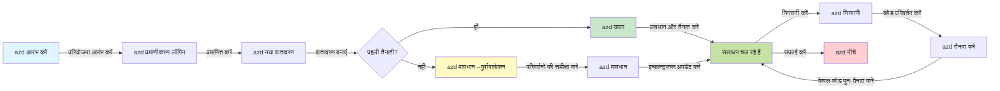
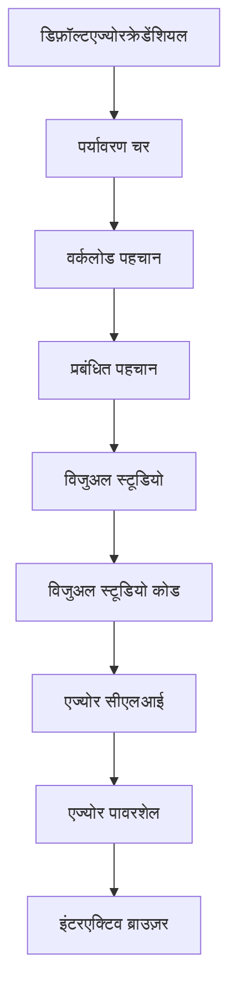

# AZD बेसिक्स - Azure Developer CLI को समझना

# AZD बेसिक्स - मुख्य अवधारणाएँ और मूल बातें

**अध्याय नेविगेशन:**
- **📚 कोर्स होम**: [AZD फॉर बिगिनर्स](../../README.md)
- **📖 वर्तमान अध्याय**: अध्याय 1 - नींव और त्वरित शुरुआत
- **⬅️ पिछला**: [कोर्स ओवरव्यू](../../README.md#-chapter-1-foundation--quick-start)
- **➡️ अगला**: [इंस्टॉलेशन और सेटअप](installation.md)
- **🚀 अगला अध्याय**: [अध्याय 2: AI-फर्स्ट डेवलपमेंट](../microsoft-foundry/microsoft-foundry-integration.md)

## परिचय

यह पाठ आपको Azure Developer CLI (azd) से परिचित कराता है, जो एक शक्तिशाली कमांड-लाइन टूल है जो स्थानीय विकास से Azure पर तैनाती तक की यात्रा को तेज करता है। आप मौलिक अवधारणाओं, मुख्य विशेषताओं को सीखेंगे और समझेंगे कि azd क्लाउड-नेटिव एप्लिकेशन तैनाती को कैसे सरल बनाता है।

## सीखने के लक्ष्य

इस पाठ के अंत तक, आप:
- समझेंगे कि Azure Developer CLI क्या है और इसका मुख्य उद्देश्य क्या है
- टेम्पलेट्स, एनवायरनमेंट्स और सेवाओं की मुख्य अवधारणाओं को सीखेंगे
- प्रमुख विशेषताओं का पता लगाएंगे, जैसे टेम्पलेट-ड्रिवन डेवलपमेंट और इंफ्रास्ट्रक्चर ऐज़ कोड
- azd प्रोजेक्ट संरचना और वर्कफ़्लो को समझेंगे
- अपने विकास वातावरण के लिए azd को इंस्टॉल और कॉन्फ़िगर करने के लिए तैयार होंगे

## सीखने के परिणाम

इस पाठ को पूरा करने के बाद, आप:
- आधुनिक क्लाउड डेवलपमेंट वर्कफ़्लो में azd की भूमिका को समझा पाएंगे
- azd प्रोजेक्ट संरचना के घटकों की पहचान कर पाएंगे
- समझा पाएंगे कि टेम्पलेट्स, एनवायरनमेंट्स और सेवाएँ कैसे एक साथ काम करती हैं
- azd के साथ इंफ्रास्ट्रक्चर ऐज़ कोड के लाभों को समझेंगे
- विभिन्न azd कमांड्स और उनके उद्देश्यों को पहचान पाएंगे

## Azure Developer CLI (azd) क्या है?

Azure Developer CLI (azd) एक कमांड-लाइन टूल है जिसे स्थानीय विकास से Azure पर तैनाती तक की यात्रा को तेज करने के लिए डिज़ाइन किया गया है। यह Azure पर क्लाउड-नेटिव एप्लिकेशन बनाने, तैनात करने और प्रबंधित करने की प्रक्रिया को सरल बनाता है।

### 🎯 AZD का उपयोग क्यों करें? वास्तविक दुनिया की तुलना

आइए एक साधारण वेब ऐप को डेटाबेस के साथ तैनात करने की तुलना करें:

#### ❌ AZD के बिना: मैनुअल Azure तैनाती (30+ मिनट)

```bash
# चरण 1: संसाधन समूह बनाएं
az group create --name myapp-rg --location eastus

# चरण 2: ऐप सेवा योजना बनाएं
az appservice plan create --name myapp-plan \
  --resource-group myapp-rg \
  --sku B1 --is-linux

# चरण 3: वेब ऐप बनाएं
az webapp create --name myapp-web-unique123 \
  --resource-group myapp-rg \
  --plan myapp-plan \
  --runtime "NODE:18-lts"

# चरण 4: कॉसमॉस DB खाता बनाएं (10-15 मिनट)
az cosmosdb create --name myapp-cosmos-unique123 \
  --resource-group myapp-rg \
  --kind MongoDB

# चरण 5: डेटाबेस बनाएं
az cosmosdb mongodb database create \
  --account-name myapp-cosmos-unique123 \
  --resource-group myapp-rg \
  --name tododb

# चरण 6: संग्रह बनाएं
az cosmosdb mongodb collection create \
  --account-name myapp-cosmos-unique123 \
  --resource-group myapp-rg \
  --database-name tododb \
  --name todos

# चरण 7: कनेक्शन स्ट्रिंग प्राप्त करें
CONN_STR=$(az cosmosdb keys list \
  --name myapp-cosmos-unique123 \
  --resource-group myapp-rg \
  --type connection-strings \
  --query "connectionStrings[0].connectionString" -o tsv)

# चरण 8: ऐप सेटिंग्स कॉन्फ़िगर करें
az webapp config appsettings set \
  --name myapp-web-unique123 \
  --resource-group myapp-rg \
  --settings MONGODB_URI="$CONN_STR"

# चरण 9: लॉगिंग सक्षम करें
az webapp log config --name myapp-web-unique123 \
  --resource-group myapp-rg \
  --application-logging filesystem \
  --detailed-error-messages true

# चरण 10: एप्लिकेशन इनसाइट्स सेट करें
az monitor app-insights component create \
  --app myapp-insights \
  --location eastus \
  --resource-group myapp-rg

# चरण 11: ऐप इनसाइट्स को वेब ऐप से लिंक करें
INSTRUMENTATION_KEY=$(az monitor app-insights component show \
  --app myapp-insights \
  --resource-group myapp-rg \
  --query "instrumentationKey" -o tsv)

az webapp config appsettings set \
  --name myapp-web-unique123 \
  --resource-group myapp-rg \
  --settings APPINSIGHTS_INSTRUMENTATIONKEY="$INSTRUMENTATION_KEY"

# चरण 12: एप्लिकेशन को लोकली बनाएं
npm install
npm run build

# चरण 13: परिनियोजन पैकेज बनाएं
zip -r app.zip . -x "*.git*" "node_modules/*"

# चरण 14: एप्लिकेशन परिनियोजित करें
az webapp deployment source config-zip \
  --resource-group myapp-rg \
  --name myapp-web-unique123 \
  --src app.zip

# चरण 15: प्रतीक्षा करें और प्रार्थना करें कि यह काम करे 🙏
# (कोई स्वचालित सत्यापन नहीं, मैन्युअल परीक्षण आवश्यक)
```

**समस्याएँ:**
- ❌ 15+ कमांड्स याद रखने और सही क्रम में चलाने की आवश्यकता
- ❌ 30-45 मिनट का मैनुअल काम
- ❌ गलतियाँ करना आसान (टाइपो, गलत पैरामीटर)
- ❌ टर्मिनल हिस्ट्री में कनेक्शन स्ट्रिंग्स उजागर होती हैं
- ❌ विफलता पर कोई स्वचालित रोलबैक नहीं
- ❌ टीम के सदस्यों के लिए दोहराना मुश्किल
- ❌ हर बार अलग (पुनरुत्पादन योग्य नहीं)

#### ✅ AZD के साथ: स्वचालित तैनाती (5 कमांड्स, 10-15 मिनट)

```bash
# चरण 1: टेम्पलेट से प्रारंभ करें
azd init --template todo-nodejs-mongo

# चरण 2: प्रमाणीकरण करें
azd auth login

# चरण 3: पर्यावरण बनाएं
azd env new dev

# चरण 4: परिवर्तनों का पूर्वावलोकन करें (वैकल्पिक लेकिन अनुशंसित)
azd provision --preview

# चरण 5: सब कुछ तैनात करें
azd up

# ✨ हो गया! सब कुछ तैनात, कॉन्फ़िगर और मॉनिटर किया गया है
```

**लाभ:**
- ✅ **5 कमांड्स** बनाम 15+ मैनुअल स्टेप्स
- ✅ **10-15 मिनट** कुल समय (मुख्यतः Azure के लिए प्रतीक्षा)
- ✅ **शून्य त्रुटियाँ** - स्वचालित और परीक्षण किया गया
- ✅ **सुरक्षित रूप से प्रबंधित सीक्रेट्स** Key Vault के माध्यम से
- ✅ **स्वचालित रोलबैक** विफलताओं पर
- ✅ **पूरी तरह से पुनरुत्पादन योग्य** - हर बार समान परिणाम
- ✅ **टीम-रेडी** - कोई भी समान कमांड्स के साथ तैनात कर सकता है
- ✅ **इंफ्रास्ट्रक्चर ऐज़ कोड** - संस्करण नियंत्रित Bicep टेम्पलेट्स
- ✅ **बिल्ट-इन मॉनिटरिंग** - Application Insights स्वचालित रूप से कॉन्फ़िगर किया गया

### 📊 समय और त्रुटि में कमी

| मीट्रिक | मैनुअल तैनाती | AZD तैनाती | सुधार |
|:-------|:--------------|:------------|:-------|
| **कमांड्स** | 15+ | 5 | 67% कम |
| **समय** | 30-45 मिनट | 10-15 मिनट | 60% तेज |
| **त्रुटि दर** | ~40% | <5% | 88% कमी |
| **संगति** | कम (मैनुअल) | 100% (स्वचालित) | परफेक्ट |
| **टीम ऑनबोर्डिंग** | 2-4 घंटे | 30 मिनट | 75% तेज |
| **रोलबैक समय** | 30+ मिनट (मैनुअल) | 2 मिनट (स्वचालित) | 93% तेज |

## मुख्य अवधारणाएँ

### टेम्पलेट्स
टेम्पलेट्स azd की नींव हैं। इनमें शामिल हैं:
- **एप्लिकेशन कोड** - आपका सोर्स कोड और डिपेंडेंसीज़
- **इंफ्रास्ट्रक्चर परिभाषाएँ** - Azure संसाधन Bicep या Terraform में परिभाषित
- **कॉन्फ़िगरेशन फाइलें** - सेटिंग्स और एनवायरनमेंट वेरिएबल्स
- **तैनाती स्क्रिप्ट्स** - स्वचालित तैनाती वर्कफ़्लो

### एनवायरनमेंट्स
एनवायरनमेंट्स विभिन्न तैनाती लक्ष्यों का प्रतिनिधित्व करते हैं:
- **डेवलपमेंट** - परीक्षण और विकास के लिए
- **स्टेजिंग** - प्री-प्रोडक्शन एनवायरनमेंट
- **प्रोडक्शन** - लाइव प्रोडक्शन एनवायरनमेंट

प्रत्येक एनवायरनमेंट अपना:
- Azure संसाधन समूह
- कॉन्फ़िगरेशन सेटिंग्स
- तैनाती स्थिति बनाए रखता है

### सेवाएँ
सेवाएँ आपके एप्लिकेशन के निर्माण खंड हैं:
- **फ्रंटएंड** - वेब एप्लिकेशन, SPAs
- **बैकएंड** - APIs, माइक्रोसर्विसेज
- **डेटाबेस** - डेटा स्टोरेज समाधान
- **स्टोरेज** - फाइल और ब्लॉब स्टोरेज

## मुख्य विशेषताएँ

### 1. टेम्पलेट-ड्रिवन डेवलपमेंट
```bash
# उपलब्ध टेम्पलेट्स ब्राउज़ करें
azd template list

# एक टेम्पलेट से प्रारंभ करें
azd init --template <template-name>
```

### 2. इंफ्रास्ट्रक्चर ऐज़ कोड
- **Bicep** - Azure की डोमेन-विशिष्ट भाषा
- **Terraform** - मल्टी-क्लाउड इंफ्रास्ट्रक्चर टूल
- **ARM टेम्पलेट्स** - Azure Resource Manager टेम्पलेट्स

### 3. इंटीग्रेटेड वर्कफ़्लो
```bash
# पूर्ण परिनियोजन कार्यप्रवाह
azd up            # प्रावधान + परिनियोजन यह पहली बार सेटअप के लिए स्वचालित है

# 🧪 नया: परिनियोजन से पहले बुनियादी ढांचे में बदलाव का पूर्वावलोकन करें (सुरक्षित)
azd provision --preview    # बिना बदलाव किए बुनियादी ढांचे के परिनियोजन का अनुकरण करें

azd provision     # यदि आप बुनियादी ढांचे को अपडेट करते हैं तो Azure संसाधन बनाएं
azd deploy        # एप्लिकेशन कोड परिनियोजित करें या अपडेट के बाद एप्लिकेशन कोड को पुनः परिनियोजित करें
azd down          # संसाधनों को साफ करें
```

#### 🛡️ सुरक्षित इंफ्रास्ट्रक्चर प्लानिंग प्रीव्यू के साथ
`azd provision --preview` कमांड सुरक्षित तैनाती के लिए गेम-चेंजर है:
- **ड्राई-रन विश्लेषण** - दिखाता है कि क्या बनाया जाएगा, संशोधित किया जाएगा, या हटाया जाएगा
- **शून्य जोखिम** - आपके Azure एनवायरनमेंट में कोई वास्तविक परिवर्तन नहीं होता
- **टीम सहयोग** - तैनाती से पहले प्रीव्यू परिणाम साझा करें
- **लागत अनुमान** - प्रतिबद्धता से पहले संसाधन लागत को समझें

```bash
# उदाहरण पूर्वावलोकन कार्यप्रवाह
azd provision --preview           # देखें कि क्या बदलेगा
# आउटपुट की समीक्षा करें, टीम के साथ चर्चा करें
azd provision                     # आत्मविश्वास के साथ बदलाव लागू करें
```

### 📊 विजुअल: AZD डेवलपमेंट वर्कफ़्लो


**वर्कफ़्लो व्याख्या:**
1. **Init** - टेम्पलेट या नए प्रोजेक्ट से शुरू करें
2. **Auth** - Azure के साथ प्रमाणित करें
3. **Environment** - अलग-अलग तैनाती एनवायरनमेंट बनाएं
4. **Preview** - 🆕 हमेशा इंफ्रास्ट्रक्चर परिवर्तनों का प्रीव्यू पहले करें (सुरक्षित अभ्यास)
5. **Provision** - Azure संसाधन बनाएं/अपडेट करें
6. **Deploy** - अपना एप्लिकेशन कोड पुश करें
7. **Monitor** - एप्लिकेशन प्रदर्शन का निरीक्षण करें
8. **Iterate** - परिवर्तन करें और कोड को पुनः तैनात करें
9. **Cleanup** - काम पूरा होने पर संसाधन हटाएं

### 4. एनवायरनमेंट प्रबंधन
```bash
# वातावरण बनाएं और प्रबंधित करें
azd env new <environment-name>
azd env select <environment-name>
azd env list
```

## 📁 प्रोजेक्ट संरचना

एक सामान्य azd प्रोजेक्ट संरचना:
```
my-app/
├── .azd/                    # azd configuration
│   └── config.json
├── .azure/                  # Azure deployment artifacts
├── .devcontainer/          # Development container config
├── .github/workflows/      # GitHub Actions
├── .vscode/               # VS Code settings
├── infra/                 # Infrastructure code
│   ├── main.bicep        # Main infrastructure template
│   ├── main.parameters.json
│   └── modules/          # Reusable modules
├── src/                  # Application source code
│   ├── api/             # Backend services
│   └── web/             # Frontend application
├── azure.yaml           # azd project configuration
└── README.md
```

## 🔧 कॉन्फ़िगरेशन फाइलें

### azure.yaml
मुख्य प्रोजेक्ट कॉन्फ़िगरेशन फाइल:
```yaml
name: my-awesome-app
metadata:
  template: my-template@1.0.0

services:
  web:
    project: ./src/web
    language: js
    host: appservice
  api:
    project: ./src/api
    language: js
    host: appservice

hooks:
  preprovision:
    shell: pwsh
    run: echo "Preparing to provision..."
```

### .azure/config.json
एनवायरनमेंट-विशिष्ट कॉन्फ़िगरेशन:
```json
{
  "version": 1,
  "defaultEnvironment": "dev",
  "environments": {
    "dev": {
      "subscriptionId": "your-subscription-id",
      "location": "eastus"
    }
  }
}
```

## 🎪 सामान्य वर्कफ़्लो और व्यावहारिक अभ्यास

> **💡 सीखने की टिप:** इन अभ्यासों को क्रम में करें ताकि आप अपनी AZD स्किल्स को प्रगतिशील रूप से बना सकें।

### 🎯 अभ्यास 1: अपना पहला प्रोजेक्ट प्रारंभ करें

**लक्ष्य:** एक AZD प्रोजेक्ट बनाएं और इसकी संरचना का पता लगाएं

**स्टेप्स:**
```bash
# एक सिद्ध टेम्पलेट का उपयोग करें
azd init --template todo-nodejs-mongo

# उत्पन्न फ़ाइलों का अन्वेषण करें
ls -la  # सभी फ़ाइलें देखें, जिनमें छिपी हुई फ़ाइलें भी शामिल हैं

# मुख्य फ़ाइलें बनाई गई:
# - azure.yaml (मुख्य कॉन्फ़िग)
# - infra/ (इंफ्रास्ट्रक्चर कोड)
# - src/ (एप्लिकेशन कोड)
```

**✅ सफलता:** आपके पास azure.yaml, infra/, और src/ डायरेक्टरीज़ हैं

---

### 🎯 अभ्यास 2: Azure पर तैनात करें

**लक्ष्य:** एंड-टू-एंड तैनाती पूरी करें

**स्टेप्स:**
```bash
# 1. प्रमाणीकरण करें
az login && azd auth login

# 2. वातावरण बनाएं
azd env new dev
azd env set AZURE_LOCATION eastus

# 3. परिवर्तनों का पूर्वावलोकन करें (सिफारिश की गई)
azd provision --preview

# 4. सब कुछ परिनियोजित करें
azd up

# 5. परिनियोजन सत्यापित करें
azd show    # अपने ऐप का URL देखें
```

**अनुमानित समय:** 10-15 मिनट  
**✅ सफलता:** एप्लिकेशन URL ब्राउज़र में खुलता है

---

### 🎯 अभ्यास 3: कई एनवायरनमेंट्स

**लक्ष्य:** dev और staging पर तैनात करें

**स्टेप्स:**
```bash
# पहले से ही dev है, staging बनाएं
azd env new staging
azd env set AZURE_LOCATION westus2
azd up

# उनके बीच स्विच करें
azd env list
azd env select dev
```

**✅ सफलता:** Azure पोर्टल में दो अलग-अलग संसाधन समूह

---

### 🛡️ क्लीन स्लेट: `azd down --force --purge`

जब आपको पूरी तरह से रीसेट करने की आवश्यकता हो:

```bash
azd down --force --purge
```

**यह क्या करता है:**
- `--force`: कोई पुष्टि प्रॉम्प्ट नहीं
- `--purge`: सभी स्थानीय स्थिति और Azure संसाधन हटाता है

**कब उपयोग करें:**
- तैनाती बीच में विफल हो गई
- प्रोजेक्ट बदल रहे हैं
- नई शुरुआत की आवश्यकता है

---

## 🎪 मूल वर्कफ़्लो संदर्भ

### नया प्रोजेक्ट शुरू करना
```bash
# विधि 1: मौजूदा टेम्पलेट का उपयोग करें
azd init --template todo-nodejs-mongo

# विधि 2: शुरू से शुरू करें
azd init

# विधि 3: वर्तमान निर्देशिका का उपयोग करें
azd init .
```

### विकास चक्र
```bash
# विकास पर्यावरण सेट करें
azd auth login
azd env new dev
azd env select dev

# सब कुछ तैनात करें
azd up

# परिवर्तन करें और पुनः तैनात करें
azd deploy

# समाप्त होने पर साफ करें
azd down --force --purge # Azure Developer CLI में कमांड आपके पर्यावरण के लिए एक **कठोर रीसेट** है—विशेष रूप से उपयोगी जब आप असफल तैनाती का निवारण कर रहे हों, अनाथ संसाधनों को साफ कर रहे हों, या एक नई पुनः तैनाती के लिए तैयारी कर रहे हों।
```

## `azd down --force --purge` को समझना
`azd down --force --purge` कमांड आपके azd एनवायरनमेंट और सभी संबंधित संसाधनों को पूरी तरह से हटाने का एक शक्तिशाली तरीका है। यहाँ प्रत्येक फ्लैग का विवरण है:
```
--force
```
- पुष्टि प्रॉम्प्ट्स को स्किप करता है।
- स्वचालन या स्क्रिप्टिंग के लिए उपयोगी जहाँ मैनुअल इनपुट संभव नहीं है।
- सुनिश्चित करता है कि टियरडाउन बिना रुकावट के आगे बढ़े, भले ही CLI असंगतता का पता लगाए।

```
--purge
```
संबंधित **सभी मेटाडेटा** हटाता है, जिसमें शामिल हैं:
एनवायरनमेंट स्थिति
स्थानीय `.azure` फ़ोल्डर
कैश्ड तैनाती जानकारी
azd को "पिछली तैनातियों" को याद करने से रोकता है, जो संसाधन समूहों के असंगतता या पुराने रजिस्ट्री संदर्भों जैसी समस्याएँ पैदा कर सकता है।

### दोनों का उपयोग क्यों करें?
जब आप `azd up` के साथ अटके हुए हैं, तो शेष स्थिति या आंशिक तैनातियों के कारण, यह संयोजन **क्लीन स्लेट** सुनिश्चित करता है।

यह विशेष रूप से Azure पोर्टल में मैनुअल संसाधन हटाने के बाद या टेम्पलेट्स, एनवायरनमेंट्स, या संसाधन समूह नामकरण सम्मेलनों को बदलते समय सहायक होता है।

### कई एनवायरनमेंट्स का प्रबंधन
```bash
# स्टेजिंग वातावरण बनाएं
azd env new staging
azd env select staging
azd up

# वापस देव पर स्विच करें
azd env select dev

# वातावरणों की तुलना करें
azd env list
```

## 🔐 प्रमाणन और क्रेडेंशियल्स

सफल azd तैनातियों के लिए प्रमाणन को समझना महत्वपूर्ण है। Azure कई प्रमाणन विधियों का उपयोग करता है, और azd अन्य Azure टूल्स द्वारा उपयोग किए जाने वाले समान क्रेडेंशियल चेन का लाभ उठाता है।

### Azure CLI प्रमाणन (`az login`)

azd का उपयोग करने से पहले, आपको Azure के साथ प्रमाणित करने की आवश्यकता है। सबसे सामान्य विधि Azure CLI का उपयोग करना है:

```bash
# इंटरएक्टिव लॉगिन (ब्राउज़र खोलता है)
az login

# विशिष्ट टेनेंट के साथ लॉगिन करें
az login --tenant <tenant-id>

# सेवा प्रिंसिपल के साथ लॉगिन करें
az login --service-principal -u <app-id> -p <password> --tenant <tenant-id>

# वर्तमान लॉगिन स्थिति की जांच करें
az account show

# उपलब्ध सब्सक्रिप्शन्स की सूची बनाएं
az account list --output table

# डिफ़ॉल्ट सब्सक्रिप्शन सेट करें
az account set --subscription <subscription-id>
```

### प्रमाणन प्रवाह
1. **इंटरएक्टिव लॉगिन**: प्रमाणन के लिए आपका डिफ़ॉल्ट ब्राउज़र खोलता है
2. **डिवाइस कोड फ्लो**: उन एनवायरनमेंट्स के लिए जहाँ ब्राउज़र एक्सेस नहीं है
3. **सर्विस प्रिंसिपल**: स्वचालन और CI/CD परिदृश्यों के लिए
4. **मैनेज्ड आइडेंटिटी**: Azure-होस्टेड एप्लिकेशन के लिए

### DefaultAzureCredential चेन

`DefaultAzureCredential` एक क्रेडेंशियल प्रकार है जो कई क्रेडेंशियल स्रोतों को एक विशिष्ट क्रम में स्वचालित रूप से आज़माकर प्रमाणन अनुभव को सरल बनाता है:

#### क्रेडेंशियल चेन क्रम

#### 1. एनवायरनमेंट वेरिएबल्स
```bash
# सेवा प्रिंसिपल के लिए पर्यावरण चर सेट करें
export AZURE_CLIENT_ID="<app-id>"
export AZURE_CLIENT_SECRET="<password>"
export AZURE_TENANT_ID="<tenant-id>"
```

#### 2. वर्कलोड आइडेंटिटी (Kubernetes/GitHub Actions)
स्वचालित रूप से उपयोग किया जाता है:
- Azure Kubernetes Service (AKS) वर्कलोड आइडेंटिटी के साथ
- GitHub Actions OIDC फेडरेशन के साथ
- अन्य फेडरेटेड आइडेंटिटी परिदृश्य

#### 3. मैनेज्ड आइडेंटिटी
Azure संसाधनों के लिए जैसे:
- वर्चुअल मशीन
- ऐप सर्विस
- Azure फंक्शन्स
- कंटेनर इंस्टेंस

```bash
# जांचें कि क्या प्रबंधित पहचान के साथ Azure संसाधन पर चल रहा है
az account show --query "user.type" --output tsv
# लौटाता है: "servicePrincipal" यदि प्रबंधित पहचान का उपयोग कर रहा है
```

#### 4. डेवलपर टूल्स इंटीग्रेशन
- **Visual Studio**: स्वचालित रूप से साइन-इन अकाउंट का उपयोग करता है
- **VS Code**: Azure अकाउंट एक्सटेंशन क्रेडेंशियल्स का उपयोग करता है
- **Azure CLI**: `az login` क्रेडेंशियल्स का उपयोग करता है (स्थानीय विकास के लिए सबसे सामान्य)

### AZD प्रमाणन सेटअप

```bash
# विधि 1: Azure CLI का उपयोग करें (विकास के लिए अनुशंसित)
az login
azd auth login  # मौजूदा Azure CLI क्रेडेंशियल्स का उपयोग करता है

# विधि 2: सीधे azd प्रमाणीकरण
azd auth login --use-device-code  # हेडलेस वातावरण के लिए

# विधि 3: प्रमाणीकरण स्थिति की जांच करें
azd auth login --check-status

# विधि 4: लॉगआउट करें और पुनः प्रमाणीकरण करें
azd auth logout
azd auth login
```

### प्रमाणन सर्वोत्तम प्रथाएँ

#### स्थानीय विकास के लिए
```bash
# 1. Azure CLI के साथ लॉगिन करें
az login

# 2. सही सब्सक्रिप्शन सत्यापित करें
az account show
az account set --subscription "Your Subscription Name"

# 3. मौजूदा क्रेडेंशियल्स के साथ azd का उपयोग करें
azd auth login
```

#### CI/CD पाइपलाइनों के लिए
```yaml
# GitHub Actions example
- name: Azure Login
  uses: azure/login@v1
  with:
    creds: ${{ secrets.AZURE_CREDENTIALS }}

- name: Deploy with azd
  run: |
    azd auth login --client-id ${{ secrets.AZURE_CLIENT_ID }} \
                    --client-secret ${{ secrets.AZURE_CLIENT_SECRET }} \
                    --tenant-id ${{ secrets.AZURE_TENANT_ID }}
    azd up --no-prompt
```

#### प्रोडक्शन एनवायरनमेंट्स के लिए
- Azure संसाधनों पर चलने पर **मैनेज्ड आइडेंटिटी** का उपयोग करें
- स्वचालन परिदृश्यों के लिए **सर्विस प्रिंसिपल** का उपयोग करें
- कोड या कॉन्फ़िगरेशन फाइलों में क्रेडेंशियल्स को स्टोर करने से बचें
- संवेदनशील कॉन्फ़िगरेशन के लिए **Azure Key Vault** का उपयोग करें

### सामान्य प्रमाणन समस्याएँ और समाधान

#### समस्या: "कोई सब्सक्रिप्शन नहीं मिला"
```bash
# समाधान: डिफ़ॉल्ट सदस्यता सेट करें
az account list --output table
az account set --subscription "<subscription-id>"
azd env set AZURE_SUBSCRIPTION_ID "<subscription-id>"
```

#### समस्या: "पर्याप्त अनुमतियाँ नहीं"
```bash
# समाधान: आवश्यक भूमिकाओं की जांच करें और असाइन करें
az role assignment list --assignee $(az account show --query user.name --output tsv)

# सामान्य आवश्यक भूमिकाएँ:
# - योगदानकर्ता (संसाधन प्रबंधन के लिए)
# - उपयोगकर्ता एक्सेस प्रशासक (भूमिका असाइनमेंट के लिए)
```

#### समस्या: "टोकन समाप्त हो गया"
```bash
# समाधान: पुनः प्रमाणीकरण करें
az logout
az login
azd auth logout
azd auth login
```

### विभिन्न परिदृश्यों में प्रमाणन

#### स्थानीय विकास
```bash
# व्यक्तिगत विकास खाता
az login
azd auth login
```

#### टीम विकास
```bash
# संगठन के लिए विशिष्ट किरायेदार का उपयोग करें
az login --tenant contoso.onmicrosoft.com
azd auth login
```

#### मल्टी-टेनेंट परिदृश्य
```bash
# किरायेदारों के बीच स्विच करें
az login --tenant tenant1.onmicrosoft.com
# किरायेदार 1 पर तैनात करें
azd up

az login --tenant tenant2.onmicrosoft.com  
# किरायेदार 2 पर तैनात करें
azd up
```

### सुरक्षा विचार

1. **क्रेडेंशियल स्टोरेज**: क्रेडेंशियल्स को सोर्स कोड में कभी स्टोर न करें
2. **स्कोप लिमिटेशन**: सर्विस प्रिंसिपल के लिए न्यूनतम-विशेषाधिकार सिद्धांत का उपयोग करें
3. **टोकन रोटेशन**: सर्विस प्रिंसिपल सीक्रेट्स को नियमित रूप से रोटेट करें
4. **ऑडिट ट्रेल**: प्रमाणन और तैनाती गतिविधियों की निगरानी करें
5. **नेटवर्क सुरक्षा**: संभव हो तो निजी एंडपॉइंट्स का उपयोग करें

### प्रमाणन समस्या निवारण

```bash
# प्रमाणीकरण समस्याओं का डिबग करें
azd auth login --check-status
az account show
az account get-access-token

# सामान्य निदान आदेश
whoami                          # वर्तमान उपयोगकर्ता संदर्भ
az ad signed-in-user show      # Azure AD उपयोगकर्ता विवरण
az group list                  # संसाधन पहुंच का परीक्षण करें
```

## `azd down --force --purge` को समझना

### खोज
```bash
azd template list              # टेम्पलेट ब्राउज़ करें
azd template show <template>   # टेम्पलेट विवरण
azd init --help               # प्रारंभिककरण विकल्प
```

### प्रोजेक्ट प्रबंधन
```bash
azd show                     # परियोजना का अवलोकन
azd env show                 # वर्तमान वातावरण
azd config list             # विन्यास सेटिंग्स
```

### मॉनिटरिंग
```bash
azd monitor                  # Azure पोर्टल खोलें
azd pipeline config          # CI/CD सेट करें
azd logs                     # एप्लिकेशन लॉग देखें
```

## सर्वोत्तम प्रथाएँ

### 1. सार्थक नामों का उपयोग करें
```bash
# अच्छा
azd env new production-east
azd init --template web-app-secure

# बचें
azd env new env1
azd init --template template1
```

### 2. टेम्पलेट्स का लाभ उठाएँ
- मौजूदा टेम्पलेट्स से शुरू करें
- अपनी आवश्यकताओं के लिए अनुकूलित करें
- अपने संगठन के लिए पुन: उपयोग योग्य टेम्पलेट्स बनाएं

### 3. एनवायरनमेंट आइसोलेशन
- dev/staging/prod के लिए अलग-अलग एनवायरनमेंट
- [इंस्टॉलेशन और सेटअप](installation.md) - AZD को इंस्टॉल और कॉन्फ़िगर करें
- [आपका पहला प्रोजेक्ट](first-project.md) - पूरा हैंड्स-ऑन ट्यूटोरियल
- [कॉन्फ़िगरेशन गाइड](configuration.md) - उन्नत कॉन्फ़िगरेशन विकल्प

**🎯 अगला अध्याय तैयार है?**
- [अध्याय 2: AI-फर्स्ट डेवलपमेंट](../microsoft-foundry/microsoft-foundry-integration.md) - AI एप्लिकेशन बनाना शुरू करें

## अतिरिक्त संसाधन

- [Azure Developer CLI ओवरव्यू](https://learn.microsoft.com/en-us/azure/developer/azure-developer-cli/)
- [टेम्पलेट गैलरी](https://azure.github.io/awesome-azd/)
- [कम्युनिटी सैंपल्स](https://github.com/Azure-Samples)

---

## 🙋 अक्सर पूछे जाने वाले प्रश्न

### सामान्य प्रश्न

**प्रश्न: AZD और Azure CLI में क्या अंतर है?**

उत्तर: Azure CLI (`az`) व्यक्तिगत Azure संसाधनों को प्रबंधित करने के लिए है। AZD (`azd`) पूरे एप्लिकेशन को प्रबंधित करने के लिए है:

```bash
# Azure CLI - निम्न-स्तरीय संसाधन प्रबंधन
az webapp create --name myapp --resource-group rg
az sql server create --name myserver --resource-group rg
# ...कई और कमांड्स की आवश्यकता है

# AZD - एप्लिकेशन-स्तरीय प्रबंधन
azd up  # पूरे ऐप को सभी संसाधनों के साथ डिप्लॉय करता है
```

**इसे इस तरह समझें:**
- `az` = व्यक्तिगत लेगो ब्रिक्स पर काम करना
- `azd` = पूरे लेगो सेट्स के साथ काम करना

---

**प्रश्न: क्या AZD का उपयोग करने के लिए मुझे Bicep या Terraform जानना आवश्यक है?**

उत्तर: नहीं! टेम्पलेट्स से शुरू करें:
```bash
# मौजूदा टेम्पलेट का उपयोग करें - IaC ज्ञान की आवश्यकता नहीं है
azd init --template todo-nodejs-mongo
azd up
```

आप बाद में Bicep सीख सकते हैं ताकि इंफ्रास्ट्रक्चर को कस्टमाइज़ कर सकें। टेम्पलेट्स सीखने के लिए काम करने वाले उदाहरण प्रदान करते हैं।

---

**प्रश्न: AZD टेम्पलेट्स चलाने में कितना खर्च आता है?**

उत्तर: टेम्पलेट्स के अनुसार लागत अलग-अलग होती है। अधिकांश डेवलपमेंट टेम्पलेट्स की लागत $50-150/माह होती है:

```bash
# परिनियोजन से पहले लागत का पूर्वावलोकन करें
azd provision --preview

# उपयोग न करने पर हमेशा सफाई करें
azd down --force --purge  # सभी संसाधनों को हटा देता है
```

**प्रो टिप:** जहां संभव हो मुफ्त टियर का उपयोग करें:
- ऐप सर्विस: F1 (फ्री) टियर
- Azure OpenAI: 50,000 टोकन/माह मुफ्त
- Cosmos DB: 1000 RU/s फ्री टियर

---

**प्रश्न: क्या मैं AZD का उपयोग मौजूदा Azure संसाधनों के साथ कर सकता हूं?**

उत्तर: हां, लेकिन नए सिरे से शुरू करना आसान है। AZD पूरे जीवनचक्र को प्रबंधित करने में सबसे अच्छा काम करता है। मौजूदा संसाधनों के लिए:

```bash
# विकल्प 1: मौजूदा संसाधनों को आयात करें (उन्नत)
azd init
# फिर मौजूदा संसाधनों को संदर्भित करने के लिए infra/ को संशोधित करें

# विकल्प 2: नई शुरुआत करें (सिफारिश की गई)
azd init --template matching-your-stack
azd up  # नया वातावरण बनाता है
```

---

**प्रश्न: मैं अपना प्रोजेक्ट टीम के साथ कैसे साझा कर सकता हूं?**

उत्तर: AZD प्रोजेक्ट को Git में कमिट करें (लेकिन .azure फ़ोल्डर को नहीं):

```bash
# पहले से ही .gitignore में डिफ़ॉल्ट रूप से शामिल है
.azure/        # गुप्त और पर्यावरण डेटा शामिल है
*.env          # पर्यावरण वेरिएबल्स

# टीम के सदस्य तब:
git clone <your-repo>
azd auth login
azd env new <their-name>-dev
azd up
```

हर कोई समान टेम्पलेट्स से समान इंफ्रास्ट्रक्चर प्राप्त करता है।

---

### समस्या निवारण प्रश्न

**प्रश्न: "azd up" आधे में विफल हो गया। अब मुझे क्या करना चाहिए?**

उत्तर: त्रुटि की जांच करें, उसे ठीक करें, फिर पुनः प्रयास करें:

```bash
# विस्तृत लॉग देखें
azd show

# सामान्य सुधार:

# 1. यदि कोटा समाप्त हो गया है:
azd env set AZURE_LOCATION "westus2"  # अलग क्षेत्र आज़माएं

# 2. यदि संसाधन नाम में टकराव है:
azd down --force --purge  # नई शुरुआत करें
azd up  # पुनः प्रयास करें

# 3. यदि प्रमाणीकरण समाप्त हो गया है:
az login
azd auth login
azd up
```

**सबसे आम समस्या:** गलत Azure सब्सक्रिप्शन चुना गया
```bash
az account list --output table
az account set --subscription "<correct-subscription>"
```

---

**प्रश्न: मैं केवल कोड परिवर्तन को बिना पुनः प्रोविजनिंग के कैसे तैनात कर सकता हूं?**

उत्तर: `azd up` के बजाय `azd deploy` का उपयोग करें:

```bash
azd up          # पहली बार: प्रावधान + परिनियोजन (धीमा)

# कोड में बदलाव करें...

azd deploy      # बाद के समय: केवल परिनियोजन (तेज़)
```

गति तुलना:
- `azd up`: 10-15 मिनट (इंफ्रास्ट्रक्चर प्रोविजन करता है)
- `azd deploy`: 2-5 मिनट (केवल कोड)

---

**प्रश्न: क्या मैं इंफ्रास्ट्रक्चर टेम्पलेट्स को कस्टमाइज़ कर सकता हूं?**

उत्तर: हां! `infra/` में Bicep फ़ाइलों को संपादित करें:

```bash
# azd init के बाद
cd infra/
code main.bicep  # VS कोड में संपादित करें

# परिवर्तनों का पूर्वावलोकन करें
azd provision --preview

# परिवर्तनों को लागू करें
azd provision
```

**टिप:** छोटे से शुरू करें - पहले SKUs बदलें:
```bicep
// infra/main.bicep
sku: {
  name: 'B1'  // Change to 'P1V2' for production
}
```

---

**प्रश्न: AZD द्वारा बनाई गई हर चीज़ को मैं कैसे हटा सकता हूं?**

उत्तर: एक कमांड सभी संसाधनों को हटा देता है:

```bash
azd down --force --purge

# यह हटाता है:
# - सभी Azure संसाधन
# - संसाधन समूह
# - स्थानीय पर्यावरण स्थिति
# - कैश्ड परिनियोजन डेटा
```

**हमेशा इसे चलाएं जब:**
- टेम्पलेट का परीक्षण समाप्त हो गया हो
- अलग प्रोजेक्ट पर स्विच कर रहे हों
- नए सिरे से शुरू करना चाहते हों

**लागत बचत:** अप्रयुक्त संसाधनों को हटाना = $0 शुल्क

---

**प्रश्न: अगर मैंने Azure पोर्टल में गलती से संसाधन हटा दिए तो क्या होगा?**

उत्तर: AZD स्टेट सिंक से बाहर हो सकता है। साफ स्लेट दृष्टिकोण:

```bash
# 1. स्थानीय स्थिति हटाएं
azd down --force --purge

# 2. नई शुरुआत करें
azd up

# वैकल्पिक: AZD को पहचानने और ठीक करने दें
azd provision  # गायब संसाधन बनाएगा
```

---

### उन्नत प्रश्न

**प्रश्न: क्या मैं AZD को CI/CD पाइपलाइनों में उपयोग कर सकता हूं?**

उत्तर: हां! GitHub Actions उदाहरण:

```yaml
# .github/workflows/deploy.yml
name: Deploy with AZD

on:
  push:
    branches: [main]

jobs:
  deploy:
    runs-on: ubuntu-latest
    steps:
      - uses: actions/checkout@v2
      
      - name: Install azd
        run: curl -fsSL https://aka.ms/install-azd.sh | bash
      
      - name: Azure Login
        run: |
          azd auth login \
            --client-id ${{ secrets.AZURE_CLIENT_ID }} \
            --client-secret ${{ secrets.AZURE_CLIENT_SECRET }} \
            --tenant-id ${{ secrets.AZURE_TENANT_ID }}
      
      - name: Deploy
        run: azd up --no-prompt
```

---

**प्रश्न: मैं सीक्रेट्स और संवेदनशील डेटा को कैसे संभालूं?**

उत्तर: AZD स्वचालित रूप से Azure Key Vault के साथ एकीकृत होता है:

```bash
# सीक्रेट्स कोड में नहीं, की वॉल्ट में संग्रहीत किए जाते हैं
azd env set DATABASE_PASSWORD "$(openssl rand -base64 32)"

# AZD स्वचालित रूप से:
# 1. की वॉल्ट बनाता है
# 2. सीक्रेट संग्रहीत करता है
# 3. मैनेज्ड आइडेंटिटी के माध्यम से ऐप को एक्सेस प्रदान करता है
# 4. रनटाइम पर इंजेक्ट करता है
```

**कभी कमिट न करें:**
- `.azure/` फ़ोल्डर (पर्यावरण डेटा शामिल है)
- `.env` फ़ाइलें (स्थानीय सीक्रेट्स)
- कनेक्शन स्ट्रिंग्स

---

**प्रश्न: क्या मैं कई क्षेत्रों में तैनात कर सकता हूं?**

उत्तर: हां, प्रति क्षेत्र एक पर्यावरण बनाएं:

```bash
# पूर्वी अमेरिका पर्यावरण
azd env new prod-eastus
azd env set AZURE_LOCATION eastus
azd up

# पश्चिम यूरोप पर्यावरण
azd env new prod-westeurope
azd env set AZURE_LOCATION westeurope
azd up

# प्रत्येक पर्यावरण स्वतंत्र है
azd env list
```

सच्चे मल्टी-रीजन ऐप्स के लिए, Bicep टेम्पलेट्स को कस्टमाइज़ करें ताकि एक साथ कई क्षेत्रों में तैनात किया जा सके।

---

**प्रश्न: अगर मैं फंस गया हूं तो मुझे मदद कहां मिल सकती है?**

1. **AZD दस्तावेज़:** https://learn.microsoft.com/azure/developer/azure-developer-cli/
2. **GitHub Issues:** https://github.com/Azure/azure-dev/issues
3. **Discord:** [Azure Discord](https://discord.gg/microsoft-azure) - #azure-developer-cli चैनल
4. **Stack Overflow:** टैग `azure-developer-cli`
5. **यह कोर्स:** [समस्या निवारण गाइड](../troubleshooting/common-issues.md)

**प्रो टिप:** पूछने से पहले, चलाएं:
```bash
azd show       # वर्तमान स्थिति दिखाता है
azd version    # आपका संस्करण दिखाता है
```
अपने प्रश्न में इस जानकारी को शामिल करें ताकि तेजी से मदद मिल सके।

---

## 🎓 आगे क्या?

अब आप AZD की मूल बातें समझ गए हैं। अपना रास्ता चुनें:

### 🎯 शुरुआती लोगों के लिए:
1. **अगला:** [इंस्टॉलेशन और सेटअप](installation.md) - अपने मशीन पर AZD इंस्टॉल करें
2. **फिर:** [आपका पहला प्रोजेक्ट](first-project.md) - अपना पहला ऐप तैनात करें
3. **अभ्यास:** इस पाठ में सभी 3 अभ्यास पूरे करें

### 🚀 AI डेवलपर्स के लिए:
1. **स्किप करें:** [अध्याय 2: AI-फर्स्ट डेवलपमेंट](../microsoft-foundry/microsoft-foundry-integration.md)
2. **तैनात करें:** `azd init --template get-started-with-ai-chat` से शुरू करें
3. **सीखें:** तैनात करते समय निर्माण करें

### 🏗️ अनुभवी डेवलपर्स के लिए:
1. **समीक्षा करें:** [कॉन्फ़िगरेशन गाइड](configuration.md) - उन्नत सेटिंग्स
2. **अन्वेषण करें:** [इंफ्रास्ट्रक्चर कोड के रूप में](../deployment/provisioning.md) - Bicep गहराई से जानें
3. **निर्माण करें:** अपने स्टैक के लिए कस्टम टेम्पलेट्स बनाएं

---

**अध्याय नेविगेशन:**
- **📚 कोर्स होम**: [AZD शुरुआती लोगों के लिए](../../README.md)
- **📖 वर्तमान अध्याय**: अध्याय 1 - नींव और त्वरित शुरुआत  
- **⬅️ पिछला**: [कोर्स ओवरव्यू](../../README.md#-chapter-1-foundation--quick-start)
- **➡️ अगला**: [इंस्टॉलेशन और सेटअप](installation.md)
- **🚀 अगला अध्याय**: [अध्याय 2: AI-फर्स्ट डेवलपमेंट](../microsoft-foundry/microsoft-foundry-integration.md)

---

<!-- CO-OP TRANSLATOR DISCLAIMER START -->
**अस्वीकरण**:  
यह दस्तावेज़ AI अनुवाद सेवा [Co-op Translator](https://github.com/Azure/co-op-translator) का उपयोग करके अनुवादित किया गया है। जबकि हम सटीकता के लिए प्रयास करते हैं, कृपया ध्यान दें कि स्वचालित अनुवाद में त्रुटियां या अशुद्धियां हो सकती हैं। मूल भाषा में दस्तावेज़ को प्रामाणिक स्रोत माना जाना चाहिए। महत्वपूर्ण जानकारी के लिए, पेशेवर मानव अनुवाद की सिफारिश की जाती है। इस अनुवाद के उपयोग से उत्पन्न किसी भी गलतफहमी या गलत व्याख्या के लिए हम उत्तरदायी नहीं हैं।
<!-- CO-OP TRANSLATOR DISCLAIMER END -->