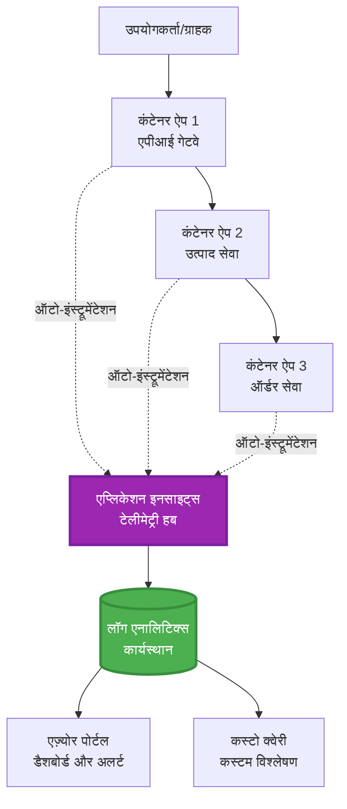
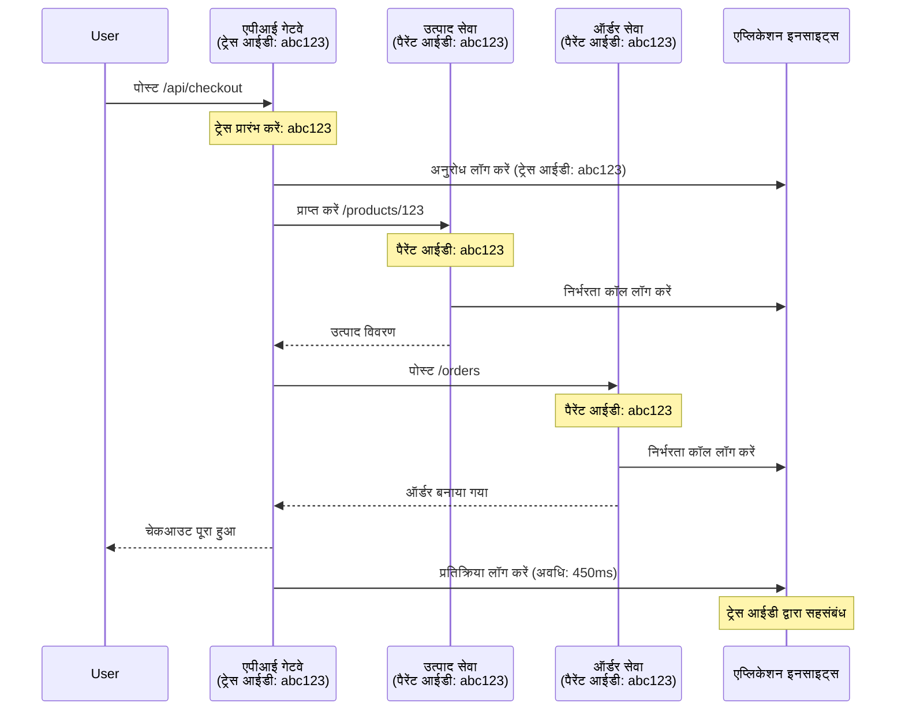

<!--
CO_OP_TRANSLATOR_METADATA:
{
  "original_hash": "e5aa37cdb6378c09099500ac31600b8c",
  "translation_date": "2025-11-20T02:39:41+00:00",
  "source_file": "docs/pre-deployment/application-insights.md",
  "language_code": "hi"
}
-->
# AZD के साथ Application Insights का एकीकरण

⏱️ **अनुमानित समय**: 40-50 मिनट | 💰 **लागत प्रभाव**: ~$5-15/माह | ⭐ **जटिलता**: मध्यम

**📚 सीखने का मार्ग:**
- ← पिछला: [Preflight Checks](preflight-checks.md) - प्री-डिप्लॉयमेंट सत्यापन
- 🎯 **आप यहाँ हैं**: Application Insights का एकीकरण (मॉनिटरिंग, टेलीमेट्री, डिबगिंग)
- → अगला: [Deployment Guide](../deployment/deployment-guide.md) - Azure पर डिप्लॉय करें
- 🏠 [कोर्स होम](../../README.md)

---

## आप क्या सीखेंगे

इस पाठ को पूरा करके, आप:
- **Application Insights** को AZD प्रोजेक्ट्स में स्वचालित रूप से एकीकृत करेंगे
- माइक्रोसर्विसेज के लिए **डिस्ट्रिब्यूटेड ट्रेसिंग** कॉन्फ़िगर करेंगे
- **कस्टम टेलीमेट्री** (मेट्रिक्स, इवेंट्स, डिपेंडेंसीज़) लागू करेंगे
- **लाइव मेट्रिक्स** सेट करेंगे ताकि रियल-टाइम मॉनिटरिंग हो सके
- AZD डिप्लॉयमेंट्स से **अलर्ट्स और डैशबोर्ड्स** बनाएंगे
- **टेलीमेट्री क्वेरीज़** के साथ प्रोडक्शन समस्याओं को डिबग करेंगे
- **लागत और सैंपलिंग** रणनीतियों को अनुकूलित करेंगे
- **AI/LLM एप्लिकेशन** (टोकन, लेटेंसी, लागत) मॉनिटर करेंगे

## AZD के साथ Application Insights क्यों महत्वपूर्ण है

### चुनौती: प्रोडक्शन ऑब्ज़र्वेबिलिटी

**Application Insights के बिना:**
```
❌ No visibility into production behavior
❌ Manual log aggregation across services
❌ Reactive debugging (wait for customer complaints)
❌ No performance metrics
❌ Cannot trace requests across services
❌ Unknown failure rates and bottlenecks
```

**Application Insights + AZD के साथ:**
```
✅ Automatic telemetry collection
✅ Centralized logs from all services
✅ Proactive issue detection
✅ End-to-end request tracing
✅ Performance metrics and insights
✅ Real-time dashboards
✅ AZD provisions everything automatically
```

**उदाहरण**: Application Insights आपके एप्लिकेशन के लिए "ब्लैक बॉक्स" फ्लाइट रिकॉर्डर + कॉकपिट डैशबोर्ड की तरह है। आप रियल-टाइम में सब कुछ देख सकते हैं और किसी भी घटना को फिर से चला सकते हैं।

---

## आर्किटेक्चर का अवलोकन

### AZD आर्किटेक्चर में Application Insights


### स्वचालित रूप से क्या मॉनिटर होता है

| टेलीमेट्री प्रकार | यह क्या कैप्चर करता है | उपयोग का मामला |
|----------------|------------------|----------|
| **रिक्वेस्ट्स** | HTTP रिक्वेस्ट्स, स्टेटस कोड्स, अवधि | API प्रदर्शन मॉनिटरिंग |
| **डिपेंडेंसीज़** | बाहरी कॉल्स (DB, APIs, स्टोरेज) | बॉटलनेक्स की पहचान |
| **एक्सेप्शन्स** | अनहैंडल्ड एरर्स के साथ स्टैक ट्रेसेस | विफलताओं को डिबग करना |
| **कस्टम इवेंट्स** | बिजनेस इवेंट्स (साइनअप, खरीदारी) | एनालिटिक्स और फनल्स |
| **मेट्रिक्स** | प्रदर्शन काउंटर्स, कस्टम मेट्रिक्स | क्षमता योजना |
| **ट्रेसस** | लॉग संदेशों के साथ गंभीरता | डिबगिंग और ऑडिटिंग |
| **उपलब्धता** | अपटाइम और प्रतिक्रिया समय परीक्षण | SLA मॉनिटरिंग |

---

## आवश्यकताएँ

### आवश्यक उपकरण

```bash
# Azure Developer CLI को सत्यापित करें
azd version
# ✅ अपेक्षित: azd संस्करण 1.0.0 या उच्चतर

# Azure CLI को सत्यापित करें
az --version
# ✅ अपेक्षित: azure-cli 2.50.0 या उच्चतर
```

### Azure आवश्यकताएँ

- सक्रिय Azure सब्सक्रिप्शन
- निम्नलिखित बनाने की अनुमति:
  - Application Insights संसाधन
  - Log Analytics कार्यक्षेत्र
  - Container Apps
  - Resource Groups

### ज्ञान आवश्यकताएँ

आपको पूरा करना चाहिए:
- [AZD Basics](../getting-started/azd-basics.md) - AZD के मुख्य सिद्धांत
- [Configuration](../getting-started/configuration.md) - पर्यावरण सेटअप
- [First Project](../getting-started/first-project.md) - बुनियादी डिप्लॉयमेंट

---

## पाठ 1: AZD के साथ स्वचालित Application Insights

### AZD Application Insights कैसे प्रोविजन करता है

AZD स्वचालित रूप से Application Insights बनाता और कॉन्फ़िगर करता है जब आप डिप्लॉय करते हैं। आइए देखें कि यह कैसे काम करता है।

### प्रोजेक्ट संरचना

```
monitored-app/
├── azure.yaml                     # AZD configuration
├── infra/
│   ├── main.bicep                # Main infrastructure
│   ├── core/
│   │   └── monitoring.bicep      # Application Insights + Log Analytics
│   └── app/
│       └── api.bicep             # Container App with monitoring
└── src/
    ├── app.py                    # Application with telemetry
    ├── requirements.txt
    └── Dockerfile
```

---

### चरण 1: AZD कॉन्फ़िगर करें (azure.yaml)

**फ़ाइल: `azure.yaml`**

```yaml
name: monitored-app
metadata:
  template: monitored-app@1.0.0

services:
  api:
    project: ./src
    language: python
    host: containerapp

# AZD automatically provisions monitoring!
```

**बस इतना ही!** AZD डिफ़ॉल्ट रूप से Application Insights बनाएगा। बुनियादी मॉनिटरिंग के लिए अतिरिक्त कॉन्फ़िगरेशन की आवश्यकता नहीं है।

---

### चरण 2: मॉनिटरिंग इंफ्रास्ट्रक्चर (Bicep)

**फ़ाइल: `infra/core/monitoring.bicep`**

```bicep
param logAnalyticsName string
param applicationInsightsName string
param location string = resourceGroup().location
param tags object = {}

// Log Analytics Workspace (required for Application Insights)
resource logAnalytics 'Microsoft.OperationalInsights/workspaces@2022-10-01' = {
  name: logAnalyticsName
  location: location
  tags: tags
  properties: {
    sku: {
      name: 'PerGB2018'  // Pay-as-you-go pricing
    }
    retentionInDays: 30  // Keep logs for 30 days
    features: {
      enableLogAccessUsingOnlyResourcePermissions: true
    }
  }
}

// Application Insights
resource applicationInsights 'Microsoft.Insights/components@2020-02-02' = {
  name: applicationInsightsName
  location: location
  tags: tags
  kind: 'web'
  properties: {
    Application_Type: 'web'
    WorkspaceResourceId: logAnalytics.id
    IngestionMode: 'LogAnalytics'
    publicNetworkAccessForIngestion: 'Enabled'
    publicNetworkAccessForQuery: 'Enabled'
  }
}

// Outputs for Container Apps
output logAnalyticsWorkspaceId string = logAnalytics.id
output logAnalyticsWorkspaceName string = logAnalytics.name
output applicationInsightsConnectionString string = applicationInsights.properties.ConnectionString
output applicationInsightsInstrumentationKey string = applicationInsights.properties.InstrumentationKey
output applicationInsightsName string = applicationInsights.name
```

---

### चरण 3: Container App को Application Insights से कनेक्ट करें

**फ़ाइल: `infra/app/api.bicep`**

```bicep
param name string
param location string
param tags object = {}
param containerAppsEnvironmentName string
param applicationInsightsConnectionString string

resource containerApp 'Microsoft.App/containerApps@2023-05-01' = {
  name: name
  location: location
  tags: tags
  properties: {
    configuration: {
      ingress: {
        external: true
        targetPort: 8000
      }
      secrets: [
        {
          name: 'appinsights-connection-string'
          value: applicationInsightsConnectionString
        }
      ]
    }
    template: {
      containers: [
        {
          name: 'api'
          image: 'myregistry.azurecr.io/api:latest'
          resources: {
            cpu: json('0.5')
            memory: '1Gi'
          }
          env: [
            {
              name: 'APPLICATIONINSIGHTS_CONNECTION_STRING'
              secretRef: 'appinsights-connection-string'
            }
            {
              name: 'APPLICATIONINSIGHTS_ENABLED'
              value: 'true'
            }
          ]
        }
      ]
    }
  }
}

output uri string = 'https://${containerApp.properties.configuration.ingress.fqdn}'
```

---

### चरण 4: टेलीमेट्री के साथ एप्लिकेशन कोड

**फ़ाइल: `src/app.py`**

```python
from flask import Flask, request, jsonify
from opencensus.ext.azure.log_exporter import AzureLogHandler
from opencensus.ext.azure.trace_exporter import AzureExporter
from opencensus.ext.flask.flask_middleware import FlaskMiddleware
from opencensus.trace.samplers import ProbabilitySampler
import logging
import os

app = Flask(__name__)

# एप्लिकेशन इनसाइट्स कनेक्शन स्ट्रिंग प्राप्त करें
connection_string = os.environ.get('APPLICATIONINSIGHTS_CONNECTION_STRING')

if connection_string:
    # वितरित ट्रेसिंग कॉन्फ़िगर करें
    middleware = FlaskMiddleware(
        app,
        exporter=AzureExporter(connection_string=connection_string),
        sampler=ProbabilitySampler(rate=1.0)  # डेवलपमेंट के लिए 100% सैंपलिंग
    )
    
    # लॉगिंग कॉन्फ़िगर करें
    logger = logging.getLogger(__name__)
    logger.addHandler(AzureLogHandler(connection_string=connection_string))
    logger.setLevel(logging.INFO)
    
    print("✅ Application Insights enabled")
else:
    logger = logging.getLogger(__name__)
    logger.setLevel(logging.INFO)
    print("⚠️ Application Insights not configured")

@app.route('/health')
def health():
    logger.info('Health check endpoint called')
    return jsonify({'status': 'healthy', 'monitoring': 'enabled'})

@app.route('/api/products')
def get_products():
    logger.info('Fetching products')
    
    # डेटाबेस कॉल का अनुकरण करें (स्वचालित रूप से निर्भरता के रूप में ट्रैक किया गया)
    products = [
        {'id': 1, 'name': 'Laptop', 'price': 999.99},
        {'id': 2, 'name': 'Mouse', 'price': 29.99},
        {'id': 3, 'name': 'Keyboard', 'price': 79.99}
    ]
    
    logger.info(f'Returned {len(products)} products')
    return jsonify(products)

@app.route('/api/error-test')
def error_test():
    """Test error tracking"""
    logger.error('Testing error tracking')
    try:
        raise ValueError('This is a test exception')
    except Exception as e:
        logger.exception('Exception occurred in error-test endpoint')
        return jsonify({'error': str(e)}), 500

@app.route('/api/slow')
def slow_endpoint():
    """Test performance tracking"""
    import time
    logger.info('Slow endpoint called')
    time.sleep(3)  # धीमी प्रक्रिया का अनुकरण करें
    logger.warning('Endpoint took 3 seconds to respond')
    return jsonify({'message': 'Slow operation completed'})

if __name__ == '__main__':
    app.run(host='0.0.0.0', port=8000)
```

**फ़ाइल: `src/requirements.txt`**

```txt
Flask==3.0.0
opencensus-ext-azure==1.1.13
opencensus-ext-flask==0.8.1
gunicorn==21.2.0
```

---

### चरण 5: डिप्लॉय करें और सत्यापित करें

```bash
# AZD प्रारंभ करें
azd init

# परिनियोजन करें (स्वचालित रूप से एप्लिकेशन इनसाइट्स प्रदान करता है)
azd up

# ऐप URL प्राप्त करें
APP_URL=$(azd env get-values | grep API_URL | cut -d '=' -f2 | tr -d '"')

# टेलीमेट्री उत्पन्न करें
curl $APP_URL/health
curl $APP_URL/api/products
curl $APP_URL/api/error-test
curl $APP_URL/api/slow
```

**✅ अपेक्षित आउटपुट:**
```json
{
  "status": "healthy",
  "monitoring": "enabled"
}
```

---

### चरण 6: Azure पोर्टल में टेलीमेट्री देखें

```bash
# एप्लिकेशन इनसाइट्स विवरण प्राप्त करें
azd env get-values | grep APPLICATIONINSIGHTS

# Azure पोर्टल में खोलें
az monitor app-insights component show \
  --app $(azd env get-values | grep APPLICATIONINSIGHTS_NAME | cut -d '=' -f2 | tr -d '"') \
  --resource-group $(azd env get-values | grep AZURE_RESOURCE_GROUP | cut -d '=' -f2 | tr -d '"') \
  --query "appId" -o tsv
```

**Azure पोर्टल → Application Insights → Transaction Search पर जाएं**

आपको देखना चाहिए:
- ✅ HTTP रिक्वेस्ट्स के साथ स्टेटस कोड्स
- ✅ रिक्वेस्ट अवधि (`/api/slow` के लिए 3+ सेकंड)
- ✅ `/api/error-test` से एक्सेप्शन विवरण
- ✅ कस्टम लॉग संदेश

---

## पाठ 2: कस्टम टेलीमेट्री और इवेंट्स

### बिजनेस इवेंट्स ट्रैक करें

आइए बिजनेस-क्रिटिकल इवेंट्स के लिए कस्टम टेलीमेट्री जोड़ें।

**फ़ाइल: `src/telemetry.py`**

```python
from opencensus.ext.azure import metrics_exporter
from opencensus.stats import aggregation as aggregation_module
from opencensus.stats import measure as measure_module
from opencensus.stats import stats as stats_module
from opencensus.stats import view as view_module
from opencensus.tags import tag_map as tag_map_module
from opencensus.ext.azure.log_exporter import AzureLogHandler
from opencensus.ext.azure.trace_exporter import AzureExporter
from opencensus.trace import tracer as tracer_module
import logging
import os

class TelemetryClient:
    """Custom telemetry client for Application Insights"""
    
    def __init__(self, connection_string=None):
        self.connection_string = connection_string or os.environ.get('APPLICATIONINSIGHTS_CONNECTION_STRING')
        
        if not self.connection_string:
            print("⚠️ Application Insights connection string not found")
            return
        
        # लॉगर सेटअप करें
        self.logger = logging.getLogger(__name__)
        self.logger.addHandler(AzureLogHandler(connection_string=self.connection_string))
        self.logger.setLevel(logging.INFO)
        
        # मेट्रिक्स निर्यातक सेटअप करें
        self.stats = stats_module.stats
        self.view_manager = self.stats.view_manager
        self.stats_recorder = self.stats.stats_recorder
        
        exporter = metrics_exporter.new_metrics_exporter(
            connection_string=self.connection_string
        )
        self.view_manager.register_exporter(exporter)
        
        # ट्रेसर सेटअप करें
        self.tracer = tracer_module.Tracer(
            exporter=AzureExporter(connection_string=self.connection_string)
        )
        
        print("✅ Custom telemetry client initialized")
    
    def track_event(self, event_name: str, properties: dict = None):
        """Track custom business event"""
        properties = properties or {}
        self.logger.info(
            f"CustomEvent: {event_name}",
            extra={
                'custom_dimensions': {
                    'event_name': event_name,
                    **properties
                }
            }
        )
    
    def track_metric(self, metric_name: str, value: float, properties: dict = None):
        """Track custom metric"""
        properties = properties or {}
        self.logger.info(
            f"CustomMetric: {metric_name} = {value}",
            extra={
                'custom_dimensions': {
                    'metric_name': metric_name,
                    'value': value,
                    **properties
                }
            }
        )
    
    def track_dependency(self, name: str, dependency_type: str, duration: float, success: bool):
        """Track external dependency call"""
        with self.tracer.span(name=name) as span:
            span.add_attribute('dependency.type', dependency_type)
            span.add_attribute('duration', duration)
            span.add_attribute('success', success)

# ग्लोबल टेलीमेट्री क्लाइंट
telemetry = TelemetryClient()
```

### कस्टम इवेंट्स के साथ एप्लिकेशन अपडेट करें

**फ़ाइल: `src/app.py` (संवर्धित)**

```python
from flask import Flask, request, jsonify
from telemetry import telemetry
import time
import random

app = Flask(__name__)

@app.route('/api/purchase', methods=['POST'])
def purchase():
    """Track purchase event with custom telemetry"""
    data = request.json
    product_id = data.get('product_id')
    quantity = data.get('quantity', 1)
    price = data.get('price', 0)
    
    # व्यापार घटना का ट्रैक करें
    telemetry.track_event('Purchase', {
        'product_id': product_id,
        'quantity': quantity,
        'total_amount': price * quantity,
        'user_id': request.headers.get('X-User-Id', 'anonymous')
    })
    
    # राजस्व मीट्रिक का ट्रैक करें
    telemetry.track_metric('Revenue', price * quantity, {
        'product_id': product_id,
        'currency': 'USD'
    })
    
    return jsonify({
        'order_id': f'ORD-{random.randint(1000, 9999)}',
        'status': 'confirmed',
        'total': price * quantity
    })

@app.route('/api/search')
def search():
    """Track search queries"""
    query = request.args.get('q', '')
    
    start_time = time.time()
    
    # खोज का अनुकरण करें (वास्तविक डेटाबेस क्वेरी होगी)
    results = [{'id': 1, 'name': f'Result for {query}'}]
    
    duration = (time.time() - start_time) * 1000  # मिलीसेकंड में परिवर्तित करें
    
    # खोज घटना का ट्रैक करें
    telemetry.track_event('Search', {
        'query': query,
        'results_count': len(results),
        'duration_ms': duration
    })
    
    # खोज प्रदर्शन मीट्रिक का ट्रैक करें
    telemetry.track_metric('SearchDuration', duration, {
        'query_length': len(query)
    })
    
    return jsonify({'results': results, 'count': len(results)})

@app.route('/api/external-call')
def external_call():
    """Track external API dependency"""
    import requests
    
    start_time = time.time()
    success = True
    
    try:
        # बाहरी API कॉल का अनुकरण करें
        response = requests.get('https://api.example.com/data', timeout=5)
        result = response.json()
    except Exception as e:
        success = False
        result = {'error': str(e)}
    
    duration = (time.time() - start_time) * 1000
    
    # निर्भरता का ट्रैक करें
    telemetry.track_dependency(
        name='ExternalAPI',
        dependency_type='HTTP',
        duration=duration,
        success=success
    )
    
    return jsonify(result)

if __name__ == '__main__':
    app.run(host='0.0.0.0', port=8000)
```

### कस्टम टेलीमेट्री का परीक्षण करें

```bash
# खरीद इवेंट को ट्रैक करें
curl -X POST $APP_URL/api/purchase \
  -H "Content-Type: application/json" \
  -H "X-User-Id: user123" \
  -d '{"product_id": 1, "quantity": 2, "price": 29.99}'

# खोज इवेंट को ट्रैक करें
curl "$APP_URL/api/search?q=laptop"

# बाहरी निर्भरता को ट्रैक करें
curl $APP_URL/api/external-call
```

**Azure पोर्टल में देखें:**

Application Insights → Logs पर जाएं, फिर चलाएं:

```kusto
// View purchase events
traces
| where customDimensions.event_name == "Purchase"
| project 
    timestamp,
    product_id = tostring(customDimensions.product_id),
    total_amount = todouble(customDimensions.total_amount),
    user_id = tostring(customDimensions.user_id)
| order by timestamp desc

// View revenue metrics
traces
| where customDimensions.metric_name == "Revenue"
| summarize TotalRevenue = sum(todouble(customDimensions.value)) by bin(timestamp, 1h)
| render timechart

// View search performance
traces
| where customDimensions.event_name == "Search"
| summarize 
    AvgDuration = avg(todouble(customDimensions.duration_ms)),
    SearchCount = count()
  by bin(timestamp, 5m)
| render timechart
```

---

## पाठ 3: माइक्रोसर्विसेज के लिए डिस्ट्रिब्यूटेड ट्रेसिंग

### क्रॉस-सर्विस ट्रेसिंग सक्षम करें

माइक्रोसर्विसेज के लिए, Application Insights स्वचालित रूप से सेवाओं के बीच रिक्वेस्ट्स को जोड़ता है।

**फ़ाइल: `infra/main.bicep`**

```bicep
targetScope = 'subscription'

param environmentName string
param location string = 'eastus'

var tags = { 'azd-env-name': environmentName }

resource rg 'Microsoft.Resources/resourceGroups@2021-04-01' = {
  name: 'rg-${environmentName}'
  location: location
  tags: tags
}

// Monitoring (shared by all services)
module monitoring './core/monitoring.bicep' = {
  name: 'monitoring'
  scope: rg
  params: {
    logAnalyticsName: 'log-${environmentName}'
    applicationInsightsName: 'appi-${environmentName}'
    location: location
    tags: tags
  }
}

// API Gateway
module apiGateway './app/api-gateway.bicep' = {
  name: 'api-gateway'
  scope: rg
  params: {
    name: 'ca-gateway-${environmentName}'
    location: location
    tags: union(tags, { 'azd-service-name': 'gateway' })
    applicationInsightsConnectionString: monitoring.outputs.applicationInsightsConnectionString
  }
}

// Product Service
module productService './app/product-service.bicep' = {
  name: 'product-service'
  scope: rg
  params: {
    name: 'ca-products-${environmentName}'
    location: location
    tags: union(tags, { 'azd-service-name': 'products' })
    applicationInsightsConnectionString: monitoring.outputs.applicationInsightsConnectionString
  }
}

// Order Service
module orderService './app/order-service.bicep' = {
  name: 'order-service'
  scope: rg
  params: {
    name: 'ca-orders-${environmentName}'
    location: location
    tags: union(tags, { 'azd-service-name': 'orders' })
    applicationInsightsConnectionString: monitoring.outputs.applicationInsightsConnectionString
  }
}

output APPLICATIONINSIGHTS_CONNECTION_STRING string = monitoring.outputs.applicationInsightsConnectionString
output GATEWAY_URL string = apiGateway.outputs.uri
```

### एंड-टू-एंड ट्रांजेक्शन देखें


**एंड-टू-एंड ट्रेस क्वेरी करें:**

```kusto
// Find complete request flow
let traceId = "abc123...";  // Get from response header
dependencies
| union requests
| where operation_Id == traceId
| project 
    timestamp,
    type = itemType,
    name,
    duration,
    success,
    cloud_RoleName
| order by timestamp asc
```

---

## पाठ 4: लाइव मेट्रिक्स और रियल-टाइम मॉनिटरिंग

### लाइव मेट्रिक्स स्ट्रीम सक्षम करें

लाइव मेट्रिक्स <1 सेकंड की विलंबता के साथ रियल-टाइम टेलीमेट्री प्रदान करता है।

**लाइव मेट्रिक्स तक पहुंचें:**

```bash
# एप्लिकेशन इनसाइट्स संसाधन प्राप्त करें
APPI_NAME=$(azd env get-values | grep APPLICATIONINSIGHTS_NAME | cut -d '=' -f2 | tr -d '"')

# संसाधन समूह प्राप्त करें
RG_NAME=$(azd env get-values | grep AZURE_RESOURCE_GROUP | cut -d '=' -f2 | tr -d '"')

echo "Navigate to: Azure Portal → Resource Groups → $RG_NAME → $APPI_NAME → Live Metrics"
```

**आप रियल-टाइम में क्या देखेंगे:**
- ✅ इनकमिंग रिक्वेस्ट दर (रिक्वेस्ट्स/सेकंड)
- ✅ आउटगोइंग डिपेंडेंसी कॉल्स
- ✅ एक्सेप्शन काउंट
- ✅ CPU और मेमोरी उपयोग
- ✅ सक्रिय सर्वर काउंट
- ✅ सैंपल टेलीमेट्री

### परीक्षण के लिए लोड उत्पन्न करें

```bash
# लाइव मेट्रिक्स देखने के लिए लोड उत्पन्न करें
for i in {1..100}; do
  curl $APP_URL/api/products &
  curl $APP_URL/api/search?q=test$i &
done

# Azure पोर्टल में लाइव मेट्रिक्स देखें
# आपको अनुरोध दर में वृद्धि दिखनी चाहिए
```

---

## व्यावहारिक अभ्यास

### अभ्यास 1: अलर्ट सेट करें ⭐⭐ (मध्यम)

**लक्ष्य**: उच्च एरर दर और धीमी प्रतिक्रियाओं के लिए अलर्ट बनाएं।

**चरण:**

1. **एरर दर के लिए अलर्ट बनाएं:**

```bash
# एप्लिकेशन इनसाइट्स संसाधन आईडी प्राप्त करें
APPI_ID=$(az monitor app-insights component show \
  --app $APPI_NAME \
  --resource-group $RG_NAME \
  --query "id" -o tsv)

# विफल अनुरोधों के लिए मीट्रिक अलर्ट बनाएं
az monitor metrics alert create \
  --name "High-Error-Rate" \
  --resource-group $RG_NAME \
  --scopes $APPI_ID \
  --condition "count requests/failed > 10" \
  --window-size 5m \
  --evaluation-frequency 1m \
  --description "Alert when error rate exceeds 10 per 5 minutes"
```

2. **धीमी प्रतिक्रियाओं के लिए अलर्ट बनाएं:**

```bash
az monitor metrics alert create \
  --name "Slow-Responses" \
  --resource-group $RG_NAME \
  --scopes $APPI_ID \
  --condition "avg requests/duration > 3000" \
  --window-size 5m \
  --evaluation-frequency 1m \
  --description "Alert when average response time exceeds 3 seconds"
```

3. **Bicep के माध्यम से अलर्ट बनाएं (AZD के लिए पसंदीदा):**

**फ़ाइल: `infra/core/alerts.bicep`**

```bicep
param applicationInsightsId string
param actionGroupId string = ''
param location string = resourceGroup().location

// High error rate alert
resource errorRateAlert 'Microsoft.Insights/metricAlerts@2018-03-01' = {
  name: 'high-error-rate'
  location: 'global'
  properties: {
    description: 'Alert when error rate exceeds threshold'
    severity: 2
    enabled: true
    scopes: [
      applicationInsightsId
    ]
    evaluationFrequency: 'PT1M'
    windowSize: 'PT5M'
    criteria: {
      'odata.type': 'Microsoft.Azure.Monitor.SingleResourceMultipleMetricCriteria'
      allOf: [
        {
          name: 'Error rate'
          metricName: 'requests/failed'
          operator: 'GreaterThan'
          threshold: 10
          timeAggregation: 'Count'
        }
      ]
    }
    actions: actionGroupId != '' ? [
      {
        actionGroupId: actionGroupId
      }
    ] : []
  }
}

// Slow response alert
resource slowResponseAlert 'Microsoft.Insights/metricAlerts@2018-03-01' = {
  name: 'slow-responses'
  location: 'global'
  properties: {
    description: 'Alert when response time is too high'
    severity: 3
    enabled: true
    scopes: [
      applicationInsightsId
    ]
    evaluationFrequency: 'PT1M'
    windowSize: 'PT5M'
    criteria: {
      'odata.type': 'Microsoft.Azure.Monitor.SingleResourceMultipleMetricCriteria'
      allOf: [
        {
          name: 'Response duration'
          metricName: 'requests/duration'
          operator: 'GreaterThan'
          threshold: 3000
          timeAggregation: 'Average'
        }
      ]
    }
  }
}

output errorAlertId string = errorRateAlert.id
output slowResponseAlertId string = slowResponseAlert.id
```

4. **अलर्ट का परीक्षण करें:**

```bash
# त्रुटियां उत्पन्न करें
for i in {1..20}; do
  curl $APP_URL/api/error-test
done

# धीमी प्रतिक्रियाएं उत्पन्न करें
for i in {1..10}; do
  curl $APP_URL/api/slow
done

# अलर्ट स्थिति की जांच करें (5-10 मिनट प्रतीक्षा करें)
az monitor metrics alert list \
  --resource-group $RG_NAME \
  --query "[].{Name:name, Enabled:enabled, State:properties.enabled}" \
  --output table
```

**✅ सफलता मानदंड:**
- ✅ अलर्ट्स सफलतापूर्वक बनाए गए
- ✅ थ्रेशोल्ड्स पार होने पर अलर्ट्स फायर होते हैं
- ✅ Azure पोर्टल में अलर्ट इतिहास देख सकते हैं
- ✅ AZD डिप्लॉयमेंट के साथ एकीकृत

**समय**: 20-25 मिनट

---

### अभ्यास 2: कस्टम डैशबोर्ड बनाएं ⭐⭐ (मध्यम)

**लक्ष्य**: प्रमुख एप्लिकेशन मेट्रिक्स दिखाने वाला डैशबोर्ड बनाएं।

**चरण:**

1. **Azure पोर्टल के माध्यम से डैशबोर्ड बनाएं:**

जाएँ: Azure पोर्टल → डैशबोर्ड्स → नया डैशबोर्ड

2. **प्रमुख मेट्रिक्स के लिए टाइल्स जोड़ें:**

- रिक्वेस्ट काउंट (पिछले 24 घंटे)
- औसत प्रतिक्रिया समय
- एरर दर
- शीर्ष 5 सबसे धीमे ऑपरेशन्स
- उपयोगकर्ताओं का भौगोलिक वितरण

3. **Bicep के माध्यम से डैशबोर्ड बनाएं:**

**फ़ाइल: `infra/core/dashboard.bicep`**

```bicep
param dashboardName string
param applicationInsightsId string
param location string = resourceGroup().location

resource dashboard 'Microsoft.Portal/dashboards@2020-09-01-preview' = {
  name: dashboardName
  location: location
  properties: {
    lenses: [
      {
        order: 0
        parts: [
          // Request count
          {
            position: { x: 0, y: 0, rowSpan: 4, colSpan: 6 }
            metadata: {
              type: 'Extension/Microsoft_OperationsManagementSuite_Workspace/PartType/LogsDashboardPart'
              inputs: [
                {
                  name: 'resourceId'
                  value: applicationInsightsId
                }
                {
                  name: 'query'
                  value: '''
                    requests
                    | summarize RequestCount = count() by bin(timestamp, 1h)
                    | render timechart
                  '''
                }
              ]
            }
          }
          // Error rate
          {
            position: { x: 6, y: 0, rowSpan: 4, colSpan: 6 }
            metadata: {
              type: 'Extension/Microsoft_OperationsManagementSuite_Workspace/PartType/LogsDashboardPart'
              inputs: [
                {
                  name: 'resourceId'
                  value: applicationInsightsId
                }
                {
                  name: 'query'
                  value: '''
                    requests
                    | summarize 
                        Total = count(),
                        Failed = countif(success == false)
                    | extend ErrorRate = (Failed * 100.0) / Total
                    | project ErrorRate
                  '''
                }
              ]
            }
          }
        ]
      }
    ]
  }
}

output dashboardId string = dashboard.id
```

4. **डैशबोर्ड डिप्लॉय करें:**

```bash
# मुख्य.bicep में जोड़ें
module dashboard './core/dashboard.bicep' = {
  name: 'dashboard'
  scope: rg
  params: {
    dashboardName: 'dashboard-${environmentName}'
    applicationInsightsId: monitoring.outputs.applicationInsightsId
    location: location
  }
}

# तैनात करें
azd up
```

**✅ सफलता मानदंड:**
- ✅ डैशबोर्ड प्रमुख मेट्रिक्स दिखाता है
- ✅ Azure पोर्टल होम पर पिन कर सकते हैं
- ✅ रियल-टाइम में अपडेट होता है
- ✅ AZD के माध्यम से डिप्लॉय करने योग्य

**समय**: 25-30 मिनट

---

### अभ्यास 3: AI/LLM एप्लिकेशन मॉनिटर करें ⭐⭐⭐ (उन्नत)

**लक्ष्य**: Azure OpenAI उपयोग (टोकन, लागत, लेटेंसी) ट्रैक करें।

**चरण:**

1. **AI मॉनिटरिंग रैपर बनाएं:**

**फ़ाइल: `src/ai_telemetry.py`**

```python
from telemetry import telemetry
from openai import AzureOpenAI
import time

class MonitoredAzureOpenAI:
    """Azure OpenAI client with automatic telemetry"""
    
    def __init__(self, api_key, endpoint, api_version="2024-02-01"):
        self.client = AzureOpenAI(
            api_key=api_key,
            api_version=api_version,
            azure_endpoint=endpoint
        )
    
    def chat_completion(self, model: str, messages: list, **kwargs):
        """Track chat completion with telemetry"""
        start_time = time.time()
        
        try:
            # Azure OpenAI को कॉल करें
            response = self.client.chat.completions.create(
                model=model,
                messages=messages,
                **kwargs
            )
            
            duration = (time.time() - start_time) * 1000  # एमएस
            
            # उपयोग निकालें
            usage = response.usage
            prompt_tokens = usage.prompt_tokens
            completion_tokens = usage.completion_tokens
            total_tokens = usage.total_tokens
            
            # लागत की गणना करें (GPT-4 मूल्य निर्धारण)
            prompt_cost = (prompt_tokens / 1000) * 0.03  # $0.03 प्रति 1K टोकन
            completion_cost = (completion_tokens / 1000) * 0.06  # $0.06 प्रति 1K टोकन
            total_cost = prompt_cost + completion_cost
            
            # कस्टम इवेंट ट्रैक करें
            telemetry.track_event('OpenAI_Request', {
                'model': model,
                'prompt_tokens': prompt_tokens,
                'completion_tokens': completion_tokens,
                'total_tokens': total_tokens,
                'duration_ms': duration,
                'cost_usd': total_cost,
                'success': True
            })
            
            # मेट्रिक्स ट्रैक करें
            telemetry.track_metric('OpenAI_Tokens', total_tokens, {
                'model': model,
                'type': 'total'
            })
            
            telemetry.track_metric('OpenAI_Cost', total_cost, {
                'model': model,
                'currency': 'USD'
            })
            
            telemetry.track_metric('OpenAI_Duration', duration, {
                'model': model
            })
            
            return response
            
        except Exception as e:
            duration = (time.time() - start_time) * 1000
            
            telemetry.track_event('OpenAI_Request', {
                'model': model,
                'duration_ms': duration,
                'success': False,
                'error': str(e)
            })
            
            raise
```

2. **मॉनिटर किए गए क्लाइंट का उपयोग करें:**

```python
from flask import Flask, request, jsonify
from ai_telemetry import MonitoredAzureOpenAI
import os

app = Flask(__name__)

# मॉनिटर किए गए OpenAI क्लाइंट को प्रारंभ करें
openai_client = MonitoredAzureOpenAI(
    api_key=os.environ['AZURE_OPENAI_API_KEY'],
    endpoint=os.environ['AZURE_OPENAI_ENDPOINT']
)

@app.route('/api/chat', methods=['POST'])
def chat():
    data = request.json
    user_message = data.get('message')
    
    # स्वचालित मॉनिटरिंग के साथ कॉल करें
    response = openai_client.chat_completion(
        model='gpt-4',
        messages=[
            {'role': 'user', 'content': user_message}
        ]
    )
    
    return jsonify({
        'response': response.choices[0].message.content,
        'tokens': response.usage.total_tokens
    })
```

3. **AI मेट्रिक्स क्वेरी करें:**

```kusto
// Total AI spend over time
traces
| where customDimensions.event_name == "OpenAI_Request"
| where customDimensions.success == "True"
| summarize TotalCost = sum(todouble(customDimensions.cost_usd)) by bin(timestamp, 1h)
| render timechart

// Token usage by model
traces
| where customDimensions.event_name == "OpenAI_Request"
| summarize 
    TotalTokens = sum(toint(customDimensions.total_tokens)),
    RequestCount = count()
  by Model = tostring(customDimensions.model)

// Average latency
traces
| where customDimensions.event_name == "OpenAI_Request"
| summarize AvgDuration = avg(todouble(customDimensions.duration_ms))
| project AvgDurationSeconds = AvgDuration / 1000

// Cost per request
traces
| where customDimensions.event_name == "OpenAI_Request"
| extend Cost = todouble(customDimensions.cost_usd)
| summarize 
    TotalCost = sum(Cost),
    RequestCount = count(),
    AvgCostPerRequest = avg(Cost)
```

**✅ सफलता मानदंड:**
- ✅ हर OpenAI कॉल स्वचालित रूप से ट्रैक होता है
- ✅ टोकन उपयोग और लागत दिखाई देती है
- ✅ लेटेंसी मॉनिटर होती है
- ✅ बजट अलर्ट सेट कर सकते हैं

**समय**: 35-45 मिनट

---

## लागत अनुकूलन

### सैंपलिंग रणनीतियाँ

टेलीमेट्री को सैंपलिंग करके लागत नियंत्रित करें:

```python
from opencensus.trace.samplers import ProbabilitySampler

# विकास: 100% नमूनाकरण
sampler = ProbabilitySampler(rate=1.0)

# उत्पादन: 10% नमूनाकरण (लागत को 90% तक कम करें)
sampler = ProbabilitySampler(rate=0.1)

# अनुकूली नमूनाकरण (स्वचालित रूप से समायोजित होता है)
from opencensus.trace.samplers import AdaptiveSampler
sampler = AdaptiveSampler()
```

**Bicep में:**

```bicep
resource applicationInsights 'Microsoft.Insights/components@2020-02-02' = {
  name: applicationInsightsName
  properties: {
    SamplingPercentage: 10  // 10% sampling
  }
}
```

### डेटा रिटेंशन

```bicep
resource logAnalytics 'Microsoft.OperationalInsights/workspaces@2022-10-01' = {
  name: logAnalyticsName
  properties: {
    retentionInDays: 30  // Minimum (cheapest)
    // Options: 30, 31, 60, 90, 120, 180, 270, 365, 550, 730
  }
}
```

### मासिक लागत अनुमान

| डेटा वॉल्यूम | रिटेंशन | मासिक लागत |
|-------------|-----------|--------------|
| 1 GB/माह | 30 दिन | ~$2-5 |
| 5 GB/माह | 30 दिन | ~$10-15 |
| 10 GB/माह | 90 दिन | ~$25-40 |
| 50 GB/माह | 90 दिन | ~$100-150 |

**फ्री टियर**: 5 GB/माह शामिल

---

## ज्ञान चेकपॉइंट

### 1. बुनियादी एकीकरण ✓

अपनी समझ का परीक्षण करें:

- [ ] **Q1**: AZD Application Insights कैसे प्रोविजन करता है?
  - **A**: स्वचालित रूप से `infra/core/monitoring.bicep` में Bicep टेम्पलेट्स के माध्यम से

- [ ] **Q2**: कौन सा पर्यावरण वेरिएबल Application Insights को सक्षम करता है?
  - **A**: `APPLICATIONINSIGHTS_CONNECTION_STRING`

- [ ] **Q3**: तीन मुख्य टेलीमेट्री प्रकार क्या हैं?
  - **A**: रिक्वेस्ट्स (HTTP कॉल्स), डिपेंडेंसीज़ (बाहरी कॉल्स), एक्सेप्शन्स (एरर्स)

**हैंड्स-ऑन सत्यापन:**
```bash
# जांचें कि एप्लिकेशन इनसाइट्स कॉन्फ़िगर किया गया है
azd env get-values | grep APPLICATIONINSIGHTS

# सत्यापित करें कि टेलीमेट्री प्रवाहित हो रही है
az monitor app-insights metrics show \
  --app $APPI_NAME \
  --resource-group $RG_NAME \
  --metric "requests/count"
```

---

### 2. कस्टम टेलीमेट्री ✓

अपनी समझ का परीक्षण करें:

- [ ] **Q1**: आप कस्टम बिजनेस इवेंट्स को कैसे ट्रैक करते हैं?
  - **A**: `custom_dimensions` या `TelemetryClient.track_event()` के साथ लॉगर का उपयोग करें

- [ ] **Q2**: इवेंट्स और मेट्रिक्स में क्या अंतर है?
  - **A**: इवेंट्स विशिष्ट घटनाएँ हैं, मेट्रिक्स संख्यात्मक माप हैं

- [ ] **Q3**: आप सेवाओं के बीच टेलीमेट्री को कैसे जोड़ते हैं?
  - **A**: Application Insights स्वचालित रूप से `operation_Id` का उपयोग करता है

**हैंड्स-ऑन सत्यापन:**
```kusto
// Verify custom events
traces
| where customDimensions.event_name != ""
| summarize count() by tostring(customDimensions.event_name)
```

---

### 3. प्रोडक्शन मॉनिटरिंग ✓

अपनी समझ का परीक्षण करें:

- [ ] **Q1**: सैंपलिंग क्या है और इसका उपयोग क्यों करें?
  - **A**: सैंपलिंग डेटा वॉल्यूम (और लागत) को कम करता है केवल टेलीमेट्री का एक प्रतिशत कैप्चर करके

- [ ] **Q2**: आप अलर्ट्स कैसे सेट करते हैं?
  - **A**: Application Insights मेट्रिक्स के आधार पर Bicep या Azure पोर्टल में मेट्रिक अलर्ट्स का उपयोग करें

- [ ] **Q3**: Log Analytics और Application Insights में क्या अंतर है?
  - **A**: Application Insights डेटा को Log Analytics कार्यक्षेत्र में संग्रहीत करता है; App Insights एप्लिकेशन-विशिष्ट दृश्य प्रदान करता है

**हैंड्स-ऑन सत्यापन:**
```bash
# नमूना कॉन्फ़िगरेशन की जांच करें
az monitor app-insights component show \
  --app $APPI_NAME \
  --resource-group $RG_NAME \
  --query "properties.SamplingPercentage"
```

---

## सर्वोत्तम प्रथाएँ

### ✅ करें:

1. **कोरिलेशन IDs का उपयोग करें**
   ```python
   logger.info('Processing order', extra={
       'custom_dimensions': {
           'order_id': order_id,
           'user_id': user_id
       }
   })
   ```

2. **महत्वपूर्ण मेट्रिक्स के लिए अलर्ट सेट करें**
   ```bicep
   // Error rate, slow responses, availability
   ```

3. **संरचित लॉगिंग का उपयोग करें**
   ```python
   # ✅ अच्छा: संरचित
   logger.info('User signup', extra={'custom_dimensions': {'user_id': 123}})
   
   # ❌ बुरा: असंरचित
   logger.info(f'User 123 signed up')
   ```

4. **डिपेंडेंसीज़ मॉनिटर करें**
   ```python
   # स्वचालित रूप से डेटाबेस कॉल, HTTP अनुरोध, आदि को ट्रैक करें।
   ```

5. **डिप्लॉयमेंट्स के दौरान लाइव मेट्रिक्स का उपयोग करें**

### ❌ न करें:

1. **संवेदनशील डेटा लॉग न करें**
   ```python
   # ❌ खराब
   logger.info(f'Login: {username}:{password}')
   
   # ✅ अच्छा
   logger.info('Login attempt', extra={'custom_dimensions': {'username': username}})
   ```

2. **प्रोडक्शन में 100% सैंपलिंग का उपयोग न करें**
   ```python
   # ❌ महंगा
   sampler = ProbabilitySampler(rate=1.0)
   
   # ✅ लागत प्रभावी
   sampler = ProbabilitySampler(rate=0.1)
   ```

3. **डेड लेटर क्यूज़ को अनदेखा न करें**

4. **डेटा रिटेंशन सीमाएँ सेट करना न भूलें**

---

## समस्या निवारण

### समस्या: कोई टेलीमेट्री दिखाई नहीं दे रही

**निदान:**
```bash
# जांचें कि कनेक्शन स्ट्रिंग सेट है
azd env get-values | grep APPLICATIONINSIGHTS

# एप्लिकेशन लॉग्स जांचें
azd logs api --tail 50
```

**समाधान:**
```bash
# कंटेनर ऐप में कनेक्शन स्ट्रिंग की पुष्टि करें
az containerapp show \
  --name $APP_NAME \
  --resource-group $RG_NAME \
  --query "properties.template.containers[0].env" \
  | grep -i applicationinsights
```

---

### समस्या: उच्च लागत

**निदान:**
```bash
# डेटा इनजेशन की जांच करें
az monitor app-insights metrics show \
  --app $APPI_NAME \
  --resource-group $RG_NAME \
  --metric "availabilityResults/count"
```

**समाधान:**
- सैंपलिंग दर कम करें
- रिटेंशन अवधि घटाएँ
- विस्तृत लॉगिंग हटाएँ

---

## अधिक जानें

### आधिकारिक दस्तावेज़
- [Application Insights Overview](https://learn.microsoft.com/azure/azure-monitor/app/app-insights-overview)
- [Application Insights for Python](https://learn.microsoft.com/azure/azure-monitor/app/opencensus-python)
- [Kusto Query Language](https://learn.microsoft.com/azure/data-explorer/kusto/query/)
- [AZD Monitoring](https://learn.microsoft.com/azure/developer/azure-developer-cli/monitor-your-app)

### इस कोर्स में अगले चरण
- ← पिछला: [Preflight Checks](preflight-checks.md)
- → अगला: [Deployment Guide](../deployment/deployment-guide.md)
- 🏠 [कोर्स होम](../../README.md)

### संबंधित उदाहरण
- [Azure OpenAI Example](../../../../examples/azure-openai-chat) - AI टेलीमेट्री
- [Microservices Example](../../../../examples/microservices) - डिस्ट्रिब्यूटेड ट्रेसिंग

---

## सारांश

**आपने सीखा:**
- ✅ AZD के साथ स्वचालित Application Insights प्रोविजनिंग
- ✅ कस्टम टेलीमेट्री (इवेंट्स, मेट्रिक्स, डिपेंडेंसीज़)
- ✅ माइक्रोसर्विसेज के बीच डिस्ट्रिब्यूटेड ट्रेसिंग
- ✅ लाइव मेट्रिक्स और रियल-टाइम मॉनिटरिंग
- ✅ अलर्ट्स और डैशबोर्ड्स
- ✅ एआई/एलएलएम एप्लिकेशन मॉनिटरिंग  
- ✅ लागत अनुकूलन रणनीतियाँ  

**मुख्य बातें:**  
1. **AZD स्वचालित रूप से मॉनिटरिंग प्रदान करता है** - कोई मैनुअल सेटअप की आवश्यकता नहीं  
2. **संरचित लॉगिंग का उपयोग करें** - क्वेरी करना आसान बनाता है  
3. **व्यावसायिक घटनाओं को ट्रैक करें** - केवल तकनीकी मेट्रिक्स नहीं  
4. **एआई लागत की निगरानी करें** - टोकन और खर्च को ट्रैक करें  
5. **अलर्ट सेट करें** - प्रतिक्रियात्मक नहीं, सक्रिय रहें  
6. **लागत को अनुकूलित करें** - सैंपलिंग और रिटेंशन लिमिट्स का उपयोग करें  

**अगले कदम:**  
1. व्यावहारिक अभ्यास पूरे करें  
2. अपने AZD प्रोजेक्ट्स में Application Insights जोड़ें  
3. अपनी टीम के लिए कस्टम डैशबोर्ड बनाएं  
4. [डिप्लॉयमेंट गाइड](../deployment/deployment-guide.md) सीखें  

---

<!-- CO-OP TRANSLATOR DISCLAIMER START -->
**अस्वीकरण**:  
यह दस्तावेज़ AI अनुवाद सेवा [Co-op Translator](https://github.com/Azure/co-op-translator) का उपयोग करके अनुवादित किया गया है। जबकि हम सटीकता के लिए प्रयास करते हैं, कृपया ध्यान दें कि स्वचालित अनुवाद में त्रुटियां या अशुद्धियां हो सकती हैं। मूल भाषा में दस्तावेज़ को आधिकारिक स्रोत माना जाना चाहिए। महत्वपूर्ण जानकारी के लिए, पेशेवर मानव अनुवाद की सिफारिश की जाती है। इस अनुवाद के उपयोग से उत्पन्न किसी भी गलतफहमी या गलत व्याख्या के लिए हम उत्तरदायी नहीं हैं।
<!-- CO-OP TRANSLATOR DISCLAIMER END -->