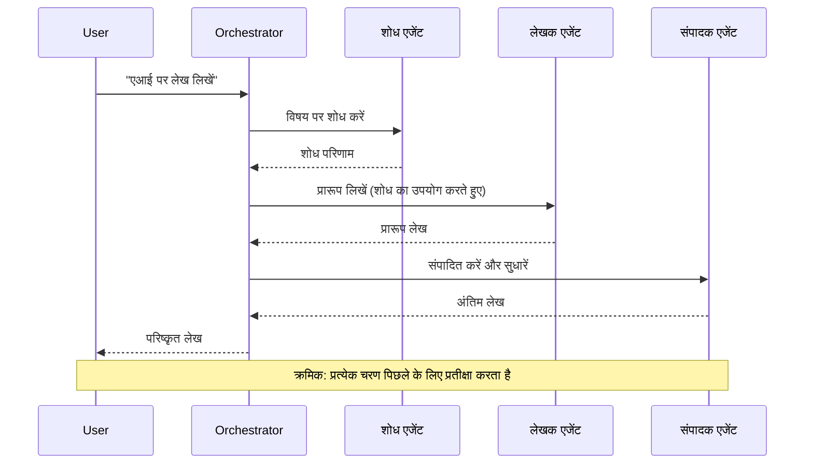
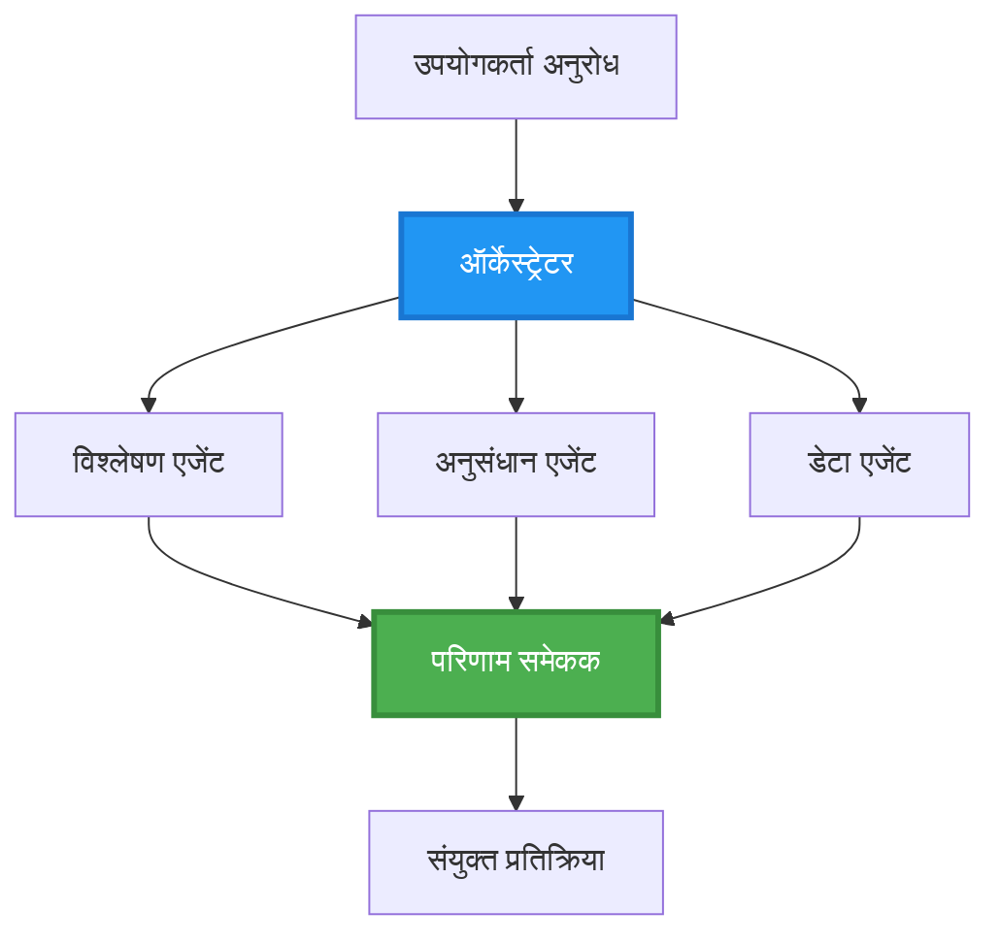
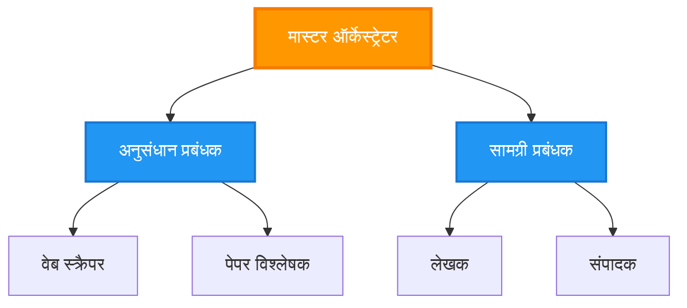
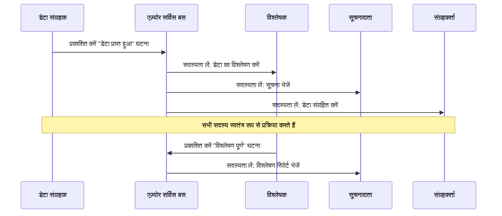
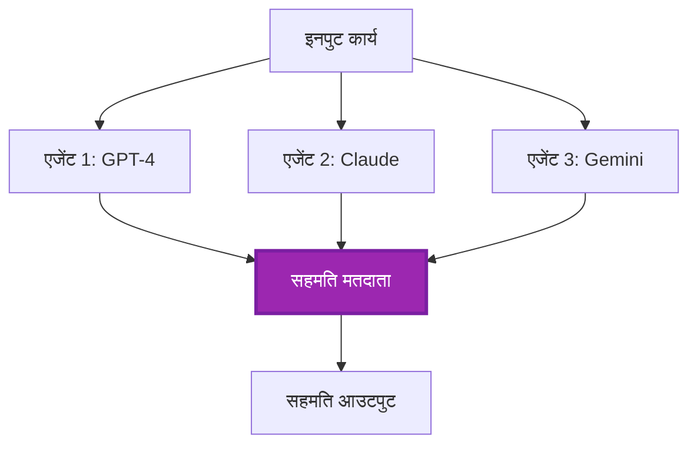
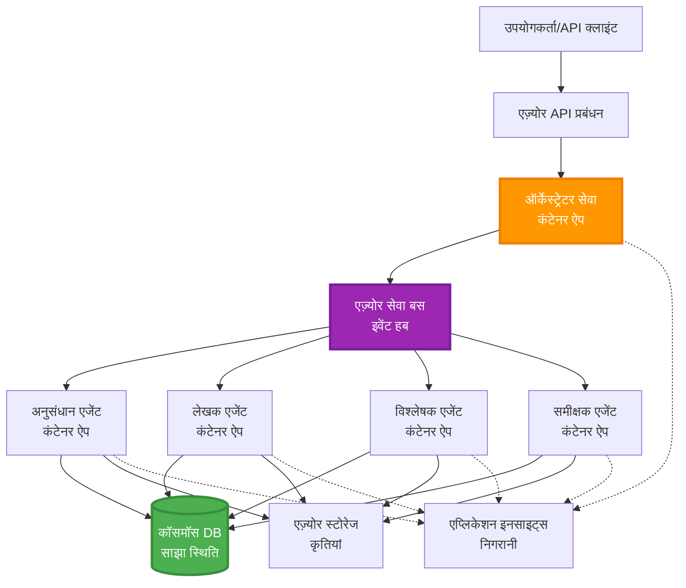

# मल्टी-एजेंट समन्वय पैटर्न

⏱️ **अनुमानित समय**: 60-75 मिनट | 💰 **अनुमानित लागत**: ~$100-300/माह | ⭐ **जटिलता**: उन्नत

**📚 सीखने का मार्ग:**
- ← पिछला: [क्षमता योजना](capacity-planning.md) - संसाधन आकार और स्केलिंग रणनीतियाँ
- 🎯 **आप यहाँ हैं**: मल्टी-एजेंट समन्वय पैटर्न (ऑर्केस्ट्रेशन, संचार, स्थिति प्रबंधन)
- → अगला: [SKU चयन](sku-selection.md) - सही Azure सेवाओं का चयन
- 🏠 [कोर्स होम](../../README.md)

---

## आप क्या सीखेंगे

इस पाठ को पूरा करके, आप:
- **मल्टी-एजेंट आर्किटेक्चर** पैटर्न को समझेंगे और उनका उपयोग कब करना है
- **ऑर्केस्ट्रेशन पैटर्न** (केंद्रीकृत, विकेंद्रीकृत, पदानुक्रमित) लागू करेंगे
- **एजेंट संचार** रणनीतियाँ डिज़ाइन करेंगे (सिंक्रोनस, असिंक्रोनस, इवेंट-ड्रिवन)
- वितरित एजेंटों के बीच **साझा स्थिति** प्रबंधित करेंगे
- Azure पर **मल्टी-एजेंट सिस्टम** तैनात करेंगे
- वास्तविक दुनिया के AI परिदृश्यों के लिए **समन्वय पैटर्न** लागू करेंगे
- वितरित एजेंट सिस्टम की निगरानी और डिबग करेंगे

## मल्टी-एजेंट समन्वय क्यों महत्वपूर्ण है

### विकास: सिंगल एजेंट से मल्टी-एजेंट तक

**सिंगल एजेंट (सरल):**
```
User → Agent → Response
```
- ✅ समझने और लागू करने में आसान
- ✅ सरल कार्यों के लिए तेज़
- ❌ एक मॉडल की सीमाओं तक सीमित
- ❌ जटिल कार्यों को समानांतर में नहीं कर सकता
- ❌ कोई विशेषज्ञता नहीं

**मल्टी-एजेंट सिस्टम (उन्नत):**
```
           ┌─────────────┐
           │ Orchestrator│
           └──────┬──────┘
        ┌─────────┼─────────┐
        │         │         │
    ┌───▼──┐  ┌──▼───┐  ┌──▼────┐
    │Agent1│  │Agent2│  │Agent3 │
    │(Plan)│  │(Code)│  │(Review)│
    └──────┘  └──────┘  └───────┘
```
- ✅ विशिष्ट कार्यों के लिए विशेषज्ञ एजेंट
- ✅ गति के लिए समानांतर निष्पादन
- ✅ मॉड्यूलर और बनाए रखने योग्य
- ✅ जटिल वर्कफ़्लो में बेहतर
- ⚠️ समन्वय तर्क की आवश्यकता होती है

**उदाहरण**: सिंगल एजेंट एक व्यक्ति की तरह है जो सभी कार्य करता है। मल्टी-एजेंट एक टीम की तरह है जहाँ प्रत्येक सदस्य के पास विशेष कौशल होते हैं (शोधकर्ता, कोडर, समीक्षक, लेखक) और वे मिलकर काम करते हैं।

---

## मुख्य समन्वय पैटर्न

### पैटर्न 1: अनुक्रमिक समन्वय (जिम्मेदारी की श्रृंखला)

**कब उपयोग करें**: कार्यों को विशिष्ट क्रम में पूरा करना चाहिए, प्रत्येक एजेंट पिछले आउटपुट पर निर्माण करता है।


**लाभ:**
- ✅ स्पष्ट डेटा प्रवाह
- ✅ डिबग करना आसान
- ✅ निष्पादन क्रम पूर्वानुमान योग्य

**सीमाएँ:**
- ❌ धीमा (कोई समानांतरता नहीं)
- ❌ एक विफलता पूरी श्रृंखला को रोक देती है
- ❌ परस्पर निर्भर कार्यों को संभाल नहीं सकता

**उदाहरण उपयोग के मामले:**
- सामग्री निर्माण पाइपलाइन (शोध → लिखें → संपादित करें → प्रकाशित करें)
- कोड जनरेशन (योजना → कार्यान्वित करें → परीक्षण करें → तैनात करें)
- रिपोर्ट जनरेशन (डेटा संग्रह → विश्लेषण → विज़ुअलाइज़ेशन → सारांश)

---

### पैटर्न 2: समानांतर समन्वय (फैन-आउट/फैन-इन)

**कब उपयोग करें**: स्वतंत्र कार्य एक साथ चल सकते हैं, परिणाम अंत में संयोजित होते हैं।


**लाभ:**
- ✅ तेज़ (समानांतर निष्पादन)
- ✅ दोष-सहिष्णु (आंशिक परिणाम स्वीकार्य)
- ✅ क्षैतिज रूप से स्केलेबल

**सीमाएँ:**
- ⚠️ परिणाम क्रम से बाहर आ सकते हैं
- ⚠️ समेकन तर्क की आवश्यकता होती है
- ⚠️ जटिल स्थिति प्रबंधन

**उदाहरण उपयोग के मामले:**
- मल्टी-सोर्स डेटा संग्रह (APIs + डेटाबेस + वेब स्क्रैपिंग)
- प्रतिस्पर्धात्मक विश्लेषण (कई मॉडल समाधान उत्पन्न करते हैं, सर्वश्रेष्ठ चुना जाता है)
- अनुवाद सेवाएँ (एक साथ कई भाषाओं में अनुवाद)

---

### पैटर्न 3: पदानुक्रमित समन्वय (मैनेजर-वर्कर)

**कब उपयोग करें**: जटिल वर्कफ़्लो जिसमें उप-कार्य होते हैं, प्रतिनिधित्व की आवश्यकता होती है।


**लाभ:**
- ✅ जटिल वर्कफ़्लो को संभालता है
- ✅ मॉड्यूलर और बनाए रखने योग्य
- ✅ स्पष्ट जिम्मेदारी सीमाएँ

**सीमाएँ:**
- ⚠️ अधिक जटिल आर्किटेक्चर
- ⚠️ उच्च विलंबता (कई समन्वय परतें)
- ⚠️ परिष्कृत ऑर्केस्ट्रेशन की आवश्यकता होती है

**उदाहरण उपयोग के मामले:**
- एंटरप्राइज़ दस्तावेज़ प्रसंस्करण (वर्गीकृत करें → रूट करें → प्रक्रिया करें → संग्रहित करें)
- मल्टी-स्टेज डेटा पाइपलाइन (इनजेस्ट → साफ करें → ट्रांसफॉर्म करें → विश्लेषण करें → रिपोर्ट करें)
- जटिल ऑटोमेशन वर्कफ़्लो (योजना → संसाधन आवंटन → निष्पादन → निगरानी)

---

### पैटर्न 4: इवेंट-ड्रिवन समन्वय (पब्लिश-सब्सक्राइब)

**कब उपयोग करें**: एजेंटों को घटनाओं पर प्रतिक्रिया देने की आवश्यकता होती है, ढीला युग्मन वांछनीय होता है।


**लाभ:**
- ✅ एजेंटों के बीच ढीला युग्मन
- ✅ नए एजेंट जोड़ना आसान (बस सब्सक्राइब करें)
- ✅ असिंक्रोनस प्रोसेसिंग
- ✅ लचीला (संदेश स्थायित्व)

**सीमाएँ:**
- ⚠️ इवेंटुअल कंसिस्टेंसी
- ⚠️ जटिल डिबगिंग
- ⚠️ संदेश क्रम चुनौतियाँ

**उदाहरण उपयोग के मामले:**
- रीयल-टाइम मॉनिटरिंग सिस्टम (अलर्ट, डैशबोर्ड, लॉग्स)
- मल्टी-चैनल सूचनाएँ (ईमेल, SMS, पुश, स्लैक)
- डेटा प्रोसेसिंग पाइपलाइन (एक ही डेटा के कई उपभोक्ता)

---

### पैटर्न 5: सहमति-आधारित समन्वय (वोटिंग/क्वोरम)

**कब उपयोग करें**: आगे बढ़ने से पहले कई एजेंटों से सहमति की आवश्यकता होती है।


**लाभ:**
- ✅ उच्च सटीकता (कई राय)
- ✅ दोष-सहिष्णु (अल्पसंख्यक विफलताएँ स्वीकार्य)
- ✅ गुणवत्ता आश्वासन अंतर्निहित

**सीमाएँ:**
- ❌ महंगा (कई मॉडल कॉल)
- ❌ धीमा (सभी एजेंटों की प्रतीक्षा)
- ⚠️ संघर्ष समाधान की आवश्यकता

**उदाहरण उपयोग के मामले:**
- सामग्री मॉडरेशन (कई मॉडल सामग्री की समीक्षा करते हैं)
- कोड समीक्षा (कई लिंटर्स/एनालाइज़र)
- चिकित्सा निदान (कई AI मॉडल, विशेषज्ञ सत्यापन)

---

## आर्किटेक्चर अवलोकन

### Azure पर पूर्ण मल्टी-एजेंट सिस्टम


**मुख्य घटक:**

| घटक | उद्देश्य | Azure सेवा |
|-----------|---------|---------------|
| **API गेटवे** | प्रवेश बिंदु, दर सीमित करना, प्रमाणीकरण | API प्रबंधन |
| **ऑर्केस्ट्रेटर** | एजेंट वर्कफ़्लो का समन्वय करता है | कंटेनर ऐप्स |
| **संदेश कतार** | असिंक्रोनस संचार | सर्विस बस / इवेंट हब्स |
| **एजेंट्स** | विशेष AI कार्यकर्ता | कंटेनर ऐप्स / फंक्शन्स |
| **स्टेट स्टोर** | साझा स्थिति, कार्य ट्रैकिंग | कॉसमॉस DB |
| **आर्टिफैक्ट स्टोरेज** | दस्तावेज़, परिणाम, लॉग्स | ब्लॉब स्टोरेज |
| **मॉनिटरिंग** | वितरित ट्रेसिंग, लॉग्स | एप्लिकेशन इनसाइट्स |

---

## आवश्यकताएँ

### आवश्यक उपकरण

```bash
# Azure Developer CLI सत्यापित करें
azd version
# ✅ अपेक्षित: azd संस्करण 1.0.0 या उच्चतर

# Azure CLI सत्यापित करें
az --version
# ✅ अपेक्षित: azure-cli 2.50.0 या उच्चतर

# Docker सत्यापित करें (स्थानीय परीक्षण के लिए)
docker --version
# ✅ अपेक्षित: Docker संस्करण 20.10 या उच्चतर
```

### Azure आवश्यकताएँ

- सक्रिय Azure सदस्यता
- निम्नलिखित बनाने की अनुमति:
  - कंटेनर ऐप्स
  - सर्विस बस नामस्थान
  - कॉसमॉस DB खाते
  - स्टोरेज खाते
  - एप्लिकेशन इनसाइट्स

### ज्ञान आवश्यकताएँ

आपने पूरा कर लिया होना चाहिए:
- [कॉन्फ़िगरेशन प्रबंधन](../getting-started/configuration.md)
- [प्रमाणीकरण और सुरक्षा](../getting-started/authsecurity.md)
- [माइक्रोसर्विसेज उदाहरण](../../../../examples/microservices)

---

## कार्यान्वयन गाइड

### प्रोजेक्ट संरचना

```
multi-agent-system/
├── azure.yaml                    # AZD configuration
├── infra/
│   ├── main.bicep               # Main infrastructure
│   ├── core/
│   │   ├── servicebus.bicep     # Message queue
│   │   ├── cosmos.bicep         # State store
│   │   ├── storage.bicep        # Artifact storage
│   │   └── monitoring.bicep     # Application Insights
│   └── app/
│       ├── orchestrator.bicep   # Orchestrator service
│       └── agent.bicep          # Agent template
└── src/
    ├── orchestrator/            # Orchestration logic
    │   ├── app.py
    │   ├── workflows.py
    │   └── Dockerfile
    ├── agents/
    │   ├── research/            # Research agent
    │   ├── writer/              # Writer agent
    │   ├── analyst/             # Analyst agent
    │   └── reviewer/            # Reviewer agent
    └── shared/
        ├── state_manager.py     # Shared state logic
        └── message_handler.py   # Message handling
```

---

## पाठ 1: अनुक्रमिक समन्वय पैटर्न

### कार्यान्वयन: सामग्री निर्माण पाइपलाइन

आइए एक अनुक्रमिक पाइपलाइन बनाएं: शोध → लिखें → संपादित करें → प्रकाशित करें

### 1. AZD कॉन्फ़िगरेशन

**फ़ाइल: `azure.yaml`**

```yaml
name: content-pipeline
metadata:
  template: multi-agent-sequential@1.0.0

services:
  orchestrator:
    project: ./src/orchestrator
    language: python
    host: containerapp
  
  research-agent:
    project: ./src/agents/research
    language: python
    host: containerapp
  
  writer-agent:
    project: ./src/agents/writer
    language: python
    host: containerapp
  
  editor-agent:
    project: ./src/agents/editor
    language: python
    host: containerapp
```

### 2. इन्फ्रास्ट्रक्चर: समन्वय के लिए सर्विस बस

**फ़ाइल: `infra/core/servicebus.bicep`**

```bicep
param name string
param location string
param tags object = {}

resource serviceBusNamespace 'Microsoft.ServiceBus/namespaces@2022-10-01-preview' = {
  name: name
  location: location
  tags: tags
  sku: {
    name: 'Standard'
    tier: 'Standard'
  }
  properties: {
    minimumTlsVersion: '1.2'
  }
}

// Queue for orchestrator → research agent
resource researchQueue 'Microsoft.ServiceBus/namespaces/queues@2022-10-01-preview' = {
  parent: serviceBusNamespace
  name: 'research-tasks'
  properties: {
    maxDeliveryCount: 3
    lockDuration: 'PT5M'
    deadLetteringOnMessageExpiration: true
  }
}

// Queue for research agent → writer agent
resource writerQueue 'Microsoft.ServiceBus/namespaces/queues@2022-10-01-preview' = {
  parent: serviceBusNamespace
  name: 'writer-tasks'
  properties: {
    maxDeliveryCount: 3
    lockDuration: 'PT5M'
  }
}

// Queue for writer agent → editor agent
resource editorQueue 'Microsoft.ServiceBus/namespaces/queues@2022-10-01-preview' = {
  parent: serviceBusNamespace
  name: 'editor-tasks'
  properties: {
    maxDeliveryCount: 3
    lockDuration: 'PT5M'
  }
}

output namespace string = serviceBusNamespace.name
output connectionString string = listKeys('${serviceBusNamespace.id}/AuthorizationRules/RootManageSharedAccessKey', serviceBusNamespace.apiVersion).primaryConnectionString
```

### 3. साझा स्थिति प्रबंधक

**फ़ाइल: `src/shared/state_manager.py`**

```python
from azure.cosmos import CosmosClient, PartitionKey
from datetime import datetime
import os

class StateManager:
    """Manages shared state across agents using Cosmos DB"""
    
    def __init__(self):
        endpoint = os.environ['COSMOS_ENDPOINT']
        key = os.environ['COSMOS_KEY']
        
        self.client = CosmosClient(endpoint, key)
        self.database = self.client.get_database_client('agent-state')
        self.container = self.database.get_container_client('tasks')
    
    def create_task(self, task_id: str, task_type: str, input_data: dict):
        """Create a new task"""
        task = {
            'id': task_id,
            'type': task_type,
            'status': 'pending',
            'input': input_data,
            'created_at': datetime.utcnow().isoformat(),
            'steps': []
        }
        self.container.create_item(task)
        return task
    
    def update_task_step(self, task_id: str, step_name: str, result: dict):
        """Update task with completed step"""
        task = self.container.read_item(task_id, partition_key=task_id)
        
        task['steps'].append({
            'name': step_name,
            'completed_at': datetime.utcnow().isoformat(),
            'result': result
        })
        
        self.container.replace_item(task_id, task)
        return task
    
    def complete_task(self, task_id: str, final_result: dict):
        """Mark task as complete"""
        task = self.container.read_item(task_id, partition_key=task_id)
        task['status'] = 'completed'
        task['result'] = final_result
        task['completed_at'] = datetime.utcnow().isoformat()
        self.container.replace_item(task_id, task)
        return task
    
    def get_task(self, task_id: str):
        """Retrieve task state"""
        return self.container.read_item(task_id, partition_key=task_id)
```

### 4. ऑर्केस्ट्रेटर सेवा

**फ़ाइल: `src/orchestrator/app.py`**

```python
from flask import Flask, request, jsonify
from azure.servicebus import ServiceBusClient, ServiceBusMessage
import json
import uuid
import os
from shared.state_manager import StateManager

app = Flask(__name__)
state_manager = StateManager()

# सेवा बस कनेक्शन
servicebus_connection_str = os.environ['SERVICEBUS_CONNECTION_STRING']
servicebus_client = ServiceBusClient.from_connection_string(servicebus_connection_str)

@app.route('/health', methods=['GET'])
def health():
    return jsonify({'status': 'healthy', 'service': 'orchestrator'})

@app.route('/create-content', methods=['POST'])
def create_content():
    """
    Sequential workflow: Research → Write → Edit → Publish
    """
    data = request.json
    topic = data.get('topic')
    
    if not topic:
        return jsonify({'error': 'Topic required'}), 400
    
    # राज्य स्टोर में कार्य बनाएं
    task_id = str(uuid.uuid4())
    task = state_manager.create_task(
        task_id=task_id,
        task_type='content_creation',
        input_data={'topic': topic}
    )
    
    # अनुसंधान एजेंट को संदेश भेजें (पहला कदम)
    sender = servicebus_client.get_queue_sender('research-tasks')
    message = ServiceBusMessage(
        body=json.dumps({
            'task_id': task_id,
            'topic': topic,
            'next_queue': 'writer-tasks'  # परिणाम कहां भेजें
        }),
        content_type='application/json'
    )
    
    with sender:
        sender.send_messages(message)
    
    return jsonify({
        'task_id': task_id,
        'status': 'started',
        'workflow': 'sequential',
        'steps': ['research', 'write', 'edit', 'publish'],
        'message': 'Content creation pipeline initiated'
    }), 202

@app.route('/task/<task_id>', methods=['GET'])
def get_task_status(task_id):
    """Check task status"""
    try:
        task = state_manager.get_task(task_id)
        return jsonify(task)
    except Exception as e:
        return jsonify({'error': str(e)}), 404

if __name__ == '__main__':
    app.run(host='0.0.0.0', port=8080)
```

### 5. शोध एजेंट

**फ़ाइल: `src/agents/research/app.py`**

```python
from azure.servicebus import ServiceBusClient, ServiceBusMessage
from openai import AzureOpenAI
import json
import os
import time
from shared.state_manager import StateManager

# क्लाइंट्स को प्रारंभ करें
state_manager = StateManager()
servicebus_client = ServiceBusClient.from_connection_string(
    os.environ['SERVICEBUS_CONNECTION_STRING']
)

openai_client = AzureOpenAI(
    api_key=os.environ['AZURE_OPENAI_API_KEY'],
    api_version="2024-02-01",
    azure_endpoint=os.environ['AZURE_OPENAI_ENDPOINT']
)

def process_research_task(message_data):
    """Process research request and pass to writer"""
    task_id = message_data['task_id']
    topic = message_data['topic']
    next_queue = message_data['next_queue']
    
    print(f"🔬 Researching: {topic}")
    
    # शोध के लिए Azure OpenAI को कॉल करें
    response = openai_client.chat.completions.create(
        model="gpt-4",
        messages=[
            {"role": "system", "content": "You are a research assistant. Provide comprehensive research on the given topic."},
            {"role": "user", "content": f"Research this topic thoroughly: {topic}"}
        ],
        max_tokens=1500
    )
    
    research_results = response.choices[0].message.content
    
    # स्थिति अपडेट करें
    state_manager.update_task_step(
        task_id=task_id,
        step_name='research',
        result={'research': research_results}
    )
    
    # अगले एजेंट (लेखक) को भेजें
    sender = servicebus_client.get_queue_sender(next_queue)
    message = ServiceBusMessage(
        body=json.dumps({
            'task_id': task_id,
            'topic': topic,
            'research': research_results,
            'next_queue': 'editor-tasks'
        }),
        content_type='application/json'
    )
    
    with sender:
        sender.send_messages(message)
    
    print(f"✅ Research complete for task {task_id}")

def main():
    """Listen to research queue"""
    receiver = servicebus_client.get_queue_receiver('research-tasks')
    
    print("🔬 Research Agent started, listening for tasks...")
    
    with receiver:
        while True:
            messages = receiver.receive_messages(max_wait_time=5)
            for message in messages:
                try:
                    message_data = json.loads(str(message))
                    process_research_task(message_data)
                    receiver.complete_message(message)
                except Exception as e:
                    print(f"❌ Error processing message: {e}")
                    receiver.abandon_message(message)

if __name__ == '__main__':
    main()
```

### 6. लेखक एजेंट

**फ़ाइल: `src/agents/writer/app.py`**

```python
from azure.servicebus import ServiceBusClient, ServiceBusMessage
from openai import AzureOpenAI
import json
import os
from shared.state_manager import StateManager

state_manager = StateManager()
servicebus_client = ServiceBusClient.from_connection_string(
    os.environ['SERVICEBUS_CONNECTION_STRING']
)

openai_client = AzureOpenAI(
    api_key=os.environ['AZURE_OPENAI_API_KEY'],
    api_version="2024-02-01",
    azure_endpoint=os.environ['AZURE_OPENAI_ENDPOINT']
)

def process_writing_task(message_data):
    """Write article based on research"""
    task_id = message_data['task_id']
    topic = message_data['topic']
    research = message_data['research']
    next_queue = message_data['next_queue']
    
    print(f"✍️ Writing article: {topic}")
    
    # Azure OpenAI को लेख लिखने के लिए कॉल करें
    response = openai_client.chat.completions.create(
        model="gpt-4",
        messages=[
            {"role": "system", "content": "You are a professional writer. Write engaging, well-structured articles."},
            {"role": "user", "content": f"Based on this research:\n\n{research}\n\nWrite a comprehensive article about: {topic}"}
        ],
        max_tokens=2000
    )
    
    article_draft = response.choices[0].message.content
    
    # स्थिति अपडेट करें
    state_manager.update_task_step(
        task_id=task_id,
        step_name='writing',
        result={'draft': article_draft}
    )
    
    # संपादक को भेजें
    sender = servicebus_client.get_queue_sender(next_queue)
    message = ServiceBusMessage(
        body=json.dumps({
            'task_id': task_id,
            'topic': topic,
            'draft': article_draft
        }),
        content_type='application/json'
    )
    
    with sender:
        sender.send_messages(message)
    
    print(f"✅ Article draft complete for task {task_id}")

def main():
    """Listen to writer queue"""
    receiver = servicebus_client.get_queue_receiver('writer-tasks')
    
    print("✍️ Writer Agent started, listening for tasks...")
    
    with receiver:
        while True:
            messages = receiver.receive_messages(max_wait_time=5)
            for message in messages:
                try:
                    message_data = json.loads(str(message))
                    process_writing_task(message_data)
                    receiver.complete_message(message)
                except Exception as e:
                    print(f"❌ Error: {e}")
                    receiver.abandon_message(message)

if __name__ == '__main__':
    main()
```

### 7. संपादक एजेंट

**फ़ाइल: `src/agents/editor/app.py`**

```python
from azure.servicebus import ServiceBusClient
from openai import AzureOpenAI
import json
import os
from shared.state_manager import StateManager

state_manager = StateManager()
servicebus_client = ServiceBusClient.from_connection_string(
    os.environ['SERVICEBUS_CONNECTION_STRING']
)

openai_client = AzureOpenAI(
    api_key=os.environ['AZURE_OPENAI_API_KEY'],
    api_version="2024-02-01",
    azure_endpoint=os.environ['AZURE_OPENAI_ENDPOINT']
)

def process_editing_task(message_data):
    """Edit and finalize article"""
    task_id = message_data['task_id']
    topic = message_data['topic']
    draft = message_data['draft']
    
    print(f"📝 Editing article: {topic}")
    
    # Azure OpenAI को संपादित करने के लिए कॉल करें
    response = openai_client.chat.completions.create(
        model="gpt-4",
        messages=[
            {"role": "system", "content": "You are an expert editor. Improve grammar, clarity, and structure."},
            {"role": "user", "content": f"Edit and improve this article:\n\n{draft}"}
        ],
        max_tokens=2000
    )
    
    final_article = response.choices[0].message.content
    
    # कार्य को पूर्ण के रूप में चिह्नित करें
    state_manager.complete_task(
        task_id=task_id,
        final_result={
            'topic': topic,
            'final_article': final_article,
            'word_count': len(final_article.split())
        }
    )
    
    print(f"✅ Article finalized for task {task_id}")

def main():
    """Listen to editor queue"""
    receiver = servicebus_client.get_queue_receiver('editor-tasks')
    
    print("📝 Editor Agent started, listening for tasks...")
    
    with receiver:
        while True:
            messages = receiver.receive_messages(max_wait_time=5)
            for message in messages:
                try:
                    message_data = json.loads(str(message))
                    process_editing_task(message_data)
                    receiver.complete_message(message)
                except Exception as e:
                    print(f"❌ Error: {e}")
                    receiver.abandon_message(message)

if __name__ == '__main__':
    main()
```

### 8. तैनात करें और परीक्षण करें

```bash
# प्रारंभ करें और तैनात करें
azd init
azd up

# ऑर्केस्ट्रेटर URL प्राप्त करें
ORCHESTRATOR_URL=$(azd env get-values | grep ORCHESTRATOR_URL | cut -d '=' -f2 | tr -d '"')

# सामग्री बनाएं
curl -X POST $ORCHESTRATOR_URL/create-content \
  -H "Content-Type: application/json" \
  -d '{"topic": "The Future of AI in Healthcare"}'
```

**✅ अपेक्षित आउटपुट:**
```json
{
  "task_id": "a1b2c3d4-e5f6-7890-abcd-ef1234567890",
  "status": "started",
  "workflow": "sequential",
  "steps": ["research", "write", "edit", "publish"],
  "message": "Content creation pipeline initiated"
}
```

**कार्य प्रगति की जाँच करें:**
```bash
TASK_ID="a1b2c3d4-e5f6-7890-abcd-ef1234567890"
curl $ORCHESTRATOR_URL/task/$TASK_ID
```

**✅ अपेक्षित आउटपुट (पूर्ण):**
```json
{
  "id": "a1b2c3d4-e5f6-7890-abcd-ef1234567890",
  "type": "content_creation",
  "status": "completed",
  "steps": [
    {
      "name": "research",
      "completed_at": "2025-11-19T10:30:00Z",
      "result": {"research": "..."}
    },
    {
      "name": "writing",
      "completed_at": "2025-11-19T10:32:00Z",
      "result": {"draft": "..."}
    }
  ],
  "result": {
    "topic": "The Future of AI in Healthcare",
    "final_article": "...",
    "word_count": 1500
  }
}
```

---

## पाठ 2: समानांतर समन्वय पैटर्न

### कार्यान्वयन: मल्टी-सोर्स रिसर्च एग्रीगेटर

आइए एक समानांतर प्रणाली बनाएं जो एक साथ कई स्रोतों से जानकारी एकत्र करती है।

### समानांतर ऑर्केस्ट्रेटर

**फ़ाइल: `src/orchestrator/parallel_workflow.py`**

```python
from flask import Flask, request, jsonify
from azure.servicebus import ServiceBusClient, ServiceBusMessage
import json
import uuid
import os
from shared.state_manager import StateManager

app = Flask(__name__)
state_manager = StateManager()

servicebus_client = ServiceBusClient.from_connection_string(
    os.environ['SERVICEBUS_CONNECTION_STRING']
)

@app.route('/research-parallel', methods=['POST'])
def research_parallel():
    """
    Parallel workflow: Multiple agents work simultaneously
    """
    data = request.json
    query = data.get('query')
    
    task_id = str(uuid.uuid4())
    task = state_manager.create_task(
        task_id=task_id,
        task_type='parallel_research',
        input_data={
            'query': query,
            'agents': ['web', 'academic', 'news', 'social']
        }
    )
    
    # फैन-आउट: सभी एजेंटों को एक साथ भेजें
    agents = [
        ('web-research-queue', 'web'),
        ('academic-research-queue', 'academic'),
        ('news-research-queue', 'news'),
        ('social-research-queue', 'social')
    ]
    
    for queue_name, agent_type in agents:
        sender = servicebus_client.get_queue_sender(queue_name)
        message = ServiceBusMessage(
            body=json.dumps({
                'task_id': task_id,
                'query': query,
                'agent_type': agent_type,
                'result_queue': 'aggregation-queue'
            }),
            content_type='application/json'
        )
        
        with sender:
            sender.send_messages(message)
    
    return jsonify({
        'task_id': task_id,
        'status': 'started',
        'workflow': 'parallel',
        'agents_dispatched': 4,
        'message': 'Parallel research initiated'
    }), 202

if __name__ == '__main__':
    app.run(host='0.0.0.0', port=8080)
```

### समेकन तर्क

**फ़ाइल: `src/agents/aggregator/app.py`**

```python
from azure.servicebus import ServiceBusClient
import json
import os
from collections import defaultdict
from shared.state_manager import StateManager

state_manager = StateManager()
servicebus_client = ServiceBusClient.from_connection_string(
    os.environ['SERVICEBUS_CONNECTION_STRING']
)

# प्रत्येक कार्य के परिणामों को ट्रैक करें
task_results = defaultdict(list)
expected_agents = 4  # वेब, शैक्षणिक, समाचार, सामाजिक

def process_result(message_data):
    """Aggregate results from parallel agents"""
    task_id = message_data['task_id']
    agent_type = message_data['agent_type']
    result = message_data['result']
    
    # परिणाम संग्रहीत करें
    task_results[task_id].append({
        'agent': agent_type,
        'data': result
    })
    
    print(f"📊 Received result from {agent_type} agent ({len(task_results[task_id])}/{expected_agents})")
    
    # जांचें कि क्या सभी एजेंट्स ने पूरा किया (फैन-इन)
    if len(task_results[task_id]) == expected_agents:
        print(f"✅ All agents completed for task {task_id}. Aggregating...")
        
        # परिणामों को मिलाएं
        aggregated = {
            'query': message_data['query'],
            'sources': task_results[task_id],
            'summary': generate_summary(task_results[task_id])
        }
        
        # पूर्ण चिह्नित करें
        state_manager.complete_task(task_id, aggregated)
        
        # साफ करें
        del task_results[task_id]
        
        print(f"✅ Aggregation complete for task {task_id}")

def generate_summary(results):
    """Generate summary from all sources"""
    summaries = [r['data'].get('summary', '') for r in results]
    return '\n\n'.join(summaries)

def main():
    """Listen to aggregation queue"""
    receiver = servicebus_client.get_queue_receiver('aggregation-queue')
    
    print("📊 Aggregator started, listening for results...")
    
    with receiver:
        while True:
            messages = receiver.receive_messages(max_wait_time=5)
            for message in messages:
                try:
                    message_data = json.loads(str(message))
                    process_result(message_data)
                    receiver.complete_message(message)
                except Exception as e:
                    print(f"❌ Error: {e}")
                    receiver.abandon_message(message)

if __name__ == '__main__':
    main()
```

**समानांतर पैटर्न के लाभ:**
- ⚡ **4x तेज़** (एजेंट एक साथ चलते हैं)
- 🔄 **दोष-सहिष्णु** (आंशिक परिणाम स्वीकार्य)
- 📈 **स्केलेबल** (आसानी से अधिक एजेंट जोड़ें)

---

## व्यावहारिक अभ्यास

### अभ्यास 1: टाइमआउट हैंडलिंग जोड़ें ⭐⭐ (मध्यम)

**लक्ष्य**: टाइमआउट तर्क लागू करें ताकि एग्रीगेटर धीमे एजेंटों के लिए हमेशा इंतजार न करे।

**चरण**:

1. **एग्रीगेटर में टाइमआउट ट्रैकिंग जोड़ें:**

```python
from datetime import datetime, timedelta

task_timeouts = {}  # कार्य_आईडी -> समाप्ति_समय

def process_result(message_data):
    task_id = message_data['task_id']
    
    # पहले परिणाम पर समय सीमा सेट करें
    if task_id not in task_timeouts:
        task_timeouts[task_id] = datetime.utcnow() + timedelta(seconds=30)
    
    task_results[task_id].append({
        'agent': message_data['agent_type'],
        'data': message_data['result']
    })
    
    # जांचें कि पूरा हुआ है या समय समाप्त हो गया है
    if len(task_results[task_id]) == expected_agents or \
       datetime.utcnow() > task_timeouts[task_id]:
        
        print(f"📊 Aggregating with {len(task_results[task_id])}/{expected_agents} results")
        
        aggregated = {
            'query': message_data['query'],
            'sources': task_results[task_id],
            'completed_agents': len(task_results[task_id]),
            'timed_out': len(task_results[task_id]) < expected_agents
        }
        
        state_manager.complete_task(task_id, aggregated)
        
        # सफाई करें
        del task_results[task_id]
        del task_timeouts[task_id]
```

2. **कृत्रिम विलंब के साथ परीक्षण करें:**

```python
# एक एजेंट में धीमी प्रक्रिया को अनुकरण करने के लिए विलंब जोड़ें
import time
time.sleep(35)  # 30-सेकंड की समय सीमा से अधिक
```

3. **तैनात करें और सत्यापित करें:**

```bash
azd deploy aggregator

# कार्य सबमिट करें
curl -X POST $ORCHESTRATOR_URL/research-parallel \
  -H "Content-Type: application/json" \
  -d '{"query": "AI safety research"}'

# 30 सेकंड के बाद परिणाम जांचें
curl $ORCHESTRATOR_URL/task/$TASK_ID
```

**✅ सफलता मानदंड:**
- ✅ कार्य 30 सेकंड के बाद पूरा होता है भले ही एजेंट अधूरा हो
- ✅ प्रतिक्रिया आंशिक परिणामों को इंगित करती है (`"timed_out": true`)
- ✅ उपलब्ध परिणाम लौटाए जाते हैं (4 में से 3 एजेंट)

**समय**: 20-25 मिनट

---

### अभ्यास 2: पुनः प्रयास तर्क लागू करें ⭐⭐⭐ (उन्नत)

**लक्ष्य**: विफल एजेंट कार्यों को स्वचालित रूप से पुनः प्रयास करें।

**चरण**:

1. **ऑर्केस्ट्रेटर में पुनः प्रयास ट्रैकिंग जोड़ें:**

```python
from dataclasses import dataclass
from typing import Dict

@dataclass
class RetryConfig:
    max_retries: int = 3
    backoff_seconds: int = 5

retry_counts: Dict[str, int] = {}  # संदेश_आईडी -> पुनः प्रयास_गणना

def send_with_retry(queue_name: str, message_data: dict, retry_config: RetryConfig):
    """Send message with retry metadata"""
    message_id = message_data.get('message_id', str(uuid.uuid4()))
    message_data['message_id'] = message_id
    message_data['retry_count'] = retry_counts.get(message_id, 0)
    message_data['max_retries'] = retry_config.max_retries
    
    sender = servicebus_client.get_queue_sender(queue_name)
    message = ServiceBusMessage(
        body=json.dumps(message_data),
        content_type='application/json',
        message_id=message_id
    )
    
    with sender:
        sender.send_messages(message)
```

2. **एजेंट्स में पुनः प्रयास हैंडलर जोड़ें:**

```python
def process_with_retry(message, receiver, process_func):
    """Process message with automatic retry on failure"""
    try:
        message_data = json.loads(str(message))
        
        # संदेश को संसाधित करें
        process_func(message_data)
        
        # सफलता - पूर्ण
        receiver.complete_message(message)
        
    except Exception as e:
        message_id = message.message_id
        retry_count = message_data.get('retry_count', 0)
        max_retries = message_data.get('max_retries', 3)
        
        if retry_count < max_retries:
            # पुनः प्रयास: छोड़ें और बढ़ी हुई गिनती के साथ पुनः कतार में डालें
            print(f"⚠️ Retry {retry_count + 1}/{max_retries} for message {message_id}")
            
            message_data['retry_count'] = retry_count + 1
            
            # देरी के साथ उसी कतार में वापस भेजें
            time.sleep(5 * (retry_count + 1))  # घातांकीय बैकऑफ
            send_with_retry(queue_name, message_data, RetryConfig())
            
            receiver.complete_message(message)  # मूल को हटाएं
        else:
            # अधिकतम पुनः प्रयास पार हो गया - मृत पत्र कतार में स्थानांतरित करें
            print(f"❌ Max retries exceeded for message {message_id}")
            receiver.dead_letter_message(
                message,
                reason="MaxRetriesExceeded",
                error_description=str(e)
            )
```

3. **डेड लेटर कतार की निगरानी करें:**

```python
def monitor_dead_letters():
    """Check dead letter queue for failed messages"""
    receiver = servicebus_client.get_queue_receiver(
        'research-queue',
        sub_queue='deadletter'
    )
    
    with receiver:
        messages = receiver.receive_messages(max_wait_time=5)
        for message in messages:
            print(f"☠️ Dead letter: {message.message_id}")
            print(f"Reason: {message.dead_letter_reason}")
            print(f"Description: {message.dead_letter_error_description}")
```

**✅ सफलता मानदंड:**
- ✅ विफल कार्य स्वचालित रूप से पुनः प्रयास करते हैं (3 बार तक)
- ✅ पुनः प्रयासों के बीच एक्सपोनेंशियल बैकऑफ (5s, 10s, 15s)
- ✅ अधिकतम पुनः प्रयासों के बाद, संदेश डेड लेटर कतार में जाते हैं
- ✅ डेड लेटर कतार की निगरानी और पुनः चलाया जा सकता है

**समय**: 30-40 मिनट

---

### अभ्यास 3: सर्किट ब्रेकर लागू करें ⭐⭐⭐ (उन्नत)

**लक्ष्य**: विफल एजेंटों को अनुरोध भेजने से रोककर कैस्केडिंग विफलताओं को रोकें।

**चरण**:

1. **सर्किट ब्रेकर क्लास बनाएं:**

```python
from enum import Enum
from datetime import datetime, timedelta

class CircuitState(Enum):
    CLOSED = "closed"      # सामान्य संचालन
    OPEN = "open"          # विफल, अनुरोधों को अस्वीकार करें
    HALF_OPEN = "half_open"  # परीक्षण कर रहे हैं कि पुनर्प्राप्त हुआ

class CircuitBreaker:
    def __init__(self, failure_threshold=5, timeout_seconds=60):
        self.failure_threshold = failure_threshold
        self.timeout_seconds = timeout_seconds
        self.failure_count = 0
        self.last_failure_time = None
        self.state = CircuitState.CLOSED
    
    def call(self, func):
        """Execute function with circuit breaker protection"""
        if self.state == CircuitState.OPEN:
            # जांचें कि समय सीमा समाप्त हुई
            if datetime.utcnow() - self.last_failure_time > timedelta(seconds=self.timeout_seconds):
                self.state = CircuitState.HALF_OPEN
                print("🔄 Circuit breaker: HALF_OPEN (testing)")
            else:
                raise Exception(f"Circuit breaker OPEN for agent. Try again in {self.timeout_seconds}s")
        
        try:
            result = func()
            
            # सफलता
            if self.state == CircuitState.HALF_OPEN:
                self.state = CircuitState.CLOSED
                self.failure_count = 0
                print("✅ Circuit breaker: CLOSED (recovered)")
            
            return result
            
        except Exception as e:
            self.failure_count += 1
            self.last_failure_time = datetime.utcnow()
            
            if self.failure_count >= self.failure_threshold:
                self.state = CircuitState.OPEN
                print(f"🔴 Circuit breaker: OPEN (too many failures)")
            
            raise e
```

2. **एजेंट कॉल्स पर लागू करें:**

```python
# ऑर्केस्ट्रेटर में
agent_circuits = {
    'web': CircuitBreaker(failure_threshold=5, timeout_seconds=60),
    'academic': CircuitBreaker(failure_threshold=5, timeout_seconds=60),
    'news': CircuitBreaker(failure_threshold=5, timeout_seconds=60),
    'social': CircuitBreaker(failure_threshold=5, timeout_seconds=60)
}

def send_to_agent(agent_type, message_data):
    """Send with circuit breaker protection"""
    circuit = agent_circuits[agent_type]
    
    try:
        circuit.call(lambda: send_message(agent_type, message_data))
    except Exception as e:
        print(f"⚠️ Skipping {agent_type} agent: {e}")
        # अन्य एजेंटों के साथ जारी रखें
```

3. **सर्किट ब्रेकर का परीक्षण करें:**

```bash
# बार-बार विफलताओं का अनुकरण करें (एक एजेंट को रोकें)
az containerapp stop --name web-research-agent --resource-group rg-agents

# कई अनुरोध भेजें
for i in {1..10}; do
  curl -X POST $ORCHESTRATOR_URL/research-parallel \
    -H "Content-Type: application/json" \
    -d '{"query": "test query '$i'"}'
  sleep 2
done

# लॉग जांचें - 5 विफलताओं के बाद सर्किट खुला होना चाहिए
azd logs orchestrator --tail 50
```

**✅ सफलता मानदंड:**
- ✅ 5 विफलताओं के बाद, सर्किट खुलता है (अनुरोध अस्वीकार करता है)
- ✅ 60 सेकंड के बाद, सर्किट आधा-खुला हो जाता है (रिकवरी का परीक्षण करता है)
- ✅ अन्य एजेंट सामान्य रूप से काम करना जारी रखते हैं
- ✅ एजेंट के ठीक होने पर सर्किट स्वचालित रूप से बंद हो जाता है

**समय**: 40-50 मिनट

---

## निगरानी और डिबगिंग

### एप्लिकेशन इनसाइट्स के साथ वितरित ट्रेसिंग

**फ़ाइल: `src/shared/tracing.py`**

```python
from opencensus.ext.azure.log_exporter import AzureLogHandler
from opencensus.ext.azure.trace_exporter import AzureExporter
from opencensus.trace import config_integration
from opencensus.trace.tracer import Tracer
from opencensus.trace.samplers import AlwaysOnSampler
import logging
import os

# ट्रेसिंग कॉन्फ़िगर करें
config_integration.trace_integrations(['requests', 'logging'])

connection_string = os.environ.get('APPLICATIONINSIGHTS_CONNECTION_STRING')

# ट्रेसर बनाएं
tracer = Tracer(
    exporter=AzureExporter(connection_string=connection_string),
    sampler=AlwaysOnSampler()
)

# लॉगिंग कॉन्फ़िगर करें
logger = logging.getLogger(__name__)
logger.addHandler(AzureLogHandler(connection_string=connection_string))
logger.setLevel(logging.INFO)

def trace_agent_call(agent_name, task_id, operation):
    """Trace agent operations"""
    with tracer.span(name=f'{agent_name}.{operation}') as span:
        span.add_attribute('agent', agent_name)
        span.add_attribute('task_id', task_id)
        span.add_attribute('operation', operation)
        
        try:
            result = operation()
            span.add_attribute('status', 'success')
            return result
        except Exception as e:
            span.add_attribute('status', 'error')
            span.add_attribute('error', str(e))
            raise
```

### एप्लिकेशन इनसाइट्स क्वेरीज़

**मल्टी-एजेंट वर्कफ़्लो ट्रैक करें:**

```kusto
// Trace complete workflow for a task
traces
| where customDimensions.task_id == "a1b2c3d4-..."
| project timestamp, message, customDimensions.agent, customDimensions.operation
| order by timestamp asc
```

**एजेंट प्रदर्शन तुलना:**

```kusto
// Compare agent execution times
dependencies
| where name contains "agent"
| summarize 
    avg_duration = avg(duration),
    p95_duration = percentile(duration, 95),
    count = count()
  by agent = tostring(customDimensions.agent)
| order by avg_duration desc
```

**विफलता विश्लेषण:**

```kusto
// Find which agents fail most
exceptions
| where customDimensions.agent != ""
| summarize 
    failure_count = count(),
    unique_errors = dcount(outerMessage)
  by agent = tostring(customDimensions.agent)
| order by failure_count desc
```

---

## लागत विश्लेषण

### मल्टी-एजेंट सिस्टम लागत (मासिक अनुमान)

| घटक | कॉन्फ़िगरेशन | लागत |
|-----------|--------------|------|
| **ऑर्केस्ट्रेटर** | 1 कंटेनर ऐप (1 vCPU, 2GB) | $30-50 |
| **4 एजेंट्स** | 4 कंटेनर ऐप्स (0.5 vCPU, 1GB प्रत्येक) | $60-120 |
| **सर्विस बस** | मानक स्तर, 10M संदेश | $10-20 |
| **कॉसमॉस DB** | सर्वरलेस, 5GB स्टोरेज, 1M RUs | $25-50 |
| **ब्लॉब स्टोरेज** | 10GB स्टोरेज, 100K ऑपरेशन्स | $5-10 |
| **एप्लिकेशन इनसाइट्स** | 5GB इनजेशन | $10-15 |
| **Azure OpenAI** | GPT-4, 10M टोकन्स | $100-300 |
| **कुल** | | **$240-565/माह** |

### लागत अनुकूलन रणनीतियाँ

1. **जहाँ संभव हो, सर्वरलेस का उपयोग करें:**
   ```bicep
   // Cosmos DB serverless (no minimum cost)
   properties: {
     databaseAccountOfferType: 'Standard'
     capabilities: [{ name: 'EnableServerless' }]
   }
   ```

2. **एजेंट्स को निष्क्रिय होने पर शून्य पर स्केल करें:**
   ```bicep
   scale: {
     minReplicas: 0  // Scale to zero when no messages
     maxReplicas: 10
   }
   ```

3. **सर्विस बस के लिए बैचिंग का उपयोग करें:**
   ```python
   # संदेशों को बैचों में भेजें (सस्ता)
   sender.send_messages([message1, message2, message3])
   ```

4. **अक्सर उपयोग किए जाने वाले परिणामों को कैश करें:**
   ```python
   # Azure कैश के लिए Redis का उपयोग करें
   if cache.exists(query_hash):
       return cache.get(query_hash)
   ```

---

## सर्वोत्तम प्रथाएँ

### ✅ करें:

1. **इडेमपोटेंट ऑपरेशन्स का उपयोग करें**
   ```python
   # एजेंट सुरक्षित रूप से एक ही संदेश को कई बार संसाधित कर सकता है
   def process_task(task_id):
       if state_manager.task_exists(task_id):
           print(f"Task {task_id} already processed, skipping")
           return
       # कार्य को संसाधित करें...
   ```

2. **व्यापक लॉगिंग लागू करें**
   ```python
   logger.info(f"Agent: {agent_name}, Task: {task_id}, Action: {action}")
   ```

3. **संबंध आईडी का उपयोग करें**
   ```python
   # पूरे वर्कफ़्लो में task_id पास करें
   message_data = {
       'task_id': task_id,  # कोरिलेशन आईडी
       'timestamp': datetime.utcnow().isoformat()
   }
   ```

4. **संदेश TTL (टाइम-टू-लाइव) सेट करें**
   ```bicep
   properties: {
     defaultMessageTimeToLive: 'PT1H'  // 1 hour max
   }
   ```

5. **डेड लेटर कतारों की निगरानी करें**
   ```python
   # असफल संदेशों की नियमित निगरानी
   monitor_dead_letters()
   ```

### ❌ न करें:

1. **परिपत्र निर्भरताएँ न बनाएं**
   ```python
   # ❌ खराब: एजेंट A → एजेंट B → एजेंट A (अनंत लूप)
   # ✅ अच्छा: स्पष्ट निर्देशित एसाइक्लिक ग्राफ (DAG) परिभाषित करें
   ```

2. **एजेंट थ्रेड्स को ब्लॉक न करें**

## समस्या निवारण गाइड

### समस्या: संदेश कतार में अटके हुए हैं

**लक्षण:**
- संदेश कतार में जमा हो रहे हैं
- एजेंट प्रक्रिया नहीं कर रहे हैं
- कार्य की स्थिति "pending" पर अटकी हुई है

**निदान:**
```bash
# कतार की गहराई जांचें
az servicebus queue show \
  --namespace-name mybus \
  --name research-tasks \
  --query "countDetails"

# एजेंट की स्थिति जांचें
azd logs research-agent --tail 50
```

**समाधान:**

1. **एजेंट प्रतिकृतियों की संख्या बढ़ाएं:**
   ```bash
   az containerapp update \
     --name research-agent \
     --min-replicas 3 \
     --max-replicas 10
   ```

2. **डेड लेटर कतार की जांच करें:**
   ```bash
   az servicebus queue show \
     --namespace-name mybus \
     --name research-tasks \
     --query "countDetails.deadLetterMessageCount"
   ```

---

### समस्या: कार्य का टाइमआउट/कभी पूरा नहीं होता

**लक्षण:**
- कार्य की स्थिति "in_progress" पर बनी रहती है
- कुछ एजेंट कार्य पूरा करते हैं, कुछ नहीं
- कोई त्रुटि संदेश नहीं

**निदान:**
```bash
# कार्य की स्थिति जांचें
curl $ORCHESTRATOR_URL/task/$TASK_ID

# एप्लिकेशन इनसाइट्स जांचें
# क्वेरी चलाएं: traces | where customDimensions.task_id == "..."
```

**समाधान:**

1. **एग्रीगेटर में टाइमआउट लागू करें (अभ्यास 1)**

2. **एजेंट विफलताओं की जांच करें:**
   ```bash
   azd logs --follow | grep "ERROR\|FAIL"
   ```

3. **सुनिश्चित करें कि सभी एजेंट चल रहे हैं:**
   ```bash
   az containerapp list \
     --resource-group rg-agents \
     --query "[].{name:name, status:properties.runningStatus}"
   ```

---

## अधिक जानें

### आधिकारिक दस्तावेज़
- [Azure Service Bus](https://learn.microsoft.com/azure/service-bus-messaging/service-bus-messaging-overview)
- [Cosmos DB](https://learn.microsoft.com/azure/cosmos-db/introduction)
- [Container Apps DAPR](https://learn.microsoft.com/azure/container-apps/dapr-overview)
- [Multi-Agent Design Patterns](https://learn.microsoft.com/azure/architecture/guide/ai/multi-agent-systems)

### इस पाठ्यक्रम में अगले चरण
- ← पिछला: [क्षमता योजना](capacity-planning.md)
- → अगला: [SKU चयन](sku-selection.md)
- 🏠 [पाठ्यक्रम होम](../../README.md)

### संबंधित उदाहरण
- [माइक्रोसर्विसेज उदाहरण](../../../../examples/microservices) - सेवा संचार पैटर्न
- [Azure OpenAI उदाहरण](../../../../examples/azure-openai-chat) - एआई एकीकरण

---

## सारांश

**आपने सीखा:**
- ✅ पांच समन्वय पैटर्न (क्रमिक, समानांतर, पदानुक्रमित, घटना-चालित, सहमति)
- ✅ Azure पर मल्टी-एजेंट आर्किटेक्चर (Service Bus, Cosmos DB, Container Apps)
- ✅ वितरित एजेंटों के बीच राज्य प्रबंधन
- ✅ टाइमआउट हैंडलिंग, पुनः प्रयास, और सर्किट ब्रेकर
- ✅ वितरित सिस्टम की निगरानी और डिबगिंग
- ✅ लागत अनुकूलन रणनीतियाँ

**मुख्य बातें:**
1. **सही पैटर्न चुनें** - क्रमिक कार्यप्रवाह के लिए, समानांतर गति के लिए, घटना-चालित लचीलापन के लिए
2. **राज्य का सावधानीपूर्वक प्रबंधन करें** - साझा राज्य के लिए Cosmos DB या समान का उपयोग करें
3. **विफलताओं को कुशलता से संभालें** - टाइमआउट, पुनः प्रयास, सर्किट ब्रेकर, डेड लेटर कतारें
4. **सब कुछ मॉनिटर करें** - डिस्ट्रीब्यूटेड ट्रेसिंग डिबगिंग के लिए आवश्यक है
5. **लागत को अनुकूलित करें** - शून्य तक स्केल करें, सर्वरलेस का उपयोग करें, कैशिंग लागू करें

**अगले चरण:**
1. व्यावहारिक अभ्यास पूरा करें
2. अपने उपयोग के मामले के लिए मल्टी-एजेंट सिस्टम बनाएं
3. प्रदर्शन और लागत को अनुकूलित करने के लिए [SKU चयन](sku-selection.md) का अध्ययन करें

---

<!-- CO-OP TRANSLATOR DISCLAIMER START -->
**अस्वीकरण**:  
यह दस्तावेज़ AI अनुवाद सेवा [Co-op Translator](https://github.com/Azure/co-op-translator) का उपयोग करके अनुवादित किया गया है। जबकि हम सटीकता के लिए प्रयास करते हैं, कृपया ध्यान दें कि स्वचालित अनुवाद में त्रुटियां या अशुद्धियां हो सकती हैं। मूल भाषा में दस्तावेज़ को आधिकारिक स्रोत माना जाना चाहिए। महत्वपूर्ण जानकारी के लिए, पेशेवर मानव अनुवाद की सिफारिश की जाती है। इस अनुवाद के उपयोग से उत्पन्न किसी भी गलतफहमी या गलत व्याख्या के लिए हम उत्तरदायी नहीं हैं।
<!-- CO-OP TRANSLATOR DISCLAIMER END -->